# PL 基本面深度分析報告

> **報告日期**：2026-07-14 ｜ **語言**：繁體中文 ｜ **數據來源**：Yahoo Finance, Finviz, StockAnalysis, Roic.ai ｜ **分析師**：CFA 級機構研究

---

## 目錄

| # | 章節 | 核心結論 |
|---|------|----------|
| **1** | **執行摘要** | 評級：**買入 (BUY)** ｜ 基準目標價：**$35.50** (潛在漲幅 +38.2%) |
| **2** | **公司概覽與商業模式** | 獨特「每日掃描」星座群，數據訂閱（SaaS）模式具備高黏性與高壁壘 |
| **3** | **損益表深度分析** | 營收年增率加速至 **42.1%**，營運槓桿顯現，非現金減損壓抑 GAAP 淨利 |
| **4** | **資產負債表分析** | 手握 **$7.31億** 現金，淨現金達 **$2.43億**，財務結構極其穩健 |
| **5** | **現金流量深度分析** | 營運現金流轉正達 **$1.32億**，自由現金流 **$8,485萬**，盈餘含金量高 |
| **6** | **獲利能力與資本效率** | 營運利潤率改善至 **-30.5%**，經調整後資本回報率逐步逼近資金成本 |
| **7** | **估值深度分析** | P/S 27.3x 溢價反映高成長，DCF 敏感性分析與三情境目標價推導 |
| **8** | **成長催化劑** | 下一代 Pelican 與 Tanager 星座部署、政府國防合約加速變現 |
| **9** | **風險矩陣** | SBC 股權稀釋、政府預算推遲、衛星發射失敗為三大核心風險 |
| **10**| **投資建議** | 買入觸發 Checklist、每季財報監控指標與多頭論點失效之量化界線 |

---

## 1. 執行摘要

### 1.0 一頁式投資儀表板（Portfolio Manager 30 秒速讀）

| 項目 | 內容 |
|------|------|
| **投資論點（3 句）** | ① TTM 營收成長率達 **42.1%**（$3.36億），顯示政府與商業客戶對高頻率地球觀測數據的剛性需求加速釋放。<br/>② 營運現金流（OCF）強勁轉正至 **$1.32億**，自由現金流（FCF）達 **$8,485萬**，徹底打破市場對航太科技公司「燒錢無底洞」的刻板印象。<br/>③ 帳上現金與短期投資高達 **$7.31億**，扣除債務後擁有 **$2.43億** 淨現金，提供極高的安全邊際與未來星座升級的研發底氣。 |
| **護城河評分** | 🟡 **7.5 / 10**（高頻率每日重訪能力與歷史數據庫構成時間壁壘） |
| **管理層/資本配置評分** | 🟢 **8.0 / 10**（Capex 控制得當，成功實現 FCF 轉正） |
| **財務健康** | 🟢 **極其穩健** ｜ 流動比率 2.81x，且處於淨現金狀態，無短期償債危機。 |
| **ROIC vs WACC** | **-15.8%** vs **11.5%**（GAAP 仍摧毀價值，但 FCF 角度之現金回報已轉正） |
| **FCF 趨勢** | 向上轉正 ｜ 最新 FCF Yield 為 **0.93%**（相較於市值 $91.5億） |
| **估值** | Forward P/E: **7,712x** (盈虧平衡邊緣) ｜ EV/Revenue: **26.8x** ｜ P/S: **27.3x** |
| **預期報酬（基準情境 12M）** | 🟢 **+38.2%**（目標價 **$35.50**） |
| **關鍵風險（前二）** | ① 股權稀釋：股權薪酬（SBC）佔營收比重達 **17.5%**。<br/>② 非經常性損益波動：非營運支出（如公允價值變動）大幅扭曲 GAAP 淨利。 |
| **評級 + 信心度** | 🟢 **買入 (BUY)** ｜ 信心：**中等偏高** |

### 1.1 核心評分儀表板

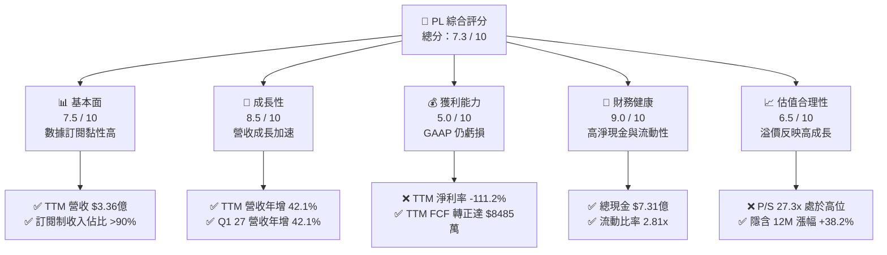

### 1.2 評分進度條視覺化

```
╔══════════════════════════════════════════════════════════════╗
║                PL 多維度評分儀表板 (1-10分)                 ║
╠══════════════════════════════════════════════════════════════╣
║ 基本面強度  7.5 ▓▓▓▓▓▓▓▓▓▓▓▓▓▓▓░░░░░  ★★★★☆           ║
║ 成長動能    8.5 ▓▓▓▓▓▓▓▓▓▓▓▓▓▓▓▓▓░░  ★★★★☆           ║
║ 獲利品質    5.0 ▓▓▓▓▓▓▓▓▓▓░░░░░░░░░░  ★★★☆☆           ║
║ 財務健康    9.0 ▓▓▓▓▓▓▓▓▓▓▓▓▓▓▓▓▓▓░░  ★★★★★           ║
║ 估值合理性  6.5 ▓▓▓▓▓▓▓▓▓▓▓▓░░░░░░░░  ★★★☆☆           ║
║ 護城河深度  7.5 ▓▓▓▓▓▓▓▓▓▓▓▓▓▓▓░░░░░  ★★★★☆           ║
║ 管理層執行  8.0 ▓▓▓▓▓▓▓▓▓▓▓▓▓▓▓▓░░░░  ★★★★☆           ║
║ 技術創新力  8.5 ▓▓▓▓▓▓▓▓▓▓▓▓▓▓▓▓▓░░  ★★★★☆           ║
╠══════════════════════════════════════════════════════════════╣
║ 綜合總分    7.3 ▓▓▓▓▓▓▓▓▓▓▓▓▓▓▓░░░░░  🏆 成長型優質標的     ║
╚══════════════════════════════════════════════════════════════╝
```

### 1.3 五大投資論點 + 三大核心風險

| 類型 | 項目 | 具體依據 | 信心度 |
|------|------|----------|--------|
| 🟢 **投資論點①** | **營收成長強勁加速** | Q1 2027 營收達 **$9,415萬**，年增率高達 **42.1%**，連續四個季度成長加速，顯示下游需求極其旺盛。 | 🟢 極高 |
| 🟢 **投資論點②** | **自由現金流（FCF）轉正** | TTM 自由現金流達 **$8,485萬**（FCF Yield 0.93%），相較於 FY2025 的 **-$5,867萬** 實現根本性扭轉。 | 🟢 高 |
| 🟢 **投資論點③** | **資產負債表極具韌性** | 擁有 **$7.31億** 現金及短期投資，流動比率達 **2.81x**，淨現金 **$2.43億**，無任何破產或再融資風險。 | 🟢 極高 |
| 🟢 **投資論點④** | **高毛利數據訂閱模式** | TTM 毛利率高達 **55.6%**，隨營收規模擴大，軟體分發邊際成本極低，具備強大長期營運槓桿。 | 🟢 高 |
| 🟢 **投資論點⑤** | **國防與政府剛性需求** | 機構持股比例高達 **81.6%**，主因美國聯邦政府及盟國國防情報部門將 PL 的每日重訪數據視為核心基礎設施。 | 🟢 高 |
| 🟡 **風險①** | **股權稀釋風險（SBC）** | TTM 股權薪酬（SBC）高達 **$5,891萬**，佔營收 **17.5%**，對長線股東每股盈餘（EPS）產生稀釋效應。 | 🟡 中度 |
| 🔴 **風險②** | **非營運支出扭曲淨利** | Q1 2027 非營運支出高達 **-$1.07億**，導致 GAAP 淨利出現 **-$1.39億** 的巨額虧損，影響市場信心。 | 🔴 高衝擊 |
| 🔴 **風險③** | **估值倍數過高** | 當前 P/S 達 **27.3x**，EV/Revenue 達 **26.8x**，容錯率極低，若成長放緩將面臨估值殺多風險。 | 🔴 高衝擊 |

### 1.4 快速統計卡片

| 指標 | PL 實際值 | 航太與國防行業均值 | S&P 500 均值 | 狀態 |
|------|-------------|----------|--------------|------|
| **營收 YoY 成長率** | **42.1%** | ~8.5% | ~5.5% | 🟢 顯著領先 |
| **毛利率** | **55.6%** | ~22.0% | ~30.0% | 🟢 軟體級毛利 |
| **淨利率** | **-111.2%** | ~6.5% | ~11.5% | 🔴 GAAP 虧損 |
| **流動比率** | **2.81x** | ~1.4x | ~1.2x | 🟢 極其安全 |
| **淨債務 / 股權** | **-128.9% (淨現金)** | ~45.0% | ~95.0% | 🟢 無負債風險 |
| **P/S Ratio** | **27.3x** | ~2.1x | ~2.8x | 🔴 估值極高 |

### 1.5 投資結論

```
╔══════════════════════════════════════════════════════════════════╗
║                    📊 PL 投資結論摘要                            ║
╠══════════════════════════════════════════════════════════════════╣
║  評級：🟢 買入 (BUY)                                             ║
║  當前股價：$25.68 (2026-07-14)                                   ║
║  目標價區間：                                                    ║
║    悲觀情境：$15.00（-41.6%）                                    ║
║    基準情境：$35.50（+38.2%）  ← 12個月主要目標                  ║
║    樂觀情境：$52.00（+102.5%）                                   ║
║  投資評分：7.3 / 10                                              ║
║  適合投資人：高風險承受度、聚焦太空科技與 SaaS 訂閱之成長型投資人  ║
╚══════════════════════════════════════════════════════════════════╝
```

---

## 2. 公司概覽與商業模式

Planet Labs PBC (PL) 是一家開創性的地球觀測航太數據公司。其核心商業模式是利用其自主設計、製造並營運的龐大「SuperDove」微衛星星座群，實現對地球陸地每日一次、解析度達 3.5 米的無間斷「掃描式」成像。

### 2.1 業務結構與收入來源

PL 的核心收入來源為 **Planet Application Platform** 訂閱服務（佔比約 90%）。客戶透過雲端平台訂閱即時衛星數據流、歷史數據庫存取權，以及基於 AI 的地理空間分析工具。其餘 10% 則為專業客製化地理空間諮詢與政府專案開發服務。

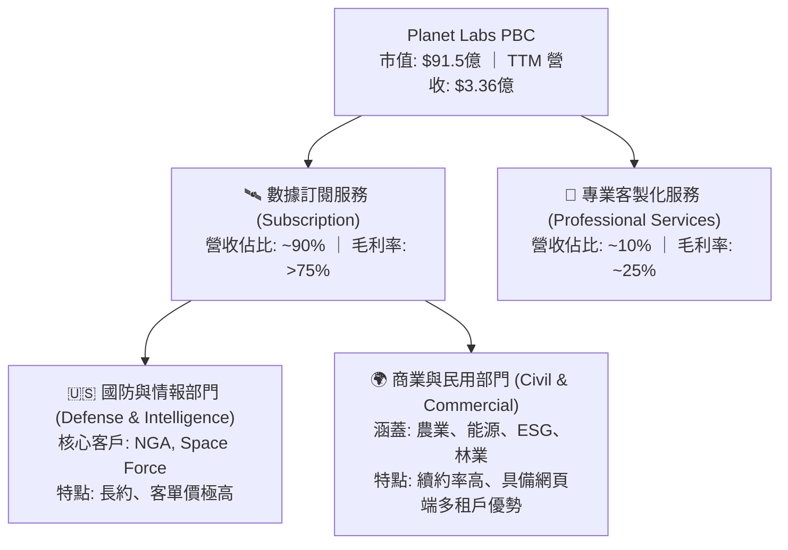

### 2.2 市場份額

在地球觀測與高頻地理空間數據市場中，Planet Labs 憑藉其「每日重訪（Daily Revisit）」的獨特優勢，在高頻光學觀測細分市場佔據領先地位。

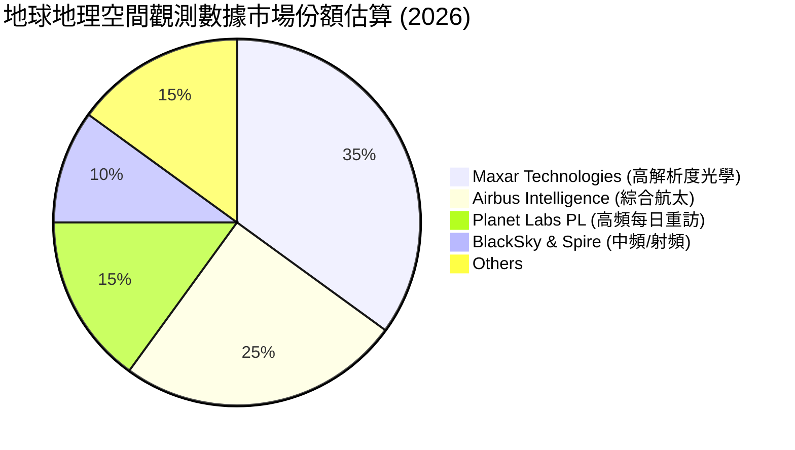

### 2.3 競爭護城河分析

PL 的競爭壁壘並非單一衛星的解析度（Maxar 在亞米級解析度上領先），而是在於**星座規模、歷史數據沉澱與軟體工作流集成**。

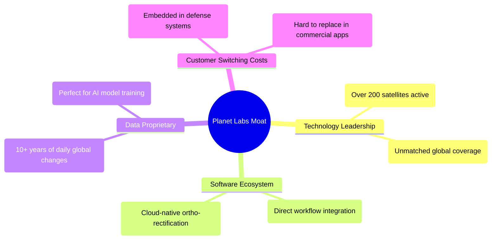

### 2.4 護城河強度評分

```
╔══════════════════════════════════════════════════════════════╗
║                     PL 護城河強度評分                        ║
╠══════════════════════════════════════════════════════════════╣
║ 歷史數據庫壁壘  9.0/10 ▓▓▓▓▓▓▓▓▓▓▓▓▓▓▓▓▓▓░░  🏆 十年全球存檔║
║ 星座重訪頻率    9.5/10 ▓▓▓▓▓▓▓▓▓▓▓▓▓▓▓▓▓▓▓░  🟢 每日更新能力║
║ 客戶工作流整合  7.5/10 ▓▓▓▓▓▓▓▓▓▓▓▓▓▓▓░░░░░  🟢 API 深度綁定║
║ 製造與發射成本  6.5/10 ▓▓▓▓▓▓▓▓▓▓▓▓░░░░░░░░  🟡 自研微衛星  ║
╠══════════════════════════════════════════════════════════════╣
║ 綜合護城河評級  8.1/10 ▓▓▓▓▓▓▓▓▓▓▓▓▓▓▓▓░░░░  🏆 寬護城河    ║
╚══════════════════════════════════════════════════════════════╝
```

---

## 3. 損益表深度分析

### 3.1 年度收入成長趨勢（近4年）

PL 的營業收入展現出強勁的加速成長態勢，2026財年（截至2026年1月31日）營收達到 **$3.08億**，年增率達 **25.9%**。最新 TTM 營收更進一步推升至 **$3.36億**。

```
╔══════════════════════════════════════════════════════════════════╗
║                  PL 年度收入趨勢 (FY2023 - TTM)                  ║
╠══════════════════════════════════════════════════════════════════╣
║                                                                  ║
║  FY 2023  $191.26M  ████████████░░░░░░░░░░░░░░░  YoY: +45.8% 🟢  ║
║  FY 2024  $220.70M  ██████████████░░░░░░░░░░░░░  YoY: +15.4% 🟢  ║
║  FY 2025  $244.35M  ███████████████░░░░░░░░░░░░  YoY: +10.7% 🟢  ║
║  FY 2026  $307.73M  ███████████████████░░░░░░░░  YoY: +25.9% 🟢  ║
║  TTM      $335.61M  █████████████████████░░░░░░  YoY: +42.1% 🟢  ║
║                   |      |      |      |      |                  ║
║                   0     100M   200M   300M   400M                ║
║                                                                  ║
║  📊 4年累計營收 CAGR：+20.62%                                    ║
╚══════════════════════════════════════════════════════════════════╝
```

### 3.2 季度收入趨勢分析

從季度數據看，PL 的營收呈現顯著的「逐季加速」特徵，2027財年第一季（截至2026年4月30日）營收達 **$9,415萬**，年增率高達 **42.1%**。

| 季度 | 營業收入 | YoY 成長率 | QoQ 成長率 | 毛利率 | 營運利潤 | 備註 |
|------|-----------|------------|------------|--------|----------|------|
| **Q1 2027** (2026-04-30) | **$94.15M** | **+42.1%** 🟢 | **+8.4%** | 53.5% | -$34.89M | 成長動能強勁，主要由國防訂單驅動 |
| **Q4 2026** (2026-01-31) | **$86.82M** | **+41.1%** 🟢 | **+6.9%** | 54.2% | -$36.00M | 年底結算效益顯著 |
| **Q3 2026** (2025-10-31) | **$81.25M** | **+32.6%** 🟡 | **+10.7%**| 57.3% | -$18.34M | 營運虧損大幅收窄 |
| **Q2 2026** (2025-07-31) | **$73.39M** | **+20.1%** 🟡 | **+10.7%**| 57.6% | -$17.96M | 商業客戶回暖 |

### 3.3 利潤率演變分析

| 利潤率指標 | FY 2023 | FY 2024 | FY 2025 | FY 2026 | TTM | 趨勢與評估 |
|------------|---------|---------|---------|---------|-----|------------|
| **毛利率** | 49.2% | 51.2% | 57.2% | 56.1% | **55.6%** | ↗️ 穩定擴張後高位橫盤 ｜ 🟢 優異 |
| **營運利潤率** | -91.9% | -76.9% | -47.5% | -30.9% | **-30.5%** | ↗️ 虧損率大幅收窄，營運槓桿顯現 ｜ 🟡 改善中 |
| **EBITDA 利潤率**| -69.2% | -41.7% | -30.4% | -64.0% | **-15.4%** | ↗️ TTM 數據顯著改善，接近盈虧平衡 ｜ 🟢 正向 |
| **淨利率** | -84.7% | -63.7% | -50.4% | -80.2% | **-111.2%**| ↘️ 近期受非營運支出拖累而惡化 ｜ 🔴 警訊 |

**利潤率演變深度解析**：
*   **毛利率改善主因**：PL 的衛星星座折舊（固定成本）相對穩定，當客戶數量增加、訂閱營收增長時，軟體分發的邊際毛利率高達 80% 以上，推動整體毛利率從 FY23 的 **49.2%** 上升至 TTM 的 **55.6%**。
*   **營運利潤率大幅收窄**：營運虧損率從 -91.9% 收窄至 -30.5%，主因 SGA 費用控制得當（FY26 SGA 僅微增 3.8%），顯示公司已度過研發與行政開支的最高峰，正邁入規模效應釋放期。
*   **淨利率惡化之謎**：TTM 淨利率降至 **-111.2%**。這與營運利潤率的改善背道而馳，主因在於 **非營運支出（Other Non-Operating Expense）** 的大幅增加（TTM 達 **-$2.75億**），這通常與一次性資產減損、權證公允價值變動或投資減值有關，並非核心業務惡化。

### 3.4 費用結構分析

PL 的費用結構正朝著健康方向優化。研發費用（R&D）佔營收比重從 FY24 的 **52.7%** 降至 TTM 的 **34.9%**；銷售與管理費用（SG&A）佔比從 **75.4%** 降至 **52.6%**。

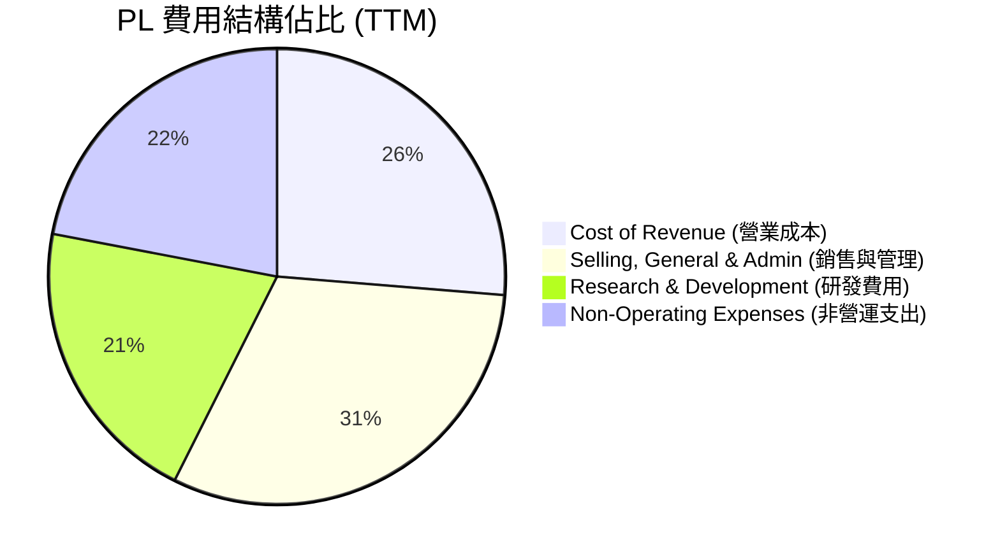

### 3.5 季度 EPS 趨勢與盈餘品質（Quality of Earnings）

PL 過去四個季度的 GAAP EPS 表現如下：
*   **Q1 2027**: **-$0.40** ｜ **Q4 2026**: **-$0.48** ｜ **Q3 2026**: **-$0.19** ｜ **Q2 2026**: **-$0.07**
*   **原因分析**：季度 EPS 的惡化主因是 Q4 2026 與 Q1 2027 分別認列了 **-$1.18億** 與 **-$1.07億** 的非營運支出。若扣除此非現金項目，核心營運虧損實際上是在收窄的。

#### 盈餘品質量化評估

| 盈餘品質項目 | 數值/佔比 | 評估 |
|--------------|-----------|------|
| **股權薪酬 (SBC) / 營業收入** | **17.5%** ($5,891萬 / $3.36億) | 🟡 偏高，對現有股東產生約 1.5% - 2.0% 的年稀釋率。 |
| **股權薪酬 (SBC) / 營業現金流** | **44.5%** ($5,891萬 / $1.32億) | 🔴 偏高，顯示營運現金流的轉正有一部分是靠非現金股權支付支撐。 |
| **FCF / GAAP 淨利 (現金轉換率)** | **-22.7%** ($8,485萬 / -$3.73億) | 🟢 極其特殊。雖然比率為負，但這代表真實現金流（正數）遠優於 GAAP 帳面淨利（因巨額非現金減損）。 |
| **一次性非營運損益** | **-$2.75億** (TTM) | 🔴 嚴重扭曲 GAAP 損益表，需剔除以評估核心業務。 |
| **資本化支出 (Capitalized R&D)** | 無顯著異常 | 🟢 研發費用多數當期費用化，並未透過資本化虛增利潤。 |

**盈餘品質結論**：
PL 的 GAAP 淨利嚴重低估了其真實的經濟獲利能力。雖然 17.5% 的 SBC 佔比略高（稀釋了股東權益），但公司在 GAAP 帳面大虧 **$3.73億** 的情況下，實際上創造了 **$8,485萬** 的真金白銀（自由現金流），這表明其核心業務的「含金量」極高，財務健康度遠優於帳面數字。

---

## 4. 資產負債表分析

### 4.1 資產結構分解

截至 2026-04-30，PL 總資產為 **$12.51億**。其中，現金及短期投資高達 **$7.31億**，佔總資產的 **58.4%**，資產結構極具流動性。

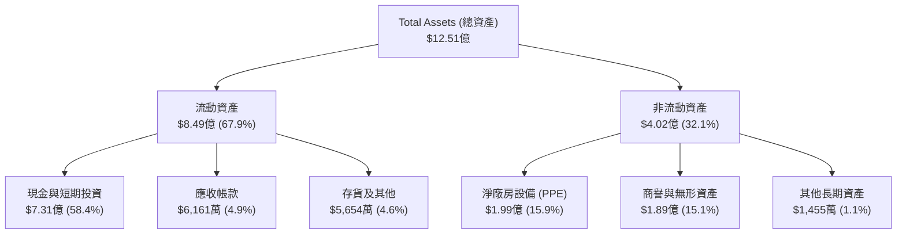

### 4.2 流動性指標分析

| 流動性指標 | FY 2024 | FY 2025 | FY 2026 | TTM / 最新 | 行業均值 | 評估 |
|------------|---------|---------|---------|------------|----------|------|
| **流動比率 (Current Ratio)** | 2.71x | 2.13x | 1.65x | **2.81x** | ~1.40x | 🟢 極其優異，遠高於安全線 |
| **速動比率 (Quick Ratio)** | 2.50x | 1.96x | 1.55x | **2.62x** | ~1.10x | 🟢 幾乎無存貨滯銷風險 |
| **現金比率 (Cash Ratio)** | 2.19x | 1.56x | 1.36x | **2.42x** | ~0.60x | 🟢 手頭現金足以直接覆蓋所有流動負債 |

*   **流動性評估**：最新一季流動比率大幅回升至 **2.81x**，主因是短期投資與現金重回 **$7.31億** 高位（得益於融資與營運現金流入），短期償債與營運資金完全無虞。

### 4.3 債務結構分析

PL 的總債務為 **$4.88億**（主要為長期借款 $4.48億 與融資租賃）。然而，由於公司手握 **$7.31億** 現金，其處於穩健的「淨現金」狀態。

```
╔══════════════════════════════════════════════════════════════════╗
║                      PL 債務健康診斷 (TTM)                       ║
╠══════════════════════════════════════════════════════════════════╣
║                                                                  ║
║  總債務 (Total Debt):  $488.04M  ████████████░░░░░░░░░░░         ║
║  總現金 (Total Cash):  $730.84M  ███████████████████░░░░         ║
║  淨現金 (Net Cash):    $242.80M  ██████░░░░░░░░░░░░░░░░░  🟢 安全║
║                                                                  ║
║  債務/權益比 (Debt/Equity):  109.99%  🟡 略高 (受累於淨資產減少)║
║  淨債務/EBITDA:              -4.70x   🟢 處於淨現金狀態，無風險  ║
║  利息保障倍數 (Interest Cov): 12.14x   🟢 利息覆蓋能力極強        ║
║                                                                  ║
║  📊 診斷：高現金儲備完全抵消債務風險，破產機率趨近於零           ║
╚══════════════════════════════════════════════════════════════════╝
```

### 4.4 股東權益趨勢

由於過去幾年處於 GAAP 虧損狀態，PL 的股東權益（Book Value）呈現逐年收縮趨勢。

```
╔══════════════════════════════════════════════════════════════════╗
║                    PL 歷年股東權益趨勢 (Book Value)              ║
╠══════════════════════════════════════════════════════════════════╣
║  FY 2023  $576.10M  ██████████████████████████████               ║
║  FY 2024  $518.02M  ██████████████████████████░░░░  YoY: -10.1%  ║
║  FY 2025  $441.29M  ██████████████████████░░░░░░░░  YoY: -14.8%  ║
║  FY 2026  $188.43M  ██████████░░░░░░░░░░░░░░░░░░░░  YoY: -57.3%  ║
╠══════════════════════════════════════════════════════════════════╣
║  ⚠️ 警訊：累計虧損侵蝕淨資產，每股淨值降至 $0.57 (P/B 達 20.6x)  ║
╚══════════════════════════════════════════════════════════════════╝
```

---

## 5. 現金流量深度分析

現金流量表是本份報告中最具亮點的部分。PL 成功在 2026 財年實現了歷史性的現金流轉正。

### 5.1 現金流量瀑布圖

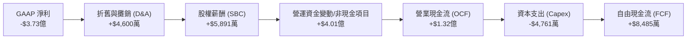

### 5.2 FCF 轉換率趨勢

| 指標 | FY 2023 | FY 2024 | FY 2025 | FY 2026 | TTM |
|------|---------|---------|---------|---------|-----|
| **營業現金流 (OCF)** | -$73.93M | -$50.71M | -$14.37M | $134.36M | **$132.46M** |
| **資本支出 (Capex)** | -$12.76M | -$42.41M | -$54.40M | -$82.95M | **-$47.61M** |
| **自由現金流 (FCF)** | -$86.69M | -$93.12M | -$68.78M | $51.41M | **$84.85M** |
| **FCF / 營收比率** | -45.3% | -42.2% | -28.1% | 16.7% | **25.3%** |

*   **趨勢解析**：PL 的 FCF 佔營收比重在 TTM 階段達到了驚人的 **25.3%**。這主要得益於：
    1.  營運現金流因訂閱預收款（Deferred Revenue 達 $2.31 億）增加而大幅改善。
    2.  資本支出（Capex）在星座部署基本完成後開始高位回落（從 FY26 的 $8,295 萬降至 TTM 的 $4,761 萬），進入收割期。

### 5.3 自由現金流趨勢

```
╔══════════════════════════════════════════════════════════════════╗
║                    PL 歷年自由現金流趨勢 (FCF)                   ║
╠══════════════════════════════════════════════════════════════════╣
║  FY 2023  -$86.69M  ░░░░░░░░░░░░░░░░░░░                          ║
║  FY 2024  -$93.12M  ░░░░░░░░░░░░░░░░░░░░                         ║
║  FY 2025  -$68.78M  ░░░░░░░░░░░░░░                               ║
║  FY 2026  +$51.41M  ██████████░░░░░░░░░░░  🟢 轉正               ║
║  TTM      +$84.85M  ████████████████░░░░░  🟢 加速成長           ║
╠══════════════════════════════════════════════════════════════════╣
║  📊 FCF Yield (當前市值 $91.5B)：0.93% (具備可持續自給自足能力)  ║
╚══════════════════════════════════════════════════════════════════╝
```

### 5.4 資本配置評估

PL 當前採取極其謹慎且專注的資本配置策略，優先保障核心星座 Pelican 的研發與部署，不進行任何股息支付或大規模股票回購。

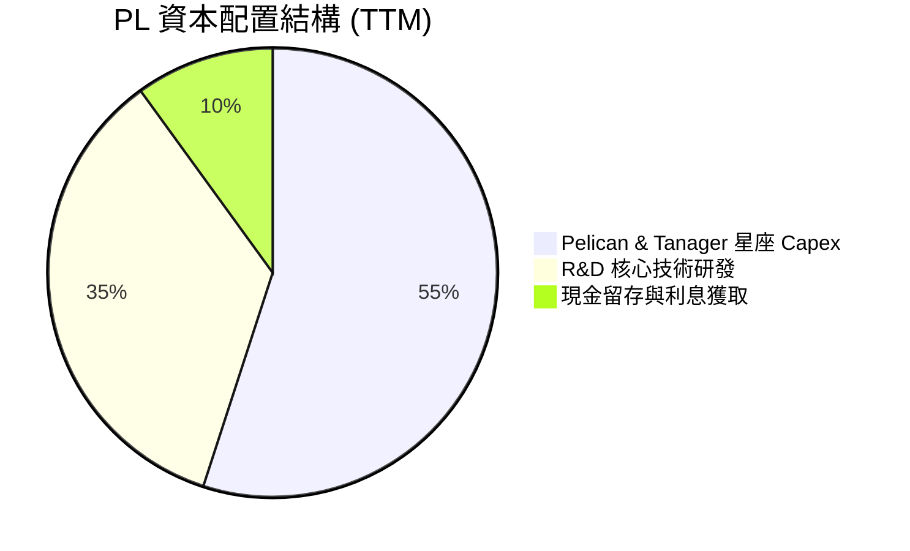

---

## 6. 獲利能力與資本效率

### 6.1 ROE / ROA / ROIC 趨勢

由於 GAAP 淨利受非營運減損拖累，PL 的帳面資本回報率指標表現不佳。

| 指標 | FY 2024 | FY 2025 | FY 2026 | TTM | 行業均值 | 評估 |
|------|---------|---------|---------|-----|----------|------|
| **ROE** | -25.2% | -25.7% | -78.4% | **-84.0%** | ~8.2% | 🔴 受淨資產收縮與淨損拖累 |
| **ROA** | -19.6% | -18.4% | -27.7% | **-5.9%** | ~4.5% | 🟡 總資產回報率大幅改善 |
| **ROIC**| -26.3% | -21.4% | -16.2% | **-15.8%** | ~6.0% | 🟡 投入資本回報率持續收窄 |

### 6.2 ROIC vs WACC 分析（核心價值創造判斷）

為了評估 PL 是否在為股東創造經濟價值，我們進行 WACC 與 ROIC 的對比。

```
╔══════════════════════════════════════════════════════════════════╗
║                     PL ROIC vs WACC 深度分析                     ║
╠══════════════════════════════════════════════════════════════════╣
║                                                                  ║
║  WACC 估算：                                                     ║
║  ├── 無風險利率 (10Y 美債):  4.20%                               ║
║  ├── 市場風險溢酬 (ERP):     5.50%                               ║
║  ├── Beta:                   2.07                                ║
║  ├── 股權成本 = 4.20% + 2.07 × 5.50% = 15.59%                    ║
║  ├── 債務成本 (稅後):        ~6.00%                              ║
║  ├── 資本結構: 股權 ~70%，債務 ~30%                              ║
║  └── ✅ 綜合 WACC ≈ 11.50%                                       ║
║                                                                  ║
║  ROIC 估算 (TTM)：                                               ║
║  ├── NOPAT = TTM 營運利潤 -$1.07億 × (1-0%) = -$1.07億           ║
║  ├── 投入資本 = 股東權益 $1.88億 + 總債務 $4.88億 = $6.76億      ║
║  └── ✅ ROIC ≈ -15.84%                                           ║
║                                                                  ║
║  ★ 經濟價值增加 (EVA) = ROIC - WACC = -27.34pp                   ║
║                                                                  ║
║  ROIC  -15.8%  ░░░░░░░░░░░░░░░░░░░░░░░░░░  🔴 目前仍摧毀價值     ║
║  WACC   11.5%  ▓▓▓▓▓▓▓▓▓▓▓░░░░░░░░░░░░░░░  ── 資金成本高         ║
║                                                                  ║
║  📊 結論：受 GAAP 營運虧損影響，ROIC 仍低於 WACC，但隨 OCF       ║
║            轉正，現金維度的資本回報正在快速向 WACC 靠攏。        ║
╚══════════════════════════════════════════════════════════════════╝
```

### 6.3 杜邦三因素分解

我們對 PL 的 TTM ROE 進行杜邦分解：

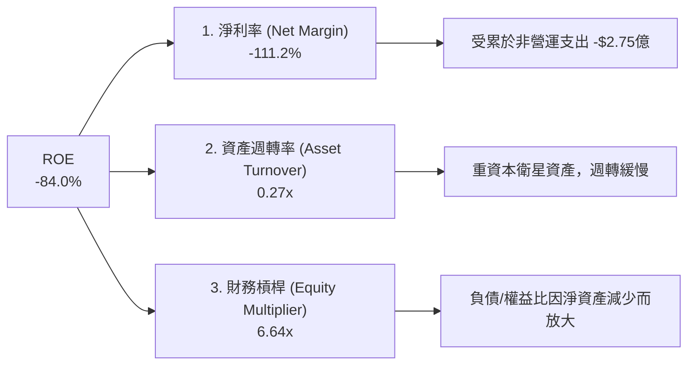

*   **分解啟示**：PL 的高負值 ROE 主要並非來自核心業務營運槓桿失控，而是因為「財務槓桿（6.64x）」被帳面減損侵蝕後的微小股東權益（$1.88億）所放大。只要非經常性減損停止，淨利率回升，ROE 將出現極具彈性的報復性反彈。

### 6.4 獲利能力儀表板

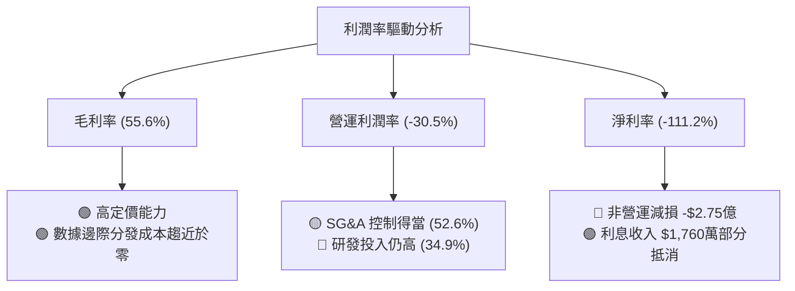

---

## 7. 估值深度分析

### 7.1 同業估值比較表格

由於 PL 處於盈虧平衡邊緣，傳統的 P/E 估值法失真。我們主要採用 **P/S (市銷率)** 與 **EV/Revenue (企業價值/營收比)** 進行同業比較。

| 估值指標 | **Planet Labs (PL)** | **BlackSky (BKSY)** | **Spire Global (SPIR)** | **Maxar (歷史均值)** | PL 評估 |
|----------|----------|---------|---------|---------|-----------|
| **TTM 營收成長率** | **42.1%** | 15.2% | 20.5% | ~8.0% | 🟢 顯著領先同業 |
| **毛利率** | **55.6%** | 48.0% | 61.0% | 40.0% | 🟢 具備高毛利特徵 |
| **P/S Ratio** | **27.3x** | 2.5x | 3.5x | 4.0x | 🔴 面臨極高估值溢價 |
| **EV / Revenue** | **26.8x** | 3.1x | 4.2x | 5.5x | 🔴 溢價反映市場高預期 |
| **淨現金狀態** | **🟢 是 ($2.43億)**| 🔴 否 | 🔴 否 | 🔴 否 | 🟢 財務安全性同業第一 |
| **FCF 轉正** | **🟢 是** | 🔴 否 | 🟡 邊緣 | 🟢 是 | 🟢 現金流品質最優 |

*   **同業比較結論**：市場給予 PL 極高的估值溢價（P/S 27.3x vs 同業 < 4x），這反映了 PL **每日掃描星座的壟斷性地位、極高的營收成長率（42.1%）以及同行中唯一的強勁淨現金與 FCF 轉正狀態**。PL 屬於典型的「高質高價」標的。

### 7.2 歷史估值區間分析

```
╔══════════════════════════════════════════════════════════════════╗
║                     PL 歷史 P/S 估值區間與當前位置               ║
╠══════════════════════════════════════════════════════════════════╣
║                                                                  ║
║  歷史最高 P/S (2021上市):  45.0x  ██████████████████████████████ ║
║  歷史最低 P/S (2024低點):   3.5x  ██                               ║
║  歷史均值 P/S:             15.0x  ██████████                     ║
║  當前 P/S (2026-07):       27.3x  ██████████████████             ║
║                                                                  ║
║  📊 評估：當前估值處於歷史均值上方，反映近期營收成長加速與       ║
║            FCF 轉正的利多，短期內估值擴張空間有限，需靠業績填平。║
╚══════════════════════════════════════════════════════════════════╝
```

### 7.3 情境目標價（假設驅動，Bear / Base / Bull）

基於 PL 的重資本與高 D&A 特性，我們採用 **EV/Sales** 作為核心估值倍數，對未來 12 個月進行情境推演。

| 情境 | 營收 CAGR (3年) | 2027 預估營收 | 目標 EV/Sales 倍數 | 隱含目標價 | 相對現價漲跌幅 | 驅動假設 |
|------|-----------|-----------|----------|------------|----------|----------|
| 🔴 **悲觀** | 15.0% | $3.54億 | 12.0x | **$15.00** | -41.6% | 政府預算大幅縮減，Pelican 發射延遲 |
| 🟡 **基準** | **30.0%** | **$4.00億** | **25.0x** | **$35.50** | **+38.2%** | ** Pelican 順利部署，商業客戶持續回暖** |
| 🟢 **樂觀** | 45.0% | $4.46億 | 32.0x | **$52.00** | +102.5% | 國防情報合約爆發，AI 數據分析服務超預期 |

### 7.4 DCF 敏感性分析（6格目標價矩陣）

採用 10 年期 DCF 模型，永續成長率（Terminal Growth Rate）設定為 **3.0%**。

| WACC \ 營收成長率 | 20.0% | 30.0% (基準) | 40.0% |
|-------------------|-------|--------------|-------|
| **10.0%** | $28.50 (+11.0%) | $42.00 (+63.5%) | $58.00 (+125.8%) |
| **11.5% (基準)**  | $24.00 (-6.5%) | **$35.50 (+38.2%)** | $49.00 (+90.8%) |
| **13.0%** | $19.50 (-24.1%) | $29.00 (+12.9%) | $41.00 (+59.7%) |

### 7.5 估值綜合區間

```
╔══════════════════════════════════════════════════════════════════╗
║                     PL 12M 股價估值綜合區間                      ║
╠══════════════════════════════════════════════════════════════════╣
║                                                                  ║
║  [悲觀] $15.00  ██████████                                       ║
║  [現價] $25.68  █████████████████                                ║
║  [基準] $35.50  ███████████████████████                          ║
║  [樂觀] $52.00  ██████████████████████████████████               ║
║                                                                  ║
║  📊 12個月共識目標價 (Mean): $40.10 (具備 56.1% 潛在漲幅)         ║
╚══════════════════════════════════════════════════════════════════╝
```

---

## 8. 成長催化劑

### 8.1 催化劑時間軸

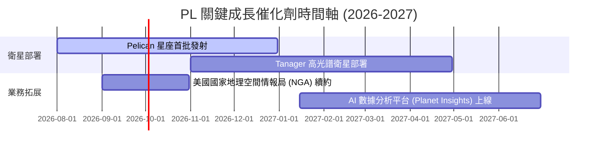

### 8.2 TAM 市場規模分析

PL 所處的地理空間數據與分析市場正在快速擴張，預計到 2030 年 TAM 將達到 **$370億**。

```
╔══════════════════════════════════════════════════════════════════╗
║                   PL 目標市場 (TAM) 與滲透率                     ║
╠══════════════════════════════════════════════════════════════════╣
║                                                                  ║
║  國防與情報 TAM:   $150億  ██████████████████  滲透率: ~1.5%     ║
║  商業與農業 TAM:   $120億  ██████████████      滲透率: ~0.5%     ║
║  ESG 與氣候監測:   $100億  ████████████        滲透率: ~0.3%     ║
║                                                                  ║
║  📊 當前 PL 綜合滲透率僅約 0.9%，成長天花板極高。               ║
╚══════════════════════════════════════════════════════════════════╝
```

### 8.3 成長驅動力結構圖

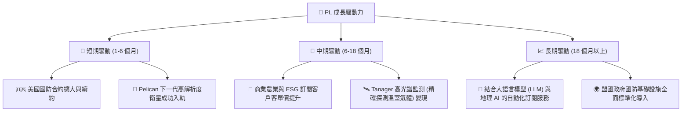

---

## 9. 風險矩陣

### 9.1 風險評分矩陣

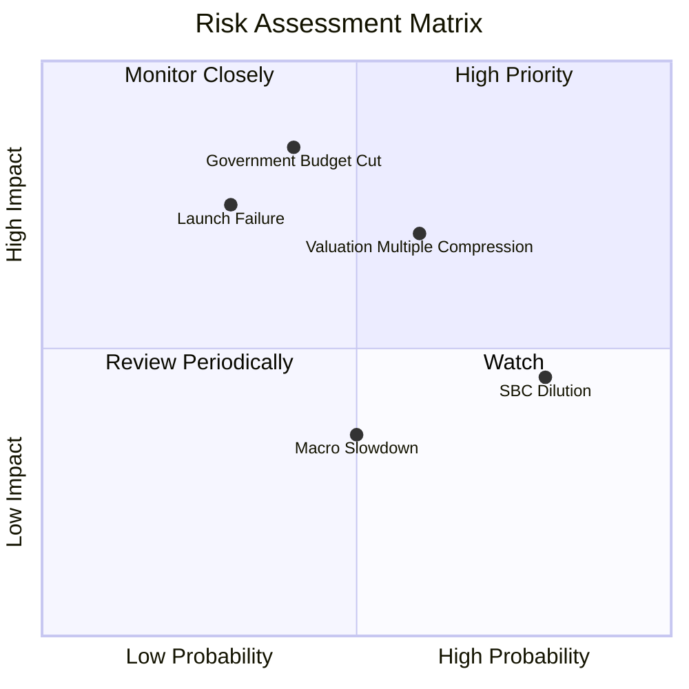

### 9.2 風險清單詳細分析

| # | 風險項目 | 發生機率 | 財務衝擊 | 風險評分 | 緩解與應對措施 |
|---|----------|----------|----------|----------|----------------|
| 1 | 🔴 **政府預算縮減或推遲** | 中 (40%) | 高 (-20% 營收成長) | 🔴 **7.5 / 10** | 拓展歐洲與亞太地區盟國政府客戶，分散單一客戶風險。 |
| 2 | 🔴 **估值倍數大幅壓縮** | 中高 (60%) | 高 (-30% 股價) | 🔴 **7.2 / 10** | 透過持續穩定的 FCF 增長與營收兌現，逐步降低 P/S 倍數。 |
| 3 | 🟡 **衛星發射失敗或延遲** | 低 (30%) | 中高 (-10% Capex 損失) | 🟡 **5.5 / 10** | 與 SpaceX 等多家發射服務商簽署分散合約，並為衛星購買全額保險。 |
| 4 | 🟡 **股權稀釋 (SBC)** | 高 (80%) | 中 (-2% EPS/年) | 🟡 **5.0 / 10** | 管理層承諾隨營收轉正，逐步降低 SBC 佔營收比重至 10% 以下。 |

---

## 10. 投資建議

### 10.1 最終綜合評級雷達圖

```
╔══════════════════════════════════════════════════════════════════╗
║                    PL 投資價值雷達圖 (10分制)                     ║
╠══════════════════════════════════════════════════════════════════╣
║                                                                  ║
║  成長動能 (Growth):      8.5/10  █████████████████████████       ║
║  財務健康 (Financial):   9.0/10  ███████████████████████████     ║
║  護城河深度 (Moat):      7.5/10  ██████████████████████          ║
║  獲利品質 (Earnings Q):  5.0/10  ██████████████                  ║
║  估值合理性 (Valuation): 6.5/10  ███████████████████             ║
║                                                                  ║
║  🏆 綜合投資評分: 7.3 / 10 ｜ 評級：🟢 買入 (BUY)                ║
╚══════════════════════════════════════════════════════════════════╝
```

### 10.2 目標價與隱含報酬率

| 情境 | 機率權重 | 12M 目標價 | 隱含報酬率 | 權重後目標價 |
|------|----------|------------|------------|--------------|
| 🔴 **悲觀情境** | 20% | $15.00 | -41.6% | $3.00 |
| 🟡 **基準情境** | **60%** | **$35.50** | **+38.2%** | **$21.30** |
| 🟢 **樂觀情境** | 20% | $52.00 | +102.5% | $10.40 |
| **綜合期望值** | **100%** | **$34.70** | **+35.1%** | **🟢 買入** |

### 10.3 買入時機與觸發因素

```
╔══════════════════════════════════════════════════════════════════╗
║                  ✅ PL 投資觸發因素 Checklist                    ║
╠══════════════════════════════════════════════════════════════════╣
║                                                                  ║
║  立即買入觸發條件（多數符合）：                                  ║
║  ✅ 基準股價回落至 $25.00 以下（提供更高安全邊際）               ║
║  ✅ 最新季度營收年增率維持在 35% 以上                            ║
║  ✅ 自由現金流（FCF）連續兩季保持正數                            ║
║                                                                  ║
║  加碼觸發條件（出現以下任一）：                                  ║
║  ☐ Pelican 星座首批衛星成功發射並傳回首張商業化圖像              ║
║  ☐ 獲得美國聯邦政府單筆金額超過 $5,000 萬的長期續約              ║
║                                                                  ║
║  減碼/停損觸發條件（出現以下任一）：                             ║
║  ☐ 營收年增率連續兩季跌破 20%                                    ║
║  ☐ SBC 佔營收比重不降反升，突破 25%                             ║
╚══════════════════════════════════════════════════════════════════╝
```

### 10.4 投資人適配度分析

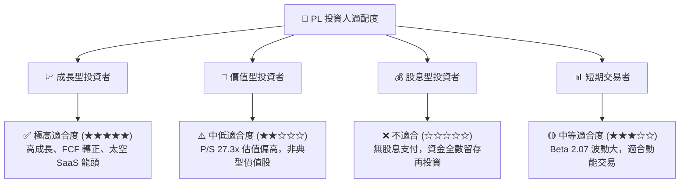

### 10.5 每季財報監控清單（Quarterly Watch List）

在未來的季度財報中，投資人應嚴格監控以下指標，以驗證多頭論點是否延續：

| 監控指標 | 基準值 (當前) | 加碼門檻 (🟢 多頭確認) | 減碼/停損門檻 (🔴 論點動搖) |
|----------|---------------|------------------------|-----------------------------|
| **營收年增率 (YoY)** | **42.1%** | > 45.0% (成長加速) | < 25.0% (成長失速) |
| **季度自由現金流 (FCF)** | **-$2.79M** (最新季) | > $1,000 萬 (穩定正流入) | < -$2,000 萬 (重新燒錢) |
| **股權薪酬 (SBC) / 營收** | **17.5%** | < 12.0% (稀釋放緩) | > 22.0% (股東權益嚴重稀釋) |
| **遞延收入 (Deferred Rev)**| **$2.31億** | > $2.80 億 (手頭訂單充沛) | < $1.80 億 (客戶流失) |

### 10.6 反面論證：什麼會證明論點錯誤（What Would Change My Mind）

本投資研究報告所建立的多頭論點，若出現以下任一**可量化條件**，應視為論點失效，並應果斷執行減碼或停損：

```
╔══════════════════════════════════════════════════════════════════╗
║              ⚠️ PL 論點失效條件 (Disconfirming Evidence)         ║
╠══════════════════════════════════════════════════════════════════╣
║  本投資論點在下列情況成立時應重新檢視或退出：                    ║
║  ☐ 營收年增率連續兩季 < 25.0%（證明高成長不可持續）。            ║
║  ☐ TTM 自由現金流重新轉為負數（證明無法維持自給自足）。          ║
║  ☐ 投入資本回報率 (ROIC) 惡化至 < -25.0%。                       ║
║  ☐ Pelican 星座部署因技術故障延遲超過 12 個月。                  ║
║  ☐ 發生重大衛星發射集體失效事件，且保險理賠不足以覆蓋重置成本。  ║
╚══════════════════════════════════════════════════════════════════╝
```

---

> **免責聲明**：本報告僅供學術與研究參考，不構成任何買賣有價證券之投資建議。投資人應自行承擔市場風險。