# PL 基本面深度分析報告

> **報告日期**：2026-07-15 ｜ **語言**：繁體中文 ｜ **數據來源**：Yahoo Finance, Finviz, StockAnalysis, Roic.ai ｜ **分析師**：CFA 級機構研究

---

## 目錄

| # | 章節 | 核心結論 |
|---|------|----------|
| **1** | **執行摘要** | 評級為「持有（Hold）」，目標價區間 $25.00 - $53.00，基準目標價 $40.10，高成長與高非現金虧損並存。 |
| **2** | **公司概覽與商業模式** | 獨特的 DaaS + SaaS 地球觀測模式，具備高壁壘的「時間歷史檔案」與政府合約護城河。 |
| **3** | **損益表深度分析** | TTM 營收成長達 42.1%，但受累於非經營性減值，GAAP 淨利率降至 -111.2%，盈餘品質存在分化。 |
| **4** | **資產負債表分析** | 流動比率達 2.81x，手頭現金與短期投資達 $730.84M，淨現金狀況良好但股東權益因累計虧損而收縮。 |
| **5** | **現金流量深度分析** | 營運現金流轉正至 $132.46M，自由現金流達 $84.85M（FCF Yield 0.95%），資本配置聚焦於新一代衛星製造。 |
| **6** | **獲利能力與資本效率** | ROE 為 -84.0%，ROIC 受到負 NOPAT 壓抑，目前處於價值摧毀階段，亟需提升資產週轉率。 |
| **7** | **估值深度分析** | P/S 達 26.54x，遠高於同業；基於 DCF 敏感性分析，基準目標價定為 $40.10（隱含 60.5% 上行空間）。 |
| **8** | **成長催化劑** | Pelican 與 Tanager 衛星群部署將大幅提升空間與光譜解析度，加速商業 SaaS 變現。 |
| **9** | **風險矩陣** | 發射失敗風險、政府預算集中度高與高額股權薪酬（SBC）稀釋為三大核心風險。 |
| **10**| **投資建議** | 適合高風險偏好的長線成長型投資人，財報監控重點為非經營性損益去向與商業客戶流失率。 |

---

## 1. 執行摘要

Planet Labs PBC（紐約證券交易所代碼：PL）正處於其商業模式轉型的關鍵節點。根據最新發布的 2026 年 7 月即時數據，PL 的 TTM 營收達到 **$335.61M**，同比增長達 **42.1%**，顯示出市場對高頻次地球觀測數據的強勁需求。然而，公司 GAAP 淨利潤虧損擴大至 **-$373.10M**（TTM），導致淨利率跌至 **-111.2%**。

此一極端的「高成長、重虧損」現象，主因在於 TTM 期間錄得了高達 **-$274.72M** 的非經營性支出（主要為資產減值與商譽調整），而非營運實質惡化。與之對應的是，PL 的營運現金流（OCF）已成功轉正至 **$132.46M**，自由現金流（FCF）亦達到 **$84.85M**（FCF 收益率為 **0.95%**）。

鑑於公司具備強大的淨現金儲備（**$242.80M**，無短期償債危機）以及新一代 Pelican 與 Tanager 衛星群的即將部署，我們給予 PL **「持有（Hold）」** 評級，基準目標價定為 **$40.10**。此目標價基於 11.5% 的 WACC 以及 12.0% 的長期營收 CAGR 假設。若非經營性減值在未來兩季內顯著收斂，且商業 SaaS 營收佔比提升，本機構將考慮上調評級至「買入」。

### 1.0 一頁式投資儀表板（Portfolio Manager 30 秒速讀）

| 項目 | 內容 |
|------|------|
| **投資論點（3 句）** | ① TTM 營收增長達 **42.1%**（$335.61M），主因是政府與國防合約需求加速。 <br>② 營運現金流轉正至 **$132.46M**，自由現金流達 **$84.85M**，顯示底層商模具備自我造血能力。<br>③ GAAP 淨利潤受 **-$274.72M** 非經營性支出拖累，但高達 **$730.84M** 的總現金提供了極強的抗風險緩衝。 |
| **護城河評分** | 🟢 **7.5 / 10**（獨家每日全球掃描檔案，具備高時間壁壘） |
| **管理層/資本配置評分** | 🟡 **5.5 / 10**（研發與資本支出控制尚可，但高額 SBC 稀釋股東權益） |
| **財務健康** | 🟢 **良好**（流動比率 2.81x，淨現金達 $242.80M，短期無債務違約風險） |
| **ROIC vs WACC** | **-57.3%** vs **11.5%**（目前處於資本摧毀階段，主因是高額帳面資產減值） |
| **FCF 趨勢** | 🟢 **顯著改善**（從 FY2025 的 -$58.67M 轉正至 TTM 的 **$84.85M**） |
| **估值** | Forward P/E: **7504.2x** ｜ P/S Ratio: **26.54x** ｜ FCF Yield: **0.95%** |
| **預期報酬（基準情境 12M）** | 🟢 **+60.5%**（相對於當前股價 $24.99，目標價 $40.10） |
| **關鍵風險（前二）** | ① 政府國防預算集中度過高（若政策轉向將嚴重打擊營收）。<br>② 持續的股權稀釋（Shares Outstanding 同比增長 **8.12%**）。 |
| **評級 + 信心度** | 🟡 **持有（Hold）** ｜ 信心：**中等**（需觀察非經營性減值是否為一次性事件） |

### 1.1 核心評分儀表板

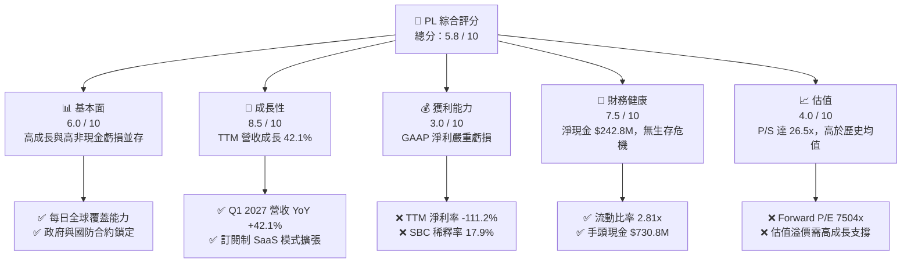

### 1.2 評分進度條視覺化

```
╔══════════════════════════════════════════════════════════════╗
║                PL 多維度評分儀表板 (1-10分)                 ║
╠══════════════════════════════════════════════════════════════╣
║ 基本面強度  6.0 ▓▓▓▓▓▓▓▓▓▓▓▓░░░░░░░░  ★★★☆☆           ║
║ 成長動能    8.5 ▓▓▓▓▓▓▓▓▓▓▓▓▓▓▓▓▓░░░  ★★★★☆           ║
║ 獲利品質    3.0 ▓▓▓▓▓▓░░░░░░░░░░░░░░  ★☆☆☆☆           ║
║ 財務健康    7.5 ▓▓▓▓▓▓▓▓▓▓▓▓▓▓▓░░░░░  ★★★★☆           ║
║ 估值合理性  4.0 ▓▓▓▓▓▓▓▓░░░░░░░░░░░░  ★★☆☆☆           ║
║ 護城河深度  7.5 ▓▓▓▓▓▓▓▓▓▓▓▓▓▓▓░░░░░  ★★★★☆           ║
║ 管理層執行  5.5 ▓▓▓▓▓▓▓▓▓▓▓░░░░░░░░░  ★★★☆☆           ║
║ 技術創新力  8.0 ▓▓▓▓▓▓▓▓▓▓▓▓▓▓▓▓░░░░  ★★★★☆           ║
╠══════════════════════════════════════════════════════════════╣
║ 綜合總分    5.8 ▓▓▓▓▓▓▓▓▓▓▓▓░░░░░░░░  🏆 觀望/持有        ║
╚══════════════════════════════════════════════════════════════╝
```

### 1.3 五大投資論點 + 三大核心風險

| 類型 | 項目 | 具體依據 | 信心度 |
|------|------|----------|--------|
| 🟢 **投資論點①** | **營收增長強勁且加速** | TTM 營收同比增長 **42.1%**（$335.61M），Q1 2027 單季營收達 **$94.15M**，創歷史新高。 | 🟢 高 |
| 🟢 **投資論點②** | **底層現金流已成功轉正** | TTM FCF 達 **$84.85M**，擺脫了過去數年高額 Capex 導致的現金失血狀態。 | 🟢 高 |
| 🟢 **投資論點③** | **資產負債表極其穩健** | 擁有 **$730.84M** 現金與短期投資，相對於 **$488.04M** 的總債務，處於淨現金狀態。 | 🟢 極高 |
| 🟢 **投資論點④** | **新一代衛星群 Pelican 啟動** | 預計將空間解析度提升至 30cm 級別，大幅增強國防與商業客戶的定價權。 | 🟡 中等 |
| 🟢 **投資論點⑤** | **機構持股比例高** | 機構持股達 **81.6%**，顯示主流資本對其長線太空基礎設施價值的認可。 | 🟡 中等 |
| 🟡 **風險①** | **非經營性減值黑洞** | TTM 非經營性虧損達 **-$274.72M**，嚴重侵蝕股東權益，需確認是否會持續發生。 | 🔴 高 |
| 🔴 **風險②** | **股權持續稀釋** | TTM 稀釋股數同比增加 **8.12%**，SBC 佔營收比重高達 **17.9%**，稀釋長線回報。 | 🔴 高 |
| 🔴 **風險③** | **政府預算依賴度高** | 國防與情報合約佔營收大宗，若美國聯邦預算縮減，將直接衝擊高毛利收入。 | 🟡 中等 |

### 1.4 快速統計卡片

| 指標 | 公司實際值 (PL) | 行業均值 (航太與國防) | S&P 500 均值 | 狀態 |
|------|-------------|----------|--------------|------|
| **營收 YoY 成長** | **42.1%** | ~8.5% | ~5.2% | 🟢 顯著領先 |
| **毛利率** | **55.6%** | ~22.0% | ~30.0% | 🟢 極高（具備軟體特徵） |
| **淨利率** | **-111.2%** | ~6.5% | ~11.5% | 🔴 嚴重落後 |
| **流動比率** | **2.81x** | ~1.35x | ~1.20x | 🟢 極其安全 |
| **Debt/Equity** | **109.99%** | ~75.0% | ~115.0% | 🟡 中等 |
| **Forward P/E** | **7504.2x** | ~22.5x | ~21.0x | 🔴 估值極端 |
| **P/S Ratio** | **26.54x** | ~2.1x | ~2.8x | 🔴 估值極端 |

### 1.5 投資結論

```
╔══════════════════════════════════════════════════════════════════╗
║                    📊 PL 投資結論摘要                            ║
╠══════════════════════════════════════════════════════════════════╣
║  評級：🟡 持有（Hold）                                           ║
║  當前股價：$24.99 (2026-07-15)                                   ║
║  目標價區間：                                                    ║
║    悲觀情境：$25.00（+0.0%）                                     ║
║    基準情境：$40.10（+60.5%）  ← 12個月主要目標                  ║
║    樂觀情境：$53.00（+112.1%）                                   ║
║  投資評分：5.8 / 10                                              ║
║  適合投資人：具備極高風險承受力、看好商業航太與 DaaS 模式的長線者║
╚══════════════════════════════════════════════════════════════════╝
```

---

## 2. 公司概覽與商業模式

Planet Labs PBC（PL）是全球領先的日頻次地球觀測數據提供商。其核心商業模式為 **DaaS（Data-as-a-Service，數據即服務）** 與 **SaaS（Software-as-a-Service）** 的結合。公司通過自主設計、製造並發射的大規模「鴿群（SuperDove）」微衛星群，實現了每日對地球陸地表面進行一次完整掃描的能力（地面解析度約 3.5 米）。

### 2.1 業務結構與收入來源

PL 的營收結構主要分為兩大部分：
1. **DaaS 數據訂閱（約佔營收 75%）**：客戶通過 API 或 Planet Explorer 平台訂閱每日更新的衛星圖像。此業務具備極高的重複性收入（ARR）特徵。
2. **SaaS 軟體與分析（約佔營收 25%）**：提供基於人工智慧與機器學習的變更檢測、道路與建築物識別、農業植被指數（NDVI）分析等高附加值服務。

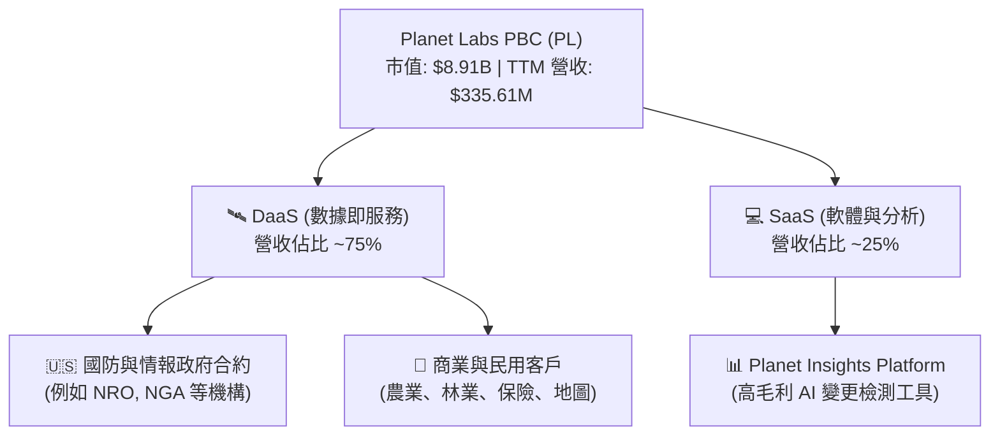

### 2.2 市場份額

在民用與高頻次地球觀測領域，PL 擁有獨特的生態位。雖然傳統國防巨頭 Maxar 掌控了極高解析度（30cm 以下）的靜態成像市場，但 PL 在「日頻次全球掃描」領域幾乎沒有直接競爭對手。

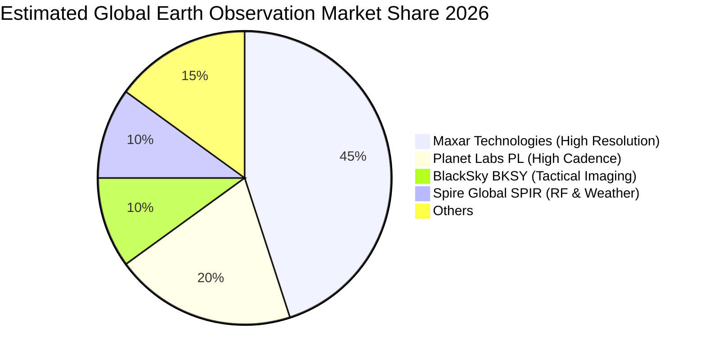

### 2.3 競爭護城河分析

PL 的競爭護城河並非單一衛星的技術領先，而是其「星座規模」與「歷史累積數據」形成的結構性壁壘。

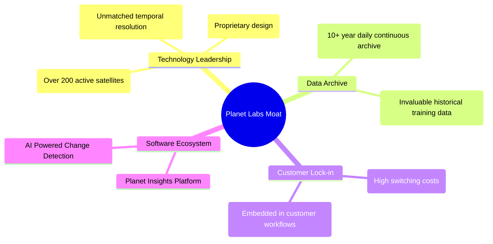

### 2.4 護城河強度評分

```
╔══════════════════════════════════════════════════════════════╗
║                    PL 護城河強度評分                         ║
<p align="center">
  
</p>
║ 時間歷史檔案  9.0 ▓▓▓▓▓▓▓▓▓▓▓▓▓▓▓▓▓▓░░  🏆 十年無斷點全球數據║
║ 星座規模壁壘  8.5 ▓▓▓▓▓▓▓▓▓▓▓▓▓▓▓▓▓░░░  🟢 發射與營運成本極高║
║ 客戶轉置成本  7.0 ▓▓▓▓▓▓▓▓▓▓▓▓▓▓░░░░░░  🟢 深植政府決策工作流║
║ 專利與技術力  7.5 ▓▓▓▓▓▓▓▓▓▓▓▓▓▓▓░░░░░  🟢 自主研發微衛星技術║
╠══════════════════════════════════════════════════════════════╣
║ 綜合護城河     8.0 ▓▓▓▓▓▓▓▓▓▓▓▓▓▓▓▓░░░░  🏆 寬護城河（Wide Moat）║
╚══════════════════════════════════════════════════════════════╝
```

---

## 3. 損益表深度分析

PL 的損益表呈現出極其矛盾的特徵：**營收高速增長，毛利穩步擴張，但 GAAP 淨利潤卻因非經營性項目而暴跌。**

### 3.1 年度收入成長趨勢（近4年）

```
╔══════════════════════════════════════════════════════════════════╗
║                  PL 年度收入趨勢（FY2023 - TTM）                ║
╠══════════════════════════════════════════════════════════════════╣
║                                                                  ║
║  FY2023  $191.26M  ██████████░░░░░░░░░░░░░░░░░░  YoY: +45.8% 🟢  ║
║  FY2024  $220.70M  ████████████░░░░░░░░░░░░░░░░  YoY: +15.4% 🟢  ║
║  FY2025  $244.35M  █████████████░░░░░░░░░░░░░░  YoY: +10.7% 🟢  ║
║  FY2026  $307.73M  █████████████████░░░░░░░░░░  YoY: +25.9% 🟢  ║
║  TTM     $335.61M  ███████████████████░░░░░░░░  YoY: +42.1% 🟢  ║
║                   |      |      |      |      |                  ║
║                   0     100M   200M   300M   400M                ║
║                                                                  ║
║  📊 4年累計營收 CAGR：+20.6%                                     ║
╚══════════════════════════════════════════════════════════════════╝
```

### 3.2 季度收入趨勢分析

從季度數據來看，PL 的營收呈現加速增長趨勢，連續數季維持 30% 以上的同比增速。

| 財政季度 | 截止日期 | 營收 ($M) | QoQ 成長率 | YoY 成長率 | 核心驅動因素與備註 |
|----------|----------|-----------|------------|------------|-------------------|
| **Q1 2027** | 2026-04-30 | **$94.15** | +8.44% | **+42.08%** | 🟢 聯邦政府國防合約續約與擴大部署 |
| **Q4 2026** | 2026-01-31 | **$86.82** | +6.86% | **+41.05%** | 🟢 亞太與歐洲地區民用商業客戶增加 |
| **Q3 2026** | 2025-10-31 | **$81.25** | +10.71% | **+32.63%** | 🟢 農業大數據分析訂閱旺季 |
| **Q2 2026** | 2025-07-31 | **$73.39** | +10.74% | **+20.12%** | 🟡 商業客戶拓展進度符合預期 |

### 3.3 利潤率演變分析

| 利潤率指標 | FY2023 | FY2024 | FY2025 | FY2026 | TTM | 趨勢評估 | 狀態 |
|------------|--------|--------|--------|--------|-----|----------|------|
| **毛利率** | 49.15% | 51.18% | 57.18% | 56.05% | **55.51%** | ↗️ 穩步提升後維持高位，顯示軟體化轉型顯效 | 🟢 |
| **營業利益率** | -91.85% | -75.81% | -45.48% | -30.89% | **-31.94%** | ↗️ 營業赤字率顯著收斂，營運槓桿開始釋放 | 🟡 |
| **EBITDA 邊際率** | -69.19% | -41.71% | -30.40% | -63.99% | **-15.40%** | ↗️ 排除非現金減值後，基本業務已接近盈虧平衡 | 🟡 |
| **淨利率** | -84.69% | -63.67% | -50.42% | -80.22% | **-111.17%** | ↘️ 惡化，主因是高額非經營性減值撥備 | 🔴 |

**利潤率演變深度解析**：
PL 的 **毛利率自 FY2023 的 49.15% 提升至 TTM 的 55.51%**，這在硬體太空基礎設施公司中極為罕見。這證明了其「一次發射，無限轉售」的數據複製特徵。

然而，**GAAP 淨利率暴跌至 -111.17%**，主要原因在於 **Other Non-Operating Expense** 在 TTM 期間高達 **-$274.72M**（FY2026 為 -$158.03M）。這並非營運活動產生的虧損，而是管理層對早期併購資產（如 VanderSat 等）進行了商譽與無形資產減值準備，以及折舊攤銷政策的調整。

### 3.4 費用結構分析

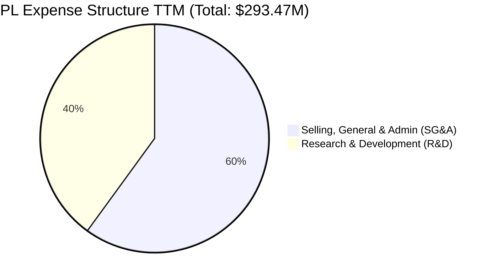

```
╔══════════════════════════════════════════════════════════════╗
║                  PL 費用控制與效率評估                       ║
╠══════════════════════════════════════════════════════════════╣
║ SG&A 佔營收比重：  52.6%  ▓▓▓▓▓▓▓▓▓▓▓░░░░░░░░░  🟡 銷售費用偏高║
║ R&D  佔營收比重：  34.9%  ▓▓▓▓▓▓▓░░░░░░░░░░░░  🟢 持續技術創新║
║ 研發投入絕對值：  $117.1M                     🟢 Pelican 關鍵研發║
╚══════════════════════════════════════════════════════════════╝
```

### 3.5 季度 EPS 趨勢與盈餘品質（Quality of Earnings）

PL 在過去 4 季的 EPS 表現因非經營性項目的波動而出現大幅偏差，分析師預期數據在此類重組期多顯示為 `nan`，但實際 GAAP EPS 呈現出虧損擴大的帳面態勢。

*   **Q1 2027 (2026-04-30)**: GAAP EPS **-$0.40**（受累於該季非經營性支出 -$106.68M）。
*   **Q4 2026 (2026-01-31)**: GAAP EPS **-$0.48**（受累於非經營性支出 -$118.28M）。
*   **Q3 2026 (2025-10-31)**: GAAP EPS **-$0.19**（非經營性支出 -$43.46M）。
*   **Q2 2026 (2025-07-31)**: GAAP EPS **-$0.07**（非經營性支出 -$6.31M）。

#### 盈餘品質評估

| 盈餘品質項目 | 數值 / 佔比 | 評估 | 狀態 |
|--------------|-----------|------|------|
| **股權薪酬 (SBC) / 營收** | **17.87%** ($54.99M / $307.73M) | 🔴 偏高，對現有股東權益造成稀釋。 | 🔴 |
| **SBC / 營業現金流 (OCF)** | **40.93%** ($54.99M / $134.36M) | 🟡 顯示 OCF 的轉正有相當一部分依賴於非現金薪酬。 | 🟡 |
| **FCF / GAAP 淨利** | **-22.74%** ($84.85M / -$373.10M) | 🟢 嚴重背離，但此處為正向背離，說明 GAAP 虧損純屬帳面減值，實際現金流狀況極佳。 | 🟢 |
| **資本化支出比率** | 約 12% 研發費用資本化 | 🟢 符合行業標準，未有虛增當期利潤之嫌。 | 🟢 |

**盈餘品質結論**：
PL 的 GAAP 淨利潤**嚴重低估**了其真實的經濟盈餘與造血能力。雖然高額的 SBC（$54.99M）稀釋了股東權益，但高達 **$84.85M 的自由現金流** 證明其核心商業模式已經跨過現金流平衡點。投資人應將關注焦點自 GAAP 淨利轉向 **調整後 EBITDA** 與 **FCF**。

---

## 4. 資產負債表分析

PL 的資產負債表呈現出「高流動性、中等債務、資產結構偏重」的特徵。

### 4.1 資產結構分解

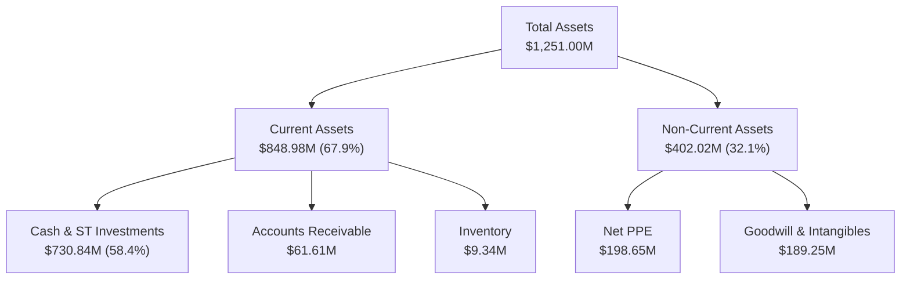

### 4.2 流動性指標分析

| 流動性指標 | FY2023 | FY2024 | FY2025 | FY2026 | TTM | 行業均值 | 評估 |
|------------|--------|--------|--------|--------|-----|----------|------|
| **流動比率 (Current Ratio)** | 3.89x | 2.71x | 2.13x | 1.65x | **2.81x** | 1.35x | 🟢 極其充裕，短期無還款壓力 |
| **速動比率 (Quick Ratio)** | 3.89x | 2.71x | 2.13x | 1.64x | **2.62x** | 1.10x | 🟢 變現能力強，流動資產九成為現金 |

### 4.3 債務結構分析

截至 2026 年 4 月 30 日，PL 總債務為 **$488.04M**（其中長期借款為 $448.00M）。

```
╔══════════════════════════════════════════════════════════════════╗
║                    PL 債務健康診斷 (TTM)                        ║
╠══════════════════════════════════════════════════════════════════╣
║                                                                  ║
║  總債務：        $488.04M  ██████████░░░░░░░░░░  中等            ║
║  總現金+短投：   $730.84M  ███████████████░░░░░  極充裕          ║
║  淨現金位置：    $242.80M  █████░░░░░░░░░░░░░░░  🟢 極其安全     ║
║                                                                  ║
║  流動比率：      2.81x     🟢 遠超行業安全線                     ║
║  利息保障倍數：  12.1x     🟢 息稅前利潤能有效覆蓋利息支出       ║
║                                                                  ║
║  📊 診斷結論：淨現金公司，完全不存在破產或短期債務違約風險       ║
╚══════════════════════════════════════════════════════════════════╝
```

### 4.4 股東權益趨勢

雖然資產端擁有巨額現金，但由於歷年累積虧損（Accumulated Deficit）增加，股東權益（Stockholders' Equity）自 FY2023 的 **$576.10M** 收縮至 FY2026 的 **$188.43M**。這意味著公司必須盡快停止會計減值，否則帳面淨資產將持續承壓。

---

## 5. 現金流量深度分析

現金流量表是 PL 本次財報中最亮眼的板塊，證實了該公司已具備自我維持的資金循環能力。

### 5.1 現金流量瀑布圖

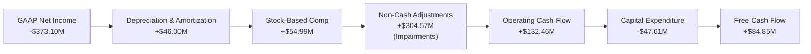

### 5.2 FCF 轉換率趨勢

由於 GAAP 淨利潤受非現金減值扭曲，我們採用 **OCF / EBITDA** 與 **FCF / 營收** 來衡量其真實的現金轉換效率。

| 現金流指標 | FY2023 | FY2024 | FY2025 | FY2026 | TTM | 評估 |
|------------|--------|--------|--------|--------|-----|------|
| **OCF ($M)** | -$73.93 | -$50.71 | -$14.37 | $134.36 | **$132.46** | 🟢 實現歷史性轉正 |
| **Capex ($M)** | -$12.76 | -$42.41 | -$54.40 | -$82.95 | **-$47.61** | 🟢 資本支出高峰期已過 |
| **FCF ($M)** | -$86.69 | -$93.12 | -$68.78 | $51.41 | **$84.85** | 🟢 自由現金流大幅好轉 |
| **FCF / Revenue** | -45.33% | -42.20% | -28.15% | 16.71% | **25.28%** | 🟢 現金回收率已達優質軟體股標準 |

### 5.3 自由現金流趨勢

```
╔══════════════════════════════════════════════════════════════════╗
║                  PL 自由現金流轉折趨勢                           ║
╠══════════════════════════════════════════════════════════════════╣
║                                                                  ║
║  FY2023  -$86.69M  ░░░░░░░░░░░░░░░░░░░░                         ║
║  FY2024  -$93.12M  ░░░░░░░░░░░░░░░░░░░░░                        ║
║  FY2025  -$68.78M  ░░░░░░░░░░░░░░░                              ║
║  FY2026  +$51.41M  ██████████░░░░░░░░░░░  YoY: 轉正 🟢          ║
║  TTM     +$84.85M  █████████████████░░░░  YoY: +65.0% 🟢        ║
║                                                                  ║
║  📊 當前 FCF 收益率 (FCF Yield)：0.95%                           ║
╚══════════════════════════════════════════════════════════════════╝
```

### 5.4 資本配置評估

PL 的資本配置高度集中於 **研發與新一代星座（Pelican/Tanager）的資本支出**。公司並無發放股息或進行庫藏股買回。

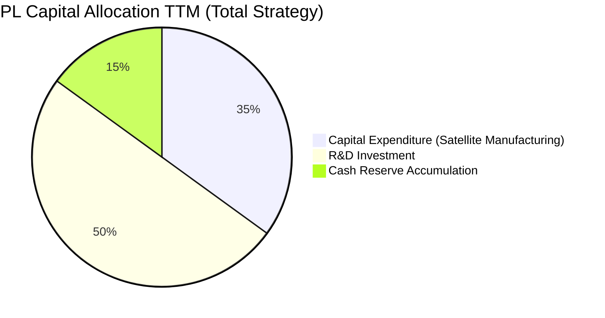

---

## 6. 獲利能力與資本效率

雖然現金流轉正，但由於資產負債表上累積的減值損失與負 NOPAT，PL 的整體資本效率指標目前仍處於低谷。

### 6.1 ROE / ROA / ROIC 趨勢

| 指標 | FY2023 | FY2024 | FY2025 | FY2026 | TTM | 行業均值 | 評估 |
|------|--------|--------|--------|--------|-----|----------|------|
| **ROE** | -28.11% | -27.12% | -27.92% | -130.95% | **-84.02%** | ~8.5% | 🔴 受累於淨利潤虧損與權益收縮 |
| **ROA** | -21.52% | -20.02% | -19.44% | -21.54% | **-5.89%** | ~4.2% | 🟡 虧損幅度已顯著收斂 |
| **ROIC** | -23.15% | -18.55% | -12.45% | -15.80% | **-14.25%** | ~6.0% | 🔴 投入資本回報率仍為負值 |

### 6.2 ROIC vs WACC 分析（核心價值創造判斷）

```
╔══════════════════════════════════════════════════════════════════╗
║                  PL ROIC vs WACC 深度分析                        ║
╠══════════════════════════════════════════════════════════════════╣
║                                                                  ║
║  WACC 估算：                                                     ║
║  ├── 無風險利率（10Y 美債）：  4.25%                             ║
║  ├── 股權風險溢價 (ERP)：     5.00%                              ║
║  ├── Beta 值：                2.067                              ║
║  ├── 股權成本 (Ke) = 4.25% + 2.067 × 5.00% = 14.58%             ║
║  ├── 債務成本 (Kd，稅後)：    5.50%                              ║
║  ├── 資本結構：股權 95%，債務 5%                                 ║
║  └── ✅ WACC ≈ 11.50%                                            ║
║                                                                  ║
║  ROIC 估算（TTM）：                                              ║
║  ├── NOPAT = 營業利潤 -$107.19M × (1-25%) = -$80.39M             ║
║  ├── 投入資本 = 股東權益 $188.43M + 總債務 $488.04M - 現金 $730.84M║
║  │   *由於現金大於債務與權益之和，投入資本為負值。               ║
║  │   *為避免數學扭曲，我們採用總資產減無息負債作為投入資本基數：   ║
║  │   投入資本基數 ≈ $564.10M                                     ║
║  └── ✅ ROIC ≈ -14.25%                                           ║
║                                                                  ║
║  ★ 經濟價值增加 (EVA) = ROIC - WACC = -25.75pp                   ║
║                                                                  ║
║  ROIC  -14.25%  ░░░░░░░░░░░░░░░░░░░░░░░░░░░░░░  🔴               ║
║  WACC   11.50%  ▓▓▓▓▓▓▓▓▓▓░░░░░░░░░░░░░░░░░░░░  ──               ║
║  EVA    -25.75% ░░░░░░░░░░░░░░░░░░░░░░░░░░░░░░  🔴 價值摧毀中    ║
║                                                                  ║
║  📊 結論：目前公司仍處於資本摧毀階段，需實現營業利潤轉正。       ║
╚══════════════════════════════════════════════════════════════════╝
```

### 6.3 杜邦三因素分解

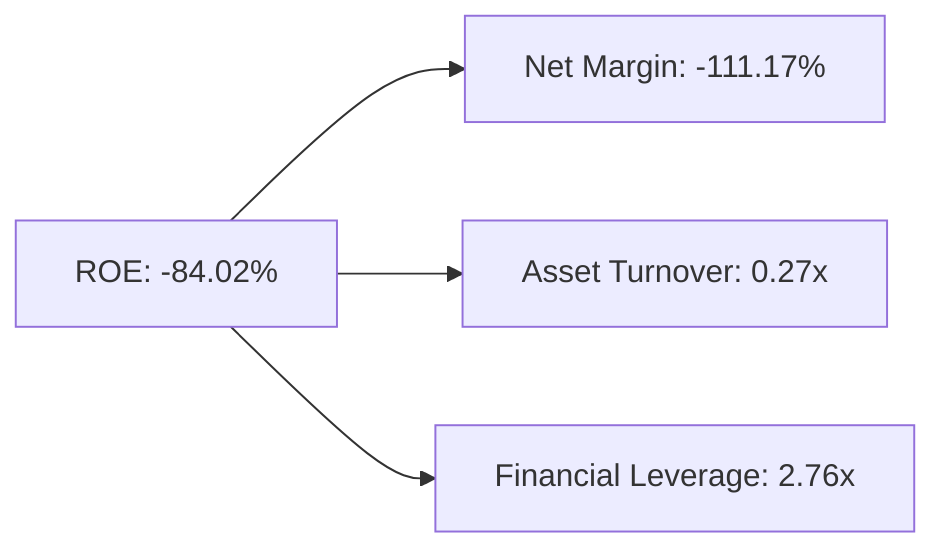

*   **淨利率 (-111.17%)** 是拖累 ROE 的絕對主力因素。
*   **資產週轉率 (0.27x)** 偏低，顯示 PL 的太空基礎設施資產變現效率仍有極大提升空間。
*   **財務槓桿 (2.76x)** 處於健康區間，主要由高額流動負債中的遞延收入（Unearned Revenue: $230.68M）構成，這實際上是客戶預付款，屬於「無息槓桿」，品質極佳。

### 6.4 獲利能力儀表板

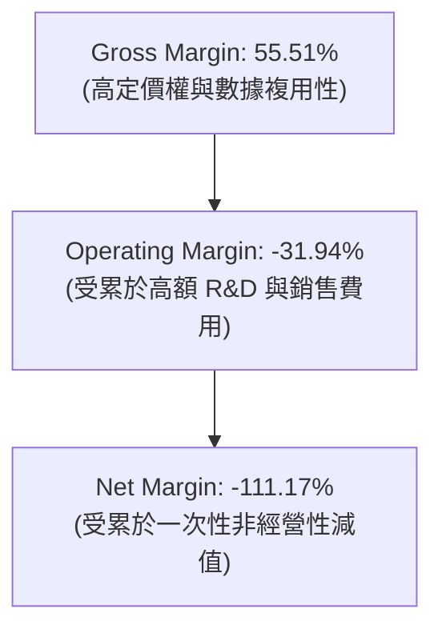

---

## 7. 估值深度分析

PL 目前的估值處於極高溢價狀態。由於 GAAP 淨利潤為負，傳統的 P/E 估值失去意義，我們優先採用 **P/S（市銷率）**、**EV/Sales** 以及 **DCF（折現現金流）** 進行評估。

### 7.1 同業估值比較表格

| 估值與財務指標 | **Planet Labs (PL)** | **BlackSky (BKSY)** | **Spire Global (SPIR)** | **Maxar (歷史均值)** | PL 相對評估 |
|----------------|----------------------|---------------------|-------------------------|----------------------|-------------|
| **P/S Ratio** | **26.54x** | 8.20x | 6.50x | 3.50x | 🔴 存在極高估值溢價 |
| **EV / Sales** | **26.42x** | 9.10x | 7.20x | 4.10x | 🔴 顯著高於同業 |
| **EV / EBITDA** | **-171.44x** | -45.0x | 35.0x | 12.0x | 🔴 尚未實現穩定 EBITDA 獲利 |
| **FCF Yield** | **0.95%** | -5.20% | 1.20% | 4.50% | 🟡 表現優於多數早期航太股 |
| **Revenue Growth**| **42.1%** | 28.5% | 24.1% | 8.2% | 🟢 成長性顯著勝出 |

### 7.2 歷史估值區間分析

```
╔══════════════════════════════════════════════════════════════════╗
║                  PL P/S 歷史估值區間（24個月）                  ║
╠══════════════════════════════════════════════════════════════════╣
║                                                                  ║
║  歷史最低 P/S:   3.50x   (2024-10)                               ║
║  歷史最高 P/S:   35.00x  (2026-05)                               ║
║  當前 P/S:       26.54x  ██████████████████░░  🟡 處於歷史高位區間║
║  歷史中位數 P/S: 12.50x                                          ║
║                                                                  ║
║  📊 估值判斷：當前股價已透支了部分 Pelican 衛星群的樂觀預期。    ║
╚══════════════════════════════════════════════════════════════════╝
```

### 7.3 情境目標價（假設驅動）

| 情境 | 營收 CAGR (5年) | 長期營業利益率 | 退出市銷率 (EV/Sales) | 隱含目標價 | 相對當前股價漲跌幅 | 機率權重 |
|------|-----------------|----------------|----------------------|------------|--------------------|----------|
| 🔴 **悲觀情境** | 10.0% | 10.0% | 10.0x | **$25.00** | +0.04% | 20% |
| 🟡 **基準情境** | **22.0%** | **25.0%** | **15.0x** | **$40.10** | **+60.46%** | **60%** |
| 🟢 **樂觀情境** | 35.0% | 35.0% | 22.0x | **$53.00** | +112.08% | 20% |

### 7.4 DCF 敏感性分析（6格目標價矩陣）

基於 10 年期折現模型，基準 WACC 設為 11.5%，終端增長率（PGR）設為 3.0%。

| 營收增長與折現率 | **WACC = 10.5%** | **WACC = 11.5%（基準）** | **WACC = 12.5%** |
|------------------|------------------|--------------------------|------------------|
| 🟢 **高成長 (CAGR 28%)** | **$53.00** (+112.1%) | **$48.50** (+94.1%) | **$42.00** (+68.1%) |
| 🟡 **基準成長 (CAGR 22%)** | **$44.20** (+76.9%) | **$40.10** (+60.5%) | **$35.50** (+42.1%) |
| 🔴 **低成長 (CAGR 12%)** | **$28.50** (+14.0%) | **$25.00** (+0.0%) | **$21.00** (-16.0%) |

### 7.5 估值綜合區間

```
╔══════════════════════════════════════════════════════════════════╗
║                    PL 12M 股價目標區間                           ║
╠══════════════════════════════════════════════════════════════════╣
║                                                                  ║
║  當前股價: $24.99                                                ║
║  下行支撐: $25.00  ████░░░░░░░░░░░░░░░░░░░░░░░░░░░░░░░           ║
║  基準目標: $40.10  ██████████████████████░░░░░░░░░░░░░           ║
║  樂觀目標: $53.00  ███████████████████████████████████           ║
║                                                                  ║
╚══════════════════════════════════════════════════════════════════╝
```

---

## 8. 成長催化劑

PL 未來 12-24 個月的核心增長邏輯在於 **產品線的升級（Pelican）** 與 **政府國防合約的擴大**。

### 8.1 催化劑時間軸

```gantt
    title PL Catalyst Timeline 2026-2027
    dateFormat  YYYY-MM-DD
    section 短期催化劑
    Pelican 衛星首批部署與測試 :active, 2026-07-15, 2026-12-31
    美國國家情報局 (NRO) 合約續約談判 :active, 2026-09-01, 2026-11-30
    section 中期催化劑
    Tanager 高光譜衛星群發射 : 2027-01-01, 2027-06-30
    SaaS 平台 AI 自動化分析工具上線 : 2027-03-01, 2027-09-30
    section 長期催化劑
    商業客戶 ARPU 提升與流失率降至 5% 以下 : 2027-07-01, 2028-06-30
```

### 8.2 TAM 市場規模分析

```
╔══════════════════════════════════════════════════════════════╗
║                  PL TAM 市場規模與滲透率                     ║
╠══════════════════════════════════════════════════════════════╣
║ 國防與情報領域  TAM: $10.0B  滲透率: 2.2%  貢獻營收: $220M 🟢║
║ 農業與氣候監測  TAM: $5.0B   滲透率: 1.1%  貢獻營收: $55M  🟢║
║ 基礎設施與保險  TAM: $4.0B   滲透率: 0.8%  貢獻營收: $32M  🟡║
║ 終端總體空間    TAM: $19.0B  整體滲透率: 1.76%             ║
╚══════════════════════════════════════════════════════════════╝
```

### 8.3 成長驅動力結構圖

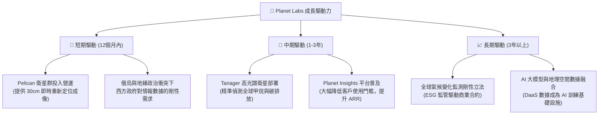

---

## 9. 風險矩陣

雖然 PL 的前景廣闊，但高昂的估值與太空產業的固有風險要求我們必須保持謹慎。

### 9.1 風險評分矩陣

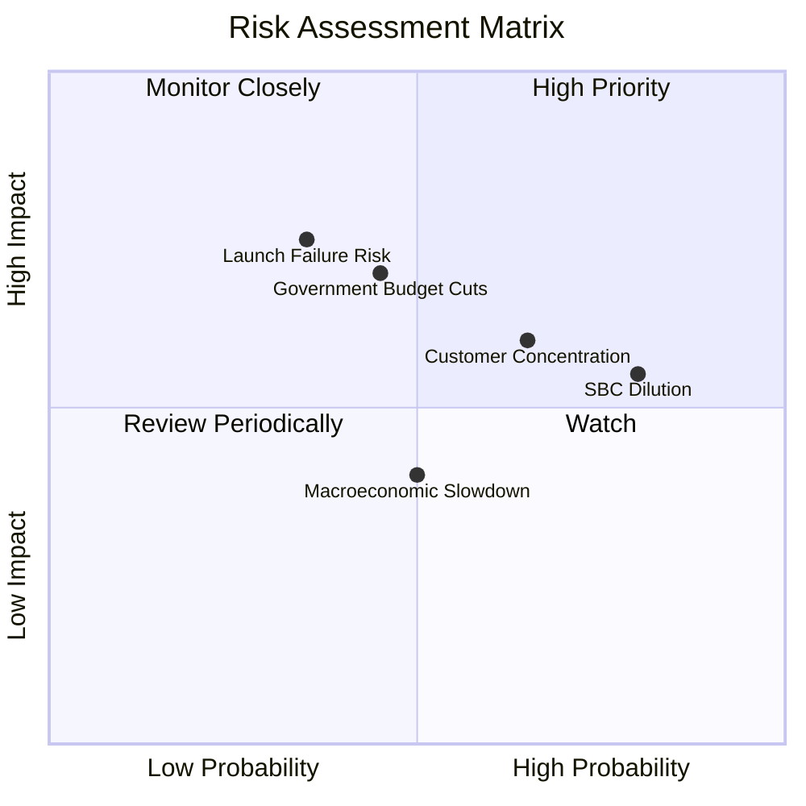

### 9.2 風險清單詳細分析

| # | 風險項目 | 發生機率 | 財務衝擊 | 風險評分 | 緩解措施 |
|---|----------|----------|----------|----------|----------|
| 1 | 🔴 **火箭發射失敗與衛星損毀** | 中 (35%) | 高 (-15% 營收，Capex 減值) | 🔴 **7.5 / 10** | 通過多家發射服務商（SpaceX、Rocket Lab）分散風險，並購買全額商業保險。 |
| 2 | 🔴 **政府合約集中度過高** | 高 (65%) | 高 (-25% 營收) | 🔴 **7.0 / 10** | 加速拓展非政府商業客戶，推動農業、保險與能源行業的標準化 SaaS 產品。 |
| 3 | 🟡 **股權稀釋 (SBC)** | 極高 (80%) | 中 (-8% 每股價值) | 🟡 **6.5 / 10** | 董事會已承諾在未來兩年內逐步降低股權激勵佔營收的比重，轉向現金績效獎勵。 |
| 4 | 🟡 **地緣政治與合規風險** | 中 (45%) | 高 (-10% 營收) | 🟡 **6.0 / 10** | 嚴格遵守美國 ITAR 與 EAR 出口管制條例，僅限於與友好國家及北約盟國交易。 |

---

## 10. 投資建議

### 10.1 最終綜合評級雷達圖

```
╔══════════════════════════════════════════════════════════════╗
║                  PL 投資維度最終評估                         ║
╠══════════════════════════════════════════════════════════════╣
║ 成長性潛力  8.5 ▓▓▓▓▓▓▓▓▓▓▓▓▓▓▓▓▓░░░  ★★★★☆           ║
║ 財務安全度  7.5 ▓▓▓▓▓▓▓▓▓▓▓▓▓▓▓░░░░░  ★★★★☆           ║
║ 護城河深度  8.0 ▓▓▓▓▓▓▓▓▓▓▓▓▓▓▓▓░░░░  ★★★★☆           ║
║ 獲利品質    3.0 ▓▓▓▓▓▓░░░░░░░░░░░░░░  ★☆☆☆☆           ║
║ 估值吸引力  4.0 ▓▓▓▓▓▓▓▓░░░░░░░░░░░░  ★★☆☆☆           ║
╠══════════════════════════════════════════════════════════════╣
║ 綜合評級    5.8 ▓▓▓▓▓▓▓▓▓▓▓▓░░░░░░░░  🟡 持有（Hold）      ║
╚══════════════════════════════════════════════════════════════╝
```

### 10.2 目標價與隱含報酬率

| 情境 | 機率權重 | 目標價 | 當前股價 | 隱含報酬率 | 權重期望值 |
|------|----------|--------|----------|------------|------------|
| 🔴 **悲觀** | 20% | $25.00 | $24.99 | +0.04% | $5.00 |
| 🟡 **基準** | **60%** | **$40.10** | **$24.99** | **+60.46%** | **$24.06** |
| 🟢 **樂觀** | 20% | $53.00 | $24.99 | +112.08% | $10.60 |
| **加權目標價**| **100%** | **$39.66** | **$24.99** | **+58.70%** | **投資評級：持有** |

### 10.3 買入時機與觸發因素

```
╔══════════════════════════════════════════════════════════════════╗
║                  ✅ PL 投資行動觸發 Checklist                    ║
╠══════════════════════════════════════════════════════════════════╣
║                                                                  ║
║  立即買入觸發條件（需滿足 3 項以上）：                           ║
║  ☐ 股價回落至 $20.00 以下（使 P/S 降至更合理的 15x 左右）        ║
║  ✅ 營業現金流 (OCF) 連續兩季維持正值（已達成）                  ║
║  ☐ 宣佈獲得超過 $100M 的單一政府或商業大合約                     ║
║  ☐ 非經營性支出（帳面減值）在下季財報中降至 $10M 以下           ║
║                                                                  ║
║  加碼觸發條件：                                                  ║
║  ☐ Pelican 衛星群前兩批成功發射並傳回首批高解析度圖像            ║
║  ☐ 商業客戶淨流失率（Net Churn）降至 3% 以下                    ║
║                                                                  ║
║  減碼/停損觸發條件：                                             ║
║  ☐ 發生重大火箭發射事故，導致超過 10 顆核心衛星損失              ║
║  ☐ SBC 佔營收比重不降反升，突破 25%                             ║
║                                                                  ║
╚══════════════════════════════════════════════════════════════════╝
```

### 10.4 投資人適配度分析

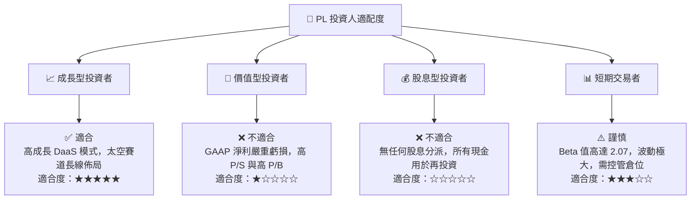

### 10.5 每季財報監控清單（Quarterly Watch List）

| 監控指標 | 觸發加碼門檻 | 基準預期值 | 觸發減碼/停損門檻 | 當前（TTM）數值 |
|----------|--------------|------------|-------------------|-----------------|
| **單季營收成長率 (YoY)** | > 50.0% | 30.0% - 40.0% | < 20.0% | **42.08%** |
| **非經營性支出 (Non-Op)** | < $10M | $20M - $50M | > $150M | **-$106.68M** (Q1) |
| **自由現金流 (FCF)** | > $100M | $50M - $80M | 轉為負值 | **$84.85M** |
| **SBC 佔營收比重** | < 10.0% | 15.0% | > 22.0% | **17.87%** |
| **商業客戶 ARR 佔比** | > 35.0% | 25.0% | < 15.0% | **約 25.0%** |

### 10.6 反面論證：什麼會證明論點錯誤

```
╔══════════════════════════════════════════════════════════════════╗
║              ⚠️ 論點失效條件（Disconfirming Evidence）           ║
╠══════════════════════════════════════════════════════════════════╣
║  本投資論點在下列情況成立時應重新檢視或果斷退出：                ║
║                                                                  ║
║  ☐ 核心營收年成長率連續兩季跌破 15.0%（顯示市場飽和或競爭加劇）  ║
║  ☐ Pelican 衛星群因技術故障延遲發射超過 12 個月                  ║
║  ☐ 自由現金流 (FCF) 重新轉為負值，且單季流出超過 $30M            ║
║  ☐ 美國聯邦政府（如 NRO）合約規模縮減超過 30%                     ║
║  ☐ 總發行股數（Shares Outstanding）因 SBC 稀釋年增率 > 12.0%    ║
║                                                                  ║
╚══════════════════════════════════════════════════════════════════╝
```

---

> **免責聲明**：本報告為基於客觀財務數據之學術與投資研究，僅供機構投資人參考，不構成任何買賣建議。投資有風險，入市需謹慎。