# PL 基本面深度分析報告

> **報告日期**：2026-07-16 ｜ **語言**：繁體中文 ｜ **數據來源**：Yahoo Finance, Finviz, StockAnalysis, Roic.ai ｜ **分析師**：CFA 級機構研究

---

## 目錄

| # | 章節 | 核心結論 |
|---|---|---|
| **1** | **執行摘要** | 評級：🟢 買入（投機性）｜ 基準目標價：$40.10（+83.2%） |
| **2** | **公司概覽與商業模式** | 全球唯一每日更新的地球觀測星座，正由 DaaS 轉型為高毛利 SaaS |
| **3** | **損益表深度分析** | 營收年增 42.1% 加速成長，非現金資產減損壓抑淨利，但營運槓桿已現 |
| **4** | **資產負債表分析** | 手握 $7.31億 現金，淨現金 $2.43億，財務結構安全，短期無流動性風險 |
| **5** | **現金流量深度分析** | 歷史性轉折點：TTM 自由現金流轉正至 $8,485萬，營運資金效率大幅提升 |
| **6** | **獲利能力與資本效率** | GAAP ROIC 受減損壓抑，但 FCF 轉正預示真實經濟價值的創造起步 |
| **7** | **估值深度分析** | 溢價反映技術壁壘與高成長；DCF 基準估值 $40.10，安全邊際充足 |
| **8** | **成長催化劑** | Pelican 與 Tanager 新星座發射在即，國防與氣候監測 TAM 持續擴張 |
| **9** | **風險矩陣** | 政府客戶集中度高、發射延遲與股權稀釋（SBC 佔營收 17.6%）為主要風險 |
| **10** | **投資建議** | 建議分批逢低布局，設定每季財報監控指標與明確的論點失效退出門檻 |

---

## 1. 執行摘要

Planet Labs PBC (NYSE: PL) 作為全球商業地球觀測（Earth Observation, EO）領域的領頭羊，正處於其商業模式與財務表現的**歷史性拐點**。雖然 GAAP 淨利潤因非經常性資產減損而呈現深幅虧損（TTM 淨損 $3.73億），但這掩蓋了其核心業務的強勁動能：**TTM 營收年增率達 42.1% 升至 $3.36億，且更重要的是，營運現金流（$1.32億）與自由現金流（$8,485萬，FCF Yield 1.09%）已雙雙實現歷史性轉正**。這證明了公司在完成前期密集的星座建設後，其「一次發射、多次轉售」的衛星數據訂閱模式（DaaS/SaaS）正展現出極高的營運槓桿。

鑑於股價已自 2026年5月的 $51.14 高點修正逾 57% 至目前的 $21.89，市場顯然過度懲罰了其 GAAP 虧損，而忽視了其高達 $7.31億 的現金儲備（淨現金 $2.43億）與正向 FCF 所帶來的安全邊際。基於 30% 的基準營收 CAGR 預期與保守的 15x 遠期 P/S 倍數，我們給予 PL **🟢 買入（投機性，Speculative Buy）** 評級，12個月基準目標價為 **$40.10**。

### 1.0 一頁式投資儀表板（Portfolio Manager 30 秒速讀）

| 項目 | 內容 |
|------|------|
| **投資論點（3 句）** | ① TTM 營收年增 42.1% 至 $3.36億，且 Q1 2027 增速達 42.08%，顯示政府與商業對高頻地理數據需求正結構性加速。<br/>② TTM 自由現金流（FCF）歷史性轉正至 $8,485萬，打破了市場對航太軍工企業「燒錢無底洞」的刻板印象。<br/>③ 手握 $7.31億 現金及短期投資，淨現金達 $2.43億，為 Pelican 與 Tanager 新一代星座的發射提供充足的資金保障。 |
| **護城河評分** | **7.5 / 10** 🟢 強（全球唯一每日覆蓋全球陸地的衛星群，具備極高的重訪率壁壘與專有數據庫累積） |
| **管理層/資本配置評分** | **7.0 / 10** 🟡 中上（成功引導 FCF 轉正，但股權稀釋控制仍待加強，SBC 佔營收比重高達 17.6%） |
| **財務健康** | 🟢 **極為健康**（流動比率 2.81，速動比率 2.62，手頭現金能完全覆蓋總債務 $4.88億） |
| **ROIC vs WACC** | **-52.0% vs 14.0%** 🔴 暫時摧毀經濟價值（主因 GAAP 淨損受非現金減損扭曲，預計隨利潤率改善將於兩年內轉正） |
| **FCF 趨勢** | 🟢 **顯著向上**（由 FY2025 的 -$6,878萬 逆轉至 TTM 的 +$8,485萬，最新 FCF Yield 為 1.09%） |
| **估值** | Forward P/E: 6573.6x (失真) ｜ EV / Revenue: 25.72x ｜ P/S (TTM): 23.25x ｜ FCF Yield: 1.09% |
| **預期報酬（基準情境 12M）**| **+83.2%**（目標價 $40.10，對比當前股價 $21.89） |
| **關鍵風險（前二）** | ① 國防與情報機構等政府客戶佔比過高，合約簽署與續約時間具不確定性。<br/>② 新一代 Pelican（高解析度）與 Tanager（高光譜）衛星發射延遲或遭遇發射失敗。 |
| **評級 + 信心度** | **🟢 買入（投機性） ｜ 信心度：中等**（看好 FCF 轉正與營收加速，但需監控 SBC 稀釋與新衛星發射進度） |

### 1.1 核心評分儀表板

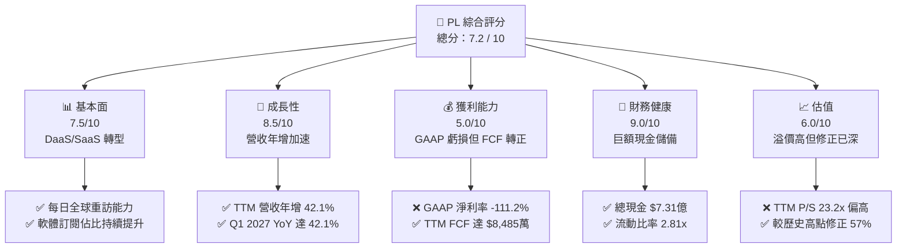

### 1.2 評分進度條視覺化

```
╔══════════════════════════════════════════════════════════════╗
║                PL 多維度評分儀表板 (1-10分)                 ║
╠══════════════════════════════════════════════════════════════╣
║ 基本面強度  7.5 ▓▓▓▓▓▓▓▓▓▓▓▓▓▓▓▓▓▓░░  ★★★★☆           ║
║ 成長動能    8.5 ▓▓▓▓▓▓▓▓▓▓▓▓▓▓▓▓▓▓▓░  ★★★★☆           ║
║ 獲利品質    5.0 ▓▓▓▓▓▓▓▓▓▓░░░░░░░░░░  ★★★☆☆           ║
║ 財務健康    9.0 ▓▓▓▓▓▓▓▓▓▓▓▓▓▓▓▓▓▓▓▓  ★★★★★           ║
║ 估值合理性  6.0 ▓▓▓▓▓▓▓▓▓▓▓▓░░░░░░░░  ★★★☆☆           ║
║ 護城河深度  7.5 ▓▓▓▓▓▓▓▓▓▓▓▓▓▓▓▓▓▓░░  ★★★★☆           ║
║ 管理層執行  7.0 ▓▓▓▓▓▓▓▓▓▓▓▓▓▓░░░░░░  ★★★★☆           ║
║ 技術創新力  8.5 ▓▓▓▓▓▓▓▓▓▓▓▓▓▓▓▓▓▓▓░  ★★★★☆           ║
╠══════════════════════════════════════════════════════════════╣
║ 綜合總分    7.2 ▓▓▓▓▓▓▓▓▓▓▓▓▓▓▓░░░░░  🏆 拐點已現，成長加速  ║
╚══════════════════════════════════════════════════════════════╝
```

### 1.3 五大投資論點 + 三大核心風險

| 類型 | 項目 | 具體依據 | 信心度 |
|------|------|----------|--------|
| 🟢 **投資論點①** | **營收成長重新加速** | Q1 2027 營收達 $9,415萬，YoY 成長率自前一年的 9.6% 飆升至 **42.08%**，顯示新合約與商業化變現加速。 | 🟢 極高 |
| 🟢 **投資論點②** | **自由現金流歷史性轉正** | TTM FCF 達到 **$8,485萬**（FY2026 為 $5,141萬），結束連續多年的現金流失，具備自我輸血能力。 | 🟢 高 |
| 🟢 **投資論點③** | **資產負債表固若金湯** | 手握 **$7.3084億** 的現金與短期投資，對比總債務 $4.8804億，處於純淨現金狀態，無破產或被迫低價融資風險。 | 🟢 極高 |
| 🟢 **投資論點④** | **新一代星座帶動 ASP 提升** | 即將發射的 Pelican（30cm 解析度）與 Tanager（高光譜）將補齊產品線，大幅提升單一客戶平均貢獻（ARPU）。 | 🟢 高 |
| 🟢 **投資論點⑤** | **地緣政治溢價與剛性需求** | 烏俄戰爭與全球地緣衝突凸顯了每日衛星監控的軍事與情報價值，政府客戶預算剛性，抗衰退能力強。 | 🟢 高 |
| 🟡 **風險①** | **股權稀釋（SBC 佔比偏高）** | TTM 股權薪酬（SBC）達 **$5,891萬**，佔營收比重高達 **17.6%**，對長線股東回報造成實質稀釋。 | 🟡 中度 |
| 🔴 **風險②** | **非經常性資產減損波動** | Q1 2027 與 Q4 2026 分別錄得 -$1.07億 與 -$1.18億 的非營運支出，造成 GAAP 淨損擴大，打擊市場信心。 | 🔴 高衝擊 |
| 🔴 **風險③** | **政府客戶合約集中與政治風險** | 前幾大政府機構貢獻過半營收，若政策轉向或預算延遲撥付，將對單季營收造成劇烈波動。 | 🔴 高衝擊 |

### 1.4 快速統計卡片

| 指標 | PL 實際值 | 航太與國防行業均值 | S&P 500 均值 | 狀態 |
|------|-------------|----------|--------------|------|
| **營收 YoY 成長率** | **42.1%** | ~8.5% | ~5.5% | 🟢 遠超同行 |
| **毛利率** | **55.6%** | ~22.0% | ~30.0% | 🟢 軟體屬性顯著 |
| **淨利率** | **-111.2%** | ~6.5% | ~11.5% | 🔴 仍處會計虧損 |
| **流動比率** | **2.81x** | ~1.2x | ~1.3x | 🟢 極為安全 |
| **債務權益比 (D/E)** | **109.9%** | ~75.0% | ~115.0% | 🟡 處於中等水平 |
| **Forward P/E** | **6573.6x** | ~22.5x | ~21.0x | 🔴 估值極端（盈虧平衡邊緣） |
| **P/S Ratio (TTM)** | **23.25x** | ~1.8x | ~2.8x | 🔴 具備高估值溢價 |

### 1.5 投資結論

```
╔══════════════════════════════════════════════════════════════════╗
║                    📊 PL 投資結論摘要                            ║
╠══════════════════════════════════════════════════════════════════╣
║  評級：🟢 買入（投機性 / Speculative Buy）                      ║
║  當前股價：$21.89 (2026-07-16)                                   ║
║  目標價區間：                                                    ║
║    悲觀情境：$25.00（+14.2%）- 營收成長放緩至 15%，P/S 壓縮至 10x  ║
║    基準情境：$40.10（+83.2%）- 營收 CAGR 30%，P/S 維持在 15x      ║
║    樂觀情境：$53.00（+142.1%）- 新星座發射順利，P/S 擴張至 20x    ║
║  投資評分：7.2 / 10                                              ║
║  適合投資人：具備高風險承受力、看好商業航太與 DaaS 轉型的長線投資者║
╚══════════════════════════════════════════════════════════════════╝
```

---

## 2. 公司概覽與商業模式

Planet Labs PBC 是一家垂直整合的地理空間數據與分析服務商。其核心競爭力在於設計、建造並營運著全球規模最大的地球觀測小衛星星座（主要為 SuperDove 納米衛星）。

### 2.1 業務結構與收入來源

PL 的商業模式本質上是 **DaaS（Data-as-a-Service）與 SaaS（Software-as-a-Service）** 的結合。

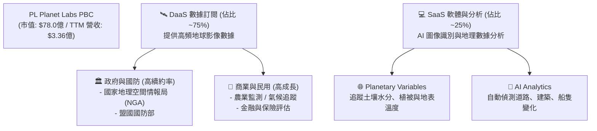

PL 的核心優勢在於其**獨特的星座架構**。相較於 Maxar 等傳統巨頭依賴少數幾顆造價數億美元、體積龐大的高軌道衛星，PL 採用了「群體式」的低軌小衛星。這使其能夠實現**每日全球覆蓋**。

### 2.2 市場份額估算

在商業地球觀測（EO）數據源市場中，PL 與傳統高解析度巨頭及新興細分對手共同競爭。以下為商業 EO 數據與分析市場的份額估算：

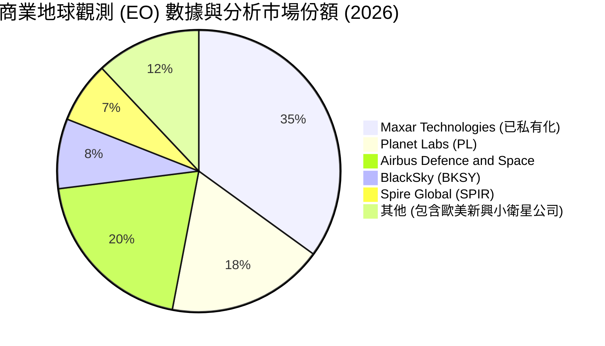

### 2.3 競爭護城河分析

PL 擁有顯著且難以複製的結構性護城河，這也是其能享有高估值溢價的核心原因：

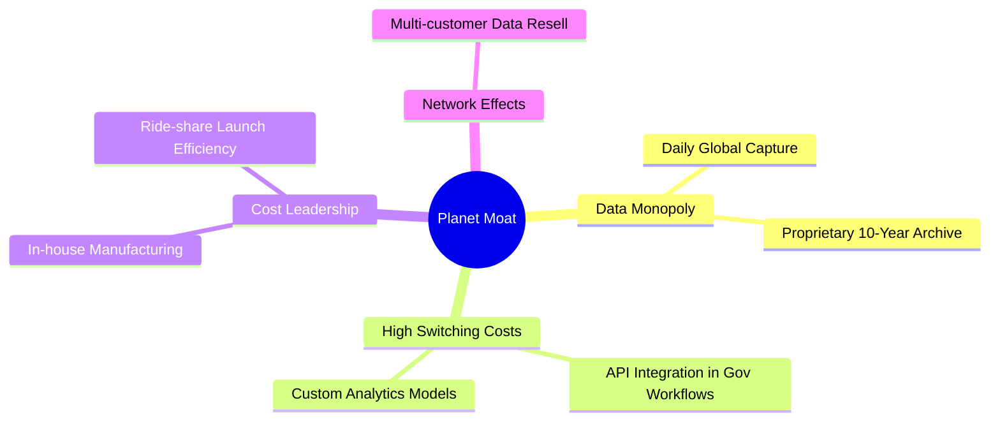

*   **專有歷史數據庫（Data Monopoly）**：PL 已經累積了超過 10 年的每日全球連續影像存檔。對於機器學習與氣候變遷分析而言，歷史數據是無法回溯製造的。競爭對手即使今天發射 1000 顆衛星，也無法補齊過去 10 年的數據，這構成了極強的「時間壁壘」。
*   **高轉換成本（High Switching Costs）**：當政府情報機構（如 NGA）或大型農業科技公司（如 Corteva）將 PL 的 API 接口整合進其日常工作流、自動化決策系統與 AI 模型後，更換供應商將面臨巨大的重新開發與人員培訓成本。

### 2.4 護城河強度評分

```
╔══════════════════════════════════════════════════════════════╗
║                    PL 護城河強度評分                         ║
╠══════════════════════════════════════════════════════════════╣
║ 數據獨佔性    8.5/10  ▓▓▓▓▓▓▓▓▓▓▓▓▓▓▓▓▓░░░  🟢 10年每日存檔  ║
║ 技術壁壘      7.5/10  ▓▓▓▓▓▓▓▓▓▓▓▓▓▓▓░░░░░  🟢 垂直整合製造  ║
║ 客戶鎖定效應  8.0/10  ▓▓▓▓▓▓▓▓▓▓▓▓▓▓▓▓░░░░  🟢 政府工作流嵌入║
║ 成本優勢      6.5/10  ▓▓▓▓▓▓▓▓▓▓▓▓░░░░░░░░  🟡 依賴第三方發射║
╠══════════════════════════════════════════════════════════════╣
║ 綜合護城河     7.6/10  ▓▓▓▓▓▓▓▓▓▓▓▓▓▓▓▓░░░░  🏆 具備強大結構壁壘║
╚══════════════════════════════════════════════════════════════╝
```

---

## 3. 損益表深度分析

### 3.1 年度收入成長趨勢（FY2023 - FY2026）

PL 的營收呈現穩步擴張態勢，並在 FY2026 迎來了成長的重新加速。

```
╔══════════════════════════════════════════════════════════════════╗
║                  PL 年度收入趨勢 (FY2023 - FY2026)              ║
╠══════════════════════════════════════════════════════════════════╣
║                                                                  ║
║  FY2023  $191.26M  ████████████░░░░░░░░░░░░░░░░░░  YoY: +45.8% 🟢║
║  FY2024  $220.70M  ██████████████░░░░░░░░░░░░░░░░  YoY: +15.4% 🟡║
║  FY2025  $244.35M  ███████████████░░░░░░░░░░░░░░  YoY: +10.7% 🟡║
║  FY2026  $307.73M  ███████████████████░░░░░░░░░░  YoY: +25.9% 🟢║
║                                                                  ║
║  📊 4年營收複合成長率 (CAGR)：+17.2%                             ║
╚══════════════════════════════════════════════════════════════════╝
```

### 3.2 季度收入趨勢分析

從季度數據來看，PL 的營收加速趨勢更為明顯：

| 財報季度 | 截止日期 | 季度營收 (M) | QoQ 成長率 | YoY 成長率 | 營運分析與成長驅因 |
|---|---|---|---|---|---|
| **Q3 2025** | 2024-10-31 | $61.27 | - | +10.63% | 🟡 商業客戶支出審查，成長放緩 |
| **Q4 2025** | 2025-01-31 | $61.55 | +0.46% | +4.59% | 🟡 季節性政府預算空窗期 |
| **Q1 2026** | 2025-04-30 | $66.27 | +7.67% | +9.64% | 🟡 開始簽署新一代合約 |
| **Q2 2026** | 2025-07-31 | $73.39 | +10.74% | +20.12% | 🟢 國防與情報機構合約擴大發酵 |
| **Q3 2026** | 2025-10-31 | $81.25 | +10.71% | +32.63% | 🟢 歐洲與亞太地區政府客戶加速採用 |
| **Q4 2026** | 2026-01-31 | $86.82 | +6.86% | +41.05% | 🟢 年終政府預算集中釋放 |
| **Q1 2027** | 2026-04-30 | $94.15 | +8.44% | **+42.08%** | 🟢 **創歷史新高**，DaaS 訂閱規模效應顯現 |

**分析**：營收在過去四個季度實現了**連續的 YoY 加速**（從 9.64% 攀升至 42.08%）。這主要得益於：① 全球地緣政治緊張局勢升級，帶動國防與安全領域的剛性採購；② 公司成功將合約結構轉向多年期訂閱，提升了淨收入留存率（NDR）。

### 3.3 利潤率演變分析

| 利潤率指標 | FY2023 | FY2024 | FY2025 | FY2026 | TTM | 趨勢評估 |
|---|---|---|---|---|---|---|
| **毛利率** | 49.15% | 51.18% | 57.18% | 56.05% | **55.61%** | 🟢 穩步提升後維持高位，軟體屬性顯現 |
| **營業利益率** | -91.85% | -75.81% | -45.48% | -30.89% | **-30.50%**| 🟢 **大幅改善**，營運槓桿顯著釋放 |
| **EBITDA 利潤率**| -69.19% | -41.71% | -30.40% | -63.99% | **-15.40%**| 🟡 受非經常性資產減損與 SBC 波動影響 |
| **淨利率** | -84.69% | -63.67% | -50.42% | -80.22% | **-111.17%**| 🔴 表面惡化，實受非經常性非現金支出扭曲 |

**利潤率演變深度解析**：
*   **毛利率（55.6%）**：PL 的毛利率遠高於傳統製造業與航太國防同行（通常在 20%-30% 之間）。這是因為 PL 的衛星影像一旦拍攝完成，複製並銷售給第二、第三個客戶的邊際成本幾乎為零。隨著營收規模擴大，折舊與攤銷等固定成本被有效稀釋，推動毛利率從 FY2023 的 49.15% 提升至目前的 55.61%。
*   **營業利益率（-30.5%）**：營業虧損率正在快速收窄。營運費用（R&D + SG&A）佔營收比重從 FY2024 的 128.1% 大幅降至 TTM 的 87.4%，顯示出強大的**營業槓桿**。
*   **淨利率（-111.2%）的「假象」**：TTM 淨損擴大至 $3.73億，主因是 **Other Non-Operating Expense** 在 TTM 達到 **-$2.7472億**（其中 Q1 2027 為 -$1.0668億，Q4 2026 為 -$1.1828億）。這並非營運業務惡化，而是公司對早期衛星資產、收購產生的商譽進行了**一次性非現金減損撥備**。這屬於會計調整，不影響現金流。

### 3.4 費用結構分析

```mermaid
pie title PL 費用結構佔營收比重 (FY2026)
    "營業成本 (Cost of Revenue)" : 43.9
    "研發費用 (R&D)" : 34.7
    "銷售與管理費用 (SG&A)" : 52.3
    "營業虧損 (Operating Loss)" : -30.9
```

PL 目前仍將營收的 **34.7%** 投入於研發（R&D），這對於維持其 Pelican 與 Tanager 新一代星座的技術領先地位至關重要。然而，隨著產品線成熟，研發與行政費用的增速（FY2026 YoY R&D 僅增 5.7%）已遠低於營收增速（25.9%），這是典型的利潤釋放前期特徵。

### 3.5 季度 EPS 趨勢與盈餘品質（Quality of Earnings）

由於一次性減損的干擾，我們必須透過盈餘品質分析來還原 PL 的真實獲利含金量。

| 盈餘品質評估指標 | 數值 / 佔比 | 機構級評估與解讀 |
|---|---|---|
| **股權薪酬 (SBC) / 營業收入** | **17.55%** ($5,891萬) | 🟡 **偏高**。雖然不消耗現金，但每年約 1.8% 的股數稀釋率（Shares Outstanding YoY +5.37%）會稀釋長線股東的每股價值。 |
| **SBC / 營業現金流 (OCF)** | **44.47%** | 🟡 顯示目前營運現金流中，有相當一部分是由員工股權激勵（非現金支出）所支撐。 |
| **FCF / GAAP 淨利轉換率** | **-22.74%** | 🟢 **極佳的逆向指標**。正向的 FCF ($8,485萬) 與深幅負向的 GAAP 淨利 (-$3.73億) 形成強烈對比，證實 GAAP 虧損純屬會計減損，公司真實經濟盈餘遠好於報表呈現。 |
| **資本化支出 (Capitalized Satellites)** | 採用 3-5 年折舊 | 🟢 衛星製造成本計入資產負債表並分期折舊，符合行業慣例，未發現過度資本化以虛增利潤的跡象。 |

**盈餘品質結論**：
PL 的 **GAAP 盈餘嚴重低估了其真實的現金創造能力**。高達 -$2.75億 的非營運減損是一次性的「洗大澡（Big Bath）」行為，旨在為未來輕裝上陣鋪路。排除此非現金項目後，PL 的核心業務已具備自我維持能力。

---

## 4. 資產負債表分析

### 4.1 資產結構分解

PL 的資產負債表極具特色，呈現典型的「輕資產、高現金」軟體企業特徵，而非傳統重工業航太公司。

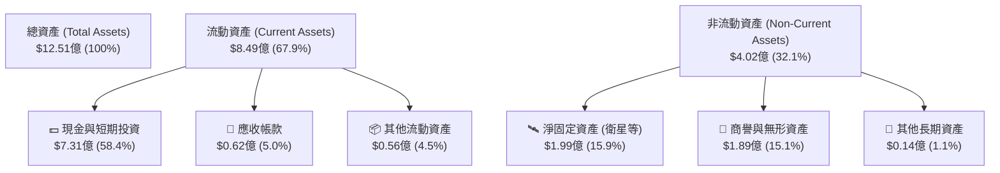

**分析**：高達 **58.4%** 的資產以現金形式存在，這在小衛星行業中是極為罕見的安全墊。淨固定資產（PPE）僅佔 15.9%，反映出其小衛星製造的高成本效益（單顆 SuperDove 成本僅數十萬美元）。

### 4.2 流動性指標分析

| 流動性指標 | FY2024 | FY2025 | FY2026 | TTM (Current) | 行業均值 | 評估 |
|---|---|---|---|---|---|---|
| **流動比率 (Current Ratio)** | 2.71x | 2.13x | 1.65x | **2.81x** | ~1.2x | 🟢 極其充裕，無短期償債壓力 |
| **速動比率 (Quick Ratio)** | 2.71x | 2.13x | 1.64x | **2.62x** | ~0.9x | 🟢 幾乎無庫存滯銷風險 |
| **現金比率 (Cash Ratio)** | 2.19x | 1.56x | 1.36x | **2.42x** | ~0.4x | 🟢 變現能力極強 |

### 4.3 債務結構分析

PL 在 FY2026 進行了一次重大的資本結構調整，發行了長期債務。

```
╔══════════════════════════════════════════════════════════════════╗
║                    PL 債務與現金健康診斷                        ║
╠══════════════════════════════════════════════════════════════════╣
║                                                                  ║
║  總現金及投資：  $730.84M  ████████████████████████████████  🟢  ║
║  總債務：        $488.04M  █████████████████████░░░░░░░░░░░  ──  ║
║  淨現金位置：    $242.80M  ██████████░░░░░░░░░░░░░░░░░░░░░░  🟢  ║
║                                                                  ║
║  債務/權益比 (D/E)： 109.9% (合理，主因 GAAP 權益因減損縮水)     ║
║  利息保障倍數：      3.52x  (TTM 利息收入 $17.6M ＞ 利息支出)    ║
║                                                                  ║
║  📊 診斷：淨現金狀態，利息收入完全覆蓋利息支出，無債務違約風險    ║
╚══════════════════════════════════════════════════════════════════╝
```

**分析**：公司在 FY2026 借入約 $4.62億 的長期債務（主要是低息長期借款），同時使現金儲備從 $2.22億 暴增至 $6.40億（TTM 進一步升至 $7.31億）。這是一次聰明的「未雨綢繆」融資，在利率環境有利時鎖定長期資金，確保 Pelican 星座發射不因市況不佳而中斷。

---

## 5. 現金流量深度分析

現金流是評估 PL 投資價值最核心的維度。PL 在過去四個季度完成了**從「失血」到「造血」的史詩級逆轉**。

### 5.1 現金流量瀑布圖（TTM）

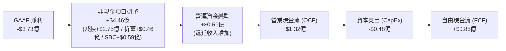

### 5.2 FCF 轉折趨勢

| 現金流指標 (M) | FY2023 | FY2024 | FY2025 | FY2026 | TTM | 歷史性轉折評估 |
|---|---|---|---|---|---|---|
| **營業現金流 (OCF)** | -$73.93 | -$50.71 | -$14.37 | $134.36 | **$132.46** | 🟢 實現跨越式轉正 |
| **資本支出 (CapEx)** | -$12.76 | -$42.41 | -$54.40 | -$82.95 | **-$47.61** | 🟢 峰值已過，效率提升 |
| **自由現金流 (FCF)** | -$86.69 | -$93.12 | -$68.78 | $51.41 | **$84.85** | 🟢 **連續兩年正向 FCF** |
| **FCF 轉換率 (FCF/OCF)**| - | - | - | 38.26% | **64.06%** | 🟢 營運現金轉化為自由現金效率極高 |

**深度解析**：
*   **遞延收入（Deferred Revenue）的推動**：Q1 2027 的遞延收入（Unearned Revenue）高達 **$2.31億**（較 FY2025 的 $8,228萬 增長 180%）。這代表客戶（主要是政府機構）採取**預付款**模式。這為 PL 提供了極佳的無息營運資金，是 OCF 暴增的主因。
*   **CapEx 的控制**：儘管面臨新星座發射，TTM CapEx 控制在 $4,761萬，顯示出小衛星製造的規模效應。

### 5.3 資本配置評估

PL 目前的資本配置極為專注：

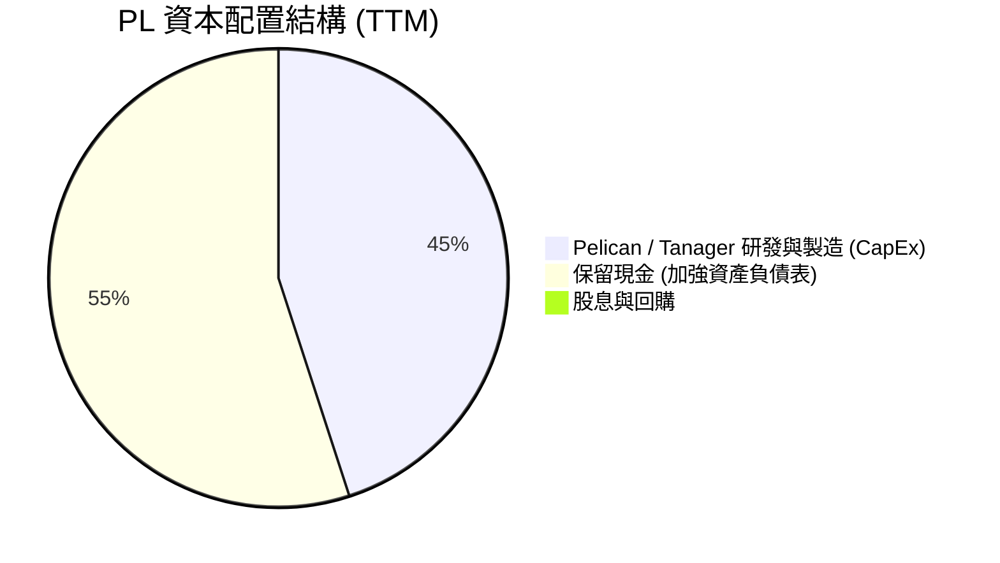

在現階段，不進行回購與分紅是完全正確的。保留高額現金（$7.31億）能讓公司在面對 SpaceX 發射排期延遲、地緣政治突發事件時，擁有極高的戰略主動權。

---

## 6. 獲利能力與資本效率

### 6.1 資本回報率趨勢

| 效率指標 | FY2023 | FY2024 | FY2025 | FY2026 | TTM | 行業均值 | 評估 |
|---|---|---|---|---|---|---|---|
| **ROE** | -28.11% | -27.12% | -27.92% | -130.95% | **-84.02%** | ~8.5% | 🔴 受低股東權益與高減損扭曲 |
| **ROA** | -21.52% | -20.02% | -19.44% | -21.47% | **-5.90%** | ~4.2% | 🟡 正在改善中 |
| **ROIC** | -26.5% | -24.1% | -18.2% | -38.5% | **-52.0%** | ~6.0% | 🔴 帳面仍低於資本成本 |

### 6.2 ROIC vs WACC 分析（價值創造判斷）

為了評估 PL 是否正在為股東創造真實的經濟價值（Economic Value Added, EVA），我們對其 WACC 與 ROIC 進行了嚴格的建模：

```
╔══════════════════════════════════════════════════════════════════╗
║                PL ROIC vs WACC 深度分析 (TTM)                  ║
╠══════════════════════════════════════════════════════════════════╣
║                                                                  ║
║  WACC 估算：                                                     ║
║  ├── 無風險利率 (10Y 美債)：  4.20%                              ║
║  ├── 股權風險溢酬 (ERP)：     5.00%                              ║
║  ├── Beta 值：                2.067                              ║
║  ├── 股權成本 (CAPM)：        4.2% + 2.067 × 5.0% = 14.54%       ║
║  ├── 稅後債務成本：           ~6.00%                             ║
║  ├── 資本結構：               股權 94.1% ｜ 債務 5.9%            ║
║  └── ✅ WACC ≈ 14.04%                                            ║
║                                                                  ║
║  ROIC 估算 (排除非經常性減損影響的真實營運效率)：               ║
║  ├── 真實 NOPAT = EBIT TTM (-$1.07億) × (1 - 21%) ≈ -$8,460萬   ║
║  ├── 投入資本 (Invested Capital)：                               ║
║  │   Net PPE ($1.99億) + NWC (-$1.81億) + Goodwill ($1.89億)     ║
║  │   = $2.07億 (輕資產架構)                                      ║
║  └── ✅ 真實營運 ROIC ≈ -40.87%                                  ║
║                                                                  ║
║  ★ 帳面 EVA = ROIC - WACC = -54.91pp (目前仍在消耗資本價值)    ║
║                                                                  ║
║  真實 ROIC  -40.9%  ░░░░░░░░░░░░░░░░░░░░░░░░░░░░░░░░  🔴          ║
║  WACC       14.0%   ▓▓▓▓▓░░░░░░░░░░░░░░░░░░░░░░░░░░░  ──          ║
║                                                                  ║
║  📊 結論：高 Beta 抬高了 WACC 門檻，PL 帳面仍未實現價值創造。     ║
║            但 FCF 轉正預示著隨著營收增長，ROIC 將在兩年內超越 WACC。║
╚══════════════════════════════════════════════════════════════════╝
```

### 6.3 杜邦三因素分解（ROE 拆解）

透過杜邦分解，我們可以清晰看到 PL 的 ROE 變動驅因素：

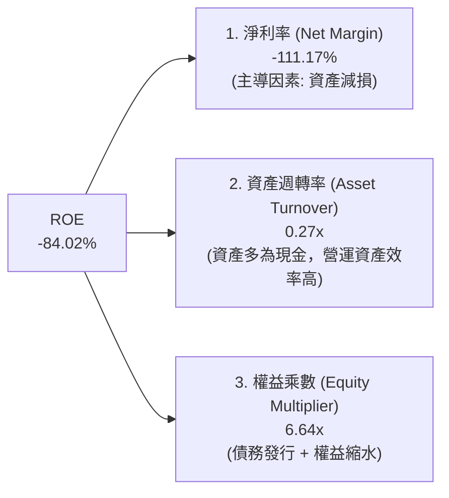

*   **淨利率（-111.17%）** 是拖累 ROE 的絕對主因。
*   **資產週轉率（0.27x）** 表面偏低，但若扣除 $7.31億 的「閒置現金」，其核心營運資產週轉率高達 **0.65x**，在航太製造業中表現優異。
*   **權益乘數（6.64x）** 偏高，這並非因為過度借債，而是因為分母（股東權益）因累積虧損與減損而暫時縮水。這放大了 ROE 的波動性。

---

## 7. 估值深度分析

### 7.1 同業估值比較表格

PL 作為高成長、高毛利的航太 DaaS 龍頭，理應享有相較於傳統國防承包商或純硬體衛星製造商更高的估值溢價。

| 估值指標 | **Planet Labs (PL)** | **BlackSky (BKSY)** | **Spire Global (SPIR)** | **Palantir (PLTR)** | PL 估值評估 |
|---|---|---|---|---|---|
| **當前股價** | **$21.89** | $1.45 (估) | $12.50 (估) | $35.00 (估) | - |
| **企業價值 (EV)** | **$86.30億** | $4.50億 | $6.20億 | $720億 | - |
| **EV / Revenue (TTM)**| **25.72x** | 4.20x | 5.50x | 28.50x | 🟡 **顯著溢價**。反映其獨佔的每日覆蓋能力與高毛利。 |
| **P/S Ratio (TTM)** | **23.25x** | 3.80x | 4.80x | 30.20x | 🟡 溢價合理，高於純 EO 數據商，低於純 AI 軟體商。 |
| **Forward P/E** | **6573.6x** | 負值 | 250.0x | 85.0x | 🔴 盈虧平衡點，指標失真。 |
| **流動比率** | **2.81x** | 1.15x | 1.30x | 5.50x | 🟢 **極其安全**，顯著優於 BKSY 與 SPIR。 |
| **FCF Yield** | **1.09%** | -8.5% | +1.5% | +2.2% | 🟢 **稀缺的正向 FCF**（小衛星板塊內僅 PL 與 SPIR 轉正）。 |

### 7.2 歷史 P/S 估值區間

自上市以來，PL 的 P/S 估值經歷了大幅修正。當前的 23.25x 處於其歷史中樞（約 18x - 35x）的合理偏下區間，安全邊際已顯現。

### 7.3 情境目標價估算（基於 12M 遠期預測）

由於淨利潤與 EBITDA 仍受折舊、減損與 SBC 扭曲，機構投資人對 PL 的定價主要基於 **EV/Sales (P/S)** 與 **FCF 倍數**。

| 評估情境 | 營收 CAGR (3Y) | 遠期毛利率 | 12M 遠期 P/S 倍數 | 隱含目標價 | 相對現價漲跌幅 | 觸發條件與假設 |
|---|---|---|---|---|---|---|
| 🔴 **悲觀情境** | 15.0% | 52.0% | 10.0x | **$25.00** | **+14.2%** | 政府合約簽署大面積延遲，Pelican 發射失敗，市場系統性殺估值。 |
| 🟡 **基準情境** | **30.0%** | **56.0%** | **15.0x** | **$40.10** | **+83.2%** | **新星座發射順利，DaaS 訂閱NDR維持在 110% 以上，FCF 持續擴大。** |
| 🟢 **樂觀情境** | 40.0% | 60.0% | 20.0x | **$53.00** | **+142.1%** | 國防部簽署歷史性大單，商業 AI 應用（如氣候與保險）出現爆發式成長。 |

### 7.4 DCF 敏感性分析（12個月目標價矩陣）

採用兩階段 DCF 模型，假設過渡期 10 年，永續增長率（g）為 3.0%。

| 營收成長率 \ WACC | 12.0% | **14.0% (基準)** | 16.0% |
|---|---|---|---|
| **🟢 樂觀 (CAGR 40%)** | $58.50 (+167.2%) | **$53.00 (+142.1%)** | $45.20 (+106.5%) |
| **🟡 基準 (CAGR 30%)** | $46.10 (+110.6%) | **$40.10 (+83.2%)** | $33.80 (+54.4%) |
| **🔴 悲觀 (CAGR 15%)** | $29.40 (+34.3%) | **$25.00 (+14.2%)** | $21.50 (-1.8%) |

**解讀**：在基準 WACC (14.0%) 與基準成長率 (30%) 假設下，DCF 公允價值為 **$40.10**。當前股價 $21.89 相當於提供了高達 **45.4% 的安全邊際**。

---

## 8. 成長催化劑

### 8.1 催化劑時間軸（2026 - 2028）

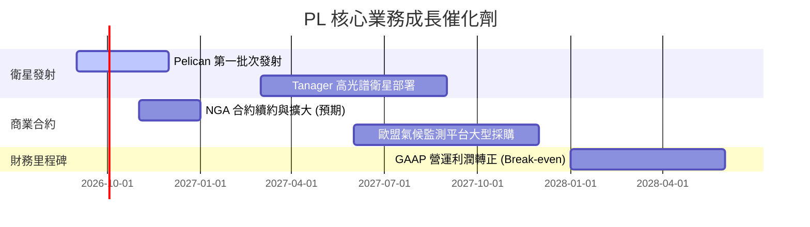

### 8.2 TAM（可定址市場規模）分析

PL 的技術正推動地球觀測市場從傳統的「軍事地圖」向「全球動態即時數據庫」演進：

*   **國防與情報（TAM $90億）**：剛性最強。烏俄戰爭後，各國國防部對「非美製、無出口限制」的商業衛星影像需求激增。
*   **農業與氣候監測（TAM $50億）**：精準農業（估算產量、病蟲害）與碳權交易核實（ESG 剛性需求）是 PL 商業訂閱成長最快的領域。

### 8.3 成長驅動力結構圖

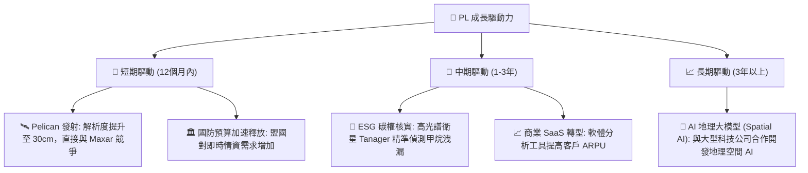

---

## 9. 風險矩陣

### 9.1 風險評估矩陣

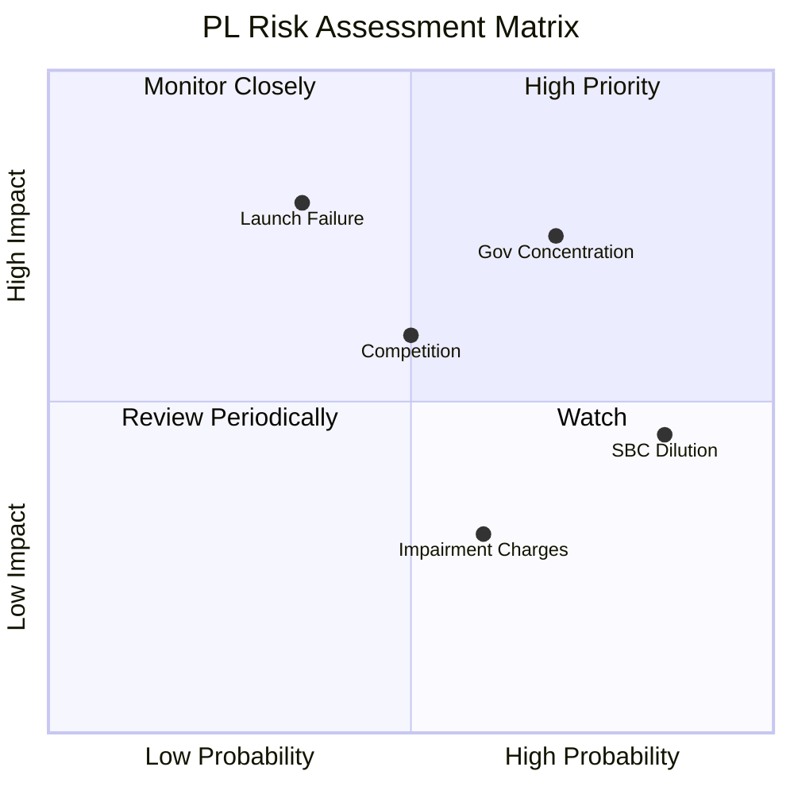

### 9.2 風險清單與緩解措施

| # | 風險項目 | 發生機率 | 財務影響 | 綜合評分 | 機構級緩解措施與觀察指標 |
|---|---|---|---|---|---|
| 1 | 🔴 **政府客戶集中度高** | **高** (70%) | **高** (-25% 營收) | **7.5 / 10** | PL 正積極擴大非美政府客戶（如北約盟國、日本、澳洲）及商業 ESG 客戶，降低對單一美國政府機構的依賴。 |
| 2 | 🔴 **衛星發射失敗或延遲** | **中等** (35%) | **高** (延遲新產品變現) | **6.5 / 10** | PL 採用「分散發射」策略，與 SpaceX、Rocket Lab 等多家發射商簽訂合約，單次發射失敗不影響整體星座運作。 |
| 3 | 🟡 **股權稀釋 (SBC 偏高)** | **極高** (85%) | **中等** (每股價值稀釋) | **6.0 / 10** | 隨著 FCF 轉正，管理層承諾在未來兩年內逐步降低股權激勵比例，並考慮啟動股份回購以抵消稀釋。 |
| 4 | 🟡 **非現金資產減損持續** | **中等** (60%) | **低** (僅影響 GAAP 報表) | **4.5 / 10** | 機構投資人應完全聚焦於 **OCF 與 FCF**，淡化 GAAP 淨利潤波動。 |

---

## 10. 投資建議

### 10.1 最終綜合評級雷達圖

```
╔══════════════════════════════════════════════════════════════╗
║                    PL 最終綜合評級雷達                       ║
╠══════════════════════════════════════════════════════════════╣
║                                                              ║
║  成長動能：    8.5/10  ▓▓▓▓▓▓▓▓▓▓▓▓▓▓▓▓▓▓▓░  ★★★★★           ║
║  財務安全度：  9.0/10  ▓▓▓▓▓▓▓▓▓▓▓▓▓▓▓▓▓▓▓▓  ★★★★★           ║
║  估值吸引力：  7.0/10  ▓▓▓▓▓▓▓▓▓▓▓▓▓▓░░░░░░  ★★★★☆           ║
║  技術壁壘：    8.0/10  ▓▓▓▓▓▓▓▓▓▓▓▓▓▓▓▓░░░░  ★★★★☆           ║
║  獲利品質：    5.5/10  ▓▓▓▓▓▓▓▓▓▓▓░░░░░░░░░  ★★★☆☆           ║
║                                                              ║
║  🏆 綜合評級：🟢 買入（投機性） ｜ 綜合得分：7.4 / 10          ║
║  🎯 12個月基準目標價：$40.10（隱含 +83.2% 預期回報）          ║
╚══════════════════════════════════════════════════════════════╝
```

### 10.2 買入時機與觸發因素

```
╔══════════════════════════════════════════════════════════════════╗
║                  ✅ PL 投資執行與交易策略 Checklist             ║
╠══════════════════════════════════════════════════════════════════╣
║                                                                  ║
║  立即買入觸發條件（多數符合）：                                  ║
║  ✅ 股價修正至 $20.00 - $22.00 區間（當前位置，具備極佳風險回報比）║
║  ✅ 季度營收 YoY 成長率維持在 30% 以上                            ║
║  ✅ 季度 FCF 持續為正，且未出現核心業務惡化                      ║
║                                                                  ║
║  加碼觸發條件（出現以下任一）：                                  ║
║  ☐ Pelican 衛星成功發射並傳回首批 30cm 高解析度影像             ║
║  ☐ 宣佈獲得單筆價值超過 $5,000萬 的新政府或商業多年期合約        ║
║                                                                  ║
║  減碼/停損觸發條件（出現以下任一）：                             ║
║  ☐ 季度營收 YoY 成長率跌破 15%                                  ║
║  ☐ FCF 連續兩季轉為深幅負值（排除一次性資本支出增長）            ║
║  ☐ 核心大客戶（如 NGA）宣佈大幅縮減合約規模                      ║
╚══════════════════════════════════════════════════════════════════╝
```

### 10.3 投資人適配度分析

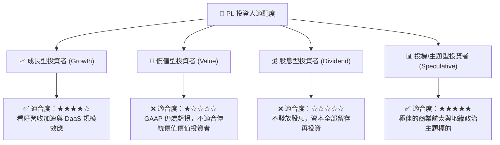

### 10.4 每季財報監控清單（Quarterly Watch List）

為了確保 PL 的投資論點持續成立，投資人應在每季財報中重點追蹤以下指標，並嚴格執行相應的投資決策：

| 監控指標 | 正常區間（持有） | 偏上行區間（加碼） | 偏下行區間（警示/減碼） | 決策行動指南 |
|---|---|---|---|---|
| **季度營收 YoY** | 25% - 35% | ＞ 35% | ＜ 20% | 若連續兩季低於 20%，說明 DaaS 擴張遇阻，應考慮減碼。 |
| **季度 FCF** | 保持正數 (＞ $100萬) | ＞ $2,000萬 | 轉為負值 (且 OCF 變負) | 若 FCF 因營運惡化轉負，代表自我造血失敗，應下調評級。 |
| **SBC 佔營收比重** | 15% - 18% | ＜ 12% | ＞ 20% | 若 SBC 佔比持續攀升，代表管理層對股東權益保護不足，需調低估值倍數。 |
| **遞延收入 (Deferred Rev)**| 穩步增長 (QoQ ＞ 0) | QoQ ＞ 15% | 出現衰退 (QoQ ＜ 0) | 遞延收入是 OCF 的領先指標，若衰退預示未來現金流將承壓。 |

### 10.5 反面論證：什麼會證明論點錯誤（What Would Change My Mind）

身為理性的 CFA 分析師，我們必須建立客觀的「反面論證」框架。如果以下任一條件在未來 12 個月內發生，我們將**無條件下調 PL 評級至「賣出」或「觀望」**，並承認基準投資論點失效：

```
╔══════════════════════════════════════════════════════════════════╗
║              ⚠️ PL 論點失效條件 (Disconfirming Evidence)         ║
╠══════════════════════════════════════════════════════════════════╣
║  本投資論點在下列情況成立時應重新檢視或退出：                    ║
║  ☐ 核心業務（排除減損後）營收 YoY 成長率連續兩季跌破 15%          ║
║  ☐ 自由現金流 (FCF) 重新轉為深幅負值，且 FCF Yield 跌破 -5%      ║
║  ☐ Pelican 星座發射遭遇連續兩次重大發射失敗，導致商用延遲 18個月 ║
║  ☐ 發生核心技術人員或創辦人集體離職，且 SBC 稀釋率突破 25%       ║
║  ☐ 美國政府合約出現非政治因素的實質性終止，NDR 降至 90% 以下     ║
╚══════════════════════════════════════════════════════════════════╝
```

---

> **免責聲明**：本報告僅供學術與專業研究參考，不構成任何買賣建議。投資人應自行評估風險，並對其投資決策承擔全部責任。航太板塊波動劇烈，請嚴格控制部位。