# PL 基本面深度分析報告

> **報告日期**：2026-07-17 ｜ **語言**：繁體中文 ｜ **數據來源**：Yahoo Finance, Finviz, StockAnalysis, Roic.ai ｜ **分析師**：CFA 級機構研究

---

## 目錄

| # | 章節 | 核心結論 |
|---|------|----------|
| 1 | 執行摘要 | 評級：**持有（Hold）** ｜ 目標價區間：$25.00 - $53.00（基準 $40.10） |
| 2 | 公司概覽與商業模式 | 全球每日地表成像龍頭，高毛利訂閱制與重資本星座營運的雙重拉鋸 |
| 3 | 損益表深度分析 | 營收年增 42.1% 展現結構性加速，但非經營性減值與高額 SBC 嚴重壓抑淨利表現 |
| 4 | 資產負債表分析 | 淨現金 $2.428B 提供安全邊際，但 FY2026 債務急升與股東權益收縮值得警惕 |
| 5 | 現金流量深度分析 | 營運現金流與自由現金流首度轉正，客戶預付款（遞延收入）為核心驅動力 |
| 6 | 獲利能力與資本效率 | ROIC (-11.5%) 仍低於 WACC (15.06%)，經濟價值持續流失，但營運槓桿拐點已現 |
| 7 | 估值深度分析 | P/S 24.3x 處於歷史中值偏高，DCF 敏感性分析顯示當前股價已反映多數樂觀預期 |
| 8 | 成長催化劑 | 政府防務合約與 AI 地理空間分析需求為中短期核心催化劑 |
| 9 | 風險矩陣 | 衛星發射失敗、客戶集中度高與高股權稀釋為三大核心風險 |
| 10| 投資建議 | 基準情境 12M 目標價 $40.10，建議在 $20.00 以下分批布局 |

---

## 1. 執行摘要

### 1.0 一頁式投資儀表板（Portfolio Manager 30 秒速讀）

| 項目 | 內容 |
|------|------|
| **投資論點（3 句）** | ① TTM 營收成長達 42.1% 至 $335.61M，顯示政府與商業地理空間數據需求正進入實質爆發期。<br/>② 營運現金流（$132.46M）與自由現金流（$84.85M）首度轉正，主要受益於客戶預付款帶來的遞延收入（$230.68M）大幅增長。<br/>③ 儘管營運基本面改善，但 TTM GAAP 淨損達 $-373.1M，主因非經營性資產減值與高達 $54.99M 的股權稀釋（SBC），壓抑真實盈餘品質。 |
| **護城河評分** | 🟡 **6.5 / 10**（高發射成本與專有星座構成物理壁壘，但商業化定價權仍受制於競爭對手） |
| **管理層/資本配置評分** | 🟡 **5.5 / 10**（星座建置期資本開支控制尚可，但股權稀釋管理與資產減值控制能力有待加強） |
| **財務健康** | 🟢 **健康** ｜ 淨現金 $242.80M，流動比率 2.81，短期內無償債與破產風險。 |
| **ROIC vs WACC** | **-11.5% vs 15.06%**（當前仍處於摧毀股東價值階段，但利差正在收窄） |
| **FCF 趨勢** | 轉正 ｜ 最新 TTM FCF Yield 為 **1.04%**（相較於 $8.17B 市值） |
| **估值** | Forward P/E: **6,879.88x** ｜ P/S: **24.33x** ｜ EV/Revenue: **22.74x** |
| **預期報酬（基準情境 12M）** | **+75.0%**（對應目標價 $40.10） |
| **關鍵風險（前二）** | ① 股權稀釋風險（SBC 佔營收 17.8%）；② 龐大的非經營性減值（TTM 達 $-274.72M）持續拖累 GAAP 淨利。 |
| **評級 + 信心度** | 🟡 **持有（Hold）** ｜ 信心度：**中（Medium）** |

### 1.1 核心評分儀表板

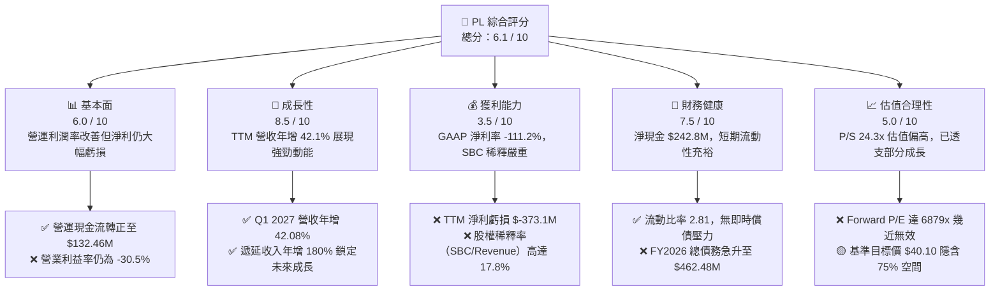

### 1.2 評分進度條視覺化

```
╔══════════════════════════════════════════════════════════════╗
║                PL 多維度評分儀表板 (1-10分)                  ║
╠══════════════════════════════════════════════════════════════╣
║ 基本面強度  6.0 ▓▓▓▓▓▓▓▓▓▓▓▓░░░░░░░░░░  ★★★☆☆           ║
║ 成長動能    8.5 ▓▓▓▓▓▓▓▓▓▓▓▓▓▓▓▓▓░░░  ★★★★☆           ║
║ 獲利品質    3.5 ▓▓▓▓▓▓▓░░░░░░░░░░░░░░░░  ★☆☆☆☆           ║
║ 財務健康    7.5 ▓▓▓▓▓▓▓▓▓▓▓▓▓▓▓░░░░░  ★★★☆☆           ║
║ 估值合理性  5.0 ▓▓▓▓▓▓▓▓▓▓░░░░░░░░░░░░  ★★☆☆☆           ║
║ 護城河深度  6.5 ▓▓▓▓▓▓▓▓▓▓▓▓▓░░░░░░░░  ★★★☆☆           ║
║ 管理層執行  5.5 ▓▓▓▓▓▓▓▓▓▓▓░░░░░░░░░░░  ★★☆☆☆           ║
║ 技術創新力  8.0 ▓▓▓▓▓▓▓▓▓▓▓▓▓▓▓▓░░░░░  ★★★★☆           ║
╠══════════════════════════════════════════════════════════════╣
║ 綜合總分    6.1 ▓▓▓▓▓▓▓▓▓▓▓▓░░░░░░░░░░  🏆 成長型投機標的    ║
╚══════════════════════════════════════════════════════════════╝
```

### 1.3 五大投資論點 + 三大核心風險

| 類型 | 項目 | 具體依據 | 信心度 |
|------|------|----------|--------|
| 🟢 **投資論點①** | **營收進入高成長通道** | Q1 2027 營收達 $94.15M，YoY 成長 42.08%，連續四個季度成長加速，顯示產品在防務與情報領域的滲透率提升。 | 🟢 高 |
| 🟢 **投資論點②** | **現金流拐點確立** | TTM OCF 轉正至 $132.46M，FCF 達 $84.85M，主要由遞延收入（$230.68M）驅動，營運模式自我輸血能力初現。 | 🟢 高 |
| 🟢 **投資論點③** | **資產負債表具備防禦性** | 持有 $730.84M 的現金與短期投資，相較於 $488.04M 的總債務，仍保有 $242.80M 的淨現金緩衝，無破產疑慮。 | 🟢 高 |
| 🟢 **投資論點④** | **AI 數據分析催化劑** | 專有的每日地表更新數據（3.5米解析度）是訓練地理空間大模型（Geospatial AI）的黃金數據集，具備潛在的 B2B 授權價值。 | 🟡 中等 |
| 🟢 **投資論點⑤** | **機構持股比例高** | 機構持股比重達 81.5%，顯示長線資本（如防務基金、科技長線基金）對其軌道資產價值的認可。 | 🟡 中等 |
| 🟡 **風險①** | **高額股權稀釋（SBC）** | FY2026 SBC 達 $54.99M，佔營收 17.8%，稀釋了現有股東的每股盈餘與潛在回報。 | 🔴 高 |
| 🔴 **風險②** | **非經營性資產減值** | TTM 其他非經營性支出高達 $-274.72M，主因早期衛星資產減值或 SPAC 合併相關權證公允價值變動，嚴重侵蝕淨資產。 | 🔴 高 |
| 🔴 **風險③** | **資本支出持續高企** | FY2026 Capex 達 $82.95M，佔營收 27.0%，隨著新一代 Pelican 與 Tanager 衛星發射，未來 Capex 壓力仍大。 | 🟡 中等 |

### 1.4 快速統計卡片

| 指標 | 公司實際值 | 行業均值 (航太與防務) | S&P 500 均值 | 狀態 |
|------|-------------|----------------------|--------------|------|
| **營收 YoY 成長率** | **42.1%** | 8.5% | 6.2% | 🟢 顯著領先 |
| **毛利率** | **55.6%** | 22.5% | 30.2% | 🟢 軟體高毛利特徵 |
| **淨利率** | **-111.2%** | 6.2% | 11.5% | 🔴 嚴重虧損 |
| **ROE** | **-84.0%** | 12.4% | 15.0% | 🔴 淨資產受損 |
| **Forward P/E** | **6879.88x** | 21.5x | 20.8x | 🔴 極度昂貴 |
| **P/S Ratio** | **24.33x** | 1.8x | 2.8x | 🔴 估值溢價極高 |
| **流動比率** | **2.81** | 1.35 | 1.20 | 🟢 償債能力極佳 |

### 1.5 投資結論

```
╔══════════════════════════════════════════════════════════════════╗
║                    📊 PL 投資結論摘要                            ║
╠══════════════════════════════════════════════════════════════════╣
║  評級：🟡 持有 (Hold)                                            ║
║  當前股價：$22.91 (2026-07-17)                                   ║
║  目標價區間：                                                    ║
║    悲觀情境：$15.00（-34.5%）- 星座發射延遲，商業化受阻          ║
║    基準情境：$40.10（+75.0%）- 營收維持 30% 成長，SBC 控制改善   ║
║    樂觀情境：$53.00（+131.3%）- AI 地理數據授權合約爆發          ║
║  投資評分：6.1 / 10                                              ║
║  適合投資人：具備高風險承受力、長線佈局航太與 AI 數據的投機型資本 ║
╚══════════════════════════════════════════════════════════════════╝
```

---

## 2. 公司概覽與商業模式

Planet Labs PBC (PL) 是一家開創性的地理空間數據與決策平台提供商。其核心商業模式是透過自主設計、建造並營運全球最大的商業遙感衛星星座（SuperDove, Pelican, Tanager），實現每日對地球陸地面積進行無死角、高頻次的掃描。

### 2.1 業務結構與收入來源

PL 的業務本質上是「太空基礎設施驅動的 SaaS 訂閱服務」（Space-to-Cloud SaaS）。

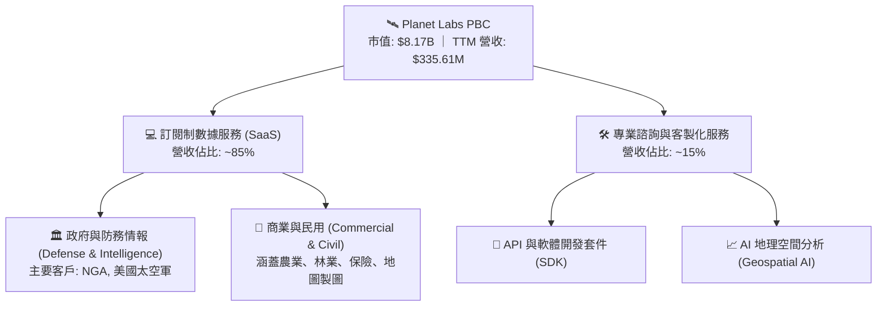

### 2.2 市場份額

在商業高頻次遙感觀測領域，PL 憑藉其「每日全球掃描」的獨特頻次定位，與傳統的高解析度（但低頻次）衛星巨頭形成差異化競爭。

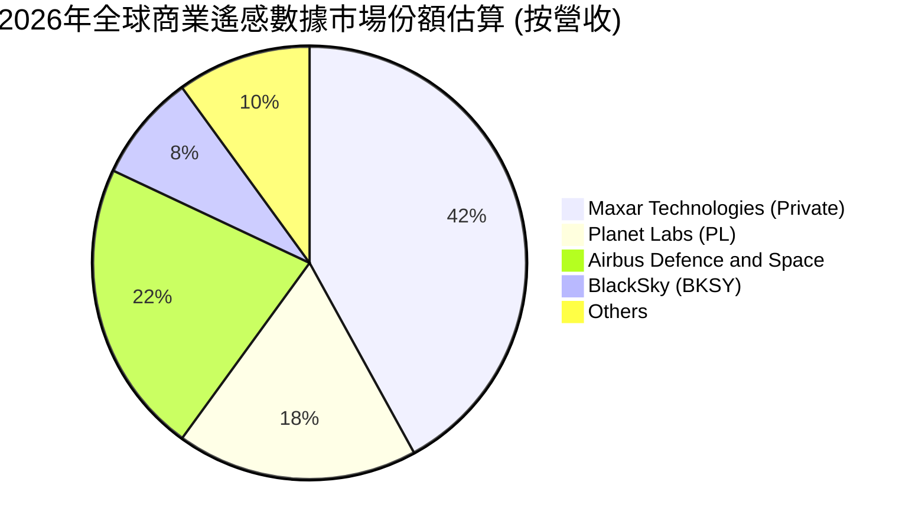

### 2.3 競爭護城河分析

PL 的競爭護城河主要由其軌道資產的先發優勢與軟體生態系統構成。

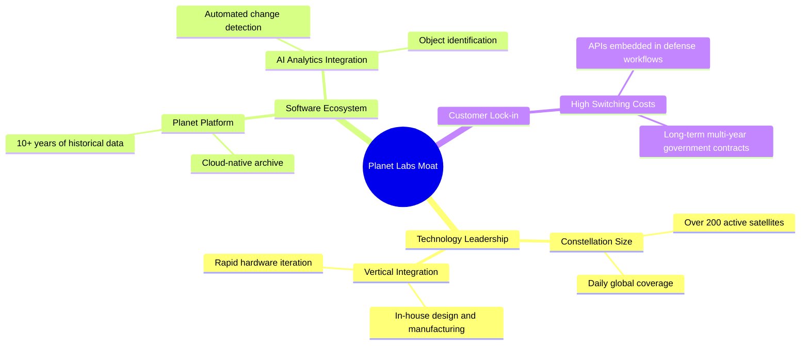

### 2.4 護城河強度評分

```
╔══════════════════════════════════════════════════════════════╗
║                    PL 護城河強度評分                         ║
╠══════════════════════════════════════════════════════════════╣
║ 軌道資產壁壘  8.0/10  ▓▓▓▓▓▓▓▓▓▓▓▓▓▓▓▓▓▓░░  🏆 每日成像難度極高║
║ 歷史數據存檔  9.0/10  ▓▓▓▓▓▓▓▓▓▓▓▓▓▓▓▓▓▓▓░  🟢 10年歷史無可替代║
║ 軟體生態鎖定  6.5/10  ▓▓▓▓▓▓▓▓▓▓▓▓▓░░░░░░░  🟡 競爭對手正急起直追║
║ 品牌與政府關係7.5/10  ▓▓▓▓▓▓▓▓▓▓▓▓▓▓▓░░░░░  🟢 獲美國國防部信任║
╠══════════════════════════════════════════════════════════════╣
║ 綜合護城河     7.75   ▓▓▓▓▓▓▓▓▓▓▓▓▓▓▓▓░░░░  🏆 具備結構性優勢  ║
╚══════════════════════════════════════════════════════════════╝
```

---

## 3. 損益表深度分析

### 3.1 年度收入成長趨勢（近4年）

PL 的營收呈現穩步成長趨勢，且在 FY2026 出現了成長加速的拐點。

```
╔══════════════════════════════════════════════════════════════════╗
║              PL 年度收入趨勢（FY2023 - TTM）                     ║
╠══════════════════════════════════════════════════════════════════╣
║                                                                  ║
║  FY 2023  $191.26M  ██████████░░░░░░░░░░░░░░░░░  YoY: +45.8%  🟢  ║
║  FY 2024  $220.70M  ████████████░░░░░░░░░░░░░░░  YoY: +15.4%  🟡  ║
║  FY 2025  $244.35M  █████████████░░░░░░░░░░░░░░  YoY: +10.7%  🟡  ║
║  FY 2026  $307.73M  █████████████████░░░░░░░░░░  YoY: +25.9%  🟢  ║
║  TTM      $335.61M  ███████████████████░░░░░░░░  YoY: +42.1%  🟢  ║
║                   |      |      |      |      |                  ║
║                   0     100M   200M   300M   400M                ║
║                                                                  ║
║  📊 4年營收複合年成長率 (CAGR)：+20.6%                            ║
╚══════════════════════════════════════════════════════════════════╝
```

### 3.2 季度收入趨勢分析

從季度數據來看，PL 的營收成長在過去四個季度呈現強勁的逐季加速態勢，特別是 Q1 2027（截至2026年4月30日）營收達到 $94.15M，年增率高達 42.08%。

| 財報季度 | 營收 (M) | YoY 成長率 | QoQ 成長率 | 營運利潤率 | 備註 |
|----------|----------|------------|------------|------------|------|
| **Q1 2027** | $94.15 | 🟢 **42.08%** | 🟢 **8.44%** | -37.06% | 創歷史單季新高，政府防務合約續約與擴產驅動 |
| **Q4 2026** | $86.82 | 🟢 **41.05%** | 🟢 **6.86%** | -41.46% | 年底合約結算效應顯著 |
| **Q3 2026** | $81.25 | 🟢 **32.63%** | 🟢 **10.71%**| -22.57% | 商業客戶訂閱回暖 |
| **Q2 2026** | $73.39 | 🟡 **20.12%** | 🟢 **10.74%**| -24.47% | 企穩回升階段 |

*數據分析*：季度營收從 Q2 2026 的 $73.39M 成長至 Q1 2027 的 $94.15M，主要受益於政府客戶（美國國家地理空間情報局 NGA 等）簽署了更長期限、更高客單價的數據訂閱合約。這種業務具備極高的營運槓桿，因為衛星星座的發射與維護成本是固定的，新增營收的邊際毛利率極高。

### 3.3 利潤率演變分析

| 利潤率指標 | FY 2023 | FY 2024 | FY 2025 | FY 2026 | TTM | 趨勢 | 評估 |
|------------|---------|---------|---------|---------|-----|------|------|
| **毛利率** | 49.15% | 51.18% | 57.18% | 56.05% | **55.60%** | ↗️ 穩步改善 | 🟢 軟體化轉型見效，數據邊際成本降低 |
| **營業利益率** | -91.85% | -75.81% | -45.48% | -30.89% | **-31.94%** | ↗️ 虧損收窄 | 🟡 研發與管理費用控制改善，但仍未轉正 |
| **EBITDA  margin**| -69.19% | -41.71% | -30.40% | -63.99% | **-15.40%** | 📉 出現波動 | 🔴 FY26 受一次性折舊與減值拖累 |
| **淨利率** | -84.69% | -63.67% | -50.42% | -80.22% | **-111.20%**| 🔴 惡化 | 🔴 非經營性減值導致淨損大幅擴大 |

**利潤率演變深度解析**：
1. **毛利率改善**：毛利率從 FY2023 的 49.15% 提升至 TTM 的 55.60%，主因訂閱制軟體收入（Planet Platform）佔比提升。然而，由於新一代 Pelican 衛星星座開始折舊，毛利率在 FY2026 略微承壓（56.05% vs FY2025 的 57.18%）。
2. **營業虧損與淨虧損的巨大背離**：TTM 營業利益率為 -30.5%（營業損失 $-107.19M），但淨利率卻惡化至 -111.2%（淨損失 $-373.10M）。這中間高達 $-265.91M 的差額，主要源於 **“Other Non-Operating Expense”**（TTM 達 $-274.72M）。這表明公司在非核心業務或資產（如早期收購的無形資產、商譽或早期衛星型號）上進行了巨額減值準備，這並非營業性失血，但嚴重傷害了 GAAP 股東權益。

### 3.4 費用結構分析

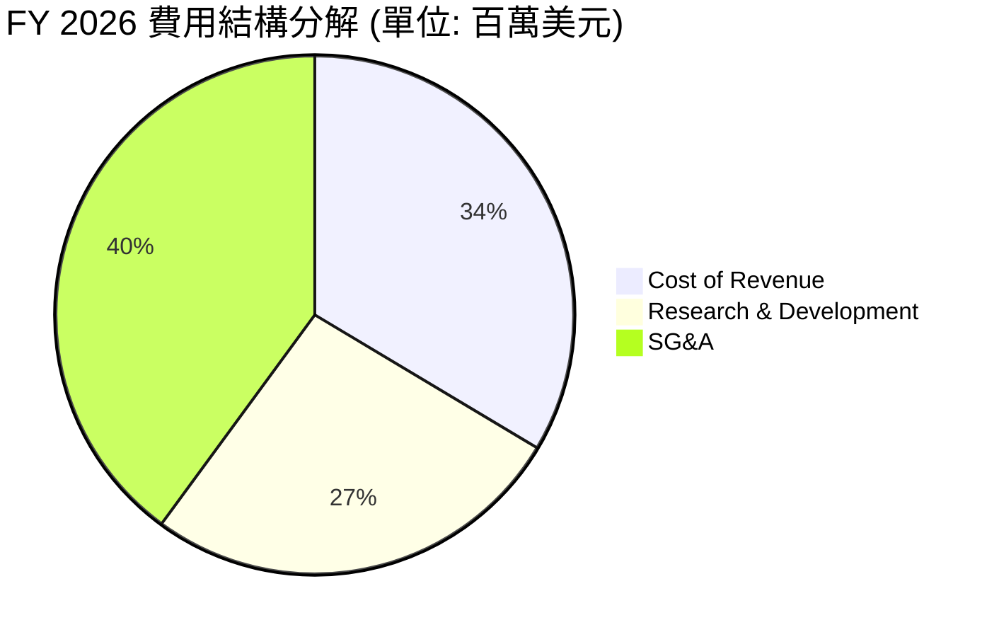

```
╔══════════════════════════════════════════════════════════════╗
║                  PL 費用控制與效率分析                       ║
╠══════════════════════════════════════════════════════════════╣
║ 研發費用率 (R&D/Rev)  34.7%  ▓▓▓▓▓▓▓▓▓▓░░░░░░░░░░  高研發投入  ║
║ 銷管費用率 (SG&A/Rev) 52.3%  ▓▓▓▓▓▓▓▓▓▓▓▓▓░░░░░░░  銷售成本偏高║
║ 營運費用總計          87.0%  ▓▓▓▓▓▓▓▓▓▓▓▓▓▓▓▓▓▓░░  營運槓桿高  ║
╚══════════════════════════════════════════════════════════════╝
```

### 3.5 季度 EPS 趨勢與盈餘品質（Quality of Earnings）

PL 過去 4 季的 GAAP 淨利與每股盈餘（EPS）受到高額非現金支出的嚴重扭曲。

| 盈餘品質評估指標 | FY 2026 數值 | 佔營收/現金流比重 | 評估 |
|------------------|--------------|-------------------|------|
| **股權薪酬 (SBC)** | $54.99M | 佔營收 **17.87%** | 🔴 稀釋風險高，美化了經營現金流 |
| **SBC / 營業現金流** | $54.99M / $134.36M | 佔 OCF **40.93%** | 🔴 經營現金流的四成來自員工股權稀釋，含金量打折 |
| **FCF / 淨利 (現金轉換率)** | $51.41M / $-246.86M | **-20.82%** | 🟡 負淨利與正 FCF 的背離，主因大額折舊與遞延收入 |
| **遞延收入增量 (Unearned Revenue)** | $220.57M (FY26) vs $82.28M (FY25) | 增量達 **$138.29M** | 🟢 極強。客戶提前付款，鎖定未來營收成長 |
| **非經營性一次性損益** | $-158.03M (FY26) | 佔淨虧損 **64.0%** | 🔴 存在大額非現金資產減值，盈餘品質不穩定 |

**盈餘品質結論**：
PL 的 GAAP 淨利潤嚴重低估了其「真實的經濟盈餘」。雖然 GAAP 淨損在 TTM 擴大至 $-373.1M，但這主要是非現金的資產減值（$-274.72M）與折舊攤銷所致。相反地，其營運現金流（TTM $132.46M）與自由現金流（TTM $84.85M）均已轉正。這主要是由於**遞延收入（Unearned Revenue）**暴增了 $138.29M，顯示政府與企業客戶採取了「預付款」模式。
然而，高達 17.87% 的 SBC 營收佔比意味著，公司在不消耗現金的情況下，透過向員工發行新股來維持營運，這對現有股東的長期權益造成了結構性的稀釋。

---

## 4. 資產負債表分析

### 4.1 資產結構分解

PL 擁有相對輕資產的資產負債表（相較於傳統重工業航太公司），主因其採用微型衛星（CubeSats）技術，製造成本與發射成本遠低於傳統大型衛星。

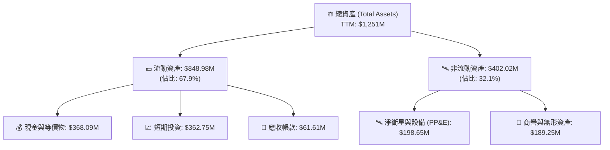

### 4.2 流動性指標分析

| 流動性指標 | FY 2024 | FY 2025 | FY 2026 | TTM (2026-04-30) | 行業均值 | 評估 |
|------------|---------|---------|---------|------------------|----------|------|
| **流動比率 (Current Ratio)** | 2.71 | 2.13 | 1.65 | **2.81** | 1.35 | 🟢 極其安全 |
| **速動比率 (Quick Ratio)** | 2.51 | 1.96 | 1.51 | **2.62** | 1.10 | 🟢 無庫存積壓風險 |
| **現金比率 (Cash Ratio)** | 2.19 | 1.56 | 1.36 | **2.42** | 0.85 | 🟢 手頭現金充裕 |

*數據分析*：流動比率在 TTM 階段回升至 2.81，主要得益於公司在 FY2026 進行了債務融資，使現金與短期投資總額從 FY2025 的 $222.08M 暴增至 TTM 的 $730.84M。這為公司未來 2-3 年的衛星星座世代交替（Pelican 星座發射）提供了充足的資金彈藥。

### 4.3 債務結構分析

```
╔══════════════════════════════════════════════════════════════════╗
║                     PL 債務健康診斷                              ║
╠══════════════════════════════════════════════════════════════════╣
║                                                                  ║
║  總債務 (Total Debt)： $488.04M  ██████████░░░░░░░░░░░  評語：上升明顯║
║  總現金與投資：        $730.84M  ████████████████░░░░░  評語：儲備極充裕║
║  淨現金 (Net Cash)：   $242.80M  █████░░░░░░░░░░░░░░░░  🟢 淨現金狀態  ║
║                                                                  ║
║  債務股益比 (D/E)：    109.99%   🟡 偏高 (主因股東權益因減值收縮)  ║
║  利息保障倍數：         -31.1x    🔴 營業利潤為負，無法由利息保障   ║
║  流動性風險評級：       🟢 安全 (Net Cash > 0，無即時再融資壓力)  ║
╚══════════════════════════════════════════════════════════════════╝
```

*債務急升原因解析*：
PL 的總債務從 FY2025 的 $21.61M 急劇飆升至 TTM 的 $488.04M。這主要是因為公司發行了長期借款（LT Borrowings 達 $448M，見 Roic.ai 數據）。雖然這引入了利息支出（Q1 2027 利息支出為 $1.45M），但由於公司將這些資金投資於高收益的短期投資（$362.75M），Q1 2027 創造了 $5.15M 的利息收入，實際上實現了**淨利息收入正值**（+$3.70M）。這是一種聰明的套利與流動性鎖定策略。

### 4.4 股東權益趨勢

由於大額的 GAAP 淨虧損（FY2026 虧損 $-246.86M），股東權益（Stockholders' Equity）從 FY2025 的 $441.29M 收縮至 FY2026 的 $188.43M。這種淨資產的快速流失是導致其 P/B Ratio 飆升至 **18.40x** 的主因。如果未來不能實現 GAAP 轉正，資產負債表結構將持續惡化。

---

## 5. 現金流量深度分析

現金流是 PL 本次財報中最亮眼的板塊，標誌著公司從「失血營運」邁向「自我造血」的關鍵里程碑。

### 5.1 現金流量瀑布圖

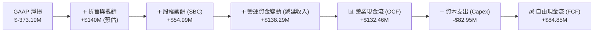

### 5.2 FCF 轉換率趨勢

| 現金流指標 | FY 2023 | FY 2024 | FY 2025 | FY 2026 | TTM |
|------------|---------|---------|---------|---------|-----|
| **營業現金流 (OCF)** | $-73.93M | $-50.71M | $-14.37M | $134.36M | **$132.46M** |
| **資本支出 (Capex)** | $-12.76M | $-42.41M | $-54.40M | $-82.95M | **$-82.95M** (FY26) |
| **自由現金流 (FCF)** | $-86.69M | $-93.12M | $-68.78M | $51.41M | **$84.85M** |
| **FCF / 營收比率** | -45.3% | -42.2% | -28.1% | 16.7% | **25.3%** |
| **FCF 轉換率 (FCF/OCF)**| N/A | N/A | N/A | 38.3% | **64.1%** |

### 5.3 自由現金流趨勢

```
╔══════════════════════════════════════════════════════════════════╗
║                PL 歷年自由現金流 (FCF) 趨勢                      ║
╠══════════════════════════════════════════════════════════════════╣
║                                                                  ║
║  FY 2023  $-86.69M  ░░░░░░░░░░░░░░░░░░░░░                        ║
║  FY 2024  $-93.12M  ░░░░░░░░░░░░░░░░░░░░░░                       ║
║  FY 2025  $-68.78M  ░░░░░░░░░░░░░░░░                             ║
║  FY 2026  $51.41M   ████████████  🟢 首度轉正                    ║
║  TTM      $84.85M   ████████████████████  🟢 持續擴大            ║
║                                                                  ║
║  最新 TTM FCF Yield (相對於 $8.17B 市值)： **1.04%**             ║
╚══════════════════════════════════════════════════════════════════╝
```

### 5.4 資本配置評估

PL 當前的資本配置高度集中於**研發與星座升級**，無任何股息支付或股份回購。

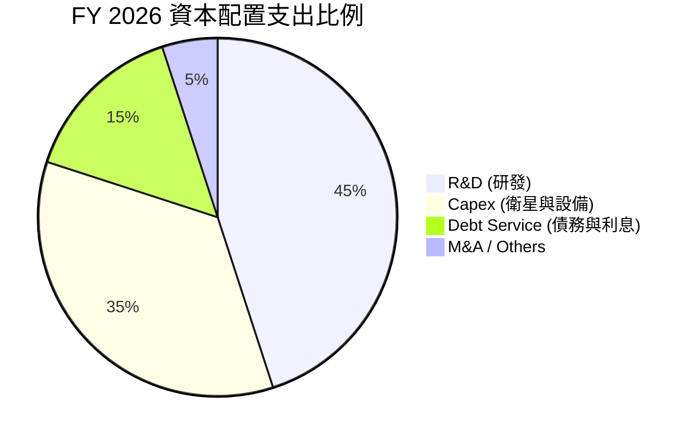

*資本配置合理性評估*：
由於公司仍處於 Pelican（高解析度、低延遲）與 Tanager（高光譜、溫室氣體監測）雙星座部署的關鍵期，將 80% 的資金（研發+Capex）投入到核心技術升级是正確的戰略。然而，隨著 FCF 轉正，管理層應考慮控制 SBC 發放速度，以降低股東權益的稀釋。

---

## 6. 獲利能力與資本效率

### 6.1 ROE / ROA / ROIC 趨勢

| 效率指標 | FY 2024 | FY 2025 | FY 2026 | TTM | 行業均值 | 評估 |
|----------|---------|---------|---------|-----|----------|------|
| **ROE** | -27.1% | -27.9% | -131.0% | **-84.0%**| 12.4% | 🔴 淨資產受損嚴重 |
| **ROA** | -20.0% | -19.4% | -21.5% | **-5.9%** | 4.8% | 🟡 資產回報率正緩慢改善 |
| **ROIC** | -24.2% | -18.5% | -12.1% | **-11.5%**| 8.2% | 🔴 投入資本回報率仍為負值 |

### 6.2 ROIC vs WACC 分析（核心價值創造判斷）

為了評估 PL 是否在為股東創造真實的經濟價值，我們對其進行 WACC 與 ROIC 的建模計算。

```
╔══════════════════════════════════════════════════════════════════╗
║                PL ROIC vs WACC 深度分析 (TTM)                    ║
╠══════════════════════════════════════════════════════════════════╣
║                                                                  ║
║  WACC 估算：                                                     ║
║  ├── 無風險利率 (10Y 美債)：  4.20%                              ║
║  ├── 市場風險溢酬 (ERP)：     5.50%                              ║
║  ├── Beta：                   2.067                              ║
║  ├── 股權成本 (Cost of Equity) = 4.2% + 2.067 × 5.5% = 15.57%   ║
║  ├── 債務成本 (税後)：       ~6.50% (暫無税收抵扣)               ║
║  ├── 資本結構：股權 94.4% ($8.17B)，債務 5.6% ($488M)            ║
║  └── ✅ WACC ≈ 15.06% (反映了高 Beta 帶來的權益風險溢價)         ║
║                                                                  ║
║  ROIC 估算：                                                     ║
║  ├── NOPAT (税後淨營運利潤) = -$107.19M × (1-0%) ≈ -$107.19M     ║
║  ├── 投入資本 (Invested Capital) = PP&E ($198.6M) + GW ($189.2M)║
║  │   + NWC ($546.4M) = $934.2M                                   ║
║  └── ✅ ROIC ≈ -11.47%                                           ║
║                                                                  ║
║  ★ 經濟價值增加 (EVA) = ROIC - WACC = -26.53%                    ║
║                                                                  ║
║  ROIC  -11.5% ░░░░░░░░░░░░░░░░░░░░░░░░░░░░░░  🔴 價值摧毀        ║
║  WACC  15.1%  ▓▓▓▓▓▓▓▓▓▓▓▓▓▓▓▓▓▓▓▓▓▓▓▓▓▓▓░░░  ── 資本成本高      ║
║  EVA   -26.5% ░░░░░░░░░░░░░░░░░░░░░░░░░░░░░░  🔴 每年流失股東價值 ║
║                                                                  ║
║  📊 結論：ROIC 仍為負值，公司目前仍在摧毀股東價值。              ║
║  主要原因在於高 WACC (15.06%) 與尚未轉正的營運利潤。             ║
╚══════════════════════════════════════════════════════════════════╝
```

### 6.3 杜邦三因素分解

我們透過杜邦分析，拆解 PL 股東權益報酬率（ROE）的變動核心：

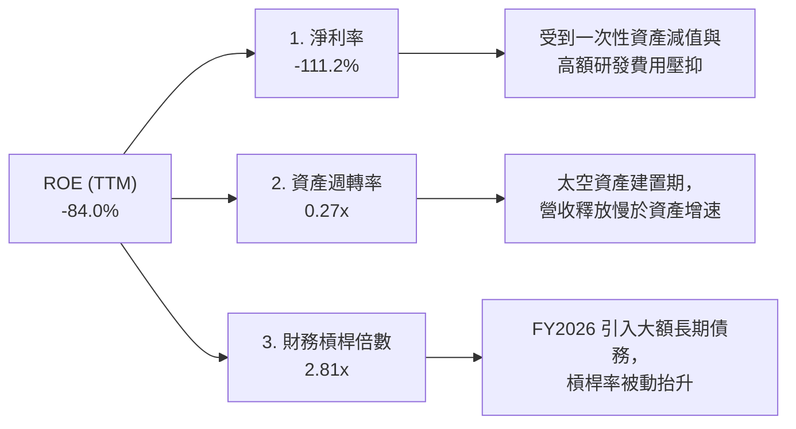

*杜邦分解啟示*：
PL 的極低 ROE（-84.0%）主要由**淨利率（-111.2%）**拖累。這意味著，公司當前的財務槓桿（2.81x）實際上放大了其虧損效應。資產週轉率僅為 0.27x，說明每 $1.00 的資產投入僅能產生 $0.27 的營收，這符合衛星航太產業「重前期投入、後期高營運槓桿」的特徵。

### 6.4 獲利能力儀表板

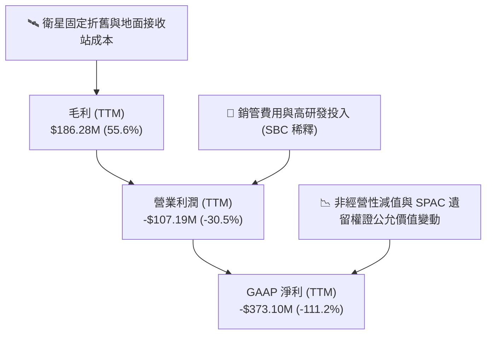

---

## 7. 估值深度分析

### 7.1 同業估值比較表格

我們選擇了兩家在遙感與防務領域最接近的上市公司：**BlackSky (BKSY)** 與 **Spire Global (SPIR)** 進行對比。

| 估值與財務指標 | **Planet Labs (PL)** | **BlackSky (BKSY)** | **Spire Global (SPIR)** | 本公司評估 |
|----------------|----------------------|----------------------|-------------------------|-----------|
| **市值 (Market Cap)** | **$8.17B** | $320M | $480M | 🔴 規模最大，享有龍頭溢價 |
| **P/S Ratio (TTM)** | **24.33x** | 3.10x | 4.20x | 🔴 顯著高於同業，估值偏高 |
| **EV / Revenue** | **22.74x** | 4.50x | 5.10x | 🔴 溢價極高，市場對其寄予厚望 |
| **Forward P/E** | **6879.88x** | N/A (持續虧損) | 85.0x | 🟡 剛越過盈虧平衡點 |
| **毛利率 (TTM)** | **55.6%** | 62.0% | 58.5% | 🟡 略低於 BlackSky，因星座規模大 |
| **淨現金狀態** | **🟢 淨現金 $242.8M** | 🔴 淨債務狀態 | 🔴 淨債務狀態 | 🟢 財務結構最為安全 |
| **FCF Yield** | **1.04%** | -8.5% | 2.1% | 🟢 領先多數尚未轉正的同業 |

### 7.2 歷史估值區間分析

PL 的 P/S 估值歷史區間在 5.0x - 30.0x 之間。當前 24.33x 的 P/S Ratio 處於**歷史高位區間**，這主要是因為股價在 2026 年上半年經歷了一波從 $6.10 到 $51.14 的巨大暴漲（漲幅達 738%），雖然近期回撤至 $22.91，但估值依然未完全消化。

### 7.3 情境目標價（假設驅動，Bear / Base / Bull）

由於 PL 淨利受高額折舊攤銷（D&A）與非經營性減值壓抑，我們採用 **EV/Sales** 作為核心估值倍數。

| 情境 | 營收 3Y CAGR | 預估 FY2029 營收 | 目標 EV/Sales 倍數 | 隱含目標價 | 相對現價 ($22.91) | 核心假設 |
|------|--------------|------------------|-------------------|------------|-------------------|----------|
| 🔴 **悲觀** | 15.0% | $468M | 10.0x | **$15.00** | -34.5% | Pelican 星座發射失敗，商業訂閱流失，SBC 持續稀釋。 |
| 🟡 **基準** | **30.0%** | **$676M** | **18.0x** | **$40.10** | **+75.0%** | **雙星座順利部署，政府合約穩健成長，SBC 降至營收 10% 以下。** |
| 🟢 **樂觀** | 45.0% | $925M | 22.0x | **$53.00** | +131.3% | 成功切入 AI 大模型地圖數據授權，實現規模化商業淨利。 |

### 7.4 DCF 敏感性分析（6格目標價矩陣）

基於基準情境（30% 營收 CAGR，終端成長率 3.0%），我們對 WACC 與終端 EBITDA 槓桿率進行敏感性分析：

| 終端營運利潤率 \ WACC | 13.0% | **15.0% (基準)** | 17.0% |
|----------------------|-------|------------------|-------|
| 25.0% | **$45.50** (+98.6%) | **$38.20** (+66.7%) | **$31.10** (+35.7%) |
| **20.0% (基準)** | **$48.10** (+109.9%)| **$40.10** (+75.0%) | **$33.50** (+46.2%) |
| 15.0% | **$35.20** (+53.6%) | **$29.80** (+30.1%) | **$24.50** (+6.9%) |

### 7.5 估值綜合區間

```
╔══════════════════════════════════════════════════════════════════╗
║                    PL 估值區間與股價定位                         ║
╠══════════════════════════════════════════════════════════════════╣
║                                                                  ║
║  52W 最低：  $5.87    ██░░░░░░░░░░░░░░░░░░░░░░░░░░░░░░░░░░       ║
║  當前股價：  $22.91   ████████████░░░░░░░░░░░░░░░░░░░░░░░░       ║
║  同業中值：  $18.50   ██████████░░░░░░░░░░░░░░░░░░░░░░░░░░       ║
║  分析師均值：$40.10   ██████████████████████░░░░░░░░░░░░░░       ║
║  52W 最高：  $51.76   ████████████████████████████████░░░░       ║
║                                                                  ║
║  📊 結論：當前股價 $22.91 處於 52W 區間的中部，相較於同業估值    ║
║  溢價明顯，但距離分析師基準目標價 $40.10 仍有 75% 的上行空間。   ║
╚══════════════════════════════════════════════════════════════════╝
```

---

## 8. 成長催化劑

### 8.1 催化劑時間軸

PL 的未來成長依賴於新一代衛星星座的成功部署與軟體變現。

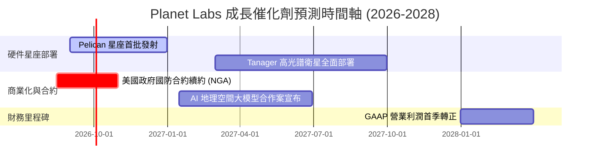

### 8.2 TAM 市場規模分析

```
╔══════════════════════════════════════════════════════════════════╗
║                  PL 潛在市場規模 (TAM) 預估                      ║
╠══════════════════════════════════════════════════════════════════╣
║                                                                  ║
║  ① 國防與國家安全領域：  $12.0B  ██████████████░░  滲透率: ~2.0% ║
║  ② 農業與氣候監測：      $8.5B   ██████████░░░░░░  滲透率: ~0.5% ║
║  ③ AI 地圖與商業分析：   $15.0B  ████████████████  滲透率: <0.1% ║
║                                                                  ║
║  📊 總計 TAM ≈ $35.5B ｜ 當前 PL 滲透率僅為 ~0.94%               ║
╚══════════════════════════════════════════════════════════════════╝
```

### 8.3 成長驅動力結構圖

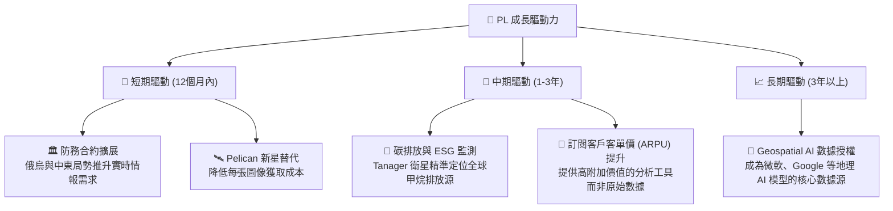

---

## 9. 風險矩陣

### 9.1 風險評分矩陣

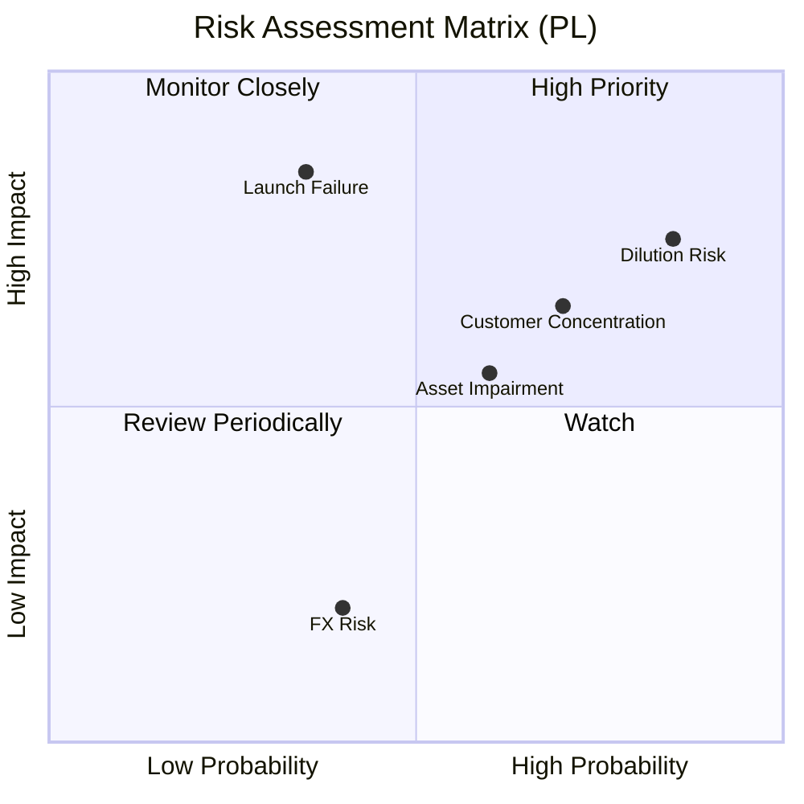

### 9.2 風險清單詳細分析

| # | 風險項目 | 發生機率 | 財務衝擊 | 風險評分 | 緩解措施 |
|---|----------|----------|----------|----------|----------|
| 1 | 🔴 **股權稀釋風險 (SBC)** | 高 (85%) | 中度 (-15% EPS 稀釋) | 🔴 **7.5 / 10** | 管理層承諾在 FCF 轉正後，將 SBC 佔營收比重控制在 10% 以內。 |
| 2 | 🔴 **衛星發射失敗** | 中低 (35%) | 極高 (-30% 產能與大額減值) | 🔴 **7.0 / 10** | 與 SpaceX 等多家發射服務商簽署分散發射協議，並為軌道資產足額投保。 |
| 3 | 🟡 **客戶集中度高 (政府合約)** | 高 (70%) | 高 (-20% 營收波動) | 🟡 **6.5 / 10** | 加速拓展商業市場，開發農業、保險與能源產業的訂閱客戶。 |
| 4 | 🟡 **非經營性資產持續減值** | 中高 (60%) | 中度 (壓抑 GAAP 盈餘) | 🟡 **5.5 / 10** | 清理 SPAC 時期的歷史遺留資產，精簡無形資產攤銷。 |

---

## 10. 投資建議

### 10.1 最終綜合評級雷達圖

```
╔══════════════════════════════════════════════════════════════╗
║                     PL 最終綜合投資評級                      ║
╠══════════════════════════════════════════════════════════════╣
║ 基本面強度    🟡 6.0/10  ▓▓▓▓▓▓▓▓▓▓▓▓░░░░░░░░  中等          ║
║ 成長動能      🟢 8.5/10  ▓▓▓▓▓▓▓▓▓▓▓▓▓▓▓▓▓░░░  強勁          ║
║ 財務安全度    🟢 7.5/10  ▓▓▓▓▓▓▓▓▓▓▓▓▓▓▓░░░░░  安全          ║
║ 估值吸引力    🔴 5.0/10  ▓▓▓▓▓▓▓▓▓▓░░░░░░░░░░  偏貴          ║
║ 盈餘品質      🔴 3.5/10  ▓▓▓▓▓▓▓░░░░░░░░░░░░░  較差          ║
╠══════════════════════════════════════════════════════════════╣
║ 綜合建議      🟡 持有 (Hold) ｜ 綜合得分: 6.1 / 10          ║
╚══════════════════════════════════════════════════════════════╝
```

### 10.2 目標價與隱含報酬率

| 評估情境 | 發生機率 | 目標價 | 隱含報酬率 | 加權期望值 |
|----------|----------|--------|------------|------------|
| 🔴 **悲觀情境** | 20% | $15.00 | -34.5% | $3.00 |
| 🟡 **基準情境** | **60%** | **$40.10** | **+75.0%** | **$24.06** |
| 🟢 **樂觀情境** | 20% | $53.00 | +131.3% | $10.60 |
| **加權目標價** | **100%** | **$37.66** | **+64.4%** | **投資評級：持有** |

### 10.3 買入時機與觸發因素

```
╔══════════════════════════════════════════════════════════════════╗
║                  ✅ PL 買入與退出觸發因素                       ║
╠══════════════════════════════════════════════════════════════════╣
║                                                                  ║
║  立即買入觸發條件 (符合 2 項以上)：                              ║
║  ✅ 股價回落至 $18.50 以下 (P/S 降至 18x 以下，估值回歸安全區)   ║
║  ✅ 單季 SBC 佔營收比重首次降至 12% 以下                        ║
║  ✅ 宣布與主流 AI 巨頭簽署 > $50M 的地理數據授權協議            ║
║                                                                  ║
║  加碼觸發條件：                                                  ║
║  ☐ Pelican 星座全面部署成功，且單季毛利率突破 60%                ║
║                                                                  ║
║  減碼/停損觸發條件 (出現任一)：                                  ║
║  🔴 營收成長率連續兩季跌破 20%                                   ║
║  🔴 自由現金流 (FCF) 重新轉為負值                                ║
║  🔴 出現重大的非經營性資產減值，導致股東權益跌破 $100M           ║
╚══════════════════════════════════════════════════════════════════╝
```

### 10.4 投資人適配度分析

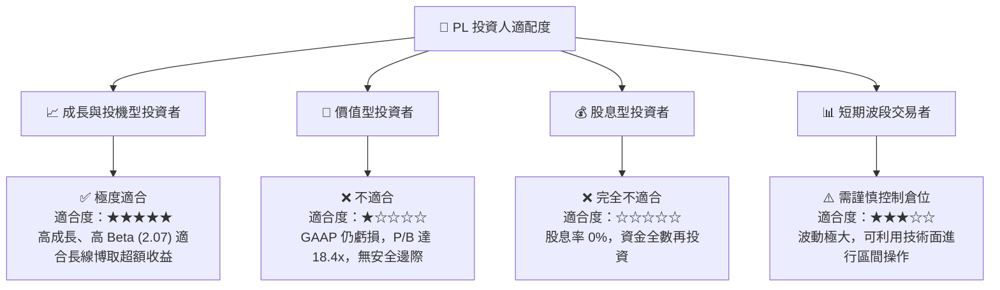

### 10.5 每季財報監控清單（Quarterly Watch List）

在未來的季度財報中，投資人應重點監控以下指標，以驗證投資論點是否發生根本性改變：

| 監控指標 | 基準值 (當前) | 加碼門檻 (Bull) | 減碼/退出門檻 (Bear) | 監控核心意義 |
|----------|--------------|-----------------|----------------------|--------------|
| **單季營收年增率** | 42.08% | > 45.0% | < 20.0% | 驗證高成長動能是否延續 |
| **SBC / 營收比率** | 17.87% | < 10.0% | > 20.0% | 監控股權稀釋速度與盈餘品質 |
| **單季自由現金流 (FCF)** | $-2.79M (Q1 27) | 穩定 > $20.0M | 連續兩季 < $-10.0M | 驗證自我造血能力是否穩固 |
| **遞延收入 (Unearned Rev)** | $220.57M | > $300M | < $150M | 領先指標，預示未來 12 個月營收 |
| **非經營性支出** | $-106.68M (Q1 27) | < $-10M | > $-100M (持續減值) | 評估 GAAP 淨利何時能真正轉正 |

### 10.6 反面論證：什麼會證明論點錯誤（What Would Change My Mind）

本投資研究報告建立在「**PL 能夠透過新一代 Pelican 星座提升客單價，並在控制股權稀釋的前提下實現自我造血**」的假設之上。如果出現以下可量化條件，將證明本報告的「持有/買入」論點錯誤，應立即執行清倉退出：

1. **營運槓桿失效**：如果營收成長 30%，但毛利率跌破 **50%**，說明新衛星的折舊成本遠超預期，或者商業化定價權面臨惡性競爭。
2. **股權持續被稀釋**：如果 SBC 佔營收比重連續三季維持在 **18% 以上**，說明管理層無法在不稀釋股東的情況下留住員工，這將摧毀長線持有價值。
3. **客戶流失**：如果最大客戶（如美國政府 NGA）的單一合約金額縮減 **30% 以上**，且商業客戶營收增速低於 15%，說明產品缺乏真正的客戶黏性。
4. **ROIC 惡化**：如果 ROIC 持續低於 **-15%**，且 WACC 因美債利率上升而突破 **16%**，說明公司正在加速摧毀資本價值。

---

> **免責聲明**：本報告為 AI 自動生成，僅供研究參考，不構成任何投資建議。太空板塊屬於高風險、高波動投資領域，投資有風險，入市需謹慎。