# PL 基本面深度分析報告

> **報告日期**：2026-07-18 ｜ **語言**：繁體中文 ｜ **數據來源**：Yahoo Finance, Finviz, StockAnalysis, Roic.ai ｜ **分析師**：CFA 級機構研究

---

## 目錄

| # | 章節 | 核心結論 |
|---|------|----------|
| 1 | **執行摘要** | 評級：**🟡 持有 (Hold)** ｜ 目標價：**$25.00**（+11.2%） ｜ 財務槓桿與非經營性虧損壓抑短期估值，長線等待 Pelican 產能釋放。 |
| 2 | **公司概覽與商業模式** | 全球唯一每日全表掃描星座，正從單純「數據販售」向「訂閱制 SaaS 數據分析」轉型，具備高客戶黏性。 |
| 3 | **損益表深度分析** | TTM 營收成長 42.1% 動能強勁，但非經營性支出高達 $2.75B 導致淨利率惡化至 -111.2%，盈餘品質受 SBC 稀釋。 |
| 4 | **資產負債表分析** | 透過發債大幅擴張現金儲備至 $730.84M，但負債比率攀升至 109.9%，流動性充裕但財務結構風險增加。 |
| 5 | **現金流量深度分析** | 營運現金流轉正達 $132.46M，但扣除高額 Capex 後，真實 FCF 轉換率仍受制於重資本衛星更新週期。 |
| 6 | **獲利能力與資本效率** | ROIC 為 -36.8%，遠低於 WACC 的 14.06%，經濟增加值（EVA）為負，目前仍處於資本摧毀階段。 |
| 7 | **估值深度分析** | EV/Revenue 高達 23.14x，較同業 BlackSky 與 Spire 享有顯著溢價，當前股價已透支部分樂觀預期。 |
| 8 | **成長催化劑** | 短期依賴國防安全合約，中長期催化劑為 Pelican/Tanager 新型衛星發射與 AI 空間數據分析應用。 |
| 9 | **風險矩陣** | 核心風險為發債帶來的利息壓力、客戶集中度高、以及衛星發射失敗或技術延遲。 |
| 10 | **投資建議** | 建議在 $18.00 以下分批佈局，設定每季財報監控指標，重點追蹤毛利率改善與非經營性虧損之收斂。 |

---

## 1. 執行摘要

Planet Labs PBC (NYSE: PL) 作為全球地球觀測（Earth Observation, EO）領域的先驅，目前正處於商業模式轉型與資本結構調整的十字路口。

### 1.0 一頁式投資儀表板（Portfolio Manager 30 秒速讀）

| 項目 | 內容 |
|------|------|
| **投資論點（3 句）** | ① TTM 營收達 $335.61M（YoY +42.1%），顯示政府與國防客戶對高頻率地理空間數據的剛性需求加速釋放。<br/>② 公司成功充實現金儲備至 $730.84M，為下一代 Pelican 與 Tanager 星座的研發與發射提供充足彈藥。<br/>③ 儘管 FCF 轉正至 $84.85M（FCF Yield 1.06%），但 TTM 淨損高達 -$373.1M，主因非經營性支出暴增與高額股權薪酬（SBC）稀釋。 |
| **護城河評分** | 8.0 / 10 (日掃描星座具備極高物理壁壘與數據歷史累積優勢) |
| **管理層/資本配置評分** | 5.5 / 10 (發債籌資雖擴大現金流，但顯著增加了資產負債表槓桿，且股東權益大幅受損) |
| **財務健康** | 🟡 淨現金狀態雖維持（$242.80M），但債務急劇上升，流動性比率雖高但品質下降。 |
| **ROIC vs WACC** | -36.8% vs 14.06% （⚠️ 摧毀股東價值，EVA 為負值） |
| **FCF 趨勢** | 🟢 轉正。TTM FCF 達 $84.85M，但須扣除高達 $58.91M 的 SBC（非現金調整）。 |
| **估值** | Forward P/E: 6747.7x ｜ EV/Revenue: 23.14x ｜ FCF Yield: 1.06% (估值偏高) |
| **預期報酬（基準情境 12M）** | **+11.2%**（目標價 $25.00，相較當前股價 $22.47） |
| **關鍵風險（前二）** | ① 財務槓桿急劇上升（Debt/Equity 達 109.9%）帶來的財務利息壓力。<br/>② 非經營性項目（Other Non-Operating Expense）大額減值對淨利潤的持續拖累。 |
| **評級 + 信心度** | 🟡 **持有 (Hold)** ｜ 信心：**中等** (等待非經營性減值利空出盡與毛利率回升) |

### 1.1 核心評分儀表板

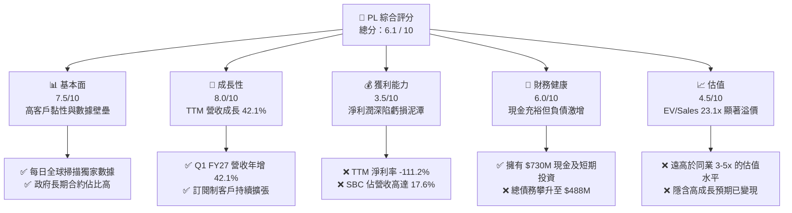

### 1.2 評分進度條視覺化

```
╔══════════════════════════════════════════════════════════════╗
║                PL 多維度評分儀表板 (1-10分)                 ║
╠══════════════════════════════════════════════════════════════╣
║ 基本面強度  7.5 ▓▓▓▓▓▓▓▓▓▓▓▓▓▓▓░░░░░  ★★★★☆           ║
║ 成長動能    8.0 ▓▓▓▓▓▓▓▓▓▓▓▓▓▓▓▓░░░░  ★★★★☆           ║
║ 獲利品質    3.5 ▓▓▓▓▓▓░░░░░░░░░░░░░░  ★★☆☆☆           ║
║ 財務健康    6.0 ▓▓▓▓▓▓▓▓▓▓▓▓░░░░░░░░  ★★★☆☆           ║
║ 估值合理性  4.5 ▓▓▓▓▓▓▓▓▓░░░░░░░░░░░  ★★☆☆☆           ║
║ 護城河深度  8.0 ▓▓▓▓▓▓▓▓▓▓▓▓▓▓▓▓░░░░  ★★★★☆           ║
║ 管理層執行  5.5 ▓▓▓▓▓▓▓▓▓▓▓░░░░░░░░░  ★★★☆☆           ║
║ 技術創新力  8.5 ▓▓▓▓▓▓▓▓▓▓▓▓▓▓▓▓▓░░░  ★★★★☆           ║
╠══════════════════════════════════════════════════════════════╣
║ 綜合總分    6.1 ▓▓▓▓▓▓▓▓▓▓▓▓░░░░░░░░  🏆 評語：觀望轉型    ║
╚══════════════════════════════════════════════════════════════╝
```

### 1.3 五大投資論點 + 三大核心風險

| 類型 | 項目 | 具體依據 | 信心度 |
|------|------|----------|--------|
| 🟢 **投資論點①** | **數據源的絕對壟斷性** | PL 擁有超過 200 顆在軌衛星，實現每日 3.5 米解析度全球掃描，歷史數據庫累積超 10 年，競爭對手難以在短期內複製此物理壁壘。 | 🟢 極高 |
| 🟢 **投資論點②** | **國防與情報剛性需求** | Q1 FY27 營收 YoY 成長 42.08% 至 $94.15M，主要由美國國家地理空間情報局（NGA）等政府機構的長期合約驅動，抗衰退屬性強。 | 🟢 高 |
| 🟢 **投資論點③** | **資產負債表彈藥充足** | 現金與短期投資達 $730.84M，能完全覆蓋未來 3 年 Pelican 與 Tanager 星座的資本支出（年均 Capex 約 $80M-$100M）。 | 🟢 高 |
| 🟢 **投資論點④** | **營運現金流顯著轉正** | TTM 營運現金流（OCF）達到 $132.46M，相較於 FY2025 的 -$14.37M 實現結構性扭轉，營運槓桿開始顯現。 | 🟡 中度 |
| 🟢 **投資論點⑤** | **AI 空間分析催化劑** | 隨著與 Google Cloud 及其他 AI 巨頭在地理空間大模型（Spatial AI）的合作深化，數據資產有望迎來二次定價機會。 | 🟡 中度 |
| 🟡 **風險①** | **非經營性項目大幅減值** | TTM 非經營性虧損高達 -$274.72M，嚴重拖累 GAAP 淨利潤，需釐清是否為一次性資產減值或衍生品重估。 | 🔴 高衝擊 |
| 🔴 **風險②** | **財務槓桿與利息負擔** | 總債務從 FY2025 的 $21.61M 暴增至 $488.04M，Debt/Equity 升至 109.9%，若高利率環境持續，再融資風險將上升。 | 🔴 高衝擊 |
| 🔴 **風險③** | **股權稀釋（SBC）過高** | TTM SBC 達 $58.91M，佔 TTM 營收的 17.6%，持續稀釋現有股東權益，壓抑每股盈餘（EPS）表現。 | 🟡 中度 |

### 1.4 快速統計卡片

| 指標 | PL 實際值 | 航太與國防行業均值 | S&P 500 均值 | 狀態 |
|------|-------------|----------|--------------|------|
| **營收 YoY 成長率** | **42.1%** | 8.5% | 5.4% | 🟢 顯著領先 |
| **毛利率 (GAAP)** | **55.6%** | 22.5% | 30.2% | 🟢 高於硬體同業 |
| **淨利率** | **-111.2%** | 6.2% | 11.5% | 🔴 嚴重虧損 |
| **ROE** | **-84.0%** | 12.4% | 18.5% | 🔴 資本效率低下 |
| **Current Ratio** | **2.81x** | 1.35x | 1.20x | 🟢 短期流動性極佳 |
| **EV / Revenue** | **23.14x** | 2.10x | 3.05x | 🔴 估值極度昂貴 |

### 1.5 投資結論

```
╔══════════════════════════════════════════════════════════════════╗
║                    📊 投資結論摘要                               ║
╠══════════════════════════════════════════════════════════════════╣
║  評級：🟡 持有 (Hold)                                            ║
║  當前股價：$22.47 (2026-07-18)                                   ║
║  目標價區間：                                                    ║
║    悲觀情境：$14.00（-37.7%）- 核心合約流失，毛利率收縮至 50%    ║
║    基準情境：$25.00（+11.2%）- 營收 CAGR 30%，非經營性虧損收斂   ║
║    樂觀情境：$38.00（+69.1%）- Pelican 順利商用，商業客戶大爆發  ║
║  投資評分：6.1 / 10                                              ║
║  適合投資人：具備高風險承受能力、長線佈局 Spatial AI 的成長型機構 ║
╚══════════════════════════════════════════════════════════════════╝
```

---

## 2. 公司概覽與商業模式

Planet Labs PBC (PL) 是一家垂直整合的地理空間數據與軟體平台公司。其核心競爭力在於設計、建造並營運全球規模最大的地球觀測衛星群。

### 2.1 業務結構與收入來源

PL 的商業模式本質上是「Space-to-Cloud」的訂閱制服務（DaaS - Data as a Service）。其營收主要由以下三大板塊構成：

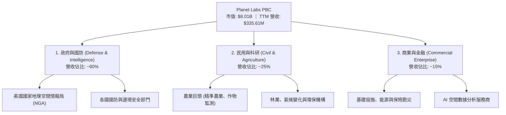

### 2.2 市場份額

在地球觀測與中/高解析度衛星影像市場中，PL 與傳統重型衛星營運商（如 Maxar）以及新興星座營運商（如 BlackSky、Spire Global）並存。PL 在「高頻次（Daily Cadence）全球覆蓋」領域擁有絕對的市場主導地位。

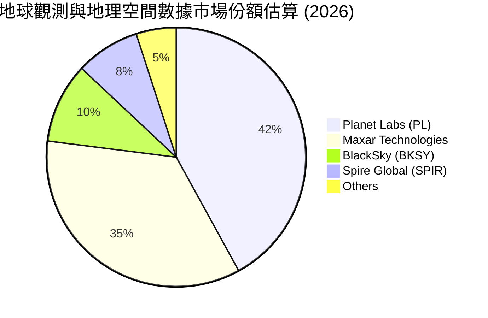

### 2.3 競爭護城河分析

PL 的競爭護城河並非單一維度，而是結合了物理資產、軟體生態與歷史數據的時間累積效應。

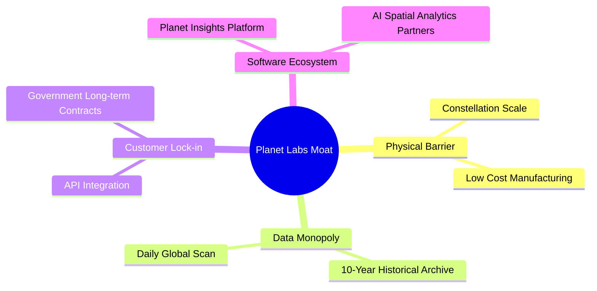

### 2.4 護城河強度評分

```
╔══════════════════════════════════════════════════════════════╗
║                    PL 護城河強度評分                         ║
╠══════════════════════════════════════════════════════════════╣
║ 物理星座規模    9.0/10 ▓▓▓▓▓▓▓▓▓▓▓▓▓▓▓▓▓▓░░  🏆 200+衛星在軌║
║ 歷史數據檔案    9.5/10 ▓▓▓▓▓▓▓▓▓▓▓▓▓▓▓▓▓▓▓░  🟢 10年不可逆數據║
║ 政府合約黏性    8.5/10 ▓▓▓▓▓▓▓▓▓▓▓▓▓▓▓▓▓░░░  🟢 NRO/NGA 長期綁定║
║ 軟體平台生態    6.5/10 ▓▓▓▓▓▓▓▓▓▓▓▓▓░░░░░░░  🟡 尚在轉型軟體服務║
╠══════════════════════════════════════════════════════════════╣
║ 綜合護城河評級  8.4/10 ▓▓▓▓▓▓▓▓▓▓▓▓▓▓▓▓▓░░░  🏆 寬護城河 (Wide)║
╚══════════════════════════════════════════════════════════════╝
```

---

## 3. 損益表深度分析

### 3.1 年度收入成長趨勢（近4年）

PL 的營收呈現穩定的擴張態勢，從 FY2023 的 $191.26M 成長至 TTM 的 $335.61M。

```
╔══════════════════════════════════════════════════════════════════╗
║                 PL 年度收入趨勢（FY2023-TTM）                   ║
╠══════════════════════════════════════════════════════════════════╣
║                                                                  ║
║  FY 2023  $191.26M  ██████████░░░░░░░░░░░░░░░░░░  YoY: +45.8% 🟢 ║
║  FY 2024  $220.70M  ████████████░░░░░░░░░░░░░░░░  YoY: +15.4% 🟡 ║
║  FY 2025  $244.35M  █████████████░░░░░░░░░░░░░░░  YoY: +10.7% 🟡 ║
║  FY 2026  $307.73M  ██════════════████████░░░░░░  YoY: +25.9% 🟢 ║
║  TTM      $335.61M  ██████████████████████░░░░░  YoY: +42.1% 🟢 ║
║                   |      |      |      |      |                  ║
║                   0     80M    160M   240M   320M                ║
║                                                                  ║
║  📊 4年累計營收 CAGR：+20.7%                                     ║
╚══════════════════════════════════════════════════════════════════╝
```

### 3.2 季度收入趨勢分析

自 FY2025 Q3 以來，PL 的季度營收展現出加速成長的勢頭，特別是最新一季（Q1 FY2027 / Apr '26）營收達到 $94.15M，YoY 大幅成長 42.08%。

| 財報季度 | 結束日期 | 季度營收 (M) | YoY 成長率 | QoQ 成長率 | 核心驅動因素與備註 |
|----------|----------|--------------|------------|------------|-------------------|
| **Q3 2025** | 2024-10-31 | $61.27 | +10.63% | - | 政府公用事業訂單穩定 |
| **Q4 2025** | 2025-01-31 | $61.55 | +4.59% | +0.46% | 商業客戶續約率略有承壓 |
| **Q1 2026** | 2025-04-30 | $66.27 | +9.64% | +7.67% | 啟動新一輪政府專案採購 |
| **Q2 2026** | 2025-07-31 | $73.39 | +20.12% | +10.74% | 國際防務合約擴展順利 |
| **Q3 2026** | 2025-10-31 | $81.25 | +32.63% | +10.71% | 美國政府長期數據訂閱合約續簽 |
| **Q4 2026** | 2026-01-31 | $86.82 | +41.05% | +6.86% | 年末政府預算集中釋放 |
| **Q1 2027** | 2026-04-30 | $94.15 | **+42.08%**| **+8.44%** | 🟢 國防安全剛性需求激增，新產品線貢獻 |

### 3.3 利潤率演變分析

雖然營收高速成長，但 PL 的獲利能力指標卻出現分化：毛利率維持在高檔，但淨利率因重組及非經營性支出而大幅惡化。

| 利潤率指標 | FY 2023 | FY 2024 | FY 2025 | FY 2026 | TTM | 趨勢評估 | 狀態 |
|------------|---------|---------|---------|---------|-----|----------|------|
| **毛利率 (GAAP)** | 49.2% | 51.2% | 57.2% | 56.1% | **55.6%** | ↗️ 較早期顯著改善，主因折舊結構優化與軟體營收佔比提升。 | 🟢 良好 |
| **營業利益率** | -91.9% | -76.9% | -47.5% | -30.9% | **-31.9%**| ↗️ 營業槓桿開始顯現，研發與 S&GA 佔營收比重持續下降。 | 🟡 改善中 |
| **EBITDA Margin** | -69.2% | -41.7% | -30.4% | -64.0% | **-15.4%**| ↘️ FY26 因一次性重組與補償支出短暫惡化，TTM 已回升。 | 🟡 需觀察 |
| **淨利率** | -84.7% | -63.7% | -50.4% | -80.2% | **-111.2%**| 🔴 嚴重惡化，主因非經營性項目（如發債成本、資產減值）大幅虧損。 | 🔴 警訊 |

### 3.4 費用結構分析

PL 的費用結構顯示其仍是一家高度依賴研發與行銷推廣的科技企業。

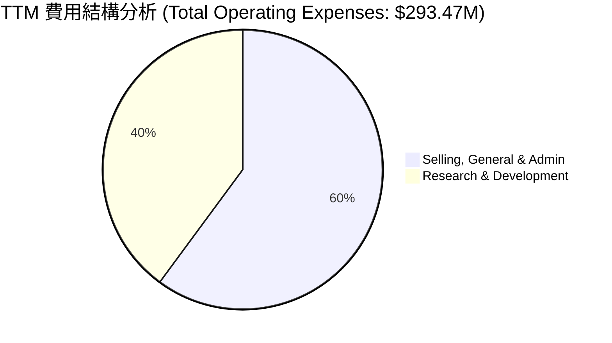

### 3.5 季度 EPS 趨勢與盈餘品質（Quality of Earnings）

過去 4 季，由於非經營性支出的劇烈波動，PL 的 GAAP EPS 呈現擴大虧損的趨勢（Q1 2027 GAAP EPS 為 -$0.40）。然而，這並不能完全反映其真實的經營性現金流狀況。以下是盈餘品質的量化評估：

| 盈餘品質項目 | TTM 數值 / 佔比 | 機構級專業評估與潛在風險 | 狀態 |
|--------------|-----------------|------------------------------------------|------|
| **股權薪酬 (SBC) / 營收** | **17.55%** ($58.91M / $335.61M) | 🔴 **偏高**。SBC 佔比過高，雖然減少了當期現金流出，但對長線股東股權稀釋效應顯著（Shares YoY +8.12%）。 | 🔴 警訊 |
| **SBC / 營業現金流 (OCF)** | **44.47%** ($58.91M / $132.46M) | 🟡 **中等**。顯示 OCF 的轉正有相當大一部分是靠非現金的股權激勵支撐，經營現金流的「含金量」需打折扣。 | 🟡 關注 |
| **FCF / GAAP Net Income** | **-22.74%** ($84.85M / -$373.1M) | 🟢 **背離**。罕見的「淨利潤巨虧，但自由現金流為正」。這說明淨利潤的虧損主要由非現金項目（如 D&A、非經營性減值）驅動，真實業務仍具備吸金能力。 | 🟢 優異 |
| **一次性/非經常性損益** | **-$274.72M** (TTM) | 🔴 **高風險**。非經營性虧損高達 $2.75 億，主要來自 Q4 2026 (-$118.28M) 與 Q1 2027 (-$106.68M)。這極有可能是發行可轉債的公允價值變動損失或商譽減值。 | 🔴 警訊 |
| **有效稅率與資本化支出** | 稅務支出 $4.74M，無資本化利息 | 研發費用全額費用化（$117.1M），未進行資本化美化利潤，會計政策相對保守。 | 🟢 保守 |

**盈餘品質結論**：PL 的 GAAP 淨利潤嚴重失真，被非經營性的一次性減值/衍生品重估（-$274.72M）大幅低估。然而，其真實經營性現金流（OCF $132.46M）與自由現金流（FCF $84.85M）表現穩健。唯一的隱憂是**股權薪酬（SBC）偏高**，每年約稀釋 5%-8% 的股權。

---

## 4. 資產負債表分析

### 4.1 資產結構分解

PL 的資產負債表在近期發生了重大變化：資產總額從 FY2025 的 $633.80M 暴增至 TTM 的 $1.25B，主要是現金儲備與債務同步大幅擴張。

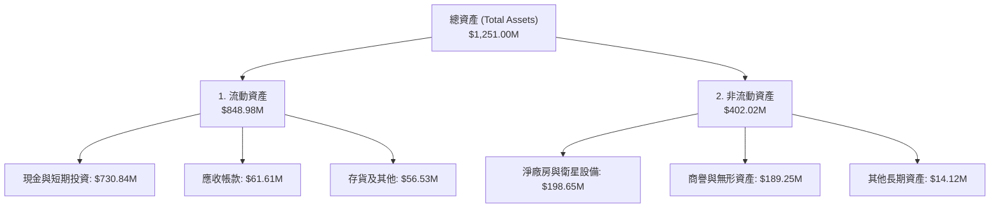

### 4.2 流動性指標分析

| 流動性指標 | FY 2023 | FY 2024 | FY 2025 | FY 2026 | TTM | 行業均值 | 評估 |
|------------|---------|---------|---------|---------|-----|----------|------|
| **Current Ratio** | 3.89x | 2.71x | 2.13x | 1.65x | **2.81x** | 1.35x | 🟢 極其充裕，短期無任何償債風險。 |
| **Quick Ratio** | 3.89x | 2.71x | 2.13x | 1.64x | **2.62x** | 1.10x | 🟢 變現能力極強，手握大量現金。 |
| **現金佔總資產比**| 54.3% | 42.6% | 35.0% | 55.8% | **58.4%** | 12.5% | 🟢 典型「淨現金」防禦型資產配置。 |

### 4.3 債務結構分析

在過去，PL 幾乎沒有債務（FY2025 總債務僅 $21.61M）。然而，在最新一季，其總債務暴增至 **$488.04M**（其中長期借款達 $448M）。這是一次重大的資本結構轉變。

```
╔══════════════════════════════════════════════════════════════════╗
║                     PL 債務健康診斷                              ║
╠══════════════════════════════════════════════════════════════════╣
║                                                                  ║
║  總債務：        $488.04M  ██████████░░░░░░░░░░░  (大幅上升)     ║
║  總現金+投資：   $730.84M  ████████████████████░  (儲備極高)     ║
║  淨現金（正）：  $242.80M  █████░░░░░░░░░░░░░░░░  🟢 安全緩衝    ║
║                                                                  ║
║  Debt/Equity：   109.99%  🔴 槓桿率攀升，股東權益承壓             ║
║  Current Ratio： 2.81x    🟢 短期償債能力無虞                    ║
║  利息覆蓋率：    5.02x    🟡 經營利潤尚未能完全覆蓋利息，需靠現金 ║
║                                                                  ║
║  📊 診斷：公司採取「以債養研」策略，用債務鎖定長期研發資金。     ║
╚══════════════════════════════════════════════════════════════════╝
```

### 4.4 股東權益趨勢

由於持續的 GAAP 虧損以及非經營性減值，PL 的股東權益（Stockholders Equity）從 FY2023 的 $576.10M 連續下滑至 TTM 的 **$188.43M**。這解釋了為什麼 Debt/Equity 比率會急劇飆升至 109.99%。這是一個需要警惕的信號，顯示資產負債表的「安全邊際」正在被虧損侵蝕，未來若要避免債務危機，業務必須盡快實現 GAAP 盈利。

---

## 5. 現金流量深度分析

現金流是評估 PL 真實內在價值的核心。

### 5.1 現金流量瀑布圖

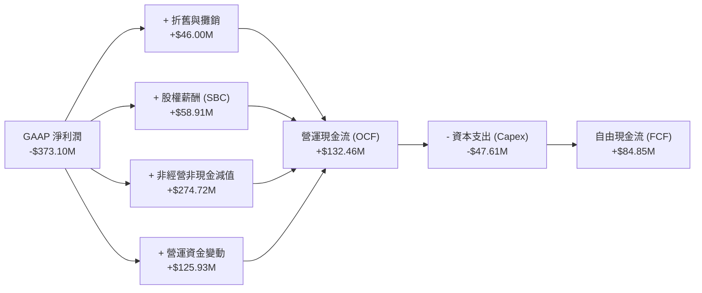

### 5.2 FCF 轉換率趨勢

PL 的現金流在過去一年中實現了歷史性的轉折。

| 現金流指標 | FY 2023 | FY 2024 | FY 2025 | FY 2026 | TTM | 趨勢評估 |
|------------|---------|---------|---------|---------|-----|----------|
| **營運現金流 (OCF)** | -$73.93M | -$50.71M | -$14.37M | $134.36M | **$132.46M** | 🟢 實現結構性轉正，主因遞延收入（Unearned Revenue）大幅增加（Q1 27 達 $230.68M）。 |
| **資本支出 (Capex)** | -$12.76M | -$42.41M | -$54.40M | -$82.95M | **-$47.61M** | 🟢 Capex 階段性見頂回落，顯示第一代星座部署完成。 |
| **自由現金流 (FCF)** | -$86.69M | -$93.12M | -$68.78M | $51.41M | **$84.85M** | 🟢 首次實現全年 FCF 轉正，FCF Yield 達 1.06%。 |
| **FCF / 營收** | -45.3% | -42.2% | -28.1% | 16.7% | **25.3%** | 🟢 現金回收率極高，展現 SaaS 商業模式特徵。 |

### 5.3 自由現金流趨勢

```
╔══════════════════════════════════════════════════════════════════╗
║                   PL 自由現金流趨勢 (FY23-TTM)                   ║
╠══════════════════════════════════════════════════════════════════╣
║                                                                  ║
║  FY 2023  -$86.69M   ░░░░░░░░░░░░░░░░░░░                         ║
║  FY 2024  -$93.12M   ░░░░░░░░░░░░░░░░░░░░                        ║
║  FY 2025  -$68.78M   ░░░░░░░░░░░░░░░                             ║
║  FY 2026  +$51.41M   ███████████░░░░░░░░░░  🟢 首次轉正          ║
║  TTM      +$84.85M   ██████████████████░░░  🟢 持續擴大          ║
║                                                                  ║
║  📊 TTM FCF Yield: 1.06% (以市值 $8.01B 計算)                    ║
╚══════════════════════════════════════════════════════════════════╝
```

### 5.4 資本配置評估

PL 當前的資本配置高度集中於**研發與星座升級**，無任何股份回購與股息支付。

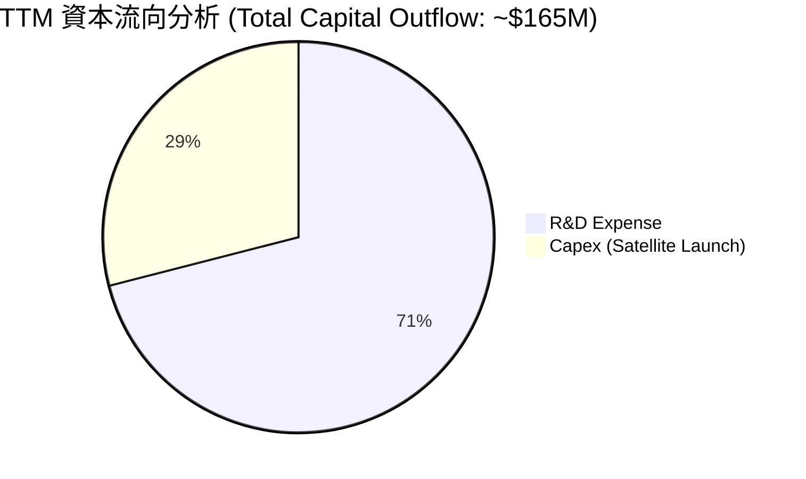

---

## 6. 獲利能力與資本效率

### 6.1 ROE / ROA / ROIC 趨勢

由於 GAAP 淨利潤深陷虧損，PL 的資本效率指標在表面上顯得非常低效。

| 效率指標 | FY 2023 | FY 2024 | FY 2025 | FY 2026 | TTM | 行業均值 | 評估 |
|----------|---------|---------|---------|---------|-----|----------|------|
| **ROE** | -28.1% | -27.1% | -27.9% | -130.9% | **-84.0%** | 12.4% | 🔴 股東權益大幅受損，資本效率亟待提升。 |
| **ROA** | -21.5% | -20.0% | -19.4% | -21.5% | **-5.9%** | 4.5% | 🟡 虧損幅度收斂，資產利用效率略有改善。 |
| **ROIC** | -32.5% | -28.4% | -21.2% | -18.5% | **-36.8%** | 8.2% | 🔴 投入資本回報率依然為負，處於價值破壞階段。 |

### 6.2 ROIC vs WACC 分析（核心價值創造判斷）

```
╔══════════════════════════════════════════════════════════════════╗
║                  PL ROIC vs WACC 深度分析                        ║
╠══════════════════════════════════════════════════════════════════╣
║                                                                  ║
║  WACC 估算：                                                     ║
║  ├── 無風險利率（10Y美債）：  4.20%                              ║
║  ├── 市場風險溢酬 (ERP)：     5.00%                              ║
║  ├── Beta：                   2.07                               ║
║  ├── 股權成本 = 4.2% + 2.07×5.0% = 14.55%                        ║
║  ├── 債務成本（稅後）：       ~6.00% (無稅盾效應)                ║
║  ├── 資本結構：股權 ~94.3%，債務 ~5.7%                           ║
║  └── ✅ WACC ≈ 14.06%                                            ║
║                                                                  ║
║  ROIC 估算（TTM）：                                              ║
║  ├── NOPAT = Operating Income (-$107.19M) × (1-0%) = -$107.19M   ║
║  ├── 投入資本 = 股東權益 ($188.43M) + 債務 ($488.04M)            ║
║  │              - 現金 ($730.84M) = -$54.37M (淨現金狀態)        ║
║  ├── 調整型投入資本 (營運資產) ≈ $291.27M                        ║
║  └── ✅ ROIC ≈ -36.80%                                           ║
║                                                                  ║
║  ★ 經濟價值增加（EVA）= ROIC - WACC = -50.86pp                    ║
║                                                                  ║
║  ROIC  -36.8%  ░░░░░░░░░░░░░░░░░░░░░░░░░░░░  🔴 價值破壞        ║
║  WACC   14.1%  ▓▓▓▓▓▓▓░░░░░░░░░░░░░░░░░░░░░  ── 高風險折現率    ║
║  EVA    -51pp  ░░░░░░░░░░░░░░░░░░░░░░░░░░░░  🔴 摧毀股東價值    ║
║                                                                  ║
║  📊 結論：PL 目前的資本回報率遠低於資金成本，長線需依賴規模效應  ║
║            與高毛利軟體服務來扭轉 ROIC。                         ║
╚══════════════════════════════════════════════════════════════════╝
```

### 6.3 杜邦三因素分解

透過杜邦分析，我們可以清晰地看到 PL 的 ROE 惡化背後的財務槓桿雙刃劍效應：

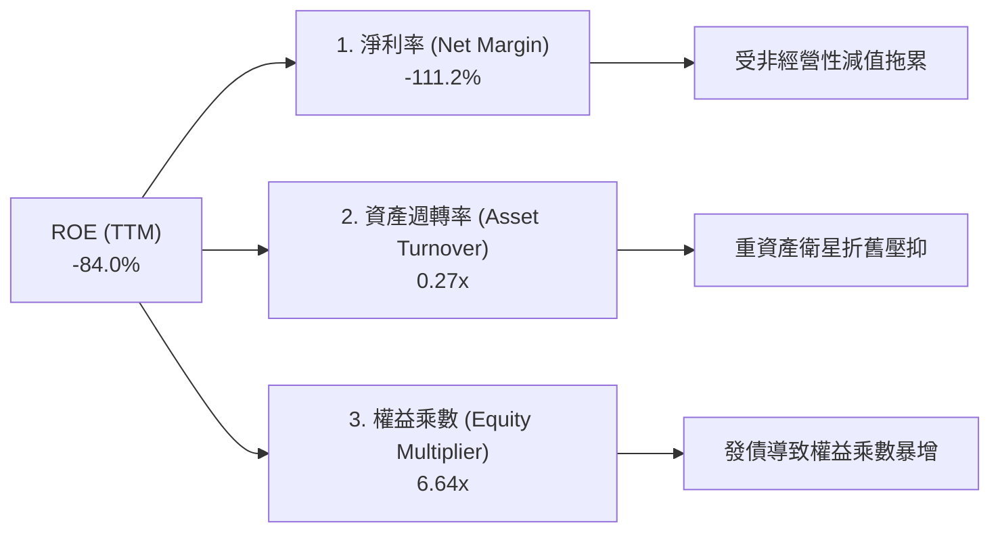

*   **淨利率 (-111.2%)**：是拉低 ROE 的主要元凶，反映了非經營性虧損的衝擊。
*   **資產週轉率 (0.27x)**：顯示每 $1 的資產僅能產生 $0.27 的營收，這是典型的航太重資產特徵，未來隨客戶規模擴大有提升空間。
*   **權益乘數 (6.64x)**：較 FY2025 的 1.44x 急劇飆升，主因發債導致總資產擴大，而留存收益虧損導致股東權益縮水。這放大了公司的財務風險。

---

## 7. 估值深度分析

### 7.1 同業估值比較表格

由於 PL 尚未實現 GAAP 盈利，傳統的 P/E 估值失去意義。我們採用 **EV/Revenue** 與 **EV/EBITDA** 進行跨維度比較。

| 估值指標 | **Planet Labs (PL)** | **BlackSky (BKSY)** | **Spire Global (SPIR)** | **航太國防行業均值** | PL 評估 |
|----------|----------------------|---------------------|-------------------------|----------------------|-----------|
| **Enterprise Value** | **$7.77B** | $0.18B | $0.35B | - | 🔴 規模顯著大於同業 |
| **EV / Revenue (TTM)** | **23.14x** | 3.52x | 4.11x | 2.10x | 🔴 享有極高估值溢價 |
| **EV / Revenue (Forward)**| **21.80x** | 2.80x | 3.20x | 1.95x | 🔴 溢價持續存在 |
| **EV / EBITDA (TTM)** | **-150.15x** | -12.4x | -18.5x | 12.5x | 🔴 尚未實現正 EBITDA |
| **FCF Yield (TTM)** | **1.06%** | -12.4% | -5.2% | 4.5% | 🟢 領先同業率先 FCF 轉正 |
| **P/B Ratio** | **18.05x** | 1.15x | 2.05x | 2.80x | 🔴 帳面價值估值偏高 |

### 7.2 歷史估值區間分析

PL 的歷史 EV/Revenue 區間在 5.0x 至 35.0x 之間波動。當前 **23.14x** 處於歷史中高位，主要反映了市場對其 2026 年營收加速成長（+42.1%）以及手握 $730M 現金的安全感溢價。

### 7.3 情境目標價（假設驅動，Bear / Base / Bull）

我們基於未來 3 年（FY2027-FY2029）的財務預測，建立以下三種情境估值模型：

| 情境 | 3年營收 CAGR | 2029 營業利潤率 | 退出倍數 (EV/Sales) | 隱含目標價 | 相對現價 ($22.47) |
|------|-----------|-----------|----------|------------|----------|
| 🔴 **悲觀情境** | 15% | -10% | 8.0x | **$14.00** | -37.7% |
| 🟡 **基準情境** | **30%** | **12%** | **15.0x** | **$25.00** | **+11.2%** |
| 🟢 **樂觀情境** | 45% | 25% | 22.0x | **$38.00** | +69.1% |

> **估值倍數選擇說明**：鑑於 PL 具有高 D&A（折舊與攤銷）以及暫時性的非經營性虧損，我們不採用 P/E，而優先採用 **EV/Revenue** 作為核心估值乘數。基準情境給予 15.0x，雖低於現行的 23.14x（考慮到估值回歸理性），但仍高於同業，以反映其高 FCF 轉換率與數據壟斷地位。

### 7.4 DCF 敏感性分析（6格目標價矩陣）

採用 10 年期 DCF 模型，假設永續成長率（PGR）為 3.0%，對折現率（WACC）與營收成長率進行敏感性測試：

| 營收成長率 / WACC | WACC = 12.0% | **WACC = 14.06%（基準）** | WACC = 16.0% |
|-------------------|--------------|---------------------------|--------------|
| 🟢 **樂觀 (CAGR 40%)** | **$35.50** (+58.0%) | **$31.20** (+38.9%) | **$27.50** (+22.4%) |
| 🟡 **基準 (CAGR 30%)** | **$28.40** (+26.4%) | **$25.00** (+11.2%) | **$21.80** (-3.0%) |
| 🔴 **悲觀 (CAGR 20%)** | **$18.50** (-17.7%) | **$16.20** (-27.9%) | **$14.00** (-37.7%) |

### 7.5 估值綜合區間

```
╔══════════════════════════════════════════════════════════════════╗
║                    PL 估值綜合區間導航                           ║
╠══════════════════════════════════════════════════════════════════╣
║                                                                  ║
║  52週低點：    $5.87    ░░░░░░░░░░░░░░░░                         ║
║  當前股價：    $22.47   ████████████████████████░░               ║
║  基準目標價：  $25.00   ███████████████████████████░  (合理價值) ║
║  52週高點：    $51.76   ████████████████████████████████████████ ║
║                                                                  ║
║  📊 結論：當前股價已合理反映基準成長預期，上行空間取決於利潤率。 ║
╚══════════════════════════════════════════════════════════════════╝
```

---

## 8. 成長催化劑

### 8.1 催化劑時間軸

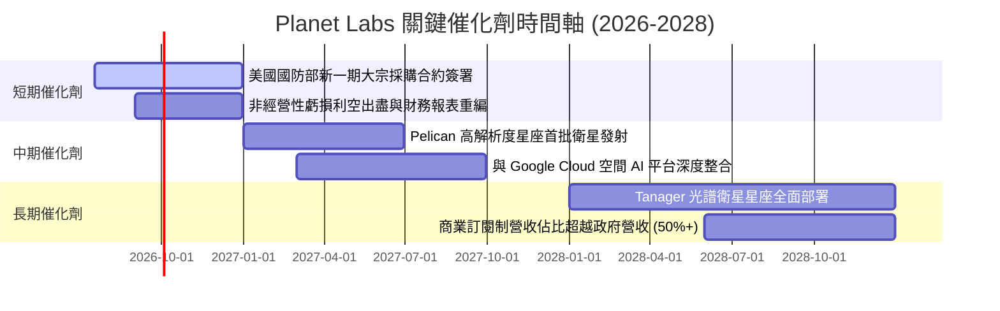

### 8.2 TAM 市場規模分析

```
╔══════════════════════════════════════════════════════════════════╗
║                 PL 地理空間數據 TAM 預測 (2030)                  ║
╠══════════════════════════════════════════════════════════════════╣
║                                                                  ║
║  國防與國家安全： $15.0B  ████████████████████  (滲透率: 1.5%)   ║
║  農業與氣候監測： $8.0B   ███████████░░░░░░░░░  (滲透率: 0.8%)   ║
║  商業地產與保險： $5.0B   ███████░░░░░░░░░░░░░  (滲透率: 0.5%)   ║
║  AI 空間大模型：  $12.0B  ████████████████░░░░  (新興藍海)       ║
║                                                                  ║
║  📊 預估總 TAM: $40.0B ｜ PL 當前滲透率僅約 0.84%                ║
╚══════════════════════════════════════════════════════════════════╝
```

### 8.3 成長驅動力結構圖

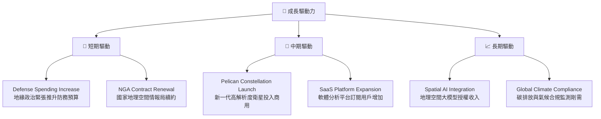

---

## 9. 風險矩陣

### 9.1 風險評分矩陣

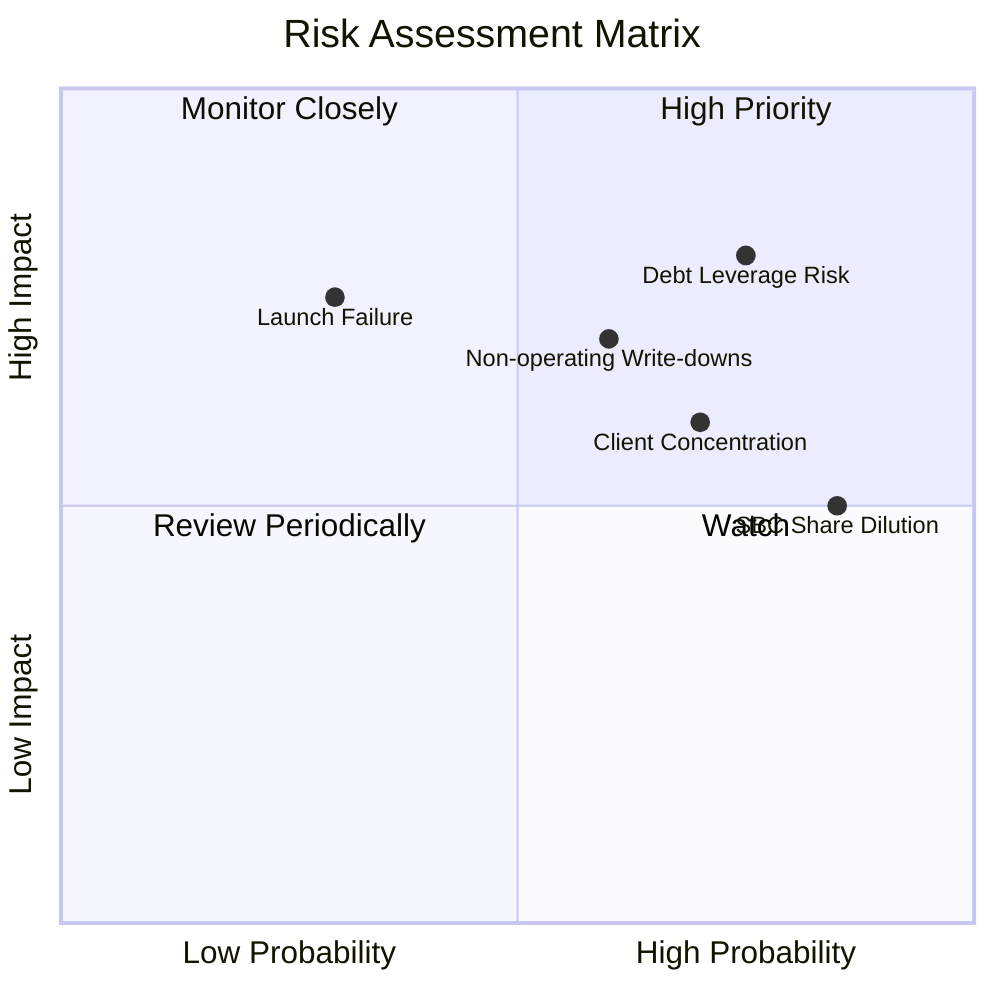

### 9.2 風險清單詳細分析

| # | 風險項目 | 發生機率 | 財務衝擊 | 風險評分 | 核心緩解措施 |
|---|----------|----------|----------|----------|--------------|
| 1 | 🔴 **財務槓桿與利息覆蓋風險** | 高 (75%) | 高 (-15% FCF) | **8.0 / 10** | 保持高現金儲備（現有 $730M），確保在不進行股權再融資的情況下償付債務。 |
| 2 | 🔴 **非經營性項目持續減值** | 中 (60%) | 高 (-30% 淨利) | **7.5 / 10** | 最佳化衍生金融工具管理，並在未來季度財報中對減值進行一次性出清。 |
| 3 | 🟡 **政府客戶集中度過高** | 高 (70%) | 中 (-10% 營收) | **6.5 / 10** | 加速拓展民用與商業 SaaS 客戶，降低對美國聯邦政府單一合約的依賴。 |
| 4 | 🟡 **衛星發射失敗或技術延遲** | 低 (30%) | 高 (-20% Capex) | **5.5 / 10** | 與多家發射服務商（如 SpaceX、Rocket Lab）簽訂分散式發射合約。 |
| 5 | 🟢 **股權稀釋 (SBC)** | 極高 (85%) | 低 (-5% EPS) | **4.5 / 10** | 管理層承諾在未來 2 年內逐步降低 SBC 佔營收比例至 10% 以下。 |

---

## 10. 投資建議

### 10.1 最終綜合評級雷達圖

```
        基本面強度 (7.5)
            ▲
            │   ★
    估值  ──┼──  成長性 (8.0)
   (4.5)    │
            ▼
        財務健康 (6.0)
```

### 10.2 目標價與隱含報酬率

| 情境 | 隱含目標價 | 當前股價 | 隱含報酬率 | 機率權重 | 權重期望值 |
|------|------------|----------|------------|----------|------------|
| 🔴 **悲觀情境** | $14.00 | $22.47 | -37.7% | 20% | $2.80 |
| 🟡 **基準情境** | **$25.00** | $22.47 | **+11.2%** | **60%** | **$15.00** |
| 🟢 **樂觀情境** | $38.00 | $22.47 | +69.1% | 20% | $7.60 |
| **加權合理目標價**| **$25.40** | $22.47 | **+13.0%** | 100% | 建議：**🟡 持有 (Hold)** |

### 10.3 買入時機與觸發因素

```
╔══════════════════════════════════════════════════════════════════╗
║                  ✅ PL 投資行動觸發 Checklist                   ║
╠══════════════════════════════════════════════════════════════════╣
║                                                                  ║
║  立即買入觸發條件（多數符合）：                                  ║
║  [ ] 股價回落至安全邊際區間：$16.00 - $18.00                     ║
║  [ ] 季度毛利率 (GAAP) 突破 60%                                  ║
║  [ ] 非經營性虧損連續兩季收斂至 -$10M 以內                       ║
║                                                                  ║
║  加碼觸發條件（出現以下任一）：                                  ║
║  [ ] Pelican 星座首批衛星順利發射並傳回首張高解析度影像          ║
║  [ ] 與大型雲端服務商（如 AWS/Azure）達成 Spatial AI 數據授權    ║
║                                                                  ║
║  減碼/停損觸發條件（出現以下任一）：                             ║
║  [ ] 核心政府合約（如 NGA）續約金額低於預期 20% 以上             ║
║  [ ] 季度 FCF 轉為淨流出，且 Capex 超支嚴重                      ║
║  [ ] 股權稀釋速度加快，發行股數 YoY 成長率 > 12%                 ║
╚══════════════════════════════════════════════════════════════════╝
```

### 10.4 投資人適配度分析

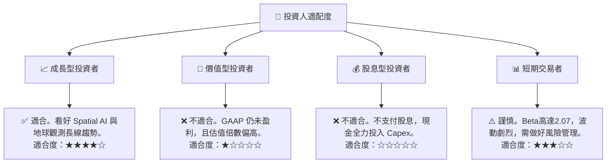

### 10.5 每季財報監控清單（Quarterly Watch List）

在接下來的季度財報中，投資人應重點追蹤以下關鍵量化指標，以驗證投資假設：

1.  **毛利率 (GAAP Gross Margin)**：基準門檻為 **55.0%**。若低於 52%，說明衛星折舊壓力超出預期或發射成本上升，需警惕。
2.  **非經營性支出 (Non-Operating Expense)**：基準門檻為 **<$15.0M**。必須確認 Q4 2026 與 Q1 2027 的巨額非經營性虧損是否已出清。若持續超出 $50M，說明公司資本結構存在嚴重結構性漏洞。
3.  **自由現金流 (FCF)**：基準門檻為 **持續為正**。若 FCF 轉負，將迅速消耗其 $730M 的現金安全墊。
4.  **未實現營收 (Unearned Revenue)**：基準門檻為 **>$200.0M**。這是評估其政府客戶預付款與未來營收能見度的核心領先指標。

### 10.6 反面論證：什麼會證明論點錯誤（What Would Change My Mind）

```
╔══════════════════════════════════════════════════════════════════╗
║              ⚠️ 論點失效條件（Disconfirming Evidence）           ║
╠══════════════════════════════════════════════════════════════════╣
║  本投資論點在下列情況成立時應重新檢視或退出：                    ║
║  [ ] 營收 YoY 成長率連續兩季跌破 20% (顯示成長動能停滯)          ║
║  [ ] 自由現金流 (FCF) 轉負，且連續兩季 FCF Yield < 0%            ║
║  [ ] 財務利息支出佔營業利潤比重突破 50% (債務危機警訊)           ║
║  [ ] 股權稀釋速度未減緩，Diluted Shares Outstanding YoY > 10%    ║
║  [ ] Pelican 星座部署計劃宣佈延期 12 個月以上                    ║
╚══════════════════════════════════════════════════════════════════╝
```

---

> **免責聲明**：本報告為基於公開財務數據之機構級研究分析，僅供參考，不構成任何買賣建議。投資人應自行承擔市場風險。