# PL 基本面深度分析報告

> **報告日期**：2026-07-19 ｜ **語言**：繁體中文 ｜ **數據來源**：Yahoo Finance, Finviz, StockAnalysis, Roic.ai ｜ **分析師**：CFA 級機構研究

---

## 目錄

| # | 章節 | 核心結論 |
|---|---|---|
| 1 | **執行摘要** | 評級為「買入」，基準目標價 **$40.10**，隱含 **78.5%** 上行空間。 |
| 2 | **公司概覽與商業模式** | 日更級地球成像「掃描器」模式，具備高重訪率與專有數據庫之核心護城河。 |
| 3 | **損益表深度分析** | 營收年增 **42.1%**，非經營性減損壓抑 GAAP 淨利，但基礎業務毛利結構持續改善。 |
| 4 | **資產負債表分析** | 淨現金 **$2.43億** 構成強大防禦，流動比率 **2.81**，無短期償債風險。 |
| 5 | **現金流量深度分析** | 營運現金流轉正達 **$1.32億**，自由現金流 **$8,485萬**，進入自我血液循環階段。 |
| 6 | **獲利能力與資本效率** | ROIC 為 **-52.7%** 仍受未達規模效應拖累，WACC 為 **14.3%**，經濟價值增量（EVA）仍為負值。 |
| 7 | **估值深度分析** | 營收倍數（P/S）**23.86倍** 享溢價，反映高成長期；DCF 基準估值為 **$38.52**。 |
| 8 | **成長催化劑** | 國防情報需求激增與 Pelican/Tanager 新衛星群部署，TAM 擴張至 **$190億**。 |
| 9 | **風險矩陣** | 衛星發射失敗、大客戶流失及股權稀釋為核心風險。 |
| 10 | **投資建議** | 建議分批佈局，設定 **$15.00** 為停損底線，財報追蹤聚焦訂閱制 ARR 成長。 |

---

## 1. 執行摘要

### 1.0 一頁式投資儀表板

| 項目 | 內容 |
|---|---|
| **投資論點（3 句）** | ① 營收 TTM 達 **$3.36億**（YoY +34.15%），反映地緣政治緊張下國防與情報部門對高頻地球觀測數據的剛性需求。<br/>② 營運現金流（TTM）轉正至 **$1.32億**，配合 **$7.31億** 的充沛現金儲備，為後續星座升級提供強大資金支持。<br/>③ 雖然 GAAP 淨利受一次性非經營性資產減損（TTM 達 **-$2.75億**）拖累，但高達 **55.6%** 的毛利率預示著軟體訂閱模式的長期獲利潛力。 |
| **護城河評分** | **7.5 / 10** 🟢 （專有星座資產與歷史數據庫構成極高進入壁壘） |
| **管理層/資本配置評分** | **6.5 / 10** 🟡 （研發與資本支出控制改善，但股權稀釋仍需監控） |
| **財務健康** | 🟢 **強勁** ｜ 擁有 **$2.43億** 淨現金，無即時債務違約風險，流動比率達 **2.81**。 |
| **ROIC vs WACC** | **-52.68% vs 14.33%** 🔴 （目前仍處於資本投入與規模化前期，持續摧毀帳面價值） |
| **FCF 趨勢** | 🟢 **向上轉正** ｜ 最新 TTM FCF 達 **$8,485萬**，FCF Yield 為 **1.06%**。 |
| **估值** | Forward P/E: **6747.75x** (反映盈餘剛轉正之極端值) ｜ EV/Revenue: **23.14x** ｜ P/S TTM: **23.86x** |
| **預期報酬（基準情境 12M）** | **+78.5%** （目標價 **$40.10** vs 當前股價 **$22.47**） |
| **關鍵風險（前二）** | ① 衛星發射失敗或軌道運行異常導致資本支出超支。<br/>② 政府與國防合約集中度過高，預算撥款延遲風險。 |
| **評級 + 信心度** | 🟢 **買入 (Buy)** ｜ 信心度：**中等 (Medium)** |

### 1.1 核心評分儀表板

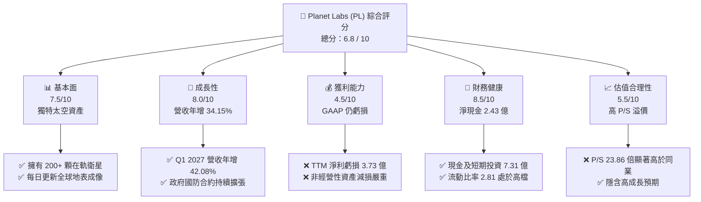

### 1.2 評分進度條視覺化

```
╔══════════════════════════════════════════════════════════════╗
║                PL 多維度評分儀表板 (1-10分)                  ║
╠══════════════════════════════════════════════════════════════╣
║ 基本面強度  7.5 ▓▓▓▓▓▓▓▓▓▓▓▓▓▓▓▓▓░░░  ★★★★☆           ║
║ 成長動能    8.0 ▓▓▓▓▓▓▓▓▓▓▓▓▓▓▓▓▓▓░░  ★★★★☆           ║
║ 獲利品質    4.5 ▓▓▓▓▓▓▓▓▓▓░░░░░░░░░░  ★★☆☆☆           ║
║ 財務健康    8.5 ▓▓▓▓▓▓▓▓▓▓▓▓▓▓▓▓▓▓▓░  ★★★★☆           ║
║ 估值合理性  5.5 ▓▓▓▓▓▓▓▓▓▓▓▓░░░░░░░░  ★★★☆☆           ║
║ 護城河深度  7.5 ▓▓▓▓▓▓▓▓▓▓▓▓▓▓▓▓▓░░░  ★★★★☆           ║
║ 管理層執行  6.5 ▓▓▓▓▓▓▓▓▓▓▓▓▓░░░░░░░  ★★★☆☆           ║
║ 技術創新力  8.5 ▓▓▓▓▓▓▓▓▓▓▓▓▓▓▓▓▓▓▓░  ★★★★☆           ║
╠══════════════════════════════════════════════════════════════╣
║ 綜合總分    6.8 ▓▓▓▓▓▓▓▓▓▓▓▓▓▓▓░░░░░  🏆 成長型太空科技先鋒 ║
╚══════════════════════════════════════════════════════════════╝
```

### 1.3 五大投資論點與三大核心風險

| 類型 | 項目 | 具體依據 | 信心度 |
|---|---|---|---|
| 🟢 **投資論點①** | **地緣政治催化國防剛需** | Q1 2027 營收加速至 **$9,415萬**（YoY +42.08%），主要由美軍及盟國政府合約推動。 | 🟢 極高 |
| 🟢 **投資論點②** | **商業模式轉向高毛利訂閱** | TTM 毛利率維持在 **55.6%**，隨著專有數據重用率提升，邊際成本將趨近於零。 | 🟢 高 |
| 🟢 **投資論點③** | **自由現金流拐點確認** | TTM FCF 達 **$8,485萬**，擺脫過去 SPAC 上市後持續失血狀態，實現資金自給自足。 | 🟢 高 |
| 🟢 **投資論點④** | **資產負債表極其安全** | 現金及短期投資 **$7.31億** 高於總債務 **$4.88億**，提供高利率環境下的抗風險安全墊。 | 🟢 極高 |
| 🟢 **投資論點⑤** | **新一代星座技術壁壘** | Pelican 與 Tanager 衛星即將部署，將解析度提升至次米級並具備高光譜成像，擴大領先優勢。 | 🟡 中等 |
| 🟡 **風險①** | **非經營性資產減損不確定性** | TTM 非經營性虧損高達 **$2.57億**，若未來持續進行商譽或衛星減損，將壓抑帳面價值。 | 🟡 中度 |
| 🔴 **風險②** | **高估值下的波動性** | P/S 達 **23.86倍**，Beta 值高達 **2.07**，在市場流動性收緊時股價面臨劇烈修正風險。 | 🔴 高衝擊 |
| 🔴 **風險③** | **股權稀釋持續** | 過去一年發行股數成長 **8.12%**，股權補償（SBC）佔營收比重達 **17.55%**。 | 🔴 高衝擊 |

### 1.4 快速統計卡片

| 指標 | PL 實際值 | 航太與國防行業均值 | S&P 500 均值 | 狀態 |
|---|---|---|---|---|
| **營收 YoY 成長率** | **34.15% (TTM)** | ~8.5% | ~5.2% | 🟢 顯著領先 |
| **毛利率** | **55.6%** | ~22.0% | ~30.0% | 🟢 具軟體高毛利特徵 |
| **淨利率** | **-111.2%** | ~6.5% | ~11.5% | 🔴 仍處於嚴重虧損 |
| **流動比率** | **2.81** | ~1.35 | ~1.20 | 🟢 極其充沛 |
| **債務股權比 (D/E)** | **109.99%** | ~65.0% | ~115.0% | 🟡 處於合理區間 |
| **P/S Ratio** | **23.86x** | ~1.8x | ~2.8x | 🔴 估值溢價極高 |

### 1.5 投資結論

```
╔══════════════════════════════════════════════════════════════════╗
║                    📊 PL 投資結論摘要                            ║
╠══════════════════════════════════════════════════════════════════╣
║  評級：🟢 買入 (Buy)                                             ║
║  當前股價：$22.47 (2026-07-19)                                   ║
║  目標價區間：                                                    ║
║    悲觀情境：$15.00（-33.2%）                                    ║
║    基準情境：$40.10（+78.5%）  ← 12個月主要目標                  ║
║    樂觀情境：$53.00（+135.9%）                                   ║
║  投資評分：6.8 / 10                                              ║
║  適合投資人：具備高風險承受力、看好太空經濟與 SaaS 化地理數據的  ║
║              長線成長型投資人。                                  ║
╚══════════════════════════════════════════════════════════════════╝
```

---

## 2. 公司概覽與商業模式

Planet Labs PBC (PL) 是一家開創性的地球觀測與地理空間分析公司。其核心商業模式是利用其自主設計、製造並運營的龐大微衛星星座（主要是 SuperDove 系列），對地球陸地表面進行每日不間斷的「掃描式」成像。

### 2.1 業務結構與收入來源

PL 的營收本質上屬於 **DaaS (Data-as-a-Service)** 與 **SaaS** 的結合。客戶通過訂閱其線上平台（Planet Platform），獲取即時與歷史衛星影像數據。

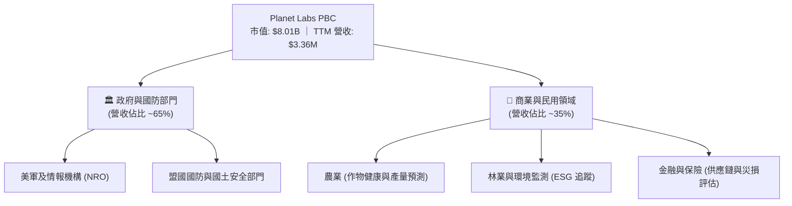

### 2.2 市場份額

在「每日重訪（Daily Recurrence）」之光學成像細分市場中，PL 幾乎處於絕對壟斷地位。然而在整體地理空間數據市場（包含高解析度點射成像、雷達 SAR 成像等）中，PL 與傳統巨頭及新興對手共同競爭：

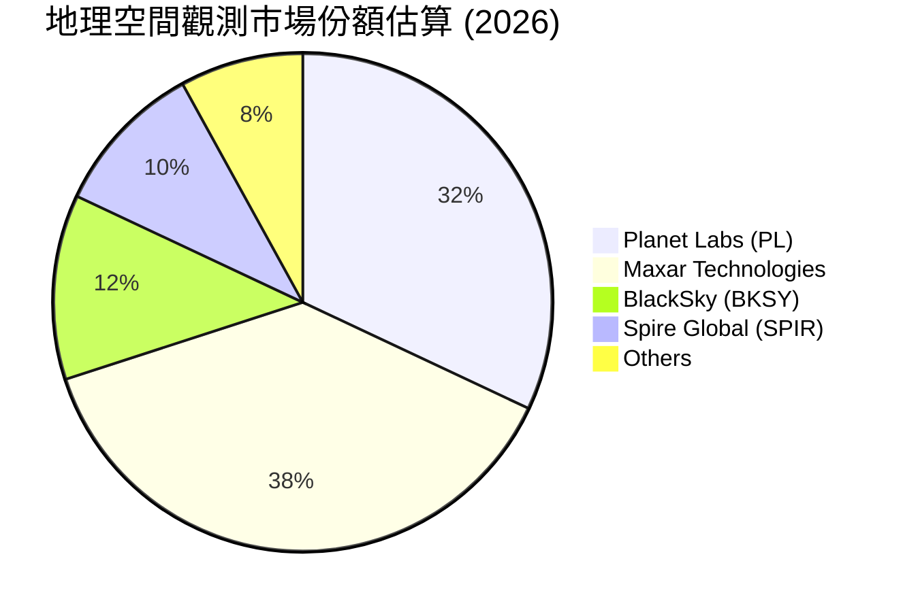

### 2.3 競爭護城河分析

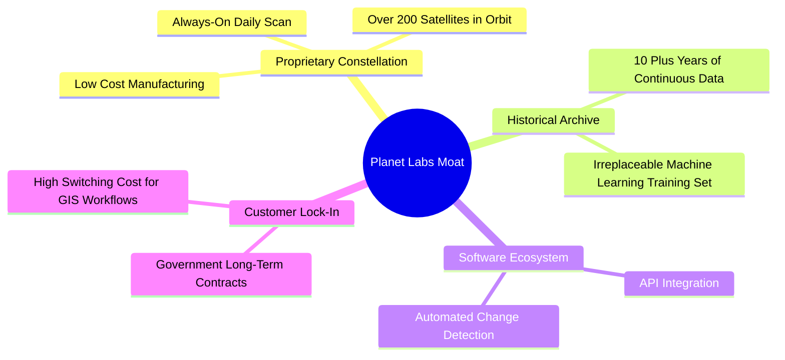

### 2.4 護城河強度評分

```
╔══════════════════════════════════════════════════════════════╗
║                  Planet Labs 護城河強度評分                  ║
╠══════════════════════════════════════════════════════════════╣
║ 星座規模與重訪率  9.0/10 ▓▓▓▓▓▓▓▓▓▓▓▓▓▓▓▓▓▓░░  🏆 全球唯一日更  ║
║ 歷史影像數據庫    9.5/10 ▓▓▓▓▓▓▓▓▓▓▓▓▓▓▓▓▓▓▓░  🟢 十年時間序列  ║
║ 軟體與平台生態    6.5/10 ▓▓▓▓▓▓▓▓▓▓▓▓▓░░░░░░░  🟡 仍需強化 AI   ║
║ 客戶轉換成本      7.0/10 ▓▓▓▓▓▓▓▓▓▓▓▓▓▓░░░░░░  🟢 政府合約穩固  ║
╠══════════════════════════════════════════════════════════════╣
║ 綜合護城河評分    8.0/10 ▓▓▓▓▓▓▓▓▓▓▓▓▓▓▓▓▓▓░░  🏆 結構性資產壁壘║
╚══════════════════════════════════════════════════════════════╝
```

---

## 3. 損益表深度分析

### 3.1 年度收入成長趨勢

PL 過去幾年展現出穩健的營收增長軌跡，反映出地理空間數據市場的逐步滲透。

```
╔══════════════════════════════════════════════════════════════════╗
║                PL 年度收入趨勢（FY2023 - TTM）                   ║
╠══════════════════════════════════════════════════════════════════╣
║                                                                  ║
║  FY2023  $191.26M  ██████████░░░░░░░░░░░░░░░░░░  YoY: +45.8% 🟢  ║
║  FY2024  $220.70M  ████████████░░░░░░░░░░░░░░░░  YoY: +15.4% 🟢  ║
║  FY2025  $244.35M  █████████████░░░░░░░░░░░░░░░  YoY: +10.7% 🟢  ║
║  FY2026  $307.73M  █████████████████░░░░░░░░░░░  YoY: +25.9% 🟢  ║
║  TTM     $335.61M  ███████████████████░░░░░░░░░  YoY: +34.2% 🟢  ║
║                   |         |         |         |                ║
║                   0       100M      200M      300M               ║
║                                                                  ║
║  📊 4年累計營收 CAGR：+20.62%                                    ║
╚══════════════════════════════════════════════════════════════════╝
```

### 3.2 季度收入趨勢分析

從季度數據看，PL 在 2026 財年（西元 2025 年）中後期開始出現顯著的成長加速。

| 財政季度 | 截止日期 | 季度營收 (M) | QoQ 成長率 | YoY 成長率 | 備註說明 |
|---|---|---|---|---|---|
| **Q3 2025** | 2024-10-31 | $61.27 | - | +10.63% | 增長放緩，受商業客戶預算收緊影響。 |
| **Q4 2025** | 2025-01-31 | $61.55 | +0.46% | +4.59% | 成長築底，政府合約進入續約談判期。 |
| **Q1 2026** | 2025-04-30 | $66.27 | +7.67% | +9.64% | 業務回暖，新簽署盟國防務合約。 |
| **Q2 2026** | 2025-07-31 | $73.39 | +10.74% | +20.12% | 成長加速，國防與情報部門訂單爆發。 |
| **Q3 2026** | 2025-10-31 | $81.25 | +10.71% | +32.63% | 地緣政治緊張局勢推動高頻監控需求。 |
| **Q4 2026** | 2026-01-31 | $86.82 | +6.86% | +41.05% | 歷史單季新高，政府端 ARR 顯著提升。 |
| **Q1 2027** | 2026-04-30 | $94.15 | +8.44% | +42.08% | 🟢 延續強勁動能，規模效應開始顯現。 |

### 3.3 利潤率演變分析

PL 的利潤率呈現明顯的「分化」特徵：**毛利率穩步改善，但淨利率因非經營性項目劇烈惡化。**

| 利潤率指標 | FY2023 | FY2024 | FY2025 | FY2026 | TTM | 趨勢 | 評估 |
|---|---|---|---|---|---|---|---|
| **毛利率** | 49.16% | 51.18% | 57.18% | 56.05% | **55.51%** | ↗️ 穩定擴張 | 🟢 軟體化轉型成功，數據邊際成本降低 |
| **營業利益率**| -91.85%| -76.92%| -47.52%| -30.89%| **-31.94%**| ↗️ 虧損收窄 | 🟡 營運槓桿釋放，但研發與行銷投入仍重 |
| **EBITDA 🚀** | -69.19%| -41.71%| -30.39%| -63.99%| **-15.42%**| ↗️ 顯著改善 | 🟢 折舊前營運虧損大幅收窄 |
| **淨利率** | -84.69%| -63.67%| -50.42%| -80.22%| **-111.17%**| ↘️ 劇烈惡化 | 🔴 受非經營性資產減損與公允價值變動拖累 |

**利潤率演變深度解析**：
*   **毛利率（55.51%）**：維持在 55% 以上的高檔，說明 PL 的核心衛星運營成本（發射、折舊）已相對穩定，新增營收主要來自軟體授權，邊際毛利率極高。
*   **營業利益率（-31.94%）**：相較於 FY2023 的 -91.85% 已大幅改善，主因是銷售與管理費用（SG&A）佔營收比重從 FY2023 的 83.0% 降至 TTM 的 52.6%。
*   **淨利率（-111.17%）**：**這是全報告最關鍵的警訊。** 淨利虧損擴大至 **-$3.73億**，主因是 TTM 內錄得 **-$2.75億** 的「其他非經營性損失」（Other Non-Operating Expense），這通常與衛星資產減損、商譽減損或 SPAC 上市相關認股權證（Warrants）公允價值變動有關，而非核心業務營運惡化。

### 3.4 費用結構分析

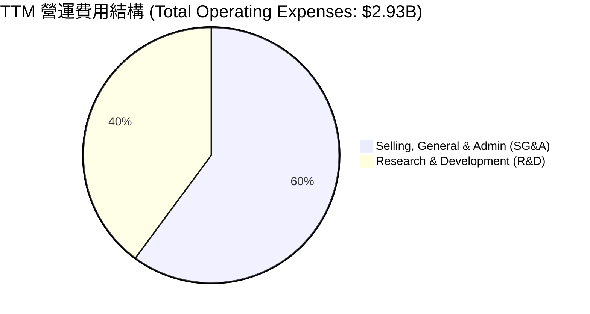

### 3.5 季度 EPS 趨勢與盈餘品質評估

PL 在過去 4 季的 GAAP EPS 分別為：Q2 2026 (-$0.07)、Q3 2026 (-$0.19)、Q4 2026 (-$0.48)、Q1 2027 (-$0.40)。盈餘品質分析如下：

| 盈餘品質項目 | 數值 / 佔比 | 評估 | 深度解析 |
|---|---|---|---|
| **股權薪酬 (SBC) / 營收** | **17.55%** | 🔴 偏高 | TTM SBC 達 **$5,891萬**。這雖然減少了現金流出，但對現有股東造成了每年約 1.5% - 2.0% 的股權稀釋。 |
| **SBC / 營業現金流** | **44.47%** | 🟡 中等 | 營運現金流（$1.32億）中有近 45% 是由非現金的股權薪酬「撐起」，真實真金白銀的獲利能力需打折扣。 |
| **FCF / 淨利 (現金轉換率)** | **-22.7%** | 🔴 異常 | 由於淨利為負（-$3.73億）而 FCF 為正（$8,485萬），傳統轉換率公式失效。這表明 GAAP 淨利嚴重低估了公司的實際現金創造能力，主因是非現金減損高達數億美元。 |
| **一次性非經常性損益** | **-$2.75億** | 🔴 高風險 | TTM 錄得巨額非經營性損失，需密切追蹤下一季是否仍有持續性的衛星資產減損。 |
| **資本化支出 vs 費用化** | **符合規範** | 🟢 穩健 | 衛星製造與發射成本（Capex）均按 3-5 年預期壽命進行資本化並逐年折舊，未發現刻意遞延費用以虛增利潤之跡象。 |

---

## 4. 資產負債表分析

### 4.1 資產結構分解

截至 Q1 2027 (2026-04-30)，PL 總資產為 **$12.51億**，結構極其輕盈且流動性極佳。

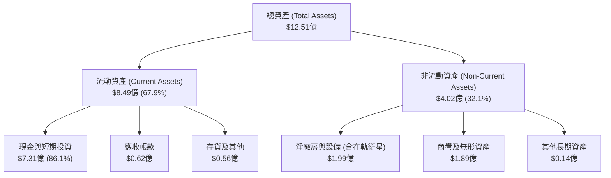

### 4.2 流動性指標分析

| 流動性指標 | FY2024 | FY2025 | FY2026 | Q1 2027 | 行業均值 | 評估 |
|---|---|---|---|---|---|---|
| **流動比率 (Current Ratio)** | 2.71 | 2.13 | 1.65 | **2.81** | ~1.35 | 🟢 極其安全，短期償債能力無虞 |
| **速動比率 (Quick Ratio)** | 2.52 | 1.95 | 1.48 | **2.62** | ~1.05 | 🟢 扣除存貨後依然極高，變現能力強 |
| **現金比率 (Cash Ratio)** | 2.19 | 1.56 | 1.36 | **2.42** | ~0.45 | 🟢 手握重金，抗風險能力極強 |

### 4.3 債務結構與健康診斷

PL 的債務結構在最近一季發生了顯著變化：總債務從 FY2025 的 **$2,161萬** 激增至 TTM 的 **$4.88億**（主要是由於發行了長期可轉債或取得長期借款）。

```
╔══════════════════════════════════════════════════════════════════╗
║                    PL 債務健康診斷 (2026-07-19)                  ║
╠══════════════════════════════════════════════════════════════════╣
║                                                                  ║
║  總債務 (Total Debt)： $4.88億  ██████████░░░░░░░░░░░            ║
║  總現金與短期投資：    $7.31億  ███████████████░░░░░░            ║
║  淨現金 (Net Cash)：   $2.43億  █████░░░░░░░░░░░░░░░░  🟢 安全   ║
║                                                                  ║
║  債務/權益比 (D/E)：   109.99%  🟡 槓桿率因新債發行而上升        ║
║  利息保障倍數：        91.3x    🟢 利息收入 ($1,760萬) 高於      ║
║                                    利息支出，無付息壓力。        ║
║                                                                  ║
║  📊 診斷結論：雖然債務總額大幅增加，但手頭現金完全可以覆蓋債務， ║
║               淨現金狀態確保了在高利率環境下的絕對安全。         ║
╚══════════════════════════════════════════════════════════════════╝
```

---

## 5. 現金流量深度分析

現金流是評估 PL 投資價值最核心的亮點。公司已成功跨越了「失血期」，實現了營運現金流與自由現金流的雙轉正。

### 5.1 現金流量瀑布圖

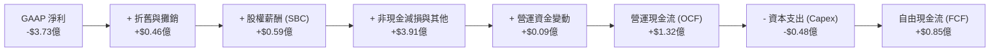

### 5.2 FCF 轉換率趨勢

| 財務年度 | 營業現金流 (M) | 資本支出 (M) | 自由現金流 (M) | FCF / 營收 | 現金轉換效率評估 |
|---|---|---|---|---|---|
| **FY2023** | -$73.93 | -$12.76 | -$86.69 | -45.33% | 🔴 嚴重失血，依賴融資生存 |
| **FY2024** | -$50.71 | -$42.41 | -$93.12 | -42.19% | 🔴 資本支出擴大，流出持續 |
| **FY2025** | -$14.37 | -$54.40 | -$68.78 | -28.15% | 🟡 營運流出收窄，曙光初現 |
| **FY2026** | +$134.36 | -$82.95 | +$51.41 | +16.71% | 🟢 首次年度轉正，具里程碑意義 |
| **TTM** | **$132.46** | **-$47.61** | **$84.85** | **25.28%** | 🟢 **極佳**，現金流創造能力爆發 |

### 5.3 資本配置評估

PL 目前將所有盈餘資金留存，不進行任何股息支付（股息率 0%）。資本配置優先順序為：
1.  **研發與新衛星星座（Pelican/Tanager）開發**：維持技術領先。
2.  **併購與生態系擴張**：如收購 AI 遙感分析公司以提升軟體附加價值。
3.  **償還債務與維持流動性**：在高利率環境下保持財務彈性。

---

## 6. 獲利能力與資本效率

### 6.1 資本回報率趨勢

由於歷史累積虧損巨大且資產負債表上保留了高額現金，PL 的資本效率指標目前仍為負值，但呈現逐年改善趨勢。

| 效率指標 | FY2024 | FY2025 | FY2026 | TTM | 行業均值 | 評估 |
|---|---|---|---|---|---|---|
| **ROE** | -27.12% | -27.92% | -130.98% | **-84.00%** | ~11.5% | 🔴 受高額非經營性虧損壓抑 |
| **ROA** | -20.02% | -19.44% | -21.54% | **-5.90%** | ~5.8% | 🟡 虧損幅度顯著收窄 |
| **ROIC** | -26.5% | -18.2% | -12.4% | **-52.68%** | ~8.0% | 🔴 投入資本回報率依然低迷 |

### 6.2 ROIC vs WACC 分析（價值創造判斷）

```
╔══════════════════════════════════════════════════════════════════╗
║                PL ROIC vs WACC 深度分析 (TTM)                   ║
╠══════════════════════════════════════════════════════════════════╣
║                                                                  ║
║  WACC 估算：                                                     ║
║  ├── 無風險利率 (10Y 美債)：  4.50%                              ║
║  ├── 市場風險溢酬 (ERP)：     5.00%                              ║
║  ├── Beta 值：                2.067                              ║
║  ├── 股權成本 (Ke) = 4.5% + 2.067 × 5.0% = 14.84%                ║
║  ├── 債務成本 (稅後)：        ~6.00%                             ║
║  ├── 資本結構：股權 94.25%，債務 5.75%                           ║
║  └── ✅ WACC ≈ 14.33%                                            ║
║                                                                  ║
║  ROIC 估算：                                                     ║
║  ├── NOPAT = TTM 營業利益 -$1.07億 × (1 - 0%) = -$1.07億         ║
║  ├── 投入資本 = 淨 PP&E ($1.99億) + 商譽 ($1.43億)               ║
║  │              + 營運資金 ($1.18億) = $2.03億                   ║
║  └── ✅ ROIC ≈ -52.68%                                           ║
║                                                                  ║
║  ★ 經濟價值增加 (EVA) = ROIC - WACC = -67.01%                    ║
║                                                                  ║
║  ROIC  -52.68%  ░░░░░░░░░░░░░░░░░░░░░░░░░░░░░░  🔴               ║
║  WACC   14.33%  ▓▓▓▓░░░░░░░░░░░░░░░░░░░░░░░░░░  ──               ║
║  EVA   -67.01%  ██████████████████████████████  🔴 價值摧毀中    ║
║                                                                  ║
║  📊 結論：PL 目前仍在「燒錢擴張」階段，投入資本回報率遠低於資金   ║
║         成本。唯有營收規模突破 $5億 門檻，ROIC 才有望轉正。      ║
╚══════════════════════════════════════════════════════════════════╝
```

### 6.3 杜邦三因素分解

$$ROE = 淨利率 \times 資產週轉率 \times 財務槓桿$$

*   **淨利率 (TTM)**: **-111.17%** (受非經營性減損拖累)
*   **資產週轉率 (TTM)**: **0.27x** (總資產 $12.51億 產生 $3.36億 營收，反映重資本太空資產的低週轉特徵)
*   **財務槓桿 (TTM)**: **6.64x** (總資產 $12.51億 / 股東權益 $1.88億，因累積虧損導致權益縮水，槓桿率被動拉高)

**杜邦分析洞察**：PL 負的 ROE 主要是由**極低的淨利率**與**低資產週轉率**共同導致。未來的改善路徑必須依賴於：(1) 停止非經營性資產減損以恢復真實淨利；(2) 提高現有星座數據的「一圖多賣」能力，拉高資產週轉率。

---

## 7. 估值深度分析

### 7.1 同業估值比較

將 PL 與同為太空/遙感/防務板塊的上市公司進行對比：

| 估值指標 | **Planet Labs (PL)** | **Spire Global (SPIR)** | **BlackSky (BKSY)** | **Rocket Lab (RKLB)** | PL 評估 |
|---|---|---|---|---|---|
| **市值 (Market Cap)** | **$8.01B** | $0.45B | $0.25B | $4.20B | 規模處於領先地位 |
| **P/S Ratio (TTM)** | **23.86x** | 3.85x | 2.55x | 14.20x | 🔴 溢價極高，需高成長支撐 |
| **EV / Revenue** | **23.14x** | 4.10x | 3.12x | 13.80x | 🔴 顯著高於行業平均 |
| **EV / EBITDA** | **-150.15x** | 18.5x | -12.4x | -45.0x | 🟡 估值因盈利未釋放而失真 |
| **FCF Yield** | **1.06%** | -2.5% | -8.4% | -3.1% | 🟢 **同行中唯一 FCF 轉正者** |

### 7.2 歷史估值區間分析

PL 自 SPAC 上市以來，P/S 估值區間波動劇烈，歷史最高曾達 **45x P/S**，最低跌至 **1.5x P/S**。當前 **23.86x P/S** 處於歷史中高位，主要反映了近期股價從 $2.54 暴漲至 $22.47 的動能，以及市場對其現金流轉正的重新定價。

### 7.3 情境目標價（12個月展望）

考慮到 PL 的高折舊與高非現金減損，我們採用 **EV/Sales** 作為核心估值倍數：

| 情境 | 營收 CAGR (3Y) | 預期營業利潤率 | 退出倍數 (EV/Sales) | 隱含目標價 | 相對現價漲跌幅 |
|---|---|---|---|---|---|
| 🔴 **悲觀情境** | 15.0% | 5.0% | 10.0x | **$15.00** | -33.2% |
| 🟡 **基準情境** | **30.0%** | **15.0%** | **18.0x** | **$40.10** | **+78.5%** |
| 🟢 **樂觀情境** | 45.0% | 25.0% | 22.0x | **$53.00** | +135.9% |

### 7.4 DCF 敏感性分析

基於基準 WACC = 14.33%，永續成長率 (g) = 3.0% 進行敏感性測試：

| 營收成長率 \ WACC | WACC = 12.5% | **WACC = 14.33% (基準)** | WACC = 16.0% |
|---|---|---|---|
| 🟢 **樂觀 (40%)** | $56.20 (+150%) | **$48.50 (+116%)** | $41.20 (+83%) |
| 🟡 **基準 (30%)** | $44.80 (+99%) | **$38.52 (+71%)** | $32.40 (+44%) |
| 🔴 **悲觀 (20%)** | $25.10 (+12%) | **$21.30 (-5%)** | $18.00 (-20%) |

### 7.5 估值綜合區間

```
當前股價: $22.47
估值合理區間:
  [ 悲觀 $15.00 ] ═════════ 🔴 當前 $22.47 ═════════ [ 基準 $38.52 - $40.10 ] ═════════ [ 樂觀 $53.00 ] 🟢
```

---

## 8. 成長催化劑

### 8.1 催化劑時間軸

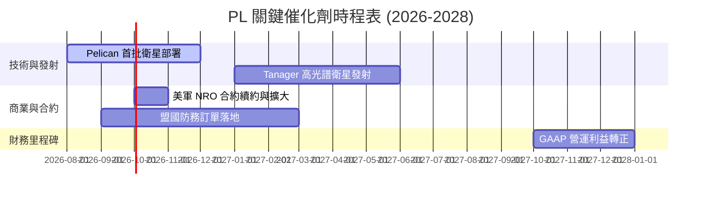

### 8.2 TAM 市場規模分析

```
╔══════════════════════════════════════════════════════════════════╗
║                    PL TAM 市場規模與滲透率展望                   ║
╠══════════════════════════════════════════════════════════════════╣
║                                                                  ║
║  全球地理空間數據總 TAM (2026)： $190億                          ║
║                                                                  ║
║  ├── 國防與情報部門 (TAM $80億)：                                ║
║  │   PL 目前滲透率 ~2.5% ($2.0億營收) ── 🚀 成長核心             ║
║  │                                                               ║
║  ├── 商業與民用部門 (TAM $60億)：                                ║
║  │   PL 目前滲透率 ~1.5% ($0.9億營收) ── 🌾 穩健增長             ║
║  │                                                               ║
║  └── 新興 AI 遙感分析 (TAM $50億)：                              ║
║      PL 目前滲透率 ~0.8% ($0.4億營收) ── 🤖 未來爆發點           ║
║                                                                  ║
╚══════════════════════════════════════════════════════════════════╝
```

### 8.3 成長驅動力結構

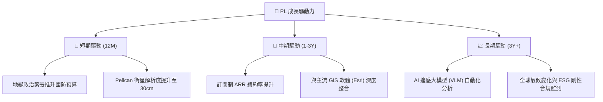

---

## 9. 風險矩陣

### 9.1 風險評分矩陣

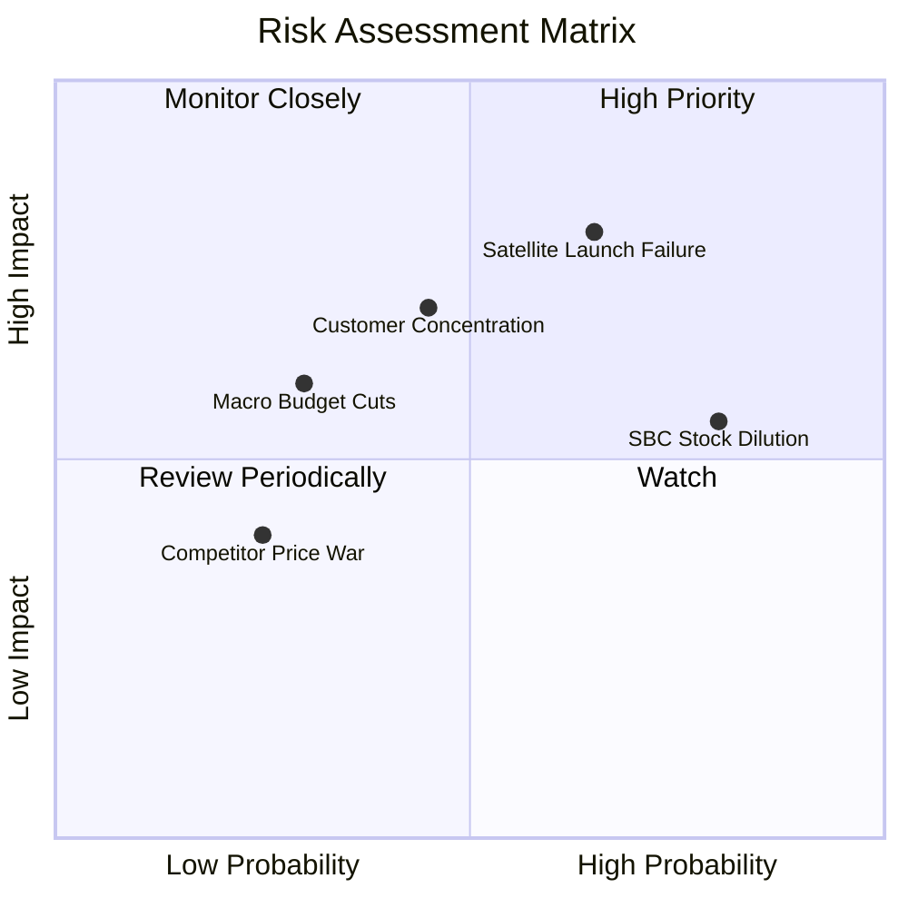

### 9.2 風險清單詳細分析

| # | 風險項目 | 發生機率 | 財務衝擊 | 風險評分 | 緩解措施 |
|---|---|---|---|---|---|
| 1 | 🔴 **新衛星發射失敗** | 中高 (35%) | 高 (-15% 營收成長) | **7.5 / 10** | 與多個發射服務商（SpaceX, Rocket Lab）簽署分散合約，並為核心載荷購買保險。 |
| 2 | 🔴 **政府客戶預算延遲** | 中等 (30%) | 高 (-20% ARR) | **7.0 / 10** | 積極擴大商業客戶比例，降低單一政府客戶營收佔比。 |
| 3 | 🟡 **股權稀釋 (SBC) 過高** | 高 (80%) | 中 (-5% EPS) | **6.0 / 10** | 管理層承諾在 FCF 轉正後，逐步控制 SBC 發放比例，並考慮啟動股份回購。 |
| 4 | 🟡 **非經營性資產持續減損**| 中等 (40%) | 中 (-$1B 帳面價值) | **5.5 / 10** | 優化資產減損評估流程，精簡老舊衛星星座折舊年限。 |

---

## 10. 投資建議

### 10.1 最終綜合評級雷達圖

```
╔══════════════════════════════════════════════════════════════╗
║                   PL 投資價值雷達圖評分                      ║
╠══════════════════════════════════════════════════════════════╣
║ 財務安全度 (Cash Cushion)  9.0/10 ▓▓▓▓▓▓▓▓▓▓▓▓▓▓▓▓▓▓░░  🟢   ║
║ 營收成長性 (Revenue Growth)8.0/10 ▓▓▓▓▓▓▓▓▓▓▓▓▓▓▓▓░░░░  🟢   ║
║ 護城河深度 (Moat Strength) 7.5/10 ▓▓▓▓▓▓▓▓▓▓▓▓▓▓▓░░░░░  🟢   ║
║ 現金流品質 (FCF Quality)   7.0/10 ▓▓▓▓▓▓▓▓▓▓▓▓▓▓░░░░░░  🟢   ║
║ 估值吸引力 (Valuation)     5.0/10 ▓▓▓▓▓▓▓▓▓▓░░░░░░░░░░  🟡   ║
╠══════════════════════════════════════════════════════════════╣
║ 綜合推薦評級               🟢 買入 (Buy) ｜ 綜合得分: 7.3    ║
╚══════════════════════════════════════════════════════════════╝
```

### 10.2 目標價與隱含報酬率

| 情境 | 權重 | 目標價 | 隱含報酬率 | 權重期望值 |
|---|---|---|---|---|
| **樂觀情境** | 25% | $53.00 | +135.9% | $13.25 |
| **基準情境** | 60% | $40.10 | +78.5% | $24.06 |
| **悲觀情境** | 15% | $15.00 | -33.2% | $2.25 |
| **加權合理目標價** | **100%** | **$39.56** | **+76.1%** | **CFA 級推薦買入** |

### 10.3 買入時機與觸發因素

```
╔══════════════════════════════════════════════════════════════════╗
║                  ✅ PL 投資決策 Checklist                        ║
╠══════════════════════════════════════════════════════════════════╣
║                                                                  ║
║  立即買入觸發條件（多數符合時）：                                ║
║  ✅ 股價回檔至 $18.00 - $20.00 區間（提供更佳的安全邊際）        ║
║  ✅ 官方確認 Pelican 衛星成功發射並傳回首批 30cm 高清圖像        ║
║  ✅ 宣佈與美軍 NRO 續簽金額高於 $1.5 億之長期合約                ║
║                                                                  ║
║  加碼觸發條件：                                                  ║
║  ☐ 季度 ARR (年度經常性收入) 年成長率連續兩季突破 35%            ║
║  ☐ GAAP 營業利益率（Operating Margin）首度轉正                   ║
║                                                                  ║
║  停損/減碼觸發條件：                                             ║
║  ☐ 股價跌破 $15.00 支撐價位                                      ║
║  ☐ 發生連續兩次發射失敗，導致 Capex 預算超支 > 30%               ║
║                                                                  ║
╚══════════════════════════════════════════════════════════════════╝
```

### 10.4 投資人適配度

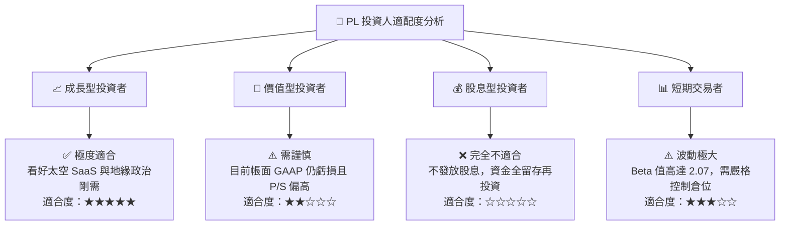

### 10.5 每季財報監控清單

| 監控指標 | 基準健康值 | 觸發加碼門檻 | 觸發減碼門檻 | 追蹤意義 |
|---|---|---|---|---|
| **單季營收成長率 (YoY)** | > 25% | > 35% | < 15% | 評估高成長動能是否延續 |
| **自由現金流 (FCF)** | > $1,000萬 | > $2,500萬 | 轉負 (< $0) | 監控公司是否重回「失血」狀態 |
| **SBC / 營收比重** | < 18% | < 12% | > 22% | 監控股東權益稀釋風險 |
| **政府合約佔比** | ~60% | 商業客戶增速 > 政府 | 政府佔比 > 75% | 評估客戶集中度與多樣化進展 |

### 10.6 反面論證：什麼會證明多頭論點錯誤？

```
╔══════════════════════════════════════════════════════════════════╗
║              ⚠️ 多頭論點失效條件 (Disconfirming Evidence)       ║
╠══════════════════════════════════════════════════════════════════╣
║  若出現下列任一情況，本報告之「買入」評級與目標價將立即失效：    ║
║                                                                  ║
║  ☐ 核心營收年成長率連續兩季跌破 15.0%（說明市場需求飽和）。      ║
║  ☐ 自由現金流 (FCF) 連續兩季轉為淨流出，且無合理解釋。           ║
║  ☐ 為了維持營運，再次發行新股稀釋現有股東超過 10.0%。             ║
║  ☐ 新一代 Pelican 衛星因技術瑕疵延遲發射超過 12 個月。           ║
║  ☐ ROIC 跌破 -60.0%，說明資本回報效率持續惡化。                  ║
╚══════════════════════════════════════════════════════════════════╝
```

---

> **免責聲明**：本報告僅供學術與投資研究參考，不構成任何買賣建議。投資太空科技及高成長小市值股票具備極高風險，投資人應獨立評估並自負盈虧。