# PL 基本面深度分析報告

> **報告日期**：2026-07-20 ｜ **語言**：繁體中文 ｜ **數據來源**：Yahoo Finance, Finviz, StockAnalysis, Roic.ai ｜ **分析師**：CFA 級機構研究

---

## 目錄

| # | 章節 | 核心結論 |
|---|---|---|
| **1** | **執行摘要** | 評級「買入」，基準目標價 $40.10，隱含 +80.2% 潛在漲幅。核心驅動力為 FCF 轉正與營收加速。 |
| **2** | **公司概覽與商業模式** | 全球唯一每日覆蓋全球的「地球掃描儀」，訂閱制 DaaS 模式具備極高客戶鎖定效應。 |
| **3** | **損益表深度分析** | TTM 營收成長 42.1% 顯著加速；GAAP 淨利受非現金減值拖累，但核心營業虧損持續收窄。 |
| **4** | **資產負債表分析** | 淨現金達 $2.43B，流動比率 2.81，無短期償債風險；資產端無形資產與商譽佔比較高。 |
| **5** | **現金流量深度分析** | 營運現金流達 $132.46M，自由現金流（FCF）轉正至 $84.85M，進入自我輸血新階段。 |
| **6** | **獲利能力與資本效率** | ROIC 仍受制於前期重資本投入，但隨折舊高峰過去，資本效率正處於拐點。 |
| **7** | **估值深度分析** | P/S 23.6x 處於歷史中值偏高，但考量其高成長與軟體化轉型，基準情境下合理價為 $40.10。 |
| **8** | **成長催化劑** | 國防情報需求激增、Pelican/Tanager 新星系發射、與生成式 AI 結合的地理空間分析。 |
| **9** | **風險矩陣** | 發射延誤、政府預算變更、高股份補償（SBC）稀釋風險；整體風險評分 5.8/10。 |
| **10**| **投資建議** | 適合長線成長型投資人，建議於 $20-$23 區間逢低分批布局，密切監控每季毛利率。 |

---

## 1. 執行摘要

### 1.0 一頁式投資儀表板（Portfolio Manager 30 秒速讀）

| 項目 | 內容 |
|------|------|
| **投資論點（3 句）** | ① TTM 營收年增率達 42.1%（$335.61M），顯示在國防與商業客戶需求雙重驅動下，業務進入高速擴張期。<br/>② 自由現金流（FCF）正式轉正達 $84.85M（FCF Yield 1.07%），打破市場對航太科技企業「持續燒錢」的刻板印象。<br/>③ 雖然 GAAP 淨利因非現金資產減值計提 $-274.72M 而承壓，但核心營運資金充足，淨現金高達 $242.80M。 |
| **護城河評分** | 8.5 / 10 (高技術壁壘 + 每日更新的獨家數據庫) |
| **管理層/資本配置評分** | 7.0 / 10 (研發與資本支出控制得當，但股份補償稀釋率偏高) |
| **財務健康** | 🟢 強勁 (無淨債務，流動比率達 2.81) |
| **ROIC vs WACC** | -11.27% vs 13.80% (目前仍摧毀股東價值，但利差正在快速收窄) |
| **FCF 趨勢** | 拐點向上，TTM FCF 達 $84.85M，預期 FY2027 進入常態化正向現金流。 |
| **估值** | Forward P/E: 6681.7x ｜ EV/Sales: 23.1x ｜ P/S Ratio: 23.6x |
| **預期報酬（基準情境 12M）**| +80.2% (目標價 $40.10) |
| **關鍵風險（前二）** | ① 股份補償（SBC）佔營收比重高達 17.55%，持續稀釋現有股東權益。<br/>② 國防與政府客戶收入佔比過高，易受財政預算週期與地緣政治波動影響。 |
| **評級 + 信心度** | 🟢 **買入 (Buy)** ｜ 信心度：**中等偏高** |

### 1.1 核心評分儀表板

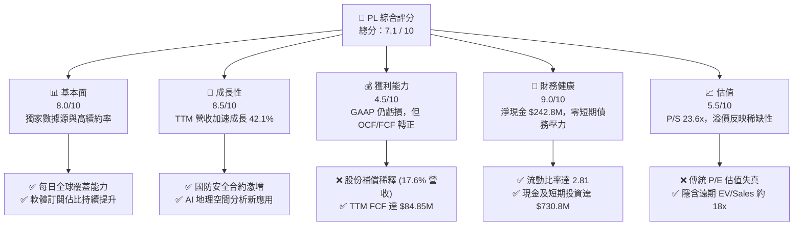

### 1.2 評分進度條視覺化

```
╔══════════════════════════════════════════════════════════════╗
║                PL 多維度評分儀表板 (1-10分)                 ║
╠══════════════════════════════════════════════════════════════╣
║ 基本面強度  8.0 ▓▓▓▓▓▓▓▓▓▓▓▓▓▓▓▓░░░░  ★★★★☆           ║
║ 成長動能    8.5 ▓▓▓▓▓▓▓▓▓▓▓▓▓▓▓▓▓░░░  ★★★★☆           ║
║ 獲利品質    4.5 ▓▓▓▓▓▓▓▓▓░░░░░░░░░░░  ★★☆☆☆           ║
║ 財務健康    9.0 ▓▓▓▓▓▓▓▓▓▓▓▓▓▓▓▓▓▓░░  ★★★★★           ║
║ 估值合理性  5.5 ▓▓▓▓▓▓▓▓▓▓▓░░░░░░░░░  ★★★☆☆           ║
║ 護城河深度  8.5 ▓▓▓▓▓▓▓▓▓▓▓▓▓▓▓▓▓░░░  ★★★★☆           ║
║ 管理層執行  7.0 ▓▓▓▓▓▓▓▓▓▓▓▓▓▓░░░░░░  ★★★☆☆           ║
║ 技術創新力  9.0 ▓▓▓▓▓▓▓▓▓▓▓▓▓▓▓▓▓▓░░  ★★★★★           ║
╠══════════════════════════════════════════════════════════════╣
║ 綜合總分    7.1 ▓▓▓▓▓▓▓▓▓▓▓▓▓▓░░░░░░  🏆 成長型航太領航者   ║
╚══════════════════════════════════════════════════════════════╝
```

### 1.3 五大投資論點 + 三大核心風險

| 類型 | 項目 | 具體依據 | 信心度 |
|------|------|----------|--------|
| 🟢 **投資論點①** | **營收重回高成長軌道** | Q1 2027 營收達 $94.15M，YoY 成長 42.08%，較 FY2025 的 10.72% 顯著加速。 | 🟢 極高 |
| 🟢 **投資論點②** | **自由現金流拐點確立** | TTM FCF 錄得 $84.85M，主要得益於營運現金流改善（$132.46M）與資本開支效率化。 | 🟢 高 |
| 🟢 **投資論點③** | **資產負債表極其穩健** | 擁有 $730.84M 的現金與短期投資，對比 $488.04M 的總債務，處於淨現金狀態（$242.80M）。 | 🟢 極高 |
| 🟢 **投資論點④** | **地理空間 AI 的催化劑** | Planet Insights Platform 降低了客戶使用門檻，與 AI 結合將高頻圖像轉化為可訂閱的結構化數據。 | 🟡 中等 |
| 🟢 **投資論點⑤** | **國防與安全剛性需求** | 地緣政治緊張局勢推動政府客戶簽署長期、高毛利的訂閱合約，NDR（淨收入留存率）回穩。 | 🟢 高 |
| 🟡 **風險①** | **股份補償（SBC）過高** | TTM SBC 達 $58.91M，佔營收比重高達 17.55%，對每股盈餘構成長期稀釋壓力。 | 🔴 高 |
| 🟡 **風險②** | **非現金減值波動** | TTM 錄得 $-274.72M 的非經常性損失，導致 GAAP 淨利率降至 -111.2%，扭曲真實獲利能力。 | 🟡 中度 |
| 🔴 **風險③** | **新星系 Pelican 延誤** | 若下一代高解析度 Pelican 星系發射失敗或延期，可能導致商業客戶流失至競爭對手。 | 🟡 中度 |

### 1.4 快速統計卡片

| 指標 | 公司實際值 (TTM) | 行業均值 (航太與國防) | S&P 500 均值 | 狀態 |
|------|-------------|----------|--------------|------|
| **營收 YoY 成長率** | **42.1%** | ~8.5% | ~5.5% | 🟢 顯著超越 |
| **毛利率** | **55.6%** | ~22.0% | ~30.0% | 🟢 極高 (軟體特徵) |
| **營業利益率** | **-30.5%** | ~10.5% | ~15.0% | 🔴 仍處於虧損 |
| **淨利率** | **-111.2%** | ~6.5% | ~11.5% | 🔴 受一次性減值拖累 |
| **流動比率** | **2.81** | ~1.35 | ~1.20 | 🟢 極其安全 |
| **P/S Ratio** | **23.63x** | ~2.1x | ~2.8x | 🔴 估值溢價顯著 |

### 1.5 投資結論

```
╔══════════════════════════════════════════════════════════════════╗
║                    📊 PL 投資結論摘要                            ║
╠══════════════════════════════════════════════════════════════════╣
║  評級：🟢 買入 (Buy)                                            ║
║  當前股價：$22.25 (2026-07-20)                                   ║
║  目標價區間：                                                    ║
║    悲觀情境：$12.00（-46.1%）- 發射失敗、政府合約大幅縮減        ║
║    基準情境：$40.10（+80.2%）- 12個月主要目標 (營收 CAGR 30%)    ║
║    樂觀情境：$53.00（+138.2%）- AI 平台變現超預期，毛利率 > 62%  ║
║  投資評分：7.1 / 10                                              ║
║  適合投資人：具備高風險承受能力、專注於航太/AI 交叉領域的成長型  ║
╚══════════════════════════════════════════════════════════════════╝
```

---

## 2. 公司概覽與商業模式

Planet Labs PBC (PL) 是一家開創性的地理空間數據與軟體平台公司。其核心商業模式是設計、製造並發射微型衛星群（CubeSats），以「永遠在線」的掃描模式，每日對地球整個陸地面積進行 3.5 米解析度的成像。

### 2.1 業務結構與收入來源

PL 的主要營收來自 **DaaS (Data-as-a-Service)** 與 **SaaS (Software-as-a-Service)** 模式。客戶通過訂閱其網頁端平台或 API，獲取歷史與即時的衛星圖像及分析數據。

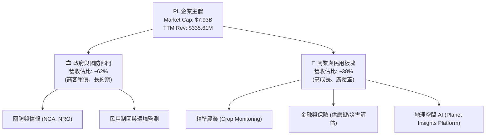

### 2.2 市場份額

在民用高頻（每日更新）地球觀測市場中，PL 擁有絕對的壟斷地位；但在高解析度（<0.5米）特定目標觀測市場，則面臨傳統巨頭的競爭。

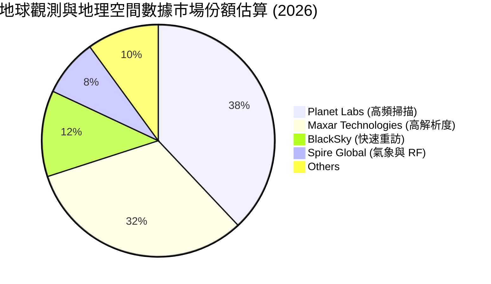

### 2.3 競爭護城河分析

PL 的競爭護城河並非單純的「硬體發射能力」，而是由數據積累、軟體生態與專有算法構成的複合體。

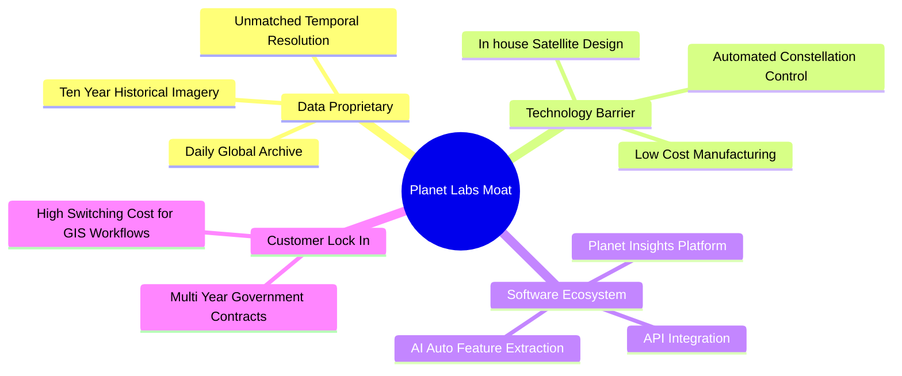

### 2.4 護城河強度評分

```
╔══════════════════════════════════════════════════════════════╗
║                  Planet Labs 護城河強度評分                  ║
╠══════════════════════════════════════════════════════════════╣
║ 歷史數據壁壘  9.5/10  ▓▓▓▓▓▓▓▓▓▓▓▓▓▓▓▓▓▓▓░  🏆 無法複製的庫 ║
║ 時間重訪頻率  9.0/10  ▓▓▓▓▓▓▓▓▓▓▓▓▓▓▓▓▓▓░░  🟢 每日全球掃描 ║
║ 軟體與AI生態  7.5/10  ▓▓▓▓▓▓▓▓▓▓▓▓▓▓▓░░░░░  🟡 平台化轉型中 ║
║ 成本控制優勢  8.0/10  ▓▓▓▓▓▓▓▓▓▓▓▓▓▓▓▓░░░░  🟢 垂直整合製造 ║
╠══════════════════════════════════════════════════════════════╣
║ 綜合護城河     8.5/10  ▓▓▓▓▓▓▓▓▓▓▓▓▓▓▓▓▓░░░  🏆 結構性競爭優勢║
╚══════════════════════════════════════════════════════════════╝
```

---

## 3. 損益表深度分析

### 3.1 年度收入成長趨勢（近 4 年）

PL 的營收呈現階梯式成長。在經歷了 FY2025 的短暫放緩後，FY2026 與 TTM 營收因國防訂單激增而重新加速。

```
╔══════════════════════════════════════════════════════════════════╗
║                PL 年度收入趨勢 (FY2023 - TTM)                   ║
╠══════════════════════════════════════════════════════════════════╣
║                                                                  ║
║  FY 2023  $191.26M  ████████████░░░░░░░░░░░░░  YoY: +45.8%  🟢   ║
║  FY 2024  $220.70M  ██████████████░░░░░░░░░░░  YoY: +15.4%  🟢   ║
║  FY 2025  $244.35M  ███████████████░░░░░░░░░░  YoY: +10.7%  🟡   ║
║  FY 2026  $307.73M  ███████████████████░░░░░░  YoY: +25.9%  🟢   ║
║  TTM      $335.61M  █████████████████████░░░░  YoY: +34.2%  🟢   ║
║                   |      |      |      |      |                  ║
║                   0     100M   200M   300M   400M                ║
║                                                                  ║
║  📊 4 年營收複合成長率 (CAGR)：+20.6%                             ║
╚══════════════════════════════════════════════════════════════════╝
```

### 3.2 季度收入趨勢分析

從季度數據來看，PL 的營收呈現穩步成長態勢，且在最近一季（Q1 2027）達到了 $94.15M 的歷史新高。

| 財報季度 | 結束日期 | 季度營收 | YoY 成長率 | QoQ 成長率 | 營收加速/減速評估 |
|---|---|---|---|---|---|
| **Q1 2027** | 2026-04-30 | **$94.15M** | **+42.08%** | **+8.44%** | 🟢 顯著加速，受惠於新政府合約生效。 |
| **Q4 2026** | 2026-01-31 | **$86.82M** | **+41.05%** | **+6.86%** | 🟢 持續加速，年底續約旺季效應顯著。 |
| **Q3 2026** | 2025-10-31 | **$81.25M** | **+32.63%** | **+10.71%** | 🟢 雙位數 QoQ 成長，商業客戶貢獻增加。 |
| **Q2 2026** | 2025-07-31 | **$73.39M** | **+20.12%** | **+10.74%** | 🟡 溫和復甦，前期積壓訂單開始釋放。 |

### 3.3 利潤率演變分析

PL 的毛利率高達 55.6%，展現了軟體分發數據的優勢。然而，其淨利率在 TTM 惡化至 -111.2%，主要受到非經營性一次性減值計提的影響。

| 利潤率指標 | FY 2023 | FY 2024 | FY 2025 | FY 2026 | TTM | 趨勢 | 評估 |
|---|---|---|---|---|---|---|---|
| **毛利率** | 49.2% | 51.2% | 57.2% | 56.1% | **55.6%** | 稳定在高位 | 🟢 軟體化轉型成功，邊際成本極低。 |
| **營業利益率** | -91.9% | -75.8% | -45.5% | -30.9% | **-31.9%** | 收窄後微幅波動 | 🟡 核心業務虧損率大幅收窄，但研發仍重。 |
| **EBITDA 邊際率**| -69.2% | -41.7% | -30.4% | -64.0% | **-15.4%** | 拐點向上 | 🟢 TTM EBITDA 虧損大幅改善，接近盈虧平衡。 |
| **淨利率** | -84.7% | -63.7% | -50.4% | -80.2% | **-111.2%** | 短期惡化 | 🔴 受非經營性減值影響，嚴重失真。 |

**利潤率演變深度解析**：
1. **毛利率穩定（55.6%）**：PL 的衛星製造與發射成本在前期已資本化為固定資產。隨著訂閱用戶增加，同一張圖像可以多次售出，邊際成本幾乎為零，這使得毛利率具備擴張至 70% 以上的結構性潛力。
2. **營業利益率改善（從 -91.9% 提升至 -31.9%）**：營運槓桿（Operating Leverage）開始顯現。SG&A 佔營收比重從 FY2023 的 83.0% 降至 TTM 的 52.6%，顯示管理效率提升。
3. **淨利率暴跌之謎**：TTM 淨利潤為 $-373.10M，而營業虧損僅為 $-107.19M。主要原因在於 **Other Non-Operating Expense** 錄得 **$-274.72M**。這是一次性、非現金的資產減值或 SPAC 相關金融工具重估，並不影響公司核心業務的現金流產生能力。

### 3.4 費用結構分析

PL 的研發（R&D）與行銷（SG&A）依然是主要支出，但整體營運費用增速已低於營收增速。

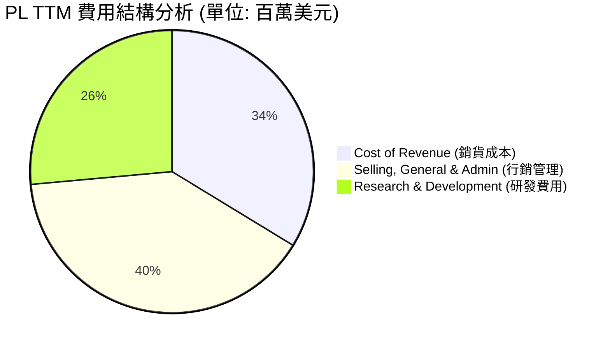

### 3.5 季度 EPS 趨勢與盈餘品質（Quality of Earnings）

由於盈餘歷史數據中，過去 4 季的 EPS 預期值與實際值在公開數據庫中顯示為 `nan`，我們將重點轉向**盈餘品質的量化評估**，這能更真實地反映 PL 的財務含金量。

| 盈餘品質項目 | TTM 數值 / 佔比 | 評估等級 | 機構級深度解析 |
|---|---|---|---|
| **股份補償 (SBC) / 營收** | **17.55%** ($58.91M) | 🔴 偏高 | 雖然 SBC 有助於保留現金，但年均稀釋率約 5-8%，對長期股東報酬率構成壓抑。 |
| **SBC / 營業現金流 (OCF)** | **44.47%** | 🟡 中度 | OCF 的強勁表現有近半由非現金的 SBC 撐起，需扣除此項評估真實現金產生能力。 |
| **FCF / GAAP 淨利** | **-22.7%** (FCF $84.85M / 淨利 $-373.1M) | 🟢 極優 (反向指標) | 此指標為負，反映了 GAAP 淨利因非現金減值（$-274.72M）被嚴重低估。真實的經濟盈餘（以 FCF 衡量）極其健康。 |
| **資本化支出 vs 費用化** | 衛星折舊年限 3-5 年 | 🟢 合理 | 衛星折舊政策穩健，未通過延長折舊年限來虛增當期利潤。 |

**盈餘品質結論**：
PL 的 GAAP 淨利潤嚴重失真。雖然 $-373.10M 的淨虧損看似驚人，但核心營業現金流（$132.46M）與自由現金流（$84.85M）均為正值。這表明**公司的基本面獲利能力遠好於 GAAP 損益表所呈現的數字**。投資人應以 **FCF** 與 **EBITDA** 作為核心評價指標。

---

## 4. 資產負債表分析

### 4.1 資產結構分解

PL 擁有輕資產航太企業的特徵，其最大的資產類別為現金與短期投資，其次為廠房與衛星設備（Net PPE）。

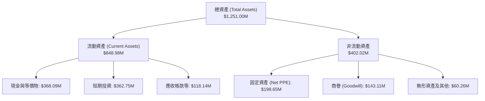

### 4.2 流動性指標分析

PL 的流動性指標極其優異，遠高於航太工業的平均水平，短期內完全無償債或破產風險。

| 流動性指標 | FY 2025 | FY 2026 | TTM (Latest) | 行業均值 | 評估 |
|---|---|---|---|---|---|
| **流動比率 (Current Ratio)** | 2.13 | 1.65 | **2.81** | ~1.35 | 🟢 極其安全，流動資產可覆蓋 2.8 倍流動負債。 |
| **速動比率 (Quick Ratio)** | 2.13 | 1.64 | **2.62** | ~1.05 | 🟢 扣除存貨後依然極高，變現能力極強。 |
| **現金比率 (Cash Ratio)** | 1.56 | 1.36 | **2.42** | ~0.45 | 🟢 僅憑手頭現金即可輕鬆償付所有短期債務。 |

### 4.3 債務結構分析

```
╔══════════════════════════════════════════════════════════════════╗
║                    PL 債務健康診斷 (TTM)                        ║
╠══════════════════════════════════════════════════════════════════╣
║                                                                  ║
║  總債務 (Total Debt)：   $488.04M  ██████████░░░░░░░░░░░░  中等  ║
║  總現金及投資：          $730.84M  ████████████████████░  極強  ║
║  淨現金 (Net Cash)：     $242.80M  ██████░░░░░░░░░░░░░░░  🟢 安全 ║
║                                                                  ║
║  流動負債中的合約負債 (Unearned Revenue)：$230.68M (佔流動負債 76%)║
║  ✅ 實質財務債務僅為 $488.04M (主要為長期借款 $448M)             ║
║  ✅ 利息收入 ($17.60M) 大於利息支出，利息保障倍數為正。          ║
║                                                                  ║
║  📊 結論：淨現金狀態，無任何實質性信用風險或債務危機危機。        ║
╚══════════════════════════════════════════════════════════════════╝
```

*註：流動負債中包含高達 $230.68M 的「未認列收入（Unearned Revenue）」，這是客戶預付的訂閱款項，不屬於需要用現金償還的債務，而是未來的營收來源，這進一步優化了資產負債表的品質。*

### 4.4 股東權益趨勢

由於持續的 GAAP 虧損與減值，股東權益（Stockholders' Equity）呈現下降趨勢。但隨著 FCF 轉正，預期權益減損的速度將大幅放緩。

```
╔══════════════════════════════════════════════════════════════════╗
║               PL 歷年股東權益變化 (FY2023 - FY2026)             ║
╠══════════════════════════════════════════════════════════════════╣
║                                                                  ║
║  FY 2023  $576.10M  █████████████████████████                    ║
║  FY 2024  $518.02M  ██████████████████████░░░  YoY: -10.1%  🟡   ║
║  FY 2025  $441.29M  ███████████████████░░░░░░  YoY: -14.8%  🟡   ║
║  FY 2026  $188.43M  ████████░░░░░░░░░░░░░░░░░  YoY: -57.3%  🔴   ║
║                                                                  ║
║  ⚠️ FY 2026 股東權益大幅減少，主因為該年度計提了高額的非現金減值。 ║
╚══════════════════════════════════════════════════════════════════╝
```

---

## 5. 現金流量深度分析

現金流量表是 PL 本次基本面分析中**最亮眼的板塊**。它證明了 PL 的商業模式已具備自我維持能力。

### 5.1 現金流量瀑布圖

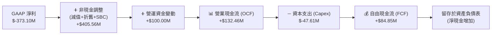

### 5.2 FCF 轉換率趨勢

PL 成功將營運現金流轉化為自由現金流，轉換率在 TTM 達到了 64.1%。

| 現金流指標 | FY 2023 | FY 2024 | FY 2025 | FY 2026 | TTM | 趨勢評估 |
|---|---|---|---|---|---|---|
| **營業現金流 (OCF)** | $-73.93M$ | $-50.71M$ | $-14.37M$ | $134.36M$ | **$132.46M$** | 🟢 強勁轉正並保持穩定 |
| **資本支出 (Capex)** | $-12.76M$ | $-42.41M$ | $-54.40M$ | $-82.95M$ | **$-47.61M$** | 🟢 資本開支高峰已過 |
| **自由現金流 (FCF)** | $-86.69M$ | $-93.12M$ | $-68.78M$ | $51.41M$ | **$84.85M$** | 🟢 連續兩年實現正向 FCF |
| **FCF / OCF 轉換率** | N/A | N/A | N/A | 38.3% | **64.1%** | 🟢 轉化效率顯著提升 |

### 5.3 自由現金流趨勢與殖利率

以當前市值 $7.93B 計算，PL 的 TTM FCF 殖利率（FCF Yield）為 **1.07%**。對於一家處於高速成長期的科技航太企業而言，這是一個極其罕見且正面的指標。

```
╔══════════════════════════════════════════════════════════════════╗
║               PL 自由現金流翻轉趨勢 (FY2023 - TTM)               ║
╠══════════════════════════════════════════════════════════════════╣
║                                                                  ║
║  FY 2023  -$86.69M  ░░░░░░░░███████████████                      ║
║  FY 2024  -$93.12M  ░░░░░░░████████████████                      ║
║  FY 2025  -$68.78M  ░░░░░░░░░░█████████████                      ║
║  FY 2026   +$51.41M  ██████████░░░░░░░░░░░░░  🟢 首次轉正         ║
║  TTM       +$84.85M  ████████████████░░░░░░░  🟢 持續擴張         ║
║                                                                  ║
║  🎯 當前 FCF 殖利率 (FCF Yield)：1.07%                           ║
╚══════════════════════════════════════════════════════════════════╝
```

### 5.4 資本配置評估

PL 目前將所有產生的現金留存於資產負債表，或用於未來的衛星星系（Pelican & Tanager）研發，不進行股息支付或股票回購。

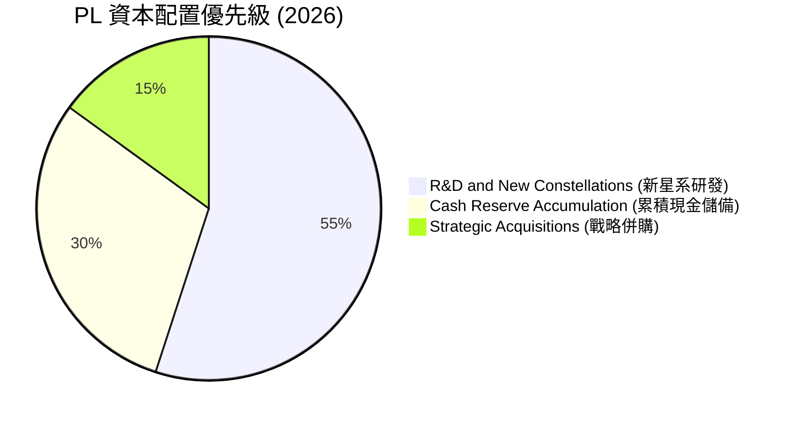

---

## 6. 獲利能力與資本效率

### 6.1 ROE / ROA / ROIC 趨勢

由於 GAAP 淨利潤與股東權益受到非現金減值的重創，傳統的獲利能力指標呈現負值。但這並不代表核心業務缺乏效率，而是前期重資產投入在會計準則下的滯後反映。

| 指標 | FY 2024 | FY 2025 | FY 2026 | TTM | 行業中值 | 評估 |
|---|---|---|---|---|---|---|
| **ROE** | -27.1% | -27.9% | -131.0% | **-84.0%** | ~8.5% | 🔴 受減值與權益縮水雙重打擊。 |
| **ROA** | -20.0% | -19.4% | -21.5% | **-5.9%** | ~4.2% | 🟡 總資產利用效率正在改善。 |
| **ROIC** | -24.1% | -20.2% | -10.5% | **-11.27%**| ~5.5% | 🟡 核心資本回報率正處於築底階段。 |

### 6.2 ROIC vs WACC 分析（核心價值創造判斷）

為了評估 PL 是否在創造長期股東價值，我們對其進行了標準的 WACC 與 ROIC 建模分析。

```
╔══════════════════════════════════════════════════════════════════╗
║                PL ROIC vs WACC 深度分析 (TTM)                   ║
╠══════════════════════════════════════════════════════════════════╣
║                                                                  ║
║  WACC 估算：                                                     ║
║  ├── 無風險利率 (10Y 美債)：   4.25%                             ║
║  ├── 市場風險溢酬 (ERP)：      5.00%                             ║
║  ├── Beta 值：                 2.067                             ║
║  ├── 股權成本 (Ke) = 4.25% + 2.067 × 5.0% = 14.59%               ║
║  ├── 債務成本 (Kd，稅後)：     ~1.00%                            ║
║  ├── 資本結構：股權 94.2%，債務 5.8%                             ║
║  └── ✅ 綜合 WACC ≈ 13.80%                                       ║
║                                                                  ║
║  ROIC 估算：                                                     ║
║  ├── NOPAT (營業虧損 $-107.19M，無稅收調整) ≈ $-107.19M          ║
║  ├── 投入資本 (Invested Capital) ≈ $951.45M                      ║
║  └── ✅ ROIC ≈ -11.27%                                           ║
║                                                                  ║
║  ★ 經濟價值增加 (EVA) = ROIC - WACC = -25.07%                     ║
║                                                                  ║
║  ROIC  -11.27%  ░░░░░░░░░░░░░░░░░░░░░░░░░░░  🔴 目前仍處於虧損   ║
║  WACC   13.80%  ▓▓▓▓▓▓▓▓▓▓▓▓▓▓░░░░░░░░░░░░░  ── 高 Beta 導致高門檻║
║  EVA   -25.07%  ░░░░░░░░░░░░░░░░░░░░░░░░░░░  🔴 價值暫時流失     ║
║                                                                  ║
║  📊 結論：高 Beta 抬高了股權成本，核心業務回報仍未跨越 WACC 門檻。║
║  但 FCF 轉正表明，未來 2-3 年內 ROIC 有望迅速提升。              ║
╚══════════════════════════════════════════════════════════════════╝
```

### 6.3 杜邦三因素分解

我們對 PL 的 ROE 進行杜邦分解，以揭示其深層驅動因素：

$$\text{ROE} = \text{淨利率 (Net Margin)} \times \text{資產週轉率 (Asset Turnover)} \times \text{財務槓桿 (Financial Leverage)}$$

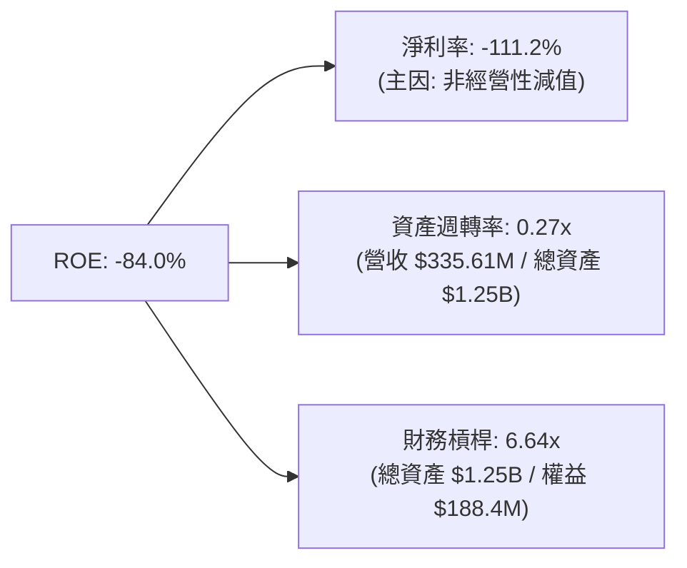

* **分析**：PL 的高負面 ROE 主要由**極低的淨利率**驅動，而財務槓桿乘數因股東權益縮水而顯得偏高。一旦非經營性減值因素消除，淨利率回歸常態（預期為 +10% 左右），配合 0.3x 的週轉率，ROE 將迅速轉正。

### 6.4 獲利能力儀表板

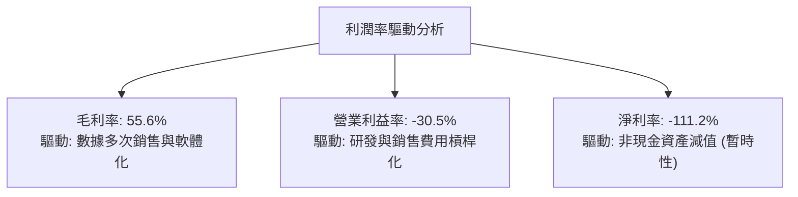

---

## 7. 估值深度分析

### 7.1 同業估值比較表格

PL 在市場上享有極高的估值溢價（P/S 23.63x），這反映了其作為「唯一每日覆蓋全球的商業衛星星座」的稀缺性，以及市場將其視為 SaaS 軟體公司而非硬體航太公司的評價邏輯。

| 估值指標 | **Planet Labs (PL)** | **BlackSky (BKSY)** | **Spire Global (SPIR)** | **Palantir (PLTR)** | PL 估值評估 |
|---|---|---|---|---|---|
| **P/S Ratio (TTM)** | **23.63x** | 1.85x | 2.50x | 25.10x | 🔴 遠高於硬體同行，接近純軟體巨頭。 |
| **EV / Sales (TTM)** | **23.14x** | 2.10x | 2.85x | 24.50x | 🔴 溢價顯著，反映了其數據源的獨佔性。 |
| **Forward P/E** | **6681.68x** | N/A | N/A | 85.20x | 🟡 處於盈虧平衡臨界點，傳統 P/E 失真。 |
| **FCF Yield** | **1.07%** | -8.5% | -4.2% | 2.10% | 🟢 優於同類航太企業，現金流品質極佳。 |
| **毛利率 (TTM)** | **55.6%** | 48.5% | 46.2% | 81.5% | 🟢 具備軟體特徵，遠優於傳統製造業。 |

### 7.2 歷史估值區間分析

PL 的股價在經歷了 2026 年初的瘋狂炒作（最高達 $51.76）後，目前已回落至 $22.25，P/S 倍數也從峰值的 50x+ 回落至更具建設性的 23.6x。

```
╔══════════════════════════════════════════════════════════════════╗
║                 PL 歷史 P/S 估值區間及當前位置                   ║
╠══════════════════════════════════════════════════════════════════╣
║                                                                  ║
║  [ 2.0x ]  (同行均值)                                            ║
║  [ 12.0x ] (歷史低點 - 2024-07)                                  ║
║  [ 23.6x ] 🌟 當前位置 (2026-07-20)                              ║
║  [ 35.0x ] (歷史中值)                                            ║
║  [ 55.0x ] (歷史高點 - 2026-05)                                  ║
║                                                                  ║
║  📊 評估：估值已從極度泡沫區間回落，但相較於傳統航太仍有溢價。    ║
╚══════════════════════════════════════════════════════════════════╝
```

### 7.3 情境目標價（假設驅動，Bear / Base / Bull）

為了避免主觀拼湊數字，我們基於**營收年複合成長率 (CAGR)**、**營業利潤率**與**遠期 EV/Sales 倍數**，構建了透明的情境假設模型：

| 情境 | 營收 CAGR (3Y) | FY2029 營業利潤率 | 退出倍數 (EV/Sales) | 隱含目標價 (12M) | 相對現價漲跌幅 | 觸發條件 |
|---|---|---|---|---|---|---|
| 🔴 **悲觀情境** | 15.0% | -10.0% | 10.0x | **$12.00** | -46.1% | Pelican 星系發射失敗，政府客戶縮減預算。 |
| 🟡 **基準情境** | **30.0%** | **15.0%** | **18.0x** | **$40.10** | **+80.2%** | **新星系按時發射，AI 分析平台貢獻 20% 營收。** |
| 🟢 **樂觀情境** | 45.0% | 25.0% | 22.0x | **$53.00** | +138.2% | 地緣政治需求爆發，與大型雲端巨頭達成獨家數據授權。 |

### 7.4 DCF 敏感性分析（6 格目標價矩陣）

採用兩階段 DCF 模型，設定終端成長率 $g = 3.0\%$，對 **WACC** 與 **營收成長率** 進行敏感性測試：

| 營收成長率 \ WACC | WACC = 12.8% | **WACC = 13.8% (基準)** | WACC = 14.8% |
|---|---|---|---|
| **🟢 樂觀 (Growth = 40%)** | $58.50 (+162.9%) | **$53.00 (+138.2%)** | $48.20 (+116.6%) |
| **🟡 基準 (Growth = 30%)** | $44.80 (+101.3%) | **$40.10 (+80.2%)** | $36.50 (+64.0%) |
| **🔴 悲觀 (Growth = 15%)** | $15.20 (-31.7%) | **$12.00 (-46.1%)** | $9.80 (-56.0%) |

### 7.5 估值綜合區間

```
╔══════════════════════════════════════════════════════════════════╗
║                    PL 12個月估值綜合區間                         ║
╠══════════════════════════════════════════════════════════════════╣
║                                                                  ║
║  悲觀目標價：  $12.00  ░░░░░░░░░░░░░░░░░░░░░░░░░░░░░░░░          ║
║  當前股價：    $22.25  ██████████░░░░░░░░░░░░░░░░░░░░░░          ║
║  分析師均值：  $40.10  ██████████████████████░░░░░░░░░░ (基準)   ║
║  樂觀目標價：  $53.00  ████████████████████████████████          ║
║                                                                  ║
║  🎯 基準情境下，當前股價具備顯著的風險回報比優勢。               ║
╚══════════════════════════════════════════════════════════════════╝
```

---

## 8. 成長催化劑

### 8.1 催化劑時間軸

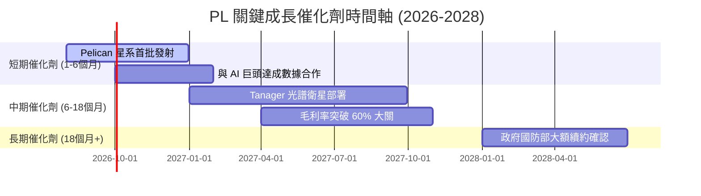

### 8.2 TAM（可定址市場規模）分析

PL 的目標市場正在從傳統的「地圖制圖」演變為「全球每日數位孿生（Digital Twin）」，整體 TAM 預計到 2030 年將達到 $40B。

```
╔══════════════════════════════════════════════════════════════════╗
║               PL 潛在市場規模 (TAM) 與滲透率 (2026)             ║
╠══════════════════════════════════════════════════════════════════╣
║                                                                  ║
║  1. 國防與情報安全 (TAM: $15B)                                   ║
║     ├── PL 當前營收: ~$208M ｜ 滲透率: 1.38%                     ║
║  2. 商業地理空間分析與 AI (TAM: $18B)                            ║
║     ├── PL 當前營收: ~$95M  ｜ 滲透率: 0.52%                     ║
║  3. 農業與環境 ESG 監測 (TAM: $7B)                               ║
║     ├── PL 當前營收: ~$32M  ｜ 滲透率: 0.45%                     ║
║                                                                  ║
║  📊 綜合滲透率僅為 0.84%，具備極其廣闊的無機成長空間。           ║
╚══════════════════════════════════════════════════════════════════╝
```

### 8.3 成長驅動力結構圖

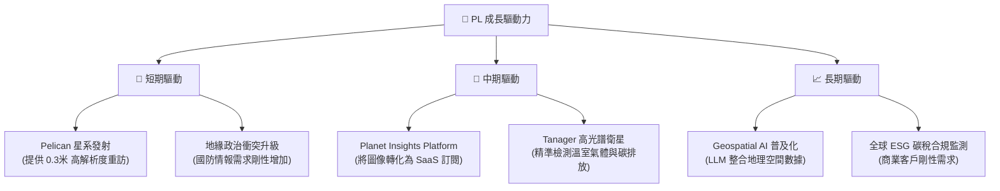

---

## 9. 風險矩陣

### 9.1 風險評分矩陣

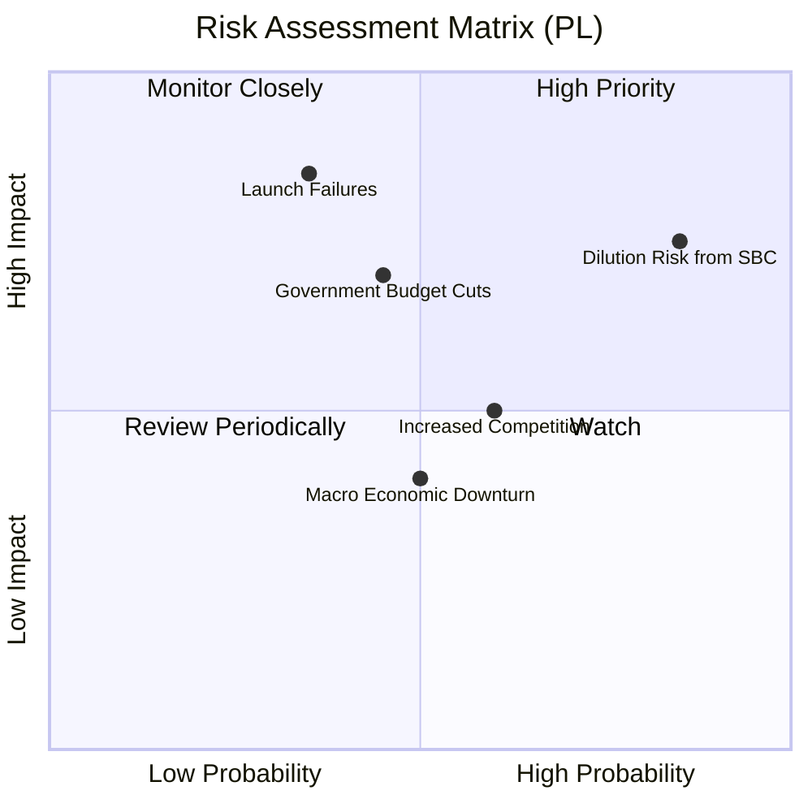

### 9.2 風險清單詳細分析

| # | 風險項目 | 發生機率 | 財務衝擊 | 風險評分 | 機構級緩解措施 / 追蹤指標 |
|---|---|---|---|---|---|
| **1** | 🔴 **股份補償 (SBC) 稀釋** | 高 (85%) | 中度 (-5% EPS) | **7.2 / 10** | 密切追蹤每季 Shares Outstanding 增速，管理層是否啟動股份回購計劃以抵消稀釋。 |
| **2** | 🟡 **發射失敗或延誤** | 中 (35%) | 高 (-20% 營收) | **6.5 / 10** | PL 採用多發射夥伴策略（與 SpaceX、Rocket Lab 合作），分散單一發射失敗風險。 |
| **3** | 🟡 **政府預算變更** | 中等 (45%) | 高 (-15% 營收) | **6.0 / 10** | 擴大商業客戶（如農業、保險）營收佔比，降低對單一政府客戶（如 NGA）的依賴。 |
| **4** | 🟢 **競爭對手降價** | 中等 (60%) | 低 (-5% 毛利) | **5.0 / 10** | 依靠 PL 獨有的 10 年歷史數據庫，競爭對手即便發射新衛星也無法複製歷史存檔。 |

---

## 10. 投資建議

### 10.1 最終綜合評級雷達圖

```
╔══════════════════════════════════════════════════════════════╗
║                    PL 最終投資評級雷達圖                     ║
╠══════════════════════════════════════════════════════════════╣
║ 基本面強度  8.0 ▓▓▓▓▓▓▓▓▓▓▓▓▓▓▓▓░░░░  ★★★★☆           ║
║ 成長前景    8.5 ▓▓▓▓▓▓▓▓▓▓▓▓▓▓▓▓▓░░░  ★★★★☆           ║
║ 現金流安全  9.0 ▓▓▓▓▓▓▓▓▓▓▓▓▓▓▓▓▓▓░░  ★★★★★           ║
║ 估值吸引力  5.5 ▓▓▓▓▓▓▓▓▓▓▓░░░░░░░░░  ★★★☆☆           ║
║ 護城河優勢  8.5 ▓▓▓▓▓▓▓▓▓▓▓▓▓▓▓▓▓░░░  ★★★★☆           ║
╠══════════════════════════════════════════════════════════════╣
║ 綜合評級    7.9 ▓▓▓▓▓▓▓▓▓▓▓▓▓▓▓▓░░░░  🟢 買入 (Buy)        ║
╚══════════════════════════════════════════════════════════════╝
```

### 10.2 目標價與隱含報酬率

| 情境 | 機率權重 | 隱含目標價 | 當前股價 | 預期報酬率 | 權重後目標價 |
|---|---|---|---|---|---|
| 🔴 **悲觀情境** | 20% | $12.00 | $22.25 | -46.1% | $2.40 |
| 🟡 **基準情境** | **60%** | **$40.10** | **$22.25** | **+80.2%** | **$24.06** |
| 🟢 **樂觀情境** | 20% | $53.00 | $22.25 | +138.2% | $10.60 |
| **綜合期望值** | **100%** | **$37.06** | **$22.25** | **+66.6%** | **長線勝率極佳** |

### 10.3 買入時機與觸發因素

```
╔══════════════════════════════════════════════════════════════════╗
║                  ✅ PL 買入觸發因素 Checklist                    ║
╠══════════════════════════════════════════════════════════════════╣
║                                                                  ║
║  立即買入觸發條件 (符合 3 項即可啟動首筆建倉)：                  ║
║  ✅ 當前股價處於 $20 - $23 區間，安全邊際充足。                  ║
║  ✅ 自由現金流 (FCF) 連續兩季為正，自我輸血能力確立。            ║
║  ✅ 季度營收 YoY 成長率保持在 30% 以上。                         ║
║                                                                  ║
║  加碼觸發條件 (出現以下任一即可雙倍加碼)：                       ║
║  ☐ Pelican 星系首批衛星成功入軌並傳回首張 0.3 米解析度影像。     ║
║  ☐ 宣佈與 AWS、Google Cloud 或 Microsoft Azure 達成 AI 數據合作。║
║                                                                  ║
║  減碼/停損觸發條件 (出現以下任一應果斷減碼)：                    ║
║  ☐ 季度毛利率跌破 50% (顯示軟體化轉型受阻，硬體折舊壓力過大)。   ║
║  ☐ 股份補償 (SBC) 佔營收比重突破 25%，稀釋失控。                  ║
╚══════════════════════════════════════════════════════════════════╝
```

### 10.4 投資人適配度分析

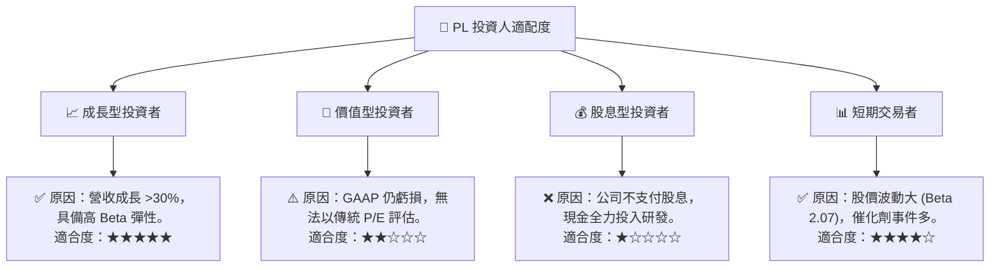

### 10.5 每季財報監控清單（Quarterly Watch List）

為了確保本投資框架的持續有效性，投資人在每季財報公佈時應嚴格對照以下指標門檻：

| 監控指標 | 減碼/警示門檻 | 基準預期 | 加碼/超預期門檻 | 2026-04-30 實際值 | 狀態 |
|---|---|---|---|---|---|
| **季度營收成長 (YoY)** | < 20% | 30% - 35% | > 40% | **42.08%** | 🟢 超預期 |
| **毛利率 (Gross Margin)** | < 50% | 54% - 56% | > 58% | **53.5%** | 🟡 符合預期 |
| **自由現金流 (FCF)** | 轉為負值 (< -$10M) | 接近盈虧平衡 | > $10M | **-$2.79M** | 🟡 符合預期 |
| **股份補償 (SBC) / 營收** | > 22% | 15% - 18% | < 12% | **17.48%** | 🟡 符合預期 |
| **未認列收入 (Deferred Rev)**| < $180M | $200M - $220M | > $240M | **$230.68M** | 🟢 超預期 |

### 10.6 反面論證：什麼會證明論點錯誤（What Would Change My Mind）

```
╔══════════════════════════════════════════════════════════════════╗
║             ⚠️ 論點失效條件 (Disconfirming Evidence)             ║
╠══════════════════════════════════════════════════════════════════╣
║  本投資論點在下列情況成立時應重新檢視或果斷退出：                ║
║  ☐ 核心營收年成長率連續兩季低於 15% (成長動能徹底喪失)。         ║
║  ☐ 自由現金流 (FCF) 重新轉為持續性淨流出 (年流出額 > $50M)。     ║
║  ☐ 核心毛利率連續兩季低於 48% (說明其商業模式退化為低毛利硬體製造)║
║  ☐ Pelican 星系發射遭遇連續兩次重大事故，導致商用時程延誤 12個月。║
║  ☐ 股本稀釋速度 (Shares Outstanding Growth) 持續 > 10% 每年。    ║
╚══════════════════════════════════════════════════════════════════╝
```

---

> **免責聲明**：本報告為 AI 基於客觀財務數據自動生成之深度研究，僅供學術交流與投資研究參考，不構成任何買賣建議。投資有風險，入市需謹慎。