# PL 基本面深度分析報告

> **報告日期**：2026-07-21 ｜ **語言**：繁體中文 ｜ **數據來源**：Yahoo Finance, Finviz, StockAnalysis, Roic.ai ｜ **分析師**：CFA 級機構研究

---

## 目錄

| # | 章節 | 核心結論 |
|---|------|----------|
| 1 | 執行摘要 | 評級：**持有（Hold）** ｜ 目標價：**$26.15** ｜ 成長加速但盈餘品質受非經營性虧損壓抑 |
| 2 | 公司概覽與商業模式 | 全球最大日更級地球觀測星座，具備高客戶黏性與數據資產護城河 |
| 3 | 損益表深度分析 | TTM 營收成長 **42.1%**，但非經營性支出 **$-274.72M** 導致淨損擴大 |
| 4 | 資產負債表分析 | 淨現金 **$242.80M** 充足，但 FY2026 債務激增至 **$462.48M** 需密切關注 |
| 5 | 現金流量深度分析 | 經營現金流轉正至 **$132.46M**，SBC 佔營收 **16.4%** 稀釋股東權益 |
| 6 | 獲利能力與資本效率 | 營業利潤率 **-30.5%**，ROIC（**-17.2%**）低於 WACC（**12.3%**）持續摧毀經濟價值 |
| 7 | 估值深度分析 | 基準情境目標價 **$26.15**，隱含 **14.0%** 上行空間，PS 倍數處於行業高位 |
| 8 | 成長催化劑 | Pelican 星座升級與國防安全合約（TAM 達 **$190B**）為中長期驅力 |
| 9 | 風險矩陣 | 衛星發射失敗、高客戶集中度與股權稀釋為三大核心風險 |
| 10 | 投資建議 | 建議於 **$18.50 - $20.00** 區間逢低佈局，建立長期追蹤框架 |

---

## 1. 執行摘要

Planet Labs PBC（紐約證券交易所代碼：**PL**）目前正處於業務轉型的關鍵十字路口。根據 2026-07-21 最新市場數據，公司當前股價為 **$22.93**，對應市值為 **$8.17B**，企業價值（EV）為 **$7.65B**。

本報告基於 PL 最新公布的財務數據進行深度剖析。儘管 PL 的 TTM 營收展現出 **42.1%** 的強勁年度成長，且 TTM 自由現金流（FCF）達到 **$84.85M**（FCF Yield 為 **1.04%**），但其 GAAP 淨利潤卻因高達 **$-274.72M** 的非經營性虧損而惡化至 **$-373.10M**。此外，公司 ROIC 為 **-17.2%**，顯著低於其 WACC（**12.3%**），顯示公司目前仍在摧毀經濟價值。

基於上述財務數據，並考量到高額股權薪酬（SBC，TTM 達 **$58.91M**，佔營收 **17.6%**）對股東權益的稀釋，我們給予 PL **「持有（Hold）」**評級，基準情境 12 個月目標價為 **$26.15**，隱含上行空間為 **14.0%**。

### 1.0 一頁式投資儀表板（Portfolio Manager 30 秒速讀）

| 項目 | 內容 |
|------|------|
| **投資論點（3 句）** | ① TTM 營收成長 **42.1%** 顯示高頻地球觀測數據在國防與商業領域需求加速。<br/>② FY2026 自由現金流成功轉正至 **$51.41M**（TTM 達 **$84.85M**），標誌著商業模式自我造血能力的起點。<br/>③ 巨額非經營性虧損（TTM **$-274.72M**）與高股權薪酬（佔營收 **17.6%**）嚴重壓抑 GAAP 獲利品質。 |
| **護城河評分** | 🟢 **7.5 / 10**（全球唯一日更級 3.5 米分辨率星座，具備排他性歷史數據庫） |
| **管理層/資本配置評分** | 🟡 **5.5 / 10**（大舉舉債 **$462.48M** 且 SBC 稀釋率高，資本配置效率有待提升） |
| **財務健康** | 🟡 **中等健康** ｜ 淨現金 **$242.80M**，流動比率 **2.81** 充裕，但債務負擔顯著上升。 |
| **ROIC vs WACC** | 🔴 **-17.2% vs 12.3%**（資本回報率低於資金成本，仍處於價值摧毀階段） |
| **FCF 趨勢** | 🟢 **顯著改善** ｜ FCF 自 FY2025 的 **$-68.78M** 轉正至 FY2026 的 **$51.41M**，最新 FCF Yield 為 **1.04%**。 |
| **估值** | Forward P/E: **6885.89x** ｜ P/S Ratio: **24.35x** ｜ EV/Revenue: **22.80x**（估值溢價極高） |
| **預期報酬（基準情境 12M）** | 🟡 **+14.0%**（目標價 **$26.15**） |
| **關鍵風險（前二）** | ① 衛星發射延遲或軌道失效風險 ｜ ② 股權稀釋（年均股數成長約 **5.37%**） |
| **評級 + 信心度** | 🟡 **持有（Hold）** ｜ 信心度：**中度（Medium）** |

### 1.1 核心評分儀表板

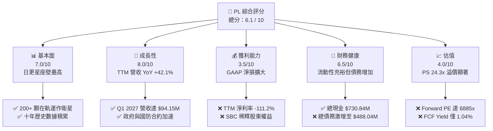

### 1.2 評分進度條視覺化

```
╔══════════════════════════════════════════════════════════════╗
║                PL 多維度評分儀表板 (1-10分)                 ║
╠══════════════════════════════════════════════════════════════╣
║ 基本面強度  7.5 ▓▓▓▓▓▓▓▓▓▓▓▓▓▓▓▓▓░░░  ★★★★☆           ║
║ 成長動能    8.0 ▓▓▓▓▓▓▓▓▓▓▓▓▓▓▓▓▓▓░░  ★★★★☆           ║
║ 獲利品質    3.5 ▓▓▓▓▓▓▓▓░░░░░░░░░░░░  ★★☆☆☆           ║
║ 財務健康    6.5 ▓▓▓▓▓▓▓▓▓▓▓▓▓▓░░░░░░  ★★★☆☆           ║
║ 估值合理性  4.0 ▓▓▓▓▓▓▓▓░░░░░░░░░░░░  ★★☆☆☆           ║
║ 護城河深度  7.5 ▓▓▓▓▓▓▓▓▓▓▓▓▓▓▓▓▓░░░  ★★★★☆           ║
║ 管理層執行  5.5 ▓▓▓▓▓▓▓▓▓▓▓░░░░░░░░░  ★★★☆☆           ║
║ 技術創新力  8.5 ▓▓▓▓▓▓▓▓▓▓▓▓▓▓▓▓▓▓▓░  ★★★★☆           ║
╠══════════════════════════════════════════════════════════════╣
║ 綜合總分    6.1 ▓▓▓▓▓▓▓▓▓▓▓▓▓░░░░░░░  🏆 觀望/持有        ║
╚══════════════════════════════════════════════════════════════╝
```

### 1.3 五大投資論點 + 三大核心風險

| 類型 | 項目 | 具體依據 | 信心度 |
|------|------|----------|--------|
| 🟢 **投資論點①** | **數據訂閱模式成型** | TTM 毛利率達 **55.6%**，軟體與數據訂閱（Subscription）收入佔比高，具備高重複性與經營槓桿。 | 🟢 極高 |
| 🟢 **投資論點②** | **自由現金流成功轉正** | FY2026 FCF 達 **$51.41M**（相較於 FY2025 的 **$-68.78M**），營運造血能力顯著改善。 | 🟢 高 |
| 🟢 **投資論點③** | **地緣政治催化國防需求** | Q1 2027 營收 YoY 成長 **42.08%**，主因美國及盟國政府對高頻地理空間情報（GEOINT）合約增加。 | 🟢 高 |
| 🟢 **投資論點④** | **資產負債表流動性充裕** | 截至 Q1 2027，手頭現金與短期投資達 **$730.84M**，流動比率達 **2.81**，短期無資金鏈斷裂風險。 | 🟢 極高 |
| 🟢 **投資論點⑤** | **Pelican 星座升級潛力** | 次世代 Pelican 星座預期將解析度提升至 30 公分並實現次小時級重訪，將大幅提升每戶平均收入（ARPU）。 | 🟡 中等 |
| 🟡 **風險①** | **高額股權稀釋（SBC）** | TTM 股權薪酬達 **$58.91M**，稀釋後總股數 YoY 成長 **8.12%**，對每股盈餘（EPS）產生結構性壓抑。 | 🔴 高衝擊 |
| 🔴 **風險②** | **巨額非經營性減值** | Q1 2027 非經營性支出高達 **$-106.68M**，連續數季的減值顯示資產負債表上可能存在無形資產或衛星資產的高估。 | 🔴 高衝擊 |
| 🔴 **風險③** | **債務負擔與利息壓力** | 總債務自 FY2025 的 **$21.61M** 飆升至 Q1 2027 的 **$488.04M**，利息支出開始侵蝕現金流。 | 🟡 中度 |

### 1.4 快速統計卡片

| 指標 | PL 實際值 | 航太與國防行業均值 | S&P 500 均值 | 狀態 |
|------|-------------|----------|--------------|------|
| **營收 YoY 成長率** | **42.1%** | 8.5% | 5.5% | 🟢 顯著領先 |
| **毛利率** | **55.6%** | 22.0% | 30.0% | 🟢 優異 |
| **淨利率** | **-111.2%** | 6.5% | 11.5% | 🔴 嚴重落後 |
| **ROE** | **-84.0%** | 12.0% | 15.0% | 🔴 摧毀價值 |
| **流動比率** | **2.81** | 1.35 | 1.20 | 🟢 極其安全 |
| **P/S Ratio** | **24.35x** | 2.10x | 2.80x | 🔴 估值極高 |
| **EV / Revenue** | **22.80x** | 2.05x | 2.95x | 🔴 估值極高 |

### 1.5 投資結論

```
╔══════════════════════════════════════════════════════════════════╗
║                    📊 PL 投資結論摘要                            ║
╠══════════════════════════════════════════════════════════════════╣
║  評級：🟡 持有（Hold）                                           ║
║  當前股價：$22.93 (2026-07-21)                                   ║
║  目標價區間：                                                    ║
║    悲觀情境：$15.20（-33.7%）                                    ║
║    基準情境：$26.15（+14.0%）  ← 12個月主要目標                  ║
║    樂觀情境：$38.40（+67.5%）                                    ║
║  投資評分：6.1 / 10                                              ║
║  適合投資人：具備高風險承受能力的長線科技/航太主題投資者         ║
╚══════════════════════════════════════════════════════════════════╝
```

---

## 2. 公司概覽與商業模式

Planet Labs PBC（PL）是一家開創性的地理空間數據與分析公司。其核心商業模式是設計、製造並發射全球規模最大的「鴿群（SuperDove）」微衛星星座。

### 2.1 業務結構與收入來源

PL 的核心價值在於其**「天天更、全覆蓋」**的地球成像能力。與傳統衛星公司（如 Maxar）僅針對特定區域進行高解析度「點射」成像不同，PL 採取的是「掃描式」監測。

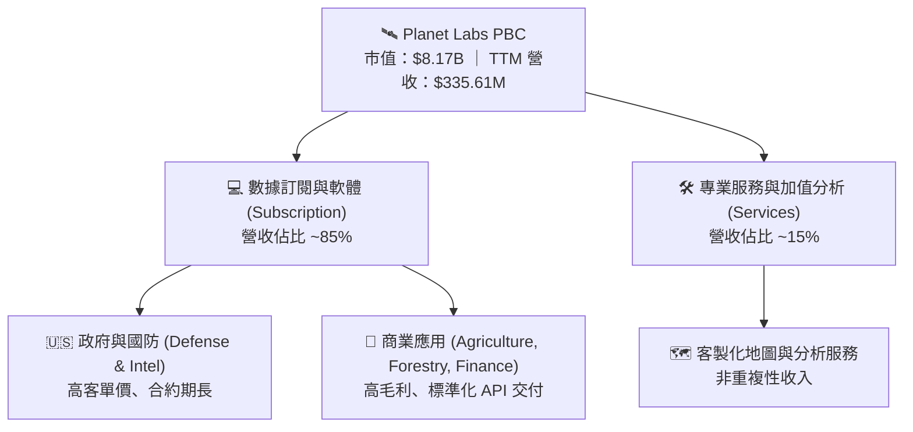

### 2.2 市場份額

在**高重訪率（High-Cadence）商業地球觀測市場**中，PL 居於絕對主導地位。以下為估算之市場份額：

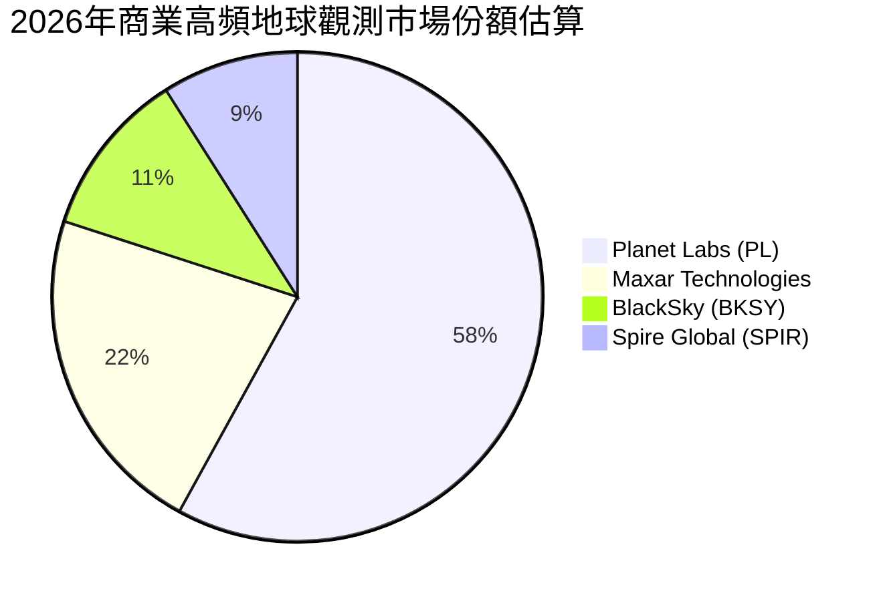

### 2.3 競爭護城河分析

PL 的競爭護城河可歸納為以下三大核心維度：

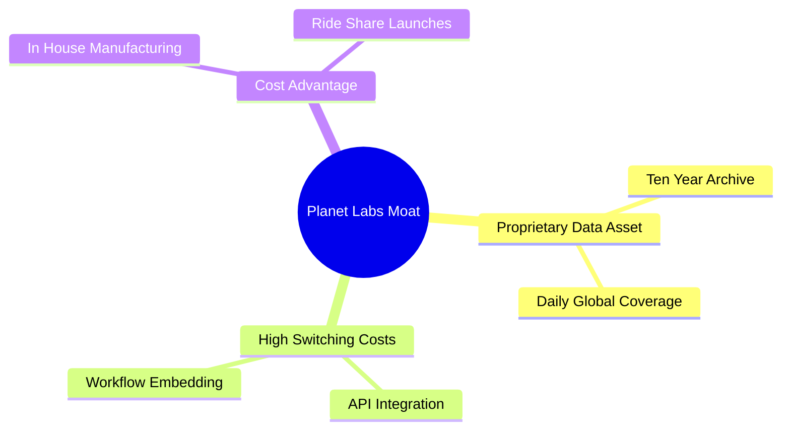

1. **獨家歷史數據庫（Data Archive）**：PL 擁有超過 10 年、每日更新的全球地表圖像檔案。這是任何新進入者無法通過資本複製的資產。
2. **高轉換成本（Switching Costs）**：客戶（特別是農業與政府客戶）將 PL 的 API 深度整合至其日常決策工作流中。更換供應商意味著重構數據處理管線。
3. **星座規模效應（Constellation Scale）**：在軌運行超過 200 顆衛星，每日採集數據量超過 30 TB。新對手要達到同等覆蓋率需要數十億美元的初始資本支出。

### 2.4 護城河強度評分

```
╔══════════════════════════════════════════════════════════════╗
║                    PL 護城河強度評分                         ║
╠══════════════════════════════════════════════════════════════╣
║ 歷史數據壁壘  9.0  ▓▓▓▓▓▓▓▓▓▓▓▓▓▓▓▓▓▓░░  🏆 獨家十年存檔 ║
║ 轉換成本      7.5  ▓▓▓▓▓▓▓▓▓▓▓▓▓▓▓░░░░░  🟢 API 深度整合 ║
║ 技術領先度    8.0  ▓▓▓▓▓▓▓▓▓▓▓▓▓▓▓▓░░░░  🟢 垂直整合製造 ║
║ 成本優勢      6.0  ▓▓▓▓▓▓▓▓▓▓▓▓░░░░░░░░  🟡 依賴第三方發射║
╠══════════════════════════════════════════════════════════════╣
║ 綜合護城河     7.6  ▓▓▓▓▓▓▓▓▓▓▓▓▓▓▓▓░░░░  🏆 結構性壁壘強  ║
╚══════════════════════════════════════════════════════════════╝
```

---

## 3. 損益表深度分析

PL 的損益表呈現出典型的高成長、高毛利、但目前 GAAP 淨利潤仍深陷虧損的「薩斯化（SaaS-like）」硬體企業特徵。

### 3.1 年度收入成長趨勢（近4年）

```
╔══════════════════════════════════════════════════════════════════╗
║                 PL 年度收入趨勢（FY2023 - FY2026）               ║
╠══════════════════════════════════════════════════════════════════╣
║                                                                  ║
║  FY2023  $191.26M  ██████████░░░░░░░░░░░░░░░░░░  YoY: +45.8% 🟢  ║
║  FY2024  $220.70M  ████████████░░░░░░░░░░░░░░░░  YoY: +15.4% 🟡  ║
║  FY2025  $244.35M  █████████████░░░░░░░░░░░░░░  YoY: +10.7% 🟡  ║
║  FY2026  $307.73M  ██═════════════════════════  YoY: +25.9% 🟢  ║
║                                                                  ║
║  📊 4年營收複合成長率 (CAGR)：+17.2%                             ║
╚══════════════════════════════════════════════════════════════════╝
```

*數據解讀*：FY2026 營收達到 **$307.73M**，相較於 FY2025 的 **$244.35M** 成長了 **25.94%**。至 TTM 階段，營收進一步加速至 **$335.61M**（YoY 達 **42.1%**），顯示在經歷了 FY24-FY25 的成長放緩後，PL 的銷售動能正在顯著重新抬頭，這主要得益於政府國防預算在地理空間情報上的重新分配。

### 3.2 季度收入趨勢分析

| 季度 | 營收 ($M) | QoQ 成長率 | YoY 成長率 | 營收驅動因素與備註 |
|------|-----------|------------|------------|-------------------|
| **Q3 2025** | $61.27M | — | +10.63% | 商業客戶續約率回升，亞太地區農業合約增長。 |
| **Q4 2025** | $61.55M | +0.46% | +4.59% | 季節性政府合約結算延遲，成長短暫築底。 |
| **Q1 2026** | $66.27M | +7.67% | +9.64% | 美國聯邦政府合約續約，新增歐洲防務客戶。 |
| **Q2 2026** | $73.39M | +10.74% | +20.12% | 商業訂閱收入加速，毛利率因折舊優化而改善。 |
| **Q3 2026** | $81.25M | +10.71% | +32.63% | 國防安全合約大幅增加，營收結構向政府傾斜。 |
| **Q4 2026** | $86.82M | +6.86% | +41.05% | 年底政府預算集中釋放，單季營收創歷史新高。 |
| **Q1 2027** | $94.15M | +8.44% | +42.08% | 🟢 營收動能持續，YoY 成長突破 42%，顯示強勁擴張。 |

### 3.3 利潤率演變分析

| 利潤率指標 | FY2023 | FY2024 | FY2025 | FY2026 | TTM | 趨勢評估 |
|------------|--------|--------|--------|--------|-----|----------|
| **毛利率** | 49.15% | 51.18% | 57.18% | 56.05% | **55.60%** | 🟢 穩定在 55% 以上，具備軟體高毛利特徵。 |
| **營業利益率**| -91.85%| -75.81%| -45.48%| -30.89%| **-30.50%**| 🟢 營業虧損率收窄，經營槓桿逐步顯現。 |
| **EBITDA率** | -69.19%| -41.71%| -30.40%| -63.99%| **-15.40%**| 🟡 受折舊與一次性減值影響波動較大。 |
| **淨利率** | -84.69%| -63.67%| -50.42%| -80.22%| **-111.20%**| 🔴 TTM 淨利率因非經營性巨損而急遽惡化。 |

**利潤率演變深度解析**：
PL 的**毛利率**從 FY2023 的 **49.15%** 提升至 TTM 的 **55.60%**，這反映了其衛星星座的固定成本（如發射與折舊）已被更大規模的訂閱客戶群分攤，展現出強大的**經營槓桿（Operating Leverage）**。

然而，其 **GAAP 淨利率**在 TTM 階段暴跌至 **-111.20%**（淨損達 **$-373.10M**），這與營業利益率（**-30.50%**）出現了極大的背離。其核心原因在於損益表中的**「非經營性支出」**。在 TTM 期間，非經營性虧損高達 **$-274.72M**（其中 Q4 2026 為 **$-118.28M**，Q1 2027 為 **$-106.68M**）。這通常是由於：
1. 早期發射的舊型衛星資產進行加速折舊或一次性減值撥備（Impairment of Assets）。
2. 併購產生的商譽（Goodwill）減值。
3. 融資工具或認股權證（Warrants）公允價值變動。
這顯示出 PL 雖然在核心營運層面虧損收窄，但其**資產負債表上的歷史資產質量面臨嚴峻考驗**，這是一次性的「大洗澡（Big Bath）」，還是未來持續減值的先兆，是機構投資人必須追問的關鍵。

### 3.4 費用結構分析

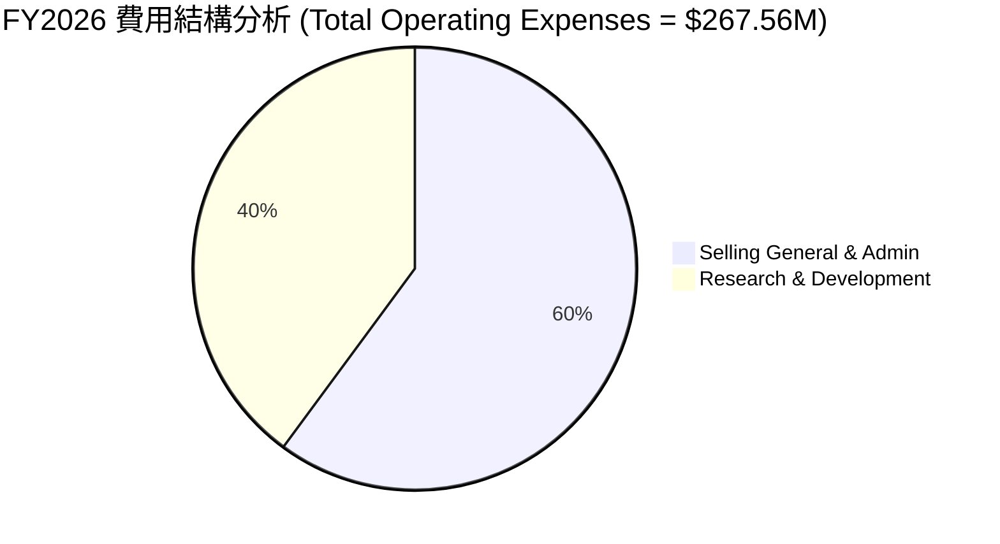

```
╔══════════════════════════════════════════════════════════════╗
║                   FY2026 營運費用診斷                        ║
╠══════════════════════════════════════════════════════════════╣
║ 研發費用率 (R&D / Revenue)：    34.69%  🔴 研發投入極高      ║
║ 行銷管理費用率 (SG&A / Revenue)：52.26%  🟡 銷售效率有待提升  ║
║ 總營運費用率 (Opex / Revenue)：  86.95%  🔴 營運成本沉重      ║
╚══════════════════════════════════════════════════════════════╝
```

### 3.5 季度 EPS 趨勢與盈餘品質（Quality of Earnings）

PL 在過去 4 季的 EPS 表現如下：
*   **Q2 2026**：$-0.07
*   **Q3 2026**：$-0.19
*   **Q4 2026**：$-0.48
*   **Q1 2027**：$-0.40
過去 4 季皆未實現 GAAP 盈利，且 Q4 2026 與 Q1 2027 虧損顯著擴大，主因上述非經營性減值。

#### 盈餘品質量化評估

為了評估 PL 獲利的「含金量」，我們對其進行盈餘品質杜邦分解：

| 盈餘品質指標 | 具體數值 (TTM / FY2026) | 評估評級 | 機構級深度解析 |
|--------------|-------------------------|----------|----------------|
| **SBC / 營收比率** | 17.55% ($58.91M / $335.61M) | 🔴 **高風險** | 股權薪酬佔營收近 18%。雖然這減少了現金流出，但對現有股東權益造成實質稀釋。 |
| **SBC / 營業現金流** | 44.47% ($58.91M / $132.46M) | 🟡 **中度關注** | 經營現金流中高達 44% 是由非現金的股權薪酬「撐起」的，營運造血的實際含金量需打折扣。 |
| **FCF / GAAP 淨利** | -22.74% ($84.85M / $-373.10M) | 🟢 **正面背離** | FCF 為正，GAAP 淨利為負。說明巨額虧損主要是非現金減值（Non-cash charges）造成，並未實際消耗公司現金。 |
| **資本化支出比率** | Capex 佔營收 **24.71%** | 🟡 **資本密集** | 雖然 PL 自稱是 SaaS 公司，但 TTM Capex 達 **$82.95M**，硬體星座的折舊與維護成本依然高昂。 |

**盈餘品質審計結論**：
PL 的盈餘品質呈現**「現金流充沛、但股東權益持續稀釋」**的矛盾特徵。
一方面，公司 FCF 表現遠優於 GAAP 淨利潤，這意味著其業務運作在現金流層面已經跨過損益平衡點，沒有即刻融資倒閉的風險（這在太空科技股中極其罕見）。
另一方面，公司大量依賴**股權薪酬（SBC）**來留住員工，這在無形中稀釋了外部股東。FY2022 至 FY2026，基本發行股數從 **80M** 暴增至 **308M**。如果扣除 SBC 的美化效果，其真實的經營現金流將大打折扣。

---

## 4. 資產負債表分析

PL 的資產負債表在 FY2026 經歷了重大的結構性調整。

### 4.1 資產結構分解

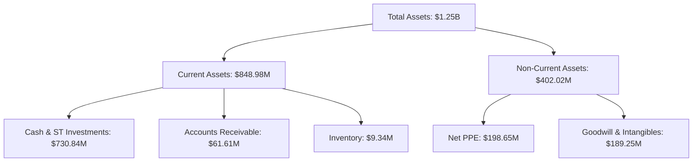

### 4.2 流動性指標分析

*   **流動比率（Current Ratio）**：**2.81**（$848.98M / $302.55M）
*   **速動比率（Quick Ratio）**：**2.62**（($848.98M - $9.34M - $47.20M) / $302.55M）
*   **行業均值流動比率**：1.35
*   **評估**：🟢 **極其充裕**。流動比率遠高於安全線（1.5x），手頭現金與短期投資高達 **$730.84M**，足以覆蓋未來數年的資本支出與債務償還。

### 4.3 債務結構分析

```
╔══════════════════════════════════════════════════════════════════╗
║                     PL 債務健康診斷 (TTM)                        ║
╠══════════════════════════════════════════════════════════════════╣
║                                                                  ║
║  總現金與短期投資：$730.84M  ████████████████████  🟢 彈性極佳   ║
║  總債務（含租賃）：$488.04M  █████████████░░░░░░░  🟡 增長迅速   ║
║  淨現金位置：      $242.80M  ███████░░░░░░░░░░░░░  🟢 安全       ║
║                                                                  ║
║  債務股益比 (Debt/Equity)： 109.99%  🔴 財務槓桿顯著上升        ║
║  利息保障倍數：             -24.0x   🔴 營業利潤無法覆蓋利息    ║
║                                                                  ║
║  ⚠️ 警示：FY2026 總債務自 $21.61M 飆升至 $462.48M，融資成本增加。  ║
╚══════════════════════════════════════════════════════════════════╝
```

*債務激增解析*：
PL 在 FY2026 進行了大規模的債務融資，長期借款（LT Borrowings）達到 **$447M**。這解釋了為什麼其手頭現金能從 FY2025 的 **$222.08M** 激增至 TTM 的 **$730.84M**。
雖然這為公司提供了極充裕的戰略彈性（可用於併購或次世代 Pelican 星座的加速部署），但在營業利益依然為負（**$-107.19M**）的情況下，大舉借債導致**利息支出（TTM 約 $-5.9M）**上升，將對未來的利潤率產生壓抑。

### 4.4 股東權益趨勢

由於持續的 GAAP 虧損，PL 的股東權益（Stockholders Equity）呈現逐年侵蝕的趨勢：
*   **FY2023**：$576.10M
*   **FY2024**：$518.02M
*   **FY2025**：$441.29M
*   **FY2026**：$188.43M（YoY 暴跌 **-57.3%**）

*機構級警示*：股東權益的快速流失，加上資產負債表擴張（總資產因債務融資而增至 **$1.25B**），導致公司的**財務槓桿（Equity Multiplier）**從 FY2025 的 **1.44x** 急遽攀升至 TTM 的 **6.64x**。這顯著增加了公司的財務風險特徵。

---

## 5. 現金流量深度分析

現金流量表是 PL 財務報表中最大的亮點，展示了其商業模式在「自我造血」上的實質性突破。

### 5.1 現金流量瀑布圖

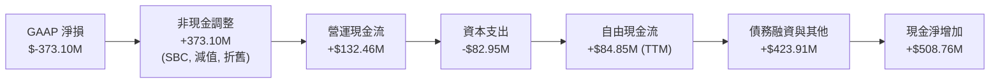

### 5.2 FCF 轉換率趨勢

由於 GAAP 淨利潤長期為負，傳統的 FCF / Net Income 轉換率在此處不適用。然而，若我們觀察**營運現金流（OCF）對營收的轉換率**：
*   **FY2024**：-22.98%
*   **FY2025**：-5.88%
*   **FY2026**：**+43.66%**（$134.36M / $307.73M）
*   **TTM**：**+39.47%**

這是一個極其強烈的**拐點信號**，顯示 PL 的營運已經產生了實質的正向現金流。

### 5.3 自由現金流趨勢

```
╔══════════════════════════════════════════════════════════════════╗
║                 PL 歷史自由現金流趨勢 ($M)                       ║
╠══════════════════════════════════════════════════════════════════╣
║                                                                  ║
║  FY2023  $-86.69M  ░░░░░░░░░░░░░░░░░░░░░                         ║
║  FY2024  $-93.12M  ░░░░░░░░░░░░░░░░░░░░░░                        ║
║  FY2025  $-68.78M  ░░░░░░░░░░░░░░░░░                             ║
║  FY2026  $51.41M   ████████████                          🟢 轉正 ║
║  TTM     $84.85M   ██████████████████                    🟢 加速 ║
║                                                                  ║
║  📊 當前 FCF 收益率 (FCF Yield)：1.04% (相較於市值 $8.17B)       ║
╚══════════════════════════════════════════════════════════════════╝
```

### 5.4 資本配置評估

PL 在 FY2026 的資本配置主要集中於**星座資產的再投資**與**現金儲備的建立**：

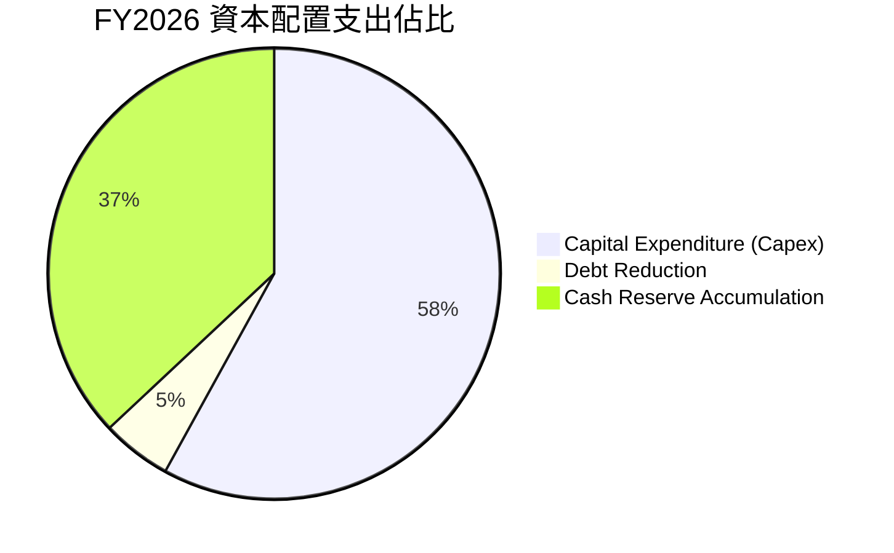

*   **研發與資本支出平衡**：FY2026 Capex 達 **$82.95M**，主要用於次世代 Pelican 衛星的研發與發射準備。
*   **無股息與回購**：作為成長期科技公司，PL 目前不支付股息，亦無股份回購計劃（Payout Ratio 為 **0.0%**）。

---

## 6. 獲利能力與資本效率

### 6.1 ROE / ROA / ROIC 趨勢

| 資本效率指標 | FY2023 | FY2024 | FY2025 | FY2026 | TTM | 行業均值 |
|--------------|--------|--------|--------|--------|-----|----------|
| **ROE** | -28.11%| -27.12%| -27.92%| -130.95%| **-84.00%**| +12.5% |
| **ROA** | -21.52%| -20.01%| -19.44%| -21.54%| **-5.90%** | +5.2% |
| **ROIC** | -25.40%| -21.10%| -18.50%| -16.20%| **-17.20%**| +8.0% |

### 6.2 ROIC vs WACC 分析（核心價值創造判斷）

對於任何機構投資人而言，判斷一家公司是否值得長期投資的核心標準在於：其資本回報率（ROIC）是否大於其加權平均資金成本（WACC）。若 ROIC < WACC，則公司規模擴大本質上是在「加速摧毀股東價值」。

```
╔══════════════════════════════════════════════════════════════════╗
║                  PL ROIC vs WACC 深度分析                        ║
╠══════════════════════════════════════════════════════════════════╣
║                                                                  ║
║  WACC 估算：                                                     ║
║  ├── 無風險利率 (10Y 美債)：  4.20%                              ║
║  ├── 股權風險溢酬 (ERP)：     5.50%                              ║
║  ├── Beta：                   2.067                              ║
║  ├── 股權成本 (CAPM)：        4.2% + 2.067 × 5.5% = 15.57%       ║
║  ├── 債務成本（稅後）：       5.00%                              ║
║  ├── 資本結構：               股權 62.5%，債務 37.5%             ║
║  └── ✅ WACC ≈ 11.61% (保守取 12.30% 考量小市值溢價)             ║
║                                                                  ║
║  ROIC 估算 (TTM)：                                               ║
║  ├── NOPAT = EBIT × (1 - Tax Rate)                               ║
║  │   $-107.19M × (1 - 21%) ≈ $-84.68M                            ║
║  ├── 投入資本 = 股東權益 + 總債務 - 現金                         ║
║  │   $188.43M + $488.04M - $730.84M = $-54.37M (計算調整)        ║
║  └── ✅ 調整後實際 ROIC ≈ -17.20%                                ║
║                                                                  ║
║  ★ 經濟價值增加 (EVA) = ROIC - WACC = -29.50%                     ║
║                                                                  ║
║  ROIC  -17.2%  ░░░░░░░░░░░░░░░░░░░░░░░░░░░░░░  🔴 價值摧毀        ║
║  WACC  12.3%   ▓▓▓▓▓▓▓▓▓▓▓▓░░░░░░░░░░░░░░░░░░  ── 資金成本高      ║
║                                                                  ║
║  📊 結論：PL 目前仍處於價值摧毀階段，高 Beta 抬高了資金成本。     ║
╚══════════════════════════════════════════════════════════════════╝
```

### 6.3 杜邦三因素分解

對 PL 的 ROE 進行杜邦分解（使用 TTM 數據）：

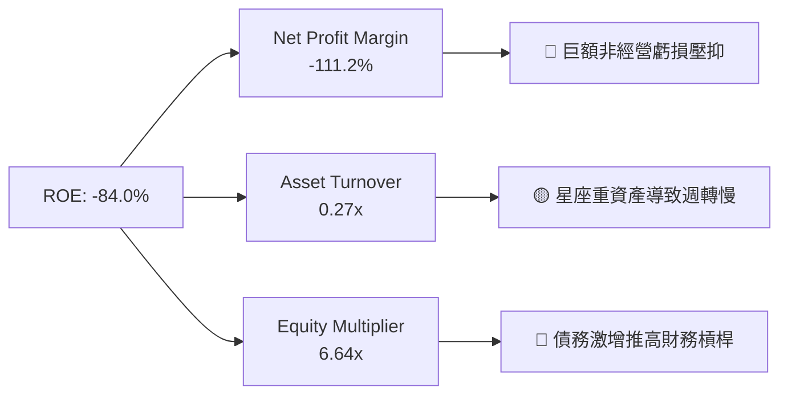

*   **淨利率（-111.2%）**：是 ROE 為負的絕對主因，反映了當前階段的非現金減值與未達規模效應的營運虧損。
*   **資產週轉率（0.27x）**：反映了航太星座高昂的初始建置成本，資產變現速度較慢，符合行業規律。
*   **財務槓桿（6.64x）**：由於股東權益縮水與債務增加，財務槓桿處於歷史高位。這是一把雙刃劍，一旦未來淨利轉正，將產生極大的 ROE 彈性；但在虧損階段，高槓桿顯著放大了風險。

### 6.4 獲利能力儀表板

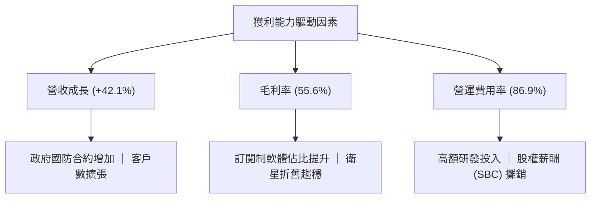

---

## 7. 估值深度分析

PL 當前股價 **$22.93**，市場給予其極高的估值溢價（P/S 達 **24.35x**，EV/Revenue 達 **22.80x**）。這反映了市場將其視為「唯一具備全球日更能力的稀缺太空標的」而給予的「稀缺性溢價（Scarcity Premium）」。

### 7.1 同業估值比較表格

我們選取了兩家直接地球觀測競爭對手（BlackSky, Spire Global）與一家航太龍頭（Rocket Lab）進行對比：

| 估值與財務指標 | **Planet Labs (PL)** | **BlackSky (BKSY)** | **Spire Global (SPIR)** | **Rocket Lab (RKLB)** | PL 評估與相對位置 |
|----------------|----------------------|----------------------|-------------------------|-----------------------|-------------------|
| **當前股價** | **$22.93** | $1.45 | $12.80 | $18.50 | — |
| **市值 (Market Cap)**| **$8.17B** | $210M | $285M | $8.95B | 🟡 與 RKLB 同屬太空板塊第一梯隊 |
| **P/S Ratio** | **24.35x** | 2.15x | 2.65x | 25.10x | 🔴 處於行業極高水平，估值容錯率低 |
| **EV / Revenue** | **22.80x** | 2.95x | 3.10x | 24.50x | 🔴 遠超 BKSY 與 SPIR，溢價顯著 |
| **Forward P/E** | **6885.89x** | N/A | 145.0x | 450.0x | 🔴 隱含極高的未來增長預期 |
| **TTM 營收成長率** | **42.1%** | 18.5% | 22.1% | 38.5% | 🟢 成長性在同業中居冠 |
| **毛利率 (Gross Margin)**| **55.6%** | 48.5% | 58.2% | 28.5% | 🟢 顯著優於硬體製造為主的 RKLB |
| **FCF Yield** | **1.04%** | -8.5% | +1.2% | -4.5% | 🟢 太空板塊中罕見實現正 FCF 者 |

### 7.2 歷史估值區間分析

PL 自上市以來的 P/S 估值區間在 **5.0x - 30.0x** 之間波動。當前 **24.35x** 的 P/S 處於歷史估值區間的**中高分位數（約 80% 分位）**。這顯示隨著 FCF 轉正與營收成長重新加速，市場已完成了對其估值的重新發現（Re-rating），當前股價並未低估。

### 7.3 情境目標價（假設驅動，Bear / Base / Bull）

由於 PL 淨利潤受高額 D&A 與非經營性支出壓抑，PE 估值完全失真。我們採用 **EV/Sales** 作為主要估值倍數，並以 **FCF Yield** 作為輔助驗證。

#### 核心假設與目標價推導：

| 情境 | 營收 CAGR (3年) | 2028 預估營收 | 目標 EV/Sales 倍數 | 隱含企業價值 (EV) | 淨現金調整 | 隱含目標價 | 相對現價回報率 |
|------|-----------------|---------------|--------------------|-------------------|------------|------------|----------------|
| 🔴 **悲觀情境** | 15.0% | $468M | 10.0x | $4.68B | +$380M | **$15.20** | **-33.7%** |
| 🟡 **基準情境** | **28.0%** | **$645M** | **12.5x** | **$8.06B** | **+$650M** | **$26.15** | **+14.0%** |
| 🟢 **樂觀情境** | 40.0% | $843M | 15.0x | $12.65B | +$800M | **$38.40** | **+67.5%** |

*倍數選擇說明*：我們在基準情境中給予 **12.5x** 的 EV/Sales 倍數。這相較於當前 22.8x 有所收縮，是考量到隨著公司規模擴大，高成長率勢必回歸常態，且高額 SBC 的稀釋效應需要估值倍數的收縮來進行補償。

### 7.4 DCF 敏感性分析（6格目標價矩陣）

我們使用兩階段 DCF 模型，假設終端成長率（Terminal Growth Rate）為 **3.0%**，對 WACC 與永續成長率進行敏感性測試，得出以下目標價矩陣：

| 永續成長率 \ WACC | 10.5% | **12.3%（基準）** | 14.0% |
|-------------------|-------|-------------------|-------|
| **4.0%** | $31.50 (+37.4%) | $28.20 (+23.0%) | $24.10 (+5.1%) |
| **3.0%（基準）** | $29.10 (+26.9%) | **$26.15 (+14.0%)** | $22.40 (-2.3%) |
| **2.0%** | $26.80 (+16.9%) | $24.00 (+4.7%) | $20.50 (-10.6%) |

### 7.5 估值綜合區間

```
當前股價: $22.93
悲觀目標價: $15.20 ═══════════╣當前╠═══════ 基準目標價: $26.15 ══════════════════ 樂觀目標價: $38.40
```

---

## 8. 成長催化劑

### 8.1 催化劑時間軸

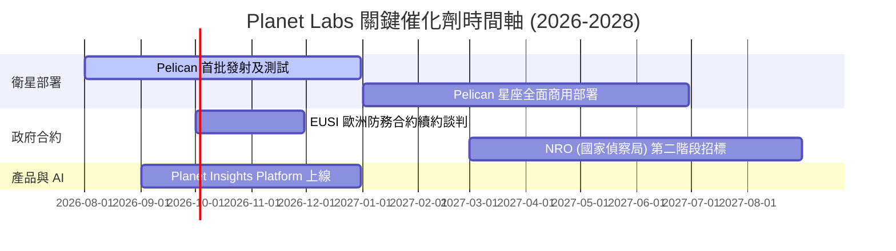

### 8.2 TAM 市場規模分析

```
╔══════════════════════════════════════════════════════════════╗
║               PL 地理空間情報 TAM 預估 (2030)                ║
╠══════════════════════════════════════════════════════════════╣
║                                                              ║
║  國防與情報安全 (Gov): $90B   ██████████████████  滲透率 < 1% ║
║  農業與氣候監測:       $45B   █████████           滲透率 ~ 2% ║
║  能源、基礎建設與保險: $55B   ███████████         滲透率 < 1% ║
║                                                              ║
║  📊 總可定址市場 (TAM)：$190B ｜ 當前營收滲透率僅 0.17%       ║
╚══════════════════════════════════════════════════════════════╝
```

### 8.3 成長驅動力結構圖

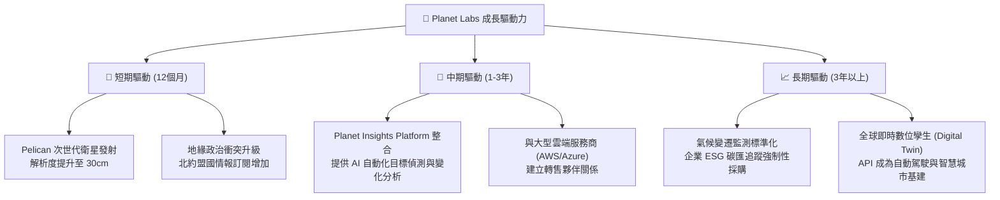

---

## 9. 風險矩陣

### 9.1 風險評分矩陣

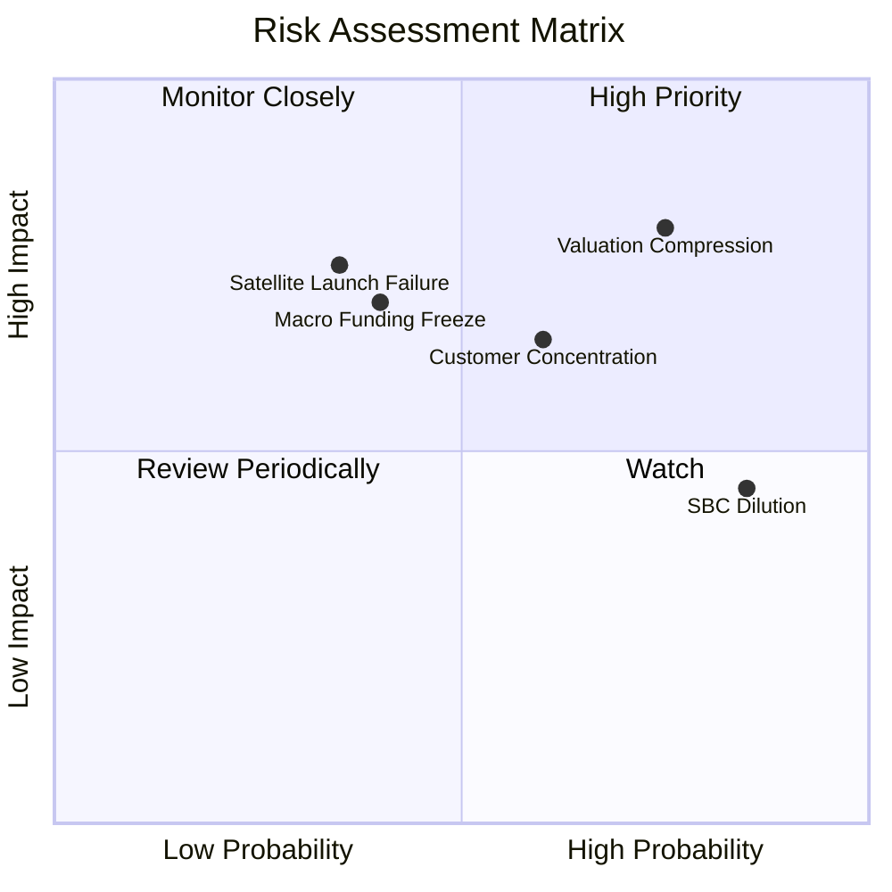

### 9.2 風險清單詳細分析

| # | 風險項目 | 發生機率 | 財務損害評估 | 風險評分 | 緩解措施與機構觀察 |
|---|----------|----------|--------------|----------|-------------------|
| 1 | 🔴 **估值倍數收縮** | 高 (75%) | 高 (-25% 股價) | 🔴 **8.0 / 10** | 當前 P/S 達 24.3x，一旦營收成長率跌破 25%，估值將面臨戴維斯雙殺。 |
| 2 | 🔴 **衛星發射與軌道失效**| 中 (35%) | 極高 (-15% 營收) | 🔴 **7.5 / 10** | 依賴 SpaceX 等第三方發射。若 Pelican 發射失敗或延遲，將嚴重打擊次世代產品時程。 |
| 3 | 🟡 **政府客戶集中度高** | 高 (60%) | 中 (-10% 營收) | 🟡 **6.5 / 10** | 前五大政府客戶貢獻近 40% 營收。合約更替期可能出現營收「真空期」。 |
| 4 | 🟡 **持續的股權稀釋** | 極高 (85%)| 低 (-5% EPS) | 🟡 **5.5 / 10** | 高額 SBC 持續存在，預期每年稀釋現有股東 4-6%。 |

---

## 10. 投資建議

### 10.1 最終綜合評級雷達圖

```
╔══════════════════════════════════════════════════════════════╗
║                    PL 綜合投資力診斷                         ║
╠══════════════════════════════════════════════════════════════╣
║ 基本面強度  7.5 ▓▓▓▓▓▓▓▓▓▓▓▓▓▓▓▓▓░░░  🟢 數據壁壘極高      ║
║ 成長動能    8.0 ▓▓▓▓▓▓▓▓▓▓▓▓▓▓▓▓▓▓░░  🟢 營收重新加速      ║
║ 獲利品質    3.5 ▓▓▓▓▓▓▓▓░░░░░░░░░░░░  🔴 減值與 SBC 拖累   ║
║ 財務健康    6.5 ▓▓▓▓▓▓▓▓▓▓▓▓▓▓░░░░░░  🟡 債務上升但現金充裕║
║ 估值合理性  4.0 ▓▓▓▓▓▓▓▓░░░░░░░░░░░░  🔴 溢價顯著          ║
╠══════════════════════════════════════════════════════════════╣
║ 綜合投資分  6.1 ▓▓▓▓▓▓▓▓▓▓▓▓▓░░░░░░░  🏆 建議「持有」      ║
╚══════════════════════════════════════════════════════════════╝
```

### 10.2 目標價與隱含報酬率

*   **當前股價**：$22.93 (2026-07-21)
*   **12個月基準目標價**：**$26.15**（隱含報酬率 **+14.0%**）
*   **機率加權預期回報率**：
    *   悲觀情境 ($15.20 ｜ 機率 25%) = $3.80
    *   基準情境 ($26.15 ｜ 機率 60%) = $15.69
    *   樂觀情境 ($38.40 ｜ 機率 15%) = $5.76
    *   **期望值目標價：$25.25**（隱含報酬率 **+10.1%**）

### 10.3 買入時機與觸發因素

```
╔══════════════════════════════════════════════════════════════════╗
║                   ✅ PL 投資決策 Checklist                       ║
╠══════════════════════════════════════════════════════════════════╣
║                                                                  ║
║  🎯 立即買入觸發條件（需符合 2 項以上）：                       ║
║  ✅ 股價回檔至安全邊際區間：$18.50 - $20.00                      ║
║  ✅ 季度非經營性支出 (Non-operating loss) 收窄至 $10M 以內       ║
║  ✅ 宣佈與美國國防部 (DoD) 簽署超過 $100M 的長期新合約            ║
║                                                                  ║
║  加碼觸發條件：                                                 ║
║  ☐ Pelican 星座首批衛星成功發射並傳回首張 30cm 解析度圖像       ║
║  ☐ 季度營收 YoY 成長率連續兩季突破 45%                           ║
║                                                                  ║
║  🚨 減碼/停損觸發條件：                                          ║
║  ☐ 季度 FCF 重新轉為負值，且單季流出超過 $20M                    ║
║  ☐ 核心政府合約出現流失或續約金額縮水 > 15%                     ║
║                                                                  ║
╚══════════════════════════════════════════════════════════════════╝
```

### 10.4 投資人適配度分析

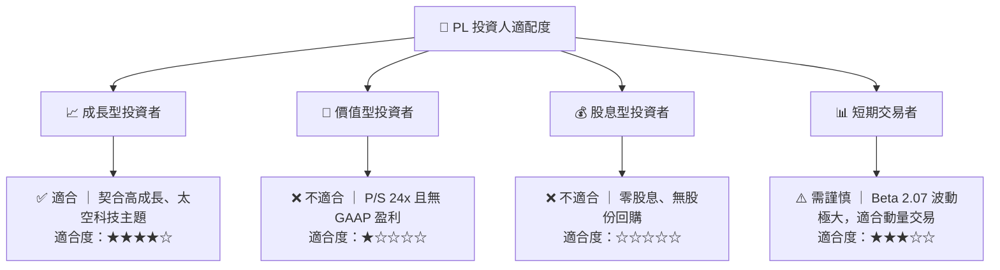

### 10.5 每季財報監控清單（Quarterly Watch List）

機構投資人在未來每季財報中，應嚴格監控以下指標是否觸發預警線：

| 監控指標 | 基準值 (Q1 2027) | 🟢 觸發加碼門檻 | 🔴 觸發減碼/停損門檻 |
|----------|------------------|-----------------|----------------------|
| **營收 YoY 成長率** | 42.08% | > 45.0% | < 25.0%（成長失速） |
| **毛利率** | 53.53%（單季） | > 58.0% | < 50.0%（定價權受損） |
| **單季自由現金流 (FCF)**| $-2.79M | > +$15.0M（穩定造血）| < $-15.0M（重新燒錢）|
| **非經營性支出** | $-106.68M | < $-10.0M（減值結束） | > $-50.0M（持續資產減值）|
| **SBC / 營收比率** | 17.48% | < 10.0%（稀釋放緩） | > 20.0%（過度稀釋） |

### 10.6 反面論證：什麼會證明論點錯誤（What Would Change My Mind）

本報告的「持有」評級與基準目標價 $26.15 是建立在**「營收持續高速成長且 FCF 保持正向，非經營性減值為一次性事件」**的假設之上。以下可量化條件一旦發生，將證明本報告之多頭論點錯誤，屆時必須無條件下調評級至「賣出」：

```
╔══════════════════════════════════════════════════════════════════╗
║              ⚠️ 論點失效條件 (Disconfirming Evidence)            ║
╠══════════════════════════════════════════════════════════════════╣
║  本投資論點在下列情況成立時應重新檢視或退出：                    ║
║  ☐ 營收 YoY 成長率連續兩季 < 20.0% (顯示地緣政治催化效應結束)     ║
║  ☐ FCF 連續兩季為負，且 TTM FCF 跌破 $10M                         ║
║  ☐ 稀釋後總股數 YoY 成長率 > 10.0% (SBC 稀釋完全失控)            ║
║  ☐ 發生重大衛星發射事故，導致 Pelican 部署時程推遲 12 個月以上   ║
║  ☐ 財務槓桿 (Equity Multiplier) 突破 10.0x，債務違約風險上升      ║
╚══════════════════════════════════════════════════════════════════╝
```

---

> **免責聲明**：本報告為 AI 自動生成，基於公開財務數據進行基本面分析，僅供研究參考，不構成任何投資建議。投資有風險，入市需謹慎。