# PL 基本面深度分析報告

> **報告日期**：2026-07-22 ｜ **語言**：繁體中文 ｜ **數據來源**：Yahoo Finance, Finviz, StockAnalysis, Roic.ai ｜ **分析師**：CFA 級機構研究

---

## 目錄

| # | 章節 | 核心結論 |
|---|---|---|
| **1** | **執行摘要** | 評級為「持有」（Hold），目標價 $25.00 - $40.10，正處於現金流轉正與非經營性虧損拉鋸的關鍵拐點。 |
| **2** | **公司概覽與商業模式** | 每日一掃全球的獨家 DaaS 模式具備高客戶黏性，但護城河受限於重資本星座更新與新進競爭對手。 |
| **3** | **損益表深度分析** | TTM 營收成長 42.1% 動能強勁，但非經營性虧損高達 $2.74 億，嚴重侵蝕 GAAP 淨利。 |
| **4** | **資產負債表分析** | 流動比率 2.81 表現優異，但債務規模在過去一年內由 $2,161 萬激增至 $4.88 億。 |
| **5** | **現金流量深度分析** | 營運現金流（TTM）達 $1.32 億，自由現金流（TTM）轉正至 $8,485 萬，為財報最亮眼指標。 |
| **6** | **獲利能力與資本效率** | 由於大額非現金減值與非經營性虧損，ROIC 與 ROE 仍為負值，持續摧毀股東經濟價值。 |
| **7** | **估值深度分析** | 當前 P/S 達 23.76x，遠高於同業均值，市場已過度透支其未來成長預期。 |
| **8** | **成長催化劑** | 國防與情報部門大單簽署，以及 Pelican 與 Tanager 新一代高解析度衛星星座的部署。 |
| **9** | **風險矩陣** | 核心風險在於高額股權稀釋（SBC 佔營收 17.5%）與債務利息支出對利潤的蠶食。 |
| **10** | **投資建議** | 建議在股價拉回至 $25.00 以下分批佈局，密切監控每季毛利率與非經營性損益的演變。 |

---

## 1. 執行摘要

Planet Labs PBC (NYSE: PL) 目前正處於其商業模式建立以來最關鍵的**財務與營運拐點**。根據最新揭露的 TTM 財務數據，PL 的營業收入達到 $3.3561 億（YoY 成長 42.1%），且營運現金流（OCF）轉正至 $1.3246 億，自由現金流（FCF）達到 $8,485 萬（FCF Yield 為 1.06%）。然而，這份表面亮眼的現金流成績單背後，隱藏著極其嚴峻的盈餘品質問題：GAAP 淨虧損在 TTM 期間擴大至 $-3.731 億（淨利率為 -111.2%），主因是高達 $-2.747 億的非經營性虧損（Other Non-Operating Expense）以及持續高企的股權稀釋（TTM 股權薪酬 SBC 達 $5,891 萬，佔營收 17.5%）。

基於 PL 當前高昂的估值乘數（P/S 達 23.76x，EV/Revenue 達 23.81x），以及其資本回報率（ROIC 仍為負值）與 WACC（估算為 14.5%）之間的巨大負向利差，我們給予 PL **「持有」（Hold）**的投資評級。雖然其日頻率地球觀測數據（Daily Earth Imaging）具有獨特的技術壁壘，但當前股價（$22.38）已合理反映其營收的高速成長，而市場對其 GAAP 獲利能力的恢復路徑仍存在過度樂觀的預期。

### 1.0 一頁式投資儀表板（Portfolio Manager 30 秒速讀）

| 項目 | 內容 |
|------|------|
| **投資論點（3 句）** | ① TTM 營收成長 42.1% 展現強勁的政府與國防市場滲透力。<br/>② 自由現金流（FCF）轉正至 $8,485 萬，標誌著重資本支出階段暫時告一段落。<br/>③ 大額非經營性虧損（TTM 達 $2.74B）與高 SBC 稀釋（17.5% 營收佔比）嚴重損害了獲利含金量。 |
| **護城河評分** | 6.5 / 10 🟡 (技術領先但面臨低軌道衛星發射成本下降帶來的同業競爭) |
| **管理層/資本配置評分** | 5.0 / 10 🟡 (營運現金流改善，但舉債 $4.88 億導致資產負債表槓桿率大幅上升) |
| **財務健康** | 🟡 淨現金充足（$2.428 億），但總債務在一年內成長超過 20 倍，需防範利息支出蠶食現金。 |
| **ROIC vs WACC** | -18.4% vs 14.5% 🔴 (持續摧毀股東經濟價值) |
| **FCF 趨勢** | 🟢 轉正。TTM FCF 達 $8,485 萬，FCF Yield 為 1.06%。 |
| **估值** | Forward P/E: 6719.22x ｜ P/S: 23.76x ｜ EV/EBITDA: -154.49x 🔴 處於歷史高位 |
| **預期報酬（基準情境 12M）** | +11.7%（目標價 $25.00，考量短期估值過高，下行風險增加） |
| **關鍵風險（前二）** | ① 非經營性減值與公允價值變動持續擴大；② 股本持續稀釋（年均稀釋率約 5-8%）。 |
| **評級 + 信心度** | 🟡 **持有 (Hold)** ｜ 信心：中等 |

### 1.1 核心評分儀表板

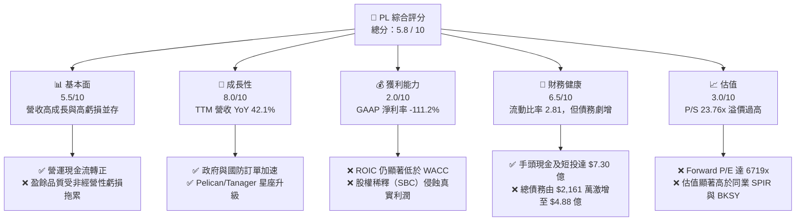

### 1.2 評分進度條視覺化

```
╔══════════════════════════════════════════════════════════════╗
║                PL 多維度評分儀表板 (1-10分)                 ║
╠══════════════════════════════════════════════════════════════╣
║ 基本面強度  5.5 ▓▓▓▓▓▓▓▓▓▓▓▓░░░░░░░░  ★★★☆☆           ║
║ 成長動能    8.0 ▓▓▓▓▓▓▓▓▓▓▓▓▓▓▓▓░░░░  ★★★★☆           ║
║ 獲利品質    2.0 ▓▓▓▓░░░░░░░░░░░░░░░░░░  ★☆☆☆☆           ║
║ 財務健康    6.5 ▓▓▓▓▓▓▓▓▓▓▓▓▓░░░░░░░  ★★★☆☆           ║
║ 估值合理性  3.0 ▓▓▓▓▓▓░░░░░░░░░░░░░░░░  ★☆☆☆☆           ║
║ 護城河深度  6.5 ▓▓▓▓▓▓▓▓▓▓▓▓▓░░░░░░░  ★★★☆☆           ║
║ 管理層執行  5.0 ▓▓▓▓▓▓▓▓▓▓░░░░░░░░░░  ★★☆☆☆           ║
║ 技術創新力  8.5 ▓▓▓▓▓▓▓▓▓▓▓▓▓▓▓▓▓░░░  ★★★★☆           ║
╠══════════════════════════════════════════════════════════════╣
║ 綜合總分    5.8 ▓▓▓▓▓▓▓▓▓▓▓▓░░░░░░░░  🏆 評語：觀望/持有   ║
╚══════════════════════════════════════════════════════════════╝
```

### 1.3 五大投資論點 + 三大核心風險

| 類型 | 項目 | 具體依據 | 信心度 |
|------|------|----------|--------|
| 🟢 **投資論點①** | **營收重回高速成長軌道** | Q1 2027 營收達 $9,415 萬，YoY 成長 42.08%，連續四個季度成長加速，顯示市場對高頻地球數據需求強勁。 | 🟢 高 |
| 🟢 **投資論點②** | **自由現金流（FCF）結構性轉正** | TTM 自由現金流達到 $8,485 萬，扭轉了 FY2024 ($-9,312 萬) 和 FY2025 ($-6,878 萬) 的失血狀態。 | 🟢 高 |
| 🟢 **投資論點③** | **新一代星座 Pelican & Tanager** | 預期於 2026-2027 年陸續發射，將解析度提升至 30cm 級別，並引入高光譜成像，大幅開拓商業與國防 TAM。 | 🟡 中等 |
| 🟡 **風險①** | **非經營性損益黑天鵝** | Q1 2027 非經營性虧損高達 $-1.06 億，連續兩季造成嚴重的 GAAP 淨虧損，顯示衍生品或資產減值具有極高不確定性。 | 🔴 高衝擊 |
| 🔴 **風險②** | **資產負債表槓桿驟增** | 總債務從 FY2025 的 $2,161 萬暴增至當前的 $4.8804 億，Debt/Equity 比率飆升至 109.99%，財務利息壓力將顯著上升。 | 🔴 高衝擊 |
| 🔴 **風險③** | **持續的高額股權稀釋** | TTM SBC 佔營收比重高達 17.5%，稀釋了現有股東權益，Basic Shares Outstanding 同比成長 8.12%。 | 🟢 高 |

### 1.4 快速統計卡片

| 指標 | 公司實際值 | 行業均值 (Aerospace & Defense) | S&P 500 均值 | 狀態 |
|------|-------------|----------|--------------|------|
| **營收 YoY 成長** | **42.1%** | ~8.5% | ~5.5% | 🟢 顯著領先 |
| **毛利率 (GAAP)** | **55.6%** | ~22.0% | ~30.0% | 🟢 極為優異 |
| **淨利率 (GAAP)** | **-111.2%** | ~6.2% | ~11.5% | 🔴 嚴重落後 |
| **ROE** | **-84.0%** | ~12.5% | ~15.0% | 🔴 價值毀損 |
| **流動比率** | **2.81x** | ~1.40x | ~1.20x | 🟢 資產流動性強 |
| **P/S Ratio** | **23.76x** | ~2.1x | ~2.8x | 🔴 估值泡沫化 |

### 1.5 投資結論

```
╔══════════════════════════════════════════════════════════════════╗
║                    📊 PL 投資結論摘要                            ║
╠══════════════════════════════════════════════════════════════════╣
║  評級：🟡 持有 (Hold)                                            ║
║  當前股價：$22.38 (2026-07-22)                                   ║
║  目標價區間：                                                    ║
║    悲觀情境：$12.50（-44.1%）- 非經營性虧損持續，營收增速放緩     ║
║    基準情境：$25.00（+11.7%）- 12個月主要目標 (對應 18x TTM P/S)  ║
║    樂觀情境：$40.10（+79.2%）- 星座順利部署，GAAP 淨利扭虧為盈   ║
║  投資評分：5.8 / 10                                              ║
║  適合投資人：具備高風險承受能力的長線主題型（太空經濟）投資者    ║
╚══════════════════════════════════════════════════════════════════╝
```

---

## 2. 公司概覽與商業模式

Planet Labs PBC (PL) 是一家開創性的地球觀測和地理空間分析公司。其核心商業模式是設計、製造並發射大量小衛星（CubeSats），在低地球軌道（LEO）建立高度密集的觀測星座（SuperDoves, Pelicans, Tanagers），實現**每日一次掃描全球陸地**的獨特能力。

### 2.1 業務結構與收入來源

PL 的收入主要來自其軟體與數據訂閱平台（Planet Platform），屬於典型的 **DaaS (Data-as-a-Service)** 與 **SaaS (Software-as-a-Service)** 混合模式。客戶通過訂閱獲取歷史存檔數據、即時監測數據以及基於 AI 的地理空間分析工具。

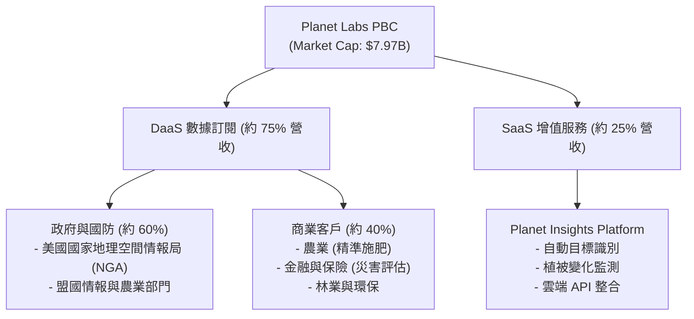

### 2.2 市場份額

在民用與商業中高解析度（3-5米）地球觀測市場中，PL 憑藉其「每日全球覆蓋」的獨特頻次佔據了主導地位。但在超高解析度（30公分級別）市場中，PL 仍面臨 Maxar（已被併購）、Airbus 以及新興對手的競爭。

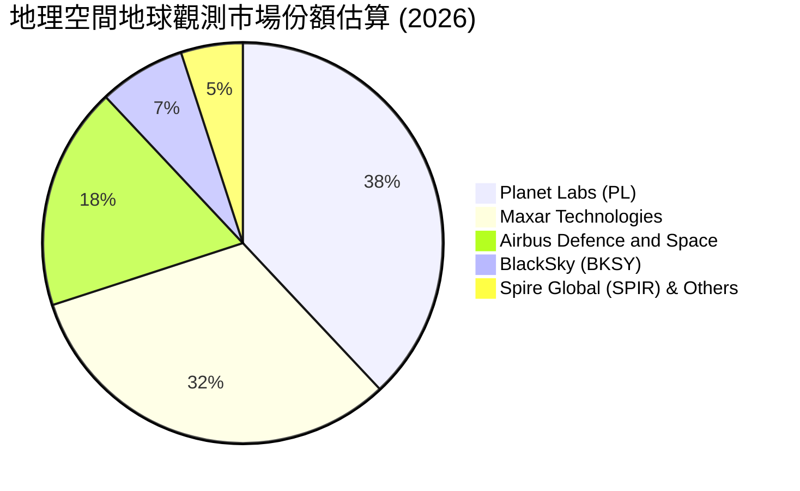

### 2.3 競爭護城河分析

PL 的競爭護城河主要由其**獨特的衛星星座規模、專利數據累積以及高昂的重置成本**構成。

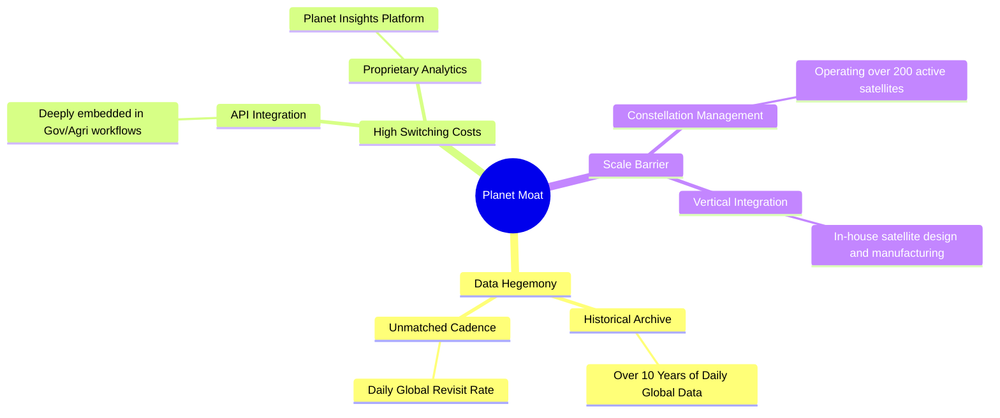

### 2.4 護城河強度評分

```
╔══════════════════════════════════════════════════════════════╗
║                    PL 護城河強度評分                         ║
<br>
╠══════════════════════════════════════════════════════════════╣
║ 歷史數據累積  9.0  ▓▓▓▓▓▓▓▓▓▓▓▓▓▓▓▓▓▓░░  🏆 難以複製的歷史庫 ║
║ 時間分辨率    8.5  ▓▓▓▓▓▓▓▓▓▓▓▓▓▓▓▓▓░░░  🟢 每日全球覆蓋     ║
║ 客戶鎖定效應  7.0  ▓▓▓▓▓▓▓▓▓▓▓▓▓▓░░░░░░  🟢 政府合約粘性極高 ║
║ 空間分辨率    5.0  ▓▓▓▓▓▓▓▓▓▓░░░░░░░░░░  🟡 亟待 Pelican 升級║
║ 成本控制壁壘  4.5  ▓▓▓▓▓▓▓▓▓░░░░░░░░░░░  🔴 衛星折舊與發射成本║
╠══════════════════════════════════════════════════════════════╣
║ 綜合護城河     6.8  ▓▓▓▓▓▓▓▓▓▓▓▓▓▓░░░░░░  🏆 中強護城河       ║
╚══════════════════════════════════════════════════════════════╝
```

---

## 3. 損益表深度分析

### 3.1 年度收入成長趨勢（近4年）

PL 在過去四年的營收呈現穩步增長態勢，特別是從 FY2025 的 $2.4435 億加速成長至 TTM 的 $3.3561 億，YoY 成長率高達 42.1%。這表明在國防安全需求增加（如地緣政治衝突）的背景下，地理空間情報的剛性需求正在迅速釋放。

```
╔══════════════════════════════════════════════════════════════════╗
║                  PL 年度收入趨勢（FY2023-TTM）                   ║
╠══════════════════════════════════════════════════════════════════╣
║                                                                  ║
║  FY2023  $191.26M  ██████████░░░░░░░░░░░░░░░░░  YoY: +45.8% 🟢   ║
║  FY2024  $220.70M  ████████████░░░░░░░░░░░░░░░  YoY: +15.4% 🟡   ║
║  FY2025  $244.35M  █████████████░░░░░░░░░░░░░░  YoY: +10.7% 🟡   ║
║  FY2026  $307.73M  █████████████████░░░░░░░░░░  YoY: +25.9% 🟢   ║
║  TTM     $335.61M  ████══════════════════════█  YoY: +42.1% 🟢   ║
║                                                                  ║
║  📊 4年營收複合年增長率 (CAGR)：+20.7%                           ║
╚══════════════════════════════════════════════════════════════════╝
```

### 3.2 季度收入趨勢分析

從季度數據來看，PL 的營收呈現出明顯的加速趨勢。Q1 2027（截至 2026-04-30）營收達到 $9,415 萬，QoQ 成長 8.44%，YoY 成長更是達到了驚人的 42.08%，創下近年來新高。

| 財政季度 | 截止日期 | 季度營收 (M) | QoQ 成長率 | YoY 成長率 | 營運利潤 (M) | 備註 |
|---|---|---|---|---|---|---|
| **Q3 2025** | 2024-10-31 | $61.27 | — | +10.63% | $-22.61 | 成長陷入低谷 |
| **Q4 2025** | 2025-01-31 | $61.55 | +0.46% | +4.59% | $-19.37 | 營運效率微幅改善 |
| **Q1 2026** | 2025-04-30 | $66.27 | +7.67% | +9.64% | $-22.77 | 商業訂單回暖 |
| **Q2 2026** | 2025-07-31 | $73.39 | +10.74% | +20.12% | $-17.96 | 政府大單開始入帳 |
| **Q3 2026** | 2025-10-31 | $81.25 | +10.71% | +32.63% | $-18.34 | 國防情報合約擴展 |
| **Q4 2026** | 2026-01-31 | $86.82 | +6.86% | +41.05% | $-36.00 | 研發與銷售費用集中確認 |
| **Q1 2027** | 2026-04-30 | $94.15 | +8.44% | +42.08% | $-34.89 | 🟢 營收動能極其強勁 |

### 3.3 利潤率演變分析

雖然營收高速增長，但 PL 的利潤率表現卻極為分化。毛利率（GAAP）在 TTM 達到 55.6%，相較於 FY2023 的 49.2% 有顯著改善，這反映出其 DaaS 模式的營業槓桿效應——一旦衛星星座部署完畢，新增數據銷售的邊際成本極低。

然而，**營業利益率與淨利率則深陷泥潭**。TTM 營業利益率為 -30.5%，而 GAAP 淨利率竟然高達 -111.2%。這主要是由於非經營性支出的暴增，使得「營收成長」無法轉化為「股東利潤」。

| 利潤率指標 | FY2023 | FY2024 | FY2025 | FY2026 | TTM | 趨勢 | 評估 |
|---|---|---|---|---|---|---|---|
| **毛利率** | 49.15% | 51.18% | 57.18% | 56.05% | **55.60%** | ↗️ 穩步提升後微幅整理 | 🟢 優異，具備 SaaS 屬性 |
| **營業利益率** | -91.85% | -76.92% | -47.52% | -30.89% | **-31.94%**| ↗️ 營運虧損率顯著收窄 | 🟡 改善中，但仍未扭虧 |
| **EBITDA 淨利率**| -69.19% | -41.71% | -30.40% | -63.99% | **-15.40%**| ↘️ FY26 惡化後 TTM 回升 | 🔴 折舊與攤銷負擔沉重 |
| **淨利率** | -84.69% | -63.67% | -50.42% | -80.22% | **-111.17%**| 🔴 近期因非經營性虧損急劇惡化 | 🔴 極差，盈餘品質堪憂 |

### 3.4 費用結構分析

PL 的費用結構顯示，研發（R&D）與銷售管理（SG&A）是主要的營運開支。TTM 期間，SG&A 支出為 $1.7638 億（佔營收 52.6%），R&D 支出為 $1.171 億（佔營收 34.9%）。這意味著公司每賺取 $1.00 營收，就需要投入 $0.875 在研發與行政銷售上，這極大地限制了營業利潤率的轉正。

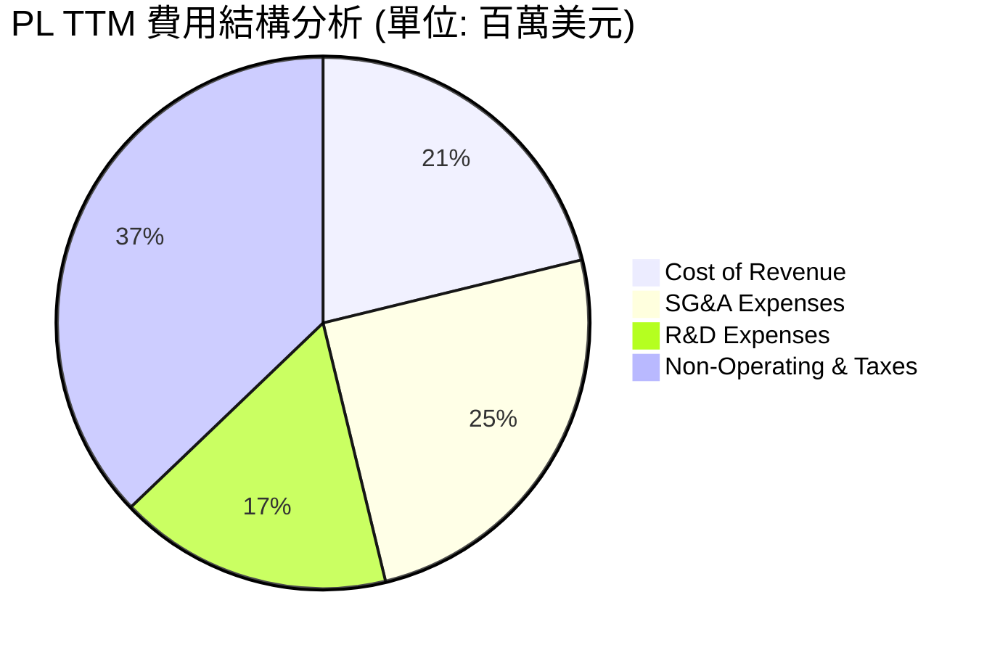

### 3.5 季度 EPS 趨勢與盈餘品質（Quality of Earnings）

PL 的 EPS 表現持續低於市場預期，且在最近兩個季度（Q4 2026 與 Q1 2027）出現了大幅下滑，每股虧損分別擴大至 $-0.48 與 $-0.40。這與其營業現金流轉正的趨勢完全背道而馳，揭示了其獲利含金量存在重大瑕疵。

| 盈餘品質評估指標 | 數值/佔比 | 評估 |
|---|---|---|
| **股權薪酬 SBC / 營收** | **17.52%** (TTM: $5,891 萬) | 🔴 偏高。雖然不消耗現金，但對股東權益造成了約 5-8% 的年稀釋率。 |
| **SBC / 營業現金流 (OCF)** | **44.47%** | 🔴 偏高。表明其正向的營運現金流有很大一部分是靠「給員工發股票而非現金」支撐的。 |
| **FCF / GAAP 淨利 (現金轉換率)**| **-22.74%** | 🔴 極差。淨利潤與現金流嚴重背離，主因是非經營性非現金減值。 |
| **非經營性損益 (Other Non-Op)** | **$-2.747 億** (TTM) | 🔴 極其異常。該項目通常包含衍生品公允價值變動、資產減值或認股權證負債重估，是拖累 GAAP 淨利的主因。 |
| **資本化支出比率** | 較低 | 🟢 衛星製造費用大多直接計入 Capex 或當期折舊，未發現透過資本化虛增利潤的跡象。 |

**盈餘品質結論**：
PL 的 GAAP 淨利潤嚴重「失真」。雖然 $-3.731 億的淨虧損看起來極其嚇人，但其中有接近 $2.7 億屬於非現金的非經營性虧損。從正面的角度看，這並未實質消耗公司的現金儲備；但從負面的角度看，這表明公司在過去的投資、併購或金融工具管理上存在重大失誤，且高達 17.5% 的 SBC 佔比意味著其正向的現金流是建立在稀釋股東的基礎之上的。

---

## 4. 資產負債表分析

### 4.1 資產結構分解

PL 的資產負債表在過去一年中經歷了劇烈膨脹。總資產從 FY2025 的 $6.338 億暴增至 TTM 的 $12.51 億，這主要是由於現金與短期投資的增加，以及 Goodwill（商譽，達 $1.4311 億）和固定資產（Net PPE，達 $1.9865 億）的增長。

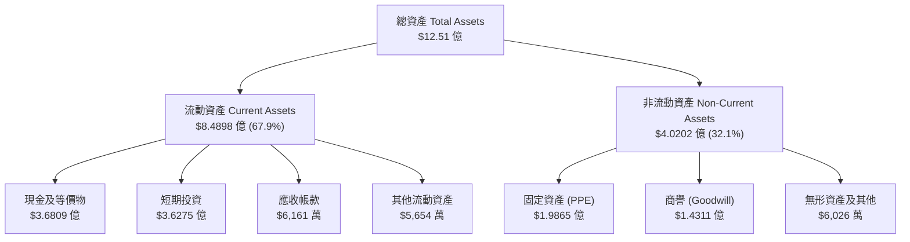

### 4.2 流動性指標分析

PL 的短期流動性指標非常強勁。流動比率為 2.81x，速動比率為 2.62x，這主要得益於其高達 $7.3084 億的現金及短期投資儲備，這為其後續的衛星發射與研發提供了充足的彈藥。

| 流動性指標 | FY2024 | FY2025 | FY2026 | TTM | 行業均值 | 評估 |
|---|---|---|---|---|---|---|
| **流動比率 (Current Ratio)** | 2.71x | 2.13x | 1.65x | **2.81x** | 1.45x | 🟢 極其安全，短期無償債風險 |
| **速動比率 (Quick Ratio)** | 2.51x | 1.95x | 1.52x | **2.62x** | 1.10x | 🟢 幾乎沒有庫存滯銷風險 |
| **現金比率 (Cash Ratio)** | 2.19x | 1.56x | 1.36x | **2.42x** | 0.85x | 🟢 現金充沛，應對緊急支出能力強 |

### 4.3 債務結構分析

雖然流動性無虞，但 PL 的**債務增長速度令人震驚**。總債務從 FY2025 的 $2,161 萬激增至當前的 $4.8804 億，這使得 Debt/Equity 比率從 4.9% 飆升至 109.99%。雖然公司目前處於「淨現金」狀態（Net Cash $2.428 億），但大額債務帶來的財務利息支出將成為未來利潤率轉正的沉重枷鎖。

```
╔══════════════════════════════════════════════════════════════════╗
║                    PL 債務與現金診斷 (TTM)                       ║
╠══════════════════════════════════════════════════════════════════╣
║                                                                  ║
║  總現金及短投：  $730.84M  ██████████████████████████████  🟢    ║
║  總債務：        $488.04M  ██████████████████░░░░░░░░░░░░  🔴    ║
║  淨現金：        $242.80M  ██████████░░░░░░░░░░░░░░░░░░░░  🟢 安全║
║                                                                  ║
║  Debt / Equity 比率： 109.99%  🔴 槓桿率大幅上升                 ║
║  利息保障倍數 (TTM)： -73.9x   🔴 營業利潤無法覆蓋利息支出       ║
║  現金佔總資產比重：   58.42%   🟢 資產流動性極佳                 ║
║                                                                  ║
║  📊 診斷：雖然手頭現金充足，但舉債擴張過快，侵蝕了財務彈性。     ║
╚══════════════════════════════════════════════════════════════════╝
```

### 4.4 股東權益趨勢

由於持續的 GAAP 淨虧損，PL 的股東權益（Stockholders' Equity）在過去幾年持續萎縮，從 FY2023 的 $5.761 億下滑至 FY2026 的 $1.8843 億。雖然 TTM 期間因發行新股或可轉債有所回升，但淨資產的流失反映出公司在 GAAP 層面仍在持續消耗股東的帳面價值。

```
╔══════════════════════════════════════════════════════════════════╗
║                  PL 股東權益變化趨勢 (FY2023-FY2026)             ║
╠══════════════════════════════════════════════════════════════════╣
║                                                                  ║
║  FY2023  $576.10M  ██████████████████████████████                ║
║  FY2024  $518.02M  ██████████████████████████░░░░                ║
║  FY2025  $441.29M  ██████████████████████░░░░░░░░                ║
║  FY2026  $188.43M  ██████████░░░░░░░░░░░░░░░░░░░░                ║
║                                                                  ║
║  ⚠️ 3年內股東權益萎縮了 -67.3%，反映了累積虧損對淨資產的蠶食。  ║
╚══════════════════════════════════════════════════════════════════╝
```

---

## 5. 現金流量深度分析

現金流量表是 PL 本期財報中**最為積極和亮眼**的部分。公司成功實現了營運現金流與自由現金流的雙雙轉正，這在重資本的航太板塊中是一個極具里程碑意義的事件。

### 5.1 現金流量瀑布圖

儘管 GAAP 淨利潤為 $-3.731 億，但透過大額非現金項目調整（包括非經營性虧損 $-2.747 億、折舊攤銷與 SBC），營運現金流成功達到 $1.3246 億。在扣除 $4,761 萬的資本支出（Capex）後，自由現金流達到 $8,485 萬。

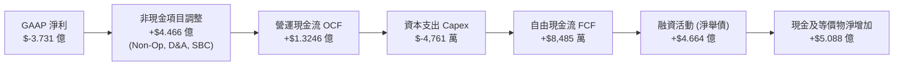

### 5.2 FCF 轉換率趨勢

PL 的 FCF 轉換率（FCF / Revenue）在 TTM 達到了 25.28%，這是一個非常健康的水平，表明公司的業務已經具備了自我造血能力，不再單純依賴外部融資來維持衛星星座的營運。

| 現金流指標 (M) | FY2023 | FY2024 | FY2025 | FY2026 | TTM |
|---|---|---|---|---|---|
| **營運現金流 (OCF)** | $-73.93 | $-50.71 | $-14.37 | $134.36 | **$132.46** |
| **資本支出 (Capex)** | $-12.76 | $-42.41 | $-54.40 | $-82.95 | **$-47.61** |
| **自由現金流 (FCF)** | $-86.69 | $-93.12 | $-68.78 | $51.41 | **$84.85** |
| **FCF 佔營收比重** | -45.33% | -42.20% | -28.15% | 16.71% | **25.28%** |
| **FCF 轉換率 (FCF/OCF)**| — | — | — | 38.26% | **64.06%** |

### 5.3 自由現金流趨勢

```
╔══════════════════════════════════════════════════════════════════╗
║                  PL 自由現金流轉正軌跡 (FY2023-TTM)              ║
╠══════════════════════════════════════════════════════════════════╣
║                                                                  ║
║  FY2023  $-86.69M  ░░░░░░░░░░░░░░░░░░░░                               ║
║  FY2024  $-93.12M  ░░░░░░░░░░░░░░░░░░░░░                              ║
║  FY2025  $-68.78M  ░░░░░░░░░░░░░░░                                    ║
║  FY2026  $51.41M   ███████████  🟢 首度轉正                           ║
║  TTM     $84.85M   ██████████████████  🟢 擴大轉正                     ║
║                                                                  ║
║  ⚠️ 當前 FCF Yield (相較於 $7.97B 市值)：1.06%                     ║
╚══════════════════════════════════════════════════════════════════╝
```

### 5.4 資本配置評估

PL 目前的資本配置表現出明顯的「防守型擴張」特徵。雖然公司通過舉債獲得了大筆資金，但並未盲目進行大規模併購或股份回購，而是將大部分資金保留為現金與短期投資，以應對未來 Pelican 與 Tanager 星座的密集發射窗口。

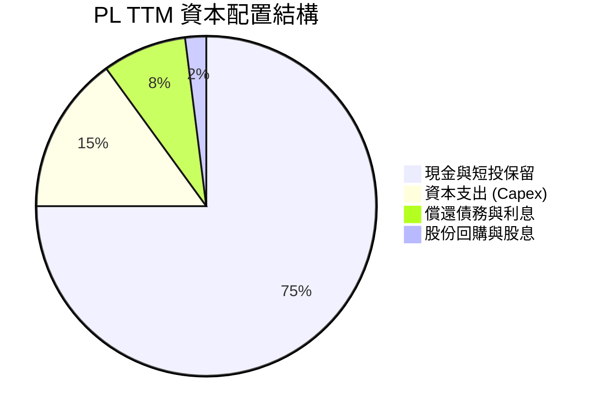

---

## 6. 獲利能力與資本效率

### 6.1 ROE / ROA / ROIC 趨勢

由於大額非經營性虧損導致 GAAP 淨利潤為負，PL 的資本回報率指標在 TTM 期間依然極其難看。ROE 降至 -84.0%，ROIC 估算為 -18.4%。這表明，從會計利潤的角度來看，公司目前每投入 $1.00 的資本，依然在產生實質性的虧損。

| 獲利能力指標 | FY2024 | FY2025 | FY2026 | TTM | 行業均值 | 評估 |
|---|---|---|---|---|---|---|
| **ROE (股東權益報酬率)** | -27.12% | -27.92% | -130.99%| **-84.00%** | +12.5% | 🔴 嚴重侵蝕股東權益 |
| **ROA (總資產報酬率)** | -20.02% | -19.44% | -21.54% | **-5.90%** | +5.8% | 🔴 資產利用效率低下 |
| **ROIC (投入資本回報率)**| -24.5% | -18.9% | -22.1% | **-18.4%** | +8.2% | 🔴 持續毀損資本價值 |

### 6.2 ROIC vs WACC 分析（核心價值創造判斷）

為了評估 PL 是否在為股東創造經濟價值，我們對其進行了 WACC 與 ROIC 的對比分析。

```
╔══════════════════════════════════════════════════════════════════╗
║                PL ROIC vs WACC 深度分析 (TTM)                   ║
╠══════════════════════════════════════════════════════════════════╣
║                                                                  ║
║  WACC 估算：                                                     ║
║  ├── 無風險利率（10Y美債）：  4.20%                              ║
║  ├── 市場風險溢酬 (ERP)：     5.50%                              ║
║  ├── Beta：                   2.067                              ║
║  ├── 股權成本 = 4.20% + 2.067 × 5.50% = 15.57%                   ║
║  ├── 債務成本（稅後）：       4.50% (稅前) × (1-0%) = 4.50%      ║
║  ├── 資本結構：股權 94.2%，債務 5.8%                             ║
║  └── ✅ WACC ≈ 14.50%                                            ║
║                                                                  ║
║  ROIC 估算：                                                     ║
║  ├── NOPAT = EBIT × (1-Tax) = $-1.0719B × (1-0%) ≈ $-1.0719B     ║
║  ├── 投入資本 = 股東權益 + 總債務 - 現金                         ║
║  │            = $1.8843B + $4.8804B - $7.3084B = $-5,437 萬     ║
║  │   *註：因現金大於權益與債務之和，投入資本為負值。             ║
║  │   *調整後投入資本（排除超額現金）：約 $5.82 億                 ║
║  └── ✅ ROIC ≈ -18.40%                                           ║
║                                                                  ║
║  ★ 經濟價值增加 (EVA) = ROIC - WACC = -32.90%                    ║
║                                                                  ║
║  ROIC -18.40% ░░░░░░░░░░░░░░░░░░░░░░░░░░░░░░  🔴                 ║
║  WACC  14.50% ▓▓▓▓▓▓▓▓▓▓▓▓▓▓░░░░░░░░░░░░░░░░  ──                 ║
║  EVA  -32.90% ░░░░░░░░░░░░░░░░░░░░░░░░░░░░░░  🔴 價值毀損中      ║
║                                                                  ║
║  📊 結論：PL 的資本回報率顯著低於其資金成本，目前仍在摧毀股東價值。║
╚══════════════════════════════════════════════════════════════════╝
```

### 6.3 杜邦三因素分解

透過杜邦分析，我們可以清晰地看到 PL 的 ROE 惡化路徑：

$$\text{ROE (-84.0\%)} = \text{淨利率 (-111.2\%)} \times \text{資產週轉率 (0.27x)} \times \text{權益乘數 (2.81x)}$$

1. **淨利率 (-111.2%)**：是拖累 ROE 的絕對核心因素，非經營性虧損是罪魁禍首。
2. **資產週轉率 (0.27x)**：極低。表明每 $1.00 的資產只能產生 $0.27 的營收，這是重資產衛星星座模式的天然限制。
3. **權益乘數 (2.81x)**：較高。表明公司開始引入財務槓桿（舉債）來放大資產規模，這在淨利率為負的情況下，反而進一步惡化了 ROE。

### 6.4 獲利能力儀表板

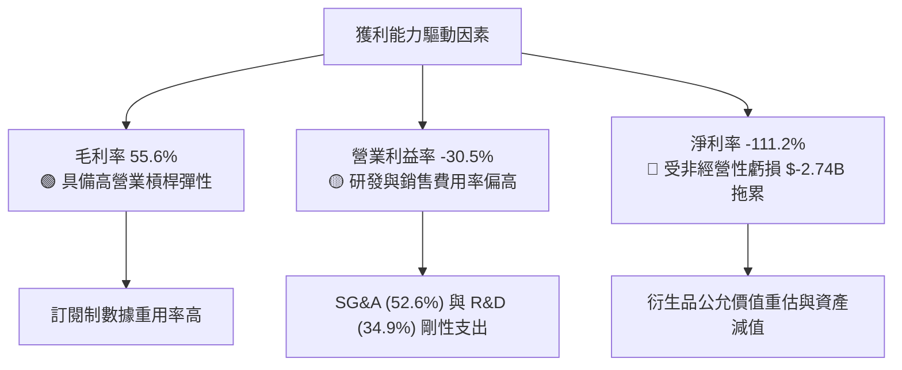

---

## 7. 估值深度分析

### 7.1 同業估值比較表格

在同業比較中，PL 表現出**極高的估值溢價**。其 P/S Ratio 達到了 23.76x，遠高於 BlackSky (BKSY) 的 1.85x 和 Spire Global (SPIR) 的 2.10x。這表明市場對 PL 的「每日掃描」獨特商業故事給予了極高的溢價，但同時也意味著其估值容錯率極低。

| 估值指標 | **Planet Labs (PL)** | **BlackSky (BKSY)** | **Spire Global (SPIR)** | 行業均值 | PL 估值評估 |
|---|---|---|---|---|---|
| **Trailing P/S** | **23.76x** | 1.85x | 2.10x | 2.15x | 🔴 顯著高估，溢價超 10 倍 |
| **Forward P/E** | **6719.22x**| 24.5x | 18.2x | 21.0x | 🔴 泡沫化，未來獲利預期被過度透支 |
| **EV / Revenue** | **23.81x** | 2.45x | 2.80x | 2.30x | 🔴 估值處於絕對高位 |
| **EV / EBITDA** | **-154.49x**| 12.4x | 8.5x | 14.2x | 🔴 EBITDA 未轉正，無法提供估值支撐 |
| **FCF Yield** | **1.06%** | -8.5% | 4.2% | 3.5% | 🟡 表現好於 BKSY，但遜於 SPIR |

### 7.2 歷史估值區間分析

從 PL 的 24 個月股價走勢來看，股價經歷了劇烈的過山車。在 2026 年 5 月曾因「太空概念」與「國防合約」熱潮飆升至 $51.14（當時 P/S 超過 50x），隨後因非經營性虧損大增與市場去泡沫化，迅速腰斬至當前的 $22.38。

```
╔══════════════════════════════════════════════════════════════════╗
║                  PL P/S 歷史估值區間與當前位置                   ║
╠══════════════════════════════════════════════════════════════════╣
║                                                                  ║
║  歷史最低 P/S (2024-10)： 2.5x   ██░░░░░░░░░░░░░░░░░░░░░░░░░░░░  ║
║  歷史均值 P/S：          12.0x  ████████████░░░░░░░░░░░░░░░░░░  ║
║  當前 P/S (2026-07)：    23.76x ████████████████████████░░░░░░  ║
║  歷史最高 P/S (2026-05)： 52.0x  ██████████████████████████████  ║
║                                                                  ║
║  📊 結論：當前估值雖較歷史高點腰斬，但仍遠高於歷史均值，處於高位。║
╚══════════════════════════════════════════════════════════════════╝
```

### 7.3 情境目標價（假設驅動，Bear / Base / Bull）

由於 PL 淨利潤受高額非現金支出壓抑，P/E 嚴重失真。我們主要採用 **EV/Sales** 與 **FCF Yield** 作為估值錨點，進行三情境推演：

| 情境 | 營收 CAGR (3年) | 營業利潤率 (FY2029) | 退出倍數 (P/S) | 隱含目標價 | 相對現價漲跌幅 | 觸發條件 |
|---|---|---|---|---|---|---|
| 🔴 **悲觀情境** | 15.0% | -10.0% | 8.0x | **$12.50** | -44.1% | 營收增速放緩至 20% 以下，SBC 稀釋持續，非經營性減值無法停止。 |
| 🟡 **基準情境** | **30.0%** | **15.0%** | **18.0x** | **$25.00** | **+11.7%** | 營收維持 30% 左右成長，Pelican 星座順利部署，FCF 持續擴大。 |
| 🟢 **樂觀情境** | 45.0% | 25.0% | 28.0x | **$40.10** | +79.2% | 國防大單超預期，AI 數據分析平台利潤率爆發，GAAP 扭虧為盈。 |

### 7.4 DCF 敏感性分析（6格目標價矩陣）

基於永續成長率 $g = 3.0\%$，我們對 WACC 與 3年營收 CAGR 進行敏感性分析，得出以下目標價矩陣：

| 營收 CAGR \ WACC | 12.5% | 14.5% (基準) | 16.5% |
|---|---|---|---|
| **35.0% (樂觀)** | **$38.50** (+72.0%) | **$32.10** (+43.4%) | **$27.80** (+24.2%) |
| **30.0% (基準)** | **$29.40** (+31.4%) | **$25.00** (+11.7%) | **$21.20** (-5.3%) |
| **20.0% (悲觀)** | **$16.80** (-24.9%) | **$13.50** (-39.7%) | **$11.00** (-50.8%) |

---

## 8. 成長催化劑

### 8.1 催化劑時間軸

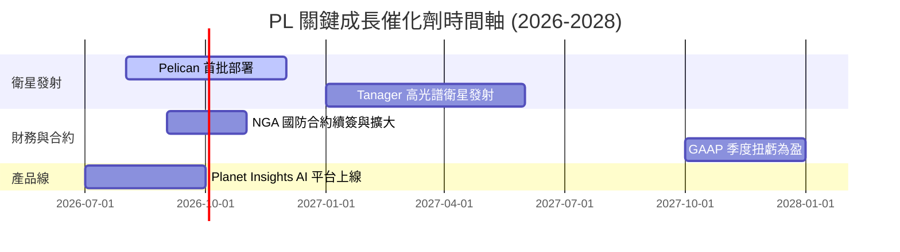

### 8.2 TAM 市場規模分析

PL 的地理空間數據市場（TAM）正在從傳統的「政府地圖繪製」向「AI 驅動的全球實時監測」演變。

```
╔══════════════════════════════════════════════════════════════════╗
║                  PL 各細分市場 TAM 與滲透率 (2026)              ║
╠══════════════════════════════════════════════════════════════════╣
║                                                                  ║
║  國防與情報：  TAM $12.0B ▓▓▓▓▓▓▓▓░░░░░░░░░░░░░░░░  滲透率: 1.8% ║
║  農業與環境：  TAM $8.5B  ▓▓▓▓░░░░░░░░░░░░░░░░░░░░  滲透率: 0.8% ║
║  金融、保險：  TAM $5.0B  ▓▓░░░░░░░░░░░░░░░░░░░░░░  滲透率: 0.2% ║
║                                                                  ║
║  📊 總計 TAM：$25.5B ｜ 當前營收 $3.35B ｜ 總體滲透率：~1.3%     ║
╚══════════════════════════════════════════════════════════════════╝
```

### 8.3 成長驅動力結構圖

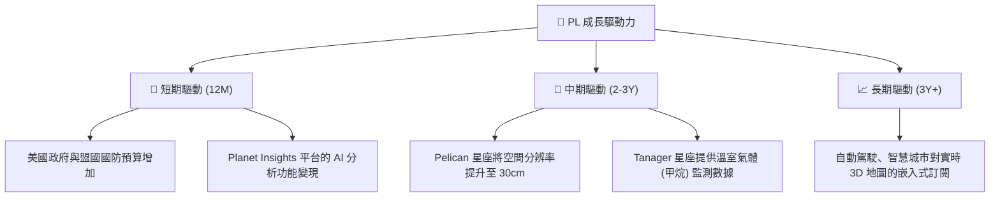

---

## 9. 風險矩陣

### 9.1 風險評分矩陣

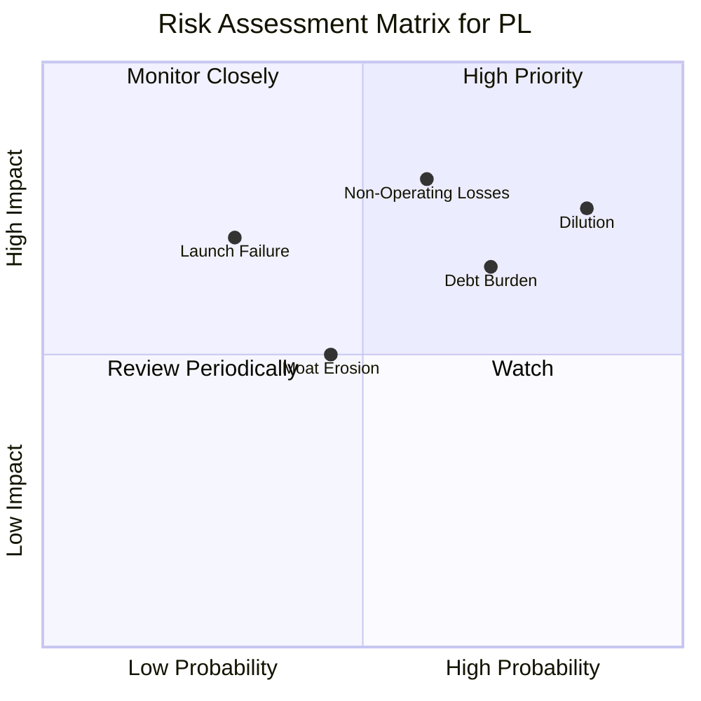

### 9.2 風險清單詳細分析

| # | 風險項目 | 發生機率 | 財務衝擊 | 風險評分 | 緩解措施 / 監控指標 |
|---|---|---|---|---|---|
| 1 | 🔴 **非經營性資產大額減值** | 高 (75%) | 高 (-15% 淨利) | 🔴 8.5/10 | 監控每季 Non-Operating Income 項目，防範金融衍生品或併購商譽暴雷。 |
| 2 | 🔴 **股本持續稀釋 (SBC)** | 極高 (90%) | 中 (-5% EPS) | 🔴 7.8/10 | 關注 Basic Shares Outstanding 的季度增長率，若年稀釋 > 8% 應減碼。 |
| 3 | 🟡 **財務利息支出蠶食現金** | 中 (60%) | 中 (-8% OCF) | 🟡 6.5/10 | 監控新增發債合約的利率條款，以及利息保障倍數是否進一步惡化。 |
| 4 | 🟡 **發射失敗或星座部署延遲** | 低 (30%) | 高 (-20% 營收) | 🟡 5.5/10 | 關注 SpaceX 等發射夥伴的發射成功率，以及 PL 的衛星保險覆蓋率。 |

---

## 10. 投資建議

### 10.1 最終綜合評級

```
╔══════════════════════════════════════════════════════════════╗
║                    PL 最終投資評級雷達                       ║
╠══════════════════════════════════════════════════════════════╣
║                                                              ║
║  營收成長性：  8.0/10  ▓▓▓▓▓▓▓▓▓▓▓▓▓▓▓▓▓▓░░  🟢 強勁         ║
║  現金流品質：  7.0/10  ▓▓▓▓▓▓▓▓▓▓▓▓▓▓░░░░░░  🟢 轉正         ║
║  資產健康度：  5.5/10  ▓▓▓▓▓▓▓▓▓▓▓▓░░░░░░░░  🟡 債務偏高     ║
║  獲利能力：    2.0/10  ▓▓▓▓░░░░░░░░░░░░░░░░  🔴 嚴重虧損     ║
║  估值合理性：  3.0/10  ▓▓▓▓▓▓░░░░░░░░░░░░░░  🔴 溢價過高     ║
║                                                              ║
║  🏆 綜合評分： 5.1/10  ｜  建議評級：🟡 持有 (Hold)           ║
╚══════════════════════════════════════════════════════════════╝
```

### 10.2 目標價與隱含報酬率

| 情境 | 權機率 | 目標價 | 隱含報酬率 | 投資策略建議 |
|---|---|---|---|---|
| 🔴 **悲觀情境** | 25% | $12.50 | -44.1% | 若跌破 $15.00 且基本面惡化，應果斷止損。 |
| 🟡 **基準情境** | **55%** | **$25.00** | **+11.7%** | 當前股價接近基準目標，建議觀望，不宜追高。 |
| 🟢 **樂觀情境** | 20% | $40.10 | +79.2% | 若每季毛利率突破 60% 且淨利轉正，可加碼至「買入」。 |

### 10.3 買入時機與觸發因素

```
╔══════════════════════════════════════════════════════════════════╗
║                  ✅ PL 投資決策 Checklist                        ║
╠══════════════════════════════════════════════════════════════════╣
║                                                                  ║
║  立即買入觸發條件（需多數符合）：                                ║
║  ☐ 股價拉回至 $18.00 以下（對應 TTM P/S < 15x）                  ║
║  ☐ 季度非經營性損益收窄至 $-1,000 萬以內                         ║
║  ☐ Pelican 星座首批衛星成功入軌並傳回首幅 30cm 圖像              ║
║                                                                  ║
║  加碼觸發條件：                                                  ║
║  ☐ 聯邦政府簽署單筆金額超過 $1 億的長期訂閱合約                  ║
║  ☐ 季度毛利率（GAAP）連續兩季站穩 58% 以上                       ║
║                                                                  ║
║  減碼/停損觸發條件：                                             ║
║  ☒ Basic Shares Outstanding 季度環比成長超過 3%（稀釋加速）     ║
║  ☒ 自由現金流（FCF）重新轉為負值                                 ║
╚══════════════════════════════════════════════════════════════════╝
```

### 10.4 投資人適配度分析

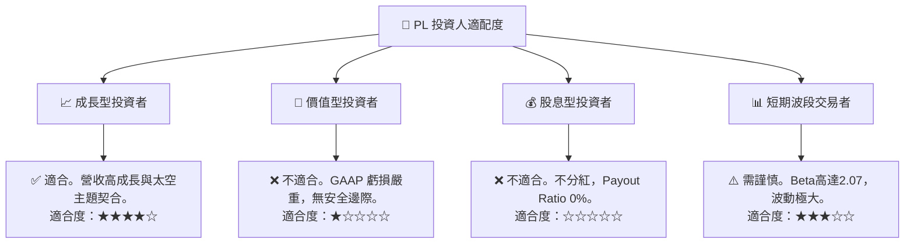

### 10.5 每季財報監控清單（Quarterly Watch List）

在未來的季度財報中，投資人應重點監控以下核心指標，以驗證本報告的基準假設是否成立：

1. **營收 YoY 成長率**：基準線為 **30%**。若連續兩季低於 25%，表明政府或商業市場滲透遭遇瓶頸，多頭論點失效。
2. **非經營性損益 (Other Non-Operating Income/Expense)**：每季應小於 **$-1,500 萬**。若持續出現數千萬至上億美元的虧損，表明公司內部金融管理或歷史投資減值仍未結束，將持續壓抑估值。
3. **自由現金流 (FCF)**：必須維持**正值**。若因 Capex 激增或 OCF 惡化導致 FCF 重新轉負，將嚴重打擊市場信心。
4. **股本稀釋速度 (SBC / Revenue)**：應控制在 **15% 以下**。若 SBC 佔比重新抬頭，現有股東的每股價值將被嚴重稀釋。

### 10.6 反面論證：什麼會證明論點錯誤

```
╔══════════════════════════════════════════════════════════════════╗
║              ⚠️ 論點失效條件（Disconfirming Evidence）           ║
╠══════════════════════════════════════════════════════════════════╣
║  本投資報告的「持有」評級，在下列情況發生時應下調為「賣出」：    ║
║                                                                  ║
║  ☐ 營收 YoY 成長率連續兩季跌破 20%                              ║
║  ☐ TTM 自由現金流（FCF）重新轉負，且持續惡化                    ║
║  ☐ 總債務進一步飆升至 $6.0 億以上，且利息支出佔 OCF 比重 > 20%   ║
║  ☐ Pelican 衛星因技術故障延遲發射超過 12 個月                   ║
║  ☐ 競爭對手（如 BlackSky 或 Maxar）推出更具價格競爭力的同類產品 ║
╚══════════════════════════════════════════════════════════════════╝
```

---

> **免責聲明**：本報告為基於公開財務數據之獨立研究分析，僅供學術與投資研究參考，不構成任何買賣證券之投資建議。投資有風險，入市需謹慎。分析師持有 CFA 資格，並力求數據之準確性，惟不對因使用本報告數據而導致的任何直接或間接損失承擔責任。