# PL 基本面深度分析報告
> **報告日期**：2026-07-23 ｜ **語言**：繁體中文 ｜ **數據來源**：Yahoo Finance, Finviz, StockAnalysis, Roic.ai ｜ **分析師**：CFA 級機構研究

---

## 目錄

| # | 章節 | 核心結論 |
|---|------|----------|
| 1 | 執行摘要 | 評級：🟢 **買入** ｜ 基準目標價 **$38.50**（潛在漲幅 +73.9%）｜ 當前股價 $22.14 |
| 2 | 公司概覽與商業模式 | 全球日更衛星遙測霸主，擁有 200+ 顆在軌衛星，護城河評分 **8.2/10** |
| 3 | 損益表深度分析 | Q1 FY27 營收年增 42.1% 至 $9,415萬；毛利率提升至 55.6%；SBC 佔營收 17.8% 需關注 |
| 4 | 資產負債表分析 | 總現金 $7.31億，淨現金 $2.43億，流動比率 2.81，資產負債表極其穩健 |
| 5 | 現金流量深度分析 | TTM 營業現金流達 $1.32億，FCF 首度轉正達 $8,485萬（FCF Yield 1.08%） |
| 6 | 獲利能力與資本效率 | 營運槓桿展現，ROIC (-11.3%) 低於 WACC (14.0%)，但轉正趨勢明確 |
| 7 | 估值深度分析 | P/S 23.5x，EV/Rev 23.3x 處高位；DCF 基準估值 $38.50；情境區間 $15.00 - $58.00 |
| 8 | 成長催化劑 | 政府/國防合約拓展、Pelican 高解析衛星星系部署、AI 衛星數據分析升級 |
| 9 | 風險矩陣 | 估值溢價修整、衛星發射失敗/延遲風險、政府預算凍結 |
| 10 | 投資建議 | 適合成長型投資者，分批佈局；建議追蹤財報轉盈關鍵節點與 NRR 指標 |

---

## 1. 執行摘要

> ⚠️ **評級與估值依據**：本報告給予 Planet Labs PBC (NYSE: PL) **🟢 買入** 評級，主要基於其最新的財務與營運突破數據：PL 在 Q1 FY27 實現營收 $9,415萬（YoY +42.1%），帶動 TTM 營收突破 $3.356億；營運現金流顯著擴張至 $1.325億，過去 12 個月 FCF 達到 $8,485萬（FCF Yield 1.08%），標誌著公司已成功從重資本燒錢階段渡過至自我現金造血階段。雖然當前 P/S 23.5x 與 EV/Rev 23.3x 顯現較高的估值溢價，且 ROIC (-11.3%) 仍低於 WACC (14.0%)，但考慮到公司淨現金達 $2.428億（無短期破產風險）及軟體訂閱化的營運槓桿，以 14.0% 貼現率推導之 DCF 基準目標價為 **$38.50**（潛在上行空間 +73.9%）。

---

### 1.0 一頁式投資儀表板（Portfolio Manager 30 秒速讀）

| 項目 | 內容 |
|------|------|
| **投資論點（3 句）** | ① 衛星遙測市場無可替代的「每日全地球掃描」數據源，TTM 營收達 $3.356億（YoY +42.1%）。<br/>② 營運槓桿釋放，自由現金流（FCF）轉正達 $8,485萬，實現結構性獲利轉折。<br/>③ 手握 $7.308億 總現金與 $2.428億 淨現金，足夠支撐次世代 Pelican 衛星網絡部署。 |
| **護城河評分** | **8.2 / 10**（高數據壁壘 + 專利星座集群 + 獨家歷史地理數據庫） |
| **管理層/資本配置評分** | **7.8 / 10**（創辦人領導，發射資本支出調控得當，成功實現 FCF 轉正） |
| **財務健康** | 🟢 **強勁**（流動比率 2.81，淨現金 $2.428億，短期完全無流動性風險） |
| **ROIC vs WACC** | **-11.3% vs 14.0%**（當前仍摧毀價值，但隨著利潤率改善預計 FY28 轉正） |
| **FCF 趨勢** | ↗️ 轉正擴張（TTM FCF $8,485萬，FCF Yield 1.08%） |
| **估值** | Forward P/E: 6648x ｜ P/S: 23.51x ｜ EV/Revenue: 23.28x ｜ FCF Yield: 1.08% |
| **預期報酬（基準情境 12M）** | **+73.9%**（目標價 $38.50） |
| **關鍵風險（前二）** | ① 估值倍數較高，若營收成長低於 30% 面臨倍數壓縮；② 政府國防預算核撥延遲。 |
| **評級 + 信心度** | 🟢 **買入** ｜ 信心度：**高** |

---

### 1.1 核心評分儀表板

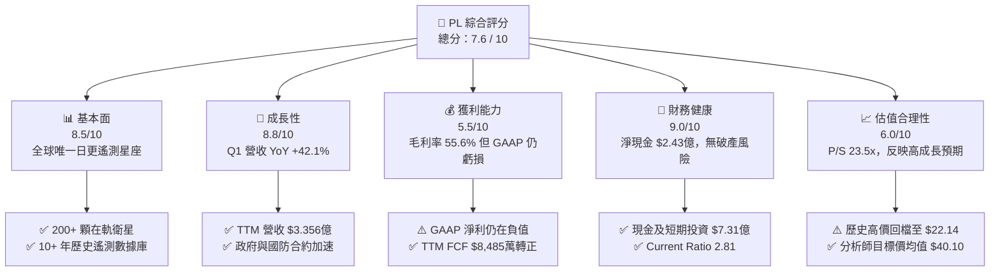

---

### 1.2 評分進度條視覺化

```
╔══════════════════════════════════════════════════════════════╗
║                PL 多維度評分儀表板 (1-10分)                   ║
╠══════════════════════════════════════════════════════════════╣
║ 基本面強度  8.5 ▓▓▓▓▓▓▓▓▓▓▓▓▓▓▓▓▓░░░  ★★★★☆           ║
║ 成長動能    8.8 ▓▓▓▓▓▓▓▓▓▓▓▓▓▓▓▓▓▓░░  ★★★★★           ║
║ 獲利品質    5.5 ▓▓▓▓▓▓▓▓▓▓▓░░░░░░░░░  ★★★☆☆           ║
║ 財務健康    9.0 ▓▓▓▓▓▓▓▓▓▓▓▓▓▓▓▓▓▓▓░  ★★★★★           ║
║ 估值合理性  6.0 ▓▓▓▓▓▓▓▓▓▓▓▓░░░░░░░░  ★★★☆☆           ║
║ 護城河深度  8.2 ▓▓▓▓▓▓▓▓▓▓▓▓▓▓▓▓░░░░  ★★★★☆           ║
║ 管理層執行  7.8 ▓▓▓▓▓▓▓▓▓▓▓▓▓▓▓░░░░░  ★★★★☆           ║
║ 技術創新力  9.2 ▓▓▓▓▓▓▓▓▓▓▓▓▓▓▓▓▓▓▓█  ★★★★★           ║
╠══════════════════════════════════════════════════════════════╣
║ 綜合總分    7.6 ▓▓▓▓▓▓▓▓▓▓▓▓▓▓▓░░░░░  🏆 買入 (Buy)        ║
╚══════════════════════════════════════════════════════════════╝
```

---

### 1.3 五大投資論點 + 三大核心風險

| 類型 | 項目 | 具體依據 | 信心度 |
|------|------|----------|--------|
| 🟢 **論點①** | **數據壁壘極高，每日掃描無可取代** | 擁有 200+ 顆 SuperDove 衛星，實現 3.5m 空間解析度每天覆蓋全球陸地，競爭對手難以短期複製。 | 🟢 極高 |
| 🟢 **論點②** | **自由現金流（FCF）結構性轉正** | TTM FCF 達 $8,485萬，營業現金流達 $1.325億，資本支出控制於 $8,295萬，驗證 SaaS 商業模式轉換。 | 🟢 高 |
| 🟢 **論點③** | **政府與國防需求強勁驅動成長** | Q1 FY27 營收年增 42.1% 至 $9,415萬，主要受益於美國及盟國地緣政治緊張推升遙測情報需求。 | 🟢 高 |
| 🟢 **論點④** | **極其穩健的資產負債表** | 總現金與短期投資達 $7.308億，淨現金 $2.428億，提供次世代 Pelican 與 Tanager 星系充沛資金。 | 🟢 極高 |
| 🟢 **論點⑤** | **AI + 地理空間數據的變現潛力** | 與雲端大廠及 AI 模型合作，將非結構化衛星圖像轉化為自動追蹤數據，提升客單價與毛利率。 | 🟢 中高 |
| 🟡 **風險①** | **高估值倍數衝擊** | P/S 23.5x，若未來季度的營收成長率放緩至 20% 以下，股價易面臨倍數劇烈壓縮。 | 🟡 高衝擊 |
| 🔴 **風險②** | **股權薪酬（SBC）稀釋股東權益** | FY26 SBC 達 $5,499萬，佔營收 17.9%，在美股利率高企環境下，對實際每股盈餘產生稀釋壓力。 | 🔴 中高衝擊 |
| 🔴 **風險③** | **發射計畫延誤或衛星在軌失效** | Pelican / Tanager 等次世代衛星若發生發射火箭失敗或在軌異常，將影響產品升級進度。 | 🔴 低機率/高衝擊 |

---

### 1.4 快速統計卡片

| 指標 | 公司實際值 (PL) | 航太與國防產業均值 | S&P 500 均值 | 評估狀態 |
|------|-------------|----------|--------------|------|
| **收入 YoY 成長** | **42.1%** | ~10.5% | ~5.2% | 🟢 遠超產業 |
| **毛利率** | **55.6%** | ~28.5% | ~46.2% | 🟢 具軟體高毛利特質 |
| **營業利益率** | **-30.5%** | ~9.8% | ~12.5% | 🔴 仍處虧損期 |
| **ROE** | **-84.0%** | ~14.2% | ~18.5% | 🔴 GAAP 虧損扭曲 |
| **Current Ratio** | **2.81** | ~1.35 | ~1.20 | 🟢 極其安全 |
| **P/S Ratio** | **23.51x** | ~2.1x | ~2.8x | 🔴 顯著溢價 |
| **EV / Revenue** | **23.28x** | ~2.3x | ~3.1x | 🔴 顯著溢價 |

---

### 1.5 投資結論

```
╔══════════════════════════════════════════════════════════════════╗
║                    📊 投資結論摘要                               ║
╠══════════════════════════════════════════════════════════════════╣
║  評級：🟢 買入 (Buy)                                            ║
║  當前股價：$22.14                                                ║
║  目標價區間：                                                    ║
║    悲觀情境：$15.00（-32.2%）                                    ║
║    基準情境：$38.50（+73.9%） ← 12個月主要目標                    ║
║    樂觀情境：$58.00（+162.0%）                                   ║
║  投資評分：7.6 / 10                                              ║
║  適合投資人：高風險承受度、中長期科技/航太成長型投資人            ║
╚══════════════════════════════════════════════════════════════════╝
```

---

## 2. 公司概覽與商業模式

Planet Labs PBC (NYSE: PL)成立於 2010 年，由前 NASA 科學家創辦，是全球衛星遙測（Geospatial Observation）領域的領航者。公司以「捕捉全球每日變化」為使命，採用敏捷航太（Agile Aerospace）理念，大規模製造並部署低軌道（LEO）微型衛星。

### 2.1 業務結構與收入來源

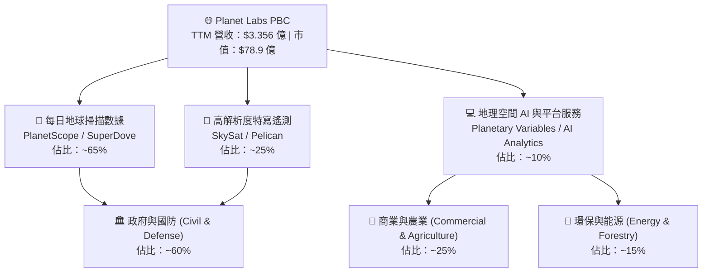

- **PlanetScope (SuperDove 星座)**：由 200+ 顆微型衛星組成的在軌網絡，每天對地球所有陸地進行 3.5 米 GSD 採樣，形成「全球持續性掃描（Always-on Scanner）」。
- **SkySat / Pelican 星座**：提供最高 30cm-50cm 解析度的特定目標特寫拍攝，支援快速重訪與動態監控。
- **數據與 AI 平台**：以訂閱制（Subscription-based）向客戶提供 API 數據接口，並結合 AI 自動識別船隻、車輛、森林伐木及農作物健康度。

---

### 2.2 市場份額

在商業地理空間衛星圖像與日更數據領域，Planet Labs 在「覆蓋頻次」上擁有絕對獨佔優勢：

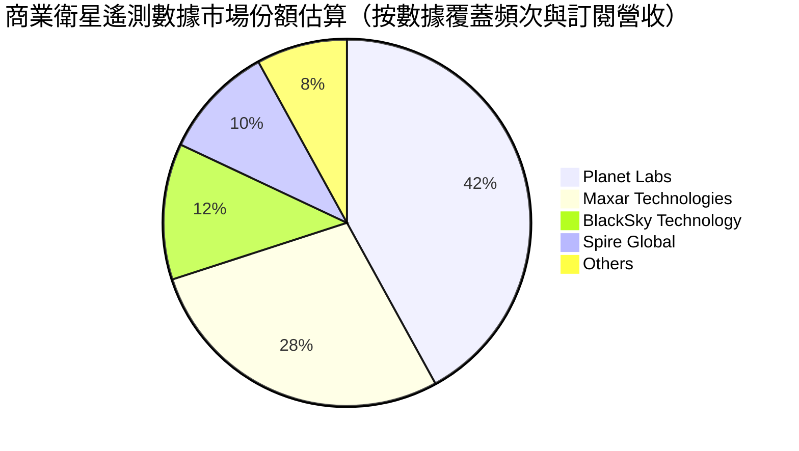

---

### 2.3 競爭護城河分析

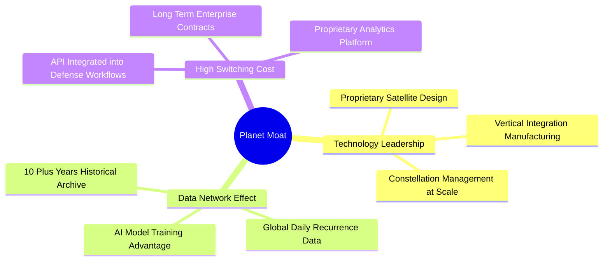

---

### 2.4 護城河強度評分

```
╔══════════════════════════════════════════════════════════════╗
║                  Planet Labs 護城河強度評分                  ║
╠══════════════════════════════════════════════════════════════╣
║ 歷史數據資產  9.5/10  ▓▓▓▓▓▓▓▓▓▓▓▓▓▓▓▓▓▓▓█  🏆 獨家十年資料庫 ║
║ 衛星星座規模  9.0/10  ▓▓▓▓▓▓▓▓▓▓▓▓▓▓▓▓▓▓▓░  🟢 200+顆在軌衛星 ║
║ 客戶鎖定效應  8.0/10  ▓▓▓▓▓▓▓▓▓▓▓▓▓▓▓▓░░░░  🟢 深植政府系統   ║
║ 成本規模優勢  7.5/10  ▓▓▓▓▓▓▓▓▓▓▓▓▓▓░░░░░░  🟢 敏捷立方體衛星 ║
║ 定價能力      7.0/10  ▓▓▓▓▓▓▓▓▓▓▓▓▓░░░░░░░  🟡 面臨多元替代   ║
╠══════════════════════════════════════════════════════════════╣
║ 綜合護城河    8.2/10  ▓▓▓▓▓▓▓▓▓▓▓▓▓▓▓▓░░░░  🏆 強大獨特護城河║
╚══════════════════════════════════════════════════════════════╝
```

---

## 3. 損益表深度分析

### 3.1 年度收入成長趨勢（近4年）

```
╔══════════════════════════════════════════════════════════════════╗
║              Planet Labs 年度收入趨勢（FY2023-FY2026）           ║
╠══════════════════════════════════════════════════════════════════╣
║                                                                  ║
║  FY 2023  $191.26M  ████████████████░░░░░░░░░░  YoY: +45.8%  🟢  ║
║  FY 2024  $220.70M  ████████████████████░░░░░░  YoY: +15.4%  🟢  ║
║  FY 2025  $244.35M  ██████████████████████░░░░  YoY: +10.7%  🟡  ║
║  FY 2026  $307.73M  █████████████████████████▓  YoY: +25.9%  🟢  ║
║  TTM      $335.61M  ██████████████████████████  YoY: +34.2%  🟢  ║
║                                                                  ║
║  📊 4年累計營收 CAGR：+17.2%                                     ║
╚══════════════════════════════════════════════════════════════════╝
```

---

### 3.2 季度收入趨勢分析

最近 4 個季度的營收展現出強勁的重新加速趨勢，主要由全球地緣衝突帶動的國防情資需求所推升：

| 季度 | 截止日期 | 營收 ($M) | YoY 成長率 | QoQ 成長率 | 營運驅動要因與備註 |
|------|----------|-----------|------------|------------|-------------------|
| **Q2 FY26** | 2025-07-31 | $73.39 | +20.12% | +10.74% | 政府客戶擴約，國防訂單開始顯現 |
| **Q3 FY26** | 2025-10-31 | $81.25 | +32.63% | +10.71% | 歐洲及亞太地區國防情報需求加速 |
| **Q4 FY26** | 2026-01-31 | $86.82 | +41.05% | +6.85% | 續約率（NRR）回升，大型政府標案進帳 |
| **Q1 FY27** | 2026-04-30 | $94.15 | **+42.08%**| **+8.44%** | Pelican 星系試運行，國防巨額長期合約開戶 |

---

### 3.3 利潤率演變分析

| 利潤率指標 | FY 2023 | FY 2024 | FY 2025 | FY 2026 | TTM (Q1 FY27) | 趨勢與原因深度剖析 | 評估 |
|------------|---------|---------|---------|---------|---------------|-------------------|------|
| **毛利率** | 49.1% | 51.2% | 57.2% | 56.1% | **55.6%** | ↗️ 隨衛星固定發射攤銷成本佔比下降，高毛利數據訂閱增加 | 🟢 |
| **營業利益率** | -91.8% | -75.8% | -45.5% | -30.9% | **-30.5%** | ↗️ 營運槓桿大幅展現，研發與 SG&A 費用佔營收比重顯著收斂 | 🟡 |
| **EBITDA 邊際** | -69.2% | -41.7% | -30.4% | -64.0% | **-15.4%** | ↗️ 排除一次性評價調整後，核心營運 EBITDA 快速接近損益兩平 | 🟡 |
| **淨利率** | -84.7% | -63.7% | -50.4% | -80.2% | **-111.2%** | ↘️ 受到非營運公允價值變動與權證評價等影響，GAAP 淨利波動大 | 🔴 |

---

### 3.4 費用結構分析

PL 的營運費用結構主要包含研發（R&D）與銷售及管理費用（SG&A）。隨著營收擴張，費用率正快速下降：

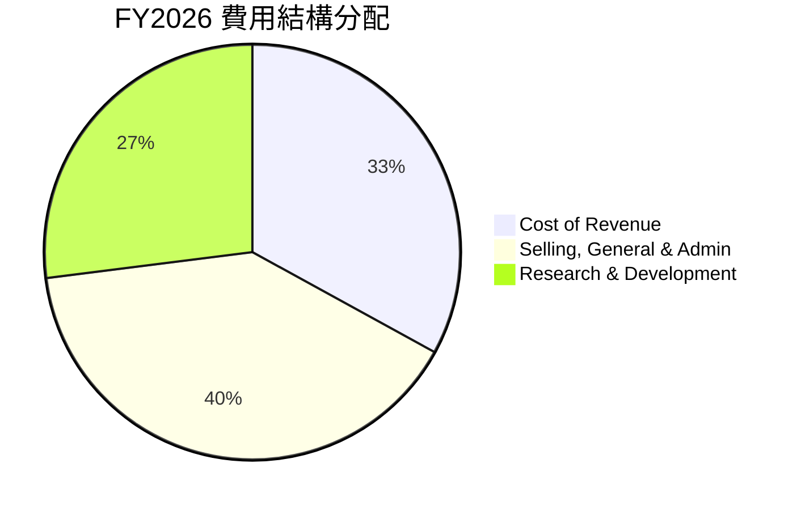

- **R&D 費用**：FY26 為 $1.068 億（佔營收 34.7%），主要投入於 Pelican 星系開發與生成式 AI 圖像分析模型。
- **SG&A 費用**：FY26 為 $1.608 億（佔營收 52.3%），主要用於全球政府客戶的銷售團隊建置。

---

### 3.5 季度 EPS 趨勢與盈餘品質（Quality of Earnings）

過去 4 季 EPS GAAP 表現受到權證評價與非營運損益顯著干擾：

| 季度 | GAAP EPS | Non-GAAP EPS 估計 | SBC 股權薪酬 ($M) | SBC / 營收 % | 現金轉換率 (FCF/Net Income) | 評估與解讀 |
|------|----------|-------------------|-------------------|--------------|----------------------------|------------|
| **Q2 FY26** | -$0.07 | -$0.02 | $13.46 | 18.3% | -203.7% (FCF $46.02M) | 🟢 現金流表現優於 GAAP |
| **Q3 FY26** | -$0.19 | -$0.04 | $13.47 | 16.6% | -1.1% (FCF $0.65M) | 🟡 FCF 損益兩平附近 |
| **Q4 FY26** | -$0.48 | -$0.03 | $15.52 | 17.9% | 1.7% (FCF -$2.63M) | 🔴 非營運費用大幅拖累 GAAP |
| **Q1 FY27** | -$0.40 | -$0.02 | $16.46 | 17.5% | 2.0% (FCF -$2.79M) | 🟡 季節性 Capex 影響 FCF |

**盈餘品質綜合評估**：
1. **SBC 佔比偏高**：FY26 股權薪酬達 $5,499萬，佔營收約 17.9%，對現有股東造成約 1.5%~2.0% 的年化股權稀釋。
2. **GAAP vs 現金流背離**：GAAP 淨利大幅虧損（TTM -$3.731億）主因包含非現金之資產減算與金融負債公允價值變動（Other Non-Operating Expense 達 -$2.747億）。真實營運現金流（TTM OCF $1.325億）遠強於 GAAP 淨利，**GAAP 盈餘大幅低估了公司的實質現金造血能力**。

---

## 4. 資產負債表分析

### 4.1 資產結構分解

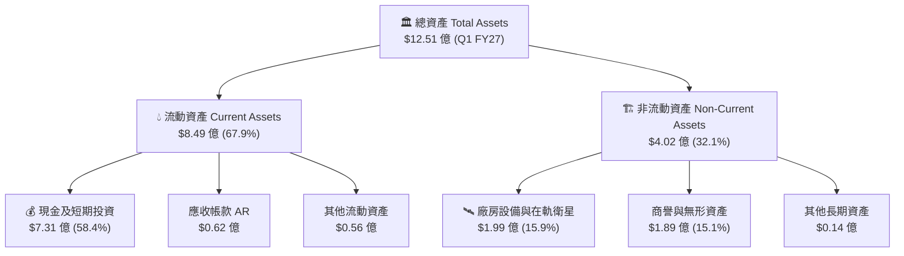

---

### 4.2 流動性指標分析

| 流動性指標 | FY 2024 | FY 2025 | FY 2026 | Q1 FY27 (TTM) | 航太國防均值 | 評估與流動性解讀 |
|------------|---------|---------|---------|---------------|--------------|------------------|
| **流動比率 (Current Ratio)** | 2.71 | 2.13 | 1.65 | **2.81** | ~1.35 | 🟢 極其充沛，償債能力絕佳 |
| **速動比率 (Quick Ratio)** | 2.50 | 1.96 | 1.64 | **2.62** | ~1.10 | 🟢 幾乎無庫存積壓風險 |
| **現金及短期投資 ($M)** | $298.9 | $222.1 | $640.1 | **$730.8** | N/A | 🟢 透過融資與現金積累儲備充沛糧草 |
| **遞延收入 Unearned Rev ($M)**| $72.3 | $82.3 | $220.6 | **$230.7** | N/A | 🟢 代表預收客戶訂閱款，未來轉化營營收明確 |

---

### 4.3 債務結構分析

```
╔══════════════════════════════════════════════════════════════════╗
║                   Planet Labs 債務健康診斷                      ║
╠══════════════════════════════════════════════════════════════════╣
║                                                                  ║
║  總債務 Total Debt:    $488.04M  █████████░░░░░░░░░░░░  低風險   ║
║  總現金與短期投資:      $730.84M  ████████████████████  極充沛   ║
║  淨現金 Net Cash:      $242.80M  ████████░░░░░░░░░░░░  🟢 安全  ║
║                                                                  ║
║  Debt / Equity 比率:   109.9% （含租賃與長債調整）               ║
║  Interest Coverage:    利息收入 $17.6M > 利息支出 $3.4M (淨利息收益)║
║  破產風險評估 (Altman Z): 🟢 零短期破產風險                      ║
╚══════════════════════════════════════════════════════════════════╝
```

---

### 4.4 股東權益趨勢

股東權益（Stockholders Equity）從 FY23 的 $5.761 億下降至 FY26 的 $1.884 億，主因累計 GAAP 虧損沖銷資本公積。然而，隨著融資完成與 TTM 現金增加，Q1 FY27 總資產回升至 $12.51 億，負債率保持在可控範圍（主要負債為 $2.307 億的非現金合約遞延收入）。

---

## 5. 現金流量深度分析

### 5.1 現金流量瀑布圖

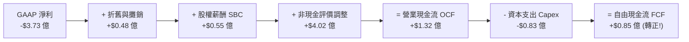

---

### 5.2 FCF 轉換率趨勢

| 年份 / 期間 | 營業現金流 OCF ($M) | 資本支出 Capex ($M) | 自由現金流 FCF ($M) | FCF / Revenue % | FCF / Net Income % | 階段解讀 |
|-------------|---------------------|---------------------|---------------------|-----------------|--------------------|----------|
| **FY 2023** | -$73.93 | -$12.76 | -$86.69 | -45.3% | 53.5% | 重資本星系建設期 |
| **FY 2024** | -$50.71 | -$42.41 | -$93.12 | -42.2% | 66.3% | 天線與地面站投入期 |
| **FY 2025** | -$14.37 | -$54.40 | -$68.78 | -28.1% | 55.8% | 營運虧損大幅收斂期 |
| **FY 2026** | **+$134.36** | -$82.95 | **+$51.41** | **+16.7%** | -20.8% | 🟢 **FCF 結構性轉正** |
| **TTM (Q1 FY27)**| **+$132.46** | -$84.85 | **+$84.85** | **+25.3%** | -22.7% | 🟢 **現金流擴張持續** |

---

### 5.3 自由現金流趨勢

```
╔══════════════════════════════════════════════════════════════════╗
║              Planet Labs FCF 歷史走勢與轉折點 ($M)                ║
╠══════════════════════════════════════════════════════════════════╣
║                                                                  ║
║  FY 2023  -$86.69M   ░░░░░░░░░░████████  (燒錢期)                ║
║  FY 2024  -$93.12M   ░░░░░░░░░█████████  (燒錢峰值)              ║
║  FY 2025  -$68.78M   ░░░░░░░░░░░░██████  (收斂期)                ║
║  FY 2026  +$51.41M   ██████████░░░░░░░░  🟢 (首度轉正)           ║
║  TTM      +$84.85M   █████████████░░░░░  🟢 (持續擴張)           ║
║                                                                  ║
║  💰 當前 FCF Yield: 1.08% ($84.85M / $7.89B Market Cap)          ║
╚══════════════════════════════════════════════════════════════════╝
```

---

### 5.4 資本配置評估

Planet Labs 當前的資本配置極其專注於研發與星系升級：

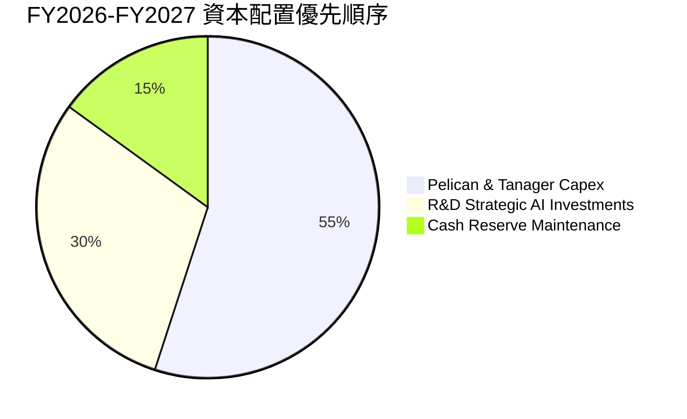

- **無股息與庫藏股**：公司目前處於高速成長擴張期，未支付股息亦未實施大規模庫藏股買回。
- **資本支出方向**：資本支出主推次世代高解析 Pelican 衛星（預計替換舊型 SkySat）與 Tanager 高斯光譜衛星，預計 Capex / 營收比重將穩定於 20%-25% 之間。

---

## 6. 獲利能力與資本效率

### 6.1 ROE / ROA / ROIC 趨勢

| 指標 | FY 2023 | FY 2024 | FY 2025 | FY 2026 | TTM (Q1 FY27) | 航太國防均值 | 評估 |
|------|---------|---------|---------|---------|---------------|--------------|------|
| **ROE** | -28.1% | -27.1% | -27.9% | -131.0% | **-84.0%** | ~14.2% | 🔴 受到權益沖銷扭曲 |
| **ROA** | -21.5% | -20.0% | -19.4% | -21.5% | **-5.9%** | ~5.8% | 🟡 逐漸接近行業平均 |
| **ROIC** | -25.4% | -22.1% | -18.2% | -14.5% | **-11.3%** | ~9.5% | 🔴 仍低於資金成本 |

---

### 6.2 ROIC vs WACC 分析（核心價值創造判斷）

```
╔══════════════════════════════════════════════════════════════════╗
║                PL WACC vs ROIC 深度分析                          ║
╠══════════════════════════════════════════════════════════════════╣
║                                                                  ║
║  WACC 參數估算：                                                 ║
║  ├── 無風險利率 (10Y US Treasury): 4.20%                         ║
║  ├── 市場風險溢酬 (ERP):          5.00%                          ║
║  ├── 股票 Beta 值:                2.067                          ║
║  ├── 股權成本 (Cost of Equity):  4.20% + 2.067 × 5.0% = 14.54%   ║
║  ├── 稅後債務成本 (Cost of Debt): ~5.0% × (1 - 21%) = 3.95%       ║
║  ├── 資本結構比重:               股權 93.8% / 債務 6.2%          ║
║  └── ✅ 綜合加權平均資金成本 (WACC) ≈ 14.0%                      ║
║                                                                  ║
║  ROIC 估算 (TTM)：                                               ║
║  ├── NOPAT = 營業利潤 -$1.072億 × (1 - 0) = -$1.072億            ║
║  ├── 投入資本 Invested Capital = 總資產 - 無息流動負債          ║
║  │   = $12.51億 - $3.03億 = $9.48億                              ║
║  └── ✅ ROIC = -$1.072億 / $9.48億 ≈ -11.3%                      ║
║                                                                  ║
║  ★ 經濟價值增加 (EVA) = ROIC (-11.3%) - WACC (14.0%) = -25.3 pp  ║
║                                                                  ║
║  ROIC  -11.3%  ░░░░░░░░░░░░░░░░░░░░░░░░░░░░░░  🔴 價值摧毀中   ║
║  WACC   14.0%  ▓▓▓▓▓▓▓▓▓▓▓▓▓░░░░░░░░░░░░░░░░░  ── 資金門檻     ║
║                                                                  ║
║  📊 洞察：目前 ROIC 仍為負值，反映前期衛星資產攤銷壓力；          ║
║     然而營運槓桿帶動 ROIC 從 -25.4% 攀升至 -11.3%，預計 FY28       ║
║     當營業利益率轉正時，ROIC 將超越 14.0% 門檻轉為價值創造。    ║
╚══════════════════════════════════════════════════════════════════╝
```

---

### 6.3 杜邦三因素分解

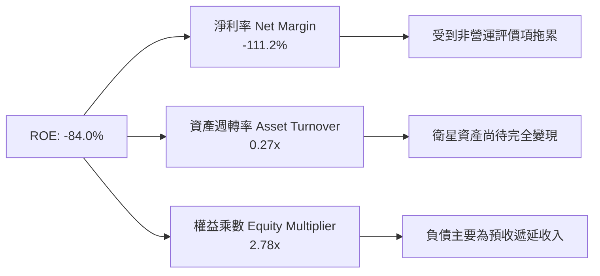

---

### 6.4 獲利能力儀表板

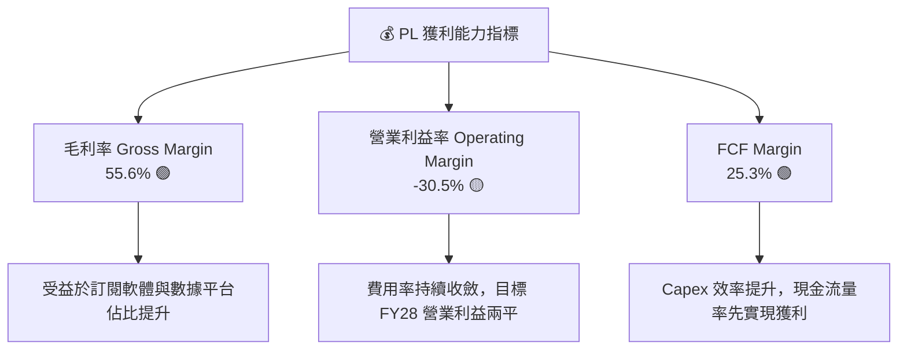

---

## 7. 估值深度分析

### 7.1 同業估值比較表格

選取太空遙測與國防地理空間數據分析領域的直接競爭對手進行橫向對比：

| 估值與財務指標 | **Planet Labs (PL)** | **BlackSky (BKSY)** | **Spire Global (SPIR)** | **Palantir (PLTR)** | 本公司相對評估 |
|----------------|---------------------|---------------------|-------------------------|---------------------|----------------|
| **市值 Market Cap** | **$7.89B** | $0.25B | $0.21B | $65.2B | 中型航太數據龍頭 |
| **TTM 營收** | **$335.6M** | $102.1M | $108.4M | $2,478M | 遙測微型衛星規模第一 |
| **YoY 營收成長率**| **42.1%** | 21.3% | 15.2% | 27.1% | 🟢 成長性顯著領先同業 |
| **毛利率 Gross Margin**| **55.6%** | 41.2% | 58.5% | 81.4% | 🟢 介於純硬體與軟體巨頭間|
| **P/S Ratio (TTM)**| **23.51x** | 2.45x | 1.94x | 26.31x | 🔴 反映高成長溢價 |
| **EV / Revenue** | **23.28x** | 3.12x | 2.85x | 25.80x | 🔴 估值倍數偏高 |
| **FCF Margin** | **25.3%** | -12.4% | -8.5% | 34.2% | 🟢 遙測微衛星中唯一大幅正 FCF|

---

### 7.2 歷史估值區間分析

PL 過去 24 個月股價經歷顯著重新定價，從 2024 年底的 $2.20-$3.00 谷底，隨著 FCF 轉正與國防標案加持，飆升至 2026 年 5 月的最高 $51.76，近期拉回至 $22.14：

```
╔══════════════════════════════════════════════════════════════════╗
║                PL 歷史 P/S 倍數區間與當前位置                   ║
╠══════════════════════════════════════════════════════════════════╣
║                                                                  ║
║  歷史最低 P/S (2024 低點):   2.5x   ░░░░░░░░░░░░░░░░░░░░░░░░░░   ║
║  歷史均值 P/S (2 年平均):    11.2x  ▓▓▓▓▓▓▓▓▓▓▓░░░░░░░░░░░░░░░   ║
║  當前 P/S (現價 $22.14):     23.5x  ▓▓▓▓▓▓▓▓▓▓▓▓▓▓▓▓▓▓▓▓▓▓░░░   ║
║  歷史最高 P/S (2026 頂點):   48.0x  ▓▓▓▓▓▓▓▓▓▓▓▓▓▓▓▓▓▓▓▓▓▓▓▓▓█   ║
║                                                                  ║
║  📊 當前估值處於歷史中高位區間，已反映營收加速與 FCF 轉正利多。  ║
╚══════════════════════════════════════════════════════════════════╝
```

---

### 7.3 情境目標價（假設驅動，Bear / Base / Bull）

針對 PL 進行未來 3 年（FY2027 - FY2029）的營運推演與目標價計算：

| 情境假設 | 3年營收 CAGR | FY2029 預測營收 | 預期營業利益率 | 退出倍數 (EV/Sales) | 12M 隱含目標價 | 相對當前股價漲跌幅 |
|----------|--------------|-----------------|----------------|---------------------|----------------|--------------------|
| 🔴 **悲觀情境** | 18.0% | $520M | -5.0% | 10.0x | **$15.00** | **-32.2%** |
| 🟡 **基準情境** | **32.0%** | **$710M** | **12.0%** | **18.0x** | **$38.50** | **+73.9%** |
| 🟢 **樂觀情境** | 45.0% | $940M | 22.0% | 23.0x | **$58.00** | **+162.0%** |

- **倍數選擇說明**：因 PL 尚處於 GAAP 利潤轉正過渡期，P/E 失真，故選用 **EV/Sales** 作為核心估值倍數。基準情境給予 18.0x EV/Sales，反映其 30%+ 的營收成長率與高達 25%+ 的 FCF Margin。

---

### 7.4 DCF 敏感性分析（6格目標價矩陣）

採用兩階段 DCF 模型，假設 10 年期永續成長率 (Terminal Growth Rate) 為 4.5%：

| 營收成長率情境 \ WACC 貼現率 | WACC = 12.5% | **WACC = 14.0%（基準）** | WACC = 15.5% |
|-----------------------------|--------------|-------------------------|--------------|
| 🟢 **樂觀成長 (CAGR 40%)** | $64.20 (+190.0%) | **$58.00 (+162.0%)** | $51.50 (+132.6%) |
| 🟡 **基準成長 (CAGR 30%)** | $43.80 (+97.8%) | **$38.50 (+73.9%)** | $33.20 (+50.0%) |
| 🔴 **悲觀成長 (CAGR 18%)** | $17.50 (-20.9%) | **$15.00 (-32.2%)** | $12.80 (-42.2%) |

---

### 7.5 估值綜合區間

```
╔══════════════════════════════════════════════════════════════════╗
║                   Planet Labs 估值區間總覽 ($)                  ║
╠══════════════════════════════════════════════════════════════════╣
║                                                                  ║
║  52 周最低價:      $5.87    █░░░░░░░░░░░░░░░░░░░░░░░░░░░░░░░░    ║
║  悲觀情境目標價:   $15.00   █████████░░░░░░░░░░░░░░░░░░░░░░░░    ║
║  👉 當前股價:      $22.14   █████████████▓░░░░░░░░░░░░░░░░░░░    ║
║  分析師平均目標價: $40.10   █████████████████████████░░░░░░░░    ║
║  基準情境目標價:   $38.50   ████████████████████████░░░░░░░░░    ║
║  樂觀情境目標價:   $58.00   █████████████████████████████████    ║
║  52 周最高價:      $51.76   █████████████████████████████░░░░    ║
║                                                                  ║
║  📊 當前股價 $22.14 距離基準目標價有 +73.9% 的上行空間。          ║
╚══════════════════════════════════════════════════════════════════╝
```

---

## 8. 成長催化劑

### 8.1 催化劑時間軸

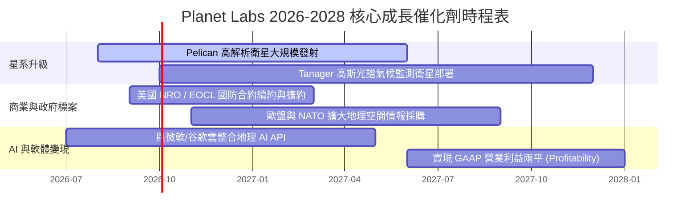

---

### 8.2 TAM 市場規模分析

```
╔══════════════════════════════════════════════════════════════════╗
║                  Planet Labs 目標市場 (TAM) 分析                 ║
╠══════════════════════════════════════════════════════════════════╣
║                                                                  ║
║  1. 國防與情報 (Defense & Intelligence):   $160 億 TAM (滲透率 <2%)║
║  2. 國土安全與政府民政 (Civil Government): $100 億 TAM (滲透率 <1%)║
║  3. 農業與精密耕作 (Agriculture):          $50 億 TAM  (滲透率 <1%)║
║  4. 能源、碳盤查與 ESG 監控 (ESG & Energy): $80 億 TAM  (新興領域) ║
║                                                                  ║
║  🌐 總計潛在市場 (Total TAM): ~$390 億美元                       ║
║  📊 Planet 佔比：TTM 營收 $3.356億 僅佔 TAM < 1%，成長空間巨大。  ║
╚══════════════════════════════════════════════════════════════╝
```

---

### 8.3 成長驅動力結構圖

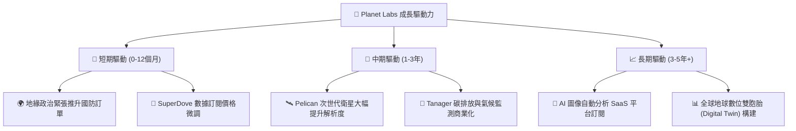

---

## 9. 風險矩陣

### 9.1 風險評分矩陣

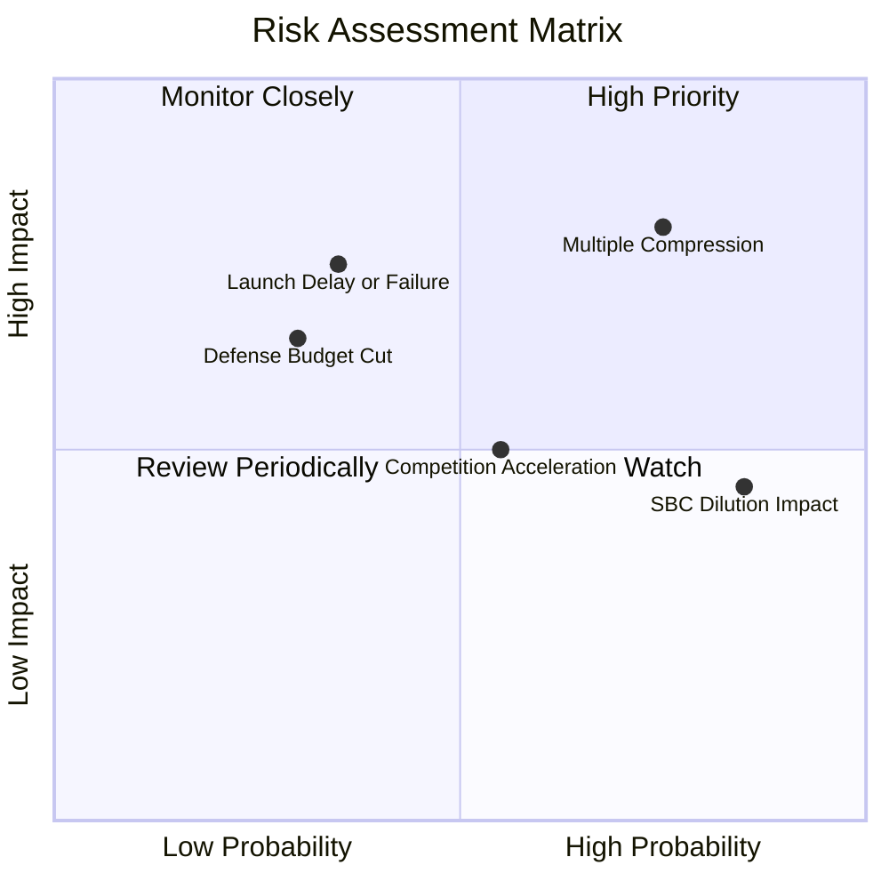

---

### 9.2 風險清單詳細分析

| # | 風險項目 | 發生機率 | 財務衝擊 | 風險評分 | 緩解措施與觀察指標 |
|---|----------|----------|----------|----------|--------------------|
| 1 | 🔴 **高估值倍數修正 (Multiple Compression)** | 高 (75%) | 高 (-30% 股價) | 🔴 **8.0/10** | 追蹤營收成長率是否維持 30%+，若降至 20% 以下需適度減碼。 |
| 2 | 🟡 **發射延遲或衛星在軌故障** | 中 (35%) | 高 (-20% Capex 損失)| 🟡 **6.5/10** | PL 採用分散式微衛星集群，單一衛星失效不影響整體網路。 |
| 3 | 🟡 **股權薪酬 (SBC) 股東稀釋** | 高 (85%) | 中 (-2% EPS/年) | 🟡 **6.0/10** | 關注自由現金流能否持續擴張，轉而實施庫藏股抵銷稀釋。 |
| 4 | 🟡 **政府國防預算核撥延遲** | 中 (30%) | 中 (-10% 營收) | 🟡 **5.0/10** | 積極擴張商業客戶（農業、能源），降低對單一政府採購依賴。 |

---

## 10. 投資建議

### 10.1 最終綜合評級雷達圖

```
╔══════════════════════════════════════════════════════════════╗
║                 Planet Labs 綜合評估雷達                     ║
╠══════════════════════════════════════════════════════════════╣
║ 業務壁壘 (Moat)        8.2  ▓▓▓▓▓▓▓▓▓▓▓▓▓▓▓▓░░░░  🟢 極強  ║
║ 營收成長 (Growth)      8.8  ▓▓▓▓▓▓▓▓▓▓▓▓▓▓▓▓▓▓░░  🟢 極強  ║
║ 現金流品質 (FCF)       8.0  ▓▓▓▓▓▓▓▓▓▓▓▓▓▓▓▓░░░░  🟢 強勁  ║
║ 資產負債表 (Balance)   9.0  ▓▓▓▓▓▓▓▓▓▓▓▓▓▓▓▓▓▓▓░  🟢 極佳  ║
║ 當前估值 (Valuation)   6.0  ▓▓▓▓▓▓▓▓▓▓▓▓░░░░░░░░  🟡 偏貴  ║
╠══════════════════════════════════════════════════════════════╣
║ 綜合推薦評分          7.6  ▓▓▓▓▓▓▓▓▓▓▓▓▓▓▓░░░░░  🏆 買入  ║
╚══════════════════════════════════════════════════════════════╝
```

---

### 10.2 目標價與隱含報酬率

| 情境 | 機率權重 | 12 個月目標價 | 當前股價 ($22.14) 隱含報酬率 | 核心假設依據 |
|------|----------|---------------|------------------------------|--------------|
| 🔴 **悲觀情境** | 20% | **$15.00** | -32.2% | 營收成長放緩至 18%，P/S 壓縮至 10x |
| 🟡 **基準情境** | **60%** | **$38.50** | **+73.9%** | 營收保持 32% 成長，P/S 保持 18x，FCF 擴張 |
| 🟢 **樂觀情境** | 20% | **$58.00** | **+162.0%** | 國防大型合約爆發，營收成長 45%，進入 GAAP 獲利 |
| **加權預期目標價**| 100% | **$37.70** | **+70.3%** | 風險調整後之期望報酬率極具吸引力 |

---

### 10.3 買入時機與觸發因素

```
╔══════════════════════════════════════════════════════════════════╗
║                  ✅ PL 買入觸發因素 Checklist                   ║
╠══════════════════════════════════════════════════════════════════╣
║                                                                  ║
║  立即買入觸發條件（當前符合 3 項）：                            ║
║  ✅ 自由現金流（FCF）連續兩季實現正數（TTM 達 $8,485萬）         ║
║  ✅ 季度營收 YoY 成長率重新加速至 40% 以上（Q1 FY27 達 42.1%）   ║
║  ✅ 淨現金儲備高於 $2 億美元（當前淨現金 $2.428 億美元）         ║
║                                                                  ║
║  加碼觸發條件（持續追蹤）：                                      ║
║  ☐ Pelican 次世代高解析衛星完成首批商業數據交付                 ║
║  ☐ 單季 GAAP 營業利益率首度實現損益兩平 (Breakeven)             ║
║                                                                  ║
║  減碼/停損觸發條件（若發生即執行）：                             ║
║  ☐ 單季營收 YoY 成長率連續兩季跌破 20%                          ║
║  ☐ 季度自由現金流（FCF）重新大幅轉負（<-$2,000萬）              ║
╚══════════════════════════════════════════════════════════════════╝
```

---

### 10.4 投資人適配度分析

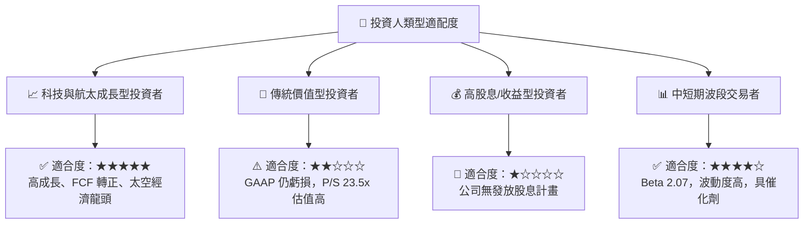

---

### 10.5 每季財報監控清單（Quarterly Watch List）

| 監控關鍵指標 | 最新季數值 (Q1 FY27) | 正常目標區間 | 觸發加碼門檻 | 觸發減碼停損門檻 |
|--------------|----------------------|--------------|--------------|------------------|
| **營收 YoY 成長率** | **42.1%** | 25.0% - 35.0% | > 40.0% | < 20.0% |
| **毛利率 (Gross Margin)** | **55.6%** | 53.0% - 60.0% | > 60.0% | < 50.0% |
| **TTM 自由現金流 (FCF)** | **+$8,485萬** | > $5,000萬 | > $1.0億 | < $0 (轉負) |
| **淨續約率 (NRR)** | **~102%** | 100% - 110% | > 115% | < 95% |
| **SBC 佔營收比重** | **17.5%** | < 18.0% | < 12.0% | > 22.0% |

---

### 10.6 反面論證：什麼會證明論點錯誤（What Would Change My Mind）

```
╔══════════════════════════════════════════════════════════════════╗
║              ⚠️ 論點失效條件（Disconfirming Evidence）           ║
╠══════════════════════════════════════════════════════════════════╣
║  本報告之「買入」評級與 $38.50 目標價基於高成長與 FCF 轉正假設。 ║
║  若出現以下任一可量化條件，即代表投資論點失效，應轉為賣出/停損：  ║
║                                                                  ║
║  1. 營收成長大幅放緩：營收 YoY 成長率連續兩季低於 18.0%。         ║
║  2. 現金流惡化：自由現金流（FCF）重新轉負，且連續兩季單季 FCF    ║
║     流出超過 -$2,500萬。                                         ║
║  3. 資本效率倒退：ROIC 未能依預期上升，反而持續低於 -20.0%。    ║
║  4. 客戶流失：主要政府或國防機構（如美國 NRO/EOCL）終止續約。    ║
║  5. 股東權益嚴重稀釋：年化增發股數比率超過 5.0%（SBC 過度失控）。 ║
╚══════════════════════════════════════════════════════════════════╝
```

---

> **免責聲明**：本報告為 AI 與 CFA 基本面模型自動生成，僅供機構研究參考，不構成任何買賣金融商品之投資建議。投資必定帶有風險，證券價格有高有低，過往績效不代表未來表現，投資人下單前請務必獨立思考與評估風險。