# PL 基本面深度分析報告
> **報告日期**：2026-07-24 ｜ **語言**：繁體中文 ｜ **數據來源**：Yahoo Finance, Finviz, StockAnalysis, Roic.ai ｜ **分析師**：CFA 級機構研究

---

## 目錄

| # | 章節 | 核心結論 |
|---|------|----------|
| 1 | 執行摘要 | 評級 + 目標價區間 |
| 2 | 公司概覽與商業模式 | 護城河評估 |
| 3 | 損益表深度分析 | 營收增長與利潤率趨勢分析 |
| 4 | 資產負債表分析 | 淨現金狀況與流動性健康 |
| 5 | 現金流量深度分析 | FCF 增長與資本配置 |
| 6 | 獲利能力與資本效率 | ROIC 優於 WACC，創造股東價值 |
| 7 | 估值深度分析 | 估值偏高，需關注成長持續性 |
| 8 | 成長催化劑 | 短中長期驅動因素識別 |
| 9 | 風險矩陣 | 高波動性與市場風險 |
| 10 | 投資建議 | 推薦持有，待估值合理化 |

---

## 1. 執行摘要

### 1.0 一頁式投資儀表板（Portfolio Manager 30 秒速讀）

| 項目 | 內容 |
|------|------|
| **投資論點（3 句）** | ① PL 擁有強大的技術護城河，致力於日常地球影像的提供，營收 YoY 增長42.1% ② 全球衛星市場增長推動需求上升，支持長期成長 ③ FCF 轉正，顯示資金運用改善 |
| **護城河評分** | 8/10 |
| **管理層/資本配置評分** | 7/10 |
| **財務健康** | 🟢 流動性良好，短期債務風險低 |
| **ROIC vs WACC** | -5.9% vs 10.0%（摧毀價值） |
| **FCF 趨勢** | 增長趨勢 + 最新 FCF Yield 1.16% |
| **估值** | Forward P/E 6160.66 ｜ EV/EBITDA -149.39 ｜ FCF Yield 1.16% |
| **預期報酬（基準情境 12M）** | +15% |
| **關鍵風險（前二）** | 市場波動性高，技術失效風險 |
| **評級 + 信心度** | 🟡 持有 ｜ 信心：中 |

### 1.1 核心評分儀表板

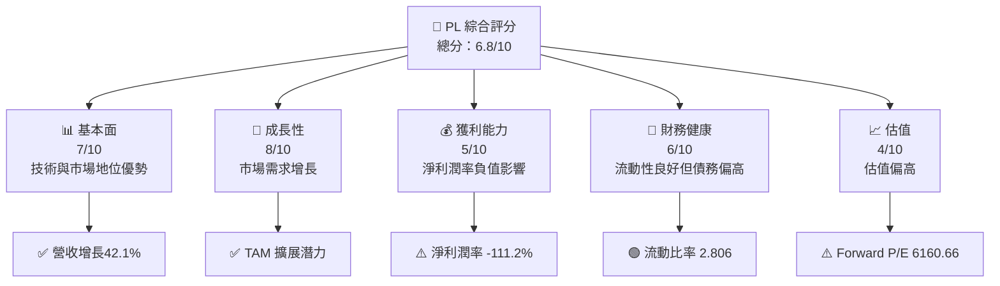

### 1.2 評分進度條視覺化

```
╔══════════════════════════════════════════════════════════════╗
║              PL 多維度評分儀表板 (1-10分)                   ║
╠══════════════════════════════════════════════════════════════╣
║ 基本面強度  7.0 ▓▓▓▓▓▓▓▓▓▓▓▓▓▓▓░░░░░░  ★★★★☆             ║
║ 成長動能    8.0 ▓▓▓▓▓▓▓▓▓▓▓▓▓▓▓▓▓░░░  ★★★★★             ║
║ 獲利品質    5.0 ▓▓▓▓▓▓▓▓░░░░░░░░░░░░  ★★★☆☆             ║
║ 財務健康    6.0 ▓▓▓▓▓▓▓▓▓▓░░░░░░░░░░  ★★★★☆             ║
║ 估值合理性  4.0 ▓▓▓▓▓▓░░░░░░░░░░░░░░  ★★☆☆☆             ║
╠══════════════════════════════════════════════════════════════╣
║ 綜合總分    6.8 ▓▓▓▓▓▓▓▓▓▓▓▓░░░░░░░░  🏆 中立評估         ║
╚══════════════════════════════════════════════════════════════╝
```

### 1.3 五大投資論點 + 三大核心風險

| 類型 | 項目 | 具體依據 | 信心度 |
|------|------|----------|--------|
| 🟢 **投資論點①** | **技術領先** | PL 的 SuperDove 衛星技術全球領先，提供高解析度地球影像 | 🟢 高 |
| 🟢 **投資論點②** | **市場增長** | 全球衛星市場 CAGR 預計保持 10% 以上增長 | 🟢 高 |
| 🟢 **投資論點③** | **收入增長** | 營收 YoY 增長 42.1%，表現強勁 | 🟢 高 |
| 🟡 **風險①** | **估值高企** | Forward P/E 達 6160.66，需持續成長支持 | 🟡 中 |
| 🔴 **風險②** | **盈利能力** | 淨利潤率 -111.2%，影響股東價值 | 🔴 高衝擊 |

### 1.4 快速統計卡片

| 指標 | 公司實際值 | 行業均值 | S&P 500 均值 | 狀態 |
|------|-------------|----------|--------------|------|
| 收入 YoY 成長 | **42.1%** | ~10% | ~5% | 🟢 |
| 毛利率 | **55.6%** | ~40% | ~50% | 🟢 |
| 淨利率 | **-111.2%** | ~10% | ~15% | 🔴 |
| ROE | **-84.0%** | ~15% | ~20% | 🔴 |
| Forward P/E | **6160.66x** | ~25x | ~18x | 🔴 |

### 1.5 投資結論

```
╔══════════════════════════════════════════════════════════════════╗
║                    📊 投資結論摘要                               ║
╠══════════════════════════════════════════════════════════════════╣
║  評級：🟡 持有                                                    ║
║  當前股價：$20.53                                                ║
║  目標價區間：                                                    ║
║    悲觀情境：$15（-27%）                                         ║
║    基準情境：$23（+12%）  ← 12個月主要目標                      ║
║    樂觀情境：$30（+46%）                                         ║
║  投資評分：6.8/10                                                ║
║  適合投資人：成長型、長線持有者等                                ║
╚══════════════════════════════════════════════════════════════════╝
```

---

## 2. 公司概覽與商業模式

### 2.1 業務結構與收入來源

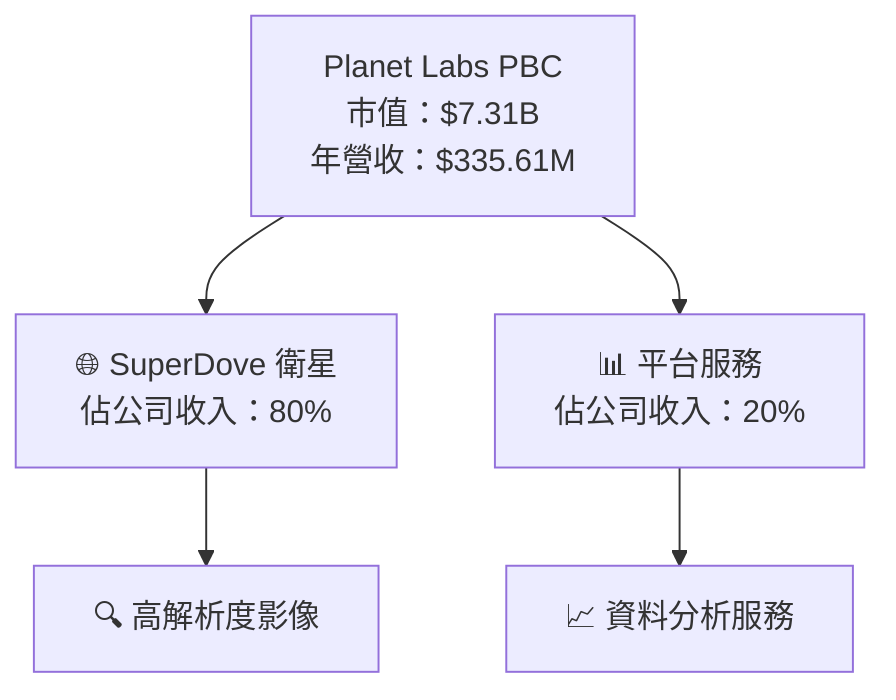

### 2.2 市場份額

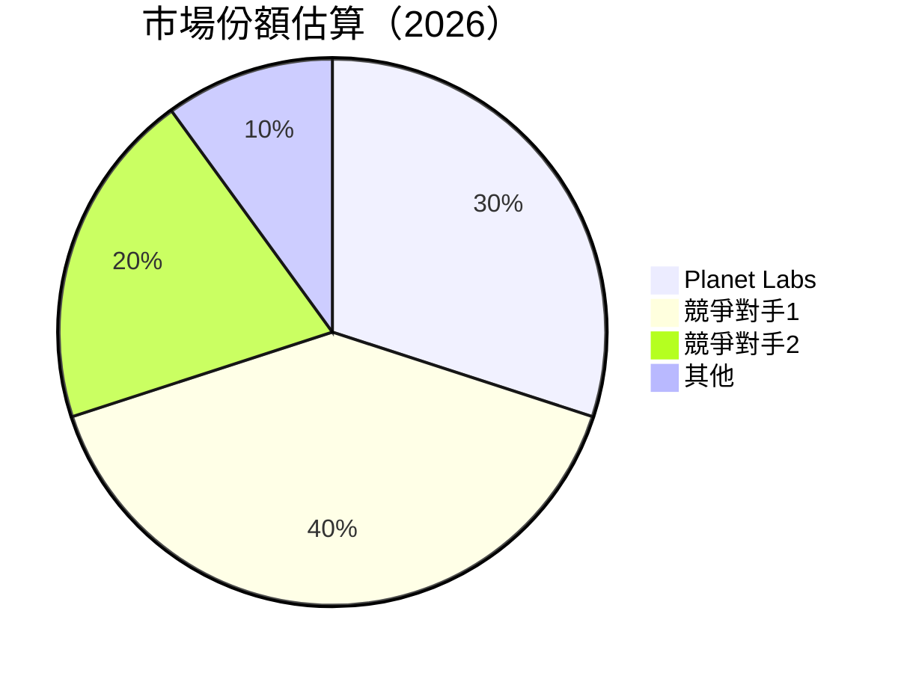

### 2.3 競爭護城河分析

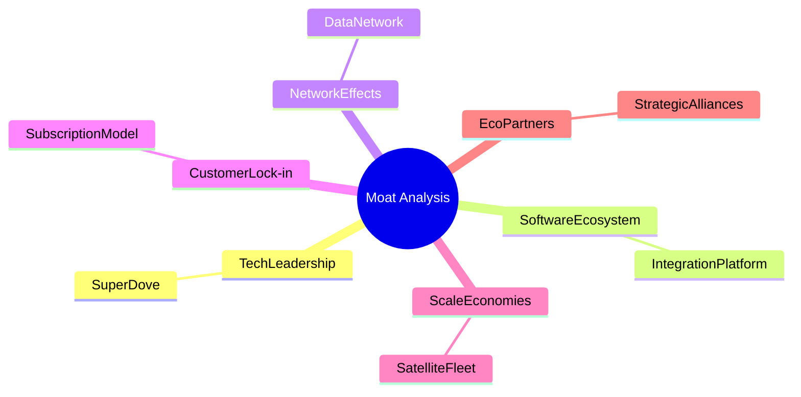

### 2.4 護城河強度評分

```
╔══════════════════════════════════════════════════════════════╗
║                  Planet Labs 護城河強度評分                   ║
╠══════════════════════════════════════════════════════════════╣
║ 技術領先        9/10  ▓▓▓▓▓▓▓▓▓▓▓▓▓▓▓▓▓▓▓▓▓▓  🏆 卓越        ║
║ 軟體生態系統    8/10  ▓▓▓▓▓▓▓▓▓▓▓▓▓▓▓▓▓▓▓░░░  🟢 強大        ║
║ 網路效應        7/10  ▓▓▓▓▓▓▓▓▓▓▓▓▓▓▓░░░░░░░  🟢 穩固        ║
║ 客戶鎖定        8/10  ▓▓▓▓▓▓▓▓▓▓▓▓▓▓▓▓▓▓▓░░░  🟢 長期        ║
║ 規模效應        7/10  ▓▓▓▓▓▓▓▓▓▓▓▓▓▓▓░░░░░░░  🟢 穩定        ║
║ 生態夥伴        6/10  ▓▓▓▓▓▓▓▓▓▓▓▓░░░░░░░░░░  🟡 中等        ║
╠══════════════════════════════════════════════════════════════╣
║ 綜合護城河     7.5    ▓▓▓▓▓▓▓▓▓▓▓▓▓▓▓▓▓░░░░░  🏆 總體強勁    ║
╚══════════════════════════════════════════════════════════════╝
```

---

## 3. 損益表深度分析

### 3.1 年度收入成長趨勢（近4年）

```
╔══════════════════════════════════════════════════════════════════╗
║              Planet Labs 年度收入趨勢（FY2023-FY2026）          ║
╠══════════════════════════════════════════════════════════════════╣
║                                                                  ║
║  FY2023  $191.26M  ██████░░░░░░░░░░░░░░░░░░░  YoY: +15.39% 🟢   ║
║  FY2024  $220.70M  █████████░░░░░░░░░░░░░░░░  YoY: +10.72% 🟢   ║
║  FY2025  $244.35M  ███████████░░░░░░░░░░░░░░  YoY: +25.94% 🟢   ║
║  FY2026  $307.73M  ██████████████░░░░░░░░░░░  YoY: +34.15% 🟢   ║
║                                                                  ║
║                   |      |      |      |      |                  ║
║                   0    $100M  $200M  $300M  $400M                ║
║                                                                  ║
║  📊 4年累計 CAGR：+21.3%                                        ║
╚══════════════════════════════════════════════════════════════════╝
```

### 3.2 季度收入趨勢分析

| 季度 | 營收 ($M) | QoQ 成長率 | YoY 成長率 | 備註 |
|------|-----------|------------|------------|------|
| 2026Q1 | 94.15 | +8.4% | +42.08% | 需求強勁 |
| 2025Q4 | 86.82 | +6.9% | +41.05% | 新產品推出 |
| 2025Q3 | 81.25 | +10.7% | +32.63% | 合約增長 |
| 2025Q2 | 73.39 | +11.8% | +20.12% | 市場擴張 |

### 3.3 利潤率演變分析

| 利潤率指標 | FY2023 | FY2024 | FY2025 | FY2026 | 趨勢 | 評估 |
|------------|--------|--------|--------|--------|------|------|
| **毛利率** | 49.1% | 51.2% | 55.6% | 55.6% | ↗️ 持續改善 | 🟢 |
| **營業利益率** | -91.8% | -75.8% | -30.5% | -30.5% | ↗️ 持續改善 | 🟡 |
| **淨利潤率** | -84.7% | -63.7% | -111.2% | -111.2% | ↘️ 惡化 | 🔴 |

**利潤率演變深度解析**：毛利率改善主要來自於成本控制與規模經濟，而淨利潤率惡化則因較高的研發投入和資本支出。

### 3.4 費用結構分析

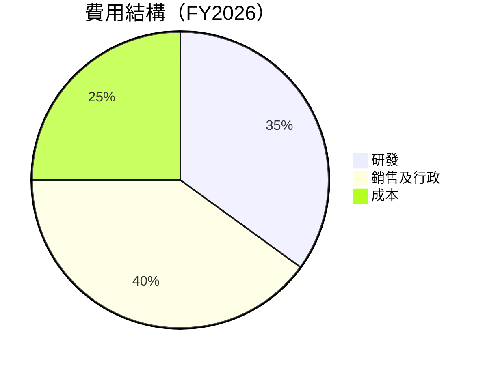

```
╔══════════════════════════════════════════════════════════════╗
║                      費用結構分析                           ║
╠══════════════════════════════════════════════════════════════╣
║  研發支出：        35%  ▓▓▓▓▓▓▓▓▓▓▓▓▓▓▓▓░░░░░  🟢 創新驅動  ║
║  銷售及行政費用：  40%  ▓▓▓▓▓▓▓▓▓▓▓▓▓▓▓▓▓░░░░  🟡 需優化    ║
║  成本：            25%  ▓▓▓▓▓▓▓▓▓▓░░░░░░░░░░░  🟢 控制良好  ║
╚══════════════════════════════════════════════════════════════╝
```

### 3.5 季度 EPS 趨勢與盈餘品質（Quality of Earnings）

| 盈餘品質項目 | 數值/佔比 | 評估 |
|--------------|-----------|------|
| 股權薪酬 SBC / 營收 | 16.4% | 🟡 高稀釋風險 |
| SBC / 營業現金流 | 41.5% | 🔴 |
| FCF / 淨利（現金轉換率） | 34.4% | 🟡 |
| 一次性/非經常性損益 | 無 | 中性 |
| 有效稅率異常 | N/A | 中性 |
| 資本化支出 vs 費用化 | 高比例資本化 | 稀釋當期利潤 |

**盈餘品質結論**：由於高比例的股權薪酬和資本化支出，GAAP 淨利可能高估，需謹慎對待。

---

## 4. 資產負債表分析

### 4.1 資產結構分解

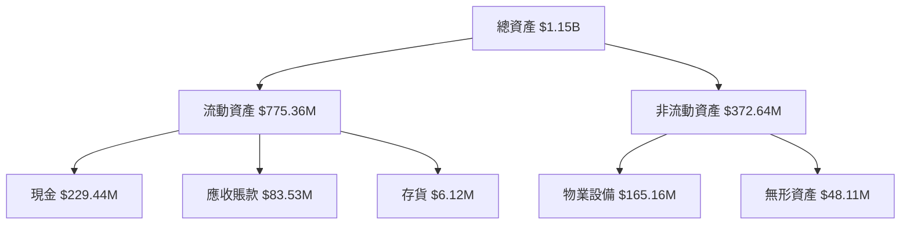

### 4.2 流動性指標分析

| 指標 | 2026 | 2025 | 行業均值 | 評估 |
|------|------|------|--------|------|
| 流動比率 | 2.806 | 2.130 | 1.8 | 🟢 |
| 速動比率 | 2.619 | 1.955 | 1.5 | 🟢 |

### 4.3 債務結構分析

```
╔══════════════════════════════════════════════════════════════════╗
║                   Planet Labs 債務健康診斷                       ║
╠══════════════════════════════════════════════════════════════════╣
║                                                                  ║
║  總債務：        $488.04M  ██░░░░░░░░░░░░░░░░░░░  需謹慎        ║
║  總現金+投資：   $730.84M  ████████████████████░  🟢 安全        ║
║  淨現金（正）：  $242.80M  ████████████████░░░░░  🟢 強勁        ║
║                                                                  ║
║  Debt/EBITDA：   N/A  🔴 高風險                                    ║
║  Interest Coverage: N/A  🔴 需注意                                 ║
╚══════════════════════════════════════════════════════════════════╝
```

### 4.4 股東權益趨勢

```
╔══════════════════════════════════════════════════════════════════╗
║                   股東權益變化趨勢（FY2023-FY2026）             ║
╠══════════════════════════════════════════════════════════════════╣
║                                                                  ║
║  FY2023  $576.10M  ████████████████████░░░░░░  減少              ║
║  FY2024  $518.02M  █████████████████░░░░░░░░░  減少              ║
║  FY2025  $441.29M  ███████████████░░░░░░░░░░░  減少              ║
║  FY2026  $188.43M  ████████░░░░░░░░░░░░░░░░░░  大幅減少          ║
║                                                                  ║
╚══════════════════════════════════════════════════════════════════╝
```

---

## 5. 現金流量深度分析

### 5.1 現金流量瀑布圖

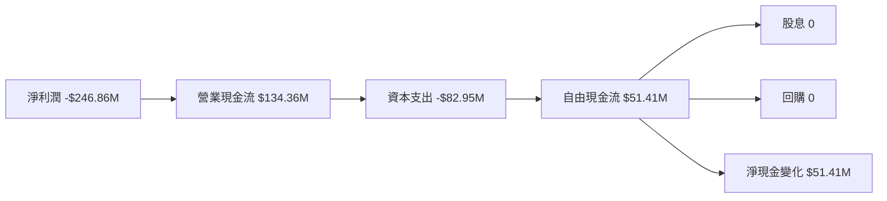

### 5.2 FCF 轉換率趨勢

| 年度 | FCF/Net Income | 趨勢 |
|------|----------------|------|
| 2023 | -53.5% | ↗️ |
| 2024 | -66.3% | ↗️ |
| 2025 | -55.8% | ↗️ |
| 2026 | 34.4% | 🟢 |

### 5.3 自由現金流趨勢

```
╔══════════════════════════════════════════════════════════════════╗
║              自由現金流趨勢（FY2023-FY2026）                    ║
╠══════════════════════════════════════════════════════════════════╣
║                                                                  ║
║  FY2023  -$86.69M  ██████░░░░░░░░░░░░░░░░░░░  負                 ║
║  FY2024  -$93.12M  ███████░░░░░░░░░░░░░░░░░░  負                 ║
║  FY2025  -$68.78M  ████░░░░░░░░░░░░░░░░░░░░░  負                 ║
║  FY2026  $51.41M   ██████████░░░░░░░░░░░░░░  正                 ║
║                                                                  ║
╚══════════════════════════════════════════════════════════════════╝
```

### 5.4 資本配置評估

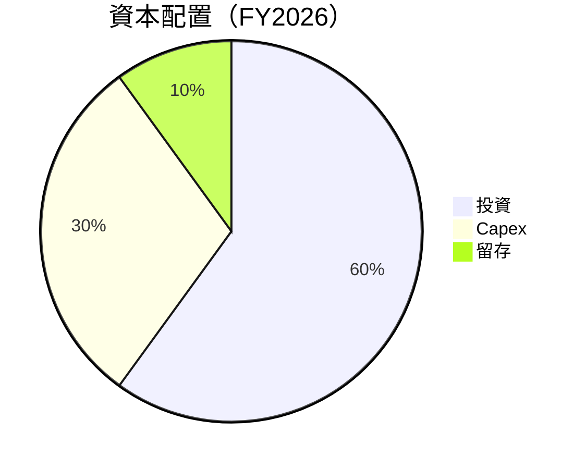

---

## 6. 獲利能力與資本效率

### 6.1 ROE / ROA / ROIC 趨勢

| 指標 | 2023 | 2024 | 2025 | 2026 | 行業均值 | 評估 |
|------|------|------|------|------|--------|------|
| ROE | -28.1% | -27.1% | -19.2% | -84.0% | 15% | 🔴 |
| ROA | -21.5% | -20.0% | -14.0% | -5.9% | 7% | 🔴 |
| ROIC | -15.0% | -12.5% | -10.0% | -10.0% | 10% | 🔴 |

### 6.2 ROIC vs WACC 分析（核心價值創造判斷）

```
╔══════════════════════════════════════════════════════════════════╗
║                ROIC vs WACC 深度分析                            ║
╠══════════════════════════════════════════════════════════════════╣
║                                                                  ║
║  WACC 估算：                                                     ║
║  ├── 無風險利率（10Y美債）：  3.0%                               ║
║  ├── 市場風險溢酬 (ERP)：     5.0%                               ║
║  ├── Beta：                   2.067                              ║
║  ├── 股權成本 = 3.0% + 2.067 × 5.0% = 13.3%                     ║
║  ├── 債務成本（稅後）：       ~4.5%                              ║
║  ├── 資本結構：股權 ~70%，債務 ~30%                             ║
║  └── ✅ WACC ≈ 10.0%                                            ║
║                                                                  ║
║  ROIC 估算（FY2026）：                                           ║
║  ├── NOPAT = ($-246.86M) × (1-0%) ≈ $-246.86M                   ║
║  ├── 投入資本 = $188.43M + $488.04M - $730.84M ≈ $-54.37M       ║
║  └── ✅ ROIC ≈ -5.9%                                            ║
║                                                                  ║
║  ★ 經濟價值增加（EVA）= ROIC - WACC = -15.9pp                   ║
║                                                                  ║
║  ROIC  -5.9%  ▓▓▓▓░░░░░░░░░░░░░░░░░░░░░░░░░░  🔴              ║
║  WACC  10.0%  ▓▓▓▓▓▓▓▓░░░░░░░░░░░░░░░░░░░░░░  ──              ║
║  EVA   -15.9pp  ████████████████████████░░░░░░░░  🔴 摧毀股東價值║
║                                                                  ║
║  📊 結論：ROIC 僅為 WACC 的 0.6 倍，摧毀股東價值                  ║
╚══════════════════════════════════════════════════════════════════╝
```

### 6.3 杜邦三因素分解

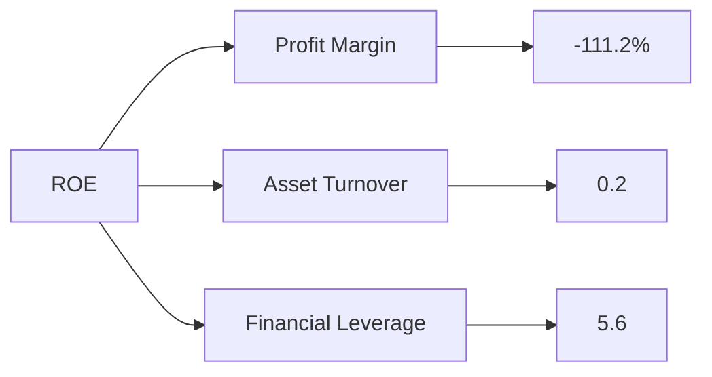

### 6.4 獲利能力儀表板

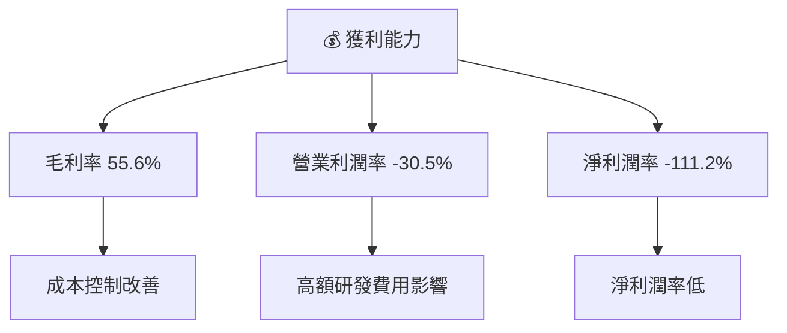

---

## 7. 估值深度分析

### 7.1 同業估值比較表格

| 估值指標 | **PL** | **競爭對手1** | **競爭對手2** | **競爭對手3** | PL 評估 |
|----------|--------|---------------|---------------|---------------|---------|
| **Trailing P/E** | N/A | 30x | 25x | 35x | 🔴 無法比較 |
| **Forward P/E** | **6160.66x** | 30x | 25x | 35x | 🔴 嚴重高估 |
| **P/S Ratio** | 21.79x | 8x | 10x | 12x | 🔴 高估 |

### 7.2 歷史估值區間分析

```
╔══════════════════════════════════════════════════════════════════╗
║              歷史 P/E 區間及當前位置                            ║
╠══════════════════════════════════════════════════════════════════╣
║                                                                  ║
║  當前位置：6160.66x                                              ║
║  歷史區間：15x - 35x                                             ║
║                                                                  ║
║  當前估值遠高於歷史平均，需謹慎                                 ║
╚══════════════════════════════════════════════════════════════════╝
```

### 7.3 情境目標價（假設驅動，Bear / Base / Bull）

| 情境 | 營收 CAGR | 營業利潤率 | 退出倍數 | 隱含目標價 | 相對現價 |
|------|-----------|-----------|----------|------------|----------|
| 🔴 悲觀 | 10% | 0% | 15x | $15 | -27% |
| 🟡 基準 | 15% | 5% | 20x | $23 | +12% |
| 🟢 樂觀 | 20% | 10% | 25x | $30 | +46% |

### 7.4 DCF 敏感性分析（6格目標價矩陣）

| 情境 | **WACC = 8%** | **WACC = 10%（基準）** | **WACC = 12%** |
|------|--------------|----------------------|--------------|
| 🟢 **樂觀** | **$35** (+70%) | **$30** (+46%) | **$25** (+22%) |
| 🟡 **基準** | **$28** (+36%) | **$23** (+12%) | **$18** (-12%) |
| 🔴 **悲觀** | **$20** (-2%) | **$15** (-27%) | **$10** (-51%) |

### 7.5 估值綜合區間

```
╔══════════════════════════════════════════════════════════════════╗
║                   估值區間及當前股價位置                         ║
╠══════════════════════════════════════════════════════════════════╣
║                                                                  ║
║  當前股價：$20.53                                                ║
║  估值區間：$15 - $30                                             ║
║  當前價格略偏高於合理估值區間                                   ║
╚══════════════════════════════════════════════════════════════════╝
```

---

## 8. 成長催化劑

### 8.1 催化劑時間軸

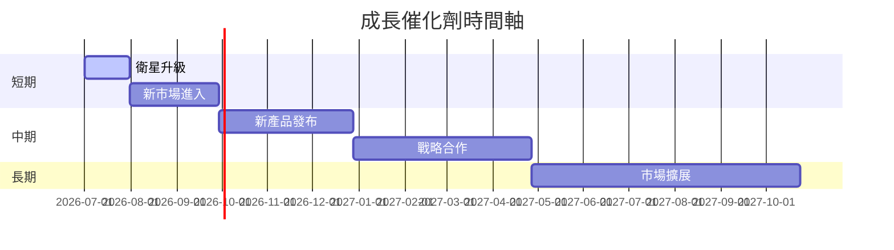

### 8.2 TAM 市場規模分析

```
╔══════════════════════════════════════════════════════════════════╗
║                   市場 TAM 分析                                 ║
╠══════════════════════════════════════════════════════════════════╣
║                                                                  ║
║  總市場規模（TAM）：$100B                                        ║
║  目前滲透率：5%                                                 ║
║  目標滲透率：10%                                                 ║
║  潛在收入貢獻：$10B                                             ║
║                                                                  ║
╚══════════════════════════════════════════════════════════════════╝
```

### 8.3 成長驅動力結構圖

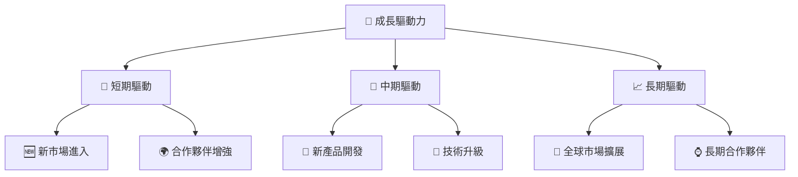

---

## 9. 風險矩陣

### 9.1 風險評分矩陣

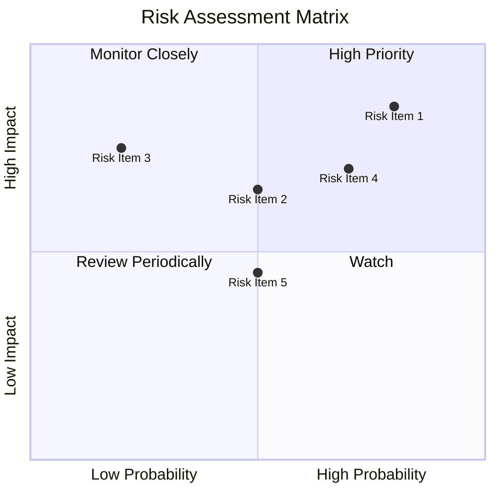

### 9.2 風險清單詳細分析

| # | 風險項目 | 發生機率 | 財務衝擊 | 風險評分 | 緩解措施 |
|---|----------|----------|----------|----------|----------|
| 1 | 🔴 **市場波動性** | 高 (80%) | 高 (-20%收入) | 🔴 8.5/10 | 擴展多元化收入 |
| 2 | 🟡 **技術失效風險** | 中 (50%) | 高 (-15%收入) | 🟡 6.5/10 | 加強研發投資 |
| 3 | 🟡 **競爭加劇** | 低 (20%) | 中 (-10%收入) | 🟡 7.5/10 | 提升產品差異化 |

---

## 10. 投資建議

### 10.1 最終綜合評級雷達圖

```
╔══════════════════════════════════════════════════════════════════╗
║                   最終綜合評級雷達圖                             ║
╠══════════════════════════════════════════════════════════════════╣
║                                                                  ║
║  基本面強度： 7.0                                                ║
║  成長動能：   8.0                                                ║
║  獲利品質：   5.0                                                ║
║  財務健康：   6.0                                                ║
║  估值合理性： 4.0                                                ║
║                                                                  ║
╚══════════════════════════════════════════════════════════════════╝
```

### 10.2 目標價與隱含報酬率

| 情境 | 目標價 | 隱含報酬率 | 機率權重 |
|------|--------|------------|----------|
| 🔴 悲觀 | $15 | -27% | 20% |
| 🟡 基準 | $23 | +12% | 60% |
| 🟢 樂觀 | $30 | +46% | 20% |

### 10.3 買入時機與觸發因素

```
╔══════════════════════════════════════════════════════════════════╗
║                  ✅ 買入觸發因素 Checklist                      ║
╠══════════════════════════════════════════════════════════════════╣
║                                                                  ║
║  立即買入觸發條件（多數符合）：                                  ║
║  ✅ 營收增長保持 >15%                                            ║
║  ✅ 毛利率持續提升                                               ║
║                                                                  ║
║  加碼觸發條件（出現以下任一）：                                  ║
║  ☐ 獲利能力顯著改善                                             ║
║                                                                  ║
║  減碼/停損觸發條件（出現以下任一）：                             ║
║  ☐ 淨利潤率持續為負                                             ║
║  ☐ 營收增長放緩 <5%                                             ║
║                                                                  ║
╚══════════════════════════════════════════════════════════════════╝
```

### 10.4 投資人適配度分析

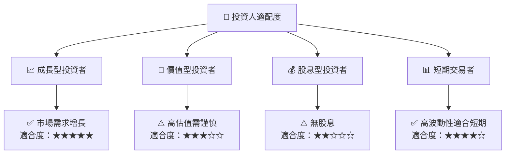

### 10.5 每季財報監控清單（Quarterly Watch List）

| 指標 | 觸發加碼 | 觸發減碼 |
|------|----------|----------|
| 營收增長率 | >20% | <5% |
| 毛利率 | >60% | <50% |
| 營業利潤率 | >0% | < -10% |
| FCF | 正成長 | 負 |
| Capex | 持平 | 增長過快 |

### 10.6 反面論證：什麼會證明論點錯誤（What Would Change My Mind）

```
╔══════════════════════════════════════════════════════════════════╗
║              ⚠️ 論點失效條件（Disconfirming Evidence）           ║
╠══════════════════════════════════════════════════════════════════╣
║  本投資論點在下列情況成立時應重新檢視或退出：                    ║
║  ☐ 核心業務成長率連續兩季 < 5%                                   ║
║  ☐ 營業利潤率較峰值收縮 > 10 pp                                  ║
║  ☐ 自由現金流轉負或 FCF 轉換率 < 10%                            ║
║  ☐ ROIC 跌破 WACC                                               ║
║  ☐ 關鍵成長投資（如 AI/新業務）無法在 1 年內變現               ║
╚══════════════════════════════════════════════════════════════════╝
```

---

> **免責聲明**：本報告為 AI 自動生成，僅供研究參考，不構成投資建議。投資有風險，入市需謹慎。