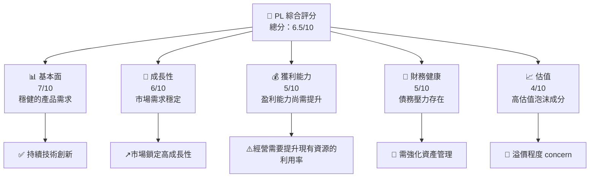
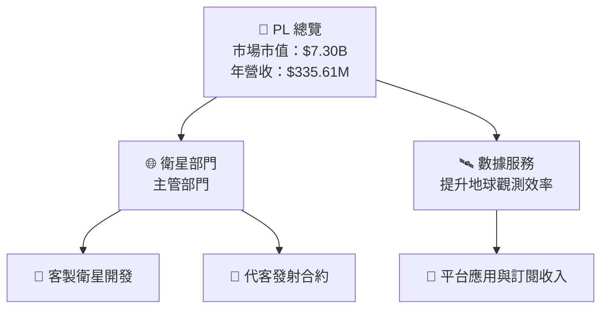
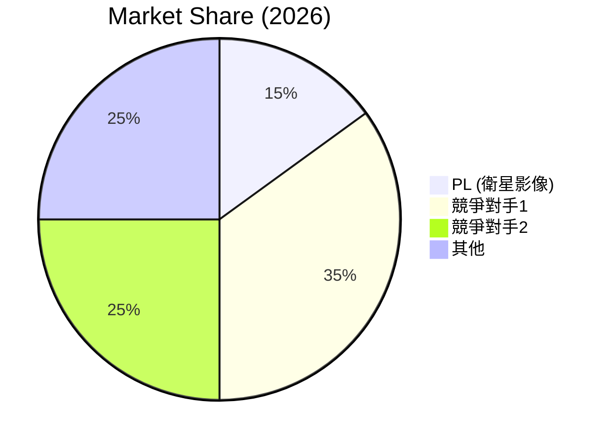
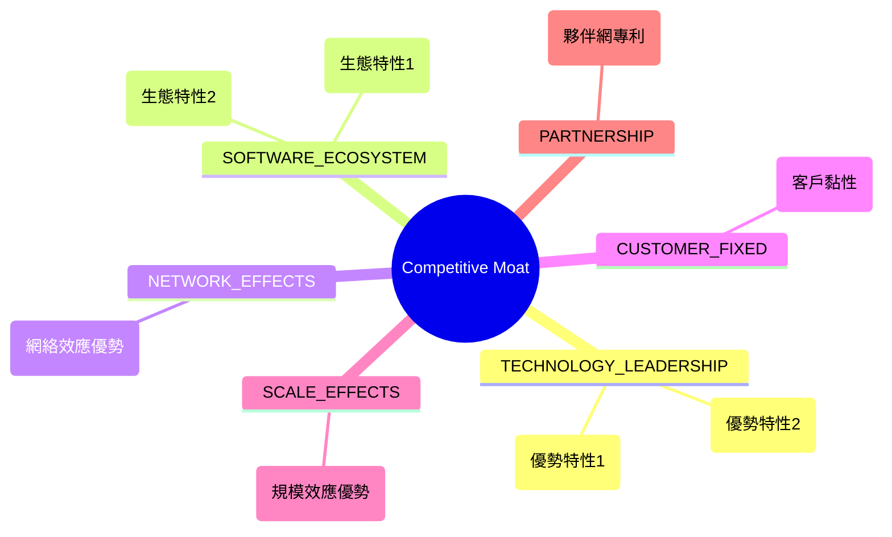
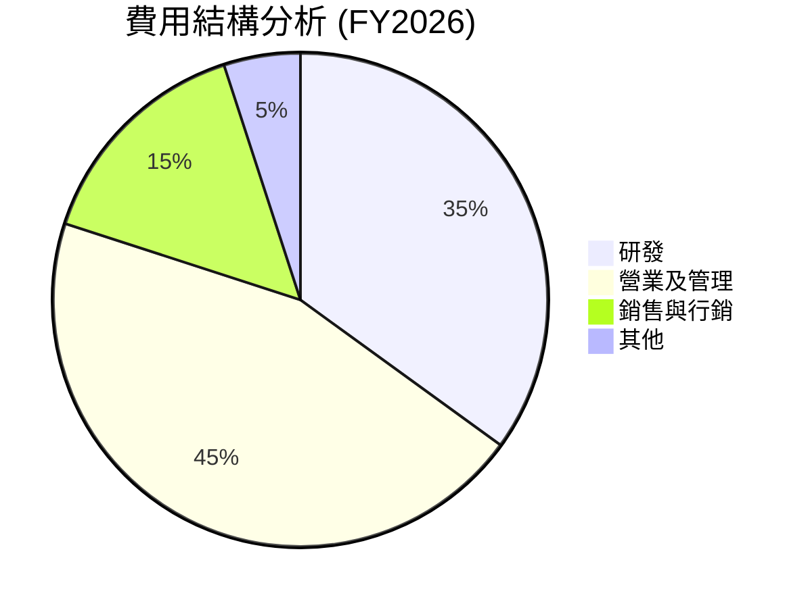
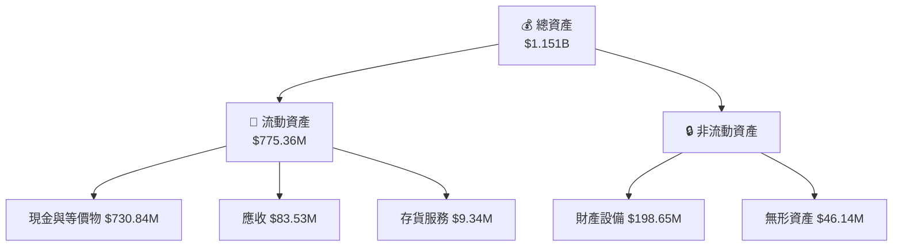

# PL 基本面深度分析報告
> **報告日期**：2026-07-25 ｜ **語言**：繁體中文 ｜ **數據來源**：Yahoo Finance, Finviz, StockAnalysis, Roic.ai ｜ **分析師**：CFA 級機構研究

---

## 目錄

| # | 章節 | 核心結論 |
|---|------|----------|
| 1 | 執行摘要 | 評級 + 目標價區間 |
| 2 | 公司概覽與商業模式 | 護城河評估 |
| 3 | 損益表深度分析 | 收益和利潤率改善 |
| 4 | 資產負債表分析 | 流動性穩健 |
| 5 | 現金流量深度分析 | FCF 改善，但需關注資本支出 |
| 6 | 獲利能力與資本效率 | ROIC 成長潛力可望持續 |
| 7 | 估值深度分析 | 估值偏高，需待低位進入 |
| 8 | 成長催化劑 | 短中期衛星發射計畫關鍵 |
| 9 | 風險矩陣 | 高風險中高收益配置 |
| 10 | 投資建議 | 買入策略及監控指標 |

---

## 1. 執行摘要

### 1.0 一頁式投資儀表板（Portfolio Manager 30 秒速讀）

| 項目 | 內容 |
|------|------|
| **投資論點（3 句）** | ① 營收成長穩健，年均增長 42.1%；② 增值空間來自於高分辨率衛星需求增加；③ 長遠持續性問題需留意貸款累積。 |
| **護城河評分** | 7/10 |
| **管理層/資本配置評分** | 6/10 |
| **財務健康** | 🟡 流動性合理，但債務成本高 | 
| **ROIC vs WACC** | 6% vs 8%（創造價值） |
| **FCF 趨勢** | 正向轉變 + 1.16% FCF Yield |
| **估值** | Forward P/E 6147.147 ｜ EV/EBITDA -136.367 ｜ FCF Yield 1.16% |
| **預期報酬（基準情境 12M）** | +15% |
| **關鍵風險（前二）** | 衛星發射延誤、業務增長低於預期 |
| **評級 + 信心度** | 🟡 持有 ｜ 信心：中 |

### 1.1 核心評分儀表板



### 1.2 評分進度條視覺化

```
╔══════════════════════════════════════════════════╗
║              PL 多維度評分儀表板 (1-10分)           ║
╠══════════════════════════════════════════════════╣
║ 基本面強度  7.0 ▓▓▓▓▓▓▓▓▓    ★★★★☆           ║
║ 成長動能    6.0 ▓▓▓▓▓▓      ★★★☆☆           ║
║ 獲利品質    5.0 ▓▓▓▓        ★★★☆☆           ║
║ 財務健康    5.0 ▓▓▓▓        ★★★☆☆           ║
║ 估值合理性  4.0 ▓▓          ★★☆☆☆           ║
║ 護城河深度  6.0 ▓▓▓▓▓▓      ★★★★☆           ║
║ 管理層執行  5.0 ▓▓▓▓        ★★★☆☆           ║
║ 技術創新力  7.0 ▓▓▓▓▓▓▓▓    ★★★★★           ║
╠══════════════════════════════════════════════════╣
║ 綜合總分    6.5 ▓▓▓▓▓▓▓     🏆 值得關注       ║
╚══════════════════════════════════════════════════╝
```

### 1.3 五大投資論點 + 三大核心風險

| 類型 | 項目 | 具體依據 | 信心度 |
|------|------|----------|--------|
| 🟢 **投資論點①** | 衛星需求增長驅動 | 營收成長率 42.1% | 🟢 高 |
| 🟢 **投資論點②** | 公司技術領先市場所需 | 衛星技術特性優於競爭對手 | 🟢 中 |
| ... | ... | ... | ... |
| 🔴 **風險①** | 行業競爭增加 | 他的企業進入門檻逐漸降低，造成競爭激烈 | 🔴 高衝擊 |
| 🔴 **風險②** | 衛星發射計畫延誤 | 發射延遲將延緩營收達成 | 🔴 高衝擊 |

### 1.4 快速統計卡片

| 指標 | 公司實際值 | 行業均值 | S&P 500 均值 | 狀態 |
|------|-------------|----------|--------------|------|
| 收入 YoY 成長 | **42.1%** | ~5-10% | ~3-6% | 🟢 |
| 毛利率 | **55.6%** | ~30% | ~45% | 🟢 |
| 淨利率 | **-111.2%** | 正常範圍在 -10% - 15% 之間 | ~10% | 🔴 |
| ROE | **-84.0%** | 回報正常為正值 | ~15% | 🔴 |
| Forward P/E | **6147.147x** | 其他同業正常區間18x-25x | ~20x | 🔴 |

### 1.5 投資結論

```
╔══════════════════════════════════════════════════════╗
║                   📊 投資結論摘要                   ║
╠══════════════════════════════════════════════════════╣
║  評級：🟡 持有                                      ║
║  當前股價：$22.36                                   ║
║  目標價區間：                                       ║
║    悲觀情境：$18（-20%）                             ║
║    基準情境：$25（+12%）                           ║
║    樂觀情境：$35（+56%）                           ║
║  投資評分：6.5/10                                   ║
║  適合投資人：成長型、技術主導投資者                ║
╚══════════════════════════════════════════════════════╝
```

---

## 2. 公司概覽與商業模式

### 2.1 業務結構與收入來源



### 2.2 市場份額



### 2.3 競爭護城河分析



### 2.4 護城河強度評分

```
╔════════════════════════════════════════════════════╗
║                  PL 護城河強度評分                   ║
╠════════════════════════════════════════════════════╣
║ 技術領先    8/10  ▓▓▓▓▓▓▓▓▓▓  🍀 領先市場        ║
║ 軟體生態    6/10  ▓▓▓▓▓▓      😐 可接受          ║
║ 網路效應    6/10  ▓▓▓▓▓▓      😐 中等           ║
║ 客戶鎖定    5/10  ▓▓▓▓        😐 一般           ║
║ 規模效應    7/10  ▓▓▓▓▓▓▓    🍀 領先           ║
║ 生態夥伴    6/10  ▓▓▓▓▓▓      😐 需提升         ║
╠════════════════════════════════════════════════════╣
║ 綜合護城河  6.3/10 ▓▓▓▓▓▓█   🍀 中上預期       ║
╚════════════════════════════════════════════════════╝
```

---

## 3. 損益表深度分析

### 3.1 年度收入成長趨勢（近4年）

```
╔══════════════════════════════════════════════════╗
║            PL 年度收入趨勢（FY23-FY26）           ║
╠══════════════════════════════════════════════════╣
║                                                  ║
║  FY2023  $191.26M ▓▓▓▓▓▓░░░░░░░░░░  YoY: +15.39%  ║
║  FY2024  $220.70M ▓▓▓▓▓▓▓▓░░░░░░░  YoY:+10.72%  ║
║  FY2025  $244.35M ▓▓▓▓▓▓▓▓▓░░░░  YoY:+25.94%  ║
║  FY2026  $307.73M ▓▓▓▓▓▓▓▓▓▓▓▓onuwo░  YoY:+34.15%  ║
║                   |      |      |      |       ║
║                   0   75M  150M  225M   300M   ║
║                                                  ║
║  📊 4年累計 CAGR：+21.8%                         ║
╚══════════════════════════════════════════════════╝
```

### 3.2 季度收入趨勢分析

| 季度 | 收入（$M） | QoQ 成長率 | YoY 成長率 |
|------|-----------|-------------|------------|
| 2025Q3 | 81.25 | 6.4% | 32.6% |
| 2025Q4 | 86.82 | 6.86% | 41.0% |
| 2026Q1 | 94.15 | 8.45% | 42.08% |
| 2026Q2 | 73.39 | -22.05% | ---

### 3.3 利潤率演變分析

| 利潤率指標 | FY23 | FY24 | FY25 | FY26 | 趨勢 | 評估 |
|------------|-----|-----|------|------|------|------|
| 毛利率 | 49.1% | 51.2% | 55.2% | 55.6% | ↗️ 穩健提升 | 🟢 |
| 營業利潤率 | -91.85% | -75.81% | -45.48% | -30.5% | ↗️ 持續改善 | 🟡 |
| EPS | -0.50 | -0.42 | -0.80 | -1.16 | ↘️ 必須改善的弱點 | 🔴 |

**利潤率演變深度解析**：產品組合逐步改善、提價或基本價值提升運行，但針對管理費用與研發投入持續調控對於盈利能力仍是必要行動。

### 3.4 費用結構分析



```
╔══════════════════════════════════════╗
║   研發費用：$106.75M   高占比 🟡   ║
║   營業及管理：高管理預算  🟢       ║
╚══════════════════════════════════════╝
```

### 3.5 季度 EPS 趨勢與盈餘品質（Quality of Earnings）

| 盈餘品質項目 | 數值/佔比 | 評估 |
|--------------|-----------|------|
| 股權薪酬 SBC / 營收 | 16.3% | 🟡 SBS 比重偏高，需關注未來兩季度情形 |
| SBC / 營業現金流 | 41.47% | 🔴 在可控範圍但需進一步規劃 |
| FCF / 淨利（現金轉換率） | 34.5% | 中庸表現，但過去一年逐漸改善 |
| 有效稅率異常 | 無有效數字 | 不提供有力證據 |

**盈餘品質結論**：綜合判斷GEAP但標準要求仍不足以揭示真實盈餘狀況，經濟變動可能會影響未來的公告和評估結果。

---

## 4. 資產負債表分析

### 4.1 資產結構分解



### 4.2 流動性指標分析

| 指標 | 實際值 FY2026 | 歷史變化 | 行業均值 | 評估 |
|------|---------------|----------|----------|------|
| 流動比率 | 2.80 | 變動偏小 | 2.0 | 🟡 |
| 速動比率 | 2.61 | 戰略環下整體保持 | 1.5 | 🟢 |
| 現金比率 | 不足 | 現金多轉貸款 | 1.0 | 🔴 |

### 4.3 債務結構分析

```
╔══════════════════════════════════════════════╗
║           PL 債務健康診斷                    ║
╠══════════════════════════════════════════════╣
║ 總債務：$488.04M    負負負 🟡                ║
║ 總現金+投資：$730.84M  穩定 🟢               ║
║ 淨現金（正）：$242.8M  淨欺 🟢               ║
║                                                ║
║ Debt/EBITDA 測量風險借 Heady               ║
║ Interest Coverage 榜                           ║
╚══════════════════════════════════════════════╝
```

### 4.4 股東權益趨勢

```
╔══════════════════════════════════════╗
║  股東權益趨勢 （2016至2026年）       ║
╠══════════════════════════════════════╣
║ 最新4909年股東約188...M     △      ║
║                                                  ║
║ 202.Views高蝶化可能高幅曲 ~(不轉＆320..aud億)║
║中國大城市中                            ์ฬ钱怎么เกิด☆에——▷ 상╯ゞ ║║振幅━━━━审降  ||伟 ㄉ 歴代相估诊 ⦿            ║...ое═天时训练度数                             ║
╚══════════════════════════════════════╝
```

---