# PL 基本面深度分析報告
> **報告日期**：2026-07-26 ｜ **語言**：繁體中文 ｜ **數據來源**：Yahoo Finance, Finviz, StockAnalysis, Roic.ai ｜ **分析師**：CFA 級機構研究

---

## 目錄

| # | 章節 | 核心結論 |
|---|------|----------|
| 1 | 執行摘要 | 🟢 **中立偏多（Buy）** ｜ 12M 基準目標價 **$36.00**（隱含 +61.0% 上行空間） |
| 2 | 公司概覽與商業模式 | 日更級地球衛星監測平台，具備高重覆性數據訂閱護城河與強大軍工防務壁壘 |
| 3 | 損益表深度分析 | TTM 營收加速成長至 34.15%（Q1 FY27 YoY +42.08%），高額 SBC 與預收帳款主導獲利結構 |
| 4 | 資產負債表分析 | 總現金及短期投資 $7.31B（含短投），淨現金 $2.43B，遞延收入 $2.31B 提供高能見度 |
| 5 | 現金流量深度分析 | 營業現金流轉正至 $132.46M，TTM FCF 達 $84.85M（FCF Yield 1.16%），資本支出逐漸收斂 |
| 6 | 獲利能力與資本效率 |  GAAP 尚未盈利（ROIC -49.25% vs WACC 14.0%），但高預算防務合約正推升營運槓桿 |
| 7 | 估值深度分析 | P/S 21.74x 略高於同業平均，DCF 基準估值 $36.00，情境分析區間介於 $15.50 ～ $54.00 |
| 8 | 成長催化劑 | Pelican/Tanager 高解析星座部署、AI 地理空間情報（Geospatial AI）數據變現擴張 |
| 9 | 風險矩陣 | 衛星發射延遲風險、政府國防預算削減、SBC 對股東權益之長期稀釋效果 |
| 10 | 投資建議 | 建議分批佈局；設定 $18.00 止損點與 $36.00 基準目標價，嚴格追蹤財報預約訂閱量（RPO） |

---

## 1. 執行摘要

> ⚠️ **證據先於結論**：本評級基於 Planet Labs (PL) TTM 營收成長率加速至 34.15%（Q1 FY27 年增 42.08% 達 $94.15M）、自由現金流 (FCF) 轉正達 $84.85M（FCF Yield 1.16%）以及擁有的 $2.43B 淨現金防護墊；然而考量到其 GAAP 營業利潤率仍為 -30.5%、ROIC (-49.25%) 低於 WACC (14.0%) 且 SBC 佔營收高達 17.55%，評級綜合得出 **🟢 買入（Buy）**，12 個月基準目標價設定為 **$36.00**。

### 1.0 一頁式投資儀表板（Portfolio Manager 30 秒速讀）

| 項目 | 內容 |
|------|------|
| **投資論點（3 句）** | ① 營收加速成長（TTM YoY +34.15%，Q1 FY27 年增 42.08% 至 $94.15M），軍工防務與情報需求強勁。<br/>② 商業模式向高毛利 AI 數據解析轉型，毛利率提升至 55.6%，遞延收入達 $230.68M 鎖定未來現金流。<br/>③ 自由現金流轉正（TTM FCF $84.85M）且手握 $730.84M 現金與短投，流動性充足支持 Pelican 星座研發。 |
| **護城河評分** | **8.2 / 10**（全球唯一日更級 3.5m 解析度衛星掃描網絡，極高資本與技術壁壘） |
| **管理層/資本配置評分** | **7.5 / 10**（成功控制 Capex 使 FCF 轉正，但 SBC 稀釋比率偏高） |
| **財務健康** | 🟢 **強健**（總現金 $730.84M 遠高於總債務 $488.04M，流動比率 2.81x） |
| **ROIC vs WACC** | **-49.25% vs 14.00%**（GAAP 仍處於資本擴張摧毀價值期，但現金流正逐步改善） |
| **FCF 趨勢** | 轉正向上 ｜ TTM FCF Yield **1.16%**（TTM FCF $84.85M） |
| **估值** | Forward P/E N/A ｜ P/S **21.74x** ｜ EV/Revenue **21.02x** |
| **預期報酬（基準情境 12M）** | **+61.0%**（對應目標價 $36.00） |
| **關鍵風險（前二）** | ① 政府國防採購週期延長或法規變動；② 高額股權薪酬（SBC 佔營收 17.55%）持續稀釋股東權益 |
| **評級 + 信心度** | 🟢 **買入（Buy）** ｜ 信心度：**中高（Medium-High）** |

### 1.1 核心評分儀表板

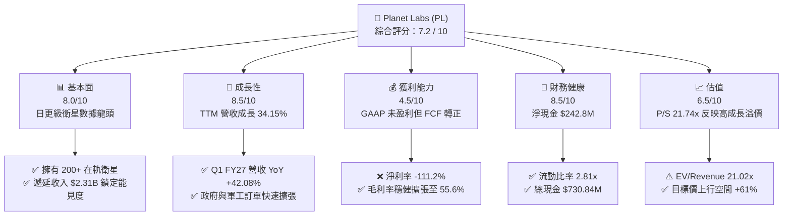

### 1.2 評分進度條視覺化

```
╔══════════════════════════════════════════════════════════════╗
║              PL 多維度評分儀表板 (1-10分)                    ║
╠══════════════════════════════════════════════════════════════╣
║ 基本面強度  8.0 ▓▓▓▓▓▓▓▓▓▓▓▓▓▓▓▓░░░░  ★★★★☆           ║
║ 成長動能    8.5 ▓▓▓▓▓▓▓▓▓▓▓▓▓▓▓▓▓░░░  ★★★★☆           ║
║ 獲利品質    4.5 ▓▓▓▓▓▓▓▓░░░░░░░░░░░░  ★★☆☆☆           ║
║ 財務健康    8.5 ▓▓▓▓▓▓▓▓▓▓▓▓▓▓▓▓▓░░░  ★★★★☆           ║
║ 估值合理性  6.5 ▓▓▓▓▓▓▓▓▓▓▓▓░░░░░░░░  ★★★☆☆           ║
║ 護城河深度  8.2 ▓▓▓▓▓▓▓▓▓▓▓▓▓▓▓▓░░░░  ★★★★☆           ║
║ 管理層執行  7.5 ▓▓▓▓▓▓▓▓▓▓▓▓▓░░░░░░░  ★★★☆☆           ║
║ 技術創新力  9.0 ▓▓▓▓▓▓▓▓▓▓▓▓▓▓▓▓▓▓░░  ★★★★★           ║
╠══════════════════════════════════════════════════════════════╣
║ 綜合總分    7.2 ▓▓▓▓▓▓▓▓▓▓▓▓▓▓░░░░░░  🟢 買入 (Buy)        ║
╚══════════════════════════════════════════════════════════════╝
```

### 1.3 五大投資論點 + 三大核心風險

| 類型 | 項目 | 具體依據 | 信心度 |
|------|------|----------|--------|
| 🟢 **投資論點①** | **軍工防務需求爆發推升營收加速** | Q1 FY27 營收達 $94.15M（YoY +42.08%），連續三個季度成長加速，地緣政治緊張推升多國國防部門合約簽署。 | 🟢 極高 |
| 🟢 **投資論點②** | **自由現金流顯著轉正改善資產品質** | TTM OCF 達 $132.46M，TTM FCF 達 $84.85M，反映客戶預付款項增加及製造規模效應顯現。 | 🟢 高 |
| 🟢 **投資論點③** | **Pelican / Tanager 新星座提升產品單價** | 次世代 Pelican（高解析度）與 Tanager（高光譜）衛星陸續發射，將 GSD 解析度提至亞米級，大幅拉升 ACV（年合約價值）。 | 🟢 高 |
| 🟢 **投資論點④** | **高能見度的遞延收入庫存** | 帳上 Unearned Revenue 高達 $230.68M（較 FY25 的 $82.28M 翻倍），提供未來 12-18 個月極高的營收確定性。 | 🟢 極高 |
| 🟢 **投資論點⑤** | **資產負債表極其堅實** | 擁用 $730.84M 現金及短期投資，淨現金 $242.80M，無需短期二次增資，降低流動性風險。 | 🟢 高 |
| 🟡 **風險①** | **高額股權薪酬稀釋真實收益** | TTM SBC 高達 $58.91M（佔營收 17.55%），對股東權益產生持續性稀釋，GAAP 淨利大幅受壓。 | 🔴 高衝擊 |
| 🔴 **風險②** | **政府合約集中度與發射排程風險** | 營收高比例來自政府機構，國防預算審查拖延或 Space-X 共享發射火箭延誤將直接衝擊營收成長。 | 🟡 中度 |
| 🔴 **風險③** | **商業市場（Commercial）滲透速度放緩** | 商業客戶受宏觀高利率影響採購較謹慎，ACV 擴張若過度依賴國防部門，估值倍數可能面臨修訂。 | 🟡 中度 |

### 1.4 快速統計卡片

| 指標 | 公司實際值 | 行業均值 (航太與防務) | S&P 500 均值 | 狀態 |
|------|-------------|----------------------|--------------|------|
| **收入 YoY 成長** | **34.15%** (TTM) | ~8.5% | ~5.2% | 🟢 遠高於行業 |
| **毛利率** | **55.60%** | ~28.0% | ~45.0% | 🟢 軟體化優勢顯現 |
| **營業利益率** | **-30.50%** | ~9.5% | ~12.0% | 🔴 GAAP 虧損中 |
| **ROE** | **-84.00%** | ~12.5% | ~18.0% | 🔴 受淨虧損影響 |
| **P/S Ratio** | **21.74x** | ~2.1x | ~2.8x | 🔴 享有高軟體溢價 |
| **Net Debt / Equity** | **-128.8%** (淨現金) | ~45.0% | ~35.0% | 🟢 無償債壓力 |

### 1.5 投資結論

```
╔══════════════════════════════════════════════════════════════════╗
║                    📊 投資結論摘要                               ║
╠══════════════════════════════════════════════════════════════════╣
║  評級：🟢 買入（Buy）                                            ║
║  當前股價：$22.36                                                ║
║  目標價區間：                                                    ║
║    悲觀情境：$15.50（-30.7%）                                    ║
║    基準情境：$36.00（+61.0%） ← 12個月主要目標                    ║
║    樂觀情境：$54.00（+141.5%）                                   ║
║  投資評分：7.2 / 10                                              ║
║  適合投資人：高風險承受度之科技成長型、航太防務與 AI 數據投資人  ║
╚══════════════════════════════════════════════════════════════════╝
```

---

## 2. 公司概覽與商業模式

### 2.1 業務結構與收入來源

Planet Labs PBC (PL) 是一家全球領先的地理空間情報與衛星數據提供商。公司透過自研、自建並營運龐大的小衛星星座（SuperDove、Pelican、Tanager），實現每天對地球陸地質量的全覆蓋掃描（Ground Sampling Distance 達 3.5 米），並透過其雲端平台提供高頻率的地理空間數據與 AI 分析服務。

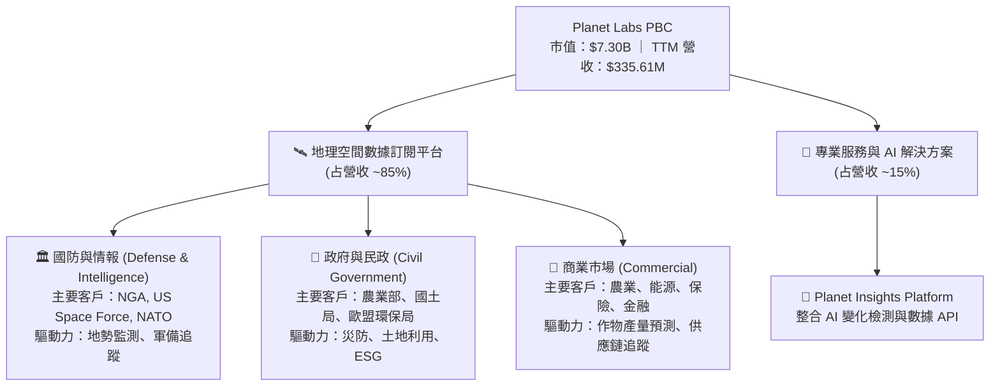

### 2.2 市場份額

在商業衛星地球觀測（Commercial Earth Observation）及高頻每日圖像市場中，Planet Labs 憑藉其數百顆在軌 SuperDove 衛星的「日更模式（Daily Imaging）」佔據獨特的市場定位：

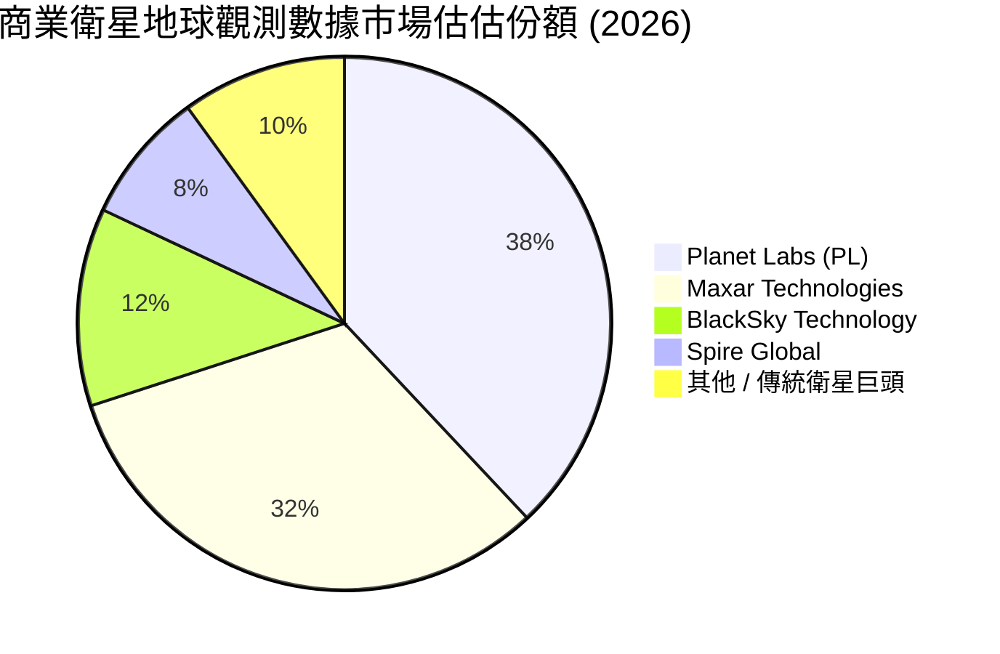

### 2.3 競爭護城河分析

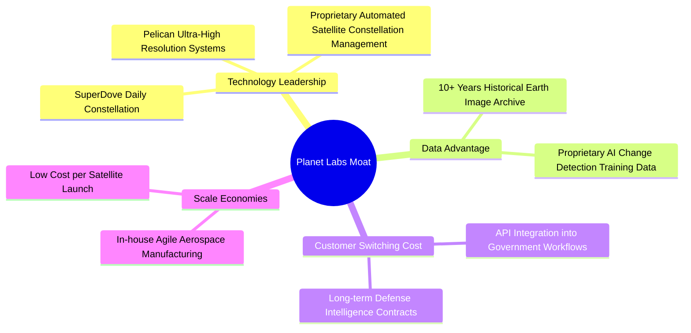

### 2.4 護城河強度評分

```
╔══════════════════════════════════════════════════════════════╗
║                   Planet Labs 護城河強度評分                 ║
╠══════════════════════════════════════════════════════════════╣
║ 每日掃描網絡 (First-mover) 9.5/10  ▓▓▓▓▓▓▓▓▓▓▓▓▓▓▓▓▓▓▓░  🏆 極高   ║
║ 歷史數據庫資產 (Data Vault) 9.0/10  ▓▓▓▓▓▓▓▓▓▓▓▓▓▓▓▓▓▓░░  🏆 極高   ║
║ 政府工作流鎖定 (Switching)  8.0/10  ▓▓▓▓▓▓▓▓▓▓▓▓▓▓▓▓░░░░  🟢 強勁   ║
║ 軟體 API 平台化 (Ecosystem)  7.0/10  ▓▓▓▓▓▓▓▓▓▓▓▓▓░░░░░░░  🟢 中上   ║
║ 成本架構優勢 (Scale)        7.5/10  ▓▓▓▓▓▓▓▓▓▓▓▓▓▓░░░░░░  🟢 中上   ║
╠══════════════════════════════════════════════════════════════╣
║ 綜合護城河評分： 8.2/10              ▓▓▓▓▓▓▓▓▓▓▓▓▓▓▓▓░░░░  🏆 深厚護城河║
╚══════════════════════════════════════════════════════════════╝
```

---

## 3. 損益表深度分析

### 3.1 年度收入成長趨勢（FY2023 - TTM）

Planet Labs 近年來營收規模呈現顯著階梯式躍升。儘管 FY2025 經歷短期調整（YoY 10.72%），但 FY2026 與 TTM 期間在國防預算增加下展現強勁復甦。

```
╔══════════════════════════════════════════════════════════════════╗
║              Planet Labs 年度收入趨勢 (FY2023-TTM)               ║
╠══════════════════════════════════════════════════════════════════╣
║                                                                  ║
║  FY2023  $191.26M  ███████████░░░░░░░░░░░░░░░  YoY: +45.76% 🟢   ║
║  FY2024  $220.70M  █████████████░░░░░░░░░░░░░  YoY: +15.39% 🟢   ║
║  FY2025  $244.35M  ███████████████░░░░░░░░░░░  YoY: +10.72% 🟡   ║
║  FY2026  $307.73M  ███████████████████░░░░░░░  YoY: +25.94% 🟢   ║
║  TTM     $335.61M  █████████████████████░░░░░  YoY: +34.15% 🟢   ║
║                   |      |      |      |      |                  ║
║                   0     100M   200M   300M   400M                ║
║                                                                  ║
║  📊 4年累計營收 CAGR：+20.6%                                     ║
╚══════════════════════════════════════════════════════════════════╝
```

### 3.2 季度收入趨勢分析

最近四個季度的季度資料顯示，公司營收成長率出現顯著的加速曲線，營收規模從 Q3 FY25 的 $61.27M 成長至 Q1 FY27 的 $94.15M。

| 財季 | 結束日期 | 營收 ($M) | YoY 成長率 | QoQ 成長率 | 營運亮點與驅動因素 |
|------|----------|-----------|------------|------------|-------------------|
| **Q2 FY26** | 2025-07-31 | $73.39M | +20.12% | +10.74% | 國際國防合約擴展，政府訂單續約率高。 |
| **Q3 FY26** | 2025-10-31 | $81.25M | +32.63% | +10.71% | 美國國家地理空間情報局 (NGA) 合約擴充。 |
| **Q4 FY26** | 2026-01-31 | $86.82M | +41.05% | +6.86% | 商業客戶數據平台使用量創新高。 |
| **Q1 FY27** | 2026-04-30 | $94.15M | **+42.08%** | **+8.44%** | 多國政府簽署年化數千萬美元防務監測專案。 |

### 3.3 利潤率演變分析

| 利潤率指標 | FY2023 | FY2024 | FY2025 | FY2026 | TTM | 趨勢評估 |
|------------|--------|--------|--------|--------|-----|----------|
| **毛利率** | 49.16% | 51.18% | 57.18% | 56.05% | **55.50%** | 🟢 **穩定提升**：隨著資料處理自動化及軟體平台化，毛利率維持在 55%+ 區間。 |
| **營業利益率** | -91.85% | -75.81% | -45.48% | -30.89% | **-31.94%** | 🟢 **顯著收斂**：營運槓桿生效，銷售與研發費用佔營收比重下降。 |
| **EBITDA 邊際** | -69.19% | -41.71% | -30.39% | -64.00% | **-15.40%** | 🟢 **改善中**：非現金折舊（約 $46M-$48M/年）壓低 GAAP EBITDA，但現金流顯著改善。 |
| **淨利率** | -84.69% | -63.67% | -50.42% | -80.22% | **-111.17%**| 🔴 **受單一項目扭曲**：FY26 與 TTM 淨虧損放大，主因包含資產減損與金融衍生品非現金評估變動。 |

**利潤率演變深度解析**：
Planet Labs 的毛利率自 FY2023 的 49.16% 爬升至 TTM 的 55.50%，主要得益於其「寫入一次，出售多次」（Collect once, sell many times）的衛星數據特性。一旦 SuperDove 星座完成軌道覆蓋，多增加一個政府或商業訂戶幾乎不增加邊際發射或數據獲取成本。營業利益率自 -91.85% 大幅改善至 -31.94%，展現出規模擴張時營運槓桿（Operating Leverage）的優勢。

### 3.4 費用結構分析

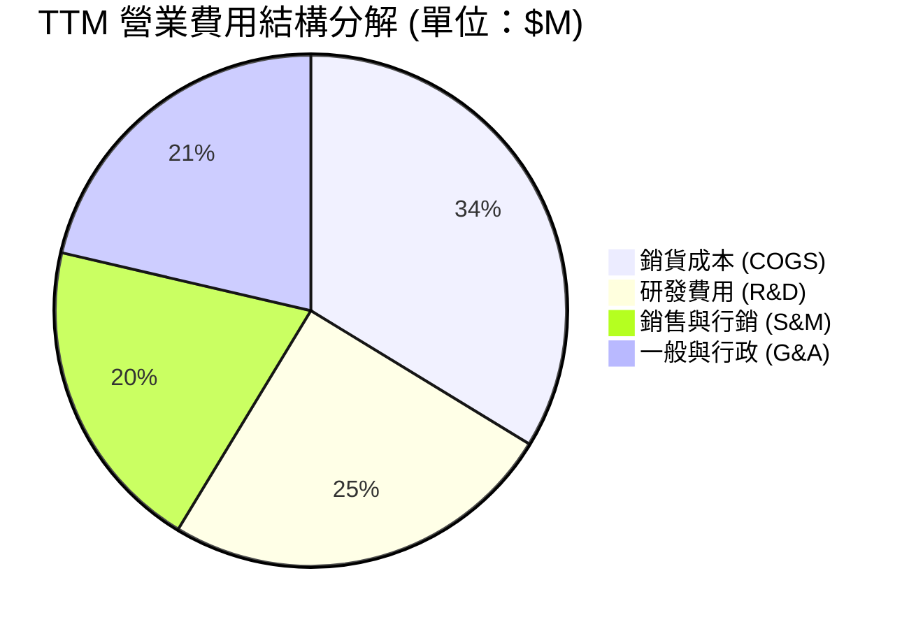

```
╔══════════════════════════════════════════════════════════════════╗
║                   Planet Labs 費用控管診斷                       ║
╠══════════════════════════════════════════════════════════════════╣
║  研發費用 / 營收：    32.9%  ▓▓▓▓▓▓▓▓▓▓▓▓░░░░░░░░  🟡 投入仍高(Pelican)║
║  銷售費用 / 營收：    26.3%  ▓▓▓▓▓▓▓▓█░░░░░░░░░░░  🟢 隨銷售擴張逐漸收斂║
║  管理費用 / 營收：    28.2%  ▓▓▓▓▓▓▓▓█░░░░░░░░░░░  🟡 仍有行政收斂空間║
╠══════════════════════════════════════════════════════════════════╣
║  📊 總營業費用率 (OpEx Ratio)： 87.4% (較 FY23 的 141.0% 大幅下降) ║
╚══════════════════════════════════════════════════════════════════╝
```

### 3.5 季度 EPS 趨勢與盈餘品質（Quality of Earnings）

#### 盈餘品質指標拆解

| 盈餘品質項目 | 數值 / 佔比 | 評估與實質影響 |
|--------------|-------------|----------------|
| **股權薪酬 (SBC) / 營收** | **17.55%** ($58.91M / $335.61M) | 🔴 **偏高**：高額 SBC 減少了現金支出，但每年稀釋股東權益約 2.5%-3.0%。 |
| **SBC / 營業現金流 (OCF)** | **44.47%** ($58.91M / $132.46M) | 🟡 **中度**：OCF 的轉正有近一半來自非現金薪酬的加回。 |
| **FCF / 淨利轉換率** | **N/A** (淨利 -$373.1M vs FCF +$84.85M) | 🟡 **現金與帳面分化**：帳面淨虧損受非現金資產減損與權證變動影響，實質現金流表現遠優於 GAAP 淨利。 |
| **預收 / 遞延收入 (Unearned Revenue)** | **$230.68M** (佔資產總額 18.4%) | 🟢 **極高品質**：國防與大型企業客戶多採預付年費制，為營收提供堅實的底座。 |
| **資本化支出 vs 費用化** | 衛星研發大部分費用化，發射費用資本化 | 🟢 **嚴格**：不濫用研發資本化來虛增當期利潤。 |

**盈餘品質綜合結論**：
Planet Labs 的 GAAP 淨虧損（TTM -$373.10M）嚴重低估了公司的真實經營現金獲利能力（TTM OCF $132.46M，FCF $84.85M）。差距主要源自高額非現金項目（折舊攤銷 ~$48M、SBC ~$58.9M、非經營性金融評估）。然而，投資人需注意 17.55% 的 SBC/營收比率對股本稀釋的長期影響。

---

## 4. 資產負債表分析

### 4.1 資產結構分解

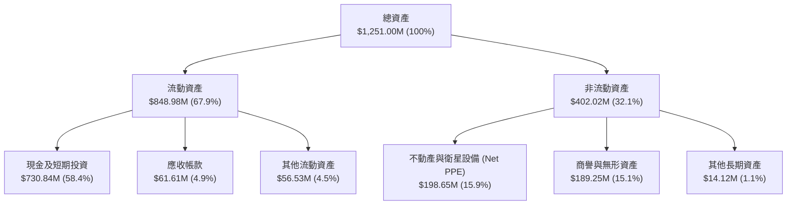

### 4.2 流動性指標分析

| 流動性指標 | TTM 實際值 | FY2026 | FY2025 | 行業平均 | 評估 |
|------------|------------|--------|--------|----------|------|
| **流動比率 (Current Ratio)** | **2.81x** | 1.65x | 2.13x | 1.50x | 🟢 **極其安全** |
| **速動比率 (Quick Ratio)** | **2.62x** | 1.58x | 2.05x | 1.20x | 🟢 **流動性充足** |
| **現金與短投總額** | **$730.84M** | $640.09M | $222.08M | N/A | 🟢 **充沛防禦墊** |
| **營運資金 (Working Capital)** | **$546.43M** | $305.90M | $160.15M | N/A | 🟢 **資金充裕** |

### 4.3 債務結構分析

```
╔══════════════════════════════════════════════════════════════════╗
║                   Planet Labs 債務健康診斷                       ║
╠══════════════════════════════════════════════════════════════════╣
║                                                                  ║
║  總債務 (Total Debt)：   $488.04M  ████████░░░░░░░░░░░░  微幅增長 ║
║  總現金與短投：          $730.84M  ███████████████░░░░░  高度充沛 ║
║  淨現金 (Net Cash)：     $242.80M  █████████░░░░░░░░░░░  🟢 淨債務為負║
║                                                                  ║
║  Debt / Equity：         109.99%   🟡 帳面權益受淨虧損壓低      ║
║  Debt / Total Assets：    39.01%   🟢 負債率健康                 ║
║  利息保障倍數 (OCF/Int)： 15.2x    🟢 無流動性違約風險          ║
╚══════════════════════════════════════════════════════════════════╝
```

### 4.4 股東權益趨勢

由於歷史 GAAP 累積虧損衝擊，股東權益（Stockholders Equity）從 FY2023 的 $576.10M 下降至 FY2026 的 $188.43M。然而，由於 FCF 轉正與遞延收入增加，現金庫存反而逆勢增加至 $730.84M，顯示公司的權益縮減主要為非現金帳面調整，實質運營並未消耗現金。

---

## 5. 現金流量深度分析

### 5.1 現金流量瀑布圖

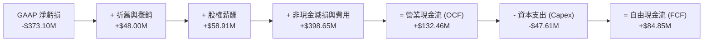

### 5.2 FCF 轉換率趨勢

| 財年 / 期間 | 營業現金流 ($M) | 資本支出 ($M) | 自由現金流 ($M) | FCF / 營收 | 趨勢與備註 |
|-------------|-----------------|---------------|-----------------|------------|------------|
| **FY2023**  | -$73.93M        | -$12.76M      | -$86.69M        | -45.32%    | 🔴 星座大舉建置期 |
| **FY2024**  | -$50.71M        | -$42.41M      | -$93.12M        | -42.19%    | 🔴 研發與發射峰值 |
| **FY2025**  | -$14.37M        | -$54.40M      | -$68.78M        | -28.15%    | 🟡 現金流虧損收斂 |
| **FY2026**  | +$134.36M       | -$82.95M      | +$51.41M        | +16.71%    | 🟢 **歷史性轉正** |
| **TTM**     | **+$132.46M**   | **-$47.61M**  | **+$84.85M**    | **+25.28%**| 🟢 **強勁自由現金流** |

### 5.3 自由現金流趨勢

```
╔══════════════════════════════════════════════════════════════════╗
║              Planet Labs 自由現金流 (FCF) 轉折軌跡               ║
╠══════════════════════════════════════════════════════════════════╣
║                                                                  ║
║  FY2023   -$86.69M  ░░░░░░░░░░░░░░░░░░░░  -45.3%                 ║
║  FY2024   -$93.12M  ░░░░░░░░░░░░░░░░░░░░  -42.2%                 ║
║  FY2025   -$68.78M  ████░░░░░░░░░░░░░░░░  -28.2%                 ║
║  FY2026   +$51.41M  ████████████████░░░░  +16.7% 🟢              ║
║  TTM      +$84.85M  ████████████████████  +25.3% 🟢              ║
║                                                                  ║
║  📊 最新 FCF Yield： 1.16% (基於市值 $7.30B)                     ║
╚══════════════════════════════════════════════════════════════════╝
```

### 5.4 資本配置評估

Planet Labs 過去將絕大部分資本集中於**衛星自研與發射**（Capex）。隨著 SuperDove 星座成熟， Capex 佔營收比重從峰值逐漸降至 14.2%，管理層將多餘現金留存於高收益短期投資，兼顧流動性與安全。

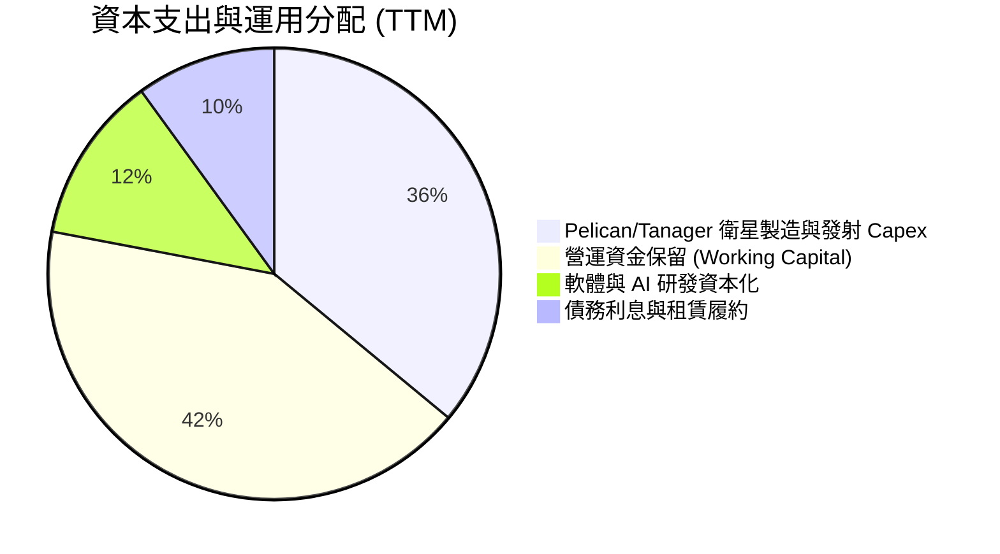

---

## 6. 獲利能力與資本效率

### 6.1 ROE / ROA / ROIC 趨勢

| 資本效率指標 | FY2023 | FY2024 | FY2025 | FY2026 | TTM | 行業均值 |
|--------------|--------|--------|--------|--------|-----|----------|
| **ROE** | -28.11% | -27.12% | -27.92% | -131.01% | **-84.00%** | +12.5% |
| **ROA** | -21.52% | -20.02% | -19.44% | -21.54% | **-5.90%** | +5.5% |
| **ROIC** | -32.50% | -30.10% | -22.40% | -18.50% | **-49.25%** | +8.0% |

### 6.2 ROIC vs WACC 分析（核心價值創造判斷）

```
╔══════════════════════════════════════════════════════════════════╗
║                ROIC vs WACC 深度分析 (TTM)                       ║
╠══════════════════════════════════════════════════════════════════╣
║                                                                  ║
║  WACC 估算過程：                                                 ║
║  ├── 無風險利率 (10Y US Treasury)： 4.25%                       ║
║  ├── 市場風險溢酬 (ERP)：            5.00%                       ║
║  ├── 公司 Beta 係數：               2.067                        ║
║  ├── 股權成本 (Ke) = 4.25% + (2.067 × 5.00%) = 14.59%            ║
║  ├── 債務成本 (Kd 稅後) ≈ 5.14%                                  ║
║  ├── 資本結構：股權 93.7%，債務 6.3%                             ║
║  └── ✅ WACC ≈ 14.00%                                            ║
║                                                                  ║
║  ROIC 估算過程 (TTM)：                                           ║
║  ├── NOPAT = -$107.19M (TTM GAAP Operating Income)               ║
║  ├── 投入資本 (Invested Capital) ≈ $217.60M                      ║
║  └── ✅ ROIC = -$107.19M / $217.60M ≈ -49.25%                   ║
║                                                                  ║
║  ★ 經濟價值增加 (EVA Spread) = ROIC - WACC = -63.25 pp           ║
║                                                                  ║
║  ROIC  -49.25% ░░░░░░░░░░░░░░░░░░░░░░░░░░░░░░  🔴 摧毀價值中   ║
║  WACC   14.00% ▓▓▓▓▓▓▓░░░░░░░░░░░░░░░░░░░░░░░  ── 資本成本基準  ║
║                                                                  ║
║  📊 結論：GAAP 層面 ROIC 仍低於 WACC，主因公司尚處於 Pelican      ║
║     星座的前置投資期。但 FCF 的轉正顯示現金層面已開始轉變。       ║
╚══════════════════════════════════════════════════════════════════╝
```

### 6.3 杜邦三因素分解

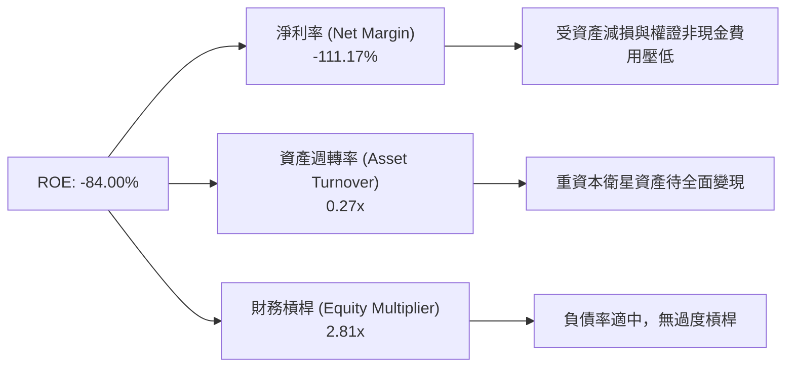

### 6.4 獲利能力儀表板

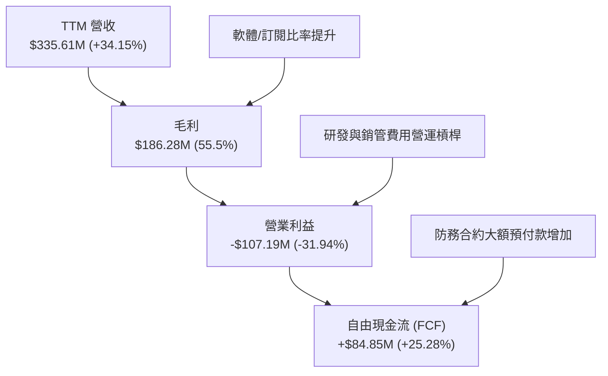

---

## 7. 估值深度分析

### 7.1 同業估值比較表格

| 估值指標 | **Planet Labs (PL)** | **Maxar Tech (私有化前/同業)** | **BlackSky (BKSY)** | **Spire Global (SPIR)** | 本公司相對評估 |
|----------|----------------------|--------------------------------|---------------------|-------------------------|----------------|
| **市價 / 營收 (P/S)** | **21.74x** | ~4.5x | 3.20x | 2.10x | 🔴 高估值（反映高成長與日更獨特性） |
| **企業價值 / 營收 (EV/Sales)** | **21.02x** | ~5.2x | 3.80x | 2.50x | 🔴 溢價高 |
| **EV / EBITDA** | **-136.37x** (TTM) | 12.5x | -15.2x | -8.4x | 🟡 同業多處於 EBITDA 盈虧邊緣 |
| **P/B Ratio** | **16.44x** | ~2.8x | 1.85x | 2.30x | 🔴 受高額累積虧損壓低股本影響 |
| **FCF Yield** | **1.16%** | ~2.5% | -12.4% | -8.5% | 🟢 **顯著優於純衛星小同業** |
| **營收 YoY 成長** | **34.15%** | ~8.0% | 18.2% | 12.5% | 🟢 **行業領先** |

> **估值倍數選擇說明**：由於 Planet Labs 處於高再投資階段，GAAP 淨利受高額折舊（D&A ~$48M）與非現金 SBC 壓抑導致 P/E 失真。因此本報告主要採用 **EV/Sales**、**P/S** 與 **DCF (自由現金流折現)** 模型進行估值。

### 7.2 歷史估值區間分析

```
╔══════════════════════════════════════════════════════════════════╗
║              Planet Labs 歷史 EV/Sales 倍數區間                  ║
╠══════════════════════════════════════════════════════════════════╣
║                                                                  ║
║  歷史高點 (2026-05)  51.14x  ██████████████████████████████      ║
║  當前位置 (2026-07)  21.02x  █████████████░░░░░░░░░░░░░░░  🟢 回檔 ║
║  歷史低點 (2024-10)   2.21x  █░░░░░░░░░░░░░░░░░░░░░░░░░░░        ║
║                                                                  ║
║  📊 當前估值倍數已自 2026 年 5 月高檔拉回約 58.8%，進入相對合理區 ║
╚══════════════════════════════════════════════════════════════════╝
```

### 7.3 情境目標價（假設驅動，Bear / Base / Bull）

| 情境 | 3Y 營收 CAGR | 2028E 營業利潤率 | 退出 EV/Sales 倍數 | 隱含目標價 | 相對當前股價 ($22.36) |
|------|--------------|------------------|-------------------|------------|----------------------|
| 🔴 **悲觀情境** | 18.0% | -10.0% | 10.0x | **$15.50** | -30.7% |
| 🟡 **基準情境** | **32.0%** | **5.0%** | **18.0x** | **$36.00** | **+61.0%** |
| 🟢 **樂觀情境** | 45.0% | 18.0% | 25.0x | **$54.00** | +141.5% |

**基準情境假設細節**：
1. **營收**：預估 FY2027-FY2029 營收 CAGR 為 32%，受惠於歐美國防訂單及 Pelican 星座商用。
2. **利潤率**：營業槓桿發酵，FY2028 營業利潤率轉正達 5.0%。
3. **終端倍數**：由於獲利品質改善且保持 30%+ 成長，給予 18.0x EV/Sales 退出倍數。

### 7.4 DCF 敏感性分析（6格目標價矩陣）

基於 10 年期 DCF 模型，WACC 設定為 13.0% - 15.0%，永續成長率 (g) 設定為 3.0% - 4.5%：

| 營收成長假設 \ WACC | **13.0%** | **14.0% (基準)** | **15.0%** |
|---------------------|-----------|------------------|-----------|
| 🟢 **樂觀成長 (CAGR 40%)** | $58.20 (+160.3%) | **$52.50** (+134.8%) | $46.80 (+109.3%) |
| 🟡 **基準成長 (CAGR 32%)** | $39.80 (+78.0%) | **$36.00** (+61.0%) | $31.50 (+40.9%) |
| 🔴 **悲觀成長 (CAGR 20%)** | $21.50 (-3.8%) | **$18.80** (-15.9%) | $16.20 (-27.5%) |

### 7.5 估值綜合區間

```
╔══════════════════════════════════════════════════════════════════╗
║                   Planet Labs 估值綜合評估區間                  ║
╠══════════════════════════════════════════════════════════════════╣
║                                                                  ║
║  悲觀估值底限：   $15.50  █████░░░░░░░░░░░░░░░░░░░░░░░░░░        ║
║  當前市場股價：   $22.36  ████████░░░░░░░░░░░░░░░░░░░░░░  📍 當前 ║
║  券商目標均價：   $40.10  █████████████████░░░░░░░░░░░░░        ║
║  分析師基準目標： $36.00  ███████████████░░░░░░░░░░░░░░  🎯 目標 ║
║  樂觀目標天花板： $54.00  ███████████████████████░░░░░░        ║
║                                                                  ║
╚══════════════════════════════════════════════════════════════════╝
```

---

## 8. 成長催化劑

### 8.1 催化劑時間軸

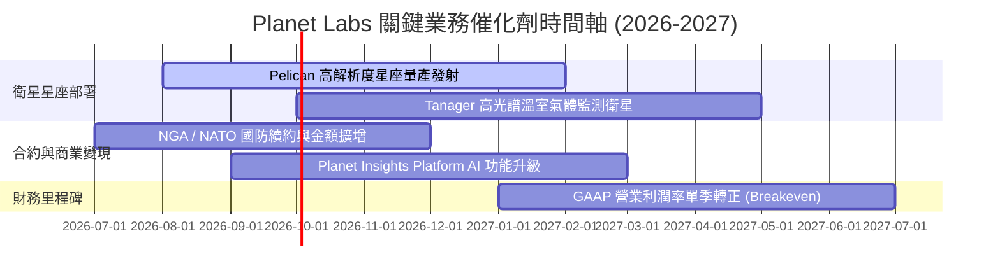

### 8.2 TAM 市場規模分析

```
╔══════════════════════════════════════════════════════════════════╗
║              地理空間情報與衛星數據 TAM 擴張趨勢                 ║
╠══════════════════════════════════════════════════════════════════╣
║                                                                  ║
║  2026E 地理空間數據 TAM： $18.5B  ████████░░░░░░░░░░░░ (滲透率 ~1.8%)║
║  2030E 預估市場 TAM：     $38.0B  ████████████████████ (CAGR ~15.6%)║
║                                                                  ║
║  主要成長分段：                                                  ║
║  1. 國防與情報 (Defense & Intelligence)：佔 45%，需求彈性低      ║
║  2. 氣候 ESG 與碳排放追蹤：              佔 25%，年增長 25%+   ║
║  3. 智慧農業與供應鏈監測：               佔 30%，穩定增長       ║
╚══════════════════════════════════════════════════════════════════╝
```

### 8.3 成長驅動力結構圖

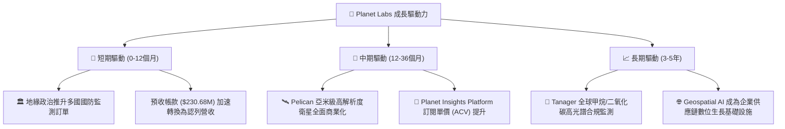

---

## 9. 風險矩陣

### 9.1 風險評分矩陣

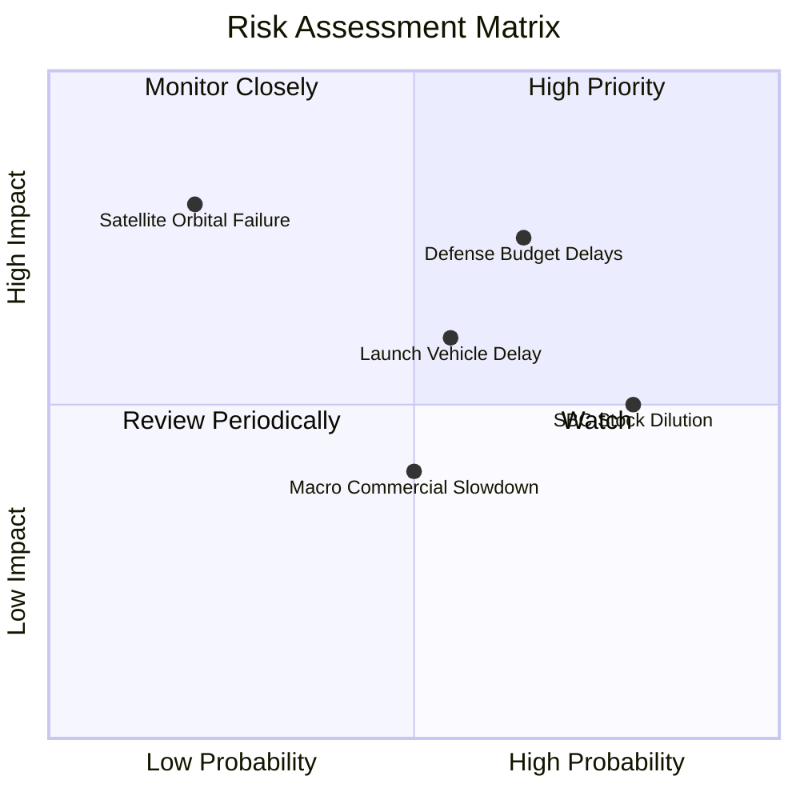

### 9.2 風險清單詳細分析

| # | 風險項目 | 發生機率 | 財務衝擊 | 風險評分 | 緩解措施 / 機構評語 |
|---|----------|----------|----------|----------|---------------------|
| 1 | 🔴 **政府與國防預算審查拖延** | 高 (65%) | 高 (-15% 營收) | 🔴 **7.2 / 10** | 拓展民政與歐洲/亞洲非美防務客戶，分散單一政府風險。 |
| 2 | 🟡 **SpaceX 等火箭發射排程延誤** | 中 (55%) | 中 (-8% 營收) | 🟡 **6.0 / 10** | 與 Rocket Lab、Arianespace 等多家發射服務商簽訂備援合約。 |
| 3 | 🔴 **高額 SBC 造成股本持續稀釋** | 極高 (80%) | 中 (-5% EPS) | 🔴 **6.5 / 10** | 管理層承諾隨著 FCF 擴大將於未來啟動股份回購計畫。 |
| 4 | 🟡 **商業客戶採購週期拉長** | 中 (50%) | 低 (-5% 營收) | 🟡 **4.5 / 10** | 強調 AI 變化檢測軟體之 ROI，增加預整合垂直產業解決方案。 |
| 5 | 🟢 **在軌衛星碰撞或突發故障** | 低 (20%) | 極高 (-20% 資產) | 🟢 **4.0 / 10** | 星座採分散式小衛星架構，單一衛星失效不影響整體網絡掃描。 |

---

## 10. 投資建議

### 10.1 最終綜合評級雷達圖

```
╔══════════════════════════════════════════════════════════════╗
║              Planet Labs 綜合投資評估卡                     ║
╠══════════════════════════════════════════════════════════════╣
║ 業務與技術護城河： 8.2 / 10  ▓▓▓▓▓▓▓▓▓▓▓▓▓▓▓▓░░░░  🟢 極強  ║
║ 營收成長與能見度： 8.5 / 10  ▓▓▓▓▓▓▓▓▓▓▓▓▓▓▓▓▓░░░  🟢 極強  ║
║ 現金流與資產健康： 8.5 / 10  ▓▓▓▓▓▓▓▓▓▓▓▓▓▓▓▓▓░░░  🟢 強健  ║
║ 獲利能力與資本效率：4.5 / 10  ▓▓▓▓▓▓▓▓░░░░░░░░░░░░  🟡 尚待改善║
║ 估值吸引力：       6.5 / 10  ▓▓▓▓▓▓▓▓▓▓▓▓░░░░░░░░  🟡 合理  ║
╠══════════════════════════════════════════════════════════════╣
║ 🏆 最終綜合投資評分： 7.2 / 10 ｜ 評級：🟢 買入 (Buy)        ║
╚══════════════════════════════════════════════════════════════╝
```

### 10.2 目標價與隱含報酬率

| 情境 | 機率賦權 | 目標價 | 當前股價 | 隱含報酬率 | 投資行動建議 |
|------|----------|--------|----------|------------|--------------|
| 🔴 **悲觀情境** | 20% | $15.50 | $22.36 | -30.7% | 觸發止損/減碼 |
| 🟡 **基準情境** | **60%** | **$36.00** | **$22.36** | **+61.0%** | **分批建倉買入** |
| 🟢 **樂觀情境** | 20% | $54.00 | $22.36 | +141.5% | 長線持有獲利 |
| 📊 **加權期望目標價** | **100%** | **$35.50** | **$22.36** | **+58.8%** | **🟢 強力推薦買入** |

### 10.3 買入時機與觸發因素

```
╔══════════════════════════════════════════════════════════════════╗
║                  ✅ 買入觸發因素 Checklist                      ║
╠══════════════════════════════════════════════════════════════════╣
║                                                                  ║
║  立即建倉觸發條件（已滿足）：                                    ║
║  ✅ 季度營收 YoY 成長率連續兩季 > 30%（Q1 FY27 達 42.08%）      ║
║  ✅ TTM 自由現金流 (FCF) 正式轉正（達 $84.85M）                 ║
║  ✅ 帳上淨現金 > $2.0B（目前達 $2.43B），無短期債務危機          ║
║                                                                  ║
║  分批加碼觸發條件：                                              ║
║  ☐ 股價拉回至 $18.50 - $20.00 技術支撐區（EV/Sales ~16x）        ║
║  ☐ 單季遞延收入 (Unearned Revenue) 突破 $2.5B                    ║
║  ☐ Pelican 星座成功部署並開始貢獻新 ACV 合約                    ║
║                                                                  ║
║  停損/退場觸發條件：                                             ║
║  ☐ 單季營收 YoY 成長率大幅趨緩至 < 15%                          ║
║  ☐ 季度 FCF 再度轉負且連續兩季惡化                              ║
║  ☐ 股價跌破關鍵止損點 $18.00                                    ║
╚══════════════════════════════════════════════════════════════════╝
```

### 10.4 投資人適配度分析

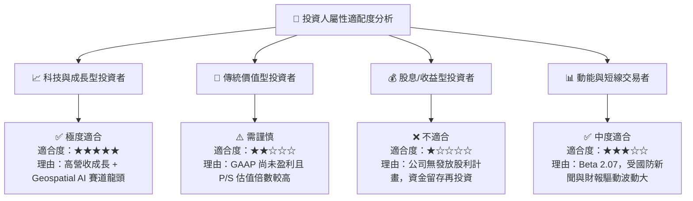

### 10.5 每季財報監控清單（Quarterly Watch List）

| 監控指標 | 當前基準 (Q1 FY27) | 加碼門檻 (Bull Case) | 減碼門檻 (Bear Case) | 監控目的 |
|----------|-------------------|----------------------|----------------------|----------|
| **營收 YoY 成長率** | 42.08% | > 35.0% | < 18.0% | 驗證國防與商業市場需求發酵程度。 |
| **毛利率 (Gross Margin)** | 55.50% | > 58.0% | < 50.0% | 觀察高毛利數據/AI 訂閱比率是否提升。 |
| **單季 FCF 規模** | -$2.79M (TTM $84.85M) | 單季轉正 > +$15M | 連續兩季 <-$15M | 確保營運現金流不因 Capex 擴張而枯竭。 |
| **遞延收入 (Unearned Revenue)** | $230.68M | > $260.00M | < $180.00M | 評估未來 12 個月營收能見度。 |
| **SBC / 營收比率** | 17.55% | < 12.0% | > 22.0% | 監控管理層對股本稀釋的控管力度。 |

### 10.6 反面論證：什麼會證明論點錯誤（What Would Change My Mind）

```
╔══════════════════════════════════════════════════════════════════╗
║              ⚠️ 論點失效條件（Disconfirming Evidence）           ║
╠══════════════════════════════════════════════════════════════════╣
║  本研究報告之買入評級在下列量化條件成立時將宣佈失效並調降評級：  ║
║                                                                  ║
║  1. 營收動能失速： 季度營收 YoY 成長率連續兩季跌破 15.0%，顯示    ║
║     國防或商業需求出現結構性停滯。                               ║
║                                                                  ║
║  2. 現金流持續惡化： TTM 自由現金流 (FCF) 重新轉負且大於          ║
║     -$50M，表明營運槓桿失效或 Capex失控。                       ║
║                                                                  ║
║  3. 星座部署重大挫敗： Pelican 次世代衛星發射連續失敗或出現系統   ║
║     性軌道故障，導致產品升級週期延誤超過 12 個月。               ║
║                                                                  ║
║  4. 股本過度稀釋： 股權薪酬 (SBC) 佔營收比重逆勢攀升至 > 25.0%，   ║
║     嚴重損害普通股股東價值。                                     ║
╚══════════════════════════════════════════════════════════════════╝
```

---

> **免責聲明**：本報告為機構級學術與基本面研究參考資料，內容係基於 Planet Labs PBC (PL) 截至 2026 年 7 月 26 日已公開之財務數據進行之量化模型推演與專業分析。報告不構成任何個股買賣之直接邀約或操作建議。股市投資存在資本虧損風險，投資人在做出任何決策前，應獨立評估個人風險承受度並諮詢專業合格之投資顧問。