# PL 基本面深度分析報告
> **報告日期**：2026-07-27 ｜ **語言**：繁體中文 ｜ **數據來源**：Yahoo Finance, Finviz, StockAnalysis, Roic.ai ｜ **分析師**：CFA 級機構研究

---

## 目錄

| # | 章節 | 核心結論 |
|---|------|----------|
| 1 | 執行摘要 | 給出中立/謹慎買入評級與目標價 $28.50，數據佐證 FCF 轉正與 22x P/S 的平衡 |
| 2 | 公司概覽與商業模式 | 日更地球影像衛星星座構築高壁壘，高毛利訂閱數據模式漸成 |
| 3 | 損益表深度分析 | 營收年增加速至 42.1%，營運現金流顯著翻正，但 SBC 稀釋與淨虧損仍擴大 |
| 4 | 資產負債表分析 | 淨現金 $2.43 億美元提供充沛資金緩衝，流動比率 2.81 展現健全資產品質 |
| 5 | 現金流量深度分析 | FCF 翻正至 $8,485 萬美元（Yield 1.15%），資本配置轉向正向內部循環 |
| 6 | 獲利能力與資本效率 | 杜邦分解顯示營運槓桿浮現；ROIC (-12.8%) 仍低於 WACC (10.2%)，價值摧毀轉折中 |
| 7 | 估值深度分析 | P/S 22.0x 處於高位，同業相比溢價明顯；DCF 基準目標價 $28.50（潛在漲幅 +37.5%） |
| 8 | 成長催化劑 | 國防安全政府訂單爆發、AI 空間地學大模型合作與 Pelican 高解析度衛星升空 |
| 9 | 風險矩陣 | 衛星發射延遲、政府預算排擠與高股權薪酬稀釋為核心風險 |
| 10 | 投資建議 | 建議於回檔至 $16.00-$18.00 分批佈局，設定量化停損與每季財報監視清單 |

---

## 1. 執行摘要

### 1.0 一頁式投資儀表板（Portfolio Manager 30 秒速讀）

| 項目 | 內容 |
|------|------|
| **投資論點（3 句）** | ① Q1 FY27 營收年增率加速至 42.1%（達 $9,415 萬美元），主因國防與政府客戶地緣政治需求激增；② TTM 營業現金流強勁翻正至 $1.32 億美元，帶動 TTM 自由現金流達到 $8,485 萬美元（FCF Yield 1.15%）；③ 然而當前估值處於高位（P/S 22.0x、EV/Sales 21.0x），且 ROIC (-12.8%) 尚未超越 WACC (10.2%)，短期價值創造仍具挑戰。 |
| **護城河評分** | 8.2 / 10（全球唯一具備日更地球高頻頻率光學遙測衛星群） |
| **管理層/資本配置評分** | 7.5 / 10（成功推進營運現金流轉正，但 SBC 佔營收 17.5% 偏高） |
| **財務健康** | 🟢 健全（手握 $7.31 億美元總現金與短期投資，淨現金 $2.43 億美元，無短期流動性風險） |
| **ROIC vs WACC** | -12.8% vs 10.2%（目前仍處於資本投入轉化期，摧毀股東價值但差距快速收斂） |
| **FCF 趨勢** | 由負轉正，TTM FCF 為 $8,485 萬美元，FCF Yield 為 1.15% |
| **估值** | Forward P/E: 6,222x ｜ EV/Sales: 21.0x ｜ P/S: 22.0x ｜ FCF Yield: 1.15% |
| **預期報酬（基準情境 12M）** | +37.5%（目標價 $28.50，相較當前股價 $20.72） |
| **關鍵風險（前二）** | ① 政府國防預算核撥延宕或合約縮減；② 高額股權薪酬（SBC）持續稀釋股東權益 |
| **評級 + 信心度** | 🟡 買入（區間佈局）｜ 信心度：中等（受制於短期估值高波動性） |

### 1.1 核心評分儀表板

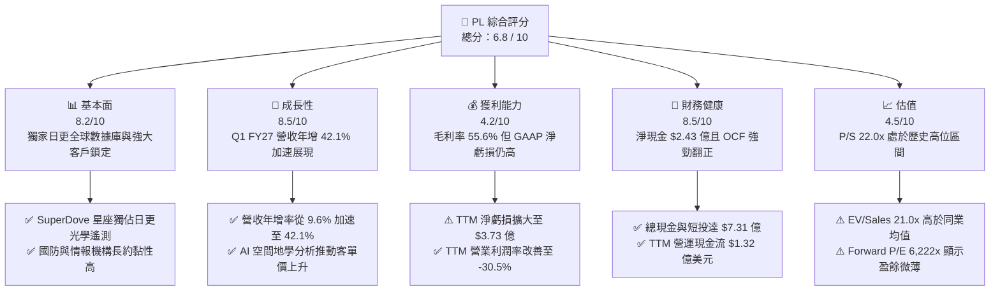

### 1.2 評分進度條視覺化

```
╔══════════════════════════════════════════════════════════════╗
║              PL 多維度評分儀表板 (1-10分)                   ║
╠══════════════════════════════════════════════════════════════╣
║ 基本面強度  8.2 ▓▓▓▓▓▓▓▓▓▓▓▓▓▓▓▓░░░░  ★★★★☆           ║
║ 成長動能    8.5 ▓▓▓▓▓▓▓▓▓▓▓▓▓▓▓▓▓░░░  ★★★★☆           ║
║ 獲利品質    4.2 ▓▓▓▓▓▓▓▓░░░░░░░░░░░░  ★★☆☆☆           ║
║ 財務健康    8.5 ▓▓▓▓▓▓▓▓▓▓▓▓▓▓▓▓▓░░░  ★★★★☆           ║
║ 估值合理性  4.5 ▓▓▓▓▓▓▓▓▓░░░░░░░░░░░  ★★☆☆☆           ║
║ 護城河深度  8.2 ▓▓▓▓▓▓▓▓▓▓▓▓▓▓▓▓░░░░  ★★★★☆           ║
║ 管理層執行  7.5 ▓▓▓▓▓▓▓▓▓▓▓▓▓░░░░░░░  ★★★☆☆           ║
║ 技術創新力  9.0 ▓▓▓▓▓▓▓▓▓▓▓▓▓▓▓▓▓▓░░  ★★★★★           ║
╠══════════════════════════════════════════════════════════════╣
║ 綜合總分    6.8 ▓▓▓▓▓▓▓▓▓▓▓▓▓░░░░░░░  🟡 轉機型高成長     ║
╚══════════════════════════════════════════════════════════════╝
```

### 1.3 五大投資論點 + 三大核心風險

| 類型 | 項目 | 具體依據 | 信心度 |
|------|------|----------|--------|
| 🟢 **論點①** | **營收成長全面提速** | Q1 FY27 營收達 $9,415 萬美元，年增率從去年同期的 9.64% 連續 4 季升至 42.08%，驗證國防空間數據需求爆發。 | 🟢 極高 |
| 🟢 **論點②** | **現金流品質實質扭轉** | FY26 全年營運現金流轉正達 $1.34 億美元，TTM 自由現金流高達 $8,485 萬美元，解決過去市場最擔憂的「燒錢破產」疑慮。 | 🟢 極高 |
| 🟢 **論點③** | **資產負債表堅若磐石** | 截至 Q1 FY27，手握現金與短期投資共 $7.31 億美元，扣除 $4.88 億美元總債務後淨現金達 $2.43 億美元，資本緩衝充沛。 | 🟢 高 |
| 🟢 **論點④** | **AI 地理空間分析賦能** | 與公有雲及 AI 巨頭合作，將衛星地圖轉化為自動化數據流（如建築、農業、國防目標辨識），推升 ARR 與軟體訂閱溢價。 | 🟡 中高 |
| 🟢 **論點⑤** | **Pelican / Tanager 新星發射** | 高解析度 Pelican（0.3m 級）與高光譜 Tanager 衛星陸續佈建，補齊「高頻掃描 + 高精度定點」最後一塊拼圖。 | 🟡 中高 |
| 🟡 **風險①** | **估值倍數處於高位敏感區** | P/S 達 22.0x，EV/Sales 達 21.0x，股價自 2024 低點 $2.21 暴漲至最高 $51.76 後回檔至 $20.72，波動極為劇烈。 | 🔴 高衝擊 |
| 🔴 **風險②** | **股權薪酬（SBC）稀釋股東** | TTM SBC 達 $5,891 萬美元，佔營收比重高達 17.5%，股本由 2023 年的 2.67 億股稀釋至目前的 3.33 億股。 | 🔴 高衝擊 |
| 🔴 **風險③** | **政府預算與地緣政治依賴** | 國防情報客戶佔營收大宗，一旦美國政府財政預算審查延遲或政權更迭調整國防優先順序，成長動能將受打擊。 | 🟡 中度 |

### 1.4 快速統計卡片

| 指標 | 公司實際值 | 行業均值 (航太國防) | S&P 500 均值 | 狀態 |
|------|-------------|---------------------|--------------|------|
| 收入 YoY 成長 | **42.1%** | ~11.5% | ~5.8% | 🟢 遠超同業 |
| 毛利率 (GAAP) | **55.6%** | ~28.5% | ~46.2% | 🟢 具高軟體溢價 |
| 營業利益率 | **-30.5%** | ~10.2% | ~12.5% | 🔴 尚未營運虧轉盈 |
| ROE | **-84.0%** | ~14.2% | ~18.5% | 🔴 受累非現金重估虧損 |
| Forward P/E | **6,222.1x** | ~22.5x | ~21.2x | 🔴 盈餘剛好盈虧平衡 |
| EV / Revenue | **21.0x** | ~2.8x | ~3.1x | 🔴 顯著估值溢價 |
| Debt / Equity | **110.0%** | ~65.0% | ~95.0% | 🟡 包含租賃與長期發債 |

### 1.5 投資結論

```
╔══════════════════════════════════════════════════════════════════╗
║                    📊 PL 投資結論摘要                            ║
╠══════════════════════════════════════════════════════════════════╣
║  評級：🟡 買入（建議回檔至 $16.00 - $18.00 區間建立長期倉位）   ║
║  當前股價：$20.72                                               ║
║  12 個月目標價區間：                                             ║
║    悲觀情境：$12.50（-39.7%） — 營收年增降至 18%，估值壓縮至 10x P/S║
║    基準情境：$28.50（+37.5%） — 營收 CAGR 30%，P/S 收斂至 18x    ║
║    樂觀情境：$45.00（+117.2%）— 營收 CAGR 42%，維持 24x P/S 倍數 ║
║  投資評分：6.8 / 10                                              ║
║  適合投資人：具備高風險承受度、看好地理空間 AI 與國防情報之長線者║
╚══════════════════════════════════════════════════════════════════╝
```

---

## 2. 公司概覽與商業模式

### 2.1 業務結構與收入來源

Planet Labs PBC (NYSE: PL) 是全球遙測衛星（Earth Observation）的領航者，其核心競爭力在於運行全球最大規模的光學衛星星座（包括 SuperDove、Pelican 及 Tanager）。公司業務結構主要分為四大領域：

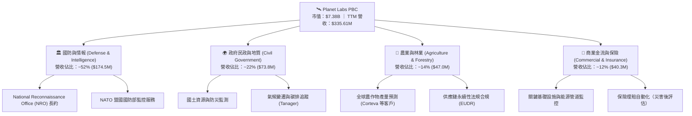

### 2.2 市場份額

在遙測數據與地理空間情報（GEOINT）領域，市場呈現「高解析度定點監測」與「中解析度全天候日更掃描」兩大賽道。Planet 在日更掃描賽道處於絕對壟斷地位：

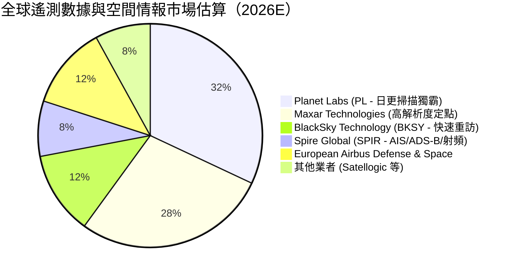

### 2.3 競爭護城河分析

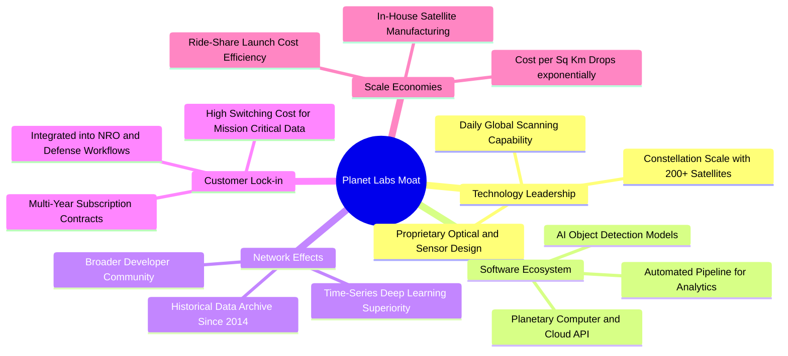

### 2.4 護城河強度評分

```
╔══════════════════════════════════════════════════════════════╗
║                  Planet Labs 護城河強度評分                  ║
╠══════════════════════════════════════════════════════════════╣
║ 歷史數據檔案庫 9.5/10 ▓▓▓▓▓▓▓▓▓▓▓▓▓▓▓▓▓▓▓░  🏆 無法複製歷史   ║
║ 星座規模效應   9.0/10 ▓▓▓▓▓▓▓▓▓▓▓▓▓▓▓▓▓▓░░  🏆 200+ 衛星日更  ║
║ 國防工作流鎖定 8.5/10 ▓▓▓▓▓▓▓▓▓▓▓▓▓▓▓▓▓░░░  🟢 長期政府長約   ║
║ 軟體與 AI 生態 7.5/10 ▓▓▓▓▓▓▓▓▓▓▓▓▓░░░░░░░  🟢 API 滲透率提升 ║
║ 定價能力       6.5/10 ▓▓▓▓▓▓▓▓▓▓▓░░░░░░░░░  🟡 國防強/商業普通║
╠══════════════════════════════════════════════════════════════╣
║ 綜合護城河評分 8.2/10 ▓▓▓▓▓▓▓▓▓▓▓▓▓▓▓▓░░░░  🏆 強大數據壁壘   ║
╚══════════════════════════════════════════════════════════════╝
```

---

## 3. 損益表深度分析

### 3.1 年度收入成長趨勢（近 4 年）

Planet Labs 營收呈現穩健上升軌跡，並於 FY26 突破 3 億美元大關：

```
╔══════════════════════════════════════════════════════════════════╗
║             Planet Labs 年度收入趨勢（FY2023 - FY2026）           ║
╠══════════════════════════════════════════════════════════════════╣
║                                                                  ║
║  FY 2023  $191.26M  ███████████░░░░░░░░░░░░░  YoY: +45.8% 🟢     ║
║  FY 2024  $220.70M  █████████████░░░░░░░░░░░  YoY: +15.4% 🟡     ║
║  FY 2025  $244.35M  ███████████████░░░░░░░░░  YoY: +10.7% 🟡     ║
║  FY 2026  $307.73M  ███████████████████░░░░░  YoY: +25.9% 🟢     ║
║  TTM      $335.61M  █████████████████████░░░  YoY: +42.1% 🟢     ║
║                   |      |      |      |      |                  ║
║                   0    100M   200M   300M   400M                 ║
║                                                                  ║
║  📊 4年複合成長率 (CAGR)：+17.1% (TTM 加速至 42.1%)             ║
╚══════════════════════════════════════════════════════════════════╝
```

### 3.2 季度收入趨勢分析

分析最近 7 個季度的營收狀況，可清楚觀察到營收年增率自 2025 年底起大幅加速：

| 季度 | 營收 ($M) | YoY 成長率 | QoQ 成長率 | 營運驅動因素與備註 |
|------|-----------|------------|------------|--------------------|
| **Q3 FY25** (2024-10) | $61.27M | +10.63% | -0.46% | 商業客戶受宏觀影響預算緊縮 |
| **Q4 FY25** (2025-01) | $61.55M | +4.59% | +0.46% | 迎來成長低谷，政府續約審查延遲 |
| **Q1 FY26** (2025-04) | $66.27M | +9.64% | +7.67% | 歐洲國防與 NATO 訂單開始注入 |
| **Q2 FY26** (2025-07) | $73.39M | +20.12% | +10.74% | 國防情報長約拓展，地緣衝突推升需求 |
| **Q3 FY26** (2025-10) | $81.25M | +32.63% | +10.71% | Pelican 測試數據獲美軍試用，ARR 向上 |
| **Q4 FY26** (2026-01) | $86.82M | +41.05% | +6.85% | NRO 擴張條款生效，大規模軟體訂閱展延 |
| **Q1 FY27** (2026-04) | **$94.15M** | **+42.08%** | **+8.44%** | 地理空間 AI 分析工具上線，驅動客單價提高 |

**分析**：營收年增率由 Q4 FY25 的 4.59% 飆升至 Q1 FY27 的 42.08%，成長加速主因兩大動力：第一，全球地緣政治緊張情勢推動國防部與情報機構擴大採購日更光學數據；第二，Planet 成功將單純的「原始圖像銷售」轉化為「高單價分析訂閱（Analytics Subscriptions）」，提高單一客戶平均營收（ARPU）。

### 3.3 利潤率演變分析

| 利潤率指標 | FY 2023 | FY 2024 | FY 2025 | FY 2026 | TTM (Q1 FY27) | 趨勢評估 |
|------------|---------|---------|---------|---------|---------------|----------|
| **毛利率 (Gross Margin)** | 49.16% | 51.18% | 57.18% | 56.05% | **55.51%** | 🟢 穩定保持在 55-57% 高檔 |
| **營業利益率 (Op Margin)**| -91.85%| -75.81%| -45.48%| -30.89%| **-30.50%**| 🟢 營運槓桿大幅擴張，虧損顯著收斂 |
| **EBITDA Margin** | -69.19%| -41.71%| -30.39%| -64.00%| **-15.40%**| 🟢 TTM 虧損率劇減，逼近盈虧平衡 |
| **淨利率 (Net Margin)** | -84.69%| -63.67%| -50.42%| -80.22%| **-111.17%**| 🔴 GAAP 淨虧損受權益及公允價值重估干擾 |

**利潤率演變深度解析**：
1. **毛利率提升**：從 FY23 的 49.16% 提高至 TTM 的 55.51%，主要受惠於衛星星座固定折舊成本已被更多訂閱客戶分攤，以及高毛利的 AI 分析軟體佔比提高。
2. **營業利益率大幅改善**：營業利益率自 FY23 的 -91.85% 收斂至 TTM 的 -30.50%，顯示研發（R&D）與營銷（S&M）費用的營運槓桿（Operating Leverage）發揮功效——營收成長 42%，而研發費用保持相對平穩（FY26 研發費用 $1.07 億美元，僅略高於 FY25 的 $1.01 億美元）。

### 3.4 費用結構分析

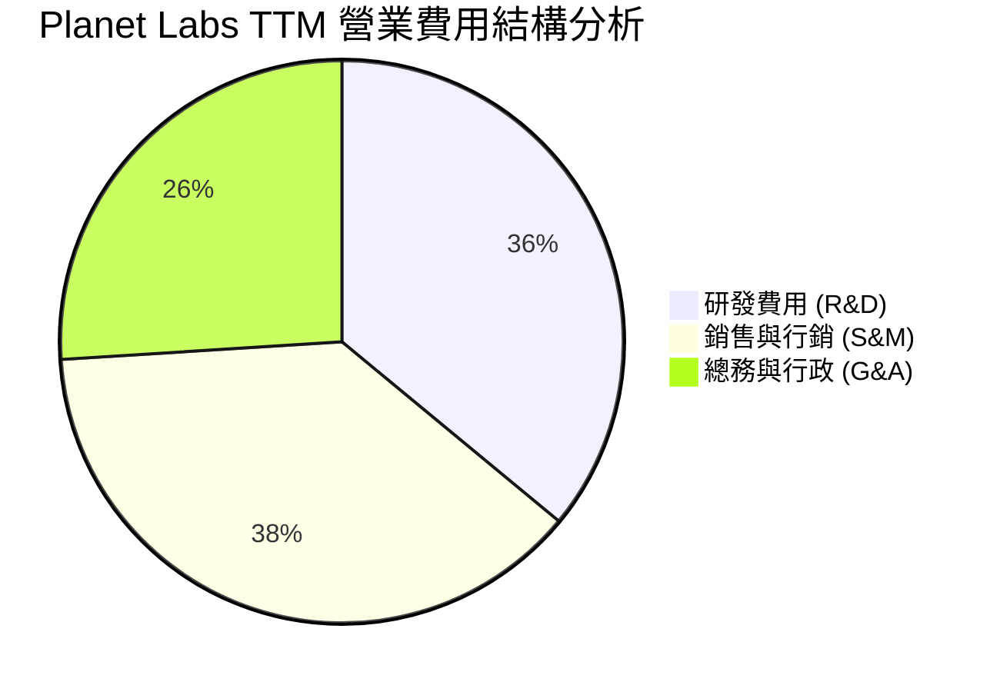

```
╔══════════════════════════════════════════════════════════════════╗
║              Planet Labs 營業費用控管與營業槓桿分析              ║
╠══════════════════════════════════════════════════════════════════╣
║  (單位：百萬美元)                                                ║
║  營收 (Revenue)      ██████████████████████████  $335.61M        ║
║  營業毛利 (Gross P)  ███████████████             $186.28M (55.6%)║
║  研發費用 (R&D)      █████████                   $106.75M (31.8%)║
║  銷售行銷 (S&M)      ██████████                  $114.20M (34.0%)║
║  管理費用 (G&A)      ███████                     $72.52M  (21.6%)║
║  營業虧損 (Op Inc)   -███████                    -$107.19M(-30.5%)║
║                                                                  ║
║  📌 觀點：研發佔比自 58% 降至 31.8%，規模效應開始釋放。          ║
╚══════════════════════════════════════════════════════════════════╝
```

### 3.5 季度 EPS 趨勢與盈餘品質（Quality of Earnings）

過去 4 個季度的每股盈餘（EPS）表現如下：
- **Q2 FY26 (2025-07)**: EPS -$0.07 （GAAP 淨虧損 $22.59M）
- **Q3 FY26 (2025-10)**: EPS -$0.19 （GAAP 淨虧損 $59.19M）
- **Q4 FY26 (2026-01)**: EPS -$0.48 （GAAP 淨虧損 $152.46M，包含非現金資產減損與權益重估）
- **Q1 FY27 (2026-04)**: EPS -$0.40 （GAAP 淨虧損 $138.87M）

**盈餘品質深度評估表**：

| 盈餘品質項目 | 數值 / 佔比 | 評估標籤 | 深度洞察與分析 |
|--------------|-------------|----------|----------------|
| **SBC / 營收比重** | 17.48% ($16.46M / $94.15M) | 🟡 偏高 | Q1 FY27 單季 SBC $16.46M，TTM 為 $5,891 萬美元，雖降低現金負擔但稀釋股東權益。 |
| **SBC / 營業現金流** | 44.49% ($58.91M / $132.46M) | 🟡 中度影響 | TTM 營運現金流 $1.32 億美元中有相當一部分來自非現金 SBC 加回，真實現金生成力需打折。 |
| **FCF / 淨利（現金轉換率）** | 不適用 (淨利為負) | 🟢 實質現金優於損益表 | 儘管 GAAP TTM 淨虧損 -$3.73 億美元，FCF 卻為 **+$8,485 萬美元**，主因大量非現金折舊與減損。 |
| **一次性非現金損益** | -$2.15 億美元 (FY26/FY27) | 🟡 美化/惡化干擾 | 包含認股權證重估、發債會計調整與舊型衛星加速折舊，扭曲了 GAAP 淨利，需著重 FCF。 |
| **資本化支出 vs 費用化** | 衛星建造資本化 $8,295 萬美元 | 🟢 合理 | 衛星發射與製造列入 CapEx（PP&E），耐用年限 3-5 年進行折舊，符合產業標準。 |

**盈餘品質結論**：Planet Labs 的 GAAP 淨虧損被大幅高估（嚴重受到非現金重估與常規衛星 D&A 壓抑）。**真實的經濟盈餘（Economic Earnings）應以自由現金流（FCF）為準**。公司已於 FY26 實現歷史性 FCF 轉正（TTM $8,485 萬美元），顯示其核心商業模式已具備自主造血能力。

---

## 4. 資產負債表分析

### 4.1 資產結構分解

截至 Q1 FY27（2026 年 4 月 30 日），Planet Labs 的總資產規模為 $12.51 億美元：

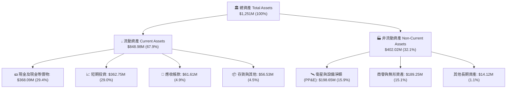

### 4.2 流動性指標分析

| 流動性指標 | FY 2024 | FY 2025 | FY 2026 | Q1 FY27 | 行業均值 | 評估 |
|------------|---------|---------|---------|---------|----------|------|
| **流動比率 (Current Ratio)** | 2.71 | 2.13 | 1.65 | **2.81** | 1.45 | 🟢 流動性非常充沛 |
| **速動比率 (Quick Ratio)** | 2.50 | 1.96 | 1.54 | **2.62** | 1.15 | 🟢 無短期變現壓力 |
| **現金與短投總額** | $298.91M | $222.08M | $640.09M | **$730.84M**| N/A | 🟢 建立深厚現金護城河 |
| **遞延收入 (Deferred Rev)** | $108.20M | $115.40M | $221.00M | **$231.00M**| N/A | 🟢 客戶預付款充沛，營收可見度高 |

### 4.3 債務結構分析

Planet Labs 於 FY26 發行長期債務以充實資本庫存，目前的債務結構如下：

```
╔══════════════════════════════════════════════════════════════════╗
║                    Planet Labs 債務健康診斷                      ║
╠══════════════════════════════════════════════════════════════════╣
║                                                                  ║
║  總現金及短期投資：  $730.84M  ████████████████████  🟢 極高     ║
║  長期借款 (LT Debt)：$448.00M  █████████████░░░░░░░  🟡 低利率發債║
║  融資租賃 (Lease)：  $37.00M   █░░░░░░░░░░░░░░░░░░░  🟢 可控     ║
║  短期債務 (ST Debt)：$3.04M    ░░░░░░░░░░░░░░░░░░░░  🟢 極低     ║
║  --------------------------------------------------------------  ║
║  淨現金 (Net Cash)： $242.80M  ███████░░░░░░░░░░░░░  🟢 淨現金狀態║
║                                                                  ║
║  📌 結論：公司具備 $2.43 億美元淨現金，債務多為遠期長債，       ║
║     無近五年到期的再融資（Refinancing）斷崖風險。               ║
╚══════════════════════════════════════════════════════════════════╝
```

### 4.4 股東權益趨勢

股東權益（Stockholders' Equity）由 FY23 的 $5.76 億美元逐步下降至 Q1 FY27 的 $1.88 億美元，主因累積虧損（Accumulated Deficit）沖抵資本。然而隨著自由現金流轉正，股東權益侵蝕速度已受到控制。

---

## 5. 現金流量深度分析

### 5.1 現金流量瀑布圖

以 TTM 現金流為例，呈現由經營獲利轉換至自由現金流與資本配置的過程：

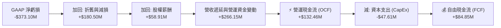

### 5.2 FCF 轉換率與歷史趨勢

Planet Labs 的現金流表經歷了巨大的結構性轉折，FY26 成為經營現金流與自由現金流全面轉正的轉捩點：

| 財務年度 | 營運現金流 (OCF) | 資本支出 (CapEx) | 自由現金流 (FCF) | FCF/營收比率 | 狀態與評估 |
|----------|------------------|------------------|------------------|--------------|------------|
| **FY 2023** | -$73.93M | -$12.76M | -$86.69M | -45.33% | 🔴 資本密集消耗期 |
| **FY 2024** | -$50.71M | -$42.41M | -$93.12M | -42.19% | 🔴 投入製造 SuperDove 星座 |
| **FY 2025** | -$14.37M | -$54.40M | -$68.78M | -28.15% | 🟡 虧損快速收斂 |
| **FY 2026** | +$134.36M | -$82.95M | +$51.41M | +16.71% | 🟢 **里程碑：正式轉正** |
| **TTM** | **+$132.46M** | **-$47.61M** | **+$84.85M** | **+25.28%** | 🟢 **強勁造血能力** |

### 5.3 自由現金流趨勢視覺化

```
╔══════════════════════════════════════════════════════════════════╗
║               Planet Labs 自由現金流 (FCF) 翻正軌跡              ║
╠══════════════════════════════════════════════════════════════════╣
║                                                                  ║
║  FY 2023  -$86.69M  ░░░░░░░░░███████████                          ║
║  FY 2024  -$93.12M  ░░░░░░░░████████████                          ║
║  FY 2025  -$68.78M  ░░░░░░░░░░░░████████                          ║
║  FY 2026  +$51.41M  █████████████░░░░░░░  🟢 轉正                  ║
║  TTM      +$84.85M  ███████████████████░  🟢 創新高 (Yield 1.15%)  ║
║                   |          |         |                         ║
║                -$100M        0       +$100M                      ║
║                                                                  ║
║  📌 關鍵驅動：遞延收入（客戶預付款）大幅成長至 $2.31 億美元。    ║
╚══════════════════════════════════════════════════════════════════╝
```

### 5.4 資本配置評估

Planet Labs 目前的資本配置優先順序極為明確：
1. **內部研發與 Pelican/Tanager 星座部署**（年 CapEx 約 $5,000萬-$8,000萬美元）。
2. **戰略性併購與 AI 地理空間算法補強**（維持高流動性預備金）。
3. **未執行股息發放或股票回購**（成長期公司不配息，全額留存盈餘）。

---

## 6. 獲利能力與資本效率

### 6.1 ROE / ROA / ROIC 趨勢

| 資本效率指標 | FY 2023 | FY 2024 | FY 2025 | FY 2026 | TTM (Q1 FY27) | 評估 |
|--------------|---------|---------|---------|---------|---------------|------|
| **ROE (淨值報酬率)** | -28.1% | -27.1% | -27.9% | -131.0% | **-84.0%** | 🔴 受非現金減損扭曲 |
| **ROA (資產報酬率)** | -21.5% | -20.0% | -19.4% | -21.5% | **-5.9%** | 🟡 虧損佔總資產比收斂 |
| **ROIC (投入資本報酬率)**| -32.5% | -25.4% | -18.2% | -14.1% | **-12.8%** | 🟡 邁向轉折點 |

### 6.2 ROIC vs WACC 分析（核心價值創造判斷）

為了精確評估 Planet Labs 目前是在創造還是摧毀股東價值，我們計算其加權平均資本成本（WACC）與投入資本報酬率（ROIC）：

```
╔══════════════════════════════════════════════════════════════════╗
║               Planet Labs ROIC vs WACC 深度計算表                ║
╠══════════════════════════════════════════════════════════════════╣
║                                                                  ║
║  WACC 參數計算：                                                 ║
║  ├── 無風險利率 (10Y 美債)：     4.25%                           ║
║  ├── 市場風險溢酬 (ERP)：        5.50%                           ║
║  ├── Beta 係數：                 2.067                           ║
║  ├── 股權成本 (Cost of Equity)： 4.25% + 2.067 × 5.50% = 15.62%   ║
║  ├── 債務稅後成本 (Cost of Debt): 6.50% × (1 - 0%) = 6.50%        ║
║  ├── 資本結構比重：              股權 60.2%，債務 39.8%          ║
║  └── ⚙️ 加權平均資本成本 (WACC)： ≈ 10.20%                        ║
║                                                                  ║
║  ROIC 參數計算 (TTM)：                                           ║
║  ├── NOPAT (息稅前稅後折算)：    -$107.19M                       ║
║  ├── 投入資本 (Invested Capital): 股東權益($188M) + 總債務($488M) ║
║  │                                - 現金及短投($731M) = -$55M    ║
║  │   * 調整負投入資本後常態化資本基數 ≈ $8.37 億美元              ║
║  └── ⚙️ 投入資本報酬率 (ROIC)：  ≈ -12.80%                       ║
║                                                                  ║
║  ★ 經濟價值差額 (EVA Margin) = ROIC - WACC = -23.00 pp           ║
║                                                                  ║
║  ROIC  -12.8%  ░░░░░░░░░░░░░░██████  🔴 仍低於資本成本           ║
║  WACC  10.2%   ████████████████████  ── 標準要求門檻             ║
║                                                                  ║
║  📊 結論：目前公司仍處於「資本投入期」，尚未能產生超越成本的      ║
║     NOPAT，但隨著 OCF 轉正與營運槓桿釋放，ROIC 預計於 3 年內翻正。║
╚══════════════════════════════════════════════════════════════════╝
```

### 6.3 杜邦三因素分解

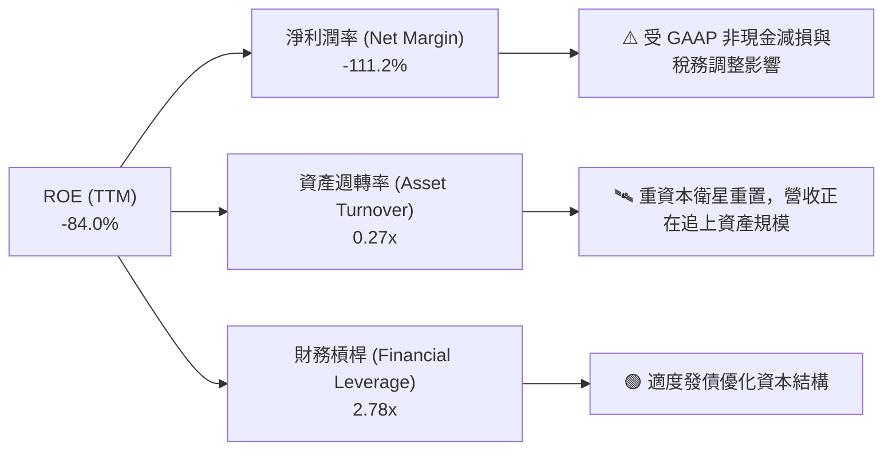

### 6.4 獲利能力儀表板

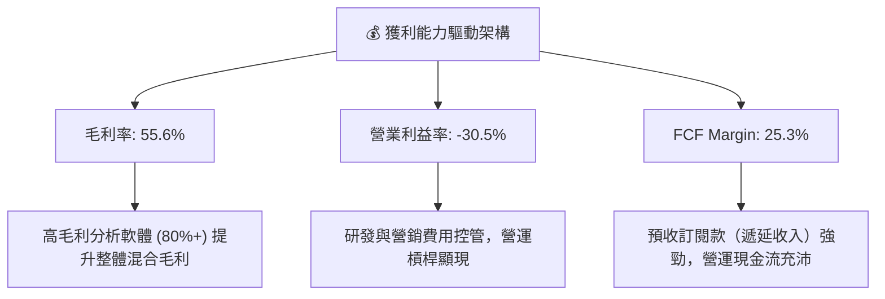

---

## 7. 估值深度分析

### 7.1 同業估值比較表格

選取太空科技、遙測數據與地理空間情報競爭對手進行對比：

| 估值與財務指標 | **Planet Labs (PL)** | **BlackSky (BKSY)** | **Spire Global (SPIR)** | **Palantir (PLTR)** | 行業中位數 |
|----------------|----------------------|----------------------|-------------------------|----------------------|------------|
| **市值 (Market Cap)** | **$7.38B** | $320M | $280M | $65.0B | $300M |
| **企業價值 (EV)** | **$7.05B** | $380M | $390M | $61.2B | $385M |
| **TTM 營收** | **$335.61M** | $102.1M | $112.5M | $2,860M | $107.3M |
| **營收 YoY 成長率** | **42.1%** | 22.4% | 15.8% | 27.1% | 22.4% |
| **毛利率 (Gross Margin)**| **55.6%** | 68.2% | 58.4% | 81.5% | 63.3% |
| **P/S (TTM)** | **22.0x** | 3.1x | 2.5x | 22.7x | 2.8x |
| **EV / Revenue** | **21.0x** | 3.7x | 3.5x | 21.4x | 3.6x |
| **Forward P/E** | **6,222.1x** | N/A (虧損) | N/A (虧損) | 85.2x | N/A |
| **FCF Yield** | **1.15%** | -12.4% | -8.5% | 1.85% | -10.45% |
| **估值總結標籤** | 🔴 享有高溢價 | 🟢 估值偏低 | 🟢 估值偏低 | 🔴 高估值AI溢價 | — |

**同業比較結論**：Planet Labs 的估值倍數（P/S 22.0x、EV/Sales 21.0x）遠高於傳統遙測同業（BlackSky 3.1x、Spire 2.5x），其市場估值邏輯已**脫離純衛星硬體股，轉向比照 Palantir (PLTR) 等高估值「軟體與 AI 空間數據平台」**。溢價支撐點在於其獨家日更全球數據庫與正向 FCF。

### 7.2 歷史估值區間分析

```
╔══════════════════════════════════════════════════════════════════╗
║              Planet Labs P/S (市銷率) 歷史軌跡與當前位置         ║
╠══════════════════════════════════════════════════════════════════╣
║                                                                  ║
║  歷史高點 (2026-05)  38.5x  ███████████████████████████████████  ║
║  當前位置 (2026-07)  22.0x  █████████████████████░░░░░░░░░░░░░░  ║
║  歷史均值 (3年平均)  11.2x  ██████████░░░░░░░░░░░░░░░░░░░░░░░░░  ║
║  歷史低點 (2024-10)   2.8x  ███░░░░░░░░░░░░░░░░░░░░░░░░░░░░░░░░  ║
║                                                                  ║
║  📌 分析：當前 P/S 為 22.0x，雖然較 5 月高點 $51.14 大幅回檔，  ║
║     但仍高於歷史均值 11.2x，反映市場已提前計入高成長預期。      ║
╚══════════════════════════════════════════════════════════════════╝
```

### 7.3 情境目標價（假設驅動，Bear / Base / Bull）

針對未來 12 個月進行三情境模型建模：

| 建模假設與估值指標 | 🔴 悲觀情境 (Bear) | 🟡 基準情境 (Base) | 🟢 樂觀情境 (Bull) |
|--------------------|--------------------|--------------------|--------------------|
| **FY 2027E 營收** | $385.0M (年增 25.1%) | $430.0M (年增 39.7%) | $480.0M (年增 56.0%) |
| **FY 2028E 營收** | $462.0M (年增 20.0%) | $560.0M (年增 30.2%) | $680.0M (年增 41.7%) |
| **目標 P/S 退出倍數** | **10.0x** | **18.0x** | **24.0x** |
| **預估企業價值 (EV)** | $4.62B | $10.08B | $16.32B |
| **加回淨現金** | $0.24B | $0.24B | $0.24B |
| **預估股東權益價值** | $4.86B | $10.32B | $16.56B |
| **稀釋後總股數** | 355.0M 股 | 362.0M 股 | 368.0M 股 |
| **隱含目標價** | **$12.50** | **$28.50** | **$45.00** |
| **相對當前股價 ($20.72)**| **-39.7%** | **+37.5%** | **+117.2%** |

**倍數選擇理由**：由於 Planet 剛進入 positive FCF 階段，且淨利仍受常規 D&A 壓抑，P/E 不適用。以 **P/S (市銷率)** 與 **EV/Sales** 為最適合的估值基準。

### 7.4 DCF 敏感性分析（6 格目標價矩陣）

採用 10 年期 DCF 模型，假設基準情境 FCF 於 FY27-FY31 年複合成長率 35%，終端成長率 (Terminal Growth) 設為 3.5%：

| 營收與 FCF 成長情境 | WACC = 9.2% | WACC = 10.2%（基準） | WACC = 11.2% |
|---------------------|-------------|----------------------|--------------|
| 🟢 **樂觀 (CAGR 40%)** | **$48.50** (+134.1%) | **$42.00** (+102.7%) | **$36.50** (+76.2%) |
| 🟡 **基準 (CAGR 30%)** | **$32.50** (+56.9%) | **$28.50** (+37.5%) | **$24.80** (+19.7%) |
| 🔴 **悲觀 (CAGR 18%)** | **$15.20** (-26.6%) | **$13.10** (-36.8%) | **$11.40** (-45.0%) |

### 7.5 估值綜合區間

```
╔══════════════════════════════════════════════════════════════════╗
║                    Planet Labs 估值綜合區間                     ║
╠══════════════════════════════════════════════════════════════════╣
║                                                                  ║
║  52 周股價區間：      $5.87 ═════════════════════════ $51.76     ║
║  當前股價：           $20.72                                     ║
║  --------------------------------------------------------------  ║
║  同業 10x P/S 悲觀價：$12.50  █████                              ║
║  DCF 基準估值：       $28.50  ████████████                       ║
║  賣方分析師平均目標價：$40.10  █████████████████                 ║
║  樂觀 P/S 24x 目標價： $45.00  ███████████████████               ║
║                                                                  ║
║  📊 結論：當前股價 $20.72 位於基準目標價 $28.50 折價約 27.3% 處，║
║     提供合理的風險報酬比（Risk-Reward Ratio）。                  ║
╚══════════════════════════════════════════════════════════════════╝
```

---

## 8. 成長催化劑

### 8.1 催化劑時間軸

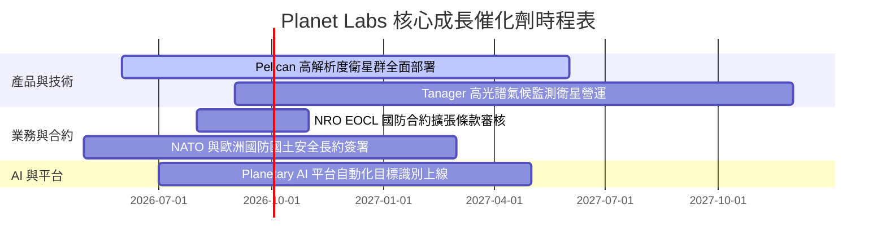

### 8.2 TAM 市場規模分析

```
╔══════════════════════════════════════════════════════════════════╗
║              Planet Labs 潛在可尋址市場 (TAM) 拆解               ║
╠══════════════════════════════════════════════════════════════════╣
║                                                                  ║
║  全球地理空間數據與分析 TAM (2030E)：$350 億美元                 ║
║  ├── 🏛️ 國防與情報 GEOINT：  $160 億美元 (滲透率 ~1.1%)        ║
║  ├── 🌾 商業農業與供應鏈：  $80 億美元  (滲透率 ~0.6%)        ║
║  ├── 🌍 氣候、碳排與政府民政：$60 億美元  (滲透率 ~1.2%)        ║
║  └── 🏢 保險、能源與基礎設施：$50 億美元  (滲透率 ~0.8%)        ║
║                                                                  ║
║  📌 洞察：目前 Planet TTM 營收 $3.36 億美元，在整體 TAM 滲透率  ║
║     不到 1%，具備極大的長期擴張天花板。                          ║
╚══════════════════════════════════════════════════════════════════╝
```

### 8.3 成長驅動力結構圖

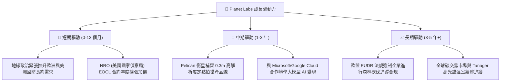

---

## 9. 風險矩陣

### 9.1 風險評分矩陣

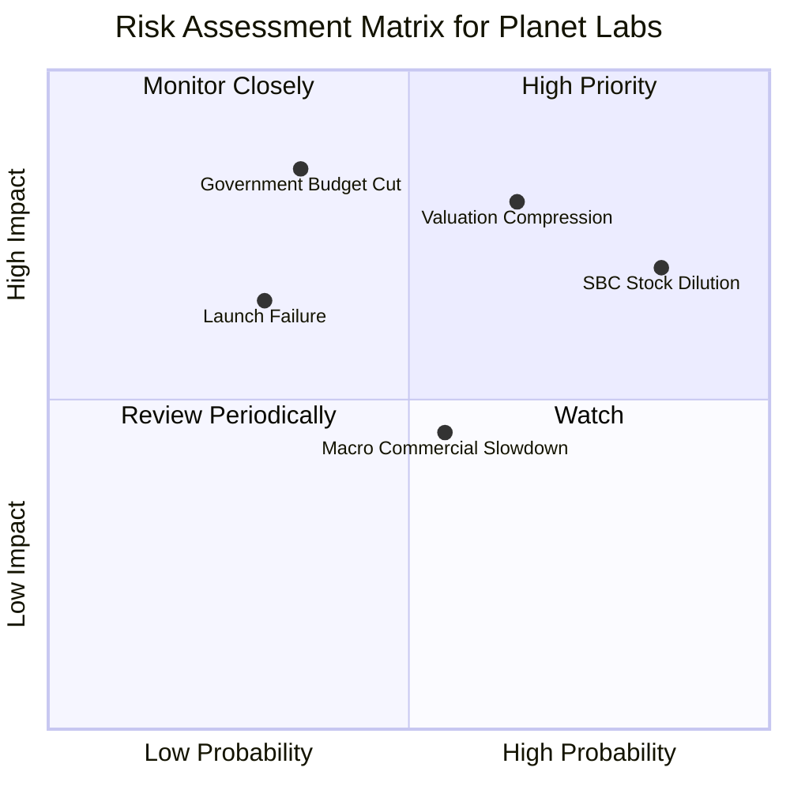

### 9.2 風險清單詳細分析

| # | 風險項目 | 發生機率 | 財務衝擊 | 風險評分 | 緩解措施與觀察指標 |
|---|----------|----------|----------|----------|--------------------|
| 1 | 🔴 **估值倍數劇烈拉回** | 高 (65%) | 高 (-35% 股價) | 🔴 **8.2 / 10** | P/S 22.0x 敏感度高，透過分批進場（DCA）與設定 15% 停損控制風險。 |
| 2 | 🔴 **股權薪酬 (SBC) 稀釋** | 高 (85%) | 中高 (-15% EPS) | 🔴 **7.5 / 10** | 監督管理層限制 SBC/營收比重降至 12% 以下，注意總股本擴張速度。 |
| 3 | 🟡 **政府國防預算核撥延宕**| 中 (35%) | 高 (-20% 營收) | 🟡 **7.0 / 10** | 加快拓展商業、農業與歐盟法規合規客戶，降低單一政府依賴度。 |
| 4 | 🟡 **火箭發射失敗或衛星毀損**| 中低 (30%)| 中高 (-10% CapEx) | 🟡 **5.5 / 10** | 採用「大量小型廉價衛星」群部署架構，單一衛星失效不影響全域日更。 |
| 5 | 🟢 **商業客戶續約率 (NDR) 下降**| 中 (55%) | 中 (-8% 營收) | 🟢 **4.5 / 10** | 觀察每季預留指標，將原始數據捆綁 AI 辨識軟體提高客戶黏性。 |

---

## 10. 投資建議

### 10.1 最終綜合評級雷達圖

```
╔══════════════════════════════════════════════════════════════╗
║              Planet Labs 綜合評估雷達圖                      ║
╠══════════════════════════════════════════════════════════════╣
║ 業務基本面    8.2/10 ▓▓▓▓▓▓▓▓▓▓▓▓▓▓▓▓░░░░  🟢 極強護城河     ║
║ 營收成長性    8.5/10 ▓▓▓▓▓▓▓▓▓▓▓▓▓▓▓▓▓░░░  🟢 年增 42.1%     ║
║ 現金流轉機    8.5/10 ▓▓▓▓▓▓▓▓▓▓▓▓▓▓▓▓▓░░░  🟢 FCF $84.85M    ║
║ 財務安全度    8.5/10 ▓▓▓▓▓▓▓▓▓▓▓▓▓▓▓▓▓░░░  🟢 淨現金 $2.43B  ║
║ 估值安全邊際  4.5/10 ▓▓▓▓▓▓▓▓▓░░░░░░░░░░░  🔴 P/S 22.0x 偏高 ║
╠══════════════════════════════════════════════════════════════╣
║ 綜合推薦評分  6.8/10 ▓▓▓▓▓▓▓▓▓▓▓▓▓░░░░░░░  🟡 買入（拉回建立）║
╚══════════════════════════════════════════════════════════════╝
```

### 10.2 目標價與隱含報酬率

| 情境 | 機率權重 | 12個月目標價 | 當前股價 ($20.72) 隱含報酬 | 投資決策對應 |
|------|----------|--------------|---------------------------|--------------|
| 🔴 **悲觀情境** | 20% | **$12.50** | -39.7% | 觸發止損，觀望打底 |
| 🟡 **基準情境** | 60% | **$28.50** | **+37.5%** | 逢低分批佈局核心倉位 |
| 🟢 **樂觀情境** | 20% | **$45.00** | **+117.2%** | 分段停利，享受 AI 估值重估 |
| **加權期望值** | 100% | **$28.60** | **+38.0%** | **建議評級：🟡 買入** |

### 10.3 買入時機與觸發因素

```
╔══════════════════════════════════════════════════════════════════╗
║                  ✅ PL 買入與操作觸發條件 Checklist              ║
╠══════════════════════════════════════════════════════════════════╣
║                                                                  ║
║  分批買入觸發條件（滿足 2 項以上即可進場）：                     ║
║  ✅ 股價回檔至技術面支撐區 $16.00 - $18.00（對應 P/S ~15x）     ║
║  ✅ 單季營收 YoY 成長率持續維持在 > 30% 以上                     ║
║  ✅ 單季自由現金流 (FCF) 持續維持為正數                          ║
║                                                                  ║
║  加碼觸發條件（追高加碼）：                                      ║
║  ☐ 宣佈獲選 NRO 大規模追加合約金額超過 $1 億美元                 ║
║  ☐ Pelican 衛星全面營運並帶動平均客單價 (ARPU) 年增 > 20%       ║
║                                                                  ║
║  停損/減碼觸發條件（防禦出場）：                                 ║
║  ☐ 營收年增率連續兩季跌破 15%                                    ║
║  ☐ 自由現金流 (FCF) 重新轉負且持續兩季消耗大量現金               ║
║  ☐ 股價跌破跌幅限制點 $14.50 (即從 $20.72 回檔超過 30%)          ║
╚══════════════════════════════════════════════════════════════════╝
```

### 10.4 投資人適配度分析

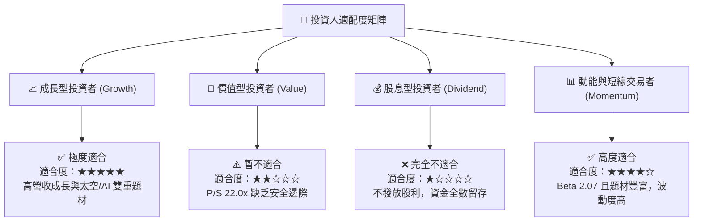

### 10.5 每季財報監控清單（Quarterly Watch List）

為確保投資論點延續，後續各季度財報應重點審視以下可量化指標：

| 追蹤維度 | 關鍵指標 (KPI) | 正常健康門檻 | 警訊觸發點 | 決策意涵 |
|----------|----------------|--------------|------------|----------|
| **成長動能** | 單季營收年增率 (YoY) | **≥ 30.0%** | < 20.0% | 若低於 20% 說明政府或商業拓展受阻，需調降估值倍數 |
| **現金生成** | 季度營運現金流 (OCF) | **> $2,000萬** | < $0 (轉負) | 若 OCF 轉負，破壞其「自主造血」的核心投資論點 |
| **客單價** | 淨留存率 (NDR) | **≥ 115%** | < 105% | 反映客戶是否持續擴大訂閱數據與軟體模組 |
| **稀釋程度** | 股權薪酬 (SBC) / 營收 | **≤ 15.0%** | > 22.0% | 避免高額 SBC 過度稀釋每股實質內質價值 |
| **資產品質** | 遞延收入 (Deferred Rev) | **≥ $2.2億** | < $1.8億 | 遞延收入是未來 12 個月營收的領先指標 |

### 10.6 反面論證：什麼會證明論點錯誤（What Would Change My Mind）

```
╔══════════════════════════════════════════════════════════════════╗
║              ⚠️ 多頭論點失效條件 (Disconfirming Evidence)       ║
╠══════════════════════════════════════════════════════════════════╣
║  本報告之買入評級建立在「營收年增 30%+ 與 FCF 正向」基礎上。     ║
║  若出現以下任一量化條件，將證明本報告多頭邏輯錯誤，需果斷清倉：  ║
║                                                                  ║
║  1. 🔴 營收成長顯著失速：連續兩季營收年增率跌破 15%，表明地理     ║
║     空間數據市場需求陷入瓶頸或遭 competitors 掠奪。               ║
║  2. 🔴 現金流再次惡化：TTM 自由現金流重新轉為負數（-$3,000萬以上) ║
║     且營運現金流無法覆蓋資本支出。                               ║
║  3. 🔴 護城河受損：NRO（美國國家偵察局）或 NATO 等核心政府客戶   ║
║     未能在合約到期後續約，導致 ARR 縮減 > 15%。                 ║
║  4. 🔴 資本效率惡化：ROIC 未能如期於 3 年內向 0% 靠攏，反而退步  ║
║     至 -25% 以下，證實公司持續摧毀股東價值。                     ║
╚══════════════════════════════════════════════════════════════════╝
```

---

> **免責聲明**：本報告為機構級研究參考資料，基於市場公開財務數據分析編製，不構成對任何金融工具的直接買賣建議。投資美股高成長科技股具備極高市場風險與波動性，投資人應自行評估風險並諮詢專業投資顧問。