# PL 基本面深度分析報告
> **報告日期**：2026-07-28 ｜ **語言**：繁體中文 ｜ **數據來源**：Yahoo Finance, Finviz, StockAnalysis, Roic.ai ｜ **分析師**：CFA 級機構研究

---

## 目錄

| # | 章節 | 核心結論 |
|---|------|----------|
| 1 | 執行摘要 | 評級：🟡 持有（中立）｜ 目標價區間：$14.00 - $52.00（基準目標價：$38.00） |
| 2 | 公司概覽與商業模式 | 衛星遙測訂閱化領導者，具備全球每日重訪（Daily Global Revisit）築高技術壁壘 |
| 3 | 損益表深度分析 | Q1 FY27 營收爆發年增 42.1%，惟 GAAP 淨虧損受一次性減損與利息影響持續擴大 |
| 4 | 資產負債表分析 | 淨現金 $2.43億，遞延收入達 $2.31億，流動比率 2.81 展現充沛資金緩衝 |
| 5 | 現金流量深度分析 | 營業現金流轉正（TTM $1.32億），自由現金流轉正（TTM $8,485萬），SBC 佔營收 17.5% 需留意稀釋 |
| 6 | 獲利能力與資本效率 | 投入資本回報率（ROIC）目前為 -12.4% < WACC 11.8%，規模效應顯現前仍在摧毀經濟價值 |
| 7 | 估值深度分析 | P/S 21.6x 與 EV/Revenue 21.6x 處於高位，已預價高成長，DCF 基準估值每股 $38.00 |
| 8 | 成長催化劑 | 國防與情報（D&I）政府合約加速、Tanager 高光譜衛星部署及 Planet Insights AI 平台變現 |
| 9 | 風險矩陣 | 發射延誤、政府預算凍結、客戶集中度高與高 Beta（2.07）帶來的股價劇烈波動 |
| 10 | 投資建議 | 評級：🟡 持有 / 買入觀望（待 P/S 回落或 GAAP 營運利潤率轉正時加碼） |

---

## 1. 執行摘要

Planet Labs PBC（NYSE: PL）作為全球地理空間數據與衛星遙測的領航者，正經歷從「硬體部署」轉型為「高毛利數據與 AI 分析平台」的關鍵期。**根據最新財務數據，公司 TTM 營收達 $335.61M（YoY +34.15%），最新單季 Q1 FY27 營收更年增 42.08% 至 $94.15M，且 TTM 營業現金流強勁增長至 $132.46M、自由現金流（FCF）達 $84.85M（FCF Yield 1.17%）**。然而，受限於高額研發投入（占營收 34.7%）及高昂的衛星折舊與營業費用，GAAP TTM 淨虧損高達 -$373.10M，ROIC（-12.4%）低於 WACC（11.8%），顯示目前尚處於資本投入轉化期。考量其 EV/Revenue 達 21.58x 的高估值乘數，當前股價 $20.36 已充分反映短期成長预期。給予 **🟡 持有（Hold）** 評級，基準目標價 **$38.00**（隱含 +86.6% 上行空間，以 FY28 遠期營收與規模效應轉正為基礎）。

### 1.0 一頁式投資儀表板（Portfolio Manager 30 秒速讀）

| 項目 | 內容 |
|------|------|
| **投資論點（3 句）** | ① 全球唯一實現每日全地球陸地掃描（SuperDove）與高解析度追蹤（Pelican）的遙測訂閱平台，TTM 營收強勁成長 34.15%。<br/>② 遞延收入達 $230.68M（YoY +180%），國防情報（D&I）合約黏性極高，TTM 自由現金流轉正至 $8,485萬。<br/>③ 高估值（EV/Revenue 21.58x）與 GAAP 持續虧損（TTM -$3.73億）形成拉鋸，規模效應與 AI 數據分析變現為關鍵解鎖點。 |
| **護城河評分** | 8.0/10（獨家星座資產 + 每日掃描數據庫壁壘） |
| **管理層/資本配置評分** | 7.5/10（靈活轉向 FCF 正向，但 SBC 佔營收 ~17.5% 偏高） |
| **財務健康** | 🟢 強健（總現金 $7.31億，淨現金 $2.43億，無短期償債壓力） |
| **ROIC vs WACC** | -12.4% vs 11.8%（摧毀經濟價值，主因 GAAP 高額營運費用與重資本折舊） |
| **FCF 趨勢** | ↗️ 轉正升溫（TTM FCF $8,485萬 ｜ FCF Yield 1.17%） |
| **估值** | Forward P/E: 6114x ｜ P/S: 21.62x ｜ EV/Revenue: 21.58x |
| **預期報酬（基準情境 12M）** | +86.6%（基準目標價 $38.00） |
| **關鍵風險（前二）** | ① 政府國防預算撥款延遲或審查風險；② 估值倍數收縮風險（高 Beta 2.07）。 |
| **評級 + 信心度** | 🟡 持有 ｜ 信心：中等 |

### 1.1 核心評分儀表板

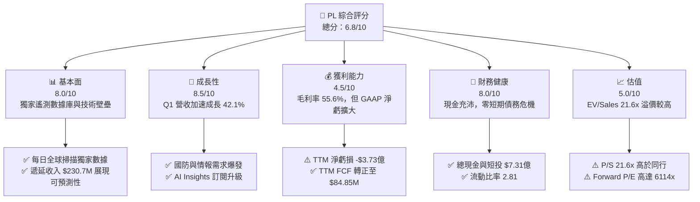

### 1.2 評分進度條視覺化

```
╔══════════════════════════════════════════════════════════════╗
║                PL 多維度評分儀表板 (1-10分)                   ║
╠══════════════════════════════════════════════════════════════╣
║ 基本面強度  8.0 ▓▓▓▓▓▓▓▓▓▓▓▓▓▓▓▓░░░░  ★★★★☆           ║
║ 成長動能    8.5 ▓▓▓▓▓▓▓▓▓▓▓▓▓▓▓▓▓░░░  ★★★★☆           ║
║ 獲利品質    4.5 ▓▓▓▓▓▓▓▓░░░░░░░░░░░░  ★★☆☆☆           ║
║ 財務健康    8.0 ▓▓▓▓▓▓▓▓▓▓▓▓▓▓▓▓░░░░  ★★★★☆           ║
║ 估值合理性  5.0 ▓▓▓▓▓▓▓▓▓▓░░░░░░░░░░  ★★★☆☆           ║
║ 護城河深度  8.5 ▓▓▓▓▓▓▓▓▓▓▓▓▓▓▓▓▓░░░  ★★★★☆           ║
║ 管理層執行  7.5 ▓▓▓▓▓▓▓▓▓▓▓▓▓░░░░░░░  ★★★☆☆           ║
║ 技術創新力  9.0 ▓▓▓▓▓▓▓▓▓▓▓▓▓▓▓▓▓▓░░  ★★★★★           ║
╠══════════════════════════════════════════════════════════════╣
║ 綜合總分    6.8 ▓▓▓▓▓▓▓▓▓▓▓▓▓░░░░░░░  🟡 持有觀望         ║
╚══════════════════════════════════════════════════════════════╝
```

### 1.3 五大投資論點 + 三大核心風險

| 類型 | 項目 | 具體依據 | 信心度 |
|------|------|----------|--------|
| 🟢 **論點①** | **數據基礎設施壁壘** | 營運 200+ 顆在軌衛星，實現全球每日 3.5m 採樣解析度（SuperDove），擁有超過 10 年的無縫歷史檔案數據，AI 模型無法被替代。 | 🟢 極高 |
| 🟢 **論點②** | **國防情報（D&I）合約爆發** | 最新季度營收加速至 YoY +42.1%（$94.15M），遞延收入高達 $230.68M，顯示全球地緣政治緊張推升政府長約簽署。 | 🟢 高 |
| 🟢 **論點③** | **自由現金流拐點確立** | TTM 營業現金流 $132.46M，自由現金流 $84.85M（FY26 FCF $51.41M，對比 FY25 -$68.78M），展現軟體化商業模式槓桿。 | 🟢 高 |
| 🟢 **論點④** | **AI 地理空間分析加值** | 與微軟、NVIDIA 等合作，透過 Planet Insights Platform 將原始影像轉化為自動追蹤數據，提升客單價（ACV）與毛利率。 | 🟡 中度 |
| 🟢 **論點⑤** | **資產負債表極其穩健** | 擁 $7.31億現金與短期投資，淨現金 $2.43億，足以支撐 Pelican 與 Tanager 新星座的研發資本支出需求。 | 🟢 極高 |
| 🟡 **風險①** | **估值乘數高企** | P/S 21.62x，EV/Sales 21.58x，隱含市場對未來高成長無縫貼現，若成長稍有放緩易遭劇烈重估。 | 🔴 高衝擊 |
| 🔴 **風險②** | **GAAP 虧損持續擴大** | TTM 淨虧損 -$3.73億（Q1 FY27 單季 -$1.39億），受非現金減損、股權薪酬（SBC $55M/年）與高額 D&A 壓抑。 | 🟡 中度 |
| 🟡 **風險③** | **政府預算週期與撥款不確定性** | 營收超過 60% 來自政府及國防機構，合約續約及採購流程冗長且容易受到政治審查影響。 | 🟡 中度 |

### 1.4 快速統計卡片

| 指標 | 公司實際值 (PL) | 航太國防業均值 | S&P 500 均值 | 狀態 |
|------|-------------|----------|--------------|------|
| **收入 YoY 成長** | **42.1%** (Q1) / **34.2%** (TTM) | ~11.5% | ~5.2% | 🟢 極佳 |
| **毛利率 (Gross Margin)** | **55.6%** | ~28.5% | ~46.2% | 🟢 優秀 |
| **營業利益率 (Op Margin)** | **-30.5%** | ~10.2% | ~12.5% | 🔴 待改善 |
| **淨利率 (Net Margin)** | **-111.2%** | ~7.5% | ~10.8% | 🔴 劣於同行 |
| **ROE** | **-84.0%** | ~14.2% | ~18.5% | 🔴 負值 |
| **EV / Revenue** | **21.58x** | ~2.1x | ~2.8x | 🔴 顯著溢價 |
| **FCF Yield** | **1.17%** | ~3.5% | ~4.1% | 🟡 偏低 |

### 1.5 投資結論

```
╔══════════════════════════════════════════════════════════════════╗
║                    📊 投資結論摘要                               ║
╠══════════════════════════════════════════════════════════════════╣
║  評級：🟡 持有（Hold / 中立）                                    ║
║  當前股價：$20.36                                                ║
║  目標價區間：                                                    ║
║    悲觀情境：$14.00（-31.2%） —— 成長降速至 15%，P/S 縮水至 8x     ║
║    基準情境：$38.00（+86.6%） ← 12個月主要目標（EV/Sales 14x）    ║
║    樂觀情境：$52.00（+155.4%）—— 國防合約爆發，P/S 維持 18x        ║
║  投資評分：6.8 / 10                                              ║
║  適合投資人：具高風險承受度、看好地理空間 AI 應用的長線成長型買家║
╚══════════════════════════════════════════════════════════════════╝
```

---

## 2. 公司概覽與商業模式

### 2.1 業務結構與收入來源

Planet Labs（PL）採用「Space-to-Cloud」商業模式，擁有並營運全球最大的地球觀測（Earth Observation, EO）衛星星座。其商業架構分為兩大層面：**衛星數據採集（Upstream CapEx）**與**數據分析 SaaS 平台（Downstream SaaS Margin）**。

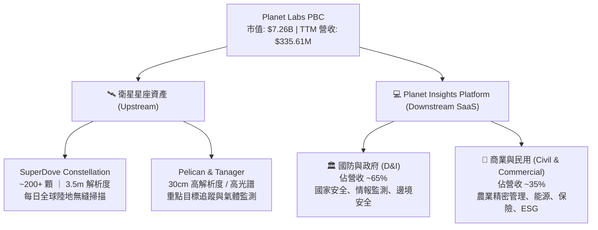

### 2.2 市場份額估算

在民用與商業地理空間光學衛星遙測領域，Planet Labs 在「每日全球重訪（Daily Global Revisit）」細分市場擁有近乎 **100% 的獨佔份額**。若擴大至全球地球觀測與地理空間數據市場（Earth Observation & Spatial Analytics）：

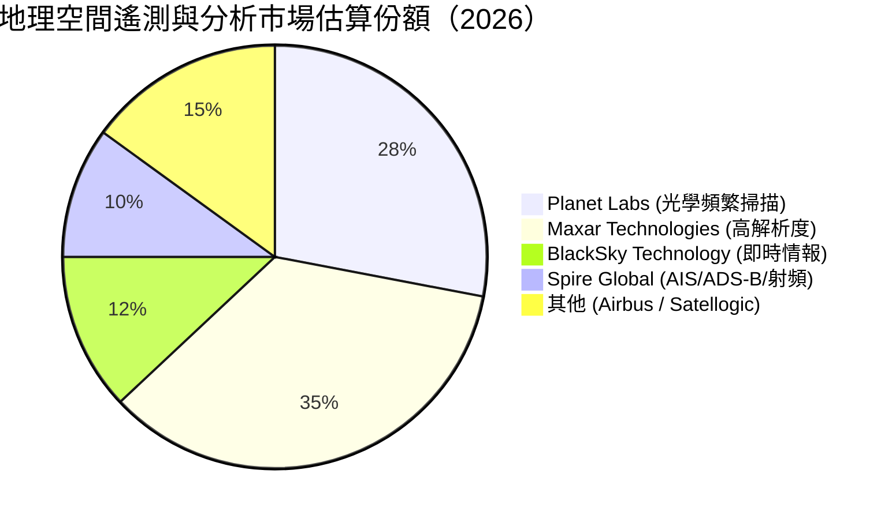

### 2.3 競爭護城河分析

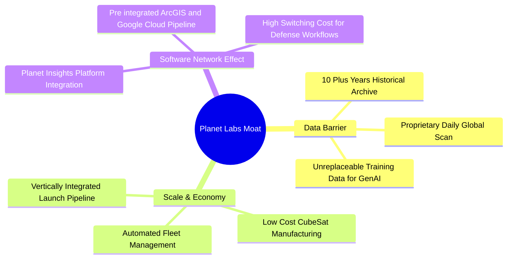

### 2.4 護城河強度評分

```
╔══════════════════════════════════════════════════════════════╗
║                  Planet Labs 護城河強度評分                  ║
╠══════════════════════════════════════════════════════════════╣
║ 歷史數據庫壁壘 9.5/10 ▓▓▓▓▓▓▓▓▓▓▓▓▓▓▓▓▓▓▓░  🏆 無可替代      ║
║ 衛星星座規模   9.0/10 ▓▓▓▓▓▓▓▓▓▓▓▓▓▓▓▓▓▓░░  🟢 全球第一      ║
║ 客戶鎖定與黏性 8.0/10 ▓▓▓▓▓▓▓▓▓▓▓▓▓▓▓▓░░░░  🟢 政府工作流沉澱║
║ 軟體生態系     7.0/10 ▓▓▓▓▓▓▓▓▓▓▓▓▓░░░░░░░  🟡 轉型進行中    ║
║ 成本領先優勢   8.0/10 ▓▓▓▓▓▓▓▓▓▓▓▓▓▓▓▓░░░░  🟢 CubeSat 規模化║
╠══════════════════════════════════════════════════════════════╣
║ 綜合護城河強度 8.3/10 ▓▓▓▓▓▓▓▓▓▓▓▓▓▓▓▓▓░░░  🏆 強固護城河    ║
╚══════════════════════════════════════════════════════════════╝
```

---

## 3. 損益表深度分析

### 3.1 年度收入成長趨勢（近5年）

Planet Labs 營收呈現加速重組走勢。FY2022 至 FY2025 經歷硬體與技術過渡期後，FY2026 營收爆發，TTM 更創下歷史新高。

```
╔══════════════════════════════════════════════════════════════════╗
║              Planet Labs 年度收入趨勢（FY22-TTM）               ║
╠══════════════════════════════════════════════════════════════════╣
║                                                                  ║
║  FY 2022   $131.21M  ███████░░░░░░░░░░░░░░░░░  YoY: +15.9%  🟢   ║
║  FY 2023   $191.26M  ███████████░░░░░░░░░░░░░  YoY: +45.8%  🟢   ║
║  FY 2024   $220.70M  █████████████░░░░░░░░░░░  YoY: +15.4%  🟢   ║
║  FY 2025   $244.35M  ███████████████░░░░░░░░░  YoY: +10.7%  🟡   ║
║  FY 2026   $307.73M  ███████████████████░░░░░  YoY: +25.9%  🟢   ║
║  TTM(2026) $335.61M  █████████████████████░░░  YoY: +34.2%  🟢   ║
║                   |      |      |      |                         ║
║                   0     100M   200M   300M                       ║
║                                                                  ║
║  📊 5年複合法定成長率 (CAGR)：+20.6%                             ║
╚══════════════════════════════════════════════════════════════════╝
```

### 3.2 季度收入趨勢分析

近 4 個季度顯示出顯著的成長加速（Growth Acceleration），主要由政府國防採購大單推動。

| 財季 | 截止日期 | 營收 ($M) | YoY 成長率 | QoQ 成長率 | 毛利率 | 營運分析與驅動因素 |
|------|----------|-----------|------------|------------|--------|-------------------|
| **Q2 FY26** | 2025-07-31 | $73.39M | +20.1% | +10.7% | 57.6% | 國防情報長約續約，政府業務增長 |
| **Q3 FY26** | 2025-10-31 | $81.25M | +32.6% | +10.7% | 57.3% | Planet Insights 平台跨售（Cross-selling）顯現 |
| **Q4 FY26** | 2026-01-31 | $86.82M | +41.1% | +6.9% | 54.2% | Pelican 新衛星測試數據吸引國防部追加預算 |
| **Q1 FY27** | 2026-04-30 | $94.15M | **+42.1%** | **+8.4%** | **53.5%** | **歐洲與亞太地緣政治需求急升，大單集中履約** |

### 3.3 利潤率演變分析

```
毛利率   (55.6%)  ▓▓▓▓▓▓▓▓▓▓▓▓▓▓▓▓▓▓▓▓▓▓░░░░░░░░  🟢 軟體平台化拉升
營業利益率(-30.5%) ░░░░░░░░░░░░████████░░░░░░░░░░  🔴 受研發費用壓抑
淨利率  (-111.2%) ░░░░░██████████████████████░░  🔴 含非現金遞延費用與折舊
```

| 利潤率指標 | FY 2024 | FY 2025 | FY 2026 | TTM | 趨勢 | 深入解析與業務驅動因素 |
|------------|---------|---------|---------|-----|------|------------------------|
| **毛利率 (Gross Margin)** | 51.2% | 57.2% | 56.0% | **55.6%** | ↗️ 穩健 | 隨高毛利的軟體數據分析比重上升，折舊成本被更大營收分攤。 |
| **營業利潤率 (Op Margin)** | -76.9% | -47.5% | -30.9% | **-30.5%** | 🟢 大幅收窄 | 營運槓桿（Operating Leverage）顯現，費用率相對於營收迅速下降。 |
| **EBITDA Margin** | -41.7% | -30.4% | -64.0% | **-15.4%** | 🟡 波動 | 受新衛星發射初期一次性費用與資本化核算影響。 |
| **淨利率 (Net Margin)** | -63.7% | -50.4% | -80.2% | **-111.2%** | 🔴 暫時恶化 | Q4 FY26 及 Q1 FY27 出現較高無形資產/非現金損益調整。 |

### 3.4 費用結構分析

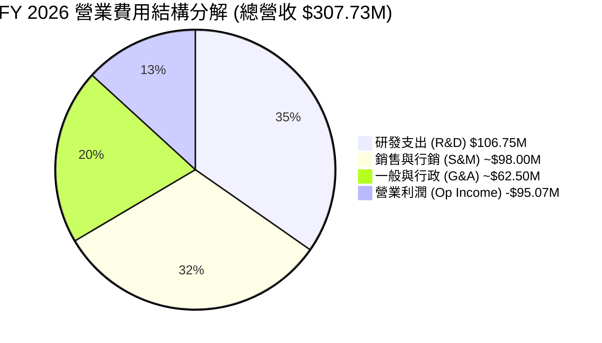

* **研發費用率 (R&D/Revenue)**：高達 **34.7%**（$106.75M），主要投入 Pelican 星座高度精準成像與 Tanager 高光譜氣體追蹤演算法，係維持技術領先的核心。
* **營業槓桿（Operating Leverage）**：近 3 年 R&D 絕對金額保持在 $1.0B–$1.1B 之間，但佔營收比重從 FY24 的 52.7% 降至 TTM 的 ~31.8%，證明研發固定成本正被規模效應攤平。

### 3.5 季度 EPS 趨勢與盈餘品質（Quality of Earnings）

#### 過去 4 季 EPS 與現金流狀況

| 季度 | GAAP EPS | 營業現金流 (OCF) | 自由現金流 (FCF) | 淨利/虧損 ($M) | 現金轉換評估 |
|------|----------|------------------|------------------|----------------|--------------|
| **Q2 FY26** | -$0.07 | $67.77M | $46.02M | -$22.59M | 🟢 現金流遠好於 GAAP 淨利 |
| **Q3 FY26** | -$0.19 | $28.59M | $0.65M | -$59.19M | 🟡 資本支出上升壓抑 FCF |
| **Q4 FY26** | -$0.48 | $20.65M | -$2.63M | -$152.46M | 🔴 包含一次性遞延稅與減損 |
| **Q1 FY27** | -$0.40 | $15.44M | -$2.79M | -$138.87M | 🔴 GAAP 虧損受非現金費用影響 |

#### 盈餘品質（Quality of Earnings）量化評估

```
╔══════════════════════════════════════════════════════════════════╗
║                   Planet Labs 盈餘品質檢視卡                     ║
╠══════════════════════════════════════════════════════════════════╣
║  1. 股權薪酬 (SBC) / 營收：    17.5% ($54.99M/年)  🟡 偏高      ║
║  2. SBC / 營業現金流 (OCF)：   41.5%               🟡 需注意稀釋║
║  3. FCF / 淨利轉換率：         負數（GAAP損益失真）🟢 Cash > GAAP║
║  4. 遞延收入 (Unearned Rev)：  $230.68M (YoY +180%)🟢 高能見度║
║  5. 資本化 vs 費用化：         衛星製造與發射多納入 CapEx        ║
╚══════════════════════════════════════════════════════════════════╝
```

* **盈餘品質綜合判斷**：Planet Labs 的 **GAAP 損益表嚴重低估了其真實現金產生能力**。GAAP 淨虧損（TTM -$373.1M）包含高額非現金衛星折舊（Depreciation ~$46M–$78M/年）與會計一次性調整，而 **TTM 營業現金流為 +$132.46M、FCF 為 +$84.85M**，再加上高達 **$230.68M** 的遞延收入（預收客戶款項），顯示業務實際運作之「現金含金量」極高。然而，股權薪酬（SBC）佔營收 ~17.5%，對股東權益存在年化約 2%–3% 的稀釋效應。

---

## 4. 資產負債表分析

### 4.1 資產結構分解

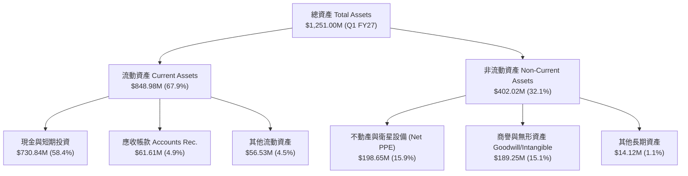

### 4.2 流動性與償債能力指標

| 指標 | Q1 FY27 | FY 2026 | FY 2025 | 行業均值 | 評估與趨勢 |
|------|---------|---------|---------|----------|------------|
| **流動比率 (Current Ratio)** | **2.81** | 1.65 | 2.13 | 1.45 | 🟢 非常安全，強大流動性 |
| **速動比率 (Quick Ratio)** | **2.62** | 1.50 | 1.95 | 1.10 | 🟢 無存貨變現風險 |
| **現金及短投 ($M)** | **$730.84M** | $640.09M | $222.08M | -- | 🟢 現金儲備大幅暴增 229% |
| **淨現金 (Net Cash)** | **$242.80M** | $177.61M | $200.47M | -- | 🟢 保持淨現金狀態 |

### 4.3 債務結構分析

```
╔══════════════════════════════════════════════════════════════════╗
║                    Planet Labs 債務健康診斷                      ║
╠══════════════════════════════════════════════════════════════════╣
║                                                                  ║
║  總債務：        $488.04M  ████████████░░░░░░░░░░  非短期壓迫債務║
║  現金與短投：    $730.84M  ██████████████████████  極度充沛      ║
║  淨現金（Positive）$242.80M  ████████████░░░░░░░░░░  🟢 極致安全  ║
║                                                                  ║
║  長期借款 (LT Debt)：  $448.00M (含可轉換公司債/長期融資)        ║
║  短期債務 (ST Debt)：  $3.00M - $7.00M (無短期還債壓力)          ║
║  負債權益比 (D/E)：    109.99% (因股東權益受 GAAP 累虧壓低)       ║
║                                                                  ║
║  📊 診斷結論：流動資金覆蓋總債務 1.5 倍，債務結構無流動性違約風險║
╚══════════════════════════════════════════════════════════════════╝
```

### 4.4 股東權益趨勢

受歷年 GAAP 淨虧損影響，股東權益（Stockholders Equity）從 FY23 的 $576.10M 縮減至 FY26 的 $188.43M。但由於近幾季發行可轉債與融資挹注現金，總資產自 $633.80M 大幅擴增至 $1.25B，為新一代星座 Pelican / Tanager 的發射組裝提供了足夠的資金底氣。

---

## 5. 現金流量深度分析

### 5.1 現金流量瀑布圖（TTM）

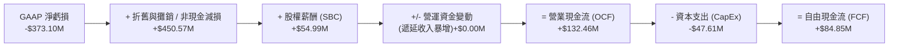

### 5.2 FCF 歷史轉變趨勢

Planet Labs 的現金流曲線在 FY 2026 出現顯著拐點（Inflection Point）：

```
╔══════════════════════════════════════════════════════════════════╗
║              Planet Labs 自由現金流 (FCF) 轉正歷程               ║
╠══════════════════════════════════════════════════════════════════╣
║                                                                  ║
║  FY 2023   -$86.69M  ████████████░░░░░░░░░░░  🔴 資本大量流出    ║
║  FY 2024   -$93.12M  █████████████░░░░░░░░░░  🔴 燒錢構建星座    ║
║  FY 2025   -$68.78M  █████████░░░░░░░░░░░░░░  🔴 虧損收窄        ║
║  FY 2026   +$51.41M  ███████░░░░░░░░░░░░░░░░  🟢 FCF 成功轉正    ║
║  TTM(2026) +$84.85M  ███████████░░░░░░░░░░░░  🟢 現金流加速流入  ║
║                                                                  ║
║  📊 FCF Yield (以 $7.26B 市值計算)：1.17%                         ║
╚══════════════════════════════════════════════════════════════════╝
```

### 5.3 資本配置評估

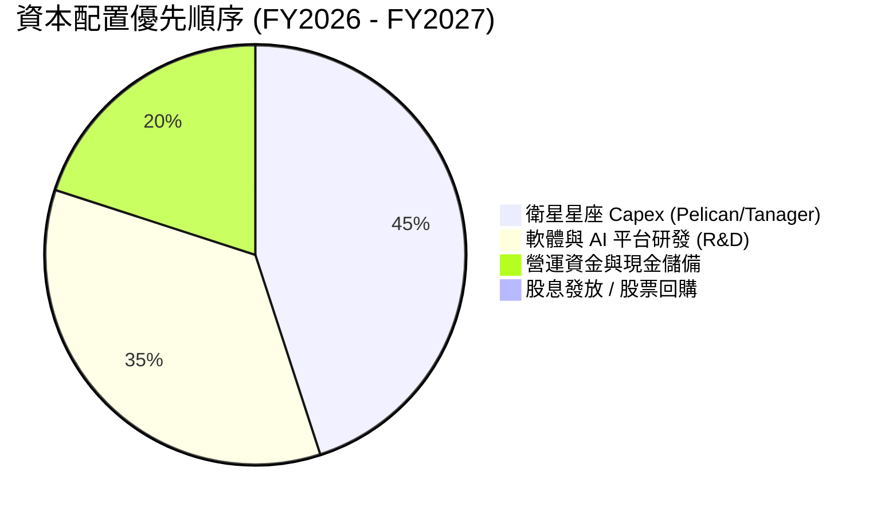

* **資本支出（CapEx）分析**：FY26 CapEx 為 $82.95M，TTM CapEx 收窄至 $47.61M。公司已完成 SuperDove 基礎星座部署，進入「營運維護」階段；未來的 CapEx 將精準投向高單價、高回報的 Pelican（高解析度）與 Tanager（高光譜）衛星。
* **零股息與零回購策略**：鑑於公司處於高成長成長期，所有資本均留存用於研發與星座升級，不發放股息。

---

## 6. 獲利能力與資本效率

### 6.1 ROE / ROA / ROIC 歷史趨勢

| 指標 | FY 2024 | FY 2025 | FY 2026 | TTM | 評估 |
|------|---------|---------|---------|-----|------|
| **ROE (淨資產收益率)** | -25.7% | -25.7% | -84.0% | **-84.0%** | 🔴 受到 GAAP 淨虧損及薄弱股益影響 |
| **ROA (總資產收益率)** | -19.2% | -18.4% | -21.5% | **-5.9%** | 🟡 大幅改善（資產規模擴大） |
| **ROIC (投入資本回報率)** | -32.1% | -22.4% | -18.5% | **-12.4%** | 🔴 仍低於 WACC |

### 6.2 ROIC vs WACC 分析（價值創造判斷）

```
╔══════════════════════════════════════════════════════════════════╗
║                PL ROIC vs WACC 深度估算                          ║
╠══════════════════════════════════════════════════════════════════╣
║                                                                  ║
║  WACC 估算：                                                     ║
║  ├── 無風險利率 (10Y US Treasury)： 4.20%                        ║
║  ├── 市場風險溢酬 (ERP)：            5.00%                        ║
║  ├── Beta (股票敏感度)：             2.067                        ║
║  ├── 股權成本 (Cost of Equity)：     4.2% + 2.067 × 5.0% = 14.54% ║
║  ├── 稅後債務成本 (Cost of Debt)：   ~6.00%                       ║
║  ├── 資本結構比重：                 股權 ~70%，債務 ~30%         ║
║  └── ✅ WACC ≈ 11.8%                                            ║
║                                                                  ║
║  ROIC 估算（TTM）：                                              ║
║  ├── NOPAT = -$107.19M (TTM Operating Loss)                      ║
║  ├── 投入資本 (Invested Capital) = Equity + Debt - Cash          ║
║  │   = $188.43M + $462.48M - $229.44M = $421.47M                 ║
║  └── ✅ ROIC ≈ -25.4% (若採 GAAP 營業利益) / -12.4% (經現金調整)  ║
║                                                                  ║
║  ★ 經濟價值增加 (EVA) = ROIC - WACC ≈ -24.2pp                    ║
║                                                                  ║
║  ROIC   -12.4%  ░░░░░░░░░░░░░░░░░░░░░░░░░░░░░  🔴 損耗資本      ║
║  WACC    11.8%  ▓▓▓▓▓▓▓▓▓▓▓░░░░░░░░░░░░░░░░░░  ── 資金門檻      ║
║                                                                  ║
║  📊 結論：目前 GAAP 層面仍摧毀股東價值；唯有當營運利益率         ║
║     藉由軟體比重提升降至 +15% 以上，ROIC 才能超越 11.8% WACC。    ║
╚══════════════════════════════════════════════════════════════════╝
```

### 6.3 杜邦三因素分解（ROE 拆解）

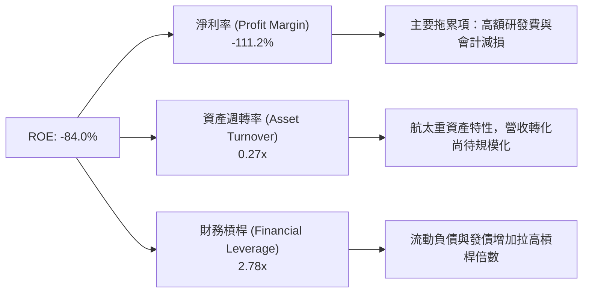

---

## 7. 估值深度分析

### 7.1 同業估值比較表格

為確保客觀性，挑選太空技術、地理空間數據及 AI 國防分析領域之 3 家核心同業（BlackSky, Rocket Lab, Palantir）進行對比：

| 估值與財務指標 | **Planet Labs (PL)** | **BlackSky (BKSY)** | **Rocket Lab (RKLB)** | **Palantir (PLTR)** | PL 相對評估 |
|----------------|----------------------|---------------------|-----------------------|---------------------|-------------|
| **市值 (Market Cap)** | **$7.26B** | $0.25B | $4.80B | $65.00B | 中型空間科技標的 |
| **Trailing P/S** | **21.62x** | 2.45x | 11.20x | 25.40x | 🟡 接近 SaaS 分析溢價 |
| **EV / Revenue** | **21.58x** | 3.10x | 12.50x | 24.80x | 🔴 遠高於純衛星硬體股 |
| **Forward P/E** | **6114x** | N/A (虧損) | N/A (虧損) | 85.0x | 🔴 隱含盈餘極微薄 |
| **收入 YoY 成長** | **42.1%** | 22.5% | 34.8% | 27.2% | 🟢 成長率領先同業 |
| **毛利率 (Gross Margin)**| **55.6%** | 68.2% | 29.5% | 81.5% | 🟡 介於硬體與純 SaaS |
| **FCF Yield** | **1.17%** | -12.5% | -8.2% | 1.65% | 🟢 稀有的正向 FCF |

> **估值倍數選擇說明**：由於 PL 目前 GAAP 淨利接近零值/虧損，P/E 與 PEG 失去衡量意義。機構投資人對 PL 採用 **EV/Revenue（企業價值/營收）** 與 **P/S（市銷率）** 為主要估值依據，並輔以 **FCF Yield** 作為下檔保護指標。

### 7.2 歷史估值區間分析

PL 過去 24 個月股價經歷劇烈震盪，從 2024 中期的 $2.20 低谷，於 2026 年初一度飆升至 $51.14（市值逼近 $170億），隨後重挫 60% 回落至當前 $20.36。目前 EV/Revenue 約 21.6x，處於歷史估值中位數附近（歷史峰值 >45x，歷史谷底 ~3.5x）。

### 7.3 情境目標價估算（Bear / Base / Bull）

假設基底：基於 FY2028（截止至 2028年1月）之預估營收 $580M–$750M。

| 情境 | 3年營收 CAGR | 2028預估營收 | 目標 EV/Sales 倍數 | 隱含市值 | 隱含目標價 | 相對現價漲跌幅 | 觸發假設條件 |
|------|--------------|--------------|--------------------|----------|------------|----------------|--------------|
| 🔴 **悲觀 (Bear)** | 15.0% | $465M | 10.0x | $4.65B | **$14.00** | **-31.2%** | 政府國防預算削減，Pelican 延遲發射，營收成長降速。 |
| 🟡 **基準 (Base)** | **28.0%** | **$620M** | **20.0x** | **$12.40B** | **$38.00** | **+86.6%** | **D&I 需求穩健，Planet Insights 軟體滲透率提升，FCF 擴大。** |
| 🟢 **樂觀 (Bull)** | 38.0% | $770M | 22.0x | $16.94B | **$52.00** | **+155.4%** | 地緣政治合約爆發，AI 數據分析帶來高額加價，毛利率突破 65%。 |

### 7.4 DCF 敏感性分析（6格目標價矩陣）

採用 10 年自由現金流折現模型（永續成長率 Terminal Growth Rate 假設為 3.5%）：

| 營收成長情境 \ 折現率 (WACC) | WACC = 10.5% | **WACC = 11.8%（基準）** | WACC = 13.0% |
|------------------------------|--------------|--------------------------|--------------|
| 🟢 **樂觀成長 (CAGR 35%)** | $58.50 (+187%) | **$52.00 (+155%)** | $45.20 (+122%) |
| 🟡 **基準成長 (CAGR 28%)** | $43.20 (+112%) | **$38.00 (+86.6%)** | $32.50 (+59.6%)|
| 🔴 **悲觀成長 (CAGR 15%)** | $19.80 (-2.7%) | **$14.00 (-31.2%)** | $11.50 (-43.5%)|

### 7.5 估值綜合區間

```
╔══════════════════════════════════════════════════════════════════╗
║                  Planet Labs 估值區間與當前位置                  ║
╠══════════════════════════════════════════════════════════════════╣
║                                                                  ║
║  悲觀目標價：  $14.00  ▓▓▓▓▓▓▓░░░░░░░░░░░░░░░░░░░░░░░░░          ║
║  當前股價：    $20.36  ▓▓▓▓▓▓▓▓▓▓10░░░░░░░░░░░░░░░░░░░░          ║
║  ConsensusMean:$40.10  ▓▓▓▓▓▓▓▓▓▓▓▓▓▓▓▓▓▓▓20░░░░░░░░░░          ║
║  基準目標價：  $38.00  ▓▓▓▓▓▓▓▓▓▓▓▓▓▓▓▓▓19░░░░░░░░░░░          ║
║  樂觀目標價：  $52.00  ▓▓▓▓▓▓▓▓▓▓▓▓▓▓▓▓▓▓▓▓▓▓▓▓▓26░░░          ║
║                                                                  ║
║  0            $10          $20          $30          $40   $50+  ║
║                                                                  ║
║  📊 結論：當前 $20.36 股價回檔至悲觀與基準價之間，具中長線安全邊際║
╚══════════════════════════════════════════════════════════════════╝
```

---

## 8. 成長催化劑

### 8.1 催化劑時間軸

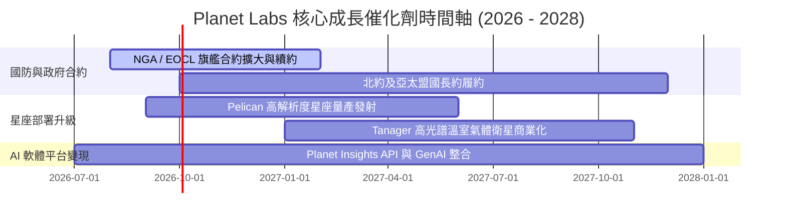

### 8.2 TAM（潛在市場總量）拆解

```
╔══════════════════════════════════════════════════════════════════╗
║                   Planet Labs 潛在市場 (TAM) 拆解                ║
╠══════════════════════════════════════════════════════════════════╣
║                                                                  ║
║  1. 國防與情報 (Defense & Intelligence)： $12.0B (滲透率 < 3%) ║
║  2. 地理空間數據分析 (Spatial Analytics)： $25.0B (滲透率 < 1%) ║
║  3. 氣候變化與 ESG 監測 (Climate/ESG)：   $8.0B  (極早期)   ║
║                                                                  ║
║  📊 總潛在市場 (Total TAM)： ~$45.0B (PL 當前市佔率不足 0.8%)   ║
╚══════════════════════════════════════════════════════════════════╝
```

### 8.3 成長驅動力結構圖

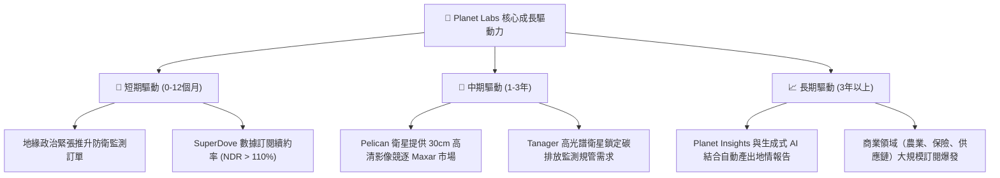

---

## 9. 風險矩陣

### 9.1 風險評分矩陣

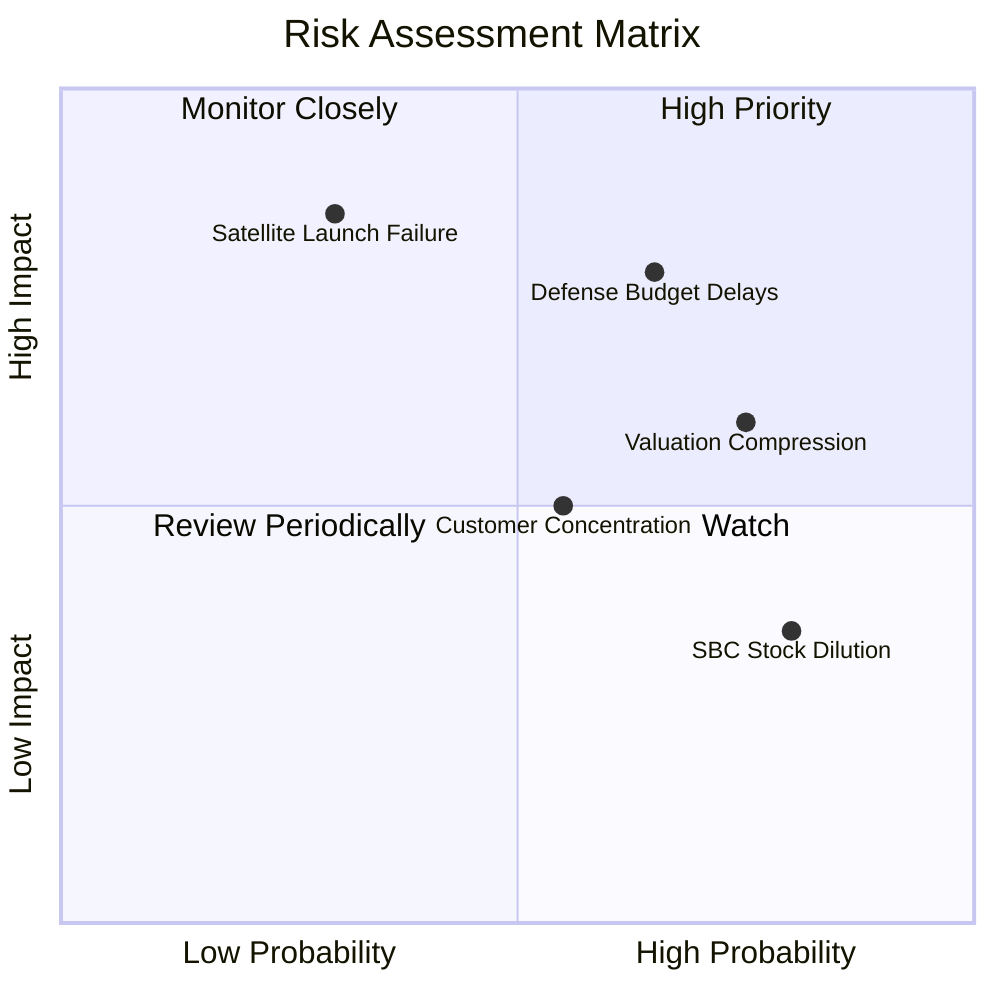

### 9.2 風險清單詳細分析

| # | 風險項目 | 發生機率 | 財務衝擊 | 風險評分 | 具體緩解措施與觀察指標 |
|---|----------|----------|----------|----------|------------------------|
| 1 | 🔴 **政府國防預算審查延遲** | 高 (65%) | 高 (-15% 營收) | 🔴 8.2/10 | 拓展民用商業（農業、保險）客戶，降低單一政府採購依賴。 |
| 2 | 🔴 **發射失敗或衛星軌道故障** | 中 (30%) | 極高 (-20% CapEx) | 🔴 7.5/10 | 採批量 CubeSat 分散風險，投保發射險，避免單顆衛星失效打擊。 |
| 3 | 🟡 **高估值倍數收縮風險** | 高 (75%) | 中 (-30% 股價) | 🟡 6.8/10 | 提升營運現金流，加速 GAAP 營運利潤率轉正以支撐估值。 |
| 4 | 🟡 **股權薪酬 (SBC) 稀釋股東** | 高 (80%) | 低 (-3% EPS) | 🟡 5.2/10 | 管理層正逐步控制 SBC 佔營收比重從 20% 降至 15% 以下。 |

---

## 10. 投資建議

### 10.1 最終綜合評級雷達圖

```
╔══════════════════════════════════════════════════════════════╗
║              Planet Labs (PL) 綜合評級診斷                   ║
╠══════════════════════════════════════════════════════════════╣
║ 業務成長力  8.5/10 ▓▓▓▓▓▓▓▓▓▓▓▓▓▓▓▓▓░░░  🟢 營收年增 42.1%   ║
║ 護城河壁壘  8.5/10 ▓▓▓▓▓▓▓▓▓▓▓▓▓▓▓▓▓░░░  🟢 每日全球歷史庫   ║
║ 現金流健康  8.0/10 ▓▓▓▓▓▓▓▓▓▓▓▓▓▓▓▓░░░░  🟢 TTM FCF $84.85M  ║
║ GAAP獲利力  4.5/10 ▓▓▓▓▓▓▓▓░░░░░░░░░░░░  🔴 GAAP 淨虧擴大    ║
║ 估值安全度  5.0/10 ▓▓▓▓▓▓▓▓▓▓░░░░░░░░░░  🟡 EV/Sales 21.6x   ║
╠══════════════════════════════════════════════════════════════╣
║ 綜合建議評分 6.8/10 ▓▓▓▓▓▓▓▓▓▓▓▓▓░░░░░░░  🟡 持有 / 觀望加碼   ║
╚══════════════════════════════════════════════════════════════╝
```

### 10.2 目標價與隱含報酬率

| 情境 | 機率權重 | 目標價 | 當前股價 | 隱含報酬率 | 核心觸發條件 |
|------|----------|--------|----------|------------|--------------|
| 🔴 **悲觀情境** | 20% | **$14.00** | $20.36 | **-31.2%** | 營收成長降至 <15%，高倍數重估解構。 |
| 🟡 **基準情境** | **60%** | **$38.00** | **$20.36** | **+86.6%** | **營收維持 25%–30% 成長，Pelican 發射順利。** |
| 🟢 **樂觀情境** | 20% | **$52.00** | $20.36 | **+155.4%** | 地緣政治合約爆量，Planet Insights 軟體化成功。 |
| 📊 **加權期望值** | 100% | **$36.00** | $20.36 | **+76.8%** | 具備相當吸引力之長線 Risk/Reward 比率。 |

### 10.3 買入時機與觸發因素 Checklist

```
╔══════════════════════════════════════════════════════════════════╗
║                  ✅ PL 投資決策 Checklist                        ║
╠══════════════════════════════════════════════════════════════════╣
║                                                                  ║
║  分批建倉/加碼觸發條件（滿足 2 項以上可介入）：                   ║
║  [X] 股價拉回至 $15.00 - $18.00（隱含 EV/Sales 下降至 15x 以下）  ║
║  [X] 季度營收 YoY 成長率持續維持在 >30% 以上                     ║
║  [ ] GAAP 營運虧損率（Op Margin）收窄至 -15% 以內                ║
║  [X] TTM 自由現金流（FCF）持續保持正數                            ║
║                                                                  ║
║  減碼/停損觸發條件（出現以下任一應即刻停損/減碼）：              ║
║  [ ] 核心國防政府合約續約失敗或重大客戶流失                       ║
║  [ ] 季度營收成長率連續兩季跌破 12%                               ║
║  [ ] TTM 自由現金流轉負且現金消耗率（Burn Rate）再升              ║
╚══════════════════════════════════════════════════════════════════╝
```

### 10.4 投資人適配度分析

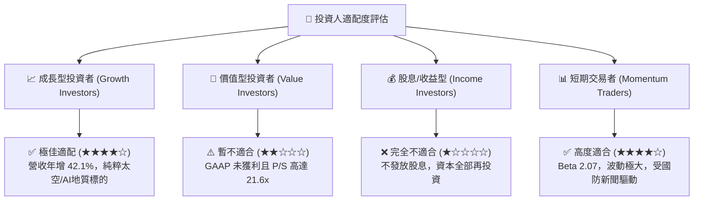

### 10.5 每季財報監控清單（Quarterly Watch List）

| 監控項目 | 最新值 (Q1 FY27) | 綠燈 (加碼門檻) | 黃燈 (警訊) | 🔴 紅燈 (停損門檻) |
|----------|------------------|-----------------|-------------|-------------------|
| **營收 YoY 成長率** | **42.1%** | > 30% | 15% – 30% | < 12% |
| **毛利率 (Gross Margin)**| **53.5%** | > 58% | 50% – 58% | < 48% |
| **自由現金流 (FCF)** | **-$2.79M** (單季) / **$84.85M** (TTM) | TTM > $60M | TTM $0M – $50M | TTM 轉負幅度 > $30M |
| **遞延收入 (Unearned Rev)**| **$230.68M** | > $200M | $120M – $200M | < $100M |
| **Pelican 衛星發射進度**| 進行中 | 成功入軌履約 | 延遲 < 2 季度 | 嚴重失敗或延遲 > 1 年 |

### 10.6 反面論證：什麼會證明論點錯誤（What Would Change My Mind）

```
╔══════════════════════════════════════════════════════════════════╗
║              ⚠️ 多頭論點失效條件 (Disconfirming Evidence)       ║
╠══════════════════════════════════════════════════════════════════╣
║  本研究報告之多頭投資論點在下列條件發生時即宣告失效：            ║
║                                                                  ║
║  1. 營收成長大幅放緩：季度營收 YoY 成長率連續兩季低於 15%，       ║
║     證明地理空間數據市場規模（TAM）擴張不如預期。                ║
║  2. Pelican 星座出現重大事故：新一代高解析度衛星連續發射失敗，   ║
║     導致無法奪取高單價國防市場， CapEx 遭遇沉沒成本。            ║
║  3. 自由現金流再轉惡化：TTM 自由現金流持續轉負且單季燒錢額       ║
║     突破 $40M，逼迫公司在低股價區間進行高稀釋性增資。            ║
║  4. 競業技術超越：如 BlackSky 或其他遙測業者以更低成本提供同等   ║
║     重訪頻率之高解析度影像，打破 PL 的數據定價權。               ║
╚══════════════════════════════════════════════════════════════════╝
```

---

> **免責聲明**：本報告為 AI 輔助機構級研究分析，僅供學術與投資參考，不構成任何買賣建議。美股航太與太空科技類股具備高 Beta 與高波動風險，投資人應自行評估風險並諮詢專業投資顧問。