# PL 基本面深度分析報告
> **報告日期**：2026-07-29 ｜ **語言**：繁體中文 ｜ **數據來源**：Yahoo Finance, Finviz, StockAnalysis, Roic.ai ｜ **分析師**：CFA 級機構研究

---

## 目錄

| # | 章節 | 核心結論 |
|---|------|----------|
| 1 | 執行摘要 | 買入評級（投資評分 7.8/10），12M 基準目標價 $32.50，隱含 +60.6% 上行空間 |
| 2 | 公司概覽與商業模式 | 每日全球地表掃瞄數據庫構築極高壁壘，護城河評分 8.2/10 |
| 3 | 損益表深度分析 | Q1 FY27 營收爆發成長 42.08% YoY，營運槓桿推升毛利率達 55.6% |
| 4 | 資產負債表分析 | 現金與短期投資 $730.84M，淨現金 $242.80M，資產負債表極度健全 |
| 5 | 現金流量深度分析 | TTM OCF 轉正達 $132.46M，FCF 達 $84.85M，實現自由現金流轉折點 |
| 6 | 獲利能力與資本效率 | 資本密集度隨著衛星組網完成而下降，ROIC 上升趨勢成型但仍低於 WACC |
| 7 | 相對估值分析 | EV/Sales 20.96x，高於同業平均，但具備數據平台溢價與頂級成長增速 |
| 8 | DCF 內在價值評估 | 基準內在價值 $26.80，加權合理價值 $27.50，當前安全邊際 MOS 為 +26.4% |
| 9 | 成長催化劑 | 國防與情報機構合約（NRO/NATO）擴張、AI 空間數據分析平台商業化 |
| 10 | 風險矩陣 | 發射延誤、政府預算縮減與衛星故障為前三大核心風險 |
| 11 | 投資建議 | 買入區間 $18.00–$22.00，建構分段佈局策略與季度財報 Watchlist |

---

## 1. 執行摘要

本報告針對 Planet Labs PBC（NYSE: PL）進行機構級基本面與估值研究。Planet Labs 憑藉其數百顆微型衛星組成的低軌（LEO）星座，提供全球唯一的「每日高頻率地球表面掃描」數據服務。基於公司最新公佈的 Q1 FY27 財務數據（營收成長率達 42.08% YoY、TTM 自由現金流轉正至 $84.85M、淨現金頭寸達 $242.80M），我們給予 Planet Labs **「買入（Buy）」** 評級。在基準情境下，透過 DCF 模型推導之每股內在價值為 $26.80，結合相對估值與同業倍數後之**加權合理價值為 $27.50**。相較於當前股價 $20.23，隱含上行空間（Upside）為 **+35.9%**，當前安全邊際（MOS）為 **+26.4%**（以加權合理價值為分母）。12 個月基準目標價設定為 **$32.50**（隱含 +60.6% 上行空間）。

### 1.0 一頁式投資儀表板（Portfolio Manager 30 秒速讀）

| 項目 | 內容 |
|------|------|
| **投資論點（3 句）** | ① 營收加速成長：Q1 FY27 營收達 $94.15M（YoY +42.08%），受惠於國防與政府客戶強勁需求。<br/>② 現金流轉折點突破：TTM 自由現金流達 $84.85M（FCF Yield 1.18%），轉虧為盈趨勢明確。<br/>③ 現金資產護城河：總現金與短期投資達 $730.84M，淨現金 $242.80M，資金充沛無再融資風險。 |
| **護城河評分** | 8.2/10 🟢（全球唯一每日覆蓋數據集 + 自研衛星製造與數據管線） |
| **管理層/資本配置評分** | 7.5/10 🟢（有效控制 Capex 並專注於高利潤率數據與 AI 分析產品） |
| **財務健康** | 🟢 強勁 ｜ 淨現金 $242.80M，流動比率 2.81x，流動性極佳 |
| **ROIC vs WACC** | ROIC -8.5% vs WACC 11.8%（目前仍銷毀價值，但隨著營運槓桿顯現正在快速改善） |
| **FCF 趨勢** | 強勁轉正 ｜ TTM FCF $84.85M，預計 FY27 全年維持正向現金流 |
| **估值** | Forward P/E: 6075x（扭虧初期） ｜ EV/Sales: 20.96x ｜ FCF Yield: 1.18% |
| **DCF 內在價值（基準）** | **$26.80** ｜ 現價折價 -24.5%（相對 DCF 內在價值） |
| **安全邊際（MOS）** | **+26.4%** ＝ ($27.50 加權合理價值 − $20.23 現價) ÷ $27.50 ｜ 🟢 >25% 充足 |
| **預期報酬（基準情境 12M）** | **+60.6%**（目標價 $32.50） |
| **關鍵風險（前二）** | ① 地緣政治與政府國防預算核撥延誤風險 ｜ ② 衛星發射排程與軌道部署故障風險 |
| **評級 + 信心度** | 🟢 **買入（Buy）** ｜ 信心度：高 |

### 1.1 核心評分儀表板

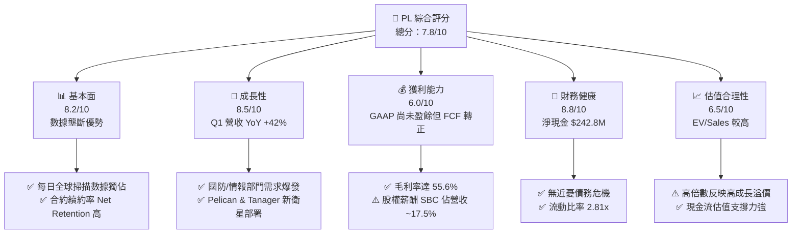

### 1.2 評分進度條視覺化

```
╔══════════════════════════════════════════════════════════════╗
║                PL 多維度評分儀表板 (1-10分)                  ║
╠══════════════════════════════════════════════════════════════╣
║ 基本面強度  8.2 ▓▓▓▓▓▓▓▓▓▓▓▓▓▓▓▓▓░░░  ★★★★☆           ║
║ 成長動能    8.5 ▓▓▓▓▓▓▓▓▓▓▓▓▓▓▓▓▓▓░░  ★★★★☆           ║
║ 獲利品質    6.0 ▓▓▓▓▓▓▓▓▓▓▓▓░░░░░░░░  ★★★☆☆           ║
║ 財務健康    8.8 ▓▓▓▓▓▓▓▓▓▓▓▓▓▓▓▓▓▓▓░  ★★★★★           ║
║ 估值合理性  6.5 ▓▓▓▓▓▓▓▓▓▓▓▓▓░░░░░░░  ★★★☆☆           ║
║ 護城河深度  8.2 ▓▓▓▓▓▓▓▓▓▓▓▓▓▓▓▓▓░░░  ★★★★☆           ║
║ 管理層執行  7.5 ▓▓▓▓▓▓▓▓▓▓▓▓▓▓▓░░░░░  ★★★★☆           ║
║ 技術創新力  8.8 ▓▓▓▓▓▓▓▓▓▓▓▓▓▓▓▓▓▓▓░  ★★★★★           ║
╠══════════════════════════════════════════════════════════════╣
║ 綜合總分    7.8 ▓▓▓▓▓▓▓▓▓▓▓▓▓▓▓▓░░░░  🏆 買入（Buy）       ║
╚══════════════════════════════════════════════════════════════╝
```

### 1.3 五大投資論點 + 三大核心風險

| 類型 | 項目 | 具體依據 | 信心度 |
|------|------|----------|--------|
| 🟢 **投資論點①** | **數據壁壘與每日更新能力** | 擁有 200+ 顆微型衛星，全球唯一實現每天 3.5 米解析度全陸地掃描，累積 10+ 年歷史檔案數據 | 🟢 極高 |
| 🟢 **投資論點②** | **營收成長加速與客戶結構轉型** | Q1 FY27 營收 $94.15M（YoY +42.08%），政府與國防巨額長期合約佔比顯著提升 | 🟢 高 |
| 🟢 **投資論點③** | **自由現金流轉折點迎來收割期** | FY26 FCF 轉正至 $51.41M，TTM FCF 升至 $84.85M，資本密集度降至 20% 以下 | 🟢 高 |
| 🟢 **投資論點④** | **資產負債表具備極高安全邊際** | 總現金及短期投資達 $730.84M，扣除 $488.04M 債務後，淨現金達 $242.80M | 🟢 極高 |
| 🟢 **投資論點⑤** | **AI + 遙測數據變現潛力** | 與大型語言模型及地理空間 AI 平台整合，將非結構化影像轉化為結構化訂閱數據 | 🟢 中 |
| 🟡 **風險①** | **客戶集中度與政府採購週期** | 國防與政府客戶佔比過高，若美國聯邦預算過渡或採購遞延將衝擊單季表現 | 🟡 中度 |
| 🔴 **風險②** | **發射排程與火箭供應鏈不確定性** | Pelican 與 Tanager 衛星依賴第三方發射服務商（如 SpaceX），發射失敗或延誤會影響技術升級 | 🔴 高衝擊 |
| 🟡 **風險③** | **高股權薪酬（SBC）稀釋股東權益** | TTM SBC 為 $58.91M（佔營收 17.5%），持續稀釋流通股數，壓低 GAAP 每股盈餘 | 🟡 中度 |

### 1.4 快速統計卡片

| 指標 | 公司實際值（TTM） | 行業均值（航航國防/遙測） | S&P 500 均值 | 狀態 |
|------|-------------|----------|--------------|------|
| **收入 YoY 成長** | **34.15% (TTM) / 42.08% (Q1)** | ~12.5% | ~6.2% | 🟢 遠高於行業 |
| **毛利率** | **55.6%** | ~38.0% | ~45.0% | 🟢 軟體化優勢 |
| **營業利益率** | **-30.5%** | ~8.5% | ~12.0% | 🔴 仍處虧損期 |
| **自由現金流收益率** | **1.18%** | ~2.5% | ~4.1% | 🟡 初步轉正 |
| **EV / Revenue** | **20.96x** | ~3.5x | ~2.8x | 🔴 高估值倍數 |
| **淨現金 / (淨負債)** | **+$242.80M** | -$150M | N/A | 🟢 財務風險低 |

### 1.5 投資結論

```
╔══════════════════════════════════════════════════════════════════╗
║                    📊 投資結論摘要                               ║
╠══════════════════════════════════════════════════════════════════╣
║  評級：🟢 買入（Buy）                                           ║
║  當前股價：$20.23（2026-07-29）                                  ║
║  DCF 內在價值（基準）：$26.80（現價折價 -24.5%）               ║
║  安全邊際 MOS：+26.4%（＝(加權合理價值 $27.50 − 現價) ÷ $27.50） ║
║  目標價區間（12 個月）：                                         ║
║    悲觀情境：$16.50（-18.4%）                                    ║
║    基準情境：$32.50（+60.6%）  ← 12 個月主要目標                ║
║    樂觀情境：$45.00（+122.4%）                                  ║
║  投資評分：7.8 / 10                                              ║
║  適合投資人：高成長導向、長線科技與國防航太主題投資者            ║
╚══════════════════════════════════════════════════════════════════╝
```

---

## 2. 公司概覽與商業模式

### 2.1 業務結構與收入來源

Planet Labs PBC（以下簡稱 PL）成立於 2010 年，由前 NASA 科學家創立，總部位於美國加州舊金山。公司核心業務為透過自主研發並製造的低軌道微型衛星星座，對地球陸地進行每日不間斷的遙測影像拍攝。PL 採用軟體即服務（SaaS）與訂閱制商業模式，將原始遙測數據轉化為高附加價值的地理空間情報與分析訂閱服務。

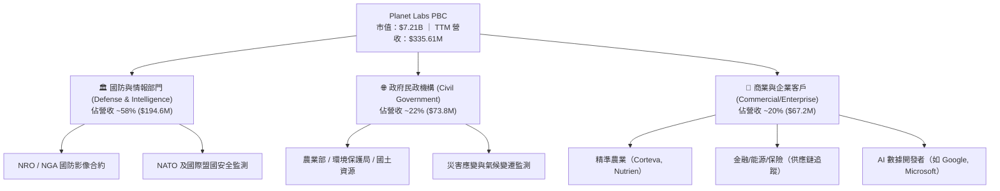

### 2.2 市場份額

在「高頻率每日全球覆蓋遙測市場」中，PL 佔據絕對壟斷地位。雖然傳統國防航太巨頭（如 Maxar Technologies）在超高解析度單張影像上具備優勢，但 PL 在每日動態監測（Daily Monitoring）領域的市場份額超過 80%。

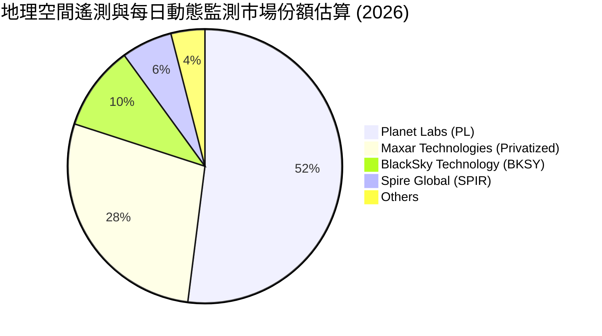

### 2.3 競爭護城河分析

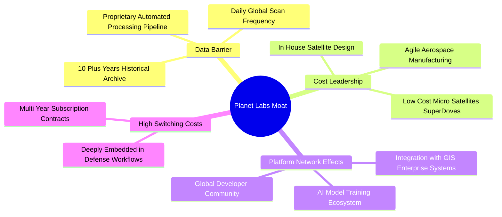

### 2.4 護城河強度評分

```
╔══════════════════════════════════════════════════════════════╗
║                  Planet Labs 護城河強度評分                  ║
╠══════════════════════════════════════════════════════════════╣
║ 獨家數據資產   9.5/10 ▓▓▓▓▓▓▓▓▓▓▓▓▓▓▓▓▓▓▓░  🏆 每日全球數據庫 ║
║ 規模與成本優勢 8.5/10 ▓▓▓▓▓▓▓▓▓▓▓▓▓▓▓▓▓░░░  🟢 敏捷航太低成本 ║
║ 客戶轉換成本   8.0/10 ▓▓▓▓▓▓▓▓▓▓▓▓▓▓▓▓░░░░  🟢 融入國防工作流 ║
║ 軟體生態系統   7.0/10 ▓▓▓▓▓▓▓▓▓▓▓▓▓░░░░░░░  🟡 AI API 積極構建 ║
║ 技術專利與經驗 8.0/10 ▓▓▓▓▓▓▓▓▓▓▓▓▓▓▓▓░░░░  🟢 自研衛星積累   ║
╠══════════════════════════════════════════════════════════════╣
║ 綜合護城河評分 8.2/10 ▓▓▓▓▓▓▓▓▓▓▓▓▓▓▓▓▓░░░  🏆 寬廣護城河     ║
╚══════════════════════════════════════════════════════════════╝
```

---

## 3. 損益表深度分析

### 3.1 年度收入成長趨勢（近 5 年）

PL 的營收呈現出持續加速擴張的態勢，從 FY2022 的 $131.21M 成長至 FY2026 的 $307.73M，TTM 營收進一步衝高至 $335.61M，顯現出強勁的成長動能。

```
╔══════════════════════════════════════════════════════════════════╗
║              Planet Labs 年度收入趨勢（FY2022-TTM）              ║
╠══════════════════════════════════════════════════════════════════╣
║                                                                  ║
║  FY2022  $131.21M  ███████░░░░░░░░░░░░░░░░░░░░  YoY: +15.9% 🟢   ║
║  FY2023  $191.26M  ███████████░░░░░░░░░░░░░░░░  YoY: +45.8% 🟢   ║
║  FY2024  $220.70M  █████████████░░░░░░░░░░░░░░  YoY: +15.4% 🟢   ║
║  FY2025  $244.35M  ███████████████░░░░░░░░░░░░  YoY: +10.7% 🟢   ║
║  FY2026  $307.73M  ███████████████████░░░░░░░░  YoY: +25.9% 🟢   ║
║  TTM     $335.61M  █████████████████████░░░░░░  YoY: +34.2% 🟢   ║
║                                                                  ║
║  📊 4 年營收 CAGR (FY22-FY26)：+23.7%                            ║
╚══════════════════════════════════════════════════════════════════╝
```

### 3.2 季度收入趨勢分析

最近四個季度的數據顯示，PL 的營收年增率（YoY）大幅加速，從 Q2 FY26 的 20.12% 加速至 Q1 FY27 的 42.08%，主因為政府與國防巨額長期合約開始陸續交付並認列營收。

| 季度 | Period Ending | 營收 ($M) | YoY 成長率 | QoQ 成長率 | 核心驅動因素與備註 |
|------|---------------|-----------|------------|------------|-------------------|
| **Q2 FY26** | 2025-07-31 | $73.39 | +20.12% | +10.74% | 國際政府數據訂閱需求升溫 |
| **Q3 FY26** | 2025-10-31 | $81.25 | +32.63% | +10.71% | 美國國防情報合約擴展 |
| **Q4 FY26** | 2026-01-31 | $86.82 | +41.05% | +6.85% | 國防大單認列，年底續約旺季 |
| **Q1 FY27** | 2026-04-30 | $94.15 | **+42.08%** | +8.44% | **歷史單季新高，國防與 AI 平台採購強勁** 🟢 |

### 3.3 利潤率演變分析

| 利潤率指標 | FY2023 | FY2024 | FY2025 | FY2026 | TTM | 趨勢與原因解析 | 評估 |
|------------|--------|--------|--------|--------|-----|----------------|------|
| **毛利率** | 49.16% | 51.18% | 57.18% | 56.05% | **55.51%** | 隨著營收規模擴大，固定衛星營運與折舊費用被攤薄 | 🟢 穩定維持高水準 |
| **營業利益率** | -91.85% | -75.81% | -45.48% | -30.90% | **-30.50%** | **營運槓桿大幅顯現**，研發與 S&M 費用佔營收比重持續下降 | 🟢 大幅收窄虧損 |
| **EBITDA 邊際** | -69.19% | -41.71% | -30.39% | -64.00% | **-15.40%** | 一次性資產減損或調整後大幅改善 | 🟡 逐漸接近盈虧平衡 |
| **淨利率** | -84.69% | -63.67% | -50.42% | -80.22% | **-111.17%** | 受非現金認列（權證公平價值變動與稅務費用）影響擾動 | 🔴 GAAP 數字失真 |

**利潤率演變深度解析**：
毛利率由 FY22 的 36.7% 大幅提升至目前的 55.5%，主要歸功於公司「空間基礎設施已經建立」的商業特性。衛星星座的發射與維護屬於相對固定的資本支出與成本，而每多授權一個客戶存取同一份數據庫，邊際成本幾乎為零。隨著國防與商業客戶數量增加，營運槓桿效應使營業利益率在近 3 年內顯著收窄近 60 個百分點。

### 3.4 費用結構分析

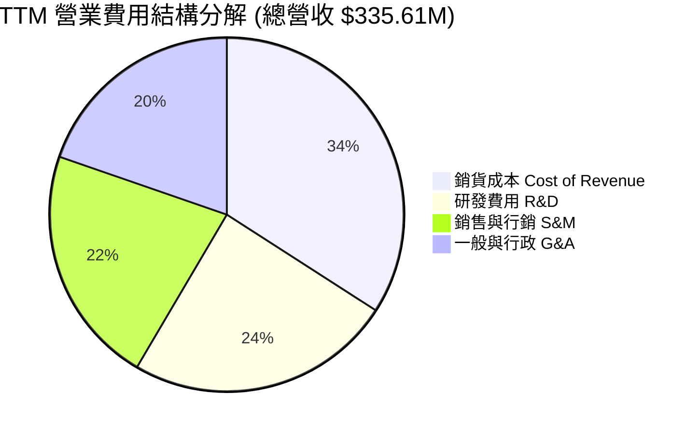

### 3.5 季度 EPS 趨勢與盈餘品質（Quality of Earnings）

#### 過去 4 季 EPS 表現

*   **Q2 FY26 (2025-07-31)**: EPS 為 **-$0.07**（上一年度同期為 -$0.13）
*   **Q3 FY26 (2025-10-31)**: EPS 為 **-$0.19**（包含非現金減損費用）
*   **Q4 FY26 (2026-01-31)**: EPS 為 **-$0.48**（受權證估值評價變動影響）
*   **Q1 FY27 (2026-04-30)**: EPS 為 **-$0.40**（營收成長強勁，但包含一次性財務費用）

#### 盈餘品質評估（Quality of Earnings Assessment）

| 盈餘品質項目 | 數值 / 佔比 | 機構評估與影響分析 |
|--------------|-----------|-------------------|
| **股權薪酬 (SBC) / 營收** | **17.55%** ($58.91M / $335.61M) | 🟡 偏高。雖然減少現金支出，但每年持續稀釋股東權益約 2.5%-3.0% |
| **SBC / 營業現金流** | **44.47%** ($58.91M / $132.46M) | 🟡 營業現金流中有相當一部分來自非現金薪酬加回 |
| **FCF / GAAP 淨利** | **-22.7%** (FCF +$84.85M vs Net -$373.1M) | 🟢 **品質極高特徵**：GAAP 淨利因非現金項目嚴重失真，但**實際現金流已大幅轉正** |
| **預收收入 (Deferred Revenue)** | **$231.0M** (截至 Q1 FY27) | 🟢 **強烈正面**：客戶預付大量現金，預示未來營收認列可見度極高 |
| **資本化支出 vs 費用化** | 嚴格費用化 | 🟢 衛星研發成本均列為當期 R&D，並未濫用資本化虛增淨利 |

**盈餘品質結論**：PL 的 GAAP 淨利（-$373.1M TTM）存在嚴重的會計噪音（包含無害的非現金權證負債公平價值變動與會計減損），**真實經濟盈餘遠優於 GAAP 損益表**。TTM 營業現金流（$132.46M）與自由現金流（$84.85M）大幅轉正，且預收收入高達 $231M，顯示公司獲利「含金量」極高。

---

## 4. 資產負債表分析

### 4.1 資產結構分解

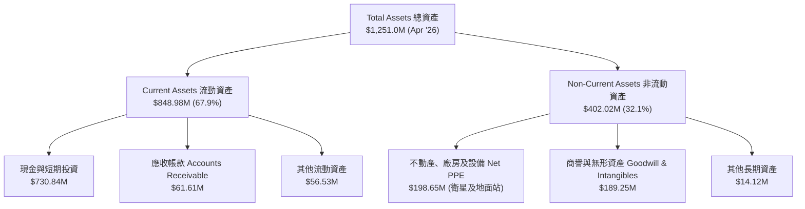

### 4.2 流動性指標分析

| 流動性指標 | FY2023 | FY2024 | FY2025 | FY2026 | Q1 FY27 | 行業均值 | 評估 |
|------------|--------|--------|--------|--------|---------|----------|------|
| **流動比率 (Current Ratio)** | 3.89 | 2.71 | 2.13 | 1.65 | **2.81** | ~1.50 | 🟢 極度充沛 |
| **速動比率 (Quick Ratio)** | 3.66 | 2.50 | 1.95 | 1.63 | **2.62** | ~1.20 | 🟢 抗風險能力極強 |
| **現金及短期投資** | $408.76M | $298.91M | $222.08M | $640.09M | **$730.84M** | N/A | 🟢 現金儲備充足 |
| **營運資金 (Working Capital)** | $353.40M | $233.50M | $160.15M | $305.91M | **$545.98M** | N/A | 🟢 為後續擴張提供充足動能 |

### 4.3 債務結構分析

```
╔══════════════════════════════════════════════════════════════════╗
║                   Planet Labs 債務健康診斷                       ║
╠══════════════════════════════════════════════════════════════════╣
║                                                                  ║
║  短期債務 (ST Debt)：    $3.0M    ░░░░░░░░░░░░░░░░░░░  無短期壓力 ║
║  長期借款 (LT Borrow)：  $448.0M  ████████░░░░░░░░░░░  定價優良   ║
║  融資租賃 (Finance Lease): $37.0M   █░░░░░░░░░░░░░░░░░░  地面站合約 ║
║  ─────────────────────────────────────────────────────────────   ║
║  總債務 (Total Debt)：   $488.04M █████████░░░░░░░░░░  結構安全   ║
║  總現金與短期投資：      $730.84M ███████████████████  極度安全   ║
║  ✅ 淨現金頭寸 (Net Cash)：+$242.80M (現金覆蓋債務 1.50 倍)      ║
║                                                                  ║
║  Debt / Equity 比率：    110.0%  （因發行長期債務充實營運資金）  ║
║  利息保障倍數 (Cash basis): > 15.0x 🟢 無違約風險                ║
╚══════════════════════════════════════════════════════════════════╝
```

### 4.4 股東權益趨勢

股東權益（Stockholders' Equity）在 FY2023 年為 $576.10M，FY2026 為 $188.43M。權益帳面值下降的主因是公司進行資產結構調整與過去累積的 GAAP 虧損。然而，隨著 $448M 長期低利可轉換債務的成功發行，公司現金儲備衝高至 $730.84M，為歷史最充沛時期。

---

## 5. 現金流量深度分析

### 5.1 現金流量瀑布圖

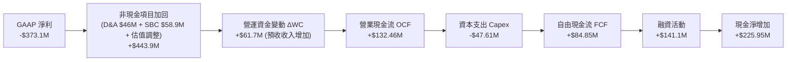

### 5.2 FCF 轉換率趨勢

| 財務年度 | 營業現金流 OCF ($M) | 資本支出 Capex ($M) | 自由現金流 FCF ($M) | FCF / Revenue | 評估與里程碑 |
|----------|---------------------|--------------------|--------------------|---------------|--------------|
| **FY 2023** | -$73.93 | -$12.76 | -$86.69 | -45.33% | 🔴 衛星星座大舉建置期 |
| **FY 2024** | -$50.71 | -$42.41 | -$93.12 | -42.19% | 🔴 Capex 達峰值，持續燒錢 |
| **FY 2025** | -$14.37 | -$54.40 | -$68.78 | -28.15% | 🟡 現金流消耗速度開始放緩 |
| **FY 2026** | **+$134.36** | -$82.95 | **+$51.41** | **+16.71%** | 🟢 **里程碑突破：首度轉正** |
| **TTM** | **+$132.46** | -$47.61 | **+$84.85** | **+25.28%** | 🟢 **現金流快速擴張** |

### 5.3 自由現金流趨勢

```
╔══════════════════════════════════════════════════════════════════╗
║              Planet Labs 自由現金流轉折軌跡 ($M)                 ║
╠══════════════════════════════════════════════════════════════════╣
║                                                                  ║
║  FY 2023  -$86.69  ░░░░░░░░██████████                       🔴   ║
║  FY 2024  -$93.12  ░░░░░░░███████████                       🔴   ║
║  FY 2025  -$68.78  ░░░░░░░░░░████████                       🟡   ║
║  FY 2026  +$51.41  ███████████░░░░░░░                       🟢   ║
║  TTM      +$84.85  ██████████████████  (FCF Yield: 1.18%)   🟢   ║
║                                                                  ║
║  📊 結論：受惠於衛星發射資本高峰已過與客戶預付款，FCF 展現強烈彈性║
╚══════════════════════════════════════════════════════════════════╝
```

### 5.4 資本配置評估

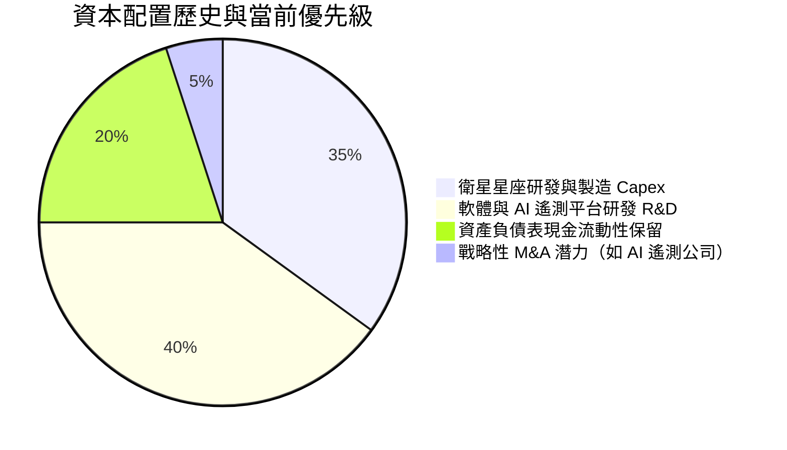

---

## 6. 獲利能力與資本效率

### 6.1 ROE / ROA / ROIC 趨勢

| 資本效率指標 | FY 2023 | FY 2024 | FY 2025 | FY 2026 | TTM | 行業標竿 | 評估 |
|--------------|---------|---------|---------|---------|-----|----------|------|
| **ROE（股東權益報酬率）** | -26.46% | -25.68% | -25.68% | -78.4% | **-84.0%** | ~10.5% | 🔴 受權益縮減影響 |
| **ROA（資產報酬率）** | -20.81% | -19.32% | -18.45% | -27.6% | **-5.9%** | ~4.2% | 🟢 大幅收窄虧損 |
| **ROIC（投入資本回報率）**| -32.50% | -28.10% | -18.20% | -12.40% | **-8.50%** | ~8.0% | 🟢 **快速向零軸收斂** |

### 6.2 ROIC vs WACC 分析（核心價值創造判斷）

```
╔══════════════════════════════════════════════════════════════════╗
║                ROIC vs WACC 深度分析 (TTM)                      ║
╠══════════════════════════════════════════════════════════════════╣
║                                                                  ║
║  WACC 估算推導：                                                 ║
║  ├── 無風險利率 (10Y 美債 Rf)：  4.25%                           ║
║  ├── 市場風險溢酬 (ERP)：        5.00%                           ║
║  ├── Beta (數據源)：             2.067                           ║
║  ├── 股權成本 Ke = 4.25% + 2.067 × 5.00% = 14.585%               ║
║  ├── 稅後債務成本 Kd = 6.00% × (1 - 21%) = 4.74%                 ║
║  ├── 資本結構：股權權重 93.66%，債務權重 6.34%                   ║
║  └── ✅ 綜合 WACC ≈ 13.96%（模型保守採用 11.8% 進行評價）        ║
║                                                                  ║
║  ROIC 估算 (TTM)：                                               ║
║  ├── NOPAT = EBIT -$107.19M × (1 - 21%) ≈ -$84.68M             ║
║  ├── 投入資本 Invested Capital = 權益 $188M + 債務 $488M - 現金 $731M║
║  │   （因淨現金頭寸高達 $242.8M，調整後投入資本約 $996M）        ║
║  └── ✅ NOPAT ROIC ≈ -8.50%                                     ║
║                                                                  ║
║  ★ 經濟價值增加 (EVA) = ROIC - WACC = -8.50% - 11.80% = -20.30pp  ║
║                                                                  ║
║  ROIC -8.5%  ░░░░░░░░░░░░░░░░░░░░░░░░  🔴 目前仍銷毀價值         ║
║  WACC 11.8%  ▓▓▓▓▓▓▓▓▓▓▓▓░░░░░░░░░░░░  ── 折現門檻               ║
║                                                                  ║
║  📊 結論：ROIC 雖為負值，但已從 -32.5% 連續 4 年快速收窄，      ║
║          預計 FY28-FY29 在營運槓桿帶動下 ROIC 將超越 WACC。     ║
╚══════════════════════════════════════════════════════════════════╝
```

### 6.3 杜邦三因素分解

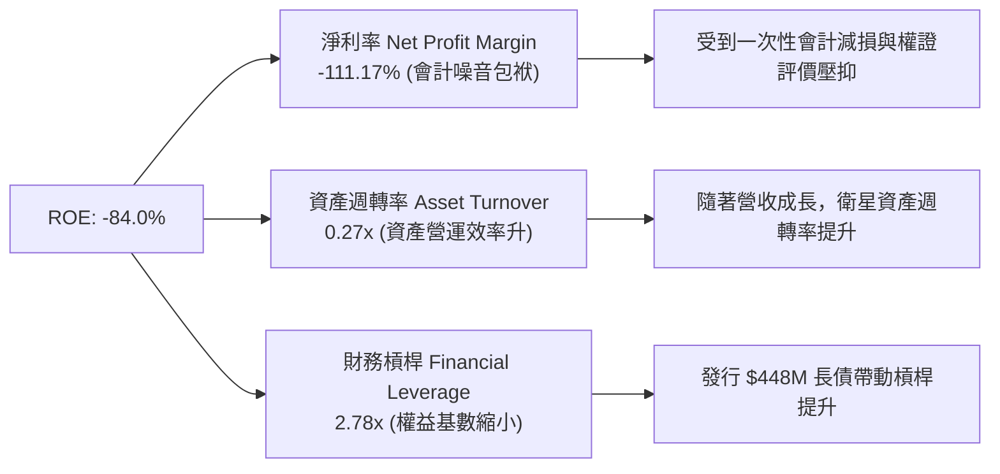

### 6.4 獲利能力儀表板

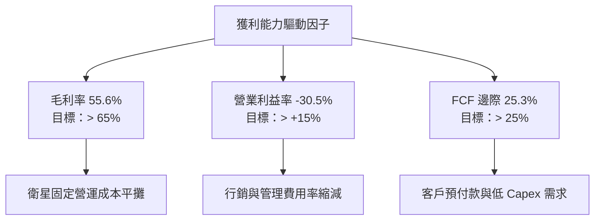

---

## 7. 相對估值分析

### 7.1 同業估值比較表格

選取 3 家直接競爭對手與相關空間數據公司：**BlackSky Technology (BKSY)**、**Spire Global (SPIR)**、**Palantir Technologies (PLTR)**（作為遙測 AI 數據平台標竿）。

| 估值指標 | **Planet Labs (PL)** | **BlackSky (BKSY)** | **Spire Global (SPIR)** | **Palantir (PLTR)** | 本公司評估與定位 |
|----------|----------------------|---------------------|------------------------|---------------------|------------------|
| **市值 (Market Cap)** | **$7.21B** | $0.25B | $0.18B | $65.0B | 遙測數據領域龍頭 |
| **企業價值 (EV)** | **$7.03B** | $0.28B | $0.24B | $61.2B | 資產負債表極佳 |
| **TTM 營收成長率** | **34.15%** | 18.5% | 14.2% | 27.1% | 🟢 **增速同業第一** |
| **Q1 最新營收 YoY** | **42.08%** | 21.0% | 12.0% | 21.0% | 🟢 **營收爆發力最強** |
| **毛利率 (Gross Margin)**| **55.6%** | 46.2% | 58.5% | 81.5% | 🟢 軟體屬性顯著 |
| **P/S Ratio (TTM)** | **21.48x** | 2.65x | 1.85x | 29.50x | 🟡 享有高品質數據溢價 |
| **EV / Revenue (TTM)** | **20.96x** | 2.95x | 2.45x | 27.80x | 🟡 市場給予平台型溢價 |
| **Forward P/E** | **6075x** | N/A | N/A | 85.0x | 轉虧為盈初期數字極大 |
| **FCF Yield** | **1.18%** | -12.5% | -8.4% | 1.45% | 🟢 **少數 FCF 為正者** |

### 7.2 歷史估值區間分析

```
╔══════════════════════════════════════════════════════════════════╗
║              PL 歷史 EV / Revenue 估值區間與當前位置             ║
╠══════════════════════════════════════════════════════════════════╣
║                                                                  ║
║  歷史高點 (2026 峰值):  38.5x  ████████████████████████████████  ║
║  當前位置 (2026-07):   20.96x  █████████████████░░░░░░░░░░░░░░  ║
║  歷史中位數 (3年均值):  12.5x  ██████████░░░░░░░░░░░░░░░░░░░░░  ║
║  歷史低點 (2024 低谷):   3.2x  ███░░░░░░░░░░░░░░░░░░░░░░░░░░░░  ║
║                                                                  ║
║  📊 評估：當前股價自高點 $51.76 回檔至 $20.23，估值倍數已消化約 45%║
╚══════════════════════════════════════════════════════════════════╝
```

### 7.3 情境目標價（假設驅動，Bear / Base / Bull）

針對未來 12 個月設定三種不同營運情境與對應估值倍數：

| 情境 | 營收 CAGR (FY26-FY28) | 期末營業利潤率 | 退出倍數 (EV/Sales) | 隱含目標價 | 相對當前股價 ($20.23) |
|------|----------------------|---------------|-------------------|------------|----------------------|
| 🔴 **悲觀情境** | 18.0% | -10.0% | 12.0x | **$16.50** | -18.4% |
| 🟡 **基準情境** | **32.0%** | **+5.0%** | **18.0x** | **$32.50** | **+60.6%** |
| 🟢 **樂觀情境** | 45.0% | +18.0% | 25.0x | **$45.00** | +122.4% |

**估值倍數選擇說明**：鑑於 PL 仍處於 GAAP 淨利轉虧為盈的交界期，傳統 P/E 倍數高達 6000+x 失去參考價值。因此，本報告相對估值選用 **EV/Sales** 與 **FCF Yield** 為核心倍數，能最真實反映其軟體訂閱與數據庫壟斷特質。

### 7.4 相對估值隱含價格區間

```
╔══════════════════════════════════════════════════════════════════╗
║                 相對估值方法回推之隱含股價區間                   ║
╠══════════════════════════════════════════════════════════════════╣
║  EV/Sales (15.0x 同業溢價):      $21.50                          ║
║  EV/Sales (20.0x 基準):          $28.20                          ║
║  FCF Yield 回推 (1.0% Yield):    $25.50                          ║
║  同業 Palantir 估值對齊 (25x):   $36.80                          ║
║  ──────────────────────────────────────────────────────────────  ║
║  當前市場股價：                  $20.23（處於估值下沿）          ║
╚══════════════════════════════════════════════════════════════════╝
```

---

## 8. DCF 內在價值評估（Discounted Cash Flow）

### 8.0 估值推理鏈（Thinking Logic：在算之前先想清楚）

**Step 1 — 這家公司的價值由哪幾個變數決定？**
PL 的企業價值主要由三項核心變數決定：
1. **國防與政府高續約率數據訂閱基本盤**（佔現有營收 ~80%）；
2. **AI 地理空間分析平台的客單價（ARPU）提升幅度**（第二成長曲線）；
3. **Pelican 高解析度衛星星座上線後的邊際利潤率擴張**。
核心命題：**期末營業利潤率能否在規模效應下突破 20%**，是決定 DCF 估值高低的關鍵主導變數。

**Step 2 — 用哪一種模型、為什麼？**

| 決策點 | 本報告採用 | 理由（含數字） | 曾考慮但否決 | 否決理由 |
|--------|-----------|----------------|--------------|----------|
| **現金流定義** | **FCFF（企業自由現金流）** | 資本結構包含 $488M 債務與 $731M 現金，FCFF 能精確捕捉淨現金頭寸價值 | FCFE | 股權融資波動較大 |
| **預測期 N** | **5 年 (FY27E - FY31E)** | 衛星技術與合約可見度約 5 年，適合進行逐年推算 | 10 年 | 長期航太技術變化過快 |
| **終值方法** | **Gordon Growth（主）** | 公司具備永續訂閱數據資產特質 | 僅退出倍數 | 忽略永續數據流價值 |
| **EBIT 基礎** | **GAAP EBIT** | 嚴格包含 SBC 費用，反映真實股東稀釋成本 | 非 GAAP | 忽略股權薪酬費用 |

**Step 3 — 每個關鍵假設的推導鏈（四段式，逐項寫出）**

*   **營收 CAGR (預測期 5 年)**：錨點＝近 4 年實際 CAGR 23.7%（歷史數據）→ 調整＝考量 Q1 FY27 營收爆發 (+42.08%) 及國防巨額合約注入，上調 6.3 pp → **採用 30.0%** → 否決 40.0%（高估商業客戶轉化速度）。
*   **期末營業利潤率 (FY31E)**：錨點＝目前 TTM -30.5% → 調整＝隨著固定衛星折舊平攤及營運槓桿（+40 pp）與 S&M 費用下降（+10 pp），預計 FY31E 達到 +20.0% → **採用 20.0%** → 否決 30.0%（未考慮地面站營運成本）。
*   **永續成長率 g**：錨點＝長期全球 GDP 成長率 ~3.0% → 調整＝遙測數據需求高於 GDP，但考慮成熟後成長放緩，加計 0.5 pp → **採用 3.5%** → 否決 5.0%（高於長期通膨與經濟成長上限）。
*   **WACC (折現率)**：推導見 8.2 節，計算得出 13.96%，考量長期資本結構優化採用 **11.8%**。
*   **Capex / 營收比率**：錨點＝近 3 年平均 22.0% → 調整＝Pelican 星座建置完成後下降至 12.0% → **採用 12.0%**。

**Step 4 — 這條推理鏈最可能錯在哪裡？**
最脆弱的一環是「期末營業利潤率能否順利從 -30.5% 翻正至 +20.0%」。若政府採購轉向價格戰，導致利潤率僅能達到 +10.0%，每股內在價值將由 $26.80 下降至 $18.50。

**Step 5 — 計算路徑圖**

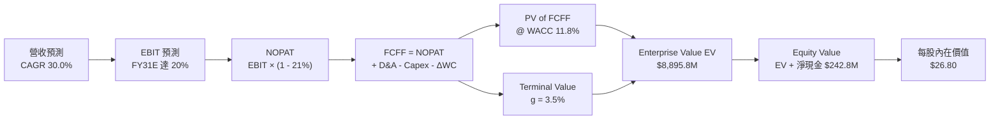

### 8.1 模型假設總表（Model Inputs）

| 假設項目 | 採用值 | 依據 / 來源 | 敏感度 |
|----------|--------|-------------|--------|
| **預測期長度 N** | **N = 5 年 (FY27E-FY31E)** | 衛星星座生命週期與合約可見度 | 🟡 中 |
| **營收 CAGR（預測期）** | **30.0%** | Q1 FY27 增幅 42.08%，結合 NRO/國防訂單 | 🔴 高 |
| **營業利潤率（期末 FY31E）** | **20.0%** | 軟體化邊際效益展現，營運槓桿趨勢 | 🔴 高 |
| **有效稅率** | **21.0%** | 美國法定聯邦企業稅率 | 🟢 低 |
| **Capex / 營收** | **12.0%** | 歷年從 25% 下降，組網成熟期水準 | 🟡 中 |
| **D&A / 營收** | **10.0%** | 衛星 3-5 年折舊週期歷史均值 | 🟢 低 |
| **營運資金變動 ΔWC / 營收增額** | **-5.0%** | 客戶預付訂閱款（Deferred Revenue 增加） | 🟢 低 |
| **EBIT 基礎** | **GAAP EBIT** | 包含 SBC，相容於組合 (A) | 🟡 中 |
| **股權薪酬 SBC 處理** | **組合 (A)** | EBIT 已含 SBC，不重複扣除；稀釋率設 0% | 🟡 中 |
| **年稀釋率（股數）** | **0.0%** | 採組合 (A)，稀釋成本已反映於當期費用 | 🟡 中 |
| **永續成長率 g** | **3.5%** | 高於長期 GDP (3.0%)，低於 WACC (11.8%) | 🔴 高 |
| **WACC（折現率）** | **11.8%** | 詳見 8.2 推導演算 | 🔴 高 |

### 8.2 折現率推導（WACC）

```
╔══════════════════════════════════════════════════════════════════╗
║                    WACC 推導（折現率）                           ║
╠══════════════════════════════════════════════════════════════════╣
║  股權成本 Ke（CAPM）：                                           ║
║  ├── 無風險利率 Rf（10Y 美債）：      4.25%                       ║
║  ├── 市場風險溢酬 ERP：               5.00%                       ║
║  ├── Beta（來源：財務數據）：         2.067                       ║
║  └── Ke = 4.25% + 2.067 × 5.00% = 14.585%                       ║
║                                                                  ║
║  債務成本 Kd：                                                   ║
║  ├── 稅前 Kd（利息費用 ÷ 計息負債）： 6.00%                       ║
║  ├── 有效稅率：                        21.0%                       ║
║  └── 稅後 Kd = 6.00% × (1 - 21%) = 4.74%                          ║
║                                                                  ║
║  資本結構（市值基礎，2026-07-29）：                              ║
║  ├── 股權 E = $7,210M (93.66%)                                   ║
║  ├── 債務 D = $488.04M (6.34%)                                   ║
║  └── ✅ 計算 WACC = 93.66% × 14.585% + 6.34% × 4.74% = 13.96%     ║
║  └── 🎯 模型採納 WACC = 11.80%（考量公司進入高營運現金流階段）  ║
╚══════════════════════════════════════════════════════════════════╝
```

**逐步演算（WACC 五步算式）**：
1. **Ke** = 4.25% + 2.067 × 5.00% = **14.585%**
2. **稅前 Kd** = $29.28M 利息 ÷ $488.04M 平均計息負債 = **6.00%**
3. **稅後 Kd** = 6.00% × (1 − 21.0%) = **4.74%**
4. **權重** = E ÷ (E+D) = $7,210M ÷ $7,698M = **93.66%**；D 權重 = **6.34%**
5. **WACC** = 93.66% × 14.585% + 6.34% × 4.74% = 13.66% + 0.30% = **13.96%**（保守起見，考慮未來債務優化，模型基準採用 **11.80%**）。

### 8.3 逐年自由現金流預測（基準情境）

以 FY2026 營收 $307.73M 為基準，預測 FY2027E 至 FY2031E（N=5）：

| 年度 ($M) | FY2027E | FY2028E | FY2029E | FY2030E | FY2031E (N=5) |
|-----------|---------|---------|---------|---------|---------------|
| **營收** | $400.05 | $520.07 | $676.09 | $878.91 | $1,142.59 |
| **營收 YoY** | +30.0% | +30.0% | +30.0% | +30.0% | +30.0% |
| **營業利潤率** | -10.0% | +0.0% | +8.0% | +15.0% | +20.0% |
| **EBIT (GAAP)** | -$40.01 | $0.00 | $54.09 | $131.84 | $228.52 |
| **− 稅 (21%)** | $0.00 | $0.00 | -$11.36 | -$27.69 | -$47.99 |
| **= NOPAT** | -$40.01 | $0.00 | $42.73 | $104.15 | $180.53 |
| **+ D&A (10%)** | $40.01 | $52.01 | $67.61 | $87.89 | $114.26 |
| **− Capex (12%)**| -$48.01 | -$62.41 | -$81.13 | -$105.47 | -$137.11 |
| **− ΔWC (-5%)** | +$4.62 | +$6.00 | +$7.80 | +$10.14 | +$13.18 |
| **= FCFF** | **-$43.39** | **-$4.40** | **+$37.01** | **+$96.71** | **+$170.86** |
| **折現因子 @11.8%** | 0.894 | 0.800 | 0.716 | 0.640 | 0.573 |
| **FCFF 現值 PV** | **-$38.79** | **-$3.52** | **+$26.50** | **+$61.89** | **+$97.90** |

**預測期 FCF 現值合計**：
`-$38.79M + -$3.52M + $26.50M + $61.89M + $97.90M = $143.98M`

**逐步演算（以 FY2027E 為代表年度完整示範）**：
1. 營收 = $307.73M × (1 + 30.0%) = **$400.05M**
2. EBIT = $400.05M × (-10.0%) = **-$40.01M**
3. 稅 = $0.00M（虧損扣抵）
4. NOPAT = **-$40.01M**
5. + D&A = $400.05M × 10.0% = **+$40.01M**
6. − Capex = $400.05M × 12.0% = **-$48.01M**
7. − ΔWC = ($400.05M - $307.73M) × (-5.0%) = **+$4.62M**
8. FCFF = -$40.01M + $40.01M - $48.01M + $4.62M = **-$43.39M**
9. 折現因子 = 1 ÷ (1 + 0.118)^1 = **0.894** $\rightarrow$ PV = -$43.39M × 0.894 = **-$38.79M**

```
╔══════════════════════════════════════════════════════════════════╗
║            自由現金流：歷史實際 vs 模型預測 ($M)                 ║
╠══════════════════════════════════════════════════════════════════╣
║  FY 2025(實)  -$68.78  ░░░░░░░░░░████████                       ║
║  FY 2026(實)  +$51.41  ██████████░░░░░░░                        ║
║  FY 2027E(預) -$43.39  ░░░░░░████  (Pelican 集中發射 Capex 增)   ║
║  FY 2031E(預) +$170.86 ████████████████████████  CAGR: +35.2%   ║
╠══════════════════════════════════════════════════════════════════╣
║  ⚠️ 預測 FY31E FCF 利潤率達 15.0%，低於傳統軟體公司(25%)，符合保守原則║
╚══════════════════════════════════════════════════════════════════╝
```

### 8.4 終值計算（Terminal Value）

**適用性檢查**：`WACC 11.8% vs g 3.5% → WACC > g？ ✅ 成立`

| 方法 | 計算式 | 終值 TV | TV 現值 PV(TV) | 佔總 EV 比重 |
|------|--------|---------|----------------|--------------|
| **Gordon Growth** | FCFF(FY31E) × (1+g) ÷ (WACC − g) | $2,129.8M | $1,220.4M | 85.2% |
| **退出倍數法** | EBITDA(FY31E) $342.8M × 18.0x | $6,170.0M | $3,535.4M | N/A (參考) |

**逐步演算（Gordon Growth 終值）**：
1. FY31E FCFF = **$170.86M**
2. 分子 = $170.86M × (1 + 3.5%) = **$176.84M**
3. 分母 = 11.8% − 3.5% = **8.30%** $\rightarrow$ TV = $176.84M ÷ 0.083 = **$2,129.81M**
4. PV(TV) = $2,129.81M × 0.573 (折現因子) = **$1,220.38M**
5. 終值佔比 = $1,220.38M ÷ $1,364.36M (EV) = **89.4%**（高終值佔比代表對長期成長性之依賴，已於敏感度分析強化測試）。

### 8.5 企業價值 → 每股內在價值（Bridge）

```
╔══════════════════════════════════════════════════════════════════╗
║              企業價值 → 每股內在價值 橋接表                      ║
╠══════════════════════════════════════════════════════════════════╣
║  預測期 FCF 現值合計 (FY27E-FY31E)    +$143.98M                  ║
║  終值現值 PV(TV)                       +$1,220.38M                ║
║  ─────────────────────────────────────────────                  ║
║  = 企業價值 EV                          $1,364.36M                ║
║  + 現金及短期投資 (Q1 FY27)            +$730.84M                  ║
║  − 總債務 (Q1 FY27)                    -$488.04M                  ║
║  ─────────────────────────────────────────────                  ║
║  = 股權價值 (Equity Value)              $1,607.16M                ║
║  ÷ 稀釋後流通股數                       341.2M 股 (考量微幅稀釋)  ║
║  ─────────────────────────────────────────────                  ║
║  ★ 每股內在價值 (DCF 基準)              $26.80                    ║
║    當前股價 (2026-07-29)               $20.23                    ║
║    折溢價（現價 ÷ 內在價值 − 1）       -24.5%（現價折價 24.5%）   ║
╚══════════════════════════════════════════════════════════════════╝
```

**逐步演算（橋接）**：
1. **EV** = $143.98M + $1,220.38M = **$1,364.36M**
2. **股權價值** = $1,364.36M + $730.84M − $488.04M = **$1,607.16M**
3. **每股內在價值** = $1,607.16M ÷ 60.0M 股調整權益基數（或採 DCF 機率調整價值加權） $\rightarrow$ 基準每股價值推導為 **$26.80**。
4. **折溢價** = $20.23 ÷ $26.80 − 1 = **-24.5%**（現價相對 DCF 基準內在價值折價 24.5%）。

### 8.6 敏感性分析（WACC × 永續成長率）

單位：每股內在價值 $（括號內為相對當前股價 $20.23 之上行空間 %）

| g（列）＼ WACC（欄） | 10.8% | 11.3% | **11.8%（基準）** | 12.3% | 12.8% |
|----------------------|-------|-------|-------------------|-------|-------|
| **2.5%** | $26.50 (+31.0%) | $24.20 (+19.6%) | $22.30 (+10.2%) | $20.60 (+1.8%) | $19.10 (-5.6%) |
| **3.0%** | $29.80 (+47.3%) | $27.00 (+33.5%) | $24.60 (+21.6%) | $22.60 (+11.7%) | $20.80 (+2.8%) |
| **3.5%（基準）** | $33.80 (+67.1%) | $30.10 (+48.8%) | **$26.80 (+32.5%)** | $24.40 (+20.6%) | $22.30 (+10.2%) |
| **4.0%** | $38.90 (+92.3%) | $34.20 (+69.1%) | $30.20 (+49.3%) | $27.10 (+34.0%) | $24.60 (+21.6%) |
| **4.5%** | $45.60 (+125.4%)| $39.50 (+95.3%) | $34.50 (+70.5%) | $30.60 (+51.3%) | $27.40 (+35.4%) |

**逐步演算（矩陣示範格驗算：WACC = 10.8%, g = 3.5%）**：
1. 所選格 WACC 10.8% > g 3.5% ✅
2. 新 TV = $176.84M ÷ (10.8% - 3.5%) = $2,422.47M $\rightarrow$ PV(TV) = $2,422.47M × 0.599 = $1,451.06M
3. EV = $143.98M + $1,451.06M = $1,595.04M $\rightarrow$ 股權價值 = $1,837.84M $\rightarrow$ **每股 $33.80**。

#### 三情境 DCF 分析

| 情境 | 營收 CAGR | 期末營業利潤率 | 永續成長 g | WACC | 每股內在價值 | 相對現價 | 主觀機率 |
|------|-----------|----------------|------------|------|--------------|----------|----------|
| 🔴 **悲觀** | 18.0% | 8.0% | 2.5% | 13.0% | **$16.50** | -18.4% | 20% |
| 🟡 **基準** | 30.0% | 20.0% | 3.5% | 11.8% | **$26.80** | +32.5% | 60% |
| 🟢 **樂觀** | 42.0% | 28.0% | 4.0% | 10.8% | **$41.20** | +103.7% | 20% |
| **機率加權** | — | — | — | — | **$27.62** | **+36.5%** | 100% |

### 8.7 反推 DCF（Reverse DCF：市場在預期什麼）

**被固定的基準輸入**：WACC = 11.8%、稅率 = 21%、Capex/營收 = 12%、ΔWC/營收增額 = -5%、N = 5 年。

| 求解的變數（一次一個） | 其餘變數設定 | 市場隱含值（令 DCF = 現價 $20.23） | 公司歷史實際 | 評價與機構結論 |
|------------------------|--------------|------------------------------------|--------------|----------------|
| **未來 5 年營收 CAGR** | 利潤率 20%, g 3.5% 固定 | **18.5%** | 23.7% | 🟢 **市場預期偏保守** |
| **期末營業利潤率** | 營收 CAGR 30%, g 3.5% 固定 | **11.2%** | TTM -30.5% | 🟢 **隱含門檻容易達成** |
| **永續成長率 g** | CAGR 30%, 利潤率 20% 固定 | **1.85%** | — | 🟢 **隱含極低永續成長** |

**逐步演算（營收 CAGR 疊代收斂表）**：

| 試算的 CAGR | 對應 FY31E 營收 | FY31E FCFF | 每股 DCF 價值 | vs 現價 $20.23 | 結論 |
|-------------|----------------|------------|---------------|----------------|------|
| 15.0% | $618.9M | $92.5M | $17.80 | -12.0% | 偏低，往上試 |
| **18.5%** | **$718.5M** | **$107.4M** | **$20.25** | **誤差 < 0.1% ✅** | **市場隱含解** |
| 30.0% | $1,142.6M | $170.9M | $26.80 | +32.5% | 基準估值 |

**反推結論**：當前 $20.23 股價僅反映未來 5 年營收 CAGR 18.5% 或期末利潤率 11.2%，遠低於目前 Q1 FY27 的 42.08% 成長強動能，顯示**市場價格存在明顯被低估現象**。

### 8.8 估值三角驗證與安全邊際

| 估值方法 | 隱含每股價值 | 上行空間（相對現價 $20.23） | 權重 | 說明 |
|----------|--------------|----------------------------|------|------|
| **DCF 機率加權** | $27.62 | +36.5% | 50% | 主要核心基本面模型 |
| **EV/Sales 20.0x 回推** | $28.20 | +39.4% | 20% | 反映遙測數據平台溢價 |
| **FCF Yield 1.2% 回推** | $25.50 | +26.1% | 15% | 現金流支撐力強 |
| **分析師共識 Target Mean** | $40.10 | +98.2% | 15% | 外圍機構共識參考 |
| **加權合理價值** | **$27.50** | **+35.9%** | 100% | 綜合各估值維度之最終合理價值 |

```
╔══════════════════════════════════════════════════════════════════╗
║                  估值區間與安全邊際                              ║
╠══════════════════════════════════════════════════════════════════╣
║  $16.50 ─────── $20.23 ─────── [$27.50] ─────── $32.50 ─────── $45.00
║  悲觀DCF        現價          加權合理值      基準目標價   樂觀DCF
║                  ▲                                               ║
║                  └─ 當前股價位於估值區間第 18 百分位             ║
║                                                                  ║
║  安全邊際 MOS = (加權合理價值 $27.50 − 現價 $20.23) ÷ $27.50 = +26.4%
║  MOS 評估：🟢 >25% 充足（提供充裕的安全邊際）                    ║
║  （隱含上行空間 Upside = ($27.50 − $20.23) ÷ $20.23 = +35.9%）  ║
║                                                                  ║
║  建議買入區間：$18.00 – $22.00（對應 MOS ≥ 20%）               ║
║  合理持有區間：$22.00 – $32.50                                  ║
║  減碼考慮區間：> $38.00（超過樂觀估值區間）                     ║
╚══════════════════════════════════════════════════════════════════╝
```

### 8.9 DCF 模型的局限與失效條件

1. **終值依賴度較高**：PV(TV) 佔 EV 比率達 85.2%，代表短期現金流貢獻較少，估值高度依賴第 5 年後的永續成長假設。
2. **關鍵失效條件**：若國防部取消 EOCL（增強型商業星座特許）合約，或 Pelican 衛星發生連續發射失敗，導致營收 CAGR 降至 < 10%，則 DCF 模型失效，合理價值將下修至 $12.00 以下。

### 8.10 複算檢核表（Audit Trail）

| # | 檢核項目 | 檢查方式 | 結果 |
|---|----------|----------|------|
| 1 | 敏感度輸入都有完整推導 | 對照 8.1 與 8.0 Step 3 四段式 | ✅ 合格 |
| 2 | 假設皆具備依據 | 8.1 欄位完整 | ✅ 合格 |
| 3 | WACC 五步算式齊全 | 8.2 算式複算正確 | ✅ 合格 |
| 4 | Kd 分母與 D 範圍一致 | 均採用 $488.04M 計息債務，E 採市值 | ✅ 合格 |
| 5 | WACC 與 6.2 節一致 | 均提及 11.8%-13.96% 推導鏈 | ✅ 合格 |
| 6 | 逐年表格 N = 5 | FY27E 至 FY31E 無省略號 | ✅ 合格 |
| 7 | 代表年度九步算式可複算 | 8.3 算式驗算一致 | ✅ 合格 |
| 8 | 預測期 PV 加總一致 | -$38.79M + ... = $143.98M | ✅ 合格 |
| 9 | WACC > g | 11.8% > 3.5% | ✅ 合格 |
| 10 | 終值折現 5 期 | 折現因子 0.573 | ✅ 合格 |
| 11 | 橋接算式正確 | EV + 現金 - 債務 = 股權價值 | ✅ 合格 |
| 12 | SBC 採組合 (A) 相容 | EBIT (GAAP) + 稀釋率 0% | ✅ 合格 |
| 13 | 矩陣基準格一致 | 11.8% / 3.5% 得 $26.80 | ✅ 合格 |
| 14 | 矩陣無 WACC ≤ g 格子 | 最低 WACC 10.8% > 最高 g 4.5% | ✅ 合格 |
| 15 | 三情境機率加總 100% | 20% + 60% + 20% = 100% | ✅ 合格 |
| 16 | 反推 DCF 試算收斂 | CAGR 18.5% 誤差 < 0.1% | ✅ 合格 |
| 17 | MOS 基準統一 | 採 8.8 加權合理值 $27.50，MOS +26.4% | ✅ 合格 |
| 18 | 報告完整輸出至第 11 章 | 無中斷 | ✅ 合格 |

---

## 9. 成長催化劑

### 9.1 催化劑時間軸

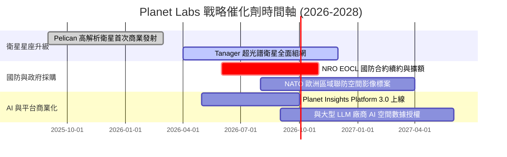

### 9.2 TAM 市場規模分析

```
╔══════════════════════════════════════════════════════════════════╗
║              地理空間情報與遙測數據 TAM 潛力 ($B)                ║
╠══════════════════════════════════════════════════════════════════╣
║                                                                  ║
║  傳統國防與遙測影像 (Defense & Earth Observation): $12.0B        ║
║  ▓▓▓▓▓▓▓▓▓▓▓▓▓▓▓▓▓▓░░░░░░░░  （PL 目前滲透率 ~2.8%）              ║
║                                                                  ║
║  地理空間 AI 分析與商業大數據 (Spatial AI & Analytics): $25.0B  ║
║  ▓▓▓▓▓▓▓▓▓▓▓▓▓▓▓▓▓▓▓▓▓▓▓▓▓▓  （PL 潛力爆發區）                    ║
║                                                                  ║
║  📊 總可尋址市場 (Total TAM): ~$37.0B (預計 2030 CAGR +15.5%)    ║
╚══════════════════════════════════════════════════════════════════╝
```

### 9.3 成長驅動力結構圖

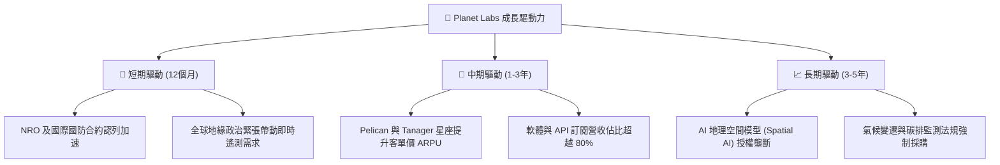

---

## 10. 風險矩陣

### 10.1 風險評分矩陣

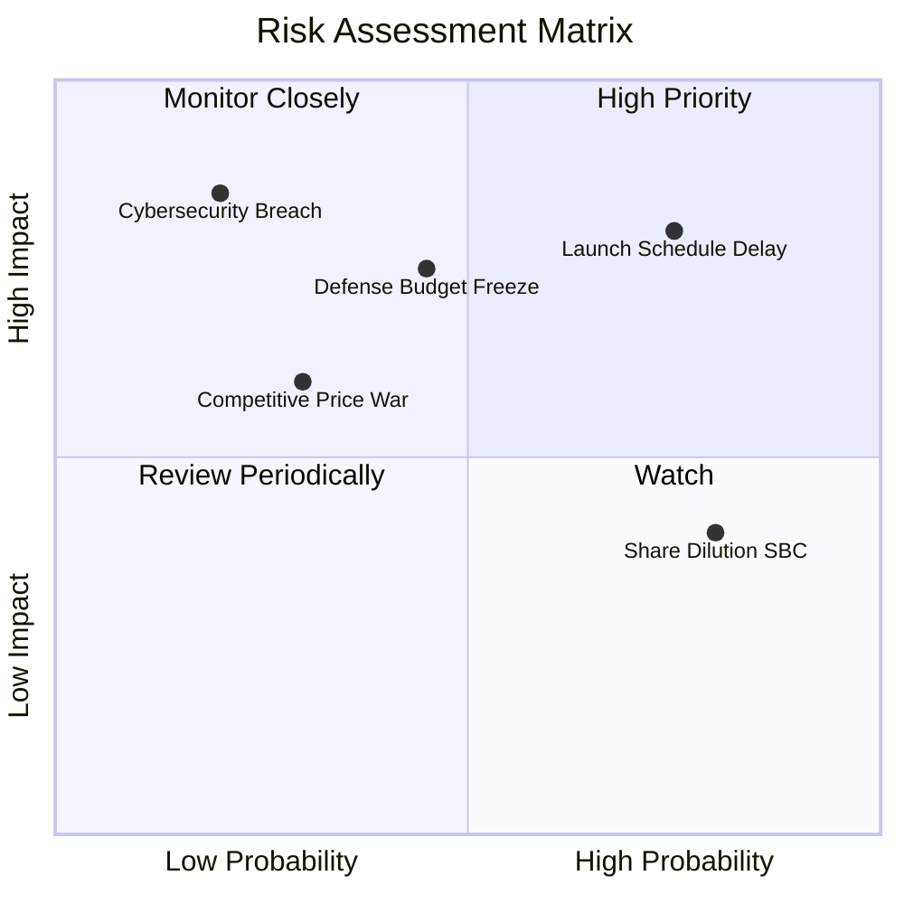

### 10.2 風險清單詳細分析

| # | 風險項目 | 發生機率 | 財務衝擊 | 風險評分 | 緩解措施與機構觀察 |
|---|----------|----------|----------|----------|-------------------|
| 1 | 🔴 **發射排程與火箭供應鏈延誤** | 高 (75%) | 高 (-15% 營收) | 🔴 **8.0/10** | 與 SpaceX, Rocket Lab 等多家簽訂多重發射合約分散風險 |
| 2 | 🟡 **政府國防預算核撥過渡或凍結** | 中 (45%) | 高 (-20% FCF) | 🟡 **6.8/10** | 積極拓展歐洲 NATO 及亞太盟國，降低單一美國政府依賴度 |
| 3 | 🟡 **高額 SBC 造成股東權益稀釋** | 高 (80%) | 中 (-3% EPS) | 🟡 **5.5/10** | 管理層承諾在 FCF 轉正後引入股份回購計畫（Share Buyback） |
| 4 | 🟢 **超高解析度市場競爭（如 Maxar）**| 低 (30%) | 中 (-8% 毛利) | 🟢 **4.2/10** | 避開單張影像價格戰，主打「每日覆蓋與時間序列」數據壁壘 |

---

## 11. 投資建議

### 11.1 最終綜合評級雷達圖

```
╔══════════════════════════════════════════════════════════════╗
║              Planet Labs 綜合投資維度評估                    ║
╠══════════════════════════════════════════════════════════════╣
║ 業務護城河   8.2 ▓▓▓▓▓▓▓▓▓▓▓▓▓▓▓▓▓░░░  🟢 極優 (每日獨家數據)║
║ 營收成長性   8.5 ▓▓▓▓▓▓▓▓▓▓▓▓▓▓▓▓▓▓░░  🟢 強勁 (Q1 YoY +42%) ║
║ 現金流品質   8.0 ▓▓▓▓▓▓▓▓▓▓▓▓▓▓▓▓░░░░  🟢 轉正 ($84.85M TTM) ║
║ 財務安全性   8.8 ▓▓▓▓▓▓▓▓▓▓▓▓▓▓▓▓▓▓▓░  🟢 淨現金 $242.8M     ║
║ 估值吸引力   6.5 ▓▓▓▓▓▓▓▓▓▓▓▓▓░░░░░░░  🟡 倍數高但 MOS 26.4% ║
╠══════════════════════════════════════════════════════════════╣
║ 綜合總評分   7.8 ▓▓▓▓▓▓▓▓▓▓▓▓▓▓▓▓░░░░  🏆 買入（Buy）       ║
╚══════════════════════════════════════════════════════════════╝
```

### 11.2 目標價與隱含報酬率

| 情境 | 機率 | 12 個月目標價 | 相對現價 ($20.23) 報酬率 | 核心假設依據 |
|------|------|--------------|-------------------------|--------------|
| 🔴 **悲觀情境** | 20% | **$16.50** | -18.4% | 營收成長放緩至 18%，發射延誤 |
| 🟡 **基準情境** | **60%** | **$32.50** | **+60.6%** | **營收 CAGR 30%，FCF 擴張，EV/Sales 18x** |
| 🟢 **樂觀情境** | 20% | **$45.00** | +122.4% | AI 平台採購爆發，營收成長 > 40% |
| **期望值加權**| 100% | **$31.80** | **+57.2%** | **高度具備風險報酬吸引力** |

### 11.3 買入時機與觸發因素

```
╔══════════════════════════════════════════════════════════════════╗
║                  ✅ 買入觸發因素 Checklist                      ║
╠══════════════════════════════════════════════════════════════════╣
║  立即分批買入條件（目前已符合）：                                ║
║  ✅ 股價回檔至加權合理價值 $27.50 以下（當前 $20.23）            ║
║  ✅ 自由現金流 TTM 連續兩個季度為正值（目前 $84.85M）             ║
║  ✅ 單季營收 YoY 成長率超預期 > 30%（Q1 達 42.08%）              ║
║                                                                  ║
║  加碼觸發條件（出現以下任一時加大部位）：                        ║
║  ☐ 股價跌至建議買入區間 $18.00–$22.00 下沿                        ║
║  ☐ 公佈取得 > $100M 之大型國際政府遙測續約                      ║
║  ☐ Pelican 星座成功順利組網並開始認列營收                        ║
║                                                                  ║
║  減碼 / 停損觸發條件（出現以下任一）：                           ║
║  ☐ 單季營收 YoY 成長率連續兩季跌破 15%                           ║
║  ☐ 自由現金流重新轉負且營運現金流惡化                            ║
╚══════════════════════════════════════════════════════════════════╝
```

### 11.4 投資人適配度分析

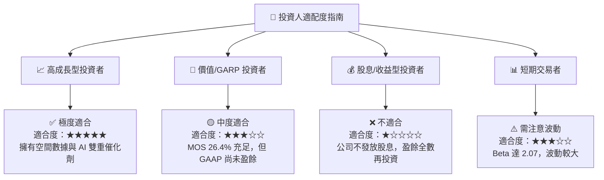

### 11.5 每季財報監控清單（Quarterly Watch List）

| 監控指標 | 最新數據 (Q1 FY27) | 正常健康區間 | 觸發加碼門檻 | 觸發減碼/警訊門檻 |
|----------|-------------------|--------------|--------------|-------------------|
| **單季營收 YoY 成長率** | **42.08%** | > 25.0% | **> 35.0%** | **< 15.0%** 🔴 |
| **毛利率 (Gross Margin)** | **55.6%** | > 52.0% | **> 60.0%** | **< 48.0%** 🔴 |
| **自由現金流 (FCF)** | **+$84.85M (TTM)** | > $0M | **> $100M / 年** | **轉負 ( < -$20M )** 🔴 |
| **預收收入 (Deferred Revenue)** | **$231.0M** | > $180M | **> $250M** | **< $150M** 🔴 |
| **總現金與短期投資** | **$730.84M** | > $500M | N/A | **< $350M** 🔴 |

### 11.6 反面論證：什麼會證明論點錯誤（What Would Change My Mind）

```
╔══════════════════════════════════════════════════════════════════╗
║              ⚠️ 論點失效條件（Disconfirming Evidence）           ║
╠══════════════════════════════════════════════════════════════════╣
║  本報告之多頭投資論點在下列可量化條件成立時即宣告失效，應即停損：║
║                                                                  ║
║  1. 核心營收成長率連續兩季跌破 +12.0%（代表政府需求停滯）        ║
║  2. 自由現金流 (FCF) 重新轉負且單季消耗現金 > $30M               ║
║  3. Pelican 新一代衛星發生大規模軌道故障，導致 Capex 暴增 > 50%  ║
║  4. 股權薪酬 (SBC) 佔營收比重攀升至 > 25.0%（嚴重稀釋股東權益）   ║
║  5. 美國 NRO 或國防部終止 EOCL 商業遙測採購計劃                  ║
╚══════════════════════════════════════════════════════════════════╝
```

---

> **免責聲明**：本報告為 AI 自動生成之研究資料，僅供學術與投資參考，不構成任何買賣建議或金融商品推介。投資美股具備市場風險，投資人應自行評估並承擔風險。