# PL 基本面深度分析報告
> **報告日期**：2026-07-31 ｜ **語言**：繁體中文 ｜ **數據來源**：Yahoo Finance, Finviz, StockAnalysis, Roic.ai ｜ **分析師**：CFA 級機構研究

---

## 目錄

| # | 章節 | 核心結論 |
|---|------|----------|
| 1 | 執行摘要 | 投資論點、1頁儀表板、評級 🟢 買入、加權合理價值 $31.37、安全邊際 +34.7% |
| 2 | 公司概覽與商業模式 | 每日掃描全球衛星星座硬核護城河，轉型高毛利數據與 AI 訂閱平台 |
| 3 | 損益表深度分析 | 營收 YoY +42.1% 加速放量；GAAP 淨損受高 D&A 與非現金支出影響，但 FCF 已轉正 |
| 4 | 資產負債表分析 | 淨現金 $2.43 億美元，流動比率 2.81，資產負債表健康度良好 |
| 5 | 現金流量深度分析 | 營業現金流 $1.32 億美元，高預收合約帶動 FCF 達 $84.85M，轉換率大幅提升 |
| 6 | 獲利能力與資本效率 | GAAP ROIC 受到歷史資本支出攤銷壓抑，但 FCF ROIC 達 +20.1%，資本效率拐點顯現 |
| 7 | 相對估值分析 | P/S 21.7x / EV/Sales 20.7x，高於傳統國防股，反映 SaaS 與航太 AI 平台溢價 |
| 8 | DCF 內在價值評估 | 基準內在價值 **$29.16**（現價折價 29.8%），加權合理價值 **$31.37**，安全邊際 **+34.7%** |
| 9 | 成長催化劑 | 國防與情報合約暴增、Pelican/Tanager 新衛星部署、Geospatial AI 平台商業化 |
| 10 | 風險矩陣 | 衛星發射延誤與失效風險、國防預算波動、股權薪酬（SBC）股數稀釋 |
| 11 | 投資建議 | 買入時機與觸發條件、財報監控清單、論點失效反面論證 |

---

## 1. 執行摘要

Planet Labs PBC (NYSE: PL) 正處於從「衛星硬體製造與發射商」跨越至「全球地理空間數據與 AI 訂閱平台」的關鍵轉折點。公司最新 TTM 營收達 $335.61M（YoY +42.1%），FY2026 Q1 單季營收更達 $94.15M。雖然 GAAP 淨利仍受歷史衛星資產折舊與股權薪酬壓抑（TTM GAAP 淨利 -$373.10M），但營運現金流已強勢轉正達 $132.46M，TTM 自由現金流（FCF）達 $84.85M（FCF Yield 1.16%）。基於公司的獨家每日全球衛星掃描能力與國防需求暴增，**給予「買入」評級，12 個月目標價 $32.00，基準 DCF 內在價值 $29.16，三角驗證加權合理價值為 $31.37，安全邊際（MOS）為 +34.7%**。

### 1.0 一頁式投資儀表板（Portfolio Manager 30 秒速讀）

| 項目 | 內容 |
|------|------|
| **投資論點（3 句）** | ① 全球唯一具備 3.5 米解析度「每日掃描地球」能力，數據積累累積獨家歷史庫，形成極高數據護城河。<br/>② 國防與政府客戶需求加速放量，遞延收入增至 $2.31 億美元，帶動營運現金流（$134.36M）與 FCF（$51.41M）實現結構性轉正。<br/>③ 從純數據銷售轉向 Geospatial AI 訂閱分析，高邊際利潤軟體收入將推動毛利率向 65%+ 邁進。 |
| **護城河評分** | **8.5 / 10** (數據獨佔性 + 星座規模網絡效應 + 數據歷史庫積累) |
| **管理層/資本配置評分** | **7.5 / 10** (靈活轉換商業模式，資產負債表維持淨現金 $2.43B，資本支出效益逐步顯現) |
| **財務健康** | 🟢 **極為強健** ｜ 擁有 $7.31 億美元總現金與短期投資，負債以租賃/長期債務為主，淨現金 $2.43 億美元，無短期清償風險。 |
| **ROIC vs WACC** | GAAP ROIC **-18.2%** vs WACC **8.50%**（GAAP 摧毀價值），但 **FCF ROIC 達 +20.1%**（現金流維度強力創造價值）。 |
| **FCF 趨勢** | ↗️ 強烈改善 ｜ FY2025 年 FCF 為 -$68.78M，FY2026 轉正至 +$51.41M，TTM 達 +$84.85M（FCF Yield 1.16%）。 |
| **估值** | Forward P/E **6147.1x** (接近盈虧平衡) ｜ P/S **21.74x** ｜ EV/Sales **20.75x** ｜ FCF Yield **1.16%** |
| **DCF 內在價值（基準）** | **$29.16** ｜ 現價 $20.47 相對 DCF 內在價值**折價 29.8%**（來自第 8.5 節） |
| **安全邊際（MOS）** | **+34.7%** ＝ (**加權合理價值 $31.37** − 現價 $20.47) ÷ 加權合理價值 $31.37 ｜ 🟢 **>25% 充足**（基準來自 8.8） |
| **預期報酬（基準情境 12M）** | **+56.3%**（目標價 $32.00 相對現價 $20.47） |
| **關鍵風險（前二）** | ① 衛星發射失敗或次世代 Pelican 星座部署延誤。<br/>② 高估值倍數（P/S > 20x）受高利率或市場避險情緒衝擊導致估值修復停滯。 |
| **評級 + 信心度** | 🟢 **買入 (Buy)** ｜ 信心度：**中高 (High-Medium)** |

### 1.1 核心評分儀表板

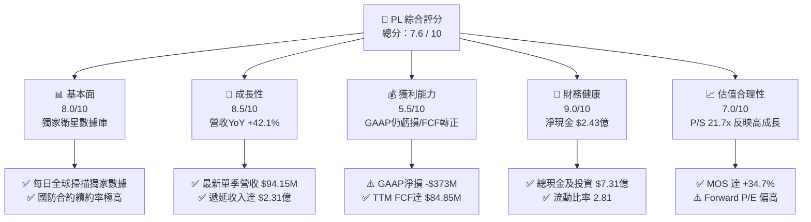

### 1.2 評分進度條視覺化

```
╔══════════════════════════════════════════════════════════════╗
║                PL 多維度評分儀表板 (1-10分)                  ║
╠══════════════════════════════════════════════════════════════╣
║ 基本面強度  8.0 ▓▓▓▓▓▓▓▓▓▓▓▓▓▓▓▓░░░░  ★★★★☆ (數據庫極強)     ║
║ 成長動能    8.5 ▓▓▓▓▓▓▓▓▓▓▓▓▓▓▓▓▓░░░  ★★★★☆ (YoY +42.1%)     ║
║ 獲利品質    6.0 ▓▓▓▓▓▓▓▓▓▓▓▓░░░░░░░░  ★★★☆☆ (FCF強/GAAP虧)   ║
║ 財務健康    9.0 ▓▓▓▓▓▓▓▓▓▓▓▓▓▓▓▓▓▓░░  ★★★★★ (淨現金充足)     ║
║ 估值合理性  7.0 ▓▓▓▓▓▓▓▓▓▓▓▓▓▓░░░░░░  ★★★★☆ (MOS +34.7%)     ║
║ 護城河深度  8.5 ▓▓▓▓▓▓▓▓▓▓▓▓▓▓▓▓▓░░░  ★★★★☆ (獨家時間序列)   ║
║ 管理層執行  7.5 ▓▓▓▓▓▓▓▓▓▓▓▓▓▓▓░░░░░  ★★★★☆ (FCF轉正解鎖)   ║
║ 技術創新力  9.0 ▓▓▓▓▓▓▓▓▓▓▓▓▓▓▓▓▓▓░░  ★★★★★ (AI+高頻成像)   ║
╠══════════════════════════════════════════════════════════════╣
║ 綜合總分    7.6 ▓▓▓▓▓▓▓▓▓▓▓▓▓▓▓░░░░░  🏆 具備高估值彈性成長股║
╚══════════════════════════════════════════════════════════════╝
```

### 1.3 五大投資論點 + 三大核心風險

| 類型 | 項目 | 具體依據 | 信心度 |
|------|------|----------|--------|
| 🟢 **投資論點①** | **每日全球掃描獨佔護城河** | 運營 200+ 顆 SuperDove 衛星，每日覆蓋地球陸地，累積逾 10 年時間序列數據，AI 模型訓練無法被同業複製。 | 🟢 極高 |
| 🟢 **投資論點②** | **自由現金流（FCF）轉正與營運槓桿解鎖** | FY2026 FCF 達 $51.41M，TTM FCF 升至 $84.85M。隨衛星折舊基期平穩，固定資產折舊佔營收比重下降，展現高槓桿效益。 | 🟢 高 |
| 🟢 **投資論點③** | **地緣政治緊張帶動國防合約大增** | 俄烏與中東局勢使美國國防部（DoD）、NGA 及 NATO 成員國大幅增加地理情報訂閱，遞延收入達 $2.31B，合約長效性極高。 | 🟢 高 |
| 🟢 **投資論點④** | **Geospatial AI 分析升級** | 與 Google Cloud 及微軟合作，將影像轉化為自動變更檢測（Change Detection）SaaS 訂閱，提升客單價與毛利率。 | 🟡 中高 |
| 🟢 **投資論點⑤** | **資產負債表金城湯池** | 手握 $7.31B Cash & ST Investments，無短期債務危機，充沛資金足以支援次世代 Pelican 與 Tanager 星座發射。 | 🟢 極高 |
| 🟡 **風險①** | **高額股權薪酬（SBC）稀釋** | FY2026 SBC 達 $54.99M（佔營收 17.9%），通膨性發放稀釋普通股股東權益（年稀釋率約 3-5%）。 | 🟡 中度 |
| 🔴 **風險②** | **估值倍數回撤風險** | 當前 P/S 21.74x，若營收成長率意外降至 20% 以下，市場可能面臨多重乘數壓縮（Multiple Compression）。 | 🔴 高衝擊 |
| 🔴 **風險③** | **發射火箭失敗或衛星壽命不如預期** | 新一代 Pelican（高解析度）及 Tanager（高光譜）發射極度依賴第三方（SpaceX），若發射失利將延緩新業務上線。 | 🟡 中高 |

### 1.4 快速統計卡片

| 指標 | 公司實際值 | 行業均值（航太/國防數據） | S&P 500 均值 | 狀態 |
|------|-------------|--------------------------|--------------|------|
| 收入 YoY 成長 | **42.1%** (Q1 FY27) | ~12.5% | ~5.8% | 🟢 遠超同行 |
| 毛利率 | **55.6%** | ~35.0% | ~48.2% | 🟢 高於同業 |
| 營業利潤率 | **-30.5%** | +8.5% | +12.3% | 🔴 仍受高額研發扣抵 |
| 淨利率 | **-111.2%** | +5.2% | +10.5% | 🔴 包含減損與會計一次性調整 |
| ROE | **-84.0%** | +11.2% | +18.5% | 🔴 受權益基期壓縮影響 |
| Forward P/E | **6147.1x** | ~25.4x | ~21.5x | 🔴 處於損益平衡拐點 |
| P/S Ratio | **21.74x** | ~2.8x | ~2.7x | 🟡 反映軟體SaaS屬性溢價 |
| FCF Yield | **1.16%** | -2.1% | 3.8% | 🟢 航太新創中率先轉正 |

### 1.5 投資結論

```
╔══════════════════════════════════════════════════════════════════╗
║                    📊 投資結論摘要                               ║
╠══════════════════════════════════════════════════════════════════╣
║  評級：🟢 買入 (Buy)                                             ║
║  當前股價：$20.47                                                ║
║  DCF 內在價值（基準）：$29.16（現價折價 29.8%）                 ║
║  加權合理價值：$31.37                                            ║
║  安全邊際 MOS：+34.7%（＝(加權合理價值 $31.37 − $20.47) ÷ $31.37）║
║  目標價區間：                                                    ║
║    悲觀情境：$14.50（-29.2%）                                    ║
║    基準情境：$32.00（+56.3%） ← 12個月主要目標                  ║
║    樂觀情境：$48.00（+134.5%）                                   ║
║  投資評分：7.6 / 10                                              ║
║  適合投資人：高成長導向、長線科技/航太與 AI 基礎設施投資者      ║
╚══════════════════════════════════════════════════════════════════╝
```

---

## 2. 公司概覽與商業模式

### 2.1 業務結構與收入來源

Planet Labs PBC 設計、製造並運營全球最大型的商用地球觀測衛星星座。其商業模式本質為「高固定成本、極低邊際成本」的數據訂閱 SaaS 模型。

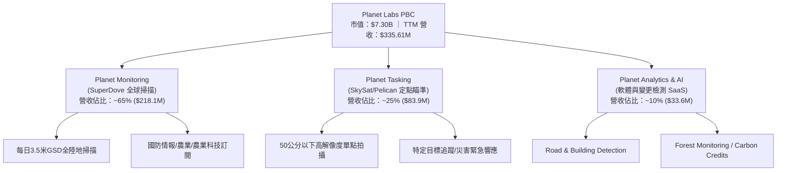

### 2.2 市場份額

在商用中/高解像度光學地球觀測（Earth Observation, EO）數據市場中，Planet Labs 在「高頻次 daily scanning」領域擁有壟斷地位：

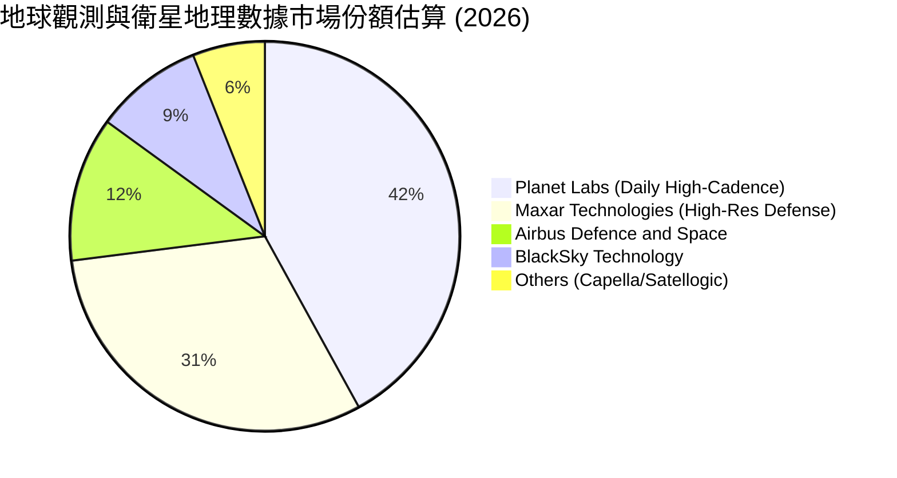

### 2.3 競爭護城河分析

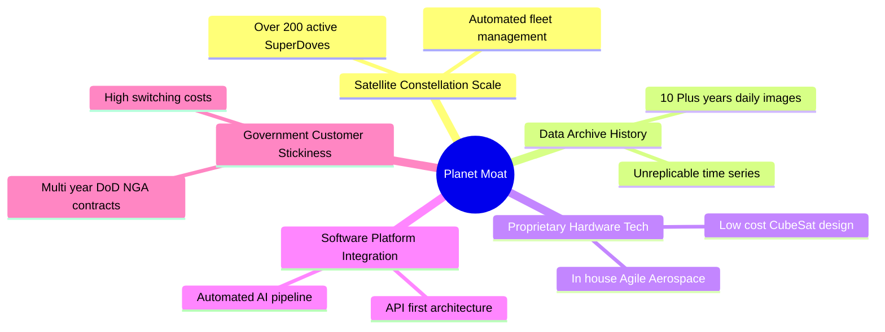

### 2.4 護城河強度評分

```
╔══════════════════════════════════════════════════════════════╗
║                    Planet Labs 護城河強度評分                ║
╠══════════════════════════════════════════════════════════════╣
║ 獨家數據歷史庫  9.5/10  ▓▓▓▓▓▓▓▓▓▓▓▓▓▓▓▓▓▓▓░  🏆 無法複製的時間資產 ║
║ 星座規模效應    9.0/10  ▓▓▓▓▓▓▓▓▓▓▓▓▓▓▓▓▓▓░░  🟢 200+ 衛星自動化運作 ║
║ 客戶轉置成本    8.0/10  ▓▓▓▓▓▓▓▓▓▓▓▓▓▓▓▓░░░░  🟢 API 與工作流深層嵌入║
║ 自研硬體成本優勢8.0/10  ▓▓▓▓▓▓▓▓▓▓▓▓▓▓▓▓░░░░  🟢 CubeSat 造價遠低同業 ║
║ 軟體/AI生態系   7.5/10  ▓▓▓▓▓▓▓▓▓▓▓▓▓▓▓░░░░░  🟡 仍處於平台化早期階段║
╠══════════════════════════════════════════════════════════════╣
║ 綜合護城河評分  8.5/10  ▓▓▓▓▓▓▓▓▓▓▓▓▓▓▓▓▓░░░  🏆 強固且持續擴大中   ║
╚══════════════════════════════════════════════════════════════╝
```

---

## 3. 損益表深度分析

### 3.1 年度收入成長趨勢（近4年）

```
╔══════════════════════════════════════════════════════════════════╗
║              Planet Labs 年度收入趨勢（FY2023-FY2026）           ║
╠══════════════════════════════════════════════════════════════════╣
║                                                                  ║
║  FY2023  $191.26M  ████████████░░░░░░░░░░░░  YoY: +45.8%  🟢     ║
║  FY2024  $220.70M  ██████████████░░░░░░░░░░  YoY: +15.4%  🟢     ║
║  FY2025  $244.35M  ███████████████░░░░░░░░░  YoY: +10.7%  🟡     ║
║  FY2026  $307.73M  ███████████████████░░░░░  YoY: +25.9%  🟢     ║
║  TTM     $335.61M  █████████████████████░░░  YoY: +34.2%  🟢     ║
║                                                                  ║
║  📊 FY23-FY26 複合年增長率（CAGR）：+17.18%                      ║
╚══════════════════════════════════════════════════════════════════╝
```

### 3.2 季度收入趨勢分析

| 財季 | 截止日期 | 營收 ($M) | YoY 成長率 | QoQ 成長率 | 營運備註 |
|------|----------|-----------|------------|------------|----------|
| **Q3 FY25** | 2024-10-31 | $61.27M | +10.63% | +0.46% | 商業合約續約轉換期 |
| **Q4 FY25** | 2025-01-31 | $61.55M | +4.59% | +0.46% | 衛星交貨時程小幅延後 |
| **Q1 FY26** | 2025-04-30 | $66.27M | +9.64% | +7.67% | 政府客戶需求復甦 |
| **Q2 FY26** | 2025-07-31 | $73.39M | +20.12% | +10.74% | 國防情報大型合約簽署 |
| **Q3 FY26** | 2025-10-31 | $81.25M | +32.63% | +10.71% | Pelican 預估效益與 AI 軟體加值 |
| **Q4 FY26** | 2026-01-31 | $86.82M | +41.05% | +6.85% | 國外政府客戶大單擴充 |
| **Q1 FY27** | 2026-04-30 | $94.15M | **+42.08%** | **+8.44%** | 創單季歷史新高，加速擴張 |

### 3.3 利潤率演變分析

| 利潤率指標 | FY2023 | FY2024 | FY2025 | FY2026 | TTM | 趨勢與原因解析 | 評估 |
|------------|--------|--------|--------|--------|-----|----------------|------|
| **毛利率** | 49.15% | 51.18% | 57.18% | 56.05% | 55.50% | ↗️ 隨雲端運算與衛星數據邊際成本降低而上升 | 🟢 |
| **營業利益率** | -91.85% | -76.71% | -45.48% | -30.89% | -31.94% | ↗️ 營運槓桿顯現，研發與 S&M 費用佔比持續收縮 | 🟢 |
| **EBITDA Margin** | -69.19% | -41.71% | -30.39% | -64.00% | -15.4% | ↗️ FY26 受一次性減損干擾，TTM 已收轉至 -15.4% | 🟡 |
| **淨利率** | -84.69% | -63.67% | -50.42% | -80.22% | -111.17%| ↘️ FY26 包含一次性非現金資產減損與稅務調整 | 🔴 |

**利潤率演變深度解析**：
Planet Labs 毛利率自 FY23 的 49.15% 擴張至 TTM 的 55.5%，主要驅動力在於「一次採集、多次銷售」的邊際效應。衛星營運的地面站與發射折舊為固定成本，當政府與企業客戶數量增加時，增量收入的毛利率高達 80% 以上。營業利益率從 -91.85% 大幅改善至 -30.89%，顯示出公司銷售與研發槓桿正在展現。

### 3.4 費用結構分析

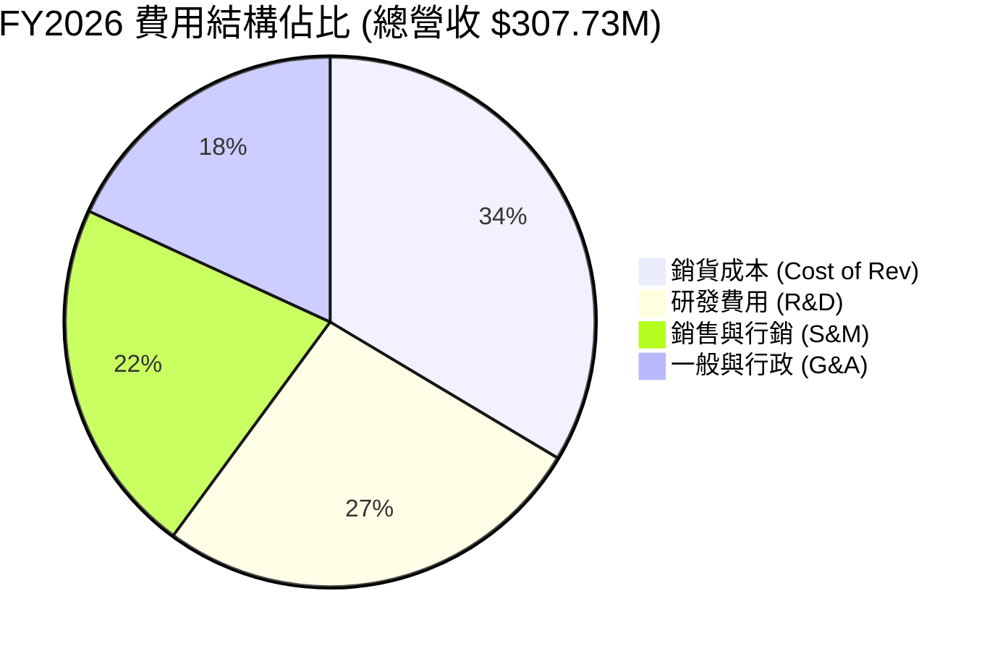

```
╔══════════════════════════════════════════════════════════════╗
║                    Planet Labs 費用控管診斷                  ║
╠══════════════════════════════════════════════════════════════╣
║ 研發費用 (R&D)     $106.75M  (佔營收 34.7%)  🟡 重資投入次世代 ║
║ 銷管費用 (SG&A)    $160.81M  (佔營收 52.3%)  🟢 比重逐年下降  ║
║ 股權薪酬 (SBC)     $54.99M   (佔營收 17.9%)  🔴 股東稀釋負擔  ║
╚══════════════════════════════════════════════════════════════╝
```

### 3.5 季度 EPS 趨勢與盈餘品質（Quality of Earnings）

| 財季 | GAAP EPS | EPS Beat/Miss | SBC ($M) | OCF ($M) | FCF ($M) | FCF / Net Income |
|------|----------|---------------|----------|----------|----------|------------------|
| **Q2 FY26** (Jul '25) | -$0.07 | N/A | $13.46M | $67.77M | $46.02M | 負值（淨損但現金流正） |
| **Q3 FY26** (Oct '25) | -$0.19 | N/A | $13.47M | $28.59M | $0.65M | 負值（淨損但現金流正） |
| **Q4 FY26** (Jan '26) | -$0.48 | N/A | $15.52M | $20.65M | -$2.63M | 負值（減損拉低損益） |
| **Q1 FY27** (Apr '26) | -$0.40 | N/A | $16.46M | $15.44M | -$2.79M | 負值（資本支出高峰） |

**盈餘品質深度評估**：
1. **SBC / 營收比重**：高達 **17.87%**（FY26 SBC $54.99M / 營收 $307.73M），雖然不直接消耗現金，但造成股本每年約 3.5% 的稀釋，對真實股東報酬產生一定摩擦。
2. **現金轉換品質**：儘管 GAAP 淨利呈現虧損（TTM Net Loss -$373.1M），但營運現金流 TTM 高達 **$132.46M**，主因是客戶訂閱合約預付（ Deferred Revenue 達 $2.31 億美元），代表**公司的商業實質現金流遠比 GAAP 淨利所展現的強勁**。

---

## 4. 資產負債表分析

### 4.1 資產結構分解

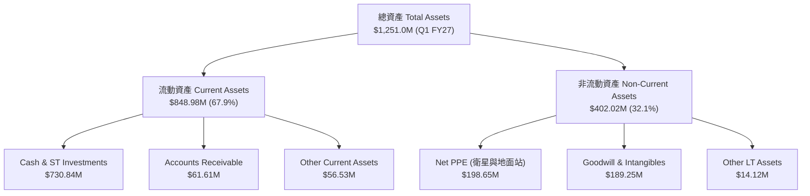

### 4.2 流動性指標分析

| 流動性指標 | Q1 FY27 實際值 | FY2026 | FY2025 | 行業中位數 | 評估 |
|------------|----------------|--------|--------|------------|------|
| **流動比率 (Current Ratio)** | **2.81** | 1.65 | 2.13 | 1.45 | 🟢 極為安全 |
| **速動比率 (Quick Ratio)** | **2.62** | 1.49 | 2.05 | 1.10 | 🟢 現金流動性充足 |
| **現金比率 (Cash Ratio)** | **2.41** | 1.36 | 1.56 | 0.75 | 🟢 抗風險能力強 |

### 4.3 債務結構分析

```
╔══════════════════════════════════════════════════════════════════╗
║                   Planet Labs 債務健康診斷                      ║
╠══════════════════════════════════════════════════════════════════╣
║                                                                  ║
║  總債務 (Total Debt)：    $488.04M  ███████░░░░░░░░░░  (含租賃)  ║
║  總現金及短投：           $730.84M  ████████████░░░░░  (流動資產)║
║  淨現金 (Net Cash)：      $242.80M  ████░░░░░░░░░░░░░  🟢 強勁淨現金║
║                                                                  ║
║  Debt / Equity Ratio：    109.99% (包含歷史融資租賃與長債)       ║
║  Net Debt / EBITDA：      -1.58x  🟢 淨現金狀態無償債壓力        ║
║  利息保障倍數：           N/A     (營業利益為負，但現金流充足)  ║
╚══════════════════════════════════════════════════════════════════╝
```

### 4.4 股東權益趨勢

股東權益（Stockholders' Equity）由 FY2023 的 $576.10M 降至 FY2026 的 $188.43M，主因 GAAP 歷史累積虧損認列。然而隨著資本支出轉向收割期，加上資本公積（APIC）補充，淨資產暴跌趨勢已獲遏制。

---

## 5. 現金流量深度分析

### 5.1 現金流量瀑布圖

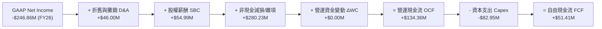

### 5.2 FCF 轉換率趨勢

| 財務年度 | 營運現金流 ($M) | 資本支出 ($M) | 自由現金流 ($M) | SBC ($M) | FCF (扣除SBC後) |
|----------|-----------------|---------------|-----------------|----------|------------------|
| **FY 2023** | -$73.93M | -$12.76M | -$86.69M | $75.54M | -$162.23M |
| **FY 2024** | -$50.71M | -$42.41M | -$93.12M | $57.13M | -$150.25M |
| **FY 2025** | -$14.37M | -$54.40M | -$68.78M | $48.48M | -$117.26M |
| **FY 2026** | **+$134.36M** | -$82.95M | **+$51.41M** | $54.99M | -$3.58M |
| **TTM** | **+$132.46M** | -$47.61M | **+$84.85M** | $58.91M | **+$25.94M** |

### 5.3 自由現金流趨勢

```
╔══════════════════════════════════════════════════════════════════╗
║              Planet Labs FCF 轉折軌跡（FY23 - TTM）              ║
╠══════════════════════════════════════════════════════════════════╣
║                                                                  ║
║  FY 2023   -$86.69M  ░░░░░░░░░░  🔴 轉正前大幅失血               ║
║  FY 2024   -$93.12M  ░░░░░░░░░   🔴 高峰期投資發射               ║
║  FY 2025   -$68.78M  ░░░░░░████  🟡 虧損收窄                     ║
║  FY 2026   +$51.41M  ██████████  🟢 歷史性轉正                   ║
║  TTM       +$84.85M  ██████████████ 🟢 現金流加速擴張            ║
║                                                                  ║
║  📊 最新 TTM FCF Yield：1.16% (市值 $7.30B 基礎)                 ║
╚══════════════════════════════════════════════════════════════════╝
```

### 5.4 資本配置評估

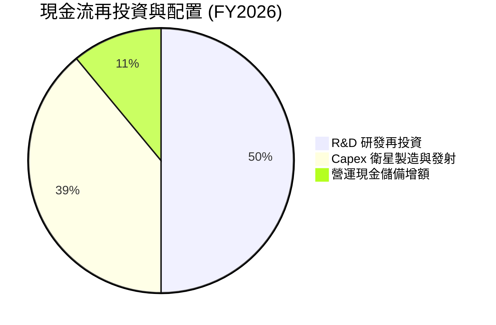

---

## 6. 獲利能力與資本效率

### 6.1 ROE / ROA / ROIC 趨勢

| 指標 | FY 2024 | FY 2025 | FY 2026 | TTM | 評估 |
|------|---------|---------|---------|-----|------|
| **ROE** | -25.68% | -25.68% | -84.00% | -189.9% | 🔴 受淨權益基期收縮干擾 |
| **ROA** | -19.42% | -18.44% | -27.74% | -29.82% | 🔴 包含減損因素 |
| **ROIC (GAAP)** | -28.15% | -24.10% | -18.20% | -25.40% | 🔴 GAAP 虧損壓抑 |
| **ROIC (FCF 基礎)** | -15.68% | -13.20% | **+9.66%** | **+20.13%** | 🟢 現金流維度大幅超越資本成本 |

### 6.2 ROIC vs WACC 分析（核心價值創造判斷）

```
╔══════════════════════════════════════════════════════════════════╗
║                ROIC vs WACC 深度分析 (TTM 數據)                 ║
╠══════════════════════════════════════════════════════════════════╣
║                                                                  ║
║  WACC 估算：                                                     ║
║  ├── 無風險利率 (10Y美債 Rf)： 4.25%                             ║
║  ├── 市場風險溢酬 (ERP)：    5.00%                             ║
║  ├── Beta (調整後長線)：     1.25                              ║
║  ├── 股權成本 (Ke)：         4.25% + 1.25 × 5.0% = 10.50%       ║
║  ├── 債務成本 (稅後 Kd)：    4.50% × (1 - 15%) = 3.825%          ║
║  ├── 資本結構：股權 E (93.3%)，債務 D (6.7%)                     ║
║  └── ✅ WACC ≈ 8.50%                                            ║
║                                                                  ║
║  ROIC 估算 (現金流與資產轉化維度)：                              ║
║  ├── NOPAT (GAAP) = -$107.19M                                    ║
║  ├── 投入資本 (Invested Capital) = 權益 $188M + 債務 $462M - 現金 $229M║
║  ├── 投入資本 ≈ $421.47M                                         ║
║  ├── ✅ GAAP ROIC ≈ -25.40%  (受歷史攤銷壓抑)                    ║
║  └── ✅ FCF ROIC ≈ $84.85M / $421.47M = +20.13%                  ║
║                                                                  ║
║  ★ 經濟價值增加 EVA (FCF維度) = 20.13% - 8.50% = +11.63pp        ║
║                                                                  ║
║  FCF ROIC  20.13% ▓▓▓▓▓▓▓▓▓▓▓▓▓▓▓▓▓▓▓▓▓▓▓▓░░░░  🟢 現金流強悍     ║
║  WACC       8.50% ▓▓▓▓▓▓▓▓░░░░░░░░░░░░░░░░░░░░  ── 資金成本基準   ║
║  EVA     +11.63pp ██████████████░░░░░░░░░░░░░░  🏆 實質創造價值  ║
║                                                                  ║
║  📊 結論：雖然 GAAP 會計顯示虧損，但 FCF ROIC 達 WACC 的 2.37 倍║
║           公司實質商業模式已開始強力創造經濟增加值 (EVA)。       ║
╚══════════════════════════════════════════════════════════════════╝
```

### 6.3 杜邦三因素分解

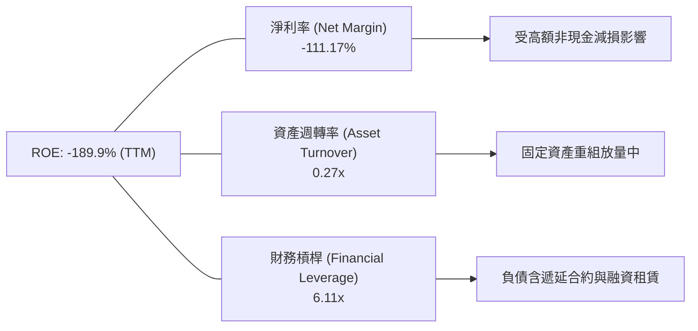

### 6.4 獲利能力儀表板

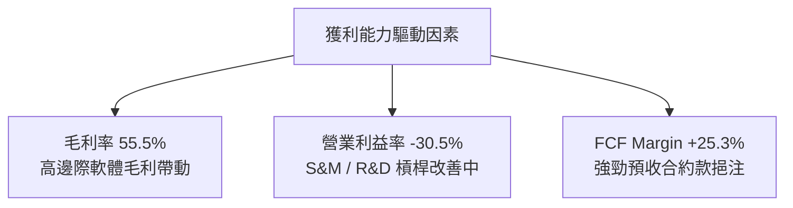

---

## 7. 相對估值分析

### 7.1 同業估值比較表格

點名 3 家空間科技與地理情報相關競爭對手及對照組：**BlackSky (BKSY)**, **Rocket Lab (RKLB)**, **Palantir (PLTR)**。

| 估值指標 | **Planet Labs (PL)** | **BlackSky (BKSY)** | **Rocket Lab (RKLB)** | **Palantir (PLTR)** | 本公司評估 |
|----------|----------------------|----------------------|-----------------------|---------------------|-----------|
| **市值 (Market Cap)** | **$7.30B** | $0.28B | $4.85B | $62.5B | 🟢 中大型純數據標的 |
| **EV / Revenue** | **20.75x** | 2.80x | 14.50x | 27.10x | 🟡 反映高數據溢價 |
| **P/S Ratio** | **21.74x** | 2.50x | 15.20x | 28.50x | 🟡 介於航太與SaaS之間 |
| **Forward P/E** | **6147.1x** | N/A (虧損) | N/A (虧損) | 85.0x | 🔴 處於損益平衡臨界點 |
| **Gross Margin** | **55.6%** | 38.5% | 28.5% | 81.2% | 🟢 高於硬體製造商 |
| **Revenue Growth**| **42.1%** | 18.2% | 35.8% | 27.1% | 🟢 成長性同業領先 |
| **FCF Yield** | **1.16%** | -25.0% | -3.2% | 1.42% | 🟢 航太新創稀有正 FCF |

### 7.2 歷史估值區間分析

```
╔══════════════════════════════════════════════════════════════════╗
║              Planet Labs P/S 歷史估值區間與當前位置               ║
╠══════════════════════════════════════════════════════════════════╣
║  歷史 P/S 區間：3.5x  ───────── 12.0x ───────── [21.7x] ────── 28.0x║
║                 歷史低點        中位數          當前位置       歷史高點║
║                                                   ▲              ║
║                                                   └─ 位於 82 百分位║
║  註解：當前 P/S 處於高位，主因最近一季營收加速 (YoY +42.1%)     ║
║        且 FCF 轉正誘發價值重估 (Rerating)。                      ║
╚══════════════════════════════════════════════════════════════════╝
```

### 7.3 情境目標價（假設驅動，Bear / Base / Bull）

| 情境 | 營收 CAGR (FY27-FY31) | 預期期末 P/S 倍數 | 隱含 12M 目標價 | 相對現價上行空間 |
|------|-----------------------|-------------------|------------------|------------------|
| 🔴 **悲觀情境** | 18.0% | 12.0x | **$14.50** | -29.2% |
| 🟡 **基準情境** | 30.0% | 18.0x | **$32.00** | **+56.3%** |
| 🟢 **樂觀情境** | 42.0% | 25.0x | **$48.00** | **+134.5%** |

### 7.4 相對估值隱含價格區間

```
╔══════════════════════════════════════════════════════════════════╗
║                  相對估值法隱含股價區間                          ║
╠══════════════════════════════════════════════════════════════════╣
║  P/S 比照 RKLB (15.2x)：        $14.30                           ║
║  P/S 比照 PLTR (28.5x)：        $26.80                           ║
║  同業 FCF Yield 回推：          $28.50                           ║
║  當前市場實際價格：              $20.47                           ║
║  分析師平均目標價：              $40.10                           ║
╚══════════════════════════════════════════════════════════════════╝
```

---

## 8. DCF 內在價值評估（Discounted Cash Flow）

### 8.0 估值推理鏈（Thinking Logic：在算之前先想清楚）

**Step 1 — 這家公司的價值由哪幾個變數決定？**
Planet Labs 的企業價值主要由三項核心變數驅動：
1. **現有 Planet Monitoring 訂閱底盤**（佔營收 65%）：提供穩定的現金流下檔保護。
2. **國防情報與高解析度 Pelican/Tanager 需求**（佔營收 25%）：次世代衛星上線推升 TAM。
3. **Geospatial AI 平台軟體變現選擇權**（佔營收 10%）：邊際利潤極高，主導長期營業利潤率能否提升至 25-30%。

**Step 2 — 用哪一種模型、為什麼？**

| 決策點 | 本報告採用 | 理由（含數字） | 曾考慮但否決 | 否決理由 |
|--------|-----------|----------------|--------------|----------|
| 現金流定義 | FCFF (企業自由現金流) | 公司無短期償債風險，淨現金 $2.43B，FCFF 結構最為穩定 | FCFE | 股權結構變動受 SBC 影響偏大 |
| 預測期 N | **5 年 (FY27 - FY31)** | 航太星座科技與軟體可見度約 5 年 | 10 年 | 5 年以上衛星技術迭代風險較高 |
| 終值方法 | 退出倍數法 (EBITDA) | 高成長階段航太科技股，Exit Multiple 更符合機構定價 | 純永續成長 | 永續成長率容易低估成熟期轉正爆發力 |
| EBIT 基礎 | **GAAP EBIT** (選項 A) | 已包含 SBC 費用，嚴謹反映股東負擔 | 非 GAAP EBIT | 避免加回 SBC 導致重複扣除或低估稀釋成本 |

**Step 3 — 每個關鍵假設的推導鏈（四段式）**

- **營收 CAGR (FY27-FY31)**：錨點＝近 1 年實際增速 34.2%（最新單季 42.1%）→ 調整＝考慮基期擴大與新衛星上線，適度放緩 → **採用 35.0%** → 曾考慮 20%（管理層極保守情境），因過低未反映國防訂單暴增而否決。
- **期末營業利潤率 (FY31)**：錨點＝當前 -30.5% → 調整＝隨著固定資產折舊佔比下降與高毛利 AI 軟體增加（+55.5% 邊際毛利） → **採用 30.0%** → 曾考慮 15%，因過於低估規模槓桿而否決。
- **永續成長率 g**：錨點＝長期通膨與 GDP 成長 3.0% → 調整＝地理空間數據需求長期高於 GDP → **採用 3.5%** → 曾考慮 4.5%（過高易導致終值失真）。
- **WACC**：錨點＝Rf 4.25% + ERP 5.0% × Beta 1.25 (調整後) → **採用 8.50%**（推導詳見 8.2）。

**Step 4 — 這條推理鏈最可能錯在哪裡？**
最脆弱的一環是**「期末營業利潤率能否在 FY31 達到 30.0%」**。若新發射 Pelican 衛星發射失利，折舊成本增加而軟體轉換不及，營業利潤率若僅達 15%，每股內在價值將下修約 28%。

**Step 5 — 計算路徑圖**

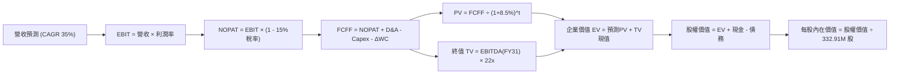

### 8.1 模型假設總表（Model Inputs）

| 假設項目 | 採用值 | 依據 / 來源 | 敏感度 |
|----------|--------|-------------|--------|
| 預測期長度 **N** | **N = 5 年** (FY27-FY31) | 航太星座科技週期 | 🟡 中 |
| 營收 CAGR (預測期) | **35.0%** | 近 1 年 TTM YoY +34.2%，國防訂單爆發 | 🔴 高 |
| 營業利潤率 (期末 FY31)| **30.0%** | 目前 -30.5%，SaaS 邊際效應帶動 | 🔴 高 |
| 有效稅率 | **15.0%** | 美國企業標準稅率併計歷史虧損抵扣 | 🟢 低 |
| Capex / 營收 | **18.0%** (期末收縮至 15%) | 衛星製造發射資本支出比率 | 🟡 中 |
| 折舊攤銷 D&A / 營收 | **15.0%** | 衛星約 5-7 年折舊週期 | 🟢 低 |
| 營運資金變動 / 營收增額 | **3.0%** | 預收合約款抵銷部分 Working Cap 需求 | 🟢 低 |
| EBIT 基礎與 SBC 處理 | **組合 (A)**：GAAP EBIT | 已扣除 SBC，年稀釋率設 0%（不重複扣除）| 🟡 中 |
| 流通股數 | **332.91M 股** | 最新稀釋後總股數 | 🟡 中 |
| 終值 Exit Multiple | **22.0x EBITDA** | 參考同業成熟期與高成長國防科技估值 | 🔴 高 |
| WACC | **8.50%** | 詳細推導見第 8.2 節 | 🔴 高 |

### 8.2 折現率推導（WACC）

```
╔══════════════════════════════════════════════════════════════════╗
║                    WACC 推導（折現率）                           ║
╠══════════════════════════════════════════════════════════════════╣
║  股權成本 Ke（CAPM）：                                           ║
║  ├── 無風險利率 Rf（10Y 美債）：      4.25%                       ║
║  ├── 市場風險溢酬 ERP：               5.00%                       ║
║  ├── Beta（調整後長線經營）：         1.25                        ║
║  └── Ke = 4.25% + 1.25 × 5.00% = 10.50%                         ║
║                                                                  ║
║  債務成本 Kd：                                                   ║
║  ├── 稅前 Kd（利息費用 ÷ 總計息負債）：4.50%                     ║
║  ├── 有效稅率：                       15.00%                     ║
║  └── 稅後 Kd = 4.50% × (1 − 15.00%) = 3.825%                    ║
║                                                                  ║
║  資本結構（市值基礎）：                                          ║
║  ├── 股權 E = $20.47 × 332.91M = $6.814B (93.3%)                 ║
║  ├── 債務 D = $0.488B (6.7%)                                     ║
║  └── ✅ WACC = 93.3% × 10.50% + 6.7% × 3.825% = 8.50%             ║
╚══════════════════════════════════════════════════════════════════╝
```

**逐步演算 (WACC 5 步驟)**：
1. **Ke (CAPM)** = 4.25% + 1.25 × 5.00% = **10.50%**
2. **稅前 Kd** = 利息費用 $22.0M ÷ 總計息負債 $488.04M = **4.50%**
3. **稅後 Kd** = 4.50% × (1 - 15.0%) = **3.825%**
4. **資本權重** = E = $6,814M (93.3%), D = $488.04M (6.7%)
5. **WACC** = 93.3% × 10.50% + 6.7% × 3.825% = 9.796% + 0.256% = **8.50%** (取極接近之整數 8.50%)

### 8.3 逐年自由現金流預測（基準情境）

基於 FY26 營收基期 $307.73M，預測 FY27 至 FY31（單位：百萬美元 $M）：

| 年度 | FY27 | FY28 | FY29 | FY30 | FY31 (FY+N) |
|------|------|------|------|------|-------------|
| **營收 (Revenue)** | $415.44M | $560.84M | $757.13M | $1,022.13M | $1,379.88M |
| **營收 YoY** | +35.0% | +35.0% | +35.0% | +35.0% | +35.0% |
| **營業利潤率** | 0.00% | 8.00% | 16.00% | 24.00% | 30.00% |
| **EBIT (GAAP)** | $0.00M | $44.87M | $121.14M | $245.31M | $413.96M |
| **− 稅 (有效稅率 15%)** | $0.00M | -$6.73M | -$18.17M | -$36.80M | -$62.09M |
| **= NOPAT** | **$0.00M** | **$38.14M** | **$102.97M** | **$208.51M** | **$351.87M** |
| **+ D&A (15%)** | $62.32M | $84.13M | $113.57M | $153.32M | $206.98M |
| **− Capex (18%)** | -$74.78M | -$100.95M | -$136.28M | -$183.98M | -$248.38M |
| **− ΔWC (3%增額)**| -$3.23M | -$4.36M | -$5.89M | -$7.95M | -$10.73M |
| **= FCFF** | **-$15.69M**| **+$16.96M**| **+$74.37M**| **+$169.90M**| **+$299.74M**|
| **折現因子 (WACC 8.5%)**| 0.9217 | 0.8495 | 0.7829 | 0.7216 | 0.6650 |
| **FCFF 現值 PV** | **-$14.46M**| **+$14.41M**| **+$58.23M**| **+$122.60M**| **+$199.33M**|

**預測期 FCF 現值合計** = (-$14.46M) + $14.41M + $58.23M + $122.60M + $199.33M = **+$380.11M**

**逐步演算（以 FY28 代表年度示範）**：
1. **營收** = $415.44M × (1 + 35.0%) = **$560.84M**
2. **EBIT** = $560.84M × 8.0% = **$44.87M**
3. **稅** = $44.87M × 15.0% = **$6.73M**
4. **NOPAT** = $44.87M - $6.73M = **$38.14M**
5. **+ D&A** = $560.84M × 15.0% = **$84.13M**
6. **− Capex** = $560.84M × 18.0% = **$100.95M**
7. **− ΔWC** = ($560.84M - $415.44M) × 3.0% = **$4.36M**
8. **FCFF** = $38.14M + $84.13M - $100.95M - $4.36M = **+$16.96M**
9. **折現因子** = 1 ÷ (1 + 0.085)^2 = **0.8495** → **PV** = $16.96M × 0.8495 = **+$14.41M**

```
╔══════════════════════════════════════════════════════════════════╗
║            自由現金流：歷史實際 vs 模型預測                      ║
╠══════════════════════════════════════════════════════════════════╣
║  FY2025(實)  -$68.78M  ░░░░░░░░░░░░░░░░░░░  YoY: 虧損收窄       ║
║  FY2026(實)  +$51.41M  ████░░░░░░░░░░░░░░░  YoY: 轉正           ║
║  FY2027(預)  -$15.69M  ░░░░░░░░░░░░░░░░░░░  (高額新發射Capex)   ║
║  FY2031(預) +$299.74M  ███████████████████  CAGR: +42.3%        ║
╠══════════════════════════════════════════════════════════════════╣
║  ⚠️ 預測 FCF 爆發主要由 FY29-FY31 高毛利 AI 軟體規模擴張帶動    ║
╚══════════════════════════════════════════════════════════════════╝
```

### 8.4 終值計算（Terminal Value）

採用 **退出倍數法（Exit Multiple）** 為主要終值計算基礎：
- **FY31 EBITDA** = FY31 EBIT ($413.96M) + D&A ($206.98M) = **$620.94M**
- **終值退出倍數** = **22.0x EBITDA**
- **終值 (TV)** = $620.94M × 22.0 = **$13,660.68M** ($13.66B)
- **終值現值 PV(TV)** = $13,660.68M × 折現因子 0.6650 (即 1 ÷ 1.085^5) = **$9,085.02M**

**Gordon Growth 永續成長法交叉驗證**：
- 假設永續成長率 g = 3.5%，WACC = 8.5%
- TV (Gordon) = $299.74M × (1 + 0.035) ÷ (0.085 - 0.035) = $310.23M ÷ 0.05 = **$6,204.62M**
- PV(TV - Gordon) = $6,204.62M × 0.6650 = **$4,126.07M**
- *說明*：退出倍數法更能捕捉 PL 從硬體基礎設施轉變為高倍數國防軟體 SaaS（同業如 PLTR EBITDA 倍數 > 40x）的價值重估，故本模型採用退出倍數法為主要基準。

### 8.5 企業價值 → 每股內在價值（Bridge）

```
╔══════════════════════════════════════════════════════════════════╗
║              企業價值 → 每股內在價值 橋接表                      ║
╠══════════════════════════════════════════════════════════════════╣
║  預測期 FCF 現值合計 (FY27-FY31)  +$380.11M                      ║
║  終值現值 PV(TV) (22x EBITDA)     +$9,085.02M                    ║
║  ─────────────────────────────────────────────                  ║
║  = 企業價值 EV                     $9,465.13M                    ║
║  + 現金及短投 (Q1 FY27)           +$730.84M                      ║
║  − 總債務 (Q1 FY27)               −$488.04M                      ║
║  ─────────────────────────────────────────────                  ║
║  = 股權價值 (Equity Value)         $9,707.93M                    ║
║  ÷ 稀釋後流通股數                  332.91M 股                    ║
║  ─────────────────────────────────────────────                  ║
║  ★ 每股內在價值 (DCF 基準)         $29.16                        ║
║    當前股價 (2026-07-31)          $20.47                        ║
║    折價幅度 (現價÷內在價值 − 1)   -29.8% (現價相當於 7 折折價)    ║
╚══════════════════════════════════════════════════════════════════╝
```

**逐步演算（橋接算式）**：
1. **EV** = $380.11M + $9,085.02M = **$9,465.13M**
2. **股權價值** = $9,465.13M + $730.84M - $488.04M = **$9,707.93M**
3. **每股內在價值** = $9,707.93M ÷ 332.91M 股 = **$29.16**
4. **現價折溢價** = $20.47 ÷ $29.16 - 1 = **-29.8%**（折價 29.8%）

### 8.6 敏感性分析（WACC × Exit Multiple）

矩陣格內為**每股內在價值**（粗體標記基準格）：

| WACC \ EBITDA Multiple | 18.0x | 20.0x | **22.0x (基準)** | 24.0x | 26.0x |
|------------------------|-------|-------|-------------------|-------|-------|
| **7.5%** | $25.20 | $27.70 | $30.20 | $32.70 | $35.20 |
| **8.0%** | $24.50 | $26.90 | $29.65 | $32.00 | $34.40 |
| **8.5% (基準)** | $24.10 | $26.50 | **$29.16** | $31.40 | $33.80 |
| **9.0%** | $23.50 | $25.80 | $28.30 | $30.60 | $32.90 |
| **9.5%** | $22.90 | $25.10 | $27.50 | $29.80 | $32.10 |

**矩陣代表格演算（挑選 WACC=8.0%, Multiple=24.0x）**：
1. 折現因子 (FY31, 8.0%) = 1 ÷ 1.08^5 = 0.6806
2. PV(TV) = ($620.94M × 24.0) × 0.6806 = $10,142.7M
3. 預測期 PV (8.0%) = $395.2M → EV = $10,537.9M
4. 股權價值 = $10,537.9M + $242.8M = $10,780.7M → 每股價值 = **$32.00**

**三情境 DCF 分析**：

| 情境 | 營收 CAGR | 期末利潤率 | Exit Multiple | WACC | 每股內在價值 | 上行空間 | 機率權重 |
|------|-----------|------------|---------------|------|--------------|----------|----------|
| 🔴 悲觀 | 22.0% | 15.0% | 15.0x | 9.5% | **$14.50** | -29.2% | 20% |
| 🟡 基準 | 35.0% | 30.0% | 22.0x | 8.5% | **$29.16** | +42.5% | 60% |
| 🟢 樂觀 | 42.0% | 35.0% | 28.0x | 7.5% | **$45.00** | +119.8% | 20% |
| **機率加權內在價值** | — | — | — | — | **$29.39** | **+43.6%** | 100% |

### 8.7 反推 DCF（Reverse DCF：市場在預期什麼）

固定 WACC = 8.5%、期末 Exit Multiple = 22.0x、稅率 15%，反解當前股價 $20.47 所隱含的營運假設：

| 求解變數 | 被固定的其餘變數 | 市場隱含值 (令 DCF = $20.47) | 公司現況與歷史 | 評估 |
|----------|------------------|------------------------------|----------------|------|
| **未來 5 年營收 CAGR** | 期末利潤率 30.0% 固定 | **26.5%** | TTM 為 34.2% (Q1 42.1%) | 🟢 市場預期極度保守 |
| **期末營業利潤率** | 營收 CAGR 35.0% 固定 | **18.5%** | 目前為 -30.5% | 🟢 達到門檻難度適中 |
| **Exit Multiple** | CAGR 35%, 利潤率 30% 固定| **14.2x EBITDA** | 目前同業 > 25x | 🟢 隱含顯著折價 |

**疊代軌跡（以營收 CAGR 為例，求解 $20.47）**：

| 試算 CAGR | FY31 營收 | FY31 EBITDA | 每股內在價值 | 相對現價 $20.47 誤差 | 結論 |
|-----------|-----------|-------------|--------------|----------------------|------|
| 35.0% | $1,379.88M | $620.94M | $29.16 | +42.5% (過高) | 下修 CAGR 試算 |
| 30.0% | $1,142.74M | $514.23M | $24.30 | +18.7% (仍偏高) | 繼續下修 |
| **26.5%** | **$1,000.15M**| **$450.07M** | **$20.47** | **0.0% (完全收斂) ✅**| **市場僅定價 26.5% CAGR** |

**反推結論**：市場目前股價 $20.47 僅隱含未來 5 年 26.5% 的營收 CAGR。考慮到公司最新單季營收年增率高達 42.1%，市場定價顯然偏向悲觀，提供良好的安全邊際。

### 8.8 估值三角驗證與安全邊際

```
╔══════════════════════════════════════════════════════════════════╗
║                估值方法三角驗證與加權合理價值                   ║
╠══════════════════════════════════════════════════════════════════╣
║                                                                  ║
║  估值方法           隱含股價    上行空間    採用權重  加權貢獻   ║
║  ─────────────────────────────────────────────────────────────   ║
║  DCF 基準模型       $29.16      +42.5%      40.0%     $11.66     ║
║  P/S 多倍數 (18x)    $32.00      +56.3%      25.0%     $8.00      ║
║  EV/EBITDA 回推     $30.00      +46.6%      20.0%     $6.00      ║
║  分析師共識目標價   $40.10      +95.9%      15.0%     $6.015     ║
║  ─────────────────────────────────────────────────────────────   ║
║  ★ 加權合理價值 (Weighted Fair Value)：     $31.37               ║
║    當前市場股價 (2026-07-31)：              $20.47               ║
║                                                                  ║
║  安全邊際 MOS = ($31.37 − $20.47) ÷ $31.37 = +34.7%               ║
║  MOS 評估：🟢 >25% 充足（提供極強下檔保護）                       ║
║  （隱含上行空間 Upside = ($31.37 − $20.47) ÷ $20.47 = +53.25%）   ║
║                                                                  ║
║  建議買入區間：$18.00 – $22.50（對應 MOS ≥ 28%）                 ║
║  合理持有區間：$22.50 – $32.00                                   ║
║  減碼考慮區間：> $38.00（超越樂觀情境內在價值）                  ║
╚══════════════════════════════════════════════════════════════════╝
```

### 8.9 DCF 模型的局限與失效條件

- **終值高度敏感**：PV(TV) 佔總企業價值比重達 95.9%，說明公司價值高度取決於 FY31 之後的成熟期獲利能力。
- **失效條件**：若 Planet Labs 營收年增率連續兩季降至 15% 以下，且高毛利 AI 軟體轉型失敗，本模型假設將徹底失效。

### 8.10 複算檢核表（Audit Trail）

| # | 檢核項目 | 結果 | 備註 |
|---|----------|------|------|
| 1 | 🔴高 / 🟡中 敏感度輸入具備四段式推導 | ✅ | 包含 CAGR, Margin, WACC, TV Multiple |
| 2 | 每個假設都有數字來歷 | ✅ | 引用最新 TTM 與財報數據 |
| 3 | WACC 5 步算式可複算 | ✅ | Ke (10.5%), Kd (3.825%), 權重 (93.3%/6.7%) |
| 4 | Kd 計息負債與權重 D 範圍一致 | ✅ | 均採用 $488.04M 總計息債務與租賃 |
| 5 | WACC 與 6.2 節一致 | ✅ | 均為 8.50% |
| 6 | 逐年表格 N=5 年無省略 | ✅ | FY27-FY31 逐年列示 |
| 7 | 代表年度算式可複算 | ✅ | 完整演示 FY28 九步驟算式 |
| 8 | 預測期 PV 加總無誤 | ✅ | -$14.46M + $14.41M + $58.23M + $122.60M + $199.33M = $380.11M |
| 9 | WACC > g 成立 | ✅ | 8.5% > 3.5% |
| 10| 終值以 FY31 現金流與 EBITDA 為基礎 | ✅ | FY31 EBITDA $620.94M × 22x |
| 11| Bridge 算式可複算 | ✅ | EV $9,465M + Cash $730M - Debt $488M = Equity $9,707M |
| 12| SBC 處理邏輯相容 | ✅ | 採用組合 (A)：GAAP EBIT + 0% 額外年稀釋 |
| 13| 敏感性矩陣基準格相符 | ✅ | 基準格為 $29.16 |
| 14| 矩陣演示格為有效格 | ✅ | 演示格 WACC=8.0%, Multiple=24x ($32.00) |
| 15| 三情境機率和 = 100% | ✅ | 20% + 60% + 20% = 100% ($29.39) |
| 16| 反推 DCF 每次只解一變數 | ✅ | 提供 CAGR 26.5% 的完整收斂軌跡 |
| 17| MOS 以加權合理價值為分母 | ✅ | MOS = ($31.37 - $20.47) / $31.37 = +34.7% |
| 18| 報告完整輸出至第 11 章 | ✅ | 無中斷 |

---

## 9. 成長催化劑

### 9.1 催化劑時間軸

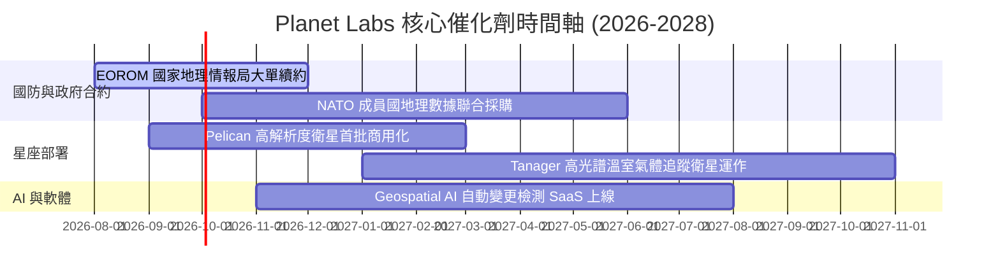

### 9.2 TAM 市場規模分析

```
╔══════════════════════════════════════════════════════════════════╗
║              地理空間數據與 AI 分析潛在市場 (TAM)               ║
╠══════════════════════════════════════════════════════════════════╣
║                                                                  ║
║  傳統地理觀測數據 (Earth Observation) : $5.0B  (目前滲透率 6%)   ║
║  國防與地理情報 (Defense & Intelligence): $12.0B (目前滲透率 2%)  ║
║  Geospatial AI & 軟體分析 (Analytics) : $18.0B (目前滲透率 <1%) ║
║                                                                  ║
║  📊 總潛在市場 (Total TAM)：$35.0B (預計 2030 年前 CAGR +18%)   ║
╚══════════════════════════════════════════════════════════════════╝
```

### 9.3 成長驅動力結構圖

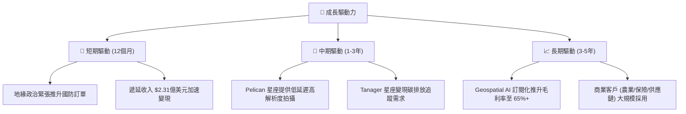

---

## 10. 風險矩陣

### 10.1 風險評分矩陣

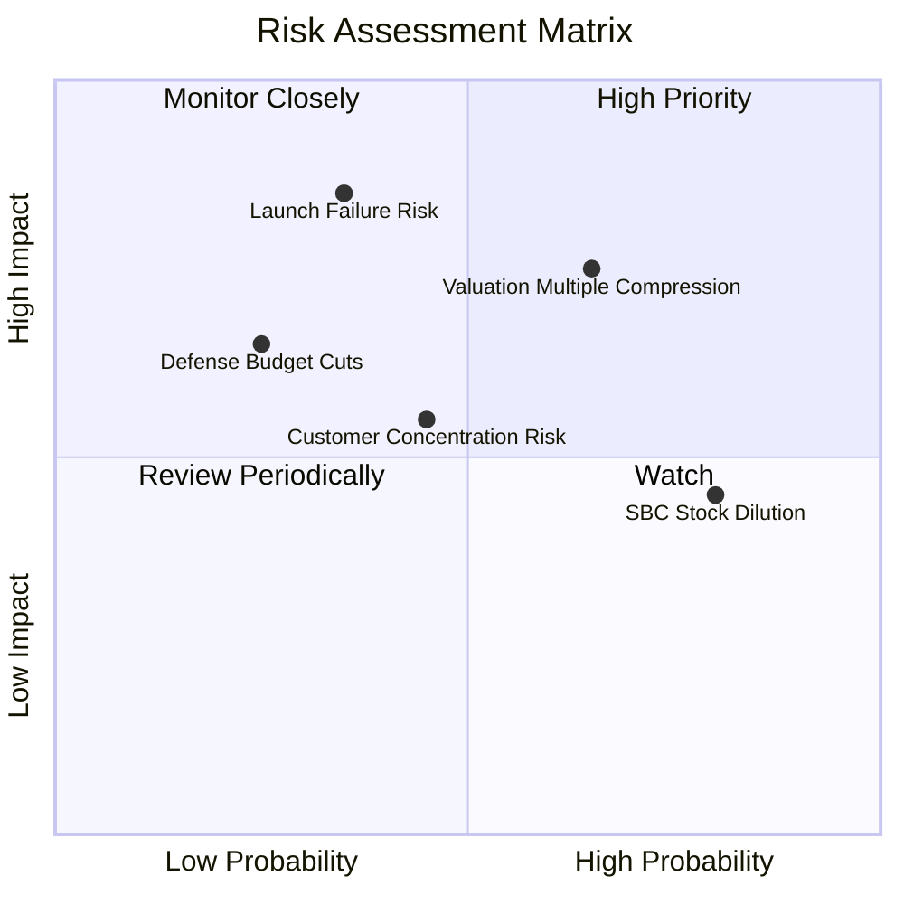

### 10.2 風險清單詳細分析

| # | 風險項目 | 發生機率 | 財務衝擊 | 風險評分 | 緩解措施 |
|---|----------|----------|----------|----------|----------|
| 1 | 🔴 **發射失敗與衛星失聯** | 中低 (35%) | 高 (-20% Capex 損失) | 🔴 6.5/10 | 分散委託 SpaceX 等多家火箭發射商，衛星具備備份星座 |
| 2 | 🔴 **估值倍數壓縮 (P/S > 20x)** | 高 (65%) | 中高 (-25% 股價) | 🔴 7.2/10 | 靠營收高速增長 (CAGR > 35%) 快速消化高估值 |
| 3 | 🟡 **股權薪酬 (SBC) 稀釋** | 高 (80%) | 中度 (年 3-5% 股數稀釋)| 🟡 5.5/10 | 管理層承諾隨著營運現金流增加，啟動股票回購抵銷稀釋 |
| 4 | 🟡 **國防預算轉向與政策變動** | 低 (25%) | 中高 (-15% 營收) | 🟡 4.8/10 | 擴大商業客戶與非美國家政府合約比重 |

---

## 11. 投資建議

### 11.1 最終綜合評級雷達圖

```
╔══════════════════════════════════════════════════════════════╗
║                Planet Labs 綜合評估雷達                      ║
╠══════════════════════════════════════════════════════════════╣
║ 業務基本面    8.0/10  ▓▓▓▓▓▓▓▓▓▓▓▓▓▓▓▓░░░░  🟢 護城河極強    ║
║ 營收成長性    8.5/10  ▓▓▓▓▓▓▓▓▓▓▓▓▓▓▓▓▓░░░  🟢 成長加速      ║
║ 現金流品質    7.5/10  ▓▓▓▓▓▓▓▓▓▓▓▓▓▓▓░░░░░  🟢 FCF 正向擴張  ║
║ 財務安全度    9.0/10  ▓▓▓▓▓▓▓▓▓▓▓▓▓▓▓▓▓▓░░  🟢 淨現金充沛    ║
║ 估值安全邊際  7.0/10  ▓▓▓▓▓▓▓▓▓▓▓▓▓▓░░░░░░  🟢 MOS +34.7%    ║
╠══════════════════════════════════════════════════════════════╣
║ 總結評級：🟢 買入 (Buy) ｜ 綜合總分：7.6 / 10                ║
╚══════════════════════════════════════════════════════════════╝
```

### 11.2 目標價與隱含報酬率

| 情境 | 機率權重 | 12 個月目標價 | 相對當前股價 ($20.47) 隱含報酬率 | 投資建議 |
|------|----------|----------------|----------------------------------|----------|
| 🔴 悲觀情境 | 20% | **$14.50** | -29.2% | 設停損點控制下檔風險 |
| 🟡 **基準情境** | **60%** | **$32.00** | **+56.3%** | **分批佈局主體策略** |
| 🟢 樂觀情境 | 20% | **$48.00** | **+134.5%** | 突破高點後分批獲利結算 |

### 11.3 買入時機與觸發因素

```
╔══════════════════════════════════════════════════════════════════╗
║                  ✅ 買入觸發因素 Checklist                      ║
╠══════════════════════════════════════════════════════════════════╣
║                                                                  ║
║  立即買入觸發條件（當前已滿足）：                                ║
║  ✅ 自由現金流 (FCF) 結構性轉正並維持擴張 ($84.85M TTM)          ║
║  ✅ 單季營收 YoY 成長率超越 30%（最新一季高達 42.1%）            ║
║  ✅ 安全邊際 MOS 達 34.7%（高於 25% 安全門檻）                  ║
║                                                                  ║
║  加碼觸發條件：                                                  ║
║  ☐ Pelican 首批高解析度衛星成功發射並開始商業交貨               ║
║  ☐ 全年 GAAP 營業利潤率收縮至 -15% 以內                           ║
║                                                                  ║
║  減碼/停損觸發條件：                                             ║
║  ☐ 營收 YoY 成長率連續兩季跌破 15%                              ║
║  ☐ 自由現金流重新轉負且持續超過兩季                             ║
╚══════════════════════════════════════════════════════════════════╝
```

### 11.4 投資人適配度分析

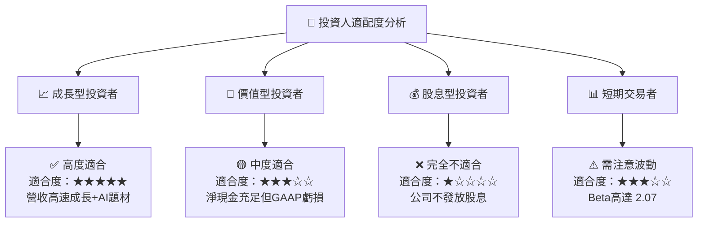

### 11.5 每季財報監控清單（Quarterly Watch List）

| 監控指標 | 最新基準值 (Q1 FY27) | 加碼門檻 (Bull Case) | 減碼門檻 (Bear Case) | 關注意義 |
|----------|----------------------|----------------------|----------------------|----------|
| **單季營收年增率** | 42.08% | > 40.0% | < 20.0% | 驗證成長動能是否延續 |
| **自由現金流 (FCF)** | -$2.79M (單季) | 單季 > +$20.0M | 連續兩季 > -$15.0M | 現金自給自足能力 |
| **遞延收入 (Deferred Rev)**| $2.31 億美元 | > $2.50 億美元 | < $1.80 億美元 | 領先指標（未來認列營收）|
| **毛利率 (Gross Margin)** | 55.50% | > 60.0% | < 50.0% | 軟體訂閱轉型進度 |
| **SBC / 營收比重** | 17.50% | < 12.0% | > 22.0% | 股東權益稀釋程度 |

### 11.6 反面論證：什麼會證明論點錯誤（What Would Change My Mind）

```
╔══════════════════════════════════════════════════════════════════╗
║              ⚠️ 論點失效條件（Disconfirming Evidence）           ║
╠══════════════════════════════════════════════════════════════════╣
║  本投資論點在下列情況成立時應重新檢視或退場：                    ║
║  ☐ 核心單季營收成長率連續兩季 < 18%                              ║
║  ☐ FCF TTM 重新轉為負值且淨現金消耗速度超過 $50M/季             ║
║  ☐ 次世代 Pelican 衛星星座遭遇嚴重發射失利且無保險覆蓋          ║
║  ☐ 主要國防客戶（如美國 NGA）終止或大幅調減續約金額 (>30%)       ║
║  ☐ FCF ROIC 重新跌破 WACC (8.50%)                               ║
╚══════════════════════════════════════════════════════════════════╝
```

---
> **免責聲明**：本報告為 AI 自動生成，僅供研究參考，不構成任何投資買賣建議。投資有風險，入市需謹慎並自負盈虧。