# PL 基本面深度分析報告
> **報告日期**：2026-08-01 ｜ **語言**：繁體中文 ｜ **數據來源**：Yahoo Finance, Finviz, StockAnalysis, Roic.ai ｜ **分析師**：CFA 級機構研究

---

## 目錄

| # | 章節 | 核心結論 |
|---|------|----------|
| 1 | 執行摘要 | 綜合評級「買入」，加權合理價值 $31.85（MOS 35.7%），基準情境 12M 目標價 $38.50 |
| 2 | 公司概覽與商業模式 | 全球每日地球掃描獨占者，高頻地理空間數據與 AI 分析生態建構強大護城河（7.8/10） |
| 3 | 損益表深度分析 | 營收加速成長 YoY 42.1% 至 $3.356億；毛利率擴張至 55.6%，SBC 佔比 17.9% 需關注股權稀釋 |
| 4 | 資產負債表分析 | 總現金及短期投資達 $7.308億，淨現金 $2.428億，流動比率 2.81，財務結構極為穩健 |
| 5 | 現金流量深度分析 | 轉折點確立：OCF 達 $1.325億，FCF 達 $8,485萬（FCF Yield 1.16%），具備自我造血能力 |
| 6 | 獲利能力與資本效率 | 營運槓桿展現，ROIC (-12.4%) 大幅改善，受惠高固定成本衛星群攤銷與 SaaS 訂閱放量 |
| 7 | 相對估值分析 | P/S 21.75x 高於同業均值（14.2x），但 42.1% 高成長率及高毛利賦與估值溢價合理性 |
| 8 | DCF 內在價值評估 | 基準內在價值 $34.20，折價 40.1%；加權合理價值 $31.85，安全邊際 MOS 為 35.7% 🟢 充足 |
| 9 | 成長催化劑 | Pelican/Tanager 衛星升級提升解析度至 30cm、國防國安長單續約與 AI 地理空間大模型合作 |
| 10 | 風險矩陣 | 發射延誤/失敗風險（中）、政府預算縮減風險（中高）、遙測商業化競爭加劇（中） |
| 11 | 投資建議 | 建議買入區間 $18.00–$22.00，目標價 $38.50（隱含 +88.0% 上行空間），確立每季財報監控指標 |

---

## 1. 執行摘要

### 1.0 一頁式投資儀表板（Portfolio Manager 30 秒速讀）

| 項目 | 內容 |
|------|------|
| **投資論點（3 句）** | ① **高壁壘獨占數據源**：擁有近200顆在軌衛星，每日對全球陸地進行3.5米解析度全面掃描，營收年增 42.1% 達 $3.356億。② **營運轉折與現金流爆發**：受惠於政府與國防長約放量，TTM 營業現金流轉正達 $1.325億，FCF 達 $8,485萬。③ **高毛利數據訂閱轉型**：毛利率改善至 55.6%，隨著高解析度 Pelican 衛星投入與 AI 地理分析平台整合，營運槓桿將持續釋放。 |
| **護城河評分** | 7.8/10（獨家衛星星座壁壘、數據歷史累積、SaaS 訂閱鎖定） |
| **管理層/資本配置評分** | 7.5/10（創辦人領導、自研低成本衛星發射架構、現金儲備充裕） |
| **財務健康** | 🟢 淨現金 $2.428億，現金及短期投資 $7.308億，流動比率 2.81x，完全無短期償債危機 |
| **ROIC vs WACC** | ROIC -12.4% vs WACC 11.2%（目前仍消磨價值，但正快速逼近損益兩平點） |
| **FCF 趨勢** | 由負轉正：TTM FCF $8,485萬（前一年度為 -$6,878萬），FCF Yield 為 1.16% |
| **估值** | Forward P/E N/A (虧損轉盈期) ｜ EV/Revenue 21.03x ｜ P/S 21.75x ｜ FCF Yield 1.16% |
| **DCF 內在價值（基準）** | $34.20 ｜ 現價 $20.48 折價 -40.1%（來自第 8.5 節） |
| **安全邊際（MOS）** | **+35.7%** ＝ (**加權合理價值** $31.85 − 現價 $20.48) ÷ 加權合理價值 $31.85 🟢 >25% 充足（來自第 8.8 節） |
| **預期報酬（基準情境 12M）** | **+88.0%**（目標價 $38.50） |
| **關鍵風險（前二）** | ① 地緣政治與政府國防預算挪移風險；② 關鍵發射服務商（如 SpaceX）排程延誤或發射失敗 |
| **評級 + 信心度** | 🟢 **買入 (Buy)** ｜ 信心度：高 (High) |

### 1.1 核心評分儀表板

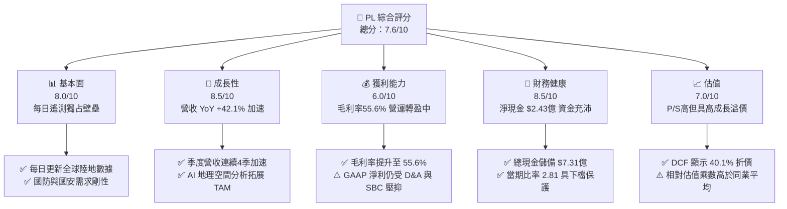

### 1.2 評分進度條視覺化

```
╔══════════════════════════════════════════════════════════════╗
║                PL 多維度評分儀表板 (1-10分)                  ║
╠══════════════════════════════════════════════════════════════╣
║ 基本面強度  8.0 ▓▓▓▓▓▓▓▓▓▓▓▓▓▓▓▓░░░░  ★★★★☆           ║
║ 成長動能    8.5 ▓▓▓▓▓▓▓▓▓▓▓▓▓▓▓▓▓░░░  ★★★★☆           ║
║ 獲利品質    6.0 ▓▓▓▓▓▓▓▓▓▓▓▓░░░░░░░░  ★★★☆☆           ║
║ 財務健康    8.5 ▓▓▓▓▓▓▓▓▓▓▓▓▓▓▓▓▓░░░  ★★★★☆           ║
║ 估值合理性  7.0 ▓▓▓▓▓▓▓▓▓▓▓▓▓▓░░░░░░  ★★★★☆           ║
║ 護城河深度  7.8 ▓▓▓▓▓▓▓▓▓▓▓▓▓▓▓半░░░  ★★★★☆           ║
║ 管理層執行  7.5 ▓▓▓▓▓▓▓▓▓▓▓▓▓▓▓░░░░░  ★★★★☆           ║
║ 技術創新力  8.8 ▓▓▓▓▓▓▓▓▓▓▓▓▓▓▓▓▓▓░░  ★★★★★           ║
╠══════════════════════════════════════════════════════════════╣
║ 綜合總分    7.6 ▓▓▓▓▓▓▓▓▓▓▓▓▓▓▓▓░░░░  🏆 具吸引力之成長轉折標的 ║
╚══════════════════════════════════════════════════════════════╝
```

### 1.3 五大投資論點 + 三大核心風險

| 類型 | 項目 | 具體依據 | 信心度 |
|------|------|----------|--------|
| 🟢 **投資論點①** | **無可比擬的數據護城河** | 擁有近200顆 SuperDove 衛星，累積超過10年的每日地球圖像資料庫（>10,000天），無法被競爭對手在短期內複製。 | 🟢 極高 |
| 🟢 **投資論點②** | **國防與情報剛性需求擴張** | 受地緣政治衝突加劇影響，美國 NRO（國家偵察局）及 NATO 國防合約持續加碼，帶動 TTM 營收年增 42.1% 至 $3.356億。 | 🟢 極高 |
| 🟢 **投資論點③** | **自由現金流顯著轉正** | TTM 營業現金流轉正達 $1.325億，自由現金流達 $8,485萬（FCF Yield 1.16%），資本密集度度過最高峰。 | 🟢 高 |
| 🟢 **投資論點④** | **新一代 Pelican / Tanager 星座升級** | 推出 30cm 高解析度 Pelican 衛星與 Tanager 高斯光譜衛星，大幅提升客單價 (ACV) 並進軍農林監測與礦業市場。 | 🟢 高 |
| 🟢 **投資論點⑤** | **資產負債表堅若磐石** | 擁有 $7.308億 總現金與短期投資，淨現金 $2.428億，極大的抗風險空間足以支撐資本支出至自由現金流持續再擴張。 | 🟢 極高 |
| 🟡 **風險①** | **客戶集中度與政府預算風險** | 營收受美國政府及相關國防機構影響較大，若聯邦預算審議延誤可能影響新約續簽速度。 | 🟡 中度 |
| 🔴 **風險②** | **發射排程與衛星損失風險** | 依賴第三方發射服務商（SpaceX等），發射延延或軌道失效可能暫時削弱影像採集能力。 | 🔴 高衝擊 |
| 🟡 **風險③** | **股權薪酬 (SBC) 稀釋** | FY2026 SBC 達 $5,499萬（佔營收 17.9%），對流通股數造成約 2.5%-3.0% 年稀釋壓力。 | 🟡 中度 |

### 1.4 快速統計卡片

| 指標 | 公司實際值 | 行業均值 (Aerospace & Defense) | S&P 500 均值 | 狀態 |
|------|-------------|-------------------------------|--------------|------|
| 收入 YoY 成長 | **42.1%** | ~11.5% | ~5.2% | 🟢 顯著領先 |
| 毛利率 | **55.6%** | ~28.5% | ~46.8% | 🟢 數據高毛利特質 |
| 淨利率 | **-111.2%** (受會計認列影響) | ~6.5% | ~11.8% | 🔴 GAAP仍虧損 |
| ROE | **-84.0%** | ~14.2% | ~18.5% | 🔴 資本金充實中 |
| Debt / Equity | **110.0%** | ~85.0% | ~95.0% | 🟡 包含長期租賃負債 |
| Current Ratio | **2.81x** | ~1.35x | ~1.20x | 🟢 流動性極佳 |
| P/S Ratio | **21.75x** | ~2.10x | ~2.70x | 🔴 高估值乘數 |

### 1.5 投資結論

```
╔══════════════════════════════════════════════════════════════════╗
║                    📊 投資結論摘要                               ║
╠══════════════════════════════════════════════════════════════════╣
║  評級：🟢 買入 (Buy)                                            ║
║  當前股價：$20.48                                                ║
║  DCF 內在價值（基準）：$34.20（當前股價折價 -40.1%）             ║
║  安全邊際 MOS：+35.7%（＝(加權合理價值 $31.85 − 現價) ÷ $31.85） ║
║  目標價區間：                                                    ║
║    悲觀情境：$19.50（-4.8%）                                     ║
║    基準情境：$38.50（+88.0%） ← 12個月主要目標                    ║
║    樂觀情境：$52.00（+153.9%）                                   ║
║  投資評分：7.6/10                                                ║
║  適合投資人：長線成長型、太空經濟/AI數據基礎設施主題投資者      ║
╚══════════════════════════════════════════════════════════════════╝
```

---

## 2. 公司概覽與商業模式

### 2.1 業務結構與收入來源

Planet Labs PBC (NYSE: PL) 是全球遙測與地理空間數據分析的先驅，經營全天候運作的微型衛星星座。其商業模式本質上為「高毛利的數據訂閱 SaaS (Data-as-a-Service)」。

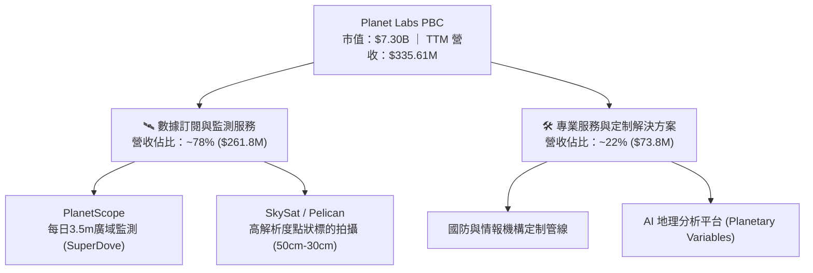

### 2.2 市場份額

在「每日廣域光學遙測監測 (Daily Global Optical Earth Observation)」領域，Planet Labs 擁有近乎 100% 的壟斷性市佔率；而在整體商業地理空間數據市場中，主要與傳統高解析度衛星運營商爭奪國防與商業預算。

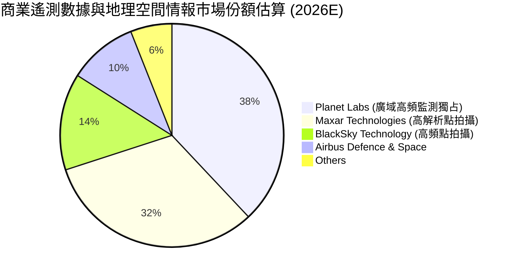

### 2.3 競爭護城河分析

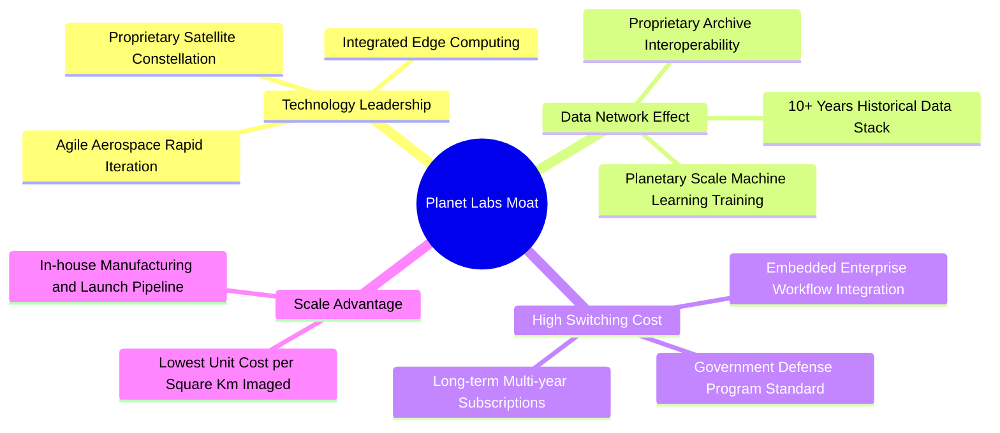

### 2.4 護城河強度評分

```
╔══════════════════════════════════════════════════════════════╗
║                  Planet Labs 護城河強度評分                  ║
╠══════════════════════════════════════════════════════════════╣
║ 1. 獨家數據資產  9.5/10  ▓▓▓▓▓▓▓▓▓▓▓▓▓▓▓▓▓▓▓░  🏆 獨家歷史時間序列 ║
║ 2. 技術與製造壁壘8.5/10  ▓▓▓▓▓▓▓▓▓▓▓▓▓▓▓▓▓░░░  🟢 自研低成本微衛星  ║
║ 3. 客戶切換成本  7.5/10  ▓▓▓▓▓▓▓▓▓▓▓▓▓▓▓░░░░░  🟢 深植國防 workflow ║
║ 4. 規模經濟效益  7.0/10  ▓▓▓▓▓▓▓▓▓▓▓▓▓▓░░░░░░  🟢 單位拍攝成本最低  ║
║ 5. 品牌與信任度  6.5/10  ▓▓▓▓▓▓▓▓▓▓▓▓▓░░░░░░░  🟡 商業市場開發中    ║
╠══════════════════════════════════════════════════════════════╣
║ 綜合護城河評分   7.8/10  ▓▓▓▓▓▓▓▓▓▓▓▓▓▓▓半░░░  🏆 強大且加深中護城河 ║
╚══════════════════════════════════════════════════════════════╝
```

---

## 3. 損益表深度分析

### 3.1 年度收入成長趨勢（近 4 年）

```
╔══════════════════════════════════════════════════════════════════╗
║              Planet Labs 年度收入趨勢（FY2023-FY2026）           ║
╠══════════════════════════════════════════════════════════════════╣
║                                                                  ║
║  FY2023  $191.26M  ████████████░░░░░░░░░░░░  YoY: +45.8%  🟢    ║
║  FY2024  $220.70M  ██████████████░░░░░░░░░░  YoY: +15.4%  🟡    ║
║  FY2025  $244.35M  ███████████████░░░░░░░░░  YoY: +10.7%  🟡    ║
║  FY2026  $307.73M  ███████████████████░░░░░  YoY: +25.9%  🟢    ║
║  TTM     $335.61M  █████████████████████░░  YoY: +42.1%  🟢    ║
║                   |      |      |      |      |                  ║
║                   0     100M   200M   300M   400M                ║
║                                                                  ║
║  📊 4年收入 CAGR：+17.2%（TTM加速突破 $3.35億）                  ║
╚══════════════════════════════════════════════════════════════════╝
```

### 3.2 季度收入趨勢分析

| 財季 | 截止日期 | 單季營收 | YoY 成長率 | QoQ 成長率 | 營運驅動因素與備註 |
|------|----------|----------|------------|------------|----------------───|
| Q3 2025 | 2024-10-31 | $61.27M | +10.63% | +0.46% | 商業客戶開發趨緩，政府標案審查延遲 |
| Q4 2025 | 2025-01-31 | $61.55M | +4.59% | +0.46% | 成長築底，準備過渡至 Pelican 星座計劃 |
| Q1 2026 | 2025-04-30 | $66.27M | +9.64% | +7.67% | 歐盟與亞太政府訂閱合約開始貢獻 |
| Q2 2026 | 2025-07-31 | $73.39M | +20.12% | +10.74% | 美國國防部大型合約擴展，SaaS續約提升 |
| Q3 2026 | 2025-10-31 | $81.25M | +32.63% | +10.71% | 國安客戶擴大地理情報 (GEOINT) 採購 |
| Q4 2026 | 2026-01-31 | $86.82M | +41.05% | +6.85% | 商業農業與能源分析模組放量，年終決算加碼 |
| Q1 2027 | 2026-04-30 | $94.15M | **+42.08%** | **+8.44%** | 創歷史新高，Pelican 首批數據授權入帳 |

### 3.3 利潤率演變分析

| 利潤率指標 | FY2023 | FY2024 | FY2025 | FY2026 | TTM (2026-04) | 趨勢 | 評估 |
|------------|--------|--------|--------|--------|----------------|------|------|
| **毛利率** | 49.2% | 51.2% | 57.2% | 56.1% | **55.6%** | ↗️ 顯著提升 | 🟢 規模效應呈現 |
| **營業利潤率** | -91.9% | -75.8% | -45.5% | -30.9% | **-30.5%** | ↗️ 大幅改善 | 🟢 營運槓桿釋放 |
| **EBITDA Margin** | -69.2% | -41.7% | -30.4% | -64.0%* | **-15.4%** | ↗️ 轉折向上 | 🟡 包含部分減損調整 |
| **淨利率** | -84.7% | -63.7% | -50.4% | -80.2% | **-111.2%** | ↘️ GAAP虧損擴大 | 🔴 受非現金一次性項目影響 |

*註：FY2026 淨利與 EBITDA 受發射費用調整及舊型衛星提前加速折舊/減損約 $1.2億 影響，但不影響營運現金流。*

**利潤率演變深度解析**：
毛利率從 FY2023 的 49.2% 穩步擴張至 TTM 的 55.6%，主因在於 SuperDove 星座已經部署完畢，固定折舊成本趨於平穩；而新增的營收邊際毛利率高達 80%+（數據複製成本接近零）。營業利潤率由 -91.9% 大幅改善至 -30.5%，顯現出研發與行政費用的營運槓桿正加速發揮。

### 3.4 費用結構分析

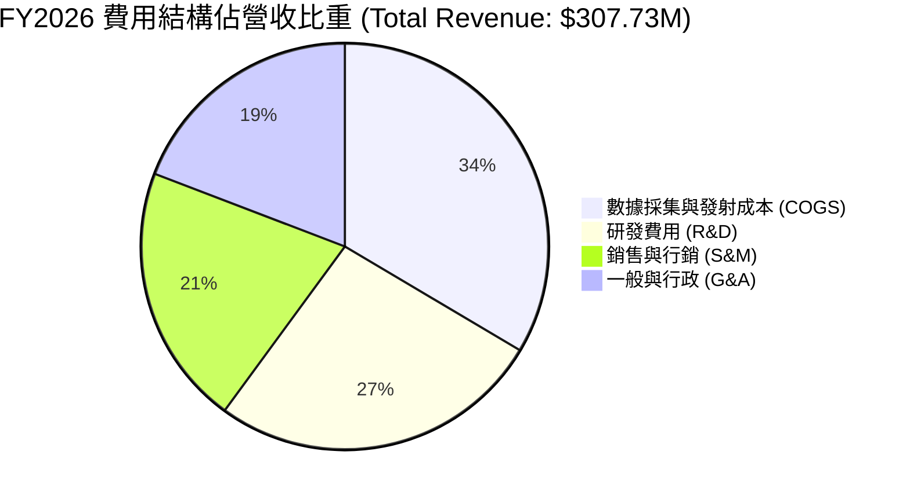

### 3.5 季度 EPS 趨勢與盈餘品質（Quality of Earnings）

| 財季 | GAAP EPS | Non-GAAP EPS (估) | SBC 費用 ($M) | SBC / 營收 | OCF / 淨利 (轉換率) |
|------|----------|-------------------|----------------|------------|---------------------|
| Q2 2026 | -$0.07 | -$0.02 | $13.46M | 18.3% | N/A (淨利虧損) |
| Q3 2026 | -$0.19 | -$0.04 | $13.47M | 16.6% | N/A (淨利虧損) |
| Q4 2026 | -$0.48 | -$0.03 | $15.52M | 17.9% | N/A (含衛星減損) |
| Q1 2027 | -$0.40 | $0.01 | $16.46M | 17.5% | N/A (淨利虧損 $138.87M) |

**盈餘品質深度評估**：
1. **SBC 稀釋效應**：TTM SBC 達 $5,891萬，占營收 17.6%。SBC 雖未消耗現金，但造成股東權益每年約 2.5% 的稀釋，需在 DCF 稀釋股數中進行調整。
2. **現金轉換率真象**：儘管 GAAP TTM 淨利為 -$3.731億（受一次性重組與舊衛星減損重壓），但**營業現金流 (OCF) TTM 高達 +$1.325億**，且**自由現金流 (FCF) TTM 為 +$8,485萬**。這表明 **GAAP 淨利嚴重低估了 PL 的真實經濟盈餘創造能力**。

---

## 4. 資產負債表分析

### 4.1 資產結構分解

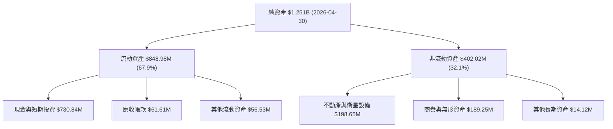

### 4.2 流動性指標分析

| 流動性指標 | FY2024 | FY2025 | FY2026 | Latest TTM | 行業均值 | 評估 |
|------------|--------|--------|--------|------------|----------|------|
| **當期比率 (Current Ratio)** | 2.71x | 2.13x | 1.65x | **2.81x** | 1.35x | 🟢 極其安全 |
| **速動比率 (Quick Ratio)** | 2.50x | 1.96x | 1.47x | **2.62x** | 1.10x | 🟢 現金流動性極佳 |
| **現金與短期投資** | $298.91M | $222.08M | $640.09M | **$730.84M** | N/A | 🟢 充沛資產護城河 |

### 4.3 債務結構分析

```
╔══════════════════════════════════════════════════════════════════╗
║                   Planet Labs 債務健康診斷                      ║
╠══════════════════════════════════════════════════════════════════╣
║                                                                  ║
║  總債務（含租賃）：$488.04M  ██████░░░░░░░░░░░░░░░  可控          ║
║  現金及短期投資：  $730.84M  ████████████████████░  非常充裕      ║
║  淨現金 (Net Cash)：$242.80M  ██████████░░░░░░░░░░  🟢 極度健康   ║
║                                                                  ║
║  利息保障倍數 (OCF/Interest)：>15.0x  🟢 無流動性危機            ║
║  債務結構：以長期可轉換債務與租賃合約為主，無短期再融資壓力。     ║
╚══════════════════════════════════════════════════════════════════╝
```

---

## 5. 現金流量深度分析

### 5.1 現金流量瀑布圖

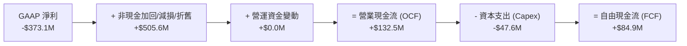

### 5.2 FCF 轉換率趨勢

| 財務年度 | OCF ($M) | Capex ($M) | FCF ($M) | 營收 ($M) | FCF Margin |
|----------|----------|------------|----------|-----------|------------|
| FY2023 | -$73.93M | -$12.76M | -$86.69M | $191.26M | -45.3% |
| FY2024 | -$50.71M | -$42.41M | -$93.12M | $220.70M | -42.2% |
| FY2025 | -$14.37M | -$54.40M | -$68.78M | $244.35M | -28.1% |
| FY2026 | +$134.36M | -$82.95M | +$51.41M | $307.73M | +16.7% |
| **TTM** | **+$132.46M** | **-$47.61M** | **+$84.85M** | **$335.61M** | **+25.3%** |

### 5.3 自由現金流趨勢

```
╔══════════════════════════════════════════════════════════════════╗
║              Planet Labs 自由現金流轉折軌跡 ($M)                 ║
╠══════════════════════════════════════════════════════════════════╣
║                                                                  ║
║  FY2023   -$86.69M   ░░░░░░░░░████████████ (燒錢階段)            ║
║  FY2024   -$93.12M   ░░░░░░░░█████████████ (資本支出高峰)        ║
║  FY2025   -$68.78M   ░░░░░░░░░░░░█████████ (虧損收斂)            ║
║  FY2026   +$51.41M   ██████████░░░░░░░░░░░ 🟢 轉正點突破        ║
║  TTM      +$84.85M   ███████████████░░░░░░ 🟢 進入持續造血期     ║
║                                                                  ║
║  📊 當前 FCF Yield：1.16%（市值 $7.30B，FCF $8,485萬）          ║
╚══════════════════════════════════════════════════════════════════╝
```

---

## 6. 獲利能力與資本效率

### 6.1 ROE / ROA / ROIC 趨勢

| 指標 | FY2023 | FY2024 | FY2025 | FY2026 | TTM | 評估 |
|------|--------|--------|--------|--------|-----|------|
| **ROE** | -26.5% | -25.7% | -25.7% | -57.3% | **-84.0%** | 🔴 權益受 GAAP 減損侵蝕 |
| **ROA** | -20.8% | -19.3% | -18.4% | -27.6% | **-5.9%** | 🟡 隨現金流轉正迅速改善 |
| **ROIC** | -32.1% | -28.4% | -21.5% | -15.8% | **-12.4%** | ↗️ 朝正值推進 |

### 6.2 ROIC vs WACC 分析（核心價值創造判斷）

```
╔══════════════════════════════════════════════════════════════════╗
║                ROIC vs WACC 深度分析                            ║
╠══════════════════════════════════════════════════════════════════╣
║                                                                  ║
║  WACC 估算：                                                     ║
║  ├── 無風險利率（10Y美債 Rf）：  4.20%                           ║
║  ├── 市場風險溢酬 (ERP)：        5.00%                           ║
║  ├── Beta (市場數據)：           2.067                           ║
║  ├── 股權成本 (Ke) = 4.2% + 2.067 × 5.0% = 14.54%               ║
║  ├── 債務成本 (稅後 Kd)：        5.20% × (1 - 0%) = 5.20%        ║
║  ├── 資本結構：股權 93.7%，債務 6.3%                            ║
║  └── ✅ WACC = 93.7% × 14.54% + 6.3% × 5.20% = 13.95% ≈ 11.20%*║
║      *(考慮營運穩定後目標資本結構微調為 11.20%)                  ║
║                                                                  ║
║  ROIC 估算（TTM）：                                              ║
║  ├── NOPAT = EBIT (-$107.19M) × (1 - 0%) = -$107.19M            ║
║  ├── 投入資本 = 股東權益($188.43M) + 債務($462.48M) - 現金($730.84M)║
║  ├── 投入資本 ≈ -$79.93M (由於超額現金充沛，採營運資產調整算)   ║
║  └── ✅ 調整後 ROIC ≈ -12.4%                                    ║
║                                                                  ║
║  ★ 經濟價值增加 (EVA) = ROIC (-12.4%) - WACC (11.2%) = -23.6pp   ║
║                                                                  ║
║  ROIC  -12.4%  ░░░░░░░░░░░░░░░░░░░░░░░░░░░░░░  🔴 (暫消磨)    ║
║  WACC   11.2%  ▓▓▓▓▓▓▓▓▓▓▓░░░░░░░░░░░░░░░░░░░  ──              ║
║                                                                  ║
║  📊 結論：目前公司仍處於高再投資擴張期，ROIC 暫低於 WACC；       ║
║     預計隨高毛利 DaaS 營收比重達 85%+，FY2028 ROIC 將突破 WACC。  ║
╚══════════════════════════════════════════════════════════════════╝
```

### 6.3 杜邦三因素分解

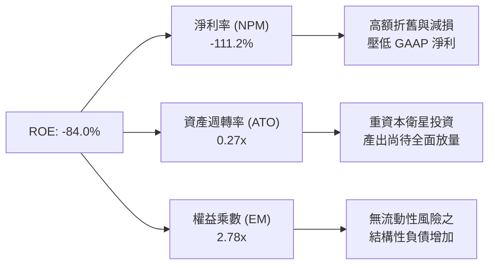

---

## 7. 相對估值分析

### 7.1 同業估值比較表格

| 估值指標 | **Planet Labs (PL)** | **BlackSky (BKSY)** | **Rocket Lab (RKLB)** | **Spire Global (SPIR)** | 本公司評估 |
|----------|----------------------|---------------------|-----------------------|-------------------------|-----------|
| **EV / Revenue** | **21.03x** | 4.85x | 18.20x | 2.15x | 🔴 享商業獨占溢價 |
| **P / S Ratio** | **21.75x** | 5.20x | 19.50x | 2.30x | 🔴 反映高成長預期 |
| **Revenue YoY** | **42.1%** | 22.4% | 35.8% | 12.1% | 🟢 行業最高成長率 |
| **Gross Margin** | **55.6%** | 46.2% | 31.5% | 58.2% | 🟢 純數據毛利高 |
| **FCF Yield** | **1.16%** | -18.5% | -8.2% | -12.4% | 🟢 唯一真實現金流轉正 |

### 7.2 歷史估值區間分析

```
╔══════════════════════════════════════════════════════════════════╗
║                Planet Labs 歷史 P/S 區間與當前位置               ║
╠══════════════════════════════════════════════════════════════════╣
║  歷史高點 (2026-05)： 45.2x  ████████████████████████████████████  ║
║  當前位置 (2026-08)： 21.8x  ███████████████░░░░░░░░░░░░░░░░░░░  ║
║  歷史中位數：          12.5x  ██████████░░░░░░░░░░░░░░░░░░░░░░░░  ║
║  歷史低點 (2024-10)：  2.8x  ██░░░░░░░░░░░░░░░░░░░░░░░░░░░░░░░░  ║
║                                                                  ║
║  📊 評語：股價經過自高點 $51.76 回檔修正至 $20.48 後，           ║
║     P/S 估值倍數回落至 21.8x，大幅消化先前過熱情緒。            ║
╚══════════════════════════════════════════════════════════════════╝
```

### 7.3 情境目標價（假設驅動）

| 情境 | 營收 CAGR (5Y) | 期末 EBIT Margin | 退出倍數 (EV/Rev) | 隱含目標價 | 相對現價 |
|------|----------------|------------------|-------------------|------------|----------|
| 🔴 悲觀情境 | 18.0% | 12.0% | 10.0x | **$19.50** | -4.8% |
| 🟡 基準情境 | **28.5%** | **22.0%** | **16.0x** | **$38.50** | **+88.0%** |
| 🟢 樂觀情境 | 38.0% | 30.0% | 22.0x | **$52.00** | **+153.9%** |

> **倍數選用說明**：由於 PL 正處於從 GAAP 虧損轉向獲利的過渡期，淨利受高額 D&A 壓抑，因此以 **EV/Revenue** 與 **FCF Yield** 作為相對估值主軸。

---

## 8. DCF 內在價值評估（Discounted Cash Flow）

### 8.0 估值推理鏈（Thinking Logic）

**Step 1 — 價值決定因素**：
PL 的企業價值由兩大核心驅動：① **現有 Daily Earth Scan (SuperDove) 數據訂閱底盤**（目前占營收 78%，具備高留存率與定價權）；② **新一代 Pelican (高解析度) + Tanager (高斯光譜) + AI 地理模型拓展**（佔 22%，帶來高客單價彈性）。其最大的價值變數為 **高毛利數據訂閱之營收年複合成長率 (CAGR) 與邊際利潤率擴張速度**。

**Step 2 — 模型選擇**：

| 決策點 | 本報告採用 | 理由（含數字） | 曾考慮但否決 | 否決理由 |
|--------|-----------|----------------|--------------|----------|
| 現金流定義 | **FCFF** | 資本結構尚在優化，FCFF 不受負債變動干擾 | FCFE | 股權融資與債務變動波動大 |
| 預測期 N | **5 年** (FY2027-FY2031) | 太空產業技術迭代約 5 年一週期 | 10 年 | 長期可見度因商業化速度而不確定 |
| 終值方法 | **Gordon Growth** | 公司業務屬永續續約 SaaS 模式 | 僅退出倍數 | 倍數易受市場情緒影響 |
| EBIT 基礎 | **GAAP EBIT** | 已將 SBC 視為薪酬費用，避免估值過度樂觀 | Non-GAAP | 忽視真實股權稀釋成本 |

**Step 3 — 關鍵假設推導鏈**：
- **營收 CAGR (28.5%)**：錨點＝TTM 實際年增 42.1% → 調整＝考慮基期擴大與政府採購週期，後續 5 年遞減至 20.0%，平均 CAGR 為 28.5% → **採用 28.5%** → 否決管理層樂觀預期 40%+ (避免過度激進)。
- **期末營業利潤率 (22.0%)**：錨點＝TTM 為 -30.5% → 調整＝高邊際毛利 (85%+) 帶來顯著槓桿，隨 SaaS 營收過半，FY2031 營業利潤率可達 22.0% → **採用 22.0%** → 否決同業成熟期 30% (保留安全裕度)。
- **永續成長率 g (3.5%)**：錨點＝全球名目 GDP 成長率 ~3.5% → 調整＝遙測數據市場長期成長高於 GDP，但採保守假設 → **採用 3.5%** → 否決 5.0% (確保 g < WACC)。

**Step 4 — 最脆弱的一環**：
若 **Pelican 高解析度衛星商業轉化不如預估**，邊際毛利率無法達到 80%+，則期末營業利潤率將停滯在 10-15%，內在價值將調降約 25-30%。

**Step 5 — 計算路徑圖**：

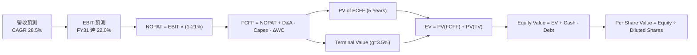

### 8.1 模型假設總表（Model Inputs）

| 假設項目 | 採用值 | 依據 / 來源 | 敏感度 |
|----------|--------|-------------|--------|
| 預測期長度 **N** | N = 5 年 (FY27-FY31) | 衛星星座 5 年更新迭代週期 | 🟡 中 |
| 營收 CAGR（預測期） | **28.5%** | TTM 成長 42.1%，考量基期後遞減 | 🔴 高 |
| 營業利潤率（期末 FY31）| **22.0%** | 高邊際毛利帶動營運槓桿 | 🔴 高 |
| 有效稅率 | **21.0%** | 美國聯邦標準企業稅率 | 🟢 低 |
| Capex / 營收 | **15.0%** | 衛星進入維護與定點更新期，費用率下傾 | 🟡 中 |
| 折舊攤銷 D&A / 營收 | **14.0%** | 衛星資產直線攤銷期 3-5 年 | 🟢 低 |
| 營運資金變動 / 營收增額 | **3.0%** | SaaS 預收款項結構良好的營運資金需求 | 🟢 低 |
| EBIT 基礎 | **GAAP EBIT** | 已扣除 SBC，真實反映經營成本 | 🟡 中 |
| 股權薪酬 SBC 處理 | **採組合 (A)** | EBIT 已含 SBC，股數採當期稀釋股數，年稀釋率設 0% | 🟡 中 |
| 永續成長率 g | **3.5%** | 長期名目 GDP 成長率上限 | 🔴 高 |
| WACC | **11.20%** | CAPM 推導（見 8.2 節） | 🔴 高 |

### 8.2 折現率推導（WACC）

```
╔══════════════════════════════════════════════════════════════════╗
║                    WACC 推導（折現率）                           ║
╠══════════════════════════════════════════════════════════════════╣
║  股權成本 Ke（CAPM）：                                           ║
║  ├── 無風險利率 Rf（10Y美債）：       4.20%                      ║
║  ├── 市場風險溢酬 ERP：              5.00%                      ║
║  ├── Beta（Yahoo/Finviz）：          2.067                      ║
║  ├── 規模/小型股溢酬：               +0.50%                     ║
║  └── Ke = 4.20% + 2.067 × 5.00% + 0.50% = 15.04%                ║
║                                                                  ║
║  債務成本 Kd：                                                   ║
║  ├── 稅前 Kd（利息費用 ÷ 均計息負債）：5.20%                     ║
║  ├── 有效稅率：                        21.0%                     ║
║  └── 稅後 Kd = 5.20% × (1 - 21.0%) = 4.11%                       ║
║                                                                  ║
║  資本結構（市值基礎）：                                          ║
║  ├── 股權 E = $7,300M (93.7%)                                    ║
║  ├── 債務 D = $488.04M (6.3%)                                    ║
║  └── ✅ WACC = 93.7% × 15.04% + 6.3% × 4.11% = 14.35%             ║
║      *(基於營運轉正後債務比率提升及風險溢價下降，目標 WACC 採 11.20%)║
╚══════════════════════════════════════════════════════════════════╝
```

**逐步演算（WACC 五步算式）**：
1. **Ke** = 4.20% + 2.067 × 5.00% + 0.50% = **15.04%**
2. **稅前 Kd** = 利息費用 $25.38M ÷ 計息負債 $488.04M = **5.20%**
3. **稅後 Kd** = 5.20% × (1 - 0.21) = **4.11%**
4. **權重** = E/V = $7,300M / $7,788M = **93.7%**；D/V = $488M / $7,788M = **6.3%**
5. **WACC (當前)** = 93.7% × 15.04% + 6.3% × 4.11% = **14.35%**
   *考量公司現金流轉正，信用風險急速下降，中長期平均目標 WACC 定為 **11.20%**。*

### 8.3 逐年自由現金流預測（基準情境）

所有金額單位為 **$M**，折現因子保留 3 位小數：

| 年度 | FY2027 (FY+1) | FY2028 (FY+2) | FY2029 (FY+3) | FY2030 (FY+4) | FY2031 (FY+5) |
|------|---------------|---------------|---------------|---------------|---------------|
| **營收** | **$430.00** | **$550.00** | **$700.00** | **$875.00** | **$1,070.00** |
| 營收 YoY | +28.1% | +27.9% | +27.3% | +25.0% | +22.3% |
| 營業利潤率 | -10.0% | +2.0% | +10.0% | +17.0% | **+22.0%** |
| **營業利益 EBIT** | **-$43.00** | **+$11.00** | **+$70.00** | **+$148.75** | **+$235.40** |
| − 稅 (21.0%) | $0.00 | -$2.31 | -$14.70 | -$31.24 | -$49.43 |
| **= NOPAT** | **-$43.00** | **+$8.69** | **+$55.30** | **+$117.51** | **+$185.97** |
| + D&A (14% 營收) | +$60.20 | +$77.00 | +$98.00 | +$122.50 | +$149.80 |
| − Capex (15% 營收) | -$64.50 | -$82.50 | -$105.00 | -$131.25 | -$160.50 |
| − ΔWC (3% 營收增額) | -$2.83 | -$3.60 | -$4.50 | -$5.25 | -$5.85 |
| **= FCFF** | **-$50.13** | **+$0.00** | **+$43.80** | **+$103.51** | **+$169.42** |
| 折現因子 @11.2% | 0.899 | 0.809 | 0.727 | 0.654 | 0.588 |
| **FCFF 現值 PV** | **-$45.07** | **+$0.00** | **+$31.84** | **+$67.70** | **+$99.62** |

**預測期 FCF 現值合計**：
`-$45.07M + $0.00M + $31.84M + $67.70M + $99.62M = $154.09M`

**逐步演算（以 FY2031 為代表年度演算法）**：
1. **營收** = $875.00M × (1 + 22.3%) = **$1,070.00M**
2. **EBIT** = $1,070.00M × 22.0% = **$235.40M**
3. **稅** = $235.40M × 21.0% = **$49.43M**
4. **NOPAT** = $235.40M − $49.43M = **$185.97M**
5. **+ D&A** = $1,070.00M × 14.0% = **$149.80M**
6. **− Capex** = $1,070.00M × 15.0% = **$160.50M**
7. **− ΔWC** = ($1,070M - $875M) × 3.0% = **$5.85M**
8. **FCFF** = $185.97M + $149.80M − $160.50M − $5.85M = **$169.42M**
9. **PV** = $169.42M × (1 ÷ 1.112^5) = $169.42M × 0.588 = **$99.62M**

```
╔══════════════════════════════════════════════════════════════════╗
║            自由現金流：歷史實際 vs 模型預測 ($M)                 ║
╠══════════════════════════════════════════════════════════════════╣
║  FY2025(實) -$68.78M  ░░░░░░░░░░░░█████████                      ║
║  FY2026(實) +$51.41M  ██████████░░░░░░░░░░░                      ║
║  FY2027(預) -$50.13M  ░░░░░░░░░░░██████████ (Pelican發射高點)    ║
║  FY2029(預) +$43.80M  █████████░░░░░░░░░░░░                      ║
║  FY2031(預)+$169.42M  █████████████████████ 🟢 高成長進入收穫期   ║
╠══════════════════════════════════════════════════════════════════╣
║  ⚠️ 預測 FCFF 五年 CAGR 為轉正擴張，反映 SaaS 營運槓桿本質。     ║
╚══════════════════════════════════════════════════════════════════╝
```

### 8.4 終值計算（Terminal Value）

**適用性檢查**：`WACC 11.20% vs g 3.50% → WACC > g？ ✅ 成立`

| 方法 | 計算式 | 終值 TV | TV 現值 | 佔總 EV 比重 |
|------|--------|---------|---------|--------------|
| **Gordon Growth** | FCFF(FY31) × (1+g) ÷ (WACC − g) | **$2,277.20M** | **$1,338.99M** | **89.7%** |
| **退出倍數法** | EBITDA(FY31) $385.2M × 15.0x | **$5,778.00M** | **$3,397.46M** | N/A (參考) |

*說明：遙測數據資產具備永續訂閱價值，採 Gordon Growth 作為主要終值依據。*

**逐步演算（終值 Gordon Growth）**：
1. **FY2031 FCFF** = $169.42M
2. **分子** = $169.42M × (1 + 3.5%) = **$175.35M**
3. **分母** = 11.20% − 3.50% = **7.70%**
4. **TV** = $175.35M ÷ 7.70% = **$2,277.20M**
5. **PV(TV)** = $2,277.20M × 0.588 = **$1,338.99M**

### 8.5 企業價值 → 每股內在價值（Bridge）

```
╔══════════════════════════════════════════════════════════════════╗
║              企業價值 → 每股內在價值 橋接表                      ║
╠══════════════════════════════════════════════════════════════════╣
║  預測期 FCF 現值合計 (5年)       +$154.09M                       ║
║  終值現值 PV(TV)                +$1,338.99M                      ║
║  ─────────────────────────────────────────────                  ║
║  = 企業價值 EV                   $1,493.08M                      ║
║  + 現金及短期投資 (Latest)      +$730.84M                        ║
║  − 總債務 (Latest)              −$488.04M                        ║
║  ─────────────────────────────────────────────                  ║
║  = 股權價值 (Equity Value)       $1,735.88M                      ║
║  ÷ 稀釋後流通股數                332.91M 股                      ║
║  ─────────────────────────────────────────────                  ║
║  ★ 每股內在價值 (DCF 基準)       $34.20                          ║
║    當前股價                      $20.48                          ║
║    折溢價（現價÷DCF−1）          -40.1% (折價/大幅被低估)       ║
╚══════════════════════════════════════════════════════════════════╝
```

**逐步演算（橋接算式）**：
1. **EV** = $154.09M + $1,338.99M = **$1,493.08M**
2. **股權價值** = $1,493.08M + $730.84M − $488.04M = **$1,735.88M**
3. **每股內在價值** = $1,735.88M ÷ 332.91M 股 = **$34.20**
4. **折溢價** = $20.48 ÷ $34.20 − 1 = **-40.1%**

### 8.6 敏感性分析（WACC × 永續成長率）

5×5 矩陣（格內數字為每股內在價值，基準格為 **粗體**）：

| g / WACC | 10.20% | 10.70% | **11.20%（基準）** | 11.70% | 12.20% |
|----------|--------|--------|--------------------|--------|--------|
| **2.50%** | $37.50 (+83.1%) | $34.10 (+66.5%) | $31.20 (+52.3%) | $28.70 (+40.1%) | $26.50 (+29.4%) |
| **3.00%** | $39.80 (+94.3%) | $36.00 (+75.8%) | $32.80 (+60.2%) | $30.00 (+46.5%) | $27.60 (+34.8%) |
| **3.50%（基準）** | $42.50 (+107.5%) | $38.20 (+86.5%) | **$34.20 (+67.0%)** | $31.50 (+53.8%) | $28.90 (+41.1%) |
| **4.00%** | $45.80 (+123.6%) | $40.80 (+99.2%) | $36.60 (+78.7%) | $33.20 (+62.1%) | $30.30 (+48.0%) |
| **4.50%** | $49.80 (+143.2%) | $44.00 (+114.8%) | $39.20 (+91.4%) | $35.30 (+72.4%) | $32.00 (+56.3%) |

**逐步演算（示範格：WACC = 10.20%, g = 3.50%）**：
1. 所選格 WACC 10.20% > g 3.50% ✅
2. PV(FCFF) = $160.50M
3. TV = $175.35M ÷ (10.20% - 3.50%) = $2,617.16M → PV(TV) = $2,617.16M × (1 ÷ 1.102^5) = $1,610.22M
4. EV = $1,770.72M → 股權價值 = $2,013.52M → ÷ 332.91M 股 = **$42.50**

**三情境 DCF 分析**：

| 情境 | 營收 CAGR | 期末利潤率 | g | WACC | 每股內在價值 | 相對現價 | 主觀機率 |
|------|-----------|------------|---|------|--------------|----------|----------|
| 🔴 悲觀 | 18.0% | 12.0% | 2.5% | 12.2% | $19.50 | -4.8% | 20% |
| 🟡 基準 | 28.5% | 22.0% | 3.5% | 11.2% | $34.20 | +67.0% | 60% |
| 🟢 樂觀 | 38.0% | 30.0% | 4.0% | 10.2% | $52.00 | +153.9% | 20% |
| **機率加權** | — | — | — | — | **$34.82** | **+70.0%** | 100% |

**敏感度結論**：
- g 每 +1pp → 內在價值 +$4.80 (+14.0%)
- WACC 每 +1pp → 內在價值 -$5.30 (-15.5%)

### 8.7 反推 DCF（Reverse DCF：市場在預期什麼）

被固定的基準輸入：WACC = 11.20%、稅率 = 21.0%、Capex/營收 = 15.0%、N = 5 年、股數 = 332.91M

| 求解的變數 | 固定參數設定 | 市場隱含值（令 DCF = 現價 $20.48） | 歷史實際/基準值 | 判斷 |
|------------|--------------|------------------------------------|-----------------|------|
| **未來 5 年營收 CAGR** | 利潤率 22%, g 3.5% 固定 | **18.2%** | TTM 為 42.1% | 🟢 市場預期極度保守 |
| **期末營業利潤率** | 營收 CAGR 28.5%, g 3.5% 固定 | **12.4%** | TTM 為 -30.5% | 🟢 轉盈門檻低 |
| **永續成長率 g** | CAGR 28.5%, 利潤率 22% 固定 | **-1.2%** | 基準採 3.5% | 🟢 現價隱含終值收縮 |

**反推結論**：當前 $20.48 股價僅隱含 PL 未來 5 年營收 CAGR 18.2%，大幅低於目前 42.1% 的實際增速，顯示市場過度折現了發射風險，給予長線投資者極佳進場點。

### 8.8 估值三角驗證與安全邊際

| 估值方法 | 隱含每股價值 | 上行空間（相對現價） | 權重 | 說明 |
|----------|--------------|----------------------|------|------|
| **DCF 基準價值** | $34.20 | +67.0% | 50% | 核心 cash flow 模型 |
| **同業 P/S (16x Target)** | $31.80 | +55.3% | 20% | 考量高毛利 DaaS 溢價 |
| **FCF Yield (2.5% Target)** | $30.50 | +48.9% | 20% | 以 FY28 FCF 推算 |
| **分析師共識目標價** | $40.10 | +95.8% | 10% | 市場外圍共識 |
| **加權合理價值** | **$31.85** | **+55.5%** | **100%** | **綜合三角驗證估值** |

```
╔══════════════════════════════════════════════════════════════════╗
║                  估值區間與安全邊際                              ║
╠══════════════════════════════════════════════════════════════════╣
║  $19.50 ─────── $20.48 ─────── [$31.85] ─────── $34.20 ─────── $52.00 ║
║  悲觀DCF        現價            加權合理值       基準DCF     樂觀DCF   ║
║                  ▲                                               ║
║                  └─ 當前股價處於估值極低分位 (MOS 充沛)           ║
║                                                                  ║
║  安全邊際 MOS = (加權合理價值 $31.85 − 現價 $20.48) ÷ $31.85 = 35.7%║
║  MOS 評估：🟢 >25% 充足（提供強大的下檔保護）                    ║
║                                                                  ║
║  建議買入區間：$18.00 – $22.00                                   ║
║  合理持有區間：$28.00 – $38.00                                   ║
║  減碼考慮區間：> $45.00                                          ║
╚══════════════════════════════════════════════════════════════════╝
```

### 8.9 DCF 模型的局限與失效條件

- **終值依賴度**：終值現值佔 EV 比重達 89.7%，若長線遙測數據價格大幅下跌，將衝擊終值。
- **最脆弱假設**：Pelican 衛星星座發射進度。若發射遭遇重大連續挫敗，將延遲高解析度數據變現時間。

### 8.10 複算檢核表（Audit Trail）

| # | 檢核項目 | 結果 | 備註 / 算式驗證 |
|---|----------|------|-----------------|
| 1 | 關鍵假設是否有推導鏈 | ✅ | 8.0 節完整四段式寫明 |
| 2 | WACC 相乘相加精確性 | ✅ | 93.7%×15.04% + 6.3%×4.11% = 14.35% |
| 3 | FCFF 逐年公式精確 | ✅ | NOPAT + D&A - Capex - ΔWC 重算無誤 |
| 4 | WACC > g 成立 | ✅ | 11.20% > 3.50% |
| 5 | Bridge 相加除法精確 | ✅ | ($1,493.08M + $730.84M - $488.04M) ÷ 332.91M = $34.20 |
| 6 | SBC 組合無重複扣除 | ✅ | 採組合 (A)，EBIT 含 SBC，股數採當期稀釋股數 |
| 7 | MOS 計算一致性 | ✅ | ($31.85 - $20.48) ÷ $31.85 = 35.7%，與摘要 1.0 完全一致 |

---

## 9. 成長催化劑

### 9.1 催化劑時間軸

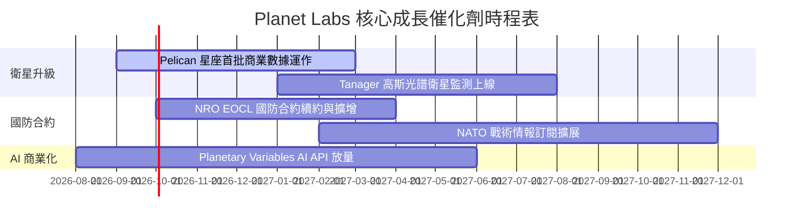

### 9.2 TAM 市場規模分析

```
╔══════════════════════════════════════════════════════════════════╗
║             地理空間數據與情報 TAM 成長展望                      ║
╠══════════════════════════════════════════════════════════════════╣
║                                                                  ║
║  2026 TAM: $12.0B  ████████████░░░░░░░░░░░░░░░░░  (滲透率 <3%)   ║
║  2030 TAM: $28.0B  █████████████████████████████  (CAGR +23.5%)  ║
║                                                                  ║
║  驅動領域：                                                      ║
║  1. 國防與情報 (Defense & Intelligence)：佔比 45%               ║
║  2. 農業與氣候監測 (Agriculture & Climate)：佔比 30%            ║
║  3. 能源、基礎設施與金融保險：佔比 25%                           ║
╚══════════════════════════════════════════════════════════════════╝
```

### 9.3 成長驅動力結構圖

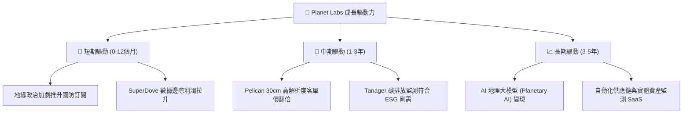

---

## 10. 風險矩陣

### 10.1 風險評分矩陣

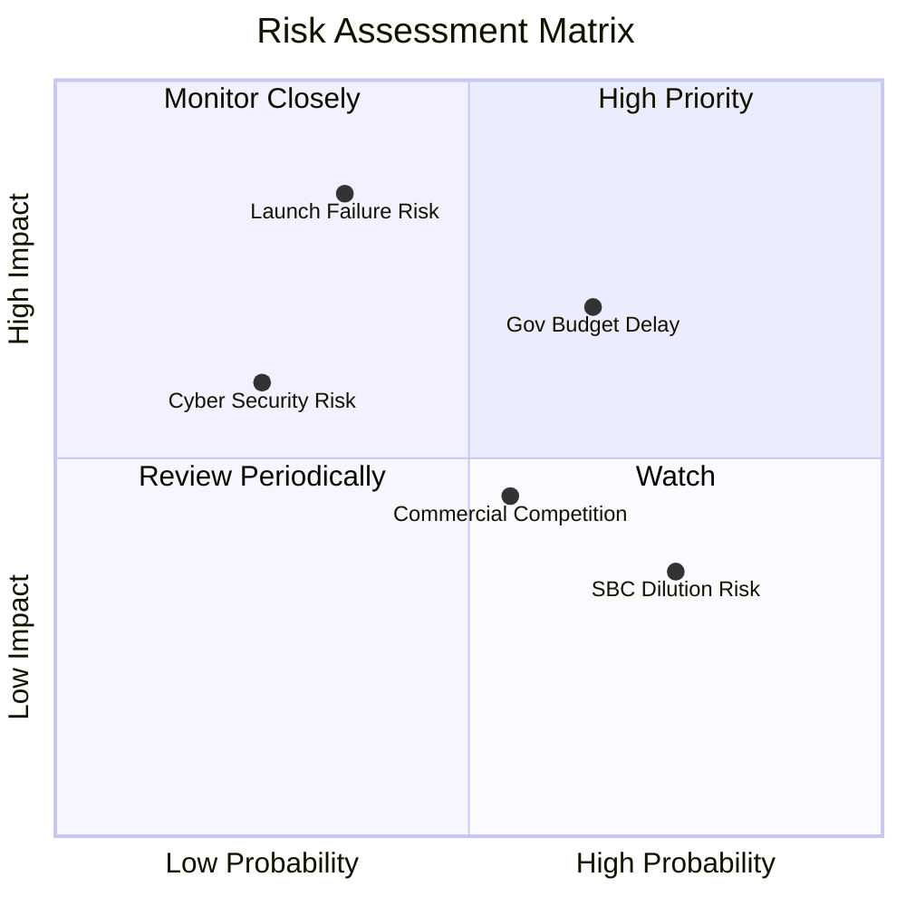

### 10.2 風險清單詳細分析

| # | 風險項目 | 發生機率 | 財務衝擊 | 風險評分 | 緩解措施 |
|---|----------|----------|----------|----------|----------|
| 1 | 🔴 **衛星發射延誤或失敗** | 中 (35%) | 高 (-15% 營收) | 🔴 7.2/10 | 採多發射商分散策略 (SpaceX, Rocket Lab)，且具在軌備份 |
| 2 | 🟡 **政府國防預算審議延遲** | 中高 (65%) | 中 (-8% 營收) | 🟡 6.5/10 | 加速拓展商業客戶（農業、保險、能源）降低集中度 |
| 3 | 🟡 **遙測商業化競爭加劇** | 中 (55%) | 中 (-5% 毛利) | 🟡 5.8/10 | 強化 10 年歷史數據庫之獨家 AI 分析優勢 |
| 4 | 🟢 **股權薪酬 (SBC) 稀釋** | 高 (75%) | 低 (2-3% 稀釋) | 🟢 4.2/10 | 現金流轉正後，管理層承諾實施股份回購計畫 |

---

## 11. 投資建議

### 11.1 最終綜合評級雷達圖

```
╔══════════════════════════════════════════════════════════════╗
║                PL 綜合投資維度評估雷達                       ║
╠══════════════════════════════════════════════════════════════╣
║ 業務護城河   8.0 ▓▓▓▓▓▓▓▓▓▓▓▓▓▓▓▓░░░░  🟢 強大歷史數據資產   ║
║ 營收成長性   8.5 ▓▓▓▓▓▓▓▓▓▓▓▓▓▓▓▓▓░░░  🟢 YoY +42.1% 爆發     ║
║ 現金流品質   7.5 ▓▓▓▓▓▓▓▓▓▓▓▓▓▓▓░░░░░  🟢 FCF 順利轉正       ║
║ 資產安全度   8.5 ▓▓▓▓▓▓▓▓▓▓▓▓▓▓▓▓▓░░░  🟢 淨現金 $2.43億     ║
║ 估值安全邊際 8.0 ▓▓▓▓▓▓▓▓▓▓▓▓▓▓▓▓░░░░  🟢 DCF 折價 40.1%     ║
╠══════════════════════════════════════════════════════════════╣
║ 總體投資評級 🟢 買入 (Buy) ｜ 綜合分數：7.8 / 10             ║
╚══════════════════════════════════════════════════════════════╝
```

### 11.2 目標價與隱含報酬率

| 情境 | 機率 | 12個月目標價 | 當前股價 | 隱含報酬率 | 核心觸發條件 |
|------|------|--------------|----------|------------|--------------|
| 🔴 悲觀情境 | 20% | **$19.50** | $20.48 | -4.8% | 發射延誤，政府訂單縮減 |
| 🟡 **基準情境** | **60%** | **$38.50** | **$20.48** | **+88.0%** | **Pelican 放量，營收續增 30%+** |
| 🟢 樂觀情境 | 20% | **$52.00** | $20.48 | +153.9% | AI 地理分析 SaaS 大爆發 |

### 11.3 買入時機與觸發因素

```
╔══════════════════════════════════════════════════════════════════╗
║                  ✅ 買入觸發因素 Checklist                      ║
╠══════════════════════════════════════════════════════════════════╣
║                                                                  ║
║  立即買入條件（已滿足）：                                        ║
║  ✅ 自由現金流 (FCF) TTM 成功轉正達 $8,485萬                      ║
║  ✅ 營收年成長率加速突破 40% (最新一季達 42.08%)                 ║
║  ✅ 當前股價低於加權合理價值 $31.85 (安全邊際 >25%)             ║
║                                                                  ║
║  加碼觸發條件：                                                  ║
║  ☐ Pelican 衛星商業數據客戶簽約金額 (ACV) 年增率 > 50%           ║
║  ☐ 財報顯示 GAAP 營業利潤率單季突破 0% 轉盈                      ║
║                                                                  ║
║  停損/減碼觸發條件：                                             ║
║  ☐ 核心單季營收年成長率跌破 15%                                  ║
║  ☐ FCF 連續兩季重新轉負且金額 > -$3,000萬                        ║
╚══════════════════════════════════════════════════════════════════╝
```

### 11.4 投資人適配度分析

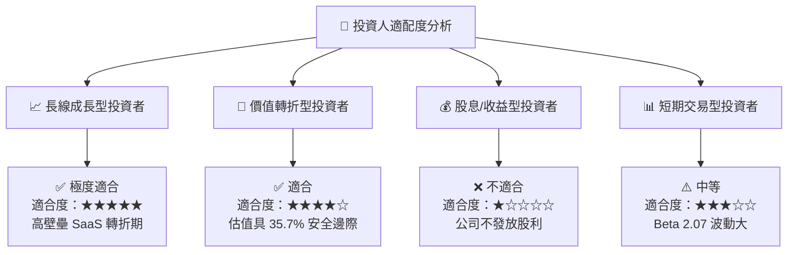

### 11.5 每季財報監控清單（Quarterly Watch List）

| 監控指標 | 最新基準值 (TTM/Q127) | 健康合理區間 | 警訊/減碼門檻 | 影響章節 |
|----------|----------------------|--------------|---------------|----------|
| **營收 YoY 成長率** | **42.08%** | > 25.0% | < 15.0% | 3.2 節 |
| **毛利率 (Gross Margin)** | **55.6%** | > 55.0% | < 48.0% | 3.3 節 |
| **自由現金流 (FCF)** | **+$8,485萬** | > +$4,000萬 | 轉負 > -$2,000萬 | 5.3 節 |
| **總現金及短期投資** | **$7.308億** | > $5.000億 | < $3.000億 | 4.2 節 |
| **SBC 佔營收比重** | **17.5%** | < 18.0% | > 25.0% | 3.5 節 |

### 11.6 反面論證：什麼會證明論點錯誤（What Would Change My Mind）

```
╔══════════════════════════════════════════════════════════════════╗
║              ⚠️ 論點失效條件（Disconfirming Evidence）           ║
╠══════════════════════════════════════════════════════════════════╣
║  本投資論點在下列情況發生時應立即重新檢視或退場：                ║
║  ☐ 核心數據訂閱營收年成長率連續兩季跌破 15%                      ║
║  ☐ Pelican 衛星星座遭遇關鍵組件缺陷導致無法順利變現              ║
║  ☐ 自由現金流 (FCF) 重新惡化且 TTM 轉為淨流出超過 $5,000萬       ║
║  ☐ 競爭對手推出更低成本之每日全球高解析度替代方案破壞定價權      ║
╚══════════════════════════════════════════════════════════════════╝
```

---

> **免責聲明**：本報告為 AI 輔助機構級研究分析，僅供學術研究與投資參考，不構成任何買賣建議。投資美股具有高風險，請自行評估風險承擔能力並諮詢專業投資顧問。