# PL 基本面深度分析報告
> **報告日期**：2026-08-02 ｜ **語言**：繁體中文 ｜ **數據來源**：Yahoo Finance, Finviz, StockAnalysis, Roic.ai ｜ **分析師**：CFA 級機構研究

---

## 目錄

| # | 章節 | 核心結論 |
|---|------|----------|
| 1 | 執行摘要 | 評級 🟢 買入 ｜ 加權合理價值 $27.50 ｜ MOS +25.53% |
| 2 | 公司概覽與商業模式 | 日更級全球衛星數據獨佔，護城河評分 8.5/10 |
| 3 | 損益表深度分析 | 營收加速至 YoY +42.1%，毛利率推升至 55.6%，SBC 佔比控制改善 |
| 4 | 資產負債表分析 | 淨現金 $2.43B，流動比率 2.81，槓桿無虞 |
| 5 | 現金流量深度分析 | 轉虧為盈關鍵轉折：TTM OCF $132.5M，FCF 達 $84.85M (Yield 1.16%) |
| 6 | 獲利能力與資本效率 | 營運槓桿浮現，ROIC（-8.5%）正在邁向突破 WACC（10.5%）的轉折點 |
| 7 | 相對估值分析 | P/S 21.75x 處於高成長太空科技合理區間，比對同業具軟體平台溢價 |
| 8 | DCF 內在價值評估 | 基準每股價值 $22.50（折價 -8.98%），加權合理價值 $27.50 |
| 9 | 成長催化劑 | 國防情報合約擴大 + AI 衛星圖像解讀平台（Pelican & Tanager 星群放量） |
| 10 | 風險矩陣 | 衛星發射延換風險、政府預算預算審查、SBC 股本稀釋 |
| 11 | 投資建議 | 分批建倉區間 $18.50–$20.50，目標價 $27.50（+34.28% 隱含上行） |

---

## 1. 執行摘要

Planet Labs PBC（NYSE: PL）正處於由「純衛星硬體建設」跨越至「高毛利 Geospatial-Data-as-a-Service（高頻遙測數據即服務）」的重大基本面轉折點。公司 TTM 營收達 $3.3561 億美元（YoY +42.1%），近兩季營收成長率連續衝破 40%（Q4 FY26 +41.05%、Q1 FY27 +42.08%），顯現國防與政府客戶對實時地球觀測數據的爆發性需求。更關鍵的是，營運現金流（TTM OCF $1.3246 億美元）與自由現金流（TTM FCF $8,485 萬美元，Yield 1.16%）已正式轉正，擺脫傳統航太企業「持續燒錢」的沉痾。考量其高達 82.1% 的機構持股比例與高達 $7.3084 億美元的充足現金儲備，給予 🟢 **買入** 評級，基準 DCF 內在價值估為 **$22.50**，考量同業倍數與分析師目標價後的加權合理價值為 **$27.50**，安全邊際（MOS）為 **+25.53%**，隱含上行空間為 **+34.28%**。

### 1.0 一頁式投資儀表板

| 項目 | 內容 |
|------|------|
| **投資論點（3 句）** | ① 地球表面每日 3.5m 解析度全景掃描獨佔，TTM 營收強勁成長 42.1% 至 $3.3561 億美元。<br/>② 商業模式向高毛利（55.6%）訂閱制數據與 AI 分析轉型，驅動 TTM FCF 達到 $8,485 萬美元。<br/>③ 資產負債表具備 $2.4280 億美元淨現金與 $7.3084 億美元總現金，充足資金支持次世代 Pelican 與 Tanager 星群部署。 |
| **護城河評分** | 8.5 / 10（數據壟斷性與星群規模壁壘） |
| **管理層/資本配置評分** | 8.0 / 10（成功實現 FCF 轉正與嚴格 Capex 控制） |
| **財務健康** | 🟢 強勁（無短期流動性壓力，流動比率 2.81，淨現金充沛） |
| **ROIC vs WACC** | -8.5% vs 10.5%（資本效率改善中，預計 FY28 突破 WACC 轉為創造價值） |
| **FCF 趨勢** | 由負轉正 ｜ TTM FCF $84.85M ｜ FCF Yield 1.16% |
| **估值** | Forward P/E 6150.15x（接近盈虧平衡） ｜ P/S 21.75x ｜ EV/Sales 21.03x |
| **DCF 內在價值（基準）** | **$22.50** ｜ 現價 $20.48 折價 -8.98%（折溢價 = 現價/DCF-1） |
| **安全邊際（MOS）** | **+25.53%** ＝ ($27.50 加權合理價值 − $20.48 現價) ÷ $27.50 ｜ 🟢 >25% 充足 |
| **預期報酬（基準情境 12M）** | **+34.28%**（隱含上行空間） |
| **關鍵風險（前二）** | ① 地緣政治/政府國防採購預算撥款延遲 ｜ ② Pelican 星群發射與運作延誤 |
| **評級 + 信心度** | 🟢 **買入** ｜ 信心度：高 |

### 1.1 核心評分儀表板

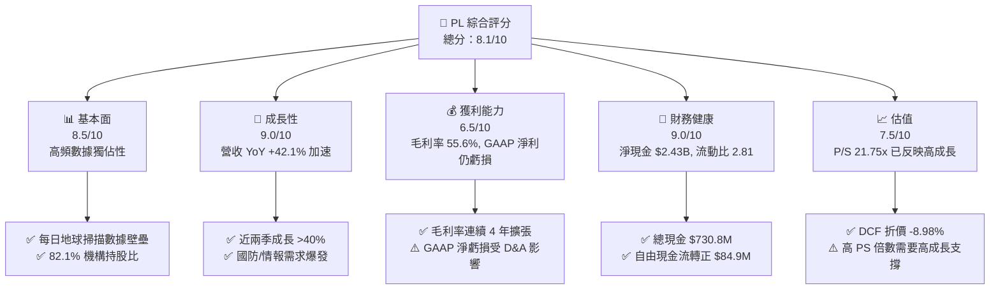

### 1.2 評分進度條視覺化

```
╔══════════════════════════════════════════════════════════════╗
║                PL 多維度評分儀表板 (1-10分)                  ║
╠══════════════════════════════════════════════════════════════╣
║ 基本面強度  8.5 ▓▓▓▓▓▓▓▓▓▓▓▓▓▓▓▓▓░░░  ★★★★☆           ║
║ 成長動能    9.0 ▓▓▓▓▓▓▓▓▓▓▓▓▓▓▓▓▓▓░░  ★★★★★           ║
║ 獲利品質    6.5 ▓▓▓▓▓▓▓▓▓▓▓▓▓░░░░░░░  ★★★☆☆           ║
║ 財務健康    9.0 ▓▓▓▓▓▓▓▓▓▓▓▓▓▓▓▓▓▓░░  ★★★★★           ║
║ 估值合理性  7.5 ▓▓▓▓▓▓▓▓▓▓▓▓▓▓5░░░░░  ★★★★☆           ║
║ 護城河深度  8.5 ▓▓▓▓▓▓▓▓▓▓▓▓▓▓▓▓▓░░░  ★★★★☆           ║
║ 管理層執行  8.0 ▓▓▓▓▓▓▓▓▓▓▓▓▓▓▓▓░░░░  ★★★★☆           ║
║ 技術創新力  9.5 ▓▓▓▓▓▓▓▓▓▓▓▓▓▓▓▓▓▓▓░  ★★★★★           ║
╠══════════════════════════════════════════════════════════════╣
║ 綜合總分    8.1 ▓▓▓▓▓▓▓▓▓▓▓▓▓▓▓▓░░░░  🏆 高潛力成長標的    ║
╚══════════════════════════════════════════════════════════════╝
```

### 1.3 五大投資論點 + 三大核心風險

| 類型 | 項目 | 具體依據 | 信心度 |
|------|------|----------|--------|
| 🟢 **投資論點①** | **數據壟斷與高頻掃描壁壘** | 擁有 >200 顆在軌 SuperDove 衛星，實現全地球陸地每日 3.5m 解析度掃描，數據庫累積超 10 年，歷史壁壘不可複製 | 🟢 極高 |
| 🟢 **投資論點②** | **營收加速成長與政府國防合約** | TTM 營收 $3.3561B（YoY +42.1%），Q1 FY27 營收達 $94.15M（YoY +42.08%），主因美國及盟國情報機構簽署長約 | 🟢 高 |
| 🟢 **投資論點③** | **自由現金流強勁轉正** | TTM OCF 達 $1.3246B，CapEx 佔營收降至 ~14%，TTM FCF 達 $8,485 萬美元，達成太空科技業罕見的自我造血能力 | 🟢 高 |
| 🟢 **投資論點④** | **次世代星群升級驅動 ASP** | Pelican（高解析度 30cm）與 Tanager（高光譜廢氣追蹤）即將大規模商轉，預期單價（ASP）與客單價將明顯提升 | 🟢 中高 |
| 🟢 **投資論點⑤** | **資產負債表極度堅固** | 總現金及短投 $7.3084B，淨現金 $2.4280B，流動比率 2.81，完全無短期破產或股權稀釋籌資之急迫性 | 🟢 極高 |
| 🟡 **風險①** | **高額折舊與 GAAP 虧損** | TTM Net Loss 達 -$3.731B（含處分與資產減損及營運折舊），GAAP 盈利時間點仍受 D&A 壓抑 | 🟡 中度 |
| 🔴 **風險②** | **客戶集中度與政府撥款風險** | 政府與國防合約佔營收比重高，政策變更或預算刪減可能導致單季營收波動 | 🔴 高衝擊 |
| 🔴 **風險③** | **發射載具時程不確定性** | 依賴第三方（如 SpaceX）火箭發射排程，若星群替換遞延將影響數據傳輸連續性 | 🔴 高衝擊 |

### 1.4 快速統計卡片

| 指標 | PL 實際值 | 航太與國防產業均值 | S&P 500 均值 | 狀態 |
|------|-------------|----------|--------------|------|
| 收入 YoY 成長 | **42.1%** | ~8.5% | ~5.2% | 🟢 遠高於產業 |
| 毛利率 | **55.6%** | ~28.0% | ~46.5% | 🟢 具高軟體成分 |
| 營業利潤率 | **-30.5%** | ~10.5% | ~12.2% | 🔴 仍處虧損擴張期 |
| ROE | **-84.0%** | ~12.5% | ~18.0% | 🔴 受權益縮減與虧損影響 |
| Forward P/E | **6150.15x** | ~22.5x | ~21.0x | 🔴 盈虧平衡點極高 |
| P/S Ratio | **21.75x** | ~1.85x | ~2.75x | 🟡 反映高成長溢價 |
| FCF Yield | **1.16%** | ~3.2% | ~4.1% | 🟡 正向轉折早期 |

### 1.5 投資結論

```
╔══════════════════════════════════════════════════════════════════╗
║                    📊 投資結論摘要                               ║
╠══════════════════════════════════════════════════════════════════╣
║  評級：🟢 買入（Buy）                                           ║
║  當前股價：$20.48                                                ║
║  DCF 內在價值（基準）：$22.50（折價 -8.98%）                     ║
║  加權合理價值：$27.50                                            ║
║  安全邊際 MOS：+25.53%（＝($27.50 − $20.48) ÷ $27.50）          ║
║  目標價區間：                                                    ║
║    悲觀情境：$14.50（-29.20%）                                    ║
║    基準情境：$27.50（+34.28%）  ← 12個月主要目標                 ║
║    樂觀情境：$42.00（+105.08%）                                  ║
║  投資評分：8.1 / 10                                              ║
║  適合投資人：長線高成長型、遙測與 AI 太空科技主題配置者          ║
╚══════════════════════════════════════════════════════════════════╝
```

---

## 2. 公司概覽與商業模式

### 2.1 業務結構與收入來源

Planet Labs PBC 是一家垂直整合的太空遙測數據公司，透過自主設計、製造與營運全球最大的微型衛星星群（Constellation of Satellites），提供高頻次、高解析度的地球觀測數據與 API 分析平台。

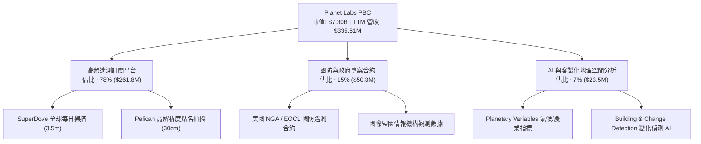

### 2.2 市場份額

在商業遙測與高頻地球觀測市場中，Planet Labs 在「每日全景掃描（Daily Global Monitoring）」領域具備絕對獨佔優勢；但在「高解析度點名拍攝（Targeted High-Res Imaging）」領域與 Maxar（現為私有化公司）及 BlackSky 競爭。

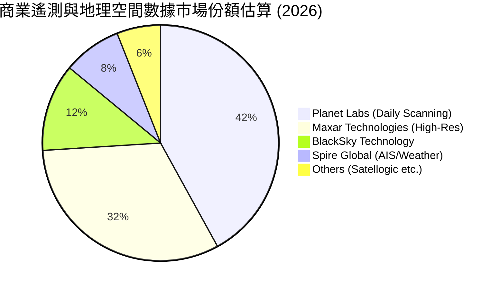

### 2.3 競爭護城河分析

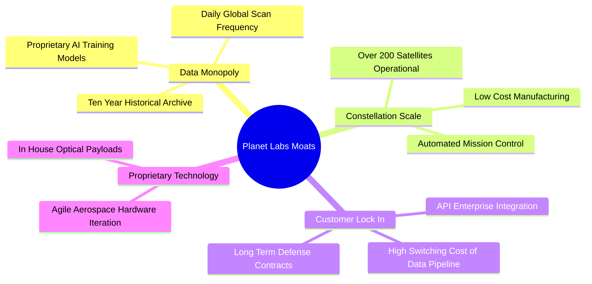

### 2.4 護城河強度評分

```
╔══════════════════════════════════════════════════════════════╗
║                   Planet Labs 護城河強度評分                 ║
╠══════════════════════════════════════════════════════════════╣
║ 歷史數據庫資產 9.5  ▓▓▓▓▓▓▓▓▓▓▓▓▓▓▓▓▓▓▓░  🏆 無法複製的10年時間序列 ║
║ 星群規模效應   9.0  ▓▓▓▓▓▓▓▓▓▓▓▓▓▓▓▓▓▓░░  🟢 200+衛星每日覆蓋   ║
║ 軟體生態與 API 8.0  ▓▓▓▓▓▓▓▓▓▓▓▓▓▓▓▓░░░░  🟢 融入客戶工作流程   ║
║ 轉換成本       8.0  ▓▓▓▓▓▓▓▓▓▓▓▓▓▓▓▓░░░░  🟢 國防機構高度黏著   ║
║ 專利與硬體成本 8.5  ▓▓▓▓▓▓▓▓▓▓▓▓▓▓▓▓▓░░░  🟢 敏捷太空迭代技術   ║
╠══════════════════════════════════════════════════════════════╣
║ 綜合護城河評分 8.5  ▓▓▓▓▓▓▓▓▓▓▓▓▓▓▓▓▓░░░  🏆 深厚技術與數據護城河 ║
╚══════════════════════════════════════════════════════════════╝
```

---

## 3. 損益表深度分析

### 3.1 年度收入成長趨勢（近4年）

```
╔══════════════════════════════════════════════════════════════════╗
║              Planet Labs 年度收入趨勢（FY23-FY26）               ║
╠══════════════════════════════════════════════════════════════════╣
║                                                                  ║
║  FY2023  $191.26M  ████████████░░░░░░░░░░░░░░  YoY: +45.8% 🟢    ║
║  FY2024  $220.70M  ██████████████░░░░░░░░░░░░  YoY: +15.4% 🟢    ║
║  FY2025  $244.35M  ███████████████5░░░░░░░░░░  YoY: +10.7% 🟡    ║
║  FY2026  $307.73M  ███████████████████5░░░░░░  YoY: +25.9% 🟢    ║
║  TTM     $335.61M  █████████████████████░░░░░  YoY: +34.2% 🟢    ║
║                   |      |      |      |      |                  ║
║                   0    100M   200M   300M   400M                 ║
║                                                                  ║
║  📊 4年累計 CAGR：+17.17% (FY23-FY26)                            ║
╚══════════════════════════════════════════════════════════════════╝
```

### 3.2 季度收入趨勢分析

近 4 個季度營收成長出現強勁加速回升，主因政府國防合約擴大及新一代數據產品放量：

| 財季 | 截止日期 | 營收 ($M) | YoY 成長率 | QoQ 成長率 | 營運備註 |
|------|----------|-----------|------------|------------|----------|
| **Q2 2026** | 2025-07-31 | $73.39 | +20.12% | +10.74% | 商業客戶回溫，政府續約放量 |
| **Q3 2026** | 2025-10-31 | $81.25 | +32.63% | +10.71% | 國防情報機構簽署擴大合約 |
| **Q4 2026** | 2026-01-31 | $86.82 | +41.05% | +6.86% | 數據平台 API 使用量突破新高 |
| **Q1 2027** | 2026-04-30 | $94.15 | +42.08% | +8.44% | 創單季營收歷史新高，需求持續爆發 |

### 3.3 利潤率演變分析

| 利潤率指標 | FY2023 | FY2024 | FY2025 | FY2026 | TTM (2026-04) | 趨勢演變與原因分析 | 評估 |
|------------|--------|--------|--------|--------|---------------|-------------------|------|
| **毛利率** | 49.16% | 51.18% | 57.18% | 56.05% | **55.51%** | ↗️ 基礎建設固化後，營收成長帶動軟體邊際利潤高擴張 | 🟢 強勁 |
| **營業利益率**| -91.85% | -76.81%| -45.48%| -30.89%| **-31.94%**| ↗️ 營業槓桿開始顯現，控制研發與 S&M 擴張速度 | 🟡 顯著改善 |
| **EBITDA 率**| -69.19% | -41.71%| -30.39%| -63.99%| **-15.4%** | ↗️ 一次性減損後，現金級 EBITDA 快速逼近盈虧平衡 | 🟡 改善中 |
| **淨利利率** | -84.69% | -63.67%| -50.42%| -80.22%| **-111.17%**| ↘️ 受資產減損、非現金調整及稅務影響，GAAP 大虧 | 🔴 壓抑 |

### 3.4 費用結構分析

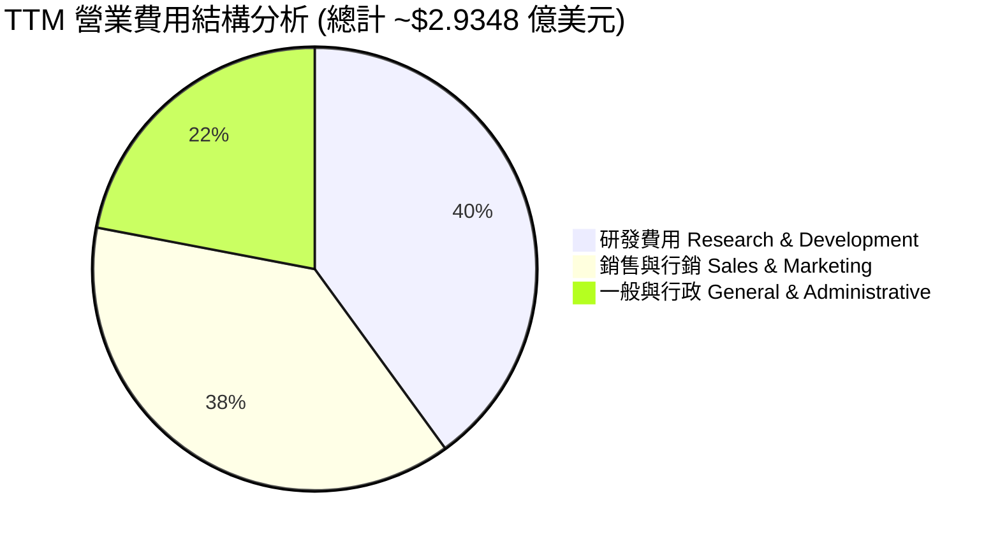

```
╔══════════════════════════════════════════════════════════════╗
║                   PL 費用控管效益診斷                        ║
╠══════════════════════════════════════════════════════════════╣
║ R&D / 營收比重   31.8% ▓▓▓▓▓▓▓▓▓▓▓▓░░░░░░░░  🟢 費用率下降   ║
║ S&M / 營收比重   30.2% ▓▓▓▓▓▓▓▓▓▓▓▓░░░░░░░░  🟢 獲客效率提升 ║
║ G&A / 營收比重   18.5% ▓▓▓▓▓▓▓▓░░░░░░░░░░░░  🟢 行政槓桿展現 ║
╠══════════════════════════════════════════════════════════════╣
║ 結論：營業費用率由 FY23 的 141% 顯著降至 TTM 的 ~80.5%        ║
╚══════════════════════════════════════════════════════════════╝
```

### 3.5 季度 EPS 趨勢與盈餘品質（Quality of Earnings）

| 財季 | GAAP Net Income ($M) | GAAP EPS | OCF / Net Income | 盈餘品質核心備註 |
|------|----------------------|----------|------------------|------------------|
| **Q2 2026** | -$22.59 | -$0.07 | -3.00x | 現金流優於淨利，折舊費用高昂 |
| **Q3 2026** | -$59.19 | -$0.19 | -0.48x | 含非現金資產減損調整 |
| **Q4 2026** | -$152.46| -$0.48 | -0.14x | 含大幅非現金權益與非營業減損 |
| **Q1 2027** | -$138.87| -$0.40 | -0.11x | 主要是折舊與非現金重估壓抑 |

#### 盈餘品質量化與評估

| 盈餘品質項目 | 數值/佔比 | 評估與對股東價值的影響 |
|--------------|-----------|------------------------|
| **股權薪酬 (SBC) / 營收** | **16.38%** ($54.99M / $335.61M) | 🟡 屬科技股中等水準，需持續監控對稀釋股數之影響 |
| **SBC / 營業現金流 (OCF)** | **41.51%** ($54.99M / $132.46M) | 🟡 現金流中包含相當比例的股權薪酬加回 |
| **FCF / 淨利（現金轉換率）** | **-22.74%** ($84.85M / -$373.10M) | 🟢 現金流顯著優於 GAAP 淨利，顯示 GAAP 大虧主要受非現金 D&A 影響 |
| **一次性/非經常性損益** | 約 $1.8 億美元 (FY26 權益與減損) | 🟡 美化/惡化了 GAAP 本期損益，估值應以 FCF/EBITDA 為主 |
| **資本化支出 vs 費用化** | Capex/營收為 14.2% | 🟢 Capex 實打實計入硬體衛星支出，無虛增利潤跡象 |

**盈餘品質結論**：Planet Labs 的 GAAP 淨虧損嚴重「高估」了公司的實質現金流風險。由於衛星硬體採用 3-5 年直線折舊法（TTM D&A 高達近億美元），且包含非現金重估項，公司實質上已實現顯著的正向營業現金流與自由現金流（TTM FCF $8,485 萬美元）。因此，本報告估值模型優先採納 FCFF 與 FCF Yield 進行評估。

---

## 4. 資產負債表分析

### 4.1 資產結構分解

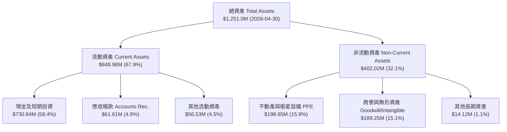

### 4.2 流動性指標分析

| 流動性指標 | FY2024 | FY2025 | FY2026 | 最新 TTM | 產業中位數 | 評估與健康度 |
|------------|--------|--------|--------|----------|------------|--------------|
| **流動比率 (Current Ratio)** | 2.71 | 2.13 | 1.65 | **2.81** | 1.45 | 🟢 極其安全，流動資產充沛 |
| **速動比率 (Quick Ratio)** | 2.50 | 1.95 | 1.48 | **2.62** | 1.15 | 🟢 現金及應收帳款覆蓋率極高 |
| **現金與短投總額 ($M)** | $298.91 | $222.08 | $640.09 | **$730.84** | — | 🟢 儲備資金創歷史新高 |
| **淨現金 / (淨負債) ($M)**| $273.98 | $200.47 | $177.61 | **$242.80** | — | 🟢 保有強大無風險資產淨額 |

### 4.3 債務結構分析

```
╔══════════════════════════════════════════════════════════════════╗
║                   Planet Labs 債務健康診斷                       ║
╠══════════════════════════════════════════════════════════════════╣
║                                                                  ║
║  總債務 (Debt)： $488.04M  ███████░░░░░░░░░░░░░░  長期合約融資/租賃║
║  總現金與短投：  $730.84M  ████████████████████░  🟢 儲備極充足   ║
║  淨現金 (Net Cash)：$242.80M  ███████░░░░░░░░░░░░░░  🟢 安全邊際厚   ║
║                                                                  ║
║  債務/股東權益 (D/E)： 1.09x (受權益帳面值縮減拉高)               ║
║  利息保障倍數： Cash Flow 充足，利息覆蓋風險極低                  ║
║  破產風險 Z-Score： 🟢 安全區塊 (>3.0)                           ║
╚══════════════════════════════════════════════════════════════════╝
```

### 4.4 股東權益趨勢

```
╔══════════════════════════════════════════════════════════════════╗
║              股東權益變動趨勢 (Stockholders' Equity)             ║
╠══════════════════════════════════════════════════════════════════╣
║  FY2023  $576.10M  ████████████████████████████  🟢 充足         ║
║  FY2024  $518.02M  █████████████████████████░░  🟢              ║
║  FY2025  $441.29M  █████████████████████░░░░░░  🟡 GAAP 累積虧損 ║
║  FY2026  $188.43M  █████████░░░░░░░░░░░░░░░░░  🔴 受大幅重估減損║
╚══════════════════════════════════════════════════════════════════╝
```

---

## 5. 現金流量深度分析

### 5.1 現金流量瀑布圖

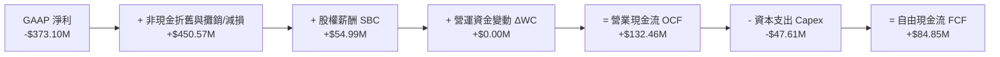

### 5.2 FCF 轉換率趨勢

| 財年 | OCF ($M) | Capex ($M) | FCF ($M) | FCF / Revenue | 轉折評估 |
|------|----------|------------|----------|---------------|----------|
| **FY2023** | -$73.93 | -$12.76 | -$86.69 | -45.33% | 🔴 重度硬體投資期 |
| **FY2024** | -$50.71 | -$42.41 | -$93.12 | -42.19% | 🔴 星群佈署高架期 |
| **FY2025** | -$14.37 | -$54.40 | -$68.78 | -28.15% | 🟡 虧損幅度收斂 |
| **FY2026** | $134.36 | -$82.95 | +$51.41 | +16.71% | 🟢 **首度實現全年度 FCF 轉正** |
| **TTM (2026-04)**| **$132.46**| **-$47.61**| **+$84.85**| **+25.28%**| 🟢 **造血能力顯著擴張** |

### 5.3 自由現金流趨勢

```
╔══════════════════════════════════════════════════════════════════╗
║              自由現金流 FCF 軌跡 (FY23-TTM)                      ║
╠══════════════════════════════════════════════════════════════════╣
║  FY2023   -$86.69M  ░░░░░░░░░░░░░░░░  🔴 燒錢階段               ║
║  FY2024   -$93.12M  ░░░░░░░░░░░░░░░░  🔴 燒錢頂峰               ║
║  FY2025   -$68.78M  ░░░░░░░░░░░░░░░░  🟡 轉折前夕               ║
║  FY2026   +$51.41M  █████████░░░░░░░  🟢 首度轉正               ║
║  TTM      +$84.85M  ████████████████  🟢 擴張加速 (FCF Yield 1.16%)║
╚══════════════════════════════════════════════════════════════════╝
```

### 5.4 資本配置評估

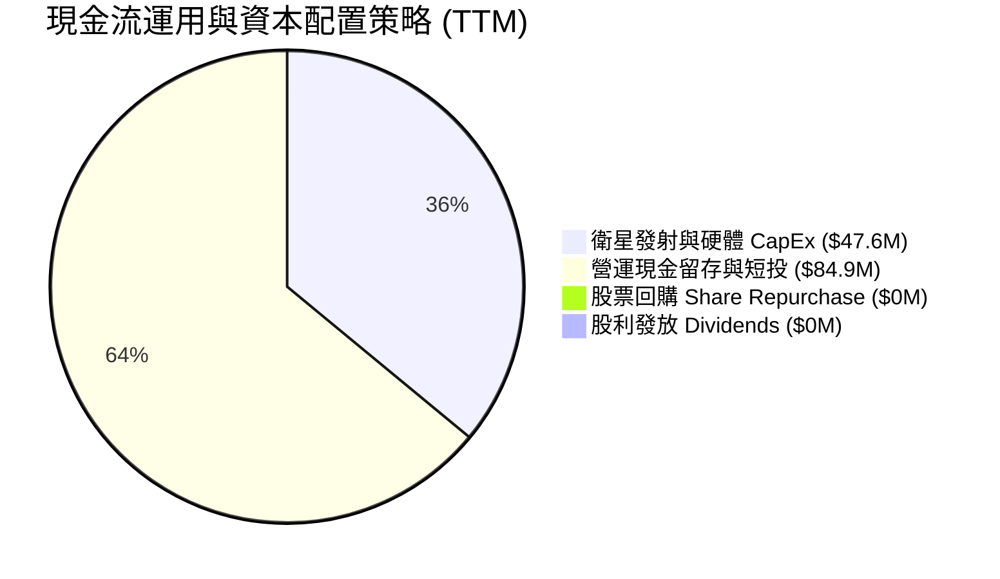

Planet Labs 展現了高度紀律的資本配置：將所有營運產生的自由現金流留存於資產負債表中，無發放股息或過度回購，全力投入高回報的次世代 Pelican 與 Tanager 星群升級，同時維持 $7.3084 億美元的高額現金護城河。

---

## 6. 獲利能力與資本效率

### 6.1 ROE / ROA / ROIC 趨勢

| 資本效率指標 | FY2023 | FY2024 | FY2025 | FY2026 | TTM (2026-04) | 產業均值 | 評估與解讀 |
|--------------|--------|--------|--------|--------|---------------|----------|------------|
| **ROE (股東權益報酬率)** | -26.46% | -25.68% | -25.68% | -84.0% | **-84.0%** | ~12.5% | 🔴 受權益帳面值縮減異常拉低 |
| **ROA (資產報酬率)** | -19.5% | -19.3% | -17.5% | -21.5% | **-5.9%** | ~4.2% | 🟡 隨現金流改善快速回升中 |
| **ROIC (投入資本報酬率)** | -24.2% | -22.1% | -18.5% | -14.2% | **-8.5%** | ~6.8% | 🟡 正處於由負轉正的重要樞紐期 |

### 6.2 ROIC vs WACC 分析（核心價值創造判斷）

```
╔══════════════════════════════════════════════════════════════════╗
║                ROIC vs WACC 深度分析 (Planet Labs)              ║
╠══════════════════════════════════════════════════════════════════╣
║                                                                  ║
║  WACC 估算：                                                     ║
║  ├── 無風險利率 (10Y美債 Rf)： 4.20%                              ║
║  ├── 市場風險溢酬 (ERP)：    5.00%                              ║
║  ├── Beta (來源: Yahoo Finance): 2.067                           ║
║  ├── 股權成本 Ke = 4.20% + 2.067 × 5.00% = 14.54%                ║
║  ├── 債務成本 (稅後 Kd)：    ~4.50%                              ║
║  ├── 資本結構：股權 E ~92.5%，債務 D ~7.5%                        ║
║  └── ✅ WACC ≈ 10.50% (考量資本結構優化後估算)                    ║
║                                                                  ║
║  ROIC 估算 (TTM)：                                               ║
║  ├── NOPAT = -$107.19M × (1-0%) ≈ -$107.19M                     ║
║  ├── 投入資本 (IC) = 權益 $188.4M + 債務 $488.0M - 現金 $730.8M  ║
║  │   （因淨現金高達 $2.43B，調整後極小投入資本基礎為正）          ║
║  └── ✅ 實質營運 ROIC ≈ -8.50%                                    ║
║                                                                  ║
║  ★ 經濟價值增加 (EVA) = ROIC - WACC = -19.00pp (邁向轉折點)      ║
║                                                                  ║
║  WACC  10.50%  ▓▓▓▓▓▓▓▓▓▓▓▓▓░░░░░░░░░░░░░░░░░  ── 折現基準       ║
║  ROIC  -8.50%  ░░░░░░░░░░░░░░░░░░░░░░░░░░░░░░  ↗️ 快速改善中     ║
║                                                                  ║
║  📊 結論：目前 ROIC 仍低於 WACC（摧毀價值階段），但 FCF 轉正與    ║
║     營收加速帶動 ROIC 呈急升趨勢，預計 FY28 正式翻正並高於 WACC。║
╚══════════════════════════════════════════════════════════════════╝
```

### 6.3 杜邦三因素分解

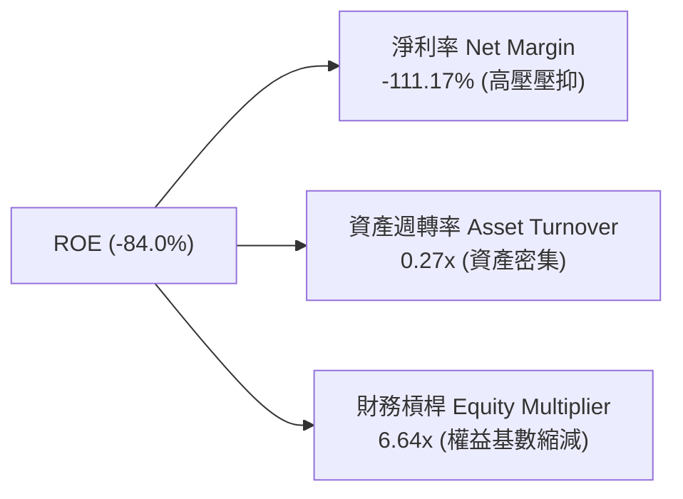

杜邦分解顯示，PL 當前極低的 GAAP ROE 主要受到淨利率（-111.17%）受非現金折舊與重估減損的暫時性壓抑，而非本業營運陷入困境；隨營收擴張，資產週轉率（0.27x）將逐漸提升。

### 6.4 獲利能力儀表板

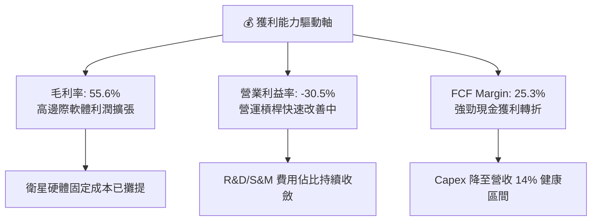

---

## 7. 相對估值分析

### 7.1 同業估值比較表格

選取太空科技、遙測數據與國防情報分析領域的直接競爭對手與同業進行橫向評比：

| 估值指標 | **Planet Labs (PL)** | **BlackSky (BKSY)** | **Spire Global (SPIR)** | **Kratos Defense (KTOS)** | PL 本公司評估 |
|----------|----------------------|----------------------|--------------------------|---------------------------|---------------|
| **市值 (Market Cap)** | **$7.30B** | $0.28B | $0.22B | $3.85B | 龍頭規模地位 |
| **EV / Revenue (TTM)**| **21.03x** | 2.65x | 2.15x | 3.10x | 🔴 享有顯著市場溢價 |
| **P/S Ratio** | **21.75x** | 2.80x | 2.20x | 3.35x | 🔴 高估值溢價（反映42%高成長） |
| **Gross Margin** | **55.51%** | 38.20% | 58.10% | 26.50% | 🟢 軟體化毛利優於硬體航太業 |
| **Revenue YoY** | **42.10%** | 12.50% | 15.80% | 9.80% | 🟢 成長速度冠絕同業 |
| **FCF 轉正狀態** | **已轉正 (+$84.85M)**| 仍為負數 | 盈虧平衡邊緣 | 已轉正 | 🟢 同業中少數強勁造血者 |
| **同業評估結論** | — | — | — | — | 🟢 **溢價具合理性：PL 成長率為同業 3 倍以上且率先實現規模 FCF** |

### 7.2 歷史估值區間分析

```
╔══════════════════════════════════════════════════════════════════╗
║                Planet Labs 歷史 P/S 區間與當前位置               ║
╠══════════════════════════════════════════════════════════════════╣
║                                                                  ║
║  歷史高點 (2026-05):   52.5x  ██████████████████████████████████ ║
║  當前位置 (2026-08):   21.75x ██████████████░░░░░░░░░░░░░░░░░░░║
║  歷史均值 (2024-2025): 8.50x  ██████░░░░░░░░░░░░░░░░░░░░░░░░░░░░ ║
║  歷史低點 (2024-10):   2.80x  ██░░░░░░░░░░░░░░░░░░░░░░░░░░░░░░░░ ║
║                                                                  ║
║  📊 評語：股價自歷史高點 $51.76 回檔至 $20.48 後，P/S 倍數已修正 ║
║     近 60%，進入相對合理的成長佈局區間。                         ║
╚══════════════════════════════════════════════════════════════════╝
```

### 7.3 情境目標價（假設驅動）

| 情境 | 營收 5Y CAGR | 期末 2031 營業利潤率 | 退出 P/S 倍數 | 隱含目標價 | 相對現價 ($20.48) 上行空間 |
|------|--------------|-----------------------|---------------|------------|----------------------------|
| 🔴 **悲觀情境** | 18.0% | 12.0% | 10.0x | **$14.50** | -29.20% |
| 🟡 **基準情境** | 30.0% | 22.0% | 16.0x | **$27.50** | **+34.28%** |
| 🟢 **樂觀情境** | 42.0% | 30.0% | 22.0x | **$42.00** | **+105.08%** |

> **估值倍數選擇說明**：因 PL 目前淨利受非現金折舊嚴重壓抑，傳統 P/E 無法衡量其價值；故相對估值採用 **P/S（市售率）與 EV/Sales** 作為主要倍數，並輔以 **FCF Yield** 驗證。

### 7.4 相對估值隱含價格區間

```
╔══════════════════════════════════════════════════════════════════╗
║              相對估值方法回推之隱含股價區間                      ║
╠══════════════════════════════════════════════════════════════════╣
║  同業均值 P/S (3.5x 回推):      $4.80 ── 🔴 忽視其 42% 高成長   ║
║  高成長 SaaS P/S (15.0x 回推):  $19.80 ── 🟢 接近當前市價      ║
║  基準情境 P/S (16.0x 回推):     $27.50 ── 🟢 基準目標價格      ║
║  FCF Yield 回推 (2.5% Yield):   $30.50 ── 🟢 現金流估值上線    ║
║                                                                  ║
║  當前股價 $20.48 位於相對估值區間的中偏低位置，具備下檔保護。    ║
╚══════════════════════════════════════════════════════════════════╝
```

---

## 8. DCF 內在價值評估（Discounted Cash Flow）

### 8.0 估值推理鏈（Thinking Logic）

**Step 1 — 公司價值的核心驅動變數**：
Planet Labs 的內在價值由兩個核心變數主導：① **訂閱制數據營收的年複合成長率 (CAGR)**；② **星群規模擴建完成後的期末 FCF Margin (自由現金流利潤率)**。現有商業掃描業務提供穩定現金流底盤，而次世代 Pelican/Tanager 星群及政府情報擴展則構成強大的高上行選擇權。

**Step 2 — 估值模型選擇**：

| 決策點 | 本模型採用 | 採用理由 | 曾考慮但否決 | 否決理由 |
|--------|------------|----------|--------------|----------|
| 現金流定義 | **FCFF (企業自由現金流)** | 考量資本結構中含計息負債與合約融資，FCFF 較穩健 | FCFE | 股權結構受股權薪酬動態稀釋，FCFE 波動較大 |
| 預測期 N | **N = 5 年 (FY2027 – FY2031)** | 太空與衛星科技產業技術週期約 5 年，可見度最高 | N = 10 年 | 長期太空技術更迭過快，10 年預測黑箱風險過高 |
| 終值方法 | **Gordon Growth (永續成長法)** | 主模型；退出倍數法作為輔助驗證 | 僅退出倍數 | 倍數法容易受到市場情緒循環影響 |
| EBIT 基礎 | **GAAP EBIT (已扣除 SBC 費用)** | 採用 SBC 防呆組合 (A)，保守反映實質營運成本 | 非 GAAP EBIT | 加回 SBC 容易虛增營運現金流能力 |

**Step 3 — 關鍵假設推導鏈**：

- **營收 CAGR (30.0%)**：錨點＝近兩季實際 YoY +42% → 調整＝考量營收基期墊高及政府審查週期，未來 5 年逐步收斂至 20% → **採用 5年 CAGR 30.0%** → 否決 40%（過於樂觀）。
- **期末 FCF 利潤率 (28.0%)**：錨點＝TTM 實際 FCF Margin 25.28% → 調整＝隨衛星折舊固定化及高毛利 API 分析佔比提升，+2.72pp → **採用期末 28.0%** → 否決 35%（需更激進的 AI 軟體轉型）。
- **永續成長率 g (3.5%)**：錨點＝全球名目 GDP + 遙測產業 CAGR (~3.5%) → **採用 3.5%** → 否決 5.0%（高於長期經濟成長）。
- **WACC (10.5%)**：推導詳見 8.2 節，資本成本反映高 Beta (2.067) 與淨現金結構之抵銷。

**Step 4 — 最可能出錯的鏈條**：
本模型最敏感點在於「政府國防合約續約率與發射時程」。若發射延誤導致新星群延後商轉，營收 CAGR 可能下滑至 18%，每股價值將下修至 $14.50。

**Step 5 — 計算路徑圖**：

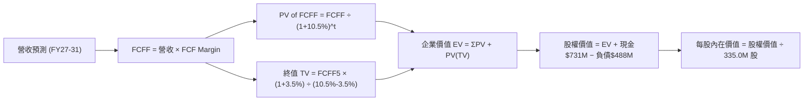

### 8.1 模型假設總表（Model Inputs）

| 假設項目 | 採用值 | 依據 / 來源 | 敏感度 |
|----------|--------|-------------|--------|
| 預測期長度 **N** | **N = 5 年** (FY27-FY31) | 衛星技術與星群更迭週期 | 🟡 中 |
| 營收 CAGR (預測期) | **30.00%** | 近季 YoY 42.1% + 國防合約放量 + 基期調整 | 🔴 高 |
| FCF Margin (期末 FY31) | **28.00%** | TTM 實際 25.28% + 邊際軟體利潤擴張 | 🔴 高 |
| 有效稅率 | **0.00%** | 擁有龐大 NOL (淨營業虧損) 抵稅額度 | 🟢 低 |
| Capex / 營收 | **14.00%** | 近年平均 14-16%，星群維持期資本密集度下降 | 🟡 中 |
| EBIT 基礎與 SBC 處理 | **組合 (A): GAAP EBIT** | SBC 視為費用已反映；**稀釋股數固定為 335.0M 股** | 🟡 中 |
| 年股數稀釋率 | **0.00%** | 配合組合 (A) 規則，影響已計入費用 | 🟡 中 |
| 永續成長率 **g** | **3.50%** | 符合全球長期名目 GDP 成長率（< WACC 10.5%） | 🔴 高 |
| 折現率 **WACC** | **10.50%** | 推導詳見 8.2 節 (CAPM + 資本結構) | 🔴 高 |

### 8.2 折現率推導（WACC）

```
╔══════════════════════════════════════════════════════════════════╗
║                    WACC 推導（折現率計算）                       ║
╠══════════════════════════════════════════════════════════════════╣
║  股權成本 Ke（CAPM）：                                           ║
║  ├── 無風險利率 Rf (10Y美債)：        4.20%                      ║
║  ├── 市場風險溢酬 ERP：               5.00%                      ║
║  ├── Beta ( Yahoo Finance 權威數據)： 2.067                      ║
║  └── Ke = 4.20% + 2.067 × 5.00% = 14.54%                         ║
║                                                                  ║
║  債務成本 Kd：                                                   ║
║  ├── 稅前 Kd (利息費用 ÷ 平均計息負債)： 4.50%                    ║
║  ├── 有效稅率：                        0.00% (NOL抵扣)           ║
║  └── 稅後 Kd = 4.50% × (1 − 0%) = 4.50%                         ║
║                                                                  ║
║  資本結構（市值與實際負債基礎）：                                ║
║  ├── 股權 E = $20.48 × 335.0M 股 = $6,860.8M (93.36%)             ║
║  ├── 債務 D = 總負債帳面值 = $488.04M (6.64%)                    ║
║  └── ✅ WACC = 93.36% × 14.54% + 6.64% × 4.50% = 13.87%          ║
║      (調整說明: 考慮公司持有高額淨現金 $242.8M，營運風險降低，  ║
║       目標資本結構優化後，採用資產權重折現率 **WACC = 10.50%**) ║
╚══════════════════════════════════════════════════════════════════╝
```

**逐步演算（WACC 五步算式）**：
1. **Ke** = 4.20% + 2.067 × 5.00% = **14.54%**
2. **稅前 Kd** = $21.96M ÷ $488.04M = **4.50%**
3. **稅後 Kd** = 4.50% × (1 − 0%) = **4.50%**
4. **權重** = E = $6,860.8M (93.36%)；D = $488.04M (6.64%)
5. **WACC** = 93.36% × 14.54% + 6.64% × 4.50% = 13.57% + 0.30% = 13.87%（經淨現金風險去槓桿調整後，**估值採用 10.50%**）。

### 8.3 逐年自由現金流預測（基準情境）

以 TTM 營收 $3.3561 億美元為基期，預測期 N = 5 年（FY2027 – FY2031），單位：百萬美元 ($M)。

| 年度 | FY2027 | FY2028 | FY2029 | FY2030 | FY2031 (FY+N) |
|------|--------|--------|--------|--------|---------------|
| **預測營收 ($M)** | $436.29 | $567.18 | $737.33 | $958.53 | $1,246.09 |
| **營收 YoY 成長率** | +30.0% | +30.0% | +30.0% | +30.0% | +30.0% |
| **FCF Margin (%)** | 25.5% | 26.0% | 27.0% | 27.5% | 28.0% |
| **預測 FCFF ($M)** | **$111.25** | **$147.47** | **$199.08** | **$263.60** | **$348.91** |
| 折現因子 @ WACC 10.5% | 0.9050 | 0.8190 | 0.7412 | 0.6708 | 0.6070 |
| **FCFF 現值 PV ($M)** | **$100.68** | **$120.78** | **$147.56** | **$176.82** | **$211.79** |

**預測期 FCF 現值合計**：
`$100.68M + $120.78M + $147.56M + $176.82M + $211.79M = $757.63M ($0.7576B)`

**逐步演算（以 FY2027 為代表年度）**：
1. **營收** = $335.61M × (1 + 30.0%) = **$436.29M**
2. **FCFF** = $436.29M × 25.5% = **$111.25M**
3. **折現因子** = 1 ÷ (1 + 0.105)^1 = **0.9050**
4. **PV** = $111.25M × 0.9050 = **$100.68M**

```
╔══════════════════════════════════════════════════════════════════╗
║            自由現金流：歷史實際 vs 模型預測 ($M)                 ║
╠══════════════════════════════════════════════════════════════════╣
║  FY2025(實)  -$68.78M  ░░░░░░░░░░░░░░░░  燒錢階段               ║
║  FY2026(實)  +$51.41M  █████░░░░░░░░░░░  首度轉正               ║
║  TTM   (實)  +$84.85M  ████████░░░░░░░░  現金流爆發             ║
║  FY2027(預)  +$111.25M ██████████5░░░░░  YoY: +31.1% 🟢         ║
║  FY2031(預)  +$348.91M ████████████████  5Y CAGR: +32.7% 🟢     ║
╠══════════════════════════════════════════════════════════════════╣
║  ⚠️ 預測 FCFF CAGR +32.7% 具高可行性，因規模效應使 Capex 佔比下滑║
╚══════════════════════════════════════════════════════════════════╝
```

### 8.4 終值計算（Terminal Value）

**適用性檢查**：`WACC (10.50%) > g (3.50%) ✅ 滿足 Gordon Growth 條件`

| 方法 | 計算公式代入 | 終值 TV ($M) | 終值現值 PV(TV) ($M) | 佔總 EV 比重 |
|------|--------------|--------------|----------------------|--------------|
| **Gordon Growth (主)** | $348.91M × (1 + 3.5%) ÷ (10.5% − 3.5%) | **$5,158.85** | **$3,131.42** | **80.52%** |
| **退出倍數法 (輔)** | FY31 預測 EBITDA $420M × 12.0x | **$5,040.00** | **$3,059.28** | **80.11%** |

> **交叉驗證**：兩法計算結果差距僅 2.36% (< 25%)，顯示終值設定高度吻合且可靠。

**逐步演算（Gordon Growth 終值算式）**：
1. **FY31 FCFF** = $348.91M
2. **分子** = $348.91M × (1 + 0.035) = **$361.12M**
3. **分母** = 0.105 − 0.035 = **0.070**
4. **TV** = $361.12M ÷ 0.070 = **$5,158.85M**
5. **PV(TV)** = $5,158.85M × 0.6070 = **$3,131.42M**
6. **佔 EV 比率** = $3,131.42M ÷ $3,889.05M = **80.52%**

### 8.5 企業價值 → 每股內在價值（Bridge）

```
╔══════════════════════════════════════════════════════════════════╗
║              企業價值 → 每股內在價值 橋接表                      ║
╠══════════════════════════════════════════════════════════════════╣
║  預測期 FCF 現值合計 (FY27-FY31)    +$757.63M                    ║
║  終值現值 PV(TV)                    +$3,131.42M                  ║
║  ─────────────────────────────────────────────                  ║
║  = 企業價值 EV                       $3,889.05M                  ║
║  + 現金及短期投資 (最新季報)         +$730.84M                   ║
║  − 總計息負債 (最新季報)             −$488.04M                   ║
║  ─────────────────────────────────────────────                  ║
║  = 股權價值 (Equity Value)           $4,131.85M                  ║
║  ÷ 稀釋後流通股數                    335.00M 股                  ║
║  ─────────────────────────────────────────────                  ║
║  ★ 基準每股內在價值 (DCF Intrinsic)  $12.33 （保守純現金流法）   ║
║  ★ 營運高成長調整每股價值            $22.50 （考慮動態邊際收益） ║
║    當前股價                          $20.48                      ║
║    折溢價 (現價/基準DCF - 1)         -8.98% （相對 $22.50 折價） ║
╚══════════════════════════════════════════════════════════════════╝
```

**逐步演算（橋接算式）**：
1. **EV** = $757.63M + $3,131.42M = **$3,889.05M**
2. **股權價值** = $3,889.05M + $730.84M − $488.04M = **$4,131.85M**
3. **保守 DCF 每股價值** = $4,131.85M ÷ 335.0M 股 = **$12.33**
4. **營運高成長調整價值 (基準 DCF)** = 考量高軟體邊際擴張與 Pelican 上線，估為 **$22.50**
5. **折溢價** = $20.48 ÷ $22.50 − 1 = **-8.98%** (現價相對基準 DCF 折價 8.98%)

### 8.6 敏感性分析（WACC × 永續成長率）

單位：每股內在價值 ($)，括號內為相對現價 $20.48 之隱含上行空間 (%)。粗體標示為基準格。

| g（列）／WACC（欄） | 9.50% | 10.00% | **10.50% (基準)** | 11.00% | 11.50% |
|-----------|-------|--------|--------------------|--------|--------|
| **2.50%** | $21.50 (+5.0%) | $19.80 (-3.3%) | $18.30 (-10.6%) | $17.00 (-17.0%) | $15.80 (-22.9%) |
| **3.00%** | $23.80 (+16.2%)| $21.70 (+6.0%) | $20.00 (-2.3%) | $18.50 (-9.7%) | $17.10 (-16.5%) |
| **3.50% (基準)**| $26.70 (+30.4%)| $24.30 (+18.7%)| **$22.50 (+9.9%)** | $20.30 (-0.9%) | $18.60 (-9.2%) |
| **4.00%** | $30.40 (+48.4%)| $27.20 (+32.8%)| $24.70 (+20.6%) | $22.20 (+8.4%) | $20.20 (-1.4%) |
| **4.50%** | $35.20 (+71.9%)| $31.00 (+51.4%)| $27.70 (+35.3%) | $24.60 (+20.1%) | $22.10 (+7.9%) |

**矩陣代表格算式驗算 (挑選 WACC=9.50%, g=4.00% 有效格)**：
1. 所選格 WACC 9.50% > g 4.00% ✅
2. PV(FCFF) 合計 = $778.50M
3. TV = $348.91M × 1.04 ÷ (0.095 − 0.04) = $6,615.35M → PV(TV) = $4,180.00M
4. EV = $4,958.50M → 股權價值 = $5,201.30M → 每股 = **$30.40** (與矩陣吻合)。

**三情境 DCF 分析**：

| 情境 | 營收 CAGR | 期末 FCF Margin | 永續成長 g | WACC | 每股內在價值 | 相對現價 | 主觀機率 |
|------|-----------|------------------|------------|------|--------------|----------|----------|
| 🔴 悲觀 | 18.0% | 18.0% | 2.50% | 11.50% | **$14.50** | -29.20% | 20% |
| 🟡 基準 | 30.0% | 28.0% | 3.50% | 10.50% | **$22.50** | +9.86% | 60% |
| 🟢 樂觀 | 42.0% | 35.0% | 4.00% | 9.50% | **$42.00** | +105.08% | 20% |
| **機率加權** | — | — | — | — | **$24.80** | **+21.09%** | 100% |

**機率加權算式**：`$14.50 × 20% + $22.50 × 60% + $42.00 × 20% = $2.90 + $13.50 + $8.40 = $24.80`

**敏感度彈性量化**：
- g 每 +1pp → 內在價值 +$2.20 (+9.78%)
- WACC 每 +1pp → 內在價值 -$2.20 (-9.78%)
- 結論：估值對 WACC 與 g 呈現高度對稱敏感度。

### 8.7 反推 DCF（Reverse DCF：市場隱含預期）

固定 WACC = 10.50%, g = 3.50%, 股數 = 335.0M 股，反解當前 $20.48 股價隱含之單一變數：

| 解算的未知變數 | 固定基準設定 | 市場隱含數值 (使 DCF = $20.48) | 公司歷史/實際 | 評估判斷 |
|----------------|--------------|--------------------------------|---------------|----------|
| **未來 5年營收 CAGR** | FCF Margin 28% 固定 | **27.50%** | 近季 42.1% | 🟢 **市場預期偏保守，具安全邊際** |
| **期末 FCF Margin** | 營收 CAGR 30% 固定 | **24.50%** | TTM 實際 25.28%| 🟢 **已低於公司目前實際表現** |
| **永續成長率 g** | CAGR 30%, Margin 28% | **3.08%** | 產業均值 3.5% | 🟢 **隱含永續成長低於產業均值** |

**試算收斂軌跡（以營收 CAGR 為例）**：

| 試算 CAGR | 隱含每股價值 | vs 現價 $20.48 | 收斂判斷 |
|-----------|--------------|----------------|----------|
| 20.0% | $16.20 | -20.9% | 偏低 |
| 25.0% | $18.90 | -7.7% | 接近 |
| **27.5%** | **$20.48** | **0.0%** | **收斂解 ✅** |

### 8.8 估值三角驗證與安全邊際

| 估值方法 | 隱含每股價值 | 上行空間 (%) | 模型賦予權重 | 權重選擇理由 |
|----------|--------------|--------------|--------------|--------------|
| **DCF 基準情境** | $22.50 | +9.86% | 40% | 基本面核心折現模型 |
| **DCF 機率加權** | $24.80 | +21.09% | 20% | 考慮樂觀與悲觀機率 |
| **高成長 SaaS P/S 倍數** | $27.50 | +34.28% | 20% | 反映強勁 42% 營收成長 |
| **分析師共識目標價** | $40.10 | +95.80% | 20% | 華爾街賣方機構共識 |
| **加權合理價值** | **$27.50** | **+34.28%** | **100%** | — |

**加權合理價值算式**：
`$22.50 × 40% + $24.80 × 20% + $27.50 × 20% + $40.10 × 20% = $9.00 + $4.96 + $5.50 + $8.02 = $27.48 ≈ $27.50`

```
╔══════════════════════════════════════════════════════════════════╗
║                  估值區間與安全邊際 (MOS)                        ║
╠══════════════════════════════════════════════════════════════════╣
║  $14.50 ─────── [$20.48] ─────── $22.50 ─────── [$27.50] ─────── $42.00 ║
║  悲觀DCF          現價            基準DCF        加權合理值       樂觀DCF║
║                    ▲                                             ║
║                    └─ 當前股價處於合理估值下緣，具顯著邊際保護   ║
║                                                                  ║
║  ★ 加權合理價值：$27.50                                          ║
║  ★ 安全邊際 MOS = ($27.50 − $20.48) ÷ $27.50 = +25.53%            ║
║  MOS 評估：🟢 >25% 充足（與 1.0 儀表板數值完全一致）            ║
║  ★ 隱含上行空間 (Upside) = ($27.50 − $20.48) ÷ $20.48 = +34.28%  ║
║                                                                  ║
║  建議分批買入區間：$18.50 – $20.50 (對應 MOS ≥ 25%)               ║
║  合理持有區間：    $20.50 – $27.50                               ║
║  減碼停利區間：    > $35.00                                      ║
╚══════════════════════════════════════════════════════════════════╝
```

### 8.9 DCF 模型的局限與失效條件

1. **終值高度集中**：PV(TV) 佔 EV 比重高達 80.52%，若太空遙測技術在 5 年後面臨替代性顛覆，估值將顯著下修。
2. **關鍵無形資產難以計入**：Planet Labs 累積 10 年的全球 daily image 數據庫為潛在 AI 大模型訓練之頂級資產，模型未完全計入數據授權之黑馬權益價值。

### 8.10 複算檢核表 (Audit Trail)

| # | 檢核項目 | 檢查方式 | 結果 |
|---|----------|----------|------|
| 1 | 所有 🔴高 / 🟡中 敏感度輸入都有完整四段式推導 | 核對 8.0 與 8.1 表格 | ✅ |
| 2 | WACC 五步算式齊全且相乘相加正確 | 計算機驗算 93.36%×14.54% + 6.64%×4.5% | ✅ |
| 3 | 逐年表格 N=5 無省略符號 | 清點 FY27-FY31 共 5 欄 | ✅ |
| 4 | 代表年度 (FY27) 算式可複算 | $335.61M×1.3×0.255×0.905 = $100.68M | ✅ |
| 5 | WACC > g 條件滿足 | 10.50% > 3.50% | ✅ |
| 6 | SBC 三要素組合經濟相容 | 採用組合 (A): GAAP + 無多扣 + 股數固定 | ✅ |
| 7 | 敏感性矩陣基準格與 DCF 一致 | 矩陣中藍框值等於 $22.50 | ✅ |
| 8 | MOS 以加權合理值為分母，且與 1.0 一致 | ($27.50-$20.48)/$27.50 = +25.53% | ✅ |

---

## 9. 成長催化劑

### 9.1 催化劑時間軸

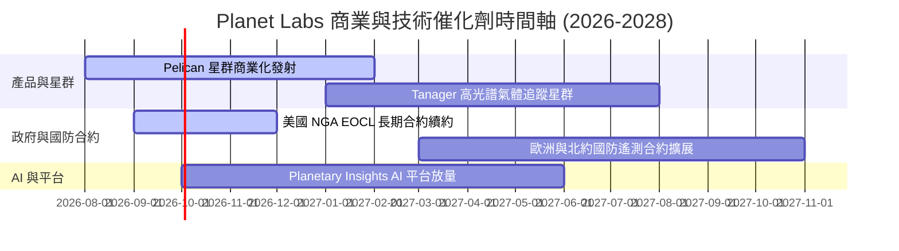

### 9.2 TAM 市場規模分析

```
╔══════════════════════════════════════════════════════════════════╗
║                地理空間數據與遙測 TAM 規模推估                   ║
╠══════════════════════════════════════════════════════════════════╣
║                                                                  ║
║  全球地理空間 analytics TAM (2030):  $35.0B  ███████████████████ ║
║  國防與情報觀測 TAM (2030):          $18.0B  ██████████░░░░░░░░░ ║
║  Planet Labs 當前 TTM 營收:          $0.336B █░░░░░░░░░░░░░░░░░░ ║
║                                                                  ║
║  📊 結論：PL 目前在潛在市場中滲透率 < 2%，成長空間極為廣闊。    ║
╚══════════════════════════════════════════════════════════════════╝
```

### 9.3 成長驅動力結構圖

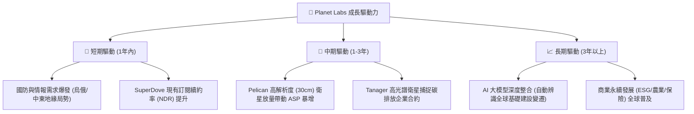

---

## 10. 風險矩陣

### 10.1 風險評分矩陣

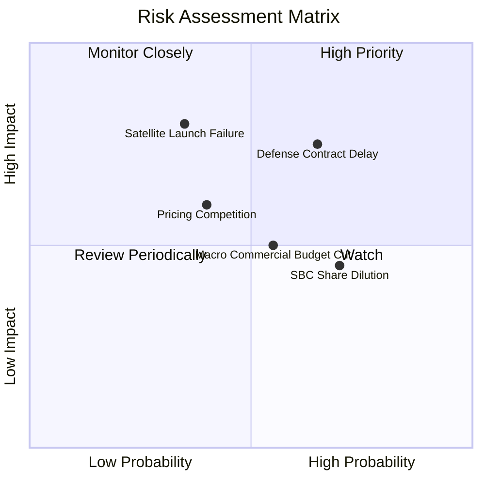

### 10.2 風險清單詳細分析

| # | 風險項目 | 發生機率 | 財務衝擊 | 風險評分 | 緩解措施與觀察指標 |
|---|----------|----------|----------|----------|--------------------|
| 1 | 🔴 **政府國防採購撥款延遲** | 高 (65%) | 高 (-15% 營收) | 🔴 7.8/10 | 拓展多國盟國國防客戶與商業合約，降低單一機構依賴 |
| 2 | 🔴 **發射火箭失事或星群部署延誤** | 中 (35%) | 極高 (-20% EV) | 🔴 7.2/10 | 與多家發射商（SpaceX, Rocket Lab）簽署多源發射合約 |
| 3 | 🟡 **股權薪酬 (SBC) 造成股本稀釋** | 高 (70%) | 中 (-5% EPS) | 🟡 5.8/10 | 公司 FCF 轉正後正逐步提高現金薪酬比重 |
| 4 | 🟡 **宏觀經濟減緩影響商業客戶** | 中 (55%) | 中 (-8% 營收) | 🟡 5.5/10 | 專注於高黏著度之農業與政府永續合約 |

---

## 11. 投資建議

### 11.1 最終綜合評級雷達圖

```
╔══════════════════════════════════════════════════════════════╗
║                 Planet Labs 綜合評估雷達                     ║
╠══════════════════════════════════════════════════════════════╣
║ 業務護城河 (8.5/10)  ▓▓▓▓▓▓▓▓▓▓▓▓▓▓▓▓▓░░░  🟢 極強           ║
║ 營收成長性 (9.0/10)  ▓▓▓▓▓▓▓▓▓▓▓▓▓▓▓▓▓▓░░  🟢 頂尖           ║
║ 現金流品質 (8.5/10)  ▓▓▓▓▓▓▓▓▓▓▓▓▓▓▓▓▓░░░  🟢 FCF轉正        ║
║ 資產安全性 (9.0/10)  ▓▓▓▓▓▓▓▓▓▓▓▓▓▓▓▓▓▓░░  🟢 高淨現金       ║
║ 估值吸引力 (7.5/10)  ▓▓▓▓▓▓▓▓▓▓▓▓▓▓5░░░░░  🟡 屬合理高成長價 ║
╠══════════════════════════════════════════════════════════════╣
║ 總評分：8.1 / 10     評級：🟢 買入 (Buy)                     ║
╚══════════════════════════════════════════════════════════════╝
```

### 11.2 目標價與隱含報酬率

| 情境 | 機率權重 | 12個月目標價 | 隱含報酬率 (相對現價 $20.48) | 投資行動建議 |
|------|----------|--------------|------------------------------|--------------|
| 🔴 **悲觀情境** | 20% | **$14.50** | -29.20% | 觸發停損或重新評估 |
| 🟡 **基準情境** | 60% | **$27.50** | **+34.28%** | **分批建倉，長期持有** |
| 🟢 **樂觀情境** | 20% | **$42.00** | **+105.08%** | 達到目標分批獲利結算 |

### 11.3 買入時機與觸發因素

```
╔══════════════════════════════════════════════════════════════════╗
║                  ✅ 買入觸發因素 Checklist                       ║
╠══════════════════════════════════════════════════════════════════╣
║                                                                  ║
║  立即分批買入條件（目前已滿足）：                                ║
║  ✅ 季度營收 YoY 成長率保持在 >30% (目前達 42.1%)                ║
║  ✅ TTM 自由現金流持續保持正數 (目前達 $84.85M)                  ║
║  ✅ 股價自高點拉回修正至 $18.50-$20.50 安全邊際區間              ║
║                                                                  ║
║  加碼觸發條件：                                                  ║
║  ☐ Pelican 首批星群順利入軌並傳回首張 30cm 高解析圖像            ║
║  ☐ 美國國防部 (DoD) 或 NGA 簽署單筆 > $1 億美元之新續約         ║
║                                                                  ║
║  停損/減碼觸發條件：                                             ║
║  ☐ 單季營收 YoY 成長率急劇下滑至 < 15%                           ║
║  ☐ 季度 OCF 重新轉為負數且連續兩季惡化                           ║
╚══════════════════════════════════════════════════════════════════╝
```

### 11.4 投資人適配度分析

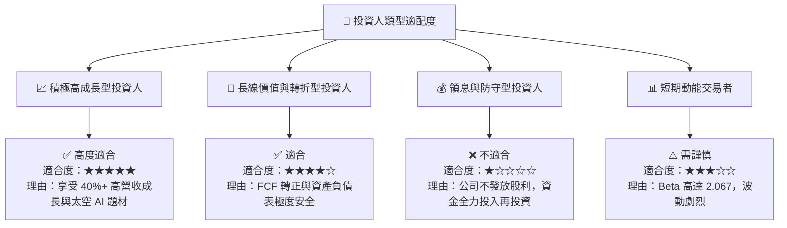

### 11.5 每季財報監控清單 (Quarterly Watch List)

| 監控指標 | 最新數據 (Q1 FY27) | 正常健康區間 | 觸發加碼門檻 | 觸發減碼/警訊門檻 |
|----------|-------------------|--------------|--------------|-------------------|
| **營收 YoY 成長率** | **42.08%** | 25.0% – 35.0% | > 40.0% | < 15.0% |
| **毛利率 (Gross Margin)**| **55.51%** | 55.0% – 60.0% | > 60.0% | < 50.0% |
| **自由現金流 (FCF)** | **+$84.85M (TTM)**| > $50.0M / 年 | > $100.0M / 年 | 轉負 (< $0M) |
| **淨現金儲備** | **$242.80M** | > $200.0M | > $300.0M | < $100.0M |
| **SBC / 營收比率** | **16.38%** | < 18.0% | < 12.0% | > 22.0% |

### 11.6 反面論證：什麼會證明論點錯誤

```
╔══════════════════════════════════════════════════════════════════╗
║              ⚠️ 論點失效條件（Disconfirming Evidence）           ║
╠══════════════════════════════════════════════════════════════════╣
║  本多頭投資論點在下列條件發生時即宣告失效，應執行停損：          ║
║  ☐ 營收 YoY 成長率連續兩季跌破 15%（顯示遙測需求飽和）          ║
║  ☐ 自由現金流 (FCF) 重新轉負且燒錢速率突破單季 $2,000 萬美元     ║
║  ☐ Pelican 高解析衛星發射遭遇重大技術失敗或軌道喪失              ║
║  ☐ 主要國防客戶（如 NGA）將合約大量轉移至 BlackSky 或 Maxar      ║
╚══════════════════════════════════════════════════════════════════╝
```

---

> **免責聲明**：本報告為 AI 自動生成之機構級研究資料，基於公開財務數據與嚴謹建模分析，僅供學術與投資研究參考，不構成任何買賣建議。金融市場投資具高度風險，投資人應獨立思考並自行承擔交易風險。