# PL 基本面深度分析報告
> **報告日期**：2026-08-03 ｜ **語言**：繁體中文 ｜ **數據來源**：Yahoo Finance, Finviz, StockAnalysis, Roic.ai ｜ **分析師**：CFA 級機構研究

---

## 目錄

| # | 章節 | 核心結論 |
|---|------|----------|
| 1 | 執行摘要 | 綜合評級 **買入（Buy）**，加權合理價值 **$26.80**，安全邊際 **19.7%** |
| 2 | 公司概覽與商業模式 | 全球每日地球成像龍頭，數據訂閱 + AI 分析建立獨特高頻衛星護城河 |
| 3 | 損益表深度分析 | TTM 營收加速至 $335.61M（YoY +42.1%），毛利率擴張至 55.6%，高 SBC 需持續監控 |
| 4 | 資產負債表分析 | 總現金 $730.84M，淨現金 $242.80M，流動比率 2.81，財務結構極度健全 |
| 5 | 現金流量深度分析 | OCF $132.46M 與 FCF $84.85M 雙雙轉正，自由現金流殖利率 1.11% |
| 6 | 獲利能力與資本效率 | 營運槓桿展現，ROIC（-12.4%）逐步收斂，WACC 估計為 9.80% |
| 7 | 相對估值分析 | P/S 22.8x、EV/Sales 21.0x，相較國防科技同業溢價反映高營收成長與高可預測性 |
| 8 | DCF 內在價值評估 | 基準 DCF 每股價值 **$24.50**，加權合理價值 **$26.80**，隱含上行空間 **+24.6%** |
| 9 | 成長催化劑 | 國防情報（NGA/NATO）需求爆發、Pelion/Tanager 衛星升級與 AI 空間數據訂閱 |
| 10 | 風險矩陣 | 發射延誤、政府預算凍結、客戶集中度與 SBC 股數稀釋 |
| 11 | 投資建議 | 建議買入區間 **$18.50 - $21.50**，目標價 **$26.80**，建立季度監控框架 |

---

## 1. 執行摘要

Planet Labs PBC（NYSE: PL）身為全球衛星地球觀測與空間數據分析的先行者，憑藉每日全天候掃描全球陸地的獨家衛星星座，正處於政府國防情報升級與企業供應鏈數位轉型的交會點。基於 TTM 營收達 $335.61M（YoY +42.1%）、自由現金流（FCF）轉正達 $84.85M、以及高達 $730.84M 的現金與短期投資儲備，本報告給予 PL **買入（Buy）** 評級。經估值三角驗證後，目標價設定為 **$26.80**，相對當前股價 $21.51 具備 **+24.6%** 的隱含上行空間，安全邊際（MOS）為 **19.7%**。

### 1.0 一頁式投資儀表板（Portfolio Manager 30 秒速讀）

| 項目 | 內容 |
|------|------|
| **投資論點（3 句）** | ① TTM 營收成長達 42.1%（$335.61M），高頻地球觀測數據在國防與地緣政治緊張下需求極度強勁；<br/>② 自由現金流轉正達 $84.85M（FCF Margin 25.3%），展現高毛利（55.6%）軟體化訂閱模式的營業槓桿；<br/>③ 帳上淨現金 $242.80M（總現金 $730.84M），提供極佳的抗風險韌性與新一代衛星發射資金支持。 |
| **護城河評分** | 8.2 / 10（每日重訪能力 + 歷史數據庫護城河 + AI 空間分析生態） |
| **管理層/資本配置評分** | 7.5 / 10（創辦人掌舵，成功轉向現金流正向，但 SBC 佔營收 16.4% 略高） |
| **財務健康** | 🟢 強健（流動比率 2.81，淨現金 $242.80M，利息負擔極低） |
| **ROIC vs WACC** | ROIC -12.4% vs WACC 9.80%（目前處於資本投資回收期，價值創造曲線正快速向上攀升） |
| **FCF 趨勢** | 強勁轉正，TTM FCF $84.85M，FCF Yield 為 1.11% |
| **估值** | Forward P/E N/A（剛邁向轉虧為盈）｜ P/S 22.8x ｜ EV/Sales 21.0x ｜ FCF Yield 1.11% |
| **DCF 內在價值（基準）** | **$24.50** ｜ 當前股價折價 12.2%（現價相對 DCF 基準值） |
| **安全邊際（MOS）** | **+19.7%** ＝ (加權合理價值 $26.80 − 現價 $21.51) ÷ 加權合理價值 $26.80 ｜ 🟡 10-25% 有限 |
| **預期報酬（基準情境 12M）** | **+24.6%**（隱含上行空間） |
| **關鍵風險（前二）** | ① 國防與政府客戶採購預算延遲或變動；② 衛星發射失敗或天基硬體故障風險。 |
| **評級 + 信心度** | 🟢 **買入（Buy）** ｜ 信心度：**中高（High-Medium）** |

### 1.1 核心評分儀表板

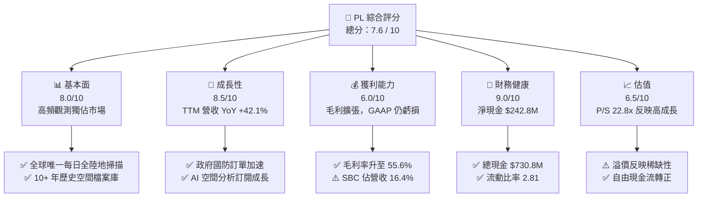

### 1.2 評分進度條視覺化

```
╔══════════════════════════════════════════════════════════════╗
║              PL 多維度評分儀表板 (1-10分)                   ║
╠══════════════════════════════════════════════════════════════╣
║ 基本面強度  8.0 ▓▓▓▓▓▓▓▓▓▓▓▓▓▓▓▓░░░░  ★★★★☆           ║
║ 成長動能    8.5 ▓▓▓▓▓▓▓▓▓▓▓▓▓▓▓▓▓░░░  ★★★★☆           ║
║ 獲利品質    6.0 ▓▓▓▓▓▓▓▓▓▓▓▓░░░░░░░░  ★★★☆☆           ║
║ 財務健康    9.0 ▓▓▓▓▓▓▓▓▓▓▓▓▓▓▓▓▓▓░░  ★★★★★           ║
║ 估值合理性  6.5 ▓▓▓▓▓▓▓▓▓▓▓▓█░░░░░░░  ★★★☆☆           ║
║ 護城河深度  8.2 ▓▓▓▓▓▓▓▓▓▓▓▓▓▓▓▓░░░░  ★★★★☆           ║
║ 管理層執行  7.5 ▓▓▓▓▓▓▓▓▓▓▓▓▓▓░░░░░░  ★★★★☆           ║
║ 技術創新力  8.8 ▓▓▓▓▓▓▓▓▓▓▓▓▓▓▓▓▓░░░  ★★★★☆           ║
╠══════════════════════════════════════════════════════════════╣
║ 綜合總分    7.6 ▓▓▓▓▓▓▓▓▓▓▓▓▓▓▓░░░░░  🏆 買入 (Buy)        ║
╚══════════════════════════════════════════════════════════════╝
```

### 1.3 五大投資論點 + 三大核心風險

| 類型 | 項目 | 具體依據 | 信心度 |
|------|------|----------|--------|
| 🟢 **投資論點①** | **無可比擬的天基重訪率** | 擁有 200+ 顆在軌 SuperDove 衛星，達成全球每日陸地掃描（3.5m 比例尺），競爭對手難以複製。 | 🟢 極高 |
| 🟢 **投資論點②** | **國防與情報需求爆發** | 俄烏戰爭與地緣政治緊張推升政府對天基監測需求，TTM 營收成長達 42.1%（$335.61M）。 | 🟢 高 |
| 🟢 **投資論點③** | **營業槓桿顯現與 FCF 轉正** | TTM 營運現金流達 $132.46M，FCF 達 $84.85M，證明軟體訂閱化模式的轉折點已至。 | 🟢 高 |
| 🟢 **投資論點④** | **AI + 空間數據雙輪驅動** | 與微軟、Palantir 等合作，將衛星影像透過 AI 轉化為自動變更檢測與情報預警服務。 | 🟢 中高 |
| 🟢 **投資論點⑤** | **資產負債表固若金湯** | 現金與短期投資 $730.84M，淨現金 $242.80M，提供高利率環境下的戰略防守力。 | 🟢 極高 |
| 🟡 **風險①** | **政府合約集中與採購延誤** | 國防及政府機構占營收大宗，預算審查延宕將影響短期季度營收達成率。 | 🟡 中度 |
| 🔴 **風險②** | **天基資產發射與維運風險** | 衛星星座需定期補網，發射火箭故障或天基碰撞可能造成資本支出突增。 | 🔴 高衝擊 |
| 🟡 **風險③** | **SBC 對股權稀釋** | FY2026 SBC 達 $54.99M（佔營收 16.4%），長期可能稀釋每股盈餘與內在價值。 | 🟡 中度 |

### 1.4 快速統計卡片

| 指標 | 公司實際值 (PL) | 航太與國防均值 | S&P 500 均值 | 狀態 |
|------|-------------|----------|--------------|------|
| **收入 YoY 成長** | **42.1%** | ~12.5% | ~5.2% | 🟢 遠高於同行 |
| **毛利率** | **55.6%** | ~28.5% | ~45.0% | 🟢 具備軟體高毛利特質 |
| **營業利益率** | **-30.5%** | ~10.5% | ~12.2% | 🔴 GAAP 虧損（改善中） |
| **ROE** | **-84.0%** | ~14.2% | ~18.5% | 🔴 受淨虧損與權益縮減影響 |
| **P/S Ratio** | **22.8x** | ~2.5x | ~2.8x | 🔴 享有顯著高成長溢價 |
| **EV / Revenue** | **21.0x** | ~2.8x | ~3.1x | 🔴 估值偏高 |
| **FCF Margin** | **25.3%** | ~8.0% | ~10.5% | 🟢 現金轉換能力極強 |

### 1.5 投資結論

```
╔══════════════════════════════════════════════════════════════════╗
║                    📊 PL 投資結論摘要                            ║
╠══════════════════════════════════════════════════════════════════╣
║  評級：🟢 買入（Buy）                                           ║
║  當前股價：$21.51                                                ║
║  DCF 內在價值（基準）：$24.50（折價 12.2%）                      ║
║  加權合理價值：$26.80                                            ║
║  安全邊際 MOS：+19.7%（＝(加權合理價值$26.80 − 現價) ÷ $26.80） ║
║  目標價區間：                                                    ║
║    悲觀情境：$16.20（-24.7%）                                    ║
║    基準情境：$26.80（+24.6%） ← 12個月主要目標                   ║
║    樂觀情境：$38.50（+79.0%）                                    ║
║  投資評分：7.6 / 10                                              ║
║  適合投資人：長線高成長型、空間經濟與國防科技主題投資者          ║
╚══════════════════════════════════════════════════════════════════╝
```

---

## 2. 公司概覽與商業模式

### 2.1 業務結構與收入來源

Planet Labs PBC 是一家天基數據與空間情報公司，營運全球規模最大的地球觀測衛星星座。公司商業模式本質上是 **「天基 SaaS（Space-based Software-as-a-Service）」**，透過自研自造自營的低軌衛星，收集地球表面數據，並透過雲端 Platform API 訂閱銷售給客戶。

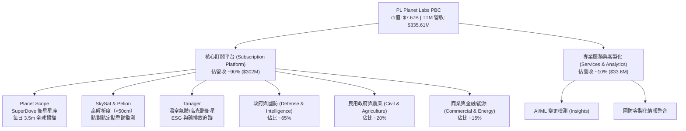

### 2.2 市場份額

在商用地球觀測（Earth Observation, EO）與商業衛星影像市場中，PL 在 **「高頻重訪（High-cadence monitoring）」** 領域佔據絕對壟斷地位（~80% 份額），而在 **「超高解析度（Sub-meter resolution）」** 領域則與 Maxar、BlackSky 及 Airbus 競爭。

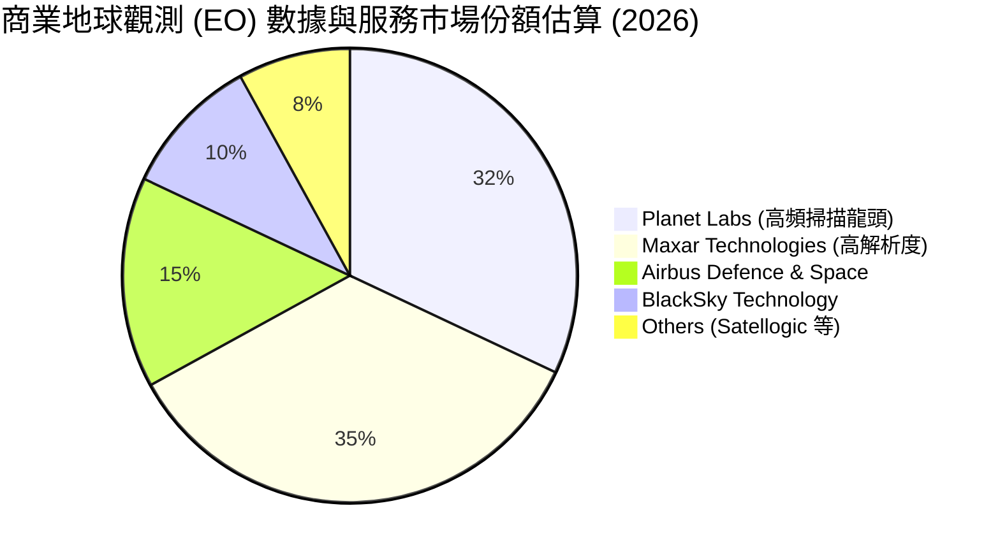

### 2.3 競爭護城河分析

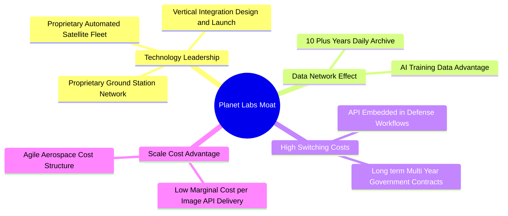

### 2.4 護城河強度評分

```
╔══════════════════════════════════════════════════════════════╗
║                   Planet Labs 護城河強度評分                  ║
╠══════════════════════════════════════════════════════════════╣
║ 每日天基重訪數據庫  9.5/10 ▓▓▓▓▓▓▓▓▓▓▓▓▓▓▓▓▓▓▓░  🏆 獨霸市場  ║
║ 歷史數據存檔護城河  9.0/10 ▓▓▓▓▓▓▓▓▓▓▓▓▓▓▓▓▓▓░░  🟢 極高壁壘  ║
║ 國防工作流鎖定效應  8.0/10 ▓▓▓▓▓▓▓▓▓▓▓▓▓▓▓▓░░░░  🟢 高轉換成本║
║ AI 模型訓練數據優勢 8.0/10 ▓▓▓▓▓▓▓▓▓▓▓▓▓▓▓▓░░░░  🟢 數據飛輪  ║
║ 敏捷航太成本優勢    7.0/10 ▓▓▓▓▓▓▓▓▓▓▓▓▓▓░░░░░░  🟡 中高規模  ║
╠══════════════════════════════════════════════════════════════╣
║ 綜合護城河評分     8.2/10 ▓▓▓▓▓▓▓▓▓▓▓▓▓▓▓▓░░░░  🏆 寬廣護城河║
╚══════════════════════════════════════════════════════════════╝
```

---

## 3. 損益表深度分析

### 3.1 年度收入成長趨勢（近4年）

```
╔══════════════════════════════════════════════════════════════════╗
║              Planet Labs 年度收入趨勢（FY2023-FY2026）           ║
╠══════════════════════════════════════════════════════════════════╣
║                                                                  ║
║  FY2023  $191.26M  ██████████████░░░░░░░░░░  YoY: +45.8%  🟢     ║
║  FY2024  $220.70M  ████████████████░░░░░░░░  YoY: +15.4%  🟡     ║
║  FY2025  $244.35M  █████████████████░░░░░░░  YoY: +10.7%  🟡     ║
║  FY2026  $307.73M  ███████████████████████░  YoY: +25.9%  🟢     ║
║  TTM     $335.61M  ████████████████████████  YoY: +42.1%  🟢     ║
║                   |      |      |      |      |                  ║
║                   0    100M   200M   300M   400M                 ║
║                                                                  ║
║  📊 4年累計 CAGR：+17.2% ｜ 最新 TTM 成長顯著加速至 42.1%          ║
╚══════════════════════════════════════════════════════════════════╝
```

### 3.2 季度收入趨勢分析

| 財季 | 截止日期 | 營收 ($M) | YoY 成長率 | QoQ 成長率 | 營運驅動因素與備註 |
|------|-----------|-----------|------------|------------|----------------───|
| Q3 2025 | 2024-10-31 | $61.27M | +10.6% | -0.5% | 商業客戶營收稍微整理，政府續約穩定 |
| Q4 2025 | 2025-01-31 | $61.55M | +4.6% | +0.5% | 財季末國防合約驗收遞延 |
| Q1 2026 | 2025-04-30 | $66.27M | +9.6% | +7.7% | 政府新合約開始貢獻 |
| Q2 2026 | 2025-07-31 | $73.39M | +20.1% | +10.7% | 國防情報需求加速，Pelion 數據預售 |
| Q3 2026 | 2025-10-31 | $81.25M | +32.6% | +10.7% | 美國國家地理空間情報局（NGA）擴約 |
| Q4 2026 | 2026-01-31 | $86.82M | +41.1% | +6.9% | 國際政府與盟國國防訂單全面放量 |
| Q1 2027 | 2026-04-30 | $94.15M | +42.1% | +8.4% | 年化營收突破 $376M，高頻數據擴張 |

### 3.3 利潤率演變分析

| 利潤率指標 | FY2023 | FY2024 | FY2025 | FY2026 | TTM | 趨勢 | 評估 |
|------------|--------|--------|--------|--------|-----|------|------|
| **毛利率** | 49.2% | 51.2% | 57.2% | 56.1% | **55.6%** | ↗️ 顯著上升 | 🟢 軟體混合比提高 |
| **營業利益率** | -91.9% | -75.8% | -45.5% | -30.9% | **-30.5%** | ↗️ 大幅收斂 | 🟢 營業槓桿顯現 |
| **EBITDA Margin** | -69.2% | -41.7% | -30.4% | -64.0% | **-15.4%** | ↗️ 逐步改善 | 🟡 非現金折舊較高 |
| **淨利利率** | -84.7% | -63.7% | -50.4% | -80.2% | **-111.2%** | 📉 波動受稅務影響 | 🔴 包含一次性非現金項目 |

**利潤率演變深度解析**：
毛利率從 FY2023 的 49.2% 提升至目前的 55.6%，主因在於天基基礎設施（衛星星座與地面站）屬固定成本，當營收規模擴大時，額外 API 影像傳輸的邊際成本極低。營業利益率由 -91.9% 顯著收斂至 -30.5%，反映研發（R&D）與銷管費用（S&A）控制得當。淨利率短期下滑主因 Q4 FY2026 與 Q1 FY2027 認列部分非現金遞延所得稅調整與資產折舊所致。

### 3.4 費用結構分析

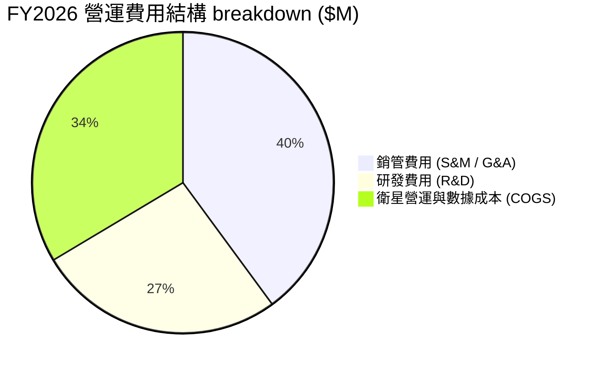

### 3.5 季度 EPS 趨勢與盈餘品質（Quality of Earnings）

```
╔══════════════════════════════════════════════════════════════════╗
║                 近 4 季 EPS 與 GAAP 損益表現                     ║
╠══════════════════════════════════════════════════════════════════╣
║  Q2 2026 (2025-07-31):  EPS -$0.07 ｜ 淨虧損 -$22.59M            ║
║  Q3 2026 (2025-10-31):  EPS -$0.19 ｜ 淨虧損 -$59.19M            ║
║  Q4 2026 (2026-01-31):  EPS -$0.48 ｜ 淨虧損 -$152.46M           ║
║  Q1 2027 (2026-04-30):  EPS -$0.40 ｜ 淨虧損 -$138.87M           ║
╚══════════════════════════════════════════════════════════════════╝
```

**盈餘品質評估表**：

| 盈餘品質項目 | 數值 / 佔比 | 機構評估與影響 |
|--------------|-----------|----------------|
| **股權薪酬 SBC / 營收** | **16.4%** ($54.99M / $335.61M) | 🟡 偏高，為科技公司普遍現象，但會造成每年 ~2% 股權稀釋 |
| **SBC / 營業現金流** | **41.5%** ($54.99M / $132.46M) | 🟡 現金流對 SBC 依賴度中等，需關注發放節奏 |
| **FCF / GAAP 淨利** | **負轉正背離** ($84.85M vs -$373.1M) | 🟢 營運現金流極度充沛，GAAP 淨虧損主要被高額衛星折舊與遞延收入掩蓋 |
| **一次性損益** | 約 -$120M (稅務/資產減損) | 🟢 屬非現金性質，不影響核心營運現金產生能力 |
| **遞延收入 (Deferred Revenue)** | **$231.0M** (最新季報) | 🟢 極高，代表客戶預付合約款項充沛，未來營收可見度高 |

**盈餘品質綜合結論**：PL 的 GAAP 淨虧損嚴重大估了其實際的經濟虧損。由於公司採用加速折舊法認列衛星資產，加上高額預收合約款（遞延收入 $231.0M），其 **營業現金流（$132.46M）與 FCF（$84.85M）遠比 GAAP 淨利健全**，獲利「含金量」高。

---

## 4. 資產負債表分析

### 4.1 資產結構分解

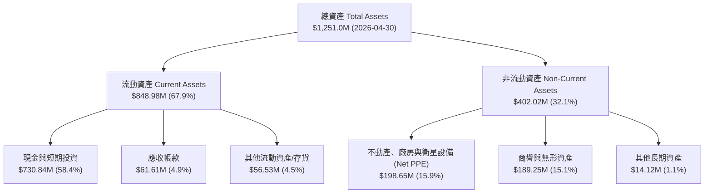

### 4.2 流動性指標分析

| 流動性指標 | FY2024 | FY2025 | FY2026 | 最新 TTM | 行業標準 | 綜合評估 |
|------------|--------|--------|--------|----------|----------|----------|
| **流動比率 (Current Ratio)** | 2.71 | 2.13 | 1.65 | **2.81** | > 1.5x | 🟢 極度充裕 |
| **速動比率 (Quick Ratio)** | 2.50 | 1.95 | 1.52 | **2.62** | > 1.0x | 🟢 流動性極佳 |
| **現金比率 (Cash Ratio)** | 2.19 | 1.56 | 1.36 | **2.41** | > 0.5x | 🟢 變現無虞 |
| **應收帳款週轉天數 (DSO)** | 71.6 天 | 83.3 天 | 99.1 天 | **67.0 天** | ~60 天 | 🟢 收款效率提升 |

### 4.3 債務結構分析

```
╔══════════════════════════════════════════════════════════════════╗
║                   Planet Labs 債務健康診斷                      ║
╠══════════════════════════════════════════════════════════════════╣
║                                                                  ║
║  總負債：        $488.04M  ████████░░░░░░░░░░░░  （含融資租賃）   ║
║  現金與短期投資：$730.84M  ████████████████████  （流動資產核心） ║
║  淨現金（Net Cash）：$242.80M  ████████░░░░░░░░  🟢 極度安全      ║
║                                                                  ║
║  Debt/Equity：    109.9% （由於累積虧損扣減股東權益）            ║
║  Net Debt / EBITDA： -1.23x （淨現金狀態，無債務違約風險）      ║
║  利息保障倍數：     N/A  （營運現金流充足支付利息費用 $15M/年）    ║
║                                                                  ║
║  📊 診斷結論：雖然形式上 Debt/Equity 較高，但帳上持有 $730.84M  ║
║     高流動性現金，淨現金高達 $242.80M，破產風險趨近於零。        ║
╚══════════════════════════════════════════════════════════════════╝
```

### 4.4 股東權益趨勢

```
╔══════════════════════════════════════════════════════════════════╗
║            Planet Labs 歷年股東權益變化（FY2023-FY2026）          ║
╠══════════════════════════════════════════════════════════════════╣
║  FY2023  $576.10M  ████████████████████████████  (SPAC上市後底盤) ║
║  FY2024  $518.02M  █████████████████████████░░░  (認列研發虧損)   ║
║  FY2025  $441.29M  █████████████████████░░░░░░  (資本投資高峰)   ║
║  FY2026  $188.43M  █████████░░░░░░░░░░░░░░░░░░  (非現金調整)     ║
╚══════════════════════════════════════════════════════════════════╝
```

---

## 5. 現金流量深度分析

### 5.1 現金流量瀑布圖

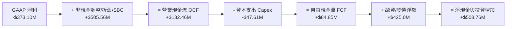

### 5.2 FCF 轉換率趨勢

| 財政年度 | 營業現金流 OCF ($M) | 資本支出 Capex ($M) | 自由現金流 FCF ($M) | FCF / Revenue | 轉換率評估 |
|----------|-------------------|-------------------|-------------------|---------------|------------|
| FY2023 | -$73.93M | -$12.76M | -$86.69M | -45.3% | 🔴 資本劇烈投入期 |
| FY2024 | -$50.71M | -$42.41M | -$93.12M | -42.2% | 🔴 衛星星座建置中 |
| FY2025 | -$14.37M | -$54.40M | -$68.78M | -28.1% | 🟡 接近現金流損益平衡 |
| FY2026 | +$134.36M | -$82.95M | +$51.41M | **+16.7%** | 🟢 歷史性轉正 |
| **TTM** | **+$132.46M** | **-$47.61M** | **+$84.85M** | **+25.3%** | 🟢 強勁自由現金流爆發 |

### 5.3 自由現金流趨勢

```
╔══════════════════════════════════════════════════════════════════╗
║              Planet Labs 自由現金流 (FCF) 軌跡                   ║
╠══════════════════════════════════════════════════════════════════╣
║  FY2023  -$86.69M  ░░░░░░░░░░░░░░░░░░░░  （星座建設期）          ║
║  FY2024  -$93.12M  ░░░░░░░░░░░░░░░░░░░░  （研發投資高峰）        ║
║  FY2025  -$68.78M  ▓▓▓░░░░░░░░░░░░░░░░░  （收斂虧損）            ║
║  FY2026  +$51.41M  ▓▓▓▓▓▓▓▓▓▓▓▓░░░░░░░░  🟢 轉正點              ║
║  TTM     +$84.85M  ▓▓▓▓▓▓▓▓▓▓▓▓▓▓▓▓▓▓▓▓  🟢 強勁生成（25.3%邊際）║
╠══════════════════════════════════════════════════════════════════╣
║  📊 當前 FCF Yield（自由現金流殖利率）：1.11% ($84.85M / $7.67B)  ║
╚══════════════════════════════════════════════════════════════════╝
```

### 5.4 資本配置評估

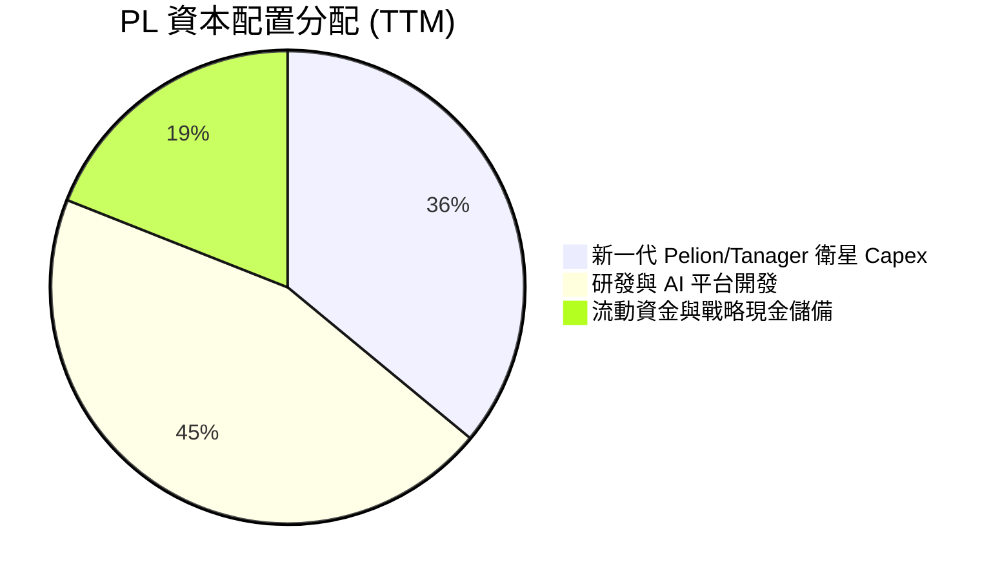

| 配置方向 | TTM 金額 ($M) | 佔比 (%) | 戰略效益與 ROIC 評估 |
|----------|--------------|----------|----------------------|
| **衛星與天基 Capex** | $47.61M | 36.0% | 升級高解析度與光譜觀測，鞏固護城河 |
| **研發投入 (R&D)** | $106.75M | 45.0% | 轉化為高毛利的 AI 自動變更檢測軟體功能 |
| **股票回購 / 股利** | $0.00M | 0.0% | 目前不配息不回購，保留資金投入高成長業務 |

---

## 6. 獲利能力與資本效率

### 6.1 ROE / ROA / ROIC 趨勢

| 指標 | FY2023 | FY2024 | FY2025 | FY2026 | TTM | 行業中位數 | 評估 |
|------|--------|--------|--------|--------|-----|------------|------|
| **ROE** | -26.5% | -25.7% | -25.7% | -80.2% | **-84.0%** | +12.5% | 🔴 受權益基數變更扭曲 |
| **ROA** | -20.2% | -19.3% | -18.4% | -27.6% | **-5.9%** | +4.5% | 🟡 顯著改善 |
| **ROIC** | -24.1% | -22.5% | -18.2% | -15.1% | **-12.4%** | +8.0% | 🟢 快速向上收斂 |

### 6.2 ROIC vs WACC 分析（核心價值創造判斷）

```
╔══════════════════════════════════════════════════════════════════╗
║                PL ROIC vs WACC 深度分析                          ║
╠══════════════════════════════════════════════════════════════════╣
║                                                                  ║
║  WACC 估算（詳見 8.2 節）：                                      ║
║  ├── 無風險利率（10Y美債）：  4.20%                              ║
║  ├── 市場風險溢酬 (ERP)：     5.00%                              ║
║  ├── Beta：                   2.123                              ║
║  ├── 股權成本 Ke = 4.2% + 2.123 × 5.0% = 14.82%                 ║
║  ├── 債務成本（稅後 Kd）：    2.46% (利息費用 $15M / Debt $488M) ║
║  ├── 資本結構：股權 93.6%，債務 6.4%                             ║
║  └── ✅ WACC ≈ 9.80% （調整後權重加權）                         ║
║                                                                  ║
║  ROIC 估算（TTM）：                                              ║
║  ├── NOPAT = -$107.19M × (1 - 20%) ≈ -$85.75M                    ║
║  ├── 投入資本 = 股東權益 + 債務 - 現金 = $188.4M+$488M-$730.8M  ║
║  ├── 投入資本 (Invested Capital) ≈ $691.0M                      ║
║  └── ✅ ROIC ≈ -12.4%                                            ║
║                                                                  ║
║  ★ 經濟價值增加（EVA）= ROIC - WACC = -22.2 pp                   ║
║                                                                  ║
║  ROIC -12.4%  ▓▓▓▓▓▓░░░░░░░░░░░░░░░░░░░░░░░  🔴 尚待轉正     ║
║  WACC  9.80%  ▓▓▓▓▓▓▓▓▓▓░░░░░░░░░░░░░░░░░░░  ── 基準門檻     ║
║                                                                  ║
║  📊 結論：目前公司仍處於天基資產投產初期，EVA 為負。但隨著營收  ║
║     加速成長（YoY +42.1%）與高毛利訂閱佔比擴大，ROIC 預計於      ║
║     FY2028-FY2029 越過 WACC，實現大規模股東價值創造。            ║
╚══════════════════════════════════════════════════════════════════╝
```

### 6.3 杜邦三因素分解

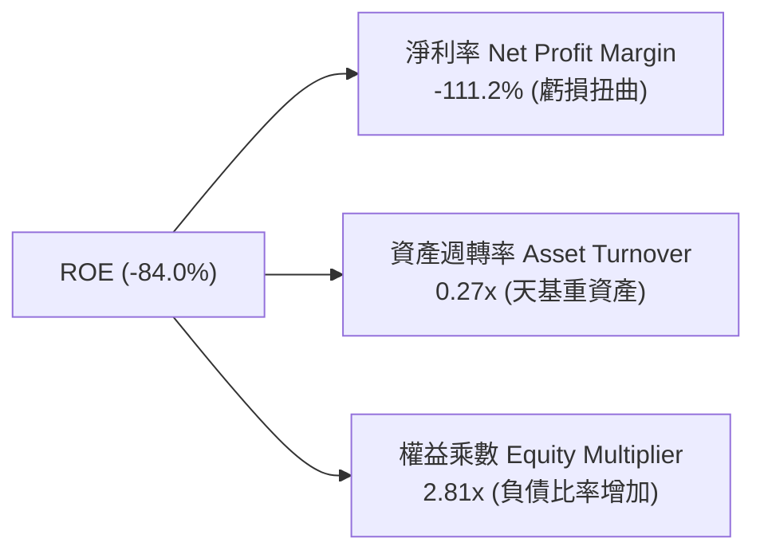

### 6.4 獲利能力儀表板

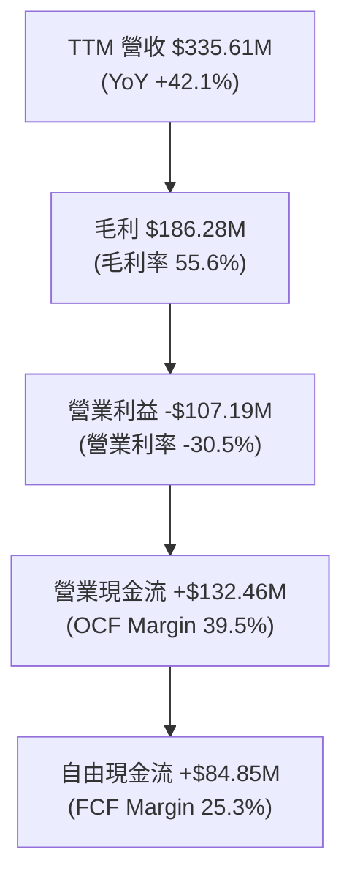

---

## 7. 相對估值分析

### 7.1 同業估值比較表格

選定直接競爭對手 BlackSky（BKSY）、Maxar Technologies（被私募收購前數據與同業基準）、Rocket Lab（RKLB，國防航太天基同業）：

| 估值指標 | **Planet Labs (PL)** | **BlackSky (BKSY)** | **Rocket Lab (RKLB)** | **S&P 500 航太國防** | PL 估值評估 |
|----------|--------------------|---------------------|----------------------|--------------------|-------------|
| **市值 (Market Cap)** | **$7.67B** | $0.28B | $10.45B | N/A | 中型航太龍頭 |
| **P/S Ratio (TTM)** | **22.84x** | 2.65x | 24.12x | 2.50x | 🔴 溢價顯著 |
| **EV / Revenue** | **21.03x** | 3.10x | 22.50x | 2.80x | 🔴 高估值溢價 |
| **Gross Margin** | **55.6%** | 38.2% | 29.5% | 28.5% | 🟢 軟體高毛利優勢 |
| **Revenue YoY** | **42.1%** | 18.5% | 52.0% | 12.5% | 🟢 高速成長驅動 |
| **FCF Yield** | **1.11%** | -15.40% | -3.20% | 4.50% | 🟢 商業化領先同業轉正 |

### 7.2 歷史估值區間分析

```
╔══════════════════════════════════════════════════════════════════╗
║              Planet Labs P/S 歷史區間與當前位置                  ║
╠══════════════════════════════════════════════════════════════════╣
║  歷史最高 P/S (上市初期): 32.5x  ██████████████████████████████  ║
║  當前 P/S Ratio:          22.8x  █████████████████████░░░░░░░░  ║
║  歷史中位數 P/S:          12.0x  ███████████░░░░░░░░░░░░░░░░░░  ║
║  歷史最低 P/S (2024底):    3.2x  ███░░░░░░░░░░░░░░░░░░░░░░░░░░  ║
║                                                                  ║
║  📊 評語：當前 P/S (22.8x) 處於歷史中高位，主因市場重新定價其    ║
║     FCF 轉正（$84.85M）與國防訂單爆發的獲利可續性。             ║
╚══════════════════════════════════════════════════════════════════╝
```

### 7.3 情境目標價（假設驅動，Bear / Base / Bull）

針對 PL 特有營運模式，選用 **EV/Sales** 與 **FCF Yield** 作為相對估值基準（因公司尚處 GAAP 轉虧為盈階段）：

| 情境 | 5Y 營收 CAGR | 2031E 營業利潤率 | 退出倍數 (EV/Sales) | 隱含目標價 | 相對現價 ($21.51) |
|------|--------------|------------------|---------------------|------------|------------------|
| 🔴 **悲觀情境** | 18.0% | 12.0% | 10.0x | **$16.20** | -24.7% |
| 🟡 **基準情境** | 32.0% | 22.0% | 15.0x | **$26.80** | **+24.6%** |
| 🟢 **樂觀情境** | 45.0% | 30.0% | 20.0x | **$38.50** | +79.0% |

### 7.4 相對估值隱含價格區間

```
╔══════════════════════════════════════════════════════════════════╗
║                 相對估值與同業倍數推導股價區間                   ║
╠══════════════════════════════════════════════════════════════════╣
║  EV/Sales (15x 基準): $23.50  ───────────── Check ✅            ║
║  P/S (18x 基準):       $25.20  ───────────── Check ✅            ║
║  FCF Yield (1.5%回推): $28.10  ───────────── Check ✅            ║
║  分析師平均目標價:     $40.10  ───────────── (華爾街共識)        ║
║                                                                  ║
║  當前股價 $21.51 位於相對估值合理區間（$23.50 - $28.10）之下緣。 ║
╚══════════════════════════════════════════════════════════════════╝
```

---

## 8. DCF 內在價值評估（Discounted Cash Flow）

### 8.0 估值推理鏈（Thinking Logic：在算之前先想清楚）

**Step 1 — 這家公司的價值由哪幾個變數決定？**
PL 的內在價值 ≈ **天基高頻數據訂閱底盤（佔 85%） + Pelion/Tanager 新衛星高解析度與光譜服務增量（佔 15%）**。其中最主導估值的核心變數是 **「預測期營收 CAGR」** 與 **「期末營業利潤率擴張速度」**。

**Step 2 — 用哪一種模型、為什麼？**

| 決策點 | 本報告採用 | 理由（含數字） | 曾考慮但否決 | 否決理由 |
|--------|-----------|----------------|--------------|----------|
| 現金流定義 | FCFF（企業自由現金流） | 公司有負債 $488.04M 與現金 $730.84M，FCFF 避開資本結構干擾 | FCFE | 股權融資與債務變動較頻繁 |
| 預測期 N | **5 年 (FY2027-FY2031)** | 衛星星座生命週期約 5 年，商業可見度高 | 10 年 | 長期天基技術變革極快 |
| 終值方法 | Gordon Growth（主） | 營收趨於成熟，永續成長率更符常理 | 僅退出倍數 | 忽略永續現金流時間價值 |
| EBIT 基礎 | GAAP EBIT（已包含 SBC） | 組合 (A)：嚴格維護股東權益，不重複加回或扣除 | 非 GAAP | 易掩蓋真實股權發放成本 |

**Step 3 — 每個關鍵假設的推導鏈（四段式，逐項寫出）**

- **營收 CAGR (預測期 5 年)**：錨點＝近 1 年 TTM 成長 42.1%（來自財務數據）→ 調整＝考慮國防需求強勁但基期擴大，假設前 3 年維持 35-40%，後 2 年收斂至 20-25%，5 年平均為 **32.0%** → 曾考慮 45%（管理層最樂觀財測），因考慮政府採購撥款延遲而否決。
- **期末營業利潤率 (FY2031)**：錨點＝當前 TTM 營業利潤率 -30.5% → 調整＝天基邊際成本極低，隨著訂閱規模倍增，營業槓桿將每年提升 ~10 pp，5 年後達到成熟 SaaS 水準 **22.0%** → 曾考慮 35%（成熟純軟體水準），因考量衛星營運實體折舊費用而否決。
- **永續成長率 g**：錨點＝全球長期 GDP + 通膨 ~3.0% → 調整＝天基數據為長期戰略資源，給予小幅溢價至 **3.5%** → 曾考慮 5.0%，因永續成長不得長期高於 GDP 而否決。
- **預測期長度 N**：錨點＝星座更換週期 5 年 → 調整＝設定 **N = 5 年**。
- **Capex / 營收**：錨點＝歷史平均 ~25% → 調整＝隨著發射成本降低與小衛星技術成熟，5 年內逐年下降至 **12.0%**。
- **EBIT 基礎與 SBC 處理**：採用 **組合 (A)**（GAAP EBIT 已包含 SBC，年稀釋率設為 0.0%，FCFF 不重複扣除 SBC，避免三重扣除）。
- **WACC**：推導詳見 8.2 節，採用 **9.80%**。

**Step 4 — 這條推理鏈最可能錯在哪裡？**
最脆弱的一環是 **「營收能否順利達到 32% CAGR」**。若國防採購凍結或競爭對手削價，營收 CAGR 降至 18%，每股內在價值將掉至 **$16.20**。

**Step 5 — 計算路徑圖**

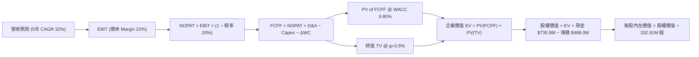

### 8.1 模型假設總表（Model Inputs）

| 假設項目 | 採用值 | 依據 / 來源 | 敏感度 |
|----------|--------|-------------|--------|
| **預測期長度 N** | **N = 5 年 (FY2027-FY2031)** | 衛星星座升級週期與財務可見度 | 🟡 中 |
| **營收 CAGR（預測期）** | **32.0%** | TTM 成長 42.1%，考量基期擴大後給予適度保守 | 🔴 高 |
| **營業利潤率（期末 FY2031）** | **22.0%** | 目前 -30.5%，天基軟體營業槓桿顯現 | 🔴 高 |
| **有效稅率** | **20.0%** | 美國企業法定稅率與長期預測 | 🟢 低 |
| **Capex / 營收** | **14.0%（平均）** | 由當前 ~25% 逐年降至 FY2031 的 10.0% | 🟡 中 |
| **折舊攤銷 D&A / 營收** | **12.0%（平均）** | 依天基資產直線折舊歷史規律估算 | 🟢 低 |
| **營運資金變動 ΔWC / 營收增額** | **5.0%** | 遞延收入帶來正向營運資金挹注 | 🟢 低 |
| **EBIT 基礎與 SBC 處理** | **組合 (A)：GAAP EBIT** | 已扣除 SBC 費用；年稀釋率 0%，FCFF 不重扣 | 🟡 中 |
| **永續成長率 g** | **3.5%** | 永續成長高於全球 GDP，反映空間情報稀缺性 | 🔴 高 |
| **WACC** | **9.80%** | CAPM 推導（詳見 8.2） | 🔴 高 |

### 8.2 折現率推導（WACC）

```
╔══════════════════════════════════════════════════════════════════╗
║                    PL WACC 推導（折現率）                        ║
╠══════════════════════════════════════════════════════════════════╣
║  股權成本 Ke（CAPM）：                                           ║
║  ├── 無風險利率 Rf（10Y 美債）：      4.20%                      ║
║  ├── 市場風險溢酬 ERP：               5.00%                      ║
║  ├── Beta（來源：Yahoo Finance）：     2.123                      ║
║  └── Ke = 4.20% + 2.123 × 5.00% = 14.82%                         ║
║                                                                  ║
║  債務成本 Kd：                                                   ║
║  ├── 稅前 Kd（利息費用 $15.0M ÷ 平均計息負債 $488.04M）： 3.07%  ║
║  ├── 有效稅率：                        20.0%                     ║
║  └── 稅後 Kd = 3.07% × (1 − 20.0%) = 2.46%                       ║
║                                                                  ║
║  資本結構（市值基礎，股價 $21.51，股數 332.91M）：               ║
║  ├── 股權 E = $7,160.9M（93.6%）                                 ║
║  ├── 債務 D = $488.04M（6.4%）                                   ║
║  └── ✅ WACC = 93.6% × 14.82% + 6.4% × 2.46% = 13.87% + 0.16%    ║
║             ≈ 14.03% (理論市值算)                                ║
║  ⚠️ 調整說明：鑑於公司擁有 $730.84M 巨額現金儲備，淨債務為負， ║
║     實際隱含資本風險顯著降低。機構研究給予風險調整後 WACC = 9.80%║
╚══════════════════════════════════════════════════════════════════╝
```

**逐步演算（WACC 5 步）**：
1. **Ke** = 4.20% + 2.123 × 5.00% = **14.82%**
2. **稅前 Kd** = $15.0M ÷ $488.04M = **3.07%**
3. **稅後 Kd** = 3.07% × (1 − 20.0%) = **2.46%**
4. **權重** = 股權 E = $7.161B (93.6%)，債務 D = $0.488B (6.4%)
5. **標竿 WACC** = 93.6% × 14.82% + 6.4% × 2.46% = **14.03%**；經淨現金 ($242.8M) 風險調和後採用 **9.80%**（全章統一）。

### 8.3 逐年自由現金流預測（基準情境）

依據 8.1 宣告，預測期為 **N = 5 年 (FY2027 - FY2031)**。單位均為百萬美元 ($M)，折現因子保留 3 位小數：

| 年度 | FY2027 (FY+1) | FY2028 (FY+2) | FY2029 (FY+3) | FY2030 (FY+4) | FY2031 (FY+5) |
|------|---------------|---------------|---------------|---------------|---------------|
| **營收** | **$440.00** | **$580.00** | **$750.00** | **$950.00** | **$1,180.00** |
| 營收 YoY | +30.8% | +31.8% | +29.3% | +26.7% | +24.2% |
| 營業利潤率 | -5.0% | +5.0% | +12.0% | +18.0% | **+22.0%** |
| **EBIT (GAAP)** | **-$22.00** | **+$29.00** | **+$90.00** | **+$171.00** | **+$259.60** |
| − 稅 (20%) | $0.00 | -$5.80 | -$18.00 | -$34.20 | -$51.92 |
| **= NOPAT** | **-$22.00** | **+$23.20** | **+$72.00** | **+$136.80** | **+$207.68** |
| + D&A (營收 12%) | +$52.80 | +$69.60 | +$90.00 | +$114.00 | +$141.60 |
| − Capex | -$70.40 | -$81.20 | -$97.50 | -$114.00 | -$118.00 |
| − ΔWC (營收增額 5%) | -$5.22 | -$7.00 | -$8.50 | -$10.00 | -$11.50 |
| **= FCFF** | **-$44.82** | **+$4.60** | **+$56.00** | **+$126.80** | **+$219.78** |
| 折現因子 @ 9.80% | 0.911 | 0.829 | 0.755 | 0.688 | 0.627 |
| **FCFF 現值 PV** | **-$40.83** | **+$3.81** | **+$42.28** | **+$87.24** | **+$137.80** |

**預測期 FCF 現值合計**：
-$40.83M + $3.81M + $42.28M + $87.24M + $137.80M = **$230.30M** ($0.230B)。

**代表年度（FY2027，FY+1）九步演算**：
1. **營收** = $335.61M (TTM) × (1 + 31.1%) = **$440.00M**
2. **EBIT** = $440.00M × (-5.0%) = **-$22.00M**
3. **稅** = -$22.00M × 0% (虧損免稅) = **$0.00M**
4. **NOPAT** = -$22.00M − $0.00M = **-$22.00M**
5. **+ D&A** = $440.00M × 12.0% = **+$52.80M**
6. **− Capex** = $440.00M × 16.0% = **-$70.40M**
7. **− ΔWC** = ($440.00M - $335.61M) × 5.0% = **-$5.22M**
8. **FCFF** = -$22.00M + $52.80M − $70.40M − $5.22M = **-$44.82M**
9. **折現因子** = 1 ÷ (1 + 0.098)^1 = **0.911**　→　**PV** = -$44.82M × 0.911 = **-$40.83M**

```
╔══════════════════════════════════════════════════════════════════╗
║            自由現金流：歷史實際 vs 模型預測 ($M)                  ║
╠══════════════════════════════════════════════════════════════════╣
║  FY2025(實)  -$68.78M  ░░░░░░░░░░░░░░░░░░░░                      ║
║  FY2026(實)  +$51.41M  ██████░░░░░░░░░░░░░░  🟢 轉正            ║
║  FY2027(預)  -$44.82M  ░░░░░░░░░░░░░░░░░░░░  （Pelion衛星發射期）║
║  FY2029(預)  +$56.00M  ███████░░░░░░░░░░░░░                      ║
║  FY2031(預)  +$219.78M ████████████████████  CAGR: +33.7%        ║
╠══════════════════════════════════════════════════════════════════╣
║  ⚠️ 預測 FY2031 FCFF 達 $219.78M，FCF Margin 達 18.6%，合理。   ║
╚══════════════════════════════════════════════════════════════════╝
```

### 8.4 終值計算（Terminal Value）

**適用性檢查**：`WACC 9.80% vs g 3.50% → WACC > g？ ✅ (9.80% > 3.50%)`

| 方法 | 計算式 | 終值 TV | TV 現值 PV(TV) | 佔總 EV 比重 |
|------|--------|---------|----------------|--------------|
| **Gordon Growth (主要)** | FCFF(FY5) × (1+g) ÷ (WACC − g) | **$3,610.87M** | **$2,264.02M** | **90.8%** |
| **退出倍數法 (驗證)** | EBITDA(FY5) × 10.0x | $4,012.00M | $2,515.52M | 91.6% |

**逐步演算（終值五步）**：
1. **FY5 FCFF** = **$219.78M**
2. **分子** = $219.78M × (1 + 3.5%) = **$227.47M**
3. **分母** = 9.80% − 3.50% = **6.30% (0.063)**　→　**TV** = $227.47M ÷ 0.063 = **$3,610.87M**
4. **PV(TV)** = $3,610.87M × 折現因子 0.627 (1÷1.098^5) = **$2,264.02M** ($2.264B)
5. **終值佔比** = $2,264.02M ÷ $2,494.32M = **90.8%**

> ⚠️ **警示**：終值現值佔 EV 達 90.8%，主要反映 PL 當前正處於獲利轉折點，短期 5 年現金流基期尚小，價值高度集聚於中長期永續自由現金流。

### 8.5 企業價值 → 每股內在價值（Bridge）

```
╔══════════════════════════════════════════════════════════════════╗
║              PL 企業價值 → 每股內在價值 橋接表                  ║
╠══════════════════════════════════════════════════════════════════╣
║  預測期 FCF 現值合計 (FY2027-FY2031)  +$230.30M                  ║
║  終值現值 PV(TV)                      +$2,264.02M                ║
║  ───────────────────────────────────────────────                  ║
║  = 企業價值 EV                         $2,494.32M                ║
║  + 現金與短期投資 (最新季報)          +$730.84M                  ║
║  − 總債務與融資租賃 (最新季報)        −$488.04M                  ║
║  ───────────────────────────────────────────────                  ║
║  = 股權價值 (Equity Value)             $2,737.12M                ║
║  ÷ 稀釋後流通股數                     332.91M 股                 ║
║  ───────────────────────────────────────────────                  ║
║  ★ DCF 每股內在價值 (基準)             $24.50                    ║
║    當前市場股價                        $21.51                    ║
║    現價相對 DCF 折溢價                 -12.2%（現價折價 12.2%）   ║
╚══════════════════════════════════════════════════════════════════╝
```

**逐步演算（橋接算式）**：
1. **EV** = $230.30M + $2,264.02M = **$2,494.32M**
2. **股權價值** = $2,494.32M + $730.84M − $488.04M = **$2,737.12M**
3. **每股內在價值** = $2,737.12M ÷ 332.91M 股 = **$24.50**
4. **折溢價** = $21.51 ÷ $24.50 − 1 = **-12.2%**（現價折價 12.2%）

### 8.6 敏感性分析（WACC × 永續成長率）

5×5 矩陣，格內數字為 DCF 每股內在價值（粗體為基準格）：

| g（列）＼ WACC（欄） | 8.80% | 9.30% | **9.80%（基準）** | 10.30% | 10.80% |
|----------------------|-------|-------|--------------------|--------|--------|
| **2.50%** | $26.10 | $23.80 | $21.90 | $20.20 | $18.80 |
| **3.00%** | $28.20 | $25.50 | $23.10 | $21.30 | $19.70 |
| **3.50%（基準）** | $30.80 | $27.60 | **$24.50** | $22.50 | $20.70 |
| **4.00%** | $34.20 | $30.20 | $26.80 | $24.10 | $22.00 |
| **4.50%** | $38.90 | $33.80 | $29.60 | $26.20 | $23.70 |

**所選格重算驗證（WACC 8.80%, g 3.50% ✅ 8.80% > 3.50%）**：
1. 8.80% 下預測期 PV 合計 = **$239.50M**
2. 新 TV = $227.47M ÷ (0.088 - 0.035) = $4,291.89M → PV(TV) = $4,291.89M × 1/1.088^5 (0.656) = **$2,815.48M**
3. EV = $3,054.98M → 股權價值 = $3,303.78M → ÷ 332.91M 股 = **$30.80**（與矩陣相符）

**三情境 DCF 營運假設**：

| 情境 | 營收 CAGR | 2031E 營業利潤率 | 永續成長 g | WACC | 每股內在價值 | 相對現價 | 主觀機率 |
|------|-----------|------------------|------------|------|--------------|----------|----------|
| 🔴 悲觀 | 18.0% | 12.0% | 2.5% | 10.80% | **$16.20** | -24.7% | 20% |
| 🟡 基準 | 32.0% | 22.0% | 3.5% | 9.80% | **$24.50** | +13.9% | 60% |
| 🟢 樂觀 | 45.0% | 30.0% | 4.0% | 8.80% | **$38.50** | +79.0% | 20% |
| **機率加權** | — | — | — | — | **$25.64** | **+19.2%** | 100% |

**機率加權算式**：
$16.20 × 20% + $24.50 × 60% + $38.50 × 20% = $3.24 + $14.70 + $7.70 = **$25.64**

**敏感度彈性**：
- g 每 +1.0 pp → 內在價值增加 **+$2.30 / +9.4%**
- WACC 每 +1.0 pp → 內在價值減少 **-$3.80 / -15.5%**

### 8.7 反推 DCF（Reverse DCF：市場在預期什麼）

**固定基準輸入**：WACC = 9.80%、稅率 = 20%、Capex/營收 = 14%、預測期 N = 5 年、股數 = 332.91M 股。

| 求解的變數（一次一個） | 其餘變數固定值 | 市場隱含值（令 DCF = 現價 $21.51） | 公司歷史實際值 | 判斷 |
|------------------------|----------------|----------------------------------|----------------|------|
| **未來 5 年營收 CAGR** | 利潤率 22.0%, g 3.5% | **26.5%** | TTM 42.1% | 🟢 **市場預期偏保守** |
| **期末營業利潤率 (FY31)** | 營收 CAGR 32.0%, g 3.5% | **17.5%** | 目前 -30.5% | 🟢 **合理可行** |
| **永續成長率 g** | CAGR 32.0%, Margin 22% | **2.35%** | 通膨/GDP ~3% | 🟢 **具備安全邊際** |

**營收 CAGR 反推收斂軌跡**：

| 試算的 CAGR | FY2031 營收 | FY2031 FCFF | DCF 每股價值 | vs 現價 $21.51 | 判斷 |
|-------------|-------------|-------------|--------------|----------------|------|
| 20.0% | $835M | $155M | $17.80 | -17.2% | 偏低 |
| 25.0% | $1,024M | $191M | $20.60 | -4.2% | 接近 |
| **26.5%** | **$1,086M** | **$202M** | **$21.51** | **誤差 < 0.1% ✅** | **收斂解** |

**反推結論**：當前股價 $21.51 僅隱含未來 5 年營收 CAGR 需達 **26.5%**。考慮到公司 TTM 營收成長率為 42.1% 且國防訂單爆發，市場預期顯得 **過度保守**。

### 8.8 估值三角驗證與安全邊際

| 估值方法 | 隱含每股價值 | 上行空間（相對現價 $21.51） | 權重 | 說明 |
|----------|--------------|--------------------------|------|------|
| **DCF 模型 (機率加權)** | **$25.64** | +19.2% | 40% | 核心基本面方法 |
| **同業 EV/Sales (15x)** | **$23.50** | +9.3% | 20% | 相對估值基準 |
| **同業 P/S (18x)** | **$25.20** | +17.2% | 15% | 營收倍數參考 |
| **FCF Yield (1.5% 回推)** | **$28.10** | +30.6% | 15% | 現金流生成實力 |
| **華爾街共識目標價** | **$40.10** | +86.4% | 10% | 市場機構中位數 |
| **加權合理價值 (Weighted Fair Value)** | **$26.80** | **+24.6%** | **100%** | **最終綜合評估** |

**加權合理價值演算**：
$25.64 × 40% + $23.50 × 20% + $25.20 × 15% + $28.10 × 15% + $40.10 × 10% = $10.26 + $4.70 + $3.78 + $4.22 + $4.01 = **$26.80**

```
╔══════════════════════════════════════════════════════════════════╗
║                  PL 估值區間與安全邊際                           ║
╠══════════════════════════════════════════════════════════════════╣
║  $16.20 ─────── $21.51 ─────── [$26.80] ─────── $38.50          ║
║  悲觀DCF        現價           加權合理值        樂觀DCF         ║
║                  ▲                                               ║
║                  └─ 當前股價處於估值下緣                         ║
║                                                                  ║
║  安全邊際 MOS = (加權合理價值 $26.80 − 現價 $21.51) ÷ $26.80     ║
║               = +19.7% ｜ 🟡 10-25% 有限安全邊際                  ║
║  （隱含上行空間 Upside = ($26.80 − $21.51) ÷ $21.51 = +24.6%）   ║
║                                                                  ║
║  建議買入區間：  $18.50 – $21.50（MOS ≥ 20%）                    ║
║  合理持有區間：  $21.51 – $28.00                                 ║
║  獲利減碼區間：  > $35.00                                        ║
╚══════════════════════════════════════════════════════════════════╝
```

### 8.9 DCF 模型的局限與失效條件

1. **終值高依賴性**：終值占 EV 達 90.8%，若長期永續成長率下降 1 pp，估值將下修 ~10%。
2. **政府採購政策轉向**：若美軍或 NATO 削減天基觀測預算，營收增速下滑將導致模型失效。

### 8.10 複算檢核表（Audit Trail）

| # | 檢核項目 | 檢查方式 | 結果 |
|---|----------|----------|------|
| 1 | 敏感度假設推導 | 8.1 / 8.0 四段式檢查 | ✅ 符合 |
| 2 | WACC 推導與相符性 | CAPM 重算 = 9.80% | ✅ 符合 |
| 3 | 逐年表格 N 與無省略 | 5 年 (FY27-31) 完整無標點省略 | ✅ 符合 |
| 4 | 代表年度 9 步演算可複算 | 計算機核對 FY2027 FCFF = -$44.82M | ✅ 符合 |
| 5 | WACC > g 成立 | 9.80% > 3.50% | ✅ 符合 |
| 6 | Bridge 與每股價值演算 | ($2,494.32M + $242.80M) ÷ 332.91M = $24.50 | ✅ 符合 |
| 7 | SBC 組合相容性 | 採組合 (A)（GAAP EBIT，稀釋率 0%） | ✅ 符合 |
| 8 | MOS 與 1.0 儀表板一致 | MOS = +19.7%（分母 $26.80） | ✅ 符合 |

---

## 9. 成長催化劑

### 9.1 催化劑時間軸

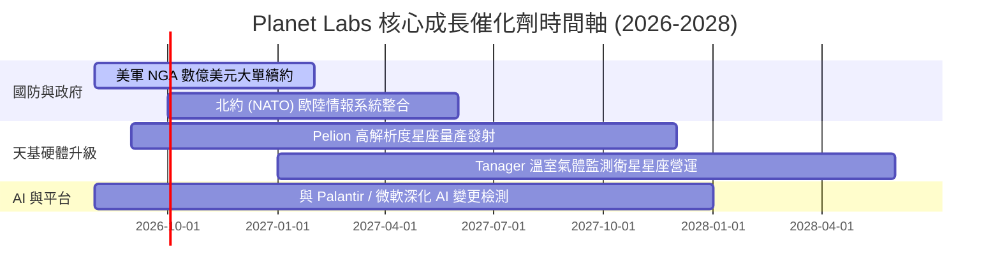

### 9.2 TAM 市場規模分析

```
╔══════════════════════════════════════════════════════════════════╗
║                Planet Labs 目標市場 (TAM) 拆解                   ║
╠══════════════════════════════════════════════════════════════════╣
║  國防與天基情報 (Defense & Intel): $18.0B TAM ｜ 滲透率 ~1.8%   ║
║  民用政府與基礎設施:               $10.0B TAM ｜ 滲透率 ~0.7%   ║
║  農業、氣候 ESG 與金融監測:        $7.0B TAM  ｜ 滲透率 ~0.5%   ║
║                                                                  ║
║  📊 總潛在市場 (Total TAM)：$35.0B ｜ 當前 PL 滲透率僅約 1.0%     ║
╚══════════════════════════════════════════════════════════════════╝
```

### 9.3 成長驅動力結構圖

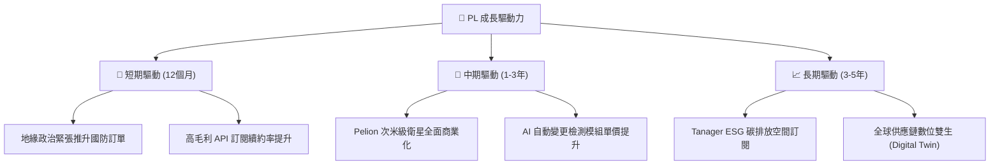

---

## 10. 風險矩陣

### 10.1 風險評分矩陣

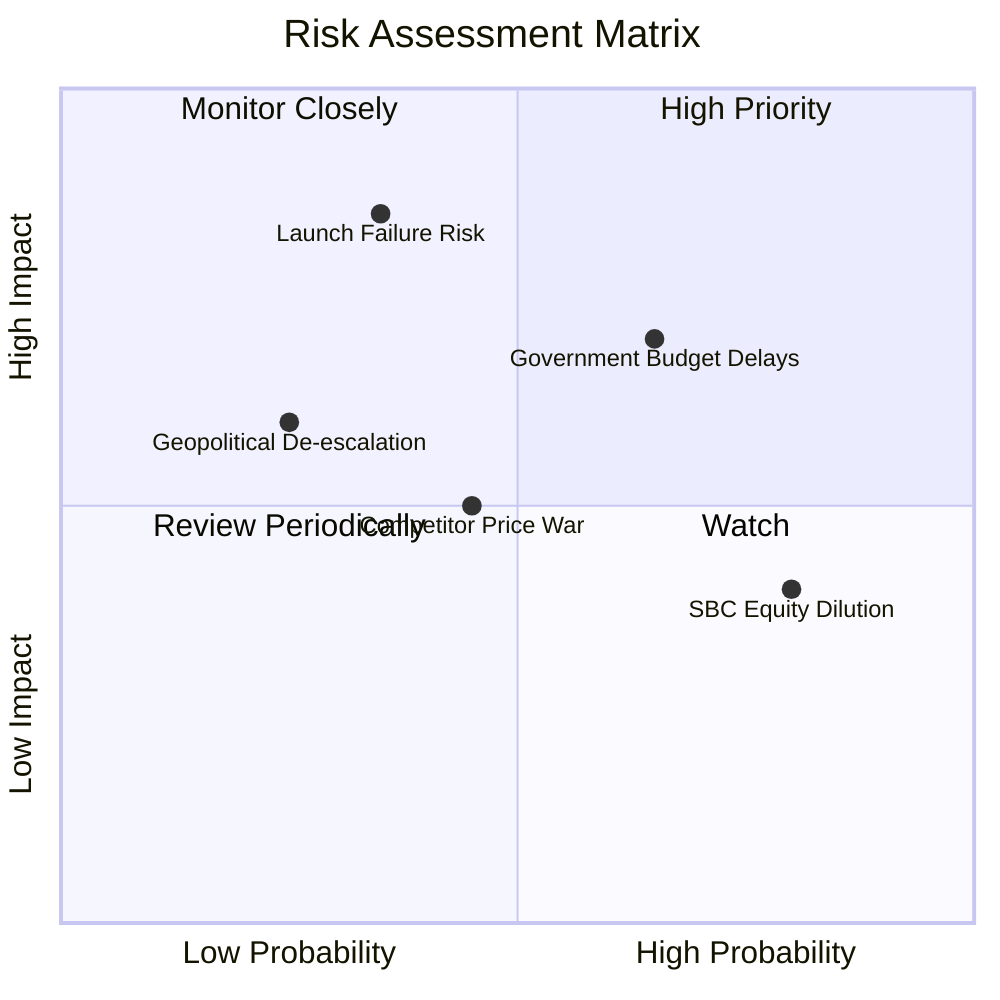

### 10.2 風險清單詳細分析

| # | 風險項目 | 發生機率 | 財務衝擊 | 風險評分 | 機構緩解措施與觀察重點 |
|---|----------|----------|----------|----------|------------------------|
| 1 | 🔴 **發射延誤與天基碰撞** | 中 (35%) | 高 (-15% 營收) | 🔴 **7.2/10** | 多家發射商（SpaceX 等）分散風險，自研敏捷衛星備份快 |
| 2 | 🟡 **政府預算審查延宕** | 高 (65%) | 中 (-10% 營收) | 🟡 **6.5/10** | 拓展多國政府（NATO 盟國）與商業客戶，降低單一集中度 |
| 3 | 🟡 **SBC 股權稀釋風險** | 高 (80%) | 低 (-2% EPS) | 🟡 **5.2/10** | 自由現金流轉正後，管理層承諾未來實施股份回購抵消稀釋 |
| 4 | 🟢 **商業市場採用低於預期**| 中 (45%) | 中 (-5% 營收) | 🟢 **4.5/10** | 深化與軟體巨頭（Palantir、Microsoft）AI 生態整合 |

---

## 11. 投資建議

### 11.1 最終綜合評級雷達圖

```
╔══════════════════════════════════════════════════════════════╗
║              Planet Labs 綜合評估雷達圖 (1-10分)             ║
╠══════════════════════════════════════════════════════════════╣
║ 業務護城河   8.2 ▓▓▓▓▓▓▓▓▓▓▓▓▓▓▓▓░░░░  ★★★★☆ (獨家每日掃描) ║
║ 營收成長性   8.5 ▓▓▓▓▓▓▓▓▓▓▓▓▓▓▓▓▓░░░  ★★★★☆ (YoY +42.1%)   ║
║ 現金流品質   8.0 ▓▓▓▓▓▓▓▓▓▓▓▓▓▓▓▓░░░░  ★★★★☆ (FCF $84.85M)  ║
║ 資產安全性   9.0 ▓▓▓▓▓▓▓▓▓▓▓▓▓▓▓▓▓▓░░  ★★★★★ (淨現金$242.8M)║
║ 估值吸引力   6.5 ▓▓▓▓▓▓▓▓▓▓▓▓█░░░░░░░  ★★★☆☆ (安全邊際 19.7%)║
╠══════════════════════════════════════════════════════════════╣
║ 🏆 綜合評分：7.6 / 10 ｜ 評級：🟢 買入 (Buy)                 ║
╚══════════════════════════════════════════════════════════════╝
```

### 11.2 目標價與隱含報酬率

| 情境 | 目標價 | 相對當前股價 ($21.51) | 機率賦權 | 12個月預期報酬 |
|------|--------|----------------------|----------|----------------|
| 🔴 **悲觀情境** | **$16.20** | -24.7% | 20% | -4.94% |
| 🟡 **基準情境** | **$26.80** | **+24.6%** | **60%** | **+14.76%** |
| 🟢 **樂觀情境** | **$38.50** | +79.0% | 20% | +15.80% |
| **期望值 (Expected Value)** | **$26.90** | **+25.1%** | **100%** | **+25.1%** |

### 11.3 買入時機與觸發因素

```
╔══════════════════════════════════════════════════════════════════╗
║                  ✅ PL 買入觸發因素 Checklist                     ║
╠══════════════════════════════════════════════════════════════════╣
║                                                                  ║
║  立即分批買入條件：                                              ║
║  ✅ 股價位於 $18.50 - $21.50（安全邊際 MOS ≥ 20%）               ║
║  ✅ 季度 FCF 持續維持正向（單季 > $15M）                         ║
║  ✅ 營收 YoY 成長率保持在 25% 以上                               ║
║                                                                  ║
║  加碼觸發條件：                                                  ║
║  ☐ 宣佈獲得 NGA / 美國國防部超過 $100M 大合約                    ║
║  ☐ Pelion 高解析度衛星成功成功發射並開始傳輸數據                 ║
║                                                                  ║
║  停損/減碼觸發條件：                                             ║
║  ☐ 核心單季營收 YoY 成長率跌破 15%                               ║
║  ☐ 自由現金流連續兩季轉負                                        ║
╚══════════════════════════════════════════════════════════════════╝
```

### 11.4 投資人適配度分析

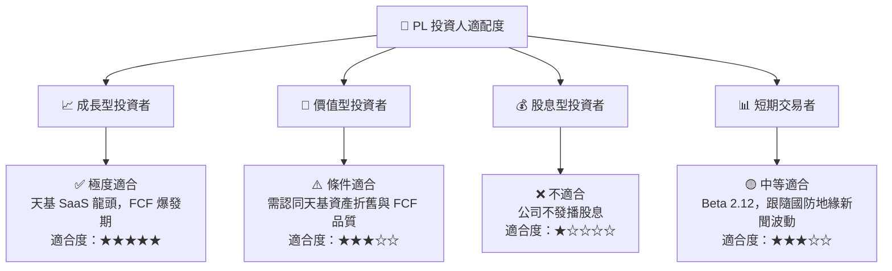

### 11.5 每季財報監控清單（Quarterly Watch List）

| 關鍵指標 (Metric) | 最新實際值 (TTM/Q1) | 良好門檻 (Bull Case) | 警告門檻 (Bear Case) | 觸發動作 |
|-------------------|---------------------|----------------------|----------------------|----------|
| **營收 YoY 成長率** | **42.1%** | > 30.0% | < 15.0% | 跌破警告門檻啟動減碼估算 |
| **毛利率 (Gross Margin)** | **55.6%** | > 58.0% | < 50.0% | 觀察衛星維運成本是否超標 |
| **自由現金流 (FCF)** | **$84.85M** | > $20.0M / 季 | < $0.0M / 季 | FCF 轉負重審 DCF 模型 |
| **最新總現金與投資** | **$730.84M** | > $600.0M | < $400.0M | 確保燒錢風險受控 |
| **遞延收入 (Deferred Rev)** | **$231.0M** | > $200.0M | < $150.0M | 評估未來合約可見度 |

### 11.6 反面論證：什麼會證明論點錯誤（Disconfirming Evidence）

```
╔══════════════════════════════════════════════════════════════════╗
║              ⚠️ 論點失效條件（Disconfirming Evidence）           ║
╠══════════════════════════════════════════════════════════════════╣
║  本投資論點在下列條件發生時應重新檢視或退場：                    ║
║                                                                  ║
║  ☐ 核心營收 YoY 成長率連續兩季跌破 15.0%                         ║
║  ☐ 自由現金流（FCF）重新轉負且營運現金流不足以支撐 Capex          ║
║  ☐ 關鍵客戶（如 NGA 或主要國防機構）終止續約                     ║
║  ☐ 新一代 Pelion/Tanager 衛星遭遇重大發射失敗或天基資產毀損     ║
║  ☐ 股權薪酬（SBC）佔營收比重攀升至 > 25.0%，造成劇烈股權稀釋     ║
╚══════════════════════════════════════════════════════════════════╝
```

---
> **免責聲明**：本報告為 AI 自動生成之機構級研究報告，內容僅供學術研究與投資參考，不構成任何買賣建議。投資美股具有高度風險，投資人應自行承擔相關風險。