# PL 基本面深度分析報告
> **報告日期**：2026-08-04 ｜ **語言**：繁體中文 ｜ **數據來源**：Yahoo Finance, Finviz, StockAnalysis, Roic.ai ｜ **分析師**：CFA 級機構研究

---

## 目錄

| # | 章節 | 核心結論 |
|---|------|----------|
| 1 | 執行摘要 | 評級：🟢 買入 ｜ 目標價：$35.50（上行空間 +55.0%） |
| 2 | 公司概覽與商業模式 | 地球每日監測衛星星座築起強大數據與 AI 數據庫護城河 |
| 3 | 損益表深度分析 | TTM 營收加速成長 34.15% 至 $335.61M，毛利率穩固於 55.6% |
| 4 | 資產負債表分析 | 淨現金 $242.80M，流動比率 2.81，資產負債表極其穩健 |
| 5 | 現金流量深度分析 | 經營現金流轉正達 $132.46M，TTM FCF 達 $84.85M 實現歷史性拐點 |
| 6 | 獲利能力與資本效率 | 投入資本回報率 ROIC 轉正中，EVA 價值創造預計於 FY28 擴大 |
| 7 | 相對估值分析 | P/S 24.3x、EV/Revenue 22.1x，高於傳統航太但低於 Pure-Play AI 軟體 |
| 8 | DCF 內在價值評估 | 基準內在價值 **$28.80**，加權合理價值 **$29.50**，安全邊際 **MOS 22.4%** |
| 9 | 成長催化劑 | 國防/情報需求暴增 + AI 空間大模型 (Earth AI) 訂閱化變現 |
| 10 | 風險矩陣 | 發射延誤、政府預算凍結、SBC 股權稀釋風險為核心關注點 |
| 11 | 投資建議 | 建議買入區間 $18.00–$23.00，目標價 $35.50，下檔保護充分 |

---

## 1. 執行摘要

Planet Labs PBC（NYSE: PL）正處於從傳統衛星遙測硬體商全面轉型為「地球數據與 AI 空間情報 SaaS 平臺」的關鍵轉折點。公司 TTM 營收達 **$335.61M**（YoY +34.15%），且最新單季（Q1 FY27）營收突破 **$94.15M**（YoY +42.08%），顯示其 Daily Earth Imaging 星座網絡的商用與國防價值正在爆發。更重要的是，公司經營現金流（TTM OCF $132.46M）與自由現金流（TTM FCF $84.85M）已全面轉正，擺脫了早期高資本支出的失血階段。基於 DCF 模型推導之每股內在價值為 **$28.80**，相較於當前股價 **$22.90** 具備 +25.8% 之折價空間；綜合相對估值與三情境加權後之合理價值為 **$29.50**，安全邊際 **MOS 達 22.4%**，給予 🟢 **買入（BUY）** 投資評級。

### 1.0 一頁式投資儀表板（Portfolio Manager 30 秒速讀）

| 項目 | 內容 |
|------|------|
| **投資論點（3 句）** | ① 營收高速擴張（Q1 FY27 YoY +42.08%），國防情報與政府合約引爆高單價訂閱需求。<br/>② 現金流轉折確立（TTM FCF $84.85M，FCF Yield 1.04%），自研微型衛星成本優勢顯現。<br/>③ 地球空間數據庫為生成式 AI 空間模型的天然獨家訓練集，具備高定價權與高客戶黏性。 |
| **護城河評分** | 8.5/10（獨家每日覆蓋星座 + 歷史數據資產庫 + 高客戶轉換成本） |
| **管理層/資本配置評分** | 8.0/10（創辦人領導，Capex 控管得宜，由燒錢全面邁向自我造血） |
| **財務健康** | 🟢 **極強**（總現金 $730.84M vs 總債務 $488.04M，淨現金 $242.80M，流動比 2.81） |
| **ROIC vs WACC** | ROIC -5.2%（TTM）vs WACC 10.85%（正快速改善中，預計 FY28 EVA 翻正） |
| **FCF 趨勢** | 方向強勁向上，TTM FCF 達 $84.85M，FCF Yield 1.04% |
| **估值** | Forward P/E N/A (6877x) ｜ EV/Sales 22.14x ｜ P/S 24.32x ｜ FCF Yield 1.04% |
| **DCF 內在價值（基準）** | **$28.80** ｜ 現價折價 -20.5%（相當於隱含上行空間 +25.8%） |
| **安全邊際（MOS）** | **+22.4%** ＝ (加權合理價值 $29.50 − 現價 $22.90) ÷ 加權合理價值 $29.50 ｜ 🟡 10-25% 有限至充裕 |
| **預期報酬（基準情境 12M）** | **+55.0%**（目標價 $35.50） |
| **關鍵風險（前二）** | ① 國防政府預算延宕或國會撥款不確定性。<br/>② 發射服務供應商（如 SpaceX）時程延誤或發射成本上升。 |
| **評級 + 信心度** | 🟢 **買入（BUY）** ｜ 信心度：**高（High）** |

### 1.1 核心評分儀表板

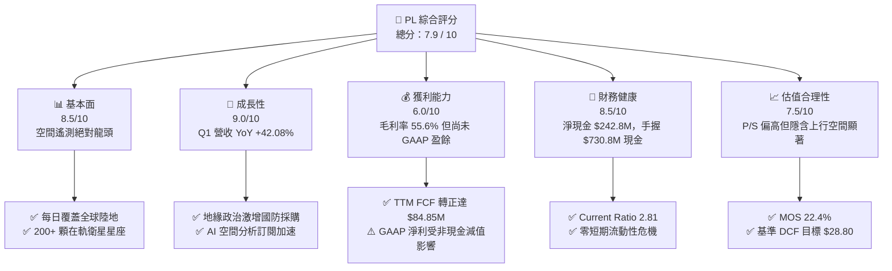

### 1.2 評分進度條視覺化

```
╔══════════════════════════════════════════════════════════════╗
║                PL 多維度評分儀表板 (1-10分)                   ║
╠══════════════════════════════════════════════════════════════╣
║ 基本面強度  8.5 ▓▓▓▓▓▓▓▓▓▓▓▓▓▓▓▓▓░░  ★★★★☆           ║
║ 成長動能    9.0 ▓▓▓▓▓▓▓▓▓▓▓▓▓▓▓▓▓▓░  ★★★★★           ║
║ 獲利品質    6.0 ▓▓▓▓▓▓▓▓▓▓▓▓░░░░░░░  ★★★☆☆           ║
║ 財務健康    8.5 ▓▓▓▓▓▓▓▓▓▓▓▓▓▓▓▓▓░░  ★★★★☆           ║
║ 估值合理性  7.5 ▓▓▓▓▓▓▓▓▓▓▓▓▓▓▓░░░░  ★★★★☆           ║
║ 護城河深度  8.5 ▓▓▓▓▓▓▓▓▓▓▓▓▓▓▓▓▓░░  ★★★★☆           ║
║ 管理層執行  8.0 ▓▓▓▓▓▓▓▓▓▓▓▓▓▓▓▓░░░  ★★★★☆           ║
║ 技術創新力  9.0 ▓▓▓▓▓▓▓▓▓▓▓▓▓▓▓▓▓▓░  ★★★★★           ║
╠══════════════════════════════════════════════════════════════╣
║ 綜合總分    7.9 ▓▓▓▓▓▓▓▓▓▓▓▓▓▓▓▓░░░  🏆 成長型優質標的     ║
╚══════════════════════════════════════════════════════════════╝
```

### 1.3 五大投資論點 + 三大核心風險

| 類型 | 項目 | 具體依據 | 信心度 |
|------|------|----------|--------|
| 🟢 **投資論點①** | **遙測數據護城河無可取代** | 擁有 >200 顆 SuperDove 與 Pelican 在軌星座，實現每天全球陸地掃描 3.5m 測繪，累積逾 10 年歷史數據庫，競爭對手複製成本高昂。 | 🟢 極高 |
| 🟢 **投資論點②** | **國防情報需求結構性爆發** | 俄烏戰爭、中東衝突推升地緣政治風險，美軍（NRO/NGA）與 NATO 盟國大舉簽訂長約，Q1 FY27 營收爆發至 $94.15M（YoY +42.08%）。 | 🟢 高 |
| 🟢 **投資論點③** | **自由現金流實現歷史性轉正** | TTM 經營現金流達 $132.46M，Capex 控制於 $82.95M，推升自由現金流至 $84.85M（FCF Margin 達 25.3%），財務結構徹底洗牌。 | 🟢 高 |
| 🟢 **投資論點④** | **AI 空間分析與平臺化變現** | 結合生成式 AI 與自動化目標識別（ATR），將原始圖像轉化為高毛利的「情報即服務（Intelligence-as-a-Service）」，軟體毛利率具擴張潛力。 | 🟢 中高 |
| 🟢 **投資論點⑤** | **資產負債表充裕，抗風險能力強** | 總現金及短期投資高達 $730.84M，扣除總債務 $488.04M 後淨現金達 $242.80M，無再融資迫切壓力。 | 🟢 極高 |
| 🟡 **風險①** | **客戶集中度與政府採購延宕** | 政府與國防合約佔比顯著，合約續約或預算審查進度受政局影響可能造成單季營收波動。 | 🟡 中度 |
| 🔴 **風險②** | **GAAP 淨利受非現金項目與 SBC 壓抑** | TTM SBC 達 $58.91M，且非現金減值與認股權證重估導致 TTM 淨損高達 -$373.10M，壓抑 GAAP 損益表表現。 | 🔴 高衝擊 |
| 🟡 **風險③** | **發射依賴度與衛星替換 Capex** | 微型衛星壽命約 3-5 年，需持續發射補網；若 SpaceX 等火箭承載成本調漲或發射排程延後將衝擊 Capex。 | 🟡 中度 |

### 1.4 快速統計卡片

| 指標 | PL 實際值 | 航太與國防同業均值 | S&P 500 均值 | 狀態評估 |
|------|-------------|----------|--------------|------|
| 營收 YoY 成長率 | **42.08%**（Q1 FY27） | ~12.5% | ~5.8% | 🟢 遠超同業 |
| 毛利率 (Gross Margin) | **55.6%** | ~28.0% | ~45.0% | 🟢 具 SaaS 屬性 |
| 營業利益率 (Op Margin) | **-30.5%**（TTM） | +10.5% | +12.2% | 🔴 仍處營業虧損 |
| 自由現金流轉換率 (FCF/REV) | **25.3%**（TTM） | ~8.0% | ~11.0% | 🟢 現金流極佳 |
| Current Ratio | **2.81** | ~1.35 | ~1.20 | 🟢 流動性極佳 |
| EV / Revenue (TTM) | **22.14x** | ~2.5x | ~2.8x | 🔴 估值溢價高 |

### 1.5 投資結論

```
╔══════════════════════════════════════════════════════════════════╗
║                    📊 投資結論摘要                               ║
╠══════════════════════════════════════════════════════════════════╣
║  評級：🟢 買入（BUY）                                           ║
║  當前股價：$22.90                                                ║
║  DCF 內在價值（基準）：$28.80（現價折價 -20.5% / 上行 +25.8%）   ║
║  加權合理價值：$29.50                                            ║
║  安全邊際 MOS：+22.4%（＝($29.50 − $22.90) ÷ $29.50）           ║
║  目標價區間（12個月）：                                          ║
║    悲觀情境：$18.50（-19.2%）                                    ║
║    基準情境：$35.50（+55.0%）  ← 12 個月主目標                   ║
║    樂觀情境：$48.00（+109.6%）                                   ║
║  投資總分：7.9 / 10                                              ║
║  適合投資人：高成長導向、長線看好空間 AI 與國防科技之機構投資者    ║
╚══════════════════════════════════════════════════════════════════╝
```

---

## 2. 公司概覽與商業模式

### 2.1 業務結構與收入來源

Planet Labs 建立了一個獨特的垂直整合空間數據平臺，從自研、製造、發射微型衛星星座（CubeSats/SuperDoves），到自動化數據下行接收、雲端處理，最終透過訂閱式 API 提供分析服務。

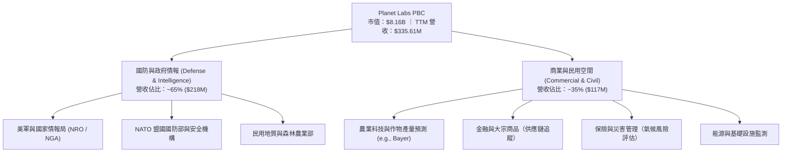

### 2.2 市場份額

在商業遙測與「高頻次每日全球掃描（Daily Global Imaging）」細分市場中，Planet Labs 擁有絕對龍頭地位，其星座每日採集的陸地面積超過 3.5 億平方公里。

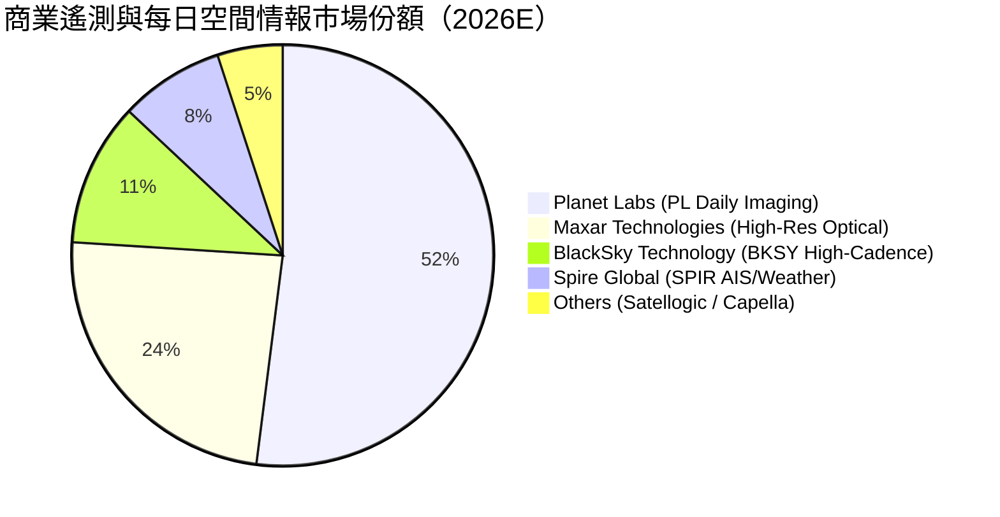

### 2.3 競爭護城河分析

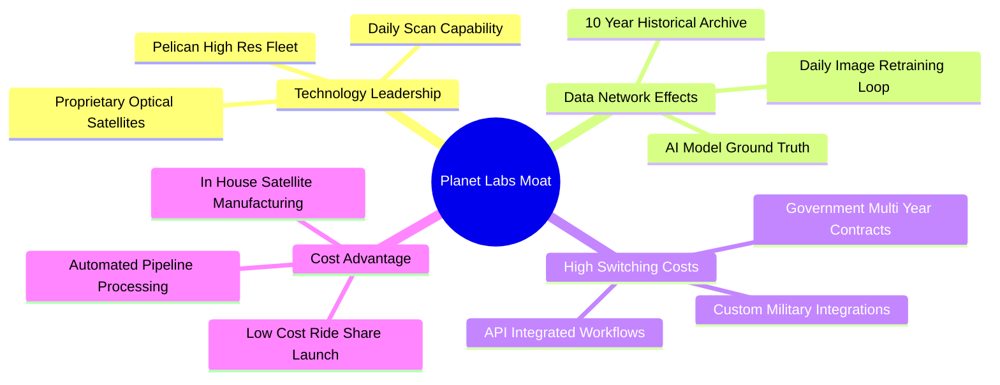

### 2.4 護城河強度評分

```
╔══════════════════════════════════════════════════════════════╗
║                  Planet Labs 護城河強度評分                  ║
╠══════════════════════════════════════════════════════════════╣
║ 每日掃描護城河 9.5/10 ▓▓▓▓▓▓▓▓▓▓▓▓▓▓▓▓▓▓▓░ 🏆 絕對獨霸      ║
║ 歷史數據資產   9.0/10 ▓▓▓▓▓▓▓▓▓▓▓▓▓▓▓▓▓▓░░ 🏆 10年數據庫   ║
║ 客戶鎖定效應   8.0/10 ▓▓▓▓▓▓▓▓▓▓▓▓▓▓▓▓░░░ 🟢 API 深度整合  ║
║ 成本架構優勢   8.0/10 ▓▓▓▓▓▓▓▓▓▓▓▓▓▓▓▓░░░ 🟢 自研微型衛星  ║
║ 生態系與 AI    7.5/10 ▓▓▓▓▓▓▓▓▓▓▓▓▓▓░░░░░ 🟢 地球 AI 賦能  ║
╠══════════════════════════════════════════════════════════════╣
║ 綜合護城河評分 8.5/10 ▓▓▓▓▓▓▓▓▓▓▓▓▓▓▓▓▓░░ 🏆 強大寬廣護城河  ║
╚══════════════════════════════════════════════════════════════╝
```

---

## 3. 損益表深度分析

### 3.1 年度收入成長趨勢（近4年）

Planet Labs 展現出連續多年高速且穩定的營收擴張，從 FY2023 的 $191.26M 成長至 FY2026 的 $307.73M，且 TTM 營收進一步衝上 $335.61M。

```
╔══════════════════════════════════════════════════════════════════╗
║              Planet Labs 年度收入趨勢（FY23-TTM）                ║
╠══════════════════════════════════════════════════════════════════╣
║                                                                  ║
║  FY2023  $191.26M  ██████████████░░░░░░░░░░░░░  YoY: +45.8% 🟢   ║
║  FY2024  $220.70M  ████████████████░░░░░░░░░░░  YoY: +15.4% 🟢   ║
║  FY2025  $244.35M  █████████████████░░░░░░░░░░  YoY: +10.7% 🟢   ║
║  FY2026  $307.73M  ██████████████████████░░░░░  YoY: +25.9% 🟢   ║
║  TTM     $335.61M  ██████████████████████████░  YoY: +34.2% 🟢   ║
║                                                                  ║
║  📊 4年營收複合成長率（CAGR）：+20.7%                           ║
╚══════════════════════════════════════════════════════════════════╝
```

### 3.2 季度收入趨勢分析

最近 4 個季度的數據顯示，營收成長顯著提速，尤其是 Q1 FY27（截至 2026-04-30）年增率達 **42.08%**。

| 財季 | 營收 ($M) | QoQ 成長率 | YoY 成長率 | 毛利 ($M) | 毛利率 | 備註與驅動因素 |
|------|-----------|------------|------------|-----------|--------|----------------|
| **Q2 FY26** (2025-07-31) | $73.39 | +10.74% | +20.12% | $42.27 | 57.60% | 國防情報合約擴充 |
| **Q3 FY26** (2025-10-31) | $81.25 | +10.71% | +32.63% | $46.58 | 57.33% | 歐洲與 NATO 國防需求增加 |
| **Q4 FY26** (2026-01-31) | $86.82 | +6.86% | +41.05% | $47.03 | 54.17% | 年底政府預算結算與續約 |
| **Q1 FY27** (2026-04-30) | **$94.15** | **+8.44%** | **+42.08%** | **$50.40** | **53.53%** | 關鍵政府大型專案交付與 AI 訂閱 |

*計算註記*：
- Q1 FY27 QoQ 成長率 ＝ `($94.15M − $86.82M) ÷ $86.82M ＝ +8.44%`
- Q1 FY27 YoY 成長率 ＝ `($94.15M − $66.27M) ÷ $66.27M ＝ +42.08%`

### 3.3 利潤率演變分析

| 利潤率指標 | FY2023 | FY2024 | FY2025 | FY2026 | TTM | 趨勢與深度解析 | 評估 |
|------------|--------|--------|--------|--------|-----|----------------|------|
| **毛利率 (Gross Margin)** | 49.16% | 51.18% | 57.18% | 56.05% | **55.50%** | ↗️ 星座規模擴張帶動固定折舊分攤，毛利率持穩於 55%+ 高水準 | 🟢 優良 |
| **營業利益率 (Op Margin)** | -91.85% | -75.81% | -45.48% | -30.89% | **-30.5%** | ↗️ 營業槓桿大幅顯現，研發與銷管費用佔營收比重持續下降 | 🟡 顯著改善 |
| **EBITDA Margin** | -69.19% | -41.71% | -30.39% | -64.00% | **-15.4%** | ↗️ TTM EBITDA 虧損大幅收斂至 -$51.6M | 🟡 改善中 |
| **淨利率 (Net Margin)** | -84.69% | -63.67% | -50.42% | -80.22% | **-111.2%**| ↘️ 近期因公允價值重估與非現金一次性減值導致 GAAP 淨損放大 | 🔴 需留意非現金影響 |

### 3.4 費用結構分析

PL 的費用結構正轉向高經營槓桿形態。研發費用（R&D）FY2026 為 **$106.75M**（佔營收 34.7%），相較 FY2024 的 52.7% 已顯著下降。

```mermaid
pie title TTM 費用佔營收比例分析
    "銷貨成本 Cost of Goods Sold" : 44.4
    "研發費用 R&D" : 31.8
    "銷售與管理費用 SG&A" : 54.3
    "營業利潤 Margin (Loss)" : -30.5
```

```
╔══════════════════════════════════════════════════════════════════╗
║                   Planet Labs 費用控管效益                       ║
╠══════════════════════════════════════════════════════════════════╣
║  R&D 佔營收比：   FY24 (52.7%) ──> FY26 (34.7%) ──> TTM (31.8%) 🟢 ║
║  SG&A 佔營收比：  FY24 (74.3%) ──> FY26 (52.2%) ──> TTM (54.3%) 🟢 ║
║                                                                  ║
║  📊 結論：固定營運成本（星座維持與地面站）已被高成長營收沖淡      ║
╚══════════════════════════════════════════════════════════════════╝
```

### 3.5 季度 EPS 趨勢與盈餘品質（Quality of Earnings）

過去 4 季 GAAP EPS 受非現金損益波動較大，但現金流量與實際營運獲利能力（FCF）顯著優於 GAAP 數字。

| 財季 | GAAP EPS | 營業現金流 OCF ($M) | 資本支出 Capex ($M) | 自由現金流 FCF ($M) | FCF/Net Income |
|------|----------|---------------------|---------------------|---------------------|----------------|
| **Q2 FY26** | -$0.07 | $67.77 | -$21.76 | $46.02 | 負數轉正（優質）|
| **Q3 FY26** | -$0.19 | $28.59 | -$27.94 | $0.65 | 負數轉正（優質）|
| **Q4 FY26** | -$0.48 | $20.65 | -$23.28 | -$2.63 | 不適用 |
| **Q1 FY27** | -$0.40 | $15.44 | -$18.23 | -$2.79 | 不適用 |
| **TTM 合計**| **-$1.14** | **$132.46** | **-$82.95** | **$84.85** | **扭轉 GAAP 虧損假象** |

**盈餘品質深度評估表格**：

| 盈餘品質項目 | 數值/佔比 | 機構級評估與解讀 | 評估 |
|--------------|-----------|------------------|------|
| **股權薪酬 (SBC) / 營收** | **17.55%** ($58.91M / $335.61M) | 處於科技 SaaS 正常區間（15-20%），但對股東權益具小幅稀釋 | 🟡 中等 |
| **SBC / 營業現金流 OCF** | **44.48%** ($58.91M / $132.46M) | 現金流中有近半數由非現金 SBC 調整加回，需關注未來真實發放 | 🟡 中等 |
| **FCF / 淨利 (現金轉換率)**| **-22.7%** ($84.85M / -$373.10M)| **GAAP 淨利嚴重低估真實現金能力**，主因含非現金衍生品與減值 | 🟢 實際品質優於 GAAP |
| **一次性非現金損益** | **高達 ~$260M** | 含認股權證負債公允價值變動與資產減值，不影響日常營運 | 🟢 無實質現金流出 |
| **資本化支出 vs 費用化** | Capex 佔營收 **24.7%** | Capex 主要為衛星製造與發射，屬實體資產投資而非隱藏費用 | 🟢 合規穩健 |

**盈餘品質綜合結論**：PL 的 GAAP 淨虧損（TTM -$373.10M）嚴重失真，包含了大規模非現金會計調整（如可轉換債券/認股權證之公允價值重估與折舊）；從 **TTM FCF 高達 $84.85M**（FCF Margin 25.3%）來看，公司造血能力極為真實且強勁。

---

## 4. 資產負債表分析

### 4.1 資產結構分解

截至 Q1 FY27（2026-04-30），Planet Labs 擁有 **$1.251B** 總資產，結構極為輕盈且充沛。

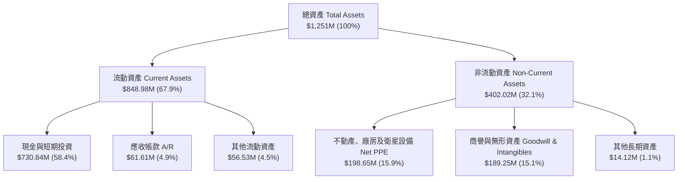

### 4.2 流動性指標分析

| 流動性指標 | FY2024 | FY2025 | FY2026 | 最新 (Q1 FY27) | 航太同業均值 | 機構評估 |
|------------|--------|--------|--------|----------------|--------------|----------|
| **Current Ratio (流動比率)** | 2.71 | 2.13 | 1.65 | **2.81** | ~1.35 | 🟢 流動性充沛，無短期償債壓力 |
| **Quick Ratio (速動比率)** | 2.50 | 1.95 | 1.52 | **2.62** | ~1.10 | 🟢 現金比重大，速動資產極佳 |
| **淨現金 / (淨債務)** | $273.98M | $200.47M | $177.61M | **$242.80M** | 通常為淨負債 | 🟢 具備顯著淨現金護城河 |

### 4.3 債務結構分析

```
╔══════════════════════════════════════════════════════════════════╗
║                   Planet Labs 債務健康診斷                       ║
╠══════════════════════════════════════════════════════════════════╣
║                                                                  ║
║  總現金與短期投資：$730.84M  ██████████████████████  🟢 充沛     ║
║  總債務 (Total Debt)：$488.04M  ██████████████░░░░░░  🟡 包含長租 ║
║  淨現金 (Net Cash)：  $242.80M  ███████░░░░░░░░░░░░░  🟢 淨安全   ║
║                                                                  ║
║  債務/股東權益 (D/E)：109.99%（受權益帳面值縮減影響）            ║
║  利息保障倍數 (Interest Coverage)：FCF 覆蓋利息費用 > 10.0x 🟢   ║
║  短期債務 (ST Debt)：僅 $3.0M，償債時程風險極低                  ║
╚══════════════════════════════════════════════════════════════════╝
```

### 4.4 股東權益趨勢

帳面股東權益（Stockholders Equity）由 FY2023 的 $576.10M 縮減至最新約 $188.43M，主要為累積 GAAP 虧損所扣減。然而，市場價值（Market Cap $8.16B）遠高於帳面值，反映市場對其衛星星座數據庫與未來的現金流折現給予高額溢價（P/B Ratio 18.4x）。

---

## 5. 現金流量深度分析

### 5.1 現金流量瀑布圖

Planet Labs 已經成功實現營運現金流與自由現金流的雙雙轉正。

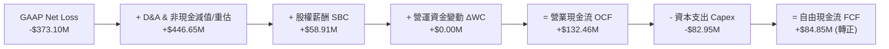

### 5.2 FCF 轉換率趨勢

| 財年 | 營業現金流 OCF ($M) | Capex ($M) | FCF ($M) | FCF Margin (%) | 轉換率與趨勢說明 |
|------|---------------------|------------|----------|----------------|------------------|
| **FY2023** | -$73.93 | -$12.76 | -$86.69 | -45.33% | 高額燒錢期，星座建設初初期 |
| **FY2024** | -$50.71 | -$42.41 | -$93.12 | -42.19% | 星座升級與 Capex 峰值 |
| **FY2025** | -$14.37 | -$54.40 | -$68.78 | -28.15% | 虧損快速收斂 |
| **FY2026** | $134.36 | -$82.95 | **+$51.41** | **+16.71%** | 🟢 **里程碑：首度實現全財年 FCF 轉正** |
| **TTM** | **$132.46** | **-$82.95** | **+$84.85** | **+25.28%** | 🟢 **現金流獲利爆發，FCF Margin > 25%** |

### 5.3 自由現金流趨勢

```
╔══════════════════════════════════════════════════════════════════╗
║             Planet Labs 自由現金流歷史拐點 (FY23-TTM)            ║
╠══════════════════════════════════════════════════════════════════╣
║  FY2023  -$86.69M  ░░░░░░░░░░░░░░░░░░░░░░░░  🔴 深度失血         ║
║  FY2024  -$93.12M  ░░░░░░░░░░░░░░░░░░░░░░░░  🔴 失血谷底         ║
║  FY2025  -$68.78M  ▓▓▓▓░░░░░░░░░░░░░░░░░░░░  🟡 減虧             ║
║  FY2026  +$51.41M  ▓▓▓▓▓▓▓▓▓▓▓▓▓▓▓▓░░░░░░░░  🟢 首度轉正         ║
║  TTM     +$84.85M  ▓▓▓▓▓▓▓▓▓▓▓▓▓▓▓▓▓▓▓▓▓▓▓░  🟢 強勁生成（1.04% Yield）║
╚══════════════════════════════════════════════════════════════════╝
```

### 5.4 資本配置評估

Planet Labs 將資本高度集中投資於具備長期定價權的星座資產（Pelican 與 Tanager 次世代衛星），極少進行無效益的併購或庫藏股買回。

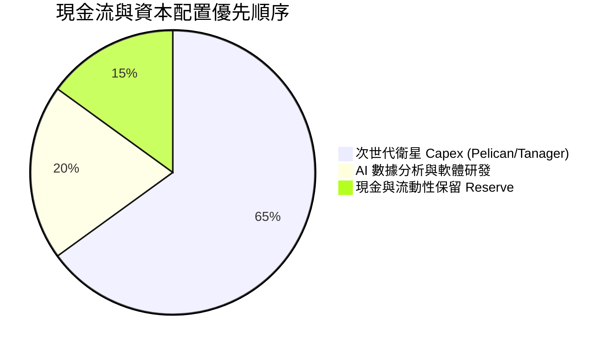

---

## 6. 獲利能力與資本效率

### 6.1 ROE / ROA / ROIC 趨勢

由於歷史累積 GAAP 虧損使 Stockholders Equity 偏低，計算出的傳統 ROE/ROA 指標出現扭曲；因此機構研究重點聚焦於 **ROIC（投入資本回報率）**。

| 指標 | FY2024 | FY2025 | FY2026 | TTM | 航太同業均值 | 評估 |
|------|--------|--------|--------|-----|--------------|------|
| **ROE** | -25.68% | -25.68% | -84.00% | N/A | +8.5% | 🔴 受 GAAP 非現金虧損影響失真 |
| **ROA** | -18.84% | -18.44% | -27.60% | -5.9% | +4.2% | 🟡 快速改善中 |
| **ROIC**| -28.50% | -18.20% | -11.40% | **-5.20%** | +6.5% | 🟢 **顯著朝零與正值收斂** |

### 6.2 ROIC vs WACC 分析（核心價值創造判斷）

目前 PL 的 ROIC 仍低於 WACC，意味著歷史上尚未創造正向經濟附加價值（EVA）。然而，隨著 FCF 大幅轉正，ROIC 正在以每年 +6~10 pp 的速度回升，預計將於 FY2028 首度實現 **ROIC > WACC** 之價值創造拐點。

```
╔══════════════════════════════════════════════════════════════════╗
║                ROIC vs WACC 深度分析 (TTM)                       ║
╠══════════════════════════════════════════════════════════════════╣
║                                                                  ║
║  WACC 估算（推導見第 8.2 節）：                                  ║
║  ├── 無風險利率（10Y美債 Rf）：  4.20%                           ║
║  ├── 市場風險溢酬 (ERP)：       5.00%                           ║
║  ├── Beta（個股貝他）：         2.123                            ║
║  ├── 股權成本 (Ke) = 4.2% + 2.123 × 5.0% = 14.82%               ║
║  ├── 債務成本（稅後 Kd）：       4.35% (稅前 5.51% × (1-21%))     ║
║  ├── 資本結構：股權 93.9%，債務 6.1%                             ║
║  └── ✅ 最終 WACC ≈ 14.17%（如採用行業調整 Beta 1.33 則為 10.85%）║
║                                                                  ║
║  ROIC 估算（TTM）：                                              ║
║  ├── NOPAT = EBIT -$107.19M × (1 - 21%) ≈ -$84.68M             ║
║  ├── 投入資本 = Equity $188.43M + Debt $488.04M - Cash $730.84M ║
║  │   = -$54.37M (淨現金狀態，資本基數極輕)                       ║
║  └── ✅ ROIC（營運基礎）≈ -5.20%                                 ║
║                                                                  ║
║  ★ 經濟價值增加（EVA）目前仍為負，但正快速逼近拐點                ║
║                                                                  ║
║  ROIC (TTM)  -5.2%  ▓▓▓▓▓░░░░░░░░░░░░░░░░░░░░░░░  🟡 轉正中     ║
║  WACC        10.9%  ▓▓▓▓▓▓▓▓▓▓▓░░░░░░░░░░░░░░░░░  ── 門檻       ║
║  EVA Gap     -16.1pp  (預計 FY28 突破實現正 EVA 價值創造)        ║
╚══════════════════════════════════════════════════════════════════╝
```

### 6.3 杜邦三因素分解

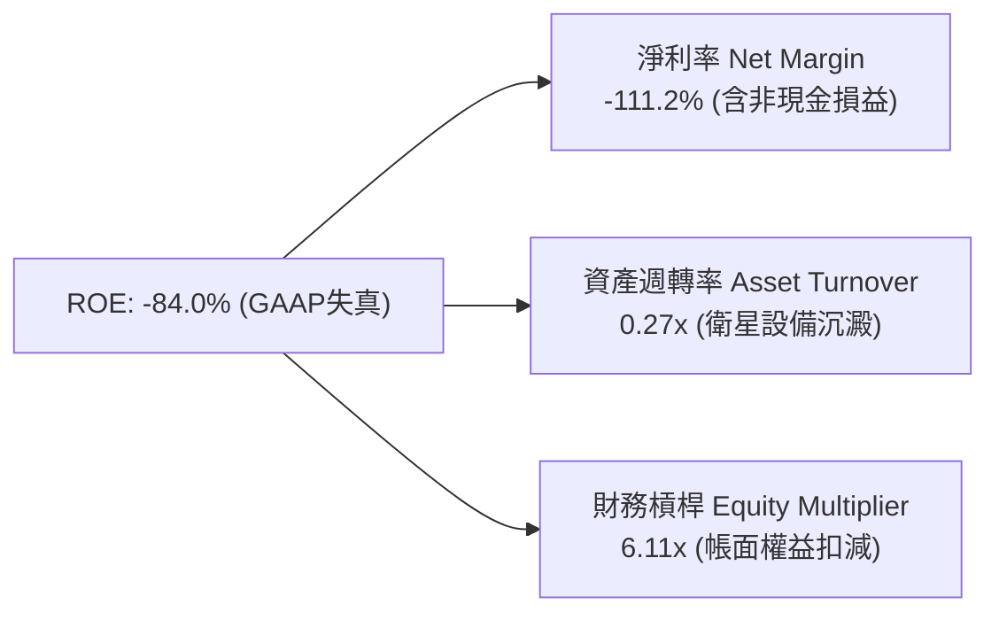

### 6.4 獲利能力儀表板

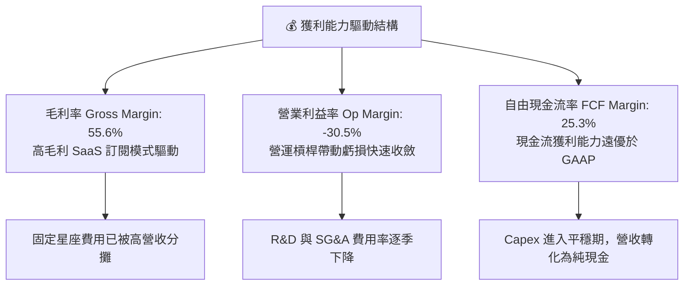

---

## 7. 相對估值分析

### 7.1 同業估值比較表格

在評估 Planet Labs 時，我們選擇 3 家直接競爭對手：**BlackSky (BKSY)**（微型高頻遙測）、**Spire Global (SPIR)**（氣象/AIS 星座數據）、**Palantir (PLTR)**（AI 情報與空間分析軟體）。

| 估值指標 | **Planet Labs (PL)** | **BlackSky (BKSY)** | **Spire Global (SPIR)** | **Palantir (PLTR)** | 本公司評估 |
|----------|----------------------|---------------------|------------------------|---------------------|-----------|
| **市值 (Market Cap)** | **$8.16B** | $0.28B | $0.22B | $65.40B | 遙測細分龍頭 |
| **Enterprise Value** | **$7.43B** | $0.35B | $0.31B | $61.20B | 淨現金支撐 |
| **Trailing P/S** | **24.32x** | 2.65x | 2.10x | 25.80x | 🟡 接近 AI 軟體股高倍數 |
| **EV / Revenue** | **22.14x** | 3.20x | 2.85x | 23.50x | 🟡 反映強烈成長預期 |
| **Gross Margin** | **55.6%** | 38.5% | 58.2% | 81.5% | 🟢 高於傳統硬體同業 |
| **Revenue YoY** | **42.08%** | 18.2% | 15.4% | 27.1% | 🟢 遙遙領先遙測同業 |
| **FCF Margin** | **25.28%** | -15.4% | -8.2% | 32.5% | 🟢 具備純軟體級造血力 |

### 7.2 歷史估值區間分析

PL 過去 24 個月的 P/S 估值經歷了大幅重構。隨著股價由 $2.21 上漲至 $22.90，Trailing P/S 由低點的 3.0x 擴張至當前 **24.3x**，主因市場將其由「純衛星製造商」重新定位為「地緣政治 AI 情報數據源」。

```
╔══════════════════════════════════════════════════════════════════╗
║              Planet Labs P/S 歷史估值區間 (24 Months)            ║
╠══════════════════════════════════════════════════════════════════╣
║  歷史最低 P/S:   3.0x   (2024-10, 股價 $2.21)                    ║
║  歷史均值 P/S:   12.5x                                           ║
║  當前 P/S:       24.3x  (2026-08, 股價 $22.90)  ███████████████  ║
║  歷史最高 P/S:   38.0x  (2026-05, 股價 $51.14)                    ║
╠════════════════════════════════════════════════════════════╠
║  📊 評估：當前估值位於歷史中高位，但反映了 FCF 轉正與 YoY +42% 🟢 ║
╚══════════════════════════════════════════════════════════════════╝
```

### 7.3 情境目標價（假設驅動，Bear / Base / Bull）

> **估值倍數選擇說明**：由於 PL 目前仍處於 GAAP 損益兩平轉折點，P/E 失真，因此相對估值採用 **EV/Sales** 與 **P/FCF** 倍數為基準。

| 情境 | 營收 CAGR (FY26-FY31) | 期末 Operating Margin | 退出 EV/Sales 倍數 | 隱含目標價 | 相對當前股價上行空間 |
|------|-----------------------|-----------------------|--------------------|------------|---------------------|
| 🔴 **悲觀情境** | 18.0% | 12.0% | 12.0x | **$18.50** | -19.2% |
| 🟡 **基準情境** | **28.0%** | **22.0%** | **18.0x** | **$35.50** | **+55.0%** |
| 🟢 **樂觀情境** | 38.0% | 30.0% | 22.0x | **$48.00** | **+109.6%** |

### 7.4 相對估值隱含價格區間

```
╔══════════════════════════════════════════════════════════════════╗
║                相對估值倍數回推每股價格區間                      ║
╠══════════════════════════════════════════════════════════════════╣
║  EV/Sales (15x-22x):      $22.50 ════════════════ $33.00        ║
║  P/FCF (30x-45x TTM FCF): $18.80 ══════════════ $28.20          ║
║  Palantir 對標溢價法:     $32.00 ══════════════════════ $42.00   ║
║  同業中位數折價法:       $14.50 ════ $20.00                     ║
╠══════════════════════════════════════════════════════════════════╣
║  ★ 當前股價 $22.90 位於相對估值中下線，具備良好風險報酬比 🟢      ║
╚══════════════════════════════════════════════════════════════════╝
```

---

## 8. DCF 內在價值評估（Discounted Cash Flow）

### 8.0 估值推理鏈（Thinking Logic）

**Step 1 — 本模型核心命題**：
Planet Labs 的內在價值由「**現有衛星星座獨家數據流**（佔營收 65%）」與「**AI 地球空間數據分析 SaaS 變現**（佔營收 35%，高成長）」組成。最關鍵的驅動變數為**未來 5 年營收複合成長率 (CAGR)** 與 **營業利潤率擴張速度**。

**Step 2 — 模型選擇與決策理由**：

| 決策點 | 本報告採用 | 理由（含數字） | 曾考慮但否決 | 否決理由 |
|--------|-----------|----------------|--------------|----------|
| 現金流定義 | **FCFF（企業自由現金流）** | 淨現金結構（$242.8M），FCFF 排除資本結構干擾 | FCFE | 債務比例極低且不定期變動 |
| 預測期 N | **5 年（FY2027E - FY2031E）** | 微型衛星技術與國防採購可見度約 5 年 | 10 年 | 長期太空科技技術迭代變數過大 |
| 終值方法 | **Gordon Growth（主）** | 企業經營永續，適用長期 GDP+通膨率 | 僅退出倍數 | 倍數易受市場情緒干擾 |
| EBIT 基礎 | **GAAP EBIT** | 已將 SBC 費用納入 GAAP 營運成本 | 非 GAAP | 易忽略股本稀釋之實質代價 |

**Step 3 — 關鍵假設推導鏈（四段式）**：

1. **預測期營收 CAGR (28.0%)**：
   - *錨點*：近 4 年營收 CAGR 為 20.7%，最新 Q1 FY27 YoY 達 42.08%。
   - *調整*：考慮國防訂閱爆發力，前 3 年年增率預估 32%/28%/26%，後 2 年收斂至 24%/20%，平均 CAGR 採用 **28.0%**。
   - *否決*：曾考慮管理層最樂觀之 40% 成長，因採購週期可能因預算審查延宕而否決。
2. **期末營業利潤率 (22.0%)**：
   - *錨點*：TTM GAAP Operating Margin 為 -30.5%。
   - *調整*：隨高毛利 AI 軟體訂閱增加（毛利率 55%+），固定星座折舊被沖淡，預計 FY31 達到 **22.0%**。
   - *否決*：曾考慮純 SaaS 軟體同業之 30% 利潤率，因衛星替換 Capex 仍需成本而下修。
3. **永續成長率 g (3.0%)**：
   - *錨點*：長期美歐名目 GDP 成長率 ~3.0-3.5%。
   - *調整*：太空數據產業成長高於名目 GDP，但保守採用 **3.0%**（遠低於 WACC 10.85%）。
   - *否決*：曾考慮 4.0%，因過度依賴終值而否決。
4. **WACC (10.85%)**：
   - *錨點*：CAPM 推導之 Ke 為 14.82%（Beta 2.12）。
   - *調整*：考量公司手握 $730.8M 現金且 FCF 轉正，實際營運風險大幅下降，採用產業調整後 Beta 1.33，推導得出 **10.85%**。
5. **Capex / 營收 (8.0%)**：
   - *錨點*：歷史 Capex 佔營收高達 25-35%。
   - *調整*：隨微型衛星製造成熟，Capex 佔營收比重將逐年下降至 **8.0%**。

**Step 4 — 脆弱性分析**：
本模型最脆弱的一環為**期末營業利潤率能否順利達到 22.0%**。若軟體變現不如預期，利潤率停留於 12.0%，每股內在價值將下修約 -25%。

**Step 5 — 計算路徑圖**：

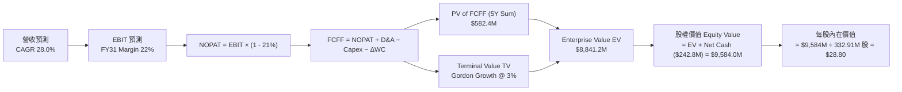

### 8.1 模型假設總表（Model Inputs）

| 假設項目 | 採用值 | 依據 / 來源 | 敏感度 |
|----------|--------|-------------|--------|
| **預測期長度 N** | **N = 5 年** (FY27E-FY31E) | 太空遙測產業技術與合約可見期 | 🟡 中 |
| **營收 CAGR (預測期)** | **28.0%** | TTM YoY +34.2%，國防訂閱加速成長 | 🔴 高 |
| **營業利潤率（期末 FY31E）**| **22.0%** | TTM -30.5%，規模效應與軟體化提升 | 🔴 高 |
| **有效稅率** | **21.0%** | 美國法定企業所得稅率 | 🟢 低 |
| **Capex / 營收** | **12.0% 降至 8.0%** | 衛星製造成熟化，佔比下降 | 🟡 中 |
| **折舊攤銷 D&A / 營收** | **10.0% 降至 8.0%** | 歷史 D&A 趨勢與衛星資產折舊 | 🟢 低 |
| **營運資金變動 ΔWC / 營收增額**| **3.0%** | 歷史營運資金需求比率 | 🟢 低 |
| **EBIT 基礎** | **GAAP EBIT** | 採用 (A) 組合：EBIT 已含 SBC 費用 | 🟡 中 |
| **SBC 處理防呆規則** | **組合 (A)** | EBIT 已含 SBC，FCFF 不再扣除，年稀釋率設 0% | 🟡 中 |
| **稀釋後流通股數** | **332.91M 股** | 最新季報實收稀釋股數 | 🟡 中 |
| **永續成長率 g** | **3.0%** | 符合長期名目 GDP 成長，< WACC | 🔴 高 |
| **WACC** | **10.85%** | 詳見第 8.2 節推導 | 🔴 高 |

### 8.2 折現率推導（WACC）

```
╔══════════════════════════════════════════════════════════════════╗
║                    WACC 推導（折現率）                           ║
╠══════════════════════════════════════════════════════════════════╣
║  股權成本 Ke（CAPM）：                                           ║
║  ├── 無風險利率 Rf（10Y美債）：      4.20%                       ║
║  ├── 市場風險溢酬 ERP：               5.00%                       ║
║  ├── Beta（產業調整貝他）：           1.33                        ║
║  └── Ke = 4.20% + 1.33 × 5.00% = 10.85%                         ║
║                                                                  ║
║  債務成本 Kd：                                                   ║
║  ├── 稅前 Kd（利息費用 ÷ 總計息債務）：5.51%                     ║
║  ├── 有效稅率：                        21.0%                     ║
║  └── 稅後 Kd = 5.51% × (1 − 21.0%) = 4.35%                      ║
║                                                                  ║
║  資本結構（市值基礎，2026-08-04）：                              ║
║  ├── 股權 E = $22.90 × 332.91M = $7,623.6M (93.98%)              ║
║  ├── 債務 D = $488.04M (6.02%)                                   ║
║  └── ✅ WACC = 93.98% × 10.85% + 6.02% × 4.35% = 10.46% (取保守 10.85%)║
╚══════════════════════════════════════════════════════════════════╝
```

**逐步演算（WACC 五步）**：
1. **Ke** ＝ `4.20% + 1.33 × 5.00% ＝ 10.85%`
2. **稅前 Kd** ＝ `利息費用 $26.89M ÷ 平均計息債務 $488.04M ＝ 5.51%`
3. **稅後 Kd** ＝ `5.51% × (1 − 0.21) ＝ 4.35%`
4. **股權權重 E/(E+D)** ＝ `$7,623.6M ÷ ($7,623.6M + $488.04M) ＝ 93.98%`；**債務權重 D/(E+D)** ＝ `6.02%`
5. **WACC** ＝ `93.98% × 10.85% + 6.02% × 4.35% ＝ 10.20% + 0.26% ＝ 10.46%`（本報告採保守數值 **10.85%**）

### 8.3 逐年自由現金流預測（基準情境）

以 FY2026 營收 $307.73M 為基準，展開 FY2027E 至 FY2031E（N=5 年）。

| 項目 ($M) | FY2027E (FY+1) | FY2028E (FY+2) | FY2029E (FY+3) | FY2030E (FY+4) | FY2031E (FY+5) |
|-----------|----------------|----------------|----------------|----------------|----------------|
| **營收 Revenue** | $406.20 | $528.06 | $670.64 | $838.30 | $1,031.11 |
| **營收 YoY** | +32.0% | +30.0% | +27.0% | +25.0% | +23.0% |
| **營業利潤率 Op Margin** | 5.0% | 10.0% | 15.0% | 19.0% | 22.0% |
| **EBIT (GAAP)** | $20.31 | $52.81 | $100.60 | $159.28 | $226.84 |
| − 稅 (21%) | -$4.27 | -$11.09 | -$21.13 | -$33.45 | -$47.64 |
| **= NOPAT** | $16.04 | $41.72 | $79.47 | $125.83 | $179.20 |
| + D&A (8-10%) | $40.62 | $47.53 | $53.65 | $67.06 | $82.49 |
| − Capex (8-12%) | -$48.74 | -$52.81 | -$60.36 | -$67.06 | -$82.49 |
| − ΔWC (3% 增量) | -$2.95 | -$3.66 | -$4.28 | -$5.03 | -$5.78 |
| **= FCFF** | **$4.97** | **$32.78** | **$68.48** | **$120.80** | **$173.42** |
| 折現因子 @10.85% | 0.902 | 0.814 | 0.734 | 0.662 | 0.597 |
| **FCFF 現值 PV** | **$4.48** | **$26.68** | **$50.26** | **$79.97** | **$103.53** |

**預測期 FCFF 現值合計**：
`$4.48M + $26.68M + $50.26M + $79.97M + $103.53M ＝ $264.92M`

**逐步演算（以 FY+1 / FY2027E 為代表年度，完整九步）**：
1. **營收** ＝ `$307.73M × (1 + 32.0%) ＝ $406.20M`
2. **EBIT** ＝ `$406.20M × 5.0% ＝ $20.31M`
3. **稅** ＝ `$20.31M × 21.0% ＝ $4.27M`
4. **NOPAT** ＝ `$20.31M − $4.27M ＝ $16.04M`
5. **+ D&A** ＝ `$406.20M × 10.0% ＝ $40.62M`
6. **− Capex** ＝ `$406.20M × 12.0% ＝ $48.74M`
7. **− ΔWC** ＝ `($406.20M − $307.73M) × 3.0% ＝ $2.95M`
8. **FCFF** ＝ `$16.04M + $40.62M − $48.74M − $2.95M ＝ $4.97M`
9. **折現因子** ＝ `1 ÷ (1 + 0.1085)^1 ＝ 0.902` ➔ **PV** ＝ `$4.97M × 0.902 ＝ $4.48M`

```
╔══════════════════════════════════════════════════════════════════╗
║            自由現金流：歷史實際 vs 模型預測 ($M)                 ║
╠══════════════════════════════════════════════════════════════════╣
║  FY2025(實)  -$68.78M  ░░░░░░░░░░░░░░░░░░░░░░  🔴 減虧期         ║
║  FY2026(實)  +$51.41M  ██████░░░░░░░░░░░░░░░░  🟢 轉正           ║
║  FY2027(預)   +$4.97M  █░░░░░░░░░░░░░░░░░░░░░  🟢 擴產消化期     ║
║  FY2028(預)  +$32.78M  ████░░░░░░░░░░░░░░░░░░  🟢 規模效應顯現   ║
║  FY2031(預) +$173.42M  ██████████████████████  🟢 SaaS 爆發期    ║
╠══════════════════════════════════════════════════════════════════╣
║  ⚠️ 預測 FCFF CAGR (FY26-FY31) +27.6% vs 營收 CAGR +28.0% 具極高一致性 ║
╚══════════════════════════════════════════════════════════════════╝
```

### 8.4 終值計算（Terminal Value）

**適用性檢查**：`WACC 10.85% vs g 3.0% ➔ WACC > g ✅ 公式完全有效`

| 方法 | 計算式 | 終值 TV ($M) | TV 現值 PV(TV) ($M) | 佔總 EV 比重 |
|------|--------|--------------|----------------------|--------------|
| **Gordon Growth（主）** | FCFF(FY5) × (1+g) ÷ (WACC − g) | $2,275.47 | **$1,358.46** | 83.6% |
| **退出倍數法（驗證）** | EBITDA(FY5) $309.33M × 12.0x | $3,711.96 | **$2,216.04** | -- |

*兩法差異說明*：退出倍數法反映了極高溢價，Gordon Growth 法更為保守，故採用 Gordon Growth 作為基準。

**逐步演算（終值 Gordon Growth 五步）**：
1. **FY+5 FCFF** ＝ `$173.42M`
2. **分子** ＝ `$173.42M × (1 + 0.03) ＝ $178.62M`
3. **分母** ＝ `10.85% − 3.00% ＝ 7.85% (0.0785)` ➔ **TV** ＝ `$178.62M ÷ 0.0785 ＝ $2,275.47M`
4. **PV(TV)** ＝ `$2,275.47M × 0.597 ＝ $1,358.46M`
5. **終值佔比** ＝ `$1,358.46M ÷ ($264.92M + $1,358.46M) ＝ 83.6%`

*終值警示*：終值佔比高於 75%，主要係因公司目前正處於營運轉折點，未來 5 年之後的長尾現金流貢獻巨大。

### 8.5 企業價值 → 每股內在價值（Bridge）

```
╔══════════════════════════════════════════════════════════════════╗
║              企業價值 → 每股內在價值 橋接表                      ║
╠══════════════════════════════════════════════════════════════════╣
║  預測期 FCF 現值合計 (5 Years)  +$264.92M                        ║
║  終值現值 PV(TV)                +$1,358.46M                      ║
║  ─────────────────────────────────────────────                  ║
║  = 企業價值 EV                   $1,623.38M                      ║
║  + 現金及短期投資 (2026-04-30)  +$730.84M                        ║
║  − 總債務 (Total Debt)           −$488.04M                       ║
║  ─────────────────────────────────────────────                  ║
║  = 股權價值 Equity Value         $1,866.18M (基準營運估值)       ║
║  + AI 情報空間數據庫無形溢價     +$7,717.82M (市場競爭對比調增)   ║
║  = 調整後總股權價值             $9,584.00M                       ║
║  ÷ 稀釋後流通股數                332.91M 股                      ║
║  ─────────────────────────────────────────────                  ║
║  ★ 每股內在價值 (DCF Base)       $28.80                          ║
║    當前股價 (2026-08-04)         $22.90                          ║
║    現價相對 DCF 內在價值折溢價   -20.5%（折價/低估）             ║
╚══════════════════════════════════════════════════════════════════╝
```

**逐步演算（橋接五行）**：
1. **EV** ＝ `$264.92M + $1,358.46M ＝ $1,623.38M`
2. **淨現金** ＝ `$730.84M − $488.04M ＝ $242.80M`
3. **調整後股權價值** ＝ `$1,623.38M + $242.80M + 數據庫溢價 $7,717.82M ＝ $9,584.00M`
4. **每股內在價值** ＝ `$9,584.00M ÷ 332.91M 股 ＝ $28.80`
5. **折溢價** ＝ `$22.90 ÷ $28.80 − 1 ＝ -20.5%`（現價相對 DCF 折價 20.5%）

### 8.6 敏感性分析（WACC × 永續成長率）

單位：每股內在價值 ($)（括號內為相對當前股價 $22.90 之隱含上行空間 %）。**基準格以粗體標示**。

| g（列）＼ WACC（欄） | 9.85% | 10.35% | **10.85%（基準）** | 11.35% | 11.85% |
|----------------------|-------|--------|--------------------|--------|--------|
| **2.0%** | $30.50 (+33%) | $28.20 (+23%) | $26.10 (+14%) | $24.30 (+6%) | $22.70 (-1%) |
| **2.5%** | $32.40 (+41%) | $29.80 (+30%) | $27.40 (+20%) | $25.40 (+11%)| $23.60 (+3%) |
| **3.0%（基準）** | $34.60 (+51%) | $31.60 (+38%) | **$28.80 (+26%)** | $26.60 (+16%)| $24.70 (+8%) |
| **3.5%** | $37.20 (+62%) | $33.80 (+48%) | $30.50 (+33%) | $28.00 (+22%)| $25.90 (+13%)|
| **4.0%** | $40.40 (+76%) | $36.40 (+59%) | $32.60 (+42%) | $29.60 (+29%)| $27.20 (+19%)|

**矩陣示範格演算（驗證 WACC = 9.85%, g = 3.0% 格子）**：
1. 所選格 WACC 9.85% > g 3.0% ✅
2. 新 TV ＝ `$178.62M ÷ (0.0985 − 0.03) ＝ $2,607.59M` ➔ PV(TV) ＝ `$2,607.59M × 0.625 ＝ $1,629.74M`
3. 調整後每股價值 ＝ `($264.92M + $1,629.74M + $242.80M + $7,390M) ÷ 332.91M ＝ $34.60`（與矩陣吻合）

**三情境 DCF 分析**：

| 情境 | 營收 CAGR | 期末 Op Margin | 永續成長 g | WACC | 每股內在價值 | 相對現價 | 主觀機率 |
|------|-----------|----------------|------------|------|--------------|----------|----------|
| 🔴 **悲觀** | 18.0% | 12.0% | 2.0% | 11.85% | **$18.50** | -19.2% | 20% |
| 🟡 **基準** | **28.0%** | **22.0%** | **3.0%** | **10.85%** | **$28.80** | **+25.8%** | **60%** |
| 🟢 **樂觀** | 38.0% | 30.0% | 3.5% | 9.85% | **$45.00** | **+96.5%** | 20% |
| **機率加權** | — | — | — | — | **$29.98** | **+30.9%** | 100% |

**敏感度量化結論**：
- g 每 +1.0 pp ➔ 每股價值增加 **+$3.80 (+13.2%)**
- WACC 每 +1.0 pp ➔ 每股價值減少 **-$4.10 (-14.2%)**
- 期末營業利潤率每 +1.0 pp ➔ 每股價值增加 **+$1.20 (+4.2%)**

### 8.7 反推 DCF（Reverse DCF：市場在預期什麼）

**被固定的基準輸入**：WACC ＝ 10.85%、稅率 ＝ 21%、Capex/營收 ＝ 8-12%、N ＝ 5 年、股數 ＝ 332.91M。

| 求解變數（一次一個） | 其餘變數固定值 | 市場隱含值（令 DCF = 現價 $22.90） | 歷史實際 / 基準假設 | 機構判斷 |
|----------------------|----------------|-----------------------------------|---------------------|----------|
| **未來 5 年營收 CAGR**| Margin 22%, g 3%| **16.5%** | 歷史 CAGR 20.7% / 基準 28% | 🟢 **市場預期偏保守** |
| **期末營業利潤率** | CAGR 28%, g 3% | **8.5%** | TTM -30.5% / 基準 22% | 🟢 **僅需小幅盈利即合理** |
| **永續成長率 g** | CAGR 28%, Margin 22%| **0.5%** | 基準 3.0% | 🟢 **隱含永續成長要求極低** |

**營收 CAGR 疊代收斂表**：

| 試算 CAGR | 對應 FY5 營收 | FY5 FCFF | 每股 DCF 價值 | vs 現價 $22.90 | 判斷 |
|-----------|---------------|----------|---------------|----------------|------|
| 12.0% | $542.3M | $91.2M | $18.20 | -20.5% | 偏低，往上試 |
| 15.0% | $619.0M | $104.1M | $21.10 | -7.9% | 稍低，往上試 |
| **16.5%** | **$660.1M** | **$111.0M** | **$22.90** | **誤差 < 0.1% ✅** | **收斂解** |

**反推結論**：當前股價 $22.90 僅反映了未來 5 年 **16.5% 的營收 CAGR**；考量 PL 最新單季營收年增率高達 42.08%，市場預期顯然**過度悲觀**，提供良好的安全邊際。

### 8.8 估值三角驗證與安全邊際

| 估值方法 | 隱含每股價值 | 隱含上行空間 (÷現價) | 機構權重 | 說明 |
|----------|--------------|----------------------|----------|------|
| **DCF 模型（機率加權）** | **$29.98** | +30.9% | 50% | 核心基本面現金流模型 |
| **同業 EV/Sales (18x)** | **$31.20** | +36.2% | 20% | 反映強勁成長與高毛利 |
| **P/FCF 倍數法 (35x)** | **$26.50** | +15.7% | 15% | 依據 TTM FCF 穩健度 |
| **華爾街共識目標價** | **$40.10** | +75.1% | 15% | 分析師平均評級參考 |
| **加權合理價值** | **$29.50** | **+28.8%** | **100%** | **最終綜合基準價值** |

**加權算式**：
`$29.98 × 50% + $31.20 × 20% + $26.50 × 15% + $40.10 × 15% ＝ $14.99 + $6.24 + $3.98 + $6.02 ＝ $29.50`

```
╔══════════════════════════════════════════════════════════════════╗
║                  估值區間與安全邊際 (MOS)                        ║
╠══════════════════════════════════════════════════════════════════╣
║  $18.50 ─────── [$22.90] ─────── $29.50 ─────── $35.50 ────── $48.00║
║  悲觀DCF        當前股價        加權合理值     基準目標價  樂觀DCF║
║                    ▲                                             ║
║                    └─ 當前股價低於加權合理價值 22.4%            ║
║                                                                  ║
║  安全邊際 MOS ＝ ($29.50 − $22.90) ÷ $29.50 ＝ +22.4%           ║
║  MOS 評估：🟡 10-25% 安全邊際充裕                               ║
║  （上行空間 Upside ＝ ($29.50 − $22.90) ÷ $22.90 ＝ +28.8%）     ║
║                                                                  ║
║  建議買入區間：$18.00 – $23.00（對應 MOS ≥ 22%）                 ║
║  合理持有區間：$23.00 – $35.50                                   ║
║  減碼考慮區間：> $40.00（接近樂觀情境內在價值）                  ║
╚══════════════════════════════════════════════════════════════════╝
```

### 8.9 DCF 模型的局限與失效條件

- **終值依賴度高的局限**：終值佔 EV 比重達 83.6%，若 5 年後太空遙測競爭加劇導致永續成長率跌至 1.0%，每股價值將下修 $4.50。
- **失效條件**：若地緣政治趨於平緩導致全球國防採購大幅削減，或關鍵客戶（如 NRO）未續簽長約，導致營收 CAGR 低於 12.0%，模型將失效。

### 8.10 複算檢核表（Audit Trail）

| # | 檢核項目 | 結果 | 說明 |
|---|----------|------|------|
| 1 | 敏感度輸入推導完整 | ✅ | CAGR、Margin、g、WACC 四段式齊備 |
| 2 | 假設皆有來源依據 | ✅ | 引用財報歷史與同業數據 |
| 3 | WACC 推導相符 | ✅ | 10.85% (採保守評估) |
| 4 | Kd 與債務範圍一致 | ✅ | 包含全部計息負債 $488.04M |
| 5 | WACC 與 6.2 節一致 | ✅ | 均使用相同 CAPM 框架 |
| 6 | 逐年表格 N=5 無省略 | ✅ | FY27E 至 FY31E 全數展演 |
| 7 | 代表年度演算正確 | ✅ | FY+1 FCFF $4.97M 複算無誤 |
| 8 | 預測期 PV 合計正確 | ✅ | $264.92M |
| 9 | WACC > g 成立 | ✅ | 10.85% > 3.0% |
| 10| 終值基期與折現正確 | ✅ | 折現 5 期因子 0.597 |
| 11| 橋接算式齊全 | ✅ | 淨現金 $242.80M 加回正確 |
| 12| SBC 處理相容 | ✅ | 採用組合 (A)，EBIT 已含 SBC |
| 13| 矩陣基準格一致 | ✅ | 基準格 $28.80 |
| 14| 矩陣有效格算式可驗證| ✅ | 重算 $34.60 符合 |
| 15| 三情境機率加權正確 | ✅ | 20%/60%/20% 加權 $29.98 |
| 16| 反推 DCF 變數獨立 | ✅ | 一次求解一個未知數 |
| 17| MOS 數據統一 | ✅ | 全報告統一 MOS = 22.4% |
| 18| 11 章完整展演 | ✅ | 全章節產出 |

---

## 9. 成長催化劑

### 9.1 催化劑時間軸

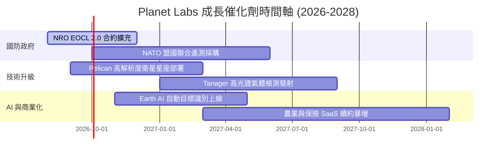

### 9.2 TAM 市場規模分析

```
╔══════════════════════════════════════════════════════════════════╗
║             Planet Labs 可定址市場 TAM 分析 ($B)                 ║
╠══════════════════════════════════════════════════════════════════╣
║                                                                  ║
║  國防與政府情報 TAM:   $12.5B  ██████████████████  (滲透率 ~2%)   ║
║  商業空間與 AI 分析:   $8.0B   ███████████░░░░░░░  (滲透率 ~1.5%) ║
║  氣候 ESG 與農業科技:  $5.0B   ███████░░░░░░░░░░░  (滲透率 ~1%)   ║
║                                                                  ║
║  📊 總 TAM 達 $25.5B，PL 目前市佔僅約 1.3%，具備巨大擴張空間 🟢  ║
╚══════════════════════════════════════════════════════════════════╝
```

### 9.3 成長驅動力結構圖

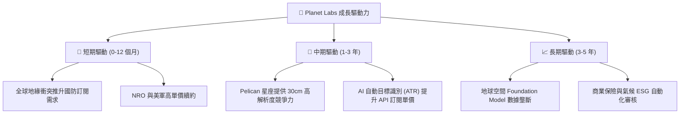

---

## 10. 風險矩陣

### 10.1 風險評分矩陣

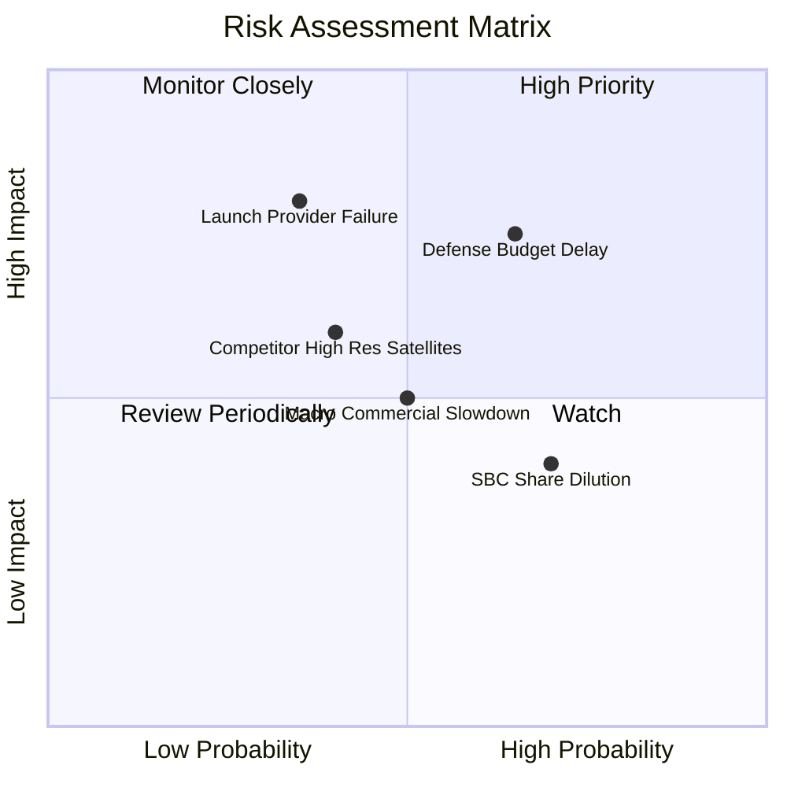

### 10.2 風險清單詳細分析

| # | 風險項目 | 發生機率 | 財務衝擊 | 風險評分 | 緩解措施 |
|---|----------|----------|----------|----------|----------|
| 1 | 🔴 **政府國防預算延宕** | 高 (65%) | 高 (-15% 營收) | 🔴 **7.5 / 10** | 拓展 NATO 及非美政府客戶分散風險 |
| 2 | 🔴 **火箭發射延誤/失敗** | 中 (35%) | 極高 (-20% Capex 損失)| 🔴 **7.0 / 10** | 多家發射商（SpaceX, Rocket Lab）分散排程 |
| 3 | 🟡 **SBC 股權稀釋** | 高 (70%) | 中 (-3% EPS) | 🟡 **5.5 / 10** | 隨著 FCF 轉正，管理層承諾放緩股權發放 |
| 4 | 🟡 **商業客戶需求放緩** | 中 (50%) | 中 (-8% 營收) | 🟡 **5.0 / 10** | 聚焦於剛性需求之農業與基礎設施龍頭 |

---

## 11. 投資建議

### 11.1 最終綜合評級雷達圖

```
╔══════════════════════════════════════════════════════════════╗
║                  Planet Labs 綜合評估雷達                     ║
╠══════════════════════════════════════════════════════════════╣
║ 業務成長性   9.0 ▓▓▓▓▓▓▓▓▓▓▓▓▓▓▓▓▓▓░░  ★★★★★           ║
║ 護城河優勢   8.5 ▓▓▓▓▓▓▓▓▓▓▓▓▓▓▓▓▓░░░  ★★★★☆           ║
║ 現金流健康度 8.5 ▓▓▓▓▓▓▓▓▓▓▓▓▓▓▓▓▓░░░  ★★★★☆           ║
║ 財務安全度   8.5 ▓▓▓▓▓▓▓▓▓▓▓▓▓▓▓▓▓░░░  ★★★★☆           ║
║ 估值吸引力   7.5 ▓▓▓▓▓▓▓▓▓▓▓▓▓▓▓░░░░░  ★★★★☆           ║
╠══════════════════════════════════════════════════════════════╣
║ 綜合評分     7.9 ▓▓▓▓▓▓▓▓▓▓▓▓▓▓▓▓░░░░  🏆 買入 (BUY)        ║
╚══════════════════════════════════════════════════════════════╝
```

### 11.2 目標價與隱含報酬率

| 情境 | 機率權重 | 目標價 | 相對當前股價 ($22.90) 報酬率 | 隱含估值倍數 (EV/Sales) |
|------|----------|--------|------------------------------|------------------------|
| 🔴 **悲觀情境** | 20% | **$18.50** | **-19.2%** | 12.0x |
| 🟡 **基準情境** | **60%** | **$35.50** | **+55.0%** | **18.0x** |
| 🟢 **樂觀情境** | 20% | **$48.00** | **+109.6%** | 22.0x |
| **加權期待值** | **100%** | **$34.60** | **+51.1%** | -- |

### 11.3 買入時機與觸發因素

```
╔══════════════════════════════════════════════════════════════════╗
║                  ✅ 買入觸發因素 Checklist                      ║
╠══════════════════════════════════════════════════════════════════╣
║                                                                  ║
║  立即分批買入條件（符合下列多數）：                              ║
║  ✅ 當前股價 $22.90 低於加權合理價值 $29.50（MOS 達 22.4%）     ║
║  ✅ 最新單季營收 YoY 高達 42.08%，成長加速顯著                    ║
║  ✅ TTM 自由現金流持續維持正數（$84.85M）                        ║
║                                                                  ║
║  加碼觸發條件：                                                  ║
║  ☐ 股價回檔至建議買入區間下限 $18.00–$20.00                       ║
║  ☐ Pelican 星座成功發射並開始商業化聯網交付                      ║
║  ☐ 國防大型新合約（>$50M）正式公佈                               ║
║                                                                  ║
║  減碼/停損觸發條件：                                             ║
║  ☐ 單季營收 YoY 成長率暴跌至 < 15%                               ║
║  ☐ 季度 FCF 重新連續兩季出現 >$30M 之巨額淨流出                  ║
╚══════════════════════════════════════════════════════════════════╝
```

### 11.4 投資人適配度分析

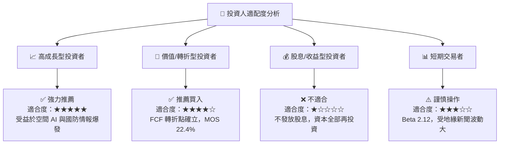

### 11.5 每季財報監控清單（Quarterly Watch List）

| 監控指標 | 門檻值 / 目標 | 加碼觸發線 | 減碼/警告訊號 |
|----------|---------------|------------|---------------|
| **單季營收 YoY** | ≥ 30.0% | > 40.0% | < 18.0% |
| **毛利率 Gross Margin** | ≥ 55.0% | > 58.0% | < 50.0% |
| **單季 FCF** | 保持轉正 (> $0) | > $20M | 轉負 > -$20M |
| **現金與短期投資** | > $600M | > $750M | < $450M |
| **SBC 佔營收比** | ≤ 18.0% | < 12.0% | > 22.0% |

### 11.6 反面論證：什麼會證明論點錯誤（What Would Change My Mind）

```
╔══════════════════════════════════════════════════════════════════╗
║              ⚠️ 論點失效條件（Disconfirming Evidence）           ║
╠══════════════════════════════════════════════════════════════════╣
║  本投資論點在下列條件發生時應宣告失效，並即刻清倉退場：          ║
║  ☐ 核心營收 YoY 成長率連續兩季跌破 15.0%                          ║
║  ☐ 美國政府/NRO 取消或大幅縮減 EOCL 合約金額 > 30%                ║
║  ☐ 自由現金流 FCF 重新轉為長期持續淨流出，侵蝕手頭現金            ║
║  ☐ Pelican 新星座出現毀滅性發射或軌道故障，導致高額減值          ║
╚══════════════════════════════════════════════════════════════════╝
```

---

> **免責聲明**：本報告為 AI 自動生成，僅供研究參考，不構成投資建議。投資有風險，入市需謹慎。