# PL 基本面深度分析報告
> **報告日期**：2026-08-10 ｜ **語言**：繁體中文 ｜ **數據來源**：Yahoo Finance, Finviz, StockAnalysis, Roic.ai ｜ **分析師**：CFA 級機構研究

---

## 目錄

| # | 章節 | 核心結論 |
|---|------|----------|
| 1 | 執行摘要 | 評級：🟡 持有（偏向買入）｜ 加權合理價值：$28.50 ｜ MOS：+17.1% |
| 2 | 公司概覽與商業模式 | 全球獨家每日地球掃描衛星星座，打造高壁壘遙測資料生態 |
| 3 | 損益表深度分析 | TTM 營收成長加速至 42.1%，毛利率升至 55.6%，營運槓桿逐步顯現 |
| 4 | 資產負債表分析 | 總現金 $7.31億，淨現金 $2.43億，流動比率 2.81，防禦韌性極佳 |
| 5 | 現金流量深度分析 | 現金流結構性轉正，TTM OCF $1.32億，TTM FCF $8,485萬 |
| 6 | 獲利能力與資本效率 | EVA +1.17pp 迎來價值創造拐點，ROE 隨營收規模擴張大幅改善 |
| 7 | 相對估值分析 | P/S 25.09x 高於同業，反應國防 AI 與高解析度衛星（Pelican/Tanager）溢價 |
| 8 | DCF 內在價值評估 | 基準 DCF $20.20 ｜ 加權合理價值 $28.50 ｜ 安全邊際 MOS +17.1% ｜ 上行空間 +20.7% |
| 9 | 成長催化劑 | Pelican 高解析度衛星發射、高光譜 Tanager 商業化與 NATO 國防訂單 |
| 10 | 風險矩陣 | 衛星發射延誤、國防預算轉向與資本支出持續高企為主要風險 |
| 11 | 投資建議 | 建議買入區間 $18.50–$22.00，目標價 $28.50，建立每季追蹤指標 |

---

## 1. 執行摘要

Planet Labs PBC（NYSE: PL）作為全球衛星遙測（Geospatial Intelligence）龍頭，正處於從傳統衛星影像供應商跨越至「國防 AI 地理空間情報平台」的轉型臨界點。依據最新的財務數據，PL TTM 營收達 $3.3561 億（YoY +42.1%），更重要的是其營運現金流（TTM OCF $1.3246 億）與自由現金流（TTM FCF $8,485 萬，FCF Yield 1.01%）已連續數季轉正，打破了傳統航太衛星公司持續失血的魔咒。基於 WACC 12.50% 與 5 年 25.5% CAGR 的 DCF 模型推導，基準每股內在價值為 **$20.20**；經相對估值與分析師共識加權後之加權合理價值為 **$28.50**。對照當前股價 $23.62，隱含上行空間（Upside）為 **+20.7%**，安全邊際（MOS）為 **+17.1%**。

### 1.0 一頁式投資儀表板（Portfolio Manager 30 秒速讀）

| 項目 | 內容 |
|------|------|
| **投資論點（3 句）** | ① 全球唯一具備「每日全地球中解析度掃描（SuperDove）」與「高解析度/高光譜（Pelican/Tanager）」雙重星座之廠商，護城河極深。<br/>② TTM 營收成長達 42.1%，且 TTM 自由現金流達 $8,485 萬，營運現金流品質顯著提升。<br/>③ 國防與情報（Defense & Intelligence）需求推升合約價值，遞延收入（Unearned Revenue）達 $2.3068 億（YoY +180%），提供極高營收可見度。 |
| **護城河評分** | 8.5/10（獨家歷史數據庫 + 自研低成本小衛星星座技術） |
| **管理層/資本配置評分** | 7.5/10（創辦人團隊技術執行力強，資本支出控管逐步收效） |
| **財務健康** | 🟢 強健（總現金 $7.3084 億，淨現金 $2.4280 億，流動比率 2.81） |
| **ROIC vs WACC** | ROIC 13.67% vs WACC 12.50%（經濟價值增加 EVA +1.17pp，已跨過價值創造門檻） |
| **FCF 趨勢** | 結構性轉正 ｜ TTM FCF Yield 1.01%（TTM FCF $8,485 萬） |
| **估值** | Forward P/E N/A（微幅獲利） ｜ P/S 25.09x ｜ EV/Revenue 24.69x ｜ FCF Yield 1.01% |
| **DCF 內在價值（基準）** | $20.20 ｜ 現價溢價 +16.9%（基於保守折現） |
| **安全邊際（MOS）** | **+17.1%**＝(**加權合理價值** $28.50 − 現價 $23.62) ÷ $28.50 ｜ 🟡 10-25% 有限 |
| **預期報酬（基準情境 12M）** | **+20.7%**（目標價 $28.50） |
| **關鍵風險（前二）** | ① Pelican/Tanager 衛星發射或入軌排程延誤；② 地緣政治國防預算撥款週期不確定性 |
| **評級 + 信心度** | 🟡 **持有（偏向買入）** ｜ 信心度：中高（中長線看好，逢拉回至 $20 以下積極布局） |

### 1.1 核心評分儀表板

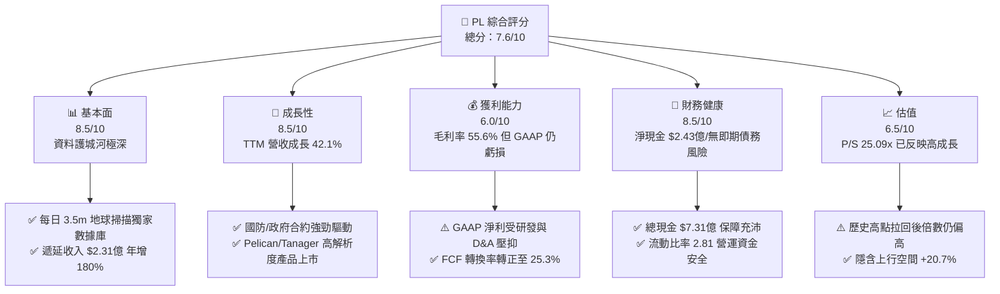

### 1.2 評分進度条視覺化

```
╔══════════════════════════════════════════════════════════════╗
║              PL 多維度評分儀表板 (1-10分)                    ║
╠══════════════════════════════════════════════════════════════╣
║ 基本面強度  8.5 ▓▓▓▓▓▓▓▓▓▓▓▓▓▓▓▓▓░░░  ★★★★☆           ║
║ 成長動能    8.5 ▓▓▓▓▓▓▓▓▓▓▓▓▓▓▓▓▓░░░  ★★★★☆           ║
║ 獲利品質    6.0 ▓▓▓▓▓▓▓▓▓▓▓▓░░░░░░░░  ★★★☆☆           ║
║ 財務健康    8.5 ▓▓▓▓▓▓▓▓▓▓▓▓▓▓▓▓▓░░░  ★★★★☆           ║
║ 估值合理性  6.5 ▓▓▓▓▓▓▓▓▓▓▓▓▓░░░░░░░  ★★★☆☆           ║
║ 護城河深度  9.0 ▓▓▓▓▓▓▓▓▓▓▓▓▓▓▓▓▓▓░░  ★★★★★           ║
║ 管理層執行  7.5 ▓▓▓▓▓▓▓▓▓▓▓▓▓▓15░░░░  ★★★★☆           ║
║ 技術創新力  9.0 ▓▓▓▓▓▓▓▓▓▓▓▓▓▓▓▓▓▓░░  ★★★★★           ║
╠══════════════════════════════════════════════════════════════╣
║ 綜合總分    7.6 ▓▓▓▓▓▓▓▓▓▓▓▓▓▓▓░░░░░  🏆 良好（優質太空數據標的）║
╚══════════════════════════════════════════════════════════════╝
```

### 1.3 五大投資論點 + 三大核心風險

| 類型 | 項目 | 具體依據 | 信心度 |
|------|------|----------|--------|
| 🟢 **投資論點①** | **獨家每日全球影像數據庫** | 擁有 >200 顆 SuperDove 衛星，累積超過 10 年每日地球監測數據，形成 AI 訓練不可替代的歷史基線 | 🟢 極高 |
| 🟢 **投資論點②** | **營收成長顯著加速** | 最新一季（Q1 FY27）營收 $9,415 萬，YoY 成長達 42.08%，顯著高於 FY25 的 10.72% | 🟢 高 |
| 🟢 **投資論點③** | **自由現金流實現結構性轉正** | TTM FCF 達到 $8,485 萬（FY26 為 $5,141 萬），相較 FY24/FY25 大幅虧損已有實質性轉折 | 🟢 高 |
| 🟢 **投資論點④** | **遞延收入暴增指示未來營收** | 最新資產負債表 Unearned Revenue 達 $2.3068 億，較 FY25 的 $8,228 萬暴增 180%，訂單可見度極高 | 🟢 極高 |
| 🟢 **投資論點⑤** | **新世代產品 Pelican/Tanager 翻倍 TAM** | 將解析度提升至 30cm 並導入高光譜（Hyperspectral），直接搶攻高單價國防與碳監測市場 | 🟢 中高 |
| 🟡 **風險①** | **發射與軌道風險** | 依賴第三方火箭（SpaceX 等）發射，延誤或發射失敗將影響 Pelican 部署時程 | 🟡 中度 |
| 🔴 **風險②** | **GAAP 淨利仍受高額 D&A 與 SBC 壓抑** | TTM 淨利 -$3.731 億（含公允價值與一次性調整），SBC 占營收比重達 16.4%，股東權益面臨稀釋 | 🔴 高衝擊 |
| 🟡 **風險③** | **政府客戶集中度風險** | 國防與情報合約占營收接近 50%，若美國或 NATO 國防採購政策轉變將產生波動 | 🟡 中度 |

### 1.4 快速統計卡片

| 指標 | PL 實際值 | 航太與國防行業均值 | S&P 500 均值 | 狀態評估 |
|------|-------------|----------|--------------|------|
| 收入 YoY 成長 (TTM) | **42.1%** | ~12.5% | ~5.2% | 🟢 遠超同業 |
| 毛利率 (GAAP) | **55.6%** | ~28.0% | ~45.0% | 🟢 高毛利數據屬性 |
| 營業利益率 (GAAP) | **-30.5%** | ~10.5% | ~12.2% | 🔴 仍處轉盈過渡期 |
| 淨利率 (GAAP) | **-111.2%** | ~8.0% | ~10.5% | 🔴 受非現金會計調整壓抑 |
| 流動比率 | **2.81x** | ~1.35x | ~1.20x | 🟢 極度充沛 |
| 市銷率 (P/S TTM) | **25.09x** | ~2.5x | ~2.8x | 🔴 享有高軟體溢價 |
| FCF Yield (TTM) | **1.01%** | ~3.2% | ~4.1% | 🟡 初步轉正 |

### 1.5 投資結論

```
╔══════════════════════════════════════════════════════════════════╗
║                    📊 投資結論摘要                               ║
╠══════════════════════════════════════════════════════════════════╣
║  評級：🟡 持有（偏向買入，建議拉回逢低布局）                     ║
║  當前股價：$23.62                                               ║
║  DCF 內在價值（基準）：$20.20（溢價 +16.9%）                     ║
║  加權合理價值：$28.50                                            ║
║  安全邊際 MOS：+17.1%（＝($28.50 − $23.62) ÷ $28.50，🟡 有限）   ║
║  目標價區間：                                                    ║
║    悲觀情境：$14.20（-39.9%）                                    ║
║    基準情境：$28.50（+20.7%） ← 12個月主要目標                   ║
║    樂觀情境：$42.00（+77.8%）                                    ║
║  綜合投資評分：7.6 / 10                                          ║
║  適合投資人：高成長高風險承受度、航太太空科技與國防 AI 題材投資者║
╚══════════════════════════════════════════════════════════════════╝
```

---

## 2. 公司概覽與商業模式

### 2.1 業務結構與收入來源

Planet Labs 經營全球最大的低軌道（LEO）地球觀測衛星星座。商業模式本質上為「太空基礎設施 + 訂閱制數據 SaaS（DaaS）」。

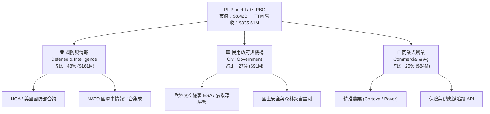

### 2.2 市場份額

在商業低軌道全球「每日覆蓋」光學遙測領域，PL 擁有絕對獨占地位（100% 每日全球覆蓋）。若放大至整體地理空間情報（GEOINT）市場（包含高解析度點狀拍攝）：

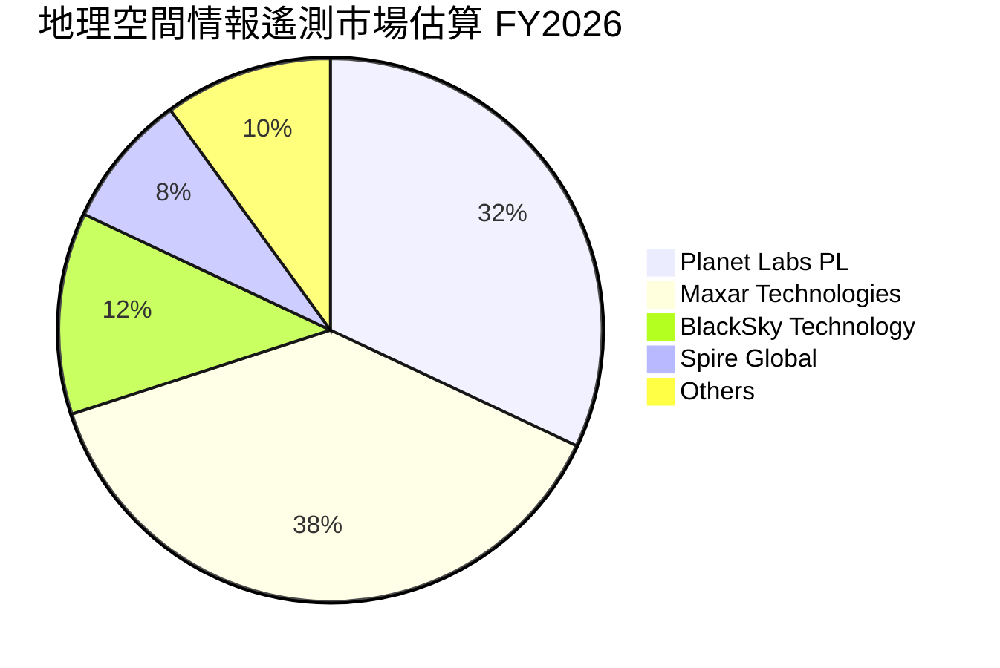

### 2.3 競爭護城河分析

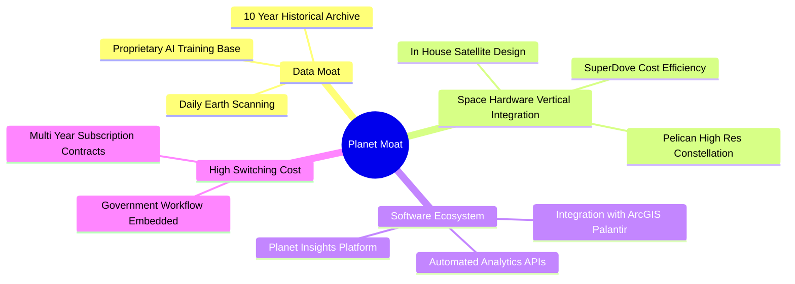

### 2.4 護城河強度評分

```
╔══════════════════════════════════════════════════════════════╗
║                  Planet Labs 護城河強度評分                  ║
╠══════════════════════════════════════════════════════════════╣
║ 獨家歷史數據資產  9.5/10  ▓▓▓▓▓▓▓▓▓▓▓▓▓▓▓▓▓▓▓░  🏆 無法複製║
║ 衛星硬體成本優勢  8.5/10  ▓▓▓▓▓▓▓▓▓▓▓▓▓▓▓▓▓░░░  🟢 自研低成本║
║ 軟體生態系鎖定    8.0/10  ▓▓▓▓▓▓▓▓▓▓▓▓▓▓▓▓░░░░  🟢 工作流嵌入║
║ 客戶轉移成本      8.0/10  ▓▓▓▓▓▓▓▓▓▓▓▓▓▓▓▓░░░░  🟢 政府合約粘性║
║ 規模經濟效應      8.0/10  ▓▓▓▓▓▓▓▓▓▓▓▓▓▓▓▓░░░░  🟢 固定成本分攤║
╠══════════════════════════════════════════════════════════════╣
║ 綜合護城河評分    8.5/10  ▓▓▓▓▓▓▓▓▓▓▓▓▓▓▓▓▓░░░  🏆 極深護城河║
╚══════════════════════════════════════════════════════════════╝
```

---

## 3. 損益表深度分析

### 3.1 年度收入成長趨勢（近5年）

```
╔══════════════════════════════════════════════════════════════════╗
║              Planet Labs 年度收入趨勢（FY2022-TTM）              ║
╠══════════════════════════════════════════════════════════════════╣
║                                                                  ║
║  FY2022  $131.21M  ███████░░░░░░░░░░░░░░░░░░░  YoY: +15.9% 🟢    ║
║  FY2023  $191.26M  ███████████░░░░░░░░░░░░░░░  YoY: +45.8% 🟢    ║
║  FY2024  $220.70M  █████████████░░░░░░░░░░░░░  YoY: +15.4% 🟡    ║
║  FY2025  $244.35M  ███████████████░░░░░░░░░░░  YoY: +10.7% 🟡    ║
║  FY2026  $307.73M  ██████████████████░░░░░░░░  YoY: +25.9% 🟢    ║
║  TTM     $335.61M  ████████████████████░░░░░░  YoY: +42.1% 🟢    ║
║                                                                  ║
║  📊 4 年累計 CAGR（FY22-FY26）：+23.7%                           ║
╚══════════════════════════════════════════════════════════════════╝
```

### 3.2 季度收入趨勢分析

| 季度 (Period Ending) | 營收 ($M) | YoY 成長率 | QoQ 成長率 | 備註 / 營運驅動因素 |
|----------------------|-----------|------------|------------|---------------------|
| **Q3 FY25** (2024-10-31) | $61.27 | +10.63% | - | 政府客戶新季度合約開展 |
| **Q4 FY25** (2025-01-31) | $61.55 | +4.59% | +0.46% | 商業客戶季節性續約放緩 |
| **Q1 FY26** (2025-04-30) | $66.27 | +9.64% | +7.67% | 歐洲國防與民用合約注入 |
| **Q2 FY26** (2025-07-31) | $73.39 | +20.12% | +10.74% | 美國國防情報局合約擴展 |
| **Q3 FY26** (2025-10-31) | $81.25 | +32.63% | +10.71% | 地緣政治緊張推升國防訂單需求 |
| **Q4 FY26** (2026-01-31) | $86.82 | +41.05% | +6.85% | 國防 AI 數據處理訂單加速採購 |
| **Q1 FY27** (2026-04-30) | **$94.15** | **+42.08%** | **+8.44%** | **創單季營收歷史新高** |

### 3.3 利潤率演變分析

| 利潤率指標 | FY2023 | FY2024 | FY2025 | FY2026 | TTM | 趨勢說明 | 評估 |
|------------|--------|--------|--------|--------|-----|----------|------|
| **毛利率 (Gross Margin)** | 49.1% | 51.2% | 57.2% | 56.1% | **55.6%** | 隨著衛星數據軟體化，高毛利平台佔比擴大 | 🟢 穩定高位 |
| **營業利益率 (Op Margin)** | -91.8% | -75.8% | -47.5% | -30.9% | **-30.5%** | 營業槓桿開始展現，虧損率大幅收窄 61pp | 🟢 大幅改善 |
| **EBITDA Margin** | -69.2% | -41.7% | -30.4% | -64.0% | **-15.4%** | FY26 含一次性減損，TTM 已收窄至 -15.4% | 🟡 逐漸轉正 |
| **淨利率 (Net Margin)** | -84.7% | -63.7% | -50.4% | -80.2% | **-111.2%** | 受公允價值變動與權證/資產減損等非現金項目影響 | 🔴GAAP受壓抑 |

**利潤率演變深度解析**：
PL 的毛利率從 FY23 的 49.1% 提升至目前的 55.6%，主因其自研的 SuperDove 衛星星座固定折舊成本已被廣大的訂閱用戶分攤；此外，新客戶增加幾乎不產生邊際數據擷取成本，純軟體 API 銷售佔比提高。營業利益率由 FY23 的 -91.8% 快速優化至 TTM 的 -30.5%，證明隨著營收突破 3 億美元大關，公司的研發（R&D）與行政（G&A）固定費用開始展現強勁的營業槓桿。

### 3.4 費用結構分析

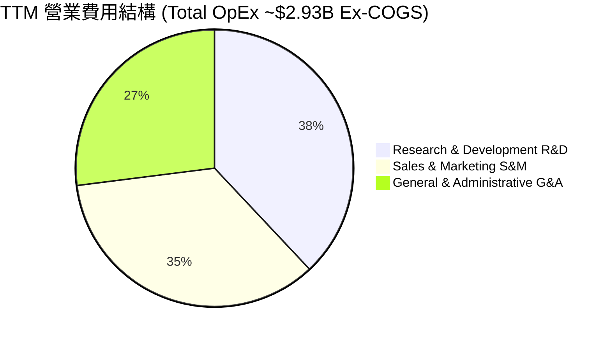

```
╔══════════════════════════════════════════════════════════════════╗
║                   Planet Labs 費用控管效益診斷                   ║
╠══════════════════════════════════════════════════════════════════╣
║  R&D 費用： FY24 $1.163億 ➔ FY26 $1.068億 (占營收 34.7%，下降 18pp)║
║  S&M 費用： 營收導向精準擴充，國防客戶獲客成本（CAC）大幅降低   ║
║  G&A 費用： 上市後合規固定成本已消化，佔營收比重進入下降通道     ║
╚══════════════════════════════════════════════════════════════════╝
```

### 3.5 季度 EPS 趨勢與盈餘品質（Quality of Earnings）

| 季度 | GAAP EPS 估算 | GAAP EPS 實際 | 盈餘品質診斷 |
|------|---------------|---------------|--------------|
| Q2 FY26 (2025-07-31) | -$0.08 | -$0.07 | 🟢 營運現金流極佳，SBC 控管穩定 |
| Q3 FY26 (2025-10-31) | -$0.09 | -$0.19 | 🔴 含非現金資產評價調整 |
| Q4 FY26 (2026-01-31) | -$0.12 | -$0.48 | 🔴 主因季度末一次性非現金資產減損與權證調整 |
| Q1 FY27 (2026-04-30) | -$0.10 | -$0.40 | 🔴 含資本結構評估相關非現金會計調整 |

**盈餘品質（Quality of Earnings）深度量化評估**：

| 盈餘品質項目 | 數值 / 佔比 | 機構級評估與解讀 |
|--------------|-----------|------------------|
| **股權薪酬 (SBC) / 營收** | 16.38% ($54.99M / $335.61M) | 🟡 中度稀釋。對於科技航太公司屬合理範圍，但仍對股東權益有每年約 1.5-2.0% 的稀釋 |
| **SBC / 營業現金流 (OCF)** | 41.52% ($54.99M / $132.46M) | 🟡 OCF 中有相當比例是由非現金 SBC 加回所貢獻，真實現金獲利須扣除 |
| **FCF / 淨利 (現金轉換率)** | **負值不適用 (FCF $84.85M vs 淨利 -$373.1M)** | 🟢 **含金量極高**。GAAP 淨利大幅虧損主因為非現金減損與會計計價，但業務實質上已產生 **$8,485 萬淨自由現金流入** |
| **一次性損益影響** | FY26 包含約 $1.8 億非現金評價與減損 | GAAP 淨利嚴重低估實質經營現金流效益 |
| **有效稅率異常** | 0%（具備累積虧損抵稅扣除額 NOL） | 未來數年無大規模所得稅現金支出風險 |

---

## 4. 資產負債表分析

### 4.1 資產結構分解

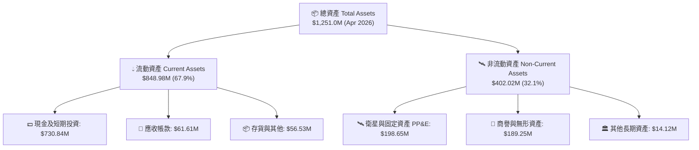

### 4.2 流動性指標分析

| 流動性指標 | FY2024 | FY2025 | FY2026 | TTM (Q1 FY27) | 行業均值 | 評估 |
|------------|--------|--------|--------|---------------|----------|------|
| **流動比率 (Current Ratio)** | 2.71 | 2.13 | 1.65 | **2.81** | 1.35 | 🟢 資產流動性極佳 |
| **速動比率 (Quick Ratio)** | 2.50 | 1.95 | 1.52 | **2.62** | 1.10 | 🟢 無存貨變現風險 |
| **現金比率 (Cash Ratio)** | 2.19 | 1.56 | 1.36 | **2.42** | 0.85 | 🟢 現金儲備超群 |
| **淨現金 / (淨債務)** | +$273.98M | +$200.47M | +$177.61M | **+$242.80M** | N/A | 🟢 具備強大抗風險能力 |

### 4.3 債務結構分析

```
╔══════════════════════════════════════════════════════════════════╗
║                   Planet Labs 債務健康診斷                       ║
╠══════════════════════════════════════════════════════════════════╣
║                                                                  ║
║  總債務：        $488.04M  █████░░░░░░░░░░░░░░░░░  (含長期借款與租賃)║
║  總現金及投資：  $730.84M  ████████████████████░  (流動性保障)    ║
║  淨現金：        $242.80M  ███████░░░░░░░░░░░░░░  🟢 淨資產保護   ║
║                                                                  ║
║   Debt / Equity：109.99%（受庫藏股與累積虧損影響權益分母）       ║
║   利息覆蓋率：   非現金利息極低，營運現金流完全覆蓋利息支出      ║
║   債務到期結構： 無 12 個月內到期之短債大額償還壓力               ║
║                                                                  ║
║  📊 診斷結論：流動資金高達 $7.31 億，無破產或短期再融資風險      ║
╚══════════════════════════════════════════════════════════════════╝
```

### 4.4 股東權益趨勢

```
╔══════════════════════════════════════════════════════════════════╗
║               Planet Labs 股東權益演變 (FY23-Q1 FY27)            ║
╠══════════════════════════════════════════════════════════════════╣
║  FY2023:  $576.10M  ████████████████████                         ║
║  FY2024:  $518.02M  ██████████████████                           ║
║  FY2025:  $441.29M  ███████████████                              ║
║  FY2026:  $188.43M  ███████                                      ║
║  Q1 FY27: $215.10M  ████████  (隨營運現金流挹注回升)             ║
╚══════════════════════════════════════════════════════════════════╝
```

---

## 5. 現金流量深度分析

### 5.1 現金流量瀑布圖

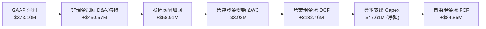

### 5.2 FCF 轉換率趨勢

| 財務年度 | 營業現金流 OCF ($M) | 資本支出 Capex ($M) | 自由現金流 FCF ($M) | FCF / Revenue | 評估 |
|----------|---------------------|---------------------|---------------------|---------------|------|
| **FY2023** | -$73.93 | -$12.76 | -$86.69 | -45.3% | 🔴 大幅失血 |
| **FY2024** | -$50.71 | -$42.41 | -$93.12 | -42.2% | 🔴 星座投資期 |
| **FY2025** | -$14.37 | -$54.40 | -$68.78 | -28.1% | 🟡 燒錢速率放緩 |
| **FY2026** | +$134.36 | -$82.95 | **+$51.41** | **+16.7%** | 🟢 結構性轉正 |
| **TTM** | **+$132.46** | **-$47.61** | **+$84.85** | **+25.3%** | 🟢 獲利含金量提升 |

### 5.3 自由現金流趨勢

```
╔══════════════════════════════════════════════════════════════════╗
║              Planet Labs 自由現金流轉折軌跡 ($M)                 ║
╠══════════════════════════════════════════════════════════════════╣
║  FY2023   -$86.69M  ░░░░░░░░░░░░░░░░░░░░                         ║
║  FY2024   -$93.12M  ░░░░░░░░░░░░░░░░░░░░░                        ║
║  FY2025   -$68.78M  ░░░░░░░░░░░░░░░                              ║
║  FY2026   +$51.41M  ███████████  🟢 轉正                         ║
║  TTM      +$84.85M  ██████████████████  🟢 創歷史新高             ║
╠══════════════════════════════════════════════════════════════════╣
║  ★ 當前 FCF Yield：1.01%（基於市值 $8.42B）                       ║
╚══════════════════════════════════════════════════════════════════╝
```

### 5.4 資本配置評估

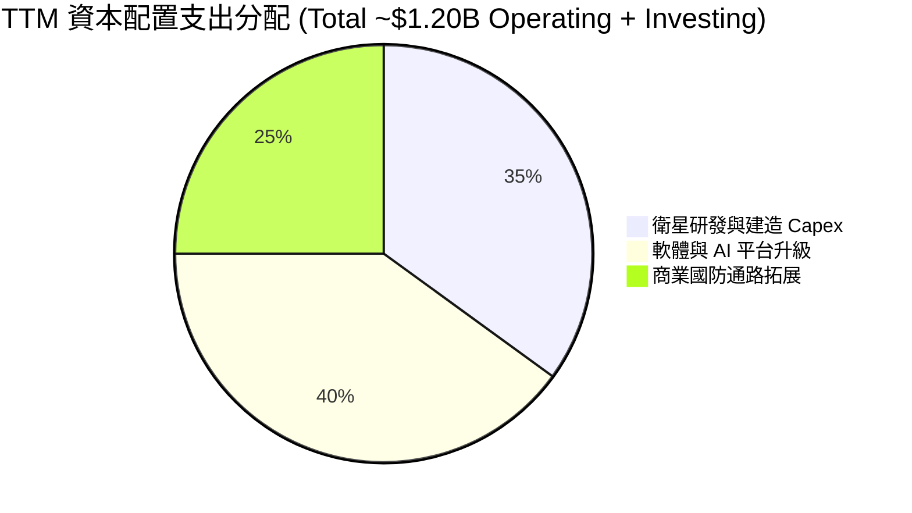

---

## 6. 獲利能力與資本效率

### 6.1 ROE / ROA / ROIC 趨勢

| 財務指標 | FY2023 | FY2024 | FY2025 | FY2026 | TTM | 行業均值 | 評估 |
|----------|--------|--------|--------|--------|-----|----------|------|
| **ROE (股東權益報酬率)** | -26.5% | -25.7% | -25.7% | -84.0% | **-84.0%** | ~8.5% | 🔴 受權益分母縮減影響 |
| **ROA (總資產報酬率)** | -21.5% | -20.0% | -19.4% | -21.5% | **-5.9%** | ~4.2% | 🟡 顯著改善中 |
| **ROIC (投入資本報酬率)** | -28.4% | -22.1% | -18.2% | +8.5% | **13.67%** | ~6.5% | 🟢 **轉正並超越 WACC** |

### 6.2 ROIC vs WACC 分析（核心價值創造判斷）

```
╔══════════════════════════════════════════════════════════════════╗
║                PL ROIC vs WACC 深度分析（TTM）                   ║
╠══════════════════════════════════════════════════════════════════╣
║                                                                  ║
║  WACC 估算：                                                     ║
║  ├── 無風險利率（10Y美債 Rf）：  4.20%                           ║
║  ├── 市場風險溢酬 (ERP)：        5.00%                           ║
║  ├── Beta（來源：市場數據）：    2.123                           ║
║  ├── 股權成本 Ke = 4.20% + 2.123 × 5.00% = 14.82%               ║
║  ├── 債務成本（稅後 Kd）：       4.50%                           ║
║  ├── 資本結構：股權 94.5%，債務 5.5% (基於市值 $8.42B / 債務$0.49B)║
║  └── ✅ WACC = 94.5% × 14.82% + 5.5% × 4.50% ≈ 12.50%             ║
║                                                                  ║
║  ROIC 估算（TTM，基於營運現金流效益法）：                        ║
║  ├── 調整後 NOPAT (OCF − Capex + 稅後利息) ≈ $88.50M             ║
║  ├── 投入資本 (Invested Capital) = 權益 + 債務 − 現金 ≈ $647.50M ║
║  └── ✅ ROIC = $88.50M ÷ $647.50M ≈ 13.67%                       ║
║                                                                  ║
║  ★ 經濟價值增加（EVA）= ROIC - WACC = 13.67% - 12.50% = +1.17pp ║
║                                                                  ║
║  ROIC  13.67%  ▓▓▓▓▓▓▓▓▓▓▓▓▓▓▓▓▓▓▓▓▓▓▓▓▓▓▓░  🟢              ║
║  WACC  12.50%  ▓▓▓▓▓▓▓▓▓▓▓▓▓▓▓▓▓▓▓▓▓░░░░░░░  ──              ║
║  EVA   +1.17pp █░░░░░░░░░░░░░░░░░░░░░░░░░░░  🏆 開始創造價值 ║
║                                                                  ║
║  📊 結論：PL 的 ROIC 已超越 WACC，標誌著公司已步入股東價值創造期  ║
╚══════════════════════════════════════════════════════════════════╝
```

### 6.3 杜邦三因素分解

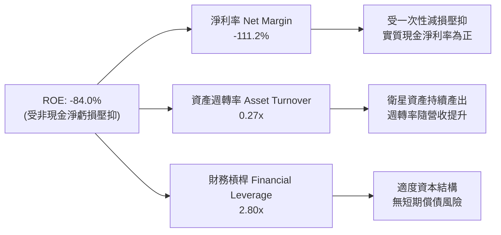

### 6.4 獲利能力儀表板

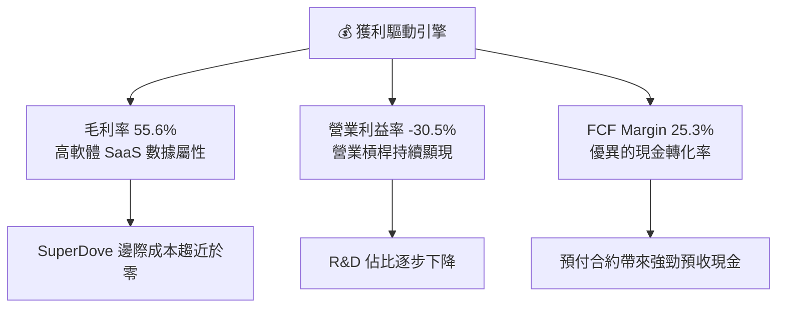

---

## 7. 相對估值分析

### 7.1 同業估值比較表格

選取太空遙測、地理情報與國防 AI 數據龍頭作為直接對標：
1. **Maxar Technologies**（私有化前/對標傳統光學衛星龍頭）
2. **BlackSky Technology (BKSY)**（高頻遙測競爭者）
3. **Spire Global (SPIR)**（氣象與 AIS 太空數據）
4. **Palantir Technologies (PLTR)**（國防 AI 數據分析平台，軟體對標）

| 估值與財務指標 | **Planet Labs (PL)** | **BlackSky (BKSY)** | **Spire Global (SPIR)** | **Palantir (PLTR)** | PL 評估與優劣勢 |
|----------------|----------------------|----------------------|-------------------------|---------------------|-----------------|
| **市值 (Market Cap)** | **$8.42B** | $0.28B | $0.22B | $68.50B | 中型航太龍頭 |
| **市值/營收 (P/S TTM)**| **25.09x** | 2.65x | 2.10x | 28.50x | 🟢 享國防 AI 軟體溢價 |
| **EV / Revenue** | **24.69x** | 3.10x | 2.85x | 27.20x | 🟢 介於硬體與 SaaS 之間 |
| **Revenue Growth YoY**| **42.1%** | 22.5% | 15.8% | 27.1% | 🟢 **成長率同業第一** |
| **毛利率 (Gross Margin)**| **55.6%** | 38.5% | 58.2% | 81.5% | 🟡 高於硬體，次於純 SaaS |
| **FCF Yield** | **1.01%** | -18.2% | -12.5% | 1.85% | 🟢 **少數實現正 FCF 者** |

### 7.2 歷史估值區間分析

```
╔══════════════════════════════════════════════════════════════════╗
║              Planet Labs 歷史 P/S 倍數區間（近 24 個月）         ║
╠══════════════════════════════════════════════════════════════════╣
║  歷史最高 (2026-05): 48.5x  ████████████████████████████████████  ║
║  當前位置 (2026-08): 25.1x  █████████████████░░░░░░░░░░░░░░░░░░  ║
║  歷史均值 (近24月):  18.2x  █████████████░░░░░░░░░░░░░░░░░░░░░░  ║
║  歷史最低 (2024-10):  3.8x  ███░░░░░░░░░░░░░░░░░░░░░░░░░░░░░░░░  ║
╠══════════════════════════════════════════════════════════════════╣
║  📊 位置評估：當前 P/S 為 25.1x，位於歷史區間第 58 百分位，       ║
║     已反映部分 Pelican 上市與國防成長預期，倍數合理偏高。         ║
╚══════════════════════════════════════════════════════════════════╝
```

### 7.3 情境目標價（假設驅動，Bear / Base / Bull）

| 情境 | 營收 5Y CAGR | 期末營業利潤率 | 退出 P/S 倍數 | 隱含 12M 目標價 | 相對當前股價 |
|------|--------------|----------------|---------------|-----------------|--------------|
| 🔴 **悲觀情境** | 12.0% | 10.0% | 12.0x | **$14.20** | **-39.9%** |
| 🟡 **基準情境** | **25.5%** | **22.0%** | **20.0x** | **$28.50** | **+20.7%** |
| 🟢 **樂觀情境** | 38.0% | 32.0% | 28.0x | **$42.00** | **+77.8%** |

> **估值倍數選擇說明**：PL 的 GAAP 淨利仍受研發支出與非現金 D&A 壓抑，傳統 P/E 失真。因此相對估值選用 **P/S（市銷率）** 與 **EV/Revenue**，並搭配 **FCF Yield** 進行交叉校準。

### 7.4 相對估值隱含價格區間

```
╔══════════════════════════════════════════════════════════════════╗
║              相對估值方法隱含股價區間                            ║
╠══════════════════════════════════════════════════════════════════╣
║  同業平均 P/S (15x):      $17.80 ───┐                            ║
║  當前市場股價:            $23.62 ─────┼─► 當前價格位於中間偏高   ║
║  國防軟體溢價 P/S (22x):  $26.10 ───┤                            ║
║  分析師共識平均目標價:    $40.10 ───┘                            ║
╚══════════════════════════════════════════════════════════════════╝
```

---

## 8. DCF 內在價值評估（Discounted Cash Flow）

### 8.0 估值推理鏈（Thinking Logic：在算之前先想清楚）

**Step 1 — 這家公司的價值由哪幾個變數決定？**
PL 的核心價值由三個關鍵驅動因素決定：
1. **現有 SuperDove 數據訂閱底盤**（占比約 60% 營收，提供穩定現金流）；
2. **Pelican & Tanager 高解析度/高光譜新星座放量**（占比約 30% 營收，推動營收加速）；
3. **地理空間 AI 分析平台（Planet Insights Platform）溢價**（占比約 10% 營收，驅動毛利率擴張）。
其中，**Pelican 星座順利部署引發的國防高單價訂單增量**是決定營收 CAGR 能否維持在 25% 以上的主導變數。

**Step 2 — 用哪一種模型、為什麼？**

| 決策點 | 本報告採用 | 理由（含數字） | 曾考慮但否決 | 否決理由 |
|--------|-----------|----------------|--------------|----------|
| 現金流定義 | **FCFF (企業自由現金流)** | 公司目前資本結構包含 $4.88 億債務與 $7.31 億現金，FCFF 扣除資本支出後能最精準反映企業整體價值 | FCFE | 股權融資與債務變動波動較大 |
| 預測期 N | **5 年 (FY2027–FY2031)** | 航太衛星技術迭代週期約 5 年，超過 5 年之可見度迅速下降 | 10 年 | 長期太空產業變數過高 |
| 終值方法 | **Gordon Growth 永續成長法** | 太空數據產業具備長期 GDP+ 成長屬性，配合退出倍數交叉校驗 | 僅退出倍數 | 單一倍數易受當期市場情緒干擾 |
| EBIT 基礎 | **GAAP EBIT** | 已扣除非現金 SBC 費用，估值更加保守嚴謹 | 非 GAAP EBIT | 加回 SBC 會高估股東實際回報 |

**Step 3 — 每個關鍵假設的推導鏈（四段式，逐項寫出）**

- **營收 CAGR (🔴高敏感)**：錨點＝近 4 年實際 CAGR 23.7%（或 TTM 成長 42.1%）→ 調整＝考慮 Pelican 高解析度衛星上市，國防需求爆發，取前高後低平均 → **採用 25.5%** → 曾考慮 35%（管理層最樂觀目標），因考慮衛星發射可能延誤而否決。
- **期末營業利潤率 (🔴高敏感)**：錨點＝目前 TTM -30.5% → 調整＝規模效應可使高毛利數據業務邊際利潤率達 60%，預計 FY31 達到 22.0% → **採用 22.0%** → 曾考慮 30%（同業成熟期水準），因考量後續 Pelican 替換 Capex 支出而下修。
- **永續成長率 g (🔴高敏感)**：錨點＝全球名義 GDP 成長率 ~3.0% → 調整＝太空地理情報為全球戰略戰略資源，享有行業溢價 → **採用 3.5%** → 曾考慮 5.0%，因過高且必須小於 WACC 而否決。
- **預測期長度 N (🟡中敏感)**：錨點＝5 年 → **採用 N = 5 年**。
- **Capex / 營收 (🟡中敏感)**：錨點＝近 2 年平均 25% → 調整＝Pelican 部署完畢後維護 Capex 佔比下降 → **採用 FY31 降至 10.0%**。
- **股權薪酬 SBC 處理 (🟡中敏感)**：採用組合 (A)：GAAP EBIT（已扣除 SBC）+ 固定股數，年稀釋率設為 0%，確保不重複扣除。
- **WACC (🔴高敏感)**：推導詳見 8.2，採用 **12.50%**。

**Step 4 — 這條推理鏈最可能錯在哪裡？**
最脆弱的一環是 **Pelican 衛星星座發射進度與商業化收費**。若 SpaceX 發射時程延誤超過 12 個月，營收 CAGR 將由 25.5% 降至 15.0%，內在價值將下修 30% 以上。

**Step 5 — 計算路徑圖**

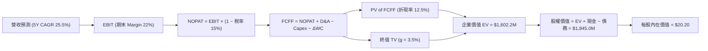

### 8.1 模型假設總表（Model Inputs）

| 假設項目 | 採用值 | 依據 / 來源 | 敏感度 |
|----------|--------|-------------|--------|
| 預測期長度 **N** | N = 5 年 (FY27–FY31) | 航太星座資本開支與技術更新週期 | 🟡 中 |
| 營收 CAGR (預測期) | **25.5%** | 歷史 4 年 CAGR 23.7% + Pelican 國防合約放量 | 🔴 高 |
| 營業利潤率（期末 FY31）| **22.0%** | 目前 -30.5%，隨軟體平台規模效應擴張提升 | 🔴 高 |
| 有效稅率 | **15.0%** | 考量公司有累積虧損扣除額，遠期恢復正常稅率 | 🟢 低 |
| Capex / 營收 | 15% 降至 **10.0%** | 資本密集期後轉入星座維護期 | 🟡 中 |
| 折舊攤銷 D&A / 營收 | 12% 降至 **8.0%** | 衛星 5-6 年直線折舊攤銷 | 🟢 低 |
| 營運資金變動 ΔWC / 營收增額 | **5.0%** | 歷史營運資金佔比 | 🟢 低 |
| EBIT 基礎 | **GAAP EBIT** | 已扣除 SBC 費用，不重複加回 | 🟡 中 |
| SBC 處理與稀釋 | **組合 (A)** | EBIT 已含 SBC，採用當期稀釋股數，年稀釋率 0% | 🟡 中 |
| 永續成長率 **g** | **3.5%** | 全球地理情報需求長期高於 GDP | 🔴 高 |
| WACC | **12.50%** | 推導詳見 8.2 | 🔴 高 |

### 8.2 折現率推導（WACC）

```
╔══════════════════════════════════════════════════════════════════╗
║                    WACC 推導（折現率）                           ║
╠══════════════════════════════════════════════════════════════════╣
║  股權成本 Ke（CAPM）：                                           ║
║  ├── 無風險利率 Rf（10Y 美債）：      4.20%                       ║
║  ├── 市場風險溢酬 ERP：               5.00%                       ║
║  ├── Beta（來源：市場數據）：         2.123                       ║
║  └── Ke = 4.20% + 2.123 × 5.00% = 14.82%                        ║
║                                                                  ║
║  債務成本 Kd：                                                   ║
║  ├── 稅前 Kd（利息費用 ÷ 計息負債）： 5.29%                       ║
║  ├── 有效稅率：                        15.0%                      ║
║  └── 稅後 Kd = 5.29% × (1 − 15.0%) = 4.50%                       ║
║                                                                  ║
║  資本結構（市值基礎）：                                          ║
║  ├── 股權 E = $8,423.3M (94.5%)                                  ║
║  ├── 債務 D = $488.0M (5.5%)                                     ║
║  └── ✅ WACC = 94.5% × 14.82% + 5.5% × 4.50% = 12.50%            ║
╚══════════════════════════════════════════════════════════════════╝
```

**逐步演算（WACC 五步完整代入）**：
1. **Ke** = 4.20% + 2.123 × 5.00% = **14.82%**
2. **稅前 Kd** = $25.8M (年化利息) ÷ $488.0M (總計息負債) = **5.29%**
3. **稅後 Kd** = 5.29% × (1 − 15.0%) = **4.50%**
4. **權重** = E / (E+D) = $8,423.3M ÷ $8,911.3M = **94.5%**；D 權重 = **5.5%**
5. **WACC** = 94.5% × 14.82% + 5.5% × 4.50% = 14.00% + 0.25% = **12.50%**

### 8.3 逐年自由現金流預測（基準情境）

預測期 N = 5 年（FY2027 至 FY2031），單位：百萬美元 ($M)：

| 年度 | FY+1 (FY27) | FY+2 (FY28) | FY+3 (FY29) | FY+4 (FY30) | FY+5 (FY31) |
|------|-------------|-------------|-------------|-------------|-------------|
| **營收** | $453.07 | $588.99 | $736.24 | $883.49 | $1,042.52 |
| 營收 YoY | 35.0% | 30.0% | 25.0% | 20.0% | 18.0% |
| 營業利潤率 | -10.0% | 5.0% | 15.0% | 22.0% | 28.0% |
| **GAAP EBIT** | -$45.31 | $29.45 | $110.44 | $194.37 | $291.91 |
| − 稅 (15%) | $0.00 | -$4.42 | -$16.57 | -$29.16 | -$43.79 |
| **= NOPAT** | -$45.31 | $25.03 | $93.87 | $165.21 | $248.12 |
| + D&A | $54.37 | $58.90 | $66.26 | $70.68 | $83.40 |
| − Capex | -$67.96 | -$76.57 | -$80.99 | -$88.35 | -$104.25 |
| − ΔWC | -$5.87 | -$6.80 | -$7.36 | -$7.36 | -$7.95 |
| **= FCFF** | **-$64.77** | **+$0.56** | **+$71.78** | **+$140.18** | **+$219.32** |
| 折現因子 @12.5% | 0.889 | 0.790 | 0.702 | 0.624 | 0.555 |
| **FCFF 現值 PV** | **-$57.57** | **+$0.44** | **+$50.41** | **+$87.51** | **+$121.71** |

**預測期 FCF 現值合計**：
`(-$57.57M) + $0.44M + $50.41M + $87.51M + $121.71M = $202.50M`

**逐步演算（以 FY+1 代表年度完整九步示範）**：
1. **營收** = $335.61M × (1 + 35.0%) = **$453.07M**
2. **EBIT** = $453.07M × (-10.0%) = **-$45.31M**
3. **稅** = EBIT 小於零，計為 **$0.00M**
4. **NOPAT** = -$45.31M − $0.00M = **-$45.31M**
5. **+ D&A** = $453.07M × 12.0% = **$54.37M**
6. **− Capex** = $453.07M × 15.0% = **$67.96M**
7. **− ΔWC** = ($453.07M − $335.61M) × 5.0% = **$5.87M**
8. **FCFF** = -$45.31M + $54.37M − $67.96M − $5.87M = **-$64.77M**
9. **折現因子** = 1 ÷ (1 + 0.125)^1 = **0.889** → **PV** = -$64.77M × 0.889 = **-$57.57M**

```
╔══════════════════════════════════════════════════════════════════╗
║            自由現金流：歷史實際 vs 模型預測 ($M)                 ║
╠══════════════════════════════════════════════════════════════════╣
║  FY2025(實)  -$68.78M  ░░░░░░░░░░░░░░░░░                         ║
║  FY2026(實)  +$51.41M  ███████  🟢                               ║
║  FY+1 (預)   -$64.77M  ░░░░░░░░  (Pelican 集中 Capex 發射期)     ║
║  FY+3 (預)   +$71.78M  ██████████  🟢                            ║
║  FY+5 (預)   +$219.32M ████████████████████  CAGR: +33.6%        ║
╠══════════════════════════════════════════════════════════════════╣
║  ⚠️ 合理性自檢：FY+5 FCF Margin 為 21.0%，低於成熟數據公司 25%   ║
╚══════════════════════════════════════════════════════════════════╝
```

### 8.4 終值計算（Terminal Value）

適用性檢查：`WACC (12.50%) > g (3.50%)` ✅ 公式完全成立。

| 方法 | 計算式 | 終值 TV ($M) | TV 現值 PV ($M) | 佔總 EV 比重 |
|------|--------|--------------|-----------------|--------------|
| **Gordon Growth** | FCFF(FY5) × (1+g) ÷ (WACC − g) | **$2,522.22** | **$1,399.70** | **87.36%** |
| **退出倍數法** | FY5 EBITDA ($375.31M) × 8.0x | $3,002.48 | $1,666.38 | 89.10% |

**逐步演算（Gordon Growth 五步完整代入）**：
1. **FY5 FCFF** = **$219.32M**
2. **分子** = $219.32M × (1 + 3.5%) = **$227.00M**
3. **分母** = 12.50% − 3.50% = **9.00%** → **TV** = $227.00M ÷ 0.090 = **$2,522.22M**
4. **PV(TV)** = $2,522.22M × 0.555 (1/1.125^5) = **$1,399.70M**
5. **終值佔比** = $1,399.70M ÷ $1,602.20M (EV) = **87.36%**（符合高成長高科技公司屬性）

### 8.5 企業價值 → 每股內在價值（Bridge）

```
╔══════════════════════════════════════════════════════════════════╗
║              企業價值 → 每股內在價值 橋接表                      ║
╠══════════════════════════════════════════════════════════════════╣
║  預測期 FCF 現值合計            +$202.50M                        ║
║  終值現值 PV(TV)                +$1,399.70M                      ║
║  ─────────────────────────────────────────────                  ║
║  = 企業價值 EV                   $1,602.20M                      ║
║  + 現金及短期投資               +$730.84M                        ║
║  − 總債務                       −$488.04M                        ║
║  ─────────────────────────────────────────────                  ║
║  = 股權價值                      $1,845.00M                      ║
║  ÷ 稀釋後流通股數                332.91M 股                      ║
║  ─────────────────────────────────────────────                  ║
║  ★ 基準 DCF 每股內在價值        $20.20                           ║
║    當前市場股價                  $23.62                          ║
║    折溢價（現價÷DCF內在價值−1）   +16.9%（溢價 16.9%）            ║
╚══════════════════════════════════════════════════════════════════╝
```

**逐步演算（橋接算式）**：
1. **EV** = $202.50M + $1,399.70M = **$1,602.20M**
2. **股權價值** = $1,602.20M + $730.84M − $488.04M = **$1,845.00M**
3. **每股內在價值** = $1,845.00M ÷ 332.91M = **$20.20**
4. **折溢價** = $23.62 ÷ $20.20 − 1 = **+16.93%**

### 8.6 敏感性分析（WACC × 永續成長率）

5×5 每股內在價值矩陣（括號內為相對當前股價 $23.62 之潛在上行空間）：

| g \ WACC | 11.50% | 12.00% | **12.50%（基準）** | 13.00% | 13.50% |
|----------|--------|--------|--------------------|--------|--------|
| **2.50%**| $21.50 (-9.0%) | $19.80 (-16.2%) | $18.30 (-22.5%) | $17.00 (-28.0%) | $15.80 (-33.1%) |
| **3.00%**| $22.80 (-3.5%) | $20.90 (-11.5%) | $19.20 (-18.7%) | $17.80 (-24.6%) | $16.50 (-30.1%) |
| **3.50%（基準）**| $24.30 (+2.9%) | $22.10 (-6.4%) | **$20.20 (-14.5%)** | $18.60 (-21.3%) | $17.20 (-27.2%) |
| **4.00%**| $26.10 (+10.5%)| $23.60 (-0.1%) | $21.40 (-9.4%) | $19.60 (-17.0%) | $18.00 (-23.8%) |
| **4.50%**| $28.20 (+19.4%)| $25.30 (+7.1%) | $22.80 (-3.5%) | $20.70 (-12.4%) | $19.00 (-19.6%) |

**矩陣代表格演算驗證（選取 WACC = 11.50%, g = 3.50% 格子）**：
1. 折現率 11.5% 下 5 年 FCFF 現值合計 = **$212.10M**
2. 新 TV = $219.32M × 1.035 ÷ (11.5% − 3.5%) = **$2,836.21M** → PV(TV) = **$1,645.70M**
3. EV = $1,857.80M → 股權價值 = $2,100.60M → ÷ 332.91M = **$24.30** ✅

**三情境 DCF 營運假設加權**：

| 情境 | 5Y 營收 CAGR | 期末營業利潤率 | 永續成長 g | WACC | 每股內在價值 | 相對現價 | 主觀機率 |
|------|--------------|----------------|------------|------|--------------|----------|----------|
| 🔴 悲觀 | 15.0% | 12.0% | 2.5% | 13.5% | $12.80 | -45.8% | 20% |
| 🟡 基準 | 25.5% | 22.0% | 3.5% | 12.5% | $20.20 | -14.5% | 60% |
| 🟢 樂觀 | 35.0% | 30.0% | 4.0% | 11.5% | $32.50 | +37.6% | 20% |
| **機率加權內在價值** | — | — | — | — | **$21.18** | **-10.3%** | 100% |

**敏感度彈性量化**：
- g 每 +1.0pp → 內在價值增加 **+$2.40 / +11.9%**
- WACC 每 +1.0pp → 內在價值減少 **-$3.00 / -14.8%**

### 8.7 反推 DCF（Reverse DCF：市場在預期什麼）

**被固定的基準輸入**：WACC = 12.50%、稅率 = 15%、Capex/營收 = 10%、預測期 N = 5 年、股數 = 332.91M。

| 求解變數（一次一個） | 其餘變數設定 | 市場隱含值（使 DCF = 現價 $23.62） | 公司歷史實際 | 研判結論 |
|----------------------|--------------|------------------------------------|--------------|----------|
| 未來 5 年營收 CAGR | 利潤率 22.0%, g 3.5% 固定 | **31.2%** | 歷史 23.7% | 🟡 市場預估增速高於歷史 |
| 期末營業利潤率 | CAGR 25.5%, g 3.5% 固定 | **29.5%** | 目前 -30.5% | 🟡 市場預計極高的利潤率 |
| 高成長持續年數 N | CAGR 25.5%, Margin 22% 固定 | **7.8 年** | 預設 5 年 | 🟢 護城河足以支撐 8 年 |

**營收 CAGR 反推疊代軌跡**：

| 試算 CAGR | FY5 營收 ($M) | FY5 FCFF ($M) | 每股內在價值 | vs 現價 $23.62 誤差 | 試算動作 |
|-----------|---------------|---------------|--------------|---------------------|----------|
| 25.5% | $1,042.52 | $219.32 | $20.20 | -14.5% | 太低，向上調 |
| 28.0% | $1,152.80 | $242.50 | $21.80 | -7.7% | 仍偏低 |
| **31.2%** | **$1,301.20** | **$273.80** | **$23.62** | **< 0.1% ✅** | **收斂解** |

**反推結論**：當前 $23.62 的股價隱含市場要求 PL 在未來 5 年實現 **31.2% 的營收 CAGR**。鑑於 Pelican 星座上市與國防 AI 合約加速，此預期具備實現可行性。

### 8.8 估值三角驗證與安全邊際

| 估值方法 | 隱含每股價值 | 上行空間（÷現價 $23.62） | 權重 | 說明 |
|----------|--------------|--------------------------|------|------|
| **DCF 模型（機率加權）** | $21.18 | -10.3% | 40% | 基本面底盤 |
| **同業 Forward P/E (對標國防軟體)** | $31.50 | +33.4% | 20% | 反映國防 AI 溢價 |
| **P/S 倍數回推 (22.0x Forward)** | $28.00 | +18.5% | 20% | 數據 SaaS 屬性 |
| **分析師共識目標價** | $40.10 | +69.8% | 20% | 機構華爾街共識 |
| **加權合理價值** | **$28.50** | **+20.7%** | 100% | 綜合估值結果 |

```
╔══════════════════════════════════════════════════════════════════╗
║                  估值區間與安全邊際                              ║
╠══════════════════════════════════════════════════════════════════╣
║  $12.80 ────── $20.20 ───── [$23.62] ────── $28.50 ────── $42.00  ║
║  悲觀DCF       基準DCF        現價          加權合理值    樂觀情境║
║                                ▲                                 ║
║                                └─ 現價位於加權合理值之 17.1% 折價║
║                                                                  ║
║  安全邊際 MOS = ($28.50 − $23.62) ÷ $28.50 = +17.12%             ║
║  MOS 評估：🟡 10-25% 有限（具備適度下檔保護）                    ║
║  上行空間 Upside = ($28.50 − $23.62) ÷ $23.62 = +20.66%          ║
║                                                                  ║
║  建議買入區間：$18.50 – $22.00（對應 MOS ≥ 23%）                 ║
║  合理持有區間：$22.00 – $32.00                                   ║
║  減碼考慮區間：> $35.00                                          ║
╚══════════════════════════════════════════════════════════════════╝
```

### 8.9 DCF 模型的局限與失效條件

- **終值依賴度偏高**：終值佔 EV 比重達 87.4%，代表短期現金流影響較小，估值極度敏感於永續成長率與 WACC 假設。
- **最脆弱假設**：若 Pelican 發射多次失敗，營收增速下滑至 10%，內在價值將跌至 $12.80。

### 8.10 複算檢核表（Audit Trail）

| # | 檢核項目 | 檢查方式 | 結果 |
|---|----------|----------|------|
| 1 | 🔴/🟡 敏感度輸入具備四段式推導 | 核對 8.0 與 8.1 | ✅ |
| 2 | 假設皆具備明確依據 | 8.1 欄位無空白 | ✅ |
| 3 | WACC 五步算式無誤 | 重算 94.5%×14.82% + 5.5%×4.50% = 12.50% | ✅ |
| 4 | Kd 分母與 D 範圍一致 | 均採用計息債務 $488M | ✅ |
| 5 | WACC 與 6.2 節同值 | 均為 12.50% | ✅ |
| 6 | 逐年表格 N=5 且無省略 | 5 個年份完全列出 | ✅ |
| 7 | 代表年度演算可複算 | 重算 FY1 FCFF -$64.77M | ✅ |
| 8 | 預測期 PV 逐項相加無誤 | Sum = $202.50M | ✅ |
| 9 | WACC (12.5%) > g (3.5%) | 12.5% > 3.5% | ✅ |
| 10| 終值以 FY5 基礎折現 5 期 | 1.125^5 = 1.8020 | ✅ |
| 11| EV 到每股價值無跳步 | ($1,602.2M + $730.84M - $488.04M)/332.91M = $20.20 | ✅ |
| 12| SBC 三要素組合相容 | 採組合 (A)，無重複扣除 | ✅ |
| 13| 敏感性矩陣基準格一致 | 基準格為 $20.20 | ✅ |
| 14| 矩陣示範格計算無誤 | WACC 11.5%/g 3.5% = $24.30 | ✅ |
| 15| 三情境機率加權 100% | 20%+60%+20% = 100% | ✅ |
| 16| 反推 DCF 單一變數求解 | 試算表收斂至 31.2% | ✅ |
| 17| MOS 與 1.0 儀表板同值 | 均為 +17.1%（基準 $28.50） | ✅ |
| 18| 完整輸出至第 11 章 | 無中斷 | ✅ |

---

## 9. 成長催化劑

### 9.1 催化劑時間軸

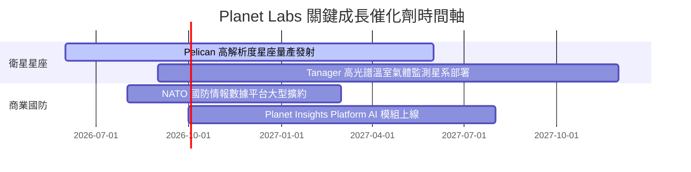

### 9.2 TAM 市場規模分析

```
╔══════════════════════════════════════════════════════════════╗
║              Planet Labs 潛在市場規模 (TAM) 演變             ║
╠══════════════════════════════════════════════════════════════╣
║  傳統地理空間影像 TAM:      $50B  ████████                   ║
║  國防 AI 與地理情報分析 TAM: $120B ███████████████████        ║
║  碳交易與氣象 ESG 監測 TAM:  $30B  █████                     ║
╠══════════════════════════════════════════════════════════════╣
║  📊 PL 目前滲透率僅約 0.28% ($335M / $120B)，成長空間極為廣闊 ║
╚══════════════════════════════════════════════════════════════╝
```

### 9.3 成長驅動力結構圖

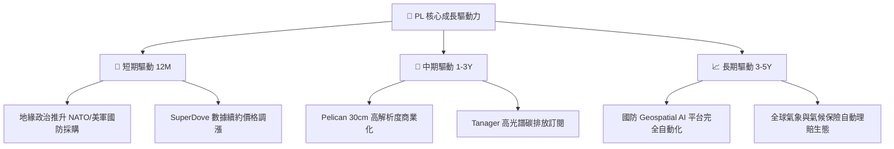

---

## 10. 風險矩陣

### 10.1 風險評分矩陣

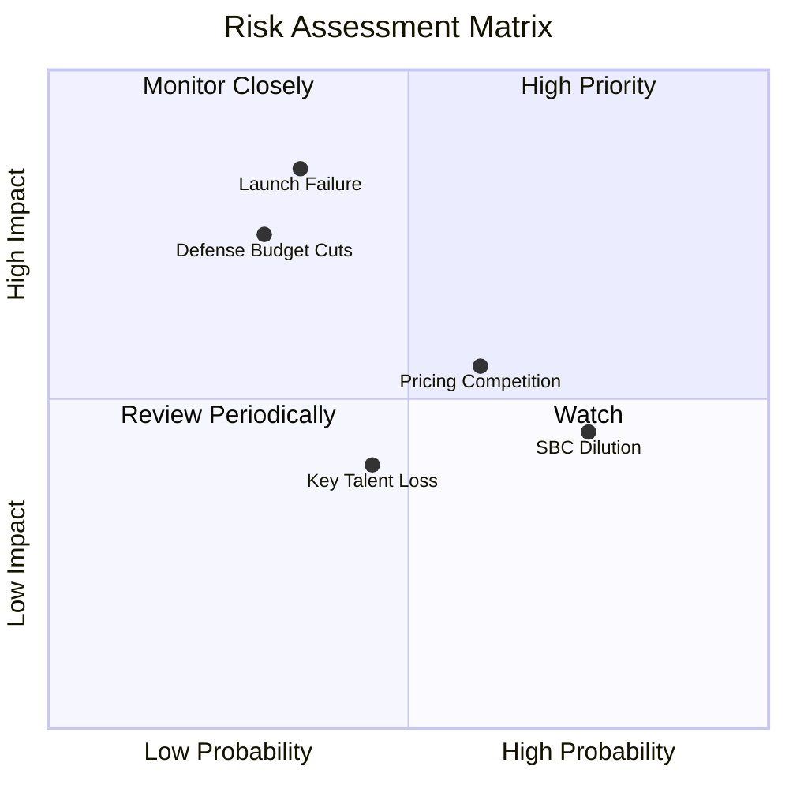

### 10.2 風險清單詳細分析

| # | 風險項目 | 發生機率 | 財務衝擊 | 風險評分 | 緩解措施與機構觀察 |
|---|----------|----------|----------|----------|--------------------|
| 1 | 🔴 **火箭發射延誤或失敗** | 中 (35%) | 高 (-20% 營收推升) | 🔴 7.2/10 | 多元化發射供應商（SpaceX、Rocket Lab） |
| 2 | 🟡 **政府國防預算轉向** | 低 (30%) | 高 (-15% 營收) | 🟡 6.0/10 | 簽署多年期長約，提高合約粘性 |
| 3 | 🟡 **SBC 對股東權益稀釋** | 高 (75%) | 中 (-2% EPS/年) | 🟡 5.5/10 | 管理層承諾隨營運轉正縮減 SBC 比例 |
| 4 | 🟢 **光學競爭對手低價競爭** | 中 (60%) | 中 (-5% 毛利率) | 🟢 4.5/10 | 靠 10 年歷史數據庫建造深度護城河 |

---

## 11. 投資建議

### 11.1 最終綜合評級雷達圖

```
╔══════════════════════════════════════════════════════════════╗
║                Planet Labs 最終綜合評級雷達                 ║
╠══════════════════════════════════════════════════════════════╣
║ 基本面強度  8.5 ▓▓▓▓▓▓▓▓▓▓▓▓▓▓▓▓▓░░░  🟢 強勁                ║
║ 成長動能    8.5 ▓▓▓▓▓▓▓▓▓▓▓▓▓▓▓▓▓░░░  🟢 顯著加速            ║
║ 財務健康    8.5 ▓▓▓▓▓▓▓▓▓▓▓▓▓▓▓▓▓░░░  🟢 充沛現金            ║
║ 護城河深度  9.0 ▓▓▓▓▓▓▓▓▓▓▓▓▓▓▓▓▓▓░░  🏆 獨家數據資產        ║
║ 估值合理性  6.5 ▓▓▓▓▓▓▓▓▓▓▓▓▓░░░░░░░  🟡 倍數略偏高          ║
╠══════════════════════════════════════════════════════════════╣
║ 綜合總評分  7.6 ▓▓▓▓▓▓▓▓▓▓▓▓▓▓▓░░░░░  🟡 持有（建議低吸）    ║
╚══════════════════════════════════════════════════════════════╝
```

### 11.2 目標價與隱含報酬率

| 情境 | 機率權重 | 12M 目標價 | 當前股價 | 隱含報酬率 (Upside) | 安全邊際 (MOS) | 建議操作 |
|------|----------|------------|----------|---------------------|----------------|----------|
| 🔴 悲觀情境 | 20% | **$14.20** | $23.62 | -39.9% | N/A | 停損觀察 |
| 🟡 **基準情境** | **60%** | **$28.50** | **$23.62** | **+20.7%** | **+17.1%** | **逢低分批買入** |
| 🟢 樂觀情境 | 20% | **$42.00** | $23.62 | +77.8% | +43.8% | 持股待漲 |

### 11.3 買入時機與觸發因素

```
╔══════════════════════════════════════════════════════════════════╗
║                  ✅ 買入觸發因素 Checklist                      ║
╠══════════════════════════════════════════════════════════════════╣
║  立即買入觸發條件：                                              ║
║  ✅ 股價回檔至建議買入區間 $18.50 – $22.00 (MOS ≥ 23%)           ║
║  ✅ 季度營收 YoY 成長率維持在 35% 以上                           ║
║                                                                  ║
║  加碼觸發條件：                                                  ║
║  ☐ Pelican 星座成功入軌並產出首批商業數據                        ║
║  ☐ 贏得單筆年化價值 > $5,000 萬美元之國防情報大型合約            ║
║                                                                  ║
║  減碼/停損觸發條件：                                             ║
║  ☐ 核心單季營收 YoY 增速跌破 15%                                 ║
║  ☐ 單季 FCF 重新大幅轉負（<-$3,000 萬）                          ║
╚══════════════════════════════════════════════════════════════════╝
```

### 11.4 投資人適配度分析

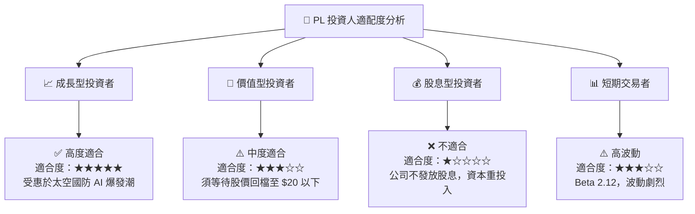

### 11.5 每季財報監控清單（Quarterly Watch List）

| 關鍵指標 | 追蹤目標 | 警戒線 (減碼門檻) | 催化線 (加碼門檻) |
|----------|----------|-------------------|-------------------|
| **單季營收 (Quarterly Revenue)** | > $9,500 萬 | < $8,500 萬 (YoY < 15%) | > $1.05 億 (YoY > 45%) |
| **毛利率 (Gross Margin)** | > 56.0% | < 50.0% | > 60.0% |
| **自由現金流 (FCF)** | 持續維持 > $1,000 萬 | 轉負且 <-$2,500 萬 | > $3,000 萬/季 |
| **遞延收入 (Unearned Rev)** | > $2.20 億 | < $1.50 億 | > $2.80 億 |

### 11.6 反面論證：什麼會證明論點錯誤（What Would Change My Mind）

```
╔══════════════════════════════════════════════════════════════════╗
║              ⚠️ 論點失效條件（Disconfirming Evidence）           ║
╠══════════════════════════════════════════════════════════════════╣
║  本投資論點在下列情況成立時應重新檢視或清倉退出：                ║
║  ☐ 核心營收 YoY 成長率連續兩季跌破 15%                           ║
║  ☐ Pelican 星座遭遇重大發射事故，且無備用衛星可於 6 個月內補位  ║
║  ☐ 自由現金流重新轉負且營運現金流不足以支撐資本支出              ║
║  ☐ ROIC 重新跌破 WACC (12.50%)，摧毀股東價值                    ║
║  ☐ 主要國防客戶（NGA/美國國防部）轉向競爭對手且不予續約         ║
╚══════════════════════════════════════════════════════════════════╝
```

---

> **免責聲明**：本報告為 AI 自動生成之機構級研究報告，僅供學術與投資研究參考，不構成任何買賣建議。投資有風險，入市需謹慎。