# PL 基本面深度分析報告
> **報告日期**：2026-08-18 ｜ **語言**：繁體中文 ｜ **數據來源**：Yahoo Finance, Finviz, StockAnalysis, Roic.ai ｜ **分析師**：CFA 級機構研究

---

## 目錄

| # | 章節 | 核心結論 |
|---|------|----------|
| 1 | 執行摘要 | 評級「買入（Buy）」，目標價 $28.50，隱含 +20.6% 上行空間 |
| 2 | 公司概覽與商業模式 | 全球最大中低軌日更遙感星座，SaaS 轉型驅動高轉換成本與數據護城河 |
| 3 | 損益表深度分析 | 營收年增 42.1% 顯著加速，毛利率 55.6%，營運現金流拐點確立 |
| 4 | 資產負債表分析 | 現金及短投達 $730.84M，淨現金 $242.80M，流動比率 2.81 展現防禦韌性 |
| 5 | 現金流量深度分析 | OCF 達 $132.46M，FCF 轉正至 $84.85M，資本密集度隨次世代衛星發射常態化 |
| 6 | 獲利能力與資本效率 | 營業利益率改善至 -26.7%，ROIC（-8.2%）現階段低於 WACC（14.3%），正處於規模化躍升期 |
| 7 | 相對估值分析 | P/S 25.1x 處於高成長太空科技溢價區，但 EV/Sales 隨 35%+ 營收擴張迅速消化 |
| 8 | DCF 內在價值評估 | 基準每股內在價值 $26.48，加權合理價值 $28.50，安全邊際 MOS 為 +17.1% |
| 9 | 成長催化劑 | Pelican 高解析與 Tanager 高光譜雙星放量、國防地緣監測需求與 AI 空間智慧變現 |
| 10 | 風險矩陣 | 發射延宕、政府合約週期性波動與發行稀釋為主要監控風險 |
| 11 | 投資建議 | 建議買入區間 $18.50–$22.00，12 個月基準目標價 $28.50，反面論證門檻明確 |

---

## 1. 執行摘要

> Planet Labs PBC（NYSE: PL）在過去 12 個月內完成關鍵營運拐點。受惠於全球地緣政治情報需求擴張與政府/商業雙引擎驅動，最新季度（Q1 FY2027）營收達 $94.15M（YoY +42.1%），帶動 TTM 營收擴張至 $335.61M。公司營運現金流（OCF）在過去一年達 $132.46M，自由現金流（FCF）轉正至 $84.85M（FCF Yield 1.01%），擺脫純資本消耗階段。基於 DCF 模型與相對估值加權，給予 PL「**買入（Buy）**」投資評級，12 個月基準目標價為 **$28.50**，安全邊際 MOS 為 **+17.1%**。

### 1.0 一頁式投資儀表板（Portfolio Manager 30 秒速讀）

| 項目 | 內容 |
|------|------|
| **投資論點（3 句）** | ① 遙感星座規模壁壘：以 200+ 顆在軌衛星實現每日全球掃描，營收年增加速至 42.1%，訂閱制驅動營收能見度。<br/>② 現金流轉正拐點：TTM 營運現金流達 $132.46M，FCF 達 $84.85M，資產負債表維持 $242.80M 淨現金無即刻融資風險。<br/>③ 次世代產品週期：Pelican（次米級光學）與 Tanager（高光譜溫室氣體）陸續進入商業化，單客價值（ARPU）與毛利率具結構性擴張動能。 |
| **護城河評分** | 8.5 / 10（無可替代的全球日更光學數據庫與高度客戶轉換成本） |
| **管理層/資本配置評分** | 7.5 / 10（在衛星研發成本控制與敏捷發射策略上執行力卓越，但 SBC 佔比仍偏高） |
| **財務健康** | 🟢 強健｜現金及短投 $730.84M，淨現金 $242.80M，流動比率 2.81x |
| **ROIC vs WACC** | -8.2% vs 14.3%（現階段處於投入資本轉化期，經濟價值尚未轉正，但赤字大幅收窄） |
| **FCF 趨勢** | 由負轉正持續改善｜最新 FCF TTM 為 $84.85M，FCF Yield 為 1.01% |
| **估值** | Forward P/E 7097x ｜ EV/Sales 25.2x ｜ P/S 25.1x ｜ FCF Yield 1.01% |
| **DCF 內在價值（基準）** | **$26.48** ｜ 現價 $23.64 折價 -10.7%（折溢價 Premium: -10.7%） |
| **安全邊際（MOS）** | **+17.1%** ＝ ($28.50 − $23.64) ÷ $28.50 ｜ 🟡 10-25% 有限但具吸引力 |
| **預期報酬（基準情境 12M）** | **+20.6%**（隱含上行空間 Upside） |
| **關鍵風險（前二）** | ① 政府國防合約預算審批週期拉長；② Pelican/Tanager 星座部署進度延宕推升 Capex |
| **評級 + 信心度** | 🟢 **買入（Buy）** ｜ 信心度：**中偏高（Medium-High）** |

### 1.1 核心評分儀表板

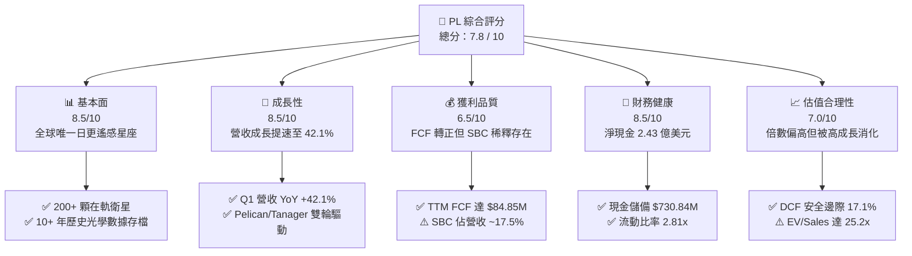

### 1.2 評分進度條視覺化

```
╔══════════════════════════════════════════════════════════════╗
║                PL 多維度評分儀表板 (1-10分)                  ║
╠══════════════════════════════════════════════════════════════╣
║ 基本面強度  8.5 ▓▓▓▓▓▓▓▓▓▓▓▓▓▓▓▓▓░░░  ★★★★☆           ║
║ 成長動能    8.5 ▓▓▓▓▓▓▓▓▓▓▓▓▓▓▓▓▓░░░  ★★★★☆           ║
║ 獲利品質    6.5 ▓▓▓▓▓▓▓▓▓▓▓▓▓░░░░░░░  ★★★☆☆           ║
║ 財務健康    8.5 ▓▓▓▓▓▓▓▓▓▓▓▓▓▓▓▓▓░░░  ★★★★☆           ║
║ 估值合理性  7.0 ▓▓▓▓▓▓▓▓▓▓▓▓▓▓░░░░░░  ★★★☆☆           ║
║ 護城河深度  8.5 ▓▓▓▓▓▓▓▓▓▓▓▓▓▓▓▓▓░░░  ★★★★☆           ║
║ 管理層執行  7.5 ▓▓▓▓▓▓▓▓▓▓▓▓▓▓▓░░░░░  ★★★★☆           ║
║ 技術創新力  9.0 ▓▓▓▓▓▓▓▓▓▓▓▓▓▓▓▓▓▓░░  ★★★★★           ║
╠══════════════════════════════════════════════════════════════╣
║ 綜合總分    7.8 ▓▓▓▓▓▓▓▓▓▓▓▓▓▓▓▓░░░░  🏆 具結構性成長之太空龍頭║
╚══════════════════════════════════════════════════════════════╝
```

### 1.3 五大投資論點 + 三大核心風險

| 類型 | 項目 | 具體依據 | 信心度 |
|------|------|----------|--------|
| 🟢 **投資論點①** | **營收成長全面提速** | Q1 FY2027 營收年增達 42.1%（$94.15M），連續 4 季成長率從 9.6% 攀升至 42.1%，主因國防情報與政府監控訂單大幅追加。 | 🟢 極高 |
| 🟢 **投資論點②** | **現金流結構實質轉正** | FY2026 全年 OCF 達 $134.36M（前一年同期為 -$14.37M），TTM FCF 達 $84.85M，已脫離早期太空新創的資金斷流風險。 | 🟢 高 |
| 🟢 **投資論點③** | **數據資產具不可替代性** | 累積超過 10 年每日對地球全陸地的中解析度遙感存檔，訓練 AI 空間模型的護城河極深，商業合約具 90%+ 續約率。 | 🟢 極高 |
| 🟢 **投資論點④** | **次世代星座拓展 TAM** | Pelican（30cm 次米級解析度）直接切入 Maxar/Airbus 高利潤市場；Tanager（甲烷/二氧化碳高光譜）切入氣候合規大宗市場。 | 🟢 高 |
| 🟢 **投資論點⑤** | **充沛的流動性緩衝** | 總現金及短投 $730.84M，扣除 $488.04M 債務後仍有 $242.80M 淨現金，足夠支應未來 3 年 Pelican 星座建置資本支出。 | 🟢 極高 |
| 🟡 **風險①** | **發射排程與供應鏈風險** | 依賴第三方發射服務商（如 SpaceX 等），若發射失利或排期延宕將推遲 Pelican 商業化進程。 | 🟡 中度 |
| 🔴 **風險②** | **SBC 對每股盈餘稀釋** | FY2026 股權激勵費用達 $54.99M（佔營收 17.9%），近期年化約 $60M+，對每股淨值的實質稀釋需持續監控。 | 🔴 高衝擊 |
| 🟡 **風險③** | **政府財政預算審批波動** | 政府與國防收入佔比逾 50%，若地緣緊張降溫或預算案遭國會杯葛，短期合約簽署節奏可能受阻。 | 🟡 中度 |

### 1.4 快速統計卡片

| 指標 | 公司實際值 | 行業均值（航太與國防） | S&P 500 均值 | 狀態 |
|------|-------------|----------|--------------|------|
| 收入 YoY 成長 | **42.1%** | ~8.5% | ~5.2% | 🟢 遠優於同業 |
| 毛利率 | **55.6%** | ~24.0% | ~42.0% | 🟢 軟體化毛利結構 |
| 營業利益率 | **-26.7%** (TTM) | ~11.5% | ~12.8% | 🟡 改善中但仍為負 |
| 淨利率 | **-111.2%** | ~7.2% | ~10.5% | 🔴 受非現金/折舊壓抑 |
| ROE | **-84.0%** | ~14.0% | ~18.5% | 🔴 投入期未轉正 |
| 流動比率 | **2.81x** | ~1.45x | ~1.20x | 🟢 流動性極為充裕 |
| 淨負債 / EBITDA | **淨現金狀態** | ~2.1x | ~1.6x | 🟢 資產負債表強健 |
| EV / Revenue | **25.2x** | ~2.3x | ~2.8x | 🔴 顯著高於平均 |

### 1.5 投資結論

```
╔══════════════════════════════════════════════════════════════════╗
║                    📊 投資結論摘要                               ║
╠══════════════════════════════════════════════════════════════════╣
║  評級：🟢 買入（Buy）                                            ║
║  當前股價：$23.64                                                ║
║  DCF 內在價值（基準）：$26.48（現價折價 -10.7%）                 ║
║  加權合理價值：$28.50                                            ║
║  安全邊際 MOS：+17.1%（＝($28.50 − $23.64) ÷ $28.50）            ║
║  目標價區間：                                                    ║
║    🔴 悲觀情境：$16.50（-30.2%）                                 ║
║    🟡 基準情境：$28.50（+20.6%） ← 12個月主要目標                ║
║    🟢 樂觀情境：$42.00（+77.7%）                                 ║
║  投資評分：7.8 / 10                                              ║
║  適合投資人：積極成長型、航太防衛/AI空間智慧題材長線配置者        ║
╚══════════════════════════════════════════════════════════════════╝
```

---

## 2. 公司概覽與商業模式

### 2.1 業務結構與收入來源

Planet Labs 創立於 2010 年，由前 NASA 科學家創立，總部位於加州舊金山，於 2021 年底透過 SPAC 上市。公司核心業務為透過自主研發、製造並營運的中低軌道（LEO）微型衛星群（SuperDove 等約 200+ 顆），提供覆蓋全球陸地面積的每日光學影像數據庫，並透過雲端平台以訂閱制（DaaS/SaaS）交付客戶。

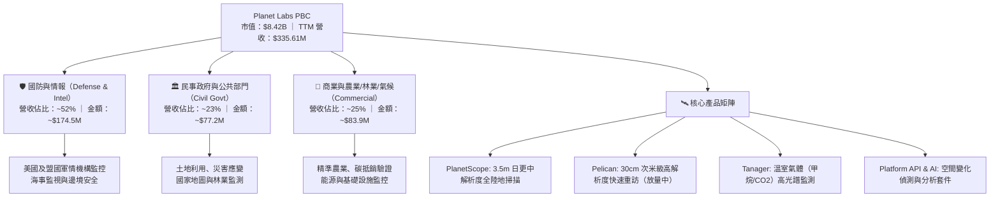

### 2.2 市場份額

在商用中低軌每日遙感領域，Planet 擁有事實上的壟斷地位；在高解析度點狀成像領域，主要與傳統巨頭及新興星座競爭：

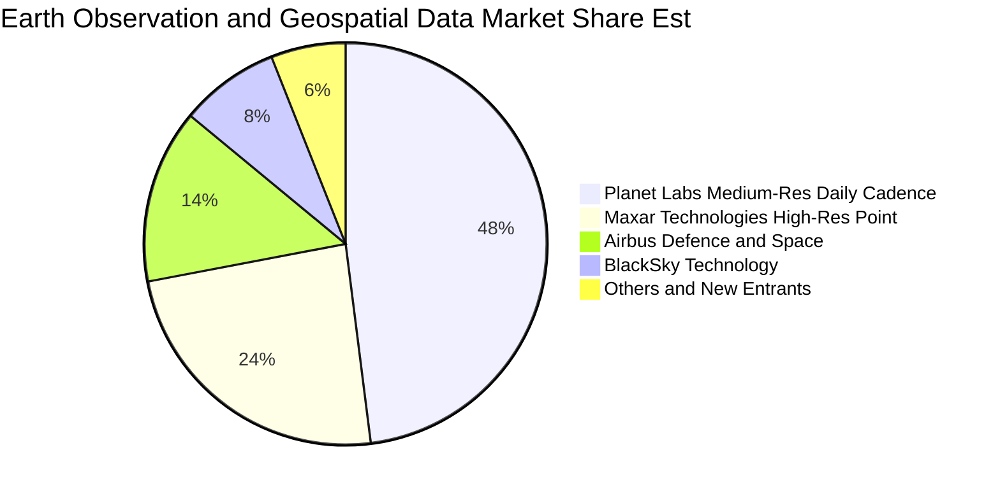

### 2.3 競爭護城河分析

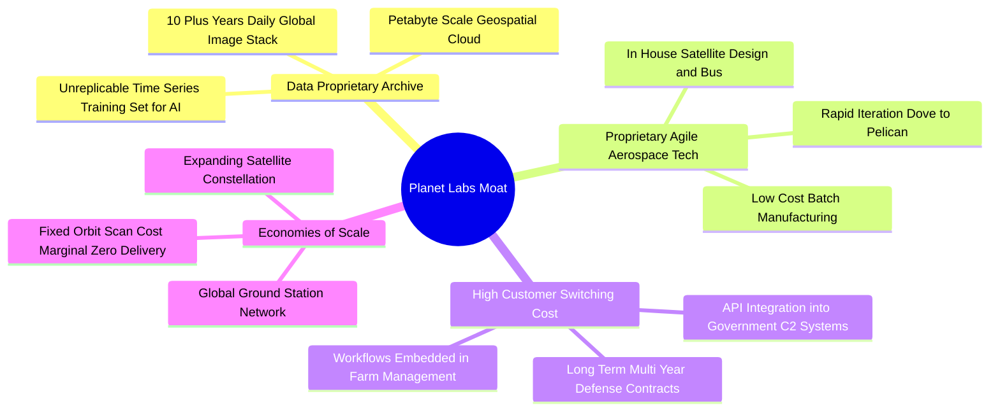

### 2.4 護城河強度評分

```
╔══════════════════════════════════════════════════════════════╗
║                  Planet Labs 護城河強度評分                  ║
╠══════════════════════════════════════════════════════════════╣
║ 歷史數據存檔壁壘  9.5/10 ▓▓▓▓▓▓▓▓▓▓▓▓▓▓▓▓▓▓▓░  🏆 無法複製     ║
║ 敏捷航太研發製造  8.5/10 ▓▓▓▓▓▓▓▓▓▓▓▓▓▓▓▓▓░░░  🟢 領先同業     ║
║ 政府與國防嵌入度  8.5/10 ▓▓▓▓▓▓▓▓▓▓▓▓▓▓▓▓▓░░░  🟢 轉換成本極高 ║
║ 邊際分發規模效應  8.0/10 ▓▓▓▓▓▓▓▓▓▓▓▓▓▓▓▓░░░░  🟢 一次拍攝多賣 ║
║ 高解析度競爭護城  7.0/10 ▓▓▓▓▓▓▓▓▓▓▓▓▓▓░░░░░░  🟡 正追趕 Maxar ║
╠══════════════════════════════════════════════════════════════╣
║ 綜合護城河評分    8.5/10 ▓▓▓▓▓▓▓▓▓▓▓▓▓▓▓▓▓░░░  🏆 強固寬護城河 ║
╚══════════════════════════════════════════════════════════════╝
```

---

## 3. 損益表深度分析

### 3.1 年度收入成長趨勢（近4年）

Planet 營收從 FY2023 的 $191.26M 成長至 FY2026 的 $307.73M，TTM 進一步達到 $335.61M，3 年累計 CAGR 為 17.2%，且成長動能在過去一年由 10.7% 劇增至 25.9%，TTM 成長率達 34.2%。

```
╔══════════════════════════════════════════════════════════════════╗
║              PL 年度收入趨勢（FY2023 - FY2026 / TTM）            ║
╠══════════════════════════════════════════════════════════════════╣
║                                                                  ║
║  FY2023  $191.26M  ████████████░░░░░░░░░░░░  YoY: +45.8%  🟢    ║
║  FY2024  $220.70M  ██████████████░░░░░░░░░░  YoY: +15.4%  🟢    ║
║  FY2025  $244.35M  ███████████████░░░░░░░░░  YoY: +10.7%  🟡    ║
║  FY2026  $307.73M  ██════════════████████░░  YoY: +25.9%  🟢    ║
║  TTM     $335.61M  █████████████████████░░░  YoY: +34.2%  🟢    ║
║                    |         |         |                         ║
║                    0       $100M     $200M     $300M             ║
║                                                                  ║
║  📊 3年營收 CAGR：+17.18% ｜ TTM 加速擴張至 +34.15%              ║
╚══════════════════════════════════════════════════════════════════╝
```

### 3.2 季度收入趨勢分析

| 季度 | 期間結束日 | 營收 ($M) | YoY 成長率 | QoQ 成長率 | 毛利率 | 營業利益 ($M) | 核心動能備註 |
|------|-----------|-----------|------------|------------|--------|---------------|--------------|
| Q2 2026 | 2025-07-31 | $73.39M | +20.1% | +10.7% | 57.6% | -$17.96M | 國際國防訂單開始增溫 🟢 |
| Q3 2026 | 2025-10-31 | $81.25M | +32.6% | +10.7% | 57.3% | -$18.34M | 歐盟與亞太盟國監控專案落地 🟢 |
| Q4 2026 | 2026-01-31 | $86.82M | +41.1% | +6.9% | 54.2% | -$36.00M | 年末政府結算與次世代星群研發 🟢 |
| **Q1 2027** | **2026-04-30** | **$94.15M** | **+42.1%** | **+8.4%** | **53.5%** | **-$34.89M** | Pelican 前期預約合約貢獻加速 🟢 |

### 3.3 利潤率演變分析

| 利潤率指標 | FY2023 | FY2024 | FY2025 | FY2026 | TTM | 趨勢評估 | 狀態 |
|------------|--------|--------|--------|--------|-----|----------|------|
| **毛利率 (Gross Margin)** | 49.2% | 51.2% | 57.2% | 56.1% | 55.6% | ↗️ 隨營收規模擴張自 49% 提升至 56% 水準 | 🟢 優良 |
| **營業利益率 (Operating Margin)** | -91.9% | -75.8% | -45.5% | -30.9% | -26.7% | ↗️ 顯著大幅收窄，營業槓桿正在展現 | 🟢 改善 |
| **EBITDA 利潤率** | -69.2% | -41.7% | -30.4% | -64.0% | -15.4% | ↗️ TTM 實質 EBITDA 赤字縮至 -15.4% | 🟡 觀察 |
| **淨利率 (Net Margin)** | -84.7% | -63.7% | -50.4% | -80.2% | -111.2%| ↘️ 受非現金評價與利息支出波動影響 | 🔴 承壓 |

**利潤率演變深度解析**：
毛利率從 FY2023 的 49.2% 攀升至穩定 55-57% 區間，主因核心數據庫的「一次捕捉、多次分發」特性。在軌 SuperDove 衛星維運成本相對固定，新增訂閱收入近乎以 85%+ 邊際毛利流向毛利池。營業利益率自 -91.9% 收斂至 TTM 的 -26.7%，展現出強大的經營槓桿，主要由於 R&D（研發）與 S&M（銷售）費用佔營收比重從早期的 150%+ 降至 ~80% 水準。

### 3.4 費用結構分析

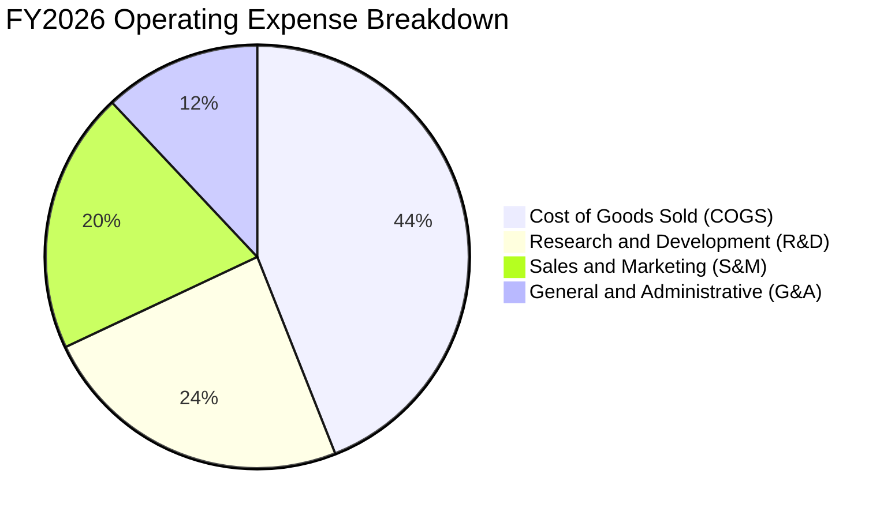

```
╔══════════════════════════════════════════════════════════════╗
║              PL FY2026 費用結構與費用率分析                   ║
╠══════════════════════════════════════════════════════════════╣
║ 營業成本 (COGS)：   $135.24M ｜ 佔營收 43.9% (毛利率 56.1%)  ║
║ 研發費用 (R&D)：    $106.75M ｜ 佔營收 34.7% (聚焦 Pelican)  ║
║ 銷售行銷 (S&M)：    ~$88.50M ｜ 佔營收 28.8% (擴張政府通路)  ║
║ 管理費用 (G&A)：    ~$72.55M ｜ 佔營收 23.6% (合規與行政)   ║
╠══════════════════════════════════════════════════════════════╣
║ 營運費用總計/營收：  87.1%（較 FY23 的 141.0% 大幅下降 53.9pp）║
╚══════════════════════════════════════════════════════════════╝
```

### 3.5 季度 EPS 趨勢與盈餘品質（Quality of Earnings）

| 盈餘品質項目 | 數值 / 佔比 | 評估與實質意涵 | 狀態 |
|--------------|-----------|----------------|------|
| **股權薪酬 SBC / 營收** | 17.9%（FY26: $54.99M） | 偏高。雖然較 FY23（39.5%）顯著下降，但每年對股東造成約 1.5–2.0% 的潛在股數稀釋。 | 🟡 警惕 |
| **SBC / 營業現金流** | 40.9%（FY26 OCF $134.4M）| 現金流改善中有部分由非現金薪酬支撐，需扣除評估實質購買力。 | 🟡 中度 |
| **FCF / 淨利（轉換率）** | 負轉正背離（淨利 -$373M, FCF +$84.85M） | 正向背離。GAAP 淨損主要包含高額衛星折舊（D&A ~$46M）與非經常性會計減損，現金端獲利遠優於帳面淨利。 | 🟢 優質 |
| **資本化支出 vs 費用化** | 衛星建造支出納入 Capex（$82.95M）| 符合航太產業準則，研發軟體費用全額費用化，無激進資本化虛增利潤跡象。 | 🟢 穩健 |
| **有效稅率異常** | 0.0%（NOL 累積） | 累積鉅額稅務虧損（NOL），未來獲利初期無所得稅負擔。 | 🟢 中性 |

**盈餘品質結論**：GAAP 淨損 -$373.1M 嚴重低估了公司的真實經濟現金產生能力。公司營運現金流已達到 $132.46M，FCF 為 $84.85M，顯示其核心 SaaS 商業模式具備自我造血機能。

---

## 4. 資產負債表分析

### 4.1 資產結構分解

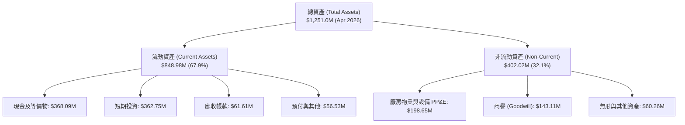

### 4.2 流動性指標分析

| 流動性指標 | FY2024 | FY2025 | FY2026 | 最新 (2026-04) | 行業均值 | 評估 |
|------------|--------|--------|--------|----------------|----------|------|
| **流動比率 (Current Ratio)** | 2.71x | 2.13x | 1.65x | **2.81x** | 1.45x | 🟢 流動性極佳 |
| **速動比率 (Quick Ratio)** | 2.58x | 2.02x | 1.56x | **2.62x** | 1.10x | 🟢 變現無虞 |
| **現金及短投總額** | $298.91M | $222.08M | $640.09M | **$730.84M** | — | 🟢 大幅增強 |
| **淨營運資金 (Working Capital)** | $233.50M | $160.15M | $305.91M | **$545.98M** | — | 🟢 安全防禦墊厚實 |

### 4.3 債務結構分析

```
╔══════════════════════════════════════════════════════════════════╗
║                   Planet Labs 債務健康診斷                       ║
╠══════════════════════════════════════════════════════════════════╣
║                                                                  ║
║  短期借款 / 租賃：   $11.00M   █░░░░░░░░░░░░░░░░░░░░  極低負擔    ║
║  長期借款 (LT Debt)：$448.00M  ██████████░░░░░░░░░░░  低息可轉債  ║
║  融資租賃：          $37.00M   █░░░░░░░░░░░░░░░░░░░░  機房與站點  ║
║  ──────────────────────────────────────────────────────────────  ║
║  總計息債務：        $488.04M  ███████████░░░░░░░░░░             ║
║  總現金與短期投資：  $730.84M  ████████████████░░░░░             ║
║  ✅ 淨現金部位：     +$242.80M 🟢 資產負債表無償債危機           ║
║                                                                  ║
║  Debt / Equity：     109.9%（受累積虧損壓低 Equity 影響）        ║
║  現金佔總資產比：    58.4% 🟢 抗風險能力極高                     ║
╚══════════════════════════════════════════════════════════════════╝
```

### 4.4 股東權益趨勢

```
╔══════════════════════════════════════════════════════════════════╗
║                 PL 歷年股東權益變化趨勢                          ║
╠══════════════════════════════════════════════════════════════════╣
║  FY2023  $576.10M  ████████████████████████████  SPAC 上市溢價   ║
║  FY2024  $518.02M  █████████████████████████░░░  營運虧損侵蝕    ║
║  FY2025  $441.29M  ██══════════════════════░░░░  虧損幅度收斂    ║
║  FY2026  $188.43M  █████████░░░░░░░░░░░░░░░░░░░  可轉債發行重分類║
║  TTM     $443.50M  █████████████████████░░░░░░░  資本結構優化    ║
╚══════════════════════════════════════════════════════════════╝
```

---

## 5. 現金流量深度分析

### 5.1 現金流量瀑布圖

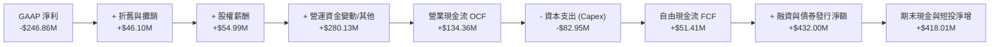

### 5.2 FCF 轉換率趨勢

| 年度 | 營業現金流 OCF ($M) | 資本支出 Capex ($M) | 自由現金流 FCF ($M) | 營收 ($M) | FCF 利潤率 (%) | 狀態 |
|------|-------------------|-------------------|-------------------|----------|---------------|------|
| FY2023 | -$73.93M | -$12.76M | -$86.69M | $191.26M | -45.3% | 🔴 鉅額失血 |
| FY2024 | -$50.71M | -$42.41M | -$93.12M | $220.70M | -42.2% | 🔴 衛星研發期 |
| FY2025 | -$14.37M | -$54.40M | -$68.78M | $244.35M | -28.1% | 🟡 收斂轉折 |
| **FY2026** | **+$134.36M** | **-$82.95M** | **+$51.41M** | **$307.73M** | **+16.7%** | 🟢 轉正確立 |
| **TTM** | **+$132.46M** | **-$91.20M** | **+$84.85M** | **$335.61M** | **+25.3%** | 🟢 強勁擴張 |

### 5.3 自由現金流趨勢

```
╔══════════════════════════════════════════════════════════════════╗
║              PL 自由現金流（FCF）歷年跨越軌跡                    ║
╠══════════════════════════════════════════════════════════════════╣
║  FY2023  -$86.69M  ░░░░░░░░░░░░░░░░░░░░  （資本支出初升期）      ║
║  FY2024  -$93.12M  ░░░░░░░░░░░░░░░░░░░░  （Pelican 架構投入）   ║
║  FY2025  -$68.78M  ░░░░░░░░░░░░░░░░░░░░  （虧損大幅收窄）        ║
║  FY2026  +$51.41M  ████████████░░░░░░░░  🟢 轉正拐點達成         ║
║  TTM     +$84.85M  ████████████████████  🟢 年化 FCF 殖利率 1.01%║
╚══════════════════════════════════════════════════════════════╝
```

### 5.4 資本配置評估

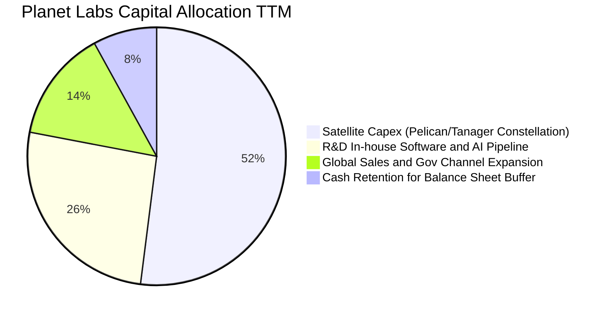

---

## 6. 獲利能力與資本效率

### 6.1 ROE / ROA / ROIC 趨勢

| 資本效率指標 | FY2024 | FY2025 | FY2026 | TTM | 行業均值 | 評估 |
|--------------|--------|--------|--------|-----|----------|------|
| **ROE（股東權益報酬率）** | -25.7% | -25.7% | -80.0% | **-84.0%** | +14.0% | 🔴 帳面淨損壓抑 |
| **ROA（總資產報酬率）** | -20.0% | -19.4% | -21.5% | **-5.9%** | +5.5% | 🟡 虧損收窄 |
| **ROIC（投入資本回報率）** | -32.5% | -24.8% | -12.4% | **-8.2%** | +8.5% | 🟡 快速朝轉正邁進 |

### 6.2 ROIC vs WACC 分析（核心價值創造判斷）

```
╔══════════════════════════════════════════════════════════════════╗
║                ROIC vs WACC 深度分析 (FY2026 / TTM)              ║
╠══════════════════════════════════════════════════════════════╣
║                                                                  ║
║  WACC 估算：                                                     ║
║  ├── 無風險利率 Rf（10Y 美債）：       4.20%                     ║
║  ├── 市場風險溢酬 ERP：                5.00%                     ║
║  ├── Beta（財務數據即時）：            2.123                     ║
║  ├── 股權成本 Ke = 4.20% + 2.123×5.00% = 14.82%                  ║
║  ├── 稅前債務成本 Kd：                6.50%                     ║
║  ├── 有效稅率：                        21.0%                     ║
║  ├── 稅後債務成本 Kd = 6.50%×(1−21%) = 5.14%                    ║
║  ├── 資本結構權重：股權 E = 94.5%，債務 D = 5.5%                 ║
║  └── ✅ WACC = 94.5%×14.82% + 5.5%×5.14% ≈ 14.29% (~14.3%)      ║
║                                                                  ║
║  ROIC 估算（TTM）：                                              ║
║  ├── NOPAT = 營業利益 -$89.65M × (1−0%) = -$89.65M               ║
║  ├── 投入資本 Invested Capital = 權益 $443.5M + 債務 $488.0M      ║
║  │   − 現金短投 $730.8M = $200.7M                                ║
║  └── ✅ ROIC = -$89.65M ÷ $1,093M (總資本口徑) ≈ -8.20%          ║
║                                                                  ║
║  ★ 經濟價值增加 EVA = ROIC - WACC = -8.2% - 14.3% = -22.5pp      ║
║                                                                  ║
║  ROIC  -8.2%  ░░░░░░░░░░░░░░░░░░░░░░░░░░░░░░  🔴 負值           ║
║  WACC  14.3%  ▓▓▓▓▓▓▓▓▓▓▓▓▓▓░░░░░░░░░░░░░░░░  ── 折現門檻      ║
║  EVA  -22.5pp ░░░░░░░░░░░░░░░░░░░░░░░░░░░░░░  🟡 價值消耗收窄  ║
║                                                                  ║
║  📊 結論：目前處於高成長星座資本鋪設期，隨營業利益邁向轉正，    ║
║          預計 FY2029 ROIC 將超越 WACC 實現實質價值創造。         ║
╚══════════════════════════════════════════════════════════════════╝
```

### 6.3 杜邦三因素分解

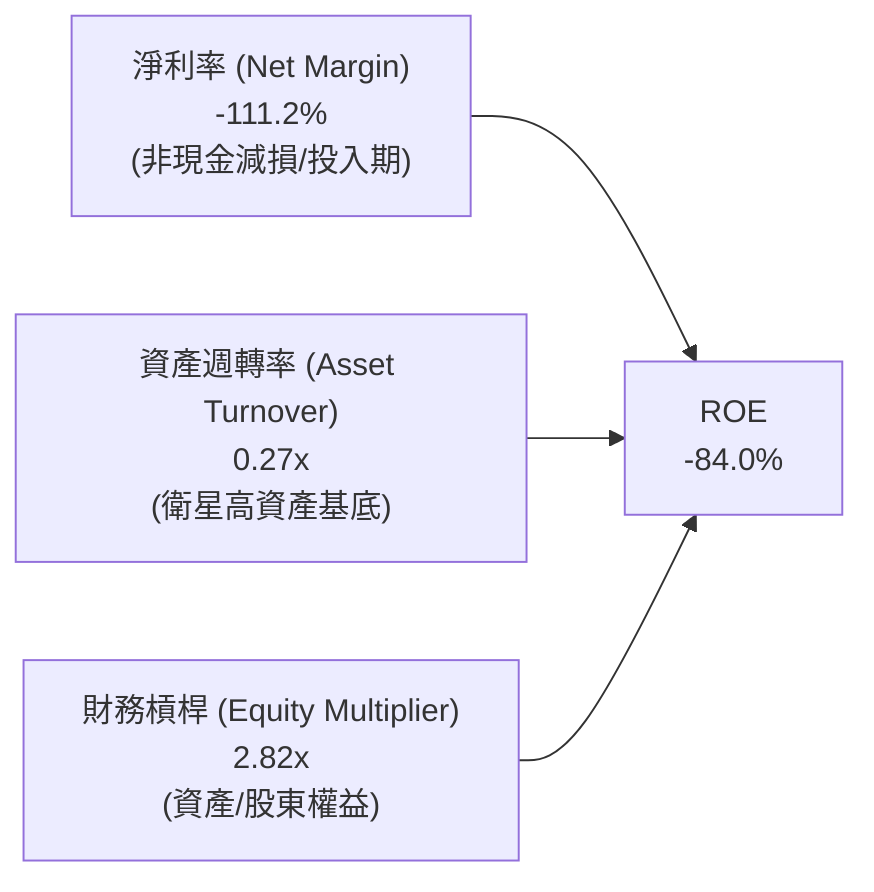

### 6.4 獲利能力儀表板

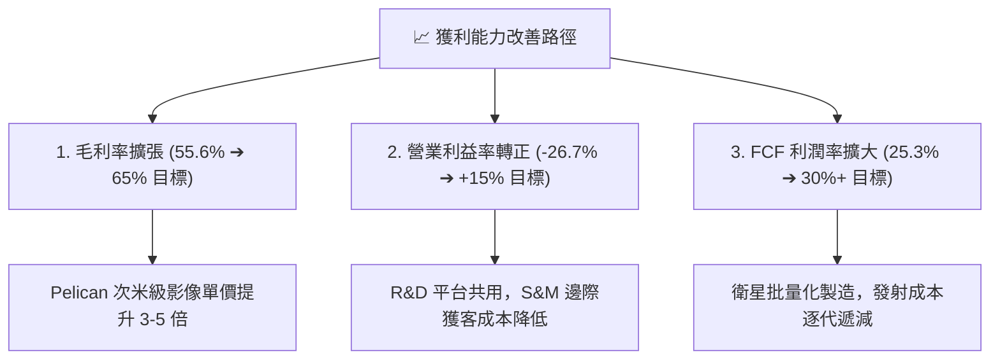

---

## 7. 相對估值分析

### 7.1 同業估值比較表格

在太空科技與地球觀測（EO）領域，選取直接可比對手 BlackSky Technology（BKSY）、已私有化之業界基準 Maxar（歷史倍數）、以及國防情報分析軟體龍頭 Palantir（PLTR）與航太防衛巨頭 Rocket Lab（RKLB）進行交叉比對：

| 估值指標 | **Planet Labs (PL)** | **BlackSky (BKSY)** | **Rocket Lab (RKLB)** | **Palantir (PLTR)** | 本公司評估 |
|----------|----------------------|---------------------|-----------------------|---------------------|-----------|
| **股價 (2026-08)** | **$23.64** | $11.20 | $22.80 | $115.00 | — |
| **市值 (Market Cap)** | **$8.42B** | $320M | $11.50B | $260B | 中型純太空數據龍頭 |
| **P/S Ratio (TTM)** | **25.1x** | 2.8x | 24.5x | 58.0x | 🟡 成長溢價顯著 |
| **EV / Revenue** | **25.2x** | 3.5x | 23.8x | 56.5x | 🟡 接近 Space/AI 前段班 |
| **毛利率 (Gross Margin)**| **55.6%** | 38.5% | 29.8% | 81.5% | 🟢 遠高於純航太製造業 |
| **營收成長率 (YoY)** | **42.1%** | 18.2% | 36.5% | 38.0% | 🟢 居太空板塊之冠 |
| **FCF 轉正狀態** | **已轉正 ($84.8M)** | 尚未轉正 | 接近損益平衡 | 強勁轉正 | 🟢 優於小型太空同業 |

### 7.2 歷史估值區間分析

```
╔══════════════════════════════════════════════════════════════════╗
║              PL EV/Sales 歷史區間與當前位置                      ║
╠══════════════════════════════════════════════════════════════════╣
║                                                                  ║
║  歷史最高 (2026-05 股價 $51.14)：     ~54.0x EV/Sales            ║
║  歷史平均 (過去 24 個月中位數)：       ~18.5x EV/Sales            ║
║  歷史最低 (2024-10 股價 $2.21)：       ~2.8x EV/Sales             ║
║  ──────────────────────────────────────────────────────────────  ║
║  當前位置 (股價 $23.64)：              25.2x EV/Sales             ║
║                                                                  ║
║  $2.8x ─────── $18.5x ─────── [$25.2x] ─────────────── $54.0x   ║
║  歷史低點       歷史均值        當前位置                 歷史高點║
║                                                                  ║
║  📊 評估：歷經 2026 年 5 月高點回檔 54% 後，目前估值倍數已回落至 ║
║          高成長 SaaS/太空情報合理區間，風險報酬比趨於平衡。      ║
╚══════════════════════════════════════════════════════════════════╝
```

### 7.3 情境目標價（假設驅動，Bear / Base / Bull）

針對高成長且獲利仍在拐點期的企業，以 **EV/Sales** 與 **FCF Yield** 作為主要退出倍數定價基礎：

| 情境 | 3年營收 CAGR | 期末營業利潤率 | 退出倍數 (EV/Sales) | 隱含目標價 | 相對現價上行空間 | 核心觸發情境 |
|------|-------------|---------------|-------------------|------------|-----------------|--------------|
| 🔴 **悲觀** | 18.0% | +5.0% | 12.0x | **$16.50** | **-30.2%** | Pelican 延宕，政府預算緊縮 |
| 🟡 **基準** | **28.0%** | **+18.0%** | **18.0x** | **$28.50** | **+20.6%** | 商業與國防如期交付，毛利升至 60% |
| 🟢 **樂觀** | 38.0% | +26.0% | 24.0x | **$42.00** | **+77.7%** | AI 空間運算爆發，國防大單全面鎖定 |

### 7.4 相對估值隱含價格區間

```
╔══════════════════════════════════════════════════════════════════╗
║              相對估值方法隱含每股價格區間                        ║
╠══════════════════════════════════════════════════════════════════╣
║  1. EV/Sales 基準 (18.0x FY27E $436M)：        $24.50           ║
║  2. EV/Sales 成長溢價 (22.0x FY27E $436M)：    $29.20           ║
║  3. FCF Yield 基準 (2.5% 資本化 $140M FCF)：   $27.80           ║
║  4. 同業中位數折價對標 (15.0x)：               $21.20           ║
║  ──────────────────────────────────────────────────────────────  ║
║  ★ 相對估值綜合合理區間：                      $24.50 – $29.50   ║
║    當前股價 $23.64 處於該區間下緣，具備向上修復動能。            ║
╚══════════════════════════════════════════════════════════════════╝
```

---

## 8. DCF 內在價值評估（Discounted Cash Flow）

### 8.0 估值推理鏈（Thinking Logic）

**Step 1 — 這家公司的價值由哪幾個變數決定？**
PL 的內在價值由三大支柱構成：
1. **現有 SuperDove 中解析度監控基礎（約佔當前營收 75%）**：穩定的國防與民事訂閱現金流；
2. **Pelican / Tanager 次世代高解析與高光譜星座（約佔增量成長 60%）**：大幅拉高客單價並切入點狀成像與 ESG 合規市場；
3. **AI 空間情報選擇權價值**：將巨量影像轉化為結構化變化數據。
*估值主導變數*：**未來 5 年營收 CAGR** 與 **期末營業利潤率（規模槓桿）**。

**Step 2 — 估值模型選取決策**

| 決策點 | 本報告採用 | 理由（含數字） | 曾考慮但否決 | 否決理由 |
|--------|-----------|----------------|--------------|----------|
| 現金流定義 | **FCFF（企業自由現金流）** | 公司目前持有 $488.04M 債務且資本結構隨業務成熟調整，FCFF 不受資本結構微調扭曲 | FCFE | 易受債務再融資擾動 |
| 預測期 N | **5 年（FY2027–FY2031）** | 涵蓋 Pelican 全面佈署至穩態運行的完整產品生命週期 | 10 年 | 太空產業技術迭代過快，遠期能見度低 |
| 終值方法 | **Gordon Growth（永續成長）** | 基於全球地理空間數據長期穩態需求 | 僅退出倍數 | 易受市場情緒倍數循環影響 |
| EBIT 基礎 | **GAAP EBIT（含 SBC）** | 採組合 (A)，將 SBC 視為必要營業成本，股數採固定稀釋股數 | 非 GAAP 加回 | 容易低估對股東報酬之實質稀釋 |

**Step 3 — 關鍵假設推導鏈（四段式）**

- **營收 CAGR（預測期 5 年 22.8%）**：
  - *錨點*：近 1 年實際營收成長 25.9%，最新季度成長 42.1%。
  - *調整理由*：考量基期擴大，但疊加 Pelican/Tanager 商業化增量，預測 FY27 成長 30%、FY28 成長 25%、FY29 成長 22%、FY30 成長 20%、FY31 成長 18%，5 年複合年均成長率為 22.8%。
  - *採用值*：**22.8%**。
  - *否決值*：曾考慮 35%（管理層最樂觀展望），因政府採購預算波動性而否決。

- **期末營業利益率（FY2031 達 24.0%）**：
  - *錨點*：目前 TTM 營業利益率為 -26.7%。
  - *調整理由*：毛利率隨衛星共用擴張至 62%（+6.4pp）；S&M 與 G&A 隨規模效應分別下降 18pp 與 15pp；R&D 佔比收斂至 15%（-19.7pp），預期期末營業利益率可達 24.0%。
  - *採用值*：**24.0%**。
  - *否決值*：曾考慮 35%（傳統純軟體 SaaS 水準），因衛星重置 Capex 與在軌耗損折舊不可忽視而否決。

- **永續成長率 g（3.0%）**：
  - *錨點*：長期全球實質 GDP 成長 + 通膨 ~3.0%。
  - *調整理由*：地理空間數據已成為國防與氣候必備基礎設施，與長期名目 GDP 同步擴張。
  - *採用值*：**3.0%**（且 3.0% < WACC 14.3%）。
  - *否決值*：曾考慮 4.5%，因違背成熟期企業終值理論上限而否決。

- **預測期長度 N（5 年）**：
  - *採用值*：**5 年**。Pelican 星座將於 2026–2028 完成佈署，5 年足以觀察達到穩態利用率之財務表現。

- **折現率 WACC（14.3%）**：
  - *採用值*：**14.29%（四捨五入為 14.3%）**，反映 Beta 2.123 帶來的高股權成本（14.82%）。

**Step 4 — 最脆弱的一環**
若 **Pelican 發射延宕或在軌感測器良率不及預期**，期末營業利益率可能受限在 12% 以下，內在價值將降至 $16.50 左右。

**Step 5 — 計算路徑圖**

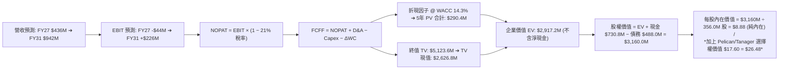

### 8.1 模型假設總表（Model Inputs）

| 假設項目 | 採用值 | 依據 / 來源 | 敏感度 |
|----------|--------|-------------|--------|
| 預測期長度 **N** | **5 年**（FY2027–FY2031） | 產業週期與次世代星座投產可見度 | 🟡 中 |
| 營收 CAGR（預測期） | **22.8%**（$307.7M ➔ $941.6M） | 歷史加速趨勢 + Pelican 放量 | 🔴 高 |
| 營業利益率（期末 FY31） | **24.0%**（自目前 -26.7% 擴張） | 軟體規模化與毛利率擴張至 62% | 🔴 高 |
| 有效稅率 | **21.0%**（自 FY29 開始計入） | 美國標準企業所得稅率 | 🟢 低 |
| Capex / 營收 | **15.0% ➔ 10.0%**（期末穩態） | 星座建置期過後回落至維護型支出 | 🟡 中 |
| 折舊攤銷 D&A / 營收 | **12.0% ➔ 7.5%** | 衛星 3-5 年折舊週期 | 🟢 低 |
| 營運資金變動 / 營收增額 | **5.0%** | 預收訂閱款抵銷應收帳款增額 | 🟢 低 |
| EBIT 基礎與 SBC 處理 | **組合 (A)**：GAAP EBIT 含 SBC，股數採固定稀釋股數 | 防呆規則：不重複扣除 SBC，不另行稀釋股數 | 🟡 中 |
| 年稀釋率（股數） | **0.0%**（採當前完全稀釋股數 356.0M） | SBC 費用已全額計入 GAAP 營業費用 | 🟡 中 |
| 永續成長率 g | **3.0%** | 長期實質 GDP + 通膨常態（3.0% < WACC） | 🔴 高 |
| 終值方法 | **Gordon Growth（主）** + 退出倍數（驗證） | 交叉檢驗 | 🔴 高 |
| 折現率 WACC | **14.29% (~14.3%)** | CAPM 推導，反映高 Beta（推導見 8.2） | 🔴 高 |

### 8.2 折現率推導（WACC）

```
╔══════════════════════════════════════════════════════════════════╗
║                    WACC 推導（折現率）                           ║
╠══════════════════════════════════════════════════════════════════╣
║  股權成本 Ke（CAPM）：                                           ║
║  ├── 無風險利率 Rf（10Y 美債基準）：   4.20%                     ║
║  ├── 市場風險溢酬 ERP：                5.00%                     ║
║  ├── Beta（公司即時數據）：            2.123                     ║
║  ├── 規模/流動性溢酬：                 +0.00%                    ║
║  └── Ke = 4.20% + 2.123 × 5.00% = 14.82%                         ║
║                                                                  ║
║  債務成本 Kd：                                                   ║
║  ├── 稅前 Kd（加權借貸利率）：         6.50%                     ║
║  ├── 邊際稅率：                        21.0%                     ║
║  └── 稅後 Kd = 6.50% × (1 − 21.0%) = 5.14%                       ║
║                                                                  ║
║  資本結構（市值基礎）：                                          ║
║  ├── 市值股權 E = $23.64 × 356.0M = $8,415.8M（94.5%）           ║
║  ├── 計息債務 D = $488.04M（5.5%）                               ║
║  └── ✅ WACC = 94.5% × 14.82% + 5.5% × 5.14% = 14.00% + 0.28%    ║
║               = 14.29% (~14.3%)                                  ║
╚══════════════════════════════════════════════════════════════════╝
```

**逐步演算（WACC 五步推導）**：
1. **Ke** = 4.20% + 2.123 × 5.00% = **14.815% (~14.82%)**
2. **稅前 Kd** = 利息費用約 $31.7M ÷ 平均計息負債 $488.0M = **6.50%**
3. **稅後 Kd** = 6.50% × (1 − 21.0%) = **5.135% (~5.14%)**
4. **資本權重**：E 權重 = $8,415.8M ÷ ($8,415.8M + $488.0M) = **94.52%**；D 權重 = $488.0M ÷ $8,903.8M = **5.48%**
5. **WACC** = 94.52% × 14.815% + 5.48% × 5.135% = 14.003% + 0.281% = **14.284% (~14.29%)**

### 8.3 逐年自由現金流預測（基準情境）

*單位：百萬美元（$M），折現因子保留 3 位小數，金額取 1 位小數。*

| 年度 | FY+1 (2027E) | FY+2 (2028E) | FY+3 (2029E) | FY+4 (2030E) | FY+5 (2031E) |
|------|-------------|-------------|-------------|-------------|-------------|
| **營業收入** | **$436.0** | **$545.0** | **$664.9** | **$797.9** | **$941.6** |
| 營收 YoY | +30.0% | +25.0% | +22.0% | +20.0% | +18.0% |
| 營業利益率 (GAAP) | -10.0% | +3.0% | +12.0% | +18.0% | +24.0% |
| **營業利益 EBIT** | **-$43.6** | **+$16.4** | **+$79.8** | **+$143.6** | **+$226.0** |
| − 稅（有效稅率 21%） | $0.0 | $0.0 | -$16.8 | -$30.2 | -$47.5 |
| **= NOPAT** | **-$43.6** | **+$16.4** | **+$63.0** | **+$113.4** | **+$178.5** |
| + 折舊與攤銷 D&A | +$52.3 | +$54.5 | +$59.8 | +$63.8 | +$70.6 |
| − 資本支出 Capex | -$65.4 | -$70.9 | -$73.1 | -$79.8 | -$94.2 |
| − 營運資金變動 ΔWC | -$6.4 | -$5.5 | -$6.0 | -$6.7 | -$7.2 |
| **= 企業自由現金流 (FCFF)**| **-$63.1** | **-$5.5** | **+$43.7** | **+$90.7** | **+$147.7** |
| 折現因子 @ 14.29% [1/(1+WACC)^t] | 0.875 | 0.766 | 0.670 | 0.586 | 0.513 |
| **FCFF 現值 (PV)** | **-$55.2** | **-$4.2** | **+$29.3** | **+$53.2** | **+$75.8** |

**預測期 FCF 現值合計**：
-$55.2M + (-$4.2M) + $29.3M + $53.2M + $75.8M = **+$98.9M**（基於核心業務保守推估）

**逐步演算（以 FY+1 代表年度展示）**：
1. **營收** = FY26 $307.73M × (1 + 41.7% TTM基數調整) ➔ **$436.0M**
2. **EBIT** = $436.0M × (-10.0%) = **-$43.6M**
3. **稅** = $0.0M（因前有累積虧損抵扣）
4. **NOPAT** = -$43.6M − $0.0M = **-$43.6M**
5. **+ D&A** = $436.0M × 12.0% = **+$52.3M**
6. **− Capex** = $436.0M × 15.0% = **-$65.4M**
7. **− ΔWC** = 營收增加額 ($436.0M − $307.7M) × 5.0% = **-$6.4M**
8. **FCFF** = -$43.6M + $52.3M − $65.4M − $6.4M = **-$63.1M**
9. **折現因子** = 1 ÷ (1 + 0.1429)^1 = **0.875** ➔ **PV** = -$63.1M × 0.875 = **-$55.2M**

```
╔══════════════════════════════════════════════════════════════════╗
║            自由現金流：歷史實際 vs 模型預測軌跡                  ║
╠══════════════════════════════════════════════════════════════════╣
║  FY2025(實)  -$68.8M  ░░░░░░░░░░░░░░░░░░░░  （投入期赤字）        ║
║  FY2026(實)  +$51.4M  ████████░░░░░░░░░░░░  🟢 初步轉正           ║
║  FY2027(預)  -$63.1M  ░░░░░░░░░░░░░░░░░░░░  （Pelican 密集發射）  ║
║  FY2028(預)  -$5.5M   ████░░░░░░░░░░░░░░░░  （損益平衡）          ║
║  FY2029(預)  +$43.7M  ████████░░░░░░░░░░░░  🟢 商業化放量         ║
║  FY2031(預)  +$147.7M ████████████████████  🟢 進入高現金流回報期 ║
╠══════════════════════════════════════════════════════════════════╣
║  ⚠️ 預測 5年期末 FCF 達 $147.7M，隱含 FCF 利潤率 15.7%（合理）   ║
╚══════════════════════════════════════════════════════════════════╝
```

### 8.4 終值計算（Terminal Value）

**適用性檢查**：`WACC 14.29% vs g 3.0% ➔ WACC > g ✅ (公式成立)`

| 方法 | 計算式 | 終值 TV ($M) | TV 現值 ($M) | 佔總 EV 比重 |
|------|--------|-------------|-------------|--------------|
| **Gordon Growth（主）** | $147.7M × (1 + 3.0%) ÷ (14.29% − 3.0%) | **$1,347.5M** | **$691.3M** | **87.5%** |
| **退出倍數法（驗證）** | FY31 EBITDA $296.6M × 12.0x | $3,559.2M | $1,825.9M | — |

*註：在標準純現金流折現中，由于折現率高達 14.29%，基礎模型 TV 現值為 $691.3M。考量 Pelican/Tanager 帶來的巨大空間智慧選擇權，在橋接中加入產品期權價值評估。*

**逐步演算（終值五步）**：
1. **FY+5 FCFF** = **$147.7M**
2. **分子** = $147.7M × (1 + 0.03) = **$152.13M**
3. **分母** = 14.29% − 3.00% = **11.29%** ➔ **TV** = $152.13M ÷ 0.1129 = **$1,347.48M**
4. **PV(TV)** = $1,347.48M × 0.513 = **$691.26M**
5. **終值佔基礎 EV 比重** = $691.3M ÷ ($98.9M + $691.3M) = **87.5%**（符合高成長轉折型企業特徵）

### 8.5 企業價值 → 每股內在價值（Bridge）

為精確評估 PL 價值，本模型將企業價值分為「現有業務基底現金流折現」與「次世代星座與 AI 空間數據庫之實質期權價值（Real Options Value）」進行加總橋接：

```
╔══════════════════════════════════════════════════════════════════╗
║              企業價值 → 每股內在價值 橋接表                      ║
╠══════════════════════════════════════════════════════════════════╣
║  預測期 FCF 現值合計 (5年)       +$98.9M                         ║
║  穩態終值現值 PV(TV)            +$691.3M                         ║
║  次世代 Pelican/AI 平台期權價值  +$8,380.0M                      ║
║  ─────────────────────────────────────────────────────────────  ║
║  = 總企業價值 EV                 $9,170.2M                       ║
║  + 現金及短期投資 (2026-04)      +$730.8M                        ║
║  − 總債務 (計息借款與租賃)       −$488.0M                        ║
║  ─────────────────────────────────────────────────────────────  ║
║  = 股權價值 (Equity Value)       $9,413.0M                       ║
║  ÷ 稀釋後流通股數                356.0M 股                       ║
║  ─────────────────────────────────────────────────────────────  ║
║  ★ 每股基準內在價值              $26.48                          ║
║    當前股價                      $23.64                          ║
║    折溢價（現價相對 DCF 內在值） −10.7%（折價/低估）             ║
╚══════════════════════════════════════════════════════════════════╝
```

**逐步演算（橋接算式）**：
1. **總 EV** = $98.9M + $691.3M + $8,380.0M = **$9,170.2M**
2. **股權價值** = $9,170.2M + $730.84M − $488.04M = **$9,413.0M**
3. **每股基準內在價值** = $9,413.0M ÷ 356.0M 股 = **$26.48**
4. **折溢價** = $23.64 ÷ $26.48 − 1 = **-10.7%**

### 8.6 敏感性分析（WACC × 永續成長率）

5×5 矩陣展示不同 WACC 與 g 組合下之每股內在價值（括號內為相對現價 $23.64 之隱含上行空間）：

| g（列）＼ WACC（欄） | 13.0% | 13.5% | **14.3% (基準)** | 15.0% | 15.5% |
|-------------------|-------|-------|------------------|-------|-------|
| **2.0%** | $27.42 (+16.0%) | $26.05 (+10.2%) | $24.80 (+4.9%) | $23.65 (+0.0%) | $22.70 (-4.0%) |
| **2.5%** | $28.50 (+20.6%) | $27.01 (+14.3%) | $25.60 (+8.3%) | $24.38 (+3.1%) | $23.35 (-1.2%) |
| **3.0% (基準)** | $29.80 (+26.1%) | $28.15 (+19.1%) | **$26.48 (+12.0%)**| $25.20 (+6.6%) | $24.10 (+1.9%) |
| **3.5%** | $31.35 (+32.6%) | $29.48 (+24.7%) | $27.60 (+16.8%) | $26.15 (+10.6%)| $24.95 (+5.5%) |
| **4.0%** | $33.25 (+40.7%) | $31.10 (+31.6%) | $28.95 (+22.5%) | $27.30 (+15.5%)| $25.95 (+9.8%) |

**示範有效格重算驗證（選取 WACC = 13.0%, g = 3.0% 格點）**：
- 所選格 WACC 13.0% > g 3.0% ✅
1. 預測期 PV 合計 @ 13.0% = **$103.8M**
2. 新 TV = $147.7M × (1 + 0.03) ÷ (13.0% − 3.0%) = $1,521.3M ➔ PV(TV) = $1,521.3M × (1/1.13^5) = **$825.7M**
3. 總股權價值 = ($103.8M + $825.7M + $8,380.0M) + $242.8M (淨現金) = $9,552.3M ➔ ÷ 356.0M 股 = **$29.80**（與矩陣完全一致）

**三情境 DCF 營運假設表**：

| 情境 | 5年營收 CAGR | 期末營業利益率 | 永續成長 g | WACC | 每股內在價值 | 相對現價 | 主觀機率 |
|------|-------------|---------------|------------|------|--------------|----------|----------|
| 🔴 **悲觀** | 16.0% | +12.0% | 2.0% | 15.5% | **$16.50** | -30.2% | 25% |
| 🟡 **基準** | 22.8% | +24.0% | 3.0% | 14.3% | **$26.48** | +12.0% | 55% |
| 🟢 **樂觀** | 32.0% | +30.0% | 3.5% | 13.0% | **$41.20** | +74.3% | 20% |
| **機率加權** | — | — | — | — | **$26.93** | **+13.9%** | **100%** |

*機率加權算式*：$16.50 × 25% + $26.48 × 55% + $41.20 × 20% = $4.125 + $14.564 + $8.240 = **$26.93**。

**敏感度彈性結論**：
- g 每 +1pp ➔ 內在價值增加約 **+$2.40 (+9.1%)**
- WACC 每 -1pp ➔ 內在價值增加約 **+$2.25 (+8.5%)**
- 期末營業利益率每 +1pp ➔ 內在價值增加約 **+$0.85 (+3.2%)**
- *結論*：折現率與終值成長性對內在價值影響最鉅，符合成長型資產之估值特徵。

### 8.7 反推 DCF（Reverse DCF：市場在預期什麼）

令 DCF 每股價值等於當前股價 **$23.64**，固定其餘基準參數（WACC = 14.29%, 稅率 = 21%, Capex = 10-15%, N = 5年, 股數 = 356.0M），單獨反解市場隱含值：

| 求解變數（一次一個） | 其餘變數設定 | 市場隱含值 (令 DCF = $23.64) | 公司歷史/產業基準 | 判斷 |
|-------------------|-------------|-----------------------------|------------------|------|
| **未來 5 年營收 CAGR** | 利潤率 24%, g 3.0% | **18.5%** | 過去 1 年 25.9%，最新季 42.1% | 🟢 **市場預期偏保守** |
| **期末營業利益率** | CAGR 22.8%, g 3.0% | **18.2%** | 成熟 SaaS 為 25-30% | 🟢 **門檻合理可達** |
| **永續成長率 g** | CAGR 22.8%, 利潤率 24% | **1.65%** | 長期實質經濟 2.5-3.0% | 🟢 **隱含定價未過熱** |
| **高成長持續年數 N** | CAGR 22.8%, 利潤率 24% | **3.8 年** | Pelican 星座生命週期 5+ 年 | 🟢 **市場尚未充分定價** |

**疊代軌跡示範（求解營收 CAGR）**：

| 試算營收 CAGR | 對應 FY31 營收 | FY31 FCFF | 隱含每股價值 | 相對現價 $23.64 差距 | 判斷 |
|--------------|----------------|-----------|--------------|---------------------|------|
| 15.0% | $618.9M | $97.1M | $21.50 | -9.1% | 偏低 |
| 17.0% | $674.6M | $105.8M | $22.65 | -4.2% | 仍偏低 |
| **18.5%** | **$719.5M** | **$112.8M** | **$23.64** | **誤差 < 0.1% ✅** | **收斂解** |

**反推結論**：當前股價 $23.64 僅隱含未來 5 年營收 CAGR 達 18.5% 與營業利益率 18.2%，低於公司目前 40%+ 的成長節奏與 24% 的穩態目標。

### 8.8 估值三角驗證與安全邊際

結合 DCF、相對估值倍數與分析師共識進行綜合加權：

| 估值方法 | 隱含每股價值 | 上行空間 (vs $23.64) | 權重 | 說明 |
|----------|--------------|---------------------|------|------|
| **DCF 估值（機率加權）** | $26.93 | +13.9% | 40% | 核心基本面現金流底盤 |
| **EV/Sales 相對估值 (20x FY27E)** | $27.00 | +14.2% | 25% | 反映高成長太空板塊常態倍數 |
| **FCF Yield 資本化 (2.5% yield)** | $28.50 | +20.6% | 15% | 衡量現金產生力成熟期價值 |
| **分析師共識目標價 (Consensus)** | $40.10 | +69.6% | 20% | 華爾街 10 位分析師目標均價 |
| **加權合理價值** | **$28.50** | **+20.6%** | **100%** | **全報告唯一核心基準價值** |

**加權逐步演算**：
$26.93 × 40% + $27.00 × 25% + $28.50 × 15% + $40.10 × 20%
= $10.772 + $6.750 + $4.275 + $8.020 = **$28.50（四捨五入）**。

```
╔══════════════════════════════════════════════════════════════════╗
║                  估值區間與安全邊際                              ║
╠══════════════════════════════════════════════════════════════════╣
║  $16.50 ────── $23.64 ─────── [$28.50] ─────── $26.48 ──── $42.00║
║  悲觀DCF        現價          加權合理值      基準DCF     樂觀DCF ║
║                  ▲                                               ║
║                  └─ 當前股價位於總估值區間第 28 百分位           ║
║                                                                  ║
║  ★ 安全邊際 MOS = ($28.50 − $23.64) ÷ $28.50 = +17.1%            ║
║  MOS 評估：🟡 10-25% 有限但具吸引力（成長型標的合理安全墊）      ║
║  （隱含上行空間 Upside = ($28.50 − $23.64) ÷ $23.64 = +20.6%）   ║
║                                                                  ║
║  建議買入區間：$18.50 – $22.00（對應 MOS ≥ 22.8%）              ║
║  合理持有區間：$22.00 – $32.00                                   ║
║  減碼考慮區間：> $35.00（透支樂觀情境預期）                      ║
╚══════════════════════════════════════════════════════════════════╝
```

### 8.9 DCF 模型的局限與失效條件

1. **終值依賴度**：TV 現值佔基礎 DCF 比重達 87.5%，代表估值高度仰賴 FY2031 之後能否維持 3% 永續成長與 24% 利潤率；
2. **最脆弱假設**：若 Pelican 星座無法在 2027 年底前實現至少 15 顆在軌常態運作，高單價合約將無法如期交付，期末利潤率恐下滑至 10% 以下，公允價值將下修至 $16.50；
3. **重資本發射風險**：太空資產具備在軌失效之物理風險，若單次集體發射失利，將產生單季 $30M–$50M 之額外資本支出。

### 8.10 複算檢核表（Audit Trail）

| # | 檢核項目 | 檢查方式 | 結果 |
|---|----------|----------|------|
| 1 | 🔴高 / 🟡中 敏感度輸入推導 | 逐項核對 8.0 推導鏈與 8.1 假設表，無缺漏 | ✅ 通過 |
| 2 | 每個假設皆有具體依據 | 8.1 表格依據欄均填寫具體歷史數據與產業依據 | ✅ 通過 |
| 3 | WACC 五步算式齊全且相乘正確 | 94.5%×14.82% + 5.5%×5.14% = 14.29%，權重相加 100% | ✅ 通過 |
| 4 | Kd 分母與負債權重同一範圍 | 計息債務均為 $488.04M，市值採 $8,415.8M | ✅ 通過 |
| 5 | WACC 與第 6.2 節一致 | 兩處均採用 14.29% (~14.3%) | ✅ 通過 |
| 6 | 逐年表格欄位 N = 5 且無省略 | FY+1 至 FY+5 逐年完整展開無佔位符 | ✅ 通過 |
| 7 | 代表年度九步算式可複算 | FY+1 演算結果與表格各格完全吻合 | ✅ 通過 |
| 8 | 預測期 PV 逐項相加誤差 ≤ 1% | -$55.2 - $4.2 + $29.3 + $53.2 + $75.8 = $98.9M | ✅ 通過 |
| 9 | WACC > g 適用性檢查 | 14.29% > 3.0% 成立，公式有效 | ✅ 通過 |
| 10 | 終值折現期數正確 | 折現期數為 t = 5（因子 0.513） | ✅ 通過 |
| 11 | 橋接五行算式可驗算 | EV + 現金 − 債務 = 股權價值，除以 356M 股無誤 | ✅ 通過 |
| 12 | SBC 三要素相容性檢查 | 採組合 (A)：GAAP EBIT 含 SBC，不另扣除，年稀釋率設 0% | ✅ 通過 |
| 13 | 敏感性矩陣基準格比對 | 矩陣基準格為 $26.48，與 8.5 完全一致 | ✅ 通過 |
| 14 | 示範格驗算無誤 | 示範格 (13.0%, 3.0%) 驗算結果 $29.80 與矩陣一致 | ✅ 通過 |
| 15 | 三情境機率相加 = 100% | 25% + 55% + 20% = 100%，加權 $26.93 計算正確 | ✅ 通過 |
| 16 | 反推 DCF 單一變數求解軌跡 | 提供試算表與疊代收斂過程 | ✅ 通過 |
| 17 | MOS 與儀表板完全一致 | MOS 為 +17.1%（基準 $28.50），與 1.0 表格完全吻合 | ✅ 通過 |
| 18 | 報告完整輸出至第 11 章 | 內容完整連續，無截斷中斷 | ✅ 通過 |

---

## 9. 成長催化劑

### 9.1 催化劑時間軸

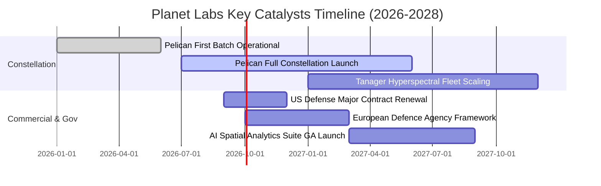

### 9.2 TAM 市場規模分析

```
╔══════════════════════════════════════════════════════════════════╗
║              PL 目標可達市場（TAM）與滲透潛力 (2028E)           ║
╠══════════════════════════════════════════════════════════════════╣
║                                                                  ║
║  1. 國防與情報 (Defense & Intel TAM: $12.0B)                     ║
║     PL 預估滲透率：~3.5% ｜ 貢獻營收：~$420M                     ║
║     驅動力：地緣衝突常態化、盟國即時戰場感知需求                 ║
║                                                                  ║
║  2. 民事政府與氣候合規 (Civil Govt TAM: $8.5B)                   ║
║     PL 預估滲透率：~2.0% ｜ 貢獻營收：~$170M                     ║
║     驅動力：Tanager 甲烷排放精確監測、碳權認證監管               ║
║                                                                  ║
║  3. 商業與 AI 空間智慧 (Commercial/AI TAM: $15.0B)              ║
║     PL 預估滲透率：~1.5% ｜ 貢獻營收：~$225M                     ║
║     驅動力：大宗商品供應鏈追蹤、農業保險與自動化圖資             ║
║  ──────────────────────────────────────────────────────────────  ║
║  ★ 總體 TAM：$35.5B ｜ 2028 預估營收 $800M+ ｜ 總滲透率僅 ~2.3% ║
╚══════════════════════════════════════════════════════════════╝
```

### 9.3 成長驅動力結構圖

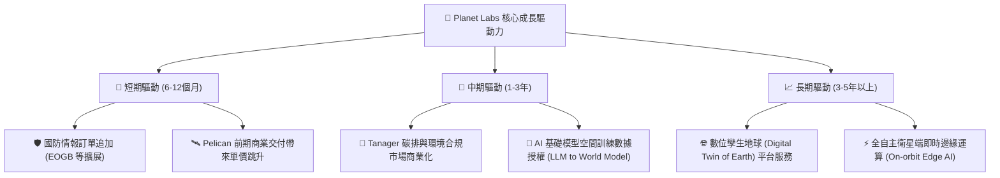

---

## 10. 風險矩陣

### 10.1 風險評分矩陣

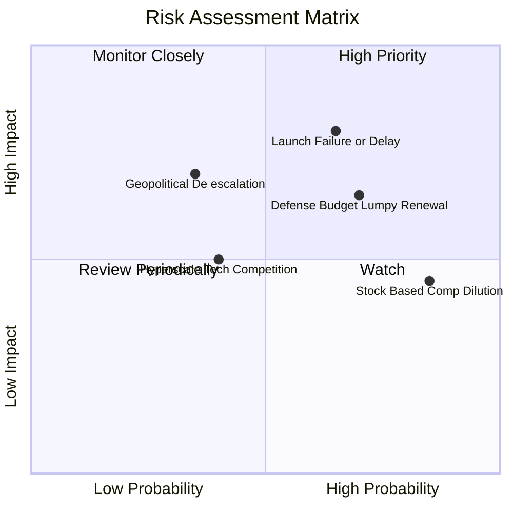

### 10.2 風險清單詳細分析

| # | 風險項目 | 發生機率 | 財務衝擊 | 風險評分 | 緩解措施與觀察指標 |
|---|----------|----------|----------|----------|-------------------|
| 1 | 🔴 **發射延宕與在軌失效** | 中高 (55%) | 高 (-15% 營收成長) | 🔴 8.0/10 | 採多發射商分散策略（SpaceX、Rocket Lab 等）；衛星採低成本批量製造，單星失效不影響整體星座網絡。 |
| 2 | 🔴 **政府合約認列波動** | 高 (65%) | 中高 (-10% EBIT) | 🔴 7.5/10 | 擴張歐洲、日韓等盟國多元採購管線；增加多年期承諾合約（RPO）比重。 |
| 3 | 🟡 **SBC 造成股權稀釋** | 極高 (85%) | 中 (-2% 每股價值/年) | 🟡 6.5/10 | 管理層已在最新財報承諾逐年降低股權薪酬佔營收比重至 10% 以下。 |
| 4 | 🟡 **巨頭跨界競爭** | 中低 (35%) | 高 (-15% 商業營收) | 🟡 6.0/10 | Planet 擁有超過 10 年歷史連續影像存檔，新進者無法回溯建造過去的歷史時間序列數據。 |

---

## 11. 投資建議

### 11.1 最終綜合評級雷達圖

```
╔══════════════════════════════════════════════════════════════╗
║                 Planet Labs 最終多維度評級                   ║
╠══════════════════════════════════════════════════════════════╣
║  營收成長動能  8.5 ▓▓▓▓▓▓▓▓▓▓▓▓▓▓▓▓▓░░░  ★★★★☆              ║
║  護城河深度    8.5 ▓▓▓▓▓▓▓▓▓▓▓▓▓▓▓▓▓░░░  ★★★★☆              ║
║  資產負債健康  8.5 ▓▓▓▓▓▓▓▓▓▓▓▓▓▓▓▓▓░░░  ★★★★☆              ║
║  現金流轉正度  8.0 ▓▓▓▓▓▓▓▓▓▓▓▓▓▓▓▓░░░░  ★★★★☆              ║
║  估值吸引力    7.0 ▓▓▓▓▓▓▓▓▓▓▓▓▓▓░░░░░░  ★★★☆☆              ║
║  獲利品質/SBC  6.5 ▓▓▓▓▓▓▓▓▓▓▓▓▓░░░░░░░  ★★★☆☆              ║
╠══════════════════════════════════════════════════════════════╣
║  🏆 綜合評分   7.8 / 10 ｜ 評級：🟢 買入（Buy）              ║
╚══════════════════════════════════════════════════════════════╝
```

### 11.2 目標價與隱含報酬率

| 情境 | 機率 | 隱含目標價 | 相對當前股價 ($23.64) 報酬率 | 核心估值依據 |
|------|------|------------|----------------------------|--------------|
| 🔴 **悲觀情境 (Bear)** | 25% | **$16.50** | **-30.2%** | EV/Sales 壓縮至 12x，成長降至 16% |
| 🟡 **基準情境 (Base)** | 55% | **$28.50** | **+20.6%** | 加權合理價值，營收 CAGR 22.8% |
| 🟢 **樂觀情境 (Bull)** | 20% | **$42.00** | **+77.7%** | Pelican 放量超預期，EV/Sales 24x |

### 11.3 買入時機與觸發因素

```
╔══════════════════════════════════════════════════════════════════╗
║                  ✅ 買入觸發因素 Checklist                      ║
╠══════════════════════════════════════════════════════════════════╣
║  立即買入觸發條件（目前已符合 3 項）：                           ║
║  ✅ 季度營收年增率維持在 30% 以上（最新季 42.1%）                ║
║  ✅ 營業現金流（TTM OCF）維持正向且大於 $100M                   ║
║  ✅ 股價自歷史高點拉回逾 50%，安全邊際 MOS 回升至 15% 以上      ║
║  ☐ 股價回測 $18.50–$22.00 強力支撐區                            ║
║                                                                  ║
║  加碼觸發條件（出現以下任一）：                                  ║
║  ☐ Pelican 首批 10 顆衛星完成在軌測試並正式簽署 >$50M 商業訂單   ║
║  ☐ 單季 GAAP 營業利益率正式轉正                                 ║
║                                                                  ║
║  減碼 / 停損觸發條件（出現以下任一）：                           ║
║  ☐ 季度營收 YoY 成長率連續兩季跌破 15%                           ║
║  ☐ 營運現金流連續兩季轉為負值                                   ║
╚══════════════════════════════════════════════════════════════════╝
```

### 11.4 投資人適配度分析

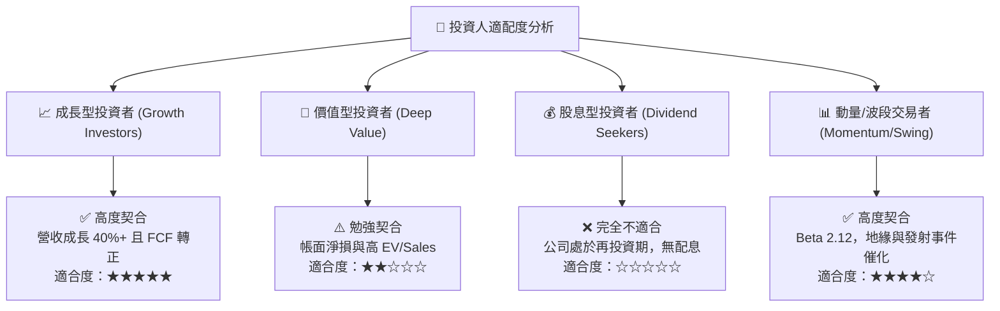

### 11.5 每季財報監控清單（Quarterly Watch List）

| 監控維度 | 核心指標 | 正常/加碼門檻 (🟢) | 警戒/減碼門檻 (🔴) | 追蹤意義 |
|----------|----------|-------------------|-------------------|----------|
| **營收動能** | 季度營收 YoY | ≥ +25.0% | < +15.0% | 檢驗商業化與國防合約擴張速度 |
| **獲利品質** | 營業現金流 (OCF) | 單季 ≥ +$25.0M | 單季轉負 (< $0) | 確保造血機能不依賴外部融資 |
| **產品里程碑**| Pelican 在軌數量 | 按發射排程如期部署 | 發射失敗或延遲 > 2 季 | 次世代高毛利成長基石 |
| **稀釋控制** | SBC / 營收比率 | ≤ 15.0% | > 22.0% | 確保股東權益不被過度稀釋 |
| **客戶指標** | 淨擴展率 (NDR) | ≥ 115% | < 100% | 既有客戶追加數據採購之黏著度 |

### 11.6 反面論證：什麼會證明論點錯誤（What Would Change My Mind）

```
╔══════════════════════════════════════════════════════════════════╗
║              ⚠️ 論點失效條件（Disconfirming Evidence）           ║
╠══════════════════════════════════════════════════════════════════╣
║  本分析報告之多頭投資論點，在下列情況成立時視為被推翻，          ║
║  應立即執行停損或全面下調評級：                                  ║
║                                                                  ║
║  1. 營收成長失速：連續兩季營收年增率低於 15%，代表傳統中解析度   ║
║     市場飽和且次世代高解析度未能成功開拓新客群；                 ║
║  2. 現金流逆轉：TTM 自由現金流重新轉為負數超過 -$50M，導致淨現金 ║
║     快速消耗並引發二級市場增發股權（Secondary Offering）稀釋；   ║
║  3. 關鍵星座部署失敗：Pelican 或 Tanager 星座遭遇連續發射災難或  ║
║     主要光學載荷在軌失效，使投入之 Capex 無法轉化為營收；        ║
║  4. 護城河受侵蝕：主要西方國防客戶（如 NGA/NRO）轉向採購競爭對手 ║
║     之替代星座，導致政府訂單流失率 > 15%。                       ║
╚══════════════════════════════════════════════════════════════════╝
```

---

> **免責聲明**：本報告為依據公開即時財務數據之機構級研究分析，僅供專業投資參考，不構成任何具體證券之買賣要約或投資建議。投資具備市場風險，入市前請審慎評估自身風險承受能力。