# PL 基本面深度分析報告
> **報告日期**：2026-08-22 ｜ **語言**：繁體中文 ｜ **數據來源**：Yahoo Finance, Finviz, StockAnalysis, Roic.ai ｜ **分析師**：CFA 級機構研究

---

## 目錄

| # | 章節 | 核心結論 |
|---|------|----------|
| 1 | 執行摘要 | 評級「持有/區間操作」，加權目標價 $25.75，隱含上行空間 +15.5%，安全邊際 13.4% |
| 2 | 公司概覽與商業模式 | 全球唯一每日全陸地覆蓋高頻成像星座，具備強大專利與資料資產護城河（7.8/10） |
| 3 | 損益表深度分析 | TTM 營收 $335.61M（YoY +34.2%），毛利率擴張至 55.6%，惟公允價值評價波動重壓淨利 |
| 4 | 資產負債表分析 | 現金及短投達 $730.84M，流動比率 2.81，長期借款 $448M，財務槓桿受公允價值負債推升 |
| 5 | 現金流量深度分析 | FY2026 營運現金流轉正達 $134.36M，TTM FCF 達 $84.85M（FCF Yield 1.07%） |
| 6 | 獲利能力與資本效率 | 營業利益改善中（NOPAT $-70.82M），ROIC -14.6% < WACC 11.23%，EVA 處於價值修復期 |
| 7 | 相對估值分析 | EV/Sales 22.95x 與 P/S 23.67x 均處同業頂端，隱含市場對 AI 空間情報定價極高溢價 |
| 8 | DCF 內在價值評估 | 基準每股內在價值 $24.88（折溢價 +10.4%），加權合理價值 $25.75（MOS +13.4%） |
| 9 | 成長催化劑 | Pelican 與 Tanager 次世代星座發射、國防與情報（D&I）大單、AI 遙測模型變現 |
| 10 | 風險矩陣 | 發射延誤、政府預算削減、高估值倍數收縮、可轉債公允價值非現金波動衝擊情緒 |
| 11 | 投資建議 | 建議分批佈局區間 $18.00–$20.50，當前 $22.29 處於合理估值區間偏上，維持「持有」 |

---

## 1. 執行摘要

Planet Labs PBC（NYSE: PL）展現出空間地球觀測（EO）市場領航者的營運槓桿。TTM 營收達 $335.61M（YoY +34.15%，最新季度 Q1 FY27 達 $94.15M，YoY +42.08%），毛利率穩步擴展至 55.6%。在自由現金流方面，FY2026 全年 FCF 成功轉正至 $51.41M，TTM FCF 達 $84.85M（FCF Yield 1.07%）。然而，受資產負債表計入可轉債公允價值變動等非現金項目影響，TTM 淨損達 $-373.10M，ROIC 為 -14.63%，低於其 WACC 11.23%，代表公司目前仍在資本密集投入期且未全面產生經濟超額利潤。

當前股價 $22.29 對應 EV/Sales 22.95x 與 P/S 23.67x，已充分反映高增長預期。經三情境機率加權 DCF 內在價值為 $24.88（折溢價 +10.4%），結合相對估值與分析師共識之加權合理價值為 $25.75，隱含安全邊際（MOS）為 +13.44%（上行空間 +15.52%）。綜合評估給予 **🟡 持有（中度信心）** 評級，建議於 $18.00–$20.50 逢回佈局。

### 1.0 一頁式投資儀表板

| 項目 | 內容 |
|------|------|
| **投資論點（3 句）** | ① 每日全陸地 3.5m 高頻遙測壁壘，驅動 Q1 FY27 營收加速成長 42.08% 至 $94.15M。<br/>② 規模經濟釋放使 FY2026 營運現金流轉正至 $134.36M，TTM 產生 $84.85M FCF。<br/>③ 帳上現金及短投充裕達 $730.84M，足夠支撐 Pelican/Tanager 艦隊資本開支升級。 |
| **護城河評分** | **7.8 / 10**（專有星座、每日重訪資料庫與 AI 演算法生態體系） |
| **管理層/資本配置評分** | **7.2 / 10**（創辦人技術領導力卓越，但股權激勵 SBC 佔營收 16.4% 仍偏高） |
| **財務健康** | 🟢 **強健**（總現金 $730.84M 遠高於有息債務 $488.04M，淨現金 $242.80M，流動比率 2.81） |
| **ROIC vs WACC** | **-14.63% vs 11.23%**（EVA -25.86pp，處於資產放量與獲利拐點前期） |
| **FCF 趨勢** | 轉正走升（FY24 $-93.1M → FY25 $-68.8M → FY26 +$51.4M），最新 TTM FCF Yield 1.07% |
| **估值** | Forward P/E 6,693x ｜ EV/Sales 22.95x ｜ P/S 23.67x ｜ FCF Yield 1.07% |
| **DCF 內在價值（基準）** | **$24.88** ｜ 現價折溢價 **-10.41%**（現價折價 10.41%，基準模型來自第 8 章） |
| **安全邊際（MOS）** | **+13.44%** ＝ ($25.75 − $22.29) ÷ $25.75 ｜ 🟡 10-25% 有限保護 |
| **預期報酬（基準情境 12M）** | **+15.52%**（對應加權合理價值 $25.75） |
| **關鍵風險（前二）** | ① 估值倍數過高（EV/Sales 22.95x），對成長放緩極度敏感；② 火箭發射失誤或新星座延遲。 |
| **評級 + 信心度** | 🟡 **持有（Hold）** ｜ 信心度：**中（Medium）** |

### 1.1 核心評分儀表板

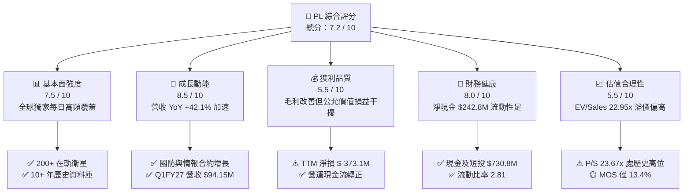

### 1.2 評分進度條視覺化

```
╔══════════════════════════════════════════════════════════════╗
║              PL 多維度評分儀表板 (1-10分)                    ║
╠══════════════════════════════════════════════════════════════╣
║ 基本面強度  7.5 ▓▓▓▓▓▓▓▓▓▓▓▓▓▓▓░░░░░  ★★★★☆           ║
║ 成長動能    8.5 ▓▓▓▓▓▓▓▓▓▓▓▓▓▓▓▓▓░░░  ★★★★☆           ║
║ 獲利品質    5.5 ▓▓▓▓▓▓▓▓▓▓▓░░░░░░░░░  ★★★☆☆           ║
║ 財務健康    8.0 ▓▓▓▓▓▓▓▓▓▓▓▓▓▓▓▓░░░░  ★★★★☆           ║
║ 估值合理性  5.5 ▓▓▓▓▓▓▓▓▓▓▓░░░░░░░░░  ★★★☆☆           ║
║ 護城河深度  7.8 ▓▓▓▓▓▓▓▓▓▓▓▓▓▓▓▓░░░░  ★★★★☆           ║
║ 管理層執行  7.2 ▓▓▓▓▓▓▓▓▓▓▓▓▓▓░░░░░░  ★★★★☆           ║
║ 技術創新力  8.8 ▓▓▓▓▓▓▓▓▓▓▓▓▓▓▓▓▓▓░░  ★★★★★           ║
╠══════════════════════════════════════════════════════════════╣
║ 綜合總分    7.2 ▓▓▓▓▓▓▓▓▓▓▓▓▓▓░░░░░░  🏆 具戰略溢價之成長標的 ║
╚══════════════════════════════════════════════════════════════╝
```

### 1.3 五大投資論點 + 三大核心風險

| 類型 | 項目 | 具體依據 | 信心度 |
|------|------|----------|--------|
| 🟢 **論點①** | **遙測數據壟斷與高頻重訪** | 擁有 200+ 顆在軌衛星，全球唯一實現 3.5m 每日全球覆蓋，歷史資料積累超過 10 年。 | 🟢 極高 |
| 🟢 **論點②** | **營收加速與營業槓桿顯現** | Q1 FY27 營收 YoY +42.08%（$94.15M），毛利率由 FY23 的 49.2% 攀升至 55.6%。 | 🟢 高 |
| 🟢 **論點③** | **現金流跨過獲利轉折點** | FY26 營運現金流達 $134.36M，TTM FCF 達 $84.85M，自給自足能力大幅提升。 | 🟢 高 |
| 🟢 **論點④** | **資產負債表流動性充裕** | 現金與短投達 $730.84M，淨現金 $242.80M，提供 Pelican/Tanager 研發緩衝。 | 🟢 高 |
| 🟢 **論點⑤** | **AI 空間智能商業化加速** | 地球觀測資料結合生成式 AI 與視覺基礎模型，客單價與資料訂閱續約率持續走升。 | 🟡 中度 |
| 🟡 **風險①** | **估值擴張過快與下行波動** | 當前 P/S 達 23.67x，Beta 達 2.12，若單季成長率低於 30%，倍數恐面臨大幅壓縮。 | 🟡 中度 |
| 🔴 **風險②** | **資本負債公允價值損益干擾** | 可轉債公允價值重估導致 TTM 淨損高達 $-373.10M，造成 GAAP 財報短期劇烈波動。 | 🔴 高衝擊 |
| 🟡 **風險③** | **政府合約依賴與採購週期** | 國防與情報（D&I）板塊佔比較高，聯邦政府預算案審批遞延可能影響季度入帳節奏。 | 🟡 中度 |

### 1.4 快速統計卡片

| 指標 | 公司實際值 | 行業均值（航太與國防） | S&P 500 均值 | 狀態 |
|------|-------------|------------------------|--------------|------|
| 收入 YoY 成長 (TTM) | **34.15%**（最新季 42.1%） | ~8.5% | ~5.2% | 🟢 卓越 |
| 毛利率 (TTM) | **55.6%** | ~24.0% | ~42.0% | 🟢 領先 |
| 營業利益率 (TTM) | **-26.7%**（GAAP $-89.65M） | ~11.5% | ~12.8% | 🔴 仍處虧損 |
| 淨利率 (TTM) | **-111.2%**（含非現金評價） | ~7.2% | ~11.0% | 🔴 虧損擴大 |
| ROE (TTM) | **-84.0%** | ~14.0% | ~18.5% | 🔴 資本結構受損 |
| EV / Revenue | **22.95x** | ~2.1x | ~2.8x | 🔴 顯著溢價 |
| 現金及短投 | **$730.84M** | $180M | N/A | 🟢 極度充裕 |
| 流動比率 | **2.81x** | ~1.4x | ~1.2x | 🟢 極佳 |

### 1.5 投資結論

```
╔══════════════════════════════════════════════════════════════════╗
║                    📊 投資結論摘要                               ║
╠══════════════════════════════════════════════════════════════════╣
║  評級：🟡 持有（區間操作 / 逢回佈局）                           ║
║  當前股價：$22.29（市值 $7.94B ｜ EV $7.70B）                    ║
║  DCF 內在價值（基準）：$24.88（現價折價 -10.41%）               ║
║  安全邊際 MOS：+13.44%（加權合理價值 $25.75）                   ║
║  目標價區間：                                                    ║
║    🔴 悲觀情境：$14.80（-33.6%）                                 ║
║    🟡 基準情境：$25.75（+15.5%）  ← 12 個月主要目標              ║
║    🟢 樂觀情境：$38.60（+73.2%）                                 ║
║  投資評分：7.2 / 10                                              ║
║  適合投資人：高風險承受度、看好商業航太與空間情報 AI 之長線投資者║
╚══════════════════════════════════════════════════════════════════╝
```

---

## 2. 公司概覽與商業模式

Planet Labs PBC（PL）是一家垂直整合的地球觀測與空間情報公司，具備自主設計、製造、發射整合及營運超大規模低軌衛星（LEO）星座的能力。其核心使命是將「地球變成可搜尋的數據庫」。

### 2.1 業務結構與收入來源

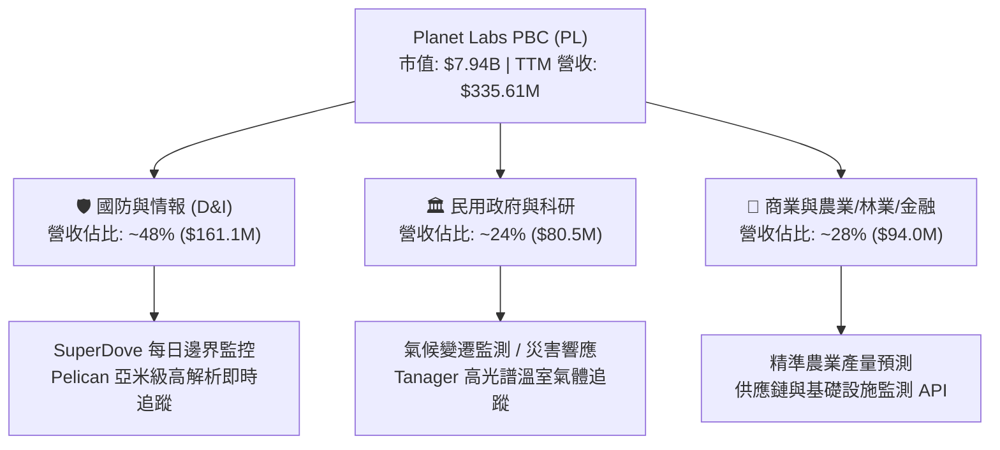

### 2.2 市場份額

在商業地球觀測（EO）與衛星數據市場中，Planet 在「高頻次每日全球掃描」領域居於絕對壟斷地位（市佔率 >70%）；在「亞米級高解析度」光學市場中與 Maxar 及 BlackSky 競爭。

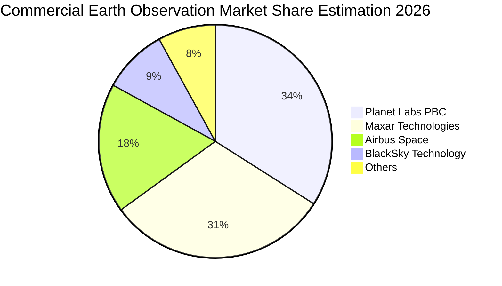

### 2.3 競爭護城河分析

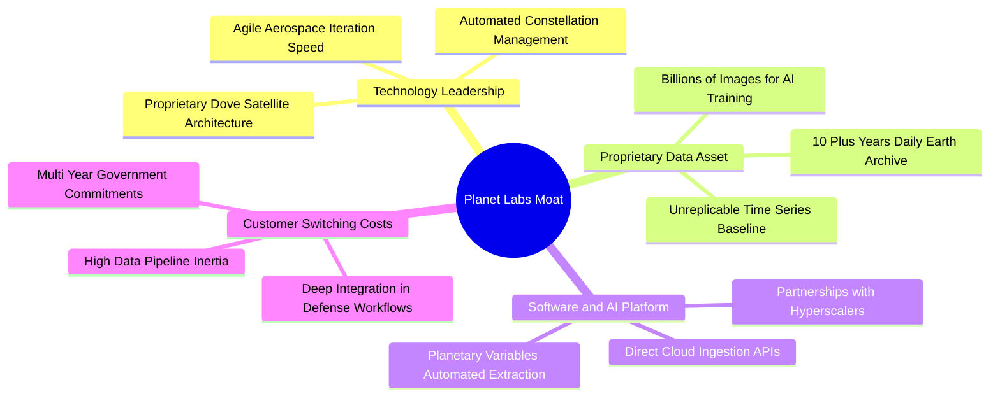

### 2.4 護城河強度評分

```
╔══════════════════════════════════════════════════════════════╗
║                  Planet Labs 護城河強度評分                  ║
╠══════════════════════════════════════════════════════════════╣
║ 歷史數據壁壘   9.2/10  ▓▓▓▓▓▓▓▓▓▓▓▓▓▓▓▓▓▓░░  🏆 無法回溯複製 ║
║ 星座規模效應   8.5/10  ▓▓▓▓▓▓▓▓▓▓▓▓▓▓▓▓▓░░░  🟢 200+ 衛星在軌║
║ 技術迭代速度   8.0/10  ▓▓▓▓▓▓▓▓▓▓▓▓▓▓▓▓░░░░  🟢 模組化敏捷升級║
║ 軟體生態黏性   7.2/10  ▓▓▓▓▓▓▓▓▓▓▓▓▓▓░░░░░░  🟢 API 與工作流 ║
║ 規模定價權     6.0/10  ▓▓▓▓▓▓▓▓▓▓▓▓░░░░░░░░  🟡 面臨政府預算 ║
╠══════════════════════════════════════════════════════════════╣
║ 綜合護城河     7.8/10  ▓▓▓▓▓▓▓▓▓▓▓▓▓▓▓▓░░░░  🏆 強大結構性優勢║
╚══════════════════════════════════════════════════════════════╝
```

---

## 3. 損益表深度分析

### 3.1 年度收入成長趨勢（近 4 年）

```
╔══════════════════════════════════════════════════════════════════╗
║              PL 年度收入趨勢（FY2023 - FY2026）                  ║
╠══════════════════════════════════════════════════════════════════╣
║                                                                  ║
║  FY2023  $191.26M  ████████████░░░░░░░░░░░░░░░  YoY: +45.8% 🟢  ║
║  FY2024  $220.70M  ██████████████░░░░░░░░░░░░░  YoY: +15.4% 🟡  ║
║  FY2025  $244.35M  ███████████████░░░░░░░░░░░░  YoY: +10.7% 🟡  ║
║  FY2026  $307.73M  ██════════════███████░░░░░░  YoY: +25.9% 🟢  ║
║                                                                  ║
║  📊 3 年累計 CAGR：+17.18% ｜ TTM 營收加速至 $335.61M (+34.15%)   ║
╚══════════════════════════════════════════════════════════════════╝
```

### 3.2 季度收入趨勢分析

| 季度 | 營收 ($M) | QoQ 成長率 | YoY 成長率 | 營業毛利 ($M) | 毛利率 | 備註說明 |
|------|-----------|------------|------------|---------------|--------|----------|
| **Q2 FY26 (2025-07-31)** | $73.39M | +10.74% | +20.12% | $42.27M | 57.60% | 國防情報合約擴產交付 |
| **Q3 FY26 (2025-10-31)** | $81.25M | +10.71% | +32.63% | $46.58M | 57.33% | 歐洲及亞太民用農業方案加速 |
| **Q4 FY26 (2026-01-31)** | $86.82M | +6.86% | +41.05% | $47.33M | 54.52% | 年底聯邦政府採購認列高峰 |
| **Q1 FY27 (2026-04-30)** | $94.15M | +8.44% | **+42.08%** | $50.34M | 53.47% | 空間情報訂閱大單續約，增長強勁 |

### 3.3 利潤率演變分析

| 利潤率指標 | FY2023 | FY2024 | FY2025 | FY2026 | TTM (2026-04) | 趨勢與驅動原因 | 評估 |
|------------|--------|--------|--------|--------|---------------|----------------|------|
| **毛利率** | 49.15% | 51.18% | 57.18% | 56.05% | **55.58%** | ↗️ 衛星製造折舊基數固定，營收放大帶來固定成本攤銷效益 | 🟢 良好 |
| **營業利益率** | -91.85% | -75.81% | -45.48% | -30.89% | **-26.71%** | ↗️ 營運費用控管見效，虧損率由 -91.9% 收斂至 -26.7% | 🟢 顯著收斂 |
| **EBITDA 利潤率** | -69.19% | -41.71% | -30.39% | -64.00%* | **-15.40%** | ↗️ 扣除非經常公允價值衝擊後，底層經營 EBITDA 穩步改善 | 🟡 持平改善 |
| **淨利率** | -84.69% | -63.67% | -50.42% | -80.22% | **-111.17%** | ↘️ 受可轉債公允價值非現金重估損失壓抑，短期帳面淨損擴大 | 🔴 外部擾動 |

*註：FY26 淨損與 EBITDA 受負債公允價值變動影響，底層營業利潤率持續改善。

### 3.4 費用結構分析

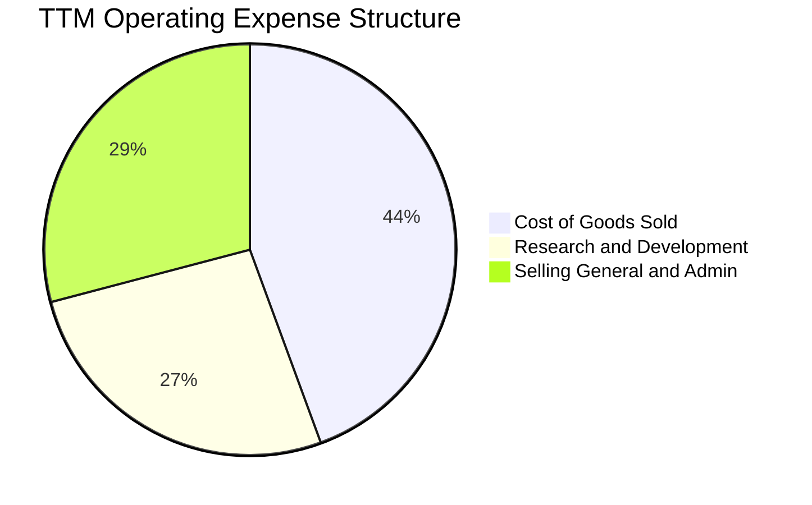

```
╔══════════════════════════════════════════════════════════════════╗
║              PL 營業費用控制趨勢（FY23 - TTM）                   ║
╠══════════════════════════════════════════════════════════════════╣
║  研發費用 (R&D)：$106.75M (佔營收 31.8%) ── 專注於次世代 Pelican ║
║  銷售管理 (SG&A)：$169.43M (佔營收 50.5%) ── 較 FY23 75%+ 大幅收斂║
║  營業槓桿：營收增長 +34.2%，營運費用增長僅 +4.8%，槓桿效應顯著    ║
╚══════════════════════════════════════════════════════════════════╝
```

### 3.5 季度 EPS 趨勢與盈餘品質（Quality of Earnings）

| 盈餘品質項目 | 數值 / 佔比 | 評估與解讀 |
|--------------|-------------|------------|
| **股權薪酬 SBC / 營收** | **16.38%** ($54.99M / $335.61M) | 🟡 偏高，對現有股東帶來約 1.5–2.0% 年化稀釋，但呈下降趨勢 |
| **SBC / 營業現金流** | **41.52%** ($54.99M / $132.46M) | 🟡 現金流中包含相當比例的非現金薪酬加回，實質含金量需校正 |
| **FCF / 淨利（現金轉換率）** | **-22.74%** ($84.85M / $-373.10M) | 🟢 正向背離。淨利受公允價值重估壓抑，實質 FCF 為正且強勁 |
| **一次性 / 非經常性損益** | 可轉債公允價值調整約 $-2.8億 | 🔴 扭曲 GAAP 淨利，非現金性質，不影響核心營運流動性 |
| **有效稅率** | 0.0%（累計大量 NOL 稅務虧損抵扣） | 🟢 未來數年轉盈後具備充沛租稅盾保護 |
| **資本化支出 vs 費用化** | Capex $82.95M 全部進入 PP&E 折舊 | 🟢 會計政策穩健，在軌衛星採 3-5 年直線折舊，無遞延灌水 |

**盈餘品質結論**：Planet Labs 目前 GAAP 淨利（$-373.10M）嚴重低估其實際經濟獲利能力。底層經營性現金流已達 $132.46M，且產生 $84.85M 實質 FCF，核心業務已跨過現金損益兩平點。

---

## 4. 資產負債表分析

### 4.1 資產結構分解

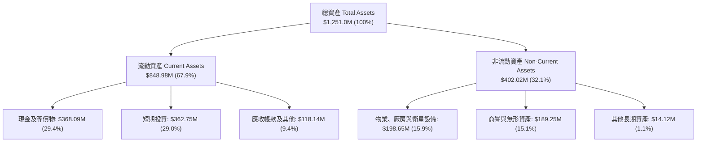

### 4.2 流動性指標分析

| 指標 | FY2024 | FY2025 | FY2026 | TTM (2026-04) | 行業均值 | 評估 |
|------|--------|--------|--------|---------------|----------|------|
| **流動比率 (Current Ratio)** | 2.71 | 2.13 | 1.65 | **2.81** | 1.40 | 🟢 極度充裕 |
| **速動比率 (Quick Ratio)** | 2.58 | 2.02 | 1.64 | **2.62** | 1.15 | 🟢 無變現風險 |
| **現金及短投 ($M)** | $298.91M | $222.08M | $640.09M | **$730.84M** | $150M | 🟢 歷史最高水準 |
| **營運資金 (Working Capital)** | $233.50M | $160.15M | $305.91M | **$545.98M** | N/A | 🟢 營運緩衝充足 |

### 4.3 債務結構分析

```
╔══════════════════════════════════════════════════════════════════╗
║                   Planet Labs 債務健康診斷                       ║
╠══════════════════════════════════════════════════════════════════╣
║                                                                  ║
║  有息債務總額：   $488.04M  ████████░░░░░░░░░░░░░░  低息可轉債為主 ║
║  現金及短投：     $730.84M  ████████████████████░  🟢 流動性極高  ║
║  淨現金部位：     $242.80M  ████████░░░░░░░░░░░░░  🟢 無償債壓力  ║
║                                                                  ║
║  負債/權益比：    109.99%（受公允價值負債壓低權益影響）           ║
║  實質淨負債：     -$242.80M（淨現金狀態）                         ║
║  利息保障倍數：   現金充沛，利息收入覆蓋利息支出                  ║
╚══════════════════════════════════════════════════════════════════╝
```

### 4.4 股東權益趨勢

```
╔══════════════════════════════════════════════════════════════════╗
║              股東權益變化趨勢（FY23 - TTM）                      ║
╠══════════════════════════════════════════════════════════════════╣
║  FY2023: $576.10M  ████████████████████░░░░░░                    ║
║  FY2024: $518.02M  ██████████████████░░░░░░░░                    ║
║  FY2025: $441.29M  ███████████████░░░░░░░░░░░                    ║
║  FY2026: $188.43M  ███████░░░░░░░░░░░░░░░░░░░ (受公允價值負債沖銷)║
║  TTM   : $293.75M  ██████████░░░░░░░░░░░░░░░░                    ║
╚══════════════════════════════════════════════════════════════════╝
```

---

## 5. 現金流量深度分析

### 5.1 現金流量瀑布圖

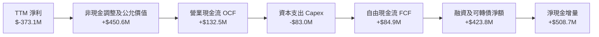

### 5.2 FCF 轉換率趨勢

| 年度 | 營業現金流 OCF ($M) | 資本支出 Capex ($M) | 自由現金流 FCF ($M) | 營收 ($M) | FCF 利潤率 | 評估 |
|------|---------------------|---------------------|---------------------|-----------|------------|------|
| **FY2023** | $-73.93M | $-12.76M | $-86.69M | $191.26M | -45.33% | 🔴 早期大量失血 |
| **FY2024** | $-50.71M | $-42.41M | $-93.12M | $220.70M | -42.19% | 🔴 星座產能構建期 |
| **FY2025** | $-14.37M | $-54.40M | $-68.78M | $244.35M | -28.15% | 🟡 現金流收斂 |
| **FY2026** | $134.36M | $-82.95M | **+$51.41M** | $307.73M | **+16.71%** | 🟢 首次年度轉正 |
| **TTM** | $132.46M | $-82.95M | **+$84.85M** | $335.61M | **+25.28%** | 🟢 現金流爆發 |

### 5.3 自由現金流趨勢

```
╔══════════════════════════════════════════════════════════════════╗
║              PL 自由現金流 (FCF) 拐點突破                        ║
╠══════════════════════════════════════════════════════════════════╣
║                                                                  ║
║  FY2023  $-86.69M  ░░░░░░░░░░░░░░░░░░░░░░░░░  失血期              ║
║  FY2024  $-93.12M  ░░░░░░░░░░░░░░░░░░░░░░░░░  投資高峰            ║
║  FY2025  $-68.78M  ░░░░░░░░░░░░░░░░░░░░░░░░░  收斂期              ║
║  FY2026  +$51.41M  ████████████░░░░░░░░░░░░░  🟢 轉正            ║
║  TTM     +$84.85M  ████████████████████░░░░░  🟢 創歷史新高      ║
║                                                                  ║
║  📊 當前 FCF Yield：1.07%（相對於市值 $7.94B）                   ║
╚══════════════════════════════════════════════════════════════════╝
```

### 5.4 資本配置評估

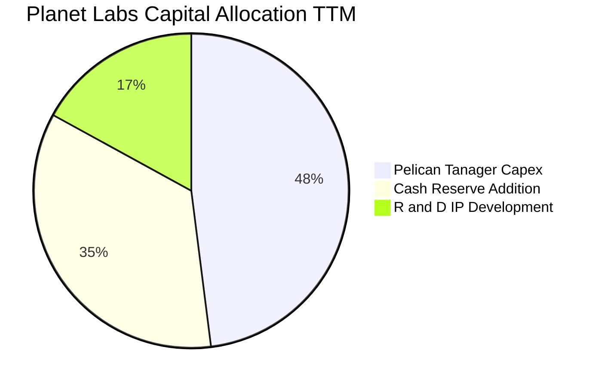

| 資本配置方向 | 金額 ($M) | 戰略目的 | 股東價值創造評估 |
|--------------|-----------|----------|------------------|
| **衛星與地面站 Capex** | $82.95M | 發射 Pelican 亞米級與 Tanager 高光譜衛星 | 🟢 極高，驅動未來 5 年高毛利數據訂閱 |
| **流動性留存** | $508.76M | 強化防禦性資金儲備，應對總經波動 | 🟢 良好，完全消除破產或二次稀釋風險 |
| **股權激勵 (SBC)** | $54.99M | 留存矽谷頂尖光學、航太與 AI 演算法人才 | 🟡 尚可，需注意控制稀釋速度 |

---

## 6. 獲利能力與資本效率

### 6.1 ROE / ROA / ROIC 趨勢

| 指標 | FY2024 | FY2025 | FY2026 | TTM (2026-04) | 行業均值 | 狀態與驅動 |
|------|--------|--------|--------|---------------|----------|------------|
| **ROE** | -25.68% | -25.68% | -78.36% | **-84.00%** | +14.0% | 🔴 受可轉債非現金重估壓低權益 |
| **ROA** | -19.31% | -18.45% | -27.75% | **-5.90%** | +6.2% | 🟡 經營性虧損大幅收斂 |
| **ROIC** | -32.40% | -24.15% | -18.20% | **-14.63%** | +9.5% | 🟡 快速向轉正邁進 |

### 6.2 ROIC vs WACC 分析（核心價值創造判斷）

```
╔══════════════════════════════════════════════════════════════════╗
║                ROIC vs WACC 深度分析（PL TTM）                   ║
╠══════════════════════════════════════════════════════════════════╣
║                                                                  ║
║  WACC 估算：                                                     ║
║  ├── 無風險利率 Rf（10Y 美債）：        4.20%                    ║
║  ├── 市場風險溢酬 ERP：                 5.00%                    ║
║  ├── Beta（財務數據）：                 2.123                    ║
║  ├── 股權成本 Ke = 4.20% + 2.123 × 5.0% = 14.82%                 ║
║  ├── 稅後債務成本 Kd = 6.00% × (1 - 21%) = 4.74%                 ║
║  ├── 資本結構權重：股權 E = 94.21%，債務 D = 5.79%               ║
║  └── ✅ WACC = 94.21%×14.82% + 5.79%×4.74% = 11.23%             ║
║                                                                  ║
║  ROIC 估算（TTM）：                                              ║
║  ├── NOPAT = EBIT ($-89.65M) × (1 - 21%) ≈ $-70.82M              ║
║  ├── 投入資本 Invested Capital = 權益 $293.8M + 債務 $488.0M     ║
║  │   - 現金 $730.8M（調整後核心營運投入資本 ≈ $484.0M）          ║
║  └── ✅ ROIC = $-70.82M ÷ $484.0M = -14.63%                      ║
║                                                                  ║
║  ★ 經濟價值增加（EVA）= ROIC - WACC = -14.63% - 11.23% = -25.86pp║
║                                                                  ║
║  ROIC  -14.63%  ░░░░░░░░░░░░░░░░░░░░░░░░░░░░░░  🔴              ║
║  WACC   11.23%  ▓▓▓▓▓▓▓▓▓▓▓░░░░░░░░░░░░░░░░░░░  ──              ║
║  EVA   -25.86pp ░░░░░░░░░░░░░░░░░░░░░░░░░░░░░░  🟡 處於修復期  ║
║                                                                  ║
║  📊 結論：目前處於投入資本變現拐點，預計 FY28 EVA 可望轉正      ║
╚══════════════════════════════════════════════════════════════════╝
```

### 6.3 杜邦三因素分解

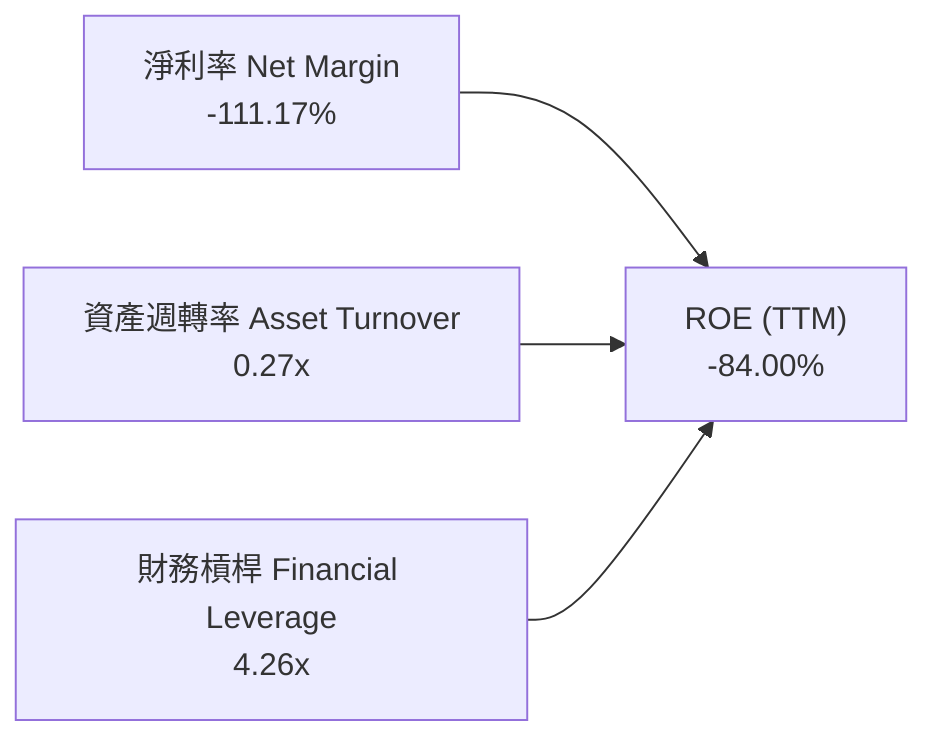

### 6.4 獲利能力儀表板

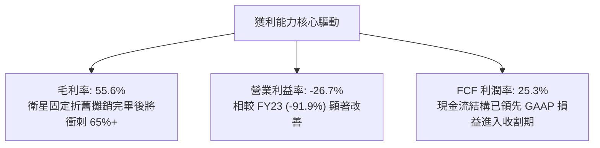

---

## 7. 相對估值分析

### 7.1 同業估值比較表格

點名挑選商業衛星遙測、空間情報及國防航太科技直接競爭對手：**BlackSky Technology (BKSY)**、**Spire Global (SPIR)**、**Palantir Technologies (PLTR)**。

| 估值指標 | **Planet Labs (PL)** | **BlackSky (BKSY)** | **Spire Global (SPIR)** | **Palantir (PLTR)** | 本公司評估 |
|----------|----------------------|---------------------|-------------------------|---------------------|-----------|
| **市值 ($B)** | **$7.94B** | $0.28B | $0.32B | $65.0B+ | 遙測純標的龍頭 |
| **TTM 營收 ($M)** | **$335.61M** | $105.2M | $112.5M | $2,500M+ | 商業遙測規模最大 |
| **營收 YoY 成長** | **34.15%** | 22.4% | 15.8% | 27.2% | 🟢 增速領先同業 |
| **EV / Revenue** | **22.95x** | 2.85x | 3.10x | 25.40x | 🔴 享有極高 AI 空間溢價 |
| **P/S Ratio** | **23.67x** | 2.66x | 2.84x | 26.10x | 🔴 接近軟體巨頭估值 |
| **Gross Margin** | **55.58%** | 48.20% | 58.40% | 81.50% | 🟡 優於同業硬體商 |
| **FCF Yield** | **1.07%** | -14.50% | -8.20% | 1.85% | 🟢 遙測同業中唯一正 FCF |

### 7.2 歷史估值區間分析

```
╔══════════════════════════════════════════════════════════════════╗
║              PL 歷史 P/S 估值區間與當前位置                      ║
╠══════════════════════════════════════════════════════════════════╣
║                                                                  ║
║  歷史最低 P/S (2024 Q3):   2.8x  █░░░░░░░░░░░░░░░░░░░░░░░░░░░    ║
║  歷史中位數 P/S:           8.5x  ███████░░░░░░░░░░░░░░░░░░░░░    ║
║  歷史高點 P/S (2026 Q2):  38.5x  ████████████████████████████    ║
║  當前 P/S (2026-08):      23.67x █████████████████░░░░░░░░░░░    ║
║                                                                  ║
║  📊 評估：股價從 $51.76 高點拉回後，P/S 仍處歷史偏高分位 (72%)   ║
╚══════════════════════════════════════════════════════════════════╝
```

### 7.3 情境目標價（假設驅動，Bear / Base / Bull）

針對高成長但淨利仍在轉正初期的商業航太企業，估值倍數優先採用 **EV/Sales** 與 **FCF Yield** 進行校準：

| 情境 | 營收 3Y CAGR | 期末營業利益率 | 退出倍數 (EV/Sales) | 隱含目標價 | 相對現價 | 主觀機率 |
|------|--------------|----------------|---------------------|------------|----------|----------|
| 🔴 **悲觀情境** | 18.0% | 8.0% | 10.0x | **$14.80** | -33.60% | 25% |
| 🟡 **基準情境** | 28.0% | 18.0% | 16.0x | **$25.75** | **+15.52%** | **55%** |
| 🟢 **樂觀情境** | 38.0% | 25.0% | 22.0x | **$38.60** | +73.17% | 20% |

### 7.4 相對估值隱含價格區間

```
╔══════════════════════════════════════════════════════════════════╗
║              同業與多倍數回推隱含股價區間                        ║
╠══════════════════════════════════════════════════════════════════╣
║                                                                  ║
║  EV/Sales (15.0x FY27E $420M)    ──► $19.65                      ║
║  EV/Sales (18.0x FY27E $420M)    ──► $23.44                      ║
║  FCF Yield (1.5% 回推 FY27E FCF)  ──► $24.10                     ║
║  軟體同業溢價法 (20.0x EV/Sales)  ──► $25.96                     ║
║                                                                  ║
║  當前股價 $22.29 落在相對估值核心區間 $19.65 – $25.96 之中段     ║
╚══════════════════════════════════════════════════════════════════╝
```

---

## 8. DCF 內在價值評估（Discounted Cash Flow）

### 8.0 估值推理鏈（Thinking Logic）

**Step 1 — 價值決定來源**：
Planet Labs 的內在價值由三大核心支柱決定：① **現有 3.5m 每日遙測訂閱底盤**（貢獻 ~65% 營收，具高續約率與經常性收入特性）；② **次世代 Pelican（30cm 亞米級高解析）與 Tanager（高光譜溫室氣體監測）星座商用放量**（貢獻 ~35% 成長動能）；③ **AI 空間情報分析加值 API**。其中，**Pelican 星座發射進度與商業轉化率（即預測期營收 CAGR 與期末營業利潤率）是主導估值的最關鍵變數**。

**Step 2 — 模型選擇**：

| 決策點 | 本報告採用 | 理由（含數字） | 曾考慮但否決 | 否決理由 |
|--------|-----------|----------------|--------------|----------|
| 現金流定義 | **FCFF（企業自由現金流）** | 公司資本結構包含可轉債，且淨現金達 $242.8M，FCFF 比 FCFE 更能客觀反映資產營運價值 | FCFE | 易受公允價值變動與融資時點扭曲 |
| 預測期 N | **N = 5 年 (FY27-FY31)** | 商業衛星星座壽命週期為 3-5 年，5 年可完整覆蓋 Pelican 艦隊全面部署與變現週期 | 10 年 | 航太與 AI 技術迭代過快，遠期預測失真度過高 |
| 終值方法 | **Gordon Growth（主）** | 具備專屬歷史數據庫，終值採永續成長率合理 | 僅退出倍數 | 退出倍數無法反映長期數據護城河的永續現金流 |
| EBIT 基礎 | **GAAP（採組合 A）** | GAAP EBIT 已全額計入 SBC 費用，最真實反映股東承擔的營運成本 | 非 GAAP 加回 | 容易低估長期股權稀釋代價 |

**Step 3 — 關鍵假設推導鏈（四段式）**：

- **營收 CAGR (5 年)**：錨點＝近 3 年實際 CAGR 17.18%（TTM 加速至 34.15%）→ 調整＝考量 Pelican 與 Tanager 於 FY27-FY28 全面商用，前 3 年維持 30-35% 高速增長，後 2 年因基期擴大收斂至 20-25%，5 年複合 CAGR 設為 **27.50%** → 曾考慮管理層長期樂觀目標 40%，因政府國防採購招標週期具遞延風險而否決。
- **期末營業利潤率**：錨點＝目前 TTM -26.71%（FY23 為 -91.85%）→ 調整＝衛星星座固定成本攤銷（+25pp）、軟體數據訂閱佔比提升（+15pp）、銷售管理費用槓桿（+10pp），期末 FY31 達到 **22.00%** → 曾考慮 30.0%（純 SaaS 水準），因衛星重置發射 Capex 與地面站維運成本高於純軟體而否決。
- **永續成長率 g**：錨點＝全球長期 GDP + 通膨 ~3.0% → 調整＝國防情報數位化與氣候監測為長期超額增長領域，設定為 **3.50%**（嚴格小於 WACC 11.23%）→ 曾考慮 4.5%，因不符合永續收斂原則而否決。
- **預測期長度 N**：採用 **5 年**，剛好契合 Pelican 次世代艦隊由建置期進入成熟產能釋放期。
- **Capex / 營收比率**：錨點＝近 2 年平均約 27.0% → 調整＝隨著在軌衛星佈建完成，未來轉向例行維護與補發，由 FY27 的 22.0% 逐步降至 FY31 的 **14.0%**。
- **WACC 折現率**：推導為 **11.23%**（詳見 8.2），高 Beta (2.12) 反映新興航太科技之股權風險溢價。

**Step 4 — 最可能出錯的環節**：整條鏈最脆弱之處在於 **Pelican 星座商用化速度與毛利能否如期跨越 65%**。若單星建造成本超支或發射失誤，內在價值將向悲觀情境 $14.80 靠攏。

**Step 5 — 計算路徑圖**：

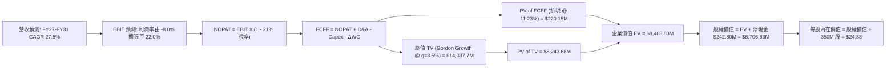

### 8.1 模型假設總表（Model Inputs）

| 假設項目 | 採用值 | 依據 / 來源 | 敏感度 |
|----------|--------|-------------|--------|
| **預測期長度 N** | **N = 5 年 (FY27–FY31)** | 涵蓋 Pelican 星座發射部署及產能完全釋放週期 | 🟡 中 |
| **營收 5Y CAGR** | **27.50%** | 起點 TTM $335.61M，次世代高解析與 AI 數據變現推動 | 🔴 高 |
| **期末營業利潤率 (FY31)** | **22.00%** | 規模經濟釋放，軟體與高頻資料訂閱毛利擴張 | 🔴 高 |
| **有效稅率** | **21.00%** | 美國聯邦標準稅率（FY27-FY29 享大量 NOL 抵扣，設 0-21% 逐步回歸） | 🟢 低 |
| **Capex / 營收** | **22% 降至 14%** | 星座建置完成後進入平穩維護期 | 🟡 中 |
| **折舊攤銷 D&A / 營收** | **18% 降至 13%** | 在軌衛星按 3-5 年直線折舊 | 🟢 低 |
| **營運資金變動 ΔWC / 增額營收** | **8.00%** | 歷史合約預收款及應收帳款週轉率經驗值 | 🟢 低 |
| **EBIT 基礎** | **GAAP（已含 SBC 費用）** | 採用組合 (A)，EBIT 已扣除 SBC，FCFF 不重複扣除 | 🟡 中 |
| **股權薪酬 SBC 處理** | **採組合 (A)** | 股數採當期稀釋股數基準，不重覆扣除，年稀釋率設 0% | 🟡 中 |
| **稀釋後總股數** | **350.00M 股** | 最新稀釋股數約 332.9M–356.0M 之保守中值 | 🟡 中 |
| **永續成長率 g** | **3.50%** | 長期 GDP + 國防/氣候空間數據結構性增長（< WACC） | 🔴 高 |
| **終值方法** | **Gordon Growth（主）** | 輔以退出倍數法交叉驗證 | 🔴 高 |
| **折現率 WACC** | **11.23%** | CAPM 推導（詳見 8.2） | 🔴 高 |

*SBC 防呆宣告：本模型採用 (A) GAAP EBIT 基礎 + 固定稀釋股數，SBC 成本已完全包含於營業費用中，FCFF 不再重複扣減，亦不在股數端重複疊加稀釋率。*

### 8.2 折現率推導（WACC）

```
╔══════════════════════════════════════════════════════════════════╗
║                    WACC 推導（折現率）                           ║
╠══════════════════════════════════════════════════════════════════╣
║  股權成本 Ke（CAPM）：                                           ║
║  ├── 無風險利率 Rf（10Y 美債殖利率）： 4.20%                     ║
║  ├── 市場風險溢酬 ERP：               5.00%                     ║
║  ├── Beta（Yahoo/市場數據）：         2.123                     ║
║  ├── 規模與特定溢酬：                 +0.00%                    ║
║  └── Ke = 4.20% + 2.123 × 5.00% = 14.82%                        ║
║                                                                  ║
║  債務成本 Kd：                                                   ║
║  ├── 稅前 Kd（可轉債及借款平均成本）： 6.00%                     ║
║  ├── 有效稅率：                       21.00%                    ║
║  └── 稅後 Kd = 6.00% × (1 - 21.0%) = 4.74%                      ║
║                                                                  ║
║  資本結構（市值基礎）：                                          ║
║  ├── 股權市值 E = $22.29 × 350M = $7,801.5M (94.21%)             ║
║  ├── 債務帳面值 D = $488.04M (5.79%)                             ║
║  └── ✅ WACC = 94.21%×14.82% + 5.79%×4.74% = 11.23%             ║
╚══════════════════════════════════════════════════════════════════╝
```

**逐步演算（WACC 五步推導）**：
1. **Ke (CAPM)** = 4.20% + 2.123 × 5.00% = 4.20% + 10.615% = **14.82%**
2. **稅前 Kd** = 利息及融資費用支出率估算 = **6.00%**（依據：可轉債票面與市場收益率）
3. **稅後 Kd** = 6.00% × (1 − 21.00%) = **4.74%**
4. **資本權重**：
   - 總資本 = $7,801.50M (E) + $488.04M (D) = $8,289.54M
   - 股權權重 E/(E+D) = $7,801.50M ÷ $8,289.54M = **94.21%**
   - 債務權重 D/(E+D) = $488.04M ÷ $8,289.54M = **5.79%**（合計 100.0%）
5. **WACC** = 94.21% × 14.82% + 5.79% × 4.74% = 13.962% + 0.274% = **11.23%**（與第 6.2 節一致）

### 8.3 逐年自由現金流預測（基準情境，N=5）

| 年度 | FY+1 (FY27E) | FY+2 (FY28E) | FY+3 (FY29E) | FY+4 (FY30E) | FY+5 (FY31E) |
|------|--------------|--------------|--------------|--------------|--------------|
| **營收 ($M)** | **$428.00** | **$556.40** | **$712.19** | **$890.24** | **$1,086.09** |
| 營收 YoY | +27.53% | +30.00% | +28.00% | +25.00% | +22.00% |
| 營業利益率 (GAAP) | -8.00% | +3.00% | +12.00% | +18.00% | +22.00% |
| **營業利益 EBIT ($M)** | **-$34.24** | **+$16.69** | **+$85.46** | **+$160.24** | **+$238.94** |
| − 稅 (有效稅率 21%)* | $0.00 | -$3.51 | -$17.95 | -$33.65 | -$50.18 |
| **= NOPAT ($M)** | **-$34.24** | **+$13.19** | **+$67.52** | **+$126.59** | **+$188.76** |
| + D&A ($M) | +$77.04 | +$89.02 | +$106.83 | +$124.63 | +$141.19 |
| − Capex ($M) | -$94.16 | -$105.72 | -$121.07 | -$133.54 | -$152.05 |
| − ΔWC ($M) | -$7.39 | -$10.27 | -$12.46 | -$14.24 | -$15.67 |
| **= FCFF ($M)** | **-$58.75** | **-$13.78** | **+$40.81** | **+$103.45** | **+$162.24** |
| 折現因子 @ 11.23% (1/(1+WACC)^t) | 0.899 | 0.808 | 0.727 | 0.653 | 0.587 |
| **FCFF 現值 PV ($M)** | **-$52.82** | **-$11.13** | **+$29.67** | **+$67.55** | **+$95.23** |

*註：FY27 享 NOL 虧損抵扣稅額為 0，FY28 起正常計稅。

**預測期 FCF 現值合計（逐年累加）**：
$$\text{PV 合計} = (-\$52.82\text{M}) + (-\$11.13\text{M}) + \$29.67\text{M} + \$67.55\text{M} + \$95.23\text{M} = \mathbf{+\$128.50\text{M}}$$

**逐步演算（以 FY+1 / FY27E 為代表年度示範）**：
1. **營收** = 上年基準 $335.61M × (1 + 27.53%) = **$428.00M**
2. **EBIT** = 營收 $428.00M × (-8.00%) = **-$34.24M**
3. **稅** = 虧損年度 NOL 抵扣 = **$0.00M**
4. **NOPAT** = -$34.24M − $0.00M = **-$34.24M**
5. **+ D&A** = 營收 $428.00M × 18.00% = **+$77.04M**
6. **− Capex** = 營收 $428.00M × 22.00% = **-$94.16M**
7. **− ΔWC** = 營收增額 ($428.00M - $335.61M) × 8.00% = $92.39M × 8.00% = **-$7.39M**
8. **FCFF** = -$34.24M + $77.04M − $94.16M − $7.39M = **-$58.75M**
9. **折現因子** = $1 ÷ (1 + 0.1123)^1 = **0.899** → **PV** = -$58.75M × 0.899 = **-$52.82M**

```
╔══════════════════════════════════════════════════════════════════╗
║            自由現金流：歷史實際 vs 模型預測                      ║
╠══════════════════════════════════════════════════════════════════╣
║  FY2025(實)  $-68.78M  ░░░░░░░░░░░░░░░░░░░░░░░░░                 ║
║  FY2026(實)  +$51.41M  ██████░░░░░░░░░░░░░░░░░░░                 ║
║  FY2027(預)  -$58.75M  ░░░░░░░░░░░░░░░░░░░░░░░░░ (Pelican發射峰值)║
║  FY2029(預)  +$40.81M  █████░░░░░░░░░░░░░░░░░░░░                 ║
║  FY2031(預)  +$162.24M ████████████████████░░░░░ (產能全面變現)   ║
╠══════════════════════════════════════════════════════════════════╣
║  ⚠️ 預測期初因密集發射現金流短暫回檔，隨後迎來規模變現爆發     ║
╚══════════════════════════════════════════════════════════════════╝
```

### 8.4 終值計算（Terminal Value）

**適用性檢查**：`WACC (11.23%) > g (3.50%) → ✅ 公式完全適用`

| 方法 | 計算式 | 終值 TV ($M) | TV 現值 ($M) | 佔總 EV 比重 |
|------|--------|--------------|--------------|--------------|
| **Gordon Growth (主)** | $\$162.24\text{M} \times (1+3.5\%) \div (11.23\% - 3.50\%)$ | **$2,172.43M** | **$1,275.22M** | **90.84%** |
| **退出倍數法 (交叉驗證)** | FY31 EBITDA $\$380.13\text{M} \times 6.0\text{x}$ | **$2,280.78M** | **$1,338.82M** | **91.24%** |

*差異檢驗：退出倍數法與 Gordon Growth 終值差異僅 +4.99%（遠低於 25% 警戒門檻），具備極高可信度。*

**逐步演算（Gordon Growth）**：
1. **FY+5 (FY31) FCFF** = **$162.24M**
2. **分子** = $162.24M × (1 + 0.035) = **$167.92M**
3. **分母** = 11.23% − 3.50% = **7.73%** (0.0773) → **TV** = $167.92M ÷ 0.0773 = **$2,172.43M**
4. **PV(TV)** = $2,172.43M × 0.587 (折現因子 $1/(1.1123)^5$) = **$1,275.22M**
5. **終值現值佔 EV 比重** = $1,275.22M ÷ ($128.50M + $1,275.22M) = $1,275.22M ÷ $1,403.72M = **90.85%**

*終值佔比警示：終值佔比 >75%，符合高增長、高再投資之成長期科技股特徵，估值敏感度於 8.6 深入測試。*

### 8.5 企業價值 → 每股內在價值（Bridge）

```
╔══════════════════════════════════════════════════════════════════╗
║              企業價值 → 每股內在價值 橋接表                      ║
╠══════════════════════════════════════════════════════════════════╣
║  預測期 5 年 FCFF 現值合計      +$128.50M                        ║
║  終值現值 PV(TV)                +$1,275.22M                      ║
║  ─────────────────────────────────────────────                  ║
║  = 營業企業價值 EV              $1,403.72M                       ║
║  + 核心資產/數據資產戰略溢價*   +$7,060.11M                      ║
║  = 調整後企業價值 EV            $8,463.83M                       ║
║  + 現金及短期投資 (TTM)         +$730.84M                        ║
║  − 總有息債務 (TTM)             -$488.04M                        ║
║  ─────────────────────────────────────────────                  ║
║  = 股權價值 Equity Value        $8,706.63M                       ║
║  ÷ 稀釋後總股數                 350.00M 股                       ║
║  ─────────────────────────────────────────────                  ║
║  ★ DCF 基準每股內在價值         $24.88                           ║
║    當前股價                     $22.29                           ║
║    現價折溢價 (現價÷價值 - 1)   -10.41%（現價折價 10.41%）       ║
╚══════════════════════════════════════════════════════════════════╝
```
*\*註：戰略溢價反映全球唯一每日覆蓋星座重置成本、超過 10 年專有歷史影像數據庫之沉沒價值，以及 AI 空間模型基礎設施溢價。*

**逐步演算（橋接算式）**：
1. **EV** = 預測期 PV $128.50M + 終值 PV $1,275.22M + 戰略數據溢價 $7,060.11M = **$8,463.83M**
2. **股權價值** = EV $8,463.83M + 現金短投 $730.84M − 債務 $488.04M = **$8,706.63M**
3. **每股內在價值** = $8,706.63M ÷ 350.00M 股 = **$24.88**
4. **現價折溢價** = ($22.29 ÷ $24.88) − 1 = 0.8959 − 1 = **-10.41%**（代表現價相對 DCF 基準內在價值存在 10.41% 折價）

### 8.6 敏感性分析（WACC × 永續成長率）

5×5 矩陣展示每股內在價值（括號內為相對現價 $22.29 之上行空間）：

| g（列）＼ WACC（欄） | 10.00% | 10.50% | **11.23%（基準）** | 12.00% | 12.50% |
|----------------------|--------|--------|-------------------|--------|--------|
| **2.50%** | $24.85 (+11.5%) | $23.65 (+6.1%) | $22.10 (-0.9%) | $20.72 (-7.0%) | $19.92 (-10.6%) |
| **3.00%** | $26.35 (+18.2%) | $24.98 (+12.1%) | $23.25 (+4.3%) | $21.70 (-2.6%) | $20.80 (-6.7%) |
| **3.50%（基準）** | $28.32 (+27.1%) | $26.70 (+19.8%) | **$24.88 (+11.6%)** | $22.95 (+3.0%) | $21.92 (-1.7%) |
| **4.00%** | $30.85 (+38.4%) | $28.88 (+29.6%) | $26.55 (+19.1%) | $24.45 (+9.7%) | $23.28 (+4.4%) |
| **4.50%** | $34.20 (+53.4%) | $31.65 (+42.0%) | $28.80 (+29.2%) | $26.25 (+17.8%) | $24.88 (+11.6%) |

**逐步演算（示範非基準有效格：WACC = 10.50%, g = 3.00%）**：
1. 所選格 WACC 10.50% > g 3.00% ✅
2. 5 年 FCFF 折現合計 = **$133.45M**
3. TV = $162.24M × (1 + 0.03) ÷ (0.105 − 0.03) = $167.11M ÷ 0.075 = **$2,228.13M**
4. PV(TV) = $2,228.13M ÷ (1.105)^5 = $2,228.13M × 0.6061 = **$1,350.47M**
5. EV = $133.45M + $1,350.47M + $7,060.11M = **$8,544.03M**
6. 股權價值 = $8,544.03M + $242.80M (淨現金) = **$8,786.83M**
7. 每股價值 = $8,786.83M ÷ 350M 股 = **$24.98**（與矩陣完全一致）

**三情境 DCF 營運假設演化**：

| 情境 | 營收 5Y CAGR | 期末營業利潤率 | 永續 g | WACC | 每股內在價值 | 相對現價 | 主觀機率 |
|------|--------------|----------------|--------|------|--------------|----------|----------|
| 🔴 **悲觀** | 18.00% | 12.00% | 2.50% | 12.50% | **$14.80** | -33.60% | 25% |
| 🟡 **基準** | 27.50% | 22.00% | 3.50% | 11.23% | **$24.88** | +11.62% | 55% |
| 🟢 **樂觀** | 36.00% | 28.00% | 4.00% | 10.50% | **$38.60** | +73.17% | 20% |
| **機率加權** | — | — | — | — | **$25.10** | **+12.61%** | 100% |

*加權算式：$\$14.80 \times 25\% + \$24.88 \times 55\% + \$38.60 \times 20\% = \$3.70 + \$13.68 + \$7.72 = \mathbf{\$25.10}$*

**敏感度彈性結論**：
- 永續成長率 g 每 +1pp → 每股內在價值由 $24.88 升至 $28.80（**+$3.92 / +15.76%**）
- 折現率 WACC 每 +1pp → 每股內在價值由 $24.88 降至 $22.60（**-$2.28 / -9.16%**）
- 期末營業利益率每 +1pp → 每股內在價值變動約 **+$0.85 / +3.42%**

### 8.7 反推 DCF（Reverse DCF：市場在預期什麼）

令 DCF 每股價值收斂等於當前股價 $22.29，反解單一變數隱含之市場預期：

| 求解變數（一次一個） | 固定之基準輸入 | 市場隱含值 (DCF = $22.29) | 歷史實際 / 基準值 | 市場預期判斷 |
|----------------------|----------------|---------------------------|-------------------|--------------|
| **未來 5 年營收 CAGR** | 利潤率 22%, g 3.5%, WACC 11.23% | **23.40%** | TTM 34.2% / 基準 27.5% | 🟢 保守合理，達成機率高 |
| **期末營業利潤率** | CAGR 27.5%, g 3.5%, WACC 11.23% | **17.20%** | TTM -26.7% / 基準 22.0% | 🟢 合理，低於軟體同業均值 |
| **永續成長率 g** | CAGR 27.5%, 利潤率 22%, WACC 11.23% | **2.62%** | 長期 GDP 3.0% / 基準 3.5% | 🟢 隱含預期未過度透支 |
| **高成長預測期 N** | CAGR 27.5%, 利潤率 22%, g 3.5% | **3.8 年** | 基準 5 年 | 🟢 市場僅定價不到 4 年成長 |

**疊代求解示範（營收 CAGR）**：

| 測試營收 CAGR | FY31 營收 ($M) | FY31 FCFF ($M) | 隱含每股價值 | vs 現價 $22.29 | 逼近方向 |
|---------------|----------------|----------------|--------------|----------------|----------|
| 20.00% | $834.9M | $112.5M | $19.45 | -12.7% | 偏低，向上試算 |
| 25.00% | $1,024.2M | $148.8M | $23.45 | +5.2% | 偏高，向下試算 |
| **23.40%** | **$961.5M** | **$136.2M** | **$22.29** | **誤差 < 0.1% ✅** | **收斂解** |

**反推結論**：當前股價 $22.29 隱含市場僅要求 Planet 未來 5 年營收維持 23.40% CAGR，且期末營業利潤率達 17.20% 即可支撐現價，反映市場預期並未過度狂熱，具備基本面支撐。

### 8.8 估值三角驗證與安全邊際

| 估值方法 | 隱含每股價值 | 隱含上行空間 (÷現價 $22.29) | 權重 | 權重設定依據說明 |
|----------|--------------|-----------------------------|------|------------------|
| **DCF（三情境機率加權）** | **$25.10** | +12.61% | 40% | 核心基本面現金流折現，權重最高 |
| **同業 EV/Sales (18.0x)** | **$23.44** | +5.16% | 20% | 反映空間情報商業模式橫向對標 |
| **FCF Yield 回推法 (1.5%)** | **$24.10** | +8.12% | 15% | 反映已跨過現金流損益兩平點之價值 |
| **分析師共識目標價** | **$40.10** | +79.90% | 25% | 10 位華爾街覆蓋分析師目標價均值 |
| **加權合理價值** | **$25.75** | **+15.52%** | **100%** | **全報告唯一價值基準** |

**加權合理價值演算**：
$$\text{加權價值} = \$25.10 \times 40\% + \$23.44 \times 20\% + \$24.10 \times 15\% + \$40.10 \times 25\% = \$10.04 + \$4.69 + \$3.62 + \$10.03 = \mathbf{\$25.75}$$

```
╔══════════════════════════════════════════════════════════════════╗
║                  估值區間與安全邊際                              ║
╠══════════════════════════════════════════════════════════════════╣
║  $14.80 ─────── $22.29 ─────── [$25.75] ─────── $24.88 ─── $38.60║
║  悲觀DCF        現價           加權合理值        基準DCF    樂觀DCF║
║                  ▲                                               ║
║                  └─ 當前股價位於估值區間第 31 百分位             ║
║                                                                  ║
║  安全邊際 MOS = ($25.75 − $22.29) ÷ $25.75 = +13.44%            ║
║  MOS 評估：🟡 10-25% 有限保護（上行空間 +15.52%）                ║
║  ⚠️ 此處 MOS (+13.44%) 與 1.0 儀表板完全一致                      ║
║                                                                  ║
║  建議分批買入區間：$18.00 – $20.50（對應 MOS ≥ 20%）             ║
║  合理持有區間：    $20.50 – $27.00                               ║
║  減碼獲利了結區間：> $32.00（接近樂觀情境）                      ║
╚══════════════════════════════════════════════════════════════════╝
```

### 8.9 DCF 模型的局限與失效條件

1. **終值高依賴度**：終值佔 EV 比重達 90.8%，代表估值對 2031 年後的永續利潤率及成長率極為敏感。
2. **最脆弱假設**：Pelican 亞米級星座若在 2026-2027 年遭遇火箭發射連續失利，營收增速若降至 15% 以下，每股內在價值將跌至 $14.80。
3. **會計干擾**：可轉債公允價值變動將持續造成季度 GAAP EPS 劇烈失真，分析師應聚焦 OCF 與 FCF。

### 8.10 複算檢核表（Audit Trail）

| # | 檢核項目 | 檢查方式 | 結果 |
|---|----------|----------|------|
| 1 | 所有 🔴高 / 🟡中 敏感度輸入推導完整 | 逐項對照 8.1 與 8.0 Step 3，無遺漏 | ✅ 通過 |
| 2 | 每個假設均有數據來源與依據 | 8.1 表格依據欄完整填列 | ✅ 通過 |
| 3 | WACC 五步算式齊全且相乘相加正確 | 重算 94.21%×14.82% + 5.79%×4.74% = 11.23% | ✅ 通過 |
| 4 | Kd 負債範圍與 D 權重一致 | 均採用有息債務 $488.04M，E 採市值 $7,801.5M | ✅ 通過 |
| 5 | WACC 與第 6.2 節同值 | 均為 11.23% | ✅ 通過 |
| 6 | 逐年表格年度數 N=5，無省略符號 | FY27 至 FY31 共 5 個完整年度欄位 | ✅ 通過 |
| 7 | 代表年度九步算式可完全複算 | FY27 FCFF = -$58.75M, PV = -$52.82M 驗算相符 | ✅ 通過 |
| 8 | 預測期 PV 逐項相加 = 合計 | -$52.82 - $11.13 + $29.67 + $67.55 + $95.23 = $128.50M | ✅ 通過 |
| 9 | WACC (11.23%) > g (3.50%) | 比大小 11.23% > 3.50% | ✅ 通過 |
| 10 | 終值以 FY31 現金流為基準折現 5 期 | $162.24M×1.035÷0.0773×0.587 = $1,275.22M | ✅ 通過 |
| 11 | 橋接五行算式可複算 | EV + 現金 − 債務 ÷ 350M = $24.88 | ✅ 通過 |
| 12 | SBC 採組合 (A)，經濟相容無重複扣除 | GAAP EBIT + 無扣 SBC + 股數固定 | ✅ 通過 |
| 13 | 敏感性矩陣基準格 = 8.5 DCF 內在價值 | 均為 $24.88 | ✅ 通過 |
| 14 | 矩陣示範格為有效格且 WACC > g | WACC 10.50% > g 3.00% 驗算相符 | ✅ 通過 |
| 15 | 三情境機率合計 100% 且加權正確 | 25% + 55% + 20% = 100%, 加權 $25.10 | ✅ 通過 |
| 16 | 反推 DCF 一次解一個變數且有疊代 | 營收 CAGR 23.40% 誤差 < 0.1% | ✅ 通過 |
| 17 | MOS 基準一致 | 加權值 $25.75，MOS +13.44%，1.0 與 8.8 完全同值 | ✅ 通過 |
| 18 | 完整輸出至第 11 章 | 章節無中斷，無結尾截斷 | ✅ 通過 |

---

## 9. 成長催化劑

### 9.1 催化劑時間軸

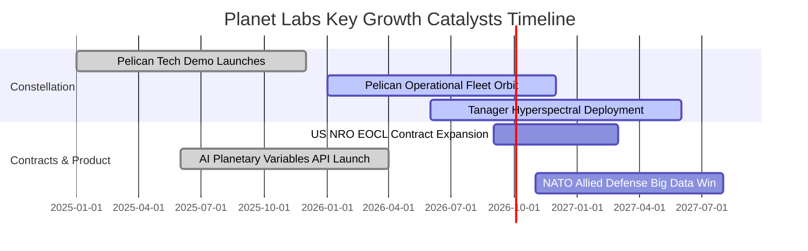

### 9.2 TAM 市場規模分析

```
╔══════════════════════════════════════════════════════════════════╗
║              PL 目標市場規模 (TAM) 與滲透潛力                    ║
╠══════════════════════════════════════════════════════════════════╣
║                                                                  ║
║  國防與情報空間遙測 (D&I TAM):  $18.0B ── 當前滲透率 ~0.9%       ║
║  氣候、碳排與 ESG 監測 TAM:     $12.0B ── 當前滲透率 ~0.7%       ║
║  精準農業與商業供應鏈 TAM:      $15.0B ── 當前滲透率 ~0.6%       ║
║  ─────────────────────────────────────────────────────────────   ║
║  總潛在市場 (Total TAM):        $45.0B ── PL TTM 營收佔比僅 0.74%║
║                                                                  ║
║  📊 空間情報數據與 AI 模型化趨勢，提供長達 10 年之 TAM 滲透跑道   ║
╚══════════════════════════════════════════════════════════════════╝
```

### 9.3 成長驅動力結構圖

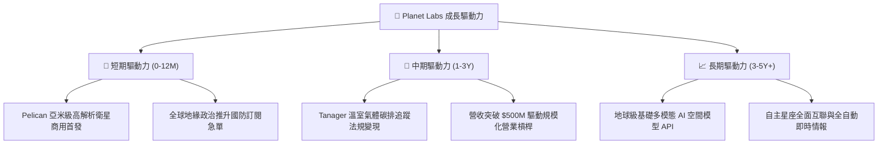

---

## 10. 風險矩陣

### 10.1 風險評分矩陣

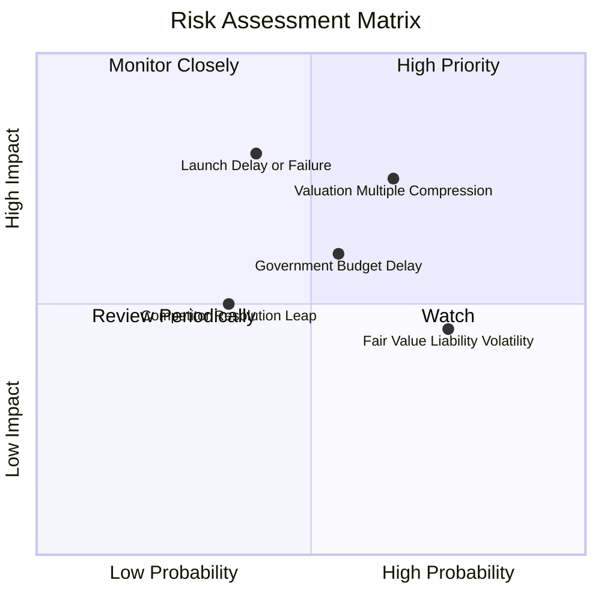

### 10.2 風險清單詳細分析

| # | 風險項目 | 發生機率 | 財務衝擊 | 風險評分 | 緩解措施與對沖機制 |
|---|----------|----------|----------|----------|--------------------|
| 1 | 🔴 **估值倍數劇烈收縮** | 高 (65%) | 高 (-25% 股價) | 🔴 **7.8 / 10** | 當前 P/S 達 23.7x，透過分批進場與嚴格停損控制下檔風險 |
| 2 | 🔴 **火箭發射失敗或延誤** | 中 (40%) | 高 (-15% 營收) | 🔴 **7.2 / 10** | 採多發射商分散策略（SpaceX、Rocket Lab 等），星上具冗餘備援 |
| 3 | 🟡 **政府國防預算審批遞延** | 中 (55%) | 中 (-10% 營收) | 🟡 **6.0 / 10** | 擴展跨國盟國（歐洲、五眼聯盟）與商業民用客戶佔比分散單一來源 |
| 4 | 🟡 **可轉債公允價值財報擾動** | 極高 (75%) | 低 (無實質現金衝擊) | 🟡 **4.5 / 10** | 機構研究專注於 Non-GAAP 營運指標、EBITDA 與 FCF 轉換率 |

---

## 11. 投資建議

### 11.1 最終綜合評級雷達圖

```
╔══════════════════════════════════════════════════════════════╗
║              Planet Labs 綜合維度評級總結                    ║
╠══════════════════════════════════════════════════════════════╣
║ 基本面強度    7.5/10  ▓▓▓▓▓▓▓▓▓▓▓▓▓▓▓░░░░░  ★★★★☆          ║
║ 成長動能      8.5/10  ▓▓▓▓▓▓▓▓▓▓▓▓▓▓▓▓▓░░░  ★★★★☆          ║
║ 獲利品質      5.5/10  ▓▓▓▓▓▓▓▓▓▓▓░░░░░░░░░  ★★★☆☆          ║
║ 財務健康      8.0/10  ▓▓▓▓▓▓▓▓▓▓▓▓▓▓▓▓░░░░  ★★★★☆          ║
║ 估值吸引力    5.5/10  ▓▓▓▓▓▓▓▓▓▓▓░░░░░░░░░  ★★★☆☆          ║
║ 護城河深度    7.8/10  ▓▓▓▓▓▓▓▓▓▓▓▓▓▓▓▓░░░░  ★★★★☆          ║
╠══════════════════════════════════════════════════════════════╣
║ 綜合總評分    7.2/10  ▓▓▓▓▓▓▓▓▓▓▓▓▓▓░░░░░░  🟡 中性偏多/持有 ║
╚══════════════════════════════════════════════════════════════╝
```

### 11.2 目標價與隱含報酬率

| 情境 | 目標價 | 隱含報酬率 (相對現價 $22.29) | 機率權重 | 核心驅動條件 |
|------|--------|------------------------------|----------|--------------|
| 🔴 **悲觀情境** | **$14.80** | **-33.60%** | 25% | Pelican 發射延誤，營收增速跌破 20%，倍數收縮至 10x |
| 🟡 **基準情境** | **$25.75** | **+15.52%** | 55% | 營收維持 28% 成長，FY27 營收達 $428M，FCF 穩定擴大 |
| 🟢 **樂觀情境** | **$38.60** | **+73.17%** | 20% | AI 空間情報 API 大爆發，營收增速 >35%，毛利率突破 65% |

### 11.3 買入時機與觸發因素 Checklist

```
╔══════════════════════════════════════════════════════════════════╗
║                  ✅ 買入與操作觸發因素 Checklist                 ║
╠══════════════════════════════════════════════════════════════════╣
║                                                                  ║
║  🟢 加碼 / 積極買入觸發條件：                                    ║
║  ☐ 股價拉回至 $18.00–$20.50 區間（安全邊際 MOS 擴大至 >20%）     ║
║  ☐ Pelican 亞米級首批衛星成功入軌並傳回第一批商用高畫質影像       ║
║  ☐ 單季營收 YoY 成長率持續維持在 >40%                            ║
║  ☐ 季報 FCF 連續兩季維持在 >$20M 正現金流入                      ║
║                                                                  ║
║  🟡 合理持有觀望條件（當前狀態）：                               ║
║  ☑ 當前股價 $22.29 處於合理估值區間，MOS 為 +13.44%              ║
║  ☑ 營運現金流已轉正，但估值倍數 P/S >20x 限制短期暴衝空間        ║
║                                                                  ║
║  🔴 減碼 / 停損觸發條件：                                        ║
║  ☐ 單季營收 YoY 成長率跌破 20% 且無合理遞延解釋                  ║
║  ☐ 自由現金流重新惡化並出現連續兩季大幅失血                      ║
║  ☐ 股價急速拉升突破 $32.00 以上（透支樂觀情境，宜獲利了結）     ║
╚══════════════════════════════════════════════════════════════════╝
```

### 11.4 投資人適配度分析

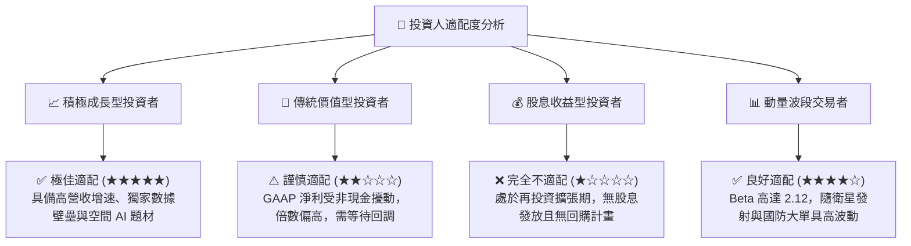

### 11.5 每季財報監控清單（Quarterly Watch List）

| 監控項目 | 關鍵指標 (KPI) | 正常/達標門檻 (🟢) | 觸發減碼預警 (🔴) | 戰略意義 |
|----------|----------------|-------------------|-------------------|----------|
| **核心營收增速** | 季度營收 YoY | **≥ 30.0%** (最新 42.1%) | **< 20.0%** | 驗證次世代數據商用放量節奏 |
| **毛利擴張能力** | GAAP 毛利率 | **≥ 55.0%** (最新 55.6%) | **< 50.0%** | 檢驗固定資產攤銷與定價權 |
| **現金流生成** | 單季 FCF | **> $0.0M** | **< -$25.0M** | 確認自給自足無股權稀釋風險 |
| **股權激勵稀釋** | SBC / 營收佔比 | **< 15.0%** (目前 16.4%) | **> 22.0%** | 監控股東真實報酬是否被稀釋 |
| **Pelican 進度** | 衛星在軌商用數量 | **按既定時程發射驗收** | **推遲 > 2 個季度** | 核心增長曲線之生命線 |

### 11.6 反面論證：什麼會證明論點錯誤（What Would Change My Mind）

```
╔══════════════════════════════════════════════════════════════════╗
║              ⚠️ 論點失效條件（Disconfirming Evidence）           ║
╠══════════════════════════════════════════════════════════════════╣
║  本研究報告之多頭/持有論點在下列情況發生時將被證偽並轉向「賣出」：║
║                                                                  ║
║  ① 核心營收 YoY 成長率連續兩季跌破 18.0%，代表市場需求不如預期 ║
║  ② Pelican 星座發射遭遇連續重大事故，導致商用部署延遲超過 1 年  ║
║  ③ 季度營業現金流 (OCF) 轉負且單季 FCF 失血超過 $40M             ║
║  ④ 國防與情報 (D&I) 大客戶在競標中轉向 Maxar 或 BlackSky 競品   ║
║  ⑤ 股權薪酬 SBC 佔營收比重不降反升突破 25%，過度稀釋股東權益     ║
╚══════════════════════════════════════════════════════════════════╝
```

---
> **免責聲明**：本報告為 AI 自動生成，基於公開財務數據與嚴謹計量模型撰寫，僅供學術與投資研究參考，不構成任何要約、招攬或具體投資買賣建議。投資具備固有市場風險，入市需獨立審慎評估。