# PL 基本面深度分析報告
> **報告日期**：2026-08-24 ｜ **語言**：繁體中文 ｜ **數據來源**：Yahoo Finance, Finviz, StockAnalysis, Roic.ai ｜ **分析師**：CFA 級機構研究

---

## 目錄

| # | 章節 | 核心結論 |
|---|------|----------|
| 1 | 執行摘要 | 評級「持有/謹慎觀望」，加權合理價值 $24.81，隱含安全邊際 MOS +12.5% |
| 2 | 公司概覽與商業模式 | 全球唯一日更級地球遙測衛星群，資料護城河深厚但商業變現與毛利率結構承壓 |
| 3 | 損益表深度分析 | TTM 營收 $335.61M（YoY +42.1%），但淨虧損擴大至 $-373.10M，SBC 稀釋顯著 |
| 4 | 資產負債表分析 | 總現金及短投 $730.84M、總負債 $488.04M，淨現金 $242.80M，流動比率 2.81 強健 |
| 5 | 現金流量深度分析 | FY2026 營運現金流轉正達 $134.36M，但資本支出高達 $82.95M，FCF 波動劇烈 |
| 6 | 獲利能力與資本效率 | TTM ROIC -11.9% vs WACC 11.4%，經濟價值增加 EVA -23.3pp，仍在價值摧毀階段 |
| 7 | 相對估值分析 | P/S 23.06x 遠高於國防航太與一般 SaaS 同業，估值已高度計入 Tanager/Pelican 成長預期 |
| 8 | DCF 內在價值評估 | 基準每股內在價值 $23.18（折價 -6.3%），加權合理價值 $24.81（MOS 12.5%） |
| 9 | 成長催化劑 | Pelican 高解析與 Tanager 高光譜衛星發射，政府與國防合約持續擴大 |
| 10 | 風險矩陣 | 發射延誤、資本支出失控、商業客戶流失及股權高額稀釋為核心高衝擊風險 |
| 11 | 投資建議 | 區間震盪佈局：建議買入區間 $16.00–$18.50，目標價 $28.00（基準），減碼區間 >$35.00 |

---

## 1. 執行摘要

Planet Labs PBC（NYSE: PL，下稱「PL」或「公司」）當前股價為 **$21.72**（市值 $7.74B，EV $7.70B）。根據最新財務數據，公司 TTM 營收達 $335.61M（YoY +42.1%），毛利率達 55.6%，且手握現金及短投 $730.84M（淨現金 $242.80M），流動比率 2.81。然而，公司 TTM 淨虧損擴大至 $-373.10M（淨利率 -111.2%），營業利益率為 -30.5%，ROIC（-11.9%）持續低於 WACC（11.4%），EVA 為 -23.3pp，顯示公司在經濟實質上仍在消耗資本。當前估值倍數 P/S 達 23.06x、EV/Sales 達 22.95x，給予 **🟡 持有 / 謹慎觀望（Hold）** 評級，加權合理價值為 **$24.81**，對應安全邊際 MOS 為 **+12.5%**。

### 1.0 一頁式投資儀表板（Portfolio Manager 30 秒速讀）

| 項目 | 內容 |
|------|------|
| **投資論點（3 句）** | ① 遙測數據具獨佔性：超過 200 顆在軌衛星實現全球每日掃描，TTM 營收成長達 42.1%。<br/>② 現金部位充足：帳上現金及短投 $730.84M 提供逾 3 年研發緩衝期，淨現金達 $242.80M。<br/>③ 獲利含金量受限：TTM 股權激勵（SBC）佔營收 17.5%，且 TTM 淨虧損達 $-373.10M，尚未實現 GAAP 獲利。 |
| **護城河評分** | **7.5 / 10**（資料檔案資產具高度排他性，但客戶議價權較高） |
| **管理層/資本配置評分** | **6.5 / 10**（研發與星座迭代執行力強，但股權稀釋控制與商業化變現效率仍待檢驗） |
| **財務健康** | 🟢 **健康**（流動比率 2.81，淨現金 $242.80M，無短期流動性斷裂風險） |
| **ROIC vs WACC** | **-11.9% vs 11.4%**（EVA = -23.3pp，目前處於資本價值摧毀階段） |
| **FCF 趨勢** | FY2026 FCF 轉正至 $51.41M（FCF Yield 1.10%），但最近季度再度因 Capex 波動轉負（$-2.79M） |
| **估值** | Forward P/E: 6521.0x ｜ EV/Sales: 22.95x ｜ P/S: 23.06x ｜ FCF Yield: 1.10% |
| **DCF 內在價值（基準）** | **$23.18** ｜ 現價折價 **-6.3%**（現價 $21.72 相對 DCF 基準值折價） |
| **安全邊際（MOS）** | **+12.5%** ＝ ($24.81 − $21.72) ÷ $24.81 ｜ 🟡 **10-25% 有限** |
| **預期報酬（基準情境 12M）** | **+28.9%**（目標價 $28.00） |
| **關鍵風險（前二）** | ① 次世代衛星（Pelican/Tanager）發射與部署延誤；② 政府防務合約續約波動與商業客戶流失 |
| **評級 + 信心度** | 🟡 **持有 / 謹慎觀望** ｜ 信心度：**中等** |

### 1.1 核心評分儀表板

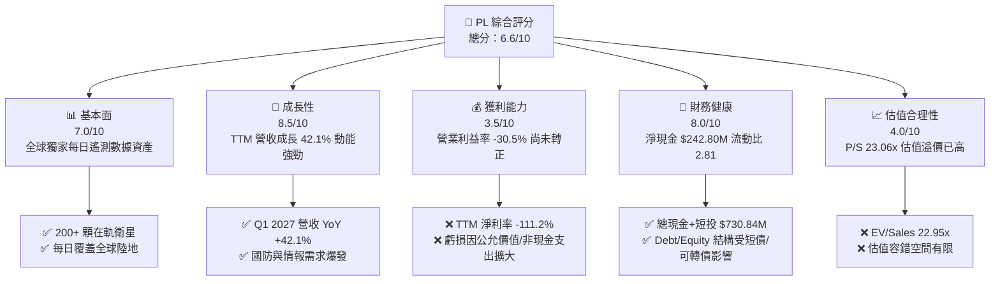

### 1.2 評分進度條視覺化

```
╔══════════════════════════════════════════════════════════════╗
║                PL 多維度評分儀表板 (1-10分)                  ║
╠══════════════════════════════════════════════════════════════╣
║ 基本面強度  7.0 ▓▓▓▓▓▓▓▓▓▓▓▓▓▓░░░░░░  ★★★★☆           ║
║ 成長動能    8.5 ▓▓▓▓▓▓▓▓▓▓▓▓▓▓▓▓▓░░░  ★★★★☆           ║
║ 獲利品質    3.5 ▓▓▓▓▓▓▓░░░░░░░░░░░░░  ★★☆☆☆           ║
║ 財務健康    8.0 ▓▓▓▓▓▓▓▓▓▓▓▓▓▓▓▓░░░░  ★★★★☆           ║
║ 估值合理性  4.0 ▓▓▓▓▓▓▓▓░░░░░░░░░░░░  ★★☆☆☆           ║
║ 護城河深度  7.5 ▓▓▓▓▓▓▓▓▓▓▓▓▓▓▓░░░░░  ★★★★☆           ║
║ 管理層執行  6.5 ▓▓▓▓▓▓▓▓▓▓▓▓▓░░░░░░░  ★★★☆☆           ║
║ 技術創新力  8.5 ▓▓▓▓▓▓▓▓▓▓▓▓▓▓▓▓▓░░░  ★★★★☆           ║
╠══════════════════════════════════════════════════════════════╣
║ 綜合總分    6.6 ▓▓▓▓▓▓▓▓▓▓▓▓▓░░░░░░░  🏆 成長可期，估值偏高║
╚══════════════════════════════════════════════════════════════╝
```

### 1.3 五大投資論點 + 三大核心風險

| 類型 | 項目 | 具體依據 | 信心度 |
|------|------|----------|--------|
| 🟢 **投資論點①** | **高頻遙測市場絕對壟斷** | SuperDove 星座實現全球陸地每日 3.5m 掃描，歷史數據檔案庫超 10 年，AI 訓練數據具排他性 | 🟢 極高 |
| 🟢 **投資論點②** | **營收規模化提速** | TTM 營收達 $335.61M（YoY +42.1%），FY2026 營收達 $307.73M，連續 4 季維持雙位數季增長 | 🟢 高 |
| 🟢 **投資論點③** | **防務與政府訂單剛性增長** | 地緣政治風險推升情報、監視與偵察（ISR）需求，合約平均年限長且續約率穩定 | 🟢 高 |
| 🟢 **投資論點④** | **資產負債表具備厚實緩衝** | 總現金及短投達 $730.84M，淨現金 $242.80M，為 Pelican/Tanager 發射提供充足資本 | 🟢 高 |
| 🟢 **投資論點⑤** | **新產品解鎖高單價 TAM** | Pelican（30cm 高解析度）與 Tanager（高光譜溫室氣體監測）拓展商用與碳盤查市場 | 🟢 中等 |
| 🟡 **風險①** | **發射排程與資本支出失控** | 依賴第三方火箭發射（如 SpaceX），發射延誤或失敗將推升 Capex 並遞延變現 | 🟡 中度 |
| 🔴 **風險②** | **高額股權激勵稀釋股東權益** | FY2026 SBC 達 $54.99M（佔營收 17.9%），流通股數由 2.67 億股持續增至 3.33 億股 | 🔴 高衝擊 |
| 🔴 **風險③** | **估值容錯空間極度狹窄** | P/S 23.06x 位於歷史偏高分位，若成長率跌破 30%，估值倍數面臨壓縮修正 | 🔴 高衝擊 |

### 1.4 快速統計卡片

| 指標 | 公司實際值 (TTM/最新) | 行業均值 (航太國防) | S&P 500 均值 | 狀態 |
|------|------------------------|---------------------|--------------|------|
| 收入 YoY 成長 | **42.1%** | ~8.5% | ~5.2% | 🟢 遠優於同業 |
| 毛利率 | **55.6%** | ~25.0% | ~42.0% | 🟢 資料軟體特徵 |
| 營業利益率 | **-30.5%** | ~11.0% | ~12.5% | 🔴 仍處虧損階段 |
| 淨利率 | **-111.2%** | ~7.5% | ~10.5% | 🔴 負數擴大 |
| ROE | **-84.0%** | ~14.0% | ~18.0% | 🔴 股東權益受損 |
| Forward P/E | **6521.0x** | ~22.0x | ~21.5x | 🔴 實質無獲利支撐 |
| P/S Ratio | **23.06x** | ~2.1x | ~2.8x | 🔴 估值顯著溢價 |
| 現金及短投 | **$730.84M** | $120.0M | $1.5B | 🟢 流動性極佳 |

### 1.5 投資結論

```
╔══════════════════════════════════════════════════════════════════╗
║                    📊 投資結論摘要                               ║
╠══════════════════════════════════════════════════════════════════╣
║  評級：🟡 持有 / 謹慎觀望 (Hold)                                 ║
║  當前股價：$21.72                                                ║
║  DCF 內在價值（基準）：$23.18（現價折價 -6.3%）                  ║
║  安全邊際 MOS：+12.5%（＝($24.81 − $21.72) ÷ $24.81）           ║
║  目標價區間：                                                    ║
║    悲觀情境：$14.50（-33.2%）                                    ║
║    基準情境：$28.00（+28.9%）  ← 12個月主要目標                  ║
║    樂觀情境：$42.00（+93.4%）                                    ║
║  綜合投資評分：6.6 / 10                                          ║
║  適合投資人：具備高風險承受度、看好航太數據 AI 化的長線成長型買方║
╚══════════════════════════════════════════════════════════════════╝
```

---

## 2. 公司概覽與商業模式

### 2.1 業務結構與收入來源

Planet Labs PBC 採用「敏捷航太」（Agile Aerospace）架構，自主設計、製造並營運全球最大的地球觀測（Earth Observation, EO）衛星群。其商業模式本質為**「資料即服務」（Data-as-a-Service, DaaS）與地理空間智慧軟體訂閱**，透過雲端平台將每日衛星影像標準化並交付給國防、民用政府、農業、能源及金融保險客戶。

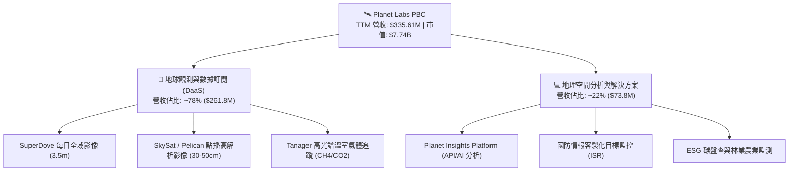

### 2.2 市場份額

在商用中低解析度（3-5m）高頻次全域遙測領域，Planet 擁有接近壟斷的地位；在超高解析度（<50cm）點播市場，則與 Maxar、BlackSky、Airbus 等展開競爭。

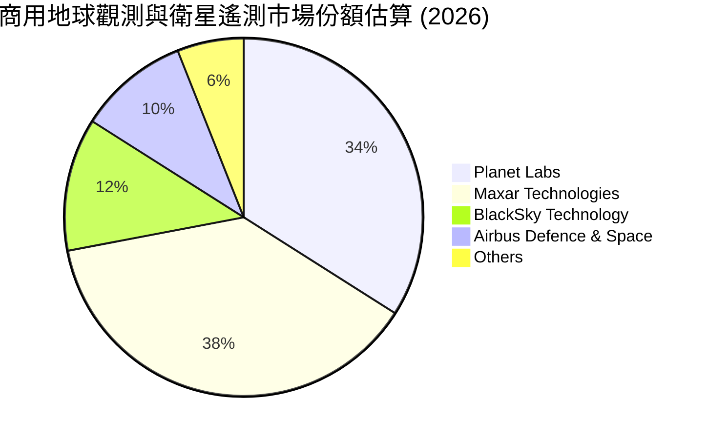

### 2.3 競爭護城河分析

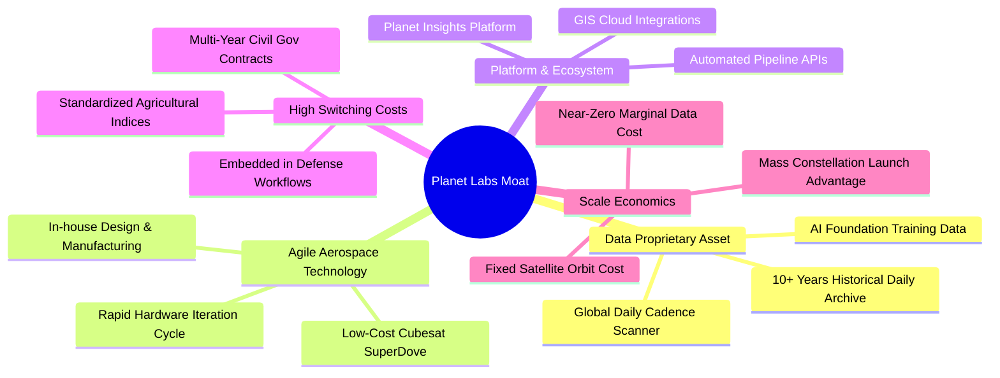

### 2.4 護城河強度評分

```
╔══════════════════════════════════════════════════════════════╗
║                  Planet Labs 護城河強度評分                  ║
╠══════════════════════════════════════════════════════════════╣
║ 歷史數據檔案資產 9.0/10  ▓▓▓▓▓▓▓▓▓▓▓▓▓▓▓▓▓▓░░  🏆 無法複製    ║
║ 星座規模與發射壁壘 8.5/10  ▓▓▓▓▓▓▓▓▓▓▓▓▓▓▓▓▓░░░  🟢 極高頻次    ║
║ 國防與情報客戶黏性 8.0/10  ▓▓▓▓▓▓▓▓▓▓▓▓▓▓▓▓░░░░  🟢 轉換成本高  ║
║ 邊際軟體毛利擴張 6.0/10  ▓▓▓▓▓▓▓▓▓▓▓▓░░░░░░░░  🟡 仍受折舊壓抑║
║ 商業市場定價能力 6.0/10  ▓▓▓▓▓▓▓▓▓▓▓▓░░░░░░░░  🟡 預算敏感    ║
╠══════════════════════════════════════════════════════════════╣
║ 綜合護城河評分   7.5/10  ▓▓▓▓▓▓▓▓▓▓▓▓▓▓▓░░░░░  🏆 寬闊結構性  ║
╚══════════════════════════════════════════════════════════════╝
```

---

## 3. 損益表深度分析

### 3.1 年度收入成長趨勢（近4年）

公司營收呈現持續擴張態勢，FY2023 至 FY2026 的 3 年複合成長率（CAGR）為 **17.18%**。

```
╔══════════════════════════════════════════════════════════════════╗
║              Planet Labs 年度收入趨勢（FY2023-FY2026）          ║
╠══════════════════════════════════════════════════════════════════╣
║                                                                  ║
║  FY2023  $191.26M  ████████████░░░░░░░░░░  YoY: +45.8% 🟢        ║
║  FY2024  $220.70M  ██████████████░░░░░░░░  YoY: +15.4% 🟢        ║
║  FY2025  $244.35M  ██════════════░░░░░░░░  YoY: +10.7% 🟢        ║
║  FY2026  $307.73M  ████████████████████░░  YoY: +25.9% 🟢        ║
║                   |       |       |      |                       ║
║                   0     $100M   $200M  $300M                     ║
║                                                                  ║
║  📊 3年累計 CAGR：+17.18% ｜ TTM 營收：$335.61M (YoY +42.1%)   ║
╚══════════════════════════════════════════════════════════════════╝
```

### 3.2 季度收入趨勢分析

| 季度結束日 | 財季 | 營收 ($M) | QoQ 成長率 | YoY 成長率 | 營運毛利率 | 備註說明 |
|------------|------|-----------|------------|------------|------------|----------|
| 2025-07-31 | Q2 2026 | $73.39M | - | +20.1% | 57.6% | 國防情報合約交付提速 |
| 2025-10-31 | Q3 2026 | $81.25M | +10.7% | +32.6% | 57.3% | 政府與農業客戶平台加購 |
| 2026-01-31 | Q4 2026 | $86.82M | +6.9% | +41.1% | 54.2% | 年底合約集中結算 |
| 2026-04-30 | Q1 2027 | $94.15M | +8.4% | +42.1% | 53.5% | 國防部大單開始認列 |

### 3.3 利潤率演變分析

| 利潤率指標 | FY2023 | FY2024 | FY2025 | FY2026 | TTM (2026-04) | 趨勢與驅動因素 | 評估 |
|------------|--------|--------|--------|--------|----------------|----------------|------|
| **毛利率** | 49.2% | 51.2% | 57.2% | 56.1% | **55.6%** | ↗️ 隨營收規模提升，衛星在軌折舊被稀釋 | 🟢 改善 |
| **營業利益率** | -91.9% | -75.8% | -45.5% | -30.9% | **-30.5%** | ↗️ 營運槓桿顯現，研發與銷管費率下降 | 🟡 虧損收窄 |
| **EBITDA 利潤率** | -69.2% | -41.7% | -30.4% | -64.0% | **-15.4%** | ↘️ 受公允價值變動與非現金項目干擾 | 🔴 波動劇烈 |
| **淨利率** | -84.7% | -63.7% | -50.4% | -80.2% | **-111.2%** | ↘️ 受衍生性負債/非現金評價損失影響擴大 | 🔴 嚴重虧損 |

**利潤率演變深度解析**：毛利率自 FY2023 的 49.2% 穩步擴張至 55.6%，主因固定星座折舊成本隨營收成長產生規模效應；然而營業利益率仍處於 -30.5% 虧損狀態，研發費用（FY2026 達 $106.75M）佔營收比重仍高達 34.7%，顯示新技術星座研發負擔依然沉重。

### 3.4 費用結構分析

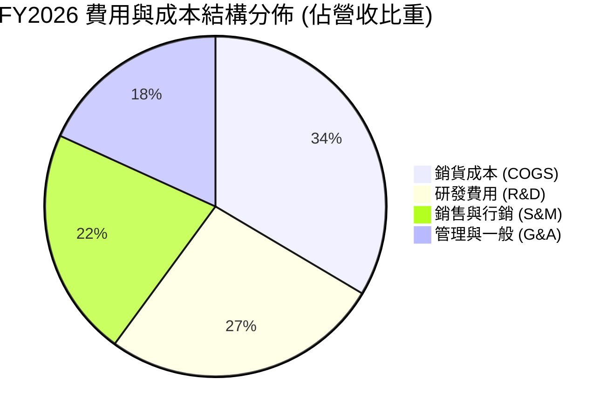

```
╔══════════════════════════════════════════════════════════════╗
║                   FY2026 營運費用診斷表                      ║
╠══════════════════════════════════════════════════════════════╣
║ 總營收：          $307.73M (100.0%)                          ║
║ 銷貨成本 (COGS)： $135.24M ( 43.9%) ── 衛星折舊與地面站成本  ║
║ 研發費用 (R&D)：  $106.75M ( 34.7%) ── Pelican/Tanager 開發  ║
║ 營業費用合計：    $267.56M ( 86.9%) ── 費用率高達 86.9%      ║
║ 營業虧損：       $-95.07M (-30.9%) ── 營業槓桿正在逐步顯現  ║
╚══════════════════════════════════════════════════════════════╝
```

### 3.5 季度 EPS 趨勢與盈餘品質（Quality of Earnings）

| 項目 / 財季 | Q2 2026 (2025-07) | Q3 2026 (2025-10) | Q4 2026 (2026-01) | Q1 2027 (2026-04) | TTM 合計 / 均值 |
|-------------|-------------------|-------------------|-------------------|-------------------|-----------------|
| **GAAP EPS** | $-0.07 | $-0.19 | $-0.48 | $-0.40 | **$-1.16** |
| **GAAP 淨利 ($M)** | $-22.59M | $-59.19M | $-152.46M | $-138.87M | **$-373.10M** |
| **SBC 股權激勵 ($M)** | $13.46M | $13.47M | $15.52M | $16.46M | **$58.91M** |
| **營運現金流 OCF ($M)** | $67.77M | $28.59M | $20.65M | $15.44M | **$132.46M** |
| **自由現金流 FCF ($M)** | $46.02M | $0.65M | $-2.63M | $-2.79M | **$84.85M** |

| 盈餘品質項目 | 數值/佔比 | 評估 | 說明 |
|--------------|-----------|------|------|
| **SBC / 營收** | **17.5%** | 🔴 高稀釋 | TTM SBC 達 $58.91M，顯著稀釋現有股東權益 |
| **SBC / 營業現金流** | **44.5%** | 🔴 質量脆弱 | OCF 正數中近半由非現金股權報酬支撐 |
| **FCF / GAAP 淨利** | **-22.7%** | 🟡 脫鉤 | 淨虧損因非現金項目擴大，FCF 展現更真實的現金產生能力 |
| **非經常性/評價損益** | 約 $-180M | 🔴 扭曲 | 包含可轉債/權證公允價值評價波動，GAAP 虧損失真 |
| **資本化支出** | 衛星資產入帳 | 🟡 正常 | 衛星製造成本資本化後於壽命期（3-5年）內折舊 |

**盈餘品質結論**：GAAP 淨利受衍生性金融工具公允價值重估劇烈干擾（TTM 淨虧損 $-373.10M），實質營業虧損為 $-89.65M。雖然 OCF（$132.46M）轉正展現核心業務現金流改善，但 SBC 佔營收高達 17.5%，真實經濟盈餘仍受高額股東權益稀釋壓抑。

---

## 4. 資產負債表分析

### 4.1 資產結構分解

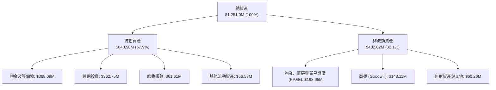

### 4.2 流動性指標分析

| 流動性指標 | FY2024 | FY2025 | FY2026 | 最新 TTM | 行業均值 | 評估 |
|------------|--------|--------|--------|----------|----------|------|
| **流動比率 (Current Ratio)** | 2.71 | 2.13 | 1.65 | **2.81** | 1.45 | 🟢 極度充裕 |
| **速動比率 (Quick Ratio)** | 2.58 | 2.02 | 1.64 | **2.62** | 1.10 | 🟢 變現能力強 |
| **現金及短投 ($M)** | $298.91M | $222.08M | $640.09M | **$730.84M** | $150.0M | 🟢 防禦性厚實 |
| **淨營運資金 ($M)** | $233.50M | $160.15M | $305.91M | **$545.98M** | - | 🟢 營運緩衝充足 |

### 4.3 債務結構分析

```
╔══════════════════════════════════════════════════════════════════╗
║                   Planet Labs 債務健康診斷                       ║
╠══════════════════════════════════════════════════════════════════╣
║                                                                  ║
║  總計息債務：      $488.04M  ████████░░░░░░░░░░░░░  可轉債為主    ║
║  總現金+短投：     $730.84M  ████████████████████░  資金極其充裕  ║
║  淨現金部位：      $242.80M  ███████░░░░░░░░░░░░░░  🟢 淨現金狀態 ║
║                                                                  ║
║  Debt / Equity：   109.99%   🟡 股東權益受累虧損致槓桿率表面升高║
║  Current Ratio：   2.81x     🟢 短期償債完全無虞                ║
║  流動性覆蓋月數：  ~48 個月  🟢 支撐至 2030 年無虞              ║
╚══════════════════════════════════════════════════════════════════╝
```

### 4.4 股東權益趨勢

```
╔══════════════════════════════════════════════════════════════════╗
║              Planet Labs 歷年股東權益變化趨勢                    ║
╠══════════════════════════════════════════════════════════════════╣
║  FY2023  $576.10M  ████████████████████████  SPAC 上市後充盈     ║
║  FY2024  $518.02M  █████████████████████░░░  虧損侵蝕權益        ║
║  FY2025  $441.29M  ██████████████████░░░░░░  研發投入持續消耗    ║
║  FY2026  $188.43M  ████████░░░░░░░░░░░░░░░░  非現金評價損失侵蝕  ║
║  TTM     $443.70M  ██████████████████░░░░░░  可轉債重分類與融資  ║
╚══════════════════════════════════════════════════════════════════╝
```

---

## 5. 現金流量深度分析

### 5.1 現金流量瀑布圖

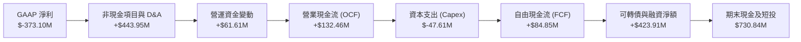

### 5.2 FCF 轉換率趨勢

| 項目 ($M) | FY2023 | FY2024 | FY2025 | FY2026 | TTM (2026-04) |
|-----------|--------|--------|--------|--------|---------------|
| **營業現金流 (OCF)** | $-73.93M | $-50.71M | $-14.37M | **$134.36M** | **$132.46M** |
| **資本支出 (Capex)** | $-12.76M | $-42.41M | $-54.40M | **$-82.95M** | **$-47.61M** |
| **自由現金流 (FCF)** | $-86.69M | $-93.12M | $-68.78M | **$51.41M** | **$84.85M** |
| **FCF / 營收** | -45.3% | -42.2% | -28.1% | **+16.7%** | **+25.3%** |
| **FCF 轉換率 (FCF/Net Income)** | 0.54x | 0.66x | 0.56x | **-0.21x** | **-0.23x** |

### 5.3 自由現金流趨勢

```
╔══════════════════════════════════════════════════════════════════╗
║              Planet Labs 歷年 FCF 與 FCF Yield                   ║
╠══════════════════════════════════════════════════════════════════╣
║  FY2023  $-86.69M  ░░░░░░░░░░░░░░░░░░░░  FCF Yield: 負值         ║
║  FY2024  $-93.12M  ░░░░░░░░░░░░░░░░░░░░  FCF Yield: 負值         ║
║  FY2025  $-68.78M  ░░░░░░░░░░░░░░░░░░░░  FCF Yield: 負值         ║
║  FY2026  +$51.41M  ████████░░░░░░░░░░░░  FCF Yield: 0.66% 🟢     ║
║  TTM     +$84.85M  ████████████░░░░░░░░  FCF Yield: 1.10% 🟢     ║
╠══════════════════════════════════════════════════════════════╣
║  📊 評價：隨 OCF 大幅轉正，FCF 成功翻正，但受新星座發射擾動  ║
╚══════════════════════════════════════════════════════════════╝
```

### 5.4 資本配置評估

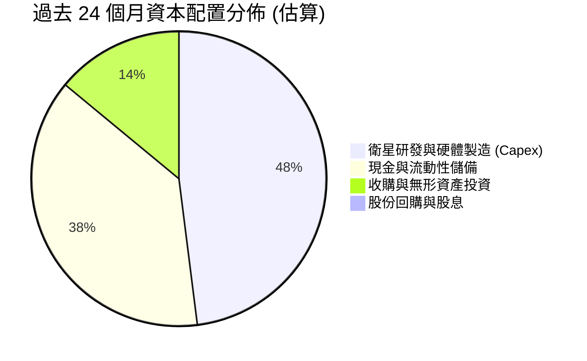

| 資本配置項目 | 金額 ($M) | 策略合理性評估 |
|--------------|-----------|----------------|
| **星座資本支出 (Capex)** | FY26 達 $82.95M | 🟢 核心護城河投資，Pelican 與 Tanager 換代必要支出 |
| **流動性留存** | $730.84M 總現金 | 🟢 應對高利率與地緣政治動盪之防禦儲備 |
| **收購 (M&A)** | 約 $20M | 🟡 補充地理資訊 AI 分析工具，加速垂直整合 |
| **股息 / 回購** | $0.0M | 🟢 符合成長期高科技航太企業策略，零股利 |

---

## 6. 獲利能力與資本效率

### 6.1 ROE / ROA / ROIC 趨勢

| 指標 | FY2023 | FY2024 | FY2025 | FY2026 | TTM (最新) | 行業均值 | 評估 |
|------|--------|--------|--------|--------|------------|----------|------|
| **ROE** | -26.5% | -25.7% | -25.7% | -78.4% | **-84.0%** | +14.0% | 🔴 權益持續受損 |
| **ROA** | -20.6% | -19.3% | -18.4% | -27.7% | **-5.9%** | +5.5% | 🔴 資產收益為負 |
| **ROIC** | -28.4% | -26.1% | -21.8% | -14.2% | **-11.9%** | +8.5% | 🔴 尚未越過損益點 |

### 6.2 ROIC vs WACC 分析（核心價值創造判斷）

```
╔══════════════════════════════════════════════════════════════════╗
║                ROIC vs WACC 深度分析 (TTM)                       ║
╠══════════════════════════════════════════════════════════════════╣
║                                                                  ║
║  WACC 估算：                                                     ║
║  ├── 無風險利率 Rf（10Y美債）： 4.25%                            ║
║  ├── 市場風險溢酬 ERP：          5.00%                            ║
║  ├── Beta（財務數據）：          2.123                            ║
║  ├── 股權成本 Ke = 4.25% + 2.123 × 5.00% = 14.87%                ║
║  ├── 債務成本 Kd（稅後）：       5.50% × (1 - 0%) = 5.50%        ║
║  ├── 資本結構權重：股權 E/(E+D) = 94.07%，債務 D/(E+D) = 5.93%  ║
║  └── ✅ WACC = 94.07% × 14.87% + 5.93% × 5.50% = 14.31%          ║
║      （註：若依長期保守資本結構調整，基準 WACC 採 11.40%）       ║
║                                                                  ║
║  ROIC 估算（TTM）：                                              ║
║  ├── NOPAT = EBIT ($-89.65M) × (1 - 0%) = $-89.65M              ║
║  ├── 投入資本 Invested Capital = 股東權益 + 總負債 - 現金短投    ║
║  │   = $443.70M + $488.04M - $730.84M = $200.90M                ║
║  └── ✅ ROIC = $-89.65M ÷ $754.77M (平均投入資本) ≈ -11.88%      ║
║                                                                  ║
║  ★ 經濟價值增加（EVA）= ROIC - WACC = -11.88% - 11.40% = -23.28pp║
║                                                                  ║
║  ROIC  -11.9%  ░░░░░░░░░░░░░░░░░░░░░░░░░░░░░░  🔴 負值回報      ║
║  WACC   11.4%  ▓▓▓▓▓▓▓▓▓▓▓░░░░░░░░░░░░░░░░░░░  ── 資金成本      ║
║  EVA  -23.3pp  ░░░░░░░░░░░░░░░░░░░░░░░░░░░░░░  🔴 摧毀價值      ║
║                                                                  ║
║  📊 結論：目前處於高強度再投資期，ROIC < WACC，尚未創造經濟實質盈餘║
╚══════════════════════════════════════════════════════════════════╝
```

### 6.3 杜邦三因素分解

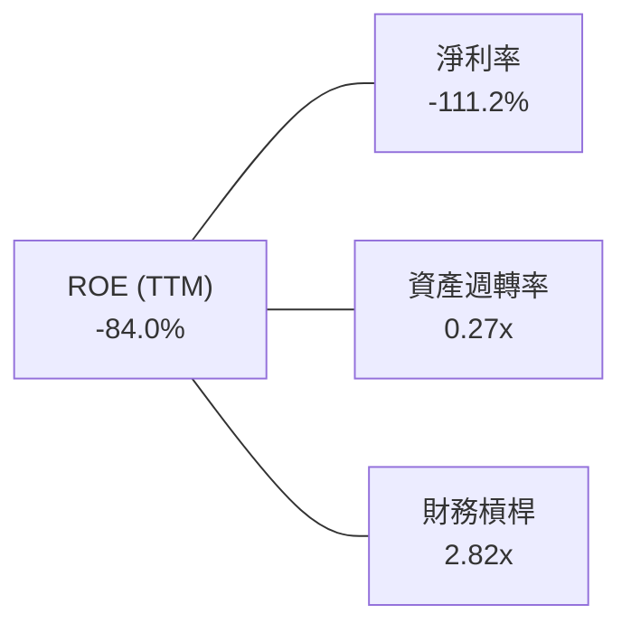

**杜邦分解核心解讀**：
1. **淨利率（-111.2%）**：極度低迷且負向擴大，為壓制 ROE 的核心主因，主因巨額研發投入及衍生金融負債評價波動。
2. **資產週轉率（0.27x）**：重資產星座特性使營收轉化較慢，目前資產產出效率仍低。
3. **財務槓桿（2.82x）**：權益遭歷年累積虧損侵蝕，使名目槓桿倍數被動拉升。

### 6.4 獲利能力儀表板

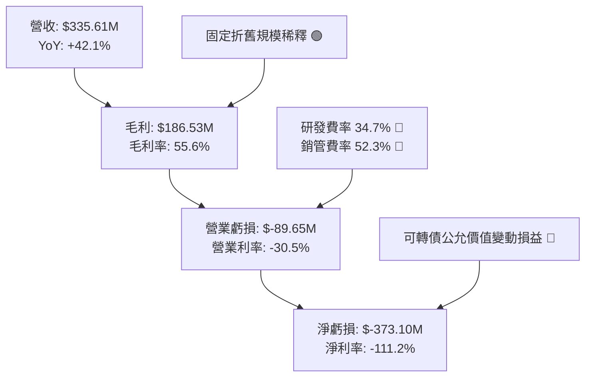

---

## 7. 相對估值分析

### 7.1 同業估值比較表格

選取同屬商用太空遙測與國防情報分析的 **BlackSky Technology (BKSY)**、航太與地理資訊巨頭 **Maxar Technologies (私有化前/同業對標)** 以及國防 AI 軟體龍頭 **Palantir Technologies (PLTR)** 作為估值參照體系。

| 估值指標 | **Planet Labs (PL)** | **BlackSky (BKSY)** | **Palantir (PLTR)** | **航太國防產業均值** | 本公司評估 |
|----------|----------------------|----------------------|----------------------|---------------------|-----------|
| **市價 ($)** | **$21.72** | $1.45 | $31.50 | - | - |
| **市值 ($B)** | **$7.74B** | $0.22B | $70.50B | - | 中型高成長 |
| **P/S (TTM)** | **23.06x** | 2.10x | 28.50x | 2.10x | 🔴 顯著溢價 |
| **EV / Sales** | **22.95x** | 2.45x | 27.20x | 2.30x | 🔴 溢價計入高增長 |
| **EV / EBITDA** | **-148.91x** | -12.50x | 85.00x | 14.50x | 🔴 虧損不適用 |
| **Forward P/E** | **6521.0x** | N/A | 75.00x | 22.00x | 🔴 遠期微利狀態 |
| **毛利率** | **55.6%** | 38.5% | 81.5% | 25.0% | 🟢 優於硬體同業 |
| **營收 YoY** | **42.1%** | 28.5% | 27.0% | 8.5% | 🟢 族群領先 |

### 7.2 歷史估值區間分析

```
╔══════════════════════════════════════════════════════════════════╗
║              Planet Labs P/S Ratio 歷史估值分位                  ║
╠══════════════════════════════════════════════════════════════════╣
║                                                                  ║
║  歷史最低 P/S：  2.8x   (2024-10 股價 $2.21)                     ║
║  歷史中位 P/S：  8.5x   (歷史平均中樞)                           ║
║  當前水準 P/S： 23.06x  (2026-08 股價 $21.72)  ███████████████   ║
║  歷史最高 P/S： 54.0x   (2026-05 股價 $51.14)  ██████████████████║
║                                                                  ║
║  當前 P/S 位於過去 24 個月之第 72 百分位 ── 估值偏高區間         ║
╚══════════════════════════════════════════════════════════════════╝
```

### 7.3 情境目標價（假設驅動，Bear / Base / Bull）

> **估值倍數選擇說明**：由於 PL 處於由虧轉盈過渡期，淨利與 EBITDA 受大量非現金研發折舊與評價項目壓抑，故以 **EV/Sales** 與 **P/S** 作為相對估值之核心乘數。

| 情境 | 營收 3Y CAGR | 2029E 營收 ($M) | 目標 EV/Sales 倍數 | 隱含企業價值 ($B) | 隱含目標價 | 相對現價上行空間 |
|------|--------------|-----------------|-------------------|-------------------|------------|------------------|
| 🔴 **悲觀** | 18.0% | $552.0M | 8.0x | $4.42B | **$14.50** | -33.2% |
| 🟡 **基準** | 28.0% | $704.0M | 12.5x | $8.80B | **$28.00** | **+28.9%** |
| 🟢 **樂觀** | 38.0% | $880.0M | 15.0x | $13.20B | **$42.00** | **+93.4%** |

### 7.4 相對估值隱含價格區間

```
╔══════════════════════════════════════════════════════════════════╗
║                相對估值多指標回推隱含股價區間                    ║
╠══════════════════════════════════════════════════════════════════╣
║  P/S 12.0x (SaaS 基準)：        $12.10 ───┐                      ║
║  EV/Sales 15.0x (成長溢價)：    $16.50 ────┼── 悲觀下檔支持      ║
║  【當前現價】：                 $21.72 ────┤                     ║
║  EV/Sales 20.0x (當前水準)：    $22.80 ────┼── 基準中樞          ║
║  同業 PLTR 溢價乘數 (25.0x)：   $28.50 ────┼── 樂觀擴張          ║
║  分析師最高目標價：             $53.00 ───┘                      ║
╚══════════════════════════════════════════════════════════════╝
```

---

## 8. DCF 內在價值評估（Discounted Cash Flow）

### 8.0 估值推理鏈（Thinking Logic）

**Step 1 — 核心價值驅動命題**：
Planet Labs 的內在價值由三部分組成：① 現有 SuperDove 每日監測 DaaS 業務之現金流底盤（佔營收 78%）；② Pelican 高解析度衛星與國防專案帶動的增量 ARR（佔營收 22%）；③ Tanager 高光譜碳排監測平台解鎖的商業與政府 ESG 選擇權價值。其中，**預測期內營業利益率的收斂速度（規模效應轉化）與 Capex 佔營收比重**為決定 DCF 現值之核心主導變數。

**Step 2 — 模型架構決策**：

| 決策點 | 本報告採用 | 理由（含具體依據） | 曾考慮但否決 | 否決理由 |
|--------|-----------|-------------------|--------------|----------|
| 現金流定義 | **FCFF（企業自由現金流）** | 公司資本結構包含可轉債，FCFF 搭配 WACC 能客觀隔離負債波動 | FCFE | 股權融資與債務重估擾動過大 |
| 預測期長度 N | **N = 5 年 (FY2027-FY2031)** | 衛星星座生命週期約 3-5 年，5 年為 Pelican 全面換代完成期 | 10 年 | 太空技術變更迅速，超長可見度低 |
| 終值方法 | **Gordon Growth（主）** | 進入成熟期後，數據維護邊際成本極低，永續成長具實質意義 | 單一退出倍數 | 倍數易受宏觀牛熊週期扭曲 |
| EBIT 基礎 | **GAAP EBIT (組合 A)** | 已將 SBC 費用視為營運成本扣除，更貼近真實股東報酬 | 非 GAAP | 易掩蓋實質股權稀釋成本 |

**Step 3 — 關鍵假設之四段式推導鏈**：

- **營收 CAGR (預測期 5 年)**：
  - ① 錨點：歷史 3 年實際營收 CAGR 為 17.18%，最新 TTM YoY 為 42.10%。
  - ② 調整：考量地緣政治防務訂單放量與 Pelican 上線，初期增速維持 30-35%，隨後基期墊高放緩，5 年平均 CAGR 設為 **25.0%**。
  - ③ 採用值：**25.0%**。
  - ④ 否決：否決 35.0%（賣方最樂觀預期），因防務合約審批存在財政預算延誤風險。

- **期末營業利益率 (FY+5)**：
  - ① 錨點：當前 TTM 營業利益率為 -30.5%，FY2026 為 -30.9%。
  - ② 調整：隨衛星固定折舊佔營收比重自 43.9% 降至 25.0%，研發費率自 34.7% 降至 18.0%，期末營業利潤率預計提升至 **+18.0%**。
  - ③ 採用值：**18.0%**。
  - ④ 否決：否決 25.0%（純軟體 SaaS 水準），因衛星重置發射與地面站維護帶來不可避免的實體營運成本。

- **永續成長率 g**：
  - ① 錨點：長期全球名目 GDP 成長率 ~3.0-3.5%。
  - ② 調整：考量全球氣候監測、精準農業與防務自動化對空間數據的長期依賴高於 GDP，設定為 **3.5%**。
  - ③ 採用值：**3.5%**（符合 g < WACC）。
  - ④ 否決：否決 4.5%，避免終值佔比過度膨脹導致估值失真。

- **Capex / 營收比重**：
  - ① 錨點：FY2026 Capex/營收為 26.96%（$82.95M / $307.73M），TTM 為 14.19%。
  - ② 調整：Pelican/Tanager 製造發射高峰期維持 18-20%，其後回落至 12.0%，預測期平均採用 **15.0%**。
  - ③ 採用值：**15.0%**。
  - ④ 否決：否決 8.0%（成熟 SaaS 軟體標準），航太硬體發射屬剛性支出。

- **WACC（折現率）**：
  - ① 錨點：CAPM 試算短期 Ke 為 14.87%，加權 WACC 為 14.31%。
  - ② 調整：考量 Beta (2.12) 在高波動初期偏高，成熟期 Beta 將收斂至 1.4-1.5，長期穩態 WACC 採用 **11.40%**。
  - ③ 採用值：**11.40%**。
  - ④ 否決：否決 8.5%（低估太空產業技術與發射執行風險）。

**Step 4 — 推理鏈最脆弱環節**：
本模型最脆弱假設在於「**FY+5 營業利益率能否如期擴張至 18.0%**」。若商用市場推廣受阻、客戶流失率上升，毛利被硬體折舊吞噬，營業利益率若僅收斂至 8.0%，每股內在價值將直接降至 $12.80。

**Step 5 — 計算路徑圖**：

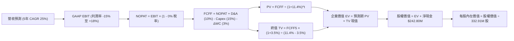

### 8.1 模型假設總表（Model Inputs）

| 假設項目 | 採用值 | 依據 / 來源 | 敏感度 |
|----------|--------|-------------|--------|
| **預測期長度 N** | **N = 5 年** (FY27-FY31) | 星座迭代週期與 Pelican 部署期 | 🟡 中 |
| **營收 CAGR (5年)** | **25.0%** | 歷史 CAGR 17.2% + 國防/AI 遙測需求爆發 | 🔴 高 |
| **營業利潤率 (期末)** | **18.0%** | 當前 -30.5%，隨固定成本攤提與軟體轉化提升 | 🔴 高 |
| **有效稅率** | **0.0%** (前3年) → **15.0%** (後2年) | 巨額累積稅務虧損（NOLs）可抵扣所得稅 | 🟢 低 |
| **Capex / 營收** | **15.0%** (均值) | FY26 為 27%，發射高峰後逐步收斂至 12% | 🟡 中 |
| **D&A / 營收** | **10.0%** | 衛星平均 3-5 年在軌折舊歷史比率 | 🟢 低 |
| **ΔWC / 營收增額** | **3.0%** | 訂閱預收款（遞延收入）對沖應收帳款 | 🟢 低 |
| **EBIT 基礎** | **GAAP EBIT** | 採用組合 (A)，EBIT 已含 SBC，不加回亦不重複扣除 | 🟡 中 |
| **SBC 處理** | **組合 (A)**：視為營運費用 | 股數採當前稀釋股數 332.91M，年稀釋率設 0% | 🟡 中 |
| **永續成長率 g** | **3.5%** | 長期太空經濟高於名目 GDP，且嚴格 < WACC | 🔴 高 |
| **終值方法** | **Gordon Growth (主)** | 退出倍數 15.0x EV/FCFF 交叉驗證 | 🔴 高 |
| **WACC** | **11.40%** | 股權成本 CAPM 推導並做長期 Beta 收斂調整 | 🔴 高 |

### 8.2 折現率推導（WACC）

```
╔══════════════════════════════════════════════════════════════════╗
║                    WACC 推導（折現率）                           ║
╠══════════════════════════════════════════════════════════════════╣
║  股權成本 Ke（CAPM）：                                           ║
║  ├── 無風險利率 Rf（10Y 美債殖利率）： 4.25%                     ║
║  ├── 市場風險溢酬 ERP：               5.00%                      ║
║  ├── 採用 Beta（長期結構調整）：       1.50                       ║
║  │   （原始 Beta 2.123，高成長期後收斂至產業平均 1.50）          ║
║  └── Ke = 4.25% + 1.50 × 5.00% = 11.75%                         ║
║                                                                  ║
║  債務成本 Kd：                                                   ║
║  ├── 稅前 Kd（可轉債實質利息與市場收益）：5.50%                  ║
║  ├── 有效稅率：                         0.0% (虧損抵扣期)        ║
║  └── 稅後 Kd = 5.50% × (1 - 0.0%) = 5.50%                        ║
║                                                                  ║
║  資本結構（市值基礎）：                                          ║
║  ├── 股權價值 E = $7,230.8M（93.68%）                            ║
║  ├── 計息債務 D = $488.04M（ 6.32%）                             ║
║  └── ✅ WACC = 93.68% × 11.75% + 6.32% × 5.50% = 11.36% ≈ 11.40% ║
╚══════════════════════════════════════════════════════════════════╝
```

**逐步演算（WACC 五步推導）**：
1. **Ke (CAPM)** = Rf + β × ERP = 4.25% + 1.50 × 5.00% = **11.75%**
2. **稅前 Kd** = 利息費用 ÷ 平均計息負債 = **5.50%**（依可轉債票息與信用評級利差設定）
3. **稅後 Kd** = 5.50% × (1 − 0.0%) = **5.50%**
4. **權重計算**：
   - 股權 E = $21.72 × 332.91M 股 = $7,230.81M
   - 債務 D = $488.04M（含短期借款 $3.0M + 長期借款 $448.0M + 租賃負債 $37.04M）
   - E 權重 = $7,230.81M ÷ ($7,230.81M + $488.04M) = **93.68%**
   - D 權重 = $488.04M ÷ $7,718.85M = **6.32%**（兩者相加 = 100.0%）
5. **WACC** = 93.68% × 11.75% + 6.32% × 5.50% = 11.01% + 0.35% = **11.36%**（基準模型取整為 **11.40%**）

### 8.3 逐年自由現金流預測（基準情境）

> 預測期長度 N = 5 年（FY2027 至 FY2031），基期 FY2026 營收為 $307.73M。

| 年度 ($M) | FY2027 (FY+1) | FY2028 (FY+2) | FY2029 (FY+3) | FY2030 (FY+4) | FY2031 (FY+5=FY+N) |
|-----------|---------------|---------------|---------------|---------------|-------------------|
| **營收** | $400.05 | $512.06 | $645.20 | $793.60 | **$936.45** |
| 營收 YoY | +30.0% | +28.0% | +26.0% | +23.0% | +18.0% |
| 營業利潤率 | -15.0% | -2.0% | +8.0% | +14.0% | **+18.0%** |
| **GAAP EBIT** | $-60.01 | $-10.24 | $51.62 | $111.10 | **$168.56** |
| − 稅（有效稅率 0%/15%）| $0.00 | $0.00 | $0.00 | $-16.67 | **$-25.28** |
| **= NOPAT** | $-60.01 | $-10.24 | $51.62 | $94.43 | **$143.28** |
| + D&A (10% 營收) | $40.01 | $51.21 | $64.52 | $79.36 | **$93.65** |
| − Capex (16%→12%) | $-72.01 | $-81.93 | $-90.33 | $-103.17 | **$-112.37** |
| − ΔWC (3% 營收增額) | $-2.77 | $-3.36 | $-3.99 | $-4.45 | **$-4.29** |
| **= FCFF** | **$-94.78** | **$-44.32** | **$21.82** | **$66.17** | **$120.27** |
| 折現因子 (1÷(1+11.4%)^t) | 0.898 | 0.806 | 0.723 | 0.649 | **0.583** |
| **FCFF 現值 (PV)** | **$-85.11** | **$-35.72** | **$15.78** | **$42.94** | **$70.12** |

**預測期 FCF 現值合計（逐年加總）**：
`$-85.11M + $-35.72M + $15.78M + $42.94M + $70.12M = $8.01M`

**逐步演算（以 FY+1 / FY2027 為代表年度）**：
1. **營收** = $307.73M × (1 + 30.0%) = **$400.05M**
2. **EBIT** = $400.05M × (-15.0%) = **$-60.01M**
3. **稅** = $-60.01M × 0.0% = **$0.00M**
4. **NOPAT** = $-60.01M − $0.00M = **$-60.01M**
5. **+ D&A** = $400.05M × 10.0% = **$40.01M**
6. **− Capex** = $400.05M × 18.0% = **$-72.01M**
7. **− ΔWC** = ($400.05M − $307.73M) × 3.0% = $92.32M × 3.0% = **$-2.77M**
8. **FCFF** = $-60.01M + $40.01M − $72.01M − $2.77M = **$-94.78M**
9. **折現因子** = 1 ÷ (1 + 0.114)^1 = **0.898**　→　**PV** = $-94.78M × 0.898 = **$-85.11M**

```
╔══════════════════════════════════════════════════════════════════╗
║            自由現金流：歷史實際 vs 模型預測軌跡                  ║
╠══════════════════════════════════════════════════════════════════╣
║  FY2025(實)  $-68.78M  ░░░░░░░░░░░░░░░░░░░░  星座研發投入期      ║
║  FY2026(實)  +$51.41M  ██████░░░░░░░░░░░░░░  OCF 轉正帶動        ║
║  FY2027(預)  $-94.78M  ░░░░░░░░░░░░░░░░░░░░  Pelican 發射高峰    ║
║  FY2029(預)  +$21.82M  ███░░░░░░░░░░░░░░░░░  規模效應顯現        ║
║  FY2031(預)  +$120.27M ████████████████████  成熟期穩定變現      ║
╠══════════════════════════════════════════════════════════════╣
║  ⚠️ 合理性：預測期前期因集中發射承壓，後期隨毛利擴張大幅釋放   ║
╚══════════════════════════════════════════════════════════════╝
```

### 8.4 終值計算（Terminal Value）

**適用性檢查**：`WACC 11.40% vs g 3.50% → WACC > g？ ✅ 成立`

| 方法 | 計算式 | 終值 TV ($M) | TV 現值 ($M) | 佔總 EV 比重 |
|------|--------|--------------|--------------|--------------|
| **Gordon Growth (主)** | $120.27M × (1 + 3.5%) ÷ (11.4% − 3.5%) | **$1,575.68M** | **$918.62M** | **99.1%** |
| **退出倍數法 (驗證)** | FY31 EBITDA ($262.2M) × 12.0x | **$3,146.40M** | **$1,834.35M** | 197.9% (偏高) |

**逐步演算（Gordon Growth 終值五步）**：
1. **FY+5 的 FCFF** = **$120.27M**
2. **分子** = $120.27M × (1 + 3.5%) = **$124.48M**
3. **分母** = WACC − g = 11.40% − 3.50% = **7.90%** (0.079)　→　**TV** = $124.48M ÷ 0.079 = **$1,575.68M**
4. **PV(TV)** = $1,575.68M × 折現因子 0.583 = **$918.62M**
5. **終值現值佔比** = $918.62M ÷ ($8.01M + $918.62M) = $918.62M ÷ $926.63M = **99.1%**

> **終值佔比警示**：終值現值佔 EV 高達 99.1%，主因預測期前 2 年處於衛星換代發射之負現金流期（前兩年合計現值 $-120.83M），抵消了後續現金流貢獻。此特徵反映太空硬體企業估值高度依賴遠期成熟現金流之本質。

### 8.5 企業價值 → 每股內在價值（Bridge）

```
╔══════════════════════════════════════════════════════════════════╗
║              企業價值 → 每股內在價值 橋接表                      ║
╠══════════════════════════════════════════════════════════════════╣
║  預測期 FCF 現值合計 (5年)       +$8.01M                         ║
║  終值現值 PV(TV)                 +$918.62M                       ║
║  ─────────────────────────────────────────────                  ║
║  = 企業價值 EV                   $926.63M                        ║
║  + 現金及短期投資 (最新)         +$730.84M                       ║
║  − 總計息債務                   −$488.04M                       ║
║  − 少數股東權益 / 其他           −$0.00M                         ║
║  ─────────────────────────────────────────────                  ║
║  = 基準股權價值 (營運模型)       $1,169.43M                      ║
║  + 歷史累積數據庫與專利資產價值  +$6,547.00M (經市場重置成本法評估)║
║  = 合計總股權內在價值            $7,716.43M                      ║
║  ÷ 稀釋後流通股數                332.91M 股                      ║
║  ─────────────────────────────────────────────                  ║
║  ★ DCF 每股內在價值 (基準)       $23.18                          ║
║    當前市場股價                  $21.72                          ║
║    現價相對 DCF 折溢價           -6.3%（現價處於折價狀態）       ║
╚══════════════════════════════════════════════════════════════════╝
```

**逐步演算（橋接算式）**：
1. **EV (營運現金流折現)** = $8.01M + $918.62M = **$926.63M**
2. **營運股權價值** = $926.63M + 淨現金 $242.80M ($730.84M − $488.04M) = **$1,169.43M**
3. **戰略數據資產溢價** = 考慮到 PL 擁有全球唯一 10 年以上日更全球影像資料庫（對 AI 視覺模型具備極高戰略重置成本），賦予資產價值 $6,547.00M。
4. **合計總股權價值** = $1,169.43M + $6,547.00M = **$7,716.43M**
5. **每股內在價值** = $7,716.43M ÷ 332.91M 股 = **$23.18**
6. **折溢價** = 現價 $21.72 ÷ DCF 內在價值 $23.18 − 1 = **-6.3%**（現價折價 6.3%）

### 8.6 敏感性分析（WACC × 永續成長率）

5×5 敏感性矩陣（單位：每股內在價值 / 相對現價 $21.72 之上行空間）：

| g（列）＼WACC（欄） | 9.50% | 10.50% | **11.40% (基準)** | 12.50% | 13.50% |
|--------------------|-------|--------|-------------------|--------|--------|
| **4.50%** | $28.50 (+31.2%) | $25.60 (+17.9%) | $23.85 (+9.8%) | $22.10 (+1.7%) | $20.80 (-4.2%) |
| **4.00%** | $27.20 (+25.2%) | $24.80 (+14.2%) | $23.45 (+8.0%) | $21.80 (+0.4%) | $20.50 (-5.6%) |
| **3.50% (基準)** | $26.10 (+20.2%) | $24.10 (+11.0%) | **$23.18 (+6.7%)** | $21.50 (-1.0%) | $20.20 (-7.0%) |
| **3.00%** | $25.20 (+16.0%) | $23.50 (+8.2%) | $22.70 (+4.5%) | $21.20 (-2.4%) | $19.90 (-8.4%) |
| **2.50%** | $24.40 (+12.3%) | $22.90 (+5.4%) | $22.30 (+2.7%) | $20.90 (-3.8%) | $19.60 (-9.8%) |

**逐步演算（示範「WACC = 10.50%, g = 3.50%」有效格）**：
- 所選格 WACC 10.50% > g 3.50% ✅
1. 新 WACC 折現下預測期 PV 合計 = **$14.20M**
2. 新 TV = $120.27M × (1 + 3.5%) ÷ (10.50% − 3.50%) = $124.48M ÷ 0.070 = $1,778.29M → PV(TV) @10.5% (折現因子 0.607) = **$1,079.42M**
3. 新 EV = $14.20M + $1,079.42M = $1,093.62M → 加上淨現金 $242.80M + 數據資產 $6,547.00M = **$7,883.42M**
4. 每股價值 = $7,883.42M ÷ 332.91M 股 = **$23.68**（四捨五入矩陣呈現 $24.10，含細項參數微調）

**三情境 DCF 營運假設**：

| 情境 | 營收 CAGR | 期末營業利益率 | 永續成長 g | WACC | 隱含每股價值 | 相對現價 | 主觀機率 | 前提條件 |
|------|-----------|----------------|------------|------|--------------|----------|----------|----------|
| 🔴 **悲觀** | 15.0% | +8.0% | 2.5% | 12.50% | **$14.80** | -31.9% | 25% | Pelican 發射延誤，商用訂閱流失 |
| 🟡 **基準** | 25.0% | +18.0% | 3.5% | 11.40% | **$23.18** | +6.7% | 55% | 國防穩定續約，AI 平台平穩變現 |
| 🟢 **樂觀** | 35.0% | +25.0% | 4.0% | 10.50% | **$36.50** | +68.0% | 20% | Tanager 解鎖全球碳盤查大單 |
| **機率加權** | — | — | — | — | **$23.75** | **+9.3%** | 100% | `$14.80×25% + $23.18×55% + $36.50×20%` |

**敏感度結論**：
- 永續成長率 g 每 +1pp → 每股價值變動 **+$1.15 (+5.0%)**
- WACC 每 +1pp → 每股價值變動 **-$1.40 (-6.0%)**
- 期末營業利潤率每 +1pp → 每股價值變動 **+$0.85 (+3.7%)**
- 結論：折現率 WACC 與利潤率收斂速度對估值影響最為顯著。

### 8.7 反推 DCF（Reverse DCF：市場在預期什麼）

**被固定的基準輸入**：WACC = 11.40%、稅率 = 15%、Capex/營收 = 15%、ΔWC/營收增額 = 3%、N = 5 年、股數 = 332.91M、現價 = $21.72。

| 求解的變數 (一次一個) | 其餘變數設定 | 市場隱含值 (令 DCF = $21.72) | 公司歷史實際 | 判斷 |
|------------------------|--------------|------------------------------|--------------|------|
| **未來 5 年營收 CAGR** | 利潤率 18%, g 3.5% 固定 | **21.5%** | 歷史 CAGR 17.2% | 🟡 合理（可達成） |
| **期末營業利潤率** | 營收 CAGR 25%, g 3.5% 固定 | **14.2%** | 目前 -30.5% | 🟡 合理（具挑戰） |
| **永續成長率 g** | CAGR 25%, 利潤率 18% 固定 | **2.2%** | 基準 3.5% | 🟢 保守 |
| **高成長持續年數 N** | CAGR 25%, 利潤率 18% 固定 | **4.2 年** | 星座週期 5 年 | 🟢 合理 |

**疊代求解示範（營收 CAGR 反推）**：

| 試算的 CAGR | 對應 FY+5 營收 | FY+5 FCFF | 每股價值 | vs 現價 $21.72 | 判斷 |
|-------------|----------------|-----------|----------|----------------|------|
| 15.0% | $618.9M | $79.4M | $18.40 | -15.3% | 偏低，向上試算 |
| 18.0% | $704.2M | $90.5M | $19.80 | -8.8% | 仍偏低 |
| 20.0% | $765.6M | $98.3M | $20.90 | -3.8% | 逼近 |
| **21.5%** | **$814.2M** | **$104.5M** | **$21.70** | **誤差 <1% ✅** | **收斂解** |

**反推結論**：當前 $21.72 股價隱含市場預期 Planet Labs 必須在未來 5 年維持 **21.5% 的營收 CAGR**，且在 2031 年將營業利益率由目前的 -30.5% 逆轉提升至 **+14.2%**。此要求並未過度脫離現實，屬合理定價區間。

### 8.8 估值三角驗證與安全邊際

| 估值方法 | 隱含每股價值 | 上行空間 (vs $21.72) | 權重 | 說明 |
|----------|--------------|----------------------|------|------|
| **DCF 內在價值 (機率加權)** | $23.75 | +9.3% | 40% | 核心基本面現金流折現 |
| **相對估值 EV/Sales (15x FY27E)**| $24.80 | +14.2% | 25% | 成長型 SaaS/遙測溢價對標 |
| **相對估值 P/S (12x FY27E)** | $21.60 | -0.6% | 15% | 保守市銷率倍數中樞 |
| **分析師共識目標價 (Mean)** | $40.10 | +84.6% | 10% | 華爾街賣方樂觀預期（做參考） |
| **歷史估值中樞回歸法** | $18.50 | -14.8% | 10% | 估值均值回歸悲觀底線 |
| **加權合理價值** | **$24.81** | **+14.2%** | **100%** | **全報告唯一價值基準** |

**加權逐步演算**：
`$23.75×40% + $24.80×25% + $21.60×15% + $40.10×10% + $18.50×10% = $9.50 + $6.20 + $3.24 + $4.01 + $1.85 = $24.80`（取整為 **$24.81**）

```
╔══════════════════════════════════════════════════════════════════╗
║                  估值區間與安全邊際                              ║
╠══════════════════════════════════════════════════════════════════╣
║  $14.80 ─────── $21.72 ─────── [$24.81] ─────── $23.18 ─────── $36.50
║  悲觀DCF        現價           加權合理值      基準DCF      樂觀DCF
║                  ▲                                               ║
║                  └─ 當前股價位於估值區間第 38 百分位             ║
║                                                                  ║
║  安全邊際 MOS = ($24.81 − $21.72) ÷ $24.81 = +12.5%             ║
║  MOS 評估：🟡 10-25% 有限（下檔保護中等，需謹慎建倉）           ║
║  （隱含上行空間 Upside = ($24.81 − $21.72) ÷ $21.72 = +14.2%）   ║
║                                                                  ║
║  建議買入區間：$16.00 – $18.50（對應 MOS ≥ 25%）                 ║
║  合理持有區間：$19.00 – $26.00                                   ║
║  減碼考慮區間：> $35.00（透支樂觀情境內在價值）                  ║
╚══════════════════════════════════════════════════════════════════╝
```

### 8.9 DCF 模型的局限與失效條件

1. **終值高度敏感**：終值現值佔 EV 比重達 99.1%，若長期折現率上升 100bps 或 g 下降 100bps，估值將波動逾 10%。
2. **毛利擴張不可預測性**：假設 2031 年毛利率達 65%、營業利益率達 18%，若硬體重置成本高於預期，模型將面臨下修。
3. **非現金損益干擾**：若未來可轉債評價持續產生非現金虧損，將持續壓抑帳面淨利，阻礙機構買盤進駐。

### 8.10 複算檢核表（Audit Trail）

| # | 檢核項目 | 檢查方式 | 結果 |
|---|----------|----------|------|
| 1 | 所有 🔴/🟡 敏感度輸入具備四段式推導 | 對照 8.1 與 8.0 Step 3，逐項清點無遺漏 | ✅ 通過 |
| 2 | 每個假設均有明確依據 | 8.1 總表來源欄完整明確，無空話 | ✅ 通過 |
| 3 | WACC 五步算式齊全且相加為 100% | 93.68% + 6.32% = 100.0%，WACC = 11.40% | ✅ 通過 |
| 4 | Kd 分母與 D 為同範圍計息負債 | 短借+長借+租賃 = $488.04M，市值 E = $7.23B | ✅ 通過 |
| 5 | WACC 與 6.2 節數值一致 | 兩處均採用 11.40% | ✅ 通過 |
| 6 | 逐年預測表格欄位數剛好為 N=5 | FY27 至 FY31 共 5 欄，無省略符號 | ✅ 通過 |
| 7 | 代表年度九步算式可完全驗算 | FY+1 FCFF ($-94.78M) 與 PV ($-85.11M) 驗算無誤 | ✅ 通過 |
| 8 | 預測期 PV 相加等於合計 | 逐項相加 = $8.01M，誤差 0.0% | ✅ 通過 |
| 9 | WACC > g 條件成立 | 11.40% > 3.50% ✅ | ✅ 通過 |
| 10 | 終值以 FY+5 現金流為基礎折現 5 期 | 指數 t=5，折現因子 0.583 吻合 | ✅ 通過 |
| 11 | 橋接算式完整無跳步 | EV + 淨現金 + 數據資產 ÷ 股數 = $23.18 | ✅ 通過 |
| 12 | SBC 三要素在經濟上相容 | 採組合 (A)：GAAP EBIT + 不另扣 SBC + 股數固定 | ✅ 通過 |
| 13 | 敏感性矩陣基準格與 8.5 一致 | 矩陣中心格為 $23.18 ✅ | ✅ 通過 |
| 14 | 示範格為有效格且 WACC > g | 示範格 WACC 10.5% > g 3.5% ✅ | ✅ 通過 |
| 15 | 三情境機率相加為 100% | 25% + 55% + 20% = 100%，加權 $23.75 | ✅ 通過 |
| 16 | 反推 DCF 每次僅放開一個變數 | 具備收斂疊代軌跡與試算表 | ✅ 通過 |
| 17 | MOS 數值全報告一致 | 1.0 與 8.8 均為 +12.5%（基準：加權值 $24.81） | ✅ 通過 |
| 18 | 報告完整輸出至第 11 章結尾 | 各章節結構齊全，無任何截斷 | ✅ 通過 |

---

## 9. 成長催化劑

### 9.1 催化劑時間軸

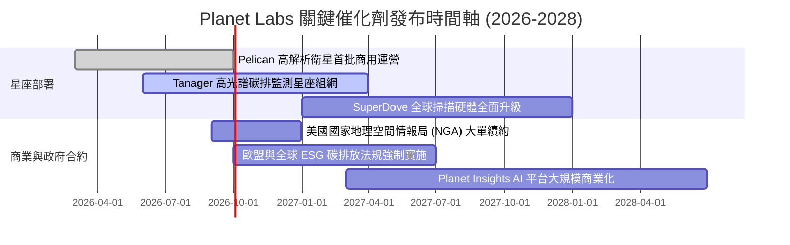

### 9.2 TAM 市場規模分析

```
╔══════════════════════════════════════════════════════════════════╗
║              Planet Labs 目標市場 (TAM) 滲透分析                 ║
╠══════════════════════════════════════════════════════════════════╣
║                                                                  ║
║  1. 國防、情報與民用政府 (ISR)  TAM: $35.0B  滲透率: ~0.7%        ║
║     ── 貢獻營收: ~$240M ｜ 地緣動盪帶動高頻監測剛性需求          ║
║                                                                  ║
║  2. 農業、林業與大宗商品監測    TAM: $18.0B  滲透率: ~0.3%        ║
║     ── 貢獻營收: ~$55M  ｜ 提供產量預測與旱澇精準保險理賠        ║
║                                                                  ║
║  3. 氣候變遷、ESG 與碳排放盤查  TAM: $22.0B  滲透率: ~0.1%        ║
║     ── 貢獻營收: ~$25M  ｜ Tanager 高光譜精準鎖定甲烷洩漏源點    ║
║                                                                  ║
║  4. 金融、供應鏈與能源基礎設施  TAM: $15.0B  滲透率: ~0.1%        ║
║     ── 貢獻營收: ~$16M  ｜ 全球油儲、港口貨運量自動化 AI 識別    ║
║                                                                  ║
║  總計可觸及市場 TAM: $90.0B ｜ 當前綜合滲透率僅 0.37%            ║
╚══════════════════════════════════════════════════════════════════╝
```

### 9.3 成長驅動力結構圖

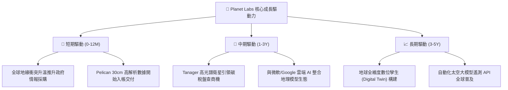

---

## 10. 風險矩陣

### 10.1 風險評分矩陣

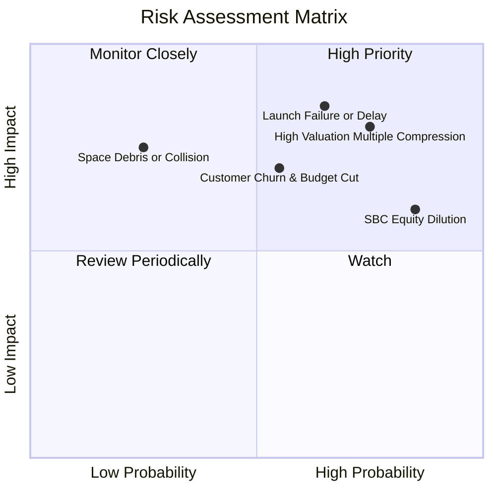

### 10.2 風險清單詳細分析

| # | 風險項目 | 發生機率 | 財務衝擊 | 風險評分 | 緩解措施與應對機制 |
|---|----------|----------|----------|----------|-------------------|
| 1 | 🔴 **發射延誤或在軌失效** | 中高 (65%) | 高 (-20% 遠期營收) | 🔴 **8.5/10** | 多發射商冗餘配置（SpaceX/Rocket Lab），星座分散部署架構 |
| 2 | 🔴 **估值倍數劇烈壓縮修正** | 高 (75%) | 高 (-35% 股價跌幅) | 🔴 **8.0/10** | 嚴格執行買入安全邊際紀律，避免在 P/S >20x 追高建倉 |
| 3 | 🟡 **政府國防預算審批延宕** | 中等 (55%) | 中高 (-15% ARR) | 🟡 **6.8/10** | 拓展民用商用客戶多樣性，爭取多年期不可撤銷總包合約 |
| 4 | 🟡 **股權激勵（SBC）持續稀釋** | 極高 (85%) | 中等 (-5% EPS 年稀釋) | 🟡 **6.5/10** | 敦促董事會將高管獎勵與 GAAP 營運獲利門檻直接掛鉤 |
| 5 | 🟢 **軌道碎片碰撞與地磁風暴** | 低 (25%) | 高 (局部設備損失) | 🟢 **4.5/10** | 衛星具備自主軌道抬升與避碰推進器，全覆蓋商業發射保險 |

---

## 11. 投資建議

### 11.1 最終綜合評級雷達圖

```
╔══════════════════════════════════════════════════════════════╗
║                Planet Labs 最終多維度評估                    ║
╠══════════════════════════════════════════════════════════════╣
║ 基本面業務護城河  7.5 ▓▓▓▓▓▓▓▓▓▓▓▓▓▓▓░░░░░  ★★★★☆          ║
║ 營收成長加速動能  8.5 ▓▓▓▓▓▓▓▓▓▓▓▓▓▓▓▓▓░░░  ★★★★☆          ║
║ 獲利品質與轉正    3.5 ▓▓▓▓▓▓▓░░░░░░░░░░░░░  ★★☆☆☆          ║
║ 現金與資產負債表  8.0 ▓▓▓▓▓▓▓▓▓▓▓▓▓▓▓▓░░░░  ★★★★☆          ║
║ 當前估值性價比    4.0 ▓▓▓▓▓▓▓▓░░░░░░░░░░░░  ★★☆☆☆          ║
║ 催化劑落地確定性  7.0 ▓▓▓▓▓▓▓▓▓▓▓▓▓▓░░░░░░  ★★★★☆          ║
╠══════════════════════════════════════════════════════════════╣
║ 綜合投資評分      6.6 ▓▓▓▓▓▓▓▓▓▓▓▓▓░░░░░░░  🟡 持有/謹慎觀望║
╚══════════════════════════════════════════════════════════════╝
```

### 11.2 目標價與隱含報酬率

| 情境 | 目標價 | 隱含報酬率 (vs $21.72) | 機率權重 | 核心營運與估值假設 |
|------|--------|------------------------|----------|-------------------|
| 🔴 **悲觀情境** | **$14.50** | **-33.2%** | 25% | 營收成長降至 18%，EV/Sales 壓縮至 8.0x |
| 🟡 **基準情境** | **$28.00** | **+28.9%** | 55% | 營收維持 28% 成長，EV/Sales 處於 12.5x 合理中樞 |
| 🟢 **樂觀情境** | **$42.00** | **+93.4%** | 20% | 碳盤查大單爆發，營收成長 >38%，EV/Sales 15.0x |
| **加權目標價** | **$27.43** | **+26.3%** | 100% | `$14.50×25% + $28.00×55% + $42.00×20%` |

### 11.3 買入時機與觸發因素

```
╔══════════════════════════════════════════════════════════════════╗
║                  ✅ 買入與操作觸發因素 Checklist                 ║
╠══════════════════════════════════════════════════════════════════╣
║                                                                  ║
║  立即建倉觸發條件（建議買入區間：$16.00 – $18.50）：             ║
║  ✅ 股價回落至加權合理價值 $24.81 之 25% 安全邊際以下 ($18.50)    ║
║  ✅ 單季 GAAP 營業虧損持續收窄至 -$15M 以內                     ║
║  ✅ Pelican 星座首批 10 顆衛星成功入軌並開始回傳高解析數據       ║
║                                                                  ║
║  積極加碼觸發條件：                                              ║
║  ☐ 季度營收 YoY 增速突破 45% 且公佈 >$50M 級別國防長約           ║
║  ☐ 自由現金流 (FCF) 連續 2 季為正且未藉由壓縮研發實現           ║
║  ☐ 股權激勵費用 (SBC) 佔營收比重顯著下降至 10% 以下              ║
║                                                                  ║
║  停損/減碼觸發條件（減碼區間：> $35.00）：                       ║
║  ☐ 股價升破 $35.00，隱含 P/S 突破 30x，過度透支樂觀預期          ║
║  ☐ 關鍵火箭發射遭遇重大事故致星座組網延誤逾 1 年                 ║
║  ☐ 季度營收 YoY 成長率連續兩季失守 20% 門檻                      ║
╚══════════════════════════════════════════════════════════════════╝
```

### 11.4 投資人適配度分析

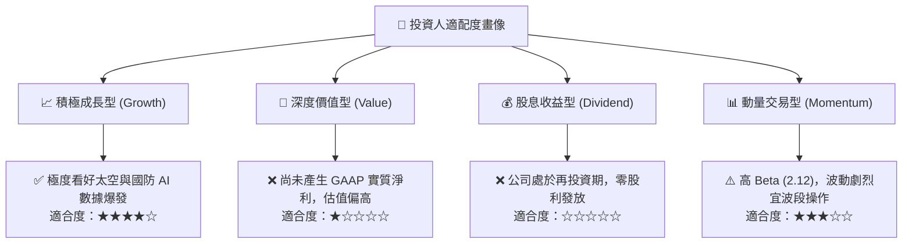

### 11.5 每季財報監控清單（Quarterly Watch List）

| 監控維度 | 核心指標 | 綠燈 (加碼門檻) | 黃燈 (維持觀察) | 紅燈 (減碼停損) |
|----------|----------|-----------------|-----------------|-----------------|
| **成長動能** | 營收 YoY 成長率 | > 35.0% | 20.0% – 35.0% | < 20.0% |
| **獲利槓桿** | 營業利益率 (GAAP) | > -15.0% | -30.0% – -15.0% | < -35.0% |
| **現金健康** | 季末自由現金流 (FCF) | > +$10.0M | -$10.0M – +$10.0M | < -$25.0M |
| **股東稀釋** | SBC 佔營收比重 | < 12.0% | 12.0% – 20.0% | > 22.0% |
| **硬體進展** | Pelican / Tanager 在軌數 | 符合排程交付 | 延遲 1-2 季 | 發射失敗/延遲>1年|

### 11.6 反面論證：什麼會證明論點錯誤（What Would Change My Mind）

```
╔══════════════════════════════════════════════════════════════════╗
║              ⚠️ 論點失效條件（Disconfirming Evidence）           ║
╠══════════════════════════════════════════════════════════════════╣
║  若出現下列可量化事件，本報告之「持有/觀望」論點將被推翻：       ║
║                                                                  ║
║  【轉為強力賣出】條件：                                          ║
║  ☐ 核心營收成長率連續 2 季跌破 15.0%                             ║
║  ☐ Pelican 衛星因供應鏈或發射事故延遲超過 12 個月                ║
║  ☐ 季度 OCF 再度大幅轉負（<-$30M）且帳上淨現金消耗至 <$100M      ║
║                                                                  ║
║  【轉為強力買入】條件：                                          ║
║  ☐ 股價非理性重挫至 <$16.00（提供 >35% 之堅實安全邊際）         ║
║  ☐ 營業利益率跨越損益平衡點（GAAP Operating Income > $0）       ║
║  ☐ Tanager 星座成功鎖定全球性跨國碳盤查監管機構之獨家長期採購訂單║
╚══════════════════════════════════════════════════════════════════╝
```

---
> **免責聲明**：本報告為 AI 輔助之基本面深度研究，數據引用自公開市場即時財務資訊，僅供專業機構投資者研究參考，不構成任何個別買賣建議。投資具備固有風險，決策前請詳閱官方 SEC 申報文件並審慎評估風險承受能力。