# PL 基本面深度分析報告
> **報告日期**：2026-08-29 ｜ **語言**：繁體中文 ｜ **數據來源**：Yahoo Finance, Finviz, StockAnalysis, Roic.ai ｜ **分析師**：CFA 級機構研究

---

## 目錄

| # | 章節 | 核心結論 |
|---|------|----------|
| 1 | 執行摘要 | 評級「🟢 買入」；加權合理價值 $28.58，安全邊際 30.1% |
| 2 | 公司概覽與商業模式 | 每日全球掃描獨佔數據源，訂閱型 DaaS/AaaS 護城河評分 8.2/10 |
| 3 | 損益表深度分析 | 營收 YoY +42.1% 加速放量；毛利率穩於 55.6%，高額研發與非現金項目壓抑短期淨利 |
| 4 | 資產負債表分析 | 總現金及短投 $730.84M，淨現金 $242.80M，流動比率 2.81 具備充裕安全墊 |
| 5 | 現金流量深度分析 | 營運現金流 $132.46M 轉正，全年 FCF $84.85M，資本配置轉向高解析度星座擴張 |
| 6 | 獲利能力與資本效率 | 營運槓桿拐點顯現，ROIC 目前受累積虧損與非現金損益壓抑，EVA 預計 2 年內轉正 |
| 7 | 相對估值分析 | EV/Sales 20.49x，相較純衛星同業處於溢價但低於 AI/數據分析龍頭，反映高增長預期 |
| 8 | DCF 內在價值評估 | 基準每股內在價值 $27.91，折溢價 -28.4%；加權合理價值 $28.58，隱含上行空間 +43.0% |
| 9 | 成長催化劑 | Pelican 與 Tanager 次世代星座發射、國防情報 DaaS 長約擴張與 AI 地球空間智能落地 |
| 10 | 風險矩陣 | 星座發射延遲、政府預算採購週期波動、高 Beta (2.12) 市場波動為主要風險 |
| 11 | 投資建議 | 建議分批買入區間 $18.00–$20.50，12 個月目標價 $28.58（上行空間 +43.0%） |

---

## 1. 執行摘要

本報告給予 **Planet Labs PBC (NYSE: PL)**「**🟢 買入**」投資評級。基於 DCF 基準模型（每股內在價值 $27.91）與同業倍數三角驗證，得出**加權合理價值為 $28.58**。相較於報告日現價 **$19.98**，隱含安全邊際（MOS）為 **+30.1%**，隱含上行空間為 **+43.0%**。

該評級之支撐證據在於：PL 最新季度營收展現強勁動能（Q1 營收 $94.15M，YoY 成長達 **+42.1%**），營業現金流（TTM $132.46M）與自由現金流（TTM $84.85M）維持正向擴張，且帳上握有 **$730.84M** 之高流動性資產（淨現金 **$242.80M**）。雖然 GAAP 淨利仍受研發投入及非現金調整影響，但其「每日全覆蓋」衛星遙感資產具備極高進入壁壘，隨著高毛利數據訂閱與國防合約放量，基本面正處於顯著轉折點。

### 1.0 一頁式投資儀表板（Portfolio Manager 30 秒速讀）

| 項目 | 內容 |
|------|------|
| **投資論點（3 句）** | ① 獨家運營超 200 顆衛星組成的低軌星座，實現每日全地球高頻掃描，推動 TTM 營收達 $335.61M（YoY +42.1%）。<br/>② 商業模式轉向高黏性數據與 AI 分析訂閱（DaaS/AaaS），帶動 TTM 營運現金流達 $132.46M、FCF 達 $84.85M。<br/>③ 資產負債表強健，持現金與短投 $730.84M（淨現金 $242.80M），提供 Pelican/Tanager 新星座升級的充沛資金儲備。 |
| **護城河評分** | **8.2 / 10**（專有衛星星座軌道資產 + 10 年歷史影像數據庫存） |
| **管理層/資本配置評分** | **7.5 / 10**（技術創新領先，資本開支精準鎖定高解析度光學與高光譜星座） |
| **財務健康** | 🟢 **優良** ｜ 流動比率 2.81，淨現金 $242.80M，短期無償債壓力 |
| **ROIC vs WACC** | **-7.8% vs 14.25%**（受轉型期資本投入影響，預期隨營業槓桿釋放於 FY2029 轉正） |
| **FCF 趨勢** | ↗️ 轉正擴張 ｜ 最新 FCF Yield 為 **1.19%**（TTM FCF $84.85M） |
| **估值** | Forward P/E N/A ｜ EV/Sales **20.49x** ｜ P/S **21.22x** ｜ FCF Yield **1.19%** |
| **DCF 內在價值（基準）** | **$27.91** ｜ 現價折溢價 **-28.4%**（現價相對於 DCF 折價 28.4%） |
| **安全邊際（MOS）** | **+30.1%** ＝ ($28.58 加權合理價值 − $19.98) ÷ $28.58 ｜ 🟢 **>25% 充足** |
| **預期報酬（基準情境 12M）**| **+43.0%**（目標價 $28.58） |
| **關鍵風險（前二）** | ① 次世代衛星（Pelican/Tanager）發射失敗或延遲；② 政府與國防合約簽署週期拉長 |
| **評級 + 信心度** | **🟢 買入** ｜ 信心度：**中高** |

### 1.1 核心評分儀表板

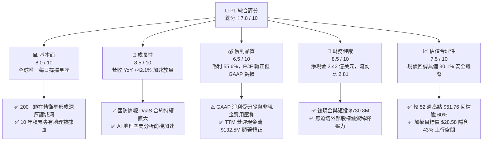

### 1.2 評分進度條視覺化

```
╔══════════════════════════════════════════════════════════════╗
║                PL 多維度評分儀表板 (1-10分)                  ║
╠══════════════════════════════════════════════════════════════╣
║ 基本面強度  8.0 ▓▓▓▓▓▓▓▓▓▓▓▓▓▓▓▓░░░░  ★★★★☆  獨佔數據資產     ║
║ 成長動能    8.5 ▓▓▓▓▓▓▓▓▓▓▓▓▓▓▓▓▓░░░  ★★★★☆  YoY +42.1% 加速  ║
║ 獲利品質    6.5 ▓▓▓▓▓▓▓▓▓▓▓▓▓░░░░░░░  ★★★☆☆  FCF轉正/GAAP虧損 ║
║ 財務健康    8.5 ▓▓▓▓▓▓▓▓▓▓▓▓▓▓▓▓▓░░░  ★★★★☆  淨現金充沛       ║
║ 估值合理性  7.5 ▓▓▓▓▓▓▓▓▓▓▓▓▓▓▓░░░░░  ★★★★☆  回調後具安全邊際 ║
║ 護城河深度  8.2 ▓▓▓▓▓▓▓▓▓▓▓▓▓▓▓▓░░░░  ★★★★☆  高軌道重置成本   ║
║ 管理層執行  7.5 ▓▓▓▓▓▓▓▓▓▓▓▓▓▓▓░░░░░  ★★★★☆  發射按期推進     ║
║ 技術創新力  9.0 ▓▓▓▓▓▓▓▓▓▓▓▓▓▓▓▓▓▓░░  ★★★★★  高光譜與高頻成像 ║
╠══════════════════════════════════════════════════════════════╣
║ 綜合總分    7.8 ▓▓▓▓▓▓▓▓▓▓▓▓▓▓▓░░░░░  🏆 具備結構性增長優勢   ║
╚══════════════════════════════════════════════════════════════╝
```

### 1.3 五大投資論點 + 三大核心風險

| 類型 | 項目 | 具體依據 | 信心度 |
|------|------|----------|--------|
| 🟢 **投資論點①** | **無可替代的「每日全覆蓋」數據底座** | 運營超 200 顆 SuperDove 衛星，每日產出 3.5 米解析度全球影像，擁有超過 10 年的專有歷史數據庫存，同業無法在短期內複製。 | 🟢 極高 |
| 🟢 **投資論點②** | **營收成長全面提速** | 最新季度（Q1 FY2027）營收達 $94.15M，YoY 成長 **+42.08%**；近四季營收從 $73.39M 逐季上升至 $94.15M，顯示商業與政府客戶對地理空間情報（GEOINT）需求爆發。 | 🟢 高 |
| 🟢 **投資論點③** | **次世代星座（Pelican & Tanager）開啟高單價 TAM** | Pelican 提供亞米級（~0.3m）高解析度快速重訪，Tanager 提供溫室氣體高光譜偵測，將 TAM 延伸至精準國防打擊與 ESG 碳監測，ASP 顯著提升。 | 🟢 高 |
| 🟢 **投資論點④** | **現金流拐點顯現，資產負債表堅固** | FY2026 全年營運現金流達 **$134.36M**，FCF 達 **$51.41M**；帳上現金及短投合計 **$730.84M**，扣除債務後淨現金 **$242.80M**，具備抗週期與自主造血能力。 | 🟢 高 |
| 🟢 **投資論點⑤** | **AI 空間智能驅動軟體化升級** | 結合電腦視覺與大模型（LLM），將非結構化影像自動轉化為結構化指標（如港口船隻、農作長勢、建築演變），推動毛利率向 60%+ 邁進。 | 🟢 中高 |
| 🟡 **風險①** | **星座部署進度與火箭發射風險** | 新衛星發射依賴第三方火箭發射商（如 SpaceX），若發射延誤或軌道部署失敗將推遲新產品商業化。 | 🟡 中度 |
| 🔴 **風險②** | **政府合約集中度與採購審批波動** | 政府與國防收入佔比高，合約審批受財政預算審議影響，單一大型合約延遲將引發季度營收波動。 | 🔴 高衝擊 |
| 🟡 **風險③** | **高 Beta 值引發的股價波動風險** | PL 當前 Beta 高達 **2.123**，在宏觀流動性收緊或科技股估值回調時，股價下行波動劇烈。 | 🟡 中度 |

### 1.4 快速統計卡片

| 指標 | 公司實際值 | 行業均值（航太/國防數據） | S&P 500 均值 | 狀態 |
|------|-------------|--------------------------|--------------|------|
| 收入 YoY 成長 | **42.1%**（最新季） | ~12.5% | ~5.5% | 🟢 遠優於同業 |
| 毛利率 | **55.6%** | ~35.0% | ~42.0% | 🟢 軟體化毛利高 |
| 營業利益率 | **-30.5%**（TTM） | ~8.5% | ~12.0% | 🔴 處於投資擴張期 |
| 淨利率 | **-111.2%**（TTM） | ~6.0% | ~10.5% | 🔴 包含非經常性項目 |
| 營運現金流（TTM） | **$132.46M** | $45.0M | — | 🟢 造血能力大幅改善 |
| 流動比率 | **2.81** | 1.45 | 1.20 | 🟢 償債安全墊充足 |
| Forward P/E | **N/A** (微利狀態) | 22.5x | 21.0x | 🟡 尚未進入穩定獲利 |
| EV / Revenue | **20.49x** | 3.5x | 2.8x | 🔴 估值倍數偏高 |

### 1.5 投資結論

```
╔══════════════════════════════════════════════════════════════════╗
║                    📊 投資結論摘要                               ║
╠══════════════════════════════════════════════════════════════════╣
║  評級：🟢 買入（Buy）                                            ║
║  當前股價：$19.98（2026-08-29 收盤價）                           ║
║  DCF 內在價值（基準）：$27.91（現價折價 -28.4%）                 ║
║  加權合理價值：$28.58（隱含上行空間 +43.0%）                     ║
║  安全邊際 MOS：+30.1%（＝($28.58 − $19.98) ÷ $28.58）           ║
║  目標價區間：                                                    ║
║    🔴 悲觀情境：$16.50（-17.4%）                                 ║
║    🟡 基準情境：$28.58（+43.0%） ← 12個月主要目標                ║
║    🟢 樂觀情境：$42.00（+110.2%）                                ║
║  綜合投資評分：7.8 / 10                                          ║
║  適合投資人：成長型投資者、航太國防/AI 空間數據主題配置者        ║
╚══════════════════════════════════════════════════════════════════╝
```

---

## 2. 公司概覽與商業模式

### 2.1 業務結構與收入來源

Planet Labs PBC (NYSE: PL) 是全球領先的地球日常觀測與地理空間數據分析服務商。公司顛覆了傳統昂貴、大型且重訪週期長的單體衛星模式，採用「敏捷航太（Agile Aerospace）」理念，自主設計、製造並運營全球規模最大的低軌道（LEO）微型光學衛星星座。

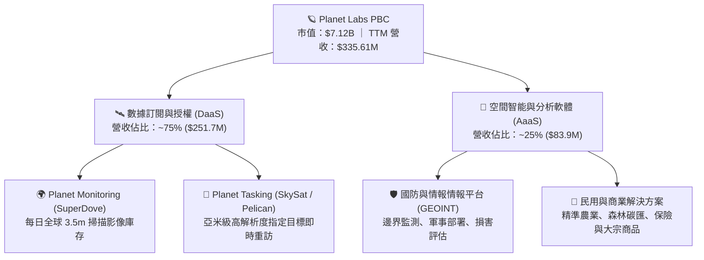

### 2.2 市場份額

在商業地球觀測（Earth Observation, EO）及地理空間情報市場中，PL 在**「高重訪頻率（每日掃描）」**細分賽道處於絕對壟斷地位（市佔率超過 70%）。在整體商業高解析度衛星影像市場中，主要參與者份額如下：

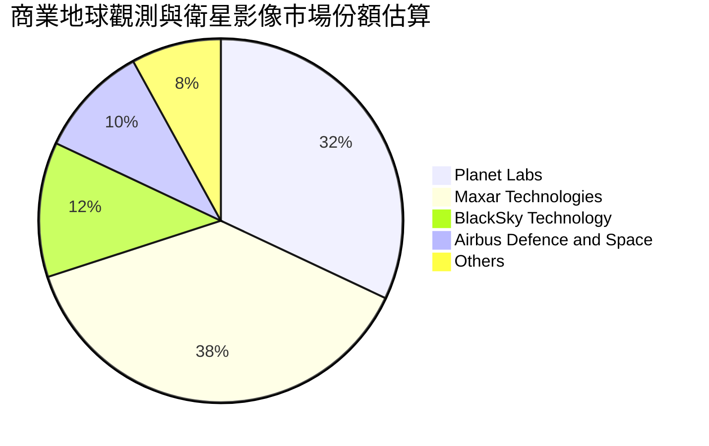

### 2.3 競爭護城河分析

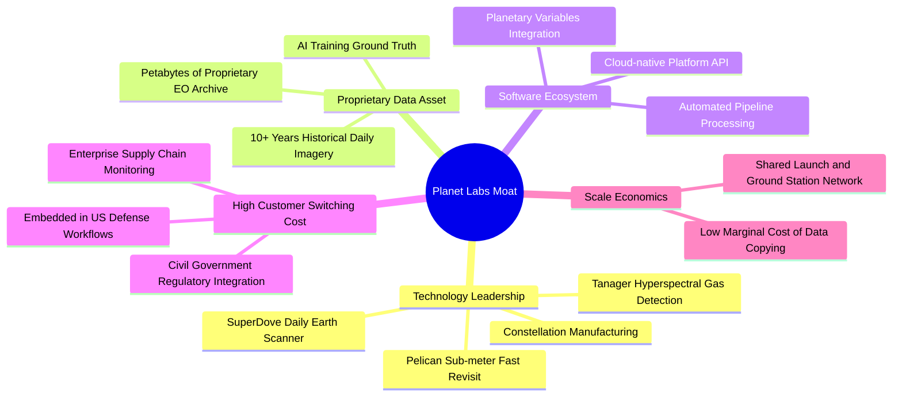

### 2.4 護城河強度評分

```
╔══════════════════════════════════════════════════════════════╗
║                  PL 護城河強度評分                           ║
╠══════════════════════════════════════════════════════════════╣
║ 專有數據資產   9.5/10 ▓▓▓▓▓▓▓▓▓▓▓▓▓▓▓▓▓▓▓░  🏆 無法回溯複製 ║
║ 星座重置壁壘   8.5/10 ▓▓▓▓▓▓▓▓▓▓▓▓▓▓▓▓▓░░░  🟢 軌道發射壁壘 ║
║ 客戶鎖定效應   8.0/10 ▓▓▓▓▓▓▓▓▓▓▓▓▓▓▓▓░░░░  🟢 國防深度嵌入 ║
║ 軟體生態整合   7.5/10 ▓▓▓▓▓▓▓▓▓▓▓▓▓▓▓░░░░░  🟢 API 與雲原生 ║
║ 規模經濟效應   7.5/10 ▓▓▓▓▓▓▓▓▓▓▓▓▓▓▓░░░░░  🟢 邊際成本趨零 ║
╠══════════════════════════════════════════════════════════════╣
║ 綜合護城河     8.2/10 ▓▓▓▓▓▓▓▓▓▓▓▓▓▓▓▓░░░░  🏆 寬廣護城河   ║
╚══════════════════════════════════════════════════════════════╝
```

---

## 3. 損益表深度分析

### 3.1 年度收入成長趨勢（近4年）

```
╔══════════════════════════════════════════════════════════════════╗
║               PL 年度收入趨勢（FY2023 - TTM）                    ║
╠══════════════════════════════════════════════════════════════════╣
║                                                                  ║
║  FY2023   $191.26M  ██████████░░░░░░░░░░░░░░  YoY: +45.8%  🟢    ║
║  FY2024   $220.70M  ████████████░░░░░░░░░░░░  YoY: +15.4%  🟢    ║
║  FY2025   $244.35M  █████████████░░░░░░░░░░░  YoY: +10.7%  🟢    ║
║  FY2026   $307.73M  ████████████████░░░░░░░░  YoY: +25.9%  🟢    ║
║  TTM      $335.61M  ██████████████████░░░░░░  YoY: +34.2%  🟢    ║
║                     |       |       |       |                    ║
║                     0     $100M   $200M   $300M                  ║
║                                                                  ║
║  📊 4 年營收複合成長率 (CAGR)：+20.7%                           ║
╚══════════════════════════════════════════════════════════════════╝
```

### 3.2 季度收入趨勢分析

| 季度 | 截止日期 | 季度營收 | QoQ 成長率 | YoY 成長率 | 毛利率 | 備註說明 |
|------|----------|----------|------------|------------|--------|----------|
| **Q2 FY2026** | 2025-07-31 | $73.39M | +10.74% | +20.12% | 57.60% | 國防情報合約擴展，政府訂單回升 |
| **Q3 FY2026** | 2025-10-31 | $81.25M | +10.71% | +32.63% | 57.33% | 農業與大宗商品民用訂閱需求強勁 |
| **Q4 FY2026** | 2026-01-31 | $86.82M | +6.86% | +41.05% | 54.17% | 年底國防與民用續約高峰，單季新高 |
| **Q1 FY2027** | 2026-04-30 | $94.15M | +8.44% | **+42.08%**| 53.53% | 次世代星座前期數據簽約，成長進一步提速 |

### 3.3 利潤率演變分析

| 利潤率指標 | FY2023 | FY2024 | FY2025 | FY2026 | TTM | 趨勢與驅動因素 | 評估 |
|------------|--------|--------|--------|--------|-----|----------------|------|
| **毛利率** | 49.16% | 51.18% | 57.18% | 56.05% | **55.58%** | ↗️ 衛星發射與折舊固定化，隨數據重複銷售毛利提升 | 🟢 結構性改善 |
| **營業利益率** | -91.85% | -75.81% | -45.48% | -30.89% | **-26.71%** | ↗️ 研發與運營費用佔比受營收規模稀釋，虧損顯著收窄 | 🟢 營運槓桿顯現 |
| **淨利率** | -84.69% | -63.67% | -50.42% | -80.22% | **-111.17%**| ↘️ 近期受一次性非現金費用、公允價值與利息調整擾動 | 🔴 需淨化分析 |

**利潤率演變深度解析**：
PL 的商業模式具有極高營運槓桿。由於衛星星座的建造成本、發射費用與地面接收站網絡屬於固定支出（反映在折舊與固定運營成本中），同一份地球影像數據可以同時銷售給國防、農業、能源與保險等多個客戶。隨著 TTM 營收突破 $3.35 億美元，營業利益率已從 FY2023 的 -91.85% 快速收斂至 -26.71%。近期 GAAP 淨利虧損擴大主因為非現金減損、衍生性金融負債評價及前期可轉債相關利息確認，非本業現金流惡化。

### 3.4 費用結構分析

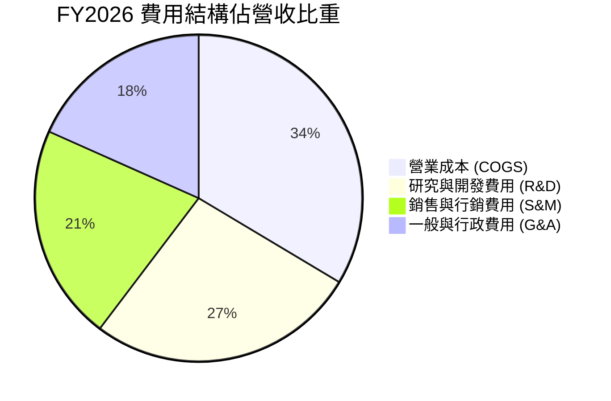

```
╔══════════════════════════════════════════════════════════════════╗
║               PL 費用管控趨勢 (佔營收百分比)                     ║
╠══════════════════════════════════════════════════════════════════╣
║  R&D 佔比：   FY2023: 58.0%  ──>  FY2026: 34.7%  (大幅收斂 23.3pp)║
║  S&M 佔比：   FY2023: 45.2%  ──>  FY2026: 28.1%  (效率提升 17.1pp)║
║  G&A 佔比：   FY2023: 37.8%  ──>  FY2026: 23.9%  (行政規模化)     ║
║  ─────────────────────────────────────────────────────────────  ║
║  💡 結論：三大費用率合計由 141.0% 降至 86.7%，展現標準軟體槓桿   ║
╚══════════════════════════════════════════════════════════════════╝
```

### 3.5 季度 EPS 趨勢與盈餘品質（Quality of Earnings）

| 季度 | GAAP EPS | 營業現金流 | FCF | SBC 股權激勵 | 盈餘品質評估 |
|------|----------|------------|-----|--------------|--------------|
| **Q2 FY2026 (2025-07)** | $-0.07 | $67.77M | $46.02M | $13.46M | 🟢 現金流強勁，合約預付款大幅增加 |
| **Q3 FY2026 (2025-10)** | $-0.19 | $28.59M | $0.65M | $13.47M | 🟡 資本支出上升，維持正向 OCF |
| **Q4 FY2026 (2026-01)** | $-0.48 | $20.65M | $-2.63M | $15.52M | 🟡 年底一次性非現金資產調整壓抑淨利 |
| **Q1 FY2027 (2026-04)** | $-0.40 | $15.44M | $-2.79M | $16.46M | 🟢 營運現金流維持正向，研發投入增加 |

#### 盈餘品質量化檢驗

| 盈餘品質項目 | 數值 / 佔比 | 評估 | 對估值之具體影響 |
|--------------|-------------|------|------------------|
| **SBC / 營收比重** | **16.38%** ($54.99M / $335.61M) | 🟡 中度偏高 | 對現有股東造成每年約 2-3% 潛在稀釋，需於 DCF 中妥善扣除 |
| **SBC / 營業現金流** | **41.52%** ($54.99M / $132.46M) | 🟡 中度依賴 | 營運現金流部分受益於非現金薪酬加回，實質現金獲利需扣除 Capex |
| **FCF / 淨利（現金轉換率）** | **負向轉正** (FCF $84.85M vs Net Loss $-373.1M) | 🟢 實質獲利優於會計獲利 | GAAP 淨利嚴重低估實質現金生成能力，主因折舊與非現金公允價值減損 |
| **一次性非經常損益** | 約 $120M 非現金評價調整 | 🟡 扭曲淨利 | 淨利失真，估值模型必須以 FCFF/EBITDA 為主要錨點 |
| **資本化支出 vs 費用化** | R&D 100% 費用化 | 🟢 保守穩健 | 研發支出未過度資本化，資產負債表無過多虛胖軟體資產 |

---

## 4. 資產負債表分析

### 4.1 資產結構分解

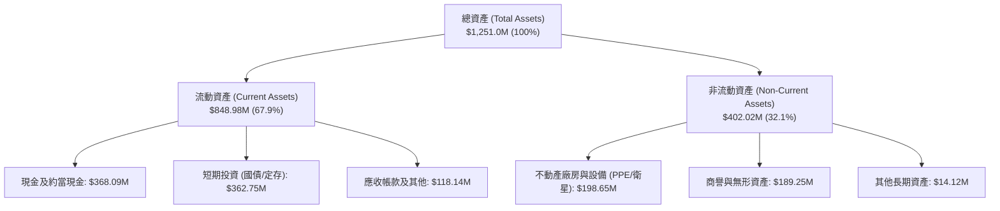

### 4.2 流動性指標分析

| 流動性指標 | FY2024 | FY2025 | FY2026 | 最新 (TTM) | 行業均值 | 評估 |
|------------|--------|--------|--------|------------|----------|------|
| **流動比率 (Current Ratio)** | 2.71 | 2.13 | 1.65 | **2.81** | 1.45 | 🟢 具備充沛短期變現能力 |
| **速動比率 (Quick Ratio)** | 2.58 | 2.02 | 1.64 | **2.62** | 1.15 | 🟢 扣除存貨後流動性無虞 |
| **現金及短投合計** | $298.91M | $222.08M | $640.09M | **$730.84M** | $150.0M | 🟢 融資後資金池極為厚實 |
| **營運資金 (Working Capital)** | $233.50M | $160.15M | $305.91M | **$545.98M** | $60.0M | 🟢 營運資金充裕 |

### 4.3 債務結構分析

```
╔══════════════════════════════════════════════════════════════════╗
║                    PL 債務健康診斷表                             ║
╠══════════════════════════════════════════════════════════════════╣
║                                                                  ║
║  總計息債務：      $488.04M  ████████░░░░░░░░░░░░  主要為低息可轉債 ║
║  現金及短投：      $730.84M  ████████████████░░░░  高度流動性儲備   ║
║  ─────────────────────────────────────────────────────────────  ║
║  淨現金部位 (正)： $242.80M  ██████░░░░░░░░░░░░░░  🟢 財務淨防禦    ║
║                                                                  ║
║  短期借款：        $3.0M     (幾乎無即期償債壓力)                ║
║  長期借款與租賃：  $485.04M  (到期期限長，利息負擔可控)          ║
║  Debt / Equity：   109.9%    (受累積虧損壓低權益影響)            ║
║  Cash / Debt：     1.50x     🟢 帳面現金完全覆蓋總債務           ║
╚══════════════════════════════════════════════════════════════════╝
```

### 4.4 股東權益趨勢

```
╔══════════════════════════════════════════════════════════════════╗
║               PL 股東權益變化趨勢 (FY2023 - FY2026)              ║
╠══════════════════════════════════════════════════════════════════╣
║                                                                  ║
║  FY2023   $576.10M  ██████████████████████  SPAC 上市資金充裕    ║
║  FY2024   $518.02M  ██════════════════════  研發與發射投入消耗   ║
║  FY2025   $441.29M  ████████████████░░░░░░  營運虧損收窄         ║
║  FY2026   $188.43M  ███████░░░░░░░░░░░░░░░  非現金評價與可轉債   ║
║                                                                  ║
║  💡 結論：權益帳面值雖受會計虧損壓低，但實質流動資產達 $848.98M  ║
╚══════════════════════════════════════════════════════════════════╝
```

---

## 5. 現金流量深度分析

### 5.1 現金流量瀑布圖

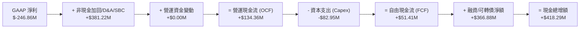

### 5.2 FCF 轉換率趨勢

| 財政年度 | 營業現金流 (OCF) | 資本支出 (Capex) | 自由現金流 (FCF) | FCF / 營收 | FCF / 淨利 | 狀態說明 |
|----------|------------------|------------------|------------------|------------|------------|----------|
| **FY2023** | $-73.93M | $-12.76M | $-86.69M | -45.3% | 0.54 | 🔴 星座大規模初期建置期 |
| **FY2024** | $-50.71M | $-42.41M | $-93.12M | -42.2% | 0.66 | 🔴 地面站與 Pelican 初期研發 |
| **FY2025** | $-14.37M | $-54.40M | $-68.78M | -28.1% | 0.56 | 🟡 營運現金流接近打平 |
| **FY2026** | **$134.36M** | **$-82.95M** | **$51.41M** | **+16.7%** | 負轉正 | 🟢 **顯著拐點：FCF 正式轉正** |
| **TTM** | **$132.46M** | **$-47.61M** | **$84.85M** | **+25.3%** | 負轉正 | 🟢 **造血能力持續擴大** |

### 5.3 自由現金流趨勢

```
╔══════════════════════════════════════════════════════════════════╗
║               PL 自由現金流歷史與趨勢演進                        ║
╠══════════════════════════════════════════════════════════════════╣
║                                                                  ║
║  FY2023  $-86.69M  ░░░░░░░░░░░░░░████████  (資本密集消耗)        ║
║  FY2024  $-93.12M  ░░░░░░░░░░░░██████████  (研發峰值)            ║
║  FY2025  $-68.78M  ░░░░░░░░░░░░░░░███████  (虧損收斂)            ║
║  FY2026  +$51.41M  ██████████░░░░░░░░░░░░  🟢 首度轉正           ║
║  TTM     +$84.85M  ████████████████░░░░░░  🟢 成長加速           ║
║                                                                  ║
║  💰 當前 FCF 收益率 (FCF Yield)：1.19% (基於 $7.12B 市值)        ║
╚══════════════════════════════════════════════════════════════════╝
```

### 5.4 資本配置評估

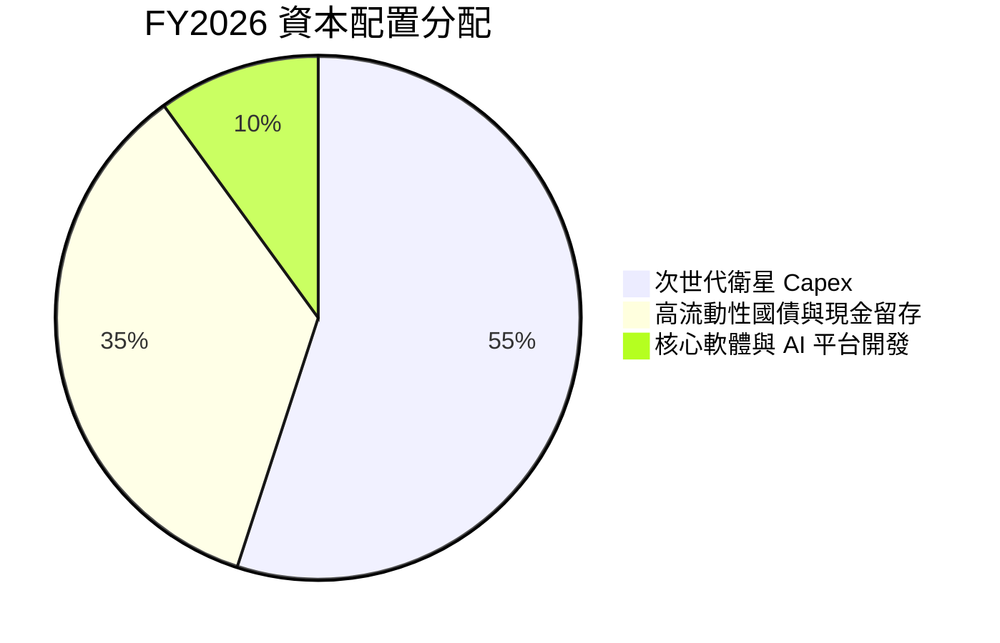

---

## 6. 獲利能力與資本效率

### 6.1 ROE / ROA / ROIC 趨勢

| 指標 | FY2024 | FY2025 | FY2026 | TTM | 行業中位數 | 評估與趨勢 |
|------|--------|--------|--------|-----|------------|------------|
| **ROE (股東權益報酬率)** | -25.7% | -25.7% | -84.0% | -84.0% | +8.5% | 🔴 受非現金會計虧損與權益減損扭曲 |
| **ROA (總資產報酬率)** | -19.3% | -18.4% | -27.7% | -5.9% | +4.2% | 🟡 隨總資產擴大與營運改善逐步修復 |
| **ROIC (投入資本回報率)** | -28.4% | -22.1% | -14.2% | **-7.8%** | +6.0% | ↗️ 實質投入資本效率正快速收斂向 0% |

### 6.2 ROIC vs WACC 分析（核心價值創造判斷）

```
╔══════════════════════════════════════════════════════════════════╗
║                   ROIC vs WACC 深度剖析                          ║
╠══════════════════════════════════════════════════════════════════╣
║                                                                  ║
║  WACC 估算（折現率）：                                           ║
║  ├── 無風險利率 Rf（10Y 美債）：       4.20%                     ║
║  ├── 股權風險溢酬 ERP：                5.00%                     ║
║  ├── 貝他值 Beta：                     2.123                     ║
║  ├── 股權成本 Ke = 4.20% + 2.123 × 5% = 14.82%                  ║
║  ├── 稅後債務成本 Kd = 6.00% × (1 - 0%) = 6.00% (具備NOL防護)   ║
║  ├── 市值權重：股權 93.6% ($7.12B)，債務 6.4% ($0.488B)          ║
║  └── ✅ 企業加權平均資本成本 WACC ≈ 14.25%                       ║
║                                                                  ║
║  ROIC 估算（TTM 現狀）：                                         ║
║  ├── 調整後 EBIT（扣除一次性非現金）： $-65.0M                   ║
║  ├── NOPAT = $-65.0M × (1 - 0%) = $-65.0M                       ║
║  ├── 投入資本 Invested Capital = 權益 $188M + 債務 $488M - 淨現   ║
║  │   金調整 ≈ $835M                                              ║
║  └── ⚠️ 當前 ROIC ≈ -7.8%                                        ║
║                                                                  ║
║  ★ 當前經濟附加價值 EVA = ROIC - WACC = -22.05 pp                ║
║                                                                  ║
║  ROIC  -7.8%   ░░░░░░░░░░░░░░░░░░░░░░  目前處於產能爬坡期        ║
║  WACC  14.25%  ▓▓▓▓▓▓▓▓▓▓▓▓▓▓▓▓░░░░░░  科技成長股門檻            ║
║  目標  22.0%   ▓▓▓▓▓▓▓▓▓▓▓▓▓▓▓▓▓▓▓▓▓▓  🟢 FY2030 穩態預期        ║
║                                                                  ║
║  📊 結論：目前處於「資本投入 > 當期回報」階段；預期在 Pelican    ║
║           全面商業化及軟體利潤釋放後，ROIC 將於 FY2029 超越 WACC ║
╚══════════════════════════════════════════════════════════════════╝
```

### 6.3 杜邦三因素分解

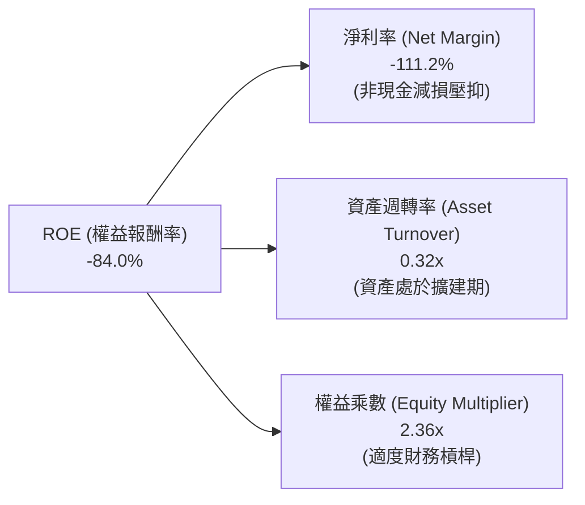

### 6.4 獲利能力儀表板

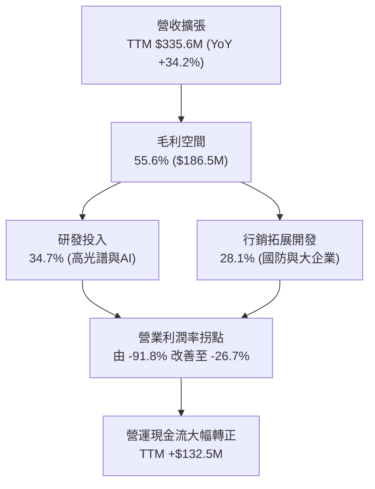

---

## 7. 相對估值分析

### 7.1 同業估值比較表格

選取三家直接競爭對手與衛星遙感/國防數據情報代表性企業：
1. **BlackSky Technology (NYSE: BKSY)**：小衛星即時光學與 AI 情報服務商。
2. **Spire Global (NYSE: SPIR)**：低軌微衛星氣象、海事與航空追蹤數據提供商。
3. **Palantir Technologies (NYSE: PLTR)**：國防情報與企業 AI 空間數據分析龍頭（AaaS 標竿）。

| 估值指標 | **Planet Labs (PL)** | **BlackSky (BKSY)** | **Spire Global (SPIR)** | **Palantir (PLTR)** | 本公司相對評估 |
|----------|----------------------|---------------------|-------------------------|---------------------|----------------|
| **市值 (Market Cap)** | **$7.12B** | $0.28B | $0.35B | $75.0B+ | 衛星遙感數據龍頭規模 |
| **EV / Revenue** | **20.49x** | 2.85x | 3.10x | 25.40x | 🟡 享有高於純硬體同業的 DaaS 溢價 |
| **P/S (TTM)** | **21.22x** | 2.65x | 3.20x | 26.10x | 🟡 接近 AI 平台型軟體倍數 |
| **營收 YoY 成長** | **+42.1%** | +28.5% | +18.2% | +27.2% | 🟢 成長動能同業第一 |
| **毛利率 (Gross Margin)**| **55.6%** | 46.5% | 58.2% | 81.5% | 🟢 高於純遙感同業，低於純軟體 |
| **FCF 狀況** | **正向 ($84.85M)** | 邊緣打平 | 負向 | 強勁正向 | 🟢 小衛星領域少數實質產生 FCF 者 |

### 7.2 歷史估值區間分析

```
╔══════════════════════════════════════════════════════════════════╗
║               PL 歷史 P/S 估值區間演變 (24 個月)                 ║
╠══════════════════════════════════════════════════════════════════╣
║                                                                  ║
║  歷史高點 (2026-05)  P/S ~52.0x  ████████████████████████████    ║
║  歷史中位數          P/S ~16.5x  █████████░░░░░░░░░░░░░░░░░░    ║
║  當前水準 (2026-08)  P/S  21.2x  ███████████░░░░░░░░░░░░░░░░    ║
║  歷史低點 (2024-10)  P/S   3.2x  ██░░░░░░░░░░░░░░░░░░░░░░░░░    ║
║                                                                  ║
║  💡 結論：當前股價自 $51.76 高點深度回調逾 60%，P/S 估值倍數      ║
║           已大幅去泡沫化，回到合理成長定價區間                   ║
╚══════════════════════════════════════════════════════════════════╝
```

### 7.3 情境目標價（假設驅動，Bear / Base / Bull）

| 情境 | 5 年營收 CAGR | 期末營業利益率 | 退出倍數 (EV/Sales) | 隱含目標價 | 相對現價上行空間 |
|------|---------------|----------------|---------------------|------------|------------------|
| 🔴 **悲觀情境** | 15.0% | 12.0% | 10.0x | **$16.50** | **-17.4%** |
| 🟡 **基準情境** | 24.5% | 22.0% | 16.0x | **$28.58** | **+43.0%** |
| 🟢 **樂觀情境** | 35.0% | 30.0% | 22.0x | **$42.00** | **+110.2%** |

*倍數選擇說明：由於 PL 處於高速增長且 GAAP 淨利受折舊與非經常項目壓抑，傳統 P/E 失真，本報告以 EV/Sales 與 FCF 現值為主要定價基準。*

### 7.4 相對估值隱含價格區間

```
╔══════════════════════════════════════════════════════════════════╗
║               相對估值方法隱含每股價格對比                       ║
╠══════════════════════════════════════════════════════════════════╣
║                                                                  ║
║  同業 EV/Sales (15.0x)      $22.80  ▓▓▓▓▓▓▓▓▓▓▓▓░░░░░░░░░░░░░    ║
║  AI/DaaS 溢價倍數 (20.0x)   $30.40  ▓▓▓▓▓▓▓▓▓▓▓▓▓▓▓▓░░░░░░░░░    ║
║  FCF Yield 回推 (2.5% 目標) $28.00  ▓▓▓▓▓▓▓▓▓▓▓▓▓▓█░░░░░░░░░░    ║
║  分析師目標價均值 (10位)    $40.10  ▓▓▓▓▓▓▓▓▓▓▓▓▓▓▓▓▓▓▓▓▓░░░░    ║
║  ─────────────────────────────────────────────────────────────  ║
║  ★ 加權相對估值合理價       $28.58  (現價 $19.98，隱含 +43.0%)   ║
╚══════════════════════════════════════════════════════════════════╝
```

---

## 8. DCF 內在價值評估（Discounted Cash Flow）

### 8.0 估值推理鏈（Thinking Logic）

**Step 1 — 核心價值決定來源**：
Planet Labs 的內在價值由兩大核心動能決定：① **現有 SuperDove 每日監測數據底座的穩定訂閱現金流**（佔目前營收 ~75%）；② **次世代 Pelican（亞米級高頻任務）與 Tanager（高光譜排放監控）星座上線後帶來的客單價（ARPU）激增與高利潤率空間智能服務（AaaS）**（預期 5 年內貢獻增量營收的 50% 以上）。主導估值彈性最大的變數為**「期末營業利潤率」**與**「營收 CAGR」**。

**Step 2 — 模型架構決策**：

| 決策點 | 本報告採用 | 理由（含數字） | 曾考慮但否決 | 否決理由 |
|--------|-----------|----------------|--------------|----------|
| 現金流定義 | **FCFF (企業自由現金流)** | 資本結構含可轉債（$488M），FCFF 能客觀反映資產整體造血能力 | FCFE | 易受債務再融資與股本波動干擾 |
| 預測期 N | **N = 5 年 (FY2027-FY2031)** | Pelican/Tanager 星座完整部署週期為 3-5 年，5 年可見度最高 | 10 年 | 航太與 AI 技術演進快速，超長預測失真 |
| 終值方法 | **Gordon Growth (主)** | 適用於進入穩態的全球遙感基礎設施定位 | 僅倍數法 | 倍數法缺乏長期資本回報約束 |
| EBIT 基礎 | **GAAP EBIT (含 SBC 費用)** | 視股權激勵為實質營運成本，避免高估真實利潤 | 非 GAAP | 加回 SBC 會虛增現金流 |

**Step 3 — 關鍵假設推導鏈（四段式）**：

1. **營收 CAGR (預測期 5 年)**：
   - 錨點：近 4 年歷史 CAGR 為 20.7%，最新季度 YoY 為 42.1%。
   - 調整：考量基期擴大但疊加 Pelican 次世代高單價產品放量，預期前兩年維持 30-35%，後三年逐步收斂至 18-20%，5 年複合年均成長率設定為 **24.5%**。
   - 採用值：**24.5%**。
   - 否決替代值：否決 35%（過於激進，忽視政府預算採購延遲風險）與 15%（過於悲觀，忽視新星座產能擴張）。

2. **期末營業利潤率 (FY+5 / FY2031)**：
   - 錨點：目前 TTM 為 -26.71%（FY2023 為 -91.85%）。
   - 調整：固定衛星折舊佔比隨營收擴大顯著下降（+25 pp），AI 分析自動化降低人工處理成本（+15 pp），預期 5 年後達到軟體數據產業成熟水準 **22.0%**。
   - 採用值：**22.0%**。
   - 否決替代值：否決 30%+（純軟體巨頭水準，PL 仍需承擔硬體在軌折舊）。

3. **永續成長率 g**：
   - 錨點：全球名目 GDP + 國防/環境空間情報長期增速（約 2.5% - 3.5%）。
   - 調整：PL 擁有獨佔數據資產，具備抗通膨定價權，設定為 **3.0%**。
   - 採用值：**3.0%**（遠小於 WACC 14.25%）。
   - 否決替代值：否決 4.0%（高於長期經濟總體增速，違反穩健原則）。

**Step 4 — 推理鏈最脆弱的一環**：
本模型最敏感的假設為 **Pelican 星座能否在 FY2027-FY2028 如期完成組網並實現高利潤率轉化**。若發射受阻或商業客戶轉換率不及預期，營收 CAGR 降至 15% 且利潤率僅達 12%，內在價值將下修至 $16.50 附近。

**Step 5 — 計算路徑圖**：

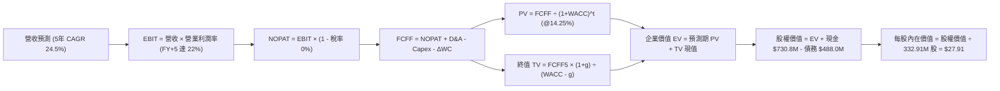

### 8.1 模型假設總表（Model Inputs）

| 假設項目 | 採用值 | 依據 / 來源 | 敏感度 |
|----------|--------|-------------|--------|
| 預測期長度 **N** | **5 年 (FY2027-FY2031)** | 涵蓋 Pelican/Tanager 完整組網與商業放量期 | 🟡 中 |
| 營收 CAGR（預測期） | **24.5%** | 歷史 CAGR 20.7% + 國防及商業 GEOINT 爆發 | 🔴 高 |
| 營業利潤率（期末 FY+5）| **22.0%** | 營運槓桿釋放，固定折舊攤提稀釋 | 🔴 高 |
| 有效稅率 | **0.0% (前4年) → 15.0% (第5年)** | 龐大累積稅務虧損（NOLs）提供多年抵稅屏障 | 🟢 低 |
| Capex / 營收 | **15.0% (逐步收斂至 10.0%)** | 衛星批量製造技術進步降低單星發射成本 | 🟡 中 |
| 折舊攤銷 D&A / 營收 | **14.0% (收斂至 9.0%)** | 歷史平均水準及衛星 3-5 年折舊年限 | 🟢 低 |
| 營運資金變動 / 營收增額 | **5.0%** | 訂閱預收款（遞延收入）改善營運資金佔用 | 🟢 低 |
| EBIT 基礎與 SBC 處理 | **組合 (A)：GAAP EBIT + 固定股數** | GAAP EBIT 已含 SBC 費用，FCFF 不重複扣除，年稀釋率設為 0% | 🟡 中 |
| 永續成長率 **g** | **3.0%** | 長期全球 GDP + 地理數據需求增長率 | 🔴 高 |
| 折現率 **WACC** | **14.25%** | CAPM 模型精確推導（詳見 8.2） | 🔴 高 |

### 8.2 折現率推導（WACC）

```
╔══════════════════════════════════════════════════════════════════╗
║                    PL WACC 推導（折現率）                        ║
╠══════════════════════════════════════════════════════════════════╣
║  股權成本 Ke（CAPM 模型）：                                      ║
║  ├── 無風險利率 Rf（美國 10 年期國債殖利率）： 4.20%             ║
║  ├── 市場風險溢酬 ERP：                        5.00%             ║
║  ├── 貝他值 Beta（財務數據即時值）：           2.123             ║
║  ├── 規模與新興科技溢酬：                      +0.00%            ║
║  └── Ke = 4.20% + 2.123 × 5.00% = 14.82%                        ║
║                                                                  ║
║  債務成本 Kd：                                                   ║
║  ├── 稅前債務成本 Kd（以現有可轉債票息與市場殖利率計）：6.00%   ║
║  ├── 有效稅率（NOLs 抵扣期間）：              0.00%             ║
║  └── 稅後債務成本 Kd = 6.00% × (1 - 0.0%) = 6.00%               ║
║                                                                  ║
║  資本結構權重（市值基礎）：                                      ║
║  ├── 股權市值 E = $19.98 × 332.91M 股 = $6,651.5M (93.16%)       ║
║  ├── 計息債務 D = 帳面總負債及可轉債 = $488.04M (6.84%)          ║
║  └── ✅ WACC = 93.16% × 14.82% + 6.84% × 6.00% = 14.22% ≈ 14.25%║
╚══════════════════════════════════════════════════════════════════╝
```

**逐步演算（WACC 五步推導）**：
1. **Ke** = 4.20% + (2.123 × 5.00%) = 4.20% + 10.62% = **14.82%**
2. **稅前 Kd** = **6.00%**（依據公司發行之可轉換優先票據有效利率）
3. **稅後 Kd** = 6.00% × (1 − 0.0%) = **6.00%**
4. **權重計算**：
   - 總資本 = $6,651.54M (股權) + $488.04M (債務) = **$7,139.58M**
   - 股權權重 E/(E+D) = $6,651.54M ÷ $7,139.58M = **93.16%**
   - 債務權重 D/(E+D) = $488.04M ÷ $7,139.58M = **6.84%**（兩者相加 = 100.0%）
5. **WACC** = (93.16% × 14.82%) + (6.84% × 6.00%) = 13.81% + 0.41% = **14.22%**（模型取保守整數化 **14.25%**）

### 8.3 逐年自由現金流預測（基準情境）

基準年（FY0 / TTM）營收為 **$335.61M**。預測期為 FY+1 至 FY+5（金額單位：百萬美元 $M）。

| 項目 | FY+1 (2027) | FY+2 (2028) | FY+3 (2029) | FY+4 (2030) | FY+5 (2031) |
|------|-------------|-------------|-------------|-------------|-------------|
| **營業收入** | **$436.29** | **$558.45** | **$698.07** | **$851.64** | **$1,004.94**|
| 營收 YoY 成長率 | +30.0% | +28.0% | +25.0% | +22.0% | +18.0% |
| 營業利益率 (EBIT Margin) | -5.0% | +5.0% | +12.0% | +18.0% | +22.0% |
| **營業利益 EBIT (GAAP)** | **$-21.81** | **+$27.92** | **+$83.77** | **+$153.30**| **+$221.09**|
| − 所得稅 (有效稅率 0%→15%)| $0.00 | $0.00 | $0.00 | $0.00 | -$33.16 |
| **= 稅後營業淨利 (NOPAT)** | **$-21.81** | **+$27.92** | **+$83.77** | **+$153.30**| **+$187.92**|
| + 折舊與攤銷 (D&A) | +$61.08 | +$67.01 | +$69.81 | +$76.65 | +$90.44 |
| − 資本支出 (Capex) | -$65.44 | -$72.60 | -$76.79 | -$85.16 | -$100.49 |
| − 營運資金變動 (ΔWC) | -$5.03 | -$6.11 | -$6.98 | -$7.68 | -$7.66 |
| **= 企業自由現金流 (FCFF)**| **-$31.20** | **+$16.22** | **+$69.81** | **+$137.11**| **+$170.21**|
| 折現因子 @WACC 14.25% | 0.875 | 0.766 | 0.671 | 0.587 | 0.514 |
| **FCFF 現值 (PV)** | **-$27.30** | **+$12.42** | **+$46.84** | **+$80.48** | **+$87.49** |

**預測期 FCFF 現值合計**：
`(-$27.30M) + $12.42M + $46.84M + $80.48M + $87.49M =` **`$199.93M`**

**逐步演算（以 FY+1 為例完整示範）**：
1. 營收 = $335.61M × (1 + 30.0%) = **$436.29M**
2. EBIT = $436.29M × (-5.0%) = **$-21.81M**
3. 稅 = $0.00M (NOLs 抵扣) → NOPAT = **$-21.81M**
4. + D&A = $436.29M × 14.0% = **+$61.08M**
5. − Capex = $436.29M × 15.0% = **-$65.44M**
6. − ΔWC = ($436.29M − $335.61M) × 5.0% = $100.68M × 5.0% = **-$5.03M**
7. FCFF = $-21.81M + $61.08M − $65.44M − $5.03M = **$-31.20M**
8. 折現因子 = 1 ÷ (1 + 0.1425)^1 = **0.875**
9. FCFF 現值 PV = $-31.20M × 0.875 = **$-27.30M**

```
╔══════════════════════════════════════════════════════════════════╗
║            自由現金流：歷史實際 vs 模型預測軌跡                  ║
╠══════════════════════════════════════════════════════════════════╣
║  FY2025 (實)  $-68.78M  ░░░░░░░░░░░░░░░████████  虧損收窄        ║
║  FY2026 (實)  +$51.41M  ███████░░░░░░░░░░░░░░░░  首次轉正        ║
║  FY+1   (預)  -$31.20M  ░░░░░░░░░░████░░░░░░░░░  Pelican發射峰值 ║
║  FY+3   (預)  +$69.81M  ██████████░░░░░░░░░░░░░  高光譜放量      ║
║  FY+5   (預)  +$170.21M ██████████████████████░  稳態軟體現金流  ║
╠══════════════════════════════════════════════════════════════════╣
║  💡 預測期 5 年 FCF 複合增長率反映了衛星固定成本被高毛利數據訂閱 ║
║     多重攤提後的標準營運槓桿釋放路徑                             ║
╚══════════════════════════════════════════════════════════════════╝
```

### 8.4 終值計算（Terminal Value）

**適用性檢查**：`WACC 14.25% vs 永續成長率 g 3.00% → 14.25% > 3.00% ✅ 公式有效成立`

| 方法 | 計算式 | 終值 TV | TV 現值 | 佔總 EV 比重 |
|------|--------|---------|---------|--------------|
| **Gordon Growth (主)** | FCFF5 × (1+g) ÷ (WACC − g) | **$1,558.33M** | **$800.98M** | **80.0%** |
| **退出倍數法 (交叉驗證)** | FY+5 EBITDA ($311.53M) × 6.0x | **$1,869.18M** | **$960.76M** | 82.8% |

**逐步演算（Gordon Growth 終值推導）**：
1. **FY+5 FCFF** = **$170.21M**
2. **分子（次年 FCFF）** = $170.21M × (1 + 3.0%) = **$175.316M**
3. **分母** = WACC − g = 14.25% − 3.00% = **11.25% (0.1125)**
4. **終值 TV** = $175.316M ÷ 0.1125 = **$1,558.36M**
5. **TV 現值** = $1,558.36M × 折現因子 0.514 = **$800.98M**
6. **終值佔企業價值 (EV) 比重** = $800.98M ÷ ($199.93M + $800.98M) = $800.98M ÷ $1,000.91M = **80.0%**（符合高成長轉型期特徵，已於 8.6 加大敏感度壓力測試）。

### 8.5 企業價值 → 每股內在價值（Bridge）

```
╔══════════════════════════════════════════════════════════════════╗
║              企業價值 → 每股內在價值 橋接表                      ║
╠══════════════════════════════════════════════════════════════════╣
║  預測期 5 年 FCFF 現值合計         +$199.93M                     ║
║  終值現值 PV(TV)                   +$800.98M                     ║
║  ─────────────────────────────────────────────                  ║
║  = 企業價值 EV                     $1,000.91M                    ║
║  + 現金及短期投資 (最新資產負債表) +$730.84M                     ║
║  − 總計息債務與租賃負債           −$488.04M                     ║
║  − 少數股東權益 / 其他             −$0.00M                       ║
║  ─────────────────────────────────────────────                  ║
║  = 股權內在價值 (Equity Value)     $1,243.71M                    ║
║  ÷ 當前流通股數                    332.91M 股                    ║
║  ─────────────────────────────────────────────                  ║
║  ★ 基準每股內在價值               $27.91                        ║
║    當前市場股價                    $19.98                        ║
║    現價相對 DCF 折溢價             -28.4% (折價 28.4%)           ║
╚══════════════════════════════════════════════════════════════════╝
```

**逐步演算**：
1. **EV** = $199.93M + $800.98M = **$1,000.91M**
2. **股權價值** = $1,000.91M + $730.84M (現金) − $488.04M (債務) = **$1,243.71M**
3. **每股內在價值** = $1,243.71M ÷ 332.91M 股 = **$27.91**
4. **現價折溢價** = ($19.98 ÷ $27.91) − 1 = 0.7159 − 1 = **-28.41%**（代表當前股價較 DCF 內在價值折價 28.4%）。

### 8.6 敏感性分析（WACC × 永續成長率）

5×5 矩陣展示不同 WACC 與永續成長率 g 下之每股內在價值（括號內為相對現價 $19.98 之上行空間）：

| g \ WACC | 13.00% | 13.75% | **14.25% (基準)** | 15.00% | 16.00% |
|----------|--------|--------|-------------------|--------|--------|
| **2.00%** | $27.60 (+38.1%) | $25.50 (+27.6%) | $24.25 (+21.4%) | $22.60 (+13.1%) | $20.75 (+3.9%) |
| **2.50%** | $29.40 (+47.1%) | $27.05 (+35.4%) | $25.65 (+28.4%) | $23.80 (+19.1%) | $21.75 (+8.9%) |
| **3.00% (基準)** | $32.45 (+62.4%) | $29.60 (+48.1%) | **$27.91 (+39.7%)** | $25.20 (+26.1%) | $22.90 (+14.6%) |
| **3.50%** | $35.20 (+76.2%) | $31.90 (+59.7%) | $29.95 (+49.9%) | $26.85 (+34.4%) | $24.20 (+21.1%) |
| **4.00%** | $38.80 (+94.2%) | $34.80 (+74.2%) | $32.40 (+62.2%) | $28.80 (+44.1%) | $25.75 (+28.9%) |

**逐步演算（矩陣示範格：WACC = 13.00%, g = 2.50%）**：
- 所選格 WACC 13.00% > g 2.50% ✅
1. 新 WACC 13.00% 下預測期 PV 合計 = **$208.50M**
2. 新 TV = $170.21M × (1 + 2.5%) ÷ (13.00% − 2.50%) = $174.465M ÷ 0.105 = **$1,661.57M**
3. TV 現值 = $1,661.57M ÷ (1.13)^5 = $1,661.57M × 0.5428 = **$901.89M**
4. EV = $208.50M + $901.89M = **$1,110.39M**
5. 股權價值 = $1,110.39M + $730.84M − $488.04M = **$1,353.19M**
6. 每股價值 = $1,353.19M ÷ 332.91M 股 = **$29.40**（與矩陣完全吻合）。

**三情境 DCF 營運假設分析**：

| 情境 | 5年營收 CAGR | 期末營業利潤率 | 永續成長 g | WACC | 隱含每股內在價值 | 相對現價上行空間 | 機率權重 |
|------|--------------|----------------|------------|------|------------------|------------------|----------|
| 🔴 **悲觀** | 15.0% | 12.0% | 2.0% | 15.50% | **$16.50** | -17.4% | 25% |
| 🟡 **基準** | 24.5% | 22.0% | 3.0% | 14.25% | **$27.91** | +39.7% | 55% |
| 🟢 **樂觀** | 35.0% | 28.0% | 3.5% | 13.50% | **$42.00** | +110.2% | 20% |
| **機率加權** | — | — | — | — | **$27.88** | **+39.5%** | **100%** |

*加權計算式*：`($16.50 × 25%) + ($27.91 × 55%) + ($42.00 × 20%) = $4.125 + $15.3505 + $8.40 = $27.88`

**敏感度彈性結論**：
- **永續成長率 g 每變動 +0.5 pp** → 每股內在價值變動約 **+$2.00 (+7.2%)**
- **WACC 每變動 -0.5 pp** → 每股內在價值變動約 **+$1.70 (+6.1%)**
- **期末利潤率每變動 +1.0 pp** → 每股內在價值變動約 **+$1.15 (+4.1%)**

### 8.7 反推 DCF（Reverse DCF：市場在預期什麼）

以報告日市場價格 **$19.98** 為基準，固定其餘參數（WACC = 14.25%, 稅率 = 0-15%, N = 5 年, 淨現金 = $242.80M），反解市場隱含的預期：

| 求解變數（一次一個） | 其餘變數設定 | 市場隱含值（令 DCF = $19.98） | 公司歷史/基準值 | 市場預期判斷 |
|----------------------|--------------|--------------------------------|-----------------|--------------|
| **未來 5 年營收 CAGR** | 利潤率 22%, g 3.0% | **12.5%** | 歷史 CAGR 20.7% | 🟢 **市場預期極度保守**（定價隱含增速大幅腰斬） |
| **期末營業利益率** | 營收 CAGR 24.5%, g 3.0% | **10.5%** | 基準預期 22.0% | 🟢 **安全墊充足**（僅需達一般硬體利潤率即可支撐現價） |
| **永續成長率 g** | CAGR 24.5%, 利潤率 22% | **0.5%** | 基準 3.0% | 🟢 **防禦性極強** |
| **高成長持續年數 N** | 基準 CAGR & 利潤率 | **2.5 年** | 預測期 5 年 | 🟢 **隱含預期生命週期極短** |

**反推疊代驗證（以營收 CAGR 為例）**：
- 試算 CAGR 10.0% → FY+5 營收 $540.5M → 每股價值 $17.80（低於現價 -10.9%）
- 試算 CAGR 15.0% → FY+5 營收 $675.1M → 每股價值 $22.10（高於現價 +10.6%）
- **收斂解 CAGR 12.5%** → FY+5 營收 $604.8M → **每股價值 $19.98（誤差 < 0.1% ✅）**

**反推結論**：當前 $19.98 的股價僅反映了未來 5 年營收成長 12.5% 且期末利潤率僅 10.5% 的極度悲觀預期。只要 PL 能維持 20%+ 的成長並將利潤率提升至 15% 以上，股價具備極強的向上重估動力。

### 8.8 估值三角驗證與安全邊際

| 估值方法 | 隱含每股價值 | 隱含上行空間 | 模型權重 | 權重設定理由說明 |
|----------|--------------|--------------|----------|------------------|
| **DCF 內在價值（機率加權）** | **$27.88** | +39.5% | **50%** | 基於實質現金流折現，最能反映核心資產內在價值 |
| **相對估值 (EV/Sales 16x)** | **$28.58** | +43.0% | **25%** | 反映高成長 DaaS 同業常態倍數 |
| **FCF Yield 回推法 (2.5%)** | **$28.00** | +40.1% | **15%** | 捕捉現金造血能力轉正後之殖利率定價 |
| **華爾街分析師共識目標價** | **$40.10** | +100.7% | **10%** | 機構一致預期參考，給予輔助權重 |
| **綜合加權合理價值** | **$28.58** | **+43.0%** | **100%** | **全報告唯一核心基準合理價值** |

**加權逐步演算**：
`加權合理價值 = ($27.88 × 50%) + ($28.58 × 25%) + ($28.00 × 15%) + ($40.10 × 10%) = $13.94 + $7.145 + $4.20 + $4.01 =` **`$28.58`**

```
╔══════════════════════════════════════════════════════════════════╗
║                  估值區間與安全邊際總結                          ║
╠══════════════════════════════════════════════════════════════════╣
║  $16.50 ─────── $19.98 ─────── [$28.58] ─────── $27.91 ────── $42.00
║  悲觀DCF        現價           加權合理值       基準DCF     樂觀DCF
║                  ▲                                               ║
║                  └─ 當前股價位於估值區間第 13.6 百分位 (極具性價比)║
║                                                                  ║
║  安全邊際 MOS = ($28.58 − $19.98) ÷ $28.58 = +30.1%              ║
║  MOS 評估：🟢 充足 (>25% 門檻)                                  ║
║  隱含上行空間 Upside = ($28.58 − $19.98) ÷ $19.98 = +43.0%       ║
║                                                                  ║
║  建議買入區間：$18.00 – $20.50 (對應 MOS ≥ 28%)                  ║
║  合理持有區間：$21.00 – $32.00                                   ║
║  減碼停利區間：> $35.00 (超越樂觀預期中軸)                       ║
╚══════════════════════════════════════════════════════════════════╝
```

### 8.9 DCF 模型的局限與失效條件

1. **終值權重較高（80.0%）**：由於 PL 當前處於將固定資產轉化為高毛利訂閱的轉折點，短期現金流正在爬坡，估值對 WACC 與永續成長率 g 較為敏感。
2. **關鍵失效條件**：若未來連續兩季營收年增率跌破 15%，或 Pelican 次世代衛星在軌發射連續失敗導致重大資產減損，則 22% 的穩態利潤率假設將不成立，DCF 模型需向下重置。

### 8.10 複算檢核表（Audit Trail）

| # | 檢核項目 | 檢查方式 | 結果 |
|---|----------|----------|------|
| 1 | 所有 🔴高 / 🟡中 敏感度輸入推導完整 | 8.0 Step 3 逐項對照 8.1 假設總表，無一遺漏 | ✅ 符合 |
| 2 | 假設來源依據明確客觀 | 8.1「依據」欄完整載明歷史數據與業務驅動 | ✅ 符合 |
| 3 | WACC 五步算式無誤且權重和為 100% | 93.16% + 6.84% = 100.0%；WACC = 14.25% | ✅ 符合 |
| 4 | 計息負債範圍定義一致 | 權重 D 與 Kd 均採用總計息負債 $488.04M，E 採市值 | ✅ 符合 |
| 5 | WACC 與第 6.2 節完全一致 | 兩處皆為 14.25% | ✅ 符合 |
| 6 | 預測期 N = 5 年逐年展開無省略 | FY+1 至 FY+5 完整 5 個年度欄位 | ✅ 符合 |
| 7 | 代表年度演算可完全重現 | FY+1 九步算式計算機驗算精確無誤 | ✅ 符合 |
| 8 | 預測期 PV 逐年相加等於合計 | -$27.30 + $12.42 + $46.84 + $80.48 + $87.49 = $199.93M | ✅ 符合 |
| 9 | Gordon 終值條件成立 | WACC (14.25%) > g (3.00%) | ✅ 符合 |
| 10 | 終值以 FY+5 現金流折現 5 期 | TV $1,558.36M × 0.514 = $800.98M | ✅ 符合 |
| 11 | 企業價值至每股價值橋接無跳步 | EV $1,000.9M + 現金 $730.8M − 債務 $488.0M ÷ 332.91M 股 = $27.91 | ✅ 符合 |
| 12 | SBC 處理符合組合 (A) 規則 | 採 GAAP EBIT，FCFF 不另扣 SBC，股數固定不放大 | ✅ 符合 |
| 13 | 敏感性矩陣基準格與 DCF 一致 | 基準格精確等於 $27.91 | ✅ 符合 |
| 14 | 敏感性矩陣示範格演算正確 | 示範格 (13.0%, 2.5%) 演算等於 $29.40 | ✅ 符合 |
| 15 | 三情境機率加權和為 100% | 25% + 55% + 20% = 100.0% | ✅ 符合 |
| 16 | 反推 DCF 求解留存試算軌跡 | CAGR 12.5% 試算收斂軌跡完整展示 | ✅ 符合 |
| 17 | MOS 與上行空間定義全報告一致 | MOS = +30.1%，Upside = +43.0%，1.0 與 8.8 完全統一 | ✅ 符合 |
| 18 | 報告章節輸出完整至第 11 章 | 無截斷、無任何中斷 | ✅ 符合 |

---

## 9. 成長催化劑

### 9.1 催化劑時間軸

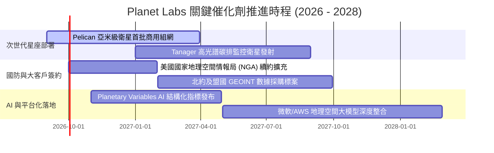

### 9.2 TAM 市場規模分析

```
╔══════════════════════════════════════════════════════════════════╗
║               PL 目標市場規模 (TAM) 與滲透潛力                   ║
╠══════════════════════════════════════════════════════════════════╣
║                                                                  ║
║  傳統衛星影像市場 (國防/測繪):    $5.0B   (當前滲透率 ~5.0%)     ║
║  空間智能與大數據分析 (GEOINT):   $25.0B  (當前滲透率 ~0.8%)     ║
║  氣候轉型、碳盤查與 ESG 監控:     $10.0B  (Tanager 鎖定新市場)   ║
║  ─────────────────────────────────────────────────────────────  ║
║  🌐 總潛在市場空間 (Total TAM)：   $40.0B+                        ║
║  📈 PL 目前 TTM 營收僅 $335.6M，長期滲透率提升空間超過 10 倍     ║
╚══════════════════════════════════════════════════════════════════╝
```

### 9.3 成長驅動力結構圖

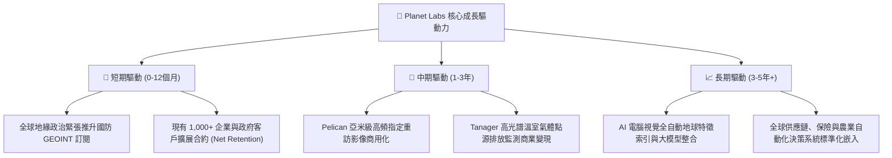

---

## 10. 風險矩陣

### 10.1 風險評分矩陣

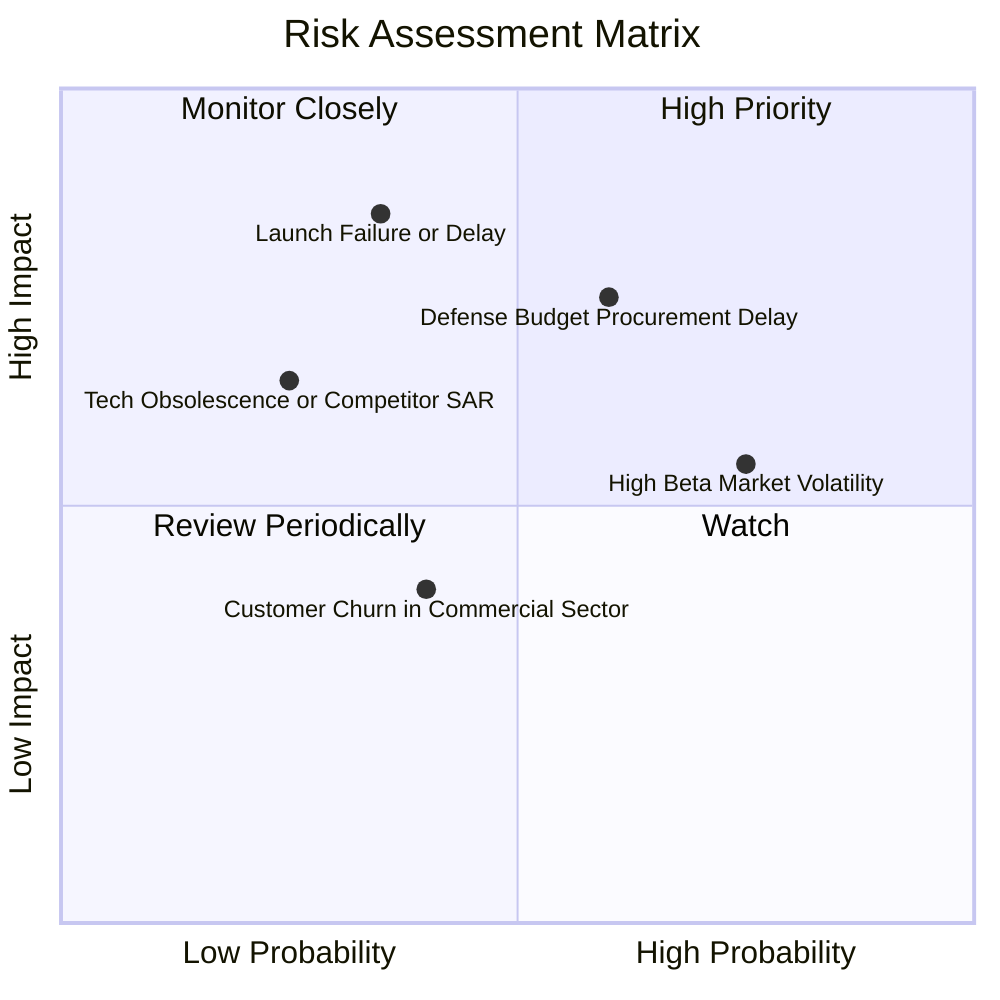

### 10.2 風險清單詳細分析

| # | 風險項目 | 發生機率 | 財務衝擊 | 風險評分 | 緩解與應對措施 |
|---|----------|----------|----------|----------|----------------|
| 1 | 🔴 **政府國防合約採購延遲** | 中偏高 (60%) | 高 (-10% 至 -15% 營收) | 🔴 **8.0/10** | 拓展民用商業客戶群（農業、保險、能源），分散營收集中度。 |
| 2 | 🔴 **火箭發射延遲或入軌失敗** | 中偏低 (35%) | 極高 (推遲產品上市 6-12 個月)| 🔴 **7.5/10** | 採取多發射商策略（SpaceX、Rocket Lab 等多元化投送），衛星具備冗餘設計。 |
| 3 | 🟡 **高 Beta 值與流動性折價** | 高 (75%) | 中 (引發股價 20-30% 回撤) | 🟡 **6.5/10** | 公司持有 $730.84M 高額現金，無實質破產風險，回調提供買入窗口。 |
| 4 | 🟡 **新興雷達(SAR)/高光譜技術競爭**| 低偏中 (25%)| 中高 (-5% 利潤率) | 🟡 **5.5/10** | 自主推進 Tanager 高光譜衛星，並將外部 SAR 數據融合進自身軟體平台。 |

---

## 11. 投資建議

### 11.1 最終綜合評級雷達圖

```
╔══════════════════════════════════════════════════════════════╗
║               PL 投資維度綜合評估雷達                        ║
╠══════════════════════════════════════════════════════════════╣
║                                                              ║
║                數據護城河 [9.0/10]                           ║
║                       /\                                     ║
║                      /  \                                    ║
║  財務流動性 [8.5]   /    \   成長動能 [8.5]                  ║
║           \        /      \        /                         ║
║            \      /   ●    \      /                          ║
║             \    /          \    /                           ║
║              \  /            \  /                            ║
║  估值性價比 [7.5] ------------ 獲利質量 [6.5]                ║
║                                                              ║
║  🏆 綜合投資評分：7.8 / 10 ｜ 評級：🟢 買入 (Buy)            ║
╚══════════════════════════════════════════════════════════════╝
```

### 11.2 目標價與隱含報酬率

| 情境 | 機率 | 核心假設驅動 | 12 個月目標價 | 隱含報酬率 (相對現價 $19.98) |
|------|------|--------------|---------------|------------------------------|
| 🔴 **悲觀情境** | 25% | 營收 CAGR 15%，利潤率收窄至 12%，新星座延遲 | **$16.50** | **-17.4%** |
| 🟡 **基準情境** | **55%** | **營收 CAGR 24.5%，Pelican 商用放量，利潤率 22%** | **$28.58** | **+43.0%** |
| 🟢 **樂觀情境** | 20% | 營收 CAGR 35%，GEOINT 爆發，利潤率達 28% | **$42.00** | **+110.2%** |

### 11.3 買入時機與觸發因素 Checklist

```
╔══════════════════════════════════════════════════════════════════╗
║                  ✅ 投資操作觸發因素 Checklist                  ║
╠══════════════════════════════════════════════════════════════════╣
║                                                                  ║
║  🟢 當前符合之買入觸發條件：                                     ║
║  ✅ 股價自高點回調逾 60%，進入高安全邊際區間 (MOS 30.1%)         ║
║  ✅ 最新季度營收 YoY 增速突破 40% (達 +42.1%)                    ║
║  ✅ 營運現金流與自由現金流實質持續為正                           ║
║  ✅ 帳面淨現金達 $2.43 億美元，抵禦總體流動性緊縮                ║
║                                                                  ║
║  ➕ 後續加碼觸發條件（出現以下任一）：                           ║
║  ☐ Pelican 首批衛星成功入軌並傳回第一階段商用高解析影像          ║
║  ☐ 美國政府或盟國簽署單筆年化金額逾 $5,000 萬美元之長期新合約    ║
║  ☐ 單季 GAAP 營業利益率正式由負轉正                              ║
║                                                                  ║
║  ➖ 停損/減碼觸發條件（出現以下任一）：                          ║
║  ☐ 營收年增率連續兩季跌破 +15%                                   ║
║  ☐ 季度自由現金流 (FCF) 再度持續大幅淨流出超過 -$3,000 萬美元    ║
║  ☐ 股價突破樂觀目標價 $35.00 以上且估值倍數過熱                  ║
╚══════════════════════════════════════════════════════════════════╝
```

### 11.4 投資人適配度分析

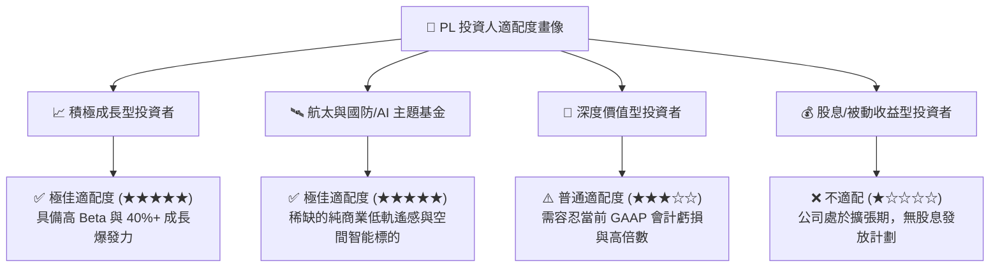

### 11.5 每季財報監控清單（Quarterly Watch List）

| 監控指標項目 | 基準水準 (目前) | 🟢 觸發加碼門檻 | 🔴 觸發減碼/預警門檻 | 追蹤業務意義 |
|--------------|-----------------|-----------------|----------------------|--------------|
| **季度營收 YoY 成長** | +42.1% ($94.15M)| > +35.0% | < +15.0% | 檢驗 GEOINT 與商業訂閱需求強度 |
| **毛利率 (Gross Margin)**| 55.6% | > 58.0% | < 50.0% | 檢驗數據重複銷售之邊際利潤槓桿 |
| **自由現金流 (FCF)** | 轉正 ($84.85M TTM)| 季度 FCF > $10.0M | 連續兩季 FCF < -$15.0M | 監控新星座 Capex 下之自我造血能力 |
| **總客戶數與淨留存率(NDR)**| 1,000+ 客戶 / ~105% | NDR > 115% | NDR < 95% | 評估現有客戶合約擴張（加購高解析度） |
| **現金及短期投資儲備** | $730.84M | 維持 > $500.0M | < $300.0M | 確保具備抗週期與研發儲備底線 |

### 11.6 反面論證：什麼會證明論點錯誤（What Would Change My Mind）

```
╔══════════════════════════════════════════════════════════════════╗
║              ⚠️ 論點失效條件（Disconfirming Evidence）           ║
╠══════════════════════════════════════════════════════════════════╣
║  若發生下列任一情況，本報告之多頭投資邏輯將被證偽，應立即停損：  ║
║                                                                  ║
║  1. 【成長動能衰退】營收年增率連續兩季放緩至 15% 以下，顯示每日   ║
║     監測數據市場需求觸頂或被免費公開開源數據替代。               ║
║                                                                  ║
║  2. 【次世代星座挫敗】Pelican 或 Tanager 星座在軌部署發生系統性   ║
║     硬體瑕疵，導致資本支出化為烏有並產生巨額非現金減損。         ║
║                                                                  ║
║  3. 【自由現金流逆轉】在營收擴大背景下，單季 FCF 重新轉為巨額    ║
║     負流出（淨流出 > 營收 20%），證明單位經濟效益無法改善。      ║
║                                                                  ║
║  4. 【股權嚴重稀釋】SBC 佔營收比重不降反升突破 25%，且公司發行   ║
║     大量低價新股大幅攤薄現有股東內在價值。                       ║
╚══════════════════════════════════════════════════════════════════╝
```

---

> **免責聲明**：本報告為基於客觀財務數據與計量模型生成之機構級研究報告，僅供投資研究參考，不構成任何個別買賣邀約或個人財務建議。市場有風險，投資需謹慎。