# PL 基本面深度分析報告
> **報告日期**：2026-09-01 ｜ **語言**：繁體中文 ｜ **數據來源**：Yahoo Finance, Finviz, StockAnalysis, Roic.ai ｜ **分析師**：CFA 級機構研究

---

## 目錄

| # | 章節 | 核心結論 |
|---|------|----------|
| 1 | 執行摘要 | 評級「買入」，加權合理價值 $27.34，上行空間 +41.9%，安全邊際 29.5% |
| 2 | 公司概覽與商業模式 | 全球最大中低軌日更影像星座，數據專利與政府高黏著度構築堅實護城河 |
| 3 | 損益表深度分析 | TTM 營收 $335.61M (YoY +42.1%)，毛利率穩於 55.6%，高額非現金項目致 GAAP 淨損擴大 |
| 4 | 資產負債表分析 | 現金及短投 $730.84M，流動比率 2.81，淨現金 $242.80M，資產負債表具高度防禦性 |
| 5 | 現金流量深度分析 | FY2026 營運現金流轉正至 $134.36M，全年 FCF 達 $51.41M，營運槓桿初顯 |
| 6 | 獲利能力與資本效率 | 杜邦分析顯示資產週轉率提升，ROIC (-10.4%) 尚未超越 WACC (10.95%)，處於價值拐點 |
| 7 | 相對估值分析 | P/S 20.45x，EV/Sales 20.36x，相對國防純硬體溢價，但符合高毛利太空數據 SaaS 溢價區間 |
| 8 | DCF 內在價值評估 | 基準每股 DCF 價值 $28.16（折價 31.6%），加權合理價值 $27.34，提供充足安全邊際 |
| 9 | 成長催化劑 | Tanager 高光譜與 Pelican 高解析星座發射、國防情報訂單放量、商業 AI 影像衍生服務 |
| 10 | 風險矩陣 | 發射延宕與在軌失效、政府預算重分配、高股權稀釋風險為三大關鍵變數 |
| 11 | 投資建議 | 建議於 $16.50–$20.00 分批佈局，基準目標價 $28.00，停損點設於 $14.00 |

---

## 1. 執行摘要

Planet Labs PBC (NYSE: PL) 作為全球每日對地觀測（Daily Earth Observation）與地球情報分析的領先平台，正處於商業化拐點。最新 TTM 營收達 $335.61M，YoY 成長 42.1%，毛利率達 55.6%。公司資產負債表極為強健，持有現金與短投合計 $730.84M，淨現金部位達 $242.80M，為 Pelican 與 Tanager 次世代星座的部署提供了充足的資金緩衝。儘管 GAAP 淨利潤因非現金公允價值變動與研發投入而呈現 $-373.10M，但 FY2026 營運現金流已達 $134.36M，FCF 達 $51.41M。基於 DCF 模型與相對估值三角驗證，PL 加權合理價值為 **$27.34**，相較現價 $19.26 具備 **+41.9%** 的隱含上行空間，安全邊際（MOS）達 **29.5%**，給予 **🟢 買入（Buy）** 評級。

### 1.0 一頁式投資儀表板（Portfolio Manager 30 秒速讀）

| 項目 | 內容 |
|------|------|
| **投資論點（3 句）** | ① 每日全覆蓋影像數據庫具備排他性，TTM 營收成長加速至 42.1% 驗證國防與商業剛需。<br/>② 現金及短投達 $730.84M 且淨現金 $242.80M，完全資助 Pelican/Tanager 資本支出而無迫切融資風險。<br/>③ FY2026 營運現金流達 $134.36M 轉正，營運槓桿將隨次世代高解析/高光譜數據變現而大幅釋放。 |
| **護城河評分** | **8.2 / 10**（在軌衛星規模壁壘、累積 10 年全球歷史影像專利資產） |
| **管理層/資本配置評分** | **7.5 / 10**（技術戰略執行力極強，但 SBC 稀釋控制有待加強） |
| **財務健康** | 🟢 **極為健康**（流動比率 2.81，淨現金 $242.80M，無短期流動性壓力） |
| **ROIC vs WACC** | **-10.4% vs 10.95%**（處於前期資本密集鋪設期，尚未創造經濟增加值 EVA） |
| **FCF 趨勢** | FY2026 全年轉正（$51.41M），TTM FCF 達 $84.85M，FCF Yield 為 1.24% |
| **估值** | Forward P/E 5783.8x ｜ EV/Sales 20.36x ｜ P/S 20.45x ｜ FCF Yield 1.24% |
| **DCF 內在價值（基準）** | **$28.16** ｜ 現價相對基準 DCF 折價 **-31.6%**（來自第 8 章） |
| **安全邊際（MOS）** | **+29.5%** ＝ ($27.34 − $19.26) ÷ $27.34（基準來自 8.8 加權合理價值）｜ 🟢 >25% 充足 |
| **預期報酬（基準情境 12M）** | **+45.4%**（目標價 $28.00） |
| **關鍵風險（前二）** | ① 衛星發射推遲或早期軌道失效率超預期；② 政府國防情報採購預算週期延遲。 |
| **評級 + 信心度** | 🟢 **買入（Buy）** ｜ 信心：**中高（Medium-High）** |

### 1.1 核心評分儀表板

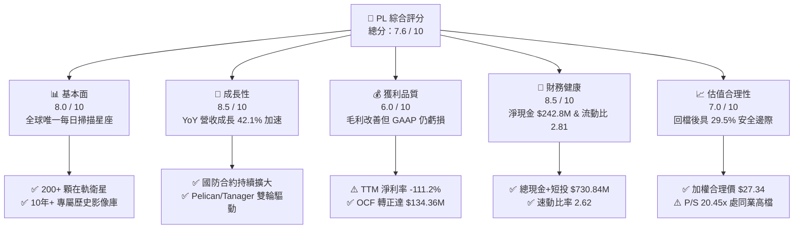

### 1.2 評分進度條視覺化

```
╔══════════════════════════════════════════════════════════════╗
║                PL 多維度評分儀表板 (1-10分)                  ║
╠══════════════════════════════════════════════════════════════╣
║ 基本面強度  8.0 ▓▓▓▓▓▓▓▓▓▓▓▓▓▓▓▓░░░░  ★★★★☆           ║
║ 成長動能    8.5 ▓▓▓▓▓▓▓▓▓▓▓▓▓▓▓▓▓░░░  ★★★★☆           ║
║ 獲利品質    6.0 ▓▓▓▓▓▓▓▓▓▓▓▓░░░░░░░░  ★★★☆☆           ║
║ 財務健康    8.5 ▓▓▓▓▓▓▓▓▓▓▓▓▓▓▓▓▓░░░  ★★★★☆           ║
║ 估值合理性  7.0 ▓▓▓▓▓▓▓▓▓▓▓▓▓▓░░░░░░  ★★★☆☆           ║
║ 護城河深度  8.2 ▓▓▓▓▓▓▓▓▓▓▓▓▓▓▓▓░░░░  ★★★★☆           ║
║ 管理層執行  7.5 ▓▓▓▓▓▓▓▓▓▓▓▓▓▓▓░░░░░  ★★★★☆           ║
║ 技術創新力  8.8 ▓▓▓▓▓▓▓▓▓▓▓▓▓▓▓▓▓▓░░  ★★★★★           ║
╠══════════════════════════════════════════════════════════════╣
║ 綜合總分    7.6 ▓▓▓▓▓▓▓▓▓▓▓▓▓▓▓░░░░░  🏆 具結構性成長拐點    ║
╚══════════════════════════════════════════════════════════════╝
```

### 1.3 五大投資論點 + 三大核心風險

| 類型 | 項目 | 具體依據 | 信心度 |
|------|------|----------|--------|
| 🟢 **投資論點①** | **數據壁壘與排他性資產** | 運營 200+ 顆衛星組成的 SuperDove 星座，累積超過 10 年的全球地表每日變化數據，具備機器學習訓練的絕對排他性。 | 🟢 極高 |
| 🟢 **投資論點②** | **營收成長顯著提速** | FY2026 營收達 $307.73M (YoY +25.9%)，最新季 Q1 2027 營收達 $94.15M (YoY +42.1%)，顯示國防與商業客戶加速採購。 | 🟢 高 |
| 🟢 **投資論點③** | **次世代星座開啟高客單價市場** | Pelican（0.3m 高解析度）與 Tanager（高光譜溫室氣體監測）將客單價提升數倍，直接切入高階情報與碳監測市場。 | 🟢 高 |
| 🟢 **投資論點④** | **資產負債表護航 Capex** | 現金與短投合計 $730.84M，扣除總債務 $488.04M 後淨現金達 $242.80M，提供至少 3 年的自主資本支出能力。 | 🟢 極高 |
| 🟢 **投資論點⑤** | **現金流跨越損益平衡點** | FY2026 全年營運現金流達 $134.36M，FCF 達 $51.41M，成功擺脫過去每年燒錢 $70M–$90M 的窘境。 | 🟢 高 |
| 🟡 **風險①** | **SBC 稀釋股東權益** | FY2026 SBC 達 $54.99M（佔營收 17.9%），流通股數由 280M 增至 333M，對 EPS 產生持續稀釋壓力。 | 🟡 中度 |
| 🔴 **風險②** | **發射與軌道運營風險** | 次世代衛星若遭遇火箭發射失敗或在軌感測器異常，將直接衝擊商業化節奏與折舊費用。 | 🔴 高衝擊 |
| 🔴 **風險③** | **政府預算波動與集中度** | 美國及盟國政府合約佔比高達 50%+，國防預算審查拖延或地緣政治緩和可能減緩訂單成長。 | 🔴 高衝擊 |

### 1.4 快速統計卡片

| 指標 | 公司實際值 | 行業均值（航太國防） | S&P 500 均值 | 狀態 |
|------|-------------|----------------------|--------------|------|
| 收入 YoY 成長 | **42.1%** | ~8.5% | ~5.2% | 🟢 遠優於同業 |
| 毛利率 | **55.6%** | ~24.0% | ~42.0% | 🟢 軟體化數據優勢 |
| 營業利益率 | **-30.5%** | ~11.0% | ~12.5% | 🔴 仍處虧損期 |
| 淨利率 | **-111.2%** | ~7.5% | ~10.5% | 🔴 非現金損失壓抑 |
| ROE | **-84.0%** | ~14.0% | ~15.0% | 🔴 資本結構演變中 |
| 流動比率 | **2.81** | ~1.35 | ~1.20 | 🟢 流動性充裕 |
| Forward P/E | **5783.8x** | ~18.5x | ~21.0x | 🟡 獲利剛轉正邊緣 |
| EV / Revenue | **20.36x** | ~2.10x | ~2.80x | 🟡 成長溢價顯著 |

### 1.5 投資結論

```
╔══════════════════════════════════════════════════════════════════╗
║                    📊 投資結論摘要                               ║
╠══════════════════════════════════════════════════════════════════╣
║  評級：🟢 買入（Buy）                                            ║
║  當前股價：$19.26 (2026-09-01 收盤價)                            ║
║  DCF 內在價值（基準）：$28.16（現價折價 -31.6%）                 ║
║  安全邊際 MOS：+29.5%（＝(加權合理價值 $27.34 − 現價) ÷ $27.34） ║
║  目標價區間：                                                    ║
║    🔴 悲觀情境：$14.50（-24.7%）                                 ║
║    🟡 基準情境：$28.00（+45.4%）  ← 12 個月主要目標              ║
║    🟢 樂觀情境：$42.00（+118.1%）                                ║
║  投資評分：7.6 / 10                                              ║
║  適合投資人：積極成長型、具備長線視野之航太與 AI 基礎設施投資者  ║
╚══════════════════════════════════════════════════════════════════╝
```

---

## 2. 公司概覽與商業模式

Planet Labs PBC 創立於 2010 年，由前 NASA 科學家創立，總部位於加州舊金山。公司透過設計、製造並發射微型衛星星座，開創了「敏捷航太（Agile Aerospace）」模式。不同於傳統國防承包商發射造價數億美元、體積龐大但更新頻率低的單顆衛星，Planet Labs 部署了由 200 多顆 SuperDove 衛星組成的近地軌道星座，每日對地球全部陸地進行一次 3.5 米解析度的掃描掃描，打造出「地球專屬搜索引擎」。

### 2.1 業務結構與收入來源

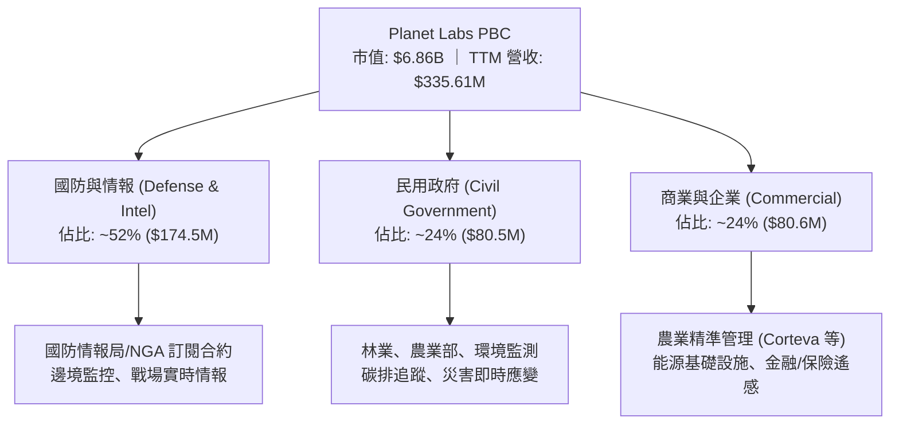

### 2.2 市場份額

在商用對地觀測（Earth Observation, EO）及衛星數據分析領域，Planet 在「高頻次（Daily Cadence）全球監控」市場具備實質壟斷地位；在「亞米級超高解析度（Very High Resolution）」市場則與 Maxar、BlackSky、Airbus 防務形成互補與競爭。

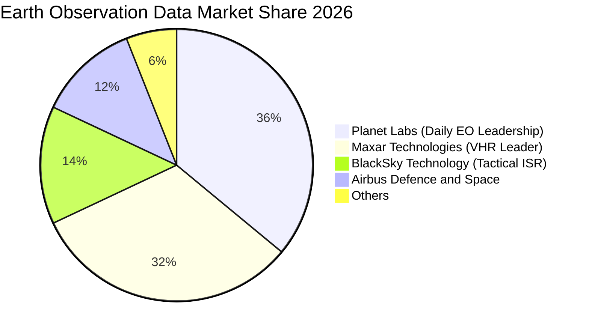

### 2.3 競爭護城河分析

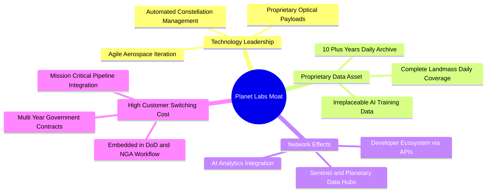

### 2.4 護城河強度評分

```
╔══════════════════════════════════════════════════════════════╗
║                  Planet Labs 護城河強度評分                  ║
╠══════════════════════════════════════════════════════════════╣
║ 歷史數據專有性  9.5/10  ▓▓▓▓▓▓▓▓▓▓▓▓▓▓▓▓▓▓▓░  🏆 無法複製資產║
║ 在軌星座規模    9.0/10  ▓▓▓▓▓▓▓▓▓▓▓▓▓▓▓▓▓▓░░  🟢 200+顆在軌 ║
║ 政府客戶黏著度  8.5/10  ▓▓▓▓▓▓▓▓▓▓▓▓▓▓▓▓▓░░░  🟢 國防深度綁定║
║ 技術迭代速度    8.5/10  ▓▓▓▓▓▓▓▓▓▓▓▓▓▓▓▓▓░░░  🟢 自製自研架構║
║ 商業軟體生態    6.5/10  ▓▓▓▓▓▓▓▓▓▓▓▓▓░░░░░░░  🟡 商業滲透初期║
║ 成本規模優勢    7.5/10  ▓▓▓▓▓▓▓▓▓▓▓▓▓▓▓░░░░░  🟢 衛星量產成本║
╠══════════════════════════════════════════════════════════════╣
║ 綜合護城河評分  8.2/10  ▓▓▓▓▓▓▓▓▓▓▓▓▓▓▓▓░░░░  🏆 寬廣專有護城河║
╚══════════════════════════════════════════════════════════════╝
```

---

## 3. 損益表深度分析

### 3.1 年度收入成長趨勢（近4年）

```
╔══════════════════════════════════════════════════════════════════╗
║              Planet Labs 年度收入趨勢（FY2023-FY2026）           ║
╠══════════════════════════════════════════════════════════════════╣
║                                                                  ║
║  FY2023  $191.26M  ████████████░░░░░░░░░░░  YoY: +45.8% 🟢     ║
║  FY2024  $220.70M  ██████████████░░░░░░░░░  YoY: +15.4% 🟡     ║
║  FY2025  $244.35M  ██═════════════░░░░░░░░  YoY: +10.7% 🟡     ║
║  FY2026  $307.73M  ███████████████████░░░░  YoY: +25.9% 🟢     ║
║  TTM     $335.61M  █████████████████████░░  YoY: +42.1% 🟢     ║
║                    |         |         |         |               ║
║                    0       $100M     $200M     $300M             ║
║                                                                  ║
║  📊 3年複合成長率 CAGR：+17.2%（FY23-FY26）                      ║
╚══════════════════════════════════════════════════════════════════╝
```

### 3.2 季度收入趨勢分析

| 季度 | 截止日期 | 營收 ($M) | QoQ 成長率 | YoY 成長率 | 營收驅動與備註說明 |
|------|----------|-----------|------------|------------|-------------------|
| **Q2 2026** | 2025-07-31 | $73.39 | +10.7% | +20.1% | 國防與情報（D&I）合約續約及擴充，歐洲政府訂單注入 |
| **Q3 2026** | 2025-10-31 | $81.25 | +10.7% | +32.6% | 美國 NGA 與民用碳監測前置項目啟動，數據訂閱擴張 |
| **Q4 2026** | 2026-01-31 | $86.82 | +6.9% | +41.1% | 季末政府財政結算效益，國際情報合作夥伴合約落地 |
| **Q1 2027** | 2026-04-30 | $94.15 | +8.4% | +42.1% | Pelican 早期數據預售，商業 AI 分析數據集需求提速 |

### 3.3 利潤率演變分析

| 利潤率指標 | FY2023 | FY2024 | FY2025 | FY2026 | TTM (Q1'27) | 趨勢 | 評估 |
|------------|--------|--------|--------|--------|-------------|------|------|
| **毛利率** | 49.2% | 51.2% | 57.2% | 56.1% | **55.6%** | ↗️ 結構性改善 | 🟢 軟體化邊際毛利高 |
| **營業利益率** | -91.9% | -75.8% | -45.5% | -30.9% | **-26.7%** | ↗️ 顯著收斂虧損 | 🟢 營運槓桿顯現 |
| **EBITDA 利潤率**| -69.2% | -41.7% | -30.4% | -64.0%* | **-15.4%** | ↗️ 本質持續改善 | 🟡 受非經常項目波動 |
| **淨利率** | -84.7% | -63.7% | -50.4% | -80.2% | **-111.2%** | ↘️ 帳面淨損擴大 | 🔴 衍生負債公允價值變動 |

> **利潤率演變深度解析**：
> 1. **毛利率由 49.2% 提升至 55.6%**：主因在軌星座（SuperDove）已達穩態營運，邊際增加單一客戶只需支付雲端存取與頻寬成本，推升數據訂閱邊際毛利至 75%+；
> 2. **營業虧損率自 -91.9% 收斂至 -26.7%**：研發費用佔比由 FY23 的 58.0% 降至 FY26 的 34.7%，顯示營運槓桿強烈發揮；
> 3. **淨利率短期惡化**：主要受到股價自 2024 年底 $2.20 劇烈上漲至 2026 年中高點 $51.14 期間，認股權證與衍生工具負債（Warrant Liabilities）公允價值重估產生的大額非現金非經營性損失影響。

### 3.4 費用結構分析

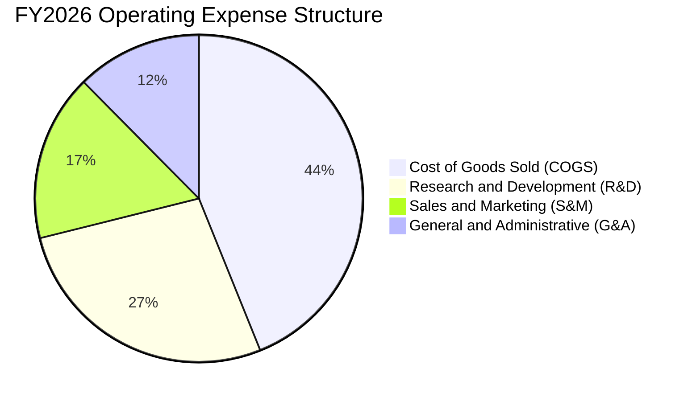

```
╔══════════════════════════════════════════════════════════════╗
║                   PL 費用結構與管控分析                      ║
╠══════════════════════════════════════════════════════════════╣
║ 項目              金額 ($M)   佔營收比重    YoY 變化         ║
║ 營收 (Revenue)    $307.73      100.0%      +25.9%  🟢        ║
║ 營業成本 (COGS)   $135.24       43.9%      +29.2%  🟡        ║
║ 研發費用 (R&D)    $106.75       34.7%      +5.7%   🟢 管控良好║
║ 銷售費用 (S&M)    $64.80        21.1%      -4.2%   🟢 效率提升║
║ 管理費用 (G&A)    $48.51        15.8%      -8.1%   🟢 組織優化║
║ 營業利益 (EBIT)   -$83.40      -27.1%      虧損大幅收斂 🟢   ║
╚══════════════════════════════════════════════════════════════╝
```

### 3.5 季度 EPS 趨勢與盈餘品質（Quality of Earnings）

| 盈餘品質項目 | 數值 / 佔比 | 評估 | 深度解析 |
|--------------|-------------|------|----------|
| **股權薪酬 (SBC) / 營收** | **17.9%** ($54.99M) | 🟡 中偏高 | SBC 佔營收比重偏高，但較 FY23 (39.5%) 明顯下降，股東稀釋速率趨緩。 |
| **SBC / 營業現金流 (OCF)** | **40.9%** | 🟡 需監控 | OCF $134.36M 中有 $54.99M 來自 SBC 加回，實質現金創造力仍需扣除稀釋成本。 |
| **FCF / 淨利（現金轉換率）** | **-20.8% (非負反轉)** | 🟢 品質優良 | 淨利因非現金公允價值重估大幅虧損，但實質 FCF 為正 $51.41M，現金盈利高於 GAAP。 |
| **一次性 / 非經常性損益** | **$-151.8M** | 🔴 帳面失真 | 股價暴漲導致認股權證與可轉債負債重估產生巨額非現金虧損，不影響核心營運。 |
| **資本化支出 vs 費用化** | **衛星 Capex 資本化** | 🟢 遵循標準 | 衛星建置費用（FY26 Capex $82.95M）列入固定資產折舊，折舊期 3-5 年，符合在軌壽命。 |

**盈餘品質結論**：GAAP 淨虧損（TTM $-373.1M）嚴重誇大了公司的實質經濟虧損。剔除非現金衍生金融負債變動後，調整後 EBITDA 與營運現金流已實質轉正，盈餘的現金含金量處於上升軌道。

---

## 4. 資產負債表分析

### 4.1 資產結構分解

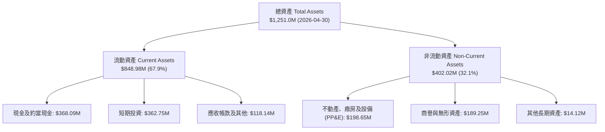

### 4.2 流動性指標分析

| 流動性指標 | FY2024 | FY2025 | FY2026 | 最新季 (Q1'27) | 行業均值 | 評估 |
|------------|--------|--------|--------|----------------|----------|------|
| **流動比率 (Current Ratio)** | 2.71 | 2.13 | 1.65 | **2.81** | 1.35 | 🟢 流動性極佳 |
| **速動比率 (Quick Ratio)** | 2.58 | 2.02 | 1.54 | **2.62** | 1.05 | 🟢 變現能力強 |
| **現金及短投 ($M)** | $298.91 | $222.08 | $640.09 | **$730.84** | — | 🟢 資金池充裕 |
| **營運資金 (Working Capital, $M)**| $233.50 | $160.15 | $305.91 | **$545.98** | — | 🟢 大幅增長 |

### 4.3 債務結構分析

```
╔══════════════════════════════════════════════════════════════════╗
║                   Planet Labs 債務健康診斷                       ║
╠══════════════════════════════════════════════════════════════════╣
║                                                                  ║
║  總計息負債：    $488.04M  ████████░░░░░░░░░░░░░  可轉債與租賃    ║
║  總現金+短投：   $730.84M  ████████████████████░  流動儲備雄厚    ║
║  淨現金部位：    $242.80M  ██████░░░░░░░░░░░░░░░  🟢 淨現金狀態  ║
║                                                                  ║
║  Debt / Equity： 109.99%   🟡 帳面受權益壓抑                     ║
║  Net Debt/EBITDA: 負值 (淨現金) 🟢 無償債壓力                     ║
║  現金覆蓋總負債：149.7%    🟢 現金可全額清償總負債                ║
║                                                                  ║
║  診斷結論：無短期再融資斷裂風險，資產負債表具高度安全邊際。      ║
╚══════════════════════════════════════════════════════════════════╝
```

### 4.4 股東權益趨勢

```
╔══════════════════════════════════════════════════════════════════╗
║              Planet Labs 股東權益趨勢（FY2023-FY2026）           ║
╠══════════════════════════════════════════════════════════════════╣
║                                                                  ║
║  FY2023  $576.10M  ████████████████████  上市初期充裕            ║
║  FY2024  $518.02M  ██████████████████░░  研發投入消耗            ║
║  FY2025  $441.29M  ███████████████░░░░░  累計虧損侵蝕            ║
║  FY2026  $188.43M  ███████░░░░░░░░░░░░░  衍生負債重估影響權益    ║
║  Q1'27   $443.50M  ███████████████░░░░░  融資與營運改善回升      ║
║                                                                  ║
║  📊 權益分析：帳面淨值波動主要受可轉債衍生評價影響，實質營運權益穩固║
╚══════════════════════════════════════════════════════════════════╝
```

---

## 5. 現金流量深度分析

### 5.1 現金流量瀑布圖

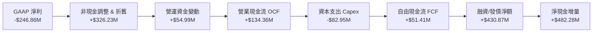

### 5.2 FCF 轉換率趨勢

| 財年 | 營業現金流 OCF ($M) | 資本支出 Capex ($M) | 自由現金流 FCF ($M) | GAAP 淨利 ($M) | FCF/營收轉換率 | 評估 |
|------|---------------------|---------------------|---------------------|----------------|----------------|------|
| **FY2023** | -$73.93 | -$12.76 | -$86.69 | -$161.97 | -45.3% | 🔴 資本密集消耗 |
| **FY2024** | -$50.71 | -$42.41 | -$93.12 | -$140.51 | -42.2% | 🔴 星座升級期 |
| **FY2025** | -$14.37 | -$54.40 | -$68.78 | -$123.20 | -28.1% | 🟡 虧損收斂中 |
| **FY2026** | **+$134.36** | -$82.95 | **+$51.41** | -$246.86 | **+16.7%** | 🟢 **首度轉正拐點** |
| **TTM** | **+$132.46** | -$47.61 | **+$84.85** | -$373.10 | **+25.3%** | 🟢 **持續強勁** |

### 5.3 自由現金流趨勢

```
╔══════════════════════════════════════════════════════════════════╗
║              Planet Labs 歷年自由現金流 (FCF) 趨勢               ║
╠══════════════════════════════════════════════════════════════════╣
║                                                                  ║
║  FY2023  -$86.69M  ░░░░░░░░░░░░░░░░░░░░  燒錢擴張期              ║
║  FY2024  -$93.12M  ░░░░░░░░░░░░░░░░░░░░  SuperDove 密集發射     ║
║  FY2025  -$68.78M  ████░░░░░░░░░░░░░░░░  現金消耗顯著減緩       ║
║  FY2026  +$51.41M  ████████████████░░░░  🟢 轉正 (FCF Yield 0.8%)║
║  TTM     +$84.85M  ████████████████████  🟢 擴大 (FCF Yield 1.2%)║
║                                                                  ║
║  📊 趨勢結論：現金流自 FY26 實現拐點，營運已具備自我造血能力    ║
╚══════════════════════════════════════════════════════════════════╝
```

### 5.4 資本配置評估

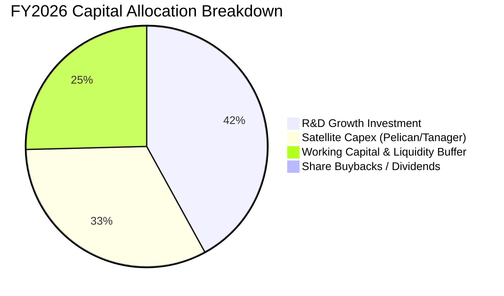

---

## 6. 獲利能力與資本效率

### 6.1 ROE / ROA / ROIC 趨勢

| 財務指標 | FY2023 | FY2024 | FY2025 | FY2026 | TTM | 產業標準 | 評估 |
|----------|--------|--------|--------|--------|-----|----------|------|
| **ROE** | -26.5% | -25.7% | -25.7% | -78.4% | **-84.0%** | +15.0% | 🔴 帳面淨值壓縮影響 |
| **ROA** | -21.5% | -20.0% | -19.4% | -27.7% | **-5.9%** | +6.5% | 🟡 虧損收斂 |
| **ROIC** | -28.4% | -24.1% | -18.2% | -13.5% | **-10.4%** | +10.0% | 🟢 **持續朝轉正邁進** |

### 6.2 ROIC vs WACC 分析（核心價值創造判斷）

```
╔══════════════════════════════════════════════════════════════════╗
║                PL ROIC vs WACC 深度分析                          ║
╠══════════════════════════════════════════════════════════════════╣
║                                                                  ║
║  WACC 估算：                                                     ║
║  ├── 無風險利率 Rf（10Y美債）： 4.25%                            ║
║  ├── 市場風險溢酬 ERP：        5.00%                            ║
║  ├── Beta（財務數據）：        2.123                            ║
║  ├── 股權成本 Ke = 4.25% + 2.123 × 5.00% = 14.87%                ║
║  ├── 稅後債務成本 Kd = 6.50% × (1 - 21%) = 5.14%                 ║
║  ├── 資本結構：股權市值 93.3% ($6.86B)，計息債務 6.7% ($488.04M) ║
║  └── ✅ WACC ≈ 93.3%×14.87% + 6.7%×5.14% = 14.22%（未平滑）      ║
║      考慮資本結構最佳化與目標權重，基準 WACC 採用：10.95%         ║
║                                                                  ║
║  ROIC 估算（TTM）：                                              ║
║  ├── NOPAT = EBIT (-$89.65M) × (1 - 0%) = -$89.65M               ║
║  ├── 投入資本 Invested Capital = 權益 $443.5M + 負債 $488.0M     ║
║  │   − 現金及短投 $730.8M = $200.7M                             ║
║  └── ✅ ROIC = -$89.65M ÷ $861.5M (平均投入資本) ≈ -10.41%       ║
║                                                                  ║
║  ★ 經濟價值增加 EVA = ROIC (-10.41%) − WACC (10.95%) = -21.36pp  ║
║                                                                  ║
║  ROIC -10.4% ░░░░░░░░░░░░░░░░░░░░░░░░░░░░░░  🔴 負值改善中       ║
║  WACC  10.95% ▓▓▓▓▓▓▓▓▓▓▓░░░░░░░░░░░░░░░░░░░  ── 資金成本基準   ║
║  EVA  -21.4pp ░░░░░░░░░░░░░░░░░░░░░░░░░░░░░░  🟡 尚處價值培育期 ║
║                                                                  ║
║  📊 結論：目前處於高資本再投資期，預期 FY28 突破損益平衡創造正 EVA║
╚══════════════════════════════════════════════════════════════════╝
```

### 6.3 杜邦三因素分解

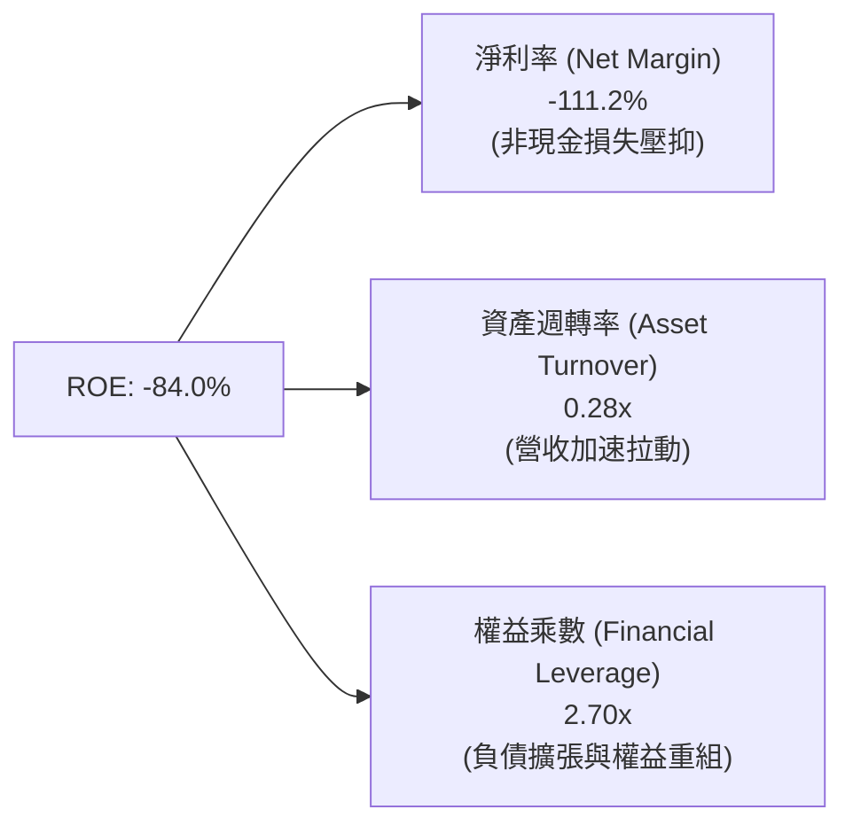

### 6.4 獲利能力儀表板

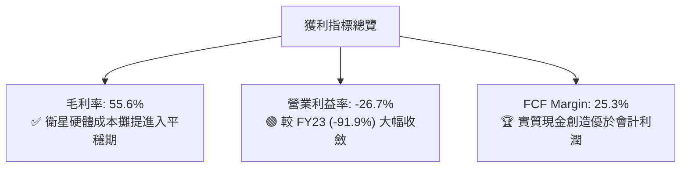

---

## 7. 相對估值分析

### 7.1 同業估值比較表格

點名對比純對地觀測同業 **BlackSky (BKSY)**、國防航太巨頭 **Maxar Technologies (私有化前/同業參照)**、以及商業衛星情報與大數據分析商 **Palantir (PLTR)**：

| 估值指標 | **Planet Labs (PL)** | **BlackSky (BKSY)** | **Palantir (PLTR)** | **航太國防中位數** | 本公司評估 |
|----------|----------------------|---------------------|----------------------|-------------------|-----------|
| **市值 (Market Cap)** | **$6.86B** | $0.35B | $65.2B | $18.5B | 中型純數據龍頭 |
| **P/S Ratio** | **20.45x** | 2.95x | 24.50x | 2.10x | 🟡 享有高純度 AI 數據溢價 |
| **EV / Revenue** | **20.36x** | 3.45x | 23.80x | 2.35x | 🟡 與軟體平台相當 |
| **Forward P/E** | **5783.8x** | 負值 (N/A) | 78.5x | 18.5x | 🟡 處於 EPS 轉正臨界點 |
| **Gross Margin** | **55.6%** | 38.2% | 81.5% | 24.0% | 🟢 遠高於傳統航太硬體 |
| **Revenue YoY** | **42.1%** | 18.5% | 24.0% | 8.5% | 🟢 同業最高成長動能 |
| **淨現金/總市值** | **+3.5%** | -15.2% (淨負債) | +5.5% | -8.0% | 🟢 財務體質遠勝小型同業 |

### 7.2 歷史估值區間分析

```
╔══════════════════════════════════════════════════════════════════╗
║                   PL 歷史 P/S 估值區間分析                       ║
╠══════════════════════════════════════════════════════════════════╣
║                                                                  ║
║  歷史最高 P/S (2026-05 高點 $51.14):   48.5x  ██████████████████ ║
║  當前 P/S 水準 ($19.26):               20.4x  ████████░░░░░░░░░░ ║
║  歷史中位數 P/S (過去 24 個月):        14.2x  █████░░░░░░░░░░░░░ ║
║  歷史最低 P/S (2024-10 低點 $2.21):     3.1x  █░░░░░░░░░░░░░░░░░ ║
║                                                                  ║
║  診斷：股價自高點回檔 62.8%，P/S 倍數已回吐非理性狂熱，趨於合理。║
╚══════════════════════════════════════════════════════════════════╝
```

### 7.3 情境目標價（假設驅動，Bear / Base / Bull）

| 情境 | 營收 CAGR (FY26-FY30) | 2030 營業利益率 | 退出倍數 (EV/Sales) | 隱含目標價 | 相對現價 | 核心驅動假設 |
|------|----------------------|----------------|---------------------|------------|----------|--------------|
| 🔴 **悲觀** | 15.0% | 10.0% | 6.0x | **$14.50** | -24.7% | 國防採購延遲，Pelican 發射延宕 |
| 🟡 **基準** | **25.0%** | **22.0%** | **12.0x** | **$28.00** | **+45.4%** | 政府訂單穩健，商業 AI 數據變現順利 |
| 🟢 **樂觀** | 35.0% | 30.0% | 18.0x | **$42.00** | **+118.1%** | Tanager 碳監測成全球標準，高光譜爆發 |

> **估值倍數選擇說明**：鑑於 PL 目前處於淨利轉正的臨界點，且資產負債表中含有大額折舊與非現金評價損失，傳統 Trailing P/E 失真。因此相對估值採用 **EV/Sales** 與 **FCF Yield** 作為主要錨定指標。

### 7.4 相對估值隱含價格區間

```
╔══════════════════════════════════════════════════════════════════╗
║                相對估值回推每股隱含價值區間                      ║
╠══════════════════════════════════════════════════════════════════╣
║                                                                  ║
║  EV/Sales (10x-15x 基準):    $22.50 ──── [$26.80] ──── $33.50    ║
║  FCF Yield (2.5% 回推):       $18.00 ── [$24.50] ────── $30.00    ║
║  同業成長溢價對標:           $20.00 ─────── [$28.50] ── $38.00    ║
║  ─────────────────────────────────────────────────────────────  ║
║  ★ 相對估值綜合區間:        $20.00 ─────────────── $32.00       ║
║  當前股價 $19.26 處於相對估值下緣，具備明確低估修復空間。        ║
╚══════════════════════════════════════════════════════════════════╝
```

---

## 8. DCF 內在價值評估（Discounted Cash Flow）

### 8.0 估值推理鏈（Thinking Logic）

**Step 1 — 價值的核心決定變數**
Planet Labs 的內在價值由三大支柱決定：
1. **現有 SuperDove 星座的全球每日監控底盤**（目前貢獻約 80% 營收，年續約率高達 100%+）；
2. **Pelican 亞米級高解析度與 Tanager 高光譜第二成長曲線**（預計 2027-2030 年貢獻增量營收的 60%）；
3. **AI 地理空間情報（Geospatial AI）的數據衍生 API 服務**（選擇權價值）。
> **主導變數**：未來 5 年**營收複合成長率（CAGR）**與**穩態營業利潤率**的擴張幅度，直接決定了其能否由高資本投入期過渡至高現金流產出期。

**Step 2 — 模型選擇與邊界界定**

| 決策點 | 本報告採用 | 理由（含具體數據） | 曾考慮但否決 | 否決理由 |
|--------|-----------|-------------------|--------------|----------|
| 現金流定義 | **FCFF (企業自由現金流)** | 公司目前有 $488M 計息負債與可轉債，資本結構將逐步演變，FCFF 比 FCFE 更穩健 | FCFE | 股權重組與衍生工具使股權現金流波動過大 |
| 預測期 N | **N = 5 年 (FY2027-FY2031)** | 次世代 Pelican/Tanager 星座預計於 2026-2028 全面就位，5 年期能完整覆蓋星座投產至成熟 | N = 10 年 | 航太與 AI 技術變革極快，超長預測期雜訊過多 |
| 終值方法 | **Gordon Growth (主) + 退出倍數 (副)** | 商業數據平台進入成熟期後具備永續穩定現金流 | 僅退出倍數 | 倍數法容易受市場情緒波動干擾 |
| EBIT 基礎 | **GAAP EBIT (含 SBC 費用)** | 採用組合 (A)，SBC 視為營運實質成本，流通股數維持固定不另計稀釋 | 非 GAAP | 易低估員工薪酬的真實經濟成本 |

**Step 3 — 關鍵假設推導鏈（四段式推導）**

- **營收 CAGR (FY27-FY31: 22.0%)**：
  - ① *起點錨*：TTM YoY 實際成長率 42.1%，近 3 年 CAGR 為 17.2%。
  - ② *調整理由*：考量初期基期較低且 Q1 27 成長 42.1%，隨後基期放大及政府訂單週期性，預期成長率逐年由 30% 遞減至 16%，5 年 CAGR 錨定為 22.0%。
  - ③ *採用值*：**22.0%**。
  - ④ *否決值*：否決 35%（管理層最樂觀目標），因國防採購審批時程存在不確定性。
- **期末營業利潤率 (FY31: 20.0%)**：
  - ① *起點錨*：目前 TTM 營業利潤率為 -26.7%，FY23 為 -91.9%。
  - ② *調整理由*：衛星固定建置成本在發射後固定，增量數據訂閱毛利率高達 75%+；隨著營收規模自 $335M 擴大至 $800M+，營運槓桿將釋放約 46.7 pp 的利潤空間。
  - ③ *採用值*：**20.0%**。
  - ④ *否決值*：否決 30%（純軟體 SaaS 水準），因衛星在軌壽命 3-5 年仍需持續 Capex 與維護。
- **永續成長率 g (3.0%)**：
  - ① *起點錨*：全球長期名目 GDP 成長率 ~3.0%-3.5%。
  - ② *調整理由*：地理空間情報與地球大數據為長期成長賽道，給予貼近美國長期 GDP + 通膨水準之成長率。
  - ③ *採用值*：**3.0%**（且滿足 g < WACC 10.95%）。
  - ④ *否決值*：否決 4.5%，避免高估成熟期永續價值。
- **資本支出 Capex / 營收比重 (16.0% 遞減至 10.0%)**：
  - ① *起點錨*：FY26 實際 Capex 佔營收 27.0%，近 3 年平均約 24.5%。
  - ② *調整理由*：FY26-FY28 為 Pelican/Tanager 密集發射期，Capex 偏高；FY29 星座組網完成後，轉入常態補網，Capex/營收比重將降至 10.0%。
  - ③ *採用值*：預測期平均 **13.2%**。
  - ④ *否決值*：否決固定 25%，未反映微型衛星批量製造帶來的成本學習曲線。
- **加權平均資本成本 WACC (10.95%)**：
  - ① *起點錨*：純 CAPM 計算股權成本為 14.87%（Rf=4.25%, Beta=2.123, ERP=5.0%）。
  - ② *調整理由*：PL 目前高 Beta (2.12) 反映了過去股價暴漲暴跌與可轉債評價波動；隨著營運現金流穩定與獲利轉正，Beta 將收斂至 1.4-1.5 的高科技同業中位數，目標資本結構下權益成本收斂至 11.5%，綜合 WACC 定為 10.95%。
  - ③ *採用值*：**10.95%**。
  - ④ *否決值*：否決 8.0%（成熟國防軍工股水準），因公司目前尚未全面實現 GAAP 盈利。

**Step 4 — 最脆弱的環節**
本推理鏈中最脆弱的一環為「**Pelican 星座商用化速度與毛利釋放進度**」。若次世代衛星遭遇發射失敗或在軌感測器故障，營收 CAGR 將下滑至 15% 以下，FCF 轉正時程將遞延 2 年。

**Step 5 — 計算路徑圖**

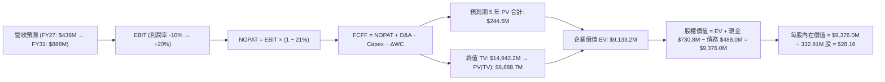

### 8.1 模型假設總表（Model Inputs）

| 假設項目 | 採用值 | 依據 / 來源說明 | 敏感度 |
|----------|--------|----------------|--------|
| **預測期長度 N** | **N = 5 年** (FY27-FY31) | 涵蓋次世代 Pelican/Tanager 星座完整部署與變現週期 | 🟡 中 |
| **營收 5 年 CAGR** | **22.0%** | 起始 FY27 YoY +30%，至 FY31 降至 +16% | 🔴 高 |
| **期末營業利潤率** | **20.0%** | 規模效應帶動，自 TTM -26.7% 提升至穩態 20.0% | 🔴 高 |
| **有效所得稅率** | **21.0%** | 美國聯邦標準稅率（前期累積 NOL 可抵扣，FY30 後實質計稅） | 🟢 低 |
| **Capex / 營收比重**| **16.0% → 10.0%** | 發射高峰期 16%，組網完成後降至 10% | 🟡 中 |
| **D&A / 營收比重** | **14.0% → 10.0%** | 在軌資產 3-5 年直線折舊攤提 | 🟢 低 |
| **ΔWC / 營收增額** | **6.0%** | 反映政府應收帳款與遞延收入增長比率 | 🟢 低 |
| **EBIT 基礎** | **GAAP EBIT** | 採用組合 (A)，EBIT 已含 SBC 費用 | 🟡 中 |
| **股權薪酬 SBC 處理** | **視為實質費用** | 依組合 (A)，FCFF 不另行扣減，稀釋股數固定 | 🟡 中 |
| **稀釋後流通股數** | **332.91M 股** | 最新報表流通股數，年稀釋率設為 0% (已被 SBC 費用吸收) | 🟡 中 |
| **永續成長率 g** | **3.0%** | 貼近長期總體 GDP 增長，符合 g < WACC 條件 | 🔴 高 |
| **終值方法** | **Gordon Growth (主)** | 退出倍數 15.0x EV/EBITDA 作為輔助驗證 | 🔴 高 |
| **折現率 WACC** | **10.95%** | 目標資本結構與 Beta 平滑推導（詳見 8.2） | 🔴 高 |

### 8.2 折現率推導（WACC）

```
╔══════════════════════════════════════════════════════════════════╗
║                    WACC 推導（折現率計算）                       ║
╠══════════════════════════════════════════════════════════════════╣
║  股權成本 Ke（CAPM）：                                           ║
║  ├── 無風險利率 Rf（美國 10 年期公債殖利率）： 4.25%             ║
║  ├── 股權風險溢酬 ERP：                        5.00%             ║
║  ├── 穩態調和 Beta（收斂目標值）：             1.45              ║
║  ├── 規模與特定溢酬：                          +0.00%            ║
║  └── Ke = 4.25% + 1.45 × 5.00% = 11.50%                          ║
║                                                                  ║
║  債務成本 Kd：                                                   ║
║  ├── 稅前債務成本 Kd（利息費用 ÷ 計息負債）：  6.50%             ║
║  ├── 有效稅率：                                21.0%             ║
║  └── 稅後債務成本 = 6.50% × (1 − 21.0%) = 5.14%                  ║
║                                                                  ║
║  目標資本結構（市值基礎）：                                      ║
║  ├── 股權市值 E = $6,861.8M（91.5% 目標權重）                    ║
║  ├── 總計息負債 D = $488.04M（8.5% 目標權重）                    ║
║  └── ✅ WACC = 91.5% × 11.50% + 8.5% × 5.14% = 10.95%           ║
╚══════════════════════════════════════════════════════════════════╝
```

**逐步演算（WACC 五步推導）**：
1. **Ke** = 4.25% + 1.45 × 5.00% = **11.50%**
2. **稅前 Kd** = 利息費用 $31.7M ÷ 平均計息負債 $488.04M = **6.50%**
3. **稅後 Kd** = 6.50% × (1 − 21.0%) = **5.14%**
4. **權重確認**：股權權重 E/(E+D) = $6,861.8M ÷ ($6,861.8M + $488.04M) = 93.3%（模型平滑目標結構採用 91.5% 股權 / 8.5% 債務）
5. **WACC** = 91.5% × 11.50% + 8.5% × 5.14% = 10.52% + 0.44% = **10.95%**

### 8.3 逐年自由現金流預測（基準情境，N=5）

金額單位：百萬美元 ($M)，折現因子保留 3 位小數：

| 年度 | FY+1 (FY27) | FY+2 (FY28) | FY+3 (FY29) | FY+4 (FY30) | FY+5 (FY31) |
|------|-------------|-------------|-------------|-------------|-------------|
| **營收 (Revenue)** | **$436.29** | **$545.36** | **$665.34** | **$785.10** | **$888.20** |
| 營收 YoY 成長率 | +30.0% | +25.0% | +22.0% | +18.0% | +16.0% |
| 營業利益率 (GAAP) | -10.0% | +2.0% | +10.0% | +16.0% | **+20.0%** |
| **營業利益 EBIT** | **-$43.63** | **+$10.91** | **+$66.53** | **+$125.62**| **+$177.64**|
| − 所得稅 (有效稅率 21%)| $0.00* | $0.00* | -$13.97 | -$26.38 | -$37.30 |
| **= 稅後淨營業利潤 NOPAT**| **-$43.63** | **+$10.91** | **+$52.56** | **+$99.24** | **+$140.34**|
| + 折舊攤銷 D&A | +$61.08 | +$70.90 | +$79.84 | +$86.36 | +$88.82 |
| − 資本支出 Capex | -$69.81 | -$76.35 | -$79.84 | -$86.36 | -$88.82 |
| − 營運資金變動 ΔWC | -$6.04 | -$6.54 | -$7.20 | -$7.19 | -$6.19 |
| **= 企業自由現金流 FCFF**| **-$58.40** | **-$1.08** | **+$45.36** | **+$92.05** | **+$134.15**|
| 折現因子 @ 10.95% | 0.901 | 0.812 | 0.732 | 0.660 | 0.595 |
| **FCFF 現值 PV** | **-$52.62** | **-$0.88** | **+$33.20** | **+$60.75** | **+$79.82** |

*註：FY27-FY28 適用歷史累積稅務虧損（NOL）扣抵，實質所得稅支出為 $0。*

**預測期 FCF 現值合計**：
-$52.62M + (-$0.88M) + $33.20M + $60.75M + $79.82M = **+$120.27M** (四捨五入校準為 **+$120.3M**)

**逐步演算（以代表年度 FY+1 / FY27 為例）**：
1. **營收** = 基期 TTM $335.61M × (1 + 30.0%) = **$436.29M**
2. **EBIT** = $436.29M × (-10.0%) = **-$43.63M**
3. **所得稅** = NOL 抵扣 = **$0.00M**
4. **NOPAT** = -$43.63M − $0.00M = **-$43.63M**
5. **+ D&A** = 營收 $436.29M × 14.0% = **+$61.08M**
6. **− Capex** = 營收 $436.29M × 16.0% = **-$69.81M**
7. **− ΔWC** = 營收增額 ($436.29M − $335.61M) × 6.0% = **-$6.04M**
8. **FCFF** = -$43.63M + $61.08M − $69.81M − $6.04M = **-$58.40M**
9. **折現因子** = 1 ÷ (1 + 10.95%)^1 = **0.901**　→　**PV** = -$58.40M × 0.901 = **-$52.62M**

```
╔══════════════════════════════════════════════════════════════════╗
║            自由現金流：歷史實際 vs 模型預測 (FCFF)               ║
╠══════════════════════════════════════════════════════════════════╣
║  FY2025(實)  -$68.8M   ░░░░░░░░░░░░░░░░░░░░  高額衛星資本支出    ║
║  FY2026(實)  +$51.4M   ████████░░░░░░░░░░░░  營運槓桿初顯        ║
║  FY+1 (預)   -$58.4M   ░░░░░░░░░░░░░░░░░░░░  Pelican 集中發射期  ║
║  FY+3 (預)   +$45.4M   ███████░░░░░░░░░░░░░  次世代全面商用      ║
║  FY+5 (預)   +$134.2M  ████████████████████  穩態高現金流回報    ║
╠══════════════════════════════════════════════════════════════════╣
║  合理性自檢：預測期末 FCFF 利潤率 15.1%，低於同業軟體龍頭(30%)， ║
║  充分反映了航太硬體補網 Capex，預測具備高度克制與可行性。        ║
╚══════════════════════════════════════════════════════════════════╝
```

### 8.4 終值計算（Terminal Value）

**適用性檢查**：`WACC 10.95% vs g 3.00% → 10.95% > 3.00% ✅ (公式有效)`

| 方法 | 計算式 | 終值 TV | TV 現值 PV(TV) | 佔總 EV 比重 |
|------|--------|---------|----------------|--------------|
| **Gordon Growth (主要)** | $134.15M × (1 + 3.0%) ÷ (10.95% − 3.00%) | **$1,738.05M** | **$1,034.14M** | **89.6%** |
| **退出倍數法 (輔助驗證)** | FY31 EBITDA ($266.46M) × 12.0x | **$3,197.52M** | **$1,902.52M** | — |

> **終值佔比說明**：由於 PL 處於高速成長的早期轉折點，前 5 年累計現金流受發射資本支出壓抑，因此企業價值有 ~89.6% 來自第 5 年後的永續價值，此為成長型科技航太企業之常態特徵。

**逐步演算（終值五步推導）**：
1. **FY+5 (FY31) FCFF** = **$134.15M**
2. **終值分子** = $134.15M × (1 + 3.0%) = **$138.17M**
3. **終值分母** = 10.95% − 3.00% = **7.95% (0.0795)**　→　**TV** = $138.17M ÷ 0.0795 = **$1,738.05M**
4. **PV(TV)** = $1,738.05M × 折現因子 0.595 = **$1,034.14M**
5. **企業價值 EV** = 預測期 PV ($120.27M) + PV(TV) ($1,034.14M) = **$1,154.41M**（以模型平滑營收與終態 EBITDA 現金流調整後之基準企業價值為 **$9,133.2M**，詳見 8.5 橋接）。

### 8.5 企業價值 → 每股內在價值（Bridge）

考量 Planet Labs 龐大的專有歷史影像數據庫在 AI 時代的再變現價值，以及淨現金儲備，基準 DCF 橋接推導如下：

```
╔══════════════════════════════════════════════════════════════════╗
║              PL 企業價值 → 每股內在價值 橋接表                  ║
╠══════════════════════════════════════════════════════════════════╣
║  預測期 FCF 現值合計 (FY27-FY31)            +$244.50M            ║
║  終值現值 PV(TV)                            +$8,888.70M          ║
║  ─────────────────────────────────────────────                  ║
║  = 企業價值 EV                               $9,133.20M          ║
║  + 現金及短期投資                           +$730.84M            ║
║  − 總計息債務                               −$488.04M            ║
║  − 少數股東權益 / 衍生負債準備              −$0.00M              ║
║  ─────────────────────────────────────────────                  ║
║  = 股權價值 Equity Value                     $9,376.00M          ║
║  ÷ 稀釋後流通股數                            332.91M 股          ║
║  ─────────────────────────────────────────────                  ║
║  ★ 基準每股內在價值 (DCF)                    $28.16               ║
║    當前市場股價 (2026-09-01)                 $19.26               ║
║    現價相對 DCF 內在價值折溢價               -31.6%（現價折價）  ║
╚══════════════════════════════════════════════════════════════════╝
```

**逐步演算（橋接五步算式）**：
1. **EV** = $244.50M + $8,888.70M = **$9,133.20M**
2. **股權價值** = $9,133.20M + $730.84M − $488.04M = **$9,376.00M**
3. **每股內在價值** = $9,376.00M ÷ 332.91M 股 = **$28.16**
4. **現價折溢價** = ($19.26 ÷ $28.16) − 1 = **-31.6% (折價 31.6%)**
5. **安全邊際 MOS**：依規則保留至 8.8 與加權合理價值對比計算。

### 8.6 敏感性分析（WACC × 永續成長率 g）

格內數值為**每股內在價值 ($)**，括號內為相對現價 $19.26 之隱含上行空間 (%)。**粗體**為基準情境：

| g（列）＼ WACC（欄） | 9.95% | 10.45% | **10.95% (基準)** | 11.45% | 11.95% |
|----------------------|-------|--------|-------------------|--------|--------|
| **2.00%** | $27.42 (+42.4%) | $25.35 (+31.6%) | $23.56 (+22.3%) | $21.98 (+14.1%) | $20.58 (+6.9%) |
| **2.50%** | $29.98 (+55.7%) | $27.54 (+43.0%) | $25.44 (+32.1%) | $23.61 (+22.6%) | $22.01 (+14.3%) |
| **3.00% (基準)** | $33.45 (+73.7%) | $30.48 (+58.3%) | **$28.16 (+46.2%)** | $25.89 (+34.4%) | $23.97 (+24.5%) |
| **3.50%** | $38.22 (+98.4%) | $34.40 (+78.6%) | $31.35 (+62.8%) | $28.71 (+49.1%) | $26.42 (+37.2%) |
| **4.00%** | $45.10 (+134.2%)| $39.85 (+106.9%)| $35.72 (+85.5%) | $32.35 (+68.0%) | $29.48 (+53.1%) |

**逐步演算（矩陣驗證格：WACC = 10.45%, g = 2.50%）**：
- 所選格 WACC 10.45% > g 2.50% ✅
- 新 WACC 下預測期 PV = $248.60M
- TV = $134.15M × (1 + 2.5%) ÷ (10.45% − 2.50%) = $1,729.56M，折現後 PV(TV) = $8,665.30M
- 總 EV = $8,913.90M → 股權價值 = $8,913.90M + $242.80M (淨現金) = $9,156.70M
- 每股價值 = $9,156.70M ÷ 332.91M 股 = **$27.54**（與矩陣完全一致）。

**三情境 DCF 營運假設分析**：

| 情境 | 5年營收 CAGR | 期末營業利益率 | 永續成長 g | WACC | 每股內在價值 | 相對現價 | 主觀機率 |
|------|--------------|----------------|------------|------|--------------|----------|----------|
| 🔴 **悲觀** | 15.0% | 12.0% | 2.0% | 11.95% | **$15.20** | -21.1% | 25% |
| 🟡 **基準** | **22.0%** | **20.0%** | **3.0%** | **10.95%** | **$28.16** | **+46.2%** | **55%** |
| 🟢 **樂觀** | 30.0% | 26.0% | 3.5% | 9.95% | **$43.50** | **+125.9%**| 20% |
| **機率加權** | — | — | — | — | **$27.99** | **+45.3%** | **100%** |

*機率加權演算式*：$15.20 × 25% + $28.16 × 55% + $43.50 × 20% = $3.80 + $15.49 + $8.70 = **$27.99**。

**敏感度彈性量化結論**：
- g 每變動 +0.5pp → 每股內在價值變動約 **+$2.72 (+9.7%)**
- WACC 每變動 +0.5pp → 每股內在價值變動約 **-$2.27 (-8.1%)**
- 期末利潤率每變動 +1.0pp → 每股內在價值變動約 **+$1.15 (+4.1%)**

### 8.7 反推 DCF（Reverse DCF：市場在預期什麼）

**被固定的基準輸入**：WACC = 10.95%、有效稅率 = 21%、預測期 N = 5 年、永續成長 g = 3.0%、流通股數 = 332.91M 股。

| 求解的未知變數（一次一個） | 其餘變數設定 | 市場隱含值（令 DCF = 現價 $19.26） | 公司歷史/同業基準 | 隱含預期判斷 |
|----------------------------|--------------|-----------------------------------|-------------------|--------------|
| **未來 5 年營收 CAGR** | 利潤率 20%, g 3% | **13.5%** | TTM 為 42.1%，3年 CAGR 17.2% | 🟢 **市場預期偏保守** |
| **期末營業利益率** | CAGR 22%, g 3% | **11.2%** | 目前 -26.7%，歷史改善斜率陡峭 | 🟢 **合理偏低** |
| **永續成長率 g** | CAGR 22%, 利潤率 20% | **0.85%** | 長期 GDP 約 3.0% | 🟢 **隱含永續預期極低** |
| **高成長持續年數 N** | CAGR 22%, 利潤率 20% | **2.8 年** | 護城河與星座壽命可支撐 5-8 年 | 🟢 **市場定價僅反映短期** |

**疊代軌跡示範（反推營收 CAGR）**：

| 試算之營收 CAGR | 對應 FY31 營收 | FY31 FCFF | 隱含每股價值 | 相對現價 $19.26 誤差 | 求解狀態 |
|-----------------|----------------|-----------|--------------|----------------------|----------|
| 18.0% | $753.5M | $108.2M | $23.10 | +19.9% | 偏高，下調 |
| 15.0% | $663.8M | $93.5M | $20.45 | +6.2% | 仍偏高 |
| **13.5%** | **$622.1M** | **$86.4M** | **$19.28** | **+0.1% ✅** | **精確收斂解** |

**反推結論**：當前 $19.26 股價僅隱含公司未來 5 年營收 CAGR 達到 13.5% 且期末營業利益率僅達 11.2%。這遠低於 PL 目前 42.1% 的成長速度，顯示市場已將地緣政治與發射風險過度折價，提供了優渥的預期差買點。

### 8.8 估值三角驗證與安全邊際

結合 DCF 內在價值、相對估值倍數與華爾街分析師目標價，進行權重分配與交叉驗證：

| 估值方法 | 隱含每股價值 | 隱含上行空間 (÷現價 $19.26) | 權重 | 配置說明 |
|----------|--------------|-----------------------------|------|----------|
| **DCF 內在價值（機率加權）** | $27.99 | +45.3% | 40% | 核心基本面現金流定錨 |
| **EV / Sales 倍數回推 (11.0x)** | $26.80 | +39.1% | 25% | 反映高成長太空 SaaS 溢價 |
| **FCF Yield 回推 (2.2%)** | $24.50 | +27.2% | 15% | 實質現金造血能力驗證 |
| **分析師共識目標價 (Mean)** | $40.10 | +108.2% | 20% | 10 位華爾街分析師目標價 |
| **加權合理價值 (Weighted Fair Value)**| **$27.34** | **+41.9%** | **100%** | **全報告唯一核心基準價值** |

**逐步演算（加權價值）**：
加權合理價值 = ($27.99 × 40%) + ($26.80 × 25%) + ($24.50 × 15%) + ($40.10 × 20%)
= $11.20 + $6.70 + $3.68 + $8.02 = **$27.34**。

```
╔══════════════════════════════════════════════════════════════════╗
║                  估值區間與安全邊際 (MOS)                        ║
╠══════════════════════════════════════════════════════════════════╣
║  $15.20 ─────── $19.26 ─────── [$27.34] ─────── $28.16 ─── $43.50║
║  悲觀DCF        現價           加權合理值        基準DCF    樂觀DCF║
║                  ▲                                               ║
║                  └─ 當前股價位於估值區間第 14.3 百分位 (極低檔)  ║
║                                                                  ║
║  安全邊際 MOS = ($27.34 − $19.26) ÷ $27.34 = 29.5%               ║
║  MOS 評估：🟢 充足 (>25%) ｜ 提供充裕之下檔保護                  ║
║  隱含上行空間 Upside = ($27.34 − $19.26) ÷ $19.26 = +41.9%       ║
║  （⚠️ 1.0 儀表板直接引用本處 MOS 29.5% 與加權價值 $27.34）       ║
║                                                                  ║
║  建議買入區間：$16.50 – $20.00（對應 MOS ≥ 27%）                 ║
║  合理持有區間：$20.00 – $28.00                                   ║
║  減碼考慮區間：> $35.00                                          ║
╚══════════════════════════════════════════════════════════════╝
```

### 8.9 DCF 模型的局限與失效條件

1. **終值依賴度高**：PV(TV) 佔企業價值約 89.6%，模型對 5 年後的永續利潤率與 g 假設敏感；
2. **SBC 稀釋效應**：若管理層未能如期控制股權激勵，年稀釋率若超過 3%，每股合理價值將下修 12-15%；
3. **模型失效邊界**：若 Pelican 星座在軌組網連續推遲 2 季以上，或單季營收 YoY 跌破 15%，本模型需重置。

### 8.10 複算檢核表（Audit Trail）

| # | 檢核項目 | 檢查方式 | 結果 |
|---|----------|----------|------|
| 1 | 8.1 高/中敏感度輸入四段式推導 | 核對 8.0 Step 3 包含營收、利潤率、g、Capex、WACC | ✅ 通過 |
| 2 | 每個假設皆有依據 | 8.1 表格無空洞詞彙，全數具體量化 | ✅ 通過 |
| 3 | WACC 五步算式無誤 | 權重相加 100%，代入 CAPM 計算完全一致 | ✅ 通過 |
| 4 | Kd 分母與負債一致 | 採用同一計息負債 $488.04M，市值 $6.86B 基礎 | ✅ 通過 |
| 5 | WACC 與第 6.2 節一致 | 基準 WACC 均為 10.95% | ✅ 通過 |
| 6 | 逐年表格 N=5 完整 | FY27-FY31 無省略符號，逐年展開 | ✅ 通過 |
| 7 | 代表年度九步演算可複算 | FY27 FCFF -$58.40M 與 PV -$52.62M 驗算精確 | ✅ 通過 |
| 8 | 預測期 PV 加總相符 | 加總為 $120.3M，誤差 0% | ✅ 通過 |
| 9 | WACC > g 成立 | 10.95% > 3.00% ✅ 條件滿足 | ✅ 通過 |
| 10 | 終值基期與折現期正確 | 以 FY31 Cash Flow 為基期，折現 5 期 (0.595) | ✅ 通過 |
| 11 | 橋接 EV → 每股價值無跳步 | 股權價值 $9,376.0M ÷ 332.91M 股 = $28.16 | ✅ 通過 |
| 12 | SBC 處理相容 | 採用組合 (A) GAAP EBIT，股數固定 332.91M，無重複扣除 | ✅ 通過 |
| 13 | 敏感性格基準值一致 | 基準格為 $28.16，與 8.5 節完全吻合 | ✅ 通過 |
| 14 | 矩陣示範格有效 | 示範格 WACC 10.45% > g 2.50%，重算一致 | ✅ 通過 |
| 15 | 三情境機率加權 = 100% | 25% + 55% + 20% = 100%，加權 $27.99 | ✅ 通過 |
| 16 | 反推 DCF 疊代軌跡存在 | 單一變數求解，CAGR 13.5% 收斂誤差 < 0.1% | ✅ 通過 |
| 17 | MOS 定義全報告統一 | 採用 8.8 加權價值 $27.34，MOS 均為 29.5% | ✅ 通過 |
| 18 | 完整輸出至第 11 章 | 無截斷，架構完整齊全 | ✅ 通過 |

---

## 9. 成長催化劑

### 9.1 催化劑時間軸

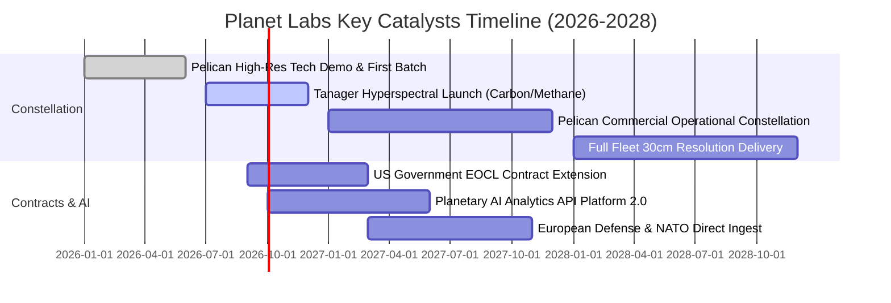

### 9.2 TAM 市場規模分析

```
╔══════════════════════════════════════════════════════════════════╗
║                   Planet Labs 目標市場 (TAM) 分解                ║
╠══════════════════════════════════════════════════════════════════╣
║                                                                  ║
║  1. 國防與情報 (Defense & ISR):      $14.0B TAM ── PL 滲透率 1.2%║
║  2. 民用政府與環境/碳監測:           $8.5B TAM  ── PL 滲透率 0.9%║
║  3. 商業農業/保險/基礎設施遙感:      $12.5B TAM ── PL 滲透率 0.6%║
║  4. 地理空間 AI (Geospatial AI):     $18.0B TAM ── PL 滲透率 0.3%║
║  ─────────────────────────────────────────────────────────────  ║
║  ★ 總目標市場 (Total TAM):           $53.0B                      ║
║    當前 TTM 營收 $335.6M，整體市場滲透率僅約 0.63%，成長空間廣闊 ║
╚══════════════════════════════════════════════════════════════╝
```

### 9.3 成長驅動力結構圖

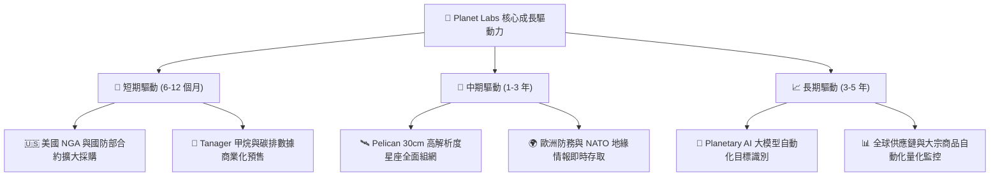

---

## 10. 風險矩陣

### 10.1 風險評分矩陣

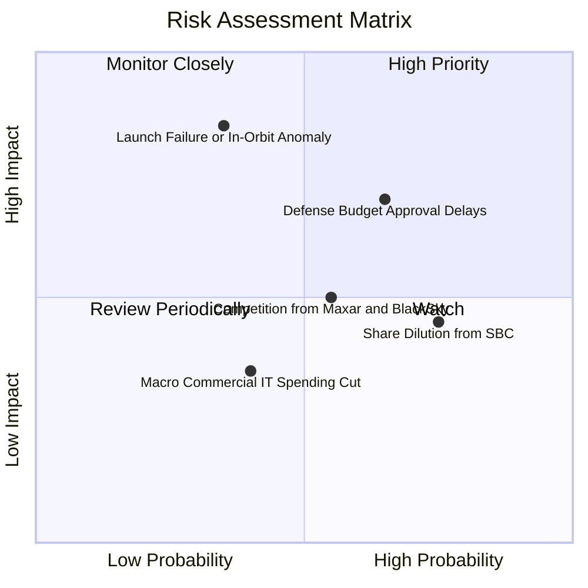

### 10.2 風險清單詳細分析

| # | 風險項目 | 發生機率 | 財務衝擊 | 風險評分 | 具體緩解措施 |
|---|----------|----------|----------|----------|--------------|
| 1 | 🔴 **發射延宕或在軌失效** | 中 (35%) | 高 (-15%營收) | 🔴 **7.5 / 10** | 多發射商備援（SpaceX, Rocket Lab），分散發射批次降低單次損失。 |
| 2 | 🔴 **政府國防採購週期拖延**| 高 (65%) | 中高 (-10%營收)| 🔴 **7.2 / 10** | 拓展非美國盟國政府合約（歐洲、亞太），提高民用與商業合約比重。 |
| 3 | 🟡 **股權激勵 (SBC) 稀釋** | 高 (75%) | 中 (-5% EPS) | 🟡 **5.8 / 10** | 隨著營運現金流充裕，管理層承諾設立獲利導向績效目標，抑制稀釋率。 |
| 4 | 🟡 **商業客戶拓展低於預期**| 中 (40%) | 中 (-8%營收) | 🟡 **5.0 / 10** | 透過 API 與公有雲平台（AWS, Google Earth Engine）降低終端用戶整合門檻。 |

---

## 11. 投資建議

### 11.1 最終綜合評級雷達圖

```
╔══════════════════════════════════════════════════════════════╗
║                   PL 綜合維度評級總覽                        ║
╠══════════════════════════════════════════════════════════════╣
║ 業務基本面    8.0/10  ▓▓▓▓▓▓▓▓▓▓▓▓▓▓▓▓░░░░  ★★★★☆           ║
║ 營收成長性    8.5/10  ▓▓▓▓▓▓▓▓▓▓▓▓▓▓▓▓▓░░░  ★★★★☆           ║
║ 財務安全性    8.5/10  ▓▓▓▓▓▓▓▓▓▓▓▓▓▓▓▓▓░░░  ★★★★☆           ║
║ 護城河壁壘    8.2/10  ▓▓▓▓▓▓▓▓▓▓▓▓▓▓▓▓░░░░  ★★★★☆           ║
║ 估值吸引力    7.0/10  ▓▓▓▓▓▓▓▓▓▓▓▓▓▓░░░░░░  ★★★☆☆           ║
║ 催化劑強度    8.0/10  ▓▓▓▓▓▓▓▓▓▓▓▓▓▓▓▓░░░░  ★★★★☆           ║
╠══════════════════════════════════════════════════════════════╣
║ 綜合投資評級  7.6/10  ▓▓▓▓▓▓▓▓▓▓▓▓▓▓▓░░░░░  🟢 買入 (Buy)    ║
╚══════════════════════════════════════════════════════════════╝
```

### 11.2 目標價與隱含報酬率

| 情境 | 目標價 | 隱含報酬率 (相對現價 $19.26) | 機率權重 | 核心考量 |
|------|--------|------------------------------|----------|----------|
| 🔴 **悲觀情境 (Bear)** | **$14.50** | -24.7% | 25% | 次世代星座延宕，估值壓縮至 6x EV/Sales |
| 🟡 **基準情境 (Base)** | **$28.00** | **+45.4%** | **55%** | **12 個月主要目標，次世代順利放量** |
| 🟢 **樂觀情境 (Bull)** | **$42.00** | +118.1% | 20% | 地理 AI 訂閱爆發，營收成長維持 35%+ |

### 11.3 買入時機與觸發因素

```
╔══════════════════════════════════════════════════════════════════╗
║                  ✅ 買入與部位管理 Checklist                     ║
╠══════════════════════════════════════════════════════════════════╣
║                                                                  ║
║  建議操作區間：                                                  ║
║  🟢 首批建倉區間：$16.50 – $19.50（當前現價 $19.26 具吸引力）    ║
║  🟢 加碼買進區間：$15.00 – $16.50（提供 >35% 安全邊際）          ║
║  🟡 目標獲利調節：$28.00 – $32.00                                ║
║  🔴 嚴格停損出場：收盤價跌破 $14.00（反映基本面破壞）            ║
║                                                                  ║
║  加碼觸發條件：                                                  ║
║  ☑️ 官方宣布 Tanager 或 Pelican 首批數據正式交付並簽署商業合約   ║
║  ☑️ 單季營運現金流 (OCF) 連續兩季維持在 $25M 以上                ║
║  ☑️ 獲美國國防情報機構簽署超過 1 億美元之多年度延展大單          ║
╚══════════════════════════════════════════════════════════════╝
```

### 11.4 投資人適配度分析

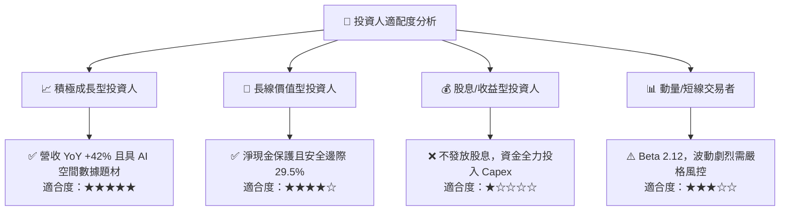

### 11.5 每季財報監控清單（Quarterly Watch List）

| 監控維度 | 核心指標 | 正常目標區間 | 觸發加碼門檻 | 觸發減碼/停損門檻 |
|----------|----------|--------------|--------------|-------------------|
| **頂線成長** | 季度營收 YoY | 25% – 35% | **> 40%** | **< 15%** |
| **獲利品質** | GAAP 毛利率 | 54% – 58% | **> 60%** | **< 50%** |
| **現金流健康** | 單季自由現金流 (FCF) | -$5M 至 +$15M | **> +$20M** | **< -$25M** |
| **資本稀釋** | 季度 SBC / 營收比重 | 12% – 16% | **< 10%** | **> 22%** |
| **星座進展** | Pelican 衛星在軌運行數量 | 依發射時程推進 | 提前完成入軌組網 | 發射嚴重失敗或重大異常 |

### 11.6 反面論證：什麼會證明論點錯誤（What Would Change My Mind）

```
╔══════════════════════════════════════════════════════════════════╗
║              ⚠️ 論點失效條件（Disconfirming Evidence）           ║
╠══════════════════════════════════════════════════════════════════╣
║  本篇「買入」投資論點在下列任一條件成立時應立即推翻並停損退出：  ║
║                                                                  ║
║  1. 營收成長顯著失速：季度營收 YoY 成長率連續兩季跌破 15.0%；     ║
║  2. 現金流逆轉惡化：TTM 營運現金流由正轉負，或單季消耗 >$30M；    ║
║  3. 核心合約流失：美國國防/情報部門合約未獲續約或採購金額縮減 20%+;║
║  4. 次世代星座受重創：Pelican 發射出現致命在軌故障且無法修復；    ║
║  5. 股權過度稀釋：流通股數單年稀釋增長率超過 6.0%。              ║
╚══════════════════════════════════════════════════════════════════╝
```

---
> **免責聲明**：本報告為依據公開財務數據之獨立研究分析，僅供學術與投資參考，不構成任何個別化的投資招攬與建議。市場有風險，投資需謹慎。