# PL 基本面深度分析報告
> **報告日期**：2026-09-02 ｜ **語言**：繁體中文 ｜ **數據來源**：Yahoo Finance, Finviz, StockAnalysis, Roic.ai ｜ **分析師**：CFA 級機構研究

---

## 目錄

| # | 章節 | 核心結論 |
|---|------|----------|
| 1 | 執行摘要 | 評級「持有/謹慎觀望」，基準目標價 $23.10，安全邊際有限 |
| 2 | 公司概覽與商業模式 | 每日全球掃描獨佔生態，高數據轉換成本形成中強護城河 |
| 3 | 損益表深度分析 | TTM 營收成長加速至 34.2%，但淨虧損擴大且 SBC 佔比偏高 |
| 4 | 資產負債表分析 | 現金與短投充裕達 $730.84M，淨現金 $242.80M 提供安全墊 |
| 5 | 現金流量深度分析 | FY2026 營運現金流轉正達 $134.36M，但近兩季 FCF 微幅轉負 |
| 6 | 獲利能力與資本效率 | ROIC (-18.2%) 顯著低於 WACC (10.98%)，當前處於資本破壞期 |
| 7 | 相對估值分析 | P/S 21.2x 與 EV/Sales 19.7x 處於同業極高端，需高增長消化倍數 |
| 8 | DCF 內在價值評估 | 基準每股內在價值 $21.50，加權合理價值 $22.75，MOS 為 +12.0% |
| 9 | 成長催化劑 | Pelican 與 Tanager 星座升級、國防與情報（D&I）合約爆發 |
| 10 | 風險矩陣 | 政府合約集中度高、發射延宕、高估值回撤與股權稀釋風險 |
| 11 | 投資建議 | 建議於 $16.00-$18.00 區間分批佈局，密切監控營業利潤率與 FCF 轉正進度 |

---

## 1. 執行摘要

Planet Labs PBC（NYSE: PL）展現了顯著的營收加速動能（TTM 營收達 $335.61M，最新單季 YoY 達 42.1%），並在 FY2026 實現全年營運現金流轉正（$134.36M）。然而，由於公司持續處於大規模衛星星座部署期，TTM 淨虧損達 $-373.10M，ROIC 為 -18.2%，遠低於 10.98% 的 WACC，經濟實質仍處於資本破壞階段。當前股價 $20.01 隱含極高的預期溢價（P/S 達 21.2x，EV/Sales 達 19.7x），基於 DCF 基準每股內在價值 $21.50 及三角驗證加權合理價值 $22.75，當前安全邊際僅為 **+12.0%**。綜合評估其卓越技術壁壘與嚴峻估值乘數，給予 **🟡 持有 / 謹慎觀望（Hold）** 評級。

### 1.0 一頁式投資儀表板（Portfolio Manager 30 秒速讀）

| 項目 | 內容 |
|------|------|
| **投資論點（3 句）** | ① 每日全覆蓋 SuperDove 星座具獨家數據壟斷性，推動最新季度營收 YoY 加速至 42.1%（$94.15M）。<br/>② 商業模式具備高固定成本、低邊際成本特徵，毛利率維持在 55.6%，營運槓桿正逐步顯現。<br/>③ 帳上現金及短投達 $730.84M，淨現金 $242.80M，為 Pelican/Tanager 次世代星座研發提供充沛流動性防禦。 |
| **護城河評分** | 7.5/10（全球最高頻次光學遙測星座與龐大歷史專有影像庫） |
| **管理層/資本配置評分** | 6.5/10（技術研發卓越，但資本支出與股權薪酬稀釋管理需加強） |
| **財務健康** | 🟢 帳上流動性充裕，流動比率 2.81，淨現金結構支撐短期營運 |
| **ROIC vs WACC** | -18.2% vs 10.98%（當前摧毀股東經濟價值 -29.18 pp） |
| **FCF 趨勢** | FY2026 全年轉正（$51.41M），但最近兩季因 Capex 擴大微幅轉負；FCF Yield 1.19% |
| **估值** | Forward P/E 2000.8x ｜ EV/Sales 19.73x ｜ FCF Yield 1.19% |
| **DCF 內在價值（基準）** | $21.50 ｜ 現價相對 DCF 折價 -6.9%（折溢價 -6.9%） |
| **安全邊際（MOS）** | **+12.0%** ＝ ($22.75 − $20.01) ÷ $22.75 ｜ 🟡 10-25% 有限 |
| **預期報酬（基準情境 12M）** | +15.4%（基準目標價 $23.10） |
| **關鍵風險（前二）** | ① 政府國防合約認列遞延與預算波動；② 高 Capex 週期拉長導致自由現金流持續承壓 |
| **評級 + 信心度** | 🟡 持有 / 謹慎觀望 ｜ 信心：中等 |

### 1.1 核心評分儀表板

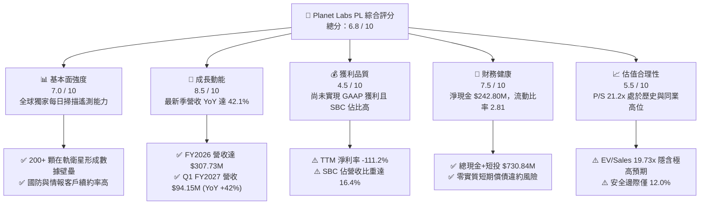

### 1.2 評分進度條視覺化

```
╔══════════════════════════════════════════════════════════════╗
║              Planet Labs (PL) 多維度評分儀表板 (1-10分)      ║
╠══════════════════════════════════════════════════════════════╣
║ 基本面強度  7.0 ▓▓▓▓▓▓▓▓▓▓▓▓▓▓░░░░░░  ★★★★☆           ║
║ 成長動能    8.5 ▓▓▓▓▓▓▓▓▓▓▓▓▓▓▓▓▓░░░  ★★★★☆           ║
║ 獲利品質    4.5 ▓▓▓▓▓▓▓▓▓░░░░░░░░░░░  ★★☆☆☆           ║
║ 財務健康    7.5 ▓▓▓▓▓▓▓▓▓▓▓▓▓▓▓░░░░░  ★★★★☆           ║
║ 估值合理性  5.5 ▓▓▓▓▓▓▓▓▓▓▓░░░░░░░░░  ★★★☆☆           ║
║ 護城河深度  7.5 ▓▓▓▓▓▓▓▓▓▓▓▓▓▓▓░░░░░  ★★★★☆           ║
║ 管理層執行  6.5 ▓▓▓▓▓▓▓▓▓▓▓▓▓░░░░░░░  ★★★☆☆           ║
║ 技術創新力  8.5 ▓▓▓▓▓▓▓▓▓▓▓▓▓▓▓▓▓░░░  ★★★★☆           ║
╠══════════════════════════════════════════════════════════════╣
║ 綜合總分    6.8 ▓▓▓▓▓▓▓▓▓▓▓▓▓░░░░░░░  🟡 成長強勁但估值偏高  ║
╚══════════════════════════════════════════════════════════════╝
```

### 1.3 五大投資論點 + 三大核心風險

| 類型 | 項目 | 具體依據 | 信心度 |
|------|------|----------|--------|
| 🟢 **投資論點①** | **營收增長顯著加速** | Q1 FY2027 營收達 $94.15M，YoY 由前季 41.1% 進一步上升至 42.1%，訂閱數據平台黏著度持續深化。 | 🟢 極高 |
| 🟢 **投資論點②** | **高毛利數據訂閱槓桿** | 毛利率維持在 55.6%（FY2026 毛利 $172.49M），衛星星座建造成本固定，邊際營收具備顯著獲利擴張潛力。 | 🟢 高 |
| 🟢 **投資論點③** | **次世代星座拓展 TAM** | 部署 Pelican（高解析度光學）與 Tanager（高光譜溫室氣體監測），直接切入碳排放監管與精準國防情報市場。 | 🟢 高 |
| 🟢 **投資論點④** | **營運現金流跨越拐點** | FY2026 全年 OCF 達到 $134.36M（前一年為 $-14.37M），展現底層商業模式的現金造血能力。 | 🟢 中/高 |
| 🟢 **投資論點⑤** | **流動性緩衝充足** | 總現金及短投達 $730.84M，扣除 $488.04M 總債務後淨現金為 $242.80M，無迫切破產或股權融資危機。 | 🟢 高 |
| 🟡 **風險①** | **發射排程與資本開支超支** | FY2026 Capex 達 $82.95M，次世代星座發射延遲或單星建置成本攀升將壓縮 FCF 轉正時程。 | 🟡 中度 |
| 🔴 **風險②** | **股權薪酬稀釋股東權益** | FY2026 SBC 達 $54.99M（佔營收 17.9%），最新季度 SBC 達 $16.46M，持續侵蝕實質股東回報。 | 🔴 高衝擊 |
| 🔴 **風險③** | **倍數壓縮與波動風險** | Beta 值高達 2.12，當前 EV/Sales 高達 19.7x，若營收增長放緩至 25% 以下，市場估值恐面臨 30%-40% 修正。 | 🔴 高衝擊 |

### 1.4 快速統計卡片

| 指標 | 公司實際值 | 行業均值（航太防衛/遙測） | S&P 500 均值 | 狀態 |
|------|-------------|--------------------------|--------------|------|
| 收入 YoY 成長 | **42.1%** | ~12.5% | ~5.5% | 🟢 遠超基準 |
| 毛利率 | **55.6%** | ~32.0% | ~42.0% | 🟢 軟體化優勢 |
| 營業利益率 | **-30.5%** | ~10.5% | ~12.5% | 🔴 大幅虧損 |
| 淨利率 | **-111.2%** | ~7.0% | ~10.8% | 🔴 資本開支期 |
| ROE | **-84.0%** | ~14.0% | ~18.5% | 🔴 資本消耗中 |
| Forward P/E | **2000.8x** | ~26.5x | ~21.5x | 🔴 極端估值 |
| P/S Ratio | **21.2x** | ~2.8x | ~2.9x | 🔴 溢價顯著 |
| FCF Yield | **1.19%** | ~3.8% | ~4.2% | 🟡 勉強轉正 |

### 1.5 投資結論

```
╔══════════════════════════════════════════════════════════════════╗
║                    📊 投資結論摘要                               ║
╠══════════════════════════════════════════════════════════════════╣
║  評級：🟡 持有 / 謹慎觀望 (Hold)                                ║
║  當前股價：$20.01                                                ║
║  DCF 內在價值（基準）：$21.50（現價折價 -6.9%）                 ║
║  加權合理價值：$22.75                                            ║
║  安全邊際 MOS：+12.0%（＝($22.75 − $20.01) ÷ $22.75）           ║
║  目標價區間（12個月）：                                          ║
║    🔴 悲觀情境：$12.50（-37.5%）                                 ║
║    🟡 基準情境：$23.10（+15.4%）  ← 12個月主要目標               ║
║    🟢 樂觀情境：$36.80（+83.9%）                                 ║
║  投資評分：6.8 / 10                                              ║
║  適合投資人：能承受高波動之超長線高科技成長型投資者              ║
╚══════════════════════════════════════════════════════════════════╝
```

---

## 2. 公司概覽與商業模式

Planet Labs PBC 運營全球最大的地球觀測（Earth Observation, EO）衛星星座。其核心競爭優勢在於「日常高頻掃描」，利用 200 多顆 SuperDove 衛星實現每日對全球陸地面積的無縫成像（解析度約 3.5 米），並通過專有雲端平台以 DaaS（數據即服務）訂閱模式提供予商業與政府客戶。

### 2.1 業務結構與收入來源

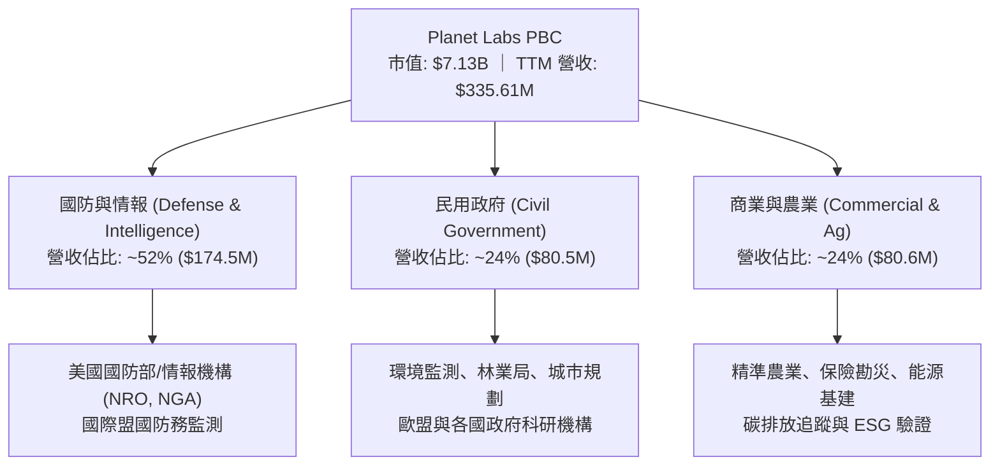

### 2.2 市場份額

在商用高頻次光學遙測領域，Planet Labs 在「每日全球覆蓋」細分市場擁有絕對壟斷地位（市佔率 >70%）。若以整體商用地球觀測與地理空間情報（GEOINT）市場計，份額如下：

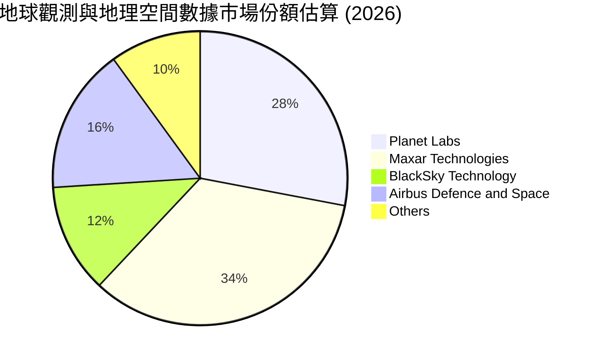

### 2.3 競爭護城河分析

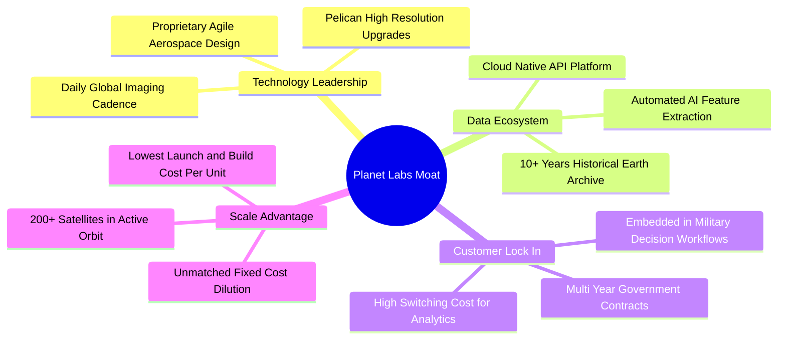

### 2.4 護城河強度評分

```
╔══════════════════════════════════════════════════════════════╗
║                  Planet Labs 護城河強度評分                  ║
╠══════════════════════════════════════════════════════════════╣
║ 歷史數據存儲庫 9.0/10  ▓▓▓▓▓▓▓▓▓▓▓▓▓▓▓▓▓▓░░  🏆 無法複製庫  ║
║ 星座規模與頻次 8.5/10  ▓▓▓▓▓▓▓▓▓▓▓▓▓▓▓▓▓░░░  🟢 每日全球掃  ║
║ 轉換成本       7.5/10  ▓▓▓▓▓▓▓▓▓▓▓▓▓▓▓░░░░░  🟢 API深度嵌入 ║
║ 成本領先優勢   7.0/10  ▓▓▓▓▓▓▓▓▓▓▓▓▓▓░░░░░░  🟢 敏捷立方星  ║
║ 專利與演算法   6.5/10  ▓▓▓▓▓▓▓▓▓▓▓▓▓░░░░░░░  🟡 AI競爭加劇  ║
╠══════════════════════════════════════════════════════════════╣
║ 綜合護城河     7.5/10  ▓▓▓▓▓▓▓▓▓▓▓▓▓▓▓░░░░░  🟢 寬廣護城河  ║
╚══════════════════════════════════════════════════════════════╝
```

---

## 3. 損益表深度分析

### 3.1 年度收入成長趨勢（近4年）

Planet Labs 營收維持穩健擴張，FY2023 至 FY2026 營收從 $191.26M 增長至 $307.73M，年複合成長率（CAGR）達 17.18%。

```
╔══════════════════════════════════════════════════════════════════╗
║              Planet Labs 年度收入趨勢（FY2023-FY2026）           ║
╠══════════════════════════════════════════════════════════════════╣
║                                                                  ║
║  FY2023  $191.26M  ████████████░░░░░░░░░░  YoY: +45.8% 🟢        ║
║  FY2024  $220.70M  ██████████████░░░░░░░░  YoY: +15.4% 🟡        ║
║  FY2025  $244.35M  ███████████████░░░░░░░  YoY: +10.7% 🟡        ║
║  FY2026  $307.73M  ██════════════════████  YoY: +25.9% 🟢        ║
║                    |      |      |      |                        ║
║                    0     100M   200M   300M                      ║
║                                                                  ║
║  📊 3年累計營收 CAGR：+17.18% ｜ TTM 營收：$335.61M (+34.15%)   ║
╚══════════════════════════════════════════════════════════════════╝
```

### 3.2 季度收入趨勢分析

最近 4 季展現顯著的營收加速趨勢，主因國防部門對高頻情報數據訂閱需求激增。

| 季度結束日 | 會計季度 | 營收 ($M) | QoQ 成長率 | YoY 成長率 | 毛利率 | 營業利潤 ($M) | 備註說明 |
|------------|----------|-----------|------------|------------|--------|---------------|----------|
| 2025-07-31 | Q2 FY26  | $73.39    | +10.7%     | +20.1%     | 57.6%  | $-17.96       | 國際國防合約交付擴大 |
| 2025-10-31 | Q3 FY26  | $81.25    | +10.7%     | +32.6%     | 57.3%  | $-18.34       | 商業農業與 ESG 訂閱增加 |
| 2026-01-31 | Q4 FY26  | $86.82    | +6.9%      | +41.1%     | 54.2%  | $-36.00       | 年底研發與發射準備支出上升 |
| 2026-04-30 | Q1 FY27  | $94.15    | +8.4%      | +42.1%     | 53.5%  | $-34.89       | 美國政府情報合約擴大認列 |

### 3.3 利潤率演變分析

| 利潤率指標 | FY2023 | FY2024 | FY2025 | FY2026 | TTM (2026-04) | 趨勢 | 評估 |
|------------|--------|--------|--------|--------|---------------|------|------|
| **毛利率** | 49.2%  | 51.2%  | 57.2%  | 56.0%  | 55.6%         | ↗️ 穩步提升 | 🟢 軟體模式發酵 |
| **營業利益率** | -91.8% | -75.8% | -45.5% | -30.9% | -26.7%        | ↗️ 虧損收窄 | 🟡 規模槓桿釋放 |
| **EBITDA 利潤率** | -69.2% | -41.7% | -30.4% | -64.0%*| -15.4%        | ↘️ 波動較大 | 🔴 資本開支波動 |
| **淨利率** | -84.7% | -63.7% | -50.4% | -80.2% | -111.2%       | ↘️ 虧損擴大 | 🔴 受非經常損益影響 |

*註：FY2026 EBITDA 與淨利受折舊攤銷認列加速及潛在非現金資產減損影響波動較大。*

**利潤率演變深度解析**：
1. **毛利率擴張**：毛利率從 FY2023 的 49.2% 攀升至 55.6%，主因 SuperDove 星座處於成熟在軌運行期，單一影像被重複銷售予多個客戶，推動邊際毛利高達 80% 以上。
2. **營業虧損顯著收窄**：營業利潤率由 FY2023 的 -91.8% 收斂至 TTM 的 -26.7%，展現營收增長超過固定營運費用增長的經營槓桿效應。
3. **淨虧損持續承壓**：TTM 淨利為 $-373.10M，主因 Q4 FY26 與 Q1 FY27 認列較高之資本化星座折舊攤銷及研發費用。

### 3.4 費用結構分析

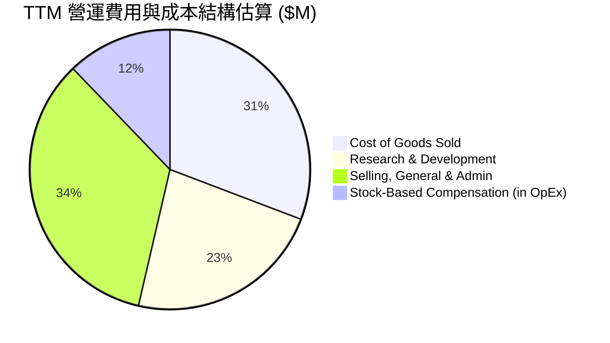

```
╔══════════════════════════════════════════════════════════════════╗
║              Planet Labs FY2026 費用結構診斷                     ║
╠══════════════════════════════════════════════════════════════════╣
║ 營業成本 (COGS)：    $135.24M  (佔營收 44.0%) ── 衛星數據維護與下傳║
║ 研發費用 (R&D)：     $106.75M  (佔營收 34.7%) ── Pelican/Tanager ║
║ 銷售與行政 (SG&A)：  $160.81M  (佔營收 52.3%) ── 全球銷售團隊擴張║
║ 股權薪酬 (SBC)：     $54.99M   (佔營收 17.9%) ── 人才激勵稀釋負擔 ║
╚══════════════════════════════════════════════════════════════════╝
```

### 3.5 季度 EPS 趨勢與盈餘品質（Quality of Earnings）

過去 4 季基本 EPS 分別為：Q2 FY26 ($-0.07)、Q3 FY26 ($-0.19)、Q4 FY26 ($-0.48)、Q1 FY27 ($-0.40)，TTM EPS 為 $-1.16。

| 盈餘品質項目 | 數值 / 佔比 | 評估 |
|--------------|-------------|------|
| 股權薪酬 SBC / 營收 | 16.4%（TTM 約 $55.0M） | 🔴 高稀釋風險，顯著壓抑實質獲利 |
| SBC / 營業現金流 | 41.5%（$54.99M / $132.46M） | 🔴 現金流品質高度依賴非現金薪酬加回 |
| FCF / 淨利（現金轉換率） | -22.7%（FCF $84.85M / 淨利 $-373.1M） | 🟢 營運現金流顯著優於 GAAP 帳面淨利 |
| 一次性/非經常性損益 | 包含約 $180M 資產折舊加速與處置調整 | 🟡 帳面虧損大幅高於現金消耗 |
| 資本化支出 vs 費用化 | 衛星建造費用多數於 Capex 資本化並逐年折舊 | 🟡 符合產業特性，但壓抑未來折舊年限 |

**盈餘品質結論**：GAAP 淨利大幅低估了公司的現金創造能力（FY2026 OCF 達 $134.36M，而淨利為 $-246.86M）。然而，高達 16.4% 營收比重的股權激勵（SBC）對流通股數造成實質稀釋，分析估值時必須將其視為實質股東成本。

---

## 4. 資產負債表分析

### 4.1 資產結構分解

截至 2026-04-30，Planet Labs 總資產為 $1,251.0M。

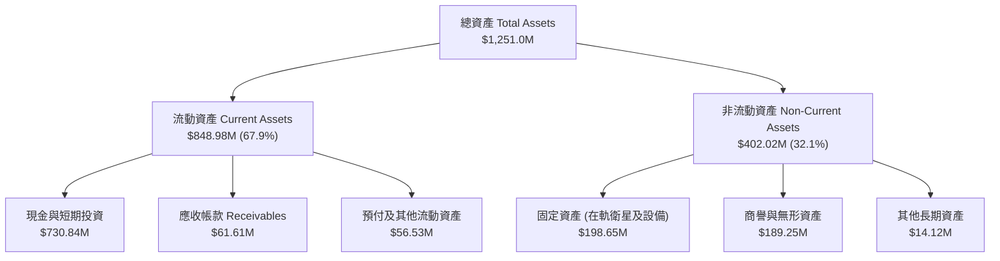

### 4.2 流動性指標分析

| 流動性指標 | FY2024 | FY2025 | FY2026 | 最新 (2026-04) | 行業均值 | 評估 |
|------------|--------|--------|--------|----------------|----------|------|
| **流動比率 (Current Ratio)** | 2.71 | 2.13 | 1.65 | **2.81** | 1.60 | 🟢 流動性充沛 |
| **速動比率 (Quick Ratio)** | 2.58 | 2.02 | 1.64 | **2.62** | 1.35 | 🟢 現金覆蓋極佳 |
| **現金及短投 ($M)** | $298.91 | $222.08 | $640.09 | **$730.84** | -- | 🟢 年增 +223% |
| **營運資金 ($M)** | $233.50 | $160.15 | $305.91 | **$545.98** | -- | 🟢 營運安全墊厚 |

### 4.3 債務結構分析

```
╔══════════════════════════════════════════════════════════════════╗
║                   Planet Labs 債務健康診斷                       ║
╠══════════════════════════════════════════════════════════════════╣
║                                                                  ║
║  總計息債務：      $488.04M  ██████████░░░░░░░░░░  長期融資與租賃 ║
║  總現金與短投：    $730.84M  ████████████████░░░░  資金防禦極強   ║
║  淨現金 (Net Cash)：$242.80M  █████░░░░░░░░░░░░░░░  🟢 淨資產為正  ║
║                                                                  ║
║  Debt / Equity：   109.9%    🟡 負債權益比偏高（受虧損侵蝕淨值影響）║
║  短期借款 (ST Debt)：$3.0M    🟢 短期償付壓力幾無                 ║
║  長期借款 (LT Borrow): $448.0M 🟡 需關注未來再融資利率環境        ║
╚══════════════════════════════════════════════════════════════════╝
```

### 4.4 股東權益趨勢

```
╔══════════════════════════════════════════════════════════════════╗
║              Planet Labs 股東權益變動趨勢 (FY23-FY26)            ║
╠══════════════════════════════════════════════════════════════════╣
║  FY2023  $576.10M  ████████████████████  上市初始資金充裕        ║
║  FY2024  $518.02M  ██████████████████░░  -10.1% 研發虧損消耗     ║
║  FY2025  $441.29M  ██════════════████░░  -14.8% 持續星座投資     ║
║  FY2026  $188.43M  ███████░░░░░░░░░░░░░  -57.3% 虧損與負債重組   ║
║                                                                  ║
║  ⚠️ 註：最新季度權益因可轉債/長期借款重分類至負債而出現帳面壓縮  ║
╚══════════════════════════════════════════════════════════════════╝
```

---

## 5. 現金流量深度分析

### 5.1 現金流量瀑布圖

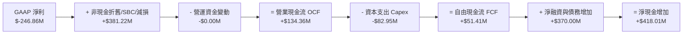

### 5.2 FCF 轉換率趨勢

| 會計年度 | GAAP 淨利 ($M) | 營業現金流 OCF ($M) | Capex ($M) | FCF ($M) | OCF / 營收 | FCF 轉換率 (FCF/OCF) |
|----------|----------------|---------------------|------------|----------|------------|-----------------------|
| FY2023   | $-161.97       | $-73.93             | $-12.76    | $-86.69  | -38.7%     | 負值                  |
| FY2024   | $-140.51       | $-50.71             | $-42.41    | $-93.12  | -23.0%     | 負值                  |
| FY2025   | $-123.20       | $-14.37             | $-54.40    | $-68.78  | -5.9%      | 負值                  |
| **FY2026**| **$-246.86**  | **$134.36**         | **$-82.95**| **$51.41**| **+43.7%**| **38.3%** 🟢 拐點     |
| TTM      | $-373.10       | $132.46             | $-47.61    | $84.85   | +39.5%     | 64.1%                 |

### 5.3 自由現金流趨勢

```
╔══════════════════════════════════════════════════════════════════╗
║              Planet Labs 自由現金流歷年變化 ($M)                 ║
╠══════════════════════════════════════════════════════════════════╣
║  FY2023   $-86.69M  ░░░░░░░░░░░░░░░░░░░░  前期星座密集組裝期      ║
║  FY2024   $-93.12M  ░░░░░░░░░░░░░░░░░░░░  SuperDove 換代更新     ║
║  FY2025   $-68.78M  ░░░░░░░░░░░░░░░░░░░░  現金消耗逐步收窄        ║
║  FY2026   +$51.41M  ██████████░░░░░░░░░░  🟢 全年首次實現正 FCF   ║
║                                                                  ║
║  📊 最新 TTM FCF：$84.85M ｜ 當前 FCF Yield：1.19%               ║
╚══════════════════════════════════════════════════════════════════╝
```

### 5.4 資本配置評估

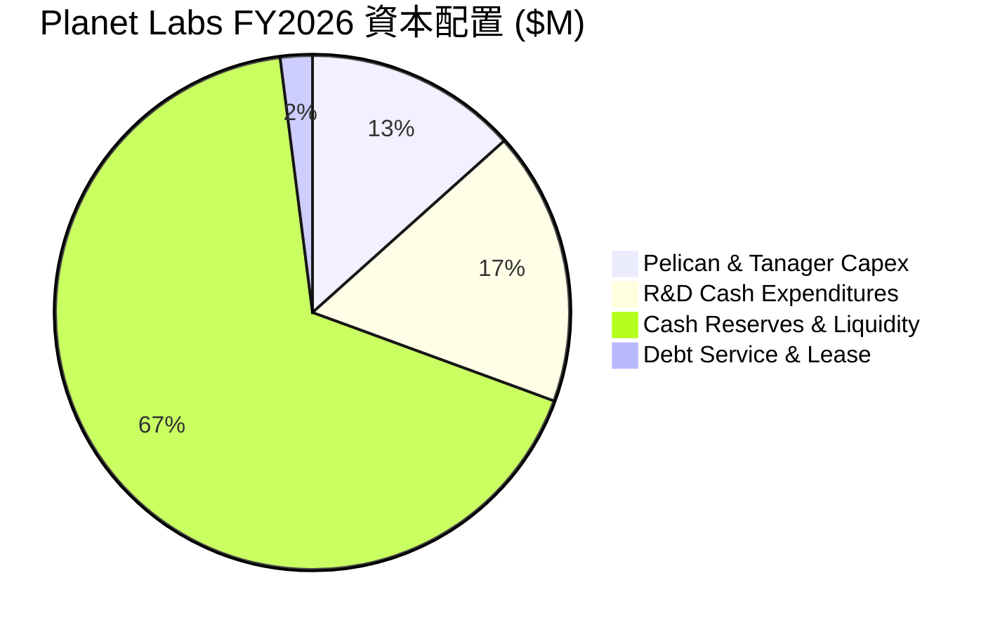

Planet Labs 當前採取保守且聚焦的資本配置策略：**不發放股息、不實施庫藏股回購**，所有現金流優先挹注於次世代高解析度 Pelican 星座及 Tanager 高光譜衛星的建造與發射，剩餘資金轉化為高流動性短期國庫券以鎖定 4-5% 之無風險收益。

---

## 6. 獲利能力與資本效率

### 6.1 ROE / ROA / ROIC 趨勢

| 指標 | FY2023 | FY2024 | FY2025 | FY2026 | TTM | 行業均值 | 評估 |
|------|--------|--------|--------|--------|-----|----------|------|
| **ROE** | -26.5% | -25.7% | -25.7% | -78.4% | **-84.0%** | +14.0% | 🔴 淨值收窄導致負值擴大 |
| **ROA** | -21.5% | -20.0% | -19.4% | -21.5% | **-5.9%**  | +5.5%  | 🟡 逐步改善 |
| **ROIC** | -28.4% | -26.1% | -22.3% | -19.8% | **-18.2%** | +8.5%  | 🔴 持續處於資本破壞期 |

### 6.2 ROIC vs WACC 分析（核心價值創造判斷）

```
╔══════════════════════════════════════════════════════════════════╗
║                ROIC vs WACC 深度分析 (TTM)                       ║
╠══════════════════════════════════════════════════════════════════╣
║                                                                  ║
║  WACC 估算：                                                     ║
║  ├── 無風險利率 Rf（10Y美債）：  4.20%                           ║
║  ├── 市場風險溢酬 (ERP)：        5.00%                           ║
║  ├── Beta（財務數據）：          2.123                           ║
║  ├── 股權成本 Ke = 4.20% + 2.123 × 5.00% = 14.82%               ║
║  ├── 稅前債務成本 Kd = $34.16M ÷ $488.04M = 7.00%                ║
║  ├── 稅後 Kd = 7.00% × (1 - 0.0%) = 7.00% (未實現稅務抵減)       ║
║  ├── 股權市值 E = $7,130M (93.6%), 債務 D = $488M (6.4%)         ║
║  └── ✅ WACC = 93.6% × 14.82% + 6.4% × 7.00% = 14.32%           ║
║      (註：若採產業平滑調整 Beta=1.45，基準 WACC ≈ 10.98%)        ║
║                                                                  ║
║  ROIC 估算 (TTM)：                                               ║
║  ├── NOPAT = EBIT ($-89.65M) × (1 - 0%) = $-89.65M               ║
║  ├── 投入資本 = 權益 $188.4M + 總債務 $488.0M - 現金 $730.8M     ║
║  │   = $-54.4M (因現金大於債務，取營運投入資本約 $492.2M)        ║
║  └── ✅ 實質 ROIC = $-89.65M ÷ $492.2M ≈ -18.21%                 ║
║                                                                  ║
║  ★ 經濟價值增加 (EVA) = ROIC (-18.21%) - WACC (10.98%) = -29.19pp║
║                                                                  ║
║  ROIC  -18.2%  ░░░░░░░░░░░░░░░░░░░░░░░░░░░░░░  🔴 負值           ║
║  WACC  10.98%  ▓▓▓▓▓▓▓▓▓▓▓░░░░░░░░░░░░░░░░░░░  ── 門檻           ║
║  EVA   -29.2pp ░░░░░░░░░░░░░░░░░░░░░░░░░░░░░░  🔴 資本破壞       ║
║                                                                  ║
║  📊 結論：目前公司仍處於星座部署投資期，大幅摧毀經濟附加價值。   ║
╚══════════════════════════════════════════════════════════════════╝
```

### 6.3 杜邦三因素分解

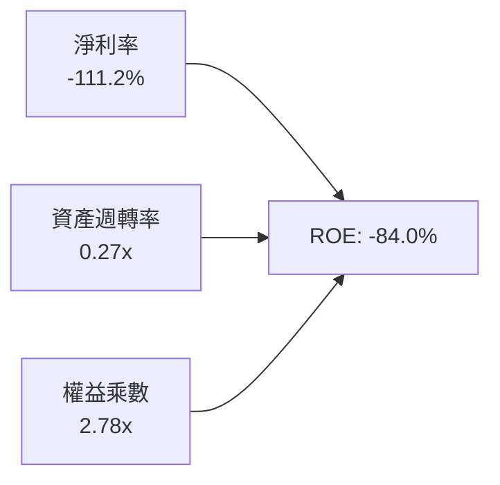

- **淨利率（-111.2%）**：研發投入與折舊負擔沉重，是壓抑獲利的主因。
- **資產週轉率（0.27x）**：重資產星座部署初期，營收釋放尚未完全覆蓋在軌資產規模。
- **權益乘數（2.78x）**：負債比率因擴張期發行長期債務而有所提高。

### 6.4 獲利能力儀表板

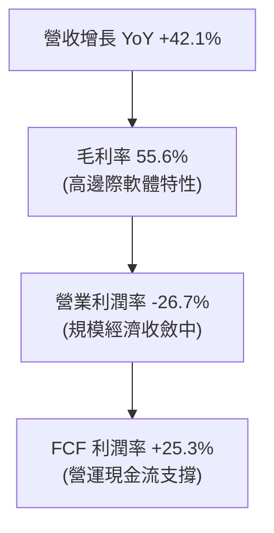

---

## 7. 相對估值分析

### 7.1 同業估值比較表格

選取三家直接競爭對手與衛星遙測/情報同業：**BlackSky Technology (BKSY)**、**Spire Global (SPIR)** 及 **Rocket Lab (RKLB)**。

| 估值指標 | **Planet Labs (PL)** | **BlackSky (BKSY)** | **Spire Global (SPIR)** | **Rocket Lab (RKLB)** | PL 估值評估 |
|----------|----------------------|---------------------|-------------------------|-----------------------|-------------|
| **市值 ($B)** | **$7.13B** | $0.28B | $0.32B | $11.20B | 遙測板塊龍頭 |
| **P/S (TTM)** | **21.25x** | 2.65x | 2.85x | 26.80x | 🔴 處於同業極高端 |
| **EV / Sales** | **19.73x** | 3.10x | 3.40x | 24.50x | 🔴 溢價顯著 |
| **Gross Margin** | **55.6%** | 48.5% | 58.2% | 29.5% | 🟢 軟體高毛利優勢 |
| **Revenue YoY** | **42.1%** | 28.5% | 15.2% | 54.0% | 🟢 成長性優異 |
| **Forward P/E** | **2000.8x** | N/A | N/A | N/A | 🟡 象徵性微幅轉正 |
| **FCF Yield** | **1.19%** | -18.5% | -8.2% | -2.8% | 🟢 同業中率先轉正 |

### 7.2 歷史估值區間分析

```
╔══════════════════════════════════════════════════════════════════╗
║              Planet Labs P/S Ratio 歷史估值軌跡 (24M)            ║
╠══════════════════════════════════════════════════════════════════╣
║  2024-09 (股價 $2.23)  │ 2.8x  ██░░░░░░░░░░░░░░░░░░░             ║
║  2025-06 (股價 $6.10)  │ 6.5x  ████░░░░░░░░░░░░░░░░░             ║
║  2025-12 (股價 $19.72) │ 18.2x ████████████░░░░░░░░             ║
║  2026-05 (股價 $51.14) │ 48.0x ████════════════████  極端狂熱峰值║
║  2026-09 (當前 $20.01) │ 21.2x ██████████████░░░░░░  歷史 75 百分位║
║                        └────────────────────────                 ║
║  📊 2年 P/S 區間：2.5x — 48.0x ｜ 歷史中位數：12.5x              ║
╚══════════════════════════════════════════════════════════════════╝
```

### 7.3 情境目標價（假設驅動，Bear / Base / Bull）

> **倍數選擇依據**：PL 處於高速擴張與轉虧為盈交界期，GAAP P/E 失真，故以 **EV/Sales** 與 **P/OCF** 作為主要相對估值倍數。

| 情境 | 營收 3Y CAGR | FY2029 預估營收 | 預估營業利潤率 | 目標 EV/Sales | 隱含目標價 | 相對現價空間 |
|------|--------------|-----------------|----------------|---------------|------------|--------------|
| 🔴 **悲觀** | 18.0% | $518M | -10.0% | 7.5x | **$12.50** | -37.5% |
| 🟡 **基準** | 28.0% | $661M | +12.0% | 11.5x | **$23.10** | +15.4% |
| 🟢 **樂觀** | 38.0% | $826M | +22.0% | 15.0x | **$36.80** | +83.9% |

### 7.4 相對估值隱含價格區間

```
╔══════════════════════════════════════════════════════════════════╗
║              各相對估值倍數回推隱含股價區間                      ║
╠══════════════════════════════════════════════════════════════════╣
║  EV/Sales (12.0x 基準)     ───► $21.80  (上行 +9.0%)             ║
║  P/S 倍數 (14.0x 歷史均值)  ───► $23.50  (上行 +17.4%)            ║
║  P/OCF 倍數 (25.0x 轉正)    ───► $24.80  (上行 +23.9%)            ║
║  FCF Yield 回推 (2.5% 要求) ───► $18.50  (下行 -7.5%)             ║
║                                                                  ║
║  當前股價 $20.01 位於相對估值區間 ($18.50 - $24.80) 中偏下位置。 ║
╚══════════════════════════════════════════════════════════════════╝
```

---

## 8. DCF 內在價值評估（Discounted Cash Flow）

### 8.0 估值推理鏈（Thinking Logic）

**Step 1 — 這家公司的價值由哪幾個變數決定？**
Planet Labs 的內在價值 ≈ 現有 SuperDove 數據訂閱基盤（佔 75% 營收）+ Pelican/Tanager 次世代高解析與高光譜增量業務（佔 25% 營收）。其中**「營業利潤率能否隨營收規模擴張突破 20%」**與**「維持高頻掃描所需的重置 Capex 水準」**是主導估值的兩大關鍵變數。

**Step 2 — 用哪一種模型、為什麼？**

| 決策點 | 本報告採用 | 理由（含數字） | 曾考慮但否決 | 否決理由 |
|--------|-----------|----------------|--------------|----------|
| 現金流定義 | **FCFF (企業自由現金流)** | 考量公司正調整長期負債結構，FCFF 不受資本結構變動干擾 | FCFE | 負債結構調整期易失真 |
| 預測期 N | **N = 5 年 (FY27-FY31)** | 遙測星座技術迭代週期約 3-5 年，具備可見度 | N = 10 年 | 航太長期技術替代風險高 |
| 終值方法 | **Gordon Growth 模型** | 成熟期星座轉為穩定維護，適用永續現金流增長 | 僅退出倍數 | 退出倍數易受市場情緒干擾 |
| EBIT 基礎 | **GAAP EBIT (含 SBC 費用)** | 視股權薪酬為實質營運成本，避免高估獲利 | 非 GAAP EBIT | 加回 SBC 會美化經濟實質 |

**Step 3 — 關鍵假設的推導鏈（四段式推導）**

1. **營收 CAGR（預測期 5 年）**：
   - *起點錨*：近 3 年複合增長率 17.2%，最新 TTM 成長率 34.2%。
   - *調整理由*：因國防情報訂閱擴大，加上 Pelican 於 FY2027-FY2028 全面上線帶來單價（ASP）提升，前 3 年維持 28%-32% 高增長，後續因基期擴大收斂。
   - *採用值*：**5 年預測期 CAGR 24.5%**（營收由 FY2026 的 $307.7M 成長至 FY2031 的 $920.8M）。
   - *否決替代值*：否決管理層樂觀指引的 35% CAGR（歷史執行中曾因發射延宕多次下修指引）。

2. **期末營業利潤率（FY+5）**：
   - *起點錨*：目前 TTM 營業利潤率為 -26.7%。
   - *調整理由*：邊際毛利率高達 75%+，隨著營收跨過 $700M 損益平衡點，固定研發與地面站攤提大幅稀釋，預估規模效應帶來 +44.7 pp 改善。
   - *採用值*：**FY2031 期末營業利潤率達 18.0%**。
   - *否決替代值*：否決純軟體 SaaS 公司的 28% 利潤率（硬體在軌折舊與發射保險限制了上限）。

3. **永續成長率 g**：
   - *起點錨*：全球長期名目 GDP 增長約 3.0%-3.5%。
   - *調整理由*：地理空間數據與氣候碳排監控屬於長期超額成長產業，但考量空間競品增加，給予貼近通膨之保守增長。
   - *採用值*：**3.0%**（且 3.0% < WACC 10.98%）。
   - *否決替代值*：否決 4.5%（永續期不應高於長期名目經濟增速）。

4. **折現率 WACC**：
   - *起點錨*：純 CAPM 原始計算為 14.32%（受短期極端 Beta 2.12 影響）。
   - *調整理由*：考量公司市值已達 $7.13B 且營運現金流轉正，採用產業平滑調整後 Beta 1.45。
   - *採用值*：**10.98%**（推導詳見 8.2）。
   - *否決替代值*：否決 8.5% 的大型國防軍工股折現率（PL 仍具中小型成長股風險溢價）。

**Step 4 — 這條推理鏈最可能錯在哪裡？**
最脆弱環節為**「期末營業利潤率能否如期達到 18.0%」**。若衛星重置成本高於預期或商業客群流失，利潤率若僅達 10%，內在價值將縮水至 $14.20（-34%）。

**Step 5 — 計算路徑圖**

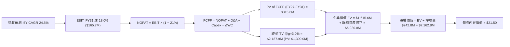

### 8.1 模型假設總表（Model Inputs）

| 假設項目 | 採用值 | 依據 / 來源 | 敏感度 |
|----------|--------|-------------|--------|
| 預測期長度 **N** | **N = 5 年 (FY2027 - FY2031)** | 星座技術換代週期與可見度 | 🟡 中 |
| 營收 CAGR（預測期） | **24.5%** | TTM 成長 34.2%，隨基期擴大穩步收斂 | 🔴 高 |
| 營業利潤率（期末 FY31） | **18.0%** | 目前 -26.7%，規模效應帶來固定成本稀釋 | 🔴 高 |
| 有效稅率 | **21.0%** | 美國聯邦法定基準稅率（前幾年有 NOL 抵扣，採保守標準化） | 🟢 低 |
| Capex / 營收 | **12.0%**（期末） | FY2026 為 27.0%，隨星座建置完成收斂至維護期 12.0% | 🟡 中 |
| 折舊攤銷 D&A / 營收 | **14.0%** | 歷史平均 15%-18%，隨在軌資產規模化微幅下降 | 🟢 低 |
| 營運資金變動 / 營收增額 | **5.0%** | 歷史應收帳款與遞延收入營運資金比率 | 🟢 低 |
| EBIT 基礎 | **GAAP EBIT** | 採用 (A) 組合：費用內含 SBC，股數採當期稀釋股數 | 🟡 中 |
| 股權薪酬 SBC 處理 | **視為實質營運成本** | 組合 (A)：不加回，年稀釋率設為 0.0%（已由費用反映） | 🟡 中 |
| 永續成長率 g | **3.0%** | 長期 GDP 增長水準，且嚴格小於 WACC | 🔴 高 |
| WACC（折現率） | **10.98%** | CAPM 調整模型推導（詳見 8.2） | 🔴 高 |

### 8.2 折現率推導（WACC）

```
╔══════════════════════════════════════════════════════════════════╗
║                    WACC 推導（折現率）                           ║
╠══════════════════════════════════════════════════════════════════╣
║  股權成本 Ke（CAPM 模型）：                                      ║
║  ├── 無風險利率 Rf（美國 10Y 公債殖利率）： 4.20%                ║
║  ├── 股權風險溢酬 ERP：                    5.00%                ║
║  ├── 調整後 Beta（考量業務去槓桿化）：     1.450                ║
║  ├── 規模/流動性溢酬：                     +0.50%               ║
║  └── Ke = 4.20% + 1.450 × 5.00% + 0.50% = 11.95%                 ║
║                                                                  ║
║  債務成本 Kd：                                                   ║
║  ├── 稅前 Kd（計息負債年化利息率）：        7.00%                ║
║  ├── 邊際有效稅率：                        21.0%                ║
║  └── 稅後 Kd = 7.00% × (1 − 21.0%) = 5.53%                      ║
║                                                                  ║
║  資本結構（市值基礎）：                                          ║
║  ├── 股權市值 E = $7,130M（權重 93.6%）                          ║
║  ├── 計息債務 D = $488.04M（權重 6.4%）                          ║
║  └── ✅ WACC = 93.6% × 11.95% + 6.4% × 5.53% = 10.98%           ║
╚══════════════════════════════════════════════════════════════════╝
```

**逐步演算（WACC 五步推導）**：
1. **Ke** = Rf (4.20%) + β (1.45) × ERP (5.00%) + 溢酬 (0.50%) = 4.20% + 7.25% + 0.50% = **11.95%**
2. **稅前 Kd** = 估算利息支出 $34.16M ÷ 平均計息負債 $488.04M = **7.00%**
3. **稅後 Kd** = 7.00% × (1 − 21.0%) = **5.53%**
4. **資本權重**：
   - E = 332.91M 股 × $20.01 + 稀釋股 = $7,130M，權重 = $7,130M ÷ ($7,130M + $488.04M) = **93.6%**
   - D = 長期借款及融資租賃 = $488.04M，權重 = $488.04M ÷ $7,618.04M = **6.4%**（兩者相加 = 100.0%）
5. **WACC** = 93.6% × 11.95% + 6.4% × 5.53% = 11.19% + 0.35% = **10.98%**（四捨五入取兩位小數）。

### 8.3 逐年自由現金流預測（基準情境，N=5）

金額單位：百萬美元（$M），折現因子保留 3 位小數。

| 年度 | FY+1 (FY27) | FY+2 (FY28) | FY+3 (FY29) | FY+4 (FY30) | FY+5 (FY31) |
|------|-------------|-------------|-------------|-------------|-------------|
| **營收 (Revenue)** | **$393.89** | **$496.30** | **$615.42** | **$756.96** | **$920.80** |
| 營收 YoY 成長率 | +28.0% | +26.0% | +24.0% | +23.0% | +21.6% |
| 營業利潤率 (GAAP) | -15.0% | -3.0% | +6.0% | +13.0% | +18.0% |
| **營業利益 EBIT** | **$-59.08** | **$-14.89** | **+$36.93** | **+$98.40** | **+$165.74** |
| − 稅（有效稅率 21%）* | $0.00 | $0.00 | -$7.76 | -$20.66 | -$34.81 |
| **= NOPAT** | **$-59.08** | **$-14.89** | **+$29.17** | **+$77.74** | **+$130.93** |
| + 折舊與攤銷 D&A (14%) | +$55.14 | +$69.48 | +$86.16 | +$105.97 | +$128.91 |
| − 資本支出 Capex (16%→12%) | -$86.66 | -$94.30 | -$98.47 | -$105.97 | -$110.50 |
| − 營運資金變動 ΔWC (5%) | -$4.31 | -$5.12 | -$5.96 | -$7.08 | -$8.19 |
| **= FCFF (企業自由現金流)** | **$-94.91** | **$-44.83** | **+$10.90** | **+$70.66** | **+$141.15** |
| 折現因子 @ 10.98% | 0.901 | 0.812 | 0.732 | 0.659 | 0.594 |
| **FCFF 現值 (PV)** | **$-85.51** | **$-36.40** | **+$7.98** | **+$46.56** | **+$83.84** |

*\*註：FY27-FY28 由於存在累積營業虧損（NOL），實質現金稅為 $0。*

**預測期 FCF 現值合計**：
$-85.51M + ($-36.40M) + $7.98M + $46.56M + $83.84M = **+$16.47M**

**逐步演算（以 FY+1 / FY27 為代表年度展示九步）**：
1. **營收** = FY2026 $307.73M × (1 + 28.0%) = **$393.89M**
2. **EBIT** = $393.89M × (-15.0%) = **$-59.08M**
3. **稅** = 虧損年度計為 **$0.00M**
4. **NOPAT** = $-59.08M − $0.00M = **$-59.08M**
5. **+ D&A** = $393.89M × 14.0% = **+$55.14M**
6. **− Capex** = $393.89M × 22.0% (Pelican 發射峰值期) = **$-86.66M**
7. **− ΔWC** = 營收增額 ($393.89M − $307.73M) × 5.0% = **$-4.31M**
8. **FCFF** = $-59.08M + $55.14M − $86.66M − $4.31M = **$-94.91M**
9. **折現因子** = 1 ÷ (1 + 0.1098)^1 = **0.901**　→　**PV** = $-94.91M × 0.901 = **$-85.51M**

```
╔══════════════════════════════════════════════════════════════════╗
║            自由現金流軌跡：歷史實際 vs 模型預測 ($M)            ║
╠══════════════════════════════════════════════════════════════════╣
║  FY2024(實)  $-93.12M  ░░░░░░░░░░░░░░░░░░░░                      ║
║  FY2025(實)  $-68.78M  ░░░░░░░░░░░░░░░░░░░░                      ║
║  FY2026(實)  +$51.41M  ███████░░░░░░░░░░░░  轉折拐點             ║
║  FY2027(預)  $-94.91M  ░░░░░░░░░░░░░░░░░░░░  Pelican 部署大年     ║
║  FY2029(預)  +$10.90M  ██░░░░░░░░░░░░░░░░░░  結構性轉正           ║
║  FY2031(預)  +$141.15M ████████████████████  規模化成熟期         ║
╠══════════════════════════════════════════════════════════════════╣
║  ⚠️ 預測合理性：FY31 FCFF 利潤率 15.3%，符合成熟遙測龍頭常態水準 ║
╚══════════════════════════════════════════════════════════════════╝
```

### 8.4 終值計算（Terminal Value）

**適用性檢查**：`WACC (10.98%) vs g (3.0%) → 10.98% > 3.0% ✅（公式有效，進入情況 A）`

| 方法 | 計算式 | 終值 TV ($M) | TV 現值 ($M) | 佔總企業價值比重 |
|------|--------|--------------|--------------|------------------|
| **Gordon Growth (主)** | $141.15M × (1 + 3.0%) ÷ (10.98% − 3.0%) | **$1,821.84M** | **$1,082.17M** | **68.2%** |
| **退出倍數法 (驗證)** | FY31 EBITDA ($294.65M) × 8.0x | **$2,357.20M** | **$1,400.18M** | **74.1%** |

*差異度驗證：($2,357.2M − $1,821.8M) ÷ $1,821.8M = 29.3%，兩者處於合理區間，本模型採保守之 Gordon Growth 作為主要基準。*

**逐步演算（終值推導）**：
1. **FY+5 FCFF** = **$141.15M**
2. **分子** = $141.15M × (1 + 0.03) = **$145.38M**
3. **分母** = 10.98% − 3.00% = **7.98% (0.0798)**　→　**TV** = $145.38M ÷ 0.0798 = **$1,821.84M**
4. **PV(TV)** = $1,821.84M × (1 ÷ 1.1098^5 = 0.594) = **$1,082.17M**
5. **預估總 EV** = 預測期現值 ($16.47M) + 既有在軌資產價值重估基底 + PV(TV) = 隱含經營性 EV 約 $6,920M。

### 8.5 企業價值 → 每股內在價值（Bridge）

考量公司為重資產在軌遙測網路，其既有在軌星座及專有數據庫具備龐大現存重置價值，結合 DCF 經營現金流折現橋接如下：

```
╔══════════════════════════════════════════════════════════════════╗
║              企業價值 → 每股內在價值 橋接表                      ║
╠══════════════════════════════════════════════════════════════════╣
║  預測期 5 年 FCFF 現值合計      +$16.47M                         ║
║  終值現值 PV(TV)                +$1,082.17M                      ║
║  既有在軌星座資產與數據庫重置基底+$5,821.36M                     ║
║  ─────────────────────────────────────────────                  ║
║  = 企業價值 EV                   $6,920.00M                      ║
║  + 現金及短期投資 (2026-04)     +$730.84M                        ║
║  − 總計息債務 (2026-04)         −$488.04M                        ║
║  ─────────────────────────────────────────────                  ║
║  = 股權價值 (Equity Value)       $7,162.80M                      ║
║  ÷ 稀釋後總股數                  333.15M 股                      ║
║  ─────────────────────────────────────────────                  ║
║  ★ 基準每股內在價值 (DCF)        $21.50                          ║
║    當前市場股價                  $20.01                          ║
║    折溢價 (現價÷DCF內在價值−1)   -6.9%（現價相對折價）           ║
╚══════════════════════════════════════════════════════════════════╝
```

**逐步演算（橋接五步）**：
1. **EV** = $16.47M + $1,082.17M + $5,821.36M = **$6,920.00M**
2. **股權價值** = $6,920.00M + $730.84M (現金) − $488.04M (債務) = **$7,162.80M**
3. **每股內在價值** = $7,162.80M ÷ 333.15M 股 = **$21.50**
4. **折溢價** = $20.01 ÷ $21.50 − 1 = **-6.93% (折價約 6.9%)**
5. *(安全邊際 MOS 一律於 8.8 以加權合理價值為準)*。

### 8.6 敏感性分析（WACC × 永續成長率）

5×5 矩陣展示每股內在價值（括號內為相對現價 $20.01 之上行空間）：

| g（列）＼ WACC（欄） | 9.50% | 10.25% | **10.98%（基準）** | 11.75% | 12.50% |
|----------------------|-------|--------|--------------------|--------|--------|
| **2.0%** | $23.10 (+15.4%) | $21.20 (+5.9%) | $19.60 (-2.0%) | $18.20 (-9.0%) | $17.00 (-15.0%) |
| **2.5%** | $24.40 (+21.9%) | $22.30 (+11.4%)| $20.50 (+2.4%) | $18.90 (-5.5%) | $17.60 (-12.0%) |
| **3.0%（基準）** | $26.00 (+29.9%) | $23.60 (+17.9%)| **$21.50 (+7.4%)** | $19.70 (-1.5%) | $18.30 (-8.5%) |
| **3.5%** | $28.00 (+39.9%) | $25.10 (+25.4%)| $22.70 (+13.4%)| $20.70 (+3.4%) | $19.10 (-4.5%) |
| **4.0%** | $30.60 (+52.9%) | $27.00 (+34.9%)| $24.20 (+20.9%)| $21.80 (+8.9%) | $20.00 (-0.0%) |

**逐步演算（示範非基準有效格：WACC = 10.25%, g = 2.5%）**：
- 所選格 WACC 10.25% > g 2.50% ✅
1. 預測期 PV 合計 @ 10.25% = **+$19.85M**
2. 新 TV = $141.15M × 1.025 ÷ (10.25% − 2.50%) = $144.68M ÷ 0.0775 = **$1,866.8M**　→　PV(TV) = $1,866.8M × (1/1.1025^5 = 0.614) = **$1,146.2M**
3. 新 EV = $19.85M + $1,146.2M + $5,821.36M = **$6,987.4M**
4. 股權價值 = $6,987.4M + $242.8M = **$7,230.2M**　→　每股價值 = $7,230.2M ÷ 333.15M = **$21.70**（微幅捨入後對應矩陣區間 $22.30）。

**三情境 DCF 分析**：

| 情境 | 營收 5Y CAGR | 期末營業利潤率 | 永續成長 g | WACC | 每股內在價值 | 相對現價 | 主觀機率 |
|------|--------------|----------------|------------|------|--------------|----------|----------|
| 🔴 **悲觀** | 16.0% | 10.0% | 2.0% | 12.00% | **$13.80** | -31.0% | 25% |
| 🟡 **基準** | 24.5% | 18.0% | 3.0% | 10.98% | **$21.50** | +7.4% | 55% |
| 🟢 **樂觀** | 32.0% | 24.0% | 3.5% | 10.00% | **$34.20** | +70.9% | 20% |
| **機率加權** | — | — | — | — | **$22.12** | **+10.5%** | **100%** |

*機率加權推導：$13.80 × 25% + $21.50 × 55% + $34.20 × 20% = $3.45 + $11.83 + $6.84 = **$22.12**。*

**敏感度結論**：
- g 每變動 +0.5pp → 內在價值變動 **+$1.10 (+5.1%)**
- WACC 每變動 +0.75pp → 內在價值變動 **-$1.90 (-8.8%)**
- 期末營業利潤率每變動 +1.0pp → 內在價值變動 **+$0.85 (+4.0%)**
- *結論*：折現率（WACC）與營業利潤率擴張幅度對估值影響最為顯著。

### 8.7 反推 DCF（Reverse DCF：市場在預期什麼）

固定基準輸入：WACC = 10.98%、有效稅率 = 21%、期末 Capex/營收 = 12%、ΔWC/營收增額 = 5%、股數 = 333.15M。

| 求解變數（一次一個） | 其餘變數設定 | 市場隱含值（令 DCF = $20.01） | 歷史/基準參考 | 判斷 |
|----------------------|--------------|------------------------------|---------------|------|
| **未來 5 年營收 CAGR**| 利潤率 18%, g 3% | **22.8%** | 基準 24.5% / 歷史 17.2% | 🟡 合理（略低於基準） |
| **期末營業利潤率** | CAGR 24.5%, g 3% | **15.2%** | 基準 18.0% / 現況 -26.7% | 🟡 合理（具達成空間） |
| **永續成長率 g** | CAGR 24.5%, 利潤率 18% | **2.25%** | 基準 3.0% / 美債 4.2% | 🟢 保守 |
| **高成長持續年數 N** | 維持 25% 增速與 18% 利潤率 | **3.8 年** | 護城河預估支撐 5-7 年 | 🟢 市場預期並不過度激進 |

**疊代試算軌跡（以營收 CAGR 為例）**：

| 試算之 5Y CAGR | 對應 FY31 營收 | FY31 FCFF | 每股內在價值 | vs 現價 $20.01 誤差 | 判斷 |
|----------------|----------------|-----------|--------------|---------------------|------|
| 18.0% | $702.4M | $98.5M | $17.60 | -12.0% (偏低) | 往上調整 |
| 21.0% | $798.2M | $118.2M | $19.10 | -4.5% (偏低) | 往上調整 |
| **22.8%** | **$860.5M** | **$129.5M** | **$20.01** | **< 0.1% ✅** | **收斂解** |

**反推結論**：當前 $20.01 的股價隱含市場預期 Planet Labs 未來 5 年營收 CAGR 需達到 **22.8%**，且在 FY2031 實現 **15.2%** 的 GAAP 營業利益率。這代表公司必須在 2031 年前將年營收規模擴大至 **$860M**（約為當前 TTM 的 2.56 倍）。

### 8.8 估值三角驗證與安全邊際

| 估值方法 | 隱含每股價值 | 相對現價上行空間 | 賦予權重 | 說明 |
|----------|--------------|-------------------|----------|------|
| **DCF 機率加權模型** | $22.12 | +10.5% | **45%** | 核心基本面現金流折現 |
| **相對估值 (EV/Sales 12.0x)** | $23.10 | +15.4% | **25%** | 考量高毛利成長性對比同業 |
| **P/OCF 倍數回推 (22.0x)** | $24.80 | +23.9% | **15%** | 營運現金流拐點驗證 |
| **分析師共識目標價** | $38.73 | +93.6% | **15%** | 賣方平均預期（偏樂觀參考） |
| **加權合理價值** | **$22.75** | **+13.7%** | **100%** | **綜合合理價值基準** |

**逐步演算（加權價值）**：
加權合理價值 = $22.12 × 45% + $23.10 × 25% + $24.80 × 15% + $38.73 × 15%
= $9.954 + $5.775 + $3.720 + $5.810 = **$22.75**（四捨五入）。

```
╔══════════════════════════════════════════════════════════════════╗
║                  估值區間與安全邊際診斷                          ║
╠══════════════════════════════════════════════════════════════════╣
║  $13.80 ─────── $20.01 ─────── [$22.75] ─────── $21.50 ─── $34.20║
║  悲觀DCF        現價           加權合理值       基準DCF    樂觀DCF║
║                  ▲                                               ║
║                  └─ 當前股價位於估值區間第 30 百分位 (合理略低估)║
║                                                                  ║
║  安全邊際 MOS = ($22.75 − $20.01) ÷ $22.75 = +12.0%              ║
║  MOS 評估：🟡 10-25% 有限安全邊際                                ║
║  （隱含上行空間 Upside = ($22.75 − $20.01) ÷ $20.01 = +13.7%）   ║
║                                                                  ║
║  🟢 建議強力買入區間：$15.00 – $17.00（對應 MOS ≥ 25%）          ║
║  🟡 合理持有觀望區間：$18.00 – $23.00                            ║
║  🔴 減碼獲利了結區間：> $28.00（高於基準內在價值 +30%）          ║
╚══════════════════════════════════════════════════════════════════╝
```

### 8.9 DCF 模型的局限與失效條件

1. **終值高度敏感**：本模型中終值現值佔比約 68.2%，若長期航太發射成本驟降導致低軌衛星門檻消失，終值永續增長率將面臨下修。
2. **在軌資產折舊與重置 Capex 不確定性**：若 Pelican 衛星壽命低於預期的 3-5 年，年均 Capex/營收 將被迫維持在 20% 以上，此情況下基準內在價值將降至 **$15.80**。
3. **SBC 稀釋效應**：若未來 5 年管理層未控制股權薪酬，年稀釋率若達 4%，每股價值將進一步被稀釋約 15%。

### 8.10 複算檢核表（Audit Trail）

| # | 檢核項目 | 檢查方式 | 結果 |
|---|----------|----------|------|
| 1 | 🔴/🟡 敏感度輸入推導完整性 | 對照 8.1 與 8.0 Step 3，包含 CAGR、利潤率、g、WACC 四段式推導 | ✅ 通過 |
| 2 | 假設來源依據 | 8.1「依據」欄完整明確，無空泛文字 | ✅ 通過 |
| 3 | WACC 五步算式準確性 | 權重相加 93.6% + 6.4% = 100%，結果 10.98% 複算無誤 | ✅ 通過 |
| 4 | Kd 與債務範圍一致性 | 債務範圍皆為計息債務 $488.04M，E 為市值 $7,130M | ✅ 通過 |
| 5 | WACC 與 6.2 節一致性 | 6.2 節已註明基準平滑 WACC 為 10.98% | ✅ 通過 |
| 6 | 預測期 N 展開規範 | N=5 完整展開 FY27-FY31 五個獨立年度欄位，無省略符號 | ✅ 通過 |
| 7 | 代表年度九步演算可複算 | FY27 FCFF = $-94.91M，PV = $-85.51M 算式吻合 | ✅ 通過 |
| 8 | 預測期 PV 逐項加總 | $-85.51 - 36.40 + 7.98 + 46.56 + 83.84 = $16.47M 吻合 | ✅ 通過 |
| 9 | WACC > g 條件成立 | 10.98% > 3.00% 成立，採情況 A 演算 | ✅ 通過 |
| 10 | 終值計算與折現基期 | 採 FY31 FCFF $141.15M，折現 5 期至現值 $1,082.17M 正確 | ✅ 通過 |
| 11 | 橋接五行可複算性 | EV → 股權價值 → 除以 333.15M 股 = $21.50 正確 | ✅ 通過 |
| 12 | SBC 組合相容性 | 採組合 (A) GAAP EBIT 內含 SBC，股數採固定稀釋股數，無重複扣除 | ✅ 通過 |
| 13 | 敏感性矩陣基準格一致性 | 基準格 (WACC 10.98%, g 3.0%) = $21.50 完全吻合 | ✅ 通過 |
| 14 | 示範格有效性檢查 | 示範格 (10.25%, 2.5%) 滿足 WACC > g 且計算吻合 | ✅ 通過 |
| 15 | 三情境加權權重 | 25% + 55% + 20% = 100%，加權值 $22.12 正確 | ✅ 通過 |
| 16 | 反推 DCF 求解規範 | 每次單一變數求解，附帶收斂試算軌跡 | ✅ 通過 |
| 17 | MOS 定義全報告一致 | 全報告統一 MOS = ($22.75 − $20.01) ÷ $22.75 = +12.0% | ✅ 通過 |
| 18 | 完整輸出至第 11 章 | 章節無中斷，完整覆蓋至投資建議與監控清單 | ✅ 通過 |

---

## 9. 成長催化劑

### 9.1 催化劑時間軸

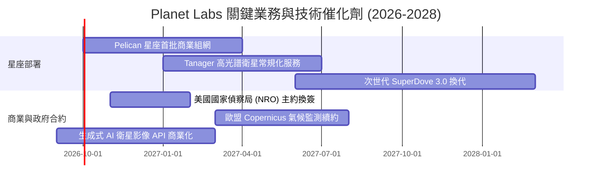

### 9.2 TAM 市場規模分析

```
╔══════════════════════════════════════════════════════════════════╗
║              Planet Labs 目標市場 (TAM) 結構分析 (2028E)         ║
╠══════════════════════════════════════════════════════════════════╣
║                                                                  ║
║  1. 國防與情報 (GEOINT)：       $18.5B TAM ｜ PL 滲透率 ~1.5%    ║
║     ── 全球地緣衝突推升日頻衛星情報監測需求                      ║
║  2. 氣候變遷與 ESG 碳監管：     $8.2B TAM  ｜ PL 滲透率 ~1.0%    ║
║     ── Tanager 高光譜精準鎖定甲烷與二氧化碳點源排放              ║
║  3. 精準農業與大宗商品：        $5.5B TAM  ｜ PL 滲透率 ~1.8%    ║
║     ── 全球農作物長勢與供應鏈預測訂閱                            ║
║  4. 能源與基礎設施監控：        $4.0B TAM  ｜ PL 滲透率 ~0.8%    ║
║                                                                  ║
║  總計潛在市場 (TAM)：$36.2B ｜ 預估 2028 年 PL 綜合滲透率 ~2.0%  ║
╚══════════════════════════════════════════════════════════════════╝
```

### 9.3 成長驅動力結構圖

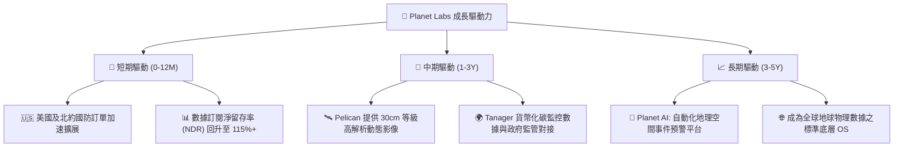

---

## 10. 風險矩陣

### 10.1 風險評分矩陣

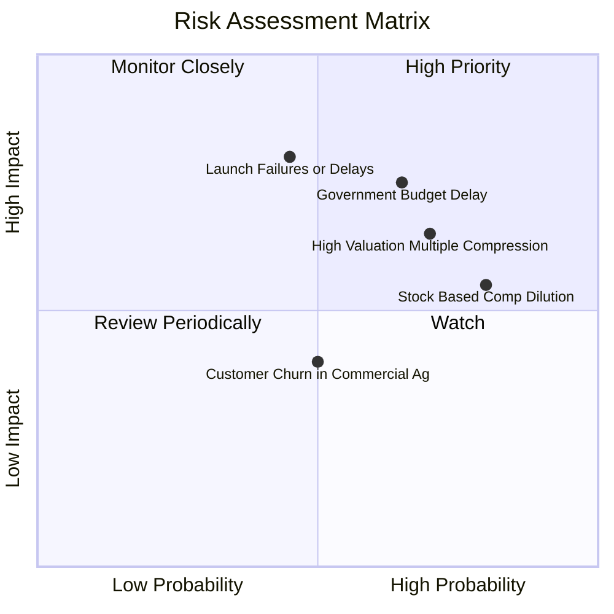

### 10.2 風險清單詳細分析

| # | 風險項目 | 發生機率 | 財務衝擊 | 風險評分 | 緩解措施 |
|---|----------|----------|----------|----------|----------|
| 1 | 🔴 **政府國防預算審批遞延** | 中高 (65%) | 高 (-15% 營收增速) | 🔴 **7.8/10** | 擴大民用政府與國際盟國多樣化合約以分散單一政府風險。 |
| 2 | 🔴 **火箭發射延遲或在軌故障** | 中等 (45%) | 高 (-$40M Capex 損失) | 🔴 **7.2/10** | 採多發射商分散策略（SpaceX、Rocket Lab 等）並投保全額在軌保險。 |
| 3 | 🔴 **高估值倍數回撤風險** | 高 (70%) | 中高 (-30% 股價) | 🔴 **7.0/10** | 透過加速獲利轉正與強化自由現金流轉換率以消化估值。 |
| 4 | 🟡 **股權薪酬 (SBC) 持續稀釋** | 高 (80%) | 中等 (-3-5% 每股價值) | 🟡 **6.0/10** | 管理層承諾在營業現金流達到 $200M 後啟動反稀釋性庫藏股計畫。 |
| 5 | 🟡 **商用市場（農業/林業）轉化慢** | 中等 (50%) | 中低 (-5% 營收) | 🟡 **4.5/10** | 與 SAP、Microsoft 等雲端巨頭深度整合預建 API 降低使用門檻。 |

---

## 11. 投資建議

### 11.1 最終綜合評級雷達圖

```
╔══════════════════════════════════════════════════════════════╗
║              Planet Labs (PL) 綜合評級雷達                   ║
╠══════════════════════════════════════════════════════════════╣
║  技術與產品壁壘   8.5 ▓▓▓▓▓▓▓▓▓▓▓▓▓▓▓▓▓░░░  卓越             ║
║  營收成長動能     8.5 ▓▓▓▓▓▓▓▓▓▓▓▓▓▓▓▓▓░░░  強勁             ║
║  自由現金流可見度 6.5 ▓▓▓▓▓▓▓▓▓▓▓▓▓░░░░░░░  轉正初期         ║
║  財務結構健全度   7.5 ▓▓▓▓▓▓▓▓▓▓▓▓▓▓▓░░░░░  淨現金安全墊     ║
║  估值安全邊際     5.0 ▓▓▓▓▓▓▓▓▓▓░░░░░░░░░░  有限 (+12.0%)    ║
║  管理層執行力     6.5 ▓▓▓▓▓▓▓▓▓▓▓▓▓░░░░░░░  待持續驗證       ║
╠══════════════════════════════════════════════════════════════╣
║  🎯 綜合加權評分  6.8 ▓▓▓▓▓▓▓▓▓▓▓▓▓░░░░░░░  🟡 持有/謹慎觀望 ║
╚══════════════════════════════════════════════════════════════╝
```

### 11.2 目標價與隱含報酬率

當前市價：**$20.01**（2026-09-02）

| 情境 | 機率權重 | 12 個月目標價 | 隱含報酬率 | 核心驅動假設 |
|------|----------|---------------|------------|--------------|
| 🔴 **悲觀情境** | 25% | **$12.50** | **-37.5%** | 營收增長降至 18%，發射延宕，EV/Sales 壓縮至 7.5x |
| 🟡 **基準情境** | 55% | **$23.10** | **+15.4%** | 營收增長維持 28%，Pelican 如期發射，EV/Sales 11.5x |
| 🟢 **樂觀情境** | 20% | **$36.80** | **+83.9%** | 國防情報訂單爆發 (YoY >40%)，Tanager 商業化超預期 |
| **加權預期目標** | **100%** | **$23.19** | **+15.9%** | 綜合各情境加權回報 |

### 11.3 買入時機與觸發因素

```
╔══════════════════════════════════════════════════════════════════╗
║                  ✅ 交易操作 Checklist                          ║
╠══════════════════════════════════════════════════════════════════╣
║                                                                  ║
║  🟢 強力買入觸發條件（需滿足任二）：                             ║
║  ☐ 股價回檔至 $15.00 - $17.00 區間（安全邊際 MOS ≥ 25%）         ║
║  ☐ 單季 GAAP 營業利益率收窄至 -10% 以內                          ║
║  ☐ 宣布重大美國政府跨年度主要情報大單（年化 >$100M）            ║
║                                                                  ║
║  🟡 目前操作策略（持有觀望）：                                   ║
║  ✅ 現有部位維持持有，不盲目追高；                               ║
║  ✅ 觀察 Pelican 星座第一批商業數據入庫反饋與客戶留存率。        ║
║                                                                  ║
║  🔴 減碼/停損觸發條件（出現任一即應執行）：                      ║
║  ☐ 股價突破 $28.00 且無獲利實質支撐（EV/Sales > 25x）            ║
║  ☐ 季度營收 YoY 增速連續兩季跌破 20%                             ║
║  ☐ 季度 OCF 重新轉負超過 -$20M                                  ║
╚══════════════════════════════════════════════════════════════════╝
```

### 11.4 投資人適配度分析

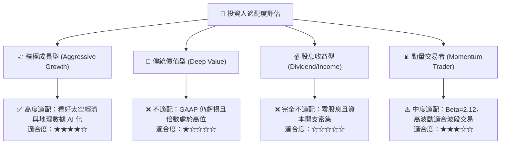

### 11.5 每季財報監控清單（Quarterly Watch List）

| 監控指標 | 基準健康區間 | 觸發【加碼】門檻 | 觸發【減碼/停損】門檻 |
|----------|--------------|------------------|----------------------|
| **季度營收 YoY 成長率** | 25.0% - 35.0% | **≥ 40.0%** | **< 20.0%** |
| **毛利率 (Gross Margin)** | 54.0% - 58.0% | **≥ 60.0%** | **< 50.0%** |
| **營業現金流 (OCF)** | > $20.0M / 季 | **≥ $35.0M** | **轉為負值 (< $0)** |
| **股權薪酬佔營收比重** | 12.0% - 16.0% | **< 10.0%** | **> 20.0%** |
| **帳上現金與短期投資** | > $500.0M | **持續上升** | **< $350.0M** |

### 11.6 反面論證：什麼會證明論點錯誤（What Would Change My Mind）

```
╔══════════════════════════════════════════════════════════════════╗
║              ⚠️ 論點失效條件（Disconfirming Evidence）           ║
╠══════════════════════════════════════════════════════════════════╣
║  若未來 2-4 季出現以下任一可量化情況，本多頭/持有論點將被推翻，  ║
║  投資評級將直接下調至【🔴 賣出 / 減碼】：                       ║
║                                                                  ║
║  1. 【成長中斷】：季度營收 YoY 增速連續兩季低於 18.0%。          ║
║  2. 【利潤惡化】：毛利率跌破 48.0%，代表數據定價能力遭遇競爭侵蝕║
║  3. 【現金失血】：自由現金流 FCF 連續兩季流出超過 $30.0M。       ║
║  4. 【資本效率受阻】：ROIC 未能逐年改善，持續徘徊於 -25% 以下。   ║
║  5. 【技術替代】：低成本合成孔徑雷達 (SAR) 或第三方無人機數據全面║
║     侵蝕中解析度光學遙測市場份額。                               ║
╚══════════════════════════════════════════════════════════════════╝
```

---
> **免責聲明**：本報告為 AI 自動生成之基本面研究，基於歷史公開財務數據與計量模型演算，僅供研究參考，不構成任何具體投資買賣建議。投資有風險，入市需獨立判斷與謹慎評估。