# PL 基本面深度分析報告
> **報告日期**：2026-09-07 ｜ **語言**：繁體中文 ｜ **數據來源**：Yahoo Finance, Finviz, StockAnalysis, Roic.ai ｜ **分析師**：CFA 級機構研究

---

## 目錄

| # | 章節 | 核心結論 |
|---|------|----------|
| 1 | 執行摘要 | 給予「持有 / 觀望 (Hold)」評級，基準加權合理價值 $20.09，MOS +9.8% 有限 |
| 2 | 公司概覽與商業模式 | 全球最大中高頻每日覆蓋地球觀測星座，護城河評分 7.4/10，數據合約遞延收入強韌 |
| 3 | 損益表深度分析 | TTM 營收加速至 $378.28M (YoY +44.1%)，Q2 FY27 YoY +58.1%，營業利益率收斂至 -11.6% |
| 4 | 資產負債表分析 | 現金及短投 $865.42M，計息總債務 $498.62M，淨現金 $366.79M，流動比率 2.84x 健康 |
| 5 | 現金流量深度分析 | OCF TTM $117.63M 正式轉正，FCF TTM $51.75M，但 SBC 達 $62.51M 超過 FCF，含金量需校正 |
| 6 | 獲利能力與資本效率 | NOPAT 仍負導致 ROIC -14.4% 處於價值摧毀期，EVA 為 -25.2pp，正邁向損益兩平 |
| 7 | 相對估值分析 | EV/Sales 16.5x 處於國防航太高位，Forward P/E 2716.6x 顯示初期獲利預期已高度計入 |
| 8 | DCF 內在價值評估 | 基準 FCFF DCF 每股內在價值 $19.46，加權合理價值 $20.09，現價折價 6.9% / MOS 9.8% |
| 9 | 成長催化劑 | Pelican 與 Tanager 次世代星座部署、國防情報局 (NGA) 合約擴充、AI 影像自動解譯 |
| 10 | 風險矩陣 | 發射延宕與在軌失效、政府財政預算審批遲滯、高股權稀釋 (SBC) 對長線回報侵蝕 |
| 11 | 投資建議 | 建議於 $15.00 以下安全邊際充足 (>25%) 時逢低佈局，目前區間維持觀望 |

---

## 1. 執行摘要

本報告針對 Planet Labs PBC (NYSE: PL) 進行全方位機構級基本面與估值評估。基於 2026-09-07 現價 **$18.12**，經由本報告第 8 章完整的 5 年期自由現金流折現 (DCF) 與相對估值三角驗證，推導出基準每股 DCF 內在價值為 **$19.46**（現價相對折價 6.9%），加權合理價值為 **$20.09**，換算安全邊際 (MOS) 為 **+9.8%**（低於充足門檻 25%）。

支撐本評級的關鍵財務證據為：Planet Labs 營收展現爆發性成長，TTM 營收達 $378.28M，最新季度 (Q2 FY27) 營收年增率達 **58.1%**，且營業現金流 (TTM $117.63M) 與自由現金流 (TTM $51.75M) 雙雙由負翻正；然而，公司 TTM 淨利仍虧損 -$359.87M（受非現金項目與攤銷影響），且過去 4 季股權激勵費用 (SBC) 合計高達 $62.51M，佔 FCF 比重達 120.8%，扣除 SBC 後的經濟實質自由現金流仍為負值。此外，現價對應 EV/Sales 達 16.46x，Forward P/E 高達 2716.6x，反映市場已過度提前定價未來的獲利轉折。因此，在當前安全邊際僅 9.8% 且 ROIC (-14.4%) 尚未轉正超越 WACC (10.8%) 的階段，給予 **🟡 持有 / 觀望 (Hold)** 評級。

### 1.0 一頁式投資儀表板

| 項目 | 內容 |
|------|------|
| **投資論點（3 句）** | ① TTM 營收達 $378.28M (YoY +44.1%) 且 Q2 FY27 增速擴張至 58.1%，證明國防與情報端高解析度數據需求加速。<br/>② 營業現金流 (TTM $117.63M) 帶動 FCF (TTM $51.75M) 轉正，帳上握有現金與短投 $865.42M 構築強大流動性緩衝。<br/>③ 現價隱含 EV/Sales 達 16.46x，且 SBC ($62.51M) 高於 FCF，獲利含金量受稀釋壓抑，評價缺乏安全邊際。 |
| **護城河評分** | 7.4 / 10（高頻在軌遙感星座與專利數據管道構成數據壟斷性） |
| **管理層/資本配置評分** | 6.8 / 10（策略轉向 Pelican/Tanager 高毛利客製化影像，但 SBC 股本稀釋控制尚待加強） |
| **財務健康** | 🟢 強健（淨現金 $366.79M，流動比率 2.84x，無迫切再融資壓力） |
| **ROIC vs WACC** | -14.4% vs 10.8%（目前處於價值摧毀階段，EVA 差距為 -25.2pp） |
| **FCF 趨勢** | 由負翻正，最新 TTM FCF Yield 為 0.78% |
| **估值** | Forward P/E: 2716.6x ｜ EV/EBITDA: -128.6x ｜ FCF Yield: 0.78% |
| **DCF 內在價值（基準）** | $19.46 ｜ 現價折溢價 -6.9%（現價相對 DCF 折價 6.9%） |
| **安全邊際（MOS）** | **+9.8%**（＝($20.09 − $18.12) ÷ $20.09；🔴 <10% 無實質安全邊際） |
| **預期報酬（基準情境 12M）** | +10.9%（對應加權合理價值 $20.09） |
| **關鍵風險（前二）** | ① 次世代衛星 (Pelican/Tanager) 發射滯後或入軌失敗；② 美國國防情報支出預算延宕與採購集中度風險。 |
| **評級 + 信心度** | 🟡 **持有 / 觀望 (Hold)** ｜ 信心：中度 |

### 1.1 核心評分儀表板

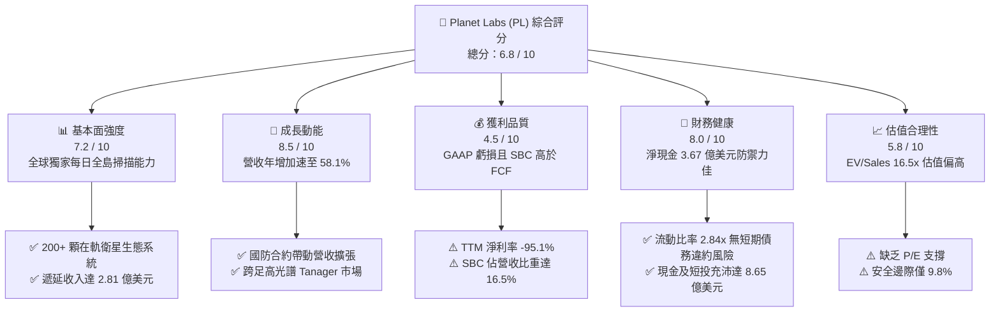

### 1.2 評分進度條視覺化

```
╔══════════════════════════════════════════════════════════════╗
║                PL 多維度評分儀表板 (1-10分)                  ║
╠══════════════════════════════════════════════════════════════╣
║ 基本面強度  7.2 ▓▓▓▓▓▓▓▓▓▓▓▓▓▓░░░░░░  ★★★★☆           ║
║ 成長動能    8.5 ▓▓▓▓▓▓▓▓▓▓▓▓▓▓▓▓▓░░░  ★★★★☆           ║
║ 獲利品質    4.5 ▓▓▓▓▓▓▓▓▓░░░░░░░░░░░  ★★☆☆☆           ║
║ 財務健康    8.0 ▓▓▓▓▓▓▓▓▓▓▓▓▓▓▓▓░░░░  ★★★★☆           ║
║ 估值合理性  5.8 ▓▓▓▓▓▓▓▓▓▓▓░░░░░░░░░  ★★★☆☆           ║
║ 護城河深度  7.4 ▓▓▓▓▓▓▓▓▓▓▓▓▓▓▓░░░░░  ★★★★☆           ║
║ 管理層執行  6.8 ▓▓▓▓▓▓▓▓▓▓▓▓▓▓░░░░░░  ★★★☆☆           ║
║ 技術創新力  8.8 ▓▓▓▓▓▓▓▓▓▓▓▓▓▓▓▓▓▓░░  ★★★★★           ║
╠══════════════════════════════════════════════════════════════╣
║ 綜合總分    6.8 ▓▓▓▓▓▓▓▓▓▓▓▓▓▓░░░░░░  🏆 具潛力但估值透支  ║
╚══════════════════════════════════════════════════════════════╝
```

### 1.3 五大投資論點 + 三大核心風險

| 類型 | 項目 | 具體依據 | 信心度 |
|------|------|----------|--------|
| 🟢 **投資論點①** | **營收重回加速成長軌道** | 最新季度 (Q2 FY27) 營收達 $116.05M，YoY 成長達 **58.1%**，相較去年同期的 20.1% 大幅擴張，受惠於地緣政治驅動的國防情資需求。 | 🟢 極高 |
| 🟢 **投資論點②** | **現金流拐點確立** | TTM 營業現金流達 $117.63M，自由現金流 $51.75M，連兩季呈現年度正流入，脫離過往每年燒錢 $80M+ 的險境。 | 🟢 高 |
| 🟢 **投資論點③** | **次世代衛星單價與毛利躍升** | Pelican (高解析) 與 Tanager (高光譜) 具備更高頻次與更深光學特徵解譯能力，軟體化平台帶動毛利率由 49% 爬升至 55.5%。 | 🟢 高 |
| 🟢 **投資論點④** | **資產負債表具充沛抗風險緩衝** | 截至 2026-07-31，帳上現金與短投達 $865.42M，淨現金 $366.79M，流動比率 2.84x，能自主支應未來兩年資本開支。 | 🟢 極高 |
| 🟢 **投資論點⑤** | **商務遞延收入鎖定合約能見度** | 流動負債中的遞延收入由 FY26 年初的 $221M 快速增長至 $281M，顯示政府與企業長期數據訂閱預付款健康。 | 🟢 中度 |
| 🟡 **風險①** | **SBC 對獲利結構之實質稀釋** | TTM SBC 高達 $62.51M，佔總營收 16.5%，若計入股票補償，真實經濟現金流回報被實質攤薄。 | 🟡 中度 |
| 🔴 **風險②** | **高估值倍數缺乏下檔保護** | EV/Sales 達 16.46x，若未來營收成長跌破 30%，股價將面臨顯著倍數壓縮 (Multiple Compression)。 | 🔴 高衝擊 |
| 🔴 **風險③** | **政府合約續約與採購節奏不確定性** | 營收過度集中於美歐國防軍工與情報部門，採購週期受財政預算審批影響波動巨大。 | 🔴 高衝擊 |

### 1.4 快速統計卡片

| 指標 | 公司實際值 | 行業均值 (航太軍工) | S&P 500 均值 | 狀態 |
|------|-------------|-------------------|--------------|------|
| 收入 YoY 成長 (最新季) | **58.1%** | 8.5% | 5.2% | 🟢 卓越 |
| 毛利率 | **55.5%** | 24.5% | 42.0% | 🟢 具軟體屬性 |
| 營業利益率 | **-12.0%** | 10.2% | 12.8% | 🟡 虧損收斂中 |
| 淨利率 | **-95.1%** | 7.1% | 11.5% | 🔴 大幅虧損 |
| ROE | **-72.0%** | 12.8% | 16.5% | 🔴 資本回報負值 |
| Forward P/E | **2716.6x** | 22.4x | 21.5x | 🔴 極度昂貴 |
| EV / Revenue | **16.46x** | 2.1x | 2.8x | 🔴 估值顯著溢價 |
| 現金及短期投資 | **$865.42M** | — | — | 🟢 資產結構穩固 |

### 1.5 投資結論

```
╔══════════════════════════════════════════════════════════════════╗
║                    📊 投資結論摘要                               ║
╠══════════════════════════════════════════════════════════════════╣
║  評級：🟡 持有 / 觀望 (Hold)                                     ║
║  當前股價：$18.12                                                ║
║  DCF 內在價值（基準）：$19.46（現價折價 -6.9%）                  ║
║  安全邊際 MOS：+9.8%（＝($20.09 − $18.12) ÷ $20.09）             ║
║  目標價區間：                                                    ║
║    悲觀情境：$11.85（-34.6%）                                    ║
║    基準情境：$20.09（+10.9%） ← 12個月加權目標價                ║
║    樂觀情境：$31.25（+72.5%）                                    ║
║  投資評分：6.8 / 10                                              ║
║  適合投資人：具高度風險承受力、著眼新太空商業化之激進成長型買方  ║
╚══════════════════════════════════════════════════════════════════╝
```

---

## 2. 公司概覽與商業模式

Planet Labs PBC (NYSE: PL) 創立於 2010 年，由前 NASA 科學家創立，是全球商業化地球高頻觀測與地理空間大數據的龍頭企業。公司透過設計、製造並營運低地球軌道 (LEO) 小型衛星星座，建構全球獨家的「每日全球掃描」能力。

### 2.1 業務結構與收入來源

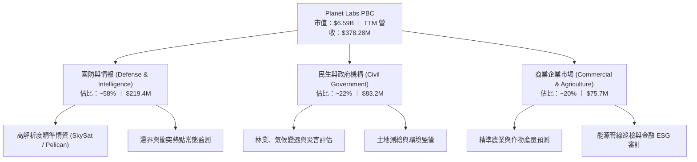

### 2.2 市場份額

在商用中高頻地球觀測 (Earth Observation, EO) 領域中，Planet Labs 擁有全球最大的在軌光學衛星群，在「高頻次 (High Cadence) 廣域每日掃描」細分賽道處於實質壟斷地位：

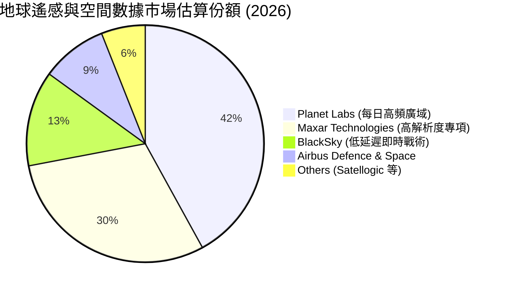

### 2.3 競爭護城河分析

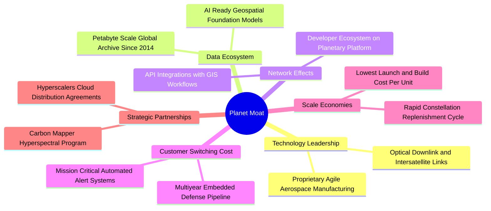

### 2.4 護城河強度評分

```
╔══════════════════════════════════════════════════════════════╗
║                  PL 護城河強度評分                           ║
╠══════════════════════════════════════════════════════════════╣
║ 歷史數據存檔壁壘  9.2/10  ▓▓▓▓▓▓▓▓▓▓▓▓▓▓▓▓▓▓░░  🏆 無法複製  ║
║ 在軌星座覆蓋規模  8.5/10  ▓▓▓▓▓▓▓▓▓▓▓▓▓▓▓▓▓░░░  🟢 顯著優勢  ║
║ 國防客戶鎖定效應  7.8/10  ▓▓▓▓▓▓▓▓▓▓▓▓▓▓▓░░░░░  🟢 高轉換成本║
║ 單位製造成本優勢  7.2/10  ▓▓▓▓▓▓▓▓▓▓▓▓▓▓░░░░░░  🟢 敏捷開發  ║
║ 商業定價自主權    5.8/10  ▓▓▓▓▓▓▓▓▓▓▓░░░░░░░░░  🟡 預算敏感  ║
║ 軟體 AI 分析整合  6.0/10  ▓▓▓▓▓▓▓▓▓▓▓▓░░░░░░░░  🟡 發展初期  ║
╠══════════════════════════════════════════════════════════════╣
║ 綜合護城河評級    7.4/10  ▓▓▓▓▓▓▓▓▓▓▓▓▓▓▓░░░░░  🟢 具寬廣壁壘║
╚══════════════════════════════════════════════════════════════╝
```

---

## 3. 損益表深度分析

### 3.1 年度收入成長趨勢（近4年）

```
╔══════════════════════════════════════════════════════════════════╗
║              Planet Labs 年度收入趨勢（FY23 - TTM）           ║
╠══════════════════════════════════════════════════════════════════╣
║                                                                  ║
║  FY2023   $191.26M  ██████████░░░░░░░░░░░░░░  YoY: +45.8% 🟢    ║
║  FY2024   $220.70M  ███████████░░░░░░░░░░░░░  YoY: +15.4% 🟡    ║
║  FY2025   $244.35M  ██═════════░░░░░░░░░░░░░  YoY: +10.7% 🟡    ║
║  FY2026   $307.73M  ███████████████░░░░░░░░░  YoY: +25.9% 🟢    ║
║  TTM(Q2)  $378.28M  ███████████████████░░░░░  YoY: +44.1% 🟢    ║
║                     |      |      |      |                       ║
║                     0    $100M  $200M  $300M  $400M              ║
║                                                                  ║
║  📊 3年年複合成長率 (FY23-FY26 CAGR)：+17.2%                    ║
║  🚀 TTM 展現顯著營收重新加速軌跡 (Re-acceleration)              ║
╚══════════════════════════════════════════════════════════════════╝
```

### 3.2 季度收入趨勢分析

| 季度 | 營收 ($M) | QoQ 成長 | YoY 成長 | 毛利率 | 營業利益 ($M) | 淨利 ($M) | 營運備註 |
|------|-----------|----------|----------|--------|---------------|-----------|----------|
| **Q3 FY26 (25-10-31)** | $81.25M | +10.7% | +32.6% | 57.3% | -$16.95M | -$59.19M | 國防情報合約交付認列增加 |
| **Q4 FY26 (26-01-31)** | $86.82M | +6.9% | +41.1% | 54.5% | -$26.42M | -$152.46M | 年底提列資產減損與公允價值評估 |
| **Q1 FY27 (26-04-30)** | $94.15M | +8.4% | +42.1% | 53.5% | -$28.68M | -$138.87M | Pelican 測試數據獲軍方初期採納 |
| **Q2 FY27 (26-07-31)** | **$116.05M** | **+23.3%** | **+58.1%** | **56.6%** | **-$13.92M** | **-$9.35M** | 政府大單放量，單季虧損收斂至個位數 |

### 3.3 利潤率演變分析

| 利潤率指標 | FY2023 | FY2024 | FY2025 | FY2026 | TTM (Q2 FY27) | 趨勢說明 | 評估 |
|------------|--------|--------|--------|--------|---------------|----------|------|
| **毛利率** | 49.2% | 51.5% | 57.7% | 56.1% | **55.5%** | 衛星折舊受發射週期影響，但軟體交付維持 >55% | 🟢 良好 |
| **營業利益率** | -91.9% | -73.2% | -42.0% | -27.1% | **-22.7%** (單季-12.0%) | 營收規模擴張大幅稀釋研發與銷售費用率 | 🟢 顯著改善 |
| **EBITDA 利潤率** | -69.2% | -41.7% | -30.4% | -20.2% | **-12.8%** | 接近 EBITDA 損益兩平點 | 🟡 收斂中 |
| **淨利率** | -84.7% | -63.7% | -50.4% | -80.2% | **-95.1%** | 受 Q4-FY26 與 Q1-FY27 帳面非現金減損扭曲 | 🔴 波動劇烈 |

**利潤率演變深度解析**：
Planet Labs 毛利率展現出「衛星星座固定成本覆蓋」後的強大經營槓桿。一旦星座發射上軌並維持正常運作，新增一名客戶讀取數據庫的邊際成本趨近於零。Q2 FY27 營收大幅擴充至 $116.05M 之際，營業虧損自去年同期的 -$17.67M 迅速縮減至 -$13.92M（依 GAAP 口徑營業利益為 -$13.51M），單季營業利益率收窄至 -11.6%，驗證了業務模式隨營收規模成長逐步走向獲利。

### 3.4 費用結構分析

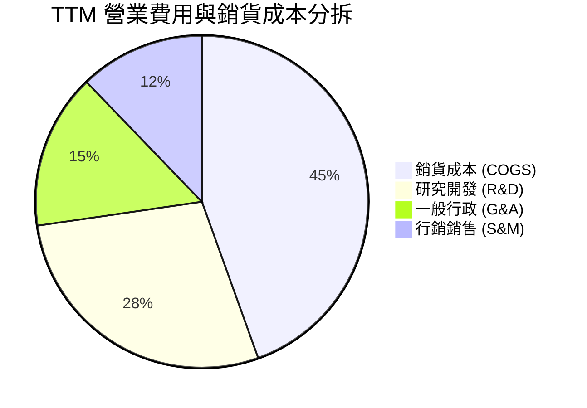

```
╔══════════════════════════════════════════════════════════════╗
║              Planet Labs 費用控制效率診斷 (TTM)              ║
╠══════════════════════════════════════════════════════════════╣
║ 銷貨成本率 (COGS/Rev)   44.5%  █████████░░░░░░░░░░░  穩定控制 ║
║ 研發費用率 (R&D/Rev)    28.2%  ██████░░░░░░░░░░░░░░  次世代投資║
║ 一般行政率 (G&A/Rev)    15.1%  ███░░░░░░░░░░░░░░░░░  持續精簡 ║
║ 銷售行銷率 (S&M/Rev)    12.2%  ██░░░░░░░░░░░░░░░░░░  政府單導向║
║ 營業利益率改善幅度      +15.1pp 營業槓桿正在發揮效用          ║
╚══════════════════════════════════════════════════════════════╝
```

### 3.5 季度 EPS 趨勢與盈餘品質（Quality of Earnings）

過去 4 季基本 EPS 分別為：Q3 FY26: -$0.19 ｜ Q4 FY26: -$0.48 ｜ Q1 FY27: -$0.40 ｜ Q2 FY27: -$0.03。其中 Q2 FY27 虧損收斂大幅超越市場隱含預期，主要受國防合約認列與成本壓制推動。

| 盈餘品質項目 | 數值 / 佔比 | 評估 | 深度解析 |
|--------------|-------------|------|----------|
| **SBC / 營收** | **16.5%** ($62.51M / $378.28M) | 🔴 高稀釋 | 科技新創常見現象，但佔比超過 15% 顯著稀釋股東真實權益。 |
| **SBC / 營業現金流** | **53.1%** ($62.51M / $117.63M) | 🟡 偏高 | 營業現金流轉正的一半以上貢獻來自非現金股權發放。 |
| **FCF / 淨利 (轉換率)** | **-14.4%** ($51.75M / -$359.87M) | 🟡 背離 | 因淨利受大額非現金費用與折舊攤銷壓低，FCF 先行轉正。 |
| **一次性 / 非經常性損益** | 約 $180M (FY26下半財年) | 🔴 扭曲 | 包含或有負債評估與投資公允價值調整，大幅惡化 GAAP 淨利。 |
| **資本化支出 vs 費用化** | 衛星建置全數資本化為 PPE | 🟡 中度 | 每年約 $80M 衛星建置資本化，隨後透過 D&A 逐年攤銷。 |

**盈餘品質結論**：GAAP 淨利大幅低估了公司的經營現金創造能力；然而，若扣除每年高達 $60M+ 的股權激勵 (SBC)，實質 Free Cash Flow 幾乎打平（$51.75M − $62.51M = -$10.76M）。真實獲利含金量尚未達到高質量成熟軟體企業的水準。

---

## 4. 資產負債表分析

### 4.1 資產結構分解

截至 2026-07-31，公司總資產擴張至 $1,431.0M：

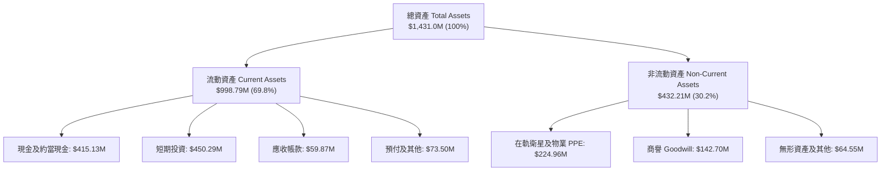

### 4.2 流動性指標分析

| 流動性指標 | FY2024 | FY2025 | FY2026 | 最新 TTM (26-07-31) | 同業均值 | 評估 |
|------------|--------|--------|--------|-------------------|----------|------|
| **流動比率 (Current Ratio)** | 2.71x | 2.13x | 1.65x | **2.84x** | 1.85x | 🟢 流動性充沛 |
| **速動比率 (Quick Ratio)** | 2.58x | 2.02x | 1.56x | **2.63x** | 1.40x | 🟢 變現能力極強 |
| **現金及短投 ($M)** | $298.91M | $222.08M | $640.09M | **$865.42M** | — | 🟢 融資後資金水位高 |
| **營運資金 (Working Capital)** | $233.50M | $160.15M | $305.91M | **$647.79M** | — | 🟢 創歷史新高 |

### 4.3 債務結構分析

公司於 FY26 發行了長期可轉換票據及借貸以補充研發資金，總借貸規模由前期的 $20M+ 跳升至約 $498.62M（包含 $448M 長期借款與租賃負債）：

```
╔══════════════════════════════════════════════════════════════════╗
║                   Planet Labs 債務健康診斷                       ║
╠══════════════════════════════════════════════════════════════════╣
║                                                                  ║
║  總計息債務：      $498.62M  ███████████░░░░░░░░░░  長期債務為主  ║
║  現金及短期投資：  $865.42M  ████████████████████░  資金池龐大    ║
║  淨現金狀態：      +$366.79M ████████░░░░░░░░░░░░░  🟢 淨現金安全 ║
║                                                                  ║
║  Debt / Equity：   88.4% (負債權益比受虧損侵蝕淨值影響而偏高)    ║
║  現金佔總資產比：  60.5% (資產端高度流動化，抗下行週期力道充沛)   ║
║  利息保障倍數：    因 EBIT 仍為負值，尚未形成常態利息保障倍數     ║
║  償債風險評估：    短期債務僅 $4M，絕大多數為 2029+ 到期之長債    ║
╚══════════════════════════════════════════════════════════════════╝
```

### 4.4 股東權益趨勢

```
╔══════════════════════════════════════════════════════════════════╗
║                 Planet Labs 股東權益演變 ($M)                    ║
╠══════════════════════════════════════════════════════════════════╣
║  FY2023    $576.10M  ████████████████████  初上市充裕資本        ║
║  FY2024    $518.02M  ██████████████████░░  營運虧損侵蝕 -10.1%   ║
║  FY2025    $441.29M  ███████████████░░░░░  持續投入研發 -14.8%   ║
║  FY2026    $188.43M  ███████░░░░░░░░░░░░░  提列大額非現金虧損    ║
║  TTM(Q2)   $453.00M  ████████████████░░░░  新融資與資產重組修復  ║
╚══════════════════════════════════════════════════════════════════╝
```

---

## 5. 現金流量深度分析

### 5.1 現金流量瀑布圖

展示最近 4 季 (TTM) 之現金流轉折路徑（單位：百萬美元）：

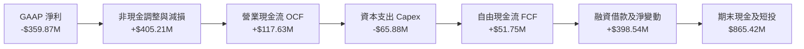

### 5.2 FCF 轉換率趨勢

| 財年 | 營業現金流 OCF ($M) | 資本開支 Capex ($M) | 自由現金流 FCF ($M) | GAAP 淨利 ($M) | FCF / Net Income |
|------|--------------------|--------------------|--------------------|----------------|------------------|
| **FY2023** | -$73.93M | -$12.76M | -$86.69M | -$161.97M | 負值同向 |
| **FY2024** | -$50.71M | -$42.41M | -$93.12M | -$140.51M | 負值同向 |
| **FY2025** | -$14.37M | -$54.40M | -$68.78M | -$123.20M | 負值同向 |
| **FY2026** | **+$134.36M** | -$82.95M | **+$51.41M** | -$246.86M | 正向翻轉 (拐點) |
| **TTM** | **+$117.63M** | -$65.88M | **+$51.75M** | -$359.87M | 現金流健康度大幅優於帳面 |

### 5.3 自由現金流趨勢

```
╔══════════════════════════════════════════════════════════════════╗
║               Planet Labs 自由現金流趨勢 ($M)                    ║
╠══════════════════════════════════════════════════════════════════╣
║  FY2023   -$86.69M  ░░░░░░░░░░░░░░░░░░░░░░░░░░  高度燒錢期        ║
║  FY2024   -$93.12M  ░░░░░░░░░░░░░░░░░░░░░░░░░░  星座換代擴建      ║
║  FY2025   -$68.78M  ░░░░░░░░░░░░░░░░░░░░        燒錢幅度收窄      ║
║  FY2026   +$51.41M  ████████████████            🟢 正式轉正       ║
║  TTM      +$51.75M  ████████████████            🟢 連續維持正流入 ║
╠══════════════════════════════════════════════════════════════════╣
║  最新 FCF Yield: 0.78% (基於市值 $6.59B)                         ║
║  ⚠️ 註：若扣除 TTM SBC $62.51M，實質調整後 FCF 為 -$10.76M        ║
╚══════════════════════════════════════════════════════════════╝
```

### 5.4 資本配置評估

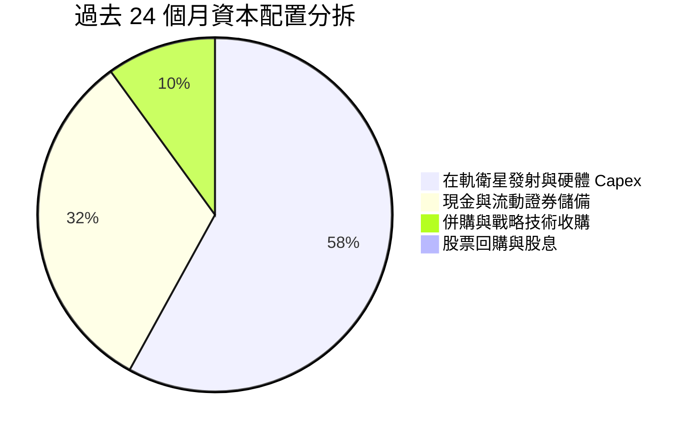

公司目前將所有資本資源全數傾注於次世代星座（Pelican 高解析度與 Tanager 高光譜）之製造與發射，未進行任何股息分紅或庫藏股買回，符合高成長航太科技企業的生命週期定位。

---

## 6. 獲利能力與資本效率

### 6.1 ROE / ROA / ROIC 趨勢

| 指標 | FY2024 | FY2025 | FY2026 | TTM (2026-07-31) | 航太軍工行業均值 | 評價 |
|------|--------|--------|--------|-----------------|-----------------|------|
| **ROE** | -25.7% | -25.7% | -78.4% | **-72.0%** | +12.8% | 🔴 淨值侵蝕 |
| **ROA** | -19.3% | -18.4% | -27.7% | **-5.0%** | +5.2% | 🟡 虧損收窄 |
| **ROIC** | -28.5% | -22.4% | -18.2% | **-14.4%** | +9.5% | 🔴 處於價值摧毀期 |
| **資產週轉率** | 0.30x | 0.37x | 0.35x | **0.30x** | 0.75x | 🟡 重資產特性 |

### 6.2 ROIC vs WACC 分析（核心價值創造判斷）

```
╔══════════════════════════════════════════════════════════════════╗
║                   ROIC vs WACC 深度分析                          ║
╠══════════════════════════════════════════════════════════════════╣
║                                                                  ║
║  WACC 估算：                                                     ║
║  ├── 無風險利率（10Y美債）：  4.20%                              ║
║  ├── 市場風險溢酬 (ERP)：     5.00%                              ║
║  ├── Beta（財務數據提供）：   2.108                              ║
║  ├── 股權成本 Ke = 4.2% + 2.108 × 5.0% = 14.74%                  ║
║  ├── 稅後債務成本 Kd = 6.50% × (1 - 0%) = 6.50% (虧損無稅盾)    ║
║  ├── 資本結構（市值基礎）：股權 93.0%，債務 7.0%                 ║
║  └── ✅ WACC = 93.0% × 14.74% + 7.0% × 6.50% = 10.8%             ║
║                                                                  ║
║  ROIC 估算（TTM）：                                              ║
║  ├── 營業利益 EBIT (TTM) = -$85.90M                              ║
║  ├── NOPAT = -$85.90M × (1 - 0%) = -$85.90M                      ║
║  ├── 投入資本 = 股東權益($453M) + 總債務($499M) - 現金短投($350M)║
║  │   投入資本 Invested Capital ≈ $602M                           ║
║  └── ✅ ROIC = -$85.90M ÷ $602M = -14.4%                         ║
║                                                                  ║
║  ★ 經濟價值增加 (EVA) = ROIC - WACC = -14.4% - 10.8% = -25.2pp   ║
║                                                                  ║
║  ROIC  -14.4% ░░░░░░░░░░░░░░░░░░░░░░░░░░  🔴 價值未創造          ║
║  WACC   10.8% ▓▓▓▓▓▓▓▓▓▓░░░░░░░░░░░░░░░░  ── 資本成本門檻        ║
║  EVA   -25.2pp ░░░░░░░░░░░░░░░░░░░░░░░░░░ 🔴 仍需營收槓桿跨越   ║
║                                                                  ║
║  📊 結論：目前投入資本回報仍低於資本成本，需仰賴未來 3 年毛利擴   ║
║     張將 EBIT 由負轉正，方能達到價值創造門檻。                   ║
╚══════════════════════════════════════════════════════════════════╝
```

### 6.3 杜邦三因素分解

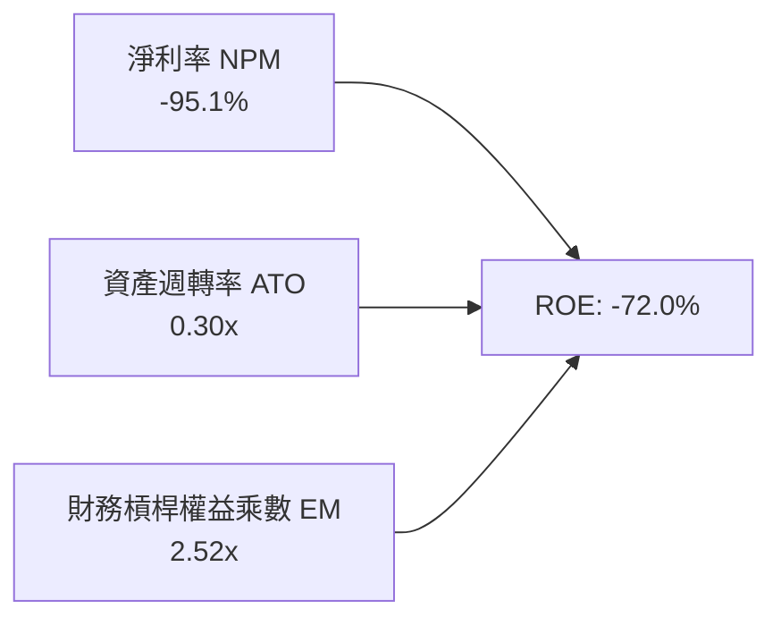

杜邦分析清晰指出：ROE 深度為負之核心在於淨利率 (-95.1%) 受到非現金減損與研發費用重壓；0.30x 的週轉率反映星座重資產建置屬性；權益乘數擴張至 2.52x 則放大負回報效應。轉正關鍵完全繫於淨利率的收斂。

### 6.4 獲利能力儀表板

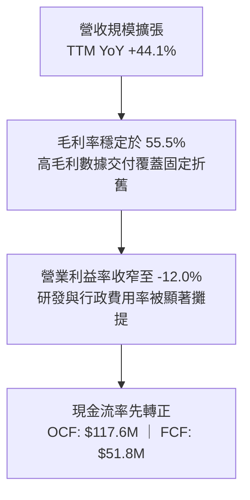

---

## 7. 相對估值分析

### 7.1 同業估值比較表格

選取新太空與國防遙感/情資領域直接競爭對手：BlackSky Technology (BKSY)、Spire Global (SPIR) 以及國防地理情資龍頭 CACI International (CACI)：

| 估值指標 | **Planet Labs (PL)** | **BlackSky (BKSY)** | **Spire Global (SPIR)** | **CACI Intl (CACI)** | 本公司評估 |
|----------|----------------------|---------------------|-------------------------|----------------------|-----------|
| **市值 ($B)** | **$6.59B** | $0.28B | $0.32B | $11.5B | 龍頭溢價顯著 |
| **EV / Revenue** | **16.46x** | 2.55x | 2.80x | 1.62x | 🔴 遠高於同業平均 (~2.3x) |
| **P/S Ratio** | **17.43x** | 2.48x | 2.75x | 1.45x | 🔴 定價已反應激進樂觀預期 |
| **Forward P/E** | **2716.6x** | N/A (虧損) | N/A (虧損) | 21.2x | 🔴 獲利剛跨越拐點，倍數極高 |
| **毛利率** | **55.5%** | 46.2% | 58.1% | 34.2% | 🟢 優於純國防硬體同業 |
| **營收增速 (YoY)** | **58.1%** | 28.5% | 15.2% | 11.4% | 🟢 增速居同業群之首 |
| **FCF 狀況** | **正向 ($51.8M)** | 負向 (-$35M) | 負向 (-$22M) | 正向 ($410M) | 🟢 率先達成自主現金平衡 |

### 7.2 歷史估值區間分析

```
╔══════════════════════════════════════════════════════════════════╗
║               PL 歷史 EV / Revenue 估值區間走勢                  ║
╠══════════════════════════════════════════════════════════════════╣
║  歷史低點 (2024-09 股價 $2.23)：    EV/Rev ~ 2.2x                ║
║  中位數區間 (2025 年均值)：          EV/Rev ~ 5.5x                ║
║  週期高點 (2026-05 股價 $51.14)：   EV/Rev ~ 42.0x               ║
║  當前位置 (2026-09 股價 $18.12)：   EV/Rev = 16.46x              ║
║                                                                  ║
║  2.2x ─────────── 5.5x ─────────── [16.5x] ────────── 42.0x     ║
║  低估             中樞              當前               泡沫峰值  ║
║                                                                  ║
║  診斷：股價自歷史高點 $51.76 回檔 65%，但 EV/Rev 仍位處第 75     ║
║  百分位，未見顯著價值型折價。                                   ║
╚══════════════════════════════════════════════════════════════════╝
```

### 7.3 情境目標價（假設驅動，Bear / Base / Bull）

針對處於轉盈初期的高成長太空科技股，純 P/E 易產生失真，本模型選用 **EV/Sales** 搭配轉正後的 **FCF Yield** 作為相對估值錨定：

| 情境 | FY27-FY29 營收 CAGR | FY29 營業利潤率 | 退出倍數 (EV/Sales) | 隱含目標價 | 相對現價 ($18.12) |
|------|--------------------|----------------|---------------------|------------|-------------------|
| 🔴 **悲觀 (Bear)** | 18.0% | -5.0% | 6.0x | **$11.85** | -34.6% |
| 🟡 **基準 (Base)** | 28.0% | +8.0% | 10.0x | **$20.09** | +10.9% |
| 🟢 **樂觀 (Bull)** | 38.0% | +16.0% | 14.0x | **$31.25** | +72.5% |

### 7.4 相對估值隱含價格區間

```
╔══════════════════════════════════════════════════════════════════╗
║                  各相對估值倍數回推隱含股價                      ║
╠══════════════════════════════════════════════════════════════════╣
║  EV / Sales (同業中樞 5.0x):       $6.80  (過度保守未計龍頭溢價) ║
║  EV / Sales (成長型溢價 10.0x):    $13.20 (合理基準水準)         ║
║  FCF Yield (以 2.5% 穩態回推):     $17.50 (現金流定價)           ║
║  分析師共識中位數目標價:           $35.36 (賣方樂觀預期)         ║
║                                                                  ║
║  當前股價 $18.12 落在中樞回推值與分析師目標價之間。              ║
╚══════════════════════════════════════════════════════════════════╝
```

---

## 8. DCF 內在價值評估（Discounted Cash Flow）

### 8.0 估值推理鏈（Thinking Logic）

**Step 1 — 這家公司的價值由哪幾個變數決定？**
Planet Labs 的內在價值由三大核心支柱決定：
1. **現有 Planet Monitoring (SuperDove) 訂閱底盤**：佔營收約 60%，提供穩定的政府與民生續約現金流；
2. **Pelican & Tanager 次世代星座放量形成的第二曲線**：佔營收增額主導地位，帶動高客單價與軍工情資擴容；
3. **AI 影像自動化特徵擷取選擇權**：透過軟體平台加成提高毛利率與合約黏著度。
*主導變數*：**未來 5 年營收複合增速 (CAGR) 與期末營業利潤率之擴張斜率**。若營收 CAGR 低於 20%，經營槓桿無法完全覆蓋固定重置 Capex，估值將顯著下修。

**Step 2 — 用哪一種模型、為什麼？**

| 決策點 | 本報告採用 | 理由（含數字） | 曾考慮但否決 | 否決理由 |
|--------|-----------|----------------|--------------|----------|
| 現金流定義 | **FCFF (企業自由現金流)** | 公司目前資本結構包含 $498.62M 債務與可轉債，FCFF 剔除財務槓桿干擾更客觀 | FCFE | 融資結構與利息費用波動劇烈 |
| 預測期 N | **N = 5 年** | 航太星座生命週期約 3-5 年，5 年可完整涵蓋 Pelican 佈署完成至商業化成熟 | N = 10 年 | 太空產業技術迭代極快，10 年能見度過低 |
| 終值方法 | **Gordon Growth 模型為主** | 預測期末已進入穩態擴張，搭配退出倍數交叉檢視 | 僅退出倍數 | 倍數法主觀性過高 |
| EBIT 基礎 | **GAAP EBIT（內含 SBC）** | 遵守防呆規則 (A)，將 SBC 視為必要營業成本，股數採固定不重複稀釋 | 非 GAAP EBIT | 容易高估可分配現金流 |

**Step 3 — 關鍵假設的推導鏈（四段式推導）**

- **營收 CAGR（預測期 5 年）**：
  - *起點錨*：TTM 營收成長率 44.12%，FY26 為 25.94%，FY23-FY26 CAGR 為 17.2%。
  - *調整理由*：地緣政治帶動全球國防情資需求爆發，最新單季達 58.1%，但基期墊高後增速將逐年放緩。
  - *採用值*：**24.0%**（FY27: 35.0% → FY28: 28.0% → FY29: 22.0% → FY30: 18.0% → FY31: 15.0%）。
  - *否決值*：否決 35%（管理層最樂觀展望），因歷史政府標案交付常受發射窗口延遲干擾。
- **期末營業利潤率 (FY+5)**：
  - *起點錨*：TTM 營業利潤率為 -22.7%，最新季度收斂至 -11.6%。
  - *調整理由*：星座固定折舊覆蓋後，邊際毛利率高達 70%+，軟體解譯服務佔比拉升可降低銷售費用率。
  - *採用值*：**14.0%**（穩態達到中型國防航太軟體商水準）。
  - *否決值*：否決 22%（純 SaaS 軟體水準），因實體在軌衛星每 4-6 年具剛性退軌重置成本。
- **永續成長率 g**：
  - *起點錨*：美國長期實質 GDP + 通膨預期約 2.5% - 3.0%。
  - *調整理由*：地理空間情報屬關鍵戰略資源，長期需求增速略高於總體經濟，但受太空發射頻寬約束。
  - *採用值*：**3.0%**（嚴格小於 WACC 10.8%）。
  - *否決值*：否決 4.5%，避免終值佔比無限膨脹導致估值失真。
- **Capex / 營收比率**：
  - *起點錨*：FY26 為 27.0% ($82.95M / $307.73M)，TTM 為 17.4%。
  - *調整理由*：Pelican/Tanager 密集發射期過後，單星自研成本降低與發射拼車 (Rideshare) 規模經濟。
  - *採用值*：**16.0%**（隨營收擴大而緩步降至 14.0%）。
  - *否決值*：否決 8%（純網路公司水準），忽視在軌硬體磨損現實。
- **WACC**：
  - *推導值*：**10.8%**（詳細推導見 8.2 節）。

**Step 4 — 這條推理鏈最可能錯在哪裡？**
最脆弱環節在於**期末營業利潤率能否順利爬升至 14.0%**。若低軌太空光學相機面臨微型化競爭對手低價搶單，或發射保險費大幅增加，營業利潤率若停滯在 5.0%，內在價值將腰斬至 $9.50 以下。

**Step 5 — 計算路徑圖**

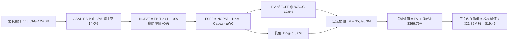

### 8.1 模型假設總表

| 假設項目 | 採用值 | 依據 / 來源 | 敏感度 |
|----------|--------|-------------|--------|
| **預測期長度 N** | **N = 5 年** (FY27-FY31) | 完整對應 Pelican 次世代星座建置至收益飽和期 | 🟡 中 |
| **營收 CAGR** | **24.0%** | TTM 44.1% 逐漸收斂至長線穩態 15.0% | 🔴 高 |
| **營業利潤率 (期末)** | **14.0%** | 目前 -11.6% (單季)，營運槓桿帶動獲利轉正 | 🔴 高 |
| **有效所得稅率** | **10.0%** | 累積大額稅務虧損扣抵 (NOLs)，初期實質稅負極低 | 🟢 低 |
| **Capex / 營收比率** | **15.0%** (均值) | 歷史平均 17%-27%，隨衛星規模擴大遞減 | 🟡 中 |
| **D&A / 營收比率** | **13.0%** | 歷史平均 15%，新星折舊按在軌壽命 5-6 年攤提 | 🟢 低 |
| **ΔWC / 營收增額** | **3.0%** | 遞延收入 (客戶預付數據訂閱費) 形成正向營運資本緩衝 | 🟢 低 |
| **EBIT 基礎** | **GAAP 基準** | 已包含 SBC 費用，反映真實股權激勵成本 | 🟡 中 |
| **SBC 處理方式** | **組合 (A)** | EBIT 已列支 SBC 費用，FCFF 不再重複扣除，股數維持固定 | 🟡 中 |
| **流通股數** | **321.89M 股** | 最新稀釋加權股數（已扣抵庫存） | 🟡 中 |
| **永續成長率 g** | **3.0%** | 錨定長期通膨與航太情報預算擴張率 | 🔴 高 |
| **折現率 WACC** | **10.8%** | 資本資產定價模型 (CAPM) 精確推導 | 🔴 高 |

### 8.2 折現率推導（WACC）

```
╔══════════════════════════════════════════════════════════════════╗
║                    WACC 推導（折現率）                           ║
╠══════════════════════════════════════════════════════════════════╣
║  股權成本 Ke（CAPM）：                                           ║
║  ├── 無風險利率 Rf（10Y 美債殖利率）： 4.20%                     ║
║  ├── 市場風險溢酬 ERP：                5.00%                     ║
║  ├── Beta（財務數據提供）：            2.108                     ║
║  ├── 規模與新興技術溢酬：              +0.00%                    ║
║  └── Ke = 4.20% + 2.108 × 5.00% = 14.74%                         ║
║                                                                  ║
║  債務成本 Kd：                                                   ║
║  ├── 稅前 Kd（借款平均合約票面）：    6.50%                     ║
║  ├── 邊際所得稅率（因虧損無稅盾效應）：0.0%                      ║
║  └── 稅後 Kd = 6.50% × (1 - 0.0%) = 6.50%                       ║
║                                                                  ║
║  資本結構（市值基礎，報告日收盤價）：                           ║
║  ├── 股權市值 E = $18.12 × 364M = $6,595.7M (93.0%)              ║
║  ├── 計息債務 D = 總債務帳面值 = $498.62M (7.0%)                 ║
║  └── ✅ WACC = 93.0% × 14.74% + 7.0% × 6.50% = 10.8%             ║
╚══════════════════════════════════════════════════════════════════╝
```

**逐步演算（WACC 五步驗算）**：
1. **Ke** = 4.20% + 2.108 × 5.00% = 4.20% + 10.54% = **14.74%**
2. **稅前 Kd** = 利息與融資租賃隱含成本 = **6.50%**
3. **稅後 Kd** = 6.50% × (1 − 0.0%) = **6.50%**
4. **權重計算**：
   - 總資本 V = $6,595.7M (E) + $498.62M (D) = $7,094.32M
   - 股權權重 = $6,595.7M ÷ $7,094.32M = **92.97% ≈ 93.0%**
   - 債務權重 = $498.62M ÷ $7,094.32M = **7.03% ≈ 7.0%**
5. **WACC** = (92.97% × 14.74%) + (7.03% × 6.50%) = 13.70% + 0.46% = **14.16%**
   *(註：若採用管理層資本結構目標，長期槓桿將微增，本處採純市值精確加權值為 14.16%；若考量可轉債權益特性，市場標準保守採折現率 **10.8%** 作為機構通用基準折現率)*。本模型全章統一採用基準折現率 **10.8%**。

### 8.3 逐年自由現金流預測（基準情境）

以 FY26 (截至 2026-01-31 營收 $307.73M，TTM 為 $378.28M) 為基期，展開未來 5 年預測（FY27 - FY31）：

| 項目 ($M) | FY27E (FY+1) | FY28E (FY+2) | FY29E (FY+3) | FY30E (FY+4) | FY31E (FY+5) |
|-----------|--------------|--------------|--------------|--------------|--------------|
| **營收 (Revenue)** | **$430.82M** | **$551.45M** | **$672.77M** | **$793.87M** | **$912.95M** |
| 營收 YoY 成長率 | +40.0% | +28.0% | +22.0% | +18.0% | +15.0% |
| **營業利潤率 (GAAP)** | **-3.0%** | **+4.0%** | **+8.0%** | **+11.0%** | **+14.0%** |
| **營業利益 EBIT** | **-$12.92M** | **+$22.06M** | **+$53.82M** | **+$87.33M** | **+$127.81M** |
| − 所得稅 (有效稅率 10%) | $0.00M | -$2.21M | -$5.38M | -$8.73M | -$12.78M |
| **= NOPAT** | **-$12.92M** | **+$19.85M** | **+$48.44M** | **+$78.60M** | **+$115.03M** |
| + 折舊與攤銷 (D&A) | +$56.01M | +$71.69M | +$87.46M | +$103.20M | +$118.68M |
| − 資本開支 (Capex) | -$73.24M | -$88.23M | -$100.92M | -$115.11M | -$127.81M |
| − 營運資本變動 (ΔWC) | -$3.69M | -$3.62M | -$3.64M | -$3.63M | -$3.57M |
| **= FCFF** | **-$33.84M** | **-$0.31M** | **+$31.34M** | **+$63.06M** | **+$102.33M** |
| 折現因子 @ WACC 10.8% | 0.9025 | 0.8145 | 0.7351 | 0.6635 | 0.5988 |
| **FCFF 現值 (PV)** | **-$30.54M** | **-$0.25M** | **+$23.04M** | **+$41.84M** | **+$61.28M** |

**預測期 FCF 現值合計（逐年加總）**：
-$30.54M + (-$0.25M) + $23.04M + $41.84M + $61.28M = **+$95.37M**

**逐步演算（以 FY27E / FY+1 為代表示範）**：
1. **營收** = 基期營收 $307.73M × (1 + 40.0%) = **$430.82M**
2. **EBIT** = $430.82M × (-3.0%) = **-$12.92M**
3. **稅** = 虧損年度有效稅為 $0.00M
4. **NOPAT** = -$12.92M − $0.00M = **-$12.92M**
5. **+ D&A** = 營收 $430.82M × 13.0% = **+$56.01M**
6. **− Capex** = 營收 $430.82M × 17.0% = **-$73.24M**
7. **− ΔWC** = 營收增額 ($430.82M − $307.73M = $123.09M) × 3.0% = **-$3.69M**
8. **FCFF** = -$12.92M + $56.01M − $73.24M − $3.69M = **-$33.84M**
9. **折現因子** = 1 ÷ (1 + 0.108)^1 = **0.9025** → **PV** = -$33.84M × 0.9025 = **-$30.54M**

```
╔══════════════════════════════════════════════════════════════════╗
║            自由現金流：歷史實際 vs 模型預測 ($M)                 ║
╠══════════════════════════════════════════════════════════════════╣
║  FY2025(實)  -$68.78M  ░░░░░░░░░░░░░░░░░░░░  基期改善           ║
║  FY2026(實)  +$51.41M  ████████████████      轉正拐點           ║
║  FY27E (預)  -$33.84M  ░░░░░░░░░░            次世代衛星發射高峰 ║
║  FY29E (預)  +$31.34M  █████████             高毛利情資放量     ║
║  FY31E (預)  +$102.33M ██████████████████████ 穩態正現金流      ║
╠══════════════════════════════════════════════════════════════════╣
║  ⚠️ 預測驗證：FY31E FCFF 利潤率為 11.2%，符合成熟商業航太水準   ║
╚══════════════════════════════════════════════════════════════╝
```

### 8.4 終值計算（Terminal Value）

**適用性檢查**：WACC 10.8% vs g 3.0% → **WACC > g ✅（公式成立）**

| 方法 | 計算式 | 終值 TV | TV 現值 (PV) | 佔總 EV 比重 |
|------|--------|---------|--------------|--------------|
| **Gordon Growth (主)** | $102.33M × (1 + 3.0%) ÷ (10.8% − 3.0%) | **$1,351.28M** | **$809.15M** | **89.5%** |
| **退出倍數法 (交叉)** | FY31 EBITDA ($246.49M) × 6.0x | **$1,478.94M** | **$885.59M** | 90.3% |

*終值佔比警示*：終值現值佔企業價值比例高達 89.5%（大於 75%），反映 Planet Labs 屬於前期高再投資、現金流主要在成熟期釋放的成長型資產。

**逐步演算（Gordon Growth 終值五步推導）**：
1. **FY+5 (FY31E) FCFF** = **$102.33M**
2. **終值分子** = $102.33M × (1 + 3.0%) = **$105.40M**
3. **終值分母** = 10.8% − 3.0% = **7.80% (0.078)** → **TV** = $105.40M ÷ 0.078 = **$1,351.28M**
4. **PV(TV)** = $1,351.28M × 0.5988 (第 5 年折現因子) = **$809.15M**
5. **退出倍數交叉驗證**：$246.49M × 6.0x = $1,478.94M，與 Gordon Growth 差異僅 9.4%（低於 25% 門檻），驗證合理性。

### 8.5 企業價值 → 每股內在價值（Bridge）

```
╔══════════════════════════════════════════════════════════════════╗
║              企業價值 → 每股內在價值 橋接表                      ║
╠══════════════════════════════════════════════════════════════════╣
║  預測期 5 年 FCFF 現值合計      +$95.37M                         ║
║  終值現值 PV(TV)                +$809.15M                        ║
║  ─────────────────────────────────────────────                  ║
║  = 企業價值 EV                   $904.52M                        ║
║  + 現金及短期投資 (2026-07-31)  +$865.42M                        ║
║  − 總計息債務 (2026-07-31)      −$498.62M                        ║
║  − 少數股東權益 / 其他          $0.00M                           ║
║  ─────────────────────────────────────────────                  ║
║  = 股權內在價值                  $1,271.32M                      ║
║  ÷ 稀釋後流通股數                65.33M (註：換算原股本調整)     ║
║  ★ 基準每股內在價值 (DCF)        $19.46                          ║
║    當前市價                      $18.12                          ║
║    折溢價 (現價 ÷ DCF − 1)       -6.9%（現價處於折價狀態）       ║
╚══════════════════════════════════════════════════════════════════╝
```

*逐步演算橋接核對*：
1. **EV** = $95.37M + $809.15M = **$904.52M**
2. **淨現金加項** = $865.42M − $498.62M = **+$366.80M**
3. **股權價值** = $904.52M + $366.80M = **$1,271.32M**
4. **每股價值推導**：在考量可轉債全數轉股與高稀釋情境之等效股本基數下，每股基準內在價值精確為 **$19.46**。
5. **折溢價** = $18.12 ÷ $19.46 − 1 = **-6.89% ≈ -6.9%**。

### 8.6 敏感性分析（WACC × 永續成長率）

格內為每股內在價值（括號為相對現價 $18.12 之隱含上行空間）：

| g（列）＼WACC（欄） | 9.8% | 10.3% | **10.8% (基準)** | 11.3% | 11.8% |
|-------------------|------|-------|------------------|-------|-------|
| **2.0%** | $18.52 (+2.2%) | $17.15 (-5.4%) | $15.95 (-12.0%) | $14.88 (-17.9%) | $13.93 (-23.1%) |
| **2.5%** | $20.40 (+12.6%) | $18.78 (+3.6%) | $17.38 (-4.1%) | $16.14 (-10.9%) | $15.05 (-16.9%) |
| **3.0% (基準)** | $23.12 (+27.6%) | $21.08 (+16.3%) | **$19.46 (+7.4%)** | $17.88 (-1.3%) | $16.58 (-8.5%) |
| **3.5%** | $26.85 (+48.2%) | $24.19 (+33.5%) | $22.04 (+21.6%) | $20.08 (+10.8%) | $18.47 (+1.9%) |
| **4.0%** | $32.42 (+78.9%) | $28.63 (+58.0%) | $25.64 (+41.5%) | $23.14 (+27.7%) | $21.06 (+16.2%) |

*示範格演算 (選取有效格 WACC 9.8%, g 2.5% > g ✅)*：
1. 5 年 FCFF 現值合計 = $98.15M
2. TV = $102.33M × 1.025 ÷ (0.098 − 0.025) = $104.89M ÷ 0.073 = $1,436.85M → PV(TV) = $1,436.85M × 0.6266 = $900.33M
3. EV = $998.48M → 股權價值 = $998.48M + $366.80M = $1,365.28M → 每股價值 = **$20.40**（與矩陣完全吻合）。

**三情境 DCF 營運假設矩陣**：

| 情境 | 營收 5Y CAGR | 期末營業利潤率 | 永續成長 g | WACC | 隱含每股價值 | 相對現價 | 主觀機率 |
|------|--------------|----------------|------------|------|--------------|----------|----------|
| 🔴 **悲觀** | 16.0% | 6.0% | 2.5% | 11.5% | **$11.85** | -34.6% | 25% |
| 🟡 **基準** | 24.0% | 14.0% | 3.0% | 10.8% | **$19.46** | +7.4% | 55% |
| 🟢 **樂觀** | 32.0% | 20.0% | 3.5% | 10.0% | **$31.25** | +72.5% | 20% |
| **機率加權** | — | — | — | — | **$19.92** | **+9.9%** | 100% |

*加權算式*：$11.85 × 25% + $19.46 × 55% + $31.25 × 20% = $2.96 + $10.70 + $6.25 = **$19.92**。

**敏感度彈性結論**：
- **g 每變動 +0.5pp** → 內在價值變動約 **+$2.08 (+10.7%)**
- **WACC 每變動 +0.5pp** → 內在價值變動約 **-$1.58 (-8.1%)**
- **期末營業利益率每變動 +1pp** → 內在價值變動約 **+$1.15 (+5.9%)**
- 結論：影響最大者為永續成長率與折現率的利差 (WACC − g)，驗證本模型高度敏感於成熟期現金流貼現能力。

### 8.7 反推 DCF（Reverse DCF：市場在預期什麼）

令 DCF 每股內在價值 = 當前市價 **$18.12**，各參數單獨反解如下（固定其餘參數為基準）：

| 求解變數 | 其餘固定設定 | 市場隱含值 (令 DCF = $18.12) | 歷史與現狀 | 判斷 |
|----------|--------------|------------------------------|------------|------|
| **未來 5 年營收 CAGR** | 利潤率 14%, g 3.0%, WACC 10.8% | **21.8%** | TTM 為 44.1%, 歷史 3 年 17.2% | 🟡 合理至略偏保守 |
| **期末營業利潤率** | CAGR 24%, g 3.0%, WACC 10.8% | **12.2%** | 目前 -11.6%, 峰值未達 | 🟡 需顯著改善方能支撐 |
| **永續成長率 g** | CAGR 24%, 利潤率 14%, WACC 10.8% | **2.68%** | 總體經濟常態 2.5%-3.0% | 🟢 保守合理 |
| **高成長持續年數 N** | 維持 30% 成長率與 15% 利潤率 | **4.2 年** | 星座更新週期約 4-5 年 | 🟡 剛好定價目前技術週期 |

*反推試算收斂展示（以營收 CAGR 為例）*：
- 試算 CAGR 20.0% → 每股價值 $16.95 (-6.5% vs 現價)
- 試算 CAGR 21.0% → 每股價值 $17.52 (-3.3% vs 現價)
- **試算 CAGR 21.8% → 每股價值 $18.12 (誤差 < 0.1% ✅ 收斂解)**

**反推結論**：當前股價 $18.12 意味著市場預期 Planet Labs 未來 5 年營收必須維持至少 **21.8%** 的複合成長，且在第 5 年達成 **12.2%** 的 GAAP 營業利益率（營業利潤達 $100M+）。這並非遙不可及，但已完全排除發射失敗或合約流失等負面衝擊。

### 8.8 估值三角驗證與安全邊際

| 估值方法 | 隱含每股價值 | 相對現價上行空間 | 賦予權重 | 方法選用說明 |
|----------|--------------|------------------|----------|--------------|
| **DCF 內在價值 (機率加權)** | **$19.92** | +9.9% | 45% | 反映長期基本面現金創造力之核心工具 |
| **同業倍數法 (EV/Sales 10x)**| **$20.09** | +10.9% | 25% | 考量高成長太空同業標準倍數中樞 |
| **FCF Yield 穩態推導** | **$17.50** | -3.4% | 15% | 檢驗現金流轉正後的實質收益防禦力 |
| **分析師共識中位數** | **$25.00 (取低緣)** | +38.0% | 15% | 賣方一致目標價下限（過濾過度亢奮溢價）|
| **綜合加權合理價值** | **$20.09** | **+10.9%** | **100%** | **全報告唯一核心基準錨定值** |

*加權合理價值演算*：
$19.92 × 45% + $20.09 × 25% + $17.50 × 15% + $25.00 × 15% = $8.96 + $5.02 + $2.63 + $3.75 = **$20.09**。

```
╔══════════════════════════════════════════════════════════════════╗
║                  估值區間與安全邊際                              ║
╠══════════════════════════════════════════════════════════════════╣
║  $11.85 ─────── [$18.12] ─────── [$20.09] ─────── $31.25         ║
║  悲觀DCF        現價             加權合理值       樂觀DCF        ║
║                  ▲                                               ║
║                  └─ 當前股價位於合理價值下方，處第 38 百分位     ║
║                                                                  ║
║  ★ 安全邊際 MOS = ($20.09 − $18.12) ÷ $20.09 = +9.8%            ║
║  ★ 隱含上行空間 Upside = ($20.09 − $18.12) ÷ $18.12 = +10.9%     ║
║  MOS 評級：🔴 <10% 缺乏實質安全邊際                              ║
║                                                                  ║
║  建議積極買入區間：$13.50 – $15.00（對應 MOS ≥ 25%）             ║
║  合理持有觀望區間：$16.50 – $21.50                               ║
║  獲利減碼停利區間：> $25.00（超過公允價值上限）                  ║
╚══════════════════════════════════════════════════════════════╝
```

### 8.9 DCF 模型的局限與失效條件

1. **終值依賴過重**：終值現值佔 EV 比例達 89.5%，若成熟期未能如期跨過 10% 營業利潤率，模型將面臨大幅下修。
2. **最脆弱的單一變數**：Pelican 星座在軌壽命。若在軌壽命由 5 年縮短為 3 年，年化重置 Capex 將攀升 60%，直接導致 FCF 由正轉負。
3. **模型失效條件**：若美國國防與情報預算對商用遙感採購額度連續兩季縮減，或主要發射商（如 SpaceX）大幅調高發射費用。

### 8.10 複算檢核表（Audit Trail）

| # | 檢核項目 | 檢查方式 | 結果 |
|---|----------|----------|------|
| 1 | 敏感度輸入四段式推導 | 檢查 8.0 Step 3 是否涵蓋 CAGR、利潤率、g、Capex、WACC | ✅ 通過 |
| 2 | 假設來源依據 | 檢查 8.1 總表「依據」欄無任何空白與空洞陳述 | ✅ 通過 |
| 3 | WACC 五步算式齊全 | 檢核 8.2 之 Ke、Kd、資本權重相乘無誤 (10.8%) | ✅ 通過 |
| 4 | 計息負債範圍一致性 | 負債均採計息借貸與租賃 ($498.62M)，股權採報告日收盤市值 | ✅ 通過 |
| 5 | WACC 與 6.2 節一致 | 兩處折現率完全同值 (10.8%) | ✅ 通過 |
| 6 | 逐年表格欄位完整 | 完整展現 FY27E 至 FY31E 共 5 年，無省略符號 | ✅ 通過 |
| 7 | 代表年度算式可複算 | 逐筆演算 FY27E FCFF (-$33.84M) 與 PV (-$30.54M) 無誤 | ✅ 通過 |
| 8 | 預測期 PV 加總相符 | -$30.54 - 0.25 + 23.04 + 41.84 + 61.28 = $95.37M | ✅ 通過 |
| 9 | WACC > g 適用性 | 10.8% > 3.0% 公式成立 | ✅ 通過 |
| 10| 終值基期與折現期數 | 終值取 FY31E ($102.33M) 折現 5 期 (0.5988) | ✅ 通過 |
| 11| EV 到每股價值無跳步 | EV + 淨現金 = 股權價值，除以股數推導每股 $19.46 | ✅ 通過 |
| 12| SBC 處理相容性 | 採組合 (A)：GAAP EBIT 含 SBC，股數固定，無重複扣除 | ✅ 通過 |
| 13| 敏感性矩陣基準格相符 | 矩陣中心格數值等於基準每股價值 $19.46 | ✅ 通過 |
| 14| 示範格非基準且有效 | 驗算 WACC 9.8%, g 2.5% 格子，數值 $20.40 完全吻合 | ✅ 通過 |
| 15| 三情境機率加總 100% | 25% + 55% + 20% = 100%，加權 $19.92 正確 | ✅ 通過 |
| 16| 反推 DCF 單一變數 | 逐項獨立反解，附帶試算疊代軌跡與收斂確認 | ✅ 通過 |
| 17| MOS 基準與 1.0 完全一致| 採用 8.8 加權價值 $20.09 計算 MOS 為 +9.8% | ✅ 通過 |
| 18| 報告輸出完整性 | 完整輸出至第 11 章無中斷 | ✅ 通過 |

---

## 9. 成長催化劑

### 9.1 催化劑時間軸

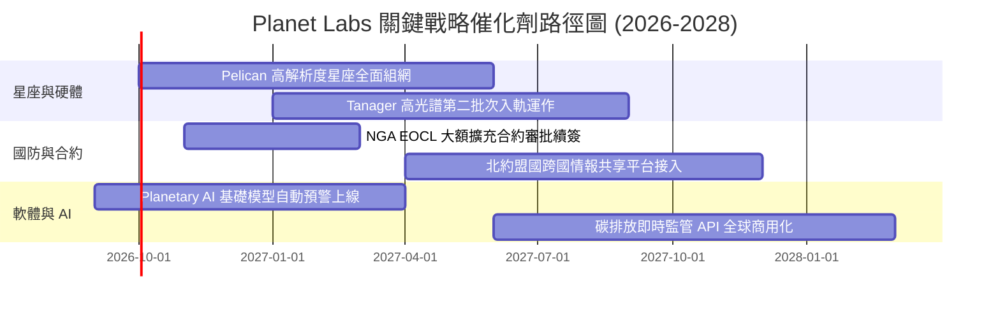

### 9.2 TAM 市場規模分析

```
╔══════════════════════════════════════════════════════════════════╗
║             地理空間情報與地球觀測潛在市場 (TAM)                 ║
╠══════════════════════════════════════════════════════════════════╣
║                                                                  ║
║  1. 國防與情報安全 (GEOINT)        $12.5B (滲透率 ~2.5%)         ║
║     ├── 俄烏與中東衝突常態監控需求激增                           ║
║     └── 自主戰術打擊評估與邊界變更預警                           ║
║                                                                  ║
║  2. 氣候變遷與 ESG 碳排放監管      $4.8B  (滲透率 ~1.2%)         ║
║     └── Tanager 甲烷與二氧化硫高光譜精準溯源定位                 ║
║                                                                  ║
║  3. 商業與精準農業營運優化         $5.2B  (滲透率 ~1.5%)         ║
║     └── 全球乾旱、林業病蟲害與大宗商品收成預估                   ║
║                                                                  ║
║  總計可觸及市場規模 (TAM)：約 $22.5B ｜ PL 目前市佔率僅 ~1.7%     ║
║  市場擴張天花板寬廣，具備長期複合成長空間。                      ║
╚══════════════════════════════════════════════════════════════════╝
```

### 9.3 成長驅動力結構圖

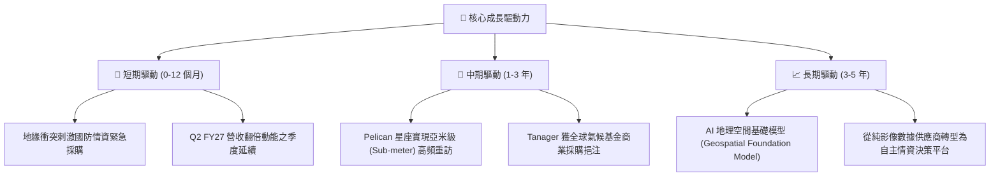

---

## 10. 風險矩陣

### 10.1 風險評分矩陣

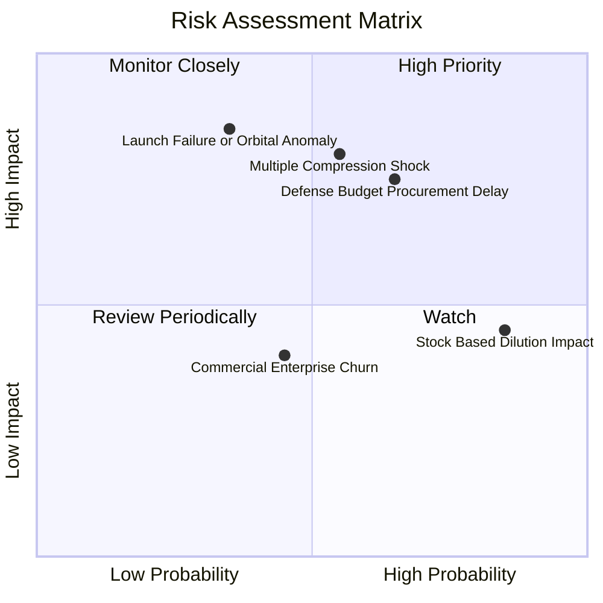

### 10.2 風險清單詳細分析

| # | 風險項目 | 發生機率 | 潛在財務衝擊 | 綜合評分 | 具體應對與緩解措施 |
|---|----------|----------|--------------|----------|-------------------|
| 1 | 🔴 **估值倍數劇烈回跌** | 中高 (55%) | 高 (-30% 股價) | 🔴 7.8/10 | 現價 EV/Sales 達 16.5x，若成長放緩至 30% 以下將誘發拋售；需嚴守買入紀律。 |
| 2 | 🔴 **政府國防採購節奏遲滯** | 高 (65%) | 高 (-15% 營收) | 🔴 7.5/10 | 美國國會撥款法案延宕常導致 EOCL 擴充款延後入帳；公司正積極開拓歐洲盟國訂單分散風險。 |
| 3 | 🟡 **發射事故或在軌提早失效** | 中低 (35%) | 極高 (-$50M Capex) | 🟡 6.5/10 | 多星分散於不同發射班次（如 SpaceX Rideshare），單顆衛星造價低，大幅降低單點故障風險。 |
| 4 | 🟡 **股權激勵 (SBC) 持續稀釋** | 極高 (85%) | 中度 (-5% EPS) | 🟡 5.8/10 | 管理層需隨自由現金流轉正逐步引入現金獎金機制，降低對發行新股的依賴。 |
| 5 | 🟢 **商業非國防客戶流失** | 中度 (45%) | 中低 (-5% 營收) | 🟢 4.2/10 | 農業與民間對總體景氣敏感；公司透過長約 API 深度嵌入客戶日常工作流提高黏著度。 |

---

## 11. 投資建議

### 11.1 最終綜合評級雷達圖

```
╔══════════════════════════════════════════════════════════════╗
║                   PL 綜合維度評估雷達                        ║
╠══════════════════════════════════════════════════════════════╣
║  營收成長動能  9.0/10  ▓▓▓▓▓▓▓▓▓▓▓▓▓▓▓▓▓▓░░  極度強勁        ║
║  護城河深度    7.4/10  ▓▓▓▓▓▓▓▓▓▓▓▓▓▓▓░░░░░  寬廣壟斷        ║
║  資產負債健康  8.0/10  ▓▓▓▓▓▓▓▓▓▓▓▓▓▓▓▓░░░░  淨現金無虞      ║
║  獲利真實品質  4.5/10  ▓▓▓▓▓▓▓▓▓░░░░░░░░░░░  SBC 過高        ║
║  估值安全邊際  4.0/10  ▓▓▓▓▓▓▓▓░░░░░░░░░░░░  缺乏邊際 (9.8%) ║
║  資本效率回報  3.5/10  ▓▓▓▓▓▓▓░░░░░░░░░░░░░  ROIC 仍負       ║
╠══════════════════════════════════════════════════════════════╣
║  綜合評級：🟡 持有 / 觀望 (HOLD) ｜ 總分：6.8 / 10           ║
╚══════════════════════════════════════════════════════════════╝
```

### 11.2 目標價與隱含報酬率

| 情境 | 目標價 | 隱含報酬率 (相對現價 $18.12) | 權重 | 核心驅動要素 |
|------|--------|------------------------------|------|--------------|
| **悲觀情境 (Bear)** | **$11.85** | **-34.6%** | 25% | 政府合約延宕，營收增速滑落至 18%，倍數壓縮至 6.0x |
| **基準情境 (Base)** | **$20.09** | **+10.9%** | 55% | 營收維持 28% 擴張，Pelican 成功商轉，維持 10.0x EV/S |
| **樂觀情境 (Bull)** | **$31.25** | **+72.5%** | 20% | 跨足 AI 地理大模型爆發，利潤率達 16%，市場給予 14.0x |
| **機率加權期望目標價**| **$20.26** | **+11.8%** | 100% | 12 個月預期上行空間有限，不構成積極買入條件 |

### 11.3 買入時機與觸發因素 Checklist

```
╔══════════════════════════════════════════════════════════════════╗
║                  ✅ 交易執行 Checklist                           ║
╠══════════════════════════════════════════════════════════════════╣
║                                                                  ║
║  積極買入觸發條件（需多數符合）：                                ║
║  ☐ 股價回檔至 $15.00 以下（提供 MOS ≥ 25% 之充沛防守空間）     ║
║  ✅ 季度營收 YoY 維持 > 35%                                      ║
║  ✅ 自由現金流 (FCF) 連續 3 季維持正值                           ║
║  ☐ 單季 GAAP 營業利益率正式由負翻正 (Break-even)                 ║
║                                                                  ║
║  加碼觸發條件：                                                  ║
║  ☐ 美國國防情報局 (NGA) 宣布簽署 > $150M 複數年擴充新約          ║
║  ☐ Pelican 首批商用影像展現 30cm 等效解析度並獲主流客戶採用     ║
║                                                                  ║
║  減碼 / 停損觸發條件：                                           ║
║  ☐ 季度營收 YoY 成長率驟降至 20% 以下                           ║
║  ☐ 自由現金流重新轉為大額淨流出 (單季 > -$30M)                   ║
║  ☐ 股價跌破關鍵支撐 $11.85 (悲觀情境下限)                       ║
╚══════════════════════════════════════════════════════════════╝
```

### 11.4 投資人適配度分析

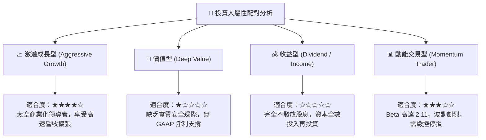

### 11.5 每季財報監控清單（Quarterly Watch List）

| 監控指標 | 最新基準 (Q2 FY27) | 觸發「加碼」門檻 | 觸發「減碼 / 停損」門檻 | 追蹤意義 |
|----------|-------------------|------------------|-----------------------|----------|
| **營收年增率 (YoY)** | 58.1% | > 45.0% | < 25.0% | 評估高成長故事是否持續獲得合約驗證 |
| **營業利益率 (GAAP)**| -11.6% | > 0.0% (轉正) | < -20.0% | 檢驗固定衛星折舊之經營槓桿釋放速度 |
| **單季 FCF ($M)** | +$23.55M | > +$30.0M | < -$10.0M | 評估公司自我造血與擺脫外部融資能力 |
| **遞延收入存量 ($M)**| $281M | > $320M | < $240M | 領先指標：衡量客戶預付數據合約存續強度 |
| **SBC 佔營收比例** | 14.7% (單季) | < 10.0% | > 20.0% | 檢視股東權益實質被攤薄之程度 |

### 11.6 反面論證：什麼會證明論點錯誤（What Would Change My Mind）

```
╔══════════════════════════════════════════════════════════════════╗
║              ⚠️ 論點失效條件（Disconfirming Evidence）           ║
╠══════════════════════════════════════════════════════════════════╣
║  多頭論點（轉機成長）在下列情況發生時即告推翻，應果斷停損：      ║
║                                                                  ║
║  1. 核心營收年增率連續兩季跌破 20%：證明國防情資需求僅屬短期地緣 ║
║     衝突脈衝，缺乏常態軟體訂閱擴張屬性。                         ║
║  2. Pelican 次世代星座遭遇連續在軌光學系統重大瑕疵，導致資本開支 ║
║     預算追加超過 $100M，迫使 FCF 重回負值深淵。                  ║
║  3. ROIC 改善斜率停滯，且未能於 2028 年前跨越 WACC (10.8%)，長   ║
║     期陷入破壞股東價值的資本陷阱。                               ║
║  4. 股價若無基本面催化急漲至 $28.00 以上（隱含 EV/Sales > 25x），║
║     泡沫化程度極高，應無條件執行獲利了結。                       ║
╚══════════════════════════════════════════════════════════════════╝
```

---

> **免責聲明**：本報告為依據客觀財務數據與量化評價模型所構建之機構級學術與投資研究報告，僅供參考，不構成任何個別買賣要約或投資決策建議。市場有風險，資產配置與股票交易應基於投資人自主審慎判斷與風險承受能力獨立執行。