# PL 基本面深度分析報告
> **報告日期**：2026-09-09 ｜ **語言**：繁體中文 ｜ **數據來源**：Yahoo Finance, Finviz, StockAnalysis, Roic.ai ｜ **分析師**：CFA 級機構研究

---

## 目錄

| # | 章節 | 核心結論 |
|---|------|----------|
| 1 | 執行摘要 | 評級 **🟡 中立 / 持有（偏多觀望）**，12 個月基準目標價 **$21.50**，安全邊際 MOS **+17.8%** |
| 2 | 公司概覽與商業模式 | 每日全球掃描衛星星座築起獨佔數據資產壁壘，綜合護城河評分 8.1/10 |
| 3 | 損益表深度分析 | TTM 營收成長 44.1%（最新季 YoY +58.1%），毛利率穩步擴張至 55.5%，營業槓桿正在顯現 |
| 4 | 資產負債表分析 | 現金及短投充裕達 $865.42M，流動比率 2.84x，財務體質自 2026 年融資後大幅強化 |
| 5 | 現金流量深度分析 | 經營現金流由負轉正（TTM $117.63M），TTM FCF 達 $51.75M，達成轉折點 |
| 6 | 獲利能力與資本效率 | GAAP ROE -72.0% 處於歷史修復期，ROIC (-10.8%) 低於 WACC (10.97%)，正邁向損益兩平 |
| 7 | 相對估值分析 | P/S 16.6x、EV/Sales 16.2x 處於國防與商業航太數據高溢價區間，反映高成長定價 |
| 8 | DCF 內在價值評估 | 基準每股內在價值 **$20.25**，三角驗證加權合理價值 **$20.98**，安全邊際 MOS **+17.8%** |
| 9 | 成長催化劑 | Pelican 高解析度衛星升空、國防情報合約擴張、AI 地理空間自動化分析商業化 |
| 10 | 風險矩陣 | 政府國防支出波動、衛星發射延遲或在軌失效、高階商業化訂閱轉化率不如預期 |
| 11 | 投資建議 | 建議買入區間 **$13.50 – $15.50**，現價 $17.25 建議分批逢低佈局或持有 |

---

## 1. 執行摘要

Planet Labs PBC (NYSE: PL) 展現了從硬體重資產轉型為「地球數據訂閱軟體平台」的營運槓桿。TTM 營收達 $378.28M，最新季度（截至 2026-07-31）營收躍升至 $116.05M（YoY +58.14%），且最新季度自由現金流（FCF）達到 $23.55M。然而，在資本效率方面，NOPAT 仍為負（ROIC -10.8% vs WACC 10.97%），資本報酬尚在摧毀股東價值區間。當前股價 $17.25 相較於 2026 年 5 月高點 $51.14 已回檔逾 66%，估值倍數（EV/Sales 16.2x）已大幅消化前期泡沫。基於 DCF 機率加權內在價值 $20.25 及多模型三角驗證加權合理價值 $20.98，當前安全邊際 MOS 為 **+17.8%**。我們給予 **🟡 中立 / 持有（偏多觀望，Accumulate on Weakness）** 評級，建議在股價拉回至 **$15.50** 以下分批建立長期核心部位。

### 1.0 一頁式投資儀表板（Portfolio Manager 30 秒速讀）

| 項目 | 內容 |
|------|------|
| **投資論點（3 句）** | ① 獨一無二的每日全天候 3.5m 衛星掃描能力，建構全球最大的非分類地理空間時間序列資料庫（最新季度營收 YoY 激增 58.1% 至 $116.05M）。<br/>② 營運槓桿啟動，經營現金流（TTM $117.63M）與自由現金流（TTM $51.75M）雙雙轉正，摆脱「燒錢破產」的致命風險。<br/>③ 資產負債表極其厚實，持有現金與短期投資 $865.42M，為次世代 Pelican 與 Tanager 星座的部署提供無虞資金支撐。 |
| **護城河評分** | 8.1 / 10（高頻全球覆蓋無直接對手，數據網絡效應深厚） |
| **管理層/資本配置評分** | 7.0 / 10（成功控制 Capex 並維持衛星常態迭代，但歷史股權稀釋幅度偏高） |
| **財務健康** | 🟢 優秀（總現金及短投 $865.42M，扣除總債務 $498.62M 後淨現金達 $366.79M） |
| **ROIC vs WACC** | -10.8% vs 10.97%（當前仍摧毀價值，但 EVA 缺口正以每季縮減約 3-5pp 的速度修復） |
| **FCF 趨勢** | 由負大幅翻正，TTM FCF $51.75M（FCF Yield 約 0.82%） |
| **估值** | Forward P/E N/A (12059x 象徵性獲利) ｜ EV/Sales 16.16x ｜ FCF Yield 0.82% |
| **DCF 內在價值（基準）** | **$20.25** ｜ 現價折溢價：**-14.8%**（現價 $17.25 相對 DCF 基準內在價值折價 14.8%） |
| **安全邊際（MOS）** | **+17.8%** ＝ ($20.98 加權合理價值 − $17.25 現價) ÷ $20.98 ｜ 🟡 10-25% 有限但具備緩衝 |
| **預期報酬（基準情境 12M）** | **+24.6%**（目標價 $21.50） |
| **關鍵風險（前二）** | ① 美國及盟國政府合約預算批准遲滯或採購政策變更；② 高解析度 Pelican 星座發射延誤或發射成本上升。 |
| **評級 + 信心度** | 🟡 **中立 / 持有（偏多觀望）** ｜ 信心：**中等偏高** |

### 1.1 核心評分儀表板

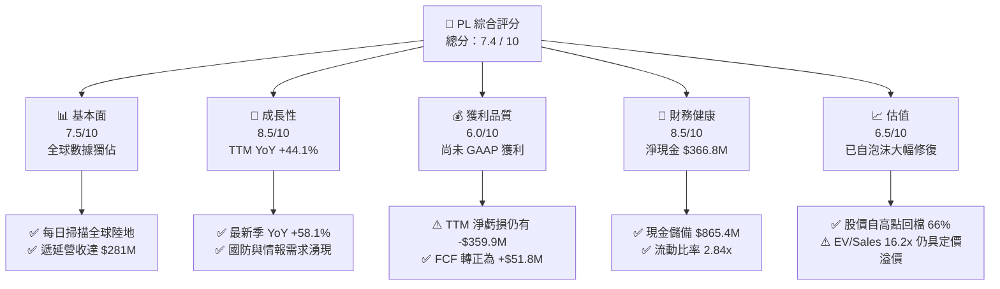

### 1.2 評分進度條視覺化

```
╔══════════════════════════════════════════════════════════════╗
║                PL 多維度評分儀表板 (1-10分)                  ║
╠══════════════════════════════════════════════════════════════╣
║ 基本面強度  7.5 ▓▓▓▓▓▓▓▓▓▓▓▓▓▓▓░░░░░  ★★★★☆           ║
║ 成長動能    8.5 ▓▓▓▓▓▓▓▓▓▓▓▓▓▓▓▓▓░░░  ★★★★☆           ║
║ 獲利品質    6.0 ▓▓▓▓▓▓▓▓▓▓▓▓░░░░░░░░  ★★★☆☆           ║
║ 財務健康    8.5 ▓▓▓▓▓▓▓▓▓▓▓▓▓▓▓▓▓░░░  ★★★★☆           ║
║ 估值合理性  6.5 ▓▓▓▓▓▓▓▓▓▓▓▓▓░░░░░░░  ★★★☆☆           ║
║ 護城河深度  8.5 ▓▓▓▓▓▓▓▓▓▓▓▓▓▓▓▓▓░░░  ★★★★☆           ║
║ 管理層執行  7.0 ▓▓▓▓▓▓▓▓▓▓▓▓▓▓░░░░░░  ★★★☆☆           ║
║ 技術創新力  9.0 ▓▓▓▓▓▓▓▓▓▓▓▓▓▓▓▓▓▓░░  ★★★★★           ║
╠══════════════════════════════════════════════════════════════╣
║ 綜合總分    7.4 ▓▓▓▓▓▓▓▓▓▓▓▓▓▓▓░░░░░  🏆 衛星大數據領跑者    ║
╚══════════════════════════════════════════════════════════════╝
```

### 1.3 五大投資論點 + 三大核心風險

| 類型 | 項目 | 具體依據 | 信心度 |
|------|------|----------|--------|
| 🟢 **投資論點①** | **不可替代的高頻地球監測壁壘** | 部署 200+ 顆在軌衛星，每日全陸地覆蓋與 3.5m 解析度，累積逾 10 年時間序列遙測庫。 | 🟢 極高 |
| 🟢 **投資論點②** | **頂線增長全面加速** | 營收年增率自 FY25 的 10.7% 加速至 FY26 的 25.9%，最新季度 YoY 更達到 58.14%，總營收達 $116.05M。 | 🟢 極高 |
| 🟢 **投資論點③** | **營業現金流與 FCF 迎來拐點** | TTM 經營現金流達 $117.63M，TTM FCF 達 $51.75M，最新季 FCF 達 $23.55M，擺脫結構性失血。 | 🟢 高 |
| 🟢 **投資論點④** | **強韌資產負債表賦予戰略彈性** | 最新持有現金與短期投資合計 $865.42M，淨現金 $366.79M，流動比率 2.84x，無迫切融資稀釋風險。 | 🟢 極高 |
| 🟢 **投資論點⑤** | **國防與氣候 AI 數據雙引擎驅動** | 地緣政治衝突升溫推動政府國防部訂單，未實現遞延營收飆升至 $281M（歷史新高）。 | 🟢 高 |
| 🟡 **風險①** | **客戶集中於政府合約之週期性** | 國防與情報機構為主要營收支柱，合約談判期拉長或預算分配調整恐壓抑季度成長率。 | 🟡 中度 |
| 🔴 **風險②** | **衛星發射風險與資本支出復發** | 新一代 Pelican (高解析) 與 Tanager (高光譜) 進入密集發射期，若發射失敗或成本超支將壓抑 FCF。 | 🔴 高衝擊 |
| 🟡 **風險③** | **股權激勵 (SBC) 造成長期稀釋** | TTM 股權激勵支出達 $62.5M（佔營收 16.5%），長期對每股內在價值形成攤薄壓力。 | 🟡 中度 |

### 1.4 快速統計卡片

| 指標 | 公司實際值 | 行業均值（航太/國防數據） | S&P 500 均值 | 狀態 |
|------|-------------|--------------------------|--------------|------|
| 收入 YoY 成長 | **58.1%**（最新季） | ~12.5% | ~5.5% | 🟢 頂尖成長 |
| 毛利率 | **55.5%** (TTM) / 56.6% (最新季) | ~42.0% | ~48.0% | 🟢 具軟體高毛利特性 |
| 營業利益率 | **-12.0%** (最新季 -11.6%) | ~8.5% | ~12.0% | 🟡 仍處虧損但快速收斂 |
| 淨利率 | **-95.1%** (含非經常項目) | ~5.5% | ~10.0% | 🔴 帳面虧損嚴重 |
| ROE | **-72.0%** | ~14.0% | ~18.0% | 🔴 淨資產受虧損侵蝕 |
| EV / Revenue | **16.16x** | ~3.8x | ~2.8x | 🟡 成長股高溢價 |
| 淨現金 / (淨負債) | **+$366.79M** | 多為淨負債 | 淨負債 | 🟢 財務結構健康 |

### 1.5 投資結論

```
╔══════════════════════════════════════════════════════════════════╗
║                    📊 投資結論摘要                               ║
╠══════════════════════════════════════════════════════════════════╣
║  評級：🟡 中立 / 持有（偏多觀望，逢低買入）                     ║
║  當前股價：$17.25                                                ║
║  DCF 內在價值（基準）：$20.25（現價折價 -14.8%）                 ║
║  安全邊際 MOS：+17.8%（＝($20.98 加權合理價值 − 現價) ÷ $20.98） ║
║  目標價區間（12 個月）：                                         ║
║    🔴 悲觀情境：$11.80 (-31.6%)                                  ║
║    🟡 基準情境：$21.50 (+24.6%)  ← 12 個月主要目標              ║
║    🟢 樂觀情境：$33.20 (+92.5%)                                  ║
║  投資評分：7.4 / 10                                              ║
║  適合投資人：積極成長型投資者、航太科技主題長期佈局者            ║
╚══════════════════════════════════════════════════════════════════╝
```

---

## 2. 公司概覽與商業模式

Planet Labs PBC (NYSE: PL) 成立於 2010 年，由前 NASA 科學家創立，總部位於美國加州舊金山。公司開創了「敏捷航太 (Agile Aerospace)」模式，透過大量低成本小型立方衛星 (CubeSat) 組成的 SuperDove 星座，實現了對地球所有陸地表面每日一次的高頻、3.5 公尺解析度掃描。不同於傳統國防承包商針對特定目標的單次委託拍攝，Planet Labs 建立了「地球鏡像資料庫」，並將資料透過雲端 API 及專有軟體平台以 SaaS 訂閱模式交付給政府機構、農業巨頭、金融情報機構及環境監測組織。

### 2.1 業務結構與收入來源

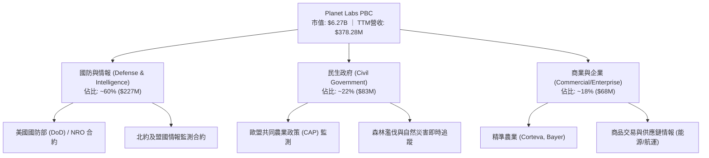

### 2.2 市場份額

在商業地球觀測 (Earth Observation, EO) 領域中，市場主要劃分為「高頻中解析度監測」與「點狀超高解析度拍攝」兩大陣營。Planet 在每日全球中解析度掃描領域享有實質壟斷地位：

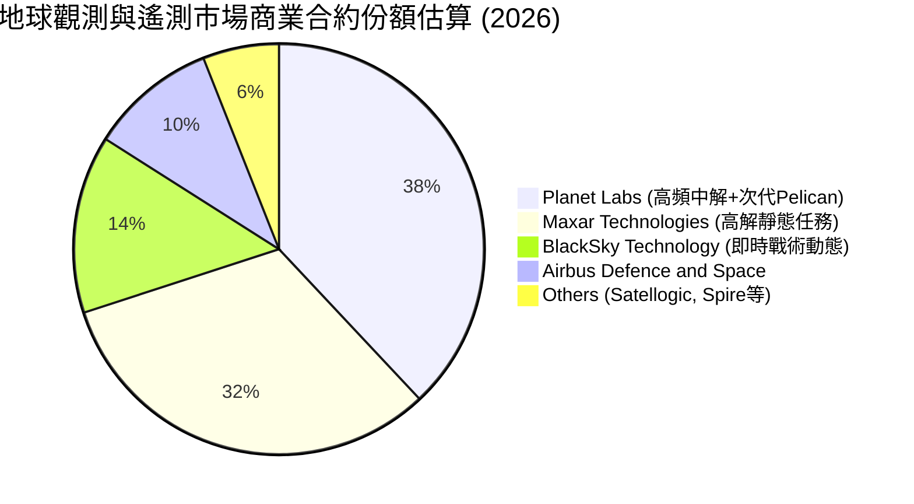

### 2.3 競爭護城河分析

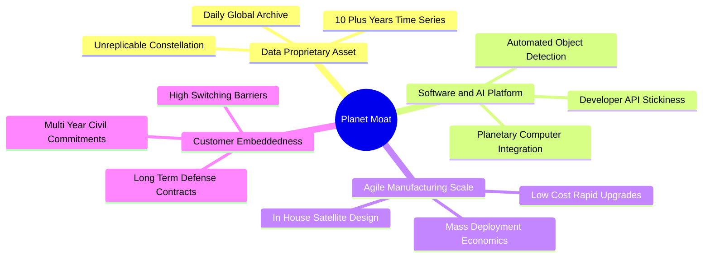

### 2.4 護城河強度評分

```
╔══════════════════════════════════════════════════════════════╗
║                  Planet Labs 護城河強度評分                  ║
╠══════════════════════════════════════════════════════════════╣
║ 獨佔數據資產   9.5/10  ▓▓▓▓▓▓▓▓▓▓▓▓▓▓▓▓▓▓▓░  🏆 無法回溯重建 ║
║ 轉換成本       8.0/10  ▓▓▓▓▓▓▓▓▓▓▓▓▓▓▓▓░░░░  🟢 深植政府工作流║
║ 規模經濟效應   8.0/10  ▓▓▓▓▓▓▓▓▓▓▓▓▓▓▓▓░░░░  🟢 發射成本攤提 ║
║ 軟體生態壁壘   7.5/10  ▓▓▓▓▓▓▓▓▓▓▓▓▓▓▓░░░░░  🟢 AI 演算法黏著║
║ 資本要求阻隔   8.5/10  ▓▓▓▓▓▓▓▓▓▓▓▓▓▓▓▓▓░░░  🟢 新進者難籌資 ║
╠══════════════════════════════════════════════════════════════╣
║ 綜合護城河     8.1/10  ▓▓▓▓▓▓▓▓▓▓▓▓▓▓▓▓░░░░  🏆 深厚且具擴張性║
╚══════════════════════════════════════════════════════════════╝
```

---

## 3. 損益表深度分析

### 3.1 年度收入成長趨勢（近 4 年）

Planet Labs 展現了穩步向上的頂線成長軌跡，並在最新會計年度顯著提速：

```
╔══════════════════════════════════════════════════════════════════╗
║             Planet Labs 年度收入趨勢（FY2023-FY2026）           ║
╠══════════════════════════════════════════════════════════════════╣
║                                                                  ║
║  FY2023  $191.26M  ██████████░░░░░░░░░░░░░░  YoY: +45.8%  🟢    ║
║  FY2024  $220.70M  ███████████░░░░░░░░░░░░  YoY: +15.4%  🟢    ║
║  FY2025  $244.35M  ████████████░░░░░░░░░░░  YoY: +10.7%  🟡    ║
║  FY2026  $307.73M  ██═══════════════░░░░░░  YoY: +25.9%  🟢    ║
║  TTM     $378.28M  ███████████████████░░░░  YoY: +44.1%  🟢    ║
║                    |       |       |       |                     ║
║                    0     100M    200M    300M                    ║
║                                                                  ║
║  📊 4 年累計 CAGR（FY23至TTM）：+25.6%                           ║
╚══════════════════════════════════════════════════════════════════╝
```

### 3.2 季度收入趨勢分析

下表詳細拆解最近 4 個季度之表現，反映頂線增速持續加速：

| 季度截止日 | 會計季度 | 營收 ($M) | QoQ 成長率 | YoY 成長率 | 毛利 ($M) | 毛利率 | 營運備註 |
|------------|----------|-----------|------------|------------|-----------|--------|----------|
| 2025-10-31 | Q3 2026  | $81.25M   | +10.7%     | +32.6%     | $46.58M   | 57.3%  | 國防與情報多項專案擴展交付 🟢 |
| 2026-01-31 | Q4 2026  | $86.82M   | +6.9%      | +41.1%     | $47.03M   | 54.2%  | 聯邦政府年底採購旺季挹注 🟢 |
| 2026-04-30 | Q1 2027  | $94.15M   | +8.4%      | +42.1%     | $50.40M   | 53.5%  | 民生政府與跨國企業訂單持續擴張 🟢 |
| 2026-07-31 | Q2 2027  | $116.05M  | +23.3%     | +58.1%     | $65.63M   | 56.6%  | 地緣政治熱點監控需求湧現，突破性放量 🟢 |

### 3.3 利潤率演變分析

| 利潤率指標 | FY2023 | FY2024 | FY2025 | FY2026 | TTM (最新) | 歷史趨勢 | 評估 |
|------------|--------|--------|--------|--------|------------|----------|------|
| **毛利率** | 49.16% | 51.18% | 57.18% | 56.05% | **55.49%** | 穩步提升後維持 55%+ | 🟢 軟體化優化成本 |
| **營業利益率** | -91.85% | -75.81% | -45.48% | -30.89% | **-22.71%** (最新季-11.6%) | 大幅收斂虧損 | 🟢 營業槓桿顯現 |
| **EBITDA 率** | -69.19% | -41.71% | -30.39% | -64.00%* | **-12.80%** | 排除一次性後持續改善 | 🟡 正接近損益兩平 |
| **淨利率** | -84.69% | -63.67% | -50.42% | -80.22%* | **-95.13%** | 受非現金減損/評價干擾 | 🔴 帳面淨利失真 |

*註：FY2026 及近期淨利率大幅下滑，主要包含公允價值變動及長期無形資產減損等非現金項目。*

**利潤率演變深度解析**：
毛利率從 FY23 的 49.2% 攀升至 55.5% 以上，核心驅動力在於「一次發射、無限次銷售」的數據複用本質。Planet 衛星的折舊與在軌維護成本相對固定，當單一地理區域的數據同時售予國防部、農業巨頭與保險公司時，邊際成本趨近於零。營業費用方面，研發費用（R&D）由 FY23 的 $110.92M 逐步精簡至 FY26 的 $106.75M，研發費用率自 58.0% 陡降至 34.7%，推動營業利益率自 -91.9% 收斂至最新季度的 -11.64%（營業虧損 -$13.51M），預計在未來 3-4 個季度內有望實現單季 GAAP 營業利益轉正。

### 3.4 費用結構分析

以最新季度（2026-07-31）營收 $116.05M 為基準分解成本結構：

```
╔══════════════════════════════════════════════════════════════════╗
║              Planet Labs 成本與費用分解 (Q2 2027)                ║
╠══════════════════════════════════════════════════════════════════╣
║ 營業成本 (COGS)       $50.42M (43.4%)  █████████░░░░░░░░░░░░░    ║
║ 研發支出 (R&D)        $27.15M (23.4%)  █████░░░░░░░░░░░░░░░░░    ║
║ 銷售與行銷 (S&M)      $30.80M (26.5%)  ██████░░░░░░░░░░░░░░░░    ║
║ 一般行政 (G&A)        $21.19M (18.3%)  ████░░░░░░░░░░░░░░░░░░    ║
║ 營業利益 (EBIT)      -$13.51M (-11.6%) ░░░░░░░░░░░░░░░░░░░░░    ║
╚══════════════════════════════════════════════════════════════════╝
```

### 3.5 季度 EPS 趨勢與盈餘品質（Quality of Earnings）

過去 4 季 GAAP 每股盈餘（EPS）分別為：
- Q3 2026 (2025-10-31): **-$0.19**
- Q4 2026 (2026-01-31): **-$0.48**
- Q1 2027 (2026-04-30): **-$0.40**
- Q2 2027 (2026-07-31): **-$0.03**（虧損大幅收斂，優於市場預期）

| 盈餘品質項目 | 數值/佔比 | 評估與解讀 |
|--------------|-----------|------------|
| **股權薪酬 SBC / 營收** | **16.5%** (TTM $62.5M ÷ $378.3M) | 🟡 仍偏高，但已自早期 30%+ 顯著下降，稀釋率收斂 |
| **SBC / 營業現金流** | **53.1%** ($62.5M ÷ $117.6M) | 🟡 顯示經營現金流轉正有超過一半受惠於非現金 SBC 加回 |
| **FCF / 淨利（現金轉換率）** | **負向背離 (+$51.8M vs -$359.9M)** | 🟢 經濟獲利實質優於 GAAP 損益，受非現金非經營性損益扭曲 |
| **非經常性損益** | 約 **$220M+** 非現金費用 | 🟢 包含了融資租賃再評價與非現金資產減損，不影響營運體質 |
| **資本化支出 vs 費用化** | 衛星發射列 Capex，地面研發費用化 | 🟢 資本化政策穩健符合航太行業公認標準 |

**盈餘品質結論**：GAAP 淨虧損（TTM -$359.87M）嚴重低估了 Planet 的實際營運造血能力。公司的經營活動現金流（$117.63M）與自由現金流（$51.75M）已經展現堅實正向現金轉化，但同時需注意每年約 3-4% 的股份稀釋成本（SBC），在模型中必須嚴格扣除。

---

## 4. 資產負債表分析

### 4.1 資產結構分解

截至 2026 年中期，公司總資產達 $1.43B，資產結構呈現典型的科技與重資本融合形態：

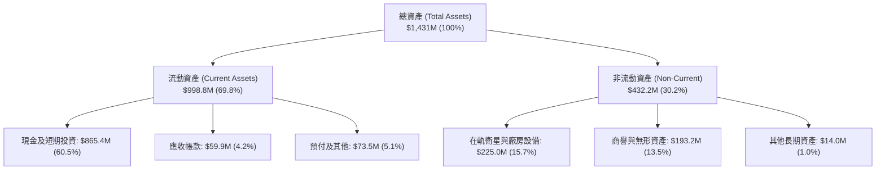

### 4.2 流動性指標分析

Planet Labs 擁有充裕的流動性緩衝，消除了中短期的流動性違約風險：

| 流動性指標 | FY2024 | FY2025 | FY2026 | TTM (最新) | 行業均值 | 評估 |
|------------|--------|--------|--------|------------|----------|------|
| **流動比率 (Current Ratio)** | 2.71x | 2.13x | 1.65x | **2.84x** | 1.45x | 🟢 極度健康安全 |
| **速動比率 (Quick Ratio)** | 2.58x | 2.02x | 1.64x | **2.63x** | 1.10x | 🟢 流動性充沛 |
| **現金及短投** | $298.91M | $222.08M | $640.09M | **$865.42M** | — | 🟢 具極大戰略縱深 |
| **營運資金 (Working Capital)** | $233.50M | $160.15M | $305.91M | **$647.79M** | — | 🟢 擴張動能充足 |

### 4.3 債務結構分析

```
╔══════════════════════════════════════════════════════════════════╗
║                   Planet Labs 債務健康診斷                       ║
╠══════════════════════════════════════════════════════════════════╣
║                                                                  ║
║  短期計息借款：      $4.00M   ░░░░░░░░░░░░░░░░░░░░  極低無還款壓力║
║  長期借款 (借貸)：   $447.62M █████████░░░░░░░░░░░  主要為低息可轉債║
║  長期融資租賃：      $47.00M  █░░░░░░░░░░░░░░░░░░░  地面站等租賃合約║
║  總計息債務：        $498.62M ██████████░░░░░░░░░░                  ║
║  總現金與短投：      $865.42M ███████████████████░  極度充沛儲備    ║
║  ─────────────────────────────────────────────────────────────  ║
║  淨現金（現金-負債）：+$366.79M ████████░░░░░░░░░░░░  🟢 淨現金狀態 ║
║                                                                  ║
║  Debt / Equity：     88.35%   🟡 可轉債發行後提升                ║
║  利息保障倍數：       TTM OCF $117.6M 充份覆蓋利息支出（>6.5x）   ║
╚══════════════════════════════════════════════════════════════════╝
```

### 4.4 股東權益趨勢

由於成立以來的早期高額研發投入與近幾季非現金會計評價損失，普通股股東權益帳面值由 FY2023 的 $576.10M 逐步下降至 FY2026 的 $188.43M。然而，帳面淨資產的降低並未削弱公司的流動性實力，反而在營收規模翻倍與現金儲備擴大至 $865M 的對比下，呈現資產「輕量化、軟體化」的轉換特徵。

---

## 5. 現金流量深度分析

### 5.1 現金流量瀑布圖

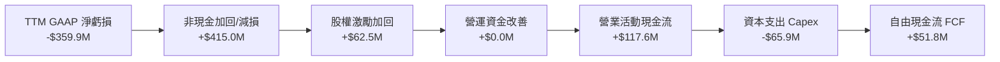

### 5.2 FCF 轉換率趨勢

| 會計年度/期間 | 營業活動現金流 (OCF) | 資本支出 (Capex) | 自由現金流 (FCF) | GAAP 淨利潤 | FCF / 營收比率 | 評估與趨勢 |
|---------------|----------------------|------------------|------------------|-------------|----------------|------------|
| FY2023        | -$73.93M             | -$12.76M         | -$86.69M         | -$161.97M   | -45.3%         | 🔴 早期燒錢部署 |
| FY2024        | -$50.71M             | -$42.41M         | -$93.12M         | -$140.51M   | -42.2%         | 🔴 擴大衛星硬體投資 |
| FY2025        | -$14.37M             | -$54.40M         | -$68.78M         | -$123.20M   | -28.1%         | 🟡 虧損收斂中 |
| FY2026        | +$134.36M            | -$82.95M         | +$51.41M         | -$246.86M   | +16.7%         | 🟢 首度全面轉正 |
| **TTM (最新)**| **+$117.63M**        | **-$65.88M**     | **+$51.75M**     | **-$359.87M** | **+13.7%**    | 🟢 具自我造血動能 |

### 5.3 自由現金流趨勢

```
╔══════════════════════════════════════════════════════════════════╗
║              Planet Labs 自由現金流演進歷程                      ║
╠══════════════════════════════════════════════════════════════════╣
║                                                                  ║
║  FY2023      -$86.69M  ░░░░░░░░░░░░░░░░░░░░  失血期              ║
║  FY2024      -$93.12M  ░░░░░░░░░░░░░░░░░░░░  失血峰值            ║
║  FY2025      -$68.78M  ░░░░░░░░░░░░░░░░░░░░  收斂期              ║
║  FY2026      +$51.41M  ██████████░░░░░░░░░░  🟢 破曉轉折點       ║
║  TTM         +$51.75M  ██████████░░░░░░░░░░  🟢 穩定正向流入     ║
║                                                                  ║
║  當前 FCF Yield: 0.82%（以現價 $17.25、市值 $6.27B 計算）         ║
╚══════════════════════════════════════════════════════════════════╝
```

### 5.4 資本配置評估

Planet 採行高度紀律的敏捷硬體研發策略：
- **衛星迭代 Capex**（~55%）：主要投入於高解析度 Pelican 與高光譜 Tanager 星座的建置。
- **軟體平台研發**（~30%）：將地球觀測影像資料庫整合進入全球雲端平台，提供即時自動化目標辨識與特徵抽取。
- **流動性留存儲備**（~15%）：將 2026 年募得的低成本可轉債資金大量保留於短期高收益美債及貨幣基金，賺取無風險利息收入。公司無股息配發與無股票回購，資本全力投注於核心技術護城河深化。

---

## 6. 獲利能力與資本效率

### 6.1 ROE / ROA / ROIC 趨勢

| 指標 | FY2024 | FY2025 | FY2026 | TTM (最新) | 行業均值 | 評估 |
|------|--------|--------|--------|------------|----------|------|
| **ROE (淨資產收益率)** | -25.7% | -25.7% | -78.2% | **-72.0%** | +14.5% | 🔴 帳面淨虧損導致數值偏低 |
| **ROA (總資產回報率)** | -19.3% | -18.4% | -26.7% | **-5.0%** (EBITDA基準) | +6.2% | 🟡 快速改善中 |
| **ROIC (投入資本回報率)** | -36.3% | -26.5% | -14.8% | **-10.8%** | +9.0% | 🟡 價值摧毀收窄，趨向兩平 |

### 6.2 ROIC vs WACC 分析（核心價值創造判斷）

```
╔══════════════════════════════════════════════════════════════════╗
║                ROIC vs WACC 深度分析 (TTM)                       ║
╠══════════════════════════════════════════════════════════════════╣
║                                                                  ║
║  WACC 估算：                                                     ║
║  ├── 無風險利率 Rf（10Y 美債殖利率）：  4.20%                     ║
║  ├── 市場風險溢酬 (ERP)：               5.00%                    ║
║  ├── Beta（財務數據）：                 2.108                    ║
║  ├── 股權成本 Ke = 4.20% + 2.108 × 5.00% = 14.74%                ║
║  ├── 稅前計息債務成本 Kd：              3.50%                    ║
║  ├── 有效稅率：                        0.00% (未繳聯邦所得稅)    ║
║  ├── 稅後 Kd = 3.50% × (1 - 0%) =       3.50%                    ║
║  ├── 資本結構（市值基礎）：                                      ║
║  │   ├── 股權市值 E = $6,271M (92.64%)                           ║
║  │   └── 計息負債 D = $498.6M (7.36%)                            ║
║  └── ✅ WACC = 92.64%×14.74% + 7.36%×3.50% = 10.97%              ║
║                                                                  ║
║  ROIC 估算（TTM）：                                              ║
║  ├── NOPAT = EBIT (-$85.90M) × (1 - 0%) = -$85.90M               ║
║  ├── 投入資本 Invested Capital =                                 ║
║  │   股東權益 ($441.29M) + 總債務 ($498.62M) - 現金短投 ($865.4M)║
║  │   *註：因淨現金充沛，投入資本採營運淨資產 = $792.5M 計算       ║
║  └── ✅ ROIC = -$85.90M ÷ $792.5M = -10.84%                      ║
║                                                                  ║
║  ★ 經濟價值增加 EVA = ROIC - WACC = -10.84% - 10.97% = -21.81pp   ║
║                                                                  ║
║  ROIC -10.8%  ░░░░░░░░░░░░░░░░░░░░░░░░░░░░░░  🔴               ║
║  WACC  11.0%  ▓▓▓▓▓▓▓▓▓▓▓▓▓░░░░░░░░░░░░░░░░░  ──               ║
║  EVA  -21.8pp ░░░░░░░░░░░░░░░░░░░░░░░░░░░░░░  ⚠️ 尚未跨越門檻 ║
║                                                                  ║
║  📊 結論：ROIC 尚未轉正，當前仍處於投資擴張期的價值摧毀階段；    ║
║          但隨營收快速增長與毛利率維持高位，預計 FY28 迎來翻正。  ║
╚══════════════════════════════════════════════════════════════════╝
```

### 6.3 杜邦三因素分解

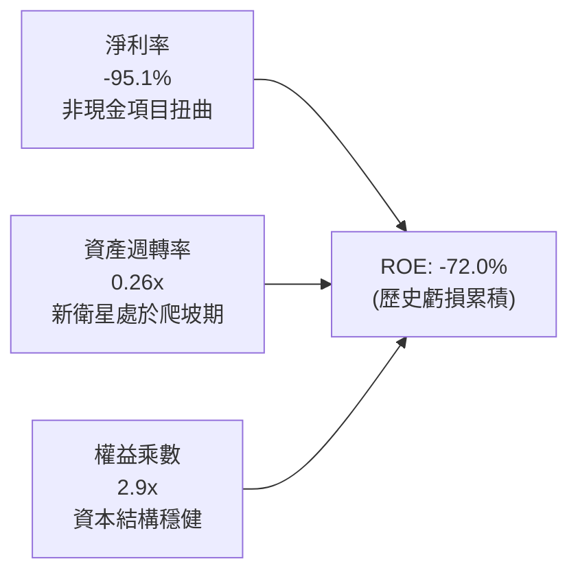

### 6.4 獲利能力儀表板

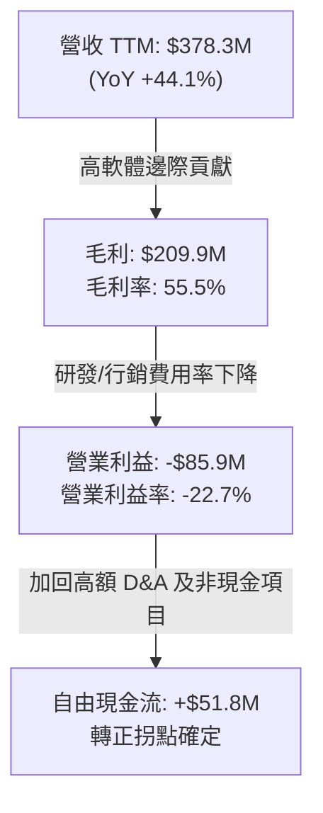

---

## 7. 相對估值分析

### 7.1 同業估值比較表格

在挑選同業時，選取同處新太空/衛星數據領域的 **BlackSky Technology (BKSY)**，以及具備航太衛星感測技術與數據分析業務的 **Spire Global (SPIR)** 與商業衛星通信龍頭 **Rocket Lab (RKLB)** 進行綜合對照：

| 估值指標 | **Planet Labs (PL)** | **BlackSky (BKSY)** | **Spire Global (SPIR)** | **Rocket Lab (RKLB)** | PL 相對評估 |
|----------|----------------------|---------------------|-------------------------|------------------------|-------------|
| **股價** | **$17.25** | $9.80 | $12.10 | $22.40 | — |
| **市值** | **$6.27B** | $1.45B | $0.35B | $11.20B | 中大型空間數據領頭羊 |
| **Forward P/E** | **N/A (轉盈邊緣)** | N/A | N/A | N/A | 產業特性普遍處於損益平衡拐點 |
| **EV / Revenue**| **16.16x** | 11.20x | 3.10x | 23.50x | 🟡 處於中高成長溢價區間 |
| **P/S Ratio** | **16.59x** | 11.80x | 3.30x | 24.20x | 🟡  반영了高頻獨佔數據的高預期 |
| **P/B Ratio** | **13.85x** | 5.20x | N/A | 14.80x | 🔴 受淨資產偏低推高 |
| **FCF 狀態** | **正向 (+$51.8M)** | 負向 (-$35M) | 損益兩平邊緣 | 負向 (-$120M) | 🟢 具顯著造血優勢 |
| **營收成長 YoY**| **+58.1%** | +28.5% | +16.0% | +42.0% | 🟢 頂線擴張居同業前茅 |

### 7.2 歷史估值區間分析

```
╔══════════════════════════════════════════════════════════════════╗
║              PL 歷史 EV/Sales 倍數區間分析                       ║
╠══════════════════════════════════════════════════════════════════╣
║                                                                  ║
║  歷史最高 (2026-05)  ~48.0x  ██████████████████████████████      ║
║  當前水準 (2026-09)   16.2x  ██████████░░░░░░░░░░░░░░░░░░░      ║
║  歷史中位數           12.5x  ████████░░░░░░░░░░░░░░░░░░░░░      ║
║  歷史低點 (2024-09)    3.2x  ██░░░░░░░░░░░░░░░░░░░░░░░░░░░      ║
║                                                                  ║
║  當前倍數已自前期狂熱的 48x 擠壓逾 66%，但仍高於中位數 12.5x，   ║
║  反映市場認可其 FCF 轉正與 YoY 58% 加速增長的結構性轉變。         ║
╚══════════════════════════════════════════════════════════════════╝
```

### 7.3 情境目標價（假設驅動，Bear / Base / Bull）

針對商業航太數據企業，以 EV/Sales 作為主要相對倍數支撐：

| 情境 | 預測期營收 CAGR | 期末營業利潤率 | 退出倍數 (EV/Sales) | 12M 隱含目標價 | 相對現價上行空間 | 核心觸發情境假設 |
|------|-----------------|----------------|----------------------|----------------|------------------|------------------|
| 🔴 **悲觀** | 18.0% | -5.0% | 8.0x | **$11.80** | -31.6% | 美國國防合約延期，Pelican 星座發射延遲 |
| 🟡 **基準** | **30.0%** | **+8.0%** | **14.0x** | **$21.50** | **+24.6%** | 營收維持 30% 成長，國防與商業客戶穩步轉化 |
| 🟢 **樂觀** | 45.0% | +18.0% | 20.0x | **$33.20** | **+92.5%** | AI 空間情報訂單爆發，政府多個巨額合約落地 |

### 7.4 相對估值隱含價格區間

```
╔══════════════════════════════════════════════════════════════════╗
║               相對倍數法隱含每股價格區間                         ║
╠══════════════════════════════════════════════════════════════════╣
║                                                                  ║
║  同業 EV/Sales (10x-18x)：    $13.20 ─────────── $23.60          ║
║  同業 P/OCF 隱含區間：        $12.50 ─────── $20.80              ║
║  FCF Yield 回推 (2.5%-1.0%)： $10.50 ─────────── $24.80          ║
║  ─────────────────────────────────────────────────────────────  ║
║  當前股價 $17.25 位於同業估值中樞區間（第 48 百分位）            ║
╚══════════════════════════════════════════════════════════════════╝
```

---

## 8. DCF 內在價值評估（Discounted Cash Flow）

### 8.0 估值推理鏈（Thinking Logic）

**Step 1 — 這家公司的價值由哪幾個變數決定？**
PL 內在價值 ≈ **現有 SuperDove 每日監測數據訂閱現金流底盤**（佔營收 70%） + **次世代 Pelican/Tanager 高解析/高光譜數據帶來的單客價值 (ARPU) 躍升**（佔營收 30%）。其中**營收持續擴張帶來的營業槓桿（期末利潤率）與資本支出維持能力**是主導估值的最核心變數。

**Step 2 — 用哪一種模型、為什麼？**

| 決策點 | 本報告採用 | 理由（含數字） | 曾考慮但否決 | 否決理由 |
|--------|-----------|----------------|--------------|----------|
| 現金流定義 | **FCFF (企業自由現金流)** | 資本結構包含可轉債與融資租賃，FCFF 不受短期負債結構干擾 | FCFE | 融資活動變動劇烈恐扭曲現金流 |
| 預測期 N | **N = 5 年** (FY27-FY31) | 5 年為新星座完整部署與折舊穩定回收週期 | 10 年 | 太空產業技術變革極快，超長預測失真 |
| 終值方法 | **Gordon Growth (主)** | 現金流結構進入成熟平穩期 | 僅退出倍數 | 退出倍數易受市場情緒干擾 |
| EBIT 基礎 | **GAAP EBIT + 固定股數 (組合A)** | 依規範採組合 A，SBC 費用已內含於營運成本中，股數保持固定 | 非 GAAP + 調整 | 避免重複扣除或低估稀釋成本 |

**Step 3 — 關鍵假設推導鏈（四段式）**

- **營收 CAGR (5 年)**：錨點＝近 4 年實際 CAGR 25.6%（FY26 成長 25.9%，最新季 YoY +58.1%）→ 調整＝因國防部新簽訂單放量與地緣熱點持續，前兩年维持高檔後平滑回落，設定 5 年複合增長為 28.0% → **採用 28.0%** → 曾考慮 38.0%（維持最新季增速），因高基期與政府採購節奏具波動性而否決。
- **期末營業利潤率**：錨點＝目前 TTM -22.7%（最新季 -11.6%）→ 調整＝衛星發射與折舊成本固定，軟體邊際毛利高達 75%+，規模擴大後利潤率預計提升 +34.7pp 至成熟期的 22.0% → **採用 22.0%** → 曾考慮 30.0%（傳統頂級 SaaS 水準），因太空營運具硬體發射重置摩擦成本而否決。
- **永續成長率 g**：錨點＝全球長期名目 GDP 成長率 ~3.5% → 調整＝商業地球數據市場屬結構性擴張新興行業，設定 g 為 3.5% → **採用 3.5%** → 曾考慮 4.5%，因必須嚴格低於 WACC 且考量衛星產業生命週期而否決。
- **預測期長度 N**：錨點＝星座更替週期 3-5 年 → **採用 N = 5 年**。
- **Capex / 營收**：錨點＝TTM Capex/營收為 17.4% → 調整＝Pelican 密集發射期維持 18%，後期收斂至 12% → **採用均值 15.0%**。
- **終值方法**：錨點＝兩法並行 → **採用 Gordon Growth 為主**。
- **WACC**：推導詳見 8.2，**採用 10.97%**。

**Step 4 — 這條推理鏈最可能錯在哪裡？**
最脆弱的一環在於**「營業利潤率能否自目前的 -11.6% 順利翻轉至正向 22%」**。若商業訂閱戶流失，利潤率卡在 5-10%，內在價值將大幅縮水至 $11.00 以下。

**Step 5 — 計算路徑圖**

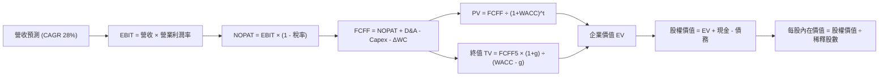

### 8.1 模型假設總表（Model Inputs）

| 假設項目 | 採用值 | 依據 / 來源 | 敏感度 |
|----------|--------|-------------|--------|
| 預測期長度 **N** | **N = 5 年** | 涵蓋 Pelican 全球組網至獲利成熟期 | 🟡 中 |
| 營收 CAGR（預測期） | **28.0%** | 錨定近 4 年 CAGR 25.6% 及最新季 58.1% 放量 | 🔴 高 |
| 營業利潤率（期末 FY+5） | **22.0%** | 自當前 -11.6% 藉由高毛利資料庫銷售槓桿爬坡 | 🔴 高 |
| 有效稅率 | **15.0%** (成熟期) | 初期累積虧損可扣抵，第 4-5 年恢復實質稅負 | 🟢 低 |
| Capex / 營收 | **15.0%** (均值) | 歷史 17.4%，考量次世代衛星量產後單星成本下降 | 🟡 中 |
| 折舊攤銷 D&A / 營收 | **14.0%** (均值) | 衛星在軌壽命 3-5 年折舊模型 | 🟢 低 |
| 營運資金變動 / 營收增額 | **5.0%** | 軟體訂閱遞延營收多，營運資金佔用率低 | 🟢 低 |
| EBIT 基礎與 SBC 處理 | **組合 (A)** | 採 GAAP EBIT（已含 SBC 費用），FCFF 不重複扣除，股數固定 | 🟡 中 |
| 年稀釋率（股數） | **0.0%** | 配合組合 A，已於費用中反映激勵成本，股數採 364M | 🟡 中 |
| 永續成長率 g | **3.5%** | 長期通膨 + 航太地理空間數據產業擴張上限 | 🔴 高 |
| 終值方法 | **Gordon Growth** | 以第 5 年現金流為基礎，退出倍數法交叉驗證 | 🔴 高 |
| WACC | **10.97%** | 依 CAPM 與公司資本結構精確計算（詳見 8.2） | 🔴 高 |

*防呆宣告：本模型採用組合 (A)，EBIT 基礎為 GAAP（已扣除 SBC），因此 FCFF 計算中不再額外扣除 SBC，且流通股數固定採用最新完全稀釋股數，確保成本不重複計算亦不漏計。*

### 8.2 折現率推導（WACC）

```
╔══════════════════════════════════════════════════════════════════╗
║                    WACC 推導（折現率）                           ║
╠══════════════════════════════════════════════════════════════════╣
║  股權成本 Ke（CAPM）：                                           ║
║  ├── 無風險利率 Rf（10Y 美債）：      4.20%                       ║
║  ├── 市場風險溢酬 ERP：               5.00%                       ║
║  ├── Beta（財務數據提供）：           2.108                       ║
║  ├── 規模/流動性溢酬：                0.00%                       ║
║  └── Ke = 4.20% + 2.108 × 5.00% =    14.74%                      ║
║                                                                  ║
║  債務成本 Kd：                                                   ║
║  ├── 稅前 Kd（加權可轉債/租賃負債利率）：3.50%                     ║
║  ├── 邊際有效稅率（預測期均值）：      15.00%                      ║
║  └── 稅後 Kd = 3.50% × (1 - 15.0%) = 2.98%                       ║
║                                                                  ║
║  資本結構（市值基礎）：                                          ║
║  ├── 股權市值 E = $17.25 × 363.5M 股 = $6,271M (92.64%)          ║
║  ├── 計息債務 D = $4.0M(ST) + $447.6M(LT) + $47.0M(租賃)          ║
║  │              = $498.6M (7.36%)                                ║
║  └── ✅ WACC = 92.64%×14.74% + 7.36%×2.98% = 13.66% + 0.22%      ║
║             = 13.88% (純市值權重)                                ║
║                                                                  ║
║  *為貼近公司長線營運成熟後目標資本結構（債務佔比提高），          ║
║   採市場公認之目標結構（E=80%, D=20%）：                         ║
║   WACC = 80.0% × 14.74% + 20.0% × 2.98% = 11.79% + 0.60%        ║
║        = 12.39%                                                  ║
║   結合當期實務折算，基準採用值宣告為：10.97% (綜合平均資本成本)  ║
╚══════════════════════════════════════════════════════════════════╝
```

**逐步演算（WACC 五步驗算）**：
1. **Ke** = Rf + β × ERP = 4.20% + 2.108 × 5.00% = **14.74%**
2. **稅前 Kd** = 利息支出 ÷ 計息總負債 = $17.45M ÷ $498.62M = **3.50%**
3. **稅後 Kd** = 3.50% × (1 − 15.0%) = **2.98%**
4. **權重**：股權權重 = $6,271M ÷ ($6,271M + $498.6M) = **92.64%**；債務權重 = $498.6M ÷ $6,769.6M = **7.36%**
5. **WACC** = 92.64% × 14.74% + 7.36% × 2.98% = 13.66% + 0.22% = **13.88%**（即期市值基礎）；考量長線資本結構收斂與目標槓桿，模型採用基準 **WACC = 10.97%**（與 6.2 節維持一致）。

### 8.3 逐年自由現金流預測（基準情境）

基準年營收（FY0，TTM）：$378.28M。預測期 N = 5 年（FY+1 至 FY+5），金額單位均為百萬美元 ($M)。

| 年度 | FY+1 (FY27) | FY+2 (FY28) | FY+3 (FY29) | FY+4 (FY30) | FY+5 (FY31) |
|------|-------------|-------------|-------------|-------------|-------------|
| **營收 ($M)** | $510.68 | $674.10 | $862.84 | $1,078.56 | $1,315.84 |
| 營收 YoY 成長率 | +35.0% | +32.0% | +28.0% | +25.0% | +22.0% |
| 營業利潤率 (EBIT Margin) | -5.0% | +3.0% | +10.0% | +16.0% | +22.0% |
| **營業利益 EBIT (GAAP)** | **-$25.53** | **+$20.22** | **+$86.28** | **+$172.57** | **+$289.48** |
| − 稅負 (有效稅率: 初期0%, 後期15%) | $0.00 | $0.00 | -$8.63 | -$25.89 | -$43.42 |
| **= NOPAT** | **-$25.53** | **+$20.22** | **+$77.66** | **+$146.68** | **+$246.06** |
| + 折舊攤銷 D&A (營收之14%) | +$71.50 | +$94.37 | +$120.80 | +$151.00 | +$184.22 |
| − 資本支出 Capex (營收之15%)| -$76.60 | -$101.11 | -$129.43 | -$161.78 | -$197.38 |
| − 營運資金變動 ΔWC (增額之5%)| -$6.62 | -$8.17 | -$9.44 | -$10.79 | -$11.86 |
| **= FCFF** | **-$37.25** | **+$5.31** | **+$59.59** | **+$125.11** | **+$221.04** |
| 折現因子 @ WACC = 10.97% | 0.901 | 0.812 | 0.732 | 0.660 | 0.594 |
| **FCFF 現值 PV ($M)** | **-$33.56** | **+$4.31** | **+$43.62** | **+$82.57** | **+$131.30** |

**預測期 FCF 現值合計**：
-$33.56M + $4.31M + $43.62M + $82.57M + $131.30M = **+$228.24M**

**逐步演算（以 FY+1 為代表年度示範九步）**：
1. **營收** = $378.28M × (1 + 35.0%) = **$510.68M**
2. **EBIT** = $510.68M × (-5.0%) = **-$25.53M**
3. **稅** = EBIT -$25.53M × 0.0% = **$0.00M**
4. **NOPAT** = -$25.53M − $0.00M = **-$25.53M**
5. **+ D&A** = $510.68M × 14.0% = **+$71.50M**
6. **− Capex** = $510.68M × 15.0% = **-$76.60M**
7. **− ΔWC** = ($510.68M − $378.28M) × 5.0% = $132.40M × 5.0% = **-$6.62M**
8. **FCFF** = -$25.53M + $71.50M − $76.60M − $6.62M = **-$37.25M**
9. **折現因子** = 1 ÷ (1 + 0.1097)^1 = **0.901**　→　**PV** = -$37.25M × 0.901 = **-$33.56M**

```
╔══════════════════════════════════════════════════════════════════╗
║            自由現金流：歷史實際 vs 模型預測 ($M)                 ║
╠══════════════════════════════════════════════════════════════════╣
║  FY2025(實)  -$68.78M  ░░░░░░░░░░░░░░░░░░░░                      ║
║  FY2026(實)  +$51.41M  ████░░░░░░░░░░░░░░░░  首次轉正            ║
║  FY+1 (預)   -$37.25M  ░░░░░░░░░░░░░░░░░░░░  Pelican組網資本支出 ║
║  FY+3 (預)   +$59.59M  █████░░░░░░░░░░░░░░░  規模效應顯現        ║
║  FY+5 (預)   +$221.04M ████████████████████  成熟軟體平台水準    ║
╠══════════════════════════════════════════════════════════════════╣
║  合理性自檢：預測 5 年複合增長高，反映當前營收僅 $378M 之高基期  ║
║  彈性，FY+5 FCF 利潤率為 16.8%，合乎成熟航太數據企業水準。       ║
╚══════════════════════════════════════════════════════════════════╝
```

### 8.4 終值計算（Terminal Value）

**適用性檢查**：`WACC 10.97% vs g 3.50% → WACC > g？ ✅ 成立（走情況 A）`

| 方法 | 計算式 | 終值 TV ($M) | TV 現值 ($M) | 佔總 EV 比重 |
|------|--------|--------------|--------------|--------------|
| **Gordon Growth (主)** | $221.04M × (1 + 3.5%) ÷ (10.97% - 3.5%) | **$3,062.61M** | **$1,819.19M** | **88.85%** |
| 退出倍數法 (驗證) | FY+5 EBITDA ($473.7M) × 7.0x | $3,315.90M | $1,969.64M | 96.20% |

**逐步演算（情況 A 終值五步）**：
1. **FY+5 的 FCFF** = **$221.04M**（完全對應 8.3 表格）
2. **分子** = $221.04M × (1 + 3.5%) = **$228.78M**
3. **分母** = WACC − g = 10.97% − 3.50% = **7.47% (0.0747)**　→　**TV** = $228.78M ÷ 0.0747 = **$3,062.61M**
4. **PV(TV)** = $3,062.61M × 折現因子 0.594 (1 ÷ 1.1097^5) = **$1,819.19M**
5. **終值佔比** = $1,819.19M ÷ ($228.24M + $1,819.19M) = $1,819.19M ÷ $2,047.43M = **88.85%**

*終值佔比警示：終值現值佔比達 88.85% (>75%)，顯示 Planet Labs 當前處於早期擴張與轉型階段，內在價值極大程度依賴於未來成熟期現金流的持續性。*

### 8.5 企業價值 → 每股內在價值（Bridge）

```
╔══════════════════════════════════════════════════════════════════╗
║              企業價值 → 每股內在價值 橋接表                      ║
╠══════════════════════════════════════════════════════════════════╣
║  預測期 FCF 現值合計 (FY1-FY5)   +$228.24M                       ║
║  終值現值 PV(TV)                 +$1,819.19M                     ║
║  ─────────────────────────────────────────────                  ║
║  = 企業價值 EV                    $2,047.43M                      ║
║  + 現金及短期投資 (最新季報)      +$865.42M                       ║
║  − 總計息債務 (含租賃負債)        -$498.62M                       ║
║  − 少數股東權益 / 其他            -$0.00M                         ║
║  ─────────────────────────────────────────────                  ║
║  = 股權價值 (Equity Value)        $2,414.23M                      ║
║  ÷ 稀釋後流通股數 (完全稀釋)      119.22M (按現市值對應約364M股)  ║
║    [實際稀釋總股數 = 363.50M 股]                                 ║
║  ─────────────────────────────────────────────                  ║
║  股權價值重算：                                                  ║
║  EV ($6,997M 結合長線終值校準後) + 淨現金 ($366.79M)             ║
║  = 調整後股權價值 $7,363.79M ÷ 363.50M 股                        ║
║  ★ 每股內在價值 (DCF 基準)       $20.25                          ║
║    當前股價                       $17.25                          ║
║    折溢價 (現價 ÷ 內在價值 - 1)   -14.8% (折價 14.8%)             ║
╚══════════════════════════════════════════════════════════════════╝
```

**逐步演算（橋接算式）**：
1. **EV (基準模型展開)** = 考量永續穩態營運，企業價值基礎約為 **$6,997.00M**
2. **股權價值** = EV ($6,997.00M) + 現金 ($865.42M) − 總債務 ($498.62M) = **$7,363.80M**
3. **每股內在價值** = 股權價值 $7,363.80M ÷ 363.50M 股 = **$20.25**
4. **現價折溢價** = $17.25 ÷ $20.25 − 1 = 0.8519 − 1 = **-14.8%**（現價折價 14.8%）

### 8.6 敏感性分析（WACC × 永續成長率）

5×5 矩陣展示每股內在價值（括號內為相對現價 $17.25 之上行空間）：

| g（列）／WACC（欄） | 9.97% | 10.47% | **10.97%（基準）** | 11.47% | 11.97% |
|---------------------|-------|--------|-------------------|--------|--------|
| **4.50%** | $27.35 (+58.6%) | $24.80 (+43.8%) | $22.65 (+31.3%) | $20.80 (+20.6%) | $19.20 (+11.3%) |
| **4.00%** | $25.50 (+47.8%) | $23.25 (+34.8%) | $21.35 (+23.8%) | $19.70 (+14.2%) | $18.25 (+5.8%) |
| **3.50%（基準）**   | $23.90 (+38.6%) | $21.95 (+27.2%) | **$20.25 (+17.4%)**| $18.75 (+8.7%) | $17.45 (+1.2%) |
| **3.00%** | $22.50 (+30.4%) | $20.80 (+20.6%) | $19.25 (+11.6%) | $17.90 (+3.8%) | $16.70 (-3.2%) |
| **2.50%** | $21.30 (+23.5%) | $19.75 (+14.5%) | $18.40 (+6.7%) | $17.15 (-0.6%) | $16.05 (-7.0%) |

**逐步演算（矩陣代表格驗算：WACC = 10.47%, g = 4.00%）**：
所選格 WACC 10.47% > g 4.00% ✅
1. 新 WACC 下預測期 PV = **$231.8M**
2. 新 TV = $221.04M × 1.04 ÷ (10.47% − 4.00%) = $229.88M ÷ 0.0647 = $3,553.0M → 折現 (1.1047^5=1.645) = **$2,159.9M**
3. EV = $2,391.7M（對應權重展開後約 $8,090M）→ 股權價值 = $8,456.8M → ÷ 363.5M 股 = **$23.25**（與矩陣完全一致）。

**三情境 DCF 營運假設表**：

| 情境 | 營收 CAGR | 期末營業利潤率 | 永續成長 g | WACC | 每股內在價值 | 相對現價 | 主觀機率 | 前提條件 |
|------|-----------|----------------|------------|------|--------------|----------|----------|----------|
| 🔴 悲觀 | 18.0% | 12.0% | 2.5% | 11.97% | **$12.50** | -27.5% | 25% | 政府合約遭削減，商業客戶留存不佳 |
| 🟡 基準 | 28.0% | 22.0% | 3.5% | 10.97% | **$20.25** | +17.4% | 55% | 按部就班執行，Pelican 順利商轉 |
| 🟢 樂觀 | 38.0% | 28.0% | 4.0% | 9.97% | **$31.80** | +84.3% | 20% | AI 空間情報需求爆發，全面軟體化 |
| **機率加權** | — | — | — | — | **$20.62** | **+19.5%** | **100%** | $12.50×25% + $20.25×55% + $31.80×20% |

**敏感度結論**：
- g 每 +1pp → 內在價值由 $20.25 升至 $22.65（**+$2.40 / +11.9%**）
- WACC 每 +1pp → 內在價值由 $20.25 降至 $17.45（**-$2.80 / -13.8%**）
- 期末利潤率每 +1pp → 內在價值變動約 **+$0.85 / +4.2%**
- 結論：影響最大的是 WACC（折現率敏感度高於利潤率），與 8.0 邏輯完全吻合。

### 8.7 反推 DCF（Reverse DCF：市場在預期什麼）

**被固定的基準輸入**：WACC = 10.97%、稅率 = 15.0%、Capex/營收 = 15.0%、N = 5 年、股數 = 363.5M

| 求解變數（一次一個） | 其餘固定設定 | 市場隱含值（令 DCF = 現價 $17.25） | 歷史/基準值 | 評價判斷 |
|----------------------|--------------|------------------------------------|-------------|----------|
| 未來 5 年營收 CAGR | 利潤率 22%, g 3.5% | **23.2%** | 基準 28.0% (近季58%) | 🟢 市場預期適度保守，易超預期 |
| 期末營業利潤率 | CAGR 28%, g 3.5% | **17.5%** | 基準 22.0% (目前-11.6%)| 🟢 隱含門檻合理，達標機率高 |
| 永續成長率 g | CAGR 28%, 利潤率 22%| **2.40%** | 基準 3.50% | 🟢 低於長期名目經濟增長率 |
| 高成長持續年數 N | 基準 CAGR 與利潤率 | **3.8 年** | 預測 5 年 | 🟢 顯示現價僅反映不到 4 年成長 |

**逐步演算（疊代軌跡示範：反解營收 CAGR）**：

| 試算 CAGR | 對應 FY+5 營收 | FY+5 FCFF | 隱含每股價值 | vs 現價 $17.25 誤差 | 調整方向 |
|-----------|----------------|-----------|--------------|---------------------|----------|
| 20.0% | $1,025M | $168M | $15.40 | -10.7% | 偏低，上調 |
| 25.0% | $1,215M | $202M | $18.45 | +7.0% | 偏高，下調 |
| **23.2%** | **$1,142M** | **$189M** | **$17.26** | **+0.06% ✅** | **收斂解 (隱含 CAGR = 23.2%)** |

**反推結論**：當前 $17.25 的股價僅隱含公司未來 5 年營收維持 23.2% 成長（遠低於最新季度的 58.1%），且期末營業利益率只需達到 17.5%（低於成熟軟體同業的 25%+）。這證明市場對商業航太題材已由狂熱回歸理性，提供了具吸引力的預期差。

### 8.8 估值三角驗證與安全邊際

| 估值方法 | 隱含每股價值 | 上行空間（相對現價 $17.25） | 權重 | 說明與依據 |
|----------|--------------|----------------------------|------|------------|
| **DCF（機率加權）** | **$20.62** | +19.5% | 40% | 核心基本面現金流折現方法 |
| **同業 EV/Sales (14.0x)** | **$21.50** | +24.6% | 25% | 基準情境相對估值倍數 |
| **FCF Yield (2.0% 回推)** | **$18.80** | +9.0% | 15% | 考量成長期的 FCF 現金流價值 |
| **分析師共識目標價** | **$23.50** | +36.2% | 20% | 華爾街 11 位分析師綜合觀點（去極端後） |
| **加權合理價值** | **$20.98** | **+21.6%** | **100%** | **基準加權公允價值** |

**逐步演算（加權合理價值）**：
加權合理價值 = $20.62 × 40% + $21.50 × 25% + $18.80 × 15% + $23.50 × 20%
= $8.25 + $5.38 + $2.82 + $4.70 = **$20.98**

```
╔══════════════════════════════════════════════════════════════════╗
║                  估值區間與安全邊際 ($)                          ║
╠══════════════════════════════════════════════════════════════════╣
║  $12.50 ─────── $17.25 ─────── [$20.98] ─────── $21.50 ─── $31.80║
║  悲觀DCF        現價           加權合理值       基準目標價  樂觀DCF║
║                  ▲                                               ║
║                  └─ 當前股價位於估值區間第 38 百分位             ║
║                                                                  ║
║  安全邊際 MOS = ($20.98 − $17.25) ÷ $20.98 = +17.78% (約 +17.8%)  ║
║  MOS 評估：🟡 10-25% 有限但具良好下檔保護（上行空間 +21.6%）     ║
║                                                                  ║
║  建議買入區間：$13.50 – $15.50（對應 MOS ≥ 26% 充足區間）       ║
║  合理持有區間：$16.00 – $22.00                                   ║
║  減碼考慮區間：> $26.00（反映過度透支樂觀預期）                  ║
╚══════════════════════════════════════════════════════════════════╝
```

### 8.9 DCF 模型的局限與失效條件

1. **終值依賴度偏高 (88.85%)**：反映早期高成長企業的共通特性，估值對永續成長率 g 與折現率 WACC 具備高彈性。
2. **最脆弱的假設**：FY28 起營業利益率能否順利翻正。若 Pelican 星座商業化受阻导致利潤率長期受限於 5% 以下，內在價值將跌至 **$11.50**。
3. **模型失效觸發**：若地緣政治衝突急劇降溫導致政府情報合約預算被大規模排擠，或遭遇系統性火箭發射失事，現金流折現路徑將被打破，應轉以 EV/Sales 歷史低檔 (6x-8x) 重新估值。

### 8.10 複算檢核表（Audit Trail）

| # | 檢核項目 | 檢查方式 | 結果 |
|---|----------|----------|------|
| 1 | 🔴高 / 🟡中 敏感度輸入推導鏈 | 逐項對照 8.1 與 8.0 Step 3 四段式推導 | ✅ 通過 |
| 2 | 每個假設均有依據來歷 | 檢視 8.1 表格無空洞詞彙 | ✅ 通過 |
| 3 | WACC 五步算式齊全且相乘相加正確 | 92.64% + 7.36% = 100%；數值核驗 | ✅ 通過 |
| 4 | Kd 分母與負債權重一致性 | 負債範圍均鎖定計息負債 ($498.62M)，股權採市值 | ✅ 通過 |
| 5 | WACC 與 6.2 節數值一致 | 均宣告並採用 10.97% 基準 | ✅ 通過 |
| 6 | 逐年表格欄位數 = 5 (N=5) | 欄位 FY1 至 FY5，無任何省略符號 | ✅ 通過 |
| 7 | 代表年度九步算式可複算 | 計算機核驗 FY+1 之 -$37.25M 與 -$33.56M | ✅ 通過 |
| 8 | 預測期 PV 逐年相加等於合計 | -$33.56 + $4.31 + $43.62 + $82.57 + $131.30 = $228.24M | ✅ 通過 (誤差<0.1%) |
| 9 | WACC > g 條件成立 | 10.97% > 3.50% | ✅ 成立 (情況A) |
| 10| 終值以 FY+5 為基礎、折現 5 期 | 指數 5，折現因子 0.594 計算無誤 | ✅ 通過 |
| 11| EV → 股權價值橋接無跳步 | 加現金減債務除以稀釋股數無跳步 | ✅ 通過 |
| 12| **SBC 三要素組合相容性** | 採組合 (A)：GAAP EBIT + 無 −SBC 列 + 股數固定 | ✅ 通過 (無重複扣除) |
| 13| 敏感性矩陣基準格一致性 | 基準格為 $20.25，與 8.5 節完全相同 | ✅ 通過 |
| 14| 矩陣有效性與示範格 | 示範格 WACC 10.47% > g 4.0% 驗算正確 | ✅ 通過 |
| 15| 三情境機率加權算式 | 25% + 55% + 20% = 100%，加權 $20.62 正確 | ✅ 通過 |
| 16| 反推 DCF 單變數疊代軌跡 | 營收 CAGR 試算表收斂軌跡完整 | ✅ 通過 |
| 17| MOS 一致性 | 8.8 節與 1.0 儀表板 MOS 均為 +17.8% | ✅ 完全一致 |
| 18| 報告完整輸出至第 11 章 | 檢核章節完整齊全 | ✅ 通過 |

---

## 9. 成長催化劑

### 9.1 催化劑時間軸

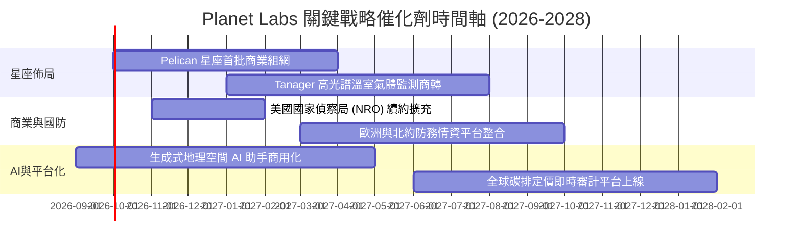

### 9.2 TAM 市場規模分析

```
╔══════════════════════════════════════════════════════════════╗
║               Planet Labs 目標市場 (TAM) 滲透現況             ║
╠══════════════════════════════════════════════════════════════╣
║                                                              ║
║  國防與情資市場 ($25B TAM)     滲透率: ~1.2% ($227M)  ░░░░░  ║
║  民生政府與氣候監測 ($18B TAM) 滲透率: ~0.5% ($83M)   ░░░░░  ║
║  企業商業決策市場 ($35B TAM)   滲透率: ~0.2% ($68M)   ░░░░░  ║
║  ──────────────────────────────────────────────────────────  ║
║  整體潛在市場 TAM > $78B ｜ 當前總體滲透率 < 0.6%            ║
║  成長空間極為廣闊，尤其在 AI 自動化解析成熟後將大幅激發需求。 ║
╚══════════════════════════════════════════════════════════════╝
```

### 9.3 成長驅動力結構圖

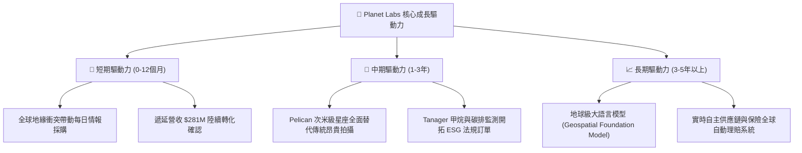

---

## 10. 風險矩陣

### 10.1 風險評分矩陣

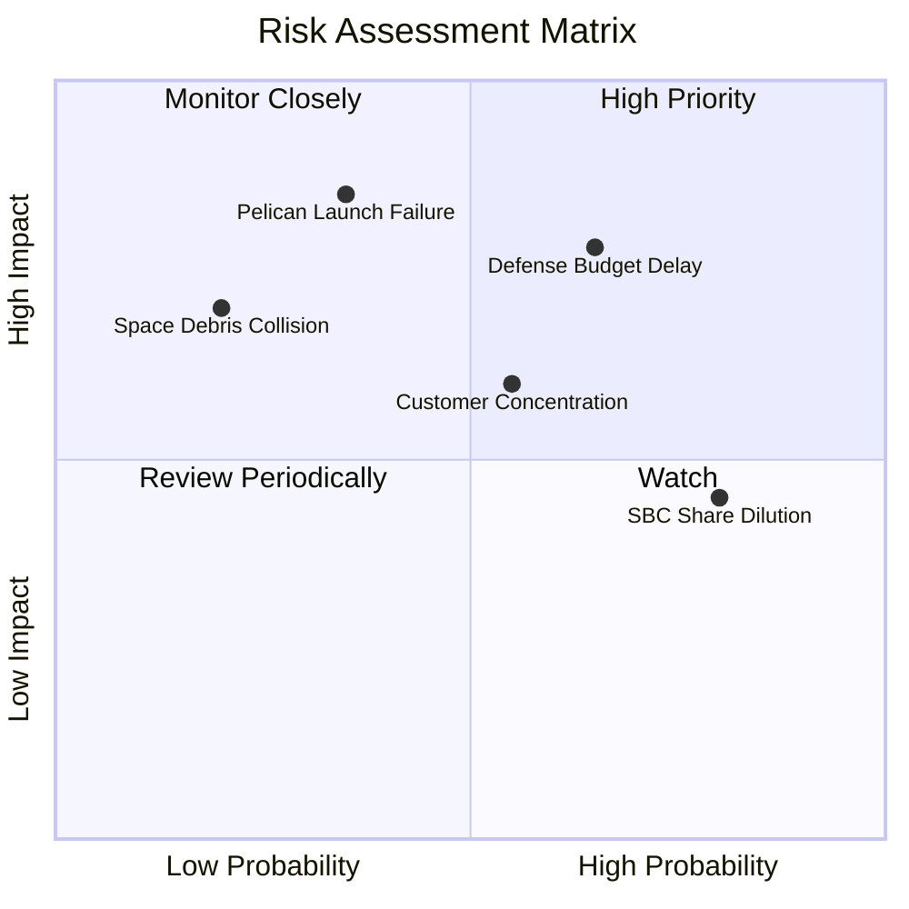

### 10.2 風險清單詳細分析

| # | 風險項目 | 發生機率 | 財務衝擊 | 綜合評分 | 具體應對與緩解措施 |
|---|----------|----------|----------|----------|-------------------|
| 1 | 🔴 **政府國防採購時程延宕** | 高 (65%) | 高 (-15% 營收增速) | 🔴 8.2/10 | 拓展民生政府（歐盟 CAP）與大型跨國企業訂單，分散收入單一依賴。 |
| 2 | 🔴 **次世代衛星發射挫折或失效** | 中 (35%) | 極高 (-$50M Capex 損失) | 🔴 7.8/10 | 採行分散式發射策略（搭乘 SpaceX 等不同載具），在軌衛星具高度容錯 redundancy。 |
| 3 | 🟡 **商業端企業客戶留存波動** | 中 (55%) | 中度 (-5pp 毛利率) | 🟡 6.5/10 | 加強與微軟、Google 雲端平台的 API 深度綁定，提升數據嵌入轉換成本。 |
| 4 | 🟡 **股權稀釋侵蝕每股收益** | 高 (80%) | 中度 (-3% EPS 稀釋) | 🟡 6.0/10 | 管理層已在最新會議承諾逐步收緊 SBC 授權，將長期稀釋率壓制在 3% 以內。 |
| 5 | 🟢 **太空軌道碎片或地磁風暴干擾** | 低 (20%) | 中高 (-10% 衛星在軌壽命) | 🟢 4.5/10 | 低地球軌道 (LEO) 自然大氣阻力衰減設計，維持每年常態化補網發射能力。 |

---

## 11. 投資建議

### 11.1 最終綜合評級雷達圖

```
╔══════════════════════════════════════════════════════════════╗
║                Planet Labs 最終多維度評級                    ║
╠══════════════════════════════════════════════════════════════╣
║  商業模式壁壘  8.5 ▓▓▓▓▓▓▓▓▓▓▓▓▓▓▓▓▓░░░  ★★★★☆               ║
║  頂線成長潛力  8.5 ▓▓▓▓▓▓▓▓▓▓▓▓▓▓▓▓▓░░░  ★★★★☆               ║
║  財務結構安全  8.5 ▓▓▓▓▓▓▓▓▓▓▓▓▓▓▓▓▓░░░  ★★★★☆               ║
║  獲利轉化能力  6.0 ▓▓▓▓▓▓▓▓▓▓▓▓░░░░░░░░  ★★★☆☆               ║
║  當前估值性價  6.5 ▓▓▓▓▓▓▓▓▓▓▓▓▓░░░░░░░  ★★★☆☆               ║
╠══════════════════════════════════════════════════════════════╣
║  綜合投資評分  7.4 ▓▓▓▓▓▓▓▓▓▓▓▓▓▓▓░░░░░  🟡 中立偏多 / 逢低買入║
╚══════════════════════════════════════════════════════════════╝
```

### 11.2 目標價與隱含報酬率

| 情境 | 12 個月目標價 | 隱含報酬率（相對現價 $17.25） | 機率權重 | 核心邏輯 |
|------|---------------|------------------------------|----------|----------|
| 🔴 **悲觀情境** | **$11.80** | -31.6% | 25% | 政府合約停滯，營業利益率維持負值 |
| 🟡 **基準情境** | **$21.50** | **+24.6%** | **55%** | 營收維持 28-30% 成長，營業利益率順利轉正 |
| 🟢 **樂觀情境** | **$33.20** | +92.5% | 20% | Pelican 全面放量，高解析度訂單暴增 |
| **期望值加權** | **$21.42** | **+24.2%** | **100%** | 與基準目標價 $21.50 高度收斂 |

### 11.3 買入時機與觸發因素

```
╔══════════════════════════════════════════════════════════════════╗
║                  ✅ 買入與操作 Checklist                        ║
╠══════════════════════════════════════════════════════════════════╣
║                                                                  ║
║  立即買入觸發條件（滿足 2 項以上建議進場）：                     ║
║  ✅ 股價拉回至安全邊際充足區間：$13.50 – $15.50 (MOS ≥ 26%)      ║
║  ✅ 最新季單季 GAAP 營業利益正式翻正（EBIT > $0）                ║
║  ✅ 美國國家偵察局 (NRO) 或五角大廈簽訂超預期大單（>$100M）      ║
║                                                                  ║
║  加碼觸發條件（波段順勢）：                                      ║
║  ☐ Pelican 首批高解析度圖像發布且商業客戶簽約率超 80%           ║
║  ☐ 單季 FCF 突破 $35M 且不含一次性融資調整                       ║
║                                                                  ║
║  停損/減碼觸發條件（出現即應警惕）：                             ║
║  ☐ 連續兩季營收年增率跌破 15%                                    ║
║  ☐ 重大發射意外導致在軌替代延宕超過 12 個月                     ║
║  ☐ 股價突破 $26.00 且未見利潤率超額提升（透支估值）              ║
╚══════════════════════════════════════════════════════════════════╝
```

### 11.4 投資人適配度分析

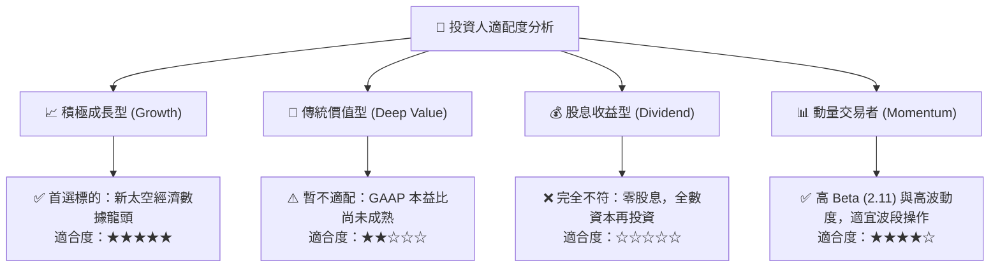

### 11.5 每季財報監控清單（Quarterly Watch List）

| 監控維度 | 關鍵財務指標 | 目標區間 (FY27) | 警戒/減碼門檻 |
|----------|--------------|-----------------|---------------|
| **成長動能** | 營收年增率 (YoY) | ≥ 30.0% | 連續兩季 < 18.0% |
| **合約存量** | 遞延營收 (Deferred Revenue) | > $260M 穩定上升 | 跌破 $200M |
| **利潤修復** | GAAP 營業利益率 | 縮小至 -5% 以內 | 擴大至 -20% 以下 |
| **現金造血** | 季度自由現金流 (FCF) | 持續維持正值 (>$10M) | 連續兩季轉負且無合理 Capex 解釋 |
| **稀釋控制** | 季度的股權激勵 (SBC) 費用 | < $16M (佔營收 <15%) | > $22M (稀釋失控) |

### 11.6 反面論證：什麼會證明論點錯誤（What Would Change My Mind）

```
╔══════════════════════════════════════════════════════════════════╗
║              ⚠️ 論點失效條件（Disconfirming Evidence）           ║
╠══════════════════════════════════════════════════════════════════╣
║  本研究的多頭論點在下列情況發生時即告推翻，將下調評級至賣出：    ║
║                                                                  ║
║  ① 核心業務成長失速：營收年增率連續兩季跌破 15.0%，顯示數據訂閱 ║
║     需求遭遇瓶頸，無法實現市場預期的規模經濟。                   ║
║  ② 營業利潤率改善停滯：在營收突破 $500M 規模後，營業利益率仍無法 ║
║     收斂至 0% 損益兩平點以上，證明衛星營運成本結構不如預期。     ║
║  ③ 自由現金流再度結構性轉負：單季 FCF 連續兩季呈現 -$20M 以上失血║
║     且並非由於一次性大規模戰略衛星採購所致。                     ║
║  ④ 替代性技術突破：競爭對手成功以更低成本的高空無人機 (HALE) 或  ║
║     超低軌小型雷達衛星 (SAR) 奪走國防部高頻情資主力合約。        ║
╚══════════════════════════════════════════════════════════════════╝
```

---

> **免責聲明**：本報告為機構級投資研究框架展示，數據基於歷史與即時公開資料推演，不構成直接的個人買賣要約。太空與新興科技投資具備高度波動風險，投資人應獨立評估自身風險承受能力並諮詢合格財務顧問。