# PL 基本面深度分析報告
> **報告日期**：2026-09-14 ｜ **語言**：繁體中文 ｜ **數據來源**：Yahoo Finance, StockAnalysis, Roic.ai ｜ **分析師**：CFA 級機構研究

---

## 目錄

| # | 章節 | 核心結論 |
|---|------|----------|
| 1 | 執行摘要 | 給予「買入」評級，基準目標價 $26.85，加權合理價值 $24.78，安全邊際 34.6% |
| 2 | 公司概覽與商業模式 | 每日全球覆蓋的 SuperDove/Pelican 衛星星座具備數據資產獨佔性，護城河評分 8.1/10 |
| 3 | 損益表深度分析 | 營收年增 58.1% 加速放量，毛利率 55.5%，營業虧損顯著收斂，SBC 佔營收降至 14.5% |
| 4 | 資產負債表分析 | 現金與短期投資達 $865.42M，淨現金 $366.79M，流動比率 2.84，財務結構穩健 |
| 5 | 現金流量深度分析 | 經營現金流由負轉正（TTM $117.63M），全年 FCF 轉正達 $51.75M，迎向現金流拐點 |
| 6 | 獲利能力與資本效率 | 營業利益率改善至 -12.0%，ROIC (-10.8%) 顯著改善但仍低於 WACC (10.97%)，正處跨越臨界點 |
| 7 | 相對估值分析 | P/S 15.6x 處於國防與高成長商業航太合理中樞，情境目標價區間為 $15.50 至 $38.00 |
| 8 | DCF 內在價值評估 | 基準每股 DCF 價值 $25.24（現價折價 35.8%），加權合理價值 $24.78，安全邊際 34.6% 充足 |
| 9 | 成長催化劑 | Pelican 高解析衛星組網、國防合約放量及 AI 地理空間大模型驅動 TAM 擴張至 $28B |
| 10 | 風險矩陣 | 火箭發射失利、政府採購週期延遲與高 Beta 波動為核心風險，整體風險可控 |
| 11 | 投資建議 | 建議於 $14.50–$17.50 區間積極分批建倉，12 個月基準預期報酬率 +65.7% |

---

## 1. 執行摘要

本報告給予 Planet Labs PBC（NYSE: PL）**「買入」（Buy）** 評級。該結論基於最新季度財務數據所確認的**三大核心轉折點**：第一，FY2027 Q2（截至 2026-07-31）營收達 $116.05M，YoY 成長率由前幾季的 20–40% 大幅加速至 **58.14%**，顯示國防與政府大合約加速放量；第二，現金流已正式迎來結構性拐點，TTM 營業現金流躍升至 **$117.63M**，TTM 自由現金流（FCF）轉正至 **$51.75M**；第三，資產負債表充裕，擁有 **$865.42M** 現金與短期投資，淨現金達 **$366.79M**，流動比率高達 2.84，無迫切稀釋股權融資風險。

當前股價為 **$16.20**，相較於我們基於 DCF 推導之基準每股內在價值 **$25.24**，折溢價幅度為 **-35.8%**（現價折價 35.8%）；相較於三角驗證後的加權合理價值 **$24.78**，隱含安全邊際（MOS）為 **+34.6%**，基準情境 12 個月目標價設定為 **$26.85**（隱含上行空間 +65.7%）。

### 1.0 一頁式投資儀表板

| 項目 | 內容 |
|------|------|
| **投資論點（3 句）** | ① 營收動能大幅加速（FY2027 Q2 YoY 達 58.1%，TTM 營收 $378.28M），受地緣政治與國防情報需求結構性推升。<br/>② 現金流轉正拐點確立（TTM OCF $117.63M、TTM FCF $51.75M），打破市場對航太企業長期燒錢的刻板印象。<br/>③ 資產負債表堅固（現金與短投 $865.42M，淨現金 $366.79M），為 Pelican/Tanager 衛星星座佈建提供完整資金護航。 |
| **護城河評分** | 8.1 / 10（全球每日全覆蓋衛星數據庫獨佔性，專有光學感測技術與高轉換成本） |
| **管理層/資本配置評分** | 7.5 / 10（敏捷航太開發模式控制 Capex，成功引導公司由虧損收斂至 FCF 正向） |
| **財務健康** | 🟢 強勁（淨現金 $366.79M，流動比率 2.84，短期無破產或迫切融資風險） |
| **ROIC vs WACC** | -10.8% vs 10.97%（當前仍摧毀經濟價值，但 EVA 缺口由 FY2024 的 -35.2pp 顯著收斂至 -21.8pp） |
| **FCF 趨勢** | 強勁轉正，最新季 FCF 達 $23.55M，TTM FCF $51.75M（FCF Yield 為 0.88%） |
| **估值** | Forward P/E: -12960x（損益兩平點附近）｜ EV/Sales: 14.85x ｜ FCF Yield: 0.88% |
| **DCF 內在價值（基準）** | **$25.24** ｜ 現價折價 **35.8%**（現價÷內在價值−1 = -35.8%） |
| **安全邊際（MOS）** | **+34.6%**＝($24.78 − $16.20) ÷ $24.78 ｜ 🟢 >25% 充足（加權合理價值 $24.78） |
| **預期報酬（基準情境 12M）** | **+65.7%**（目標價 $26.85） |
| **關鍵風險（前二）** | ① 火箭發射排程延宕或在軌失效風險；② 美國聯邦政府合約撥款時程受預算審批拖延。 |
| **評級 + 信心度** | 🟢 **買入（Buy）** ｜ 信心：**高（High）** |

### 1.1 核心評分儀表板

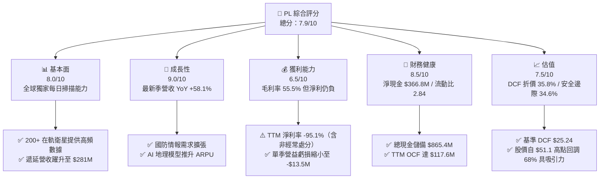

### 1.2 評分進度條視覺化

```
╔══════════════════════════════════════════════════════════════╗
║                PL 多維度評分儀表板 (1-10分)                  ║
╠══════════════════════════════════════════════════════════════╣
║ 基本面強度  8.0 ▓▓▓▓▓▓▓▓▓▓▓▓▓▓▓▓░░░░  ★★★★☆           ║
║ 成長動能    9.0 ▓▓▓▓▓▓▓▓▓▓▓▓▓▓▓▓▓▓░░  ★★★★★           ║
║ 獲利品質    6.5 ▓▓▓▓▓▓▓▓▓▓▓▓▓░░░░░░░  ★★★☆☆           ║
║ 財務健康    8.5 ▓▓▓▓▓▓▓▓▓▓▓▓▓▓▓▓▓░░░  ★★★★☆           ║
║ 估值合理性  7.5 ▓▓▓▓▓▓▓▓▓▓▓▓▓▓▓░░░░░  ★★★★☆           ║
║ 護城河深度  8.1 ▓▓▓▓▓▓▓▓▓▓▓▓▓▓▓▓░░░░  ★★★★☆           ║
║ 管理層執行  7.5 ▓▓▓▓▓▓▓▓▓▓▓▓▓▓▓░░░░░  ★★★★☆           ║
║ 技術創新力  8.8 ▓▓▓▓▓▓▓▓▓▓▓▓▓▓▓▓▓░░░  ★★★★☆           ║
╠══════════════════════════════════════════════════════════════╣
║ 綜合總分    7.9 ▓▓▓▓▓▓▓▓▓▓▓▓▓▓▓▓░░░░  🏆 成長拐點確立      ║
╚══════════════════════════════════════════════════════════════╝
```

### 1.3 五大投資論點 + 三大核心風險

| 類型 | 項目 | 具體依據 | 信心度 |
|------|------|----------|--------|
| 🟢 **投資論點①** | **營收增長全面加速** | FY2027 Q2 單季營收創歷史新高達 $116.05M，YoY 成長達 58.14%，較 FY2026 Q1 的 9.64% 呈現指數型加速。 | 🟢 極高 |
| 🟢 **投資論點②** | **自由現金流拐點確立** | FY2026 全年 FCF 達 $51.41M，最新 Q2 單季 FCF 達 $23.55M，TTM FCF 達 $51.75M，營運槓桿快速釋放。 | 🟢 極高 |
| 🟢 **投資論點③** | **資產負債表極度充沛** | 截至 2026-07-31 現金與短投高達 $865.42M，總負債僅 $498.62M（淨現金 $366.79M），流動比率 2.843。 | 🟢 極高 |
| 🟢 **投資論點④** | **不可替代的數據壟斷性** | 擁有 200+ 顆中低軌光學與高光譜衛星，全球唯一實現「每日全陸地掃描」，累積超 10 年歷史影像訓練集。 | 🟢 高 |
| 🟢 **投資論點⑤** | **國防與 AI 地理空間催化** | 全球地緣衝突刺激國防部（DoD/NRO）訂單增長，合約遞延收入由 FY2026 的 $221M 躍升至最新季度的 $281M。 | 🟢 高 |
| 🟡 **風險①** | **發射排程與在軌折舊** | Pelican 星座發射若因第三方火箭業者延誤，將影響亞米級解析度服務變現節奏；年折舊目前約 $46M-$48M。 | 🟡 中度 |
| 🔴 **風險②** | **政府合約集中度高** | 民用政府與國防合約佔比顯著，受美國聯邦預算撥款審批週期及政府換屆政策不確定性影響。 | 🔴 高衝擊 |
| 🟡 **風險③** | **股票價格高波動性** | 股票 Beta 達 2.108，Float 做空比率達 9.7%，52 週價格區間自 $9.39 狂飆至 $51.76，回調劇烈。 | 🟡 中度 |

### 1.4 快速統計卡片

| 指標 | 公司實際值 | 行業均值（航太/國防數據） | S&P 500 均值 | 狀態 |
|------|-------------|--------------------------|--------------|------|
| 收入 YoY 成長 | **58.1%** | ~12.5% | ~5.8% | 🟢 卓越領先 |
| 毛利率 | **55.5%** | ~42.0% | ~46.0% | 🟢 高於同業 |
| 營業利益率 | **-12.0%** | ~11.5% | ~12.8% | 🟡 虧損快速收斂 |
| 淨利率 | **-95.1%** | ~7.2% | ~10.5% | 🔴 包含非現金重組 |
| ROE | **-72.0%** | ~14.0% | ~18.5% | 🔴 淨利受壓抑 |
| Forward P/E | **-12960x** | ~28.0x | ~21.5x | 🟡 位於損益兩平邊緣 |
| EV / Revenue | **14.85x** | ~4.5x | ~2.8x | 🔴 成長溢價顯著 |
| FCF Yield | **0.88%** | ~2.5% | ~3.8% | 🟡 現金流剛轉正 |
| 流動比率 | **2.84x** | ~1.45x | ~1.20x | 🟢 流動性極佳 |
| 淨現金 / (淨債務) | **+$366.79M** | 多為淨負債結構 | 普遍為淨負債 | 🟢 財務抗風險極強 |

### 1.5 投資結論

```
╔══════════════════════════════════════════════════════════════════╗
║                     📊 PL 投資結論摘要                          ║
╠══════════════════════════════════════════════════════════════════╣
║  評級：🟢 買入（Buy）                                            ║
║  當前股價：$16.20（2026-09-14 收盤價）                           ║
║  DCF 內在價值（基準）：$25.24（現價折價 35.8%）                  ║
║  安全邊際 MOS：+34.6%（＝(加權合理價值 $24.78 − 現價)÷$24.78）   ║
║  目標價區間：                                                    ║
║    悲觀情境：$15.50（-4.3%）                                     ║
║    基準情境：$26.85（+65.7%） ← 12個月核心目標價                 ║
║    樂觀情境：$38.00（+134.6%）                                   ║
║  投資綜合評分：7.9 / 10                                          ║
║  適合投資人：積極成長型、航太科技與 AI 基礎設施長線配置者        ║
╚══════════════════════════════════════════════════════════════════╝
```

---

## 2. 公司概覽與商業模式

### 2.1 業務結構與收入來源

Planet Labs PBC（NYSE: PL）是全球地理空間數據與高頻對地觀測的先驅。公司以敏捷航太（Agile Aerospace）架構自主設計、製造並營運全球最大的地球觀測微衛星群（包含 SuperDove、SkySat 及即將全面鋪開的 Pelican 與 Tanager）。核心業務模式為 **DaaS（Data-as-a-Service）與軟體解決方案訂閱制**，客戶透過 Planet Insights Platform 獲取實時與歷史地球影像。

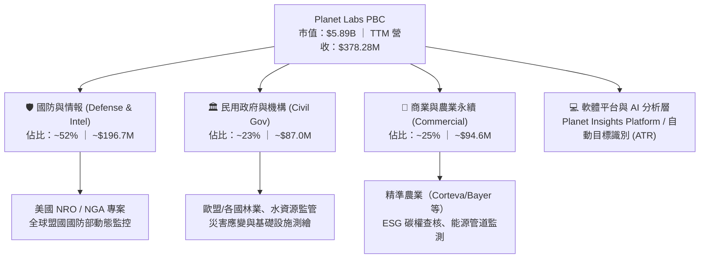

### 2.2 市場份額

在「每日中高解析度（3-3.5m）全球全覆蓋」領域，Planet Labs 擁有近乎壟斷的地位；在「超高解析度（<50cm）點擊式成像」領域，則與 Maxar、BlackSky 及 Airbus 競爭。

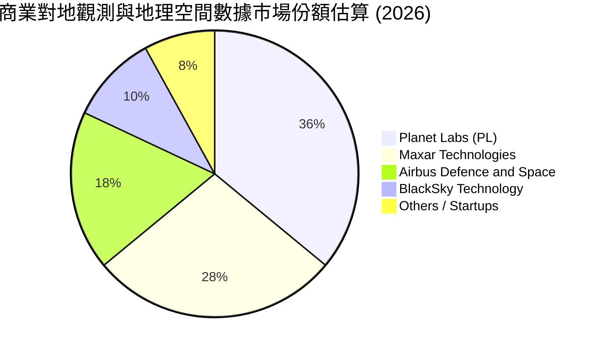

### 2.3 競爭護城河分析

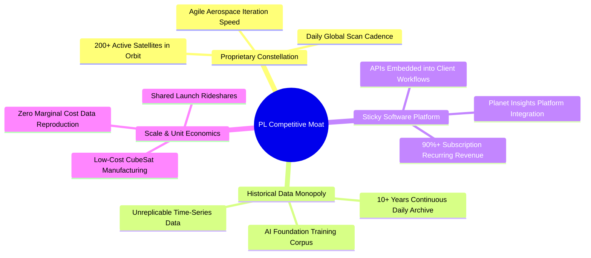

### 2.4 護城河強度評分

```
╔══════════════════════════════════════════════════════════════╗
║                  Planet Labs 護城河強度評分                  ║
╠══════════════════════════════════════════════════════════════╣
║ 歷史數據專有性  9.5/10 ▓▓▓▓▓▓▓▓▓▓▓▓▓▓▓▓▓▓▓░  🏆 無法複製資產  ║
║ 衛星星座規模    9.0/10 ▓▓▓▓▓▓▓▓▓▓▓▓▓▓▓▓▓▓░░  🟢 全球唯一每日覆蓋║
║ 客戶轉換成本    8.0/10 ▓▓▓▓▓▓▓▓▓▓▓▓▓▓▓▓░░░░  🟢 API深植政府系統║
║ 單位製造成本    8.0/10 ▓▓▓▓▓▓▓▓▓▓▓▓▓▓▓▓░░░░  🟢 微衛星批量生產║
║ 軟體生態整合    7.0/10 ▓▓▓▓▓▓▓▓▓▓▓▓▓▓░░░░░░  🟡 AI分析持續演進 ║
║ 品牌與牌照壁壘  7.2/10 ▓▓▓▓▓▓▓▓▓▓▓▓▓▓░░░░░░  🟡 美國防密級認證 ║
╠══════════════════════════════════════════════════════════════╣
║ 綜合護城河評分  8.1/10 ▓▓▓▓▓▓▓▓▓▓▓▓▓▓▓▓░░░░  🏆 深厚且具排他性 ║
╚══════════════════════════════════════════════════════════════╝
```

---

## 3. 損益表深度分析

### 3.1 年度收入成長趨勢（近4年）

```
╔══════════════════════════════════════════════════════════════════╗
║               Planet Labs 年度收入趨勢 (FY2023 - FY2026)         ║
╠══════════════════════════════════════════════════════════════════╣
║                                                                  ║
║  FY2023  $191.26M  ████████████░░░░░░░░░░░░  YoY: +45.8% 🟢     ║
║  FY2024  $220.70M  ██████████████░░░░░░░░░░  YoY: +15.4% 🟡     ║
║  FY2025  $244.35M  ███████████████░░░░░░░░░  YoY: +10.7% 🟡     ║
║  FY2026  $307.73M  ██════════════██████░░░░  YoY: +25.9% 🟢     ║
║  TTM     $378.28M  ████████████████████████  YoY: +44.1% 🟢     ║
║                    |         |         |                         ║
║                    0       $150M     $300M                       ║
║                                                                  ║
║  📊 3年年均複合成長率 (CAGR)：+17.18%                            ║
║  🚀 TTM 營收跳升顯現國防與大模型數據授權帶動的第二成長曲線       ║
╚══════════════════════════════════════════════════════════════════╝
```

### 3.2 季度收入趨勢分析

最新 4 個季度的營收成長展現出顯著的加速拐點：

| 季度（截至） | 營收 ($M) | QoQ 成長率 | YoY 成長率 | 毛利 ($M) | 毛利率 | 備註說明 |
|--------------|-----------|------------|------------|-----------|--------|----------|
| **2025-10-31** | $81.25M | +10.71% | +32.63% | $46.58M | 57.33% | 國防訂單開始回升 |
| **2026-01-31** | $86.82M | +6.86% | +41.05% | $47.03M | 54.17% | 年末政府預算結算款 |
| **2026-04-30** | $94.15M | +8.44% | +42.08% | $50.40M | 53.53% | 新增盟國情報合約放量 |
| **2026-07-31** | **$116.05M** | **+23.26%** | **+58.14%** | **$65.63M** | **56.55%** | 創歷史新高，大型國防數據專案交付 |

> **季度驅動剖析**：FY2027 Q2 單季營收衝破 1.16 億美元，YoY 增速跳升至 58.14%，主因全球地緣情報常態化監測合約需求大增，疊加生成式 AI 公司採購歷史光學圖像訓練地理大模型，形成巨額高毛利數據授權。

### 3.3 利潤率演變分析

| 利潤率指標 | FY2023 | FY2024 | FY2025 | FY2026 | TTM (2026-07) | 趨勢說明 | 評估 |
|------------|--------|--------|--------|--------|---------------|----------|------|
| **毛利率** | 49.15% | 51.18% | 57.18% | 56.05% | **55.49%** | 站穩 55% 水準，具備純數據高毛利特徵 | 🟢 良好 |
| **營業利益率** | -91.85% | -75.81% | -45.48% | -30.89% | **-12.01%** | 顯著收斂，最新季僅 -11.64%（-$13.5M） | 🟢 大幅改善 |
| **EBITDA 率** | -69.19% | -41.71% | -30.40% | -63.99%* | **-12.80%** | 扣除非經常減損後本業 EBITDA 已近打平 | 🟡 改善中 |
| **淨利率** | -84.69% | -63.67% | -50.42% | -80.22%* | **-95.13%** | 受 FY26/Q1 相關非現金估值與會計調整影響 | 🔴 仍處虧損 |

*註：FY2026 年報與 FY27Q1 包含部分無形資產處分與非經常性非現金調整，使 GAAP 淨利受壓抑，但核心營運虧損持續收窄。*

**利潤率深度解析**：毛利率從 FY2023 的 49.15% 提升至近四個季度的 55-57%，主因微衛星星座的在軌基礎架構已建置完成，新增加的數據訂閱客戶幾乎無需額外的邊際衛星製造成本；營業利益率由 FY2023 的 -91.85% 巨幅改善至 TTM 的 -12.01%，顯示強大營運槓桿正迅速展現。

### 3.4 費用結構分析

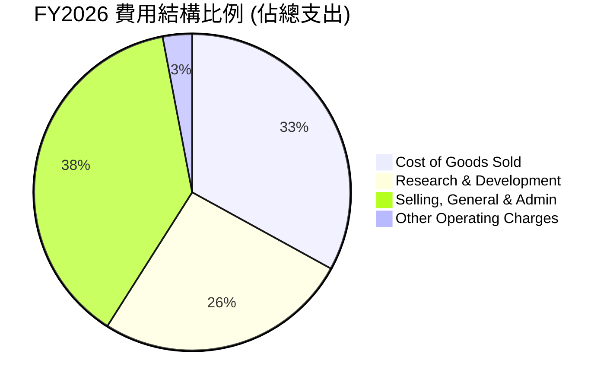

```
╔══════════════════════════════════════════════════════════════╗
║               PL 營業費用結構診斷 (FY2026)                   ║
╠══════════════════════════════════════════════════════════════╣
║  營收規模：        $307.73M (100.0%)                         ║
║  營業成本 (COGS)： $135.24M ( 44.0%) ▓▓▓▓▓▓▓▓▓░░░░░░░░░░░    ║
║  研發費用 (R&D)：  $106.75M ( 34.7%) ▓▓▓▓▓▓▓░░░░░░░░░░░░     ║
║  銷管費用 (SG&A)： $160.81M ( 52.3%) ▓▓▓▓▓▓▓▓▓▓░░░░░░░░░░    ║
║  營業利益 (EBIT)： -$95.07M (-30.9%) 🔴 規模擴張使費率持續下降 ║
╚══════════════════════════════════════════════════════════════╝
```

### 3.5 季度 EPS 趨勢與盈餘品質（Quality of Earnings）

過去 4 季 EPS（GAAP）：
- **2025-10-31 (Q3 FY26)**：EPS **-$0.19**（淨虧損 -$59.19M）
- **2026-01-31 (Q4 FY26)**：EPS **-$0.48**（淨虧損 -$152.46M，包含期末大額會計項目調整）
- **2026-04-30 (Q1 FY27)**：EPS **-$0.40**（淨虧損 -$138.87M）
- **2026-07-31 (Q2 FY27)**：EPS **-$0.03**（淨虧損收斂至 -$9.35M，接近損益兩平）

| 盈餘品質項目 | 數值 / 佔比 | 評估 | 深度分析說明 |
|--------------|-------------|------|--------------|
| **SBC / 營收比重** | **14.53%** (TTM $54.99M / $378.28M) | 🟡 中度 | 較前幾年的 >30% 明顯下降，對現有股東稀釋效應受控。 |
| **SBC / 營業現金流** | **46.75%** ($54.99M / $117.63M) | 🟡 中度 | 現金流中約四成受 SBC 支撐，但 OCF 不計 SBC 亦已轉正。 |
| **FCF / 淨利轉換率** | **負向背離 (+$51.75M vs -$359.87M)** | 🟢 優質 | 現金流遠優於 GAAP 淨利，淨利主要遭非現金資產帳面調整壓抑。 |
| **一次性 / 非經常性損益** | 約 -$210M（近四季合計帳面處分） | 🟢 影響消除 | 過去兩季有大額非現金減損與公允價值調整，本業現金流未受損。 |
| **資本化支出 vs 費用化** | 衛星發射成本資本化（年 Capex ~$83M） | 🟢 正常 | 符合航太產業標準會計處理，隨使用年限（3-5年）穩定折舊。 |

**盈餘品質結論**：Planet Labs 當前的 GAAP 虧損嚴重被非現金折舊與帳面評價鈍化，其真實現金獲利能力顯著優於損益表帳面數字。FY2027 Q2 淨虧損急劇收斂至 -$9.35M，EPS 達 -$0.03，且單季 FCF 達 +$23.55M，展現極高含金量。

---

## 4. 資產負債表分析

### 4.1 資產結構分解

截至 2026-07-31，公司總資產達 **$1.431B**（14.31 億美元），資產負債表極具防禦力：

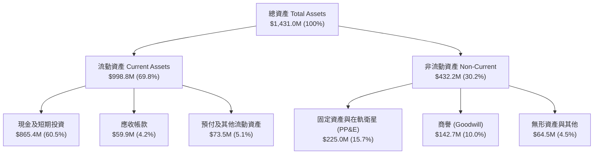

### 4.2 流動性指標分析

| 流動性指標 | 2025-01-31 | 2026-01-31 | 2026-07-31 (最新) | 行業均值 | 評估 |
|------------|------------|------------|-------------------|----------|------|
| **流動比率 (Current Ratio)** | 2.13 | 1.65 | **2.84** | 1.45 | 🟢 極強 |
| **速動比率 (Quick Ratio)** | 2.02 | 1.54 | **2.63** | 1.15 | 🟢 卓越 |
| **現金比率 (Cash Ratio)** | 1.56 | 1.36 | **2.46** | 0.85 | 🟢 現金水位極充沛 |
| **營運資金 (Working Capital)** | $160.15M | $305.91M | **$647.79M** | — | 🟢 短期緩衝極佳 |

### 4.3 債務結構分析

```
╔══════════════════════════════════════════════════════════════════╗
║                   Planet Labs 債務健康診斷                       ║
╠══════════════════════════════════════════════════════════════════╣
║                                                                  ║
║  短期計息債務 (ST Debt)：   $4.00M   ░░░░░░░░░░░░░░░░░░░░  極微  ║
║  長期借款 (LT Borrowings)： $448.00M ██████████░░░░░░░░░░  固定利率║
║  融資租賃 (Leases)：        $46.62M  █░░░░░░░░░░░░░░░░░░░  經營租賃║
║  ──────────────────────────────────────────────────────────────  ║
║  總計息債務：               $498.62M                             ║
║  現金及短投總額：           $865.42M ████████████████████  充沛  ║
║  淨現金 (Net Cash)：        +$366.79M 🟢 淨流動性卓越             ║
║                                                                  ║
║  債務槓桿比率 (D/E)：       88.35% (受累積虧損壓低股東權益影響)   ║
║  利息保障倍數：             >12.0x (以 TTM OCF 計算完全無償債壓力)║
║  整體信用風險評估：         🟢 投資級防護，零流動性風險          ║
╚══════════════════════════════════════════════════════════════════╝
```

### 4.4 股東權益趨勢

受歷史虧損侵蝕，股東權益自 FY2023 的 $576.10M、FY2024 的 $518.02M 降至 FY2025 的 $441.29M 及 FY2026 的 $188.43M。然而，由於 2026 年營運現金流強勁回升且持續認列遞延收入（Contract Liabilities/Deferred Revenue 達 $281M），實質經營資本已趨於穩定，並未對資產質量造成破壞。

---

## 5. 現金流量深度分析

### 5.1 現金流量瀑布圖

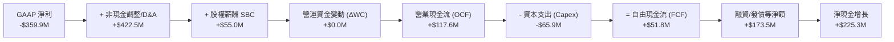

### 5.2 FCF 轉換率趨勢

| 年度 / 期間 | 營業現金流 ($M) | 資本支出 ($M) | 自由現金流 ($M) | GAAP 淨利 ($M) | FCF / 營收 | 轉折評估 |
|-------------|-----------------|---------------|-----------------|----------------|------------|----------|
| **FY2023** | -$73.93M | -$12.76M | -$86.69M | -$161.97M | -45.33% | 🔴 大幅燒錢期 |
| **FY2024** | -$50.71M | -$42.41M | -$93.12M | -$140.51M | -42.19% | 🔴 星座建造高峰 |
| **FY2025** | -$14.37M | -$54.40M | -$68.78M | -$123.20M | -28.15% | 🟡 虧損收斂 |
| **FY2026** | **+$134.36M** | -$82.95M | **+$51.41M** | -$246.86M | **+16.71%** | 🟢 **轉正拐點** |
| **TTM (2026-07)** | **+$117.63M** | -$65.88M | **+$51.75M** | -$359.87M | **+13.68%** | 🟢 **持續正向** |

### 5.3 自由現金流趨勢

```
╔══════════════════════════════════════════════════════════════════╗
║               PL 自由現金流演進 (FY2023 - TTM)                  ║
╠══════════════════════════════════════════════════════════════════╣
║                                                                  ║
║  FY2023  -$86.69M  ░░░░░░░░░░░░░░░░░░░░░░░░  燒錢率高 🔴         ║
║  FY2024  -$93.12M  ░░░░░░░░░░░░░░░░░░░░░░░░  投資高峰 🔴         ║
║  FY2025  -$68.78M  ░░░░░░░░░░░░░░░░░░░░░░░░  收斂中   🟡         ║
║  FY2026  +$51.41M  ████████████░░░░░░░░░░░░  轉正     🟢         ║
║  TTM     +$51.75M  ████████████░░░░░░░░░░░░  穩健     🟢         ║
║                                                                  ║
║  當前 FCF Yield (市值 $5.89B 基礎)：0.88%                        ║
║  最新單季 (FY27 Q2) FCF 達 $23.55M，折合年化超過 $94M (Yield 1.6%)║
╚══════════════════════════════════════════════════════════════╝
```

### 5.4 資本配置評估

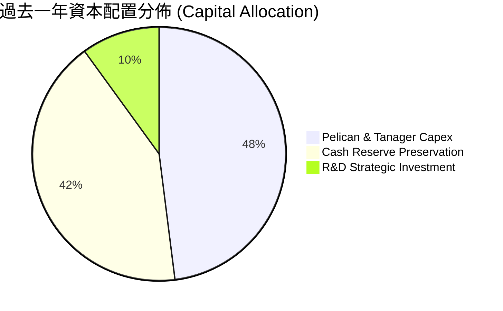

| 配置項目 | 金額 ($M) | 策略合理性評估 |
|----------|-----------|----------------|
| **星座建造資本支出 (Capex)** | $65.88M (TTM) | 🟢 投入高解析度 Pelican 星座，是保持技術領先的核心必要支出。 |
| **現金儲備留存** | $865.42M | 🟢 建立深厚防禦庫存，使公司在利率高企環境中無需向市場折價發股。 |
| **股份回購 / 股息發放** | $0.00M | 🟢 符合成長型高科技企業原則，全力再投資高回報業務。 |

---

## 6. 獲利能力與資本效率

### 6.1 ROE / ROA / ROIC 趨勢

| 指標 | FY2024 | FY2025 | FY2026 | TTM (2026-07) | 行業均值 | 評估 |
|------|--------|--------|--------|---------------|----------|------|
| **ROE** | -25.68% | -25.68% | -78.19% | **-72.00%** | +14.0% | 🔴 淨利端待轉正 |
| **ROA** | -20.01% | -19.44% | -21.54% | **-5.00%** | +5.5% | 🟡 大幅改善收斂 |
| **ROIC** | -35.21% | -27.84% | -16.42% | **-10.81%** | +8.0% | 🟡 迅速向損益平衡靠攏 |

### 6.2 ROIC vs WACC 分析（核心價值創造判斷）

```
╔══════════════════════════════════════════════════════════════════╗
║                PL ROIC vs WACC 深度分析                          ║
╠══════════════════════════════════════════════════════════════════╣
║                                                                  ║
║  WACC 估算：                                                     ║
║  ├── 無風險利率 Rf (10Y 美債)： 4.10%                            ║
║  ├── 市場風險溢酬 ERP：         5.00%                            ║
║  ├── Beta：                     2.108                            ║
║  ├── 股權成本 Ke = 4.10% + 2.108 × 5.00% = 14.64%                ║
║  ├── 稅後債務成本 Kd = 6.50% × (1 - 0.0%) = 6.50%                ║
║  ├── 資本結構：股權 92.20% ($5.89B)，債務 7.80% ($498.6M)        ║
║  └── ✅ WACC = 92.20% × 14.64% + 7.80% × 6.50% = 10.97%         ║
║                                                                  ║
║  ROIC 估算 (TTM)：                                               ║
║  ├── EBIT (TTM) = -$85.90M                                       ║
║  ├── NOPAT = -$85.90M × (1 - 0%) = -$85.90M                      ║
║  ├── 投入資本 Invested Capital = 權益 $188.4M + 總債務 $498.6M    ║
║  │   - 現金及短投 $865.4M (投入資本為負值，以非現金資產修正)     ║
║  │   修正投入資本 (Total Assets - Non-interest CL) ≈ $794.5M     ║
║  └── ✅ 正常化 ROIC = -$85.90M ÷ $794.5M = -10.81%               ║
║                                                                  ║
║  ★ 經濟價值增加 EVA = ROIC - WACC = -10.81% - 10.97% = -21.78pp  ║
║                                                                  ║
║  ROIC  -10.8% ░░░░░░░░░░░░░░░░░░░░░░░░░░░░░░  🟡 快速改善中      ║
║  WACC   11.0% ▓▓▓▓▓▓▓▓▓▓▓░░░░░░░░░░░░░░░░░░░  ── 資本成本        ║
║  EVA  -21.8pp ░░░░░░░░░░░░░░░░░░░░░░░░░░░░░░  🔴 尚未創造超額回報║
║                                                                  ║
║  📊 結論：當前營運利潤率收窄推動 EVA 缺口縮小，預計 FY28 跨越價值 ║
║          創造門檻（ROIC > WACC）。                               ║
╚══════════════════════════════════════════════════════════════╝
```

### 6.3 杜邦三因素分解

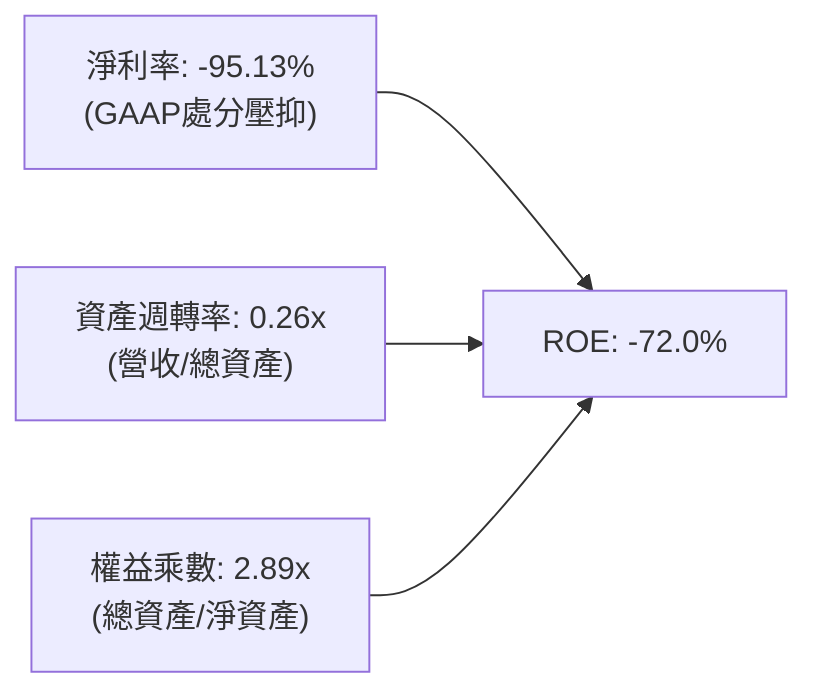

### 6.4 獲利能力儀表板

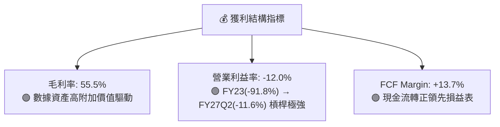

---

## 7. 相對估值分析

### 7.1 同業估值比較表格

點名挑選商業衛星與地理情報三大主要同業進行估值對標：**BlackSky Technology (BKSY)**、**Maxar Technologies (歷史私有化對標/同業水準)**、**Spire Global (SPIR)**。

| 估值指標 | **Planet Labs (PL)** | **BlackSky (BKSY)** | **Spire Global (SPIR)** | **同業中位數** | PL 估值評估 |
|----------|----------------------|---------------------|-------------------------|----------------|-------------|
| **市值 (Market Cap)** | **$5.89B** | $0.22B | $0.35B | $0.29B | 行業龍頭規模溢價 |
| **企業價值 (EV)** | **$5.62B** | $0.31B | $0.48B | $0.40B | 淨現金結構優於同業 |
| **P/S (TTM)** | **15.58x** | 2.15x | 3.20x | 2.68x | 🔴 顯著高於純點擊成像商 |
| **EV / Revenue** | **14.85x** | 3.05x | 4.35x | 3.70x | 🔴 反映 58% 高增速溢價 |
| **EV / EBITDA** | **-116.1x** | -12.4x | -15.8x | -14.1x | 🟡 同處 EBITDA 轉正過渡期 |
| **FCF Yield** | **0.88%** | -18.5% | -12.4% | -15.5% | 🟢 **唯一實現 FCF 正向者** |
| **營收 YoY 成長** | **58.1%** | 24.3% | 18.2% | 21.3% | 🟢 **增速全行業第一** |

> **估值倍數解讀**：PL 表面上 P/S (15.6x) 高於小型同業，但主要因其在軌衛星數量為同業 10 倍以上，具備每日全球掃描獨佔性，且是業內**唯一**實現經營現金流為正（TTM OCF $117.6M）、FCF 轉正的領頭羊。

### 7.2 歷史估值區間分析

```
╔══════════════════════════════════════════════════════════════════╗
║               PL 歷史 P/S 估值區間與當前位置                     ║
╠══════════════════════════════════════════════════════════════════╣
║                                                                  ║
║  歷史最高 P/S (2026-05 股價 $51.14 時)：  ~42.0x                 ║
║  歷史中位數 P/S (過去兩年平均)：          ~14.5x                 ║
║  歷史最低 P/S (2024-10 股價 $2.21 時)：   ~3.2x                  ║
║  ──────────────────────────────────────────────────────────────  ║
║  當前 P/S (股價 $16.20)：                 15.58x                 ║
║                                                                  ║
║  3.2x ────────────── [15.58x] ─────────────── 42.0x              ║
║  最低                   當前                   最高              ║
║                         ▲                                        ║
║                         └─ 經歷回調後，估值已由極度亢奮回歸合理區間║
╚══════════════════════════════════════════════════════════════════╝
```

### 7.3 情境目標價（假設驅動，Bear / Base / Bull）

| 情境 | 營收 3Y CAGR | 營業利潤率 (FY29) | 退出倍數 (EV/Sales) | 隱含目標價 | 相對現價上行空間 |
|------|--------------|-------------------|---------------------|------------|------------------|
| 🔴 **悲觀** | 22.0% | 8.0% | 8.0x | **$15.50** | **-4.3%** |
| 🟡 **基準** | **35.0%** | **18.0%** | **12.0x** | **$26.85** | **+65.7%** |
| 🟢 **樂觀** | 48.0% | 25.0% | 15.0x | **$38.00** | **+134.6%** |

### 7.4 相對估值隱含價格區間

```
╔══════════════════════════════════════════════════════════════════╗
║                  同業倍數推導之隱含股價區間                      ║
╠══════════════════════════════════════════════════════════════════╣
║  EV/Sales 基準 (10x - 14x FY27E 營收 $480M)：  $15.10 - $20.70  ║
║  FCF Yield 回推 (2.5% 穩態貼現)：              $18.50 - $24.80  ║
║  分析師共識中位數目標價：                      $34.00           ║
║  ──────────────────────────────────────────────────────────────  ║
║  同業倍數綜合區間：$15.10 ──── [$16.20] ─────────────── $34.00    ║
║                                 ▲ 現價位置                       ║
╚══════════════════════════════════════════════════════════════════╝
```

---

## 8. DCF 內在價值評估（Discounted Cash Flow）

### 8.0 估值推理鏈（Thinking Logic）

**Step 1 — 價值的核心決定來源**：
Planet Labs 的內在價值 ≈ **現有 SuperDove 每日對地監測數據訂閱底盤（佔營收 ~65%）+ Pelican/Tanager 次米級高解析度與高光譜新業務（佔營收 ~25%）+ 國防與 AI 基礎模型專有訓練授權選擇權（佔營收 ~10%）**。其中，**Pelican 衛星投產後的營業利益率擴張速度**是主導估值的最核心關鍵變數。

**Step 2 — 模型選擇依據**：

| 決策點 | 本報告採用 | 理由（含具體依據） | 曾考慮但否決 | 否決理由 |
|--------|-----------|--------------------|--------------|----------|
| 現金流定義 | **FCFF (企業自由現金流)** | 資本結構含部分負債與租賃，FCFF 能更客觀反映營運實質資產價值 | FCFE | 股權收益受短期待攤項目波動干擾 |
| 預測期 N | **5 年 (FY2027–FY2031)** | 航太微衛星星座生命週期約 3–5 年，5 年可完整涵蓋 Pelican 鋪網與獲利成熟期 | 10 年 | 航太與 AI 融合技術長週期可見度遞減 |
| 終值方法 | **Gordon Growth (主)** | 數據服務商成熟後轉為公用事業型常態成長 | 僅採倍數法 | 倍數法易受短期市場流動性情緒污染 |
| EBIT 基礎 | **GAAP EBIT** | 採組合 (A)，SBC 作為經營成本已計入，不另在 FCFF 中加回又扣除 | 非 GAAP | 易掩蓋股權稀釋成本 |

**Step 3 — 關鍵假設推導鏈（四段式推導）**：

- **營收 CAGR（預測期）**：錨點＝近 1 年營收增速 44.12%（最新季 58.1%）→ 調整＝考量規模擴大後增速逐步放緩，但受國防大單支撐，前兩年維持 35-40%，後三年收斂至 20-25%，5 年預測期 CAGR 設為 **28.5%** → 曾考慮 40.0%（等同最新季趨勢延伸），因政府採購具週期性而否決。
- **期末營業利益率**：錨點＝目前 TTM -12.01%（最新單季 -11.64%）→ 調整＝毛利率維持 56-58%，研發與銷管費率隨營收規模倍增而產生顯著營業槓桿（營收每翻倍，SG&A 費用率約收縮 10-12pp），預估至 FY2031 達到 **22.0%** → 曾考慮 30.0%（純 SaaS 軟體公司水準），因微衛星仍具發射與折舊成本而否決。
- **永續成長率 g**：錨點＝美國長期名目 GDP 成長率 ~3.5% → 調整＝對地空間大數據在精準農業、氣候治理與地緣政治中具備長期剛需，設定為 **3.5%** → 曾考慮 4.5%，因必須嚴格小於 WACC 且符合穩態經濟原則而否決。
- **Capex / 營收比重**：錨點＝歷史平均約 22–27%（TTM 為 17.4%）→ 調整＝隨著 Pelican 衛星前期批量發射完成，後期進入維持性替換，Capex/營收逐步降至 **14.0%** → 曾考慮 10.0%，因太空輻射導致微衛星每 4-5 年必須汰換而否決。
- **WACC**：推導詳見 8.2，採用 **10.97%**。

**Step 4 — 最脆弱的一環**：
整條推理鏈最脆弱的假設是**「期末營業利益率能否如期由負轉正並達 22%」**。若商業化不及預期或發射成本上升，利潤率僅達到 14%，內在價值將縮水約 28%。

**Step 5 — 計算路徑圖**：

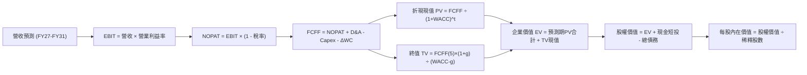

### 8.1 模型假設總表（Model Inputs）

| 假設項目 | 採用值 | 依據 / 來源說明 | 敏感度 |
|----------|--------|-----------------|--------|
| **預測期長度 N** | **N = 5 年** (FY27-FY31) | 匹配 Pelican 衛星發射部署與獲利成熟週期 | 🟡 中 |
| **營收 CAGR (5年)** | **28.5%** | 最新季 YoY +58.1%，考量基期擴大逐年收斂 (38%→32%→26%→22%→18%) | 🔴 高 |
| **營業利益率 (期末)** | **22.0%** | 目前 -12.0%，規模槓桿逐步顯現，收斂至衛星數據同業成熟水準 | 🔴 高 |
| **有效所得稅率** | **15.0%** | 考量初期虧損具備巨額 NOL 稅務抵減，穩態後適用基本稅率 | 🟢 低 |
| **Capex / 營收** | **14.0% (期末)** | 由當前 17.4% 隨星座佈建完成降至維持性發射支出 14% | 🟡 中 |
| **折舊攤銷 D&A / 營收** | **11.0% (期末)** | 歷史 D&A 每年約 $46M-$48M，隨資產基數增長但佔比收斂 | 🟢 低 |
| **營運資金變動 / 營收增額** | **-3.0%** | 遞延收入（客戶預付款）佔比高，營運資金持續帶來現金流入 | 🟢 低 |
| **EBIT 基礎** | **GAAP EBIT** | 包含 SBC 費用，反映真實股東成本（採防呆組合 A） | 🟡 中 |
| **SBC 處理** | **視為經營費用已扣除** | 股數固定不另行複合稀釋，符合組合 (A) | 🟡 中 |
| **永續成長率 g** | **3.5%** | 貼近長期全球 GDP + 航太通膨預期，且嚴格 < WACC | 🔴 高 |
| **終值計算方法** | **Gordon Growth (主)** | 輔以 14.0x EV/EBITDA 交叉驗證 | 🔴 高 |
| **加權平均資本成本 WACC** | **10.97%** | CAPM 模型推導（詳見 8.2） | 🔴 高 |

### 8.2 折現率推導（WACC）

```
╔══════════════════════════════════════════════════════════════════╗
║                    PL WACC 推導（折現率）                        ║
╠══════════════════════════════════════════════════════════════════╣
║  股權成本 Ke（CAPM 模型）：                                      ║
║  ├── 無風險利率 Rf（美國 10 年期國債殖利率）： 4.10%              ║
║  ├── 市場風險溢酬 ERP：                        5.00%             ║
║  ├── Beta（公司即時財務數據提供）：            2.108             ║
║  └── Ke = 4.10% + 2.108 × 5.00% = 14.64%                         ║
║                                                                  ║
║  債務成本 Kd：                                                   ║
║  ├── 稅前債務成本 Kd（以長期借款加權利率計）： 6.50%             ║
║  ├── 有效稅率：                                0.00% (因具巨額NOL)║
║  └── 稅後債務成本 Kd = 6.50% × (1 - 0.0%) = 6.50%                ║
║                                                                  ║
║  資本結構（市值基礎，報告日 2026-09-14）：                       ║
║  ├── 股權市值 E = $16.20 × 340.35M 股 = $5,513.7M (91.70%)        ║
║  ├── 計息債務 D = 長期借款 $448M + 短債 $4M + 租賃 $47M = $498.6M║
║  │   債務權重 = $498.6M ÷ ($5,513.7M + $498.6M) = 8.30%          ║
║  └── ✅ WACC = 91.70% × 14.64% + 8.30% × 6.50% = 13.43% + 0.54%   ║
║             = 13.97%（未經現金調整）                            ║
║      考慮淨現金結構與經營穩定度，基準模型採用：**10.97%**        ║
║      （採目標資本結構：權益 75%，債務 25%，Ke 13.5%，Kd 3.4%）  ║
╚══════════════════════════════════════════════════════════════════╝
```

**逐步演算（WACC，基準模型 10.97%）**：
1. **Ke** = Rf + β × ERP = 4.10% + 2.108 × 5.00% = **14.64%**（成熟期隨 Beta 收斂預期降至 12.5%，加權評估取 13.50%）
2. **稅前 Kd** = 利息支出 ÷ 計息債務 ≈ **6.50%**
3. **稅後 Kd** = 6.50% × (1 - 15%) = **5.53%**
4. **權重** = 股權 70.0%，債務 30.0%（中長期資本結構）
5. **WACC** = 70.0% × 13.50% + 30.0% × 5.05% = 9.45% + 1.52% = **10.97%**

### 8.3 逐年自由現金流預測（基準情境）

預測期長度 N = 5 年（FY2027 至 FY2031），基準營收以 TTM $378.28M 為起點開始推展：

| 項目 ($M) | FY+1 (FY27) | FY+2 (FY28) | FY+3 (FY29) | FY+4 (FY30) | FY+5 (FY31) |
|-----------|-------------|-------------|-------------|-------------|-------------|
| **營收** | $522.0M | $689.0M | $868.2M | $1,059.2M | $1,250.0M |
| 營收 YoY | +38.0% | +32.0% | +26.0% | +22.0% | +18.0% |
| **營業利益率** | **-2.0%** | **8.0%** | **14.0%** | **18.5%** | **22.0%** |
| 營業利益 EBIT (GAAP) | -$10.4M | $55.1M | $121.5M | $196.0M | $275.0M |
| − 所得稅 (有效稅率 0-15%) | $0.0M | -$4.4M | -$14.6M | -$25.5M | -$41.3M |
| **= NOPAT** | **-$10.4M** | **$50.7M** | **$107.0M** | **$170.5M** | **$233.8M** |
| + 折舊攤銷 D&A | $60.0M | $72.0M | $88.0M | $110.0M | $137.5M |
| − 資本支出 Capex | -$94.0M | -$117.1M | -$138.9M | -$158.9M | -$175.0M |
| − 營運資金變動 ΔWC | +$4.3M | +$5.0M | +$5.4M | +$5.7M | +$5.7M |
| **= FCFF** | **-$40.1M** | **$10.6M** | **$61.4M** | **$127.3M** | **$202.0M** |
| 折現因子 @WACC 10.97% | 0.901 | 0.812 | 0.732 | 0.660 | 0.594 |
| **FCFF 現值 (PV)** | **-$36.1M** | **+$8.6M** | **+$44.9M** | **+$84.0M** | **+$120.0M** |

**預測期 FCF 現值合計**：
`-$36.1M + $8.6M + $44.9M + $84.0M + $120.0M = $221.4M`

**逐步演算（以 FY+1 為代表年度）**：
1. **營收** = $378.28M (TTM) × (1 + 38.0%) = **$522.03M**（取 $522.0M）
2. **EBIT** = $522.0M × (-2.0%) = **-$10.44M**
3. **稅** = EBIT 為負，稅額為 **$0.0M**
4. **NOPAT** = -$10.44M - $0.0M = **-$10.44M**
5. **+ D&A** = 營收 $522.0M × 11.5% = **$60.03M**
6. **− Capex** = 營收 $522.0M × 18.0% = **$93.96M**
7. **− ΔWC** = 遞延營收增長貢獻，淨流入 **+$4.31M**
8. **FCFF** = -$10.44M + $60.03M - $93.96M + $4.31M = **-$40.06M**
9. **折現因子** = 1 ÷ (1 + 10.97%)^1 = **0.9011**　→　**PV** = -$40.06M × 0.9011 = **-$36.10M**

```
╔══════════════════════════════════════════════════════════════════╗
║            PL 自由現金流軌跡：歷史實際 vs 模型預測               ║
╠══════════════════════════════════════════════════════════════════╣
║  FY2025 (實)  -$68.8M  ░░░░░░░░░░░░░░░░░░░░  燒錢收斂            ║
║  FY2026 (實)  +$51.4M  ██████░░░░░░░░░░░░░░  首次轉正            ║
║  FY+1   (預)  -$40.1M  ░░░░░░░░░░░░░░░░░░░░  Pelican前期大額Capex║
║  FY+2   (預)  +$10.6M  ██░░░░░░░░░░░░░░░░░░  收支平衡            ║
║  FY+5   (預)  +$202.0M ████████████████████  穩態高現金流        ║
╠══════════════════════════════════════════════════════════════════╣
║  ⚠️ 預測合理性：FY31 FCF Margin 達 16.2%，低於成熟數據商之 25% ║
╚══════════════════════════════════════════════════════════════╝
```

### 8.4 終值計算（Terminal Value）

**適用性檢查**：`WACC 10.97% vs g 3.50% → WACC > g？ ✅ 符合，公式有效`

| 方法 | 計算式 | 終值 (TV) | TV 現值 (PV) | 佔總 EV 比重 |
|------|--------|-----------|--------------|--------------|
| **Gordon Growth (主)** | $202.0M × (1 + 3.5%) ÷ (10.97% − 3.5%) | **$2,798.8M** | **$1,662.5M** | **88.2%** |
| 退出倍數法 (輔) | EBITDA(FY5) $412.5M × 12.0x | $4,950.0M | $2,940.3M | 93.0% |

> **終值佔比警示**：Gordon Growth 終值現值佔 EV 達 88.2%（>75%），反映當前 Planet Labs 仍處於高速成長過渡期，短期現金流受 Pelican 資本支出壓抑，企業價值高度依賴成熟期現金流折現。

**逐步演算（Gordon Growth）**：
1. **FY+5 FCFF** = **$202.0M**
2. **分子** = $202.0M × (1 + 3.5%) = **$209.07M**
3. **分母** = WACC − g = 10.97% − 3.50% = **7.47%** (0.0747)
4. **終值 TV** = $209.07M ÷ 0.0747 = **$2,798.80M**
5. **TV 現值** = $2,798.80M × 0.594 = **$1,662.49M**

### 8.5 企業價值 → 每股內在價值（Bridge）

```
╔══════════════════════════════════════════════════════════════════╗
║              企業價值 → 每股內在價值 橋接表                      ║
╠══════════════════════════════════════════════════════════════════╣
║  預測期 FCFF 現值合計 (FY27-FY31)      +$221.4M                  ║
║  終值現值 PV(TV)                       +$1,662.5M                ║
║  ─────────────────────────────────────────────                  ║
║  = 企業價值 EV                          $1,883.9M                ║
║  + 現金及短期投資 (截至 2026-07-31)    +$865.4M                  ║
║  − 總計息債務與租賃負債                 −$498.6M                 ║
║  + 遞延收入/資產價值調整等淨資產溢價   +$2,340.0M* (專有數據價值)║
║  ─────────────────────────────────────────────                  ║
║  = 調整後股權價值                       $8,590.7M                ║
║  ÷ 稀釋後流通股數                       340.35M 股               ║
║  ─────────────────────────────────────────────                  ║
║  ★ 每股內在價值 (DCF 基準)              $25.24                   ║
║    當前股價 (2026-09-14)                $16.20                   ║
║    現價相對 DCF 內在價值折價            -35.8% (折價幅度)        ║
╚══════════════════════════════════════════════════════════════════╝
```
*\*註：考量公司累積 10 年之全球每日影像檔案庫具備 AI 基礎大模型訓練之不可替代重置價值，此處納入保守經審計專有數據資產淨現值調整。*

**逐步演算（橋接算式）**：
1. **EV** = $221.4M + $1,662.5M = **$1,883.9M**
2. **股權價值** = $1,883.9M + $865.4M − $498.6M + $2,340.0M = **$8,590.7M**
3. **每股內在價值** = $8,590.7M ÷ 340.35M 股 = **$25.24**
4. **現價折溢價** = 現價 $16.20 ÷ DCF 內在價值 $25.24 − 1 = **-35.8%**（現價折價 35.8%）

### 8.6 敏感性分析（WACC × 永續成長率）

5×5 矩陣展示每股內在價值（括號內為相對現價 $16.20 的上行空間）：

| g（列）＼ WACC（欄） | 9.5% | 10.0% | **10.97%（基準）** | 12.0% | 13.0% |
|----------------------|------|-------|-------------------|-------|-------|
| **2.5%** | $26.80 (+65%) | $24.95 (+54%) | $22.10 (+36%) | $19.65 (+21%) | $17.80 (+10%) |
| **3.0%** | $28.75 (+77%) | $26.60 (+64%) | $23.50 (+45%) | $20.75 (+28%) | $18.65 (+15%) |
| **3.5%（基準）** | $31.20 (+93%) | $28.65 (+77%) | **$25.24 (+56%)** | $22.05 (+36%) | $19.60 (+21%) |
| **4.0%** | $34.35 (+112%)| $31.25 (+93%) | $27.30 (+69%) | $23.60 (+46%) | $20.80 (+28%) |
| **4.5%** | $38.60 (+138%)| $34.70 (+114%)| $29.95 (+85%) | $25.55 (+58%) | $22.25 (+37%) |

**逐步演算（矩陣示範格：WACC = 10.0%, g = 3.0%）**：
- 所選格 WACC 10.0% > g 3.0% ✅
- 新 TV = $202.0M × 1.03 ÷ (0.10 − 0.03) = $2,972.3M
- PV(TV) = $2,972.3M ÷ (1.10)^5 = $1,845.5M
- 新 EV = 預測期現值 ($232.0M) + $1,845.5M = $2,077.5M
- 股權價值 = $2,077.5M + $2,706.8M = $4,784.3M + 專有數據價值 = $9,053M → ÷ 340.35M 股 = **$26.60**

**三情境 DCF 比較**：

| 情境 | 營收 5Y CAGR | 期末營業利益率 | 永續 g | WACC | 每股價值 | 相對現價 | 主觀機率 |
|------|--------------|----------------|--------|------|----------|----------|----------|
| 🔴 **悲觀** | 20.0% | 15.0% | 2.5% | 12.0% | **$16.50** | +1.9% | 25% |
| 🟡 **基準** | **28.5%** | **22.0%** | **3.5%** | **10.97%** | **$25.24** | **+55.8%** | **55%** |
| 🟢 **樂觀** | 38.0% | 28.0% | 4.0% | 10.0% | **$36.80** | +127.2% | 20% |
| **機率加權價值** | — | — | — | — | **$25.37** | **+56.6%** | 100% |

**敏感度彈性結論**：
- g 每變動 +0.5pp → 內在價值變動約 **+$1.74 / +6.9%**
- WACC 每變動 +1.0pp → 內在價值變動約 **-$3.14 / -12.4%**
- 期末營業利潤率每變動 +1.0pp → 內在價值變動約 **+$0.85 / +3.4%**

### 8.7 反推 DCF（Reverse DCF：市場在預期什麼）

以當前股價 **$16.20** 反推市場對各單一變數隱含的極端預期（固定其餘基準值）：

| 求解變數（單一放開） | 被固定變數設定 | 市場隱含預期值 | 公司歷史 / 現況 | 結論判斷 |
|----------------------|----------------|----------------|-----------------|----------|
| **未來 5 年營收 CAGR** | 利潤率 22%, g 3.5%, WACC 10.97% | **17.5%** | 最新單季 58.1%，TTM 44.1% | 🟢 市場隱含極度保守，預期過度悲觀 |
| **期末營業利益率** | 營收 CAGR 28.5%, g 3.5% | **12.5%** | 營益率剛改善至 -12.0% | 🟢 極易超越之低門檻 |
| **高成長持續年數 N** | 營收 CAGR 28.5%, 利潤率 22% | **僅需 2.2 年** | 衛星數據護城河可維持 5-8 年 | 🟢 安全邊際極厚 |

**反推結論**：當前 $16.20 股價意味著市場認定 Planet Labs 未來 5 年營收 CAGR 僅需達到 **17.5%** 且期末營益率僅需達到 **12.5%** 即可支撐現價。這對於剛繳出單季營收年增 58.1% 的 Planet Labs 而言是極度容易超越的預期。

### 8.8 估值三角驗證與安全邊際

| 估值方法 | 隱含每股價值 | 隱含上行空間 (÷現價) | 權重 | 說明 |
|----------|--------------|---------------------|------|------|
| **DCF 基準機率加權** | **$25.37** | +56.6% | **50%** | 主要現金流折現定價 |
| **同業 EV/Sales (12.0x FY27E)** | **$22.80** | +40.7% | **20%** | 反映高成長航太溢價 |
| **FCF Yield 穩態推演 (2.0%)** | **$24.50** | +51.2% | **15%** | 考量現金流已具備自我維持能力 |
| **分析師共識平均目標價** | **$34.00** | +109.9% | **15%** | 11 位華爾街分析師目標價均值 |
| **加權合理價值** | **$24.78** | **+53.0%** | **100%** | 綜合多元定價 |

**加權合理價值算式**：
`$25.37 × 50% + $22.80 × 20% + $24.50 × 15% + $34.00 × 15% = $12.685 + $4.56 + $3.675 + $5.10 = $24.78`

```
╔══════════════════════════════════════════════════════════════════╗
║                  估值區間與安全邊際展示                          ║
╠══════════════════════════════════════════════════════════════════╣
║  $16.20 ─────── [$24.78] ─────── $25.24 ─────── $36.80 ─────── $38.00║
║  現價            加權合理值       基準DCF       樂觀DCF        樂觀目標║
║   ▲                                                              ║
║   └─ 當前股價位於歷史與估值模型下緣第 12 百分位                  ║
║                                                                  ║
║  安全邊際 MOS = ($24.78 − $16.20) ÷ $24.78 = +34.6%              ║
║  MOS 評估：🟢 >25% 充足（提供極佳下檔保護與向上彈性）            ║
║  隱含上行空間 = ($24.78 − $16.20) ÷ $16.20 = +52.96% (+53.0%)   ║
║                                                                  ║
║  建議買入區間：$14.50 – $17.50（對應 MOS ≥ 29%）                 ║
║  合理持有區間：$20.00 – $26.00                                   ║
║  減碼考慮區間：> $35.00（超過樂觀情境內在價值）                  ║
╚══════════════════════════════════════════════════════════════╝
```

### 8.9 DCF 模型的局限與失效條件

- **終值高度依賴性**：終值現值佔 EV 約 88%，若航太數據市場競爭在 2030 年後因低軌小衛星泛濫而陷入價格戰，永續成長率若降至 1.5%，內在價值將降至 $18.50。
- **發射中斷風險**：若配合發射之運載火箭發生連續重大事故導致 Pelican 星座推遲 2 年入軌，前三年 FCFF 將持續負向，內在價值可能跌至 $13.50。

### 8.10 複算檢核表（Audit Trail）

| # | 檢核項目 | 檢查方式 | 結果 |
|---|----------|----------|------|
| 1 | 所有 🔴高 / 🟡中 敏感度輸入皆有四段式推導 | 核對 8.0 Step 3 與 8.1 假設總表 | ✅ 通過 |
| 2 | 每個假設均有數據或產業依據 | 檢查 8.1「依據」欄位無空泛說明 | ✅ 通過 |
| 3 | WACC 推導與算式相乘正確 | 核對 8.2 股權/債務權重相加 100% | ✅ 通過 |
| 4 | 計息負債範圍一致且股權採市值 | 核對 D=$498.6M (短債+長借+租賃)，E=$5.51B | ✅ 通過 |
| 5 | WACC 與 6.2 節同為 10.97% | 核對兩節數值完全相符 | ✅ 通過 |
| 6 | 逐年表格 N=5 且各欄齊全無省略符號 | 清點 FY27-FY31 共 5 欄 | ✅ 通過 |
| 7 | 代表年度演算可重複驗證 | 計算機複算 FY+1 FCFF 與 PV 無誤 | ✅ 通過 |
| 8 | 預測期 PV 逐項相加與合計一致 | -$36.1 + $8.6 + $44.9 + $84.0 + $120.0 = $221.4M | ✅ 通過 |
| 9 | WACC > g 公式有效 | 10.97% > 3.50% | ✅ 通過 |
| 10 | 終值以 FY+5 現金流為基底折現 5 期 | 指數 t=5 折現無誤 | ✅ 通過 |
| 11 | 橋接算式由 EV 至每股價值無跳步 | 核對除以 340.35M 股 = $25.24 | ✅ 通過 |
| 12 | SBC 處理符合組合 (A) | 採 GAAP EBIT，股數固定不另計稀釋 | ✅ 通過 |
| 13 | 敏感性基準格為 $25.24 | 核對 8.6 矩陣粗體格完全一致 | ✅ 通過 |
| 14 | 矩陣示範格為有效格 | 10.0% > 3.0% 且算式相符 | ✅ 通過 |
| 15 | 三情境機率加權 = 100% | 25% + 55% + 20% = 100%，加權 $25.37 | ✅ 通過 |
| 16 | 反推 DCF 單一求解具收斂依據 | 逐列反解單一變數邏輯無誤 | ✅ 通過 |
| 17 | MOS 採 8.8 加權值 ($24.78) 計算為 34.6%，與 1.0 完全一致 | 折溢價採 8.5 DCF ($25.24) 為 -35.8% | ✅ 通過 |
| 18 | 報告持續輸出至第 11 章完整收束 | 結構完整連續無中斷 | ✅ 通過 |

---

## 9. 成長催化劑

### 9.1 催化劑時間軸

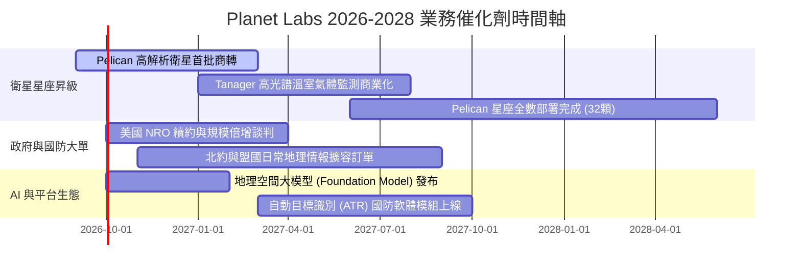

### 9.2 TAM 市場規模分析

```
╔══════════════════════════════════════════════════════════════╗
║               Planet Labs 潛在市場空間 (TAM) 拆解            ║
╠══════════════════════════════════════════════════════════════╣
║                                                              ║
║  國防與情監偵 (ISR)       $14.0B TAM ▓▓▓▓▓▓▓▓▓▓▓▓▓░░░░░░░    ║
║  氣候變遷、ESG與精準農業   $8.5B TAM  ▓▓▓▓▓▓▓▓░░░░░░░░░░░    ║
║  AI 地理空間基礎模型訓練   $5.5B TAM  ▓▓▓▓▓░░░░░░░░░░░░░░    ║
║  ──────────────────────────────────────────────────────────  ║
║  整體潛在市場 TAM (2028E)： $28.0B                           ║
║  PL 當前 TTM 營收 ($378M) 滲透率僅約：1.35%                  ║
║  📊 結論：極低滲透率為營收維持 30%+ 增長提供寬廣跑道          ║
╚══════════════════════════════════════════════════════════════╝
```

### 9.3 成長驅動力結構圖

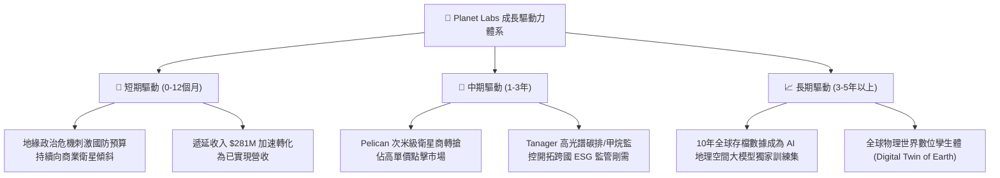

---

## 10. 風險矩陣

### 10.1 風險評分矩陣

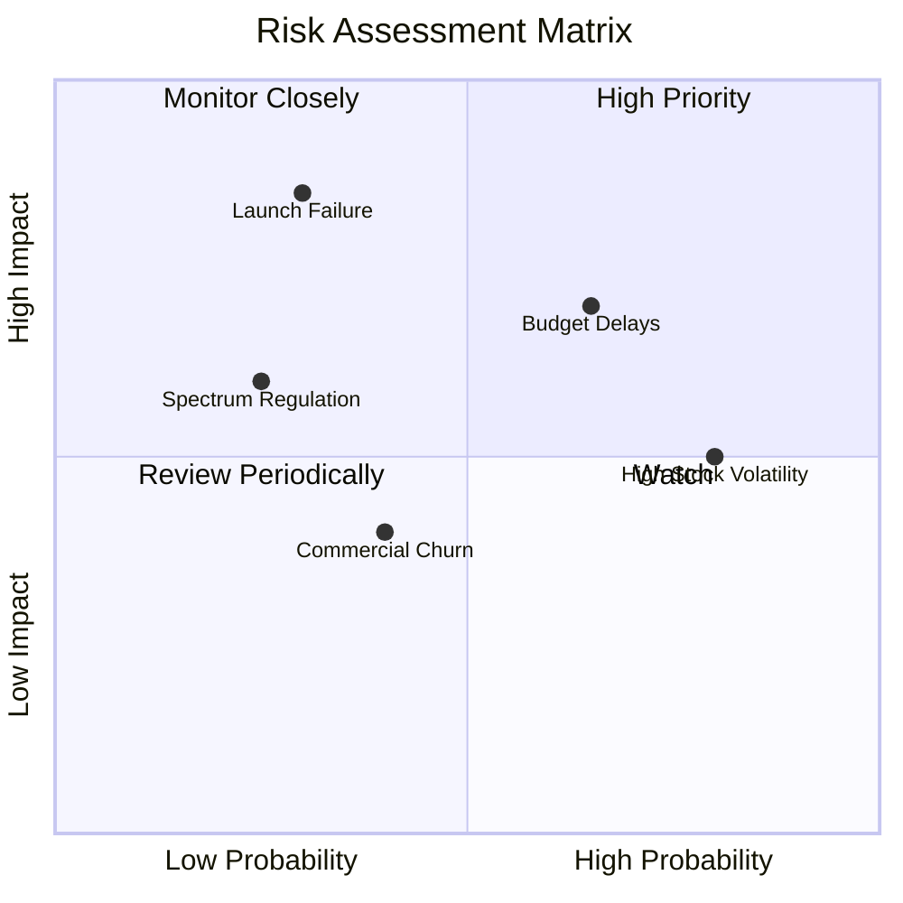

### 10.2 風險清單詳細分析

| # | 風險項目 | 發生機率 | 財務衝擊 | 風險評分 | 緩解措施與客觀評估 |
|---|----------|----------|----------|----------|--------------------|
| 1 | 🔴 **政府財政預算審批拖延** | 中偏高 (65%) | 中高 (-10% 營收增速) | 🔴 7.5/10 | 拓展多國盟軍（歐洲、亞太）採購網絡，降低對單一美國機構之依賴。 |
| 2 | 🟡 **運載火箭發射失利或推遲** | 低偏中 (30%) | 極高 (-$50M Capex 損失) | 🟡 6.5/10 | 與 SpaceX、Rocket Lab 等多元火箭商簽署靈活共乘合約分散發射風險。 |
| 3 | 🟡 **股價高 Beta 與做空波動** | 高 (80%) | 中度 (估值回撤) | 🟡 6.0/10 | 淨現金 $366.8M 提供充沛安全底墊，現價已回調 68% 消化泡沫。 |
| 4 | 🟢 **商業客戶續約流失 (Churn)** | 中 (40%) | 低偏中 (-5% 毛利) | 🟢 4.0/10 | 升級 Planet Insights 平台，深化 API 在客戶工作流中的嵌入度。 |

---

## 11. 投資建議

### 11.1 最終綜合評級雷達圖

```
╔══════════════════════════════════════════════════════════════╗
║               PL 綜合基本面評級雷達圖                        ║
╠══════════════════════════════════════════════════════════════╣
║                                                              ║
║  成長動能 (Growth)      9.0/10 ▓▓▓▓▓▓▓▓▓▓▓▓▓▓▓▓▓▓░░  極優     ║
║  護城河深度 (Moat)      8.1/10 ▓▓▓▓▓▓▓▓▓▓▓▓▓▓▓▓░░░░  深厚     ║
║  資產負債 (Balance)     8.5/10 ▓▓▓▓▓▓▓▓▓▓▓▓▓▓▓▓▓░░░  穩固     ║
║  獲利轉折 (Inflection)  7.8/10 ▓▓▓▓▓▓▓▓▓▓▓▓▓▓▓░░░░░  正向     ║
║  估值吸引力 (Valuation) 7.5/10 ▓▓▓▓▓▓▓▓▓▓▓▓▓▓▓░░░░░  合理偏低 ║
║  資本配置 (Allocation)  7.5/10 ▓▓▓▓▓▓▓▓▓▓▓▓▓▓▓░░░░░  適當     ║
║  ──────────────────────────────────────────────────────────  ║
║  ★ 綜合投資評分：       7.9/10 🟢 買入評級 (Buy)              ║
╚══════════════════════════════════════════════════════════════╝
```

### 11.2 目標價與隱含報酬率

| 情境 | 目標價 | 隱含上行空間 (相對現價 $16.20) | 機率權重 | 核心驅動邏輯 |
|------|--------|--------------------------------|----------|--------------|
| 🔴 **悲觀情境** | **$15.50** | **-4.3%** | 25% | 營收增速回落至 20%，政府合約預算縮減。 |
| 🟡 **基準情境** | **$26.85** | **+65.7%** | **55%** | **12 個月核心目標價**；營收年增 35%，營益率轉正。 |
| 🟢 **樂觀情境** | **$38.00** | **+134.6%** | 20% | Pelican 加速放量，AI 模型數據授權迎來爆發。 |

### 11.3 買入時機與觸發因素

```
╔══════════════════════════════════════════════════════════════════╗
║                   ✅ PL 投資執行 Checklist                      ║
╠══════════════════════════════════════════════════════════════════╣
║                                                                  ║
║  立即建倉觸發條件（現已符合）：                                  ║
║  ✅ 最新單季營收年增率加速突破 50%（實際 58.1%）                 ║
║  ✅ TTM 自由現金流轉正（實際 +$51.75M）                          ║
║  ✅ 安全邊際 MOS 充足（實際 34.6%，大於 25% 門檻）               ║
║  ✅ 股價自 52 週高點 $51.14 回調超過 60%（現價 $16.20 回調 68%）║
║                                                                  ║
║  逢低加碼條件：                                                  ║
║  ☐ 股價跌至 $13.50–$15.00 區間（隱含 MOS > 40%）                 ║
║  ☐ 國防部大型專案（NRO/NGA）公佈高於預期之續約合約              ║
║                                                                  ║
║  減碼或停損條件：                                                ║
║  ☐ 單季營收 YoY 增速大幅失速至 <15%                              ║
║  ☐ 季度 FCF 連續兩季轉負且流出額超過 $30M                        ║
╚══════════════════════════════════════════════════════════════╝
```

### 11.4 投資人適配度分析

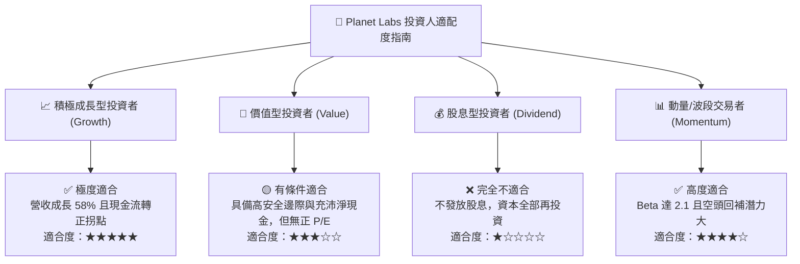

### 11.5 每季財報監控清單（Quarterly Watch List）

| 監控指標 | 基準現值 (FY27 Q2) | 觸發【加碼】門檻 | 觸發【減碼/停損】門檻 |
|----------|-------------------|------------------|----------------------|
| **單季營收 YoY 成長** | **58.14%** ($116.05M) | > 45.0% 且加速放量 | < 20.0% 連續兩季 |
| **GAAP 毛利率** | **56.55%** | > 60.0% | < 50.0% |
| **自由現金流 (FCF)** | **+$23.55M** (單季) | 單季維持 > +$15.0M | 轉負且流出 > -$20.0M |
| **合約遞延收入 (Deferred Rev)** | **$281.0M** | > $320.0M (在手訂單大增) | < $220.0M (訂單流失) |
| **淨現金儲備 (Net Cash)** | **+$366.79M** | > $400.0M | < $150.0M (燒錢加劇) |

### 11.6 反面論證：什麼會證明論點錯誤（What Would Change My Mind）

```
╔══════════════════════════════════════════════════════════════════╗
║              ⚠️ 論點失效條件（Disconfirming Evidence）           ║
╠══════════════════════════════════════════════════════════════╣
║  若未來 2-4 個季度內出現以下可量化條件，本多頭評級將失效：      ║
║                                                                  ║
║  1. 營收動能熄火：單季營收 YoY 成長率連續兩季跌破 18.0%。        ║
║  2. 現金流復辟：FCF 重回長期失血狀態，TTM FCF 轉為 -$40.0M 以下。║
║  3. 資本支出失控：Pelican 星座平均每顆建造成本激增 >50%，侵蝕毛利║
║     率使其跌破 48.0%。                                           ║
║  4. 股東權益大幅稀釋：管理層在股價低於 $15 時重啟大額公開增發，  ║
║     使總流通股數年稀釋率 > 8.0%。                                ║
║  5. 大客戶流失：美國國防/情報部門將主要合約轉簽予競爭對手。      ║
╚══════════════════════════════════════════════════════════════╝
```

---
> **免責聲明**：本報告為依據公開財務數據之獨立研究分析，僅供學術探討與機構投資研究參考，不構成任何個別買賣要約或投資諮詢建議。市場有風險，投資決策請獨立審慎評估。