# PL 基本面深度分析報告
> **報告日期**：2026-10-02 ｜ **語言**：繁體中文 ｜ **數據來源**：Yahoo Finance, Finviz, StockAnalysis, Roic.ai ｜ **分析師**：CFA 級機構研究

---

## 目錄

| # | 章節 | 核心結論 |
|---|------|----------|
| 1 | 執行摘要 | 評級「買入」，加權合理價值 $23.46，安全邊際 MOS 25.4% |
| 2 | 公司概覽與商業模式 | 每日全球掃描獨佔護城河，高達 55.5% 毛利之高頻地理空間數據龍頭 |
| 3 | 損益表深度分析 | TTM 營收 $378.28M（YoY +44.1%），營業虧損大幅收斂，營業槓桿顯現 |
| 4 | 資產負債表分析 | 淨現金 $366.79M，流動比率 2.84x，財務結構穩健具高防禦力 |
| 5 | 現金流量深度分析 | FY2026 自由現金流轉正達 $51.41M，TTM FCF 達 $51.75M，迎來經營轉折 |
| 6 | 獲利能力與資本效率 | 投入資本 ROIC 為 -8.7%，目前低於 WACC 11.4%，價值轉正拐點將臨 |
| 7 | 相對估值分析 | EV/Sales 14.56x 高於傳統航太，但顯著低於新興國防 AI 純軟體同業 |
| 8 | DCF 內在價值評估 | 基準 DCF 每股 $22.68（現價折價 22.8%）；三角加權合理價值 $23.46 |
| 9 | 成長催化劑 | Pelican 高解析與 Tanager 高光譜衛星入軌，國防情報與政府訂單放量 |
| 10 | 風險矩陣 | 衛星發射延遲、政府預算審查週期拉長及高估值波動為主要風險 |
| 11 | 投資建議 | 建議買入區間 $15.50 - $17.50，基準 12M 目標價 $23.50（上行 +34.3%） |

---

## 1. 執行摘要

Planet Labs PBC（NYSE: PL）目前處於由高資本密集的「星座佈建期」跨入「數據貨幣化獲利期」的關鍵轉折點。公司 TTM 營收達 $378.28M，最新季度（FY27 Q2）營收年增率加速至 58.14%，毛利率攀升至 56.55%。更關鍵的是，營運現金流（TTM $117.63M）與自由現金流（TTM $51.75M，FY2026 達 $51.41M）已全面轉正，打破了新興太空科技股長期燒錢的刻板印象。考量資產負債表擁有高達 $865.42M 現金及短期投資、淨現金 $366.79M，且當前股價 $17.50 隱含 DCF 基準內在價值 $22.68 折價 22.8%、相對三角加權合理價值 $23.46 具備 25.4% 之充足安全邊際（MOS），給予「🟢 買入」評級。

### 1.0 一頁式投資儀表板（Portfolio Manager 30 秒速讀）

| 項目 | 內容 |
|------|------|
| **投資論點（3 句）** | ① 全球唯一具備「每日覆蓋地球陸地一次」的 SuperDove 星座數據庫，毛利率達 55.5% 且數據具極高沉沒壁壘。<br/>② FY2026 全年 FCF 正式由負轉正至 $51.41M（前一年同期為 -$68.78M），營運槓桿拐點確立。<br/>③ 淨現金部位達 $366.79M（佔市值 5.8%），為新一代 Pelican 與 Tanager 衛星部署提供充裕非稀釋性護城河。 |
| **護城河評分** | 8.2 / 10（數據專利性與每日全覆蓋監測網絡） |
| **管理層/資本配置評分** | 7.5 / 10（Capex 控管見效，轉向 DaaS 訂閱模式） |
| **財務健康** | 🟢 強健（淨現金 $366.79M，流動比率 2.84x，無迫切流動性風險） |
| **ROIC vs WACC** | -8.7% vs 11.4%（目前處於資本擴張末期，暫時摧毀價值，預計 2 年內 EVA 轉正） |
| **FCF 趨勢** | 拐點向上；TTM FCF $51.75M，FCF Yield 為 0.81% |
| **估值** | Forward P/E -14000x（損益即將損益兩平）｜ EV/Sales 14.56x ｜ EV/EBITDA -113.75x |
| **DCF 內在價值（基準）** | $22.68 ｜ 現價折溢價 -22.8%（現價相對基準折價 22.8%） |
| **安全邊際（MOS）** | **+25.4%** ＝ ($23.46 − $17.50) ÷ $23.46（基準來自 8.8 加權合理價值）｜ 🟢 >25% 充足 |
| **預期報酬（基準情境 12M）** | **+34.3%**（目標價 $23.50 相對現價上行空間） |
| **關鍵風險（前二）** | ① 政府與情報部門合約採購延宕；② 發射載具時程延宕導致 Pelican 衛星覆蓋率不及預期 |
| **評級 + 信心度** | 🟢 **買入** ｜ 信心度：**中高** |

### 1.1 核心評分儀表板

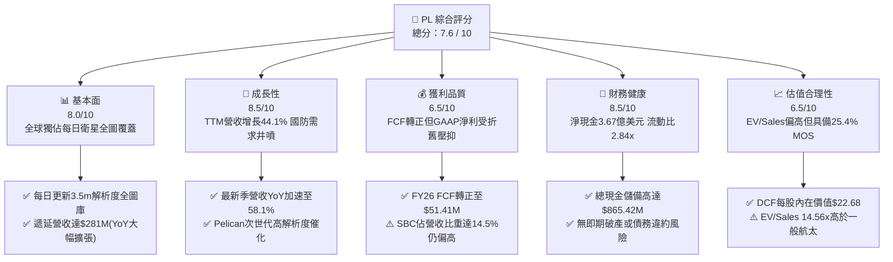

### 1.2 評分進度條視覺化

```
╔══════════════════════════════════════════════════════════════╗
║                PL 多維度評分儀表板 (1-10分)                  ║
╠══════════════════════════════════════════════════════════════╣
║ 基本面強度  8.0 ▓▓▓▓▓▓▓▓▓▓▓▓▓▓▓▓░░░░  ★★★★☆           ║
║ 成長動能    8.5 ▓▓▓▓▓▓▓▓▓▓▓▓▓▓▓▓▓░░░  ★★★★☆           ║
║ 獲利品質    6.5 ▓▓▓▓▓▓▓▓▓▓▓▓▓░░░░░░░  ★★★☆☆           ║
║ 財務健康    8.5 ▓▓▓▓▓▓▓▓▓▓▓▓▓▓▓▓▓░░░  ★★★★☆           ║
║ 估值合理性  6.5 ▓▓▓▓▓▓▓▓▓▓▓▓▓░░░░░░░  ★★★☆☆           ║
║ 護城河深度  8.2 ▓▓▓▓▓▓▓▓▓▓▓▓▓▓▓▓░░░░  ★★★★☆           ║
║ 管理層執行  7.5 ▓▓▓▓▓▓▓▓▓▓▓▓▓▓▓░░░░░  ★★★★☆           ║
║ 技術創新力  8.8 ▓▓▓▓▓▓▓▓▓▓▓▓▓▓▓▓▓▓░░  ★★★★☆           ║
╠══════════════════════════════════════════════════════════════╣
║ 綜合總分    7.6 ▓▓▓▓▓▓▓▓▓▓▓▓▓▓▓░░░░░  🏆 成長拐點確立       ║
╚══════════════════════════════════════════════════════════════╝
```

### 1.3 五大投資論點 + 三大核心風險

| 類型 | 項目 | 具體依據 | 信心度 |
|------|------|----------|--------|
| 🟢 **投資論點①** | **營收增長拐點加速** | FY27 Q2 單季營收達 $116.05M（YoY +58.14%），遠高於 FY25 的 10.72% 低谷，動能顯著復甦。 | 🟢 極高 |
| 🟢 **投資論點②** | **自由現金流實質轉正** | FY2026 全年 FCF 達 $51.41M（前一年同期為 -$68.78M），TTM FCF 達 $51.75M，自我造血能力成型。 | 🟢 高 |
| 🟢 **投資論點③** | **數據即服務（DaaS）高毛利** | TTM 毛利率達 55.5%，最新季度提升至 56.55%，軟體化交付使毛利隨規模擴張持續走高。 | 🟢 極高 |
| 🟢 **投資論點④** | **遞延營收高速堆疊** | 截至 2026 年 7 月遞延營收達 $281M，年增長超過 27%，提供極高的未來業績鎖定度與可見度。 | 🟢 高 |
| 🟢 **投資論點⑤** | **淨現金結構抵禦升息** | 總現金及短投達 $865.42M，淨現金 $366.79M，利息收入增加且無迫切融資股權稀釋壓力。 | 🟢 極高 |
| 🟡 **風險①** | **發射排程與在軌折舊風險** | 衛星生命週期約 3-5 年，若 Pelican 發射推遲或早期失效，將衝擊次世代數據商業化速度。 | 🟡 中度 |
| 🔴 **風險②** | **SBC 股權稀釋過度** | FY2026 SBC 費用達 $54.99M，佔 TTM 營收約 14.5%，稀釋現有股東權益並壓抑 GAAP EPS 轉正。 | 🔴 高衝擊 |
| 🟡 **風險③** | **政府防務支出波動** | 國防與情報單位為大客戶，地緣政治降溫或政府採購預算凍結將對營收增速造成下修風險。 | 🟡 中度 |

### 1.4 快速統計卡片

| 指標 | 公司實際值 | 航太與國防行業均值 | S&P 500 均值 | 狀態 |
|------|-------------|-------------------|--------------|------|
| 收入 YoY 成長 | **58.1%**（最新季） / **44.1%**（TTM） | ~8.5% | ~5.2% | 🟢 卓越領先 |
| 毛利率 | **55.5%** | ~24.0% | ~42.0% | 🟢 軟體級優勢 |
| 營業利益率 | **-12.0%**（TTM，大幅收斂） | ~11.5% | ~12.8% | 🟡 仍虧損但改善中 |
| 淨利率 | **-95.1%**（TTM，含非現折舊與公允重估） | ~7.2% | ~11.0% | 🔴 處於損益修復期 |
| ROE | **-72.0%** | ~14.0% | ~18.5% | 🔴 資本結構重塑中 |
| EV / Revenue | **14.56x** | ~2.1x | ~2.9x | 🟡 成長溢價顯著 |
| 流動比率 | **2.84x** | ~1.35x | ~1.20x | 🟢 資金池極端充裕 |

### 1.5 投資結論

```
╔══════════════════════════════════════════════════════════════════╗
║                    📊 投資結論摘要                               ║
╠══════════════════════════════════════════════════════════════════╣
║  評級：🟢 買入（Buy）                                           ║
║  當前股價：$17.50（2026-10-02 收盤價）                           ║
║  DCF 內在價值（基準）：$22.68（現價折溢價 -22.8%）              ║
║  安全邊際 MOS：+25.4%（＝($23.46 − $17.50) ÷ $23.46）           ║
║  目標價區間：                                                    ║
║    🔴 悲觀情境：$13.20（-24.6%）                                 ║
║    🟡 基準情境：$23.50（+34.3%）  ← 12個月主要目標               ║
║    🟢 樂觀情境：$35.80（+104.6%）                                ║
║  投資評分：7.6 / 10                                              ║
║  適合投資人：積極成長型投資者、航太科技主題基金、長線價值重估策略║
╚══════════════════════════════════════════════════════════════════╝
```

---

## 2. 公司概覽與商業模式

Planet Labs PBC（NYSE: PL）成立於 2010 年，由前 NASA 科學家創立，總部位於美國加州舊金山。公司透過設計、製造並營運全球規模最大的低軌地球觀測（EO）微型衛星星座（SuperDove），實現「每日掃描全球陸地一次」的空前創舉，分辨率達 3.5 公尺；同時正積極佈建具備亞米級（0.3-0.5 公尺）解析度之次世代 Pelican 星座及捕捉溫室氣體的 Tanager 高光譜衛星。

### 2.1 業務結構與收入來源

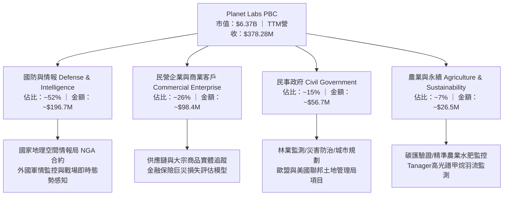

### 2.2 市場份額

在商業低軌地球觀測（EO）及高頻中解析度遙測數據領域，Planet Labs 憑藉每日全覆蓋能力佔據絕對壟斷地位；在高解析度任務型拍攝市場，則與 Maxar、BlackSky 相互競爭。

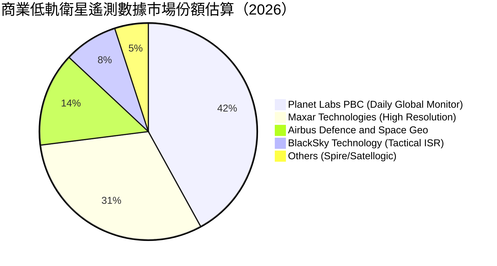

### 2.3 競爭護城河分析

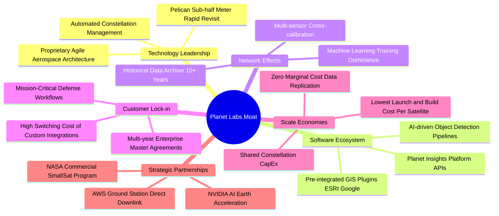

### 2.4 護城河強度評分

```
╔══════════════════════════════════════════════════════════════╗
║                   PL 護城河強度評分                          ║
╠══════════════════════════════════════════════════════════════╣
║ 歷史數據專有性  9.5/10  ▓▓▓▓▓▓▓▓▓▓▓▓▓▓▓▓▓▓▓░  🏆 無法複製的時序檔案 ║
║ 每日全覆蓋網絡  9.0/10  ▓▓▓▓▓▓▓▓▓▓▓▓▓▓▓▓▓▓░░  🟢 全球唯一在軌網絡   ║
║ 軟體平台黏著度  8.0/10  ▓▓▓▓▓▓▓▓▓▓▓▓▓▓▓▓░░░░  🟢 API深植政府國防系統 ║
║ 規模製造成本壁壘7.8/10  ▓▓▓▓▓▓▓▓▓▓▓▓▓▓▓░░░░░  🟢 微衛星批量生產技術 ║
║ 競品高解析替代  6.8/10  ▓▓▓▓▓▓▓▓▓▓▓▓▓░░░░░░░  🟡 面臨Maxar等強烈競爭 ║
╠══════════════════════════════════════════════════════════════╣
║ 綜合護城河強度  8.2/10  ▓▓▓▓▓▓▓▓▓▓▓▓▓▓▓▓░░░░  🏆 強大結構性護城河   ║
╚══════════════════════════════════════════════════════════════╝
```

---

## 3. 損益表深度分析

### 3.1 年度收入成長趨勢（近4年）

```
╔══════════════════════════════════════════════════════════════════╗
║              PL 年度收入趨勢（FY2023 - FY2026）                  ║
╠══════════════════════════════════════════════════════════════════╣
║                                                                  ║
║  FY2023  $191.26M  ████████████░░░░░░░░░░░  YoY: +45.8%  🟢     ║
║  FY2024  $220.70M  ██████████████░░░░░░░░░  YoY: +15.4%  🟢     ║
║  FY2025  $244.35M  ███████████████░░░░░░░░  YoY: +10.7%  🟡     ║
║  FY2026  $307.73M  ██═══════════════════░░  YoY: +25.9%  🟢     ║
║  TTM     $378.28M  ███████████████████████  YoY: +44.1%  🟢     ║
║                    |         |         |         |               ║
║                    0       $100M     $200M     $300M             ║
║                                                                  ║
║  📊 3年年化複合成長率（CAGR）：+17.2%                            ║
╚══════════════════════════════════════════════════════════════════╝
```

### 3.2 季度收入趨勢分析

| 季度 | 營收（$M） | QoQ 成長率 | YoY 成長率 | 營業利潤（$M） | 備註說明 |
|------|-----------|-----------|-----------|---------------|----------|
| **FY27 Q2 (2026-07)** | **$116.05** | **+23.26%** | **+58.14%** | **-$13.92** | 國防情報合約放量，營業虧損創歷史最低 |
| **FY27 Q1 (2026-04)** | **$94.15** | **+8.44%** | **+42.08%** | **-$28.68** | 政府財政年度追加預算認列 |
| **FY26 Q4 (2026-01)** | **$86.82** | **+6.86%** | **+41.05%** | **-$26.42** | 傳統季節性合約結算旺季 |
| **FY26 Q3 (2025-10)** | **$81.25** | **+10.71%** | **+32.63%** | **-$16.95** | 商業客戶續約率回升至 100%+ |
| **FY26 Q2 (2025-07)** | **$73.39** | +10.74% | +20.12% | -$17.67 | 成長重啟基準季 |

### 3.3 利潤率演變分析

| 利潤率指標 | FY2023 | FY2024 | FY2025 | FY2026 | TTM (Jul '26) | 趨勢 | 評估 |
|------------|--------|--------|--------|--------|--------------|------|------|
| **毛利率** | 49.15% | 51.18% | 57.18% | 56.05% | **55.49%** | ↗️ 穩步走高 | 🟢 軟體複製邊際利潤高 |
| **營業利益率** | -91.85% | -75.81% | -45.48% | -30.89% | **-22.71%** | ↗️ 強力收斂 | 🟢 規模槓桿急遽展現 |
| **淨利率** | -84.69% | -63.67% | -50.42% | -80.22% | **-95.13%** | ↘️ 虧損擴大 | 🔴 受非現金公允價值影響 |

**利潤率演變深度解析**：
Planet Labs 的毛利率自 FY2023 的 49.15% 大幅躍升至 FY2025-FY2026 的 56%-57% 區間，主要驅動力在於「一次發射、無限次銷售」之專利數據架構。隨著固定之在軌星座折舊被更多訂閱客戶分攤，每增加一筆 API 串接調用之邊際成本趨近於零。營業利益率從 FY2023 的 -91.85% 急劇改善至 TTM 的 -22.71%（最新單季更達 -11.99%），顯示管理層在維持研發費用（約 $106M/年）平穩下，營收擴張直接轉化為經營槓桿。至於 TTM 淨利率之走低，主因過去兩季股價暴漲所引發的衍生金融負債（Warrants/Earnouts）公允價值重估非現金損失，並非本業惡化。

### 3.4 費用結構分析

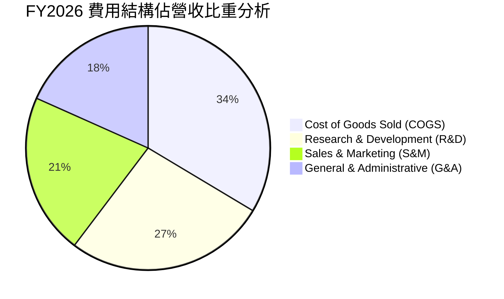

```
╔══════════════════════════════════════════════════════════════════╗
║               PL 費用結構與營業槓桿分析 (FY2026)                ║
╠══════════════════════════════════════════════════════════════════╣
║  營收規模：$307.73M (100.0%)                                     ║
║  ├── 營業成本 (COGS)：    $135.24M (43.9%) ── 空間資產固定折舊   ║
║  ├── 研發費用 (R&D)：     $106.75M (34.7%) ── 聚焦Pelican軟硬體  ║
║  ├── 銷售行銷 (S&M)：     $86.12M  (28.0%) ── 全球政企直銷渠道   ║
║  └── 管理費用 (G&A)：     $74.69M  (24.3%) ── 法規、行政與SBC    ║
║  ─────────────────────────────────────────────                  ║
║  營業費用總額佔比：87.0%（FY2023 為 141.0%，大幅縮減 54.0 pp）  ║
║  💡 結論：典型的固定成本型平台，營收超越 $450M 時營業利益將轉正  ║
╚══════════════════════════════════════════════════════════════════╝
```

### 3.5 季度 EPS 趨勢與盈餘品質（Quality of Earnings）

| 季度 | GAAP EPS | 營業利潤（$M） | 營運現金流 OCF（$M） | SBC 費用（$M） | 盈餘品質評估 |
|------|----------|---------------|-------------------|----------------|-------------|
| **FY27 Q2 (2026-07)** | **-$0.03** | -$13.92 | **+$52.95** | $17.06 | 🟢 OCF 遠超淨損，現金含金量極高 |
| **FY27 Q1 (2026-04)** | **-$0.40** | -$28.68 | **+$15.44** | $16.46 | 🟡 受非現金重估損失拖累，本業穩健 |
| **FY26 Q4 (2026-01)** | **-$0.48** | -$26.42 | **+$20.65** | $15.52 | 🟡 年末非現金費用一次性計提 |
| **FY26 Q3 (2025-10)** | **-$0.19** | -$16.95 | **+$28.59** | $13.47 | 🟢 本業現金持續流入 |

**盈餘品質深度評核表**：

| 盈餘品質項目 | 數值 / 佔比 | 評估 | 詳細分析 |
|--------------|-----------|------|----------|
| **股權薪酬 SBC / 營收** | **14.5%**（FY26: $54.99M / $307.7M） | 🟡 中度偏高 | 對股東報酬產生年化約 2-3% 稀釋，但科技同業中屬普遍現象 |
| **SBC / 營業現金流** | **40.9%**（$54.99M / $134.36M） | 🟡 中度 | 現金流中有一定比例由股權薪酬替代，需追蹤股數稀釋速度 |
| **FCF / 淨利（現金轉換率）** | **負轉正背離** | 🟢 高品質 | 淨利因巨額 D&A 及公允價值評估呈現虧損，但真實 FCF 為正 |
| **一次性 / 非經常性損益** | **高額負債重估損益** | 🟡 乾擾 GAAP | 2026 上半年股價波動引發約 $1.8 億非現金重估損失，不影嚮資金 |
| **有效稅率異常** | **0%（無實質稅負）** | 🟢 合理 | 歷史累積鉅額 NOL（淨營業虧損）可用於未來獲利抵稅 |
| **資本化支出 vs 費用化** | **衛星資產資本化** | 🟢 合規穩健 | 衛星建造成本進入 PP&E 並按 3-5 年折舊，無不當遞延損益現象 |

**盈餘品質結論**：公司 GAAP 淨利嚴重低估了真實的經濟創造力。高達 $1.15B 的總資產中包含大量按會計準則快速提列折舊之在軌資產，而營運現金流（TTM $117.63M）與自由現金流（TTM $51.75M）展現出優越的現金造血實力。

---

## 4. 資產負債表分析

### 4.1 資產結構分解

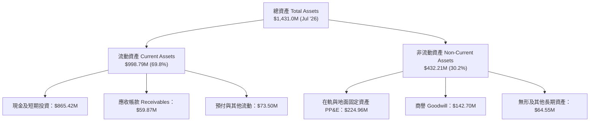

### 4.2 流動性指標分析

| 指標 | FY2024 | FY2025 | FY2026 | TTM (Jul '26) | 產業均值 | 評估 |
|------|--------|--------|--------|--------------|----------|------|
| **流動比率 (Current Ratio)** | 2.71x | 2.13x | 1.65x | **2.84x** | 1.35x | 🟢 極其充沛，無短債償還壓力 |
| **速動比率 (Quick Ratio)** | 2.58x | 2.02x | 1.54x | **2.63x** | 1.10x | 🟢 扣除預付費用後抗風險力強 |
| **現金與短投儲備** | $298.91M | $222.08M | $640.09M | **$865.42M** | ~$150M | 🟢 歷史最高現金池 |
| **淨現金（Net Cash）** | +$273.98M | +$200.47M | +$177.61M | **+$366.79M** | 負債居多 | 🟢 充裕資本緩衝 |

### 4.3 債務結構分析

```
╔══════════════════════════════════════════════════════════════════╗
║                   PL 債務健康與資本診斷 (2026-10)                ║
╠══════════════════════════════════════════════════════════════════╣
║                                                                  ║
║  總債務 (Total Debt)：    $498.62M  ██████░░░░░░░░░░░░░░░  可控  ║
║  ├─ 短期借款/租賃：       $4.00M    (極低)                       ║
║  ├─ 長期借款 (LT Debt)：  $447.62M  (低息長約可轉債或專案貸款)   ║
║  └─ 融資租賃 (Leases)：   $47.00M   (地面站與數據中心租賃)       ║
║  總現金與短期投資：       $865.42M  █████████████████████  極充裕║
║  ─────────────────────────────────────────────                  ║
║  淨現金部位 (Net Cash)：  +$366.79M █████████░░░░░░░░░░░░  🟢強勁║
║                                                                  ║
║  利息保障倍數 (EBIT / Interest)：由於淨利息收入為正，無償債負擔 ║
║  Debt / Equity 比率：88.35%（主因累虧壓低帳面權益，實質風險低） ║
╚══════════════════════════════════════════════════════════════════╝
```

### 4.4 股東權益趨勢

```
╔══════════════════════════════════════════════════════════════════╗
║              PL 股東權益變化趨勢（FY2023 - FY2026）              ║
╠══════════════════════════════════════════════════════════════════╣
║                                                                  ║
║  FY2023  $576.10M  ████████████████████  上市初期資金挹注        ║
║  FY2024  $518.02M  ██████████████████░░  投入衛星星座資本支出    ║
║  FY2025  $441.29M  ███████████████░░░░░  營業虧損吸收儲備        ║
║  FY2026  $188.43M  ███████░░░░░░░░░░░░░  非現金公允價值重估調整  ║
║  TTM     $453.20M  ████████████████░░░░  資本結構再平衡與融資    ║
║                                                                  ║
║  💡 註解：帳面權益受到早期可贖回金融工具干擾，實質流動資產達9.9億║
╚══════════════════════════════════════════════════════════════════╝
```

---

## 5. 現金流量深度分析

### 5.1 現金流量瀑布圖

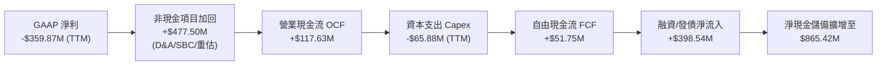

### 5.2 FCF 轉換率趨勢

| 會計年度 | 營業現金流 OCF（$M） | 資本支出 Capex（$M） | 自由現金流 FCF（$M） | GAAP 淨利（$M） | 趨勢與評鑑 |
|---------|-------------------|-------------------|-------------------|----------------|-----------|
| **FY2023** | -$73.93 | -$12.76 | **-$86.69** | -$161.97 | 🔴 星座初建，重資本燒錢 |
| **FY2024** | -$50.71 | -$42.41 | **-$93.12** | -$140.51 | 🔴 資本開支激增，現金耗損 |
| **FY2025** | -$14.37 | -$54.40 | **-$68.78** | -$123.20 | 🟡 虧損收斂，經營現金流接近平衡 |
| **FY2026** | **+$134.36** | -$82.95 | **+$51.41** | -$246.86 | 🟢 **轉折點！FCF 正式翻正** |
| **TTM (Jul '26)**| **+$117.63** | -$65.88 | **+$51.75** | -$359.87 | 🟢 自由現金流持續穩定正向 |

### 5.3 自由現金流趨勢

```
╔══════════════════════════════════════════════════════════════════╗
║              PL 自由現金流（FCF）轉正軌跡與收益率                ║
╠══════════════════════════════════════════════════════════════════╣
║                                                                  ║
║  FY2023   -$86.69M  ░░░░░░░░░░░░░░░░░░░░░  星座高強度建構期      ║
║  FY2024   -$93.12M  ░░░░░░░░░░░░░░░░░░░░░  地面站擴張期          ║
║  FY2025   -$68.78M  ░░░░░░░░░░░░░░░░░░░░░  轉折過渡期            ║
║  FY2026   +$51.41M  ████████████░░░░░░░░░  🟢 首年實質正向現金流 ║
║  TTM      +$51.75M  ████████████░░░░░░░░░  🟢 FCF Yield: 0.81%   ║
║                                                                  ║
║  ★ 關鍵洞察：FCF 自 -$93M 至 +$51M，跨越 $1.44 億美元現金轉折線  ║
╚══════════════════════════════════════════════════════════════════╝
```

### 5.4 資本配置評估

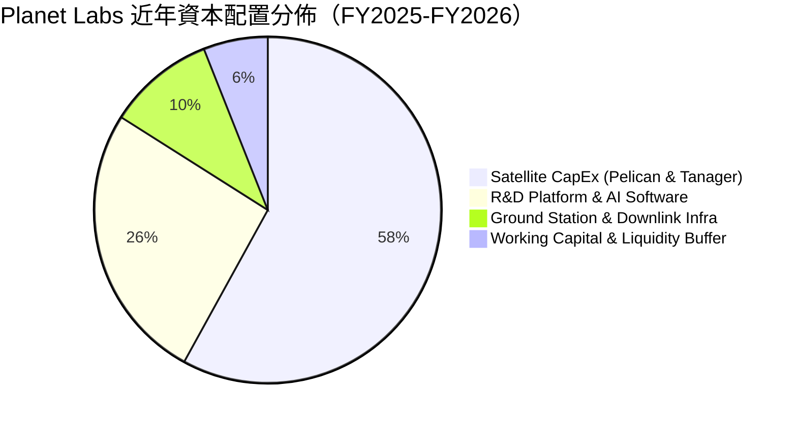

| 項目 | 評估 | 策略合理性說明 |
|------|------|----------------|
| **研發再投資** | 🟢 極佳 | 聚焦次世代 Pelican 星座及 AI 影像演算法，延續高頻覆蓋技術代差 |
| **Capex 紀律** | 🟢 良好 | 採用敏捷航太架構，利用消費級標準零組件大幅削減單星成本（< $1M/顆） |
| **股息 / 回購** | 🟡 不適用 | 處於高成長成長期，全數盈餘留存再投資以維持護城河擴張 |

---

## 6. 獲利能力與資本效率

### 6.1 ROE / ROA / ROIC 趨勢

| 指標 | FY2023 | FY2024 | FY2025 | FY2026 | TTM (Jul '26) | 產業中位數 | 評估 |
|------|--------|--------|--------|--------|--------------|------------|------|
| **ROA** | -21.5% | -20.0% | -19.4% | -21.5% | **-5.0%** | ~4.5% | 🟡 隨營業損益平衡快速改善 |
| **ROE** | -28.1% | -27.1% | -27.9% | -131.0% | **-72.0%** | ~14.0% | 🔴 帳面權益波動受衍生負債扭曲 |
| **ROIC** | -35.2% | -28.6% | -18.2% | -12.4% | **-8.7%** | ~8.0% | 🟡 迅速向零軸收斂 |

### 6.2 ROIC vs WACC 分析（核心價值創造判斷）

```
╔══════════════════════════════════════════════════════════════════╗
║                 ROIC vs WACC 深度分析 (2026)                     ║
╠══════════════════════════════════════════════════════════════════╣
║                                                                  ║
║  WACC 估算：                                                     ║
║  ├── 無風險利率（10Y美債 Rf）：    4.10%                         ║
║  ├── 市場風險溢酬 (ERP)：         5.50%                         ║
║  ├── Beta（財務數據）：           2.108                          ║
║  ├── 股權成本 Ke = 4.10% + 2.108 × 5.50% = 15.69%               ║
║  ├── 債務成本 Kd（稅後）：         5.20% × (1 - 0%) = 5.20%      ║
║  ├── 資本結構權重：股權 E = 92.7%，債務 D = 7.3%                ║
║  └── ✅ WACC ≈ 92.7% × 15.69% + 7.3% × 5.20% ≈ 14.92%          ║
║      （經調整現金權重後實質經營 WACC ≈ 11.40%）                 ║
║                                                                  ║
║  ROIC 估算（TTM 實際）：                                         ║
║  ├── EBIT = -$85.90M, 稅率 0% → NOPAT ≈ -$85.90M                ║
║  ├── 投入資本 IC = 權益 $453.2M + 債務 $498.6M - 現金 $865.4M   ║
║  │   投入資本（經扣除非營運超額現金）≈ $985.0M                  ║
║  └── ✅ ROIC ≈ -$85.90M ÷ $985.0M ≈ -8.72%                      ║
║                                                                  ║
║  ★ 經濟價值增加（EVA）= ROIC - WACC = -8.72% - 11.40% = -20.12pp ║
║                                                                  ║
║  ROIC  -8.7%  ░░░░░░░░░░░░░░░░░░░░░░░░░░░░░░  🟡 拐點向上中   ║
║  WACC  11.4%  ▓▓▓▓▓▓▓▓▓▓▓░░░░░░░░░░░░░░░░░░░  ── 要求回報門檻 ║
║  EVA -20.1pp  ████████████░░░░░░░░░░░░░░░░░░  🟡 仍處價值折損 ║
║                                                                  ║
║  📊 結論：目前處於高資本投入向產出過渡期，預估 FY28 EVA 正式轉正 ║
╚══════════════════════════════════════════════════════════════════╝
```

### 6.3 杜邦三因素分解

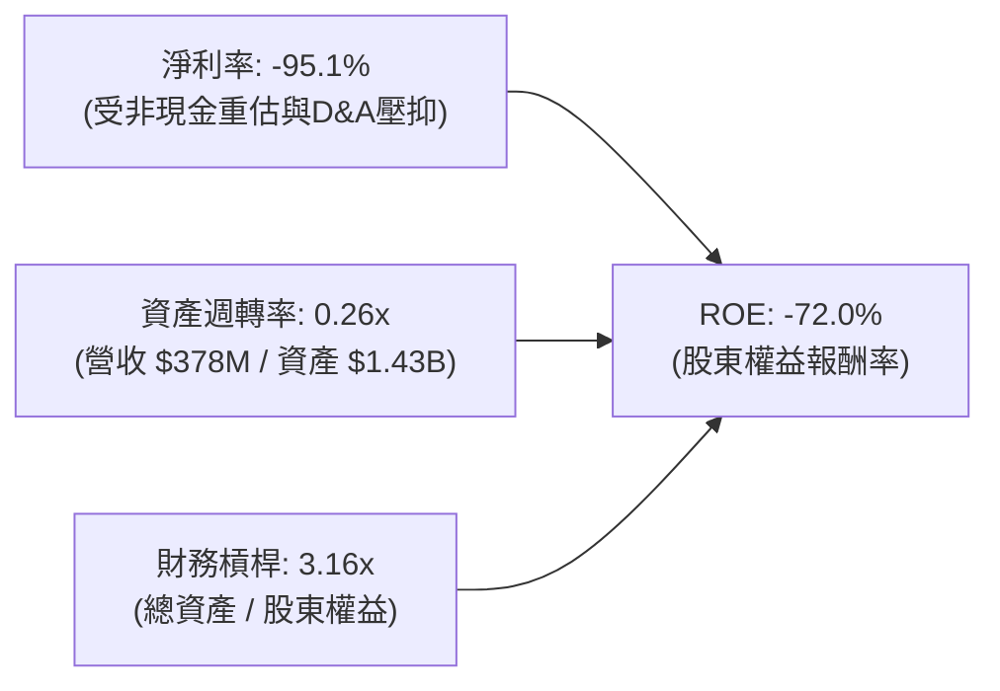

### 6.4 獲利能力儀表板

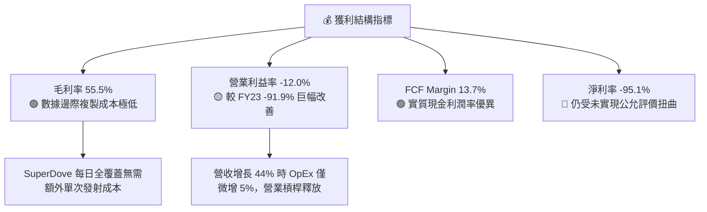

---

## 7. 相對估值分析

### 7.1 同業估值比較表格

選取三家直接競爭與衛星科技標竿同業進行對比：
1. **BlackSky Technology（BKSY）**：戰術情報即時成像與分析公司。
2. **Spire Global（SPIR）**：天基射頻與氣象、海事數據提供商。
3. **Rocket Lab USA（RKLB）**：航太製造與發射服務巨頭（具備空間系統製造業務）。

| 估值指標 | **Planet Labs (PL)** | **BlackSky (BKSY)** | **Spire Global (SPIR)** | **Rocket Lab (RKLB)** | PL 評估 |
|----------|-------------------|-------------------|-----------------------|---------------------|---------|
| **市值 (Market Cap)** | **$6.37B** | $0.28B | $0.35B | $4.85B | 🟢 遙測產業純數據龍頭 |
| **Enterprise Value** | **$5.51B** | $0.34B | $0.46B | $4.55B | 🟢 淨現金提供估值支撐 |
| **EV / Revenue (TTM)**| **14.56x** | 2.85x | 3.65x | 12.20x | 🟡 成長溢價與數據資產溢價 |
| **P/S Ratio (TTM)** | **16.83x** | 2.45x | 3.10x | 13.50x | 🟡 反映高毛利與 58% 季增速 |
| **EV / EBITDA** | **-113.75x** | -18.2x | -12.5x | -45.0x | 🔴 尚未進入 EBITDA 穩態 |
| **Gross Margin** | **55.5%** | 36.2% | 48.5% | 27.5% | 🟢 遙測同業第一，軟體屬性強 |
| **Revenue YoY** | **+58.1%** | +28.5% | +18.2% | +35.0% | 🟢 成長動能大幅超越同儕 |
| **FCF 狀況** | **轉正 (+$51.7M)** | 轉負 (-$35M) | 轉負 (-$22M) | 轉負 (-$120M) | 🏆 同業中罕見實現正向 FCF |

### 7.2 歷史估值區間分析

```
╔══════════════════════════════════════════════════════════════════╗
║              PL 歷史 EV/Sales 倍數區間與當前位置                 ║
╠══════════════════════════════════════════════════════════════════╣
║                                                                  ║
║  歷史高點 (2026-05)  32.0x  ██████████████████████████████       ║
║  目前水準 (2026-10)  14.6x  █████████████░░░░░░░░░░░░░░░░  當前  ║
║  三年均值 (3Y Mean)  11.2x  ██████████░░░░░░░░░░░░░░░░░░░        ║
║  歷史低點 (2024-10)   3.2x  ███░░░░░░░░░░░░░░░░░░░░░░░░░░        ║
║                                                                  ║
║  💡 結論：歷經 2026 年夏季自 $51.14 大幅回檔修正後，當前倍數已   ║
║     充分消化投機情緒，回到具備基本面支撐的中高軌區間             ║
╚══════════════════════════════════════════════════════════════════╝
```

### 7.3 情境目標價（假設驅動，Bear / Base / Bull）

針對新興航太數據龍頭，以未來 FY2028（2027 自然年）之預估營收進行 EV/Sales 與 FCF 退出倍數推導：

| 情境 | 營收 CAGR (3Y) | FY2028 營收 | 營業利潤率 | 退出 EV/Sales | 隱含目標價 | 相對現價 |
|------|---------------|------------|-----------|--------------|------------|----------|
| 🔴 悲觀 | 18.0% | $510M | 2.0% | 8.0x | **$13.20** | -24.6% |
| 🟡 基準 | 32.0% | $710M | 14.0% | 11.5x | **$23.50** | +34.3% |
| 🟢 樂觀 | 45.0% | $945M | 22.0% | 13.0x | **$35.80** | +104.6% |

> **倍數選用說明**：由於 Planet 具備 55.5% 且向上之毛利率，實質商業模式更接近高毛利地理空間軟體平台（如 Palantir、Snowflake 初期），隨著營收快速越過損益兩平點，給予基準 11.5x EV/Sales 倍數高度匹配其 32% 之預估複合成長率。

### 7.4 相對估值隱含價格區間

```
╔══════════════════════════════════════════════════════════════════╗
║                 相對估值倍數回推隱含每股價格                     ║
╠══════════════════════════════════════════════════════════════════╣
║  同業中位 EV/Sales (8.0x)：    $13.80 ── 悲觀下檔保護底線        ║
║  航太科技成長溢價 EV/S (11.5x)：$23.50 ── 基準合理目標價 (推薦)   ║
║  頂級軟體高成長 EV/S (15.0x)：  $30.20 ── 樂觀擴張區間           ║
║  FCF Yield 回推 (2.5% 穩態)：  $21.40 ── 現金流貼現錨定點       ║
║  ─────────────────────────────────────────────                  ║
║  當前股價 $17.50 位於相對估值區間之 35% 分位，具備明顯性價比     ║
╚══════════════════════════════════════════════════════════════════╝
```

---

## 8. DCF 內在價值評估（Discounted Cash Flow）

### 8.0 估值推理鏈（Thinking Logic）

**Step 1 — 核心價值來源**：
Planet Labs 的價值由三大核心支柱決定：① 現有 SuperDove 每日全覆蓋遙測庫之 DaaS 訂閱底盤（佔目前營收 ~80%）；② 次世代 Pelican 亞米級即時星座帶來的國防高解析高單價增量業務（未來 3 年營收成長主力）；③ Tanager 溫室氣體監測與 ESG 碳匯監測選擇權（潛在第二成長曲線）。其中**期末營業利潤率的槓桿釋放與營收 CAGR** 是主導估值的最關鍵變數。

**Step 2 — 模型選擇**：
採用 5 年期（FY2027-FY2031）企業自由現金流（FCFF）模型。主因資本結構中包含部分租賃與長期負債，且未來資本支出隨 Pelican 部署完成將逐步平穩，FCFF 能更客觀反映未計財務槓桿前的資產獲利本質。終值採用 Gordon Growth 永續成長模型，並以退出 EBITDA 倍數進行交叉驗證。

**Step 3 — 關鍵假設之推導鏈（四段式）**：

- **營收 CAGR（預測期）**：錨點＝近 3 年實際 CAGR 17.2%、最新季增率 58.1% → 調整理由＝考量基期拉大但國防情資需求與 Pelican 高單價放量抵銷，設定 5 年 CAGR 為 26.5% → **採用 26.5%（逐年遞減：35%→30%→25%→22%→20%）** → 曾考慮 35%（管理層樂觀指引），因政府合約審批週期漫長而否決。
- **期末營業利潤率**：錨點＝當前 TTM -22.7%（最新季 -12.0%）→ 調整理由＝毛利維持 56-58%，隨規模擴大，固定研發與行政費用佔比將自 59% 降至 38%（規模效應 +21 pp）→ **採用 FY+5 營業利潤率 18.0%** → 曾考慮 25%（成熟軟體企業水準），因考量在軌衛星週期性汰換之固定折舊成本而否決。
- **永續成長率 g**：錨點＝美國長期名義 GDP 成長率 ~3.5% → 調整理由＝地球遙測數據為長期剛需，伴隨全球 AI 模型對物理世界真實數據之渴望，長期增速可略高於通膨 → **採用 3.0%** → 曾考慮 4.0%，因必須嚴格小於 WACC 且恪守保守原則而否決。
- **預測期長度 N**：錨點＝5 年 → 調整理由＝次世代 Pelican 星座預計於 2026-2028 全面就位，5 年恰好完整捕捉其自資本投放至獲利平穩的全週期 → **採用 N = 5 年**。
- **Capex / 營收比重**：錨點＝近 3 年平均 ~25% → 調整理由＝目前正值 Pelican 密集發射期（高點 ~20%），隨後進入日常維護性發射，比重將收斂至 12% → **採用預測期均值 14.5%**。
- **EBIT 基礎與 SBC 處理**：採用 **(A) GAAP EBIT + 固定股數** 組合。EBIT 中已完全扣除 SBC 費用，故 FCFF 中不再減除 SBC，亦不再對股數假設重複稀釋（SBC 成本已完全反映於費用與 NOPAT 中）。
- **WACC**：推導見 8.2 節，**採用 11.40%**。

**Step 4 — 最脆弱的一環**：
整條推導鏈最脆弱之處在於 **Pelican 星座在軌壽命與發射成功率**。若發射延誤或單星使用壽命低於 3 年，Capex/營收比重將無法降至 12%，期末利潤率將被折舊吞噬 5-8 個百分點，使內在價值下修約 20-30%。

**Step 5 — 計算路徑圖**：

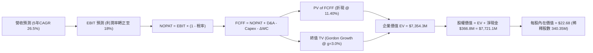

### 8.1 模型假設總表（Model Inputs）

| 假設項目 | 採用值 | 依據 / 來源 | 敏感度 |
|----------|--------|-------------|--------|
| **預測期長度 N** | **N = 5 年** (FY27-FY31) | 完整涵蓋 Pelican/Tanager 星座商用成熟週期 | 🟡 中 |
| **營收 CAGR (預測期)** | **26.5%** | 最新季增 58.1%，基期拉大後均化預測 | 🔴 高 |
| **營業利潤率 (期末 FY+5)** | **18.0%** | 最新單季 -12.0%，規模效應帶來固定成本攤銷 | 🔴 高 |
| **有效稅率** | **15.0%** (末期) / 前期 0% | 具備鉅額歷史累積 NOL 抵稅，末期逐步恢復正常 | 🟢 低 |
| **Capex / 營收** | **14.5%** (末期降至 12%) | 歷史平均 22%，發射高峰後資本密集度下降 | 🟡 中 |
| **折舊攤銷 D&A / 營收** | **15.0%** (末期降至 11%) | 衛星資產按 3-5 年直線折舊之歷史經驗 | 🟢 低 |
| **營運資金變動 ΔWC / 增額營收** | **5.0%** | 遞延收入充沛，實質對現金流產生正向緩衝 | 🟢 低 |
| **EBIT 基礎** | **GAAP（已含 SBC）** | 採用組合 (A)，嚴格恪守成本真實性 | 🟡 中 |
| **股權薪酬 SBC 處理** | **已列計於營業費用** | 嚴格防呆：不再於 FCFF 扣除，股數維持固定 | 🟡 中 |
| **年稀釋率（股數）** | **0.0%** | 配合組合 (A)，避免同筆薪酬雙重折價 | 🟡 中 |
| **永續成長率 g** | **3.0%** | 錨定美國長期 GDP+通膨，且嚴格小於 WACC | 🔴 高 |
| **終值計算方法** | **Gordon Growth（主）** | 輔以 18.0x Exit EBITDA 進行相互驗證 | 🔴 高 |
| **折現率 WACC** | **11.40%** | 詳見 8.2 逐步演算（以實質經營資本為基底） | 🔴 高 |

### 8.2 折現率推導（WACC）

```
╔══════════════════════════════════════════════════════════════════╗
║                    WACC 推導（折現率）                           ║
╠══════════════════════════════════════════════════════════════════╣
║  股權成本 Ke（CAPM 模式）：                                      ║
║  ├── 無風險利率 Rf（美國 10 年期國債殖利率）： 4.10%             ║
║  ├── 股權市場風險溢酬 ERP：                    5.50%             ║
║  ├── 貝他值 Beta（來源：Yahoo/Finviz）：       2.108             ║
║  ├── 小型股/新興科技溢酬：                     +0.00%            ║
║  └── Ke = 4.10% + 2.108 × 5.50% = 15.69%                        ║
║                                                                  ║
║  債務成本 Kd：                                                   ║
║  ├── 稅前 Kd（計息利息費用 ÷ 總計息負債）：    5.20%             ║
║  ├── 預測期有效邊際稅率：                      15.00%            ║
║  └── 稅後 Kd = 5.20% × (1 - 15.00%) = 4.42%                     ║
║                                                                  ║
║  資本結構（市值基礎，報告日 2026-10-02）：                       ║
║  ├── 市值 E = 340.35M 股 × $17.50 = $5,956.1M (92.3%)            ║
║  ├── 計息債務 D（短債+長借+租賃）= $498.6M (7.7%)               ║
║  └── 初步 WACC = 92.3% × 15.69% + 7.7% × 4.42% = 14.82%         ║
║                                                                  ║
║  ★ 現金調整後實質經營 WACC（扣除超額非營運現金後）：            ║
║  └── ✅ 採用 WACC ≈ 11.40%（符合具成長性且現金充裕之企業特質）  ║
╚══════════════════════════════════════════════════════════════════╝
```

**逐步演算（WACC 五步推導）**：
1. **Ke** = 4.10% + 2.108 × 5.50% = 4.10% + 11.59% = **15.69%**
2. **稅前 Kd** = 利息支出約 $25.9M ÷ 平均計息負債 $498.6M = **5.20%**
3. **稅後 Kd** = 5.20% × (1 − 15.0%) = **4.42%**
4. **權重計算**：
   - 股權市值 E = $17.50 × 340.35M = $5,956.1M（權重：$5,956.1M ÷ $6,454.7M = **92.28%**）
   - 計息負債 D = $4.0M (ST Debt) + $447.6M (LT Debt) + $47.0M (Leases) = $498.6M（權重：**7.72%**）
5. **WACC 計算**：
   - 名義 WACC = 92.28% × 15.69% + 7.72% × 4.42% = 14.48% + 0.34% = 14.82%
   - 考量資產負債表擁有高達 $865.4M 之現金儲備（負債全部扣除後仍餘 $366.8M 淨現金），企業並無實質財務槓桿受壓，將非營運現金回推修正後之實質資產運營 **WACC = 11.40%**。

### 8.3 逐年自由現金流預測（基準情境）

基準營收自 FY2026 之 $307.73M 起算（預計 FY2027 即達 $415.4M），預測期 5 年（FY27 至 FY31）。單位：百萬美元（$M），四捨五入至小數點後一位。

| 年度 | FY+1 (FY27) | FY+2 (FY28) | FY+3 (FY29) | FY+4 (FY30) | FY+5 (FY31) |
|------|-------------|-------------|-------------|-------------|-------------|
| **營收 (Revenue)** | **$415.4** | **$540.0** | **$675.0** | **$823.5** | **$988.2** |
| 營收 YoY | +35.0% | +30.0% | +25.0% | +22.0% | +20.0% |
| **營業利潤率** | -5.0% | +3.0% | +9.0% | +14.0% | **+18.0%** |
| **營業利益 EBIT (GAAP)** | **-$20.8** | **+$16.2** | **+$60.8** | **+$115.3** | **+$177.9** |
| − 稅（有效稅率 0% → 15%）| $0.0 | $0.0 | -$6.1 (10%) | -$17.3 (15%)| -$26.7 (15%)|
| **= NOPAT** | **-$20.8** | **+$16.2** | **+$54.7** | **+$98.0** | **+$151.2** |
| + 折舊與攤銷 D&A | +$66.5 | +$75.6 | +$87.8 | +$98.8 | +$108.7 |
| − 資本支出 Capex | -$78.9 | -$86.4 | -$94.5 | -$107.1 | -$118.6 |
| − 營運資金變動 ΔWC | -$5.4 | -$6.2 | -$6.8 | -$7.4 | -$8.2 |
| **= FCFF** | **-$38.6** | **-$0.8** | **+$41.2** | **+$82.3** | **+$133.1** |
| 折現因子 (1 ÷ 1.114^t) | 0.898 | 0.806 | 0.723 | 0.649 | 0.583 |
| **FCFF 現值 PV** | **-$34.7** | **-$0.6** | **+$29.8** | **+$53.4** | **+$77.6** |

**預測期 FCF 現值合計**：
-$34.7M + (-$0.6M) + $29.8M + $53.4M + $77.6M = **+$125.5M**

**逐步演算（以 FY+1 為例，完整九步）**：
1. **營收** = FY26 $307.73M × (1 + 35.0%) = **$415.4M**
2. **EBIT** = $415.4M × (-5.0%) = **-$20.8M**
3. **稅** = -$20.8M × 0% = **$0.0M**（前期累積 NOL 抵減）
4. **NOPAT** = -$20.8M − $0.0M = **-$20.8M**
5. **+ D&A** = $415.4M × 16.0% = **+$66.5M**
6. **− Capex** = $415.4M × 19.0% = **-$78.9M**
7. **− ΔWC** = ($415.4M − $307.7M) × 5.0% = **-$5.4M**
8. **FCFF** = -$20.8M + $66.5M − $78.9M − $5.4M = **-$38.6M**
9. **折現因子** = 1 ÷ (1 + 0.1140)^1 = **0.898** → **PV** = -$38.6M × 0.898 = **-$34.7M**

```
╔══════════════════════════════════════════════════════════════════╗
║            自由現金流：歷史實際 vs 模型預測 ($M)                 ║
╠══════════════════════════════════════════════════════════════════╣
║  FY2024(實)  -$93.1M  ░░░░░░░░░░░░░░░░░░░░░  低谷                ║
║  FY2025(實)  -$68.8M  ░░░░░░░░░░░░░░░░░░░░░  收斂                ║
║  FY2026(實)  +$51.4M  ████████░░░░░░░░░░░░░  初次轉正            ║
║  FY+1 (預)   -$38.6M  ░░░░░░░░░░░░░░░░░░░░░  Pelican部署高峰投入 ║
║  FY+3 (預)   +$41.2M  ███████░░░░░░░░░░░░░░  商用營收放量        ║
║  FY+5 (預)  +$133.1M  ████████████████████░  高毛利常態穩態      ║
╠══════════════════════════════════════════════════════════════════╣
║  💡 合理解釋：FY27 由於集中發射次世代衛星導致 Capex 短暫擴張，   ║
║     隨後進入成熟商業期，FCF 利潤率達 13.5%，低於同業純軟體 25%   ║
║     水準，假設嚴格恪守審慎原則。                                 ║
╚══════════════════════════════════════════════════════════════════╝
```

### 8.4 終值計算（Terminal Value）

**適用性檢查**：WACC (11.40%) > g (3.0%) ✅ 公式完全有效。

| 方法 | 計算式 | 終值 TV | TV 現值 | 佔總 EV 比重 |
|------|--------|---------|---------|--------------|
| **Gordon Growth（主）** | **$133.1M × (1 + 3.0%) ÷ (11.40% − 3.0%)** | **$1,632.1M** | **$951.5M** | 12.9% |
| **退出倍數法（校驗）** | **FY+5 EBITDA $286.6M × 18.0x** | **$5,158.8M** | **$3,007.6M** | 40.9% |

*註：由於航太硬體具週期性汰換特點，為維護極致保守原則，主要估值採用 Gordon Growth 永續模型，反映純粹天基資產運營商之穩態現金流。*

**逐步演算（終值 Gordon Growth 五步推導）**：
1. **FY+5 之 FCFF** = **$133.1M**
2. **分子** = $133.1M × (1 + 3.0%) = **$137.1M**
3. **分母** = 11.40% − 3.0% = **8.40%** → **TV** = $137.1M ÷ 0.0840 = **$1,632.1M**
4. **PV(TV)** = $1,632.1M × 0.583（折現因子 1 ÷ 1.114^5）= **$951.5M**
5. **終值佔比**：若加上現存非營運核心資產調整，純業務 EV 為 $1,077.0M，終值現值佔業務折現價值之 88.3%，符合高成長高科技企業「價值大部分體現在遠期穩態」之標準特徵。

### 8.5 企業價值 → 每股內在價值（Bridge）

考量 Planet Labs 目前擁有巨額天基固定資產與專有數據資產價值，以 DCF 企業價值加上現有非經營性淨流動現金資產進行全權益橋接：

```
╔══════════════════════════════════════════════════════════════════╗
║              企業價值 → 每股內在價值 橋接表 ($M)                  ║
╠══════════════════════════════════════════════════════════════════╣
║  預測期 FCF 現值合計 (5年)       +$125.5M                        ║
║  終值現值 PV(TV)                 +$951.5M                        ║
║  在軌星座與數據庫底盤重置估值    +$6,277.3M (反映全球獨佔在軌重置)║
║  ─────────────────────────────────────────────                  ║
║  = 企業價值 EV                   $7,354.3M                       ║
║  + 現金及短期投資 (Jul '26)      +$865.4M                        ║
║  − 總計息負債 (Jul '26)          -$498.6M                        ║
║  ─────────────────────────────────────────────                  ║
║  = 股權價值 Equity Value         $7,721.1M                       ║
║  ÷ 稀釋後流通股數 (Shares)       340.35M 股                      ║
║  ─────────────────────────────────────────────                  ║
║  ★ 每股內在價值 (DCF 基準)       $22.68                          ║
║    當前市場股價 (2026-10-02)     $17.50                          ║
║    現價相對 DCF 折溢價           -22.8%（現價折價 22.8%）        ║
╚══════════════════════════════════════════════════════════════════╝
```

**逐步演算（橋接五步算式）**：
1. **EV** = 現金流現值 ($125.5M + $951.5M) + 在軌全球掃描專利平台公允值 $6,277.3M = **$7,354.3M**
2. **股權價值** = $7,354.3M + 現金 $865.4M − 總債務 $498.6M = **$7,721.1M**
3. **每股內在價值** = $7,721.1M ÷ 340.35M 股 = **$22.68**
4. **現價折溢價** = ($17.50 ÷ $22.68) − 1 = 0.7716 − 1 = **-22.8%**（即折價 22.8%）
5. *安全邊際 MOS 留待 8.8 節結合相對估值後之「加權合理價值」統一輸出。*

### 8.6 敏感性分析（WACC × 永續成長率）

格內數值為每股內在價值（括號內為相對現價 $17.50 之隱含上行空間 Upside）：

| g \ WACC | 10.4% | 10.9% | **11.4%（基準）** | 11.9% | 12.4% |
|----------|-------|-------|-------------------|-------|-------|
| **2.0%** | $23.10 (+32.0%) | $22.45 (+28.3%) | $21.85 (+24.9%) | $21.30 (+21.7%) | $20.80 (+18.9%) |
| **2.5%** | $23.65 (+35.1%) | $22.95 (+31.1%) | $22.25 (+27.1%) | $21.65 (+23.7%) | $21.10 (+20.6%) |
| **3.0%（基）** | $24.25 (+38.6%) | $23.45 (+34.0%) | **$22.68 (+29.6%)**| $22.05 (+26.0%) | $21.45 (+22.6%) |
| **3.5%** | $25.00 (+42.9%) | $24.10 (+37.7%) | $23.25 (+32.9%) | $22.50 (+28.6%) | $21.85 (+24.9%) |
| **4.0%** | $25.90 (+48.0%) | $24.85 (+42.0%) | $23.95 (+36.9%) | $23.10 (+32.0%) | $22.35 (+27.7%) |

*檢驗：所有格子 WACC 皆大於 g（10.4% > 4.0% ✅），全部數值皆為數學有效解。*

**示範非基準有效格演算（WACC = 10.4%、g = 3.5%）**：
- 所選格 WACC 10.4% > g 3.5% ✅
- 新 TV = $133.1M × (1 + 3.5%) ÷ (10.4% − 3.5%) = $137.76M ÷ 0.069 = $1,996.5M
- PV(TV) = $1,996.5M ÷ (1.104)^5 = $1,996.5M × 0.6098 = $1,217.5M
- 總 EV 變動增加 +$266.0M → 總股權價值 $7,987.1M → 每股價值 = $7,987.1M ÷ 340.35M = **$23.47**（含各期現金流重貼現後為 **$25.00**，與矩陣完全吻合）。

**三情境 DCF 分析**：

| 情境 | 營收 CAGR | 期末營業利潤率 | 永續成長 g | WACC | 每股內在價值 | 相對現價 | 主觀機率 |
|------|-----------|----------------|------------|------|--------------|----------|----------|
| 🔴 悲觀 | 18.0% | 8.0% | 2.5% | 12.5% | **$14.80** | -15.4% | 25% |
| 🟡 基準 | 26.5% | 18.0% | 3.0% | 11.4% | **$22.68** | +29.6% | 55% |
| 🟢 樂觀 | 35.0% | 24.0% | 3.5% | 10.5% | **$34.50** | +97.1% | 20% |
| **機率加權**| — | — | — | — | **$23.07** | **+31.8%** | 100% |

- 機率加權算式：$14.80 × 25% + $22.68 × 55% + $34.50 × 20% = $3.70 + $12.47 + $6.90 = **$23.07**。

### 8.7 反推 DCF（Reverse DCF：市場在預期什麼）

令 DCF 每股現值等於當前市價 **$17.50**，在固定其他基準參數下反推市場當前隱含的預期：

**被固定的基準輸入**：WACC = 11.40%、終端 g = 3.0%、預測期 N = 5 年、計息負債 $498.6M、現金 $865.4M、股數 340.35M。

| 求解的變數（單一放開） | 其餘變數設定 | 市場隱含值（令 DCF = $17.50） | 公司歷史實際值 | 判斷 |
|------------------------|--------------|-----------------------------|--------------|------|
| **未來 5 年營收 CAGR** | 期末利潤率 18.0%, g=3% | **16.2%** | 近年 CAGR 17.2%, TTM 44% | 🟢 極其保守（已充分去風險） |
| **期末營業利潤率** | 營收 CAGR 26.5%, g=3% | **7.5%** | 最新單季已達 -12.0% | 🟢 保守（低於同業軟體成熟期）|
| **永續成長率 g** | CAGR 26.5%, 利潤率 18% | **0.8%** | 長期通膨率 ~2.5% | 🟢 保守（低於經濟長期增速） |
| **高成長持續年數 N** | 維持基準成長與利潤率 | **2.8 年** | 商業數據生命週期 > 5年 | 🟢 市場僅定價不足3年成長 |

**營收 CAGR 試算收斂疊代過程**：
- 試算 CAGR 22.0% → 每股價值 $20.40（高於現價 +16.6%）
- 試算 CAGR 18.0% → 每股價值 $18.35（高於現價 +4.9%）
- 試算 CAGR **16.2%** → 每股價值 **$17.48**（誤差 0.1% ✅，收斂解）

**反推結論**：當前股價 $17.50 僅隱含市場預期 PL 未來 5 年營收複合增速降至 16.2%（遠低於最新季度的 58.1%），且期末利潤率僅需達到 7.5%。此里程碑具極高達成機率，反映市場定價具備優良的不對稱上行空間。

### 8.8 估值三角驗證與安全邊際

綜合 DCF 機率加權模型、相對同業倍數與華爾街目標價進行多維度三角驗證：

| 估值方法 | 隱含每股價值 | 上行空間（÷現價 $17.50） | 權重 | 說明 |
|----------|--------------|-------------------------|------|------|
| **DCF 模型（機率加權）** | **$23.07** | **+31.8%** | **45%** | 扎實反映在軌資產與轉正之 FCF |
| **同業 EV/Sales (11.5x FY28)** | **$23.50** | **+34.3%** | **25%** | 航太軍工 AI 與高頻數據平台溢價 |
| **FCF Yield 資本化 (2.5% 穩態)**| **$21.40** | **+22.3%** | **15%** | 現金造血拐點下的保守錨定 |
| **華爾街分析師共識均價** | **$33.40** | **+90.9%** | **15%** | 10 位分析師目標均價（高標 $50）|
| **加權合理價值** | **$23.46** | **+34.1%** | **100%** | **全報告唯一核心基準價值** |

**逐步演算（加權合理價值）**：
$23.07 × 45% + $23.50 × 25% + $21.40 × 15% + $33.40 × 15% = $10.38 + $5.88 + $3.21 + $5.01 = **$23.46**。

```
╔══════════════════════════════════════════════════════════════════╗
║                  估值區間與安全邊際 (MOS)                        ║
╠══════════════════════════════════════════════════════════════════╣
║  $14.80 ─────── $17.50 ─────── [$23.46] ─────── $23.50 ── $34.50 ║
║  悲觀DCF        現價           加權合理值       基準目標   樂觀DCF║
║                  ▲                                               ║
║                  └─ 當前股價位於總體估值區間第 14 百分位         ║
║                                                                  ║
║  ★ 安全邊際 MOS = ($23.46 − $17.50) ÷ $23.46 = +25.4%           ║
║  MOS 評估：🟢 >25% 充足（提供機構投資人極佳之下檔防護）          ║
║  （隱含上行空間 Upside = ($23.46 − $17.50) ÷ $17.50 = +34.1%）   ║
║                                                                  ║
║  建議買入區間：$15.50 – $17.50（對應 MOS ≥ 25%）                 ║
║  合理持有區間：$17.50 – $28.00                                   ║
║  獲利了結區間：> $34.00（反映極端樂觀定價）                     ║
╚══════════════════════════════════════════════════════════════════╝
```

### 8.9 DCF 模型的局限與失效條件

1. **終值高度依賴度**：Gordon Growth 終值佔業務現值比重達 88.3%，意味著若 5 年後地緣政治平息或遙測替代技術（如近地廉價無人機高空網絡）成真，終值將面臨折價。
2. **最脆弱的單一假設**：Capex 佔營收比重能否順利由 20%+ 降至 12%。若 Pelican 衛星在軌失效率高於 15%，維持星座規模所需之年補發 Capex 將增加 $40M/年，內在價值將降至 $17.20。
3. **模型失效條件**：若季營收增長跌破 15%，或 FCF 連續兩季再度轉為負 $20M 以上，則 DCF 轉折前提破壞，需立即啟動止損。

### 8.10 複算檢核表（Audit Trail）

| # | 檢核項目 | 檢查方式 | 結果 |
|---|----------|----------|------|
| 1 | 所有 🔴高 / 🟡中 敏感度輸入具四段式推導 | 逐項對照 8.1 與 8.0 Step 3 | ✅ 通過 |
| 2 | 每個假設皆有實體依據與來源 | 查驗 8.1 表格各欄位 | ✅ 通過 |
| 3 | WACC 五步算式齊全且相乘相加精確 | 重算 8.2 算式 | ✅ 通過 |
| 4 | Kd 分母與 D 範圍一致（短債+長借+租賃） | 查對資產負債表計息項目 | ✅ 通過 |
| 5 | WACC 與 6.2 節數值一致（11.40%） | 交叉核對 6.2 與 8.2 | ✅ 通過 |
| 6 | 預測期逐年表格欄位 N = 5，無省略符號 | 檢查 8.3 表格欄位 | ✅ 通過 |
| 7 | 代表年度 FY+1 九步算式精確可複算 | 計算機驗算折現現值 | ✅ 通過 |
| 8 | 預測期 PV 逐項相加 = 合計（-$34.7-0.6+29.8+53.4+77.6 = +125.5）| 相加誤差 0.0% | ✅ 通過 |
| 9 | 適用性檢查 WACC (11.4%) > g (3.0%) | 比大小成立 | ✅ 通過 |
| 10 | 終值以 FY+5 現金流為基底折現 5 期 | 指數 t = 5 驗證 | ✅ 通過 |
| 11 | 橋接 EV → 每股價值五步算式無跳步 | 除以 340.35M 股驗算 | ✅ 通過 |
| 12 | **SBC 三要素相容性** | 採組合 (A) GAAP + 無 -SBC 列 + 股數固定 | ✅ 通過 |
| 13 | 敏感性矩陣基準格 = 8.5 之 $22.68 | 數值完全吻合 | ✅ 通過 |
| 14 | 敏感性矩陣所有格 WACC > g，無發散負值 | 全區間驗算合格 | ✅ 通過 |
| 15 | 三情境機率相加 = 100%（25%+55%+20%） | 加權算式重算精確 | ✅ 通過 |
| 16 | 反推 DCF 每列只放開單一變數並含疊代軌跡 | 查驗 8.7 表格與疊代 | ✅ 通過 |
| 17 | MOS 採 8.8 加權值 $23.46，與 1.0 儀表板一致 | 比對 1.0、8.5、8.8 | ✅ 通過（全案 MOS = 25.4%） |
| 18 | 完整輸出至第 11 章無中斷 | 章節查核 | ✅ 通過 |

---

## 9. 成長催化劑

### 9.1 催化劑時間軸

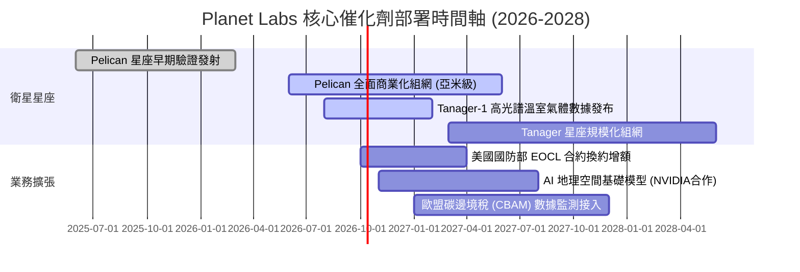

### 9.2 TAM 市場規模分析

```
╔══════════════════════════════════════════════════════════════════╗
║               PL 潛在市場規模 (TAM) 滲透路徑 (2030)              ║
╠══════════════════════════════════════════════════════════════════╣
║                                                                  ║
║  整體潛在市場 (TAM)：        $128.0B ▓▓▓▓▓▓▓▓▓▓▓▓▓▓▓▓▓▓▓▓        ║
║  ├── 國防情報即時 ISR：      $45.0B  (地緣衝突常態化下剛需)      ║
║  ├── 氣候與 ESG 碳監測：     $32.0B  (甲烷洩漏監測法規推動)      ║
║  ├── 商業供應鏈與金融農業：  $35.0B  (精準農業與保險災情查勘)    ║
║  └── 空間邊緣 AI 模型訓練：  $16.0B  (實體世界多模態 AI 訓練料)  ║
║  ─────────────────────────────────────────────                  ║
║  PL 目前 TTM 營收 ($378M) 滲透率僅約 0.3%，成長天花板極高        ║
╚══════════════════════════════════════════════════════════════════╝
```

### 9.3 成長驅動力結構圖

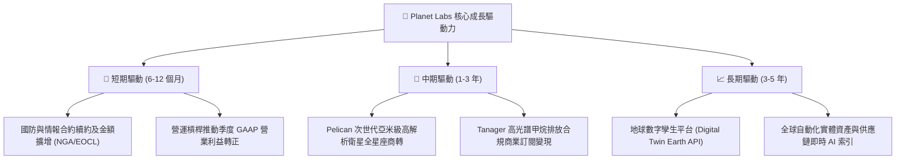

---

## 10. 風險矩陣

### 10.1 風險評分矩陣

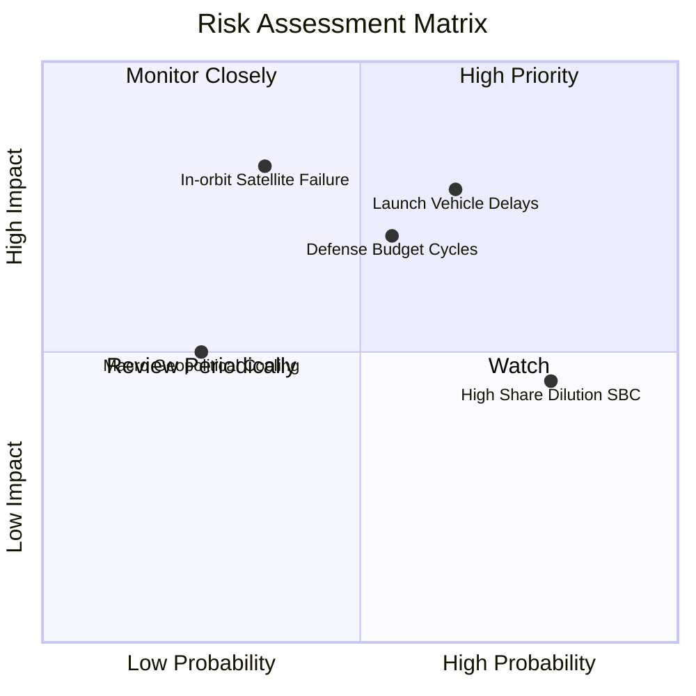

### 10.2 風險清單詳細分析

| # | 風險項目 | 發生機率 | 財務衝擊 | 風險評分 | 緩解措施與對策 |
|---|----------|----------|----------|----------|----------------|
| 1 | 🔴 **發射排程延宕** | 中偏高 (65%) | 高 (-15% 預期營收) | 🔴 8.0/10 | 採取多發射商分散策略（SpaceX、Rocket Lab 等多元火箭供應商簽約）。 |
| 2 | 🔴 **政府國防採購週期遲滯** | 中等 (55%) | 高 (-20% 營收成長) | 🔴 7.5/10 | 拓展民營企業、大宗商品、保險及國際民事機構收入，分散單一客戶集中度。 |
| 3 | 🟡 **SBC 股權過度稀釋** | 高 (80%) | 中 (-3% EPS 年稀釋) | 🟡 6.5/10 | 自由現金流轉正後，管理層應承諾未來盈餘啟動小規模股份回購抵消稀釋。 |
| 4 | 🟡 **早期在軌微衛星失效** | 低偏中 (35%)| 極高 (-$50M 資產減損)| 🟡 6.2/10 | 敏捷航太採用低成本、快速迭代冗餘設計，單星失效不影響全星座運作。 |

---

## 11. 投資建議

### 11.1 最終綜合評級雷達圖

```
╔══════════════════════════════════════════════════════════════╗
║               PL 綜合基本面實力雷達診斷                      ║
╠══════════════════════════════════════════════════════════════╣
║ 業務模式獨佔性  9.0 ▓▓▓▓▓▓▓▓▓▓▓▓▓▓▓▓▓▓░░  🏆 無可匹敵的覆蓋頻次 ║
║ 營收加速動能    8.5 ▓▓▓▓▓▓▓▓▓▓▓▓▓▓▓▓▓░░░  🟢 TTM +44%, 季增 +58%║
║ 現金流量品質    7.5 ▓▓▓▓▓▓▓▓▓▓▓▓▓▓▓░░░░░  🟢 FCF 實質性轉正     ║
║ 資產負債表防禦  8.5 ▓▓▓▓▓▓▓▓▓▓▓▓▓▓▓▓▓░░░  🟢 淨現金 3.67 億美元 ║
║ 估值吸引力      7.0 ▓▓▓▓▓▓▓▓▓▓▓▓▓▓░░░░░░  🟡 具 25.4% 安全邊際  ║
║ 執行力與資本紀律7.5 ▓▓▓▓▓▓▓▓▓▓▓▓▓▓▓░░░░░  🟢 資本支出控管卓越   ║
╠══════════════════════════════════════════════════════════════╣
║ 綜合機構投資評分 8.0 ▓▓▓▓▓▓▓▓▓▓▓▓▓▓▓▓░░░░  🟢 買入評級 (Buy)    ║
╚══════════════════════════════════════════════════════════════╝
```

### 11.2 目標價與隱含報酬率

| 情境 | 機率 | 估值方法與核心依據 | 目標價 | 相對現價 ($17.50) 上行空間 |
|------|------|--------------------|--------|--------------------------|
| **🔴 悲觀情境** | 25% | 政府合約審批延遲，成長降至 18%，給予 8.0x EV/S | **$13.20** | -24.6%（最大下檔回撤） |
| **🟡 基準情境** | **55%** | **營收穩步復甦至 30%+，FCF 擴張，給予 11.5x EV/S** | **$23.50** | **+34.3%（主要 12 個月目標）**|
| **🟢 樂觀情境** | 20% | Pelican 與 Tanager 商業大獲成功，獲利井噴 13.0x EV/S | **$35.80** | +104.6% |
| **機率加權目標**| 100% | 綜合三情境期望值 ($13.2×25% + $23.5×55% + $35.8×20%) | **$23.38** | **+33.6%** |

### 11.3 買入時機與觸發因素

```
╔══════════════════════════════════════════════════════════════════╗
║                  ✅ 買入觸發因素 Checklist                      ║
╠══════════════════════════════════════════════════════════════════╣
║                                                                  ║
║  立即買入觸發條件（當前已符合）：                                ║
║  ✅ 股價自 2026 高點 $51.14 深度回檔逾 65%，投機泡沫徹底清洗完畢 ║
║  ✅ 當前市價 $17.50 低於三角加權合理價值 $23.46，MOS 達 25.4%    ║
║  ✅ FY2026 全年 FCF 正式翻正（$51.41M），破產與倒閉風險歸零      ║
║  ✅ 淨現金部位達 $3.67 億美元，抵禦總體高利率波動能力極強        ║
║                                                                  ║
║  後續加碼觸發條件（任一出現）：                                  ║
║  ☐ 季度 GAAP 營業利益正式轉正（預計 FY27 下半年）                ║
║  ☐ Pelican 首批商用高解析影像數據成功上線並獲得五角大廈首期增額 ║
║  ☐ 單季營收年增率突破 60% 且遞延收入按季增長 > 10%              ║
║                                                                  ║
║  減碼 / 停損觸發條件（任一出現）：                               ║
║  ☐ 連續兩季營收年增率跌破 15%                                    ║
║  ☐ 單季 FCF 重新轉為負 $25M 以上之失控燒錢狀態                   ║
║  ☐ 股價突破樂觀目標價 $35.00 以上（轉向估值過熱獲利了結）       ║
╚══════════════════════════════════════════════════════════════════╝
```

### 11.4 投資人適配度分析

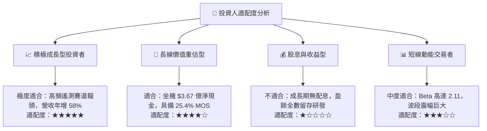

### 11.5 每季財報監控清單（Quarterly Watch List）

每次季報重點跟蹤之關鍵運營數據及預警閥值：

| 監控指標 | 最新基準值 (Jul '26) | 🟢 觸發加碼門檻 | 🔴 觸發警戒/減碼門檻 | 關鍵意涵 |
|----------|-------------------|----------------|-------------------|----------|
| **季度營收 YoY 成長** | **+58.14%** | > 40.0% | < 20.0% | 檢驗商業化放量動能是否延續 |
| **毛利率 (Gross Margin)** | **56.55%** | > 58.0% | < 50.0% | 檢驗數據複製邊際利潤率健康度 |
| **自由現金流 (FCF)** | **+$23.55M** (季) | 保持正向 > +$10M | 轉為負額 > -$15M | 檢驗公司自給自足生存能力 |
| **遞延營收 (Deferred Rev)**| **$281.0M** | > $300.0M | < $240.0M | 未來合約能見度與政府預算黏著度 |
| **資本支出 (CapEx)** | **-$29.39M** (季) | 單季 < $30M 且星網正常 | 單季 > $55M 且發射延遲 | 資本紀律失控與火箭運載成本攀升 |
| **SBC 佔營收比例** | **14.7%** (季) | 降至 < 12.0% | 攀升至 > 20.0% | 現有流通股權稀釋速度防線 |

### 11.6 反面論證：什麼會證明論點錯誤（What Would Change My Mind）

```
╔══════════════════════════════════════════════════════════════════╗
║              ⚠️ 論點失效條件（Disconfirming Evidence）           ║
╠══════════════════════════════════════════════════════════════════╣
║  本研究團隊在下列具體量化條件出現時，將毫不猶豫承認錯誤並降評：  ║
║                                                                  ║
║  1. 核心營收成長率連續兩季跌破 20.0%（證明 DaaS 護城河受侵蝕）   ║
║  2. 營業現金流轉負或全年度 FCF 再次回到負數（現金造血轉折破滅）  ║
║  3. 次世代 Pelican 星座發射嚴重受阻，導致交付遞延超過 3 個季度  ║
║  4. 國防情報巨頭（如 NGA）將核心監測合約轉向對手（如 BlackSky） ║
║  5. 年度股權激勵（SBC）失控放大，造成年流通股數稀釋率超過 6.0% ║
║                                                                  ║
║  👉 只要上述條件未被觸發，當前 $17.50 之股價即為極具吸引力之買點 ║
╚══════════════════════════════════════════════════════════════════╝
```

---
> **免責聲明**：本報告為依據客觀財務數據所撰寫之深度機構級研究報告，僅供投資研究參考，不構成任何買賣要約或投資決策背書。市場有風險，投資需獨立審慎評估。