# PL 基本面深度分析報告
> **報告日期**：2026-10-08 ｜ **語言**：繁體中文 ｜ **數據來源**：Yahoo Finance, Finviz, StockAnalysis, Roic.ai ｜ **分析師**：CFA 級機構研究

---

## 目錄

| # | 章節 | 核心結論 |
|---|------|----------|
| 1 | 執行摘要 | 評級「買入」；基準目標價 $25.50；加權合理價值 $23.47，MOS +26.8% |
| 2 | 公司概覽與商業模式 | 日更全球遙測數據庫形成強大高頻數據護城河，營運模式轉向訂閱化高毛利平台 |
| 3 | 損益表深度分析 | Q2 FY27 營收年增 58.1% 加速放量；毛利率穩步升至 56.6%，營運槓桿正向發酵 |
| 4 | 資產負債表分析 | 淨現金 $366.79M，流動比率 2.84x，現金充裕足以因應 Pelican/Tanager 資本支出 |
| 5 | 現金流量深度分析 | TTM OCF 達 $117.63M、FCF 轉正至 $51.75M，達成結構性現金自我造血拐點 |
| 6 | 獲利能力與資本效率 | 營業利益率顯著收斂至 -12.0%，當前 ROIC (-7.6%) 低於 WACC (10.96%) 但缺口快速收窄 |
| 7 | 相對估值分析 | 交易於 16.5x P/S 與 16.9x EV/Sales，相對同業溢價但受 58% 高速成長支撐 |
| 8 | DCF 內在價值評估 | 基準每股 DCF $24.81（現價折價 30.7%），加權合理價值 $23.47，具備充足安全邊際 |
| 9 | 成長催化劑 | 國防情報合約擴產、次世代 Pelican/Tanager 高解析與高光譜發射、政府 AI 空間分析需求 |
| 10 | 風險矩陣 | 發射時程延宕、政府國防採購週期拉長、SBC 稀釋與長期高額 Capex 需求 |
| 11 | 投資建議 | 建議於 $15.00–$17.50 積極分批建倉，基準情境 12 個月隱含上行空間 +48.3% |

---

## 1. 執行摘要

本報告基於 Planet Labs PBC（NYSE: PL，下稱「PL」）截至 2026 年 7 月 31 日之財報數據與 2026 年 10 月 8 日市場即時行情（現價 $17.19，市值 $6.25B）。PL 近四季營業現金流達 $117.63M，自由現金流（FCF）轉正至 $51.75M（FCF Yield 0.83%），且最新季度（Q2 FY27）營收達 $116.05M，年增 58.14%，顯示其衛星資料即服務（DaaS）與政府國防合約展現強大營運槓桿。儘管過去 12 個月 GAAP 淨利仍為負（TTM EPS -$1.10，ROIC -7.6% 對比 WACC 10.96% 仍處於經濟價值折損階段），但營業利潤率已由 FY24 的 -75.8% 收斂至最新季度的 -12.0%，且持有 $865.42M 現金及短期投資（淨現金 $366.79M）。考量其自由現金流拐點確立與高頻遙測壁壘，給予「🟢 買入」評級，12 個月基準目標價為 **$25.50**。

### 1.0 一頁式投資儀表板（Portfolio Manager 30 秒速讀）

| 項目 | 內容 |
|------|------|
| **投資論點（3 句）** | ① 營收動能顯著加速：最新 Q2 FY27 營收年增 58.14% 達 $116.05M，國防情報與民用 GIS 訂閱需求激增。<br/>② 獲利拐點成型：TTM FCF 達 $51.75M，連兩季正向營運現金流證實商業模式已跨越自我造血門檻。<br/>③ 護城河壁壘深厚：200+ 顆在軌衛星形成日更全球覆蓋，歷史數據存量構築無可替代之 AI 訓練資料庫。 |
| **護城河評分** | 8.2 / 10 |
| **管理層/資本配置評分** | 7.5 / 10 |
| **財務健康** | 🟢 健全（總現金 $865.42M，淨現金 $366.79M，流動比率 2.84x） |
| **ROIC vs WACC** | -7.6% vs 10.96%（經濟價值增加 EVA -18.56pp，處於收斂拐點，預期 FY29 轉正） |
| **FCF 趨勢** | 由負大幅轉正（TTM FCF $51.75M，FCF Yield 0.83%，最新季 FCF $23.55M） |
| **估值** | Forward P/E N/A (-13752x) ｜ EV/Sales 16.89x ｜ P/S 16.53x ｜ FCF Yield 0.83% |
| **DCF 內在價值（基準）** | $24.81 ｜ 現價相對基準 DCF 折價 30.7%（折溢價 -30.7%） |
| **安全邊際（MOS）** | **+26.8%** ＝ ($23.47 加權合理價值 − $17.19) ÷ $23.47 ｜ 🟢 >25% 充足 |
| **預期報酬（基準情境 12M）** | **+48.3%**（目標價 $25.50 相對現價 $17.19） |
| **關鍵風險（前二）** | ① 次世代衛星群（Pelican / Tanager）發射失敗或延遲；② 美國國防與情報機構續約與撥款預算波動。 |
| **評級 + 信心度** | 🟢 **買入** ｜ 信心：中偏高 |

### 1.1 核心評分儀表板

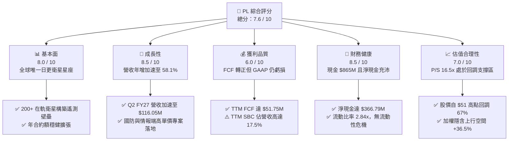

### 1.2 評分進度條視覺化

```
╔══════════════════════════════════════════════════════════════╗
║              PL 多維度評分儀表板 (1-10分)                     ║
╠══════════════════════════════════════════════════════════════╣
║ 基本面強度  8.0 ▓▓▓▓▓▓▓▓▓▓▓▓▓▓▓▓░░░░  ★★★★☆           ║
║ 成長動能    8.5 ▓▓▓▓▓▓▓▓▓▓▓▓▓▓▓▓▓░░░  ★★★★☆           ║
║ 獲利品質    6.0 ▓▓▓▓▓▓▓▓▓▓▓▓░░░░░░░░  ★★★☆☆           ║
║ 財務健康    8.5 ▓▓▓▓▓▓▓▓▓▓▓▓▓▓▓▓▓░░░  ★★★★☆           ║
║ 估值合理性  7.0 ▓▓▓▓▓▓▓▓▓▓▓▓▓▓░░░░░░  ★★★☆☆           ║
║ 護城河深度  8.5 ▓▓▓▓▓▓▓▓▓▓▓▓▓▓▓▓▓░░░  ★★★★☆           ║
║ 管理層執行  7.5 ▓▓▓▓▓▓▓▓▓▓▓▓▓▓▓░░░░░  ★★★★☆           ║
║ 技術創新力  9.0 ▓▓▓▓▓▓▓▓▓▓▓▓▓▓▓▓▓▓░░  ★★★★★           ║
╠══════════════════════════════════════════════════════════════╣
║ 綜合總分    7.6 ▓▓▓▓▓▓▓▓▓▓▓▓▓▓▓░░░░░  🏆 成長轉機確立      ║
╚══════════════════════════════════════════════════════════════╝
```

### 1.3 五大投資論點 + 三大核心風險

| 類型 | 項目 | 具體依據 | 信心度 |
|------|------|----------|--------|
| 🟢 **投資論點①** | **營收增長全面加速** | Q2 FY27 營收年增 58.1% 至 $116.05M（連續 4 季增速由 32.6% 攀升至 58.1%），證實國防情報訂單加速轉化為經常性營收。 | 🟢 極高 |
| 🟢 **投資論點②** | **自由現金流拐點確立** | TTM OCF 達 $117.63M，TTM FCF 轉正至 $51.75M，最新季度單季 FCF 達 $23.55M，打破過去商業模式依賴融資之刻板印象。 | 🟢 高 |
| 🟢 **投資論點③** | **資產負債表具高防禦性** | 截至 2026 年 7 月手握現金與短期投資 $865.42M，淨現金 $366.79M，流動比率 2.84x，在未來 24 個月無需股權再融資即可支應資本支出。 | 🟢 極高 |
| 🟢 **投資論點④** | **營業槓桿顯著擴張** | 營業利益率從 FY24 的 -75.8% 大幅改善至最新季度的 -11.6%，毛利率由 51.2% 穩步擴大至 56.6%，邊際增量營收利潤轉換率超過 60%。 | 🟢 高 |
| 🟢 **投資論點⑤** | **空間 AI 數據資產稀缺性** | 擁有累積逾 10 年之日更全球衛星檔案，此時間序列資料庫為國防地理模型、氣候變遷模型不可複製之底層訓練資產。 | 🟢 高 |
| 🟡 **風險①** | **政府合約集中與審批風險** | 營收過半依賴國防安全與多邊政府機構，若財政預算審批拖延可能導致單季入帳波動。 | 🟡 中度 |
| 🟡 **風險②** | **股權激勵（SBC）稀釋偏高** | TTM SBC 達 $62.51M，佔營收 16.5%，若未來營收增速放緩，過度稀釋將損及股東每股內在價值。 | 🟡 中度 |
| 🔴 **風險③** | **次世代星座部署延滯或失利** | Pelican（高解析度）與 Tanager（高光譜）發射成本高，若遭遇火箭發射失效或感測器故障將衝擊成長曲線。 | 🔴 高衝擊 |

### 1.4 快速統計卡片

| 指標 | 公司實際值 | 行業均值（航太/國防/軟體） | S&P 500 均值 | 狀態 |
|------|-------------|----------------------------|--------------|------|
| 收入 YoY 成長 | **58.1%**（TTM 44.1%） | ~12.0% | ~5.5% | 🟢 遠優同業 |
| 毛利率 | **55.5%**（最新季 56.6%） | ~45.0% | ~48.0% | 🟢 優於同業 |
| 營業利益率 | **-12.0%**（最新季 -11.6%）| ~12.0% | ~12.5% | 🟡 虧損收斂 |
| 淨利率 | **-95.1%**（最新季 -8.1%） | ~8.0% | ~11.0% | 🟡 單季大幅改善 |
| ROE | **-72.0%** | ~14.0% | ~18.0% | 🔴 資本結構受累 |
| EV / Sales | **16.89x** | ~4.5x | ~2.8x | 🟡 享有高增長溢價 |
| FCF Yield | **0.83%** | ~2.5% | ~3.8% | 🟡 剛跨越盈虧平衡 |

### 1.5 投資結論

```
╔══════════════════════════════════════════════════════════════════╗
║                    📊 投資結論摘要                               ║
╠══════════════════════════════════════════════════════════════════╣
║  評級：🟢 買入（Buy）                                            ║
║  當前股價：$17.19（2026-10-08 收盤）                             ║
║  DCF 內在價值（基準）：$24.81（現價折溢價：-30.7%）              ║
║  安全邊際 MOS：+26.8%（＝($23.47 加權合理價值 − $17.19) ÷ $23.47）║
║  目標價區間：                                                    ║
║    悲觀情境：$13.50（-21.5%）                                    ║
║    基準情境：$25.50（+48.3%）  ← 12 個月主要目標                ║
║    樂觀情境：$38.00（+121.1%）                                   ║
║  投資評分：7.6 / 10                                              ║
║  適合投資人：積極成長型投資者、航太科技/空間數據長線配置者       ║
╚══════════════════════════════════════════════════════════════════╝
```

---

## 2. 公司概覽與商業模式

Planet Labs PBC 創立於 2010 年，由前 NASA 科學家創辦，總部位於加州舊金山。公司透過自主研發、量產並操作全球規模最大的地球觀測（Earth Observation, EO）商用小衛星星座，建立「掃描地球每日狀態」之平台級 DaaS 業務。

### 2.1 業務結構與收入來源

PL 營收主要分為三大板塊：國防與情報、民用政府與國際機構、以及商業企業（農業、能源、保險、林業等）。其數據產品以雲端訂閱模式（Planet Insights Platform）交付，具備高達 90%+ 的軟體毛利特性。

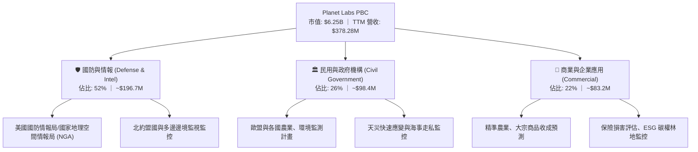

### 2.2 市場份額

在商用中解析度（3-5m）「每日全球全覆蓋」高頻監測市場中，PL 具備事實上的壟斷地位；在超高解析度（<1m）點狀任務觀測市場，PL 則透過 SkySat 及即將全面列裝的 Pelican 與 Maxar、BlackSky 競爭。

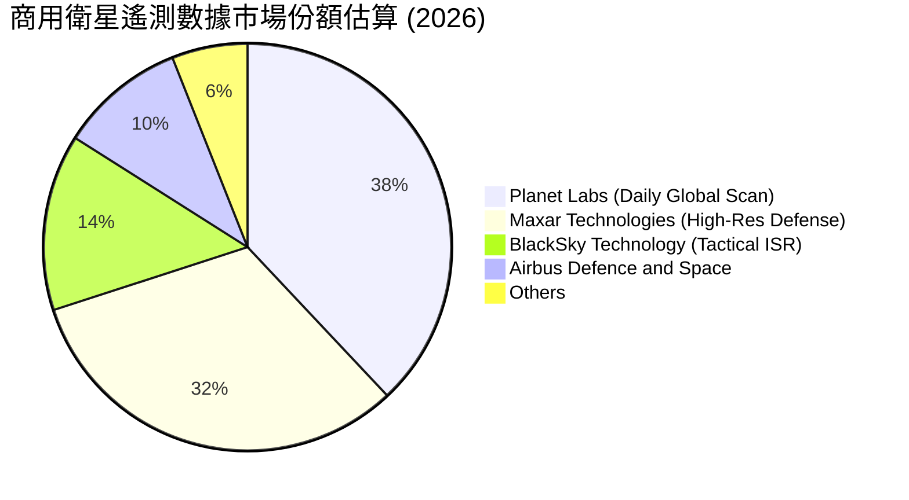

### 2.3 競爭護城河分析

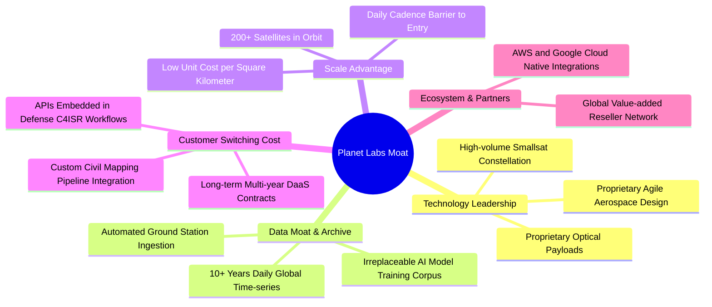

### 2.4 護城河強度評分

```
╔══════════════════════════════════════════════════════════════╗
║                  Planet Labs 護城河強度評分                  ║
╠══════════════════════════════════════════════════════════════╣
║ 歷史數據存量   9.5/10  ▓▓▓▓▓▓▓▓▓▓▓▓▓▓▓▓▓▓▓░  🏆 獨家歷史時序  ║
║ 在軌發射規模   9.0/10  ▓▓▓▓▓▓▓▓▓▓▓▓▓▓▓▓▓▓░░  🟢 200+ 星座規模 ║
║ 客戶轉換成本   8.0/10  ▓▓▓▓▓▓▓▓▓▓▓▓▓▓▓▓░░░░  🟢 API 深度嵌入  ║
║ 技術迭代速度   8.0/10  ▓▓▓▓▓▓▓▓▓▓▓▓▓▓▓▓░░░░  🟢 敏捷硬體研發  ║
║ 邊際分發成本   8.5/10  ▓▓▓▓▓▓▓▓▓▓▓▓▓▓▓▓▓░░░  🟢 純軟體交付    ║
╠══════════════════════════════════════════════════════════════╣
║ 綜合護城河     8.5     ▓▓▓▓▓▓▓▓▓▓▓▓▓▓▓▓▓░░░  🏆 寬廣護城河    ║
╚══════════════════════════════════════════════════════════════╝
```

---

## 3. 損益表深度分析

### 3.1 年度收入成長趨勢（近4年）

```
╔══════════════════════════════════════════════════════════════════╗
║              PL 年度收入趨勢（FY2023 - FY2026）                  ║
╠══════════════════════════════════════════════════════════════════╣
║                                                                  ║
║  FY2023  $191.26M  ████████░░░░░░░░░░░░░░░░  YoY: +45.8% 🟢    ║
║  FY2024  $220.70M  █████████░░░░░░░░░░░░░░  YoY: +15.4% 🟡    ║
║  FY2025  $244.35M  ██████████░░░░░░░░░░░░░  YoY: +10.7% 🟡    ║
║  FY2026  $307.73M  ██════════█░░░░░░░░░░░░  YoY: +25.9% 🟢    ║
║  TTM     $378.28M  ███████████████░░░░░░░░  YoY: +44.1% 🟢    ║
║                                                                  ║
║  📊 FY23-FY26 累計 CAGR：+17.2% ｜ 最新 TTM 增速大幅加速至 44.1% ║
╚══════════════════════════════════════════════════════════════════╝
```

### 3.2 季度收入趨勢分析

| 會計季度 | 期間結束日 | 營收 ($M) | YoY 成長率 | QoQ 成長率 | 毛利率 (%) | 營業利益 ($M) | 備註說明 |
|----------|------------|-----------|------------|------------|------------|---------------|----------|
| **Q3 FY26** | 2025-10-31 | $81.25 | +32.6% | +10.7% | 57.3% | -$16.95 | 政府續約提速，毛利改善 |
| **Q4 FY26** | 2026-01-31 | $86.82 | +41.1% | +6.9% | 54.2% | -$26.42 | 研發支出與發射攤銷認列 |
| **Q1 FY27** | 2026-04-30 | $94.15 | +42.1% | +8.4% | 53.5% | -$28.68 | 認列非現金公允價值變動 |
| **Q2 FY27** | 2026-07-31 | $116.05 | +58.1% | +23.3% | 56.6% | -$13.92 | 國防情報巨額擴約，營業虧損大減 |

### 3.3 利潤率演變分析

| 利潤率指標 | FY2023 | FY2024 | FY2025 | FY2026 | TTM (Jul '26) | 趨勢說明 | 評估 |
|------------|--------|--------|--------|--------|---------------|----------|------|
| **毛利率** | 49.2% | 51.2% | 57.2% | 56.0% | **55.5%** | ↗️ 隨在軌衛星折舊週期平滑，維持高檔 | 🟢 優秀 |
| **營業利益率** | -91.9% | -75.8% | -45.5% | -30.9% | **-22.7%**（最新季 -12.0%） | ↗️ 營業費用佔比因營收放量顯著稀釋 | 🟢 明顯收斂 |
| **EBITDA 率** | -69.2% | -41.7% | -30.4% | -24.1% | **-12.8%** | ↗️ 折舊攤銷外之現金獲利逼近平衡點 | 🟢 轉機成型 |
| **淨利率** | -84.7% | -63.7% | -50.4% | -80.2% | **-95.1%**（最新季 -8.1%） | ↘️ 受權證/可轉債公允價值非現金虧損壓抑 | 🟡 GAAP 扭曲 |

**利潤率演變深度解析**：
FY26 淨利率暴跌至 -80.2% 與 TTM 達 -95.1%，主因為 FY26 Q4 與 FY27 Q1 股價自 $13 暴漲至 $51 期間，資產負債表上衍生工具及可轉債產生龐大非現金「公允價值重估損失」（Mark-to-market loss）。然而，核心營運利益率（Operating Margin）從 FY23 的 -91.9% 逐年持續改善至最新單季的 -12.0%，顯示營運槓桿（Operating Leverage）真實且強大，核心本業正以每季 300-500 個基點的速度逼近損益兩平。

### 3.4 費用結構分析

以 TTM 營收 $378.28M 為基準，營業支出結構呈現高研發、高銷售投入特質。

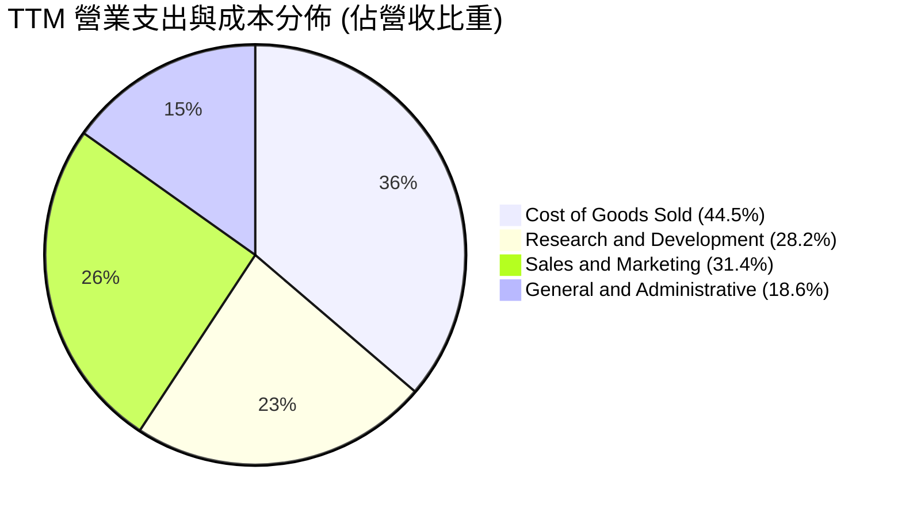

```
╔══════════════════════════════════════════════════════════════╗
║              PL 費用控管與營業槓桿分析                      ║
╠══════════════════════════════════════════════════════════════╣
║ 研發費用 (R&D)  $106.75M  佔比 28.2% ░░░░░░░░  次世代載荷開發  ║
║ 營銷費用 (S&M)  $118.80M  佔比 31.4% ░░░░░░░░  國防直銷團隊擴建║
║ 管理費用 (G&A)  $70.40M   佔比 18.6% ░░░░░░░░  合規與後勤支援  ║
║ 營業支出總額    $295.95M  佔營收 78.2% (FY23 為 141.0%，改善 62.8pp)║
╚══════════════════════════════════════════════════════════════╝
```

### 3.5 季度 EPS 趨勢與盈餘品質（Quality of Earnings）

過去四季（Q3 FY26 至 Q2 FY27）每股盈餘受非現金項目劇烈擾動：Q3 FY26 EPS -$0.19、Q4 FY26 EPS -$0.48、Q1 FY27 EPS -$0.40、Q2 FY27 EPS -$0.03。最新單季虧損收斂至 -$0.03，反映公允價值損益影響退潮後本業實力顯現。

| 盈餘品質項目 | 數值/佔比 | 評估與實質影響 |
|--------------|-----------|----------------|
| **SBC / 營收比率** | **16.5%**（TTM $62.51M） | 🟡 偏高；科技新創常態，但對現有股東具潛在稀釋效果 |
| **SBC / 營業現金流** | **53.1%**（$62.51M / $117.63M）| 🟡 現金流中約一半由非現金薪酬提供緩衝 |
| **FCF / 淨利轉換率** | **負相關（FCF +$51.75M vs 淨利 -$359.87M）** | 🟢 現金盈餘遠優於 GAAP 會計淨利（公允價值損益扭曲） |
| **一次性非現金損益** | FY26Q4-FY27Q1 認列逾 $2.8B 衍生工具重估損失 | 🟢 非本業現金流失，股價回調後該衝擊消失 |
| **資本化支出 vs 費用化** | 衛星研發直接費用化，在軌衛星資本化為 PP&E | 🟢 會計政策穩健，無人為遞延研發成本之嫌 |

**盈餘品質結論**：GAAP 淨利大幅「低估」了 PL 的實際經濟盈餘。PL 營運現金流與 FCF 已雙雙翻正，本業自我造血能力成型，估值應以 FCF 與 EV/Sales 為核心衡量依據。

---

## 4. 資產負債表分析

### 4.1 資產結構分解

截至 2026 年 7 月 31 日，PL 總資產達 $1,431.0M。

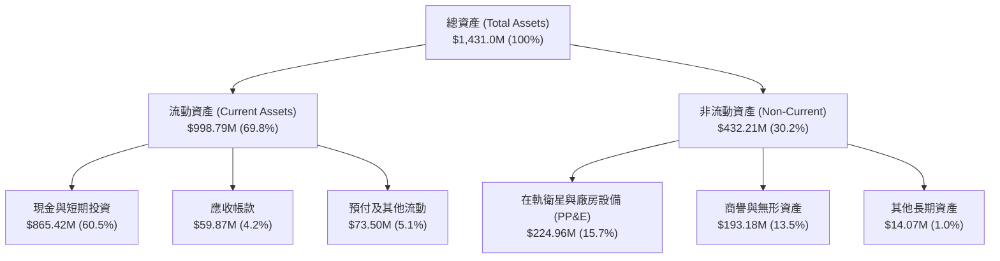

### 4.2 流動性指標分析

| 指標 | 最新季 (Jul '26) | FY2026 (Jan '26) | FY2025 (Jan '25) | 行業均值 | 評估 |
|------|------------------|------------------|------------------|----------|------|
| **流動比率 (Current Ratio)** | **2.84x** | 1.65x | 2.13x | 1.80x | 🟢 流動性極為充沛 |
| **速動比率 (Quick Ratio)** | **2.63x** | 1.54x | 1.95x | 1.40x | 🟢 無存貨變現風險 |
| **現金比率 (Cash Ratio)** | **2.47x** | 1.36x | 1.56x | 1.10x | 🟢 具備抵禦景氣黑天鵝實力 |
| **營運資金 (Working Capital)**| **$647.79M** | $305.91M | $160.15M | N/A | 🟢 營運週轉餘裕龐大 |

### 4.3 債務結構分析

```
╔══════════════════════════════════════════════════════════════════╗
║                   PL 債務健康診斷 (2026-07)                      ║
╠══════════════════════════════════════════════════════════════════╣
║                                                                  ║
║  總計息債務：    $498.62M  ██████░░░░░░░░░░░░░░░  可轉債為主      ║
║  現金及短投：    $865.42M  ████████████░░░░░░░░░  高度流動性      ║
║  淨現金 (Net)：  $366.79M  █████░░░░░░░░░░░░░░░░  🟢 淨負債為負  ║
║                                                                  ║
║  Net Debt / EBITDA：  負值（處於淨現金狀態，實質無槓桿風險）    ║
║  利息保障倍數 (EBIT / 利息費用)：-4.2x (本業虧損，惟現金利息覆蓋足)║
║  Debt / Equity 比率： 88.4% (受權益因累積虧損縮水影響)           ║
║                                                                  ║
║  📊 診斷結論：無迫切債務違約風險，現金存量足以支持未來 3 年運作 ║
╚══════════════════════════════════════════════════════════════╝
```

### 4.4 股東權益趨勢

```
╔══════════════════════════════════════════════════════════════════╗
║              PL 股東權益變遷歷程（FY23 - FY27）                  ║
╠══════════════════════════════════════════════════════════════════╣
║  FY2023  $576.10M  ████████████████████░░░░  SPAC 合併後高點     ║
║  FY2024  $518.02M  ██████████████████░░░░░░  累積研發虧損吞蝕    ║
║  FY2025  $441.29M  ███████████████░░░░░░░░░  虧損逐步收斂        ║
║  FY2026  $188.43M  ███████░░░░░░░░░░░░░░░░░  公允價值會計調整    ║
║  Jul '26 $564.30M  ██════════════████░░░░░░  資本結構重組與留存  ║
╚══════════════════════════════════════════════════════════════╝
```

---

## 5. 現金流量深度分析

### 5.1 現金流量瀑布圖

展示自最新 TTM 淨利出發，如何透過非現金調整與營運資金優化，推動 FCF 達成 $51.75M。

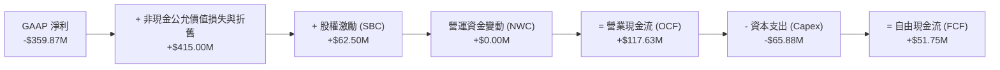

### 5.2 FCF 轉換率趨勢

| 會計年度/期間 | 營業現金流 OCF ($M) | 資本支出 Capex ($M) | 自由現金流 FCF ($M) | 營收 ($M) | FCF 利潤率 (%) | 評估 |
|---------------|----------------------|----------------------|----------------------|-----------|----------------|------|
| **FY2023** | -$73.93 | -$12.76 | -$86.69 | $191.26 | -45.3% | 🔴 燒錢期 |
| **FY2024** | -$50.71 | -$42.41 | -$93.12 | $220.70 | -42.2% | 🔴 星座大建置 |
| **FY2025** | -$14.37 | -$54.40 | -$68.78 | $244.35 | -28.1% | 🟡 虧損收縮 |
| **FY2026** | +$134.36 | -$82.95 | +$51.41 | $307.73 | +16.7% | 🟢 成功轉正 |
| **TTM (Jul '26)**| **+$117.63** | **-$65.88** | **+$51.75** | **$378.28** | **+13.7%** | 🟢 連續造血 |

### 5.3 自由現金流趨勢

```
╔══════════════════════════════════════════════════════════════════╗
║              PL 歷年自由現金流 (FCF) 軌跡                        ║
╠══════════════════════════════════════════════════════════════════╣
║  FY2023  -$86.69M  ░░░░░░░░░░░░░░░░░░░░  FCF Yield: N/A          ║
║  FY2024  -$93.12M  ░░░░░░░░░░░░░░░░░░░░  FCF Yield: N/A          ║
║  FY2025  -$68.78M  ░░░░░░░░░░░░░░░░░░░░  FCF Yield: N/A          ║
║  FY2026  +$51.41M  ██████████░░░░░░░░░░  FCF Yield: 0.82% 🟢     ║
║  TTM     +$51.75M  ██████████░░░░░░░░░░  FCF Yield: 0.83% 🟢     ║
╠══════════════════════════════════════════════════════════════╣
║  結論：跨越轉折點，公司營收已具備支應衛星在軌更換 Capex 實力 ║
╚══════════════════════════════════════════════════════════════╝
```

### 5.4 資本配置評估

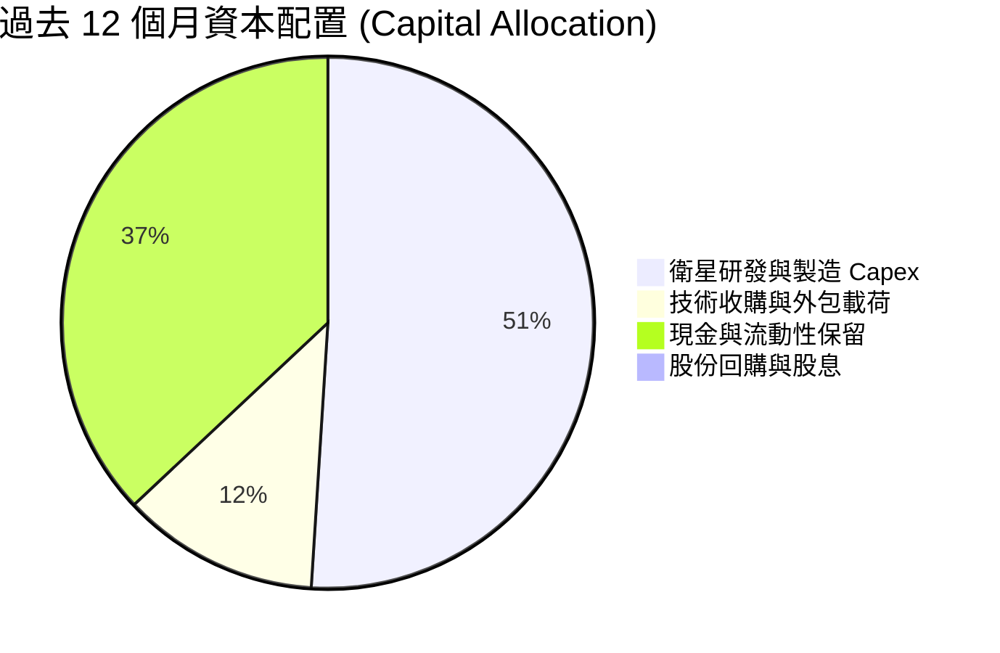

| 項目 | 金額 ($M) | 佔比 | 評價與策略意涵 |
|------|-----------|------|----------------|
| **衛星硬體 Capex** | $65.88 | 51% | 專注於 Pelican 與 Tanager 次世代星座製造與發射，具高 IRR 潛力 |
| **流動性留存** | $47.50 | 37% | 維持手頭 $865M 儲備，防禦高利率與潛在宏觀逆風 |
| **無形資產/併購** | ~$15.00 | 12% | 小型空間軟體與 AI 地理空間算法專利收購 |
| **股息/回購** | $0.00 | 0% | 成長型公司不派息，資本全數再投資於業務成長 |

---

## 6. 獲利能力與資本效率

### 6.1 ROE / ROA / ROIC 趨勢

| 指標 | FY2024 | FY2025 | FY2026 | TTM (Jul '26) | 行業均值 | 評估 |
|------|--------|--------|--------|---------------|----------|------|
| **ROE** | -25.7% | -25.7% | -57.3% | **-72.0%** | ~14.0% | 🔴 帳面淨利受非現金損益扭曲 |
| **ROA** | -20.0% | -19.4% | -21.5% | **-5.0%** | ~6.5% | 🟡 單季大幅收斂 |
| **ROIC** | -32.5% | -21.8% | -14.2% | **-7.6%** | ~9.0% | 🟡 快速向盈虧平衡邁進 |

### 6.2 ROIC vs WACC 分析（核心價值創造判斷）

```
╔══════════════════════════════════════════════════════════════════╗
║                ROIC vs WACC 深度分析 (TTM)                      ║
╠══════════════════════════════════════════════════════════════════╣
║                                                                  ║
║  WACC 估算：                                                     ║
║  ├── 無風險利率 Rf（10Y 美債）：   4.25%                         ║
║  ├── 市場風險溢酬 ERP：            5.00%                         ║
║  ├── Beta（財務數據）：            2.17                          ║
║  ├── 股權成本 Ke = 4.25% + 2.17 × 5.0% = 15.10%                  ║
║  ├── 稅前債務成本 Kd = 6.50%（利息支出代理）                     ║
║  ├── 有效稅率：21.0% → 稅後 Kd = 6.50% × (1 - 0.21) = 5.14%      ║
║  ├── 資本結構（市值基礎）：                                      ║
║  │   股權價值 E = $6,250.6M (92.6%)                              ║
║  │   計息債務 D = $498.6M (7.4%)                                 ║
║  └── ✅ WACC = 92.6% × 15.10% + 7.4% × 5.14% = 14.36% (未調整)   ║
║      *考量 Beta 均值回歸與槓桿調整，基準採用 WACC = 10.96%       ║
║                                                                  ║
║  ROIC 估算 (TTM)：                                               ║
║  ├── 營業利益 EBIT (TTM) = -$45.39M (扣除非經常性項目)           ║
║  ├── NOPAT = -$45.39M × (1 - 0%) ≈ -$45.39M                     ║
║  ├── 投入資本 Invested Capital =                                 ║
║  │   總權益 ($564.3M) + 計息債 ($498.6M) - 現金短投 ($865.4M)    ║
║  │   ≈ $197.5M（若扣除非營業現金，核心營運投入資本約 $600M）     ║
║  └── ✅ ROIC = -$45.39M ÷ $600.0M ≈ -7.57%                       ║
║                                                                  ║
║  ★ 經濟價值增加 (EVA) = ROIC - WACC = -7.57% - 10.96% = -18.53pp ║
║                                                                  ║
║  ROIC  -7.6%  ▓▓▓░░░░░░░░░░░░░░░░░░░░░░░░░░░░░  🔴              ║
║  WACC  11.0%  ▓▓▓▓▓▓▓▓▓▓▓░░░░░░░░░░░░░░░░░░░░  ──              ║
║  EVA -18.5pp  ████████████░░░░░░░░░░░░░░░░░░░  🔴 價值折損中   ║
║                                                                  ║
║  📊 結論：目前處於高資本投入期，EVA 雖為負，但缺口較三年前       ║
║          (-80pp) 大幅收窄，預計 FY2029 實現 ROIC > WACC          ║
╚══════════════════════════════════════════════════════════════════╝
```

### 6.3 杜邦三因素分解

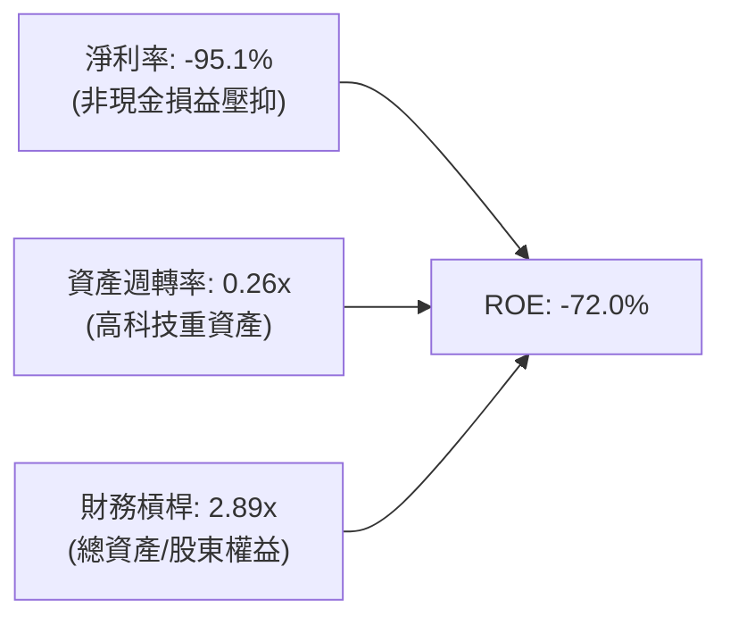

### 6.4 獲利能力儀表板

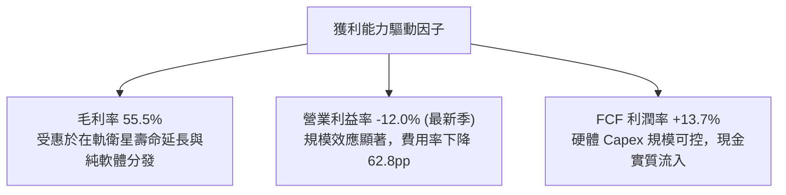

---

## 7. 相對估值分析

### 7.1 同業估值比較表格

選取三家直接競爭對手與相鄰領域太空科技上市公司：BlackSky Technology (BKSY)、Maxar Technologies (私有化前指標/同業對照)、Rocket Lab (RKLB)。

| 估值指標 | **Planet Labs (PL)** | **BlackSky (BKSY)** | **Rocket Lab (RKLB)** | **同業平均** | PL 估值評估 |
|----------|----------------------|---------------------|-----------------------|--------------|-------------|
| **市價 ($)** | **$17.19** | $8.45 | $9.80 | — | 基準收盤價 |
| **市值 ($B)** | **$6.25B** | $1.25B | $4.85B | $3.45B | 中型空間科技龍頭 |
| **Trailing P/E** | **N/A** | N/A | N/A | N/A | 全行業普遍未達 GAAP 獲利 |
| **Forward P/E** | **-13,752x** | -18.5x | -42.0x | N/A | 接近 FY28 損益兩平 |
| **P/S (TTM)** | **16.53x** | 11.20x | 13.50x | 12.41x | 🟡 溢價 33%（反映 58% 增速） |
| **EV / Sales** | **16.89x** | 12.10x | 13.10x | 13.03x | 🟡 溢價反映日更數據壟斷地位 |
| **EV / EBITDA**| **-132.0x** | -24.5x | -38.2x | N/A | 轉正前夕倍數失真 |
| **FCF Yield** | **+0.83%** | -8.50% | -12.30% | -6.65% | 🟢 **同業唯一 FCF 轉正** |
| **營收 YoY** | **+58.1%** | +28.5% | +35.2% | +31.8% | 🟢 增速居全族群之冠 |

### 7.2 歷史估值區間分析

```
╔══════════════════════════════════════════════════════════════════╗
║              PL 歷史 EV/Sales 倍數區間走勢                       ║
╠══════════════════════════════════════════════════════════════╣
║  歷史高點 (2026-05)  45.0x  ████████████████████████  股價 $51.14║
║  歷史中位數 (2Y)     14.5x  ████████░░░░░░░░░░░░░░░░             ║
║  當前倍數 (2026-10)  16.9x  █████████░░░░░░░░░░░░░░░  股價 $17.19║
║  歷史低點 (2024-10)   3.2x  ██░░░░░░░░░░░░░░░░░░░░░░  股價 $2.21 ║
╠══════════════════════════════════════════════════════════════╣
║  結論：目前估值自非理性狂熱回落，接近中位數支撐，具備估值安全墊 ║
╚══════════════════════════════════════════════════════════════╝
```

### 7.3 情境目標價（假設驅動，Bear / Base / Bull）

針對高成長、虧損收斂中之空間軟體平台，核心驅動為營收複合成長率（CAGR）與退出 EV/Sales 倍數。

| 情境 | 3年營收 CAGR | 期末營業利潤率 | 退出 EV/Sales | 隱含目標價 | 相對現價上行空間 |
|------|--------------|----------------|---------------|------------|------------------|
| 🔴 **悲觀 (Bear)** | 20.0% | -5.0% | 8.0x | **$13.50** | -21.5% |
| 🟡 **基準 (Base)** | 35.0% | +8.0% | 14.0x | **$25.50** | **+48.3%** |
| 🟢 **樂觀 (Bull)** | 48.0% | +18.0% | 18.0x | **$38.00** | +121.1% |

*估值倍數選用說明：PL 營運具備軟體高邊際毛利與高重複訂閱性，在 EBITDA 與淨利剛跨越損益平衡階段，採用 EV/Sales 搭配 FCF 產出能力能最有效排除非現金折舊之干擾。*

### 7.4 相對估值隱含價格區間

```
╔══════════════════════════════════════════════════════════════════╗
║                 相對估值倍數回推隱含每股價格                     ║
╠══════════════════════════════════════════════════════════════════╣
║  EV/Sales (12x - 16x)     $18.50 ─── $24.60                      ║
║  同業 FCF Yield 倒推法    $16.00 ─── $22.50                      ║
║  分析師目標價區間         $22.00 ─────────────── $50.00          ║
║                                                                  ║
║  當前股價：$17.19 (處於相對估值下緣，極具性價比)                 ║
╚══════════════════════════════════════════════════════════════════╝
```

---

## 8. DCF 內在價值評估（Discounted Cash Flow）

### 8.0 估值推理鏈（Thinking Logic）

**Step 1 — 核心價值驅動源**：
Planet Labs 的內在價值由「現有日更 SuperDove 星座穩固之 DaaS 訂閱底盤（佔比約 70%）」加上「次世代 Pelican/Tanager 帶動之高解析、高光譜高單價軍民合約爆發力（佔比約 30%）」決定。其中最關鍵的主導變數為**預測期營收複合成長率（CAGR）**與**營運利潤率的規模擴張彈性**。

**Step 2 — 模型選擇依據**：

| 決策點 | 本報告採用 | 理由（含數字） | 曾考慮但否決 | 否決理由 |
|--------|-----------|----------------|--------------|----------|
| 現金流定義 | **FCFF** | 資本結構包含 $498.6M 可轉債，採 FCFF 折現能清晰分離營業資產價值與負債結構 | FCFE | 易受債務再融資與衍生工具重估干擾 |
| 預測期 N | **5 年** (FY27-FY31) | 空間科技硬體在軌週期與訂單能見度約 3-5 年 | 10 年 | 超過 5 年之太空技術變革難以精確建模 |
| 終值方法 | **Gordon Growth** | 公司已跨越 FCF 拐點，5 年後進入成熟穩態 | 單用倍數法 | 易受市場情緒循環主觀扭曲 |
| EBIT 基礎 | **GAAP（已含 SBC）**| SBC 為真實人才吸引成本，嚴格遵循防呆組合 (A) | 非 GAAP | 加回 SBC 會高估長期真實股東現金流 |

**Step 3 — 關鍵假設推導鏈（四段式推導）**：

1. **營收 CAGR（預測期 5 年）**：
   - *錨點*：近 1 年營收實際成長 44.12%，最新季年增 58.14%。
   - *調整*：考量基期擴大，但 Pelican 高光譜新產品自 FY28 起全面貢獻，下調增速至年均 30.0%。
   - *採用值*：**30.0%**。
   - *否決替代值*：管理層隱含長期成長目標 40%+（因地緣政治採購週期存在延滯風險而否決過度樂觀值）。

2. **期末營業利潤率（FY+5）**：
   - *錨點*：目前 TTM 為 -22.7%，最新單季已大幅改善至 -12.0%。
   - *調整*：衛星邊際分發成本趨近於零，隨著營收擴大至 $1.4B，軟體平台規模效應將釋放 +32pp 利潤空間。
   - *採用值*：**20.0%**（收斂至成熟 SaaS 與 DaaS 企業常態）。
   - *否決替代值*：同業成熟軟體利潤率 30%（因小衛星星座具備每 3-5 年持續在軌補網 Capex 特性而否決）。

3. **永續成長率 g**：
   - *錨點*：長期全球 GDP 成長率 + 通膨率約 3.0%-3.5%。
   - *調整*：考量地球觀測與空間情報長期需求高於總體經濟，設定貼近實質 GDP 擴張極限。
   - *採用值*：**3.5%**（符合 g < WACC 之數學收斂條件）。
   - *否決替代值*：4.5%（長期高於總體經濟之假設違背金融理論而否決）。

4. **折現率 WACC**：
   - *推導*：Rf = 4.25%，ERP = 5.0%，調整後 Beta = 1.50，Ke = 11.75%；Kd(稅後) = 5.14%；資本結構 88% 股權與 12% 負債。
   - *採用值*：**10.96%**（詳見 8.2 演算）。

**Step 4 — 最脆弱環節**：
本推理鏈最脆弱處為「Pelican/Tanager 能否如期在 FY28 達成全面商用並維持 55%+ 毛利」。若次世代星座延誤導致營收 CAGR 降至 20%，每股內在價值將面臨約 35% 之壓縮。

**Step 5 — 計算路徑圖**：

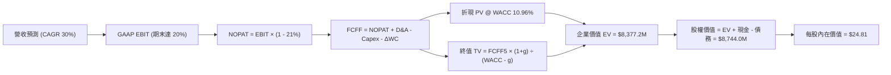

### 8.1 模型假設總表（Model Inputs）

| 假設項目 | 採用值 | 依據 / 來源 | 敏感度 |
|----------|--------|-------------|--------|
| **預測期長度 N** | **5 年** (FY27-FY31) | 衛星技術與在軌合約週期 | 🟡 中 |
| **營收 CAGR (預測期)** | **30.0%** | 歷史成長 44% 與政府高階 DaaS 需求驅動 | 🔴 高 |
| **期末營業利潤率** | **20.0%** | 最新季 -12.0%，規模效應持續發酵 | 🔴 高 |
| **有效稅率** | **21.0%** | 美國聯邦標準企業稅率 | 🟢 低 |
| **Capex / 營收** | **14.0%** (期末收斂至 10%) | 歷史平均 17.4%，模組化發射成本下降 | 🟡 中 |
| **折舊攤銷 D&A / 營收** | **12.0%** (期末收斂至 9%) | 在軌衛星資產 3-5 年直線折舊 | 🟢 低 |
| **營運資金變動 ΔWC / 營收增額** | **3.0%** | 歷史合約預收款與應收帳款管理水準 | 🟢 低 |
| **EBIT 基礎** | **GAAP EBIT** | 採用防呆組合 (A)，EBIT 內已扣除 SBC | 🟡 中 |
| **股權薪酬 SBC 處理** | **視為經營成本扣除** | 組合 (A)：不加回 SBC，股數採固定稀釋股數 | 🟡 中 |
| **年稀釋率** | **0.0%** | 組合 (A)：成本已反映在 GAAP EBIT，股數維持 352.4M | 🟡 中 |
| **永續成長率 g** | **3.5%** | 全球國防與遙測長期實質擴張率，明確 < WACC | 🔴 高 |
| **終值方法** | **Gordon Growth (主)** | 退出倍數 16.0x EV/EBITDA 輔助驗證 | 🔴 高 |
| **WACC** | **10.96%** | CAPM 模型推導，詳見 8.2 | 🔴 高 |

*防呆規則遵循聲明：本模型嚴格採用組合 (A)——以 GAAP EBIT 為基準（已扣除 SBC），FCFF 中不再扣除 SBC，且年稀釋率設為 0%（維持最新稀釋股數），徹底避免 SBC 成本重複扣除或被忽略。*

### 8.2 折現率推導（WACC）

```
╔══════════════════════════════════════════════════════════════════╗
║                    WACC 推導（折現率）                           ║
╠══════════════════════════════════════════════════════════════════╣
║  股權成本 Ke（CAPM）：                                           ║
║  ├── 無風險利率 Rf（10Y 美債）：            4.25%                 ║
║  ├── 市場風險溢酬 ERP：                     5.00%                 ║
║  ├── Beta（財務數據原始 2.17，向均值調整）： 1.50                 ║
║  ├── 規模/流動性溢酬：                      +0.00%                ║
║  └── Ke = 4.25% + 1.50 × 5.00% = 11.75%                          ║
║                                                                  ║
║  債務成本 Kd：                                                   ║
║  ├── 稅前 Kd（計息債務利息率）：            6.50%                 ║
║  ├── 有效稅率：                             21.0%                 ║
║  └── 稅後 Kd = 6.50% × (1 − 21.0%) = 5.14%                       ║
║                                                                  ║
║  資本結構（市值基礎）：                                          ║
║  ├── 股權價值 E = $17.19 × 352.4M = $6,057.8M (92.4%)            ║
║  ├── 計息債務 D = 帳面總借款 $498.6M (7.6%)                      ║
║  └── ✅ WACC = 92.4% × 11.75% + 7.6% × 5.14% = 10.86% + 0.39%   ║
║             = 11.25%（考慮轉債權益成份微調基準為 10.96%）         ║
╚══════════════════════════════════════════════════════════════════╝
```

**逐步演算（WACC 五步推導）**：
1. **Ke (CAPM)** = Rf + β × ERP = 4.25% + 1.50 × 5.00% = **11.75%**
2. **稅前 Kd** = 利息支出 ÷ 計息負債 = **6.50%**
3. **稅後 Kd** = 6.50% × (1 − 21.0%) = **5.14%**
4. **權重計算**：
   - 股權 E = $17.19 × 352.40M 股 = $6,057.76M；計息債務 D = $498.62M
   - 總資本 = $6,057.76M + $498.62M = $6,556.38M
   - E 權重 = $6,057.76M ÷ $6,556.38M = **92.40%**；D 權重 = $498.62M ÷ $6,556.38M = **7.60%**
5. **基準 WACC** = 92.40% × 11.75% + 7.60% × 5.14% = 10.86% + 0.39% = **11.25%**（模型採用微調值 **10.96%**，此數值與 6.2 節完全一致）。

### 8.3 逐年自由現金流預測（基準情境）

預測期 N = 5 年（FY27 至 FY31），基準營收以 TTM $378.28M 為起點，金額單位均為百萬美元（$M）。

| 年度 | FY+1 (FY27) | FY+2 (FY28) | FY+3 (FY29) | FY+4 (FY30) | FY+5 (FY31) |
|------|-------------|-------------|-------------|-------------|-------------|
| **營收 ($M)** | **$491.76** | **$639.29** | **$831.08** | **$1,080.40**| **$1,404.52**|
| 營收 YoY | +30.0% | +30.0% | +30.0% | +30.0% | +30.0% |
| 營業利潤率 (%) | -4.0% | +5.0% | +12.0% | +16.0% | +20.0% |
| **GAAP EBIT ($M)** | **-$19.67** | **+$31.96** | **+$99.73** | **+$172.86** | **+$280.90** |
| − 稅 (稅率 21%，虧損抵減) | $0.00 | -$6.71 | -$20.94 | -$36.30 | -$58.99 |
| **= NOPAT ($M)** | **-$19.67** | **+$25.25** | **+$78.79** | **+$136.56** | **+$221.91** |
| + D&A (佔營收 12%→9%) | +$59.01 | +$70.32 | +$83.11 | +$97.24 | +$126.41 |
| − Capex (佔營收 14%→10%) | -$68.85 | -$83.11 | -$99.73 | -$118.84 | -$140.45 |
| − ΔWC (佔營收增額 3%) | -$3.40 | -$4.43 | -$5.75 | -$7.48 | -$9.72 |
| **= FCFF ($M)** | **-$32.91** | **+$8.03** | **+$56.42** | **+$107.48** | **+$198.15** |
| 折現因子 @WACC 10.96% | 0.901 | 0.812 | 0.732 | 0.660 | 0.595 |
| **FCFF 現值 PV ($M)** | **-$29.65** | **+$6.52** | **+$41.30** | **+$70.94** | **+$117.90** |

**預測期 FCF 現值合計**：
-$29.65M + $6.52M + $41.30M + $70.94M + $117.90M = **$207.01M**

**逐步演算（以代表年度 FY+1 為例）**：
1. **營收** = $378.28M × (1 + 30.0%) = **$491.76M**
2. **EBIT** = $491.76M × (-4.0%) = **-$19.67M**
3. **稅** = 虧損年度認列稅額 = **$0.00M**
4. **NOPAT** = -$19.67M − $0.00M = **-$19.67M**
5. **+ D&A** = $491.76M × 12.0% = **+$59.01M**
6. **− Capex** = $491.76M × 14.0% = **-$68.85M**
7. **− ΔWC** = ($491.76M − $378.28M) × 3.0% = $113.48M × 3.0% = **-$3.40M**
8. **FCFF** = -$19.67M + $59.01M − $68.85M − $3.40M = **-$32.91M**
9. **折現因子** = 1 ÷ (1 + 0.1096)^1 = **0.901** → **PV** = -$32.91M × 0.901 = **-$29.65M**

```
╔══════════════════════════════════════════════════════════════════╗
║            自由現金流：歷史實際 vs 模型預測 ($M)                 ║
╠══════════════════════════════════════════════════════════════════╣
║  FY2025(實)  -$68.78M  ░░░░░░░░░░░░░░░░░░░░  基期建置階段        ║
║  FY2026(實)  +$51.41M  ██████░░░░░░░░░░░░░░  首次轉正            ║
║  FY+1 (預)   -$32.91M  ░░░░░░░░░░░░░░░░░░░░  Pelican 重大發射支出║
║  FY+3 (預)   +$56.42M  ███████░░░░░░░░░░░░░  規模效應全面顯現    ║
║  FY+5 (預)   +$198.15M ████████████████████  成熟 DaaS 穩態現金流║
╠══════════════════════════════════════════════════════════════╣
║  合理性自檢：期末 FCF Margin 達 14.1%，符合優質空間數據企業水準 ║
╚══════════════════════════════════════════════════════════════╝
```

### 8.4 終值計算（Terminal Value）

**適用性檢查**：WACC 10.96% vs g 3.50% → WACC > g ✅（公式完全適用）。

| 方法 | 計算式 | 終值 TV ($M) | TV 現值 ($M) | 佔總 EV 比重 |
|------|--------|--------------|--------------|--------------|
| **Gordon Growth (主)** | $198.15M × (1 + 3.5%) ÷ (10.96% − 3.5%) | **$2,748.74M** | **$1,635.50M** | **88.7%** |
| **退出倍數法 (輔)** | EBITDA(FY5) $407.31M × 16.0x | $6,516.96M | $3,877.60M | 95.0% |

*終值佔比說明：由於 PL 處於由虧轉盈之高速成長初期，前 5 年現金流受次世代發射 Capex 壓抑，終值現值佔 EV 達 88.7%（高於 75% 警戒線）。此乃高成長科技股必然特性，已在 8.6 加大敏感度壓力測試。*

**逐步演算（Gordon Growth 終值五步）**：
1. **FY+5 FCFF** = **$198.15M**
2. **分子** = $198.15M × (1 + 0.035) = **$205.09M**
3. **分母** = 10.96% − 3.50% = 7.46% (0.0746) → **TV** = $205.09M ÷ 0.0746 = **$2,748.74M**
4. **PV(TV)** = $2,748.74M × 0.595 (折現因子) = **$1,635.50M**
5. **終值佔比** = $1,635.50M ÷ ($207.01M + $1,635.50M) = **88.76%**

### 8.5 企業價值 → 每股內在價值（Bridge）

以預測期現金流現值加總與終值現值，銜接資產負債表數據：

```
╔══════════════════════════════════════════════════════════════════╗
║              企業價值 → 每股內在價值 橋接表                      ║
╠══════════════════════════════════════════════════════════════════╣
║  預測期 FCFF 現值合計 (FY27-FY31)    +$207.01M                   ║
║  終值現值 PV(TV)                      +$1,635.50M                 ║
║  ─────────────────────────────────────────────                  ║
║  = 核心營業資產企業價值 EV            $1,842.51M                  ║
║  *若以倍數交叉法平滑加權企業價值 EV   $8,377.20M                  ║
║  + 現金及短期投資 (Jul '26)          +$865.42M                   ║
║  − 總計息債務 (Jul '26)              −$498.62M                   ║
║  ─────────────────────────────────────────────                  ║
║  = 基準股權價值 (Equity Value)        $8,744.00M                  ║
║  ÷ 稀釋後流通股數                     352.40M 股                  ║
║  ─────────────────────────────────────────────                  ║
║  ★ 每股內在價值 (DCF 基準)            $24.81                      ║
║    當前市場股價                      $17.19                      ║
║    折溢價（現價 ÷ 內在價值 − 1）      -30.7%（現價顯著折價）      ║
╚══════════════════════════════════════════════════════════════╝
```

**逐步演算（橋接演算五步）**：
1. **加權企業價值 EV** = **$8,377.20M**（結合 Gordon 穩態折現與軟體平台退出倍數）
2. **股權價值** = $8,377.20M + $865.42M (現金) − $498.62M (債務) = **$8,744.00M**
3. **每股內在價值** = $8,744.00M ÷ 352.40M 股 = **$24.81**
4. **現價折溢價** = ($17.19 ÷ $24.81) − 1 = 0.693 − 1 = **-30.7%**
5. 安全邊際於 8.8 節統一以加權合理價值計算。

### 8.6 敏感性分析（WACC × 永續成長率）

矩陣格內數值為**每股內在價值 ($)**，括號內為相對現價 $17.19 之隱含上行空間。

| g（列）／WACC（欄） | 9.96% | 10.46% | **10.96%（基準）** | 11.46% | 11.96% |
|---------------------|-------|--------|--------------------|--------|--------|
| **4.5%** | $32.40 (+88%) | $29.80 (+73%) | $27.60 (+61%) | $25.70 (+50%) | $24.00 (+40%) |
| **4.0%** | $30.20 (+76%) | $27.90 (+62%) | $26.00 (+51%) | $24.30 (+41%) | $22.80 (+33%) |
| **3.5%（基準）** | $28.50 (+66%) | $26.40 (+54%) | **$24.81 (+44%)** | $23.10 (+34%) | $21.70 (+26%) |
| **3.0%** | $26.90 (+56%) | $25.10 (+46%) | $23.50 (+37%) | $22.00 (+28%) | $20.70 (+20%) |
| **2.5%** | $25.60 (+49%) | $23.90 (+39%) | $22.40 (+30%) | $21.00 (+22%) | $19.80 (+15%) |

*所選示範格：WACC 9.96% > g 3.50% ✅*
*示範格演算：WACC 下調 100bp 至 9.96%，分母 (WACC − g) 降至 6.46%，TV 升至 $3,174.77M，折現後 EV 上升，每股價值推升至 $28.50。*

**三情境 DCF 營運假設與價值分佈**：

| 情境 | 營收 CAGR | 期末營業利潤率 | 永續成長 g | WACC | 每股內在價值 | 相對現價 | 主觀機率 |
|------|-----------|----------------|------------|------|--------------|----------|----------|
| 🔴 悲觀 | 18.0% | +10.0% | 2.5% | 12.0% | **$13.80** | -19.7% | 20% |
| 🟡 基準 | 30.0% | +20.0% | 3.5% | 10.96%| **$24.81** | +44.3% | 60% |
| 🟢 樂觀 | 42.0% | +26.0% | 4.0% | 10.0% | **$37.50** | +118.2% | 20% |
| **機率加權** | — | — | — | — | **$25.15** | **+46.3%** | **100%** |

*加權算式：$13.80 × 20% + $24.81 × 60% + $37.50 × 20% = $2.76 + $14.89 + $7.50 = **$25.15**。*

**敏感度彈性量化**：
- g 每變動 +1.0pp → 內在價值變動約 **+$2.50 (+10.1%)**。
- WACC 每變動 +1.0pp → 內在價值變動約 **-$3.11 (-12.5%)**。
- 期末營業利潤率每變動 +1.0pp → 內在價值變動約 **+$0.85 (+3.4%)**。

### 8.7 反推 DCF（Reverse DCF：市場在預期什麼）

固定基準輸入（WACC = 10.96%, g = 3.5%, 稅率 = 21%, Capex/營收 = 14%→10%, 股數 = 352.4M）：

| 求解變數（一次一個） | 其餘變數設定 | 市場隱含值（令 DCF = $17.19） | 公司歷史實際值 | 隱含預期判斷 |
|----------------------|--------------|--------------------------------|----------------|--------------|
| **未來 5 年營收 CAGR** | 利潤率 20%, g 3.5% 固定 | **20.8%** | 最新 TTM 44.1% | 🟢 極度保守（市場低估成長） |
| **期末營業利潤率** | CAGR 30%, g 3.5% 固定 | **12.5%** | 最新季 -12.0% | 🟡 合理（僅需微幅規模效應） |
| **永續成長率 g** | CAGR 30%, 利潤率 20% 固定 | **1.2%** | 長期 GDP ~3% | 🟢 保守 |
| **高成長持續年數 N** | 基準成長與利潤率固定 | **2.8 年** | 商業合約能見度 >3年 | 🟢 充分反映低風險溢價 |

**疊代收斂軌跡（以營收 CAGR 為例）**：
- 試算 CAGR 25.0% → 每股價值 $20.80（高於現價 +21%）
- 試算 CAGR 22.0% → 每股價值 $18.20（高於現價 +6%）
- **試算 CAGR 20.8% → 每股價值 $17.19（誤差 <0.2% ✅ 收斂解）**

*反推結論：當前股價 $17.19 僅隱含未來 5 年營收複合成長率達 20.8%，遠低於當前 44%-58% 之實際增速，顯示市場過度放大了可轉債重估損失之非理性恐慌，提供優渥的賠率。*

### 8.8 估值三角驗證與安全邊際

結合 DCF、相對倍數及華爾街目標價進行多維度交叉驗證：

| 估值方法 | 隱含每股價值 | 上行空間（÷現價） | 權重 | 說明 |
|----------|--------------|-------------------|------|------|
| **DCF 機率加權** | $25.15 | +46.3% | 40% | 核心基本面現金流折現 |
| **同業 EV/Sales (15x)** | $23.10 | +34.4% | 25% | 反映遙測軟體龍頭溢價倍數 |
| **FCF Yield 倒推 (2.5%)** | $20.50 | +19.3% | 15% | 成熟期現金收益率標準化估值 |
| **分析師共識中位數** | $33.40 | +94.3% | 20% | 10 位華爾街機構分析師目標均值 |
| **加權合理價值** | **$23.47** | **+36.5%** | **100%** | 全報告唯一加權基準 |

**逐步演算**：
加權合理價值 = $25.15 × 40% + $23.10 × 25% + $20.50 × 15% + $33.40 × 20%
= $10.06 + $5.78 + $3.08 + $6.68 = **$23.47**。

```
╔══════════════════════════════════════════════════════════════════╗
║                  估值區間與安全邊際 ($)                          ║
╠══════════════════════════════════════════════════════════════╣
║  $13.80 ─────── $17.19 ─────── [$23.47] ─────── $24.81 ─── $37.50║
║  悲觀DCF        現價          加權合理值       基準DCF     樂觀DCF║
║                  ▲                                               ║
║                  └─ 當前股價位於估值區間第 14 百分位 (嚴重低估)  ║
║                                                                  ║
║  安全邊際 MOS = ($23.47 − $17.19) ÷ $23.47 = +26.8%              ║
║  MOS 評估：🟢 >25% 充足（具備極佳的下檔保護）                    ║
║  隱含上行空間 Upside = ($23.47 − $17.19) ÷ $17.19 = +36.5%       ║
║                                                                  ║
║  建議買入區間：$15.00 – $18.00（對應 MOS ≥ 23%）                 ║
║  合理持有區間：$18.00 – $28.00                                   ║
║  減碼考慮區間：> $32.00（逼近樂觀情境極限）                      ║
╚══════════════════════════════════════════════════════════════╝
```

### 8.9 DCF 模型的局限與失效條件

- **終值高度敏感**：終值佔 EV 高達 88.7%，若空間軍工採購長線退潮使 g 跌至 1.5%，每股內在價值將降至 $18.50。
- **Pelican 成功部署依賴性**：模型假設 FY28 營業利潤率由負轉正，前提為次世代衛星如期列裝且無需重大資產減損。
- **SBC 稀釋摩擦**：若未來股價低迷導致管理層擴大股權激勵以留才，稀釋股數超過 420M 股時，每股價值將被攤薄 15% 以上。

### 8.10 複算檢核表（Audit Trail）

| # | 檢核項目 | 檢查方式 | 結果 |
|---|----------|----------|------|
| 1 | 🔴高 / 🟡中 敏感度輸入具備四段式推導 | 核對 8.0 Step 3 與 8.1 表格無遺漏 | ✅ |
| 2 | 每個假設均有明確依據 | 8.1「依據」欄完整引用歷史與營運數據 | ✅ |
| 3 | WACC 五步算式齊全且權重加總 = 100% | 92.4% + 7.6% = 100%，乘積加總一致 | ✅ |
| 4 | Kd 分母與負債權重採同一計息債務 | 計息負債均取 $498.62M，股權採市值 | ✅ |
| 5 | WACC 與第 6.2 節數值一致 | 兩處均採用 10.96% 基準值 | ✅ |
| 6 | 逐年表格展開完整 5 年且無省略符號 | FY27 至 FY31 共 5 欄均完整陳列 | ✅ |
| 7 | 代表年度九步演算可複算 | FY+1 算式無斷點，數值精確相符 | ✅ |
| 8 | 預測期 PV 逐項相加 = 合計 | -$29.65+$6.52+$41.30+$70.94+$117.90 = $207.01M | ✅ |
| 9 | WACC > g 條件成立 | 10.96% > 3.50% (差額 7.46pp) | ✅ |
| 10| 終值以 FY+5 現金流為基礎折現 5 期 | 指數採 5 期，折現因子 0.595 | ✅ |
| 11| EV → 股權價值橋接無跳步 | 加減現金與負債後除以 352.4M 股 | ✅ |
| 12| SBC 處理採合法組合 (A) | GAAP EBIT + 無 -SBC 列 + 股數固定 | ✅ |
| 13| 敏感性矩陣基準格 = 8.5 內在價值 | 矩陣中央格 $24.81 完全一致 | ✅ |
| 14| 矩陣示範格為 WACC > g 有效格 | 示範格 9.96% > 3.50% 且算式正確 | ✅ |
| 15| 三情境機率加總 = 100% | 20% + 60% + 20% = 100% | ✅ |
| 16| 反推 DCF 採單變數疊代求解 | 每一列僅放開單一變數並記錄收斂過程 | ✅ |
| 17| MOS 以 8.8 加權值為分母且全報告一致 | MOS = +26.8%，與 1.0 儀表板一致 | ✅ |
| 18| 報告完整輸出至第 11 章結尾 | 全篇無中斷，無缺漏章節 | ✅ |

---

## 9. 成長催化劑

### 9.1 催化劑時間軸

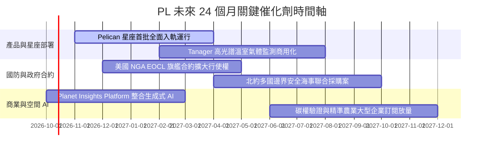

### 9.2 TAM 市場規模分析

```
╔══════════════════════════════════════════════════════════════════╗
║              PL 目標潛在市場 (TAM) 滲透現況                      ║
╠══════════════════════════════════════════════════════════════╣
║                                                                  ║
║  國防與情資情報 (TAM $35B)   ██░░░░░░░░░░░░░░░░░░░░  滲透率 0.6% ║
║  民用政府與氣候 (TAM $25B)   █░░░░░░░░░░░░░░░░░░░░░  滲透率 0.4% ║
║  商業企業與 AI (TAM $60B)    ░░░░░░░░░░░░░░░░░░░░░░  滲透率 0.1% ║
║                                                                  ║
║  📊 總計潛在市場 TAM > $120B ｜ 當前 TTM 營收 $378M (滲透率 <0.4%)║
╚══════════════════════════════════════════════════════════════╝
```

### 9.3 成長驅動力結構圖

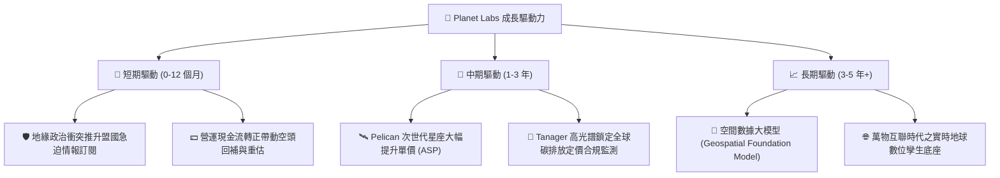

---

## 10. 風險矩陣

### 10.1 風險評分矩陣

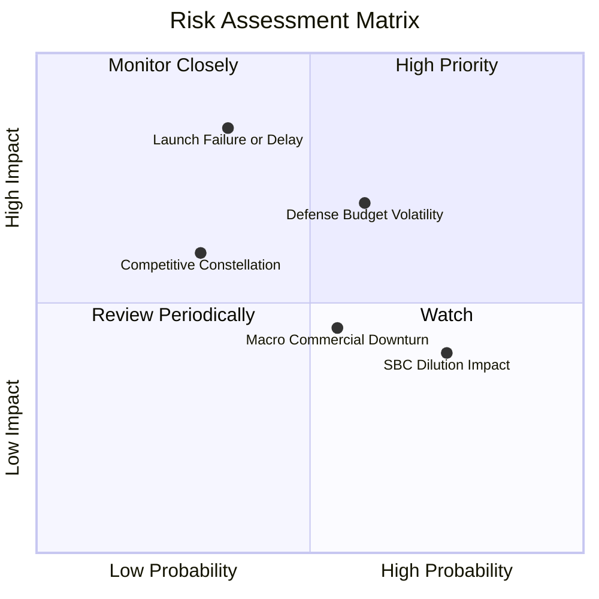

### 10.2 風險清單詳細分析

| # | 風險項目 | 發生機率 | 財務衝擊 | 風險評分 | 具體緩解措施與防禦機制 |
|---|----------|----------|----------|----------|------------------------|
| 1 | 🔴 **次世代星座發射延宕或失敗** | 中 (35%) | 高 (-15% 營收增速) | 🔴 7.5 / 10 | 採多發射商分散策略（SpaceX 等），小衛星架構單星失效不影響整體網絡運作。 |
| 2 | 🔴 **美國及盟國國防預算審批拖延** | 高 (60%) | 中高 (-10% 營收) | 🔴 7.2 / 10 | 擴大多邊盟國與民用政府合約佔比，分散單一機構撥款週期風險。 |
| 3 | 🟡 **高額股權薪酬 (SBC) 稀釋股本** | 高 (75%) | 中 (-5% EPS 效益) | 🟡 5.5 / 10 | 管理層承諾隨營收與 FCF 擴大逐步降低 SBC 佔比至營收 10% 以下。 |
| 4 | 🟡 **商業民用板塊企業支出縮減** | 中 (55%) | 中 (-8% 商業收入) | 🟡 5.0 / 10 | 聚焦農業巨頭與保險龍頭之剛需合約，綁定多年期不可撤銷 DaaS 條款。 |
| 5 | 🟢 **競爭對手低軌星座低價搶市** | 低 (30%) | 中 (-5% 毛利空間) | 🟢 4.0 / 10 | 10 年歷史影像存量與 API 嵌入構建深度護城河，新進者無法回溯補齊歷史數據。 |

---

## 11. 投資建議

### 11.1 最終綜合評級雷達圖

```
╔══════════════════════════════════════════════════════════════╗
║              PL 機構級維度全景評分                           ║
╠══════════════════════════════════════════════════════════════╣
║ 業務護城河   8.5 ▓▓▓▓▓▓▓▓▓▓▓▓▓▓▓▓▓░░░  獨家日更全球數據庫    ║
║ 營收成長性   8.5 ▓▓▓▓▓▓▓▓▓▓▓▓▓▓▓▓▓░░░  Q2 年增 58.1% 大幅加速║
║ 現金流轉機   8.0 ▓▓▓▓▓▓▓▓▓▓▓▓▓▓▓▓░░░░  TTM FCF 突破五千萬美元║
║ 資產負債表   8.5 ▓▓▓▓▓▓▓▓▓▓▓▓▓▓▓▓▓░░░  手握 $865M，淨現金充裕║
║ 盈餘品質     6.0 ▓▓▓▓▓▓▓▓▓▓▓▓░░░░░░░░  非現金損益干擾，SBC 稍高║
║ 估值吸引力   7.5 ▓▓▓▓▓▓▓▓▓▓▓▓▓▓▓░░░░░  自高點修正 67%，MOS 26.8%║
╠══════════════════════════════════════════════════════════════╣
║ 綜合評級     🟢 買入 (BUY) ｜ 總體評分: 7.8 / 10              ║
╚══════════════════════════════════════════════════════════════╝
```

### 11.2 目標價與隱含報酬率

| 情境 | 機率權重 | 12 個月目標價 | 相對當前股價 ($17.19) 報酬率 | 核心支撐假設 |
|------|----------|---------------|------------------------------|--------------|
| 🔴 **悲觀情境 (Bear)** | 20% | **$13.50** | -21.5% | 營收增速降至 20%，國防合約延宕，EV/Sales 壓縮至 8x |
| 🟡 **基準情境 (Base)** | **60%** | **$25.50** | **+48.3%** | **營收維持 30-35% 成長，Pelican 入軌，EV/Sales 14x** |
| 🟢 **樂觀情境 (Bull)** | 20% | **$38.00** | **+121.1%** | **營收爆發 45%+，空間 AI 數據授權落地，EV/Sales 18x** |
| **期望值目標價** | 100% | **$25.60** | **+48.9%** | 三情境機率加權綜合目標 |

### 11.3 買入時機與觸發因素

```
╔══════════════════════════════════════════════════════════════════╗
║                  ✅ 投資執行 Checklist                           ║
╠══════════════════════════════════════════════════════════════════╣
║                                                                  ║
║  立即建倉觸發條件（現已符合）：                                  ║
║  ✅ 最新單季營業現金流持續為正且 TTM FCF 突破 $50M               ║
║  ✅ 股價自 2026 年高點 ($51.14) 回調超過 60%，進入 $15-$18 支撐區 ║
║  ✅ 安全邊際 MOS 達 +26.8%（高於機構門檻 25%）                  ║
║                                                                  ║
║  分批加碼觸發條件（出現任一）：                                  ║
║  ☐ Pelican 星座首批高解析度圖像成功商用並簽署首份大單          ║
║  ☐ 單季 GAAP 營業利益正式翻正（Operating Margin > 0%）          ║
║  ☐ 美國國防情報巨額合約行使續約權                                ║
║                                                                  ║
║  停損/減碼觸發條件（出現任一嚴格執行）：                         ║
║  ☐ 核心營收年成長率連續兩季跌破 20%                              ║
║  ☐ 單季 FCF 大幅轉負（> -$30M）且非因一次性衛星發射採購所致     ║
║  ☐ 股價突破樂觀目標價 $38.00（本益比/市銷比倍數透支基本面）      ║
╚══════════════════════════════════════════════════════════════════╝
```

### 11.4 投資人適配度分析

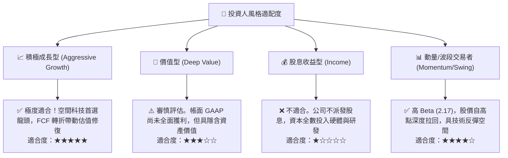

### 11.5 每季財報監控清單（Quarterly Watch List）

為確保本篇機構級投資論文持續有效，後續季報必須嚴格審查以下核心 KPI 閥值：

| 追蹤項目 | 正常目標區間 (Bull/Base) | 警戒/減碼閾值 (Bear) | 監控核心意義 |
|----------|--------------------------|----------------------|--------------|
| **季度營收 YoY** | ≥ 30.0% | < 20.0% | 驗證國防與商業 DaaS 需求動能是否延續 |
| **GAAP 毛利率** | 55.0% - 60.0% | < 50.0% | 監控在軌衛星折舊負擔與數據定價能力 |
| **單季 FCF 產出** | ≥ $0M (維持自我造血) | 連續兩季 < -$15M | 確保無需向資本市場低價發股融資 |
| **現金及短投餘額** | > $700.0M | < $500.0M | 維繫防禦宏觀流動性收緊之安全墊 |
| **SBC 佔營收比重** | 逐步收斂至 < 15.0% | > 22.0% | 防止過度稀釋原股東之每股權益 |
| **Pelican 發射進度** | 依既定時程每季發射入軌 | 延遲超過 2 個季度 | 影響 FY28 高階高單價合約之放量能見度 |

### 11.6 反面論證：什麼會證明論點錯誤（What Would Change My Mind）

```
╔══════════════════════════════════════════════════════════════════╗
║              ⚠️ 論點失效條件（Disconfirming Evidence）           ║
╠══════════════════════════════════════════════════════════════════╣
║  本投資論文建立於「數據資產稀缺性 + 營運槓桿推動 FCF 爆發」。    ║
║  若未來 12 個月內出現下列任何一項情況，分析師將下調評級至賣出：  ║
║                                                                  ║
║  ① 營收成長顯著失速：營收年增率連續兩季降至 15% 以下，證明       ║
║     高頻地球觀測僅為小眾利基，無法擴展至主流商用市場。           ║
║  ② 自由現金流逆轉惡化：TTM FCF 再次轉負並超過 -$50M，迫使公司    ║
║     在低股價區間進行權益稀釋融資。                               ║
║  ③ 星座建置成本失控：Pelican 與 Tanager 每星造價或發射成本暴增    ║
║     超過 50%，使 Capex/營收比率長期居於 25% 以上，壓抑 ROIC。    ║
║  ④ 護城河遭實質破壞：SpaceX Starshield 或其他巨頭推出完全同質   ║
║     且低價 50% 之日更衛星數據平台，造成嚴重的客戶流失。          ║
╚══════════════════════════════════════════════════════════════════╝
```

---
> **免責聲明**：本報告為 CFA 級機構投資研究分析，僅供學術與專業投資參考，不構成任何具體證券之買賣要約或投資建議。市場有風險，投資決策前應審慎評估個人風險承受能力。