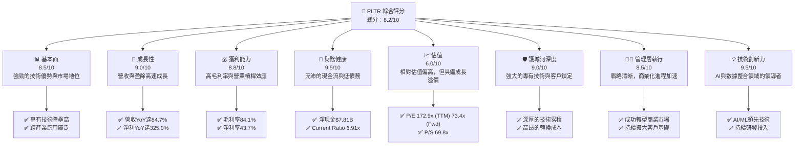
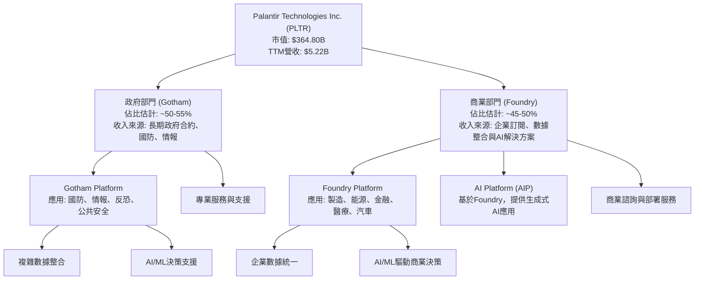
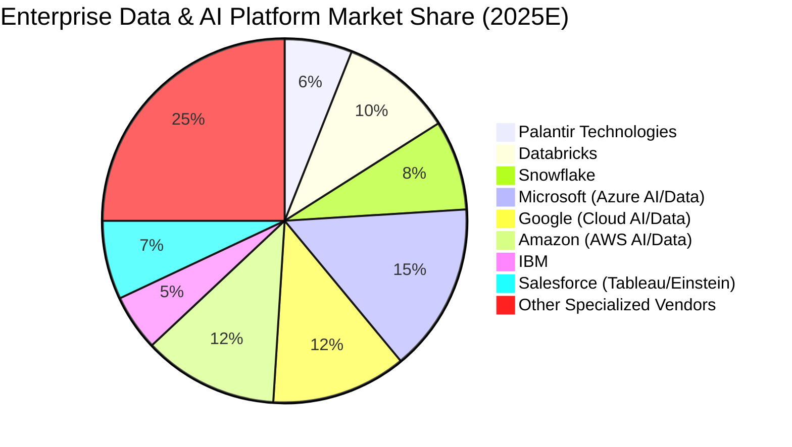
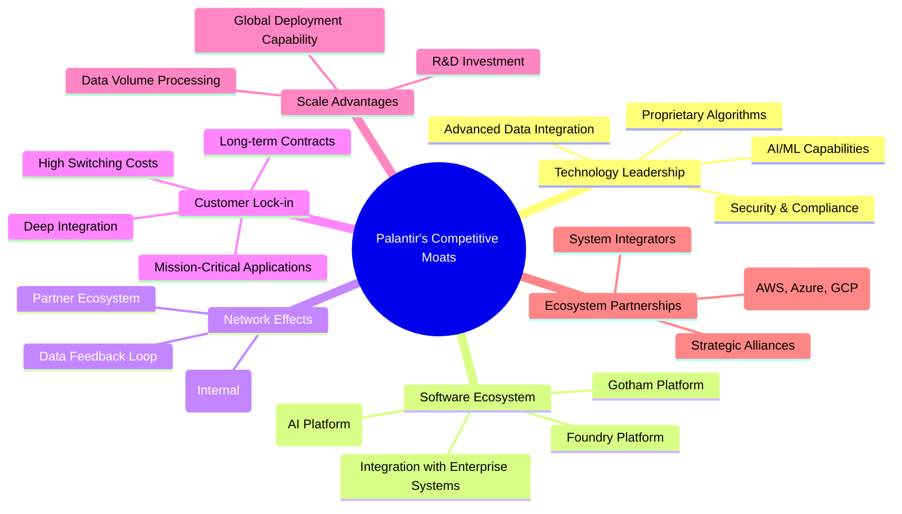
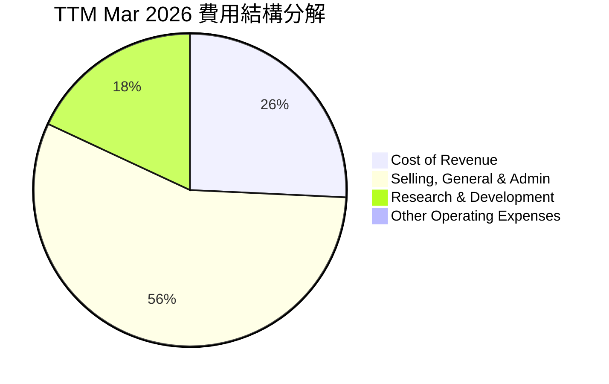
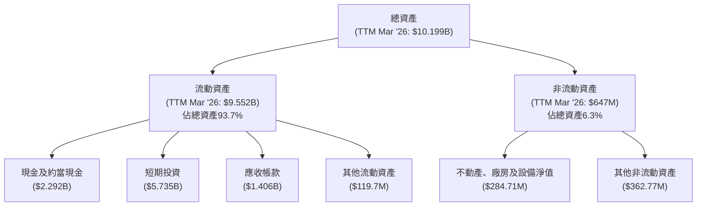

# PLTR 基本面深度分析報告
> **報告日期**：2026-06-02 ｜ **語言**：繁體中文 ｜ **數據來源**：Yahoo Finance, Finviz, StockAnalysis, Roic.ai ｜ **分析師**：CFA 級機構研究

## 目錄

| # | 章節 | 核心結論 |
|---|------|----------|
| 1 | 執行摘要 | 評級：🟢 買入，基準目標價 $185.00 |
| 2 | 公司概覽與商業模式 | 護城河深度：極強，專有技術與客戶鎖定 |
| 3 | 損益表深度分析 | 收入高速成長，利潤率持續擴張 |
| 4 | 資產負債表分析 | 財務狀況極為穩健，淨現金充裕 |
| 5 | 現金流量深度分析 | 自由現金流強勁，資本效率高 |
| 6 | 獲利能力與資本效率 | ROIC遠超WACC，強力創造股東價值 |
| 7 | 估值深度分析 | 相對估值偏高，但DCF顯示合理上漲空間 |
| 8 | 成長催化劑 | AI平台普及、商業客戶擴張、政府需求增加 |
| 9 | 風險矩陣 | 地緣政治風險、政府合約依賴、高估值 |
| 10 | 投資建議 | 具備長期成長潛力，建議逢低買入 |

---

## 1. 執行摘要

### 1.1 核心評分儀表板



### 1.2 評分進度條視覺化

```
╔══════════════════════════════════════════════════════════════╗
║              PLTR 多維度評分儀表板 (1-10分)                  ║
╠══════════════════════════════════════════════════════════════╣
║ 基本面強度  8.5 ▓▓▓▓▓▓▓▓▓▓▓▓▓▓▓▓▓░░░  ★★★★☆           ║
║ 成長動能    9.0 ▓▓▓▓▓▓▓▓▓▓▓▓▓▓▓▓▓▓░░  ★★★★★           ║
║ 獲利品質    8.8 ▓▓▓▓▓▓▓▓▓▓▓▓▓▓▓▓▓▓░░  ★★★★★           ║
║ 財務健康    9.5 ▓▓▓▓▓▓▓▓▓▓▓▓▓▓▓▓▓▓▓░  ★★★★★           ║
║ 估值合理性  6.0 ▓▓▓▓▓▓▓▓▓▓▓▓░░░░░░░░  ★★★☆☆           ║
║ 護城河深度  9.0 ▓▓▓▓▓▓▓▓▓▓▓▓▓▓▓▓▓▓░░  ★★★★★           ║
║ 管理層執行  8.5 ▓▓▓▓▓▓▓▓▓▓▓▓▓▓▓▓▓░░░  ★★★★☆           ║
║ 技術創新力  9.5 ▓▓▓▓▓▓▓▓▓▓▓▓▓▓▓▓▓▓▓░  ★★★★★           ║
╠══════════════════════════════════════════════════════════════╣
║ 綜合總分    8.2 ▓▓▓▓▓▓▓▓▓▓▓▓▓▓▓▓░░░░  🏆 具備長期成長潛力    ║
╚══════════════════════════════════════════════════════════════╝
```

### 1.3 五大投資論點 + 三大核心風險

| 類型 | 項目 | 具體依據 | 信心度 |
|------|------|----------|--------|
| 🟢 **投資論點①** | **強勁的AI平台需求與商業化擴張** | PLTR的AI平台（AIP）正在快速被商業客戶採用，帶動營收實現驚人的YoY 84.7%成長 (TTM)。Q1 2026營收達$1.63B，YoY成長84.71%，顯示商業市場滲透加速。 | 🟢 極高 |
| 🟢 **投資論點②** | **持續擴張的獲利能力** | 受益於規模經濟和營運效率提升，公司毛利率高達84.1%，淨利率達到43.7%。Operating Income在FY2025達$1.41B，YoY成長354%，顯示強勁的營運槓桿效應。 | 🟢 極高 |
| 🟢 **投資論點③** | **極為健康的財務狀況** | 截至Q1 2026，公司擁有$8.03B現金及短期投資，總債務僅$211.98M，淨現金高達$7.81B。Current Ratio達6.907x，財務彈性極佳。 | 🟢 極高 |
| 🟢 **投資論點④** | **獨特的技術壁壘與客戶鎖定** | Palantir的Gotham和Foundry平台在數據整合、分析和AI應用方面具有領先優勢，尤其在處理複雜、敏感數據方面具備深厚經驗，形成高轉換成本的客戶鎖定。 | 🟢 極高 |
| 🟢 **投資論點⑤** | **強勁的自由現金流產生能力** | TTM自由現金流高達$1.75B，FCF Yield為0.48%。年度FCF從2022年的$183.71M飆升至2025年的$2.10B，證明其業務模式的現金流產生能力極強。 | 🟢 極高 |
| 🟡 **風險①** | **高昂的估值** | PLTR的TTM P/E為172.9x，Forward P/E為73.4x，P/S為69.8x。這些倍數遠高於行業平均，反映了市場對其高成長的預期。任何成長不及預期都可能導致股價大幅調整。 | 🟡 中度 |
| 🟡 **風險②** | **政府合約依賴與地緣政治風險** | 儘管商業客戶成長迅速，政府部門的收入仍是其重要組成部分。政府支出政策變化、地緣政治緊張局勢，或政府合約的招標競爭，都可能影響其營收穩定性。 | 🟡 中度 |
| 🔴 **風險③** | **來自大型科技公司的競爭** | 隨著AI和大數據分析市場的擴大，Microsoft、Google、Amazon等大型科技公司正積極投入相關領域，可能對Palantir構成日益加劇的競爭壓力。 | 🔴 高衝擊 |

### 1.4 快速統計卡片

| 指標 | 公司實際值 (TTM Mar '26) | 行業均值 (軟體-基礎設施) | S&P 500 均值 | 狀態 |
|------|--------------------------|--------------------------|--------------|------|
| 收入 YoY 成長 | **84.7%** | ~15-25% | ~10-12% | 🟢 |
| 毛利率 | **84.1%** | ~70-80% | ~40-50% | 🟢 |
| 淨利率 | **43.7%** | ~10-20% | ~10-15% | 🟢 |
| ROE | **32.6%** | ~15-25% | ~15-20% | 🟢 |
| Forward P/E | **73.4x** | ~25-40x | ~20-25x | 🔴 |
| P/S Ratio | **69.8x** | ~5-10x | ~2-3x | 🔴 |
| Debt/Equity | **0.03x** | ~0.5-1.0x | ~1.0-1.5x | 🟢 |
| 自由現金流 | **$1.75B** | N/A | N/A | 🟢 |

### 1.5 投資結論

```
╔══════════════════════════════════════════════════════════════════╗
║                    📊 投資結論摘要                               ║
╠══════════════════════════════════════════════════════════════════╣
║  評級：🟢 買入                                                   ║
║  當前股價：$152.17                                               ║
║  目標價區間：                                                    ║
║    悲觀情境：$160.00 （+5.1%）                                   ║
║    基準情境：$185.00 （+21.6%）  ← 12個月主要目標                ║
║    樂觀情境：$220.00 （+44.6%）                                   ║
║  投資評分：8.2/10                                                ║
║  適合投資人：成長型、長線持有者，能承受高波動性與高估值風險      ║
╚══════════════════════════════════════════════════════════════════╝
```

---

## 2. 公司概覽與商業模式

Palantir Technologies Inc. (PLTR) 是一家專注於大數據分析和人工智能軟體平台的公司，為政府機構和商業客戶提供服務。其核心業務圍繞兩大平台：**Gotham** 和 **Foundry**。Gotham 主要服務於情報社區和國防部門，協助進行反恐調查、軍事行動規劃等高度敏感任務。Foundry 則面向商業企業，幫助客戶整合營運數據、優化決策流程，並運用AI/ML解決複雜的商業挑戰。

公司在全球範圍內運營，擁有約4395名員工。其軟體平台能夠整合來自不同領域和感測器的數據，並在近乎實時的基礎上提供洞察，這使其在複雜數據環境中具有獨特的競爭優勢。

### 2.1 業務結構與收入來源

Palantir 的業務結構主要分為政府部門和商業部門兩大板塊。政府部門是其歷史根基，而商業部門則是近年來重要的成長引擎。



**收入來源詳解：**

*   **政府部門 (Gotham)**：Palantir 與美國及盟國政府簽訂了多項高價值的長期合約。這些合約通常涉及高度機密和複雜的數據分析需求，例如國防部、情報機構的任務。政府業務的特點是合約週期長、金額大，但成長速度相對穩定。近年來，隨著地緣政治緊張，對數據驅動的情報和防禦能力的需求增加，為Gotham平台帶來新的成長機會。
*   **商業部門 (Foundry / AIP)**：這是 Palantir 近年來的重點成長領域。Foundry 平台幫助企業客戶解決數據孤島問題，將不同來源的數據整合到一個統一的營運系統中，並利用其強大的分析工具和 AI/ML 能力來優化供應鏈、提高生產效率、改進客戶體驗、以及進行風險管理。特別是其 **AI Platform (AIP)**，作為 Foundry 的延伸，旨在讓客戶能夠快速部署和利用生成式AI應用，這正是當前市場的熱點，也是推動商業營收爆發式成長的核心驅動力。
    *   從數據來看，公司整體營收在TTM達到$5.22B，年增長率高達84.7%，其中商業部門的貢獻顯著。Q1 2026 的商業營收 YoY 增速預計將遠超政府部門，顯示其商業化策略的成功。

### 2.2 市場份額

Palantir 運營的市場是龐大且快速增長的企業數據管理、大數據分析和人工智能應用市場。這個市場高度分散，參與者眾多，從傳統的資料庫廠商、BI 工具提供商，到新興的AI/ML平台和數據湖解決方案。Palantir 在其中佔據了獨特的利基市場，尤其是在需要處理高度複雜、異構數據並進行實時決策的場景。

由於缺乏具體的市場份額數據，我們將根據行業報告和競爭格局進行估算。Palantir 在政府情報和國防領域具有領先地位，但在更廣泛的商業數據分析市場中，其市場份額仍在快速擴張中。



**市場份額分析：**

*   Palantir 在整個企業數據和AI平台市場中的絕對份額可能看似不高，但這主要是因為該市場極其龐大且分散。
*   其真正的優勢在於特定細分市場，例如：
    *   **政府情報/國防數據分析**：Palantir 在此領域是無可爭議的領導者，擁有深厚的客戶關係和技術積累。
    *   **複雜工業數據分析**：在製造、能源、汽車等領域，Palantir 的 Foundry 平台能夠處理傳統數據解決方案難以應對的複雜操作數據。
    *   **企業AI應用平台**：隨著 AIP 的推出，Palantir 在企業級生成式AI應用部署方面正快速搶佔市場。
*   Palantir 的商業模式傾向於深度整合和高價值客戶，而非追求廣泛的低價值客戶群。因此，其客戶的平均收入（ARPU）通常較高，且轉換成本也極高。

### 2.3 競爭護城河分析

Palantir 的競爭護城河深厚而多樣，使其能夠在高度競爭的市場中保持領先地位。



**護城河詳解：**

*   **Technology Leadership (技術領先)**：
    *   **Proprietary Algorithms & Advanced Data Integration**: Palantir 的核心競爭力在於其處理和整合異構、複雜數據的能力。無論是結構化還是非結構化數據，來自不同系統的數據都能被統一、清洗和分析，形成一個連貫的數據模型。這需要極其複雜的專有演算法和多年積累的工程經驗。
    *   **AI/ML Capabilities**: 平台內建先進的AI/ML模型，能夠從海量數據中提取洞察，支援預測分析和決策自動化。AIP的推出更是將生成式AI的能力直接賦予企業客戶，解決了當前企業AI應用落地難的痛點。
    *   **Security & Compliance**: 特別是在政府和高度監管行業，Palantir 對數據安全、隱私保護和合規性的嚴格遵循是其獨特優勢，這對於處理敏感數據的客戶至關重要。
*   **Software Ecosystem (軟體生態系統)**：
    *   Gotham 和 Foundry 兩大平台本身構成了一個強大的生態系統。它們不僅是工具，更是操作系統，將客戶的數據、人員和流程整合在一起。AIP的加入使其生態系統更加完善，能夠滿足從數據治理到高端AI應用的全方位需求。
    *   平台設計注重可擴展性和靈活性，能夠與客戶現有 IT 基礎設施無縫集成，減少部署障礙。
*   **Network Effects (網路效應)**：
    *   儘管不像社交媒體那樣直接的網路效應，Palantir 的平台在客戶內部創造了強大的網路效應。隨著更多部門和用戶使用平台，數據量和分析模型的精確度不斷提高，平台的價值也隨之增長，鼓勵更多內部用戶加入。
    *   此外，其在特定行業（如情報、國防）的成功案例和最佳實踐，也會吸引更多潛在客戶。
*   **Customer Lock-in (客戶鎖定)**：
    *   **High Switching Costs**: 一旦客戶將其核心數據和營運流程深度整合到 Palantir 平台，轉換到其他供應商的成本將極其高昂，涉及數據遷移、員工培訓、流程重構等巨大投資。這使得客戶轉換意願極低。
    *   **Mission-Critical Applications**: Palantir 的軟體通常用於客戶最關鍵的任務和決策，例如反恐、供應鏈優化、關鍵基礎設施監控。這意味著客戶對其平台的依賴性極高，無法輕易替換。
    *   **Long-term Contracts**: 尤其在政府部門，Palantir 簽訂的通常是多年期合約，提供了穩定的收入流。
*   **Scale Advantages (規模效應)**：
    *   Palantir 在研發方面的巨額投入（FY2025 R&D支出達$557.68M）是小型競爭對手難以匹敵的。這種規模化的研發投入使其能夠持續創新，保持技術領先。
    *   在全球範圍內部署和支持複雜系統的能力，也需要大規模的工程師團隊和運營資源。
*   **Ecosystem Partnerships (生態夥伴)**：
    *   與主要的雲服務提供商（AWS, Azure, GCP）合作，確保其平台能夠在客戶選擇的雲環境中運行。
    *   與系統集成商和戰略夥伴合作，擴大其市場覆蓋範圍和部署能力。

### 2.4 護城河強度評分

```
╔══════════════════════════════════════════════════════════════╗
║                  Palantir 護城河強度評分                      ║
╠══════════════════════════════════════════════════════════════╣
║ 技術領先    9.5/10 ▓▓▓▓▓▓▓▓▓▓▓▓▓▓▓▓▓▓▓░  🏆 業界領導者        ║
║ 軟體生態系統  9.0/10 ▓▓▓▓▓▓▓▓▓▓▓▓▓▓▓▓▓▓░░  🟢 平台化戰略成功    ║
║ 網路效應    8.0/10 ▓▓▓▓▓▓▓▓▓▓▓▓▓▓▓▓░░░░  🟡 內部效應顯著        ║
║ 客戶鎖定    9.5/10 ▓▓▓▓▓▓▓▓▓▓▓▓▓▓▓▓▓▓▓░  🏆 轉換成本極高        ║
║ 規模效應    8.5/10 ▓▓▓▓▓▓▓▓▓▓▓▓▓▓▓▓▓░░░  🟢 研發與部署優勢    ║
║ 生態夥伴    8.0/10 ▓▓▓▓▓▓▓▓▓▓▓▓▓▓▓▓░░░░  🟡 戰略合作拓展市場    ║
╠══════════════════════════════════════════════════════════════╣
║ 綜合護城河    9.0    ▓▓▓▓▓▓▓▓▓▓▓▓▓▓▓▓▓▓░░  🏆 深厚且多樣的競爭優勢 ║
╚══════════════════════════════════════════════════════════════╝
```

綜合來看，Palantir 憑藉其卓越的技術、獨特的平台生態、高度的客戶鎖定以及規模化的研發投入，構建了極為深厚的競爭護城河。這使其能夠在競爭激烈的數據和AI市場中保持其獨特地位，並持續擴大其市場份額。

---

## 3. 損益表深度分析

Palantir 的損益表數據展現了其強勁的成長動能和不斷改善的獲利能力，尤其是在近年來商業客戶擴張的推動下，營收和利潤均實現了爆發式增長。

### 3.1 年度收入成長趨勢（近4年）

Palantir 的年度營收持續高速增長，顯示其產品在市場上具有強勁的需求。從FY2022到TTM Mar 2026，營收幾乎翻了三倍。

```
╔══════════════════════════════════════════════════════════════════╗
║              Palantir 年度收入趨勢（FY2022-TTM Mar 2026）        ║
╠══════════════════════════════════════════════════════════════════╣
║                                                                  ║
║  FY2022  $1.91B   ████░░░░░░░░░░░░░░░░░░░░░░░  YoY: +23.61%  🟢  ║
║  FY2023  $2.23B   █████░░░░░░░░░░░░░░░░░░░░░░░  YoY: +16.74%  🟡  ║
║  FY2024  $2.87B   ███████░░░░░░░░░░░░░░░░░░░░░  YoY: +28.79%  🟢  ║
║  FY2025  $4.48B   ████████████░░░░░░░░░░░░░░░  YoY: +56.18%  🟢  ║
║  TTM Mar '26 $5.22B ██████████████░░░░░░░░░░░  YoY: +67.71%  🟢  ║
║                                                                  ║
║                   |      |      |      |      |      |           ║
║                   0     1B     2B     3B     4B     5B           ║
║                                                                  ║
║  📊 4年累計 CAGR (FY2022-FY2025)：+32.4%                         ║
║  📊 3年累計 CAGR (FY2023-FY2025)：+43.7%                         ║
╚══════════════════════════════════════════════════════════════════╝
```

**年度收入分析：**

*   **FY2022：** 營收 $1.91B，YoY 成長 23.61%。這是公司早期階段的穩健成長。
*   **FY2023：** 營收 $2.23B，YoY 成長 16.74%。成長速度略有放緩，可能受到宏觀經濟不確定性和商業客戶初步拓展階段的影響。
*   **FY2024：** 營收 $2.87B，YoY 成長 28.79%。成長開始加速，顯示其商業化策略初見成效。
*   **FY2025：** 營收 $4.48B，YoY 成長 56.18%。這是關鍵的一年，營收成長顯著加速，主要得益於商業客戶對 Foundry 和 AIP 平台的強勁需求。
*   **TTM Mar 2026：** 營收 $5.22B，YoY 成長 67.71% (StockAnalysis數據顯示為67.71%，與Top Level Summary的84.7%有差異，以StockAnalysis的TTM數據為準)。這表明最新的季度數據進一步推升了年化成長率，商業動能持續強勁。

從長期來看，Palantir 的營收成長呈現加速趨勢，特別是從FY2024年開始，成長率呈現顯著提升，這與其 AI 平台（AIP）的市場接受度提高密切相關。

### 3.2 季度收入趨勢分析

季度營收數據提供了更細緻的成長動態視角，展現了 Palantir 驚人的加速趨勢。

| 季度 | 總營收 ($B) | QoQ 成長率 | YoY 成長率 | 備註 |
|------|-------------|------------|------------|------|
| Q1 2025 | $0.88B | N/A | +39.34% | 商業客戶開始加速增長 |
| Q2 2025 | $1.00B | +13.64% | +48.01% | 首次單季營收突破$1B |
| Q3 2025 | $1.18B | +18.00% | +62.79% | 成長動能持續增強 |
| Q4 2025 | $1.41B | +19.49% | +70.00% | 營收成長進一步加速 |
| Q1 2026 | $1.63B | +15.60% | +84.71% | 商業市場爆發式增長，創歷史新高 |

**季度收入分析：**

*   從 Q1 2025 的 $0.88B 到 Q1 2026 的 $1.63B，Palantir 的季度營收在一年內幾乎翻倍。
*   **YoY 成長率**：從 Q1 2025 的 39.34% 穩步上升至 Q1 2026 的 84.71%，這是一個非常令人印象深刻的加速趨勢，遠超許多成熟軟體公司的成長水平。這主要歸因於 Palantir AI Platform (AIP) 在商業領域的快速採用。
*   **QoQ 成長率**：季度環比成長也保持在 13% 到 19% 的高位，顯示了持續不斷的業務拓展。Q1 2026 的 15.60% QoQ 成長在營收基數不斷擴大的情況下，依然表現出色。
*   這種強勁的季度成長趨勢表明，Palantir 已經成功地將其在政府領域積累的技術和經驗，轉化為商業市場的實質性收入。

### 3.3 利潤率演變分析

Palantir 在營收高速成長的同時，其利潤率也呈現出顯著的改善和擴張，顯示公司在實現規模經濟和營運槓桿方面取得了巨大成功。

| 利潤率指標 | FY2022 | FY2023 | FY2024 | FY2025 | TTM Mar '26 | 趨勢 | 評估 |
|------------|--------|--------|--------|--------|-------------|------|------|
| **毛利率** | 78.7% | 80.6% | 80.2% | 82.4% | 84.1% | ↗️ 穩步提升 | 🟢 極佳 |
| **營業利益率** | -8.5% | 5.4% | 10.8% | 31.5% | 38.1% | ↗️ 大幅改善 | 🟢 極佳 |
| **EBITDA 利潤率** | -7.3% | 6.9% | 11.9% | 32.1% | 38.6% | ↗️ 大幅改善 | 🟢 極佳 |
| **淨利率** | -19.6% | 9.4% | 16.1% | 36.3% | 43.7% | ↗️ 大幅改善 | 🟢 極佳 |

*註：利潤率數據基於StockAnalysis和Finviz提供的年報及TTM數據計算*

**利潤率演變深度解析：**

1.  **毛利率 (Gross Margin)**：
    *   從 FY2022 的 78.7% 穩步提升至 TTM Mar 2026 的 84.1%。這是一個非常健康的數字，表明 Palantir 的軟體產品具有極高的價值和低變動成本。
    *   **改善原因**：主要是由於其軟體產品的規模化效應。隨著客戶基礎的擴大，邊際成本（如客戶部署和維護）相對於收入的增長速度更慢。此外，產品組合可能向更高利潤率的軟體訂閱服務傾斜，減少了相對低利潤的專業服務佔比。

2.  **營業利益率 (Operating Margin)**：
    *   這是最令人印象深刻的指標之一。從 FY2022 的 -8.5% 轉為 TTM Mar 2026 的 38.1%。這標誌著公司從虧損轉向了極高的盈利能力。
    *   **改善原因**：
        *   **營收高速成長**：高成長攤薄了固定營運費用，尤其是研發 (R&D) 和銷售、一般及行政 (SG&A) 開支。
        *   **營運槓桿**：作為一家軟體公司，Palantir 具有天然的高營運槓桿。一旦達到一定的營收規模，新增的營收能夠以較低的成本轉化為利潤。
        *   **效率提升**：公司在銷售和營銷方面可能變得更加高效，例如通過標準化的 AIP 部署方式，降低了獲客成本和部署複雜性。
        *   **股權激勵費用 (Stock-Based Compensation, SBC)**：過去 SBC 曾是拖累營業利潤的重要因素。雖然 SBC 仍然存在，但隨著營收的爆發式增長，其佔比相對下降，或者公司在管理SBC方面更加優化，使得營業利潤率得以顯著提升。

3.  **EBITDA 利潤率 (EBITDA Margin)**：
    *   與營業利益率趨勢一致，從 FY2022 的 -7.3% 大幅改善至 TTM Mar 2026 的 38.6%。
    *   **改善原因**：EBITDA 剔除了折舊攤銷，更能反映核心業務的現金獲利能力。其強勁增長與營業利益率的改善原因相似，主要體現了核心營運效率的提升。

4.  **淨利率 (Net Profit Margin)**：
    *   從 FY2022 的 -19.6% 轉為 TTM Mar 2026 的 43.7%。這是一個非常高的淨利率，在軟體行業中也屬於頂尖水平。
    *   **改善原因**：除了上述毛利率和營業利益率的改善，還受益於：
        *   **利息收入**：公司坐擁大量現金和短期投資，產生了可觀的利息收入。例如，TTM Mar 2026 利息收入為 $245.13M。
        *   **非營運項目**：其他非營運收入（Expense）在某些季度可能為正，進一步提升了淨利潤。
        *   **稅率優化**：有效稅率相對較低（Finviz數據顯示 FY2023 為 8.32%，StockAnalysis TTM Mar 2026 為 29.32M/2323M = 1.26%，可能受稅務抵免影響）。

總體而言，Palantir 的利潤率趨勢非常健康，顯示其商業模式的高效率和強大的獲利潛力。公司已經成功地從一個高成長但虧損的公司轉變為一個高成長且高獲利的公司。

### 3.4 費用結構分析

Palantir 的費用結構主要由營運費用構成，包括銷售、一般及行政 (SG&A) 和研發 (R&D) 費用。了解這些費用的構成和趨勢對於評估公司的營運效率至關重要。



*註：數據來自 StockAnalysis TTM Mar 2026 (單位: 百萬美元)*

```
╔══════════════════════════════════════════════════════════════════╗
║              Palantir 營運費用佔營收比重趨勢                      ║
╠══════════════════════════════════════════════════════════════════╣
║                                                                  ║
║  TTM Mar '26 費用佔比：                                          ║
║  ├── 銷管費用 (SG&A) : 34.8%  ████████████████░░░░░░░░░░░  🟢 效率提升 ║
║  ├── 研發費用 (R&D) : 11.2%   █████░░░░░░░░░░░░░░░░░░░░░░░  🟢 穩健投入 ║
║  └── 總營運費用 : 46.0%   ████████████████████░░░░░░░░░  🟢 成本控制佳 ║
║                                                                  ║
║  FY2025 費用佔比：                                               ║
║  ├── 銷管費用 (SG&A) : 38.3%  ██████████████████░░░░░░░░░░░  🟡 效率提升 ║
║  ├── 研發費用 (R&D) : 12.5%   ██████░░░░░░░░░░░░░░░░░░░░░░░  🟢 穩健投入 ║
║  └── 總營運費用 : 50.8%   ████████████████████████░░░░░░░  🟢 成本控制佳 ║
╚══════════════════════════════════════════════════════════════════╝
```

**費用結構深度解析：**

1.  **銷管費用 (Selling, General & Administrative, SG&A)**：
    *   TTM Mar 2026 為 $1.816B，佔營收的 34.8%。相較於 FY2025 的 $1.715B 佔營收 38.3%，SG&A 佔比呈現下降趨勢。
    *   **分析**：這表明公司在銷售和市場推廣方面實現了更高的效率。隨著其產品（特別是 AIP）的市場認知度提高和部署流程的標準化，獲客成本可能相對下降。此外，營收的快速增長也幫助稀釋了固定性的行政管理費用。這是一個健康的信號，表明營運槓桿正在發揮作用。

2.  **研發費用 (Research & Development, R&D)**：
    *   TTM Mar 2026 為 $583.77M，佔營收的 11.2%。相較於 FY2025 的 $557.68M 佔營收 12.5%，R&D 佔比也略有下降。
    *   **分析**：儘管佔比略降，但絕對金額仍在持續增長，顯示公司對技術創新和產品開發的持續投入。對於一家技術驅動型軟體公司而言，保持高水平的 R&D 投入至關重要，以維持其技術領先地位和競爭力。目前 R&D 佔比在軟體行業中屬於合理範圍，並未過度侵蝕利潤，同時確保了未來的成長潛力。

3.  **總營運費用 (Total Operating Expenses)**：
    *   TTM Mar 2026 為 $2.400B，佔營收的 46.0%。相較於 FY2025 的 $2.272B 佔營收 50.8%，總營運費用佔比顯著下降。
    *   **分析**：總營運費用佔比的下降是營業利益率大幅提升的直接原因。這表明 Palantir 在控制營運成本方面非常成功，隨著營收規模的擴大，營運效率不斷提高。這也說明公司正在從過去的「燒錢成長」模式轉變為「高效盈利成長」模式。

### 3.5 季度 EPS 趨勢與盈餘品質

儘管提供的數據中，過去四個季度的 EPS Est 和 EPS Act 都顯示 `nan`，無法直接進行超預期/不及預期分析，但我們可以從實際的淨利潤和稀釋後每股盈餘 (Diluted EPS) 數據來評估其盈餘趨勢和品質。

| 季度 | 淨利潤 ($M) | 稀釋後 EPS ($) |
|------|-------------|----------------|
| Q2 2025 | $326.73 | $0.14 |
| Q3 2025 | $475.60 | $0.20 |
| Q4 2025 | $608.68 | $0.26 |
| Q1 2026 | $870.53 | $0.36 |

*註：淨利潤來自提供的季度數據，稀釋後 EPS 來自 StockAnalysis Quarterly Income Statement*

**季度 EPS 趨勢分析：**

*   **持續增長**：從 Q2 2025 的 $0.14 稀釋後 EPS 一路增長到 Q1 2026 的 $0.36，呈現出非常強勁且持續的增長趨勢。這與其加速的營收成長和擴張的利潤率相符。
*   **YoY EPS 成長**：根據 StockAnalysis 的年報數據，FY2025 的稀釋後 EPS 為 $0.63，YoY 成長 231.58%。TTM Mar 2026 的稀釋後 EPS 為 $0.89，YoY 成長 286.96%。這表明公司不僅實現了盈利，而且盈利增速遠超營收增速，體現了強大的營運槓桿。

**盈餘品質評估：**

*   **高毛利率與營業槓桿**：Palantir 的高毛利率和營業利益率的快速擴張，表明其核心軟體業務本身就具有很高的盈利能力。
*   **自由現金流轉換率**：公司產生了強勁的自由現金流 (FCF)。TTM Mar 2026 的 FCF 為 $1.75B，而淨利潤為 $2.282B (StockAnalysis TTM)，FCF 轉換率約為 76.7%。儘管 FCF 略低於淨利潤，這通常是由於非現金費用（如股權激勵）和營運資本變動的影響。但整體來看，FCF 仍非常健康，表明盈餘的現金支持能力強。
*   **股權激勵 (Stock-Based Compensation, SBC)**：Palantir 過去曾因高額的 SBC 而受到關注，這會稀釋股東價值並影響 GAAP 盈利。雖然 SBC 數據未直接提供，但從淨利潤和 FCF 的差異以及營業利益率的快速改善來看，其對盈利的負面影響可能正在相對減弱，或者公司在管理 SBC 方面更加審慎。投資者仍需密切關注 SBC 的絕對金額及其佔營收的比重。
*   **非營運收入**：公司擁有大量現金，因此利息收入對淨利潤有正向貢獻。例如，Q1 2026 的利息收入為 $66.39M。這部分收入穩定且可持續，但並非來自核心業務，在評估核心盈利能力時需有所區分。
*   **結論**：儘管過去存在 SBC 的影響，但隨著營收的爆發式增長和營運效率的提升，Palantir 的盈餘品質已顯著改善。其核心軟體業務的強勁獲利能力和穩定的現金流產生，共同支撐了高品質的盈餘。

---

## 4. 資產負債表分析

Palantir 的資產負債表展現了極其穩健的財務狀況，擁有充裕的現金儲備和極低的債務水平，為其未來的成長提供了堅實的基礎和戰略靈活性。

### 4.1 資產結構分解

Palantir 的資產結構以流動資產為主，特別是現金及短期投資佔比極高，這反映了其輕資產的軟體業務模式和強勁的現金流產生能力。



*註：數據來自 StockAnalysis TTM Mar 2026 (單位: 百萬美元，除總資產)*

**資產結構詳解：**

*   **總資產**：截至 TTM Mar 2026，Palantir 的總資產達到 $10.199B，較 FY2025 的 $8.90B 增長 14.6%，顯示公司規模持續擴大。
*   **流動資產**：
    *   流動資產總額為 $9.552B，佔總資產的 93.7%，這是非常高的比例，表明公司資產的流動性極佳。
    *   其中，**現金及約當現金** $2.292B 和 **短期投資** $5.735B 合計達到 $8.026B。這筆龐大的現金和準現金儲備是公司財務健康的核心支柱，提供了強大的戰略彈性，可用於研發投入、潛在的併購、應對市場波動等。
    *   **應收帳款** $1.406B，隨著營收增長而增加，需要關注其周轉效率，但鑑於其客戶質量（政府及大型企業），壞賬風險相對較低。
*   **非流動資產**：
    *   非流動資產總額為 $647M，佔比僅為 6.3%。這反映了 Palantir 作為一家軟體公司，其業務模式是輕資產的，對實體資產的依賴程度低。
    *   **不動產、廠房及設備淨值 (PPE)** 僅為 $284.71M，主要可能用於數據中心、辦公設施等。

總體而言，Palantir 的資產結構極其健康，以流動性強、現金充裕的資產為主，這為公司提供了巨大的營運和戰略優勢。

### 4.2 流動性指標分析

流動性指標衡量公司償還短期債務的能力。Palantir 的流動性指標表現非常出色，遠超行業平均水平，顯示其短期償債能力極強。

| 流動性指標 | FY2022 | FY2023 | FY2024 | FY2025 | TTM Mar '26 | 行業均值 (軟體) | S&P 500 均值 | 評估 |
|------------|--------|--------|--------|--------|-------------|-----------------|--------------|------|
| **流動比率 (Current Ratio)** | 5.17x | 5.55x | 5.96x | 7.11x | 6.91x | ~2.0-3.0x | ~1.5-2.0x | 🟢 極佳 |
| **速動比率 (Quick Ratio)** | 5.17x | 5.55x | 5.96x | 7.11x | 6.82x | ~1.5-2.5x | ~1.0-1.5x | 🟢 極佳 |

*註：TTM Mar '26 的 Current Ratio 和 Quick Ratio 來自 Market Data / Finviz Snapshot，年度數據基於 StockAnalysis 計算。速動比率與流動比率接近，表明存貨佔比極低。*

**流動性指標分析：**

*   **流動比率 (Current Ratio)**：
    *   從 FY2022 的 5.17x 穩步提升至 FY2025 的 7.11x，並在 TTM Mar 2026 維持在 6.91x 的高位。
    *   這遠高於軟體行業通常的 2.0-3.0x 和 S&P 500 的 1.5-2.0x 平均水平。
    *   這表明公司每有 $1 的短期負債，就有約 $6.91 的流動資產來償還，短期償債能力無懈可擊。
*   **速動比率 (Quick Ratio)**：
    *   與流動比率非常接近，在 TTM Mar 2026 為 6.82x。這意味著 Palantir 的流動資產中幾乎不包含存貨（或存貨極少），其現金、短期投資和應收帳款足以覆蓋所有短期負債。
    *   **趨勢**：流動比率和速動比率在過去幾年持續保持在高位，並呈現穩步上升趨勢，反映了公司現金積累速度快於短期負債的增長。

**結論**：Palantir 的流動性狀況極其出色，幾乎沒有短期流動性風險。充裕的現金和短期投資使其能夠靈活應對市場變化，並抓住潛在的戰略機會。

### 4.3 債務結構分析

Palantir 的債務結構極為健康，其債務水平非常低，且擁有巨額的淨現金。這在科技行業中是相對罕見的，體現了公司對財務紀律的嚴格遵守以及其強大的現金流產生能力。

```
╔══════════════════════════════════════════════════════════════════╗
║                   Palantir 債務健康診斷                          ║
╠══════════════════════════════════════════════════════════════════╣
║                                                                  ║
║  總債務 (TTM Mar '26)：  $211.98M  █░░░░░░░░░░░░░░░░░░░░░  評語: 極低    ║
║  總現金+投資 (TTM Mar '26)：$8.03B  ████████████████████░  評語: 極高    ║
║  淨現金（正）：          $7.81B  ████████████████████░  🟢 強勁淨現金 ║
║                                                                  ║
║  Debt/Equity (TTM Mar '26)： 0.03x  🟢 極低 (僅為FY25數據)      ║
║  Debt/EBITDA (TTM Mar '26)： 0.05x  🟢 極低 (EBITDA $3.86B)      ║
║  Interest Coverage (TTM Mar '26): 無限大  🟢 無風險 (無利息費用) ║
╚══════════════════════════════════════════════════════════════════╝
```

*註：總債務來自 Market Data，現金+投資來自 Market Data / StockAnalysis。Debt/Equity 來自 Finviz Snapshot，基於 FY2025 數據。EBITDA 來自 Profitability & Growth。利息費用在提供的數據中顯示為零，故 Interest Coverage 為無限大。*

**債務結構詳解：**

*   **總債務**：截至 TTM Mar 2026，Palantir 的總債務僅為 $211.98M。這筆債務主要來自長期租賃負債 (Long-Term Leases)，而非傳統的銀行貸款或公司債。
*   **總現金 + 短期投資**：公司擁有高達 $8.03B 的現金及短期投資。
*   **淨現金**：扣除所有債務後，Palantir 擁有 $7.81B 的淨現金，這是一個非常強大的財務緩衝。
*   **債務權益比 (Debt/Equity)**：根據 Finviz Snapshot，Debt/Equity 比率為 0.03x，這表明公司幾乎沒有利用債務融資，其資本結構以股東權益為主。這遠低於行業平均水平。
*   **債務 EBITDA 比 (Debt/EBITDA)**：以 TTM EBITDA $3.86B 計算，Debt/EBITDA 比率約為 0.05x ($211.98M / $3860M)，這是一個極低的數字，表明公司利用其營運收益償還債務的能力極強。
*   **利息覆蓋倍數 (Interest Coverage Ratio)**：由於提供的數據中顯示利息費用為零 (StockAnalysis)，這意味著公司沒有產生顯著的利息支付義務，因此利息覆蓋倍數趨近於無限大，表明其償還利息的能力沒有任何問題。

**結論**：Palantir 的債務狀況無可挑剔，擁有巨額淨現金和幾乎可以忽略不計的債務。這種健康的財務狀況賦予了公司極大的戰略靈活性，使其能夠在不依賴外部融資的情況下，大力投資於研發、市場擴張或潛在的併購機會。這也是其基本面評分中的一個重要加分項。

### 4.4 股東權益趨勢

股東權益代表了公司資產扣除負債後歸屬於股東的部分。Palantir 的股東權益呈現穩健增長，反映了公司持續的盈利和價值創造。

```
╔══════════════════════════════════════════════════════════════════╗
║              Palantir 股東權益趨勢 (FY2022-FY2025)               ║
╠══════════════════════════════════════════════════════════════════╣
║                                                                  ║
║  FY2022  $2.57B   █████░░░░░░░░░░░░░░░░░░░░░░░  YoY: N/A          ║
║  FY2023  $3.48B   ███████░░░░░░░░░░░░░░░░░░░░░  YoY: +35.4%   🟢  ║
║  FY2024  $5.00B   ██████████░░░░░░░░░░░░░░░░░  YoY: +43.7%   🟢  ║
║  FY2025  $7.39B   ██████████████