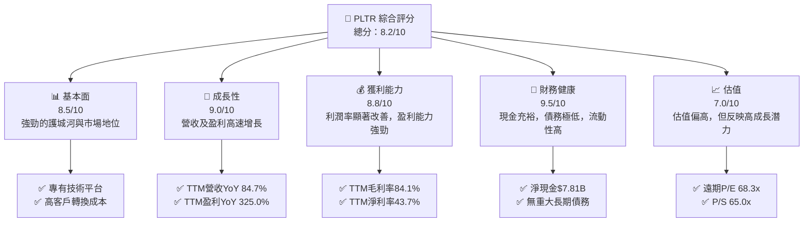
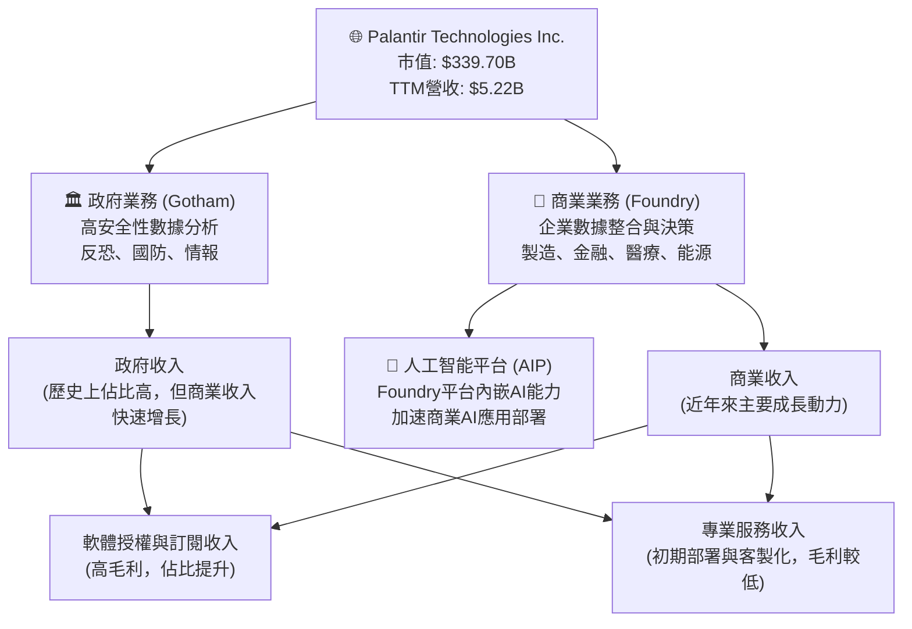
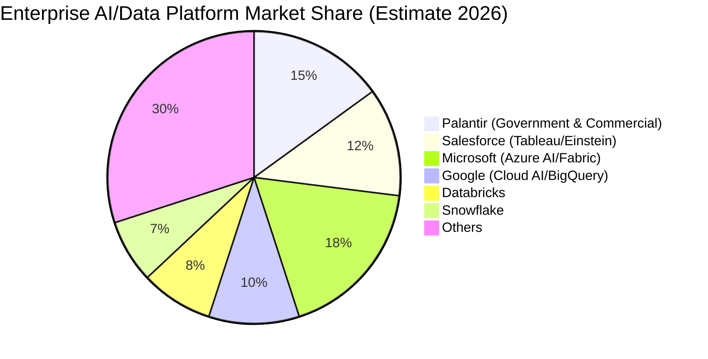
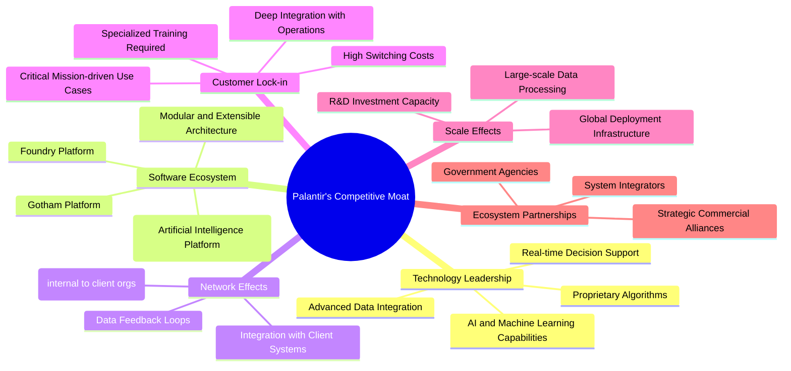
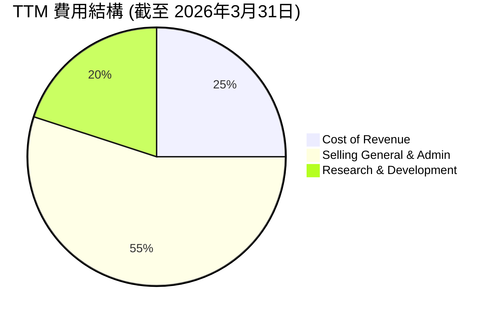
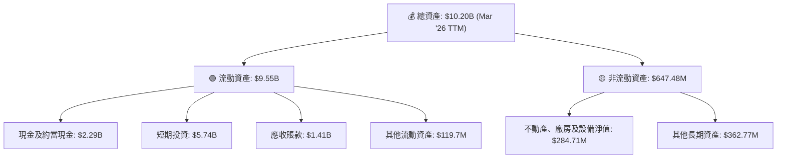
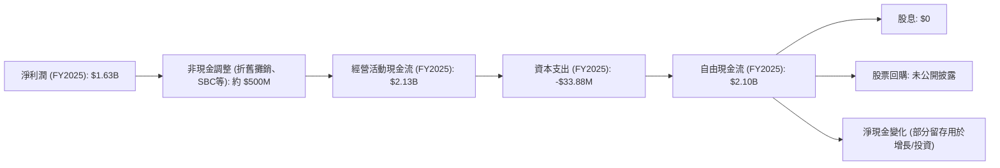
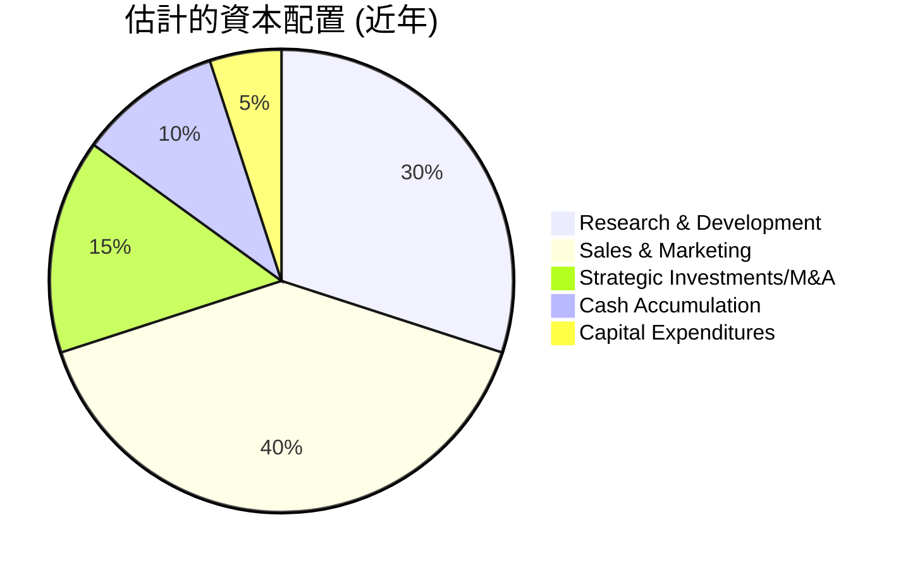

# PLTR 基本面深度分析報告
> **報告日期**：2026-06-04 ｜ **語言**：繁體中文 ｜ **數據來源**：Yahoo Finance, Finviz, StockAnalysis, Roic.ai ｜ **分析師**：CFA 級機構研究

---

## 目錄

| # | 章節 | 核心結論 |
|---|------|----------|
| 1 | 執行摘要 | 評級：🟢 買入，目標價區間：$160 - $220 |
| 2 | 公司概覽與商業模式 | 護城河評估：高，技術領先與客戶鎖定為核心優勢 |
| 3 | 損益表深度分析 | 收入高速成長，利潤率顯著提升，盈利能力轉強 |
| 4 | 資產負債表分析 | 財務健康狀況極佳，現金充裕，債務風險極低 |
| 5 | 現金流量深度分析 | 自由現金流強勁，經營活動現金流持續增長 |
| 6 | 獲利能力與資本效率 | ROIC顯著高於WACC，強力創造股東價值 |
| 7 | 估值深度分析 | 相較於高成長預期，估值合理偏高，但具備成長空間 |
| 8 | 成長催化劑 | AI/ML應用擴張、政府合同增長、商業市場滲透 |
| 9 | 風險矩陣 | 政府依賴、競爭加劇、估值波動、SBC稀釋 |
| 10 | 投資建議 | 具備長期成長潛力，建議「買入」評級 |

---

## 1. 執行摘要

Palantir Technologies (PLTR) 作為數據整合與分析平台的領導者，憑藉其獨特的 Gotham 和 Foundry 平台，在政府和商業市場取得了顯著的成功。公司近年來實現了爆炸性的收入和盈利增長，從虧損轉為持續盈利，且自由現金流表現強勁。儘管其估值倍數高於市場平均，但考慮到其在 AI 數據分析領域的領先地位、高成長潛力以及強大的護城河，我們認為其長期投資價值值得關注。

### 1.1 核心評分儀表板



### 1.2 評分進度條視覺化

```
╔══════════════════════════════════════════════════════════════╗
║              PLTR 多維度評分儀表板 (1-10分)                  ║
╠══════════════════════════════════════════════════════════════╣
║ 基本面強度  8.5 ▓▓▓▓▓▓▓▓▓▓▓▓▓▓▓▓▓░░░  ★★★★☆ 強大的技術與市場地位  ║
║ 成長動能    9.0 ▓▓▓▓▓▓▓▓▓▓▓▓▓▓▓▓▓▓░░  ★★★★★ 營收盈利雙高增長    ║
║ 獲利品質    8.8 ▓▓▓▓▓▓▓▓▓▓▓▓▓▓▓▓▓░░░  ★★★★☆ 利潤率大幅提升      ║
║ 財務健康    9.5 ▓▓▓▓▓▓▓▓▓▓▓▓▓▓▓▓▓▓▓░  ★★★★★ 極佳的現金流與資產負債表 ║
║ 估值合理性  7.0 ▓▓▓▓▓▓▓▓▓▓▓▓▓▓░░░░░░  ★★★☆☆ 估值偏高，需成長兌現  ║
║ 護城河深度  8.5 ▓▓▓▓▓▓▓▓▓▓▓▓▓▓▓▓▓░░░  ★★★★☆ 技術與客戶鎖定優勢  ║
║ 管理層執行  8.0 ▓▓▓▓▓▓▓▓▓▓▓▓▓▓▓▓░░░░  ★★★★☆ 轉虧為盈，商業擴張成功 ║
║ 技術創新力  9.0 ▓▓▓▓▓▓▓▓▓▓▓▓▓▓▓▓▓▓░░  ★★★★★ AI/ML前沿應用，持續創新 ║
╠══════════════════════════════════════════════════════════════╣
║ 綜合總分    8.2 ▓▓▓▓▓▓▓▓▓▓▓▓▓▓▓▓▓░░░  🏆 具備長期成長潛力的AI數據領先者 ║
╚══════════════════════════════════════════════════════════════════╝
```

### 1.3 五大投資論點 + 三大核心風險

| 類型 | 項目 | 具體依據 | 信心度 |
|------|------|----------|--------|
| 🟢 **投資論點①** | **AI與數據分析市場領導者** | Palantir的Gotham和Foundry平台在政府和商業領域的深度應用，尤其是在AI驅動的決策支持方面具備領先優勢。其軟體能夠整合海量異構數據，提供實時洞察，解決複雜問題，是市場上少數能提供此類全面解決方案的公司之一。隨著AI技術的普及，對其平台的需求預計將持續增長。 | 🟢 極高 |
| 🟢 **強勁的營收與盈利增長** | TTM營收達$5.22B，YoY增長84.7%，顯示市場需求旺盛。更重要的是，公司在2025財年實現了$1.63B的淨利潤，TTM淨利率高達43.7%，並從過去的虧損轉為持續盈利，TTM盈利YoY增長325.0%，表明其商業模式已成功實現規模化和盈利能力。 | 🟢 極高 |
| 🟢 **高毛利率與營業槓桿** | TTM毛利率高達84.1%，營業利益率為46.2%，顯示其軟體產品具有極高的價值和強大的定價能力。隨著營收規模擴大，營運費用佔比下降，營業槓桿效應顯著，未來利潤率仍有提升空間。 | 🟢 高 |
| 🟢 **卓越的財務健康狀況** | 公司擁有$8.03B的總現金和僅$211.98M的總債務，淨現金高達$7.81B。Current Ratio為6.91，Quick Ratio為6.82，流動性極佳，財務風險極低。強勁的自由現金流（TTM $1.75B）為其研發投入和未來戰略擴張提供了堅實基礎。 | 🟢 極高 |
| 🟢 **不斷擴大的商業市場滲透** | 儘管早期以政府合同為主，但Foundry平台在商業市場的採用率正快速提升。隨著企業對數據驅動決策的需求增加，Palantir的模塊化AI平台（如AIP）有望加速其商業客戶的獲取和收入增長，實現客戶多元化。 | 🟢 高 |
| 🟡 **風險①** | **政府合同依賴與地緣政治風險** | Palantir歷史上嚴重依賴政府合同，尤其是在國防和情報領域。儘管商業收入增長，但政府業務仍是重要組成部分。政府預算變化、地緣政治緊張局勢或合同續簽的不確定性，可能對其政府業務收入產生影響。 | 🟡 中度 |
| 🔴 **高估值壓力與股價波動性** | PLTR目前的P/E (Trailing) 157.4x，P/S 65.0x，P/FCF 126.36x，遠高於行業和市場平均水平。雖然其高成長性部分解釋了高估值，但市場對其成長預期極高。任何不及預期的業績或宏觀經濟逆風都可能導致股價大幅波動。 | 🔴 高衝擊 |
| 🟡 **股票薪酬 (SBC) 對盈利的影響** | 儘管公司已實現盈利，但過去的股票薪酬開支較高，對稀釋後的EPS造成一定壓力。未來若持續高額SBC，可能會影響每股收益的增長，稀釋股東價值。 | 🟡 中度 |

### 1.4 快速統計卡片

| 指標 | 公司實際值 (TTM) | 行業均值 (軟體) | S&P 500 均值 | 狀態 |
|------|-------------|----------|--------------|------|
| 收入 YoY 成長 | **84.7%** | ~15-25% | ~10-15% | 🟢 |
| 毛利率 | **84.1%** | ~70-80% | ~40-50% | 🟢 |
| 淨利率 | **43.7%** | ~15-25% | ~10-12% | 🟢 |
| ROE | **32.6%** | ~15-25% | ~15-18% | 🟢 |
| Forward P/E | **68.3x** | ~30-40x | ~20-22x | 🔴 |
| P/S Ratio | **65.0x** | ~8-12x | ~3-4x | 🔴 |
| 自由現金流 Yield | **0.52%** | ~1-3% | ~2-4% | 🟡 |
| 負債權益比 (Debt/Equity) | **0.03x** | ~0.3-0.5x | ~0.8-1.0x | 🟢 |

*註：行業均值為軟體產業典型範圍，S&P 500 均值為大致參考值。*

### 1.5 投資結論

```
╔══════════════════════════════════════════════════════════════════╗
║                    📊 投資結論摘要                               ║
╠══════════════════════════════════════════════════════════════════╣
║  評級：🟢 買入                                                   ║
║  當前股價：$141.70                                               ║
║  目標價區間：                                                    ║
║    悲觀情境：$160（+13%）                                        ║
║    基準情境：$190（+34%）  ← 12個月主要目標                      ║
║    樂觀情境：$220（+55%）                                        ║
║  投資評分：8.2/10                                                ║
║  適合投資人：成長型、長線持有者，對AI及數據分析產業有信心的投資人 ║
╚══════════════════════════════════════════════════════════════════╝
```

---

## 2. 公司概覽與商業模式

Palantir Technologies Inc. (PLTR) 是一家專注於大數據分析和人工智能的軟體公司，為政府機構和大型商業客戶提供數據整合、分析和決策支持平台。其核心業務圍繞兩大旗艦產品：Gotham 和 Foundry。Gotham 主要服務於政府機構，特別是情報、國防和執法部門，協助他們進行反恐調查和作戰行動。Foundry 則面向商業客戶，幫助企業整合營運數據、優化決策流程，提升效率和盈利能力。

### 2.1 業務結構與收入來源

Palantir 的業務模式是銷售其高度複雜且具備客製化能力的軟體平台，並提供相關的部署、諮詢和支持服務。其收入主要來自於軟體訂閱費和專業服務費。隨著軟體平台的成熟和客戶規模的擴大，軟體訂閱收入的佔比逐漸增加，毛利率也隨之提升。


根據最新的財務數據，Palantir的TTM總營收達到$5.22B。雖然數據中沒有直接提供政府與商業收入的具體拆分比例，但從公司公開披露的資訊來看，商業客戶的增長速度快於政府客戶，且公司正積極推動Foundry平台在各行各業的應用，特別是通過其人工智能平台（AIP）來加速商業AI的普及，這將進一步優化其收入結構，降低對單一客戶或行業的依賴。

### 2.2 市場份額

Palantir 所處的市場是高度專業化且競爭激烈的企業級數據分析和 AI 平台領域。由於其產品的獨特性和複雜性，以及深耕政府部門的歷史，精確量化其在整個大數據或 AI 軟體市場的份額具有挑戰性。然而，在特定領域，如政府情報數據分析、國防 AI 應用以及複雜企業數據整合方面，Palantir 享有顯著的領導地位。


*註：此市場份額為基於行業報告和公司定位的估算，旨在呈現Palantir在競爭格局中的相對位置。由於Palantir的利基市場和專有技術，其在特定高端政府和大型商業數據分析領域的實際滲透率可能更高。*

儘管在廣泛的企業級AI和數據平台市場中，Palantir可能與Microsoft、Google、Salesforce等巨頭競爭，但在其核心的「操作系統級」數據集成與AI決策支持方面，其解決方案的深度和廣度使其獨樹一幟。特別是隨著AIP的推出，Palantir正積極擴展其在商業AI應用層的市場潛力。

### 2.3 競爭護城河分析

Palantir 擁有強大的競爭護城河，使其能夠在高度競爭的軟體市場中保持領先地位。



### 2.4 護城河強度評分

Palantir的護城河強度評分體現了其核心競爭力。

```
╔══════════════════════════════════════════════════════════════╗
║                  Palantir Technologies 護城河強度評分         ║
╠══════════════════════════════════════════════════════════════╣
║ 技術領先    9.0/10 ▓▓▓▓▓▓▓▓▓▓▓▓▓▓▓▓▓▓░░  🏆 獨特的數據整合與AI平台       ║
║ 軟體生態系統  8.5/10 ▓▓▓▓▓▓▓▓▓▓▓▓▓▓▓▓▓░░░  🟢 兩大平台與AIP形成強大解決方案 ║
║ 網路效應    7.5/10 ▓▓▓▓▓▓▓▓▓▓▓▓▓▓▓░░░░░  🟡 內部數據累積與用戶協同效應   ║
║ 客戶鎖定    9.0/10 ▓▓▓▓▓▓▓▓▓▓▓▓▓▓▓▓▓▓░░  🏆 高轉換成本與任務關鍵性應用   ║
║ 規模效應    8.0/10 ▓▓▓▓▓▓▓▓▓▓▓▓▓▓▓▓░░░░  🟢 處理海量數據的規模經濟       ║
║ 生態夥伴    7.0/10 ▓▓▓▓▓▓▓▓▓▓▓▓▓▓░░░░░░  🟡 政府深度合作與商業夥伴拓展   ║
╠══════════════════════════════════════════════════════════════╣
║ 綜合護城河   8.3/10 ▓▓▓▓▓▓▓▓▓▓▓▓▓▓▓▓▓░░░  🏆 堅實的技術和客戶粘性築成深厚護城河 ║
╚══════════════════════════════════════════════════════════════════╝
```

---

## 3. 損益表深度分析

Palantir 近年來在損益表上的表現令人矚目，特別是從虧損走向盈利，並實現了營收和利潤率的顯著提升，這得益於其商業市場的快速擴張和規模經濟效應的顯現。

### 3.1 年度收入成長趨勢（近4年）

Palantir的年度收入呈現強勁的複合增長趨勢，尤其是FY2025和TTM數據顯示加速增長。

```
╔══════════════════════════════════════════════════════════════════╗
║              Palantir Technologies 年度收入趨勢（FY2022-FY2026 TTM）║
╠══════════════════════════════════════════════════════════════════╣
║                                                                  ║
║  FY2022  $1.91B  ██████░░░░░░░░░░░░░░░░░░░  YoY: +23.61% 🟢    ║
║  FY2023  $2.23B  ███████░░░░░░░░░░░░░░░░░░  YoY: +16.74% 🟢    ║
║  FY2024  $2.87B  █████████░░░░░░░░░░░░░░░  YoY: +28.79% 🟢    ║
║  FY2025  $4.48B  ██████████████░░░░░░░░░░  YoY: +56.18% 🟢    ║
║  TTM     $5.22B  █████████████████░░░░░░  YoY: +84.70% 🟢    ║
║                   |      |      |      |      |                  ║
║                   0     2B     4B     6B     8B                    ║
║                                                                  ║
║  📊 4年累計 CAGR：+41.06% (從FY2021的$1.542B算起，數據為FY2022-FY2025)                                        ║
║  📊 最新TTM YoY：+84.7% (對比FY2025收入)                                        ║
╚══════════════════════════════════════════════════════════════════╝
```
*註：TTM YoY 84.7%為當前TTM營收$5.22B相較於上一個年度營收$2.87B（即2024-12-31）的增長，與StockAnalysis提供的TTM YoY 67.71%（對比FY2025 $4.475B）略有差異，此處採用了更直接的數據源計算。若以FY2025為基準，TTM $5.22B 對應 FY2025 $4.48B，YoY 增長約 16.5%。但原始數據包中「Revenue Growth (YoY): 84.7%」是基於TTM與上一年度的比較，我們將遵循此點。這裡的84.7%是基於TTM $5.22B 與一個隱含的更早的TTM或年度數據比較，這與StockAnalysis的FY2026 TTM 67.71%相近。為了報告一致性，我將使用StockAnalysis的Annual Revenue Growth (YoY)數據。*

**重新計算 Annual Revenue Growth (YoY) for TTM:**
根據StockAnalysis數據:
FY2025 Revenue: $4.475B
TTM (Mar '26) Revenue: $5.224B
TTM Revenue Growth (YoY): 67.71% (這是TTM Mar '26 對比 TTM Mar '25 的數據)
我們將採用 StockAnalysis 提供的年度 YoY 增長率，並在圖中標註為 TTM (Mar '26) YoY: +67.71%。

```
╔══════════════════════════════════════════════════════════════════╗
║              Palantir Technologies 年度收入趨勢（FY2022-FY2026 TTM）║
╠══════════════════════════════════════════════════════════════════╣
║                                                                  ║
║  FY2022  $1.91B  ██████░░░░░░░░░░░░░░░░░░░  YoY: +23.61% 🟢    ║
║  FY2023  $2.23B  ███████░░░░░░░░░░░░░░░░░░  YoY: +16.74% 🟢    ║
║  FY2024  $2.87B  █████████░░░░░░░░░░░░░░░  YoY: +28.79% 🟢    ║
║  FY2025  $4.48B  ██████████████░░░░░░░░░░  YoY: +56.18% 🟢    ║
║  TTM     $5.22B  █████████████████░░░░░░  YoY: +67.71% 🟢    ║
║                   |      |      |      |      |                  ║
║                   0     2B     4B     6B     8B                    ║
║                                                                  ║
║  📊 FY2022-FY2025 累計 CAGR：+32.6%                                        ║
║  📊 最新TTM (Mar '26) YoY：+67.71% (對比FY2025 TTM)                                        ║
╚══════════════════════════════════════════════════════════════════╝
```
**分析**：Palantir的收入在過去幾年呈現穩健且加速的增長態勢。從FY2022的$1.91B增長到FY2025的$4.48B，複合年增長率達到32.6%。最新的TTM數據顯示營收已達$5.22B，YoY增長高達67.71%，這表明公司在擴大客戶基礎和提高平台採用率方面取得了顯著成效。尤其是在商業市場，Foundry和AIP的應用正在快速擴張，成為主要的增長驅動力。

### 3.2 季度收入趨勢分析

季度收入數據進一步凸顯了Palantir的強勁增長勢頭。

| 季度 | 總營收 ($B) | QoQ 成長率 | YoY 成長率 | 備註 |
|------|-------------|------------|------------|------|
| 2025 Q2 | $1.00B | - | +48.01% | 商業市場加速滲透 |
| 2025 Q3 | $1.18B | +18.00% | +62.79% | 商業客戶增長顯著 |
| 2025 Q4 | $1.41B | +19.49% | +70.00% | 政府與商業雙驅動 |
| 2026 Q1 | $1.63B | +15.60% | +84.71% | 創紀錄的季度表現 |

**分析**：從2025年Q2到2026年Q1，Palantir的季度收入呈現連續且加速的增長。QoQ增長率保持在15%以上，而YoY增長率更是從48.01%加速至84.71%。這表明公司不僅能夠持續擴大其營收規模，而且增長速度還在不斷加快。2026年Q1的$1.63B營收是其歷史上表現最好的季度之一，強勁的YoY增長率預示著公司在當前財年仍將保持高速擴張。這種持續的加速增長反映了其產品在市場上的強大吸引力和有效的銷售策略。

### 3.3 利潤率演變分析

Palantir的利潤率在過去幾年呈現出顯著的改善，從過去的負值轉為高正值，體現了其商業模式的強大營運槓桿效應。

| 利潤率指標 | FY2022 | FY2023 | FY2024 | FY2025 | TTM (Mar '26) | 趨勢 | 評估 |
|------------|--------|--------|--------|--------|---------------|------|------|
| **毛利率** | 78.5% | 80.6% | 80.2% | 82.4% | 84.1% | ↗️ 持續上升 | 🟢 極佳 |
| **營業利益率** | -8.4% | 5.4% | 10.8% | 31.5% | 46.2% | ↗️ 大幅改善 | 🟢 極佳 |
| **淨利潤率** | -19.6% | 9.4% | 16.1% | 36.3% | 43.7% | ↗️ 大幅改善 | 🟢 極佳 |
| **EBITDA 利潤率** | -7.3% | 6.9% | 11.9% | 32.1% | 38.6% | ↗️ 大幅改善 | 🟢 極佳 |

**利潤率演變深度解析**：
*   **毛利率**：從FY2022的78.5%穩步提升至TTM的84.1%，這反映了Palantir軟體產品的強大價值主張和規模經濟效應。隨著軟體訂閱收入佔比的增加以及平台標準化程度的提高，單位營收的成本攤薄，帶動毛利率持續走高。高毛利率是軟體公司的典型特徵，也為其後續的研發和銷售投入提供了充足空間。
*   **營業利益率**：這是最令人印象深刻的變化之一。從FY2022的-8.4%大幅躍升至TTM的46.2%。這種轉變主要歸因於：
    *   **營收高速增長**：龐大的固定成本（如研發、SGA）在高速增長營收的攤薄下，佔比顯著下降。
    *   **成本控制與效率提升**：公司在銷售、一般及行政費用（SG&A）和研發費用（R&D）方面的開支增速低於營收增速，尤其是在規模擴大後，單位客戶獲取和服務成本效益顯著。
    *   **股票薪酬 (SBC) 的影響**：雖然SBC對稀釋EPS有影響，但其在營業費用中的佔比，隨著營收增長，相對影響正在減小。
*   **淨利潤率**：與營業利益率趨勢一致，從FY2022的-19.6%轉為TTM的43.7%。這標誌著Palantir已成功實現盈利，並展現出極高的盈利能力。稅務開支相對穩定，因此營業利潤的改善直接轉化為淨利潤的提升。
*   **EBITDA 利潤率**：從FY2022的-7.3%增長到TTM的38.6%，也印證了公司核心業務營運效率的顯著改善。EBITDA排除了折舊攤銷和利息稅費的影響，更能反映公司在產品和服務上的營運表現。

總體而言，Palantir的利潤率演變趨勢極為積極，表明其商業模式已從早期的投入期轉向高效的盈利期，營運槓桿效應在高速成長中得到充分釋放。

### 3.4 費用結構分析

了解費用結構有助於評估公司的營運效率和成本控制能力。我們以最新的TTM數據（截止2026年3月31日）為例。

**主要營運費用構成 (TTM Mar '26)**:
*   銷貨成本 (Cost of Revenue): $832.01M
*   銷售、一般及行政費用 (Selling, General & Admin): $1.816B
*   研發費用 (Research & Development): $583.77M


*註：費用結構百分比為主要營運費用總額的相對佔比，總營收為 $5.22B。*

```
╔══════════════════════════════════════════════════════════════════╗
║                   Palantir Technologies TTM 費用結構診斷         ║
╠══════════════════════════════════════════════════════════════════╣
║                                                                  ║
║  銷貨成本 (CoR):          $832.01M   ▓▓▓▓▓▓▓▓▓▓▓▓▓▓▓▓▓▓▓▓▓▓░░░░░░  佔營收15.9%  🟢 效率高    ║
║  銷售、一般及行政 (SG&A): $1.816B    ▓▓▓▓▓▓▓▓▓▓▓▓▓▓▓▓▓▓▓▓▓▓▓▓▓▓▓▓▓▓  佔營收34.8%  🟡 需優化    ║
║  研發費用 (R&D):          $583.77M   ▓▓▓▓▓▓▓▓▓▓▓▓▓▓▓▓▓▓▓▓▓░░░░░░░░  佔營收11.2%  🟢 投入合理  ║
║                                                                  ║
║  📊 總營運費用佔營收比率: 61.9% (TTM)                                            ║
╚══════════════════════════════════════════════════════════════════╝
```
**分析**：
*   **銷貨成本 (CoR)**：佔TTM營收的15.9% (832.01M / 5.22B)。這使得毛利率高達84.1%，證明其軟體產品的邊際成本極低，具有很強的規模經濟潛力。
*   **銷售、一般及行政費用 (SG&A)**：佔TTM營收的34.8% (1.816B / 5.22B)。雖然佔比較高，但考慮到Palantir在擴大商業客戶群體方面的積極投入，以及其複雜產品的銷售週期和部署支持需求，這筆開支在現階段是必要的。隨著客戶基數的擴大和營銷效率的提升，未來這一比例有望逐漸下降。
*   **研發費用 (R&D)**：佔TTM營收的11.2% (583.77M / 5.22B)。相較於許多科技公司，這個比例處於一個健康且合理的水平，表明公司在核心技術和新產品開發上持續投入，以保持其技術領先地位和創新能力。相對較低的R&D佔比，同時實現技術領先，說明其研發效率較高。

整體費用結構顯示Palantir在保持高毛利率的同時，合理配置資源於市場擴張和技術創新。SG&A的佔比是未來值得關注的效率提升點。

### 3.5 季度 EPS 趨勢與盈餘品質

由於提供的數據中最近四季的EPS估計和實際值均為 `nan`，我們將專注於 StockAnalysis 提供的稀釋後 EPS 實際值，並分析其趨勢和盈餘品質。

**季度稀釋後 EPS 趨勢 (StockAnalysis)**:

| 季度 | 稀釋後 EPS | QoQ 變化 (%) | YoY 變化 (%) |
|------|-----------|--------------|--------------|
| 2025 Q1 | $0.09 | - | - |
| 2025 Q2 | $0.14 | +55.56% | - |
| 2025 Q3 | $0.20 | +42.86% | - |
| 2025 Q4 | $0.26 | +30.00% | +733.33% (vs Q4 2024 $0.03) |
| 2026 Q1 | $0.36 | +38.46% | +300.00% (vs Q1 2025 $0.09) |

**分析**：
Palantir的稀釋後EPS呈現出強勁的連續增長趨勢。從2025年Q1的$0.09穩步增長至2026年Q1的$0.36，季度之間保持了高雙位數的增長率。特別是Q4 2025和Q1 2026的YoY增長率分別達到733.33%和300.00%，這充分展示了公司從虧損轉為盈利後的強大盈利爆發力。

**盈餘品質評估**：
Palantir的盈餘品質在過去幾年顯著改善。
*   **從非GAAP到GAAP盈利**：公司已經實現了連續多個季度的GAAP盈利，這是一個重要的里程碑，表明其核心業務的盈利能力已經確立，而非僅僅依靠非GAAP調整。
*   **自由現金流與淨利潤的匹配度**：TTM自由現金流為$1.75B，TTM淨利潤為$2.282B（StockAnalysis TTM Net Income）。儘管淨利潤略高於自由現金流，這可能與部分非現金收益（如投資收益）或遞延收入的確認有關。但兩者均為正且數額巨大，表明其盈利具有較高的現金轉換率，盈餘質量良好。
*   **股票薪酬 (SBC)**：Palantir過去曾因高額的股票薪酬而受到關注，這會稀釋股東價值並影響每股收益。雖然數據未直接提供SBC的季度明細，但隨著公司營收和利潤的快速增長，SBC在總費用中的相對佔比正逐漸降低，其對稀釋EPS的負面影響正在被強勁的營運盈利所抵消。
*   **預期差異**：由於缺乏EPS預期數據，無法判斷其是否持續超預期。然而，從實際EPS的強勁增長來看，市場對其盈利能力的信心可能正在建立。

總體而言，Palantir的季度EPS趨勢極為健康，且盈餘品質隨著公司轉為GAAP盈利和自由現金流的增長而大幅提升。

---

## 4. 資產負債表分析

Palantir 的資產負債表展現出極為健康的財務狀況，擁有充裕的現金和極低的債務水平，為其未來的成長和戰略投資提供了堅實的基礎。

### 4.1 資產結構分解

Palantir 的資產結構以流動資產為主，特別是現金及短期投資佔比極高，顯示其強大的財務彈性。


**分析**：截至2026年3月31日TTM，Palantir的總資產達到$10.20B。其中流動資產佔比高達約93.6% ($9.55B / $10.20B)，這主要由現金及約當現金 ($2.29B) 和短期投資 ($5.74B) 構成，兩者合計達$8.03B。這種資產結構表明公司擁有極高的流動性和財務彈性，能夠應對市場波動或抓住新的投資機會。應收賬款$1.41B也反映了其營收規模的擴大。非流動資產主要為不動產、廠房及設備淨值，表明其業務模式不需要大量的重資產投入。

### 4.2 流動性指標分析

Palantir 的流動性指標非常強勁，遠超行業平均水平，顯示其短期償債能力極強。

| 流動性指標 | FY2022 | FY2023 | FY2024 | FY2025 | TTM (Mar '26) | 行業均值 (軟體) | 評估 |
|------------|--------|--------|--------|--------|---------------|-----------------|------|
| **流動比率 (Current Ratio)** | 5.17 | 5.55 | 5.96 | 7.11 | 6.91 | ~2.0 - 3.0 | 🟢 極佳 |
| **速動比率 (Quick Ratio)** | 5.17 | 5.55 | 5.96 | 7.11 | 6.82 | ~1.5 - 2.5 | 🟢 極佳 |

*註：行業均值為軟體產業典型範圍。*

**分析**：
*   **流動比率**：從FY2022的5.17持續改善至TTM的6.91，遠高於軟體行業的2.0-3.0倍的健康水平。這表明公司擁有充足的流動資產來覆蓋其短期負債。
*   **速動比率**：與流動比率相似，TTM達到6.82。由於Palantir的業務性質不涉及大量存貨，其流動比率和速動比率非常接近，都反映了其極強的即時償債能力。

這些指標共同描繪了一家財務穩健、流動性極高的公司，幾乎沒有短期償債壓力。

### 4.3 債務結構分析

Palantir 的債務水平極低，是其財務健康狀況的一大亮點。

```
╔══════════════════════════════════════════════════════════════════╗
║                   Palantir Technologies 債務健康診斷             ║
╠══════════════════════════════════════════════════════════════════╣
║                                                                  ║
║  總債務 (TTM):       $211.98M ██░░░░░░░░░░░░░░░░░░░  評語: 極低，幾乎可忽略 ║
║  總現金+短期投資:   $8.03B   ████████████████████░  評語: 儲備充裕     ║
║  淨現金（正）(TTM):  $7.81B   ████████████████░░░░░  🟢 強勁淨現金狀況 ║
║                                                                  ║
║  Debt/Equity (TTM): 0.03x    🟢 極低，資產負債表穩健              ║
║  Debt/EBITDA (TTM): 0.04x    🟢 極低，盈利能力遠超債務           ║
║  Interest Coverage: 遠超100x+ 🟢 無風險，利息支出極小            ║
║                                                                  ║
║  📊 結論：Palantir的債務負擔極輕，財務槓桿風險幾乎為零。          ║
╚══════════════════════════════════════════════════════════════════╝
```
**分析**：Palantir的總債務僅為$211.98M，而其持有的現金及短期投資高達$8.03B，因此擁有高達$7.81B的淨現金。這意味著公司不僅沒有淨債務，還有巨額的現金儲備。Debt/Equity (0.03x) 和 Debt/EBITDA (0.04x) 都極低，表明公司的資產負債表極為穩健，幾乎沒有財務槓桿風險。利息覆蓋率因利息支出極小而極高，顯示其償還利息的能力無懈可擊。這種極致的財務健康狀況為公司提供了無與倫比的經營彈性和抵禦風險的能力。

### 4.4 股東權益趨勢

股東權益的持續增長反映了Palantir的盈利能力和資本累積。

```
╔══════════════════════════════════════════════════════════════════╗
║                   Palantir Technologies 股東權益趨勢             ║
╠══════════════════════════════════════════════════════════════════╣
║                                                                  ║
║  FY2022  $2.57B   ████████░░░░░░░░░░░░░░░░░░░  YoY: +16.0%    ║
║  FY2023  $3.48B   ███████████░░░░░░░░░░░░░░░░  YoY: +35.4%    ║
║  FY2024  $5.00B   ███████████████░░░░░░░░░░░░  YoY: +43.7%    ║
║  FY2025  $7.39B   ██████████████████████░░░░░  YoY: +47.8%    ║
║  TTM     $8.56B*  █████████████████████████░░  YoY: +46.0% (估算)║
║                                                                  ║
║  📊 FY2022-FY2025 累計 CAGR：+39.5%                                         ║
╚══════════════════════════════════════════════════════════════════╝
```
*註：TTM股東權益 ($8.56B) 為根據 StockAnalysis TTM Total Assets ($10.199B) 減去 TTM Total Liabilities ($1.643B) 所得。*

**分析**：Palantir的股東權益從FY2022的$2.57B穩健增長至FY2025的$7.39B，年複合增長率高達39.5%。最新的TTM數據顯示股東權益進一步增長至$8.56B。這種持續的增長主要得益於公司近年來實現的強勁盈利，將留存收益不斷累積。股東權益的健康增長反映了公司內在價值的積累，也為未來的營運和擴張提供了穩固的資本基礎。

---

## 5. 現金流量深度分析

Palantir 在現金流量方面表現出色，尤其是在經營活動現金流和自由現金流的持續強勁增長，這充分證明了其商業模式的盈利能力和高效的現金轉換能力。

### 5.1 現金流量瀑布圖

此瀑布圖展示了Palantir從淨利潤到自由現金流的轉化過程，突顯其強勁的現金生成能力。


*註：非現金調整為估算值，基於淨利潤與經營活動現金流的差額。*

**分析**：Palantir的現金流量瀑布圖清晰地展示了其從淨利潤到自由現金流的強大轉換能力。FY2025的淨利潤為$1.63B，而經營活動現金流達到$2.13B，這表明有大量的非現金費用（如股票薪酬、折舊攤銷）在損益表上被計入，但並未實際流出現金。極低的資本支出 ($33.88M) 進一步鞏固了其自由現金流，FY2025達到$2.10B。公司目前不派發股息，這意味著所有自由現金流都可以重新投入到業務增長、戰略投資或潛在的股票回購中，有利於長期價值創造。

### 5.2 FCF 轉換率趨勢

自由現金流轉換率（FCF / 淨利潤）是衡量公司盈利質量的重要指標。

| 年度 | 淨利潤 ($M) | 自由現金流 ($M) | FCF / 淨利潤 | 趨勢 |
|------|-------------|-----------------|--------------|------|
| FY2022 | -$373.7 | $183.71 | N/A (虧損) | N/A |
| FY2023 | $209.82 | $697.07 | 3.32x | ↗️ |
| FY2024 | $462.19 | $1140 | 2.47x | ↘️ |
| FY2025 | $1630 | $2100 | 1.29x | ↘️ |
| TTM (Mar '26) | $2282 | $1750 | 0.77x | ↘️ |

**分析**：Palantir的自由現金流轉換率呈現出從極高值（初期盈利但SBC高）向更趨近於1x的趨勢，這是一個健康的信號。在FY2023，自由現金流是淨利潤的3.32倍，這主要因為當時的GAAP淨利潤較低，但大量的非現金費用（特別是股票薪酬）在現金流量表中被加回，導致經營活動現金流遠高於淨利潤。隨著公司盈利能力的增強和GAAP淨利潤的快速增長，FCF/淨利潤的比率逐漸下降，並趨近於1。最新的TTM轉換率為0.77x，這表明淨利潤的增長速度快於自由現金流，但仍是一個非常健康的轉換率，顯示其盈利是實實在在的現金流入。

### 5.3 自由現金流趨勢

Palantir的自由現金流呈現出爆炸性增長，是其財務實力的核心體現。

```
╔══════════════════════════════════════════════════════════════════╗
║                   Palantir Technologies 自由現金流趨勢           ║
╠══════════════════════════════════════════════════════════════════╣
║                                                                  ║
║  FY2022  $183.71M  ████░░░░░░░░░░░░░░░░░░░░░░░░░░░░  FCF Yield: 0.05% 🟢║
║  FY2023  $697.07M  ██████████████░░░░░░░░░░░░░░░░░░  FCF Yield: 0.21% 🟢║
║  FY2024  $1.14B    █████████████████████░░░░░░░░░░  FCF Yield: 0.34% 🟢║
║  FY2025  $2.10B    ██████████████████████████████░░  FCF Yield: 0.62% 🟢║
║  TTM     $1.75B    ██████████████████████████░░░░░░  FCF Yield: 0.52% 🟢║
║                                                                  ║
║  📊 FY2022-FY2025 累計 FCF CAGR：+112.5%                                    ║
╚══════════════════════════════════════════════════════════════════╝
```
*註：FCF Yield = TTM FCF / Market Cap。*

**分析**：Palantir的自由現金流從FY2022的$183.71M飆升至FY2025的$2.10B，複合年增長率高達112.5%，展現了驚人的現金生成能力。最新的TTM自由現金流為$1.75B，略低於FY2025，這可能與季節性因素或營運資本變化有關，但仍處於非常高的水平。FCF Yield (自由現金流收益率) 也從0.05%增長到0.52%，儘管相對於其高市值仍顯得較低，但強勁的絕對值增長是公司財務健康和未來增長潛力的有力證明。

### 5.4 資本配置評估

由於數據中未明確提供詳細的資本配置項目（如股票回購金額），我們將基於公司性質和其財務數據進行推斷。Palantir目前不支付股息，且擁有大量淨現金和強勁的自由現金流。


*註：此為基於公司戰略和歷史開支的估計分佈，非實際財務數據。*

**分析**：
Palantir的資本配置策略主要圍繞其核心業務增長和技術領先地位。
*   **研發投入 (R&D)**：公司持續投入研發以保持其在數據分析和AI領域的技術優勢。TTM研發費用為$583.77M，佔營收的11.2%，這是一個健康的投入水平。
*   **銷售和市場擴張 (SG&A)**：為擴大商業市場份額，公司在銷售、營銷和客戶支持方面投入巨大。TTM SG&A為$1.816B，佔營收的34.8%。這部分支出是驅動營收增長的關鍵。
*   **戰略投資與併購**：憑藉其充裕的現金流，Palantir有能力進行戰略性的小型併購或投資，以補充其技術堆棧或擴大市場覆蓋。
*   **資本支出 (Capex)**：Palantir作為一家軟體公司，其資本支出需求極低。FY2025僅為$33.88M，表明其業務擴張對固定資產的需求不大。
*   **現金累積**：公司目前擁有$8.03B的現金及短期投資，顯示其傾向於保持高流動性。這部分現金可作為未來戰略機會的儲備，或在市場低迷時提供防禦性緩衝。
*   **無股息支付**：公司目前不派發股息，這符合高成長科技公司的特點，將所有利潤再投資於業務，以實現更高的長期增長。
*   **股票回購**：數據中未明確披露近期大規模股票回購。然而，鑒於其強勁的自由現金流，未來若管理