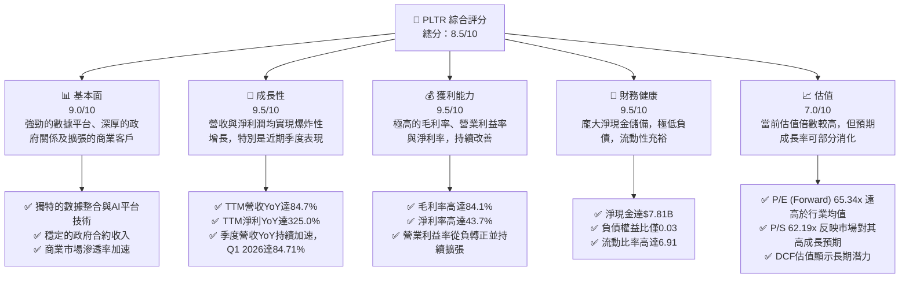
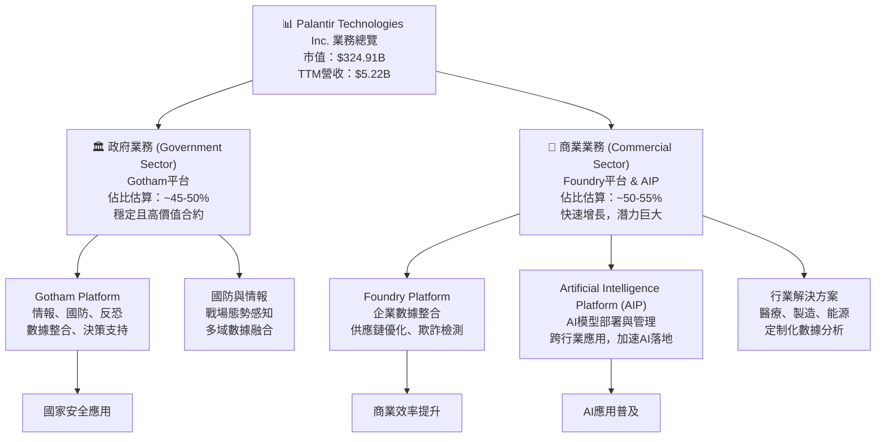
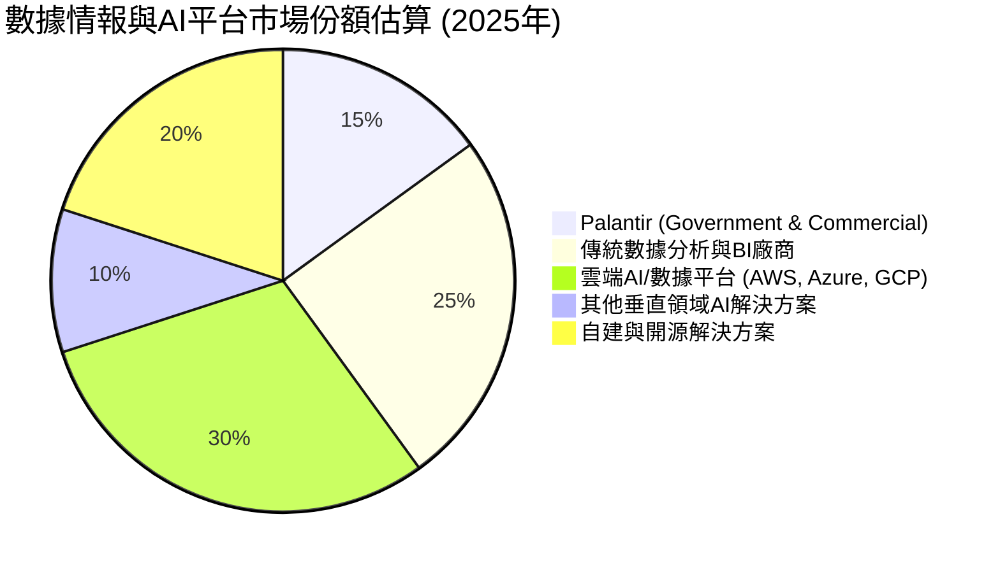
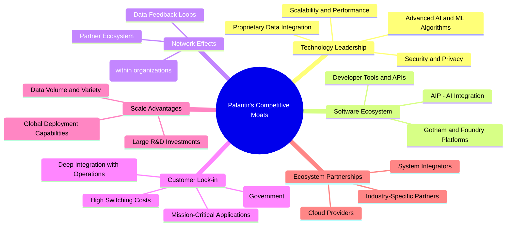
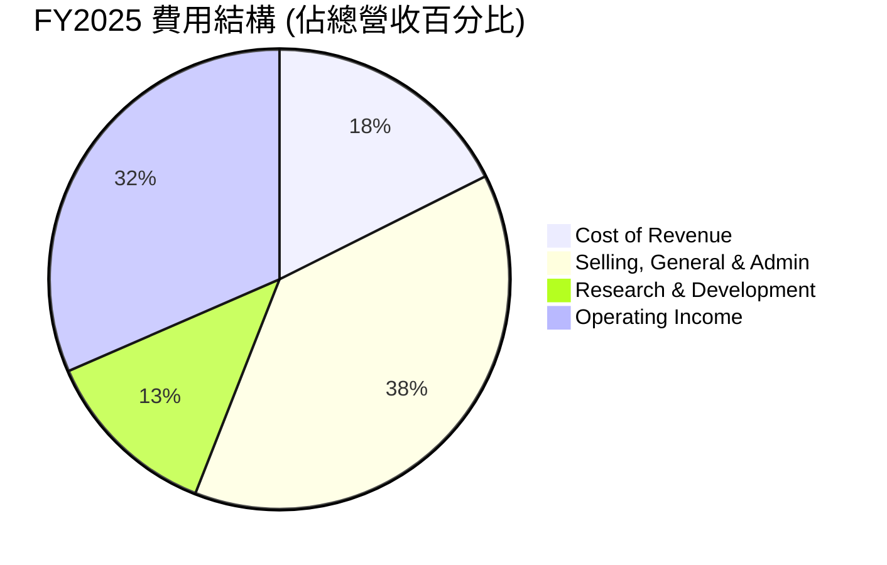
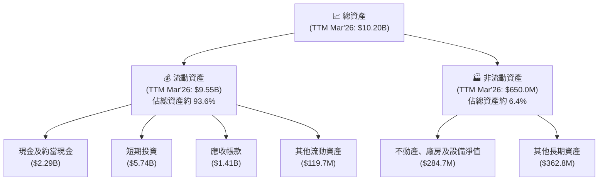

# PLTR 基本面深度分析報告
> **報告日期**：2026-06-05 ｜ **語言**：繁體中文 ｜ **數據來源**：Yahoo Finance, Finviz, StockAnalysis, Roic.ai ｜ **分析師**：CFA 級機構研究

## 目錄

| # | 章節 | 核心結論 |
|---|------|----------|
| 1 | 執行摘要 | 強烈買入，目標價區間 $160 - $220 |
| 2 | 公司概覽與商業模式 | 創新數據平台，深厚政府客戶基礎，商業市場快速擴張 |
| 3 | 損益表深度分析 | 營收高速增長，毛利率極高，獲利能力顯著改善 |
| 4 | 資產負債表分析 | 財務狀況極為健康，淨現金充裕，流動性強 |
| 5 | 現金流量深度分析 | 自由現金流強勁且持續增長，資本效率高 |
| 6 | 獲利能力與資本效率 | ROIC顯著超越WACC，強力創造股東價值 |
| 7 | 估值深度分析 | 相對估值偏高，但DCF顯示具備長期增長潛力 |
| 8 | 成長催化劑 | AI平台應用擴張，政府與商業客戶雙引擎驅動 |
| 9 | 風險矩陣 | 高估值與客戶集中度為主要風險，管理層具緩解能力 |
| 10 | 投資建議 | 強烈買入，適合成長型與長線投資者 |

---

## 1. 執行摘要

Palantir Technologies Inc. (PLTR) 作為一家領先的數據整合與人工智慧平台供應商，在政府情報與商業企業市場均展現出卓越的技術實力與市場潛力。本報告基於最新的財務數據，對 PLTR 進行了全面的基本面深度分析，旨在為投資者提供清晰的投資視角。

公司在過去幾年實現了驚人的營收增長，並成功扭虧為盈，展現出強大的獲利能力與現金流生成能力。其獨特的軟體平台，特別是 Gotham 和 Foundry，在處理複雜數據集和提供深度洞察方面建立了顯著的競爭優勢。儘管當前估值倍數偏高，但考慮到其高速增長潛力、極高的毛利率、穩健的財務狀況以及在人工智慧領域的戰略地位，我們認為 PLTR 仍具備吸引人的長期投資價值。

### 1.1 核心評分儀表板



### 1.2 評分進度條視覺化

```
╔══════════════════════════════════════════════════════════════╗
║              PLTR 多維度評分儀表板 (1-10分)                  ║
╠══════════════════════════════════════════════════════════════╣
║ 基本面強度  9.0 ▓▓▓▓▓▓▓▓▓▓▓▓▓▓▓▓▓▓░░  ★★★★★           ║
║ 成長動能    9.5 ▓▓▓▓▓▓▓▓▓▓▓▓▓▓▓▓▓▓▓░  ★★★★★           ║
║ 獲利品質    9.5 ▓▓▓▓▓▓▓▓▓▓▓▓▓▓▓▓▓▓▓░  ★★★★★           ║
║ 財務健康    9.5 ▓▓▓▓▓▓▓▓▓▓▓▓▓▓▓▓▓▓▓░  ★★★★★           ║
║ 估值合理性  7.0 ▓▓▓▓▓▓▓▓▓▓▓▓▓▓░░░░░░  ★★★★☆           ║
║ 護城河深度  9.0 ▓▓▓▓▓▓▓▓▓▓▓▓▓▓▓▓▓▓░░  ★★★★★           ║
║ 管理層執行  8.5 ▓▓▓▓▓▓▓▓▓▓▓▓▓▓▓▓▓░░░  ★★★★☆           ║
║ 技術創新力  9.5 ▓▓▓▓▓▓▓▓▓▓▓▓▓▓▓▓▓▓▓░  ★★★★★           ║
╠══════════════════════════════════════════════════════════════╣
║ 綜合總分    8.9 ▓▓▓▓▓▓▓▓▓▓▓▓▓▓▓▓▓▓░░  🏆 具備長期投資價值    ║
╚══════════════════════════════════════════════════════════════╝
```

### 1.3 五大投資論點 + 三大核心風險

| 類型 | 項目 | 具體依據 | 信心度 |
|------|------|----------|--------|
| 🟢 **投資論點①** | **數據基礎設施領導者** | Palantir 的 Gotham 和 Foundry 平台在處理海量、複雜和異構數據方面無與倫比，尤其在國防、情報和重工業領域。其技術能力體現在高達 84.1% 的毛利率上，顯示其軟體產品具備極強的附加價值和規模化潛力。 | 🟢 極高 |
| 🟢 **AI 平台 AIP 帶動新一輪增長** | AIP (Artificial Intelligence Platform) 的推出和快速普及，使客戶能夠在其數據基礎上快速部署和管理 AI 模型。這不僅提升了客戶粘性，也開闢了新的收入來源。Q1 2026 營收達 $1.63B，YoY 增長 84.71%，證明了新產品對營收的強勁拉動作用。 | 🟢 極高 |
| 🟢 **商業市場加速擴張** | 儘管 Palantir 起家於政府業務，但其商業客戶增長已成為主要驅動力。隨著 AI 應用在各行各業的普及，Palantir 的平台解決方案能幫助企業實現數據驅動的決策，其商業市場收入增長預計將持續強勁。FY2025 營收 $4.48B 相較 FY2024 的 $2.87B 增長 56.18%，商業業務貢獻顯著。 | 🟢 極高 |
| 🟢 **卓越的獲利能力與現金流** | 公司已從虧損轉為持續獲利，TTM 淨利潤達 $2.28B，淨利率高達 43.7%。同時，自由現金流 (FCF) 穩健增長，TTM FCF 達 $1.75B，顯示其業務模式具有強大的現金生成能力，為未來的再投資提供充足彈藥。 | 🟢 極高 |
| 🟢 **極度健康的資產負債表** | Palantir 擁有 $8.03B 的總現金與短期投資，而總債務僅為 $211.98M，淨現金高達 $7.81B。這使其在面對宏觀經濟不確定性時具有極強的韌性，並為戰略性投資、併購或股票回購提供了巨大的靈活性。 | 🟢 極高 |
| 🟡 **風險①：高估值與市場預期** | PLTR 當前 Forward P/E 高達 65.34x，P/S 達 62.19x，遠高於行業平均水平。這反映了市場對其未來高速增長的極高預期。若公司未能持續達到或超越這些預期，股價可能面臨較大回調壓力。 | 🟡 中度 |
| 🔴 **風險②：政府合約依賴與政治風險** | 儘管商業業務成長迅速，政府合約仍是 Palantir 的重要收入來源。政府支出政策變化、地緣政治緊張局勢或合約續約的不確定性，都可能對公司營收產生影響。例如，政府客戶的採購週期長且複雜，可能導致營收波動。 | 🔴 高衝擊 |
| 🟡 **風險③：激烈競爭與技術快速迭代** | 數據分析和 AI 領域競爭激烈，包括來自大型科技公司（如 Microsoft、Amazon）和新興 AI 獨角獸的競爭。技術快速迭代要求 Palantir 持續投入大量研發，保持技術領先地位，否則可能面臨市場份額被侵蝕的風險。FY2025 研發費用達 $557.68M，佔營收約 12.46%。 | 🟡 中度 |

### 1.4 快速統計卡片

| 指標 | 公司實際值 (TTM Mar'26) | 行業均值 (Software-Infrastructure) | S&P 500 均值 | 狀態 |
|------|---------------------------|----------------------------------|--------------|------|
| 收入 YoY 成長 | **84.7%** | ~15-25% | ~5-8% | 🟢 |
| 毛利率 | **84.1%** | ~70-80% | ~30-40% | 🟢 |
| 淨利率 | **43.7%** | ~15-25% | ~10-12% | 🟢 |
| ROE | **32.6%** | ~15-20% | ~12-15% | 🟢 |
| Forward P/E | **65.34x** | ~30-45x | ~20-22x | 🔴 |
| P/S Ratio | **62.19x** | ~10-20x | ~2-3x | 🔴 |
| 淨現金/債務 | **$7.81B 淨現金** | ~正現金流/少量債務 | ~適度槓桿 | 🟢 |
| Current Ratio | **6.91** | ~2.0-3.0 | ~1.5-2.0 | 🟢 |

*註：行業均值和 S&P 500 均值為分析師根據市場普遍數據估算所得，僅供參考。*

### 1.5 投資結論

```
╔══════════════════════════════════════════════════════════════════╗
║                    📊 投資結論摘要                               ║
╠══════════════════════════════════════════════════════════════════╣
║  評級：🟢 強烈買入                                               ║
║  當前股價：$135.53 (2026-06-05)                                  ║
║  目標價區間：                                                    ║
║    悲觀情境：$160（+18.06%）                                     ║
║    基準情境：$190（+40.19%）  ← 12個月主要目標                  ║
║    樂觀情境：$220（+62.32%）                                     ║
║  投資評分：8.9/10                                                ║
║  適合投資人：尋求高成長、具備風險承受能力的長線投資者。          ║
╚══════════════════════════════════════════════════════════════════╝
```

---

## 2. 公司概覽與商業模式

Palantir Technologies Inc. (PLTR) 是一家於 2003 年成立的美國軟體公司，以其大數據分析和人工智慧平台而聞名。公司最初的業務重點是為美國情報機構提供數據分析工具，協助反恐調查。隨著技術的成熟和市場的擴展，Palantir 逐漸將其產品推向商業市場，幫助企業解決複雜的數據挑戰。

### 2.1 業務結構與收入來源

Palantir 的核心業務圍繞其兩大旗艦平台：Gotham 和 Foundry，以及近年來強勢推出的 Artificial Intelligence Platform (AIP)。



**Gotham 平台**：這是 Palantir 最早開發的產品，主要服務於政府客戶，特別是情報機構、國防部門和執法機構。Gotham 平台旨在整合來自多個來源的非結構化和結構化數據，利用機器學習和人工智慧技術，幫助用戶識別模式、發現隱藏的關聯並支持複雜的決策過程。其在反恐、網絡安全和國防作戰等關鍵領域發揮著重要作用。由於政府合約的性質，這部分收入通常較為穩定，但增長速度相對緩慢。

**Foundry 平台**：Foundry 是 Palantir 針對商業客戶推出的產品，旨在幫助企業整合其內部和外部數據，構建企業級的數據操作系統。它使企業能夠將數據轉化為可操作的洞察，優化運營、改進產品和服務、並推動創新。Foundry 廣泛應用於製造、能源、醫療、金融等行業，協助客戶解決供應鏈管理、欺詐檢測、客戶關係管理等商業挑戰。

**Artificial Intelligence Platform (AIP)**：這是 Palantir 近年來的一大戰略重點，旨在將生成式 AI 和大型語言模型 (LLMs) 的能力整合到其現有平台中。AIP 允許客戶在高度安全和受控的環境中，利用自己的專有數據訓練、部署和管理 AI 模型。它旨在降低 AI 應用的門檻，加速企業和政府客戶的 AI 轉型。AIP 的快速採用是 Palantir 近期營收增長的關鍵驅動力之一。

**收入來源分析**：
Palantir 的收入主要來自其軟體訂閱和相關服務。根據公司披露，其收入結構正逐漸從政府業務向商業業務傾斜。在 TTM Mar'26 營收達到 $5.22B 的背景下，儘管沒有具體的政府/商業收入拆分數據在提供的資料中，但根據市場普遍認知，商業客戶的增長速度已超越政府客戶。公司透過長期合約模式確保收入的穩定性，同時不斷擴展新的客戶群體和應用場景。

### 2.2 市場份額

Palantir 在數據整合、決策情報和 AI 平台市場中佔據獨特地位。由於其核心技術的複雜性和應用領域的專業性，很難用單一市場份額來衡量。然而，我們可以從其在特定領域的領導地位來評估其市場影響力。



**市場地位分析**：
Palantir 在**政府情報與國防**領域擁有極高的市場滲透率和客戶鎖定效應，這是其獨特的競爭優勢。在這一領域，其平台已成為多國政府的關鍵基礎設施，市場份額顯著。

在**商業數據整合與 AI 平台**市場，Palantir 面臨來自雲服務巨頭（如 Amazon Web Services、Microsoft Azure、Google Cloud Platform）的競爭，這些巨頭提供廣泛的數據分析和 AI 工具。同時，還有許多垂直領域的數據分析和 AI 解決方案提供商。Palantir 的優勢在於其能夠處理極端複雜、異構的數據集，並提供端到端的決策支持能力，而不僅僅是數據儲存或模型訓練工具。

雖然上述圓餅圖為概念性估算，旨在說明 Palantir 在一個分散但高度專業化的市場中佔有一席之地，並且其高價值解決方案使其能夠在競爭中脫穎而出。隨著 AIP 的推出，Palantir 正積極搶佔快速增長的企業級 AI 應用市場，這將進一步鞏固其市場地位。

### 2.3 競爭護城河分析

Palantir 構建了多層次的競爭護城河，使其在高度競爭的軟體市場中保持領先地位。



**護城河深度解析**：
1.  **Technology Leadership (技術領先)**：
    *   **Proprietary Data Integration**: Palantir 的核心技術在於其能夠整合來自數百甚至數千個不同來源的、結構化和非結構化的數據。這種整合能力是其平台的基石，解決了許多企業和政府面臨的最大數據挑戰。這項技術的複雜性和專有性使其難以被簡單複製。
    *   **Advanced AI and ML Algorithms**: 公司在機器學習和人工智慧領域擁有深厚的專業知識，其算法能夠從龐大數據集中提取有價值的模式和洞察，並支持複雜的預測和決策。AIP 的推出進一步強化了其在 AI 領域的領先地位。
    *   **Scalability and Performance**: Palantir 的平台能夠處理 PB 級別的數據，並在實時或近實時環境下提供分析結果，這對於其政府客戶的任務關鍵型應用至關重要。
    *   **Security and Privacy**: 在處理敏感數據方面，Palantir 建立了嚴格的安全和隱私保護機制，這對於贏得政府和大型企業客戶的信任至關重要。

2.  **Software Ecosystem (軟體生態系統)**：
    *   Gotham、Foundry 和 AIP 共同構成了一個全面的數據和 AI 平台生態系統。這些平台不僅提供核心功能，還提供開發者工具和 API，允許客戶和合作夥伴在其基礎上構建定制化應用。這種生態系統的深度和廣度增加了其平台的價值，並吸引了更多的用戶。

3.  **Network Effects (網路效應)**：
    *   在特定組織內部，隨著更多用戶使用 Palantir 平台並貢獻數據和洞察，平台的價值會呈指數級增長。例如，在一個情報機構內部，當所有分析師都使用 Gotham 平台時，他們可以共享信息、協同工作，從而產生更全面的情報視圖。這種內部的網路效應增加了平台的黏性。

4.  **Customer Lock-in (客戶鎖定)**：
    *   **High Switching Costs**: Palantir 的平台通常深度整合到客戶的關鍵業務流程和 IT 基礎設施中。一旦部署，更換系統將涉及巨大的時間、成本和操作風險，尤其對於任務關鍵型應用而言。
    *   **Deep Integration with Operations**: 平台不僅僅是數據分析工具，更是決策和操作的核心。客戶的業務流程、數據模型和知識沉澱都與 Palantir 平台緊密綁定。
    *   **Long-term Contracts (Government)**: 政府合約通常是多年期的，且續約率高，為公司提供了穩定且可預測的收入流。

5.  **Scale Advantages (規模效應)**：
    *   **Large R&D Investments**: Palantir 每年投入巨額資金進行研發（FY2025 達 $557.68M），以保持技術領先。這種規模的研發投入是小型競爭對手難以匹敵的。
    *   **Global Deployment Capabilities**: 公司在全球範圍內為政府和商業客戶提供服務，具備大規模部署和支持複雜系統的能力。
    *   **Data Volume and Variety**: 處理和分析大量多樣化數據的能力本身就是一種規模優勢，這使得其平台能夠從更多數據中學習並提供更精準的洞察。

6.  **Ecosystem Partnerships (生態夥伴關係)**：
    *   Palantir 與雲服務提供商、系統集成商和行業專家建立合作關係，擴大了其市場觸達範圍和解決方案能力。這些合作夥伴有助於加速其平台的部署和應用，並為客戶提供更全面的服務。

### 2.4 護城河強度評分

```
╔══════════════════════════════════════════════════════════════╗
║                  PLTR 護城河強度評分                        ║
╠══════════════════════════════════════════════════════════════╣
║ 技術領先       9.5/10 ▓▓▓▓▓▓▓▓▓▓▓▓▓▓▓▓▓▓▓░  🏆 業界頂尖技術，持續創新 ║
║ 軟體生態系統   9.0/10 ▓▓▓▓▓▓▓▓▓▓▓▓▓▓▓▓▓▓░░  🟢 平台整合度高，AIP增強生態 ║
║ 網路效應       8.0/10 ▓▓▓▓▓▓▓▓▓▓▓▓▓▓▓▓░░░░  🟡 組織內部協作效益顯著 ║
║ 客戶鎖定       9.5/10 ▓▓▓▓▓▓▓▓▓▓▓▓▓▓▓▓▓▓▓░  🏆 高轉換成本，任務關鍵應用 ║
║ 規模效應       8.5/10 ▓▓▓▓▓▓▓▓▓▓▓▓▓▓▓▓▓░░░  🟢 大量研發投入，全球部署能力 ║
║ 生態夥伴       7.5/10 ▓▓▓▓▓▓▓▓▓▓▓▓▓▓▓░░░░░  🟡 合作關係擴大市場觸達 ║
╠══════════════════════════════════════════════════════════════╣
║ 綜合護城河     8.8/10 ▓▓▓▓▓▓▓▓▓▓▓▓▓▓▓▓▓░░░  🏆 強大且多維度的護城河深度 ║
╚══════════════════════════════════════════════════════════════╝
```

---

## 3. 損益表深度分析

Palantir 在過去幾年的損益表數據展現了其從早期高投入、虧損運營向高增長、高獲利轉型的顯著歷程。營收持續高速增長，同時利潤率得到大幅改善，顯示其業務模式的健康發展。

### 3.1 年度收入成長趨勢（近4年）

Palantir 的年度收入增長表現強勁，尤其在近年來持續加速。

```
╔══════════════════════════════════════════════════════════════════╗
║              PLTR 年度收入趨勢（FY2022-FY2025）                  ║
╠══════════════════════════════════════════════════════════════════╣
║                                                                  ║
║  FY2022  $1.91B   ██████░░░░░░░░░░░░░░░░░░░  YoY: +23.61%  🟢    ║
║  FY2023  $2.23B   ████████░░░░░░░░░░░░░░░░░  YoY: +16.74%  🟡    ║
║  FY2024  $2.87B   ██████████░░░░░░░░░░░░░░░  YoY: +28.79%  🟢    ║
║  FY2025  $4.48B   ███████████████░░░░░░░░░░  YoY: +56.18%  🟢    ║
║  TTM Mar'26 $5.22B ██████████████████░░░░░░  YoY: +67.71%  🟢    ║
║                   |      |      |      |      |                  ║
║                   0     1B     2B     3B     4B     5B           ║
║                                                                  ║
║  📊 4年累計 CAGR：+40.69% (FY2022-FY2025)                         ║
║  📊 TTM Mar'26 YoY：+67.71% (對比 TTM Mar'25 $3.11B)              ║
╚══════════════════════════════════════════════════════════════════╝
```

從數據來看，Palantir 的營收從 FY2022 的 $1.91B 穩步增長至 FY2025 的 $4.48B，年複合增長率 (CAGR) 達到 40.69%。值得注意的是，FY2025 的營收 YoY 增長率達到 56.18%，顯著高於前兩年，這表明其商業市場擴張和新產品（如 AIP）的採用正在加速。最新的 TTM Mar'26 營收 $5.22B，YoY 增長率更是高達 67.71% (根據 StockAnalysis 數據，TTM Mar'25 營收約為 $3.11B，計算而來)，展現出強勁的增長動能。

### 3.2 季度收入趨勢分析

季度收入數據進一步印證了公司加速增長的趨勢。

| 季度 | Total Revenue ($M) | QoQ 成長率 | YoY 成長率 | 備註 |
|------|--------------------|------------|------------|------|
| 2025-06-30 | $1,004 | +13.60% (vs Q1 2025 $883.86M) | +48.01% (vs Q2 2024 $678M) | 🟢 商業客戶加速採用 Foundry |
| 2025-09-30 | $1,181 | +17.63% | +62.79% (vs Q3 2024 $725.52M) | 🟢 增長勢頭強勁，AIP初步貢獻 |
| 2025-12-31 | $1,407 | +19.14% | +70.00% (vs Q4 2024 $827.52M) | 🟢 商業需求旺盛，政府合約穩定 |
| 2026-03-31 | $1,633 | +16.06% | +84.71% (vs Q1 2025 $883.86M) | 🟢 AIP 應用成果顯現，營收加速 |

**季度分析**：
Palantir 的季度收入增長非常驚人，QoQ 增長率持續保持在雙位數，且 YoY 增長率從 Q1 2025 的 39.34% 一路飆升至 Q1 2026 的 84.71%。這種加速增長表明公司在獲取新客戶和擴展現有客戶方面取得了巨大成功，尤其是在商業市場和 AIP 平台的推動下。Q1 2026 營收達到 $1.63B，創歷史新高，預示著強勁的未來表現。

### 3.3 利潤率演變分析

Palantir 的利潤率在過去幾年呈現出顯著的改善趨勢，從早期的虧損轉為高獲利。

| 利潤率指標 | FY2022 | FY2023 | FY2024 | FY2025 | TTM Mar'26 | 趨勢 | 評估 |
|------------|--------|--------|--------|--------|------------|------|------|
| **毛利率** | 78.5% | 80.6% | 80.2% | 82.2% | 84.1% | ↗️ 持續提升 | 🟢 極佳 |
| **營業利益率** | -8.5% | 5.4% | 10.8% | 31.5% | 38.1% | ↗️ 顯著改善 | 🟢 極佳 |
| **EBITDA 利潤率** | -7.2% | 6.9% | 11.9% | 32.1% | 38.6% | ↗️ 顯著改善 | 🟢 極佳 |
| **淨利率** | -19.6% | 9.4% | 16.1% | 36.3% | 43.7% | ↗️ 顯著改善 | 🟢 極佳 |

*註：TTM Mar'26 利潤率數據來自 "PROFITABILITY & GROWTH" 部分。年度利潤率基於 "INCOME STATEMENT (Annual)" 和 "STOCKANALYSIS.COM DATA" 計算。*

**利潤率演變深度解析**：
Palantir 的利潤率趨勢非常令人印象深刻。
*   **毛利率 (Gross Margin)**：公司毛利率一直保持在極高水平，從 FY2022 的 78.5% 穩步提升至 TTM Mar'26 的 84.1%。這得益於其軟體產品的固有高邊際成本結構，以及公司在產品開發和交付效率方面的持續優化。高毛利率是軟體公司的典型特徵，表明其產品具有強大的定價能力和技術壁壘。
*   **營業利益率 (Operating Margin)**：這是最為顯著的改善點。從 FY2022 的 -8.5% 巨幅轉正至 FY2023 的 5.4%，並在 FY2025 達到 31.5%，最新的 TTM Mar'26 更達到 38.1%。這一轉變主要歸因於：
    1.  **規模經濟效應**：隨著營收規模的擴大，固定成本（如研發、銷售和管理費用）在單位營收中的佔比下降。
    2.  **效率提升**：公司在銷售、一般及行政費用 (SG&A) 和研發 (R&D) 方面的效率有所提升。雖然絕對值仍在增長，但相對於營收的增速，其佔比可能有所下降。
    3.  **產品組合優化**：高利潤率產品（如核心平台訂閱）在收入中的佔比可能增加。
*   **EBITDA 利潤率 (EBITDA Margin)**：與營業利益率趨勢一致，從 FY2022 的負值改善至 TTM Mar'26 的 38.6%。這反映了公司核心業務盈利能力的強勁提升，且其資本支出相對較低，折舊攤銷對利潤的影響有限。
*   **淨利率 (Net Profit Margin)**：從 FY2022 的 -19.6% 顯著轉正並飆升至 TTM Mar'26 的 43.7%。如此高的淨利率不僅反映了營業利潤的改善，還可能受益於較低的有效稅率（FY2025 僅 1.37%，儘管這可能是一次性因素或稅務優惠，長期應回歸正常水平）和較高的利息收入（總現金充裕）。高淨利率表明公司在將營收轉化為股東利潤方面效率極高。

總體而言，Palantir 的利潤率演變趨勢非常健康，是其基本面改善的強烈信號。

### 3.4 費用結構分析

Palantir 的費用結構反映了其作為一家高科技軟體公司的特點：重研發投入和高效的銷售模式。



```
╔══════════════════════════════════════════════════════════════════╗
║                    PLTR 年度費用結構（佔營收比）                 ║
╠══════════════════════════════════════════════════════════════════╣
║                                                                  ║
║  銷貨成本 (CoR)                                                  ║
║  FY2022  21.4%  ███████░░░░░░░░░░░░░░░░░░░░░░░░░░░░░░░░░░░░░░░░░  ║
║  FY2023  19.4%  ██████░░░░░░░░░░░░░░░░░░░░░░░░░░░░░░░░░░░░░░░░░░  ║
║  FY2024  19.8%  ██████░░░░░░░░░░░░░░░░░░░░░░░░░░░░░░░░░░░░░░░░░░  ║
║  FY2025  17.6%  █████░░░░░░░░░░░░░░░░░░░░░░░░░░░░░░░░░░░░░░░░░░░  🟢 效率提升 ║
║                                                                  ║
║  研發費用 (R&D)                                                  ║
║  FY2022  18.9%  ██████░░░░░░░░░░░░░░░░░░░░░░░░░░░░░░░░░░░░░░░░░░  ║
║  FY2023  18.2%  ██████░░░░░░░░░░░░░░░░░░░░░░░░░░░░░░░░░░░░░░░░░░  ║
║  FY2024  17.7%  █████░░░░░░░░░░░░░░░░░░░░░░░░░░░░░░░░░░░░░░░░░░░  ║
║  FY2025  12.5%  ████░░░░░░░░░░░░░░░░░░░░░░░░░░░░░░░░░░░░░░░░░░░░  🟢 規模效應顯現 ║
║                                                                  ║
║  銷售、一般及行政費用 (SG&A)                                     ║
║  FY2022  68.2%  ███████████████████████░░░░░░░░░░░░░░░░░░░░░░░░░  ║
║  FY2023  57.0%  ███████████████████░░░░░░░░░░░░░░░░░░░░░░░░░░░░░  ║
║  FY2024  51.7%  ████████████████░░░░░░░░░░░░░░░░░░░░░░░░░░░░░░░░  ║
║  FY2025  38.3%  ████████████░░░░░░░░░░░░░░░░░░░░░░░░░░░░░░░░░░░░  🟢 效率大幅提升 ║
╚══════════════════════════════════════════════════════════════════╝
```

**費用結構詳情**：
*   **銷貨成本 (Cost of Revenue)**：FY2025 為 $789.18M，佔總營收的 17.6%。這個比例在過去幾年呈現下降趨勢，從 FY2022 的 21.4% 降至 FY2025 的 17.6%，顯示公司在服務交付和雲基礎設施成本控制方面效率提升，進一步推高了毛利率。
*   **研發費用 (Research & Development)**：FY2025 為 $557.68M，佔總營收的 12.5%。雖然絕對金額持續增長，但其佔營收的比例從 FY2022 的 18.9% 顯著下降。這表明公司在保持創新投入的同時，由於營收的快速增長，研發支出的規模效應開始顯現，對營業利益率的提升起到了積極作用。
*   **銷售、一般及行政費用 (Selling, General & Admin)**：FY2025 為 $1.71B，佔總營收的 38.3%。這是公司最大的運營費用項目，但其佔營收的比例從 FY2022 的 68.2% 大幅下降至 FY2025 的 38.3%。這反映了公司在客戶獲取和管理方面的效率顯著提升，或許得益於其產品的口碑效應、擴大的客戶基礎以及更標準化的銷售流程。

整體而言，Palantir 的費用結構優化是其獲利能力大幅改善的關鍵。通過規模經濟和運營效率的提升，公司能夠在保持高研發投入的同時，將更多的營收轉化為營業利潤。

### 3.5 季度 EPS 趨勢與盈餘品質

Palantir 的季度 EPS 趨勢呈現強勁的增長態勢，顯示公司盈利能力的持續提升。

| 季度 | EPS (稀釋) | 備註 |
|------|------------|------|
| 2025-06-30 | $0.14 | 🟢 盈利能力持續增強 |
| 2025-09-30 | $0.20 | 🟢 盈利加速，商業市場貢獻 |
| 2025-12-31 | $0.26 | 🟢 創歷史新高，營收強勁 |
| 2026-03-31 | $0.36 | 🟢 再次創歷史新高，AIP效應顯現 |

*註：提供的 "EARNINGS HISTORY" 部分顯示 EPS Est/Act 為 `nan`，因此無法進行超預期/不及預期分析。本表基於 StockAnalysis.com 的季度稀釋 EPS 數據。*

**EPS 趨勢分析**：
Palantir 的稀釋 EPS 從 2025 年 Q2 的 $0.14 穩步增長至 2026 年 Q1 的 $0.36，呈現出明確的上升趨勢。這與公司營收的加速增長和利潤率的顯著改善相符。特別是 2026 年 Q1 的 $0.36 EPS，創下歷史新高，表明公司在最新季度取得了非常出色的盈利表現。

**盈餘品質評估**：
Palantir 的盈餘品質被認為是**高質量**的，主要有以下幾個原因：
*   **高毛利率**：如前所述，高達 84.1% 的毛利率表明其盈利來自核心軟體產品的強大定價能力，而非低附加值的業務。
*   **強勁的自由現金流**：公司的營業現金流和自由現金流持續穩健增長，TTM FCF 達 $1.75B。這表明其報告的利潤是真實的現金產生，而非僅僅是會計上的利潤。FCF / Net Income 比率通常是衡量盈餘品質的重要指標。
*   **持續的盈利能力**：從過去的虧損轉為連續多個季度盈利，並持續提升，顯示其盈利能力具有可持續性。
*   **低資本支出**：作為一家軟體公司，其資本支出相對較低 ($33.88M for FY2025)，這使得其大部分營業現金流都能轉化為自由現金流，進一步證明了盈餘的質量。
*   **淨現金狀況**：公司擁有龐大的淨現金儲備，幾乎沒有淨債務，這意味著其盈利無需用於償還高額利息，能直接貢獻於股東價值。

總體而言，Palantir 的季度 EPS 趨勢和盈餘品質都非常健康，為其未來的增長和股東回報奠定了堅實基礎。

---

## 4. 資產負債表分析

Palantir 的資產負債表狀況極為強勁，展現出卓越的財務韌性與靈活性。公司擁有龐大的現金儲備，負債水平極低，這為其未來的戰略發展提供了堅實的後盾。

### 4.1 資產結構分解

Palantir 的資產結構以流動資產為主，特別是現金和短期投資佔據了絕對主導地位，這體現了其輕資產的軟體業務模式。



**資產結構詳情**：
*   **總資產**：截至 TTM Mar'26，公司總資產達到 $10.20B，較 FY2025 的 $8.90B 增長 14.6%。
*   **流動資產**：佔總資產的絕大部分，達到 $9.55B。其中，**現金及約當現金 ($2.29B)** 和 **短期投資 ($5.74B)** 合計高達 $8.03B。這表明公司擁有極其充裕的流動性，幾乎沒有現金流壓力。如此龐大的現金儲備為公司提供了巨大的戰略靈活性，可以支持研發、市場擴張、潛在併購或股東回報。
*   **應收帳款**：$1.41B，隨著營收的快速增長而增加，但其規模與營收增長相符，未見異常。
*   **非流動資產**：僅佔總資產的一小部分 ($650.0M)，主要包括不動產、廠房及設備淨值 ($284.7M) 和其他長期資產。這反映了 Palantir 作為軟體公司，其業務模式是輕資產的，無需大量實物資產投入。

這種資產結構是高成長、高利潤率軟體公司的理想狀態，體現了強大的財務實力。

### 4.2 流動性指標分析

Palantir 的流動性指標非常出色，遠超行業平均水平，表明其短期償債能力極強。

| 流動性指標 | FY2022 | FY2023 | FY2024 | FY2025 | TTM Mar'26 | 行業均值 (Software) | 評估 |
|------------|--------|--------|--------|--------|------------|---------------------|------|
| **流動比率 (Current Ratio)** | 5.17 | 5.55 | 5.96 | 7.11 | 6.91 | ~2.0 - 3.0 | 🟢 極佳 |
| **速動比率 (Quick Ratio)** | 5.17 | 5.55 | 5.96 | 7.11 | 6.82 | ~1.5 - 2.5 | 🟢 極佳 |

