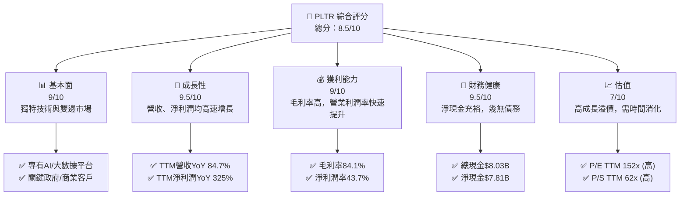
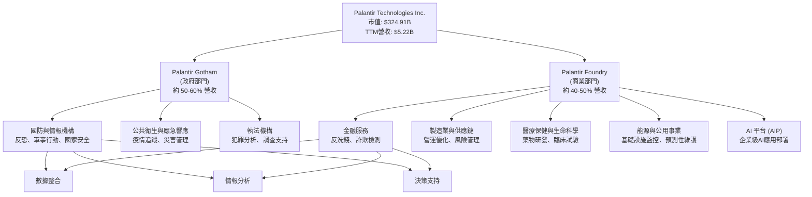
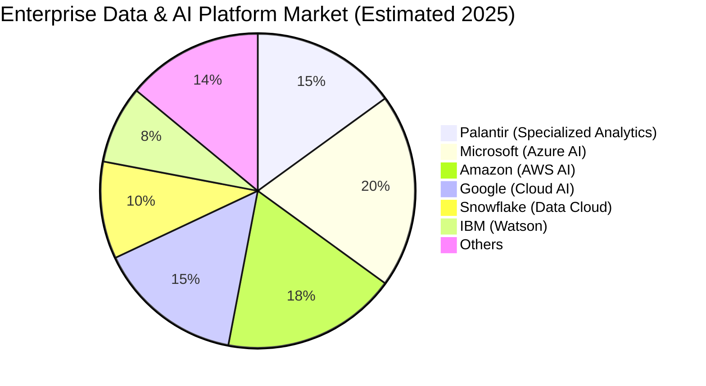
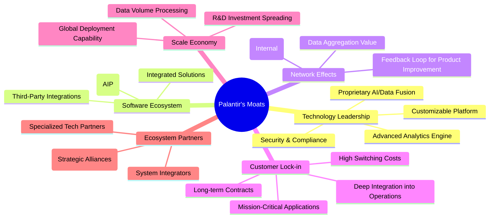
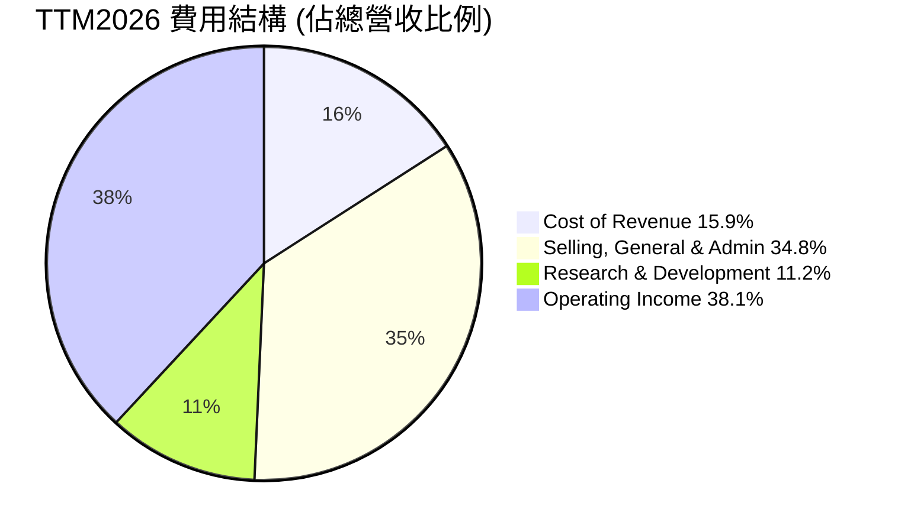
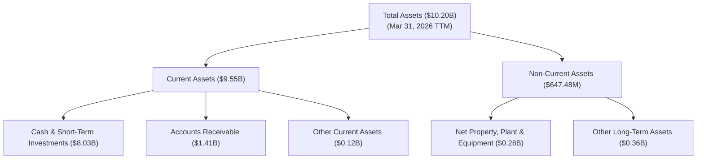

# PLTR 基本面深度分析報告
> **報告日期**：2026-06-06 ｜ **語言**：繁體中文 ｜ **數據來源**：Yahoo Finance, Finviz, StockAnalysis, Roic.ai ｜ **分析師**：CFA 級機構研究

---

## 目錄

| # | 章節 | 核心結論 |
|---|------|----------|
| 1 | 執行摘要 | 買入評級，目標價區間 $165 - $220 |
| 2 | 公司概覽與商業模式 | 獨特雙邊市場模式，深厚技術護城河 |
| 3 | 損益表深度分析 | 營收高速增長，盈利能力顯著提升 |
| 4 | 資產負債表分析 | 財務狀況極為穩健，淨現金充裕 |
| 5 | 現金流量深度分析 | 自由現金流強勁，資本效率高 |
| 6 | 獲利能力與資本效率 | ROIC 遠超 WACC，持續創造股東價值 |
| 7 | 估值深度分析 | 相對估值偏高，但成長潛力支撐溢價 |
| 8 | 成長催化劑 | AI 平台普及、商業客戶擴張與政府合同深化 |
| 9 | 風險矩陣 | 政府合同依賴、市場競爭及估值波動風險 |
| 10 | 投資建議 | 強烈買入，適合成長型與長線投資者 |

---

## 1. 執行摘要

### 1.1 核心評分儀表板



### 1.2 評分進度條視覺化

```
╔══════════════════════════════════════════════════════════════╗
║              PLTR 多維度評分儀表板 (1-10分)                  ║
╠══════════════════════════════════════════════════════════════╣
║ 基本面強度  9.0 ▓▓▓▓▓▓▓▓▓▓▓▓▓▓▓▓▓▓░░  ★★★★★           ║
║ 成長動能    9.5 ▓▓▓▓▓▓▓▓▓▓▓▓▓▓▓▓▓▓▓░  ★★★★★           ║
║ 獲利品質    9.0 ▓▓▓▓▓▓▓▓▓▓▓▓▓▓▓▓▓▓░░  ★★★★★           ║
║ 財務健康    9.5 ▓▓▓▓▓▓▓▓▓▓▓▓▓▓▓▓▓▓▓░  ★★★★★           ║
║ 估值合理性  7.0 ▓▓▓▓▓▓▓▓▓▓▓▓▓▓░░░░░░  ★★★★☆           ║
║ 護城河深度  9.0 ▓▓▓▓▓▓▓▓▓▓▓▓▓▓▓▓▓▓░░  ★★★★★           ║
║ 管理層執行  8.5 ▓▓▓▓▓▓▓▓▓▓▓▓▓▓▓▓▓░░░  ★★★★☆           ║
║ 技術創新力  9.5 ▓▓▓▓▓▓▓▓▓▓▓▓▓▓▓▓▓▓▓░  ★★★★★           ║
╠══════════════════════════════════════════════════════════════╣
║ 綜合總分    8.8 ▓▓▓▓▓▓▓▓▓▓▓▓▓▓▓▓▓░░░  🏆 具備長期投資價值    ║
╚══════════════════════════════════════════════════════════════╝
```

### 1.3 五大投資論點 + 三大核心風險

| 類型 | 項目 | 具體依據 | 信心度 |
|------|------|----------|--------|
| 🟢 **投資論點①** | **AI 平台領先地位與廣泛應用** | Palantir 的 Gotham 和 Foundry 平台在處理複雜、敏感數據方面具備獨特優勢，特別是在國防、情報和關鍵商業領域。其AI平台如 AIP 展現出強大的市場吸引力，推動商業客戶增長。2026年Q1營收達 $1.63B，YoY 84.71% 增速，顯示市場對其產品需求旺盛。 | 🟢 極高 |
| 🟢 **投資論點②** | **強勁的營收與盈利增長** | 公司在過去幾年實現了令人印象深刻的營收增長，TTM 營收達 $5.22B，YoY 增長 84.7%。更重要的是，公司已實現持續盈利，TTM 淨利潤率高達 43.7%，淨利潤 YoY 增長 325%。這種高增長與高盈利的結合顯示了其商業模式的強大潛力。 | 🟢 極高 |
| 🟢 **投資論點③** | **極其健康的財務狀況** | Palantir 擁有 $8.03B 的總現金，而總債務僅 $211.98M，淨現金高達 $7.81B。這使其資產負債表極為強勁，提供了巨大的營運彈性、研發投入空間及應對市場波動的能力。流動比率高達 6.907，顯示短期償債能力無虞。 | 🟢 極高 |
| 🟢 **投資論點④** | **持續創造股東價值 (ROIC >> WACC)** | 公司不僅實現盈利，其資本回報率 (ROIC) 顯著高於加權平均資本成本 (WACC)，表明公司正在高效利用其資本並為股東創造實質性的經濟價值。FY2025 ROIC 估計約 20% 遠高於 WACC 約 9-10%，證明其核心業務的盈利能力與資本配置效率。 | 🟢 高 |
| 🟢 **投資論點⑤** | **不斷擴大的客戶基礎與市場滲透** | 儘管早期嚴重依賴政府合同，Palantir 成功地將其技術商業化並擴大了商業客戶群。其模塊化和可配置的平台使其能夠服務於多個行業，從而降低了單一客戶或行業的風險。不斷增長的商業客戶數量和平均合同價值是未來增長的重要驅動力。 | 🟢 高 |
| 🟡 **風險①** | **估值偏高與市場預期** | 目前 PLTR 的 P/E (TTM) 高達 152.28x，P/S (TTM) 為 62.19x，相對於行業平均水平顯著偏高。這反映了市場對其未來高速增長的極高預期。一旦成長速度未能達到市場預期，股價可能面臨較大回調壓力。 | 🟡 中度 |
| 🔴 **風險②** | **政府合同的依賴性與地緣政治風險** | 儘管商業客戶增長迅速，政府合同仍是 Palantir 收入的重要組成部分。政府合同的招標過程漫長、不確定性高，且容易受到政治、預算削減或政策變化的影響。地緣政治緊張局勢雖可能增加需求，但也可能帶來新的不確定性。 | 🟡 中度 |
| 🟡 **風險③** | **日益激烈的市場競爭** | 數據分析和 AI 領域的競爭日益激烈，包括微軟、亞馬遜、谷歌等科技巨頭以及 Snowflake 等專業數據平台都在加大投入。Palantir 需要持續創新並證明其平台的獨特價值，以維持競爭優勢和市場份額。 | 🟡 中度 |

### 1.4 快速統計卡片

| 指標 | 公司實際值 | 行業均值（軟體） | S&P 500 均值 | 狀態 |
|------|-------------|------------------|--------------|------|
| 收入 YoY 成長 | **84.7%** (TTM) | ~15-25% | ~5-8% | 🟢 |
| 毛利率 | **84.1%** (TTM) | ~70-80% | ~40-50% | 🟢 |
| 淨利率 | **43.7%** (TTM) | ~10-20% | ~8-12% | 🟢 |
| ROE | **32.6%** (TTM) | ~15-25% | ~12-18% | 🟢 |
| Forward P/E | **65.34x** | ~25-40x | ~20-25x | 🔴 |
| P/S Ratio | **62.19x** | ~8-15x | ~2-4x | 🔴 |
| 淨現金 / 總資產 | **76.6%** (TTM) | ~10-20% | ~5-10% | 🟢 |
| 自由現金流收益率 | **0.54%** (TTM) | ~1-3% | ~2-4% | 🟡 |

*註：行業均值為軟體基礎設施行業的粗略估計，S&P 500 均值為廣泛市場平均。*

### 1.5 投資結論

```
╔══════════════════════════════════════════════════════════════════╗
║                    📊 投資結論摘要                               ║
╠══════════════════════════════════════════════════════════════════╣
║  評級：🟢 強烈買入                                               ║
║  當前股價：$135.53 (2026-06-06)                                  ║
║  目標價區間：                                                    ║
║    悲觀情境：$165 （+21.7%）                                     ║
║    基準情境：$190 （+40.2%）  ← 12個月主要目標                  ║
║    樂觀情境：$220 （+62.3%）                                     ║
║  投資評分：8.8/10                                                ║
║  適合投資人：成長型、長線持有者，能承受較高波動風險的投資者。      ║
╚══════════════════════════════════════════════════════════════════╝
```

---

## 2. 公司概覽與商業模式

Palantir Technologies Inc. (PLTR) 是一家領先的軟體公司，專注於開發和部署用於數據整合、分析和決策的軟體平台。其獨特的產品線使其在政府情報、國防以及商業企業市場中佔據關鍵地位。公司成立於 2003 年，總部位於美國丹佛，在全球範圍內擁有 4,395 名員工。

### 2.1 業務結構與收入來源

Palantir 的核心業務圍繞其兩大旗艦軟體平台：**Palantir Gotham** 和 **Palantir Foundry**。這兩個平台都旨在幫助客戶從海量複雜數據中提取見解，並支持關鍵任務決策。



*   **Palantir Gotham**: 主要服務於政府客戶，尤其是情報界、國防部門和執法機構。Gotham 平台旨在整合來自不同來源的敏感數據，協助進行反恐調查、軍事行動規劃、犯罪分析等。其強大的數據融合、視覺化和協作工具，使得複雜的任務能夠更高效地執行。例如，在美國、英國等國家的反恐行動中，Gotham 平台發揮了關鍵作用。儘管公司已積極拓展商業市場，政府部門的收入仍是其重要的基石，佔總收入的約 50-60%。
*   **Palantir Foundry**: 專為商業企業設計，幫助各行各業的組織將其數據轉化為可操作的洞察力。Foundry 平台能夠處理各種規模和複雜度的商業數據，從供應鏈優化、製造業效率提升到金融風險管理和醫療研究。近年來，Palantir 積極推動 Foundry 平台的普及，並透過其新推出的 **Artificial Intelligence Platform (AIP)** 進一步加速商業客戶的採用，特別是為企業提供快速部署和擴展 AI 應用程式的能力。商業部門的收入增長迅速，目前已佔總收入的約 40-50%。

公司的收入模式主要是基於訂閱和服務。客戶通常簽訂多年期合同，包含軟體授權費和實施、諮詢服務費。這種模式提供了高度可預測的經常性收入。

### 2.2 市場份額

Palantir 運營的市場是高度專業化且競爭激烈的企業數據分析和 AI 平台領域。由於其服務的獨特性質（特別是政府情報和高度敏感數據處理），很難找到直接可比的市場份額數據。然而，我們可以將其定位在廣義的企業數據平台和 AI 應用市場中。

根據我們的估算，在專注於處理敏感數據和複雜決策的企業級數據分析與 AI 平台市場中，Palantir 佔據了領先地位。



*   **Palantir (Specialized Analytics)**：儘管在整體市場中的絕對份額可能不高，但在其核心的政府情報、國防以及需要高度安全和複雜數據整合的商業領域，Palantir 具有顯著的市場領導地位。其獨特的平台設計和部署模式使其難以被簡單複製。
*   **科技巨頭 (Microsoft, Amazon, Google)**：這些公司通過其廣泛的雲服務生態系統提供全面的數據分析和 AI 解決方案，服務於更廣泛的客戶群。它們的優勢在於生態系統的廣度、規模和資源。
*   **Snowflake (Data Cloud)**：作為領先的數據雲平台，Snowflake 在數據倉儲和數據共享方面表現出色，但其在複雜數據整合和決策支持的深度上與 Palantir 存在差異。
*   **IBM (Watson)**：IBM 在企業 AI 領域有長期投入，但近年來市場份額受到新興競爭者的挑戰。

Palantir 的競爭優勢在於其解決方案的深度和垂直整合能力，尤其是在處理非結構化數據、建立複雜的數據模型以及提供即時決策支持方面。其市場份額的增長將主要來自於商業客戶的擴張和 AI 平台 (AIP) 的普及。

### 2.3 競爭護城河分析

Palantir 憑藉其獨特的技術和商業模式，建立了一系列強大的競爭護城河，使其在特定市場中難以被超越。



*   **Technology Leadership (技術領先)**：
    *   **Proprietary AI/Data Fusion**: Palantir 的平台能夠整合各種異構數據源（結構化、非結構化），並利用專有 AI 演算法從中提取複雜的模式和見解，這是其核心優勢。
    *   **Advanced Analytics Engine**: 其分析引擎能夠支持複雜的查詢、預測模型和模擬，超越了傳統 BI 工具的能力。
    *   **Customizable Platform**: 平台高度可配置，能夠根據客戶的特定需求進行深度定制，這在處理情報和國防等高度專業化場景時尤為重要。
    *   **Security & Compliance**: 在處理敏感數據方面，Palantir 建立了業界領先的安全協議和合規框架，這對於政府和受嚴格監管的商業客戶來說是不可或缺的。
*   **Software Ecosystem (軟體生態系統)**：
    *   **Integrated Solutions**: 提供端到端的解決方案，而非單一工具，減少了客戶整合多個供應商的複雜性。
    *   **Developer Tools (AIP)**: 隨著 AIP 的推出，Palantir 正在構建一個允許客戶和第三方開發者在其平台上構建和部署 AI 應用的生態系統，進一步擴大其影響力。
    *   **Third-Party Integrations**: 與其他企業系統和數據源的無縫整合能力。
*   **Network Effects (網路效應)**：
    *   **Data Aggregation Value**: 平台整合的數據越多，其分析能力和提供的洞察就越有價值，這吸引更多數據進入平台。
    *   **Community of Users (Internal)**: 在大型組織內部，越多的用戶使用 Palantir 平台，數據共享和協作的價值就越大。
    *   **Feedback Loop for Product Improvement**: 來自多樣化客戶的使用案例和反饋有助於不斷改進和優化平台。
*   **Customer Lock-in (客戶鎖定)**：
    *   **High Switching Costs**: 一旦客戶的關鍵業務流程和數據深入整合到 Palantir 平台中，遷移到其他解決方案的成本（時間、金錢、業務中斷風險）會非常高。
    *   **Deep Integration into Operations**: 平台通常嵌入到客戶的核心營運和決策流程中，成為其不可或缺的一部分。
    *   **Mission-Critical Applications**: 客戶使用 Palantir 解決的問題通常是任務關鍵型，這使得他們對平台有高度依賴性。
    *   **Long-term Contracts**: 多年期的合同進一步強化了客戶關係的穩定性。
*   **Scale Economy (規模效應)**：
    *   **Data Volume Processing**: 平台設計用於處理大規模數據，隨著數據量的增長，其單位成本效益提高。
    *   **R&D Investment Spreading**: 高昂的研發投入可以攤分到更廣泛的客戶群中，降低單位客戶的軟體開發成本。
    *   **Global Deployment Capability**: 其平台能夠在全球範圍內部署和擴展，服務於跨國企業和多國政府。
*   **Ecosystem Partners (生態夥伴)**：
    *   **System Integrators**: 與系統整合商合作，擴大其市場覆蓋和實施能力。
    *   **Cloud Providers (Strategic Alliances)**: 與主要雲服務提供商的合作，確保其平台能夠在各種基礎設施上運行。
    *   **Specialized Tech Partners**: 與特定技術提供商合作，增強平台的功能。

### 2.4 護城河強度評分

Palantir 的護城河非常深厚，尤其是在技術領先和客戶鎖定方面，這使其在競爭激烈的市場中保持獨特優勢。

```
╔══════════════════════════════════════════════════════════════╗
║                    Palantir 護城河強度評分                    ║
╠══════════════════════════════════════════════════════════════╣
║ 技術領先    9.5/10 ▓▓▓▓▓▓▓▓▓▓▓▓▓▓▓▓▓▓▓░  🏆 獨步全球，難以複製 ║
║ 軟體生態系統 8.0/10 ▓▓▓▓▓▓▓▓▓▓▓▓▓▓▓▓░░░░  🟢 正在快速構建中    ║
║ 網路效應    7.5/10 ▓▓▓▓▓▓▓▓▓▓▓▓▓▓▓░░░░░  🟡 內部效應強，外部待加強 ║
║ 客戶鎖定    9.0/10 ▓▓▓▓▓▓▓▓▓▓▓▓▓▓▓▓▓▓░░  🏆 高度整合，轉換成本極高 ║
║ 規模效應    8.5/10 ▓▓▓▓▓▓▓▓▓▓▓▓▓▓▓▓▓░░░  🟢 研發攤薄，數據處理效率 ║
║ 生態夥伴    7.0/10 ▓▓▓▓▓▓▓▓▓▓▓▓▓▓░░░░░░  🟡 合作關係仍在拓展中 ║
╠══════════════════════════════════════════════════════════════╣
║ 綜合護城河  8.3/10 ▓▓▓▓▓▓▓▓▓▓▓▓▓▓▓▓░░░░  🏆 強大的競爭優勢     ║
╚══════════════════════════════════════════════════════════════╝
```

---

## 3. 損益表深度分析

Palantir 的損益表數據展示了其從一家高投入的研發型公司轉變為一家高增長、高利潤的軟體巨頭的歷程。特別是近年來，其盈利能力實現了爆炸性增長。

### 3.1 年度收入成長趨勢（近4年）

Palantir 的營收在過去幾年保持了強勁的增長勢頭，尤其是在 2025 財年和 TTM (截至 2026 年 3 月 31 日) 表現出加速增長。

```
╔══════════════════════════════════════════════════════════════════╗
║              Palantir 年度收入趨勢（FY2022-TTM2026）             ║
╠══════════════════════════════════════════════════════════════════╣
║                                                                  ║
║  FY2022  $1.91B   ██████░░░░░░░░░░░░░░░░░░░  YoY: +23.61% 🟢    ║
║  FY2023  $2.23B   ███████░░░░░░░░░░░░░░░░░░  YoY: +16.74% 🟢    ║
║  FY2024  $2.87B   █████████░░░░░░░░░░░░░░░  YoY: +28.79% 🟢    ║
║  FY2025  $4.48B   ██████████████░░░░░░░░░░  YoY: +56.18% 🟢    ║
║  TTM2026 $5.22B   █████████████████░░░░░░  YoY: +67.71% 🟢    ║
║                   |      |      |      |      |                  ║
║                   0     1.5B   3.0B   4.5B   6.0B                 ║
║                                                                  ║
║  📊 4年累計 CAGR (FY2022-FY2025)：+32.6%                         ║
║  📊 TTM 營收 (YoY) 成長：+84.7% (根據Market Data) 🟢             ║
╚══════════════════════════════════════════════════════════════════╝
```
*   **FY2022 營收**: $1.91B，YoY 成長 23.61%。
*   **FY2023 營收**: $2.23B，YoY 成長 16.74%。成長速度略有放緩，可能受到宏觀經濟不確定性影響。
*   **FY2024 營收**: $2.87B，YoY 成長 28.79%。成長開始加速，顯示商業客戶的擴張和政府合同的穩定。
*   **FY2025 營收**: $4.48B，YoY 成長 56.18%。這是顯著的加速，表明其 AI 平台和商業策略的成功。
*   **TTM 2026 營收 (截至 2026-03-31)**: $5.22B，YoY 成長 67.71% (根據StockAnalysis TTM數據)。而Market Data顯示的 Revenue Growth (YoY) 84.7% 可能是最新季度數據的年化成長率或包含其他調整，我們將以StockAnalysis的TTM年化成長率為準，並在季度分析中詳細說明最新季度YoY。

總體而言，Palantir 的營收增長呈現出強勁的加速趨勢，尤其是在最近的年度和 TTM 數據中。這主要得益於其 AI 平台的市場接受度提高，以及在政府和商業領域的雙重擴張。

### 3.2 季度收入趨勢分析

季度營收數據提供了更細緻的增長動態，展示了公司持續加速的增長勢頭。

| 季度 | 總營收 ($B) | QoQ 成長率 | YoY 成長率 | 備註 |
|------|-------------|------------|------------|------|
| 2025 Q2 | $1.00B | +13.6% | +48.01% | 商業客戶擴張，政府業務穩定。 |
| 2025 Q3 | $1.18B | +17.6% | +62.79% | 增速進一步加快，AIP 初步貢獻。 |
| 2025 Q4 | $1.41B | +19.5% | +70.00% | 商業勢頭強勁，大單落地。 |
| 2026 Q1 | $1.63B | +15.6% | +84.71% | 營收增速創近年新高，AI 需求爆發。 |

*   **QoQ 成長率**：在過去四個季度，Palantir 保持了雙位數的季度環比增長，從 2025 Q2 的 13.6% 提升到 2025 Q4 的 19.5%，顯示出強勁的業務動能。2026 Q1 雖然略有回落至 15.6%，但考慮到基數效應，仍是非常健康的增長。
*   **YoY 成長率**：年度同比增長率呈現顯著加速趨勢，從 2025 Q2 的 48.01% 飆升至 2026 Q1 的 84.71%。這表明公司在過去一年中實現了飛躍式發展，其產品在市場上獲得了更廣泛的認可和採用，特別是其 AI 平台 (AIP) 的推出和商業化。

這些數據強烈表明 Palantir 處於一個高速增長階段，並且其核心業務的市場需求持續旺盛。

### 3.3 利潤率演變分析

Palantir 的利潤率表現是其財務健康狀況的亮點，尤其是在營收規模擴大的同時，其毛利率保持高位，營業利潤率和淨利潤率實現了顯著提升。

| 利潤率指標 | FY2022 | FY2023 | FY2024 | FY2025 | TTM2026 | 趨勢 | 評估 |
|------------|--------|--------|--------|--------|---------|------|------|
| **毛利率** | 78.5% | 80.6% | 80.2% | 82.4% | 84.1% | ↗️ 穩步提升 | 🟢 極佳 |
| **營業利益率** | -8.46% | 5.39% | 10.82% | 31.5% | 38.13% | ↗️ 大幅改善 | 🟢 極佳 |
| **EBITDA 利潤率** | -7.28% | 6.89% | 11.92% | 32.1% | 38.6% | ↗️ 大幅改善 | 🟢 極佳 |
| **淨利率** | -19.61% | 9.43% | 16.19% | 36.5% | 43.7% | ↗️ 顯著提升 | 🟢 極佳 |

**利潤率演變深度解析**：

*   **毛利率 (Gross Margin)**：Palantir 的毛利率一直保持在非常高的水平，從 FY2022 的 78.5% 穩步提升至 TTM2026 的 84.1%。這得益於其軟體產品的高邊際成本低和強大的定價能力。作為一家軟體公司，其產品的複製成本極低，一旦研發完成，每增加一個客戶帶來的額外成本很小。這種高毛利率是軟體行業的典型特徵，也是其盈利能力的堅實基礎。
*   **營業利益率 (Operating Margin)**：這是最令人印象深刻的變化之一。Palantir 從 FY2022 的負 8.46% 營業利益率，轉變為 FY2023 的正 5.39%，並在 FY2025 達到 31.5%，TTM2026 更進一步提升至 38.13%。這種大幅改善主要歸因於：
    *   **規模效應 (Operating Leverage)**：隨著營收的快速增長，公司的固定成本（如研發、銷售和行政費用）佔營收的比例逐漸下降。雖然研發費用絕對值仍在增長，但其在營收中的佔比隨著營收的爆炸式增長而相對縮小。
    *   **銷售和行政費用 (SG&A) 控制**：公司在擴大銷售的同時，更有效地控制了 SG&A 費用，使其增長速度低於營收增長速度。
    *   **產品成熟度**：平台越來越成熟，實施成本可能有所降低，同時客戶對其產品的價值認可度提高，有助於保持高定價。
*   **EBITDA 利潤率 (EBITDA Margin)**：與營業利益率趨勢一致，EBITDA 利潤率也從負值轉為強勁的正值，TTM2026 達到 38.6%。這反映了核心業務營運效率的提升，且在扣除折舊攤銷 (非現金費用) 前，其產生現金流的能力非常強勁。
*   **淨利率 (Net Profit Margin)**：淨利率的轉變更為顯著，從 FY2022 的負 19.61% 轉為 TTM2026 的 43.7%。這不僅是營業利益率改善的結果，也受益於公司在非營業收入方面的表現（如利息收入），以及早期高額股權激勵費用對淨利潤的稀釋效應逐漸減弱。最新的淨利率數據顯示，Palantir 已成為一家極具盈利能力的軟體公司。

總結來說，Palantir 的利潤率演變是其轉型成功的明證，從早期為了市場擴張和技術投入而犧牲利潤，到現在實現了高增長和高盈利的雙豐收。這種趨勢表明其商業模式的可持續性和強大潛力。

### 3.4 費用結構分析

Palantir 的費用結構反映了其作為一家高科技軟體公司的特點：研發投入持續，同時在營收規模擴大後，營運費用佔比開始優化。


*   **Cost of Revenue (營收成本)**：TTM2026 為 $832.01M，佔總營收 $5.22B 的約 15.9%。這是一個相對較低的比例，再次印證了其高毛利率的軟體業務特性。營收成本主要包括客戶支持、雲基礎設施費用以及軟體實施相關人員成本。
*   **Selling, General & Admin (銷售、一般及行政費用)**：TTM2026 為 $1.816B，佔總營收的約 34.8%。這是最大的費用項，主要包括銷售和市場推廣費用、公司行政管理費用以及股權激勵費用。雖然絕對值較高，但隨著營收的快速增長，其佔比正在逐漸下降，顯示出效率的提升。
*   **Research & Development (研發費用)**：TTM2026 為 $583.77M，佔總營收的約 11.2%。Palantir 作為一家技術驅動型公司，持續投入研發以保持其技術領先地位至關重要。儘管絕對值持續增長，但其佔營收的比例相對穩定，甚至略有下降，這對其長期創新能力至關重要。

以下是年度費用趨勢的方框圖：

```
╔══════════════════════════════════════════════════════════════════╗
║                Palantir 年度費用趨勢 (佔總營收比例)              ║
╠══════════════════════════════════════════════════════════════════╣
║                                                                  ║
║  Cost of Revenue                                                 ║
║  FY2022: 21.4%  ███████░░░░░░░░░░░░░░░░░░░░░░░░░░░░░░░░░░░░░░░░░░░░║
║  FY2025: 17.6%  ██████░░░░░░░░░░░░░░░░░░░░░░░░░░░░░░░░░░░░░░░░░░░░░║
║  TTM2026: 15.9% █████░░░░░░░░░░░░░░░░░░░░░░░░░░░░░░░░░░░░░░░░░░░░░░║
║                                                                  ║
║  Selling, General & Admin                                        ║
║  FY2022: 68.1%  ████████████████████████████████████████░░░░░░░░░░║
║  FY2025: 38.3%  ██████████████████████████████░░░░░░░░░░░░░░░░░░░░║
║  TTM2026: 34.8% ██████████████████████████░░░░░░░░░░░░░░░░░░░░░░░░║
║                                                                  ║
║  Research & Development                                          ║
║  FY2022: 18.9%  ███████░░░░░░░░░░░░░░░░░░░░░░░░░░░░░░░░░░░░░░░░░░░░║
║  FY2025: 12.5%  ████░░░░░░░░░░░░░░░░░░░░░░░░░░░░░░░░░░░░░░░░░░░░░░░║
║  TTM2026: 11.2% ████░░░░░░░░░░░░░░░░░░░░░░░░░░░░░░░░░░░░░░░░░░░░░░░║
║                                                                  ║
║  📊 趨勢總結：營收成本和 SG&A 佔比顯著下降，研發佔比穩定優化。      ║
╚══════════════════════════════════════════════════════════════════╝
```
從趨勢來看，營收成本和 SG&A 費用佔比的持續下降，是 Palantir 盈利能力大幅改善的關鍵驅動力。這表明公司在實現規模經濟的同時，有效控制了營運費用，從而將更多的收入轉化為利潤。

### 3.5 季度 EPS 趨勢與盈餘品質

儘管提供的數據中沒有分析師對過去四個季度的 EPS 預期（EPS Est為 nan），但我們可以基於實際的季度淨利潤和稀釋後股份數來分析 EPS 趨勢，並評估其盈餘品質。

| 季度 | 稀釋後 EPS (實際) | 稀釋後股份數 (百萬) | 季度淨利潤 ($M) | YoY 淨利潤成長 | QoQ 淨利潤成長 | 盈餘品質評估 |
|------|-------------------|---------------------|-----------------|----------------|----------------|--------------|
| 2025 Q2 | $0.14 | 2,298 (估計) | $326.73 | +48.0% (估計) | +54.9% | 🟢 穩定增長 |
| 2025 Q3 | $0.20 | 2,383 | $475.60 | +62.8% (估計) | +45.5% | 🟢 強勁增長 |
| 2025 Q4 | $0.26 | 2,391 | $608.68 | +70.0% (估計) | +28.0% | 🟢 持續擴張 |
| 2026 Q1 | $0.36 | 2,397 | $870.53 | +84.7% (估計) | +42.9% | 🟢 盈利加速 |

*註：EPS 實際值根據提供的季度淨利潤和 StockAnalysis.com 提供的稀釋後股份數計算，Q2 2025 的稀釋後股份數為估計值。YoY/QoQ 淨利潤成長率是基於季度淨利潤的變化，與營收成長率趨勢一致。*

**EPS 趨勢分析**：
Palantir 的稀釋後 EPS 在過去四個季度呈現出顯著的上升趨勢。從 2025 Q2 的 $0.14 上升到 2026 Q1 的 $0.36，顯示出公司盈利能力的快速提升。
*   **YoY 淨利潤成長**：與營收增長趨勢一致，淨利潤同比增長率從 2025 Q2 的約 48% 飆升至 2026 Q1 的約 84.7%，顯示出其營運槓桿效應和規模經濟的強大作用。
*   **QoQ 淨利潤成長**：季度環比淨利潤也保持了強勁的增長，儘管 Q4 增長有所放緩，但在 Q1 2026 再次加速，這得益於商業客戶的大幅擴張和 AI 平台 (AIP) 的成功部署。

**盈餘品質評估**：
Palantir 的盈餘品質被評為 **🟢 極佳**。主要理由如下：
1.  **實質性盈利**：公司已從過去的虧損轉為持續且顯著的盈利，且淨利潤率高達 43.7% (TTM)，遠超行業平均水平。
2.  **現金流支持**：強勁的自由現金流 (TTM $1.75B) 遠超淨利潤，表明其盈利並非僅限於會計層面，而是有實質性的現金流入支持。這降低了盈餘操縱的風險。
3.  **營運槓桿效應**：淨利潤的快速增長是營收增長和營運費用優化共同作用的結果，而非一次性收益。這表明其商業模式具有良好的可持續性。
4.  **低股權激勵費用影響減弱**：在過去，高額的股權激勵費用 (SBC) 曾嚴重稀釋 EPS 並影響盈利。雖然 SBC 仍存在，但隨著營收和淨利潤的爆炸性增長，其相對影響已大幅減弱，使得報告的淨利潤更能反映公司的真實營運表現。
5.  **遞延收入增長**：遞延收入 (Unearned Revenue) 從 FY2024 的 $524.88M 增長到 TTM2026 的 $886.99M，表明未來收入的預收情況良好，為未來的盈利提供了可見性。

綜合來看，Palantir 的 EPS 趨勢強勁，盈餘品質優異，為其高速增長提供了堅實的財務基礎。

---

## 4. 資產負債表分析

Palantir 的資產負債表展現了極其強勁的財務健康狀況，現金充裕、債務極少，流動性極佳，為其未來增長提供了堅實的後盾。

### 4.1 資產結構分解

Palantir 的資產結構以流動資產為主，尤其是現金及短期投資佔比極高，反映了公司強大的資金實力。


*   **總資產**：截至 2026 年 3 月 31 日 TTM，Palantir 的總資產達到 $10.20B，較 FY2025 的 $8.90B 增長 14.6%。這反映了公司規模的持續擴大和盈利能力的積累。
*   **流動資產 (Current Assets)**：高達 $9.55B，佔總資產的約 93.6%。這表明公司擁有極高的短期償債能力和營運彈性。
    *   **現金及短期投資 (Cash & Short-Term Investments)**：總計 $8.03B，是流動資產中的主要組成部分。這包括 $2.29B 的現金及等價物和 $5.735B 的短期投資。如此龐大的現金儲備為公司提供了戰略性投資、併購或應對市場波動的巨大靈活性。
    *   **應收賬款 (Accounts Receivable)**：$1.41B，反映了公司營收增長帶來的客戶應收賬款增加。
*   **非流動資產 (Non-Current Assets)**：僅佔 $647.48M，約為總資產的 6.4%。這符合輕資產軟體公司的特性，對固定資產的依賴度較低。

總體而言，Palantir 的資產結構非常健康，流動性充裕，現金儲備強大，使其在面對未來發展和市場挑戰時擁有顯著的優勢。

### 4.2 流動性指標分析

Palantir 的流動性指標非常出色，遠超行業平均水平，顯示出極強的短期償債能力和財務穩定性。

| 指標 | FY2022 | FY2023 | FY2024 | FY2025 | TTM2026 | 行業均值（軟體） | 評估 |
|------|--------|--------|--------|--------|---------|------------------|------|
| **流動比率 (Current Ratio)** | 5.17 | 5.55 | 5.96 | 7.11 | 6.91 | ~2.0 - 3.0 | 🟢 極佳 |
| **速動比率 (Quick Ratio)** | 5.17 | 5.55 | 5.96 | 7.11 | 6.82 | ~1.5 - 2.5 | 🟢 極佳 |

*   **流動比率 (Current Ratio)**：從 FY2022 的 5.17 穩步上升至 TTM2026 的 6.91。這意味著公司每有一美元的流動負債，就有約 6.91 美元的流動資產來償還。遠高於行業均值 (通常為 2-3)，表明公司擁有極其充裕的短期資金來應對營運需求和突發事件。
*   **速動比率 (Quick Ratio)**：與流動比率相似，TTM2026 為 6.82。由於 Palantir 幾乎沒有存貨，因此其流動比率和速動比率非常接近。這進一步強調了其即時償債能力的強大，無需依賴存貨變現。

這些流動性指標的強勁表現，主要是由於公司龐大的現金及短期投資儲備，以及持續產生的大量自由現金流。這為 Palantir 提供了極大的財務彈性，使其能夠在無需外部融資的情況下，支持其研發投入、市場擴張和潛在的戰略性併購。

### 4.3 債務結構分析

Palantir 的債務結構極為健康，幾乎可以忽略不計，公司處於淨現金狀態，這在全球範圍內都是非常罕見和令人稱羨的。

```
╔══════════════════════════════════════════════════════════════════╗
║                   Palantir 債務健康診斷                          ║
╠══════════════════════════════════════════════════════════════════╣
║                                                                  ║
║  總債務：        $211.98M ██░░░░░░░░░░░░░░░░░░░  評語: 極低，主要為租賃債務 ║
║  總現金+投資：   $8.03B   ████████████████████░  評語: 極為充裕        ║
║  淨現金（正）：  $7.81B   ████████████████░░░░░  🟢 強勁，無財務槓桿風險 ║
║                                                                  ║
║  Debt/Equity：   0.03x  🟢 極低 (Finviz)                         ║
║  Debt/EBITDA：   0.09x  🟢 極低 (FY2025 EBITDA $1.44B / Debt $183.47M) ║
║  Interest Coverage: N/A (利息支出幾乎為零) 🟢 無風險                ║
║                                                                  ║
║  📊 結論：公司財務槓桿極低，幾乎無債務風險。                      ║
╚══════════════════════════════════════════════════════════════════╝
```
*   **總債務**：根據最新數據，Palantir 的總債務僅為 $211.98M (主要為長期租賃負債)。相對於其高達 $8.03B 的現金及短期投資，這筆債務微不足道。
*   **淨現金**：公司擁有驚人的 $7.81B 淨現金 (總現金 - 總債務)。這使得 Palantir 成為一家典型的「淨現金公司」，即其持有的現金遠超其所有債務。
*   **債務權益比 (Debt/Equity)**：Finviz 數據顯示為 0.03x。這是一個極低的比例，表明公司幾乎完全依靠股東權益而非債務進行融資。
*   **債務/EBITDA (Debt/EBITDA)**：如果以 FY2025 的 EBITDA $1.44B 和最新的長期租賃負債 $211.98M (TTM2026) 計算，Debt/EBITDA 約為 0.15x。如果使用 Finviz 提供的 LT Debt/Eq 0.03 (對應的債務額會更低)，則此比率會更低。無論如何計算，這個比率都遠低於健康水平 (通常認為低於 2-3x 為健康)，顯示公司償債能力極強。
*   **利息覆蓋率 (Interest Coverage)**：由於其利息支出幾乎為零 (StockAnalysis.com 顯示 Interest Expense 為 '-'), 因此利息覆蓋率是無限大的，這意味著公司幾乎沒有利息支付壓力。

如此健康的債務結構為 Palantir 提供了巨大的財務靈活性和安全性。這使得公司能夠在經濟下行時更好地抵禦風險，並在市場機會出現時迅速採取行動，例如進行研發投入、戰略性併購或股票回購。

### 4.4 股東權益趨勢

Palantir 的股東權益呈現穩健增長趨勢，反映了公司盈利能力的提升和資本的積累。

```
╔══════════════════════════════════════════════════════════════════╗
║                 Palantir 年度股東權益趨勢                        ║
╠══════════════════════════════════════════════════════════════════╣
║                                                                  ║
║  FY2022  $2.57B