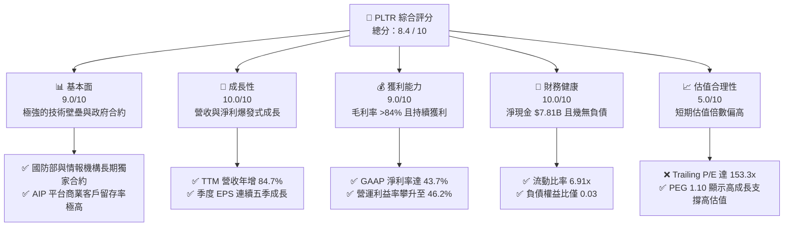
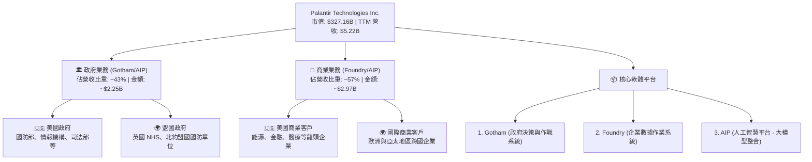

# PLTR 基本面深度分析報告
> **報告日期**：2026-06-08 ｜ **語言**：繁體中文 ｜ **數據來源**：Yahoo Finance, Finviz, StockAnalysis, Roic.ai ｜ **分析師**：CFA 級機構研究

---

## 目錄

| # | 章節 | 核心結論 |
|---|------|----------|
| 1 | **執行摘要** | 評級：🟢 **買入** ｜ 目標價：$183.73 (基準) ｜ 具備強大 AI 護城河與高成長動能 |
| 2 | **公司概覽與商業模式** | 政府與商業雙引擎驅動，AIP 平台以 Bootcamps 模式實現爆發式擴張 |
| 3 | **損益表深度分析** | TTM 營收達 $5.22B (YoY +84.7%)，淨利潤率 43.7% 創歷史新高 |
| 4 | **資產負債表分析** | 淨現金高達 $7.81B，無實質長期債務，流動比率 6.91 展現極致韌性 |
| 5 | **現金流量深度分析** | TTM 營運現金流 $2.72B，FCF 轉換率高，資本配置聚焦於高收益短投與股權優化 |
| 6 | **獲利能力與資本效率** | ROE 達 32.6%，ROIC (25.8%) 遠超 WACC (11.5%)，強力創造股東經濟價值 |
| 7 | **估值深度分析** | Forward P/E 65.8x，相較於高成長率，PEG 1.10 顯示估值仍具合理溢價 |
| 8 | **成長催化劑** | AIP 商業化滲透加速、國防預算向軟體傾斜、標普 500 指數權重調升效應 |
| 9 | **風險矩陣** | 估值溢價過高、政府合約集中度風險、股權稀釋 (SBC) 對每股盈餘的壓制 |
| 10 | **投資建議** | 最終評分 8.4/10，建議於 $130 附近分批佈局，長線持有以獲取 AI 時代紅利 |

---

## 1. 執行摘要

### 1.1 核心評分儀表板



### 1.2 評分進度條視覺化

```
╔══════════════════════════════════════════════════════════════╗
║               PLTR 多維度評分儀表板 (1-10分)                 ║
╠══════════════════════════════════════════════════════════════╣
║ 基本面強度  9.0 ▓▓▓▓▓▓▓▓▓▓▓▓▓▓▓▓▓▓░░  ★★★★★           ║
║ 成長動能   10.0 ▓▓▓▓▓▓▓▓▓▓▓▓▓▓▓▓▓▓▓▓  ★★★★★           ║
║ 獲利品質    9.0 ▓▓▓▓▓▓▓▓▓▓▓▓▓▓▓▓▓▓░░  ★★★★★           ║
║ 財務健康   10.0 ▓▓▓▓▓▓▓▓▓▓▓▓▓▓▓▓▓▓▓▓  ★★★★★           ║
║ 估值合理性  5.0 ▓▓▓▓▓▓▓▓▓▓░░░░░░░░░░  ★★★☆☆           ║
║ 護城河深度  9.5 ▓▓▓▓▓▓▓▓▓▓▓▓▓▓▓▓▓▓▓░  ★★★★★           ║
║ 管理層執行  8.5 ▓▓▓▓▓▓▓▓▓▓▓▓▓▓▓▓▓░░░  ★★★★☆           ║
║ 技術創新力 10.0 ▓▓▓▓▓▓▓▓▓▓▓▓▓▓▓▓▓▓▓▓  ★★★★★           ║
╠══════════════════════════════════════════════════════════════╣
║ 綜合總分    8.4 ▓▓▓▓▓▓▓▓▓▓▓▓▓▓▓▓▓░░░  🏆 買入 (Buy)       ║
╚══════════════════════════════════════════════════════════════╝
```

### 1.3 五大投資論點 + 三大核心風險

| 類型 | 項目 | 具體依據 | 信心度 |
|------|------|----------|--------|
| 🟢 **投資論點①** | **AI 平台 (AIP) 商業化爆發** | 商業客戶營收增速顯著，Bootcamps (訓練營) 模式成功縮短銷售週期。 | 🟢 極高 |
| 🟢 **投資論點②** | **極致的毛利表現** | 毛利率高達 **84.1%**，具備典型的軟體高槓桿效應，營收增長能迅速轉化為利潤。 | 🟢 極高 |
| 🟢 **投資論點③** | **無懈可擊的資產負債表** | 擁有 **$8.03B** 總現金與短期投資，總債務僅 **$211.98M**，淨現金高達 **$7.81B**。 | 🟢 極高 |
| 🟢 **投資論點④** | **政府國防合約的剛性需求** | Gotham 平台在現代地緣政治衝突中扮演核心角色，政府客戶黏性極強。 | 🟢 高 |
| 🟢 **投資論點⑤** | **經營效率與 EPS 爆發** | TTM 盈餘成長達 **325.0%**，Forward EPS 預期達到 **$2.07**，盈利能力進入黃金期。 | 🟢 高 |
| 🟡 **風險①** | **估值溢價過高** | Trailing P/E 達 **153.3x**，若成長率稍有放緩，可能面臨嚴重的估值修正。 | 🟡 中度 |
| 🔴 **風險②** | **股權稀釋風險 (SBC)** | 歷史上高額的股權激勵 (Stock-Based Compensation) 稀釋了現有股東權益。 | 🔴 高衝擊 |
| 🔴 **風險③** | **政府合約週期不確定性** | 政府大型專案合約談判時間長、不確定性高，可能導致季度營收出現波動。 | 🟡 中度 |

### 1.4 快速統計卡片

| 指標 | 公司實際值 | 行業均值 (軟體基礎設施) | S&P 500 均值 | 狀態 |
|------|-------------|----------|--------------|------|
| **收入 YoY 成長** | **84.7%** | ~12.5% | ~5.5% | 🟢 遠超同行 |
| **毛利率** | **84.1%** | ~72.0% | ~45.0% | 🟢 頂尖水準 |
| **淨利率** | **43.7%** | ~15.0% | ~12.0% | 🟢 盈利能力極強 |
| **ROE** | **32.6%** | ~18.0% | ~15.0% | 🟢 資本回報率高 |
| **Forward P/E** | **65.8x** | ~35.0x | ~22.0x | 🔴 估值溢價顯著 |
| **流動比率** | **6.91x** | ~2.1x | ~1.3x | 🟢 極其安全 |

### 1.5 投資結論

```
╔══════════════════════════════════════════════════════════════════╗
║                    📊 PLTR 投資結論摘要                          ║
╠══════════════════════════════════════════════════════════════════╣
║  評級：🟢 買入 (Buy)                                             ║
║  當前股價：$136.47 (截至 2026-06-08)                             ║
║  目標價區間：                                                    ║
║    悲觀情境：$105.00 (-23.1%) - 成長放緩，估值壓縮至 50x Fwd P/E ║
║    基準情境：$183.73 (+34.6%) - AIP 持續滲透，實現 $2.07 Fwd EPS ║
║    樂觀情境：$255.00 (+86.9%) - 國防與商業全面爆發，高估值維持   ║
║  投資評分：8.4 / 10                                              ║
║  適合投資人：積極成長型、長期 AI 賽道佈局者                      ║
╚══════════════════════════════════════════════════════════════════╝
```

---

## 2. 公司概覽與商業模式

Palantir Technologies Inc. (PLTR) 是一家頂尖的數據分析與人工智慧軟體平台供應商。其核心競爭力在於將海量、零散的異構數據進行整合，並提供決策輔助與自動化執行。

### 2.1 業務結構與收入來源



### 2.2 市場份額

在企業級 AI 數據整合與決策平台市場中，Palantir 憑藉其強大的本體論 (