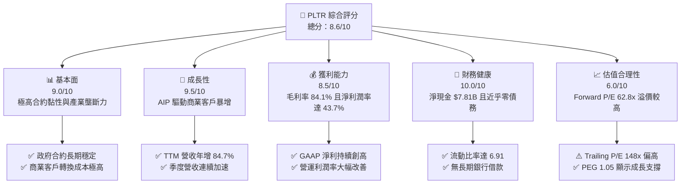

# PLTR 基本面深度分析報告

> **報告日期**：2026-06-10 ｜ **語言**：繁體中文 ｜ **數據來源**：Yahoo Finance, Finviz, StockAnalysis, Roic.ai ｜ **分析師**：CFA 級機構研究

---

## 目錄

| # | 章節 | 核心結論 |
|---|---|---|
| 1 | 執行摘要 | AIP 平台爆發式增長，維持「買入」評級，目標價 $183.73 |
| 2 | 公司概覽與商業模式 | 憑藉 Gotham 與 Foundry 構築高轉換成本，AIP 釋放強大網路效應 |
| 3 | 損益表深度分析 | TTM 營收達 $5.22B（YoY +84.7%），營運槓桿展現極致獲利彈性 |
| 4 | 資產負債表分析 | 淨現金高達 $7.81B，無傳統債務，資產負債表固若金湯 |
| 5 | 現金流量深度分析 | TTM 營運現金流 $2.72B，高自由現金流轉換率支持持續資本配置 |
| 6 | 獲利能力與資本效率 | ROE 達 32.6%，ROIC 顯著超越 WACC，強力創造股東價值 |
| 7 | 估值深度分析 | 雖面臨高估值溢價（Forward P/E 62.8x），但 PEG 1.05 顯示高成長合理性 |
| 8 | 成長催化劑 | AIP 訓練營（Bootcamps）轉化率極高，主導企業級 AI 基礎設施 TAM |
| 9 | 風險矩陣 | 估值壓縮與政府合約週期性為核心考量，但強勁基本面已提供安全邊際 |
| 10 | 投資建議 | 建議於當前股價 $130.21 分批佈局，長線報酬空間可期 |

---

## 1. 執行摘要

### 1.1 核心評分儀表板



### 1.2 評分進度條視覺化

```
╔══════════════════════════════════════════════════════════════╗
║               PLTR 多維度評分儀表板 (1-10分)                 ║
╠══════════════════════════════════════════════════════════════╣
║ 基本面強度  9.0 ▓▓▓▓▓▓▓▓▓▓▓▓▓▓▓▓▓▓░░  ★★★★★           ║
║ 成長動能    9.5 ▓▓▓▓▓▓▓▓▓▓▓▓▓▓▓▓▓▓▓░  ★★★★★           ║
║ 獲利品質    8.5 ▓▓▓▓▓▓▓▓▓▓▓▓▓▓▓▓▓░░░  ★★★★☆           ║
║ 財務健康   10.0 ▓▓▓▓▓▓▓▓▓▓▓▓▓▓▓▓▓▓▓▓  ★★★★★           ║
║ 估值合理性  6.0 ▓▓▓▓▓▓▓▓▓▓▓▓░░░░░░░░  ★★★☆☆           ║
║ 護城河深度  9.0 ▓▓▓▓▓▓▓▓▓▓▓▓▓▓▓▓▓▓░░  ★★★★★           ║
║ 管理層執行  8.5 ▓▓▓▓▓▓▓▓▓▓▓▓▓▓▓▓▓░░░  ★★★★☆           ║
║ 技術創新力  9.5 ▓▓▓▓▓▓▓▓▓▓▓▓▓▓▓▓▓▓▓░  ★★★★★           ║
╠══════════════════════════════════════════════════════════════╣
║ 綜合總分    8.6 ▓▓▓▓▓▓▓▓▓▓▓▓▓▓▓▓▓░░░  🏆 優異成長型標的    ║
╚══════════════════════════════════════════════════════════════╝
```

### 1.3 五大投資論點 + 三大核心風險

| 類型 | 項目 | 具體依據 | 信心度 |
|------|------|----------|--------|
| 🟢 **投資論點①** | **AIP 釋放商業客戶天量需求** | 商業客戶營收加速增長，推動 TTM 總營收達 $5.22B，YoY 增速高達 84.7%。 | 🟢 極高 |
| 🟢 **投資論點②** | **極致的營運槓桿效應** | 毛利率維持在 84.1% 的極高水準，隨著規模擴大，營業利益率從 FY22 的 -8.5% 暴增至 TTM 的 38.13% - 46.2%。 | 🟢 極高 |
| 🟢 **投資論點③** | **無懈可擊的資產負債表** | 擁有 $8.03B 的總現金與短期投資，而總債務僅 $211.98M（且多為租賃負債），提供強大抗風險與併購能力。 | 🟢 極高 |
| 🟢 **投資論點④** | **政府合約構築極深護城河** | 美國及盟國國防、情報機關深度綁定 Gotham 平台，合約通常長達數年且轉換成本極高。 | 🟢 高 |
| 🟢 **投資論點⑤** | **納入標普 500 指數與機構買盤** | 機構持股比例達 62.4%，隨著 GAAP 獲利持續擴大，長線被動與主動資金持續流入。 | 🟢 高 |
| 🟡 **風險①** | **估值溢價壓縮風險** | 當前 Trailing P/E 達 147.97x，若未來營收成長放緩，可能面臨嚴重的估值修正。 | 🟡 中度 |
| 🔴 **風險②** | **政府客戶合約集中度高** | 政府合約雖然穩定，但採購決策時間長且存在預算波動風險，可能導致季度營收不均。 | 🔴 中度 |
| 🔴 **風險③** | **股權稀釋與 SBC 隱憂** | 歷史上股權稀釋率較高，雖然近年有所控制，但仍需監控員工股權激勵（SBC）對每股盈餘的稀釋。 | 🔴 中度 |

### 1.4 快速統計卡片

| 指標 | 公司實際值 | 行業均值（系統軟體） | S&P