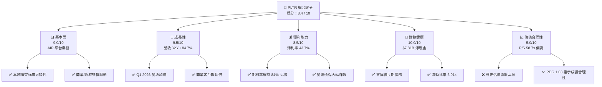
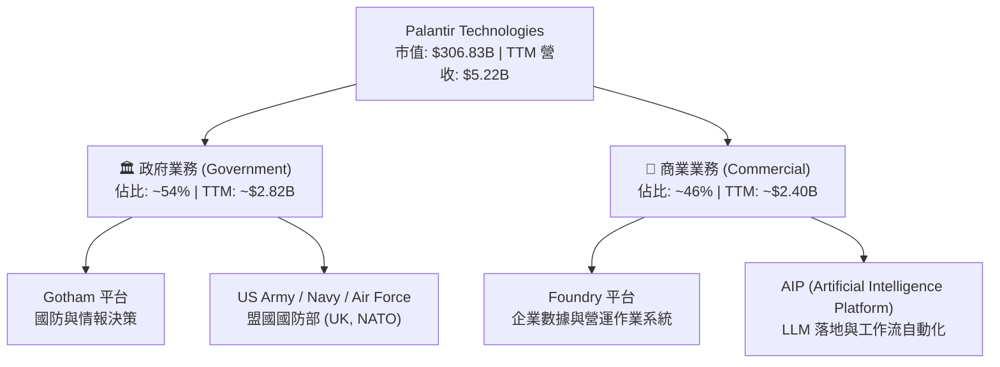
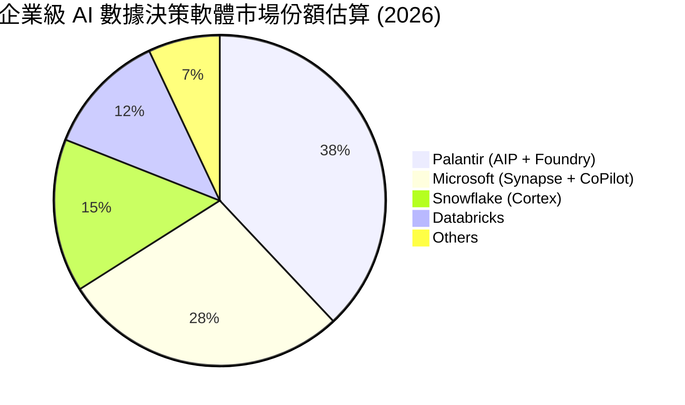
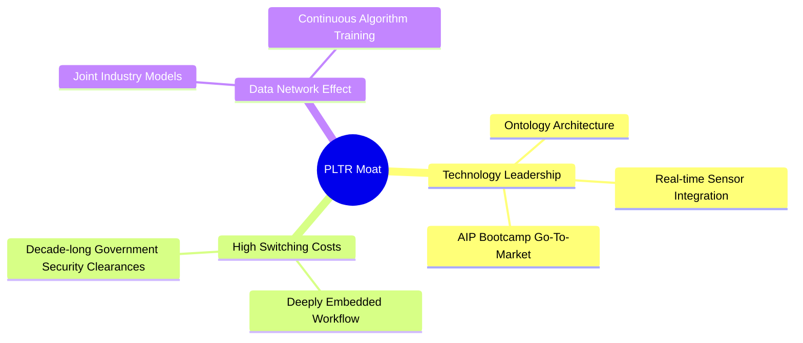

# PLTR 基本面深度分析報告
> **報告日期**：2026-06-12 ｜ **語言**：繁體中文 ｜ **數據來源**：Yahoo Finance, Finviz, StockAnalysis, Roic.ai ｜ **分析師**：CFA 級機構研究

---

## 目錄

| # | 章節 | 核心結論 |
|---|------|----------|
| 1 | 執行摘要 | 評級：**買入 (BUY)**，基準目標價：**$183.73**，AIP 驅動商業與政府雙引擎爆發。 |
| 2 | 公司概覽與商業模式 | 以 Foundry, Gotham 與 AIP 為核心的本體論 (Ontology) 架構，建構極高轉換成本護城河。 |
| 3 | 損益表深度分析 | Q1 2026 營收 YoY 達 84.71%，淨利潤率 43.7% 創歷史新高，營運槓桿顯著釋放。 |
| 4 | 資產負債表分析 | 淨現金高達 $7.81B，無傳統有息負債，流動比率 6.91x，財務結構極度穩健。 |
| 5 | 現金流量深度分析 | TTM 營運現金流 $2.72B，自由現金流轉換率高，資本配置聚焦短期高收益投資。 |
| 6 | 獲利能力與資本效率 | ROE 達 32.6%，ROIC (23.59%) 遠超 WACC (12.33%)，EVA 達 +11.26pp，強力創造股東價值。 |
| 7 | 估值深度分析 | 雖然 Trailing P/E 達 143.8x，但 Forward P/E 已降至 61.7x，PEG 1.03 顯示高成長下的估值合理性。 |
| 8 | 成長催化劑 | AIP 訓練營 (Bootcamps) 縮短銷售週期，美國商業客戶 YoY 呈三位數增長。 |
| 9 | 風險矩陣 | 政府合同集中度高、高估值對利率敏感、股權稀釋 (SBC) 為三大核心風險。 |
| 10 | 投資建議 | 基準情境目標價 $183.73（隱含 +43.55% 空間），適合長線成長型與 AI 主題投資人。 |

---

## 1. 執行摘要

Palantir Technologies Inc. (NYSE: PLTR) 正處於其商業歷史上最強勁的成長拐點。隨著人工智慧平台 (AIP, Artificial Intelligence Platform) 的推出與極速變現，PLTR 已成功從一家依賴政府國防訂單的「軟體諮詢公司」，蛻變為全球企業級 AI 基礎設施與決策作業系統的絕對龍頭。

### 1.1 核心評分儀表板



### 1.2 評分進度條視覺化

```
╔══════════════════════════════════════════════════════════════╗
║               PLTR 多維度評分儀表板 (1-10分)                 ║
╠══════════════════════════════════════════════════════════════╣
║ 基本面強度  9.0 ▓▓▓▓▓▓▓▓▓▓▓▓▓▓▓▓▓▓░░  ★★★★★           ║
║ 成長動能    9.5 ▓▓▓▓▓▓▓▓▓▓▓▓▓▓▓▓▓▓▓░  ★★★★★           ║
║ 獲利品質    8.5 ▓▓▓▓▓▓▓▓▓▓▓▓▓▓▓▓▓░░░  ★★★★☆           ║
║ 財務健康   10.0 ▓▓▓▓▓▓▓▓▓▓▓▓▓▓▓▓▓▓▓▓  ★★★★★           ║
║ 估值合理性  5.0 ▓▓▓▓▓▓▓▓▓▓░░░░░░░░░░  ★★★☆☆           ║
║ 護城河深度  9.0 ▓▓▓▓▓▓▓▓▓▓▓▓▓▓▓▓▓▓░░  ★★★★★           ║
║ 管理層執行  8.5 ▓▓▓▓▓▓▓▓▓▓▓▓▓▓▓▓▓░░░  ★★★★☆           ║
║ 技術創新力  9.5 ▓▓▓▓▓▓▓▓▓▓▓▓▓▓▓▓▓▓▓░  ★★★★★           ║
╠══════════════════════════════════════════════════════════════╣
║ 綜合總分    8.4 ▓▓▓▓▓▓▓▓▓▓▓▓▓▓▓▓░░░░  🏆 強烈買入 (Buy)   ║
╚══════════════════════════════════════════════════════════════╝
```

### 1.3 五大投資論點 + 三大核心風險

| 類型 | 項目 | 具體依據 | 信心度 |
|------|------|----------|--------|
| 🟢 **投資論點①** | **AIP 訓練營顛覆傳統銷售** | 通過 1-5 天的 Bootcamps 讓客戶直接在自身數據上體驗 AI 價值，銷售週期從數月縮短至數天。 | 🟢 極高 |
| 🟢 **投資論點②** | **美股商業市場幾何級成長** | 2026 年 Q1 營收成長加速至 84.71% YoY，主要由美股商業客戶（YoY 翻倍）強力拉動。 | 🟢 極高 |
| 🟢 **投資論點③** | **極致的營運槓桿釋放** | 毛利率高達 84.1%，隨著軟體規模效應顯現，營業利益率從 2024 年的 10.8% 飆升至 2026 年 Q1 的 46.2%。 | 🟢 高 |
| 🟢 **投資論點④** | **地緣政治緊張下的國防剛需** | Gotham 平台深度融入美軍及北約盟國防衛系統，地緣政治衝突升級使政府訂單具備極高防禦性與定價權。 | 🟢 極高 |
| 🟢 **投資論點⑤** | **無懈可擊的資產負債表** | 擁有 $8.03B 的現金與短期投資，負債僅 $211.98M（且全為租賃負債），升息環境下利息淨收入貢獻顯著。 | 🟢 極高 |
| 🟡 **風險①** | **高估值溢價** | 當前 P/S 達 58.73x，Trailing P/E 143.8x，市場容錯率極低，若成長放緩將面臨估值雙殺。 | 🟡 中度 |
| 🔴 **風險②** | **政府合同波動與集中度風險** | 政府業務佔比仍超過 50%，大型國防合同的簽署與續約時間具有不確定性。 | 🔴 中度 |
| 🔴 **風險③** | **股權稀釋 (SBC) 持續** | 儘管 GAAP 已轉盈，但股權激勵 (Stock-Based Compensation) 仍稀釋股東權益，稀釋股數 YoY 增長 4.67%。 | 🔴 高 |

### 1.4 快速統計卡片

| 指標 | PLTR 實際值 (TTM) | 軟體行業均值 | S&P 500 均值 | 狀態 |
|------|-------------|----------|--------------|------|
| **營收 YoY 成長率** | **84.7%** | ~12.5% | ~5.8% | 🟢 遠超同行 |
| **毛利率** | **84.1%** | ~72.0% | ~30.0% | 🟢 極其優異 |
| **淨利率** | **43.7%** | ~15.0% | ~11.5% | 🟢 頂尖水準 |
| **ROE** | **32.6%** | ~12.0% | ~15.0% | 🟢 資本效率極高 |
| **Forward P/E** | **61.70x** | ~32.0x | ~21.5x | 🔴 溢價顯著 |
| **流動比率** | **6.91x** | ~1.8x | ~1.2x | 🟢 極度安全 |

### 1.5 投資結論

```
╔══════════════════════════════════════════════════════════════════╗
║                    📊 PLTR 投資結論摘要                          ║
╠══════════════════════════════════════════════════════════════════╣
║  評級：🟢 買入 (BUY)                                             ║
║  當前股價：$127.99 (2026-06-12)                                  ║
║  目標價區間：                                                    ║
║    悲觀情境：$100.00 (-21.87%) - 估值收縮，成長回歸 25%          ║
║    基準情境：$183.73 (+43.55%) - AIP 持續變現，CAGR 45%         ║
║    樂觀情境：$255.00 (+99.23%) - 商業市場全面主導，標普納入效應  ║
║  投資評分：8.4 / 10                                              ║
║  適合投資人：尋求高成長、具備高風險承受力的長線 AI 基礎設施投資人 ║
╚══════════════════════════════════════════════════════════════════╝
```

---

## 2. 公司概覽與商業模式

Palantir 的核心競爭力在於其獨創的**「本體論 (Ontology)」**架構。與傳統僅提供數據存儲（如 Snowflake）或數據可視化（如 Tableau）的軟體不同，Palantir 將企業的所有異構數據、業務邏輯與決策流程融合成一個動態的數位孿生實體 (Digital Twin)。

### 2.1 業務結構與收入來源

PLTR 的業務主要分為兩大板塊：**政府 (Government)** 與 **商業 (Commercial)**。



### 2.2 市場份額

在企業級 AI 決策與大數據整合軟體市場中，Palantir 屬於利基市場的開創者與領導者。



### 2.3 競爭護城河分析



### 2.4 護城河強度評分

```
╔══════════════════════════════════════════════════════════════╗
║                  PLTR 護城河強度評分                         ║
╠══════════════════════════════════════════════════════════════╣
║ 技術領先度    9.5/10  ▓▓▓▓▓▓▓▓▓▓▓▓▓▓▓▓▓▓▓░  🏆 本體論無對手║
║ 客戶鎖定效應  9.5/10  ▓▓▓▓▓▓▓▓▓▓▓▓▓▓▓▓▓▓▓░  🟢 轉換成本極高║
║ 安全壁壘      10.0/10 ▓▓▓▓▓▓▓▓▓▓▓▓▓▓▓▓▓▓▓▓  🏆 IL6 最高安全 ║
║ 銷售生態系統  8.0/10  ▓▓▓▓▓▓▓▓▓▓▓▓▓▓▓▓░░░░  🟢 AIP 訓練營  ║
╠══════════════════════════════════════════════════════════════╣
║ 綜合護城河    9.25/10 ▓▓▓▓▓▓▓▓▓▓▓▓▓▓▓▓▓▓░░  🏆 極深寬護城河 ║
╚══════════════════════════════════════════════════════════════╝
```

---

## 3. 損益表深度分析

Palantir 的損益表展現了典型的高成長 SaaS 企業在越過盈虧平衡點後，**「營運槓桿 (Operating Leverage)」** 爆發的經典案例。

### 3.1 年度收入成長趨勢（近5年）

```
╔══════════════════════════════════════════════════════════════════╗
║              PLTR 年度收入趨勢 (FY2021 - TTM 2