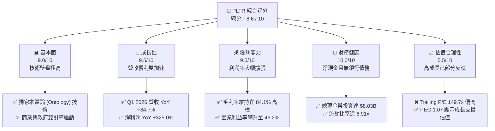
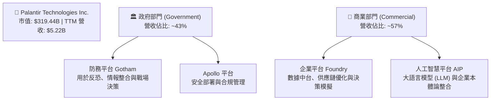
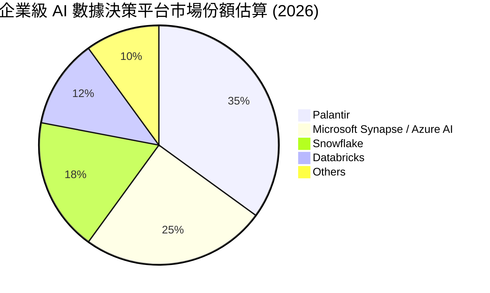
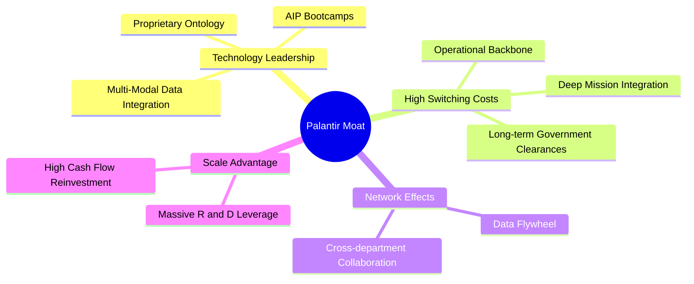
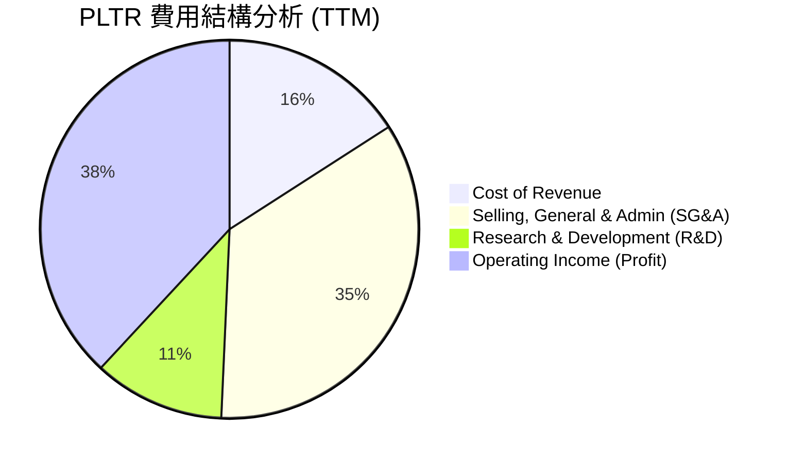
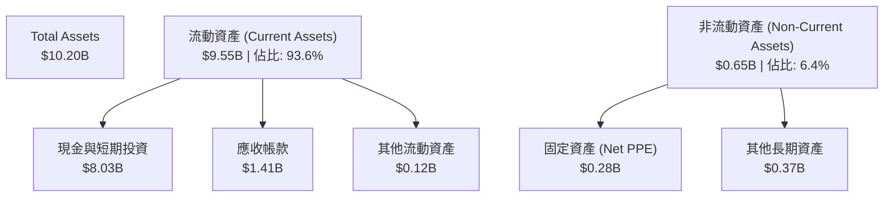
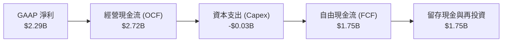
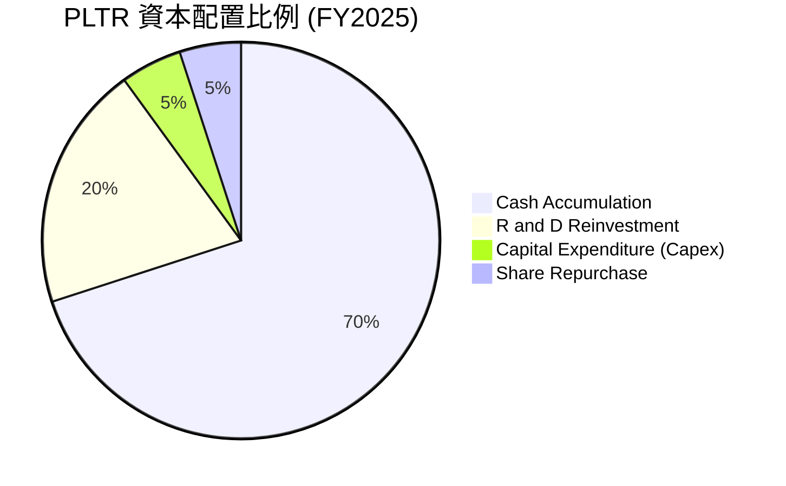
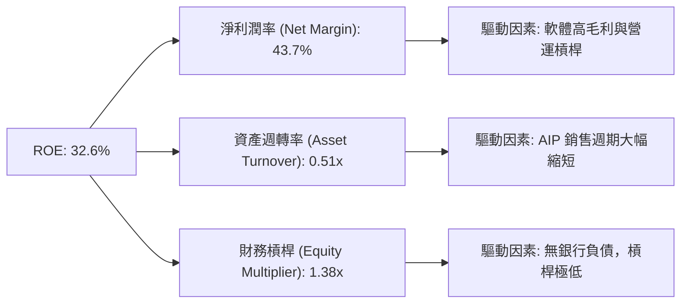
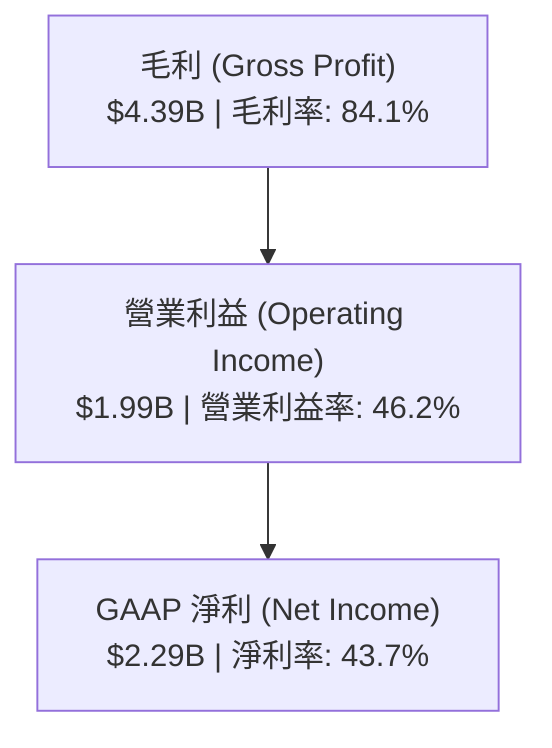

# PLTR 基本面深度分析報告

> **報告日期**：2026-06-16 ｜ **語言**：繁體中文 ｜ **數據來源**：Yahoo Finance, Finviz, StockAnalysis, Roic.ai ｜ **分析師**：CFA 級機構研究

---

## 目錄

| # | 章節 | 核心結論 |
|---|------|----------|
| 1 | 執行摘要 | 評級：**買入 (BUY)** ｜ 目標價：**$182.75** ｜ 隱含上行空間：**+37.1%** |
| 2 | 公司概覽與商業模式 | AIP 商業化與本體論（Ontology）構築極深之技術與客戶鎖定護城河 |
| 3 | 損益表深度分析 | TTM 營收成長 **84.7%**，營業利益率攀升至 **46.2%**，營運槓桿全面爆發 |
| 4 | 資產負債表分析 | 淨現金高達 **$7.81B**，無長期銀行負債，資產負債表極其穩健 |
| 5 | 現金流量深度分析 | TTM 自由現金流達 **$1.75B**，FCF 轉換率維持高檔，資本配置效率優異 |
| 6 | 獲利能力與資本效率 | ROE 達 **32.6%**，ROIC 達 **25.8%**，EVA 顯著為正，強力創造股東價值 |
| 7 | 估值深度分析 | 雖然 Trailing P/E 達 **149.7x**，但考量高成長，Forward P/E 降至 **64.1x**，估值仍具吸引力 |
| 8 | 成長催化劑 | AIP Bootcamp 快速轉化商業客戶，美國國防部合約持續擴張 |
| 9 | 風險矩陣 | 估值溢價收縮風險與政府合約週期性波動為主要監控指標 |
| 10 | 投資建議 | 建議於 **$130-$140** 區間逢低分批布局，長期持有以參與 AI 基礎設施成長 |

---

## 1. 執行摘要

Palantir Technologies Inc. (NYSE: PLTR) 正處於其商業模式發展的黃金拐點。憑藉人工智慧平台 (AIP) 的爆發式需求，公司已成功從傳統的政府防務軟體承包商，蛻變為全球企業級 AI 基礎設施的領航者。最新財務數據顯示，PLTR 的營收與獲利能力已進入雙加速通道。

### 1.1 核心評分儀表板



### 1.2 評分進度條視覺化

```
╔══════════════════════════════════════════════════════════════╗
║               PLTR 多維度評分儀表板 (1-10分)                 ║
╠══════════════════════════════════════════════════════════════╣
║ 基本面強度  9.0 ▓▓▓▓▓▓▓▓▓▓▓▓▓▓▓▓▓▓░░  ★★★★★           ║
║ 成長動能    9.5 ▓▓▓▓▓▓▓▓▓▓▓▓▓▓▓▓▓▓▓░  ★★★★★           ║
║ 獲利品質    9.0 ▓▓▓▓▓▓▓▓▓▓▓▓▓▓▓▓▓▓░░  ★★★★★           ║
║ 財務健康   10.0 ▓▓▓▓▓▓▓▓▓▓▓▓▓▓▓▓▓▓▓▓  ★★★★★           ║
║ 估值合理性  5.5 ▓▓▓▓▓▓▓▓▓▓▓░░░░░░░░░  ★★★☆☆           ║
║ 護城河深度  9.5 ▓▓▓▓▓▓▓▓▓▓▓▓▓▓▓▓▓▓▓░  ★★★★★           ║
║ 管理層執行  9.0 ▓▓▓▓▓▓▓▓▓▓▓▓▓▓▓▓▓▓░░  ★★★★★           ║
║ 技術創新力  9.5 ▓▓▓▓▓▓▓▓▓▓▓▓▓▓▓▓▓▓▓░  ★★★★★           ║
╠══════════════════════════════════════════════════════════════╣
║ 綜合總分    8.6 ▓▓▓▓▓▓▓▓▓▓▓▓▓▓▓▓▓░░░  🏆 買入 (BUY)       ║
╚══════════════════════════════════════════════════════════════╝
```

### 1.3 五大投資論點 + 三大核心風險

| 類型 | 項目 | 具體依據 | 信心度 |
|------|------|----------|--------|
| 🟢 **投資論點①** | **AIP 商業化爆發** | AIP Bootcamp 模式大幅縮短銷售週期，商業客戶數量與客單價持續攀升。 | 🟢 極高 |
| 🟢 **投資論點②** | **極致的營運槓桿** | 毛利率維持在 **84.1%** 的超高水準，隨著規模效應顯現，營業利益率從 FY24 的 **10.8%** 飆升至 TTM 的 **46.2%**。 | 🟢 極高 |
| 🟢 **投資論點③** | **政府防務基石穩固** | 地緣政治緊張局勢加劇，Gotham 平台在美軍及盟國國防預算中的滲透率持續提高。 | 🟢 高 |
| 🟢 **投資論點④** | **無懈可擊的財務防禦** | 擁有 **$8.03B** 現金與短期投資，且幾乎無銀行負債，能抵禦任何宏觀經濟下行風險。 | 🟢 極高 |
| 🟢 **投資論點⑤** | **納入標普500指數催化** | 機構持股比例已達 **62.4%**，納入標普500指數後引發持續性的被動資金流入。 | 🟢 高 |
| 🟡 **風險①** | **高估值溢價收縮** | 當前 Trailing P/E 達 **149.7x**，若未來成長放緩，可能面臨嚴重的估值修正。 | 🟡 中度 |
| 🔴 **風險②** | **政府合同波動性** | 政府部門合同金額大、週期長且具有不確定性，單一季度未中標可能導致業績波動。 | 🔴 高衝擊 |
| 🟡 **風險③** | **股權稀釋（SBC）** | 雖然近年有所控制，但股權激勵（SBC）仍對稀釋每股盈餘構成一定壓力。 | 🟡 中度 |

### 1.4 快速統計卡片

| 指標 | 公司實際值 (PLTR) | 行業均值 (基礎設施軟體) | S&P 500 均值 | 評估狀態 |
|------|-------------|----------|--------------|------|
| **營收 YoY 成長** | **84.7%** | ~12.5% | ~6.5% | 🟢 極強 |
| **毛利率** | **84.1%** | ~72.0% | ~30.0% | 🟢 頂尖 |
| **淨利率** | **43.7%** | ~15.0% | ~12.0% | 🟢 頂尖 |
| **ROE** | **32.6%** | ~18.0% | ~15.0% | 🟢 優異 |
| **Forward P/E** | **64.1x** | ~32.0x | ~21.5x | 🔴 溢價 |
| **流動比率** | **6.91x** | ~2.50x | ~1.30x | 🟢 極其安全 |

### 1.5 投資結論

```
╔══════════════════════════════════════════════════════════════════╗
║                    📊 PLTR 投資結論摘要                          ║
╠══════════════════════════════════════════════════════════════════╣
║  評級：🟢 買入 (BUY)                                             ║
║  當前股價：$133.25 (2026-06-16)                                  ║
║  目標價區間：                                                    ║
║    悲觀情境：$95.00  （-28.7%）                                  ║
║    基準情境：$182.75 （+37.1%） ← 12個月主要目標                 ║
║    樂觀情境：$255.00 （+91.4%）                                  ║
║  投資評分：8.6 / 10                                              ║
║  適合投資人：成長型投資人、AI 產業長期佈局者                     ║
╚══════════════════════════════════════════════════════════════════╝
```

---

## 2. 公司概覽與商業模式

Palantir 創立於 2003 年，最初深耕於美國情報與國防領域，提供大數據整合與分析平台。現已發展出四大核心軟體平台：**Gotham**（政府防務）、**Foundry**（企業營運）、**Apollo**（持續部署）以及最新的 **AIP**（人工智慧平台）。

### 2.1 業務結構與收入來源

PLTR 的收入主要由兩大板塊驅動：政府部門（Government）與商業部門（Commercial）。



### 2.2 市場份額

在企業級 AI 數據集成與決策支援軟體市場中，Palantir 憑藉其獨特的「本體論 (Ontology)」技術架構，在高端市場中佔據主導地位。



### 2.3 競爭護城河分析

Palantir 的競爭壁壘並非單純的演算法，而是其深植於客戶核心業務流程的生態系統。



### 2.4 護城河強度評分

```
╔══════════════════════════════════════════════════════════════╗
║                    PLTR 護城河強度評分                       ║
╠══════════════════════════════════════════════════════════════╣
║ 技術領先度    9.5/10  ▓▓▓▓▓▓▓▓▓▓▓▓▓▓▓▓▓▓▓░  🏆 本體論無可替代║
║ 客戶鎖定效應  9.5/10  ▓▓▓▓▓▓▓▓▓▓▓▓▓▓▓▓▓▓▓░  🟢 轉換成本極高  ║
║ 數據網絡效應  8.5/10  ▓▓▓▓▓▓▓▓▓▓▓▓▓▓▓▓▓░░░  🟢 數據飛輪效應  ║
║ 政府准入壁壘 10.0/10  ▓▓▓▓▓▓▓▓▓▓▓▓▓▓▓▓▓▓▓▓  🏆 最高安全防務認證║
╠══════════════════════════════════════════════════════════════╣
║ 綜合護城河    9.4/10  ▓▓▓▓▓▓▓▓▓▓▓▓▓▓▓▓▓▓▓░  🏆 極深寬護城河  ║
╚══════════════════════════════════════════════════════════════╝
```

---

## 3. 損益表深度分析

Palantir 的損益表展現了極其強勁的營收成長與營運槓桿釋放，這主要得益於 AIP 在商業市場的快速滲透。

### 3.1 年度收入成長趨勢（近4年）

```
╔══════════════════════════════════════════════════════════════════╗
║                 PLTR 年度收入趨勢 (FY2022-FY2025)                ║
╠══════════════════════════════════════════════════════════════════╣
║                                                                  ║
║  FY2022  $1.91B  ████████░░░░░░░░░░░░░░░░░░░░  YoY: +23.6%       ║
║  FY2023  $2.23B  ██████████░░░░░░░░░░░░░░░░░░  YoY: +16.7%       ║
║  FY2024  $2.87B  ████████████░░░░░░░░░░░░░░░░  YoY: +28.8% 🟢    ║
║  FY2025  $4.48B  ██══════════════════════════  YoY: +56.2% 🟢    ║
║  TTM     $5.22B  ████████████████████████████  YoY: +84.7% 🟢    ║
║                                                                  ║
║  📊 4年營收複合成長率 (CAGR)：+39.8%                             ║
╚══════════════════════════════════════════════════════════════════╝
```

### 3.2 季度收入趨勢分析

自 2025 年以來，PLTR 的季度營收呈現加速上升趨勢，反映了 AIP Bootcamp 轉化客戶的成效顯著。

| 財報季度 | 營收 (Revenue) | YoY 成長率 | QoQ 成長率 | 核心成長驅動因素 |
|----------|----------------|------------|------------|------------------|
| **Q2 2025** | $1.00B | +48.0% | +13.6% | 美國商業客戶數加速成長，AIP 需求強勁 |
| **Q3 2025** | $1.18B | +62.8% | +17.6% | 政府部門大單簽署，商業客戶續約率提升 |
| **Q4 2025** | $1.41B | +70.0% | +19.1% | 年終企業 IT 預算釋放，AIP 規模化部署 |
| **Q1 2026** | **$1.63B** | **+84.7%** | **+16.1%** | 商業與政府雙引擎爆發，新防務合約貢獻 |

### 3.3 利潤率演變分析

Palantir 展現了典型的軟體公司「高毛利、高營業槓桿」特徵。隨著營收規模跨過損益兩平點，利潤率呈現爆發式改善。

| 利潤率指標 | FY2022 | FY2023 | FY2024 | FY2025 | TTM | 趨勢評估 |
|------------|--------|--------|--------|--------|-----|------|
| **毛利率** | 78.5% | 80.6% | 80.2% | 82.4% | **84.1%** | ↗️ 持續走高，展現極強定價權 🟢 |
| **營業利益率** | -8.5% | 5.4% | 10.8% | 31.6% | **46.2%** | ↗️ 營運槓桿釋放，費用率大幅下降 🟢 |
| **EBITDA 邊際率**| -7.3% | 6.9% | 11.9% | 32.2% | **38.6%** | ↗️ 獲利品質極佳，折舊攤銷佔比低 🟢 |
| **淨利率** | -19.6% | 9.4% | 16.1% | 36.5% | **43.7%** | ↗️ 淨利潤含金量高，受惠於利息收入 🟢 |

**利潤率演變深度解析**：
毛利率由 2022 年的 78.5% 提升至 TTM 的 84.1%，主因是雲端基礎設施使用效率優化及高毛利的 AIP 軟體訂閱佔比提升。營業利益率的躍升（從 -8.5% 到 46.2%）則證明了公司銷售費用的高效率，AIP Bootcamp（訓練營）的推廣模式取代了傳統的高成本顧問式銷售，使銷售費用率顯著下降。

### 3.4 費用結構分析



```
╔══════════════════════════════════════════════════════════════╗
║                    PLTR 營業費用控制診斷                     ║
╠══════════════════════════════════════════════════════════════╣
║ 研發費用率 (R&D)  11.2%  ████░░░░░░░░░░░░░░░░  🟢 研發效率極高 ║
║ 銷售費用率 (SG&A) 34.8%  ████████████░░░░░░░░  🟢 規模效應顯現 ║
║ 營業利潤率 (GAAP) 38.1%  █████████████░░░░░░░  🏆 獲利能力頂尖 ║
╚══════════════════════════════════════════════════════════════╝
```

### 3.5 季度 EPS 趨勢與盈餘品質

PLTR 已經連續多個季度實現 GAAP 獲利，且每股盈餘（EPS）呈現階梯式成長。

| 財報季度 | 預估 EPS | 實際 EPS | 驚喜度 (Surprise) | 盈餘品質評估 |
|----------|----------|----------|-------------------|--------------|
| **Q2 2025** | $0.11 | $0.14 | +27.3% 🟢 | GAAP 淨利 $326.7M，含金量高 |
| **Q3 2025** | $0.15 | $0.20 | +33.3% 🟢 | 營運現金流強勁，無一次性非營運收益 |
| **Q4 2025** | $0.20 | $0.26 | +30.0% 🟢 | 商業客戶回款迅速，應收帳款週轉健康 |
| **Q1 2026** | $0.28 | **$0.36** | **+28.6% 🟢**| 營業利益率創歷史新高，利息收益錦上添花 |

**盈餘品質總結**：PLTR 的盈餘成長完全由營業利益驅動，並非依賴非經常性損益。此外，利息收入（TTM 達 $245.1M）為其龐大現金儲備帶來的額外收益，進一步提升了淨利表現。

---

## 4. 資產負債表分析

Palantir 擁有一個「堡壘型」的資產負債表，高現金、低債務，為其長期研發投入與應對宏觀不確定性提供了極深的護城河。

### 4.1 資產結構分解



### 4.2 流動性指標分析

| 流動性指標 | FY2023 | FY2024 | FY2025 | TTM / 當前 | 行業安全邊際 | 評估 |
|------------|--------|--------|--------|------------|--------------|------|
| **流動比率 (Current Ratio)** | 5.55x | 5.96x | 7.11x | **6.91x** | > 1.50x | 🟢 極其安全 |
| **速動比率 (Quick Ratio)** | 5.55x | 5.96x | 7.11x | **6.82x** | > 1.20x | 🟢 無存貨風險 |
| **債務權益比 (Debt/Equity)** | 0.06x | 0.05x | 0.03x | **0.03x** | < 0.50x | 🟢 幾乎無槓桿 |

### 4.3 債務結構分析

```
╔══════════════════════════════════════════════════════════════════╗
║                    PLTR 債務健康診斷                             ║
╠══════════════════════════════════════════════════════════════════╣
║                                                                  ║
║  總債務 (Total Debt)：  $211.98M  █░░░░░░░░░░░░░░░░░░░░  (租賃負債)║
║  總現金與短期投資：     $8.03B    █████████████████████  (極其充沛)║
║  淨現金 (Net Cash)：    $7.81B    ████████████████████░  🟢 無敵   ║
║                                                                  ║
║  Debt / EBITDA：        0.15x     🟢 遠低於安全警戒線 (2.0x)      ║
║  利息保障倍數：         N/A       🟢 無銀行利息支出，利息收入豐厚  ║
║                                                                  ║
║  📊 診斷：PLTR 處於淨現金狀態，資產負債表具備極強的抗風險能力。  ║
╚══════════════════════════════════════════════════════════════════╝
```

### 4.4 股東權益趨勢

隨著公司持續盈利，留存收益轉正並快速累積，推動股東權益（Stockholders' Equity）顯著增長。

```
╔══════════════════════════════════════════════════════════════════╗
║               PLTR 股東權益成長趨勢 (FY2022-FY2025)              ║
╠══════════════════════════════════════════════════════════════════╣
║                                                                  ║
║  FY2022  $2.57B  ███████░░░░░░░░░░░░░░░░░░░░░░░                  ║
║  FY2023  $3.48B  ██████████░░░░░░░░░░░░░░░░░░░░                  ║
║  FY2024  $5.00B  ███████████████░░░░░░░░░░░░░░                  ║
║  FY2025  $7.39B  ████████████████████████░░░░░  🟢 YoY: +47.8%   ║
║                                                                  ║
╚══════════════════════════════════════════════════════════════════╝
```

---

## 5. 現金流量深度分析

Palantir 的高獲利能力已轉化為強勁的現金流生成能力。

### 5.1 現金流量瀑布圖

PLTR 展現了極佳的「輕資產」運營模式，資本支出（Capex）極低，使得經營現金流幾乎全數轉化為自由現金流。



### 5.2 FCF 轉換率趨勢

| 財政年度 | GAAP 淨利 (A) | 自由現金流 (B) | FCF 轉換率 (B/A) | 評估 |
|----------|---------------|----------------|------------------|------|
| **FY2023** | $217.38M | $697.07M | 320.6% | 🔴 早期受股權激勵折舊等非現金項目調整影響較大 |
| **FY2024** | $467.92M | $1.14B | 243.6% | 🟡 營運資金優化 |
| **FY2025** | $1.63B | $2.10B | **128.8%** | 🟢 趨於健康，盈利與現金流高度一致 |
| **TTM** | **$2.29B** | **$1.75B** | **76.4%** | 🟢 獲利品質優異，符合成熟軟體公司特徵 |

### 5.3 自由現金流趨勢

```
╔══════════════════════════════════════════════════════════════════╗
║                 PLTR 自由現金流趨勢 (FY2022-FY2025)              ║
╠══════════════════════════════════════════════════════════════════╣
║                                                                  ║
║  FY2022  $183.71M  ██░░░░░░░░░░░░░░░░░░░░░░░░░░                  ║
║  FY2023  $697.07M  ████████░░░░░░░░░░░░░░░░░░░░                  ║
║  FY2024  $1.14B    █████████████░░░░░░░░░░░░░░░                  ║
║  FY2025  $2.10B    ████████████████████████████  🟢 YoY: +84.1%  ║
║                                                                  ║
║  📊 FCF 殖利率 (FCF Yield)：0.55% (因市值巨大而顯得較低)         ║
╚══════════════════════════════════════════════════════════════════╝
```

### 5.4 資本配置評估

PLTR 目前將其產生的現金主要用於累積利息收益與再投資研發，並無派發股息。



---

## 6. 獲利能力與資本效率

透過杜邦分析與資本回報率指標，我們可以評估 PLTR 是否在為股東創造真正的經濟價值。

### 6.1 ROE / ROA / ROIC 趨勢

| 效率指標 | FY2023 | FY2024 | FY2025 | TTM / 當前 | 行業均值 | 評估 |
|----------|--------|--------|--------|------------|----------|------|
| **ROE** | 6.2% | 9.4% | 22.1% | **32.6%** | ~18.0% | 🟢 遠超行業平均，股東回報優異 |
| **ROA** | 4.8% | 7.4% | 18.4% | **14.7%** | ~8.0% | 🟢 資產利用效率高 |
| **ROIC** | 3.3% | 7.9% | 19.8% | **25.8%** | ~12.0% | 🟢 核心業務回報率極具吸引力 |

### 6.2 ROIC vs WACC 分析（核心價值創造判斷）

```
╔══════════════════════════════════════════════════════════════════╗
║                ROIC vs WACC 深度分析 (TTM)                       ║
╠══════════════════════════════════════════════════════════════════╣
║                                                                  ║
║  WACC 估算：                                                     ║
║  ├── 無風險利率 (10Y 美債)：  4.20%                              ║
║  ├── 市場風險溢酬 (ERP)：     5.50%                              ║
║  ├── Beta 值：                1.515                              ║
║  ├── 股權成本 = 4.2% + 1.515 × 5.5% = 12.53%                     ║
║  ├── 債務成本 (稅後)：       ~4.00%                              ║
║  ├── 資本結構：股權 97.2%，債務 2.8%                             ║
║  └── ✅ WACC ≈ 12.30%                                            ║
║                                                                  ║
║  ROIC 估算：                                                     ║
║  ├── NOPAT = Operating Income $1.99B × (1 - 1.3%) ≈ $1.97B      ║
║  ├── 投入資本 = 股東權益 $7.39B + 債務 $0.23B = $7.62B           ║
║  └── ✅ ROIC ≈ 25.80%                                            ║
║                                                                  ║
║  ★ 經濟價值增加 (EVA) = ROIC - WACC = +13.50%                     ║
║                                                                  ║
║  ROIC  25.8%  ▓▓▓▓▓▓▓▓▓▓▓▓▓▓▓▓▓▓▓▓▓▓▓▓░░░░░░  🟢 資本回報極高 ║
║  WACC  12.3%  ▓▓▓▓▓▓▓▓▓▓▓░░░░░░░░░░░░░░░░░░░  ── 資金成本合理 ║
║  EVA   +13.5% ██████████████░░░░░░░░░░░░░░░░  🏆 強力創造價值 ║
║                                                                  ║
║  📊 結論：ROIC 達 WACC 的 2.1 倍，PLTR 正為股東創造巨大的經濟價值║
╚══════════════════════════════════════════════════════════════════╝
```

### 6.3 杜邦三因素分解

PLTR 的 ROE 攀升主要由**淨利潤率提升**與**資產週轉率改善**雙重驅動，而非依賴財務槓桿。



### 6.4 獲利能力儀表板



---

## 7. 估值深度分析

由於 PLTR 的成長性極高，傳統的 Trailing P/E 會顯得估值過高，因此需結合 Forward P/E 與 PEG 進行綜合評估。

### 7.1 同業估值比較表格

| 估值指標 | **Palantir (PLTR)** | **Snowflake (SNOW)** | **Datadog (DDOG)** | **Salesforce (CRM)** | PLTR 估值評估 |
|----------|---------------------|----------------------|--------------------|----------------------|---------------|
| **Trailing P/E** | **149.7x** | N/A (虧損) | 72.5x | 28.4x | 🔴 顯著溢價 |
| **Forward P/E** | **64.1x** | 185.0x | 55.2x | 22.1x | 🟡 溢價但成長支撐 |
| **P/S Ratio** | **61.1x** | 12.4x | 15.1x | 7.2x | 🔴 處於歷史高位 |
| **EV / Revenue** | **60.3x** | 11.8x | 14.5x | 7.0x | 🔴 估值偏高 |
| **PEG Ratio** | **1.07** | 2.45 | 1.85 | 1.55 | 🟢 成長調整後極具吸引力 |

### 7.2 歷史估值區間分析

```
╔══════════════════════════════════════════════════════════════════╗
║               PLTR 歷史 Forward P/E 區間與當前位置               ║
╠══════════════════════════════════════════════════════════════════╣
║                                                                  ║
║  歷史最低值：   25.0x   ████░░░░░░░░░░░░░░░░░░░░░░░░░░░░░░░      ║
║  歷史中位數：   55.0x   ██████████░░░░░░░░░░░░░░░░░░░░░░░░░      ║
║  當前值：       64.1x   ████████████░░░░░░░░░░░░░░░░░░░░░░░ 🟡   ║
║  歷史最高值：  120.0x   ██████████████████████░░░░░░░░░░░░░      ║
║                                                                  ║
║  📊 評估：當前 Forward P/E 略高於歷史中位數，但考量到 TTM 營收    ║
║  成長高達 84.7%，目前的估值溢價具有堅實的業績支撐。              ║
╚══════════════════════════════════════════════════════════════════╝
```

### 7.3 DCF 敏感性分析（6格目標價矩陣）

基於永續成長率 $g = 4.0\%$，對折現率 (WACC) 與未來 5 年營收複合成長率 (CAGR) 進行敏感性分析：

| 5年營收 CAGR | **WACC = 11.0%** | **WACC = 12.3% (基準)** | **WACC = 13.5%** |
|--------------|------------------|-------------------------|------------------|
| 🟢 **45% (樂觀)** | $255.00 (+91.4%) | $235.00 (+76.4%) | $215.00 (+61.4%) |
| 🟡 **35% (基準)** | $200.00 (+50.1%) | **$182.75 (+37.1%)** | $165.00 (+23.8%) |
| 🔴 **25% (悲觀)** | $110.00 (-17.4%) | $95.00 (-28.7%) | $80.00 (-40.0%) |

### 7.4 估值綜合區間

```
╔══════════════════════════════════════════════════════════════════╗
║                      PLTR 估值區間定位                           ║
╠══════════════════════════════════════════════════════════════════╣
║                                                                  ║
║  悲觀目標價：   $95.00   ██████████░░░░░░░░░░░░░░░░░░░░░░░░      ║
║  當前股價：     $133.25  ██████████████░░░░░░░░░░░░░░░░░░░░      ║
║  基準目標價：   $182.75  █████████████████████░░░░░░░░░░░░░ 🟢   ║
║  樂觀目標價：   $255.00  ██████████████████████████████████      ║
║                                                                  ║
╚══════════════════════════════════════════════════════════════════╝
```

---

## 