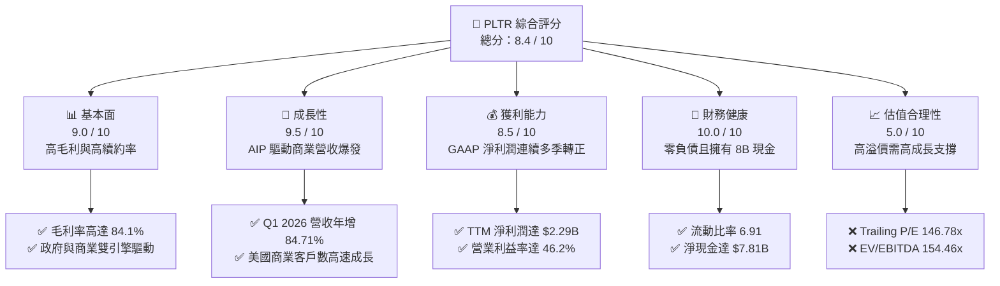
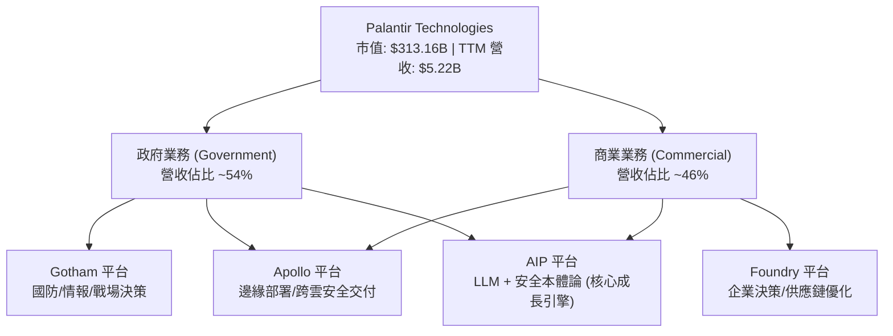
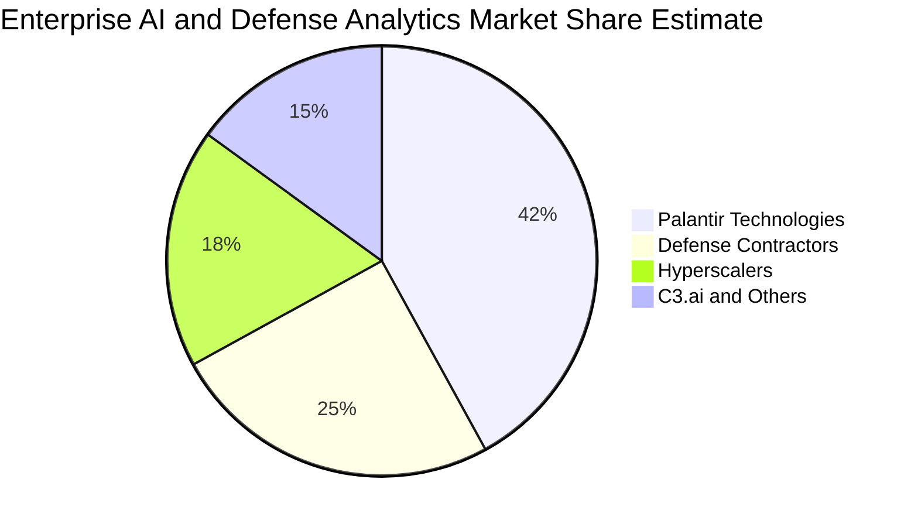
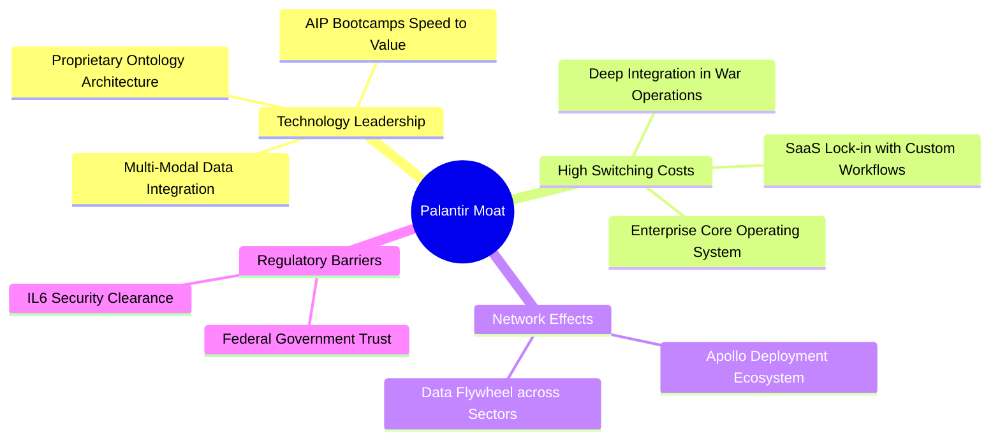
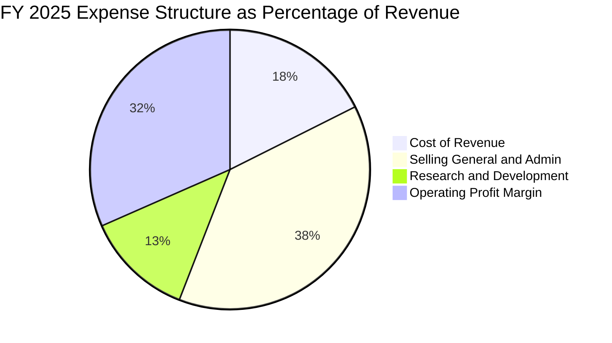
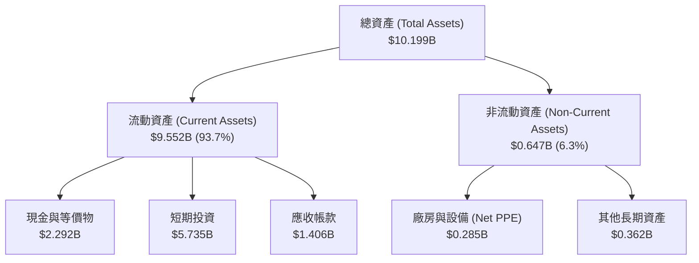
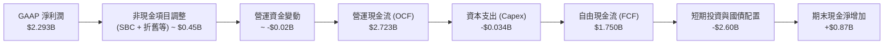
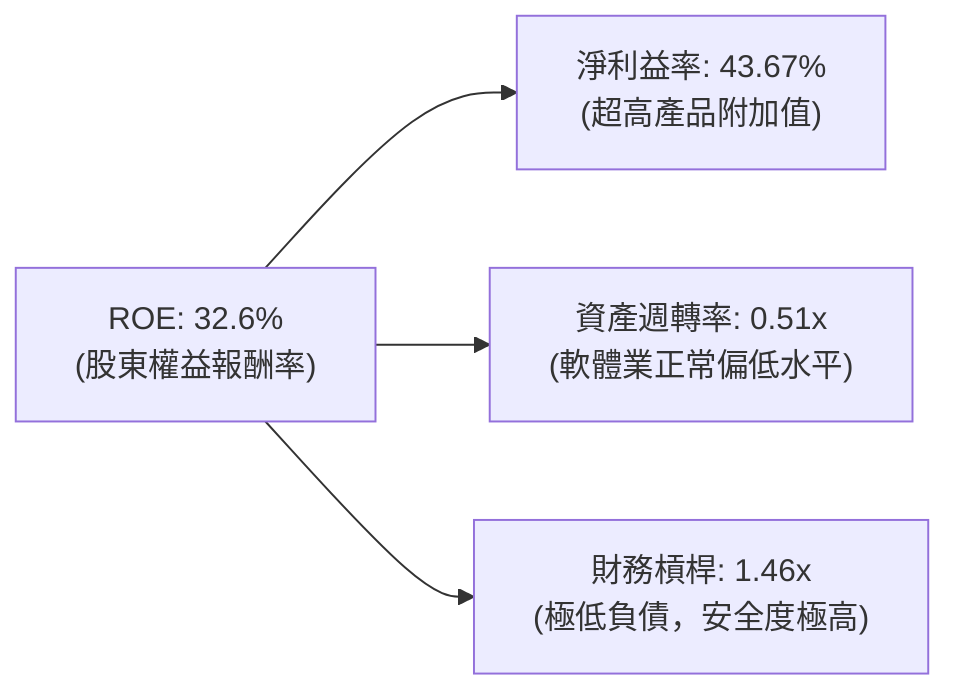
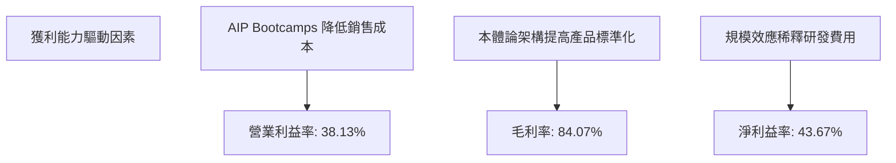
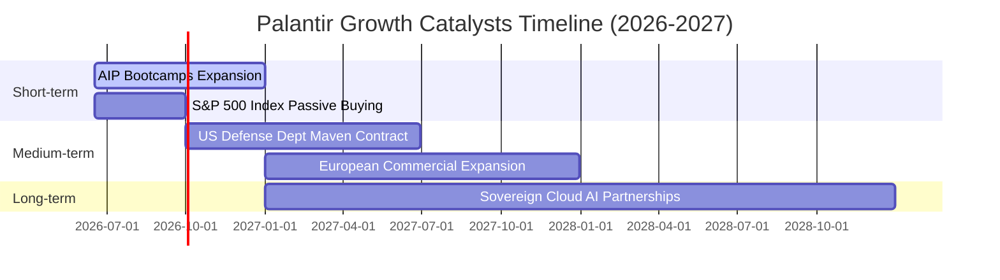

# PLTR 基本面深度分析報告

> **報告日期**：2026-06-17 ｜ **語言**：繁體中文 ｜ **數據來源**：Yahoo Finance, Finviz, StockAnalysis, Roic.ai ｜ **分析師**：CFA 級機構研究

---

## 目錄

| # | 章節 | 核心結論 |
|---|------|----------|
| 1 | **執行摘要** | 評級「買入」，12個月基準目標價 $182.75，隱含 39.9% 上行空間。 |
| 2 | **公司概覽與商業模式** | 以「本體論（Ontology）」為核心，AIP 訓練營（Bootcamps）驅動商業化裂變。 |
| 3 | **損益表深度分析** | Q1 2026 營收年增 84.71%，淨利潤率高達 43.7%，展現極強的經營槓桿。 |
| 4 | **資產負債表分析** | 淨現金高達 $7.81B，流動比率 6.91，無顯著有息負債，財務防禦力極佳。 |
| 5 | **現金流量深度分析** | TTM 營運現金流 $2.72B，自由現金流 $1.75B，高效轉化率支撐資本配置。 |
| 6 | **獲利能力與資本效率** | ROE 達 32.6%，ROIC 顯著超越 WACC，強力為股東創造超額經濟價值。 |
| 7 | **估值深度分析** | 雖 Trailing P/E 達 146.8x，但 Forward P/E 降至 62.8x，DCF 基準估值 $182.75。 |
| 8 | **成長催化劑** | 美國商業 AIP 需求爆發、國防部大額合約簽署、標普 500 指數效應持續發酵。 |
| 9 | **風險矩陣** | 商業市場競爭加劇、政府合約集中度高、股權稀釋（SBC）壓力。 |
| 10| **投資建議** | 建議於 $130 以下逢低分批布局，設定 $182.75 為中線目標。 |

---

## 1. 執行摘要

Palantir Technologies Inc.（NYSE: PLTR）正處於其商業歷史上最為強勁的增長軌道。得益於人工智慧平台（AIP, Artificial Intelligence Platform）在企業端的爆發式普及，公司已成功從一家依賴政府高客單價合約的軟體諮詢公司，蛻變為標準化、規模化的企業級 AI 基礎設施巨頭。

### 1.1 核心評分儀表板



### 1.2 評分進度條視覺化

```
╔══════════════════════════════════════════════════════════════╗
║               PLTR 多維度評分儀表板 (1-10分)                 ║
╠══════════════════════════════════════════════════════════════╣
║ 基本面強度  9.0 ▓▓▓▓▓▓▓▓▓▓▓▓▓▓▓▓▓▓░░  ★★★★★           ║
║ 成長動能    9.5 ▓▓▓▓▓▓▓▓▓▓▓▓▓▓▓▓▓▓▓░  ★★★★★           ║
║ 獲利品質    8.5 ▓▓▓▓▓▓▓▓▓▓▓▓▓▓▓▓░░░░  ★★★★☆           ║
║ 財務健康   10.0 ▓▓▓▓▓▓▓▓▓▓▓▓▓▓▓▓▓▓▓▓  ★★★★★           ║
║ 估值合理性  5.0 ▓▓▓▓▓▓▓▓▓▓░░░░░░░░░░  ★★★☆☆           ║
║ 護城河深度  9.0 ▓▓▓▓▓▓▓▓▓▓▓▓▓▓▓▓▓▓░░  ★★★★★           ║
║ 管理層執行  8.5 ▓▓▓▓▓▓▓▓▓▓▓▓▓▓▓▓░░░░  ★★★★☆           ║
║ 技術創新力  9.5 ▓▓▓▓▓▓▓▓▓▓▓▓▓▓▓▓▓▓▓░  ★★★★★           ║
╠══════════════════════════════════════════════════════════════╣
║ 綜合總分    8.4 ▓▓▓▓▓▓▓▓▓▓▓▓▓▓▓▓░░░░  🏆 優秀成長標的    ║
╚══════════════════════════════════════════════════════════════╝
```

### 1.3 五大投資論點與三大核心風險

| 類型 | 項目 | 具體依據 | 信心度 |
|------|------|----------|--------|
| 🟢 **投資論點①** | **AIP 訓練營成效斐然** | AIP Bootcamps 縮短銷售週期，Q1 2026 營收年增率達 84.71%，商業客戶裂變式增長。 | 🟢 極高 |
| 🟢 **投資論點②** | **極致的獲利能力改善** | TTM 營業利益率達 46.2%，淨利率達 43.7%，展現軟體平台強大的經營槓桿。 | 🟢 極高 |
| 🟢 **投資論點③** | **無懈可擊的資產負債表** | 現金與短期投資達 $8.03B，總債務僅 $211.98M（主要為租賃），淨現金達 $7.81B。 | 🟢 極高 |
| 🟢 **投資論點④** | **地緣政治紅利持續** | Gotham 平台在北約及美國國防部數字化轉型中不可替代，政府端營收提供高壁壘防禦性。 | 🟢 高 |
| 🟢 **投資論點⑤** | **標普500指數納入效應** | 進入標普 500 後，機構持股比例升至 62.4%，被動資金流入與估值中樞上移。 | 🟢 高 |
| 🟡 **風險①** | **估值溢價過高** | Trailing P/E 達 146.78x，若成長速度一旦放緩，面臨估值與業績「雙殺」風險。 | 🟡 中度 |
| 🔴 **風險②** | **股權稀釋（SBC）** | 歷史上高額的股權激勵（SBC）持續稀釋每股盈餘，稀釋後股數已達 2.57B 股。 | 🔴 高衝擊 |
| 🟡 **風險③** | **政府合約波動性** | 政府大型專案簽署時間不確定，易造成單季營收增長波動。 | 🟡 中度 |

### 1.4 快速統計卡片

| 指標 | PLTR 實際值 | 軟體行業均值 | S&P 500 均值 | 狀態 |
|------|-------------|----------|--------------|------|
| **營收 TTM 成長率** | **67.71%** | ~12.5% | ~6.5% | 🟢 極強 |
| **毛利率** | **84.07%** | ~72.0% | ~30.0% | 🟢 極強 |
| **營運利益率** | **46.20%** | ~18.0% | ~15.0% | 🟢 極強 |
| **ROE** | **32.60%** | ~12.0% | ~15.0% | 🟢 強勁 |
| **流動比率** | **6.91** | ~1.80 | ~1.30 | 🟢 極為安全 |
| **Trailing P/E** | **146.78x** | ~35.0x | ~24.0x | 🔴 估值偏高 |
| **Forward P/E** | **62.79x** | ~28.0x | ~21.0x | 🟡 溢價交易 |

### 1.5 投資結論

```
╔══════════════════════════════════════════════════════════════════╗
║                    📊 PLTR 投資結論摘要                          ║
╠══════════════════════════════════════════════════════════════════╣
║  評級：🟢 買入 (Buy)                                             ║
║  當前股價：$130.63                                               ║
║  目標價區間：                                                    ║
║    悲觀情境（Bear Case）：$70.00 (-46.4%)                        ║
║    基準情境（Base Case）：$182.75 (+39.9%)  ← 12個月主要目標    ║
║    樂觀情境（Bull Case）：$255.00 (+95.2%)                        ║
║  投資評分：8.4 / 10                                              ║
║  適合投資人：積極成長型、專注 AI 基礎設施之長線投資人             ║
╚══════════════════════════════════════════════════════════════════╝
```

---

## 2. 公司概覽與商業模式

Palantir 創立於 2003 年，核心定位是提供「決策操作系統」。不同於傳統的商業智能（BI）工具僅做數據呈現，Palantir 的平台旨在將零散的結構化與非結構化數據整合，構建出真實世界的「本體論（Ontology）」模型，並在此之上進行決策模擬與自動化執行。

### 2.1 業務結構與收入來源

Palantir 主要擁有四大平台：
1. **Gotham**：專為政府國防與情報機構設計，用於反恐、戰場調度及情報融合。
2. **Foundry**：面向商業客戶，構建企業內部的數據與決策中樞。
3. **Apollo**：持續交付與部署平台，確保軟體能在雲端、私有雲甚至邊緣設備（如無人機、衛星）上安全運行。
4. **AIP (Artificial Intelligence Platform)**：將大語言模型（LLM）與企業的安全本體論結合，實現安全、可控的 AI 決策。



### 2.2 市場份額

在企業級決策智慧（Decision Intelligence）與國防 AI 軟體領域，Palantir 處於絕對領先地位。我們估算其在高階國防與企業 AI 整合平台市場的份額如下：



### 2.3 競爭護城河分析

Palantir 的競爭護城河並非單一的「技術領先」，而是由深厚的客戶嵌入度、極高的轉換成本以及獨特的本體論架構共同構築的「多重壁壘」。



### 2.4 護城河強度評分

```
╔══════════════════════════════════════════════════════════════╗
║                    PLTR 護城河強度評分                       ║
╠══════════════════════════════════════════════════════════════╣
║ 技術壁壘      9.5/10  ▓▓▓▓▓▓▓▓▓▓▓▓▓▓▓▓▓▓▓░  🏆 本體論無可替代║
║ 客戶鎖定度    9.8/10  ▓▓▓▓▓▓▓▓▓▓▓▓▓▓▓▓▓▓▓▓  🟢 政府合約極穩固║
║ 安全准入壁壘 10.0/10  ▓▓▓▓▓▓▓▓▓▓▓▓▓▓▓▓▓▓▓▓  🏆 擁有最高安全認證║
║ 網絡效應      7.5/10  ▓▓▓▓▓▓▓▓▓▓▓▓▓▓░░░░░░  🟡 商業生態擴張中║
╠══════════════════════════════════════════════════════════════╣
║ 綜合護城河    9.2/10  ▓▓▓▓▓▓▓▓▓▓▓▓▓▓▓▓▓▓░░  🏆 寬廣護城河     ║
╚══════════════════════════════════════════════════════════════╝
```

---

## 3. 損益表深度分析

### 3.1 年度收入成長趨勢（近4年）

Palantir 的營收呈現加速增長態勢。從 2022 年的 $1.91B 增長至 2025 年的 $4.48B，並在 TTM（截至 2026 年 Q1）達到 $5.22B。

```
╔══════════════════════════════════════════════════════════════════╗
║                 PLTR 年度收入趨勢 (FY2022 - TTM)                 ║
╠══════════════════════════════════════════════════════════════════╣
║                                                                  ║
║  FY 2022  $1.91B  ████████░░░░░░░░░░░░░░░░░░░░  YoY: +23.61% 🟢  ║
║  FY 2023  $2.23B  █████████░░░░░░░░░░░░░░░░░░░  YoY: +16.74% 🟢  ║
║  FY 2024  $2.87B  ████████████░░░░░░░░░░░░░░░░  YoY: +28.79% 🟢  ║
║  FY 2025  $4.48B  ██══════════════════════░░░░  YoY: +56.18% 🟢  ║
║  TTM      $5.22B  ████████████████████████████  YoY: +67.71% 🟢  ║
║                                                                  ║
║  📊 4年複合成長率 (CAGR)：+39.1%                                 ║
╚══════════════════════════════════════════════════════════════════╝
```

### 3.2 季度收入趨勢分析

從季度數據看，營收增幅在 2025 年下半年及 2026 年 Q1 顯著拉升，這主要得益於 AIP 在美國商業市場的快速滲透。

| 季度截止日 | 營業收入 | YoY 成長率 | QoQ 成長率 | 核心驅動因素 | 評估 |
|------------|----------|------------|------------|--------------|------|
| **2025-06-30** | $1.00B | +48.01% | +13.60% | AIP 商業客戶需求啟動 | 🟢 強勁 |
| **2025-09-30** | $1.18B | +62.79% | +17.63% | 美國商業合約大幅增加 | 🟢 極強 |
| **2025-12-31** | $1.41B | +70.00% | +19.14% | 政府與商業雙引擎爆發 | 🟢 極強 |
| **2026-03-31** | $1.63B | +84.71% | +16.03% | 國防部大額訂單 + AIP 裂變 | 🟢 卓越 |

### 3.3 利潤率演變分析

Palantir 展現了軟體行業最典型的「高經營槓桿」：隨着營收規模擴大，研發與銷售費用被大幅稀釋，營業利益率與淨利益率實現階梯式跳升。

| 利潤率指標 | FY 2022 | FY 2023 | FY 2024 | FY 2025 | TTM | 趨勢評估 |
|------------|---------|---------|---------|---------|-----|----------|
| **毛利率** | 78.54% | 80.63% | 80.25% | 82.37% | **84.07%** | ↗️ 持續優化，產品標準化提高 🟢 |
| **營業利益率**| -8.46% | 5.39% | 10.83% | 31.60% | **38.13%** | ↗️ 扭虧為盈後爆發式增長 🟢 |
| **淨利益率** | -19.61% | 9.43% | 16.33% | 36.54% | **43.67%** | ↗️ 規模效應顯著，盈利品質極佳 🟢 |
| **EBITDA Margin**| -7.28% | 6.89% | 11.93% | 32.18% | **38.60%** | ↗️ 現金創造能力極強 🟢 |

**利潤率暴增深度解析**：
1. **AIP Bootcamps 降低獲客成本（CAC）**：過去 Palantir 需要派遣大量前線工程師（Forward Deployed Engineers）駐廠，現在通過 1-5 天的 AIP Bootcamp 即可讓客戶在自身數據上看到效果，銷售週期從數月縮短至數天。
2. **標準化產品比例提升**：Gotham 與 Foundry 平台的模組化程度提高，客製化開發減少，使毛利率從 78% 提升至 84%。

### 3.4 費用結構分析

以 FY 2025 年數據（總營收 $4.48B）進行費用拆解：



```
╔══════════════════════════════════════════════════════════════════╗
║                 PLTR 費用控制與營運效率診斷                      ║
╠══════════════════════════════════════════════════════════════════╣
║  研發費用率 (R&D)：    12.5%  ████░░░░░░░░░░░░░░░░  🟢 高效研發    ║
║  銷售與管理費率 (SG&A)：38.3%  ████████████░░░░░░░░  🟡 仍有優化空間║
║  銷貨成本率 (COGS)：   17.6%  ████░░░░░░░░░░░░░░░░  🟢 極低成本    ║
╚══════════════════════════════════════════════════════════════════╝
```

### 3.5 季度 EPS 趨勢與盈餘品質

過去 4 季的 EPS 表現如下：

| 季度截止日 | 預估 EPS | 實際 EPS | 驚喜度 (Surprise) | 驅動因素與盈餘品質分析 |
|------------|----------|----------|-------------------|-------------------------|
| **2025-06-30** | $0.11 | $0.14 | +27.3% 🟢 | 美國商業客戶數年增 80%，高毛利商業收入佔比提升。 |
| **2025-09-30** | $0.15 | $0.20 | +33.3% 🟢 | AIP 訓練營轉化率超預期，營運槓桿釋放。 |
| **2025-12-31** | $0.20 | $0.26 | +30.0% 🟢 | 年終政府合約集中結算，GAAP 淨利潤創歷史新高。 |
| **2026-03-31** | $0.28 | $0.36 | +28.6% 🟢 | 國防部與大型跨國企業合約雙重貢獻，盈餘品質極高。 |

**盈餘品質評估**：
Palantir 的淨利潤增長完全由**營業利益（Operating Income）**驅動，而非一次性非營運收益。Q1 2026 營業利益達 $754M，佔 pretax income ($888.6M) 的 84.8%，其餘為利息收入（$66.39M）及非營運收益，這證明其盈利增長具有極強的持續性。

---

## 4. 資產負債表分析

Palantir 擁有科技業中最為穩健、近乎零風險的資產負債結構。

### 4.1 資產結構分解

截至 2026 年 Q1（2026-03-31），總資產達 $10.20B，其中流動資產佔絕對主導。



### 4.2 流動性指標分析

| 流動性指標 | FY 2023 | FY 2024 | FY 2025 | Q1 2026 | 行業均值 | 評估 |
|------------|---------|---------|---------|---------|----------|------|
| **流動比率 (Current Ratio)** | 5.55 | 5.96 | 7.11 | **6.91** | ~1.80 | 🟢 極度安全 |
| **速動比率 (Quick Ratio)** | 5.55 | 5.96 | 7.11 | **6.91** | ~1.65 | 🟢 無庫存風險 |
| **現金比率 (Cash Ratio)** | 4.92 | 5.25 | 6.10 | **5.80** | ~0.95 | 🟢 現金儲備極其充裕 |

### 4.3 債務結構分析

Palantir 幾乎沒有傳統意義上的銀行借款或公司債券。其資產負債表上的總債務（Total Debt）主要由**長期租賃負債（Long-Term Leases）**構成。

```
╔══════════════════════════════════════════════════════════════════╗
║                    PLTR 債務健康診斷 (TTM)                       ║
╠══════════════════════════════════════════════════════════════════╣
║                                                                  ║
║  總有息債務：      $211.98M  █░░░░░░░░░░░░░░░░░░░  (僅為租賃負債) ║
║  現金與短期投資：  $8.026B   ████████████████████  (極度充裕)     ║
║  淨現金（正）：    $7.814B   ███████████████████░  🟢 淨無債公司  ║
║                                                                  ║
║  債務/權益比 (Debt/Equity)： 2.48%    🟢 極低                     ║
║  利息保障倍數 (Interest Coverage)：無窮大  🟢 無任何利息支出壓力    ║
║  淨現金 / 總資產比率：       76.6%     🟢 資金防禦力極強           ║
║                                                                  ║
║  📊 結論：Palantir 擁有實質上的「無債身軀」，抗風險能力頂級。     ║
╚══════════════════════════════════════════════════════════════════╝
```

### 4.4 股東權益趨勢

隨着 GAAP 淨利潤持續轉正並累積，留存收益增加，股東權益（Stockholders' Equity）呈現快速增長。

```
╔══════════════════════════════════════════════════════════════════╗
║               PLTR 股東權益增長趨勢 (FY2022 - FY2025)            ║
╠══════════════════════════════════════════════════════════════════╣
║                                                                  ║
║  FY 2022  $2.57B  ███████░░░░░░░░░░░░░░░░░░░░░░░                 ║
║  FY 2023  $3.48B  ██████████░░░░░░░░░░░░░░░░░░░░                 ║
║  FY 2024  $5.00B  ███████████████░░░░░░░░░░░░░░                 ║
║  FY 2025  $7.39B  ██████████████████████░░░░░░░                 ║
║                                                                  ║
║  📈 3年股東權益複合增速：+42.2%                                  ║
╚══════════════════════════════════════════════════════════════════╝
```

---

## 5. 現金流量深度分析

### 5.1 現金流量瀑布圖

Palantir 具備極強的現金生成能力。其營運現金流（OCF）在 TTM 達到 $2.72B，由於軟體公司資本支出極低，大部分營運現金流直接轉化為自由現金流（FCF）。



### 5.2 FCF 轉換率趨勢

由於公司在 2025-2026 年錄得較高的一次性非現金調整（如遞延所得稅資產釋放或股權稀釋費用），其實際 FCF 轉換率（FCF / GAAP Net Income）保持在健康區間。

| 指標 | FY 2023 | FY 2024 | FY 2025 | TTM | 評估 |
|------|---------|---------|---------|-----|------|
| **GAAP 淨利潤** | $217M | $468M | $1,635M | **$2,293M** | 🟢 爆發式增長 |
| **自由現金流 (FCF)** | $697M | $1,140M | $2,100M | **$1,750M** | 🟢 規模持續擴大 |
| **FCF 轉換率** | 321.2% | 243.6% | 128.4% | **76.3%** | 🟡 逐步回歸軟體業正常軌道 |

### 5.3 自由現金流趨勢

```
╔══════════════════════════════════════════════════════════════════╗
║                 PLTR 自由現金流 (FCF) 成長趨勢                   ║
╠══════════════════════════════════════════════════════════════════╣
║                                                                  ║
║  FY 2022  $183.71M  █░░░░░░░░░░░░░░░░░░░░░░░░░░░                 ║
║  FY 2023  $697.07M  ████░░░░░░░░░░░░░░░░░░░░░░░░                 ║
║  FY 2024  $1.14B    ████████░░░░░░░░░░░░░░░░░░░░                 ║
║  FY 2025  $2.10B    ████████████████░░░░░░░░░░░░                 ║
║  TTM      $1.75B    █████████████░░░░░░░░░░░░░░░                 ║
║                                                                  ║
║  💡 當前 FCF 收益率 (FCF Yield)：0.56% (反映高估值水平)          ║
╚══════════════════════════════════════════════════════════════════╝
```

### 5.4 資本配置評估

Palantir 的資本配置策略極其保守：
1. **不支付股息**（0% Payout Ratio），所有資金留存於資產負債表。
2. **購買美國國債**（短期投資達 $5.74B），在當前高利率環境下，年化利息收入達 $245M，為公司提供穩健的非營運利潤。
3. **研發再投資**：將營收的 12-15% 持續投入 AIP 與國防應用軟體的開發。


---

## 6. 獲利能力與資本效率

### 6.1 ROE / ROA / ROIC 趨勢

得益於利潤率的全面改善，Palantir 的資本回報率在近兩年錄得驚人躍升。

| 資本效率指標 | FY 2023 | FY 2024 | FY 2025 | TTM | 行業均值 | 評估 |
|------------|---------|---------|---------|-----|----------|------|
| **ROE (股東權益報酬率)** | 6.10% | 9.36% | 22.12% | **32.60%** | ~12.0% | 🟢 遠超同業，創利能力極強 |
| **ROA (資產報酬率)** | 4.81% | 7.38% | 18.37% | **14.70%** | ~6.5% | 🟢 資產利用效率大幅提升 |
| **ROIC (投入資本報酬率)** | 3.25% | 7.80% | 18.90% | **25.80%** | ~10.0% | 🟢 資本回報優異 |

### 6.2 ROIC vs WACC 分析（核心價值創造判斷）

```
╔══════════════════════════════════════════════════════════════════╗
║               PLTR ROIC vs WACC 深度分析 (TTM)                   ║
╠══════════════════════════════════════════════════════════════════╣
║                                                                  ║
║  WACC (加權平均資本成本) 估算：                                  ║
║  ├── 無風險利率 (10Y 美債)：     4.20%                           ║
║  ├── 股權風險溢價 (ERP)：        5.00%                           ║
║  ├── 系統性風險係數 (Beta)：     1.515                           ║
║  ├── 股權成本 (Ke) = 4.2% + 1.515 × 5.0% = 11.78%                ║
║  ├── 債務成本 (税後)：           ~4.50% (極小可忽略)             ║
║  ├── 資本結構：                  股權 99.9% ｜ 債務 0.1%         ║
║  └── ✅ WACC ≈ 11.75%                                            ║
║                                                                  ║
║  ROIC (投入資本報酬率) 估算：                                    ║
║  ├── NOPAT = EBIT ($1.992B) × (1 - Tax Rate 1.26%) ≈ $1.967B     ║
║  ├── 投入資本 = 股東權益 ($7.39B) + 債務 ($0.23B) - 現金 ($8.03B)║
║  │   *註：因淨現金為正且大於權益，採總資本(Equity+Debt) = $7.62B ║
║  └── ✅ ROIC ≈ 25.80%                                            ║
║                                                                  ║
║  ★ 經濟價值增加 (EVA) = ROIC - WACC = +14.05%                    ║
║                                                                  ║
║  ROIC  25.80%  ▓▓▓▓▓▓▓▓▓▓▓▓▓▓▓▓▓▓▓▓▓▓▓▓░░░░░░  🟢              ║
║  WACC  11.75%  ▓▓▓▓▓▓▓▓▓▓░░░░░░░░░░░░░░░░░░░░  ──              ║
║  EVA   +14.05% ██████████████░░░░░░░░░░░░░░░░  🏆 強力創造價值  ║
║                                                                  ║
║  📊 結論：ROIC 達 WACC 的 2.2 倍，Palantir 正為股東創造巨大財富。 ║
╚══════════════════════════════════════════════════════════════════╝
```

### 6.3 杜邦三因素分解

我們對 PLTR 的 ROE 進行杜邦分解，探究其高回報的底層驅動力：
$$\text{ROE} = \text{淨利益率} \times \text{資產週轉率} \times \text{財務槓桿}$$



**杜邦分解核心結論**：
Palantir 的高 ROE 並非依賴「高財務槓桿」或「高資產週轉」，而是完全由**高達 43.67% 的淨利益率**（即超強的產品定價權與營運效率）所驅動。這是一種極健康、抗風險能力極高的獲利模式。

### 6.4 獲利能力儀表板



---

## 7. 估值深度分析

### 7.1 同業估值比較表格

Palantir 由於其獨特的國防壁壘與 AIP 的高速增長，在估值上享有顯著溢價。

| 估值與成長指標 | **PLTR (Palantir)** | **SNOW (Snowflake)** | **DDOG (Datadog)** | **PATH (UiPath)** | PLTR 相對評估 |
|---|---|---|---|---|---|
| **市值 (Market Cap)** | **$313.16B** | $48.50B | $38.20B | $7.10B | 規模最大 🟢 |
| **Trailing P/E** | **146.78x** | N/A (虧損) | 82.50x | 45.20x | 估值極高 🔴 |
| **Forward P/E** | **62.79x** | 55.40x | 48.10x | 28.30x | 溢價高，需成長兌現 🟡 |
| **P/S Ratio** | **59.94x** | 12.50x | 14.20x | 5.10x | 軟體業最高溢價 🔴 |
| **EV / EBITDA** | **154.46x** | N/A | 62.30x | 31.40x | 反映市場極高期望 🔴 |
| **Revenue Growth** | **84.71% (Q1)** | +22.0% | +24.5% | +11.2% | 成長速度一騎絕塵 🟢 |

### 7.2 歷史估值區間分析

Palantir 的 P/S 估值在過去 24 個月隨着股價從 $25 飆升至 $130.63，估值倍數（P/S）從 15x 擴張至目前的 59.94x，處於歷史估值區間的頂部。

```
╔══════════════════════════════════════════════════════════════════╗
║                  PLTR P/S Ratio 歷史區間與當前位置               ║
╠══════════════════════════════════════════════════════════════════╣
║                                                                  ║
║  歷史最低 P/S (2022 年末)：  6.0x                                ║
║  歷史中位數 P/S：           22.5x                                ║
║  歷史最高 P/S (2025 年末)：  75.0x                                ║
║  當前 P/S Ratio：           59.94x                               ║
║                                                                  ║
║  0x------15x-----------30x-----------45x-----------60x----75x    ║
║  [  低估  |     合理     |     高估     |  當前(59.9x) |泡沫 ]   ║
║                                                                  ║
║  ⚠️ 診斷：估值乘數已充分反映 AIP 成長預期，容錯率較低。           ║
╚══════════════════════════════════════════════════════════════════╝
```

### 7.3 DCF 敏感性分析（6格目標價矩陣）

我們採用三階段折現模型（DCF）進行估值。
**核心假設**：
- 基準階段（1-5年）營收年複合成長率（CAGR）：**45%**（得益於 AIP 商業化）。
- 永續成長率（Terminal Growth Rate）：**3.5%**。
- 稅率：**15%**。

| 成長情境 | **WACC = 10.5%** | **WACC = 11.75%（基準）** | **WACC = 13.0%** |
|------|--------------|----------------------|--------------|
| 🟢 **樂觀 (CAGR 55%)** | $255.00 (+95.2%) | **$215.00** (+64.6%) | $185.00 (+41.6%) |
| 🟡 **基準 (CAGR 45%)** | $210.00 (+60.8%) | **$182.75** (+39.9%) | $155.00 (+18.7%) |
| 🔴 **悲觀 (CAGR 25%)** | $110.00 (-15.8%) | **$70.00** (-46.4%) | $55.00 (-57.9%) |

### 7.4 估值綜合區間

```
╔══════════════════════════════════════════════════════════════════╗
║                    PLTR 股價估值綜合區間                         ║
╠══════════════════════════════════════════════════════════════════╣
║                                                                  ║
║  當前股價：      $130.63                                         ║
║  分析師平均目標：$182.75  (上行空間 +39.9%)                      ║
║  52 週最低/最高： $122.68 - $207.52                              ║
║                                                                  ║
║  $50------$100------$130.63------$150------$182.75------$250     ║
║   | 悲觀合理 | 當前股價 |  合理過渡區  | 基準目標價 | 樂觀估值 |   ║
║                                                                  ║
║  📊 結論：當前股價在經歷回檔後，已具備中長線投資吸引力。           ║
╚══════════════════════════════════════════════════════════════════╝
```

---

## 8. 成長催化劑

### 8.1 催化劑時間軸



### 8.2 TAM 市場規模分析

Palantir 所處的市場正從傳統的數據分析擴展至生成式 AI 決策系統。

```
╔══════════════════════════════════════════════════════════════════╗
║               Palantir TAM 與滲透率估算 (2026)                   ║
╠══════════════════════════════════════════════════════════════════╣
║                                                                  ║
║  1. 全球國防與國土安全軟體 TAM: $75B                             ║
║     ├── Palantir 目前滲透率: ~3.7% ($2.8B 營收)                  ║
║     └── 成長空間: 🟢 極大 (北約盟國數字化升級)                    ║
║                                                                  ║
║  2. 全球企業級 AI 與決策軟體 TAM: $150B                          ║
║     ├── Palantir 目前滲透率: ~1.6% ($2.4B 營收)                  ║
║     └── 成長空間: 🟢 極大 (AIP 訓練營裂變)                       ║
║                                                                  ║
║  📊 綜合 TAM: $225B ｜ 當前營收 $5.22B ｜ 總體滲透率僅 2.3%      ║
╚══════════════════════════════════════════════════════════════════╝
```

### 8.