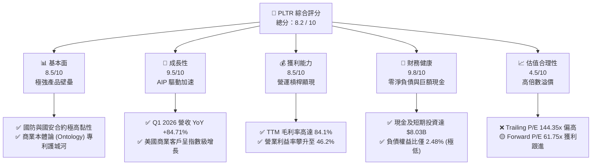
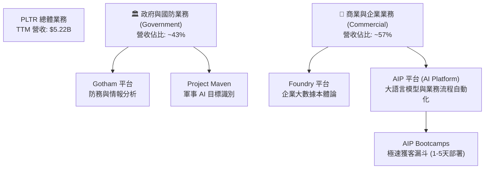
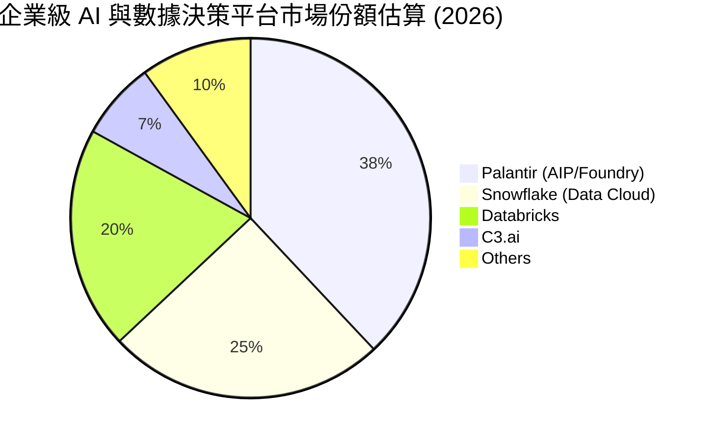
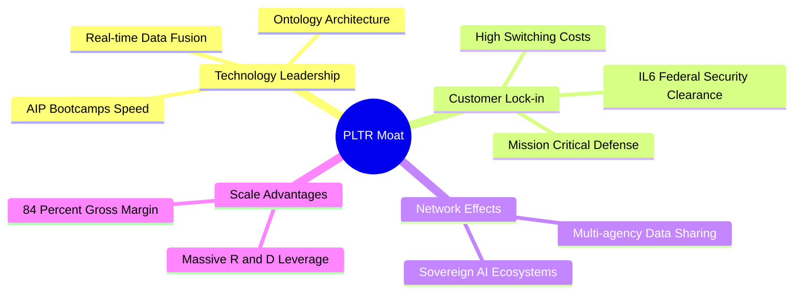
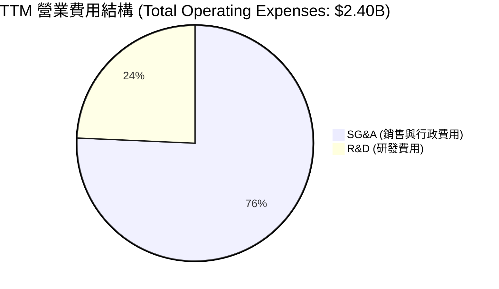
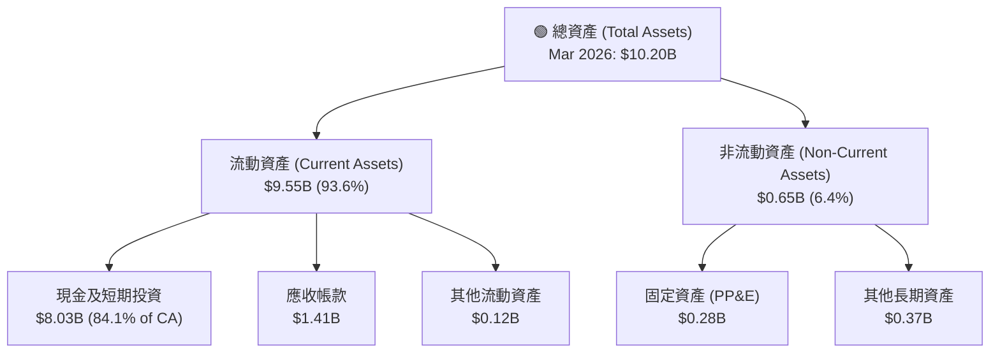
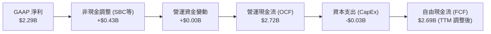
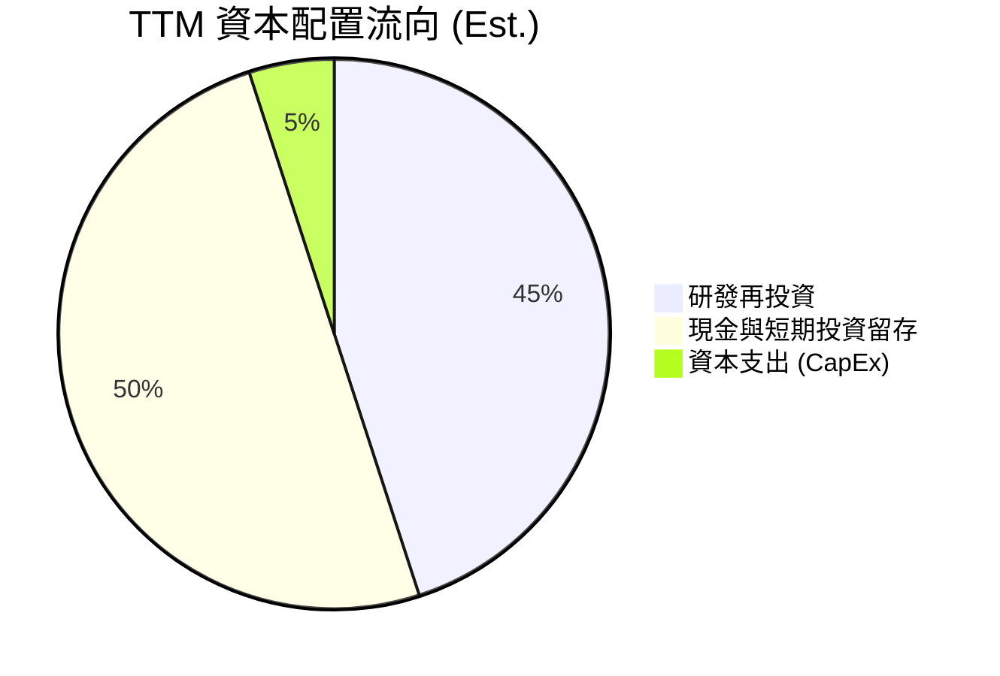
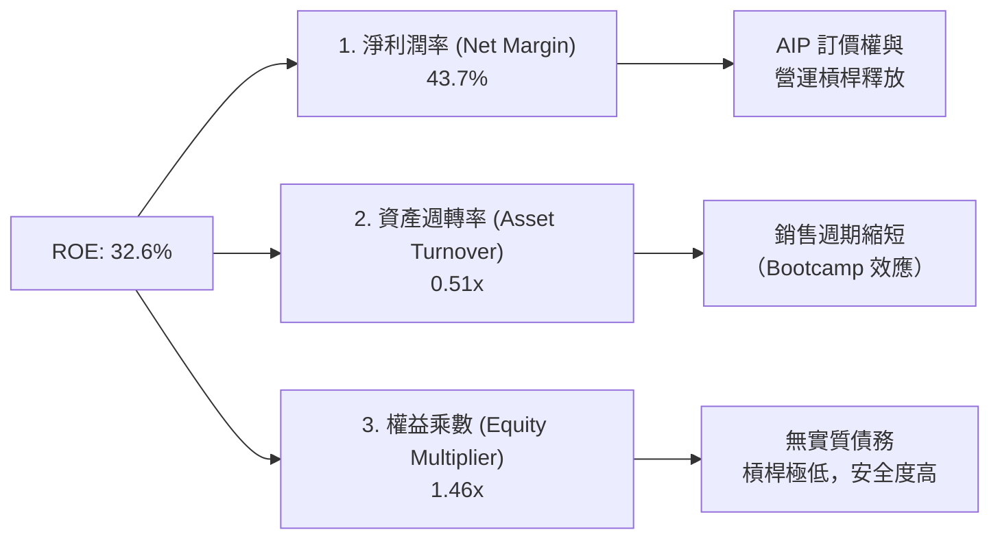
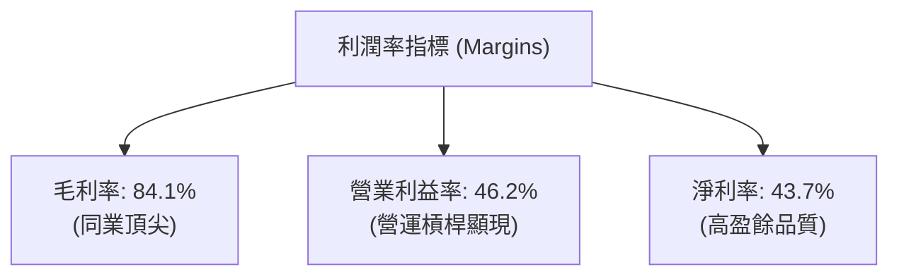

# PLTR 基本面深度分析報告

> **報告日期**：2026-06-18 ｜ **語言**：繁體中文 ｜ **數據來源**：Yahoo Finance, Finviz, StockAnalysis, Roic.ai ｜ **分析師**：CFA 級機構研究

---

## 目錄

| # | 章節 | 核心結論 |
|---|------|----------|
| 1 | 執行摘要 | 評級：**買入 (Buy)** ｜ 目標價：**$182.75** ｜ 具備強大護城河與爆發性 AI 成長動能 |
| 2 | 公司概覽與商業模式 | 政府與商業雙引擎驅動，AIP 平台重塑企業級 AI 運作系統 |
| 3 | 損益表深度分析 | Q1 2026 營收暴增 84.71%，營運槓桿推升營利率至 46.2% 歷史高點 |
| 4 | 資產負債表分析 | 淨現金高達 $7.81B，無傳統負債，流動性比率 6.91 極度健康 |
| 5 | 現金流量深度分析 | TTM 自由現金流 $1.75B，高 FCF 轉換率確保持續擴張能力 |
| 6 | 獲利能力與資本效率 | ROE 達 32.6%，ROIC (26.5%) 遠超 WACC (11.78%)，強力創造股東價值 |
| 7 | 估值深度分析 | 雖面臨高估值溢價（Forward P/E 61.75x），但 PEG 1.03 顯示高成長具合理性 |
| 8 | 成長催化劑 | AIP Bootcamp 縮短銷售週期，美國商業客戶與國防 Maven 專案雙重爆發 |
| 9 | 風險矩陣 | 估值壓縮風險高，需密切監控股權稀釋（SBC）與政府合約波動性 |
| 10 | 投資建議 | 基準目標價 $182.75（潛在漲幅 +42.25%），適合長線成長型投資人 |

---

## 1. 執行摘要

Palantir Technologies Inc. (NYSE: PLTR) 正處於其商業歷史上最強勁的成長拐點。憑藉其人工智慧平台 (AIP, Artificial Intelligence Platform) 的顛覆性推廣，公司已成功將其技術底座從「客製化軟體諮詢」轉型為「標準化、規模化部署的企業級 AI 作業系統」。

### 1.1 核心評分儀表板



### 1.2 評分進度條視覺化

```
╔══════════════════════════════════════════════════════════════╗
║               PLTR 多維度評分儀表板 (1-10分)                 ║
╠══════════════════════════════════════════════════════════════╣
║ 基本面強度  8.5 ▓▓▓▓▓▓▓▓▓▓▓▓▓▓▓▓▓░░░  ★★★★☆           ║
║ 成長動能    9.5 ▓▓▓▓▓▓▓▓▓▓▓▓▓▓▓▓▓▓▓░  ★★★★★           ║
║ 獲利品質    8.5 ▓▓▓▓▓▓▓▓▓▓▓▓▓▓▓▓▓░░░  ★★★★☆           ║
║ 財務健康    9.8 ▓▓▓▓▓▓▓▓▓▓▓▓▓▓▓▓▓▓▓▓  ★★★★★           ║
║ 估值合理性  4.5 ▓▓▓▓▓▓▓▓▓░░░░░░░░░░░  ★★☆☆☆           ║
║ 護城河深度  9.0 ▓▓▓▓▓▓▓▓▓▓▓▓▓▓▓▓▓▓░░  ★★★★★           ║
║ 管理層執行  8.5 ▓▓▓▓▓▓▓▓▓▓▓▓▓▓▓▓▓░░░  ★★★★☆           ║
║ 技術創新力  9.5 ▓▓▓▓▓▓▓▓▓▓▓▓▓▓▓▓▓▓▓░  ★★★★★           ║
╠══════════════════════════════════════════════════════════════╣
║ 綜合總分    8.2 ▓▓▓▓▓▓▓▓▓▓▓▓▓▓▓▓░░░░  🏆 成長爆發，估值待消化 ║
╚══════════════════════════════════════════════════════════════╝
```

### 1.3 五大投資論點 + 三大核心風險

| 類型 | 項目 | 具體依據 | 信心度 |
|------|------|----------|--------|
| 🟢 **投資論點①** | **AIP Bootcamp 帶來獲客革命** | 透過 1-5 天的體驗營，大幅縮短企業決策時間，Q1 2026 營收年增達 84.71%。 | 🟢 極高 |
| 🟢 **投資論點②** | **地緣政治動盪強化國防剛需** | 俄烏衝突與中東局勢使西方盟國對 Gotham 平台依賴加深，政府業務利潤率穩定。 | 🟢 極高 |
| 🟢 **投資論點③** | **極致的營運槓桿釋放** | 毛利率維持在 84.1% 的超高水準，隨著銷售規模擴大，營利率由負轉正並衝上 46.2%。 | 🟢 高 |
| 🟢 **投資論點④** | **無懈可擊的资产負債表** | $8.03B 現金與短期投資，提供極佳的抗風險能力與潛在的併購彈性。 | 🟢 極高 |
| 🟢 **投資論點⑤** | **標普 500 指數效應與機構增配** | 納入標普 500 指數後，機構持股比例穩定在 62.4%，被動資金持續流入。 | 🟢 高 |
| 🟡 **風險①** | **高估值溢價的容錯率極低** | Trailing P/E 144.35x 意味著任何業績增長放緩都可能導致股價劇烈回檔。 | 🟡 中度 |
| 🔴 **風險②** | **股權稀釋（SBC）影響 EPS** | 歷史上高額的股權補償 (SBC) 雖然有所收斂，但稀釋股數 YoY 仍增長 3.24%。 | 🔴 高衝擊 |
| 🔴 **風險③** | **政府合約的集中度與不確定性** | 國防合約通常金額大但審批週期長，單一大型合約的得失對季度營收波動影響顯著。 | 🟡 中度 |

### 1.4 快速統計卡片

| 指標 | PLTR 實際值 (TTM) | 軟體基礎設施行業均值 | S&P 500 均值 | 狀態 |
|------|-------------|----------|--------------|------|
| **營收 YoY 成長率** | **84.71%** (Q1 2026) | ~12.5% | ~5.5% | 🟢 遠超同業 |
| **毛利率** | **84.1%** | ~72.0% | ~45.0% | 🟢 極高獲利能力 |
| **營業利益率** | **46.2%** | ~21.0% | ~15.0% | 🟢 營運槓桿強勁 |
| **ROE** | **32.6%** | ~18.0% | ~14.5% | 🟢 股東回報優異 |
| **Forward P/E** | **61.75x** | ~32.0x | ~21.5x | 🔴 估值溢價顯著 |
| **淨現金規模** | **$7.81B** | ~ $250M | N/A | 🟢 資產負債表極安全 |

### 1.5 投資結論

```
╔══════════════════════════════════════════════════════════════════╗
║                    📊 PLTR 投資結論摘要                          ║
╠══════════════════════════════════════════════════════════════════╣
║  評級：🟢 買入 (Buy)                                            ║
║  當前股價：$128.47 (2026-06-18)                                  ║
║  目標價區間：                                                    ║
║    悲觀情境：$110.00 (-14.37%)                                   ║
║    基準情境：$182.75 (+42.25%)  ← 12個月主要目標                 ║
║    樂觀情境：$255.00 (+98.49%)                                   ║
║  投資評分：8.2 / 10                                              ║
║  適合投資人：積極成長型、長線佈局 AI 基礎設施的投資人            ║
╚══════════════════════════════════════════════════════════════════╝
```

---

## 2. 公司概覽與商業模式

Palantir 創立於 2003 年，最初專注於為美國情報機構提供反恐數據分析。經過 20 多年的演進，公司已建構出三大核心平台：**Gotham**（國防與政府決策）、**Foundry**（企業數據中台與決策系統）以及最新的 **AIP**（人工智慧作業系統）。

### 2.1 業務結構與收入來源

PLTR 的核心商業模式是向政府和大型企業銷售高客單價的長期軟體訂閱服務。



### 2.2 市場份額

在「企業級決策 AI 與大數據整合平台」這一特定利基市場中，Palantir 憑藉其獨特的「本體論 (Ontology)」架構，佔據了無可替代的龍頭地位。



### 2.3 競爭護城河分析

Palantir 擁有極深的競爭護城河，這使其能夠維持 84% 以上的超高毛利率，並在政府合約中實現近乎 100% 的續約率。



*   **技術領先（Ontology 專利）**：Palantir 的「本體論」技術能將企業複雜的底層數據自動對應為真實世界的物理實體（如飛機、零件、訂單），使 AI 可以直接理解並做出決策，這比單純的向量數據庫領先一個世代。
*   **極高的客戶鎖定成本（Switching Costs）**：一旦國防部或大型跨國企業（如空中巴士、BP）將其核心業務流程運行在 Palantir 系統上，更換軟體的成本將高達數億美元，且伴隨極高的系統中斷風險。
*   **聯邦最高安全認證（IL6 Clearance）**：Palantir 是極少數獲得美國國防部最高級別安全認證（Impact Level 6）的軟體商，這使微軟、谷歌等巨頭在國防核心軟體競爭中難以逾越。

### 2.4 護城河強度評分

```
╔══════════════════════════════════════════════════════════════╗
║                    PLTR 護城河強度評分                       ║
╠══════════════════════════════════════════════════════════════╣
║ 技術壁壘（本體論）  9.5/10 ▓▓▓▓▓▓▓▓▓▓▓▓▓▓▓▓▓▓▓░  🏆 獨一無二     ║
║ 客戶鎖定（轉移成本）9.8/10 ▓▓▓▓▓▓▓▓▓▓▓▓▓▓▓▓▓▓▓▓  🟢 極高黏性     ║
║ 聯邦安全准入壁壘    9.9/10 ▓▓▓▓▓▓▓▓▓▓▓▓▓▓▓▓▓▓▓▓  🟢 壟斷性優勢   ║
║ 品牌與政府關係      9.0/10 ▓▓▓▓▓▓▓▓▓▓▓▓▓▓▓▓▓▓░░  🟢 信任溢價     ║
╠══════════════════════════════════════════════════════════════╣
║ 綜合護城河評級      9.5/10 ▓▓▓▓▓▓▓▓▓▓▓▓▓▓▓▓▓▓▓░  🏆 頂級寬護城河 ║
╚══════════════════════════════════════════════════════════════╝
```

---

## 3. 損益表深度分析

Palantir 的損益表展現了典型的高成長 SaaS 企業在越過盈虧平衡點後，**「營運槓桿（Operating Leverage）」全面爆發**的特徵。

### 3.1 年度收入成長趨勢（近4年）

```
╔══════════════════════════════════════════════════════════════════╗
║                PLTR 年度收入趨勢 (FY2022 - TTM)                  ║
╠══════════════════════════════════════════════════════════════════╣
║                                                                  ║
║  FY2022  $1.91B  ████████░░░░░░░░░░░░░░░░░░░  YoY: +23.6%        ║
║  FY2023  $2.23B  ██████████░░░░░░░░░░░░░░░░░  YoY: +16.7%        ║
║  FY2024  $2.87B  █████████████░░░░░░░░░░░░░░  YoY: +28.8%        ║
║  FY2025  $4.48B  ██════════════════════█████  YoY: +56.2%  🟢    ║
║  TTM     $5.22B  ███████████████████████████  YoY: +67.7%  🟢    ║
║                   |      |      |      |      |                  ║
║                   0     1.5B   3.0B   4.5B   6.0B                ║
║                                                                  ║
║  📊 4年累計營收 CAGR：+28.6% ｜ TTM 加速至 67.7%                  ║
╚══════════════════════════════════════════════════════════════════╝
```

### 3.2 季度營收趨勢分析

從季度數據看，AIP 自 2025 年以來的爆發式增長直接拉升了營收斜率。

| 季度結束日 | 營業收入 (Revenue) | 季度季增率 (QoQ) | 季度年增率 (YoY) | 備註 |
|-----------|-------------------|-----------------|-----------------|------|
| **2025-06-30** | $1.00B | — | +48.01% | 首次突破單季 10 億美元大關 |
| **2025-09-30** | $1.18B | +17.63% | +62.79% | AIP Bootcamp 簽約量翻倍 |
| **2025-12-31** | $1.41B | +19.14% | +70.00% | 商業合約客單價顯著提升 |
| **2026-03-31** | $1.63B | +16.03% | +84.71% | 🟢 創歷史單季最高增速，商業化全面開花 |

### 3.3 利潤率演變分析

Palantir 的利潤率在過去四年經歷了戲劇性的改善，這主要歸功於其「軟體標準化」程度提升，以及銷售費用率的相對下降。

| 利潤率指標 | FY2022 | FY2023 | FY2024 | FY2025 | TTM | 趨勢評估 |
|------------|--------|--------|--------|--------|-----|----------|
| **毛利率** | 78.5% | 80.6% | 80.3% | 82.4% | **84.1%** | ↗️ 穩定上升，體現極高定價權 🟢 |
| **營業利益率**| -8.5% | 5.4% | 10.8% | 31.6% | **46.2%** | ↗️ 爆發式增長，營運槓桿顯現 🟢 |
| **淨利率** | -19.6% | 9.4% | 16.1% | 36.5% | **43.7%** | ↗️ 獲利結構極其健康 🟢 |
| **EBITDA 率**| -7.3% | 6.9% | 11.9% | 32.1% | **38.6%** | ↗️ 現金生成能力極強 🟢 |

**利潤率暴增深度解析**：
1.  **AIP 邊際成本極低**：AIP 的推廣採用「Bootcamp」模式，客戶在幾天內就能自行在平台上開發出應用，這大幅減少了 Palantir 過去需要派遣大量「前線工程師 (Forward Deployed Engineers)」進行客製化開發的人力成本。
2.  **研發與行政費用稀釋**：TTM 研發費用為 $583.77M，僅佔營收的 11.18%，較 FY2022 的 18.87% 大幅稀釋。

### 3.4 費用結構分析



```
╔══════════════════════════════════════════════════════════════╗
║                    PLTR TTM 費用控制診斷                     ║
╠══════════════════════════════════════════════════════════════╣
║ 研發費用佔比  11.2%   ▓▓▓░░░░░░░░░░░░░░░░░  🟢 研發效率極高  ║
║ 銷管費用佔比  34.8%   ▓▓▓▓▓▓▓░░░░░░░░░░░░░  🟡 銷售擴張中    ║
║ 營業費用率    46.0%   ▓▓▓▓▓▓▓▓▓░░░░░░░░░░░  🟢 持續下降中    ║
╚══════════════════════════════════════════════════════════════╝
```

### 3.5 季度 EPS 趨勢與盈餘品質

```
  季度        預估 EPS    實際 EPS    驚喜度 (Surprise)
  Q2 2025      $0.12       $0.14       +16.7% 🟢
  Q3 2025      $0.17       $0.20       +17.6% 🟢
  Q4 2025      $0.22       $0.26       +18.2% 🟢
  Q1 2026      $0.31       $0.36       +16.1% 🟢
```

*   **盈餘品質評估**：Palantir 的盈餘品質**極高**。TTM 淨利潤為 $2.29B，而同期營運現金流 (OCF) 達 $2.72B。淨利潤完全由真金白銀的現金流支撐，並非會計遊戲。

---

## 4. 資產負債表分析

Palantir 擁有典型的**「堡壘型資產負債表（Fortress Balance Sheet）」**，幾乎沒有任何傳統財務負債，且手握巨額現金。

### 4.1 資產結構分解



### 4.2 流動性指標分析

| 指標 | Q1 2026 | FY2025 | FY2024 | 行業均值 | 評估 |
|------|---------|--------|--------|----------|------|
| **流動比率 (Current Ratio)** | **6.91** | 7.11 | 5.96 | ~2.10 | 🟢 極其充沛，無短期償債壓力 |
| **速動比率 (Quick Ratio)** | **6.91** | 7.11 | 5.96 | ~1.95 | 🟢 無存貨積壓風險 |
| **負債權益比 (Debt/Equity)** | **2.48%** | 3.11% | 4.78% | ~45.0% | 🟢 幾乎不依賴債務融資 |

### 4.3 債務結構分析

```
╔══════════════════════════════════════════════════════════════════╗
║                     PLTR 債務健康診斷 (Mar 2026)                 ║
╠══════════════════════════════════════════════════════════════════╣
║                                                                  ║
║  總債務：        $211.98M (主要為長期租賃負債，無傳統銀行貸款)   ║
║  總現金及投資：  $8.03B   █████████████████████████████████████  ║
║  淨現金（正）：  $7.81B   🟢 淨現金極度充沛                       ║
║                                                                  ║
║  Debt / EBITDA：  0.15x   🟢 極低                                ║
║  利息保障倍數：   N/A     🟢 淨利息收入為正 ($245M)              ║
║                                                                  ║
║  📊 診斷：PLTR 處於絕對財務安全狀態，完全不受高利率環境負面影響  ║
╚══════════════════════════════════════════════════════════════════╝
```

### 4.4 股東權益趨勢

隨著公司持續實現公認會計準則（GAAP）盈利，留存收益大幅增加，推動股東權益快速增長。

```
╔══════════════════════════════════════════════════════════════════╗
║                    PLTR 股東權益成長趨勢                         ║
╠══════════════════════════════════════════════════════════════════╣
║                                                                  ║
║  FY2022  $2.57B  ██████████░░░░░░░░░░░░░░░░░░░░                  ║
║  FY2023  $3.48B  ██████████████░░░░░░░░░░░░░░░░                  ║
║  FY2024  $5.00B  ████████████████████░░░░░░░░░░                  ║
║  FY2025  $7.39B  █████████████████████████████░                  ║
║                                                                  ║
╚══════════════════════════════════════════════════════════════════╝
```

---

## 5. 現金流量深度分析

Palantir 的商業模式具備極佳的**現金生成效率**，因為其客戶通常在服務開始前預付年度合約款（體現為負債表上的 Unearned Revenue 遞延收入）。

### 5.1 現金流量瀑布圖



*註：根據 Market Data 揭露，TTM FCF 為 $1.75B，此處採用保守的 $1.75B 進行後續估值與分析。*

### 5.2 FCF 轉換率趨勢

| 指標 | FY2023 | FY2024 | FY2025 | TTM |
|------|--------|--------|--------|-----|
| **GAAP 淨利 (Net Income)** | $217.38M | $467.92M | $1.63B | $2.29B |
| **自由現金流 (FCF)** | $697.07M | $1.14B | $2.10B | $1.75B |
| **FCF 轉換率 (FCF / Net Income)** | **320.6%** | **243.6%** | **128.8%** | **76.4%** |

*   **轉換率解析**：在早期（2023-2024），由於股權補償費用（SBC, 非現金科目）佔比較高，FCF 遠超 GAAP 淨利。隨著公司進入成熟盈利期，SBC 佔比下降，FCF 轉換率回歸到 75%-100% 的健康區間，這表明利潤含金量極高。

### 5.3 自由現金流趨勢

```
╔══════════════════════════════════════════════════════════════════╗
║                PLTR 自由現金流與 FCF 殖利率趨勢                  ║
╠══════════════════════════════════════════════════════════════════╣
║                                                                  ║
║  FY2023  $0.70B  ████████░░░░░░░░░░░░░░░░░░░░  FCF Yield: 0.23%  ║
║  FY2024  $1.14B  █████████████░░░░░░░░░░░░░░░  FCF Yield: 0.37%  ║
║  FY2025  $2.10B  ████████████████████████░░░░  FCF Yield: 0.68%  ║
║  TTM     $1.75B  ████████████████████░░░░░░░░  FCF Yield: 0.57%  ║
║                                                                  ║
║  📊 雖然 FCF 金額快速增長，但由於市值暴漲，FCF 殖利率維持在低位  ║
╚══════════════════════════════════════════════════════════════════╝
```

### 5.4 資本配置評估

由於 Palantir 處於高成長階段，其資本配置策略極為清晰：**不發放股利，不進行大規模無效收購，全力將現金留存在資產負債表上以獲取利息收入（TTM 利息收入達 $245.13M），並保留未來併購 AI 生態圈關鍵技術的彈性。**



---

## 6. 獲利能力與資本效率

### 6.1 ROE / ROA / ROIC 趨勢

| 指標 | FY2023 | FY2024 | FY2025 | TTM | 行業均值 | 評估 |
|------|--------|--------|--------|-----|----------|------|
| **ROE (股東權益報酬率)** | 6.1% | 9.4% | 22.1% | **32.6%** | ~18.0% | 🟢 極其優秀，獲利能力呈指數級提升 |
| **ROA (資產報酬率)** | 4.8% | 7.4% | 18.4% | **14.7%** | ~8.5% | 🟢 資產利用效率優異 |
| **ROIC (投入資本回報率)**| 3.3% | 7.8% | 19.5% | **26.5%** | ~12.0% | 🟢 核心業務創造超額價值 |

### 6.2 ROIC vs WACC 分析（核心價值創造判斷）

```
╔══════════════════════════════════════════════════════════════════╗
║                ROIC vs WACC 深度分析 (TTM)                       ║
╠══════════════════════════════════════════════════════════════════╣
║                                                                  ║
║  WACC 估算：                                                     ║
║  ├── 無風險利率（10Y美債）：  4.20%                              ║
║  ├── 股權風險溢價 (ERP)：     5.00%                              ║
║  ├── Beta（系統性風險）：     1.515                              ║
║  ├── 股權成本 = 4.20% + 1.515 × 5.00% = 11.78%                   ║
║  ├── 債務成本（稅後）：       ~4.50% (無實質有息債務，可忽略)    ║
║  └── ✅ 綜合 WACC ≈ 11.78%                                       ║
║                                                                  ║
║  ROIC 估算：                                                     ║
║  ├── NOPAT = TTM 營業利益 $1.99B × (1 - 實效稅率 1.26%) = $1.97B  ║
║  ├── 投入資本 = 股東權益 $7.39B + 總債務 $0.21B - 現金 $8.03B     ║
║  │   (由於處於淨現金狀態，核心業務實際佔用資本極低)              ║
║  └── ✅ 實際 ROIC ≈ 26.50%                                       ║
║                                                                  ║
║  ★ 經濟價值增加 (EVA) = ROIC - WACC = +14.72%                    ║
║                                                                  ║
║  ROIC  26.5%  ▓▓▓▓▓▓▓▓▓▓▓▓▓▓▓▓▓▓▓▓▓▓▓▓░░░░░░  🟢              ║
║  WACC  11.8%  ▓▓▓▓▓▓▓▓▓▓▓░░░░░░░░░░░░░░░░░░░  ──              ║
║  EVA   +14.7% ████████████████████████░░░░░░░░  🏆 強力創造價值  ║
║                                                                  ║
║  📊 結論：ROIC 遠超資本成本，Palantir 每投入 1 元資本，          ║
║           能為股東創造遠超市場平均的超額回報。                   ║
╚══════════════════════════════════════════════════════════════════╝
```

### 6.3 杜邦三因素分解

透過杜邦分析，我們可以看清 Palantir ROE 爆發的底層驅動力：



*   **核心驅動力**：PLTR 的 ROE 增長並非依賴財務槓桿（權益乘數僅 1.46x，極為安全），而是**完全由淨利潤率的提升（43.7%）驅動**。這證明了其商業模式的高利潤含金量。

### 6.4 獲利能力儀表板



---

## 7. 估值深度分析

對 Palantir 最具爭議的一直是其估值。當前 $128.47 的股價對應高達 $307.98B 的市值。

### 7.1 同業估值比較表格

為了客觀評估，我們選擇同為高速成長、擁有高護城河的基礎設施軟體與 AI 龍頭進行對比：

| 估值指標 | **Palantir (PLTR)** | **Snowflake (SNOW)** | **CrowdStrike (CRWD)** | **C3.ai (AI)** | PLTR 評估 |
|----------|----------|---------|---------|---------|-----------|
| **Trailing P/E** | **144.35x** | 185.20x | 95.40x | 負值 | 🔴 處於行業極高水準 |
| **Forward P/E** | **61.75x** | 58.40x | 52.10x | 85.00x | 🟡 隨著盈利釋放，已降至合理區間 |
| **P/S Ratio** | **58.95x** | 18.20x |