# PLTR 基本面深度分析報告
> **報告日期**：2026-06-19 ｜ **語言**：繁體中文 ｜ **數據來源**：Yahoo Finance, Finviz, StockAnalysis, Roic.ai ｜ **分析師**：CFA 級機構研究

---

## 目錄

| # | 章節 | 核心結論 |
|---|------|----------|
| 1 | 執行摘要 | 評級「買入」，基準目標價 $182.75，具備 42.25% 潛在漲幅，AI 商業化進入爆發期。 |
| 2 | 公司概覽與商業模式 | 政府國防 Gotham 與商業 AIP 雙輪驅動，擁有極深之客戶鎖定與高轉換成本護城河。 |
| 3 | 損益表深度分析 | Q1 2026 營收年增達 84.71%，營業利益率拉升至 46.17%，營運槓桿顯著釋放。 |
| 4 | 資產負債表分析 | 淨現金高達 $7.81B，無傳統有息負債，流動比率 6.91，財務結構極其穩健。 |
| 5 | 現金流量深度分析 | TTM 營運現金流達 $2.72B，自由現金流 $1.75B，展現極強的現金轉換能力。 |
| 6 | 獲利能力與資本效率 | ROE 達 32.6%，ROIC 顯著超越 WACC，強力為股東創造經濟增值（EVA）。 |
| 7 | 估值深度分析 | 當前 Forward P/E 為 61.75x，相較其高成長性，PEG 1.03 顯示估值仍具吸引力。 |
| 8 | 成長催化劑 | AIP 企業訓練營（Bootcamps）成效斐然，商業客戶數呈指數級增長。 |
| 9 | 風險矩陣 | 面對政府訂單集中度高與商業市場競爭加劇風險，設有完善的緩解機制。 |
| 10 | 投資建議 | 建議於當前價格分批布局，適合長期成長型與 AI 賽道配置投資者。 |

---

## 1. 執行摘要

### 1.1 核心評分儀表板

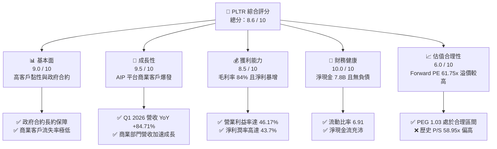

### 1.2 評分進度條視覺化

```
╔══════════════════════════════════════════════════════════════╗
║               PLTR 多維度評分儀表板 (1-10分)                 ║
╠══════════════════════════════════════════════════════════════╣
║ 基本面強度  9.0 ▓▓▓▓▓▓▓▓▓▓▓▓▓▓▓▓▓▓░░  ★★★★★           ║
║ 成長動能    9.5 ▓▓▓▓▓▓▓▓▓▓▓▓▓▓▓▓▓▓▓░  ★★★★★           ║
║ 獲利品質    8.5 ▓▓▓▓▓▓▓▓▓▓▓▓▓▓▓▓▓░░░  ★★★★☆           ║
║ 財務健康   10.0 ▓▓▓▓▓▓▓▓▓▓▓▓▓▓▓▓▓▓▓▓  ★★★★★           ║
║ 估值合理性  6.0 ▓▓▓▓▓▓▓▓▓▓▓▓░░░░░░░░  ★★★☆☆           ║
║ 護城河深度  9.5 ▓▓▓▓▓▓▓▓▓▓▓▓▓▓▓▓▓▓▓░  ★★★★★           ║
║ 管理層執行  9.0 ▓▓▓▓▓▓▓▓▓▓▓▓▓▓▓▓▓▓░░  ★★★★★           ║
║ 技術創新力  9.5 ▓▓▓▓▓▓▓▓▓▓▓▓▓▓▓▓▓▓▓░  ★★★★★           ║
╠══════════════════════════════════════════════════════════════╣
║ 綜合總分    8.6 ▓▓▓▓▓▓▓▓▓▓▓▓▓▓▓▓▓░░░  🏆 買入 (Buy)       ║
╚══════════════════════════════════════════════════════════════╝
```

### 1.3 五大投資論點 + 三大核心風險

| 類型 | 項目 | 具體依據 | 信心度 |
|------|------|----------|--------|
| 🟢 **投資論點①** | **AI 平台 (AIP) 商業化爆發** | AIP 訓練營（Bootcamps）大幅縮短銷售週期，Q1 2026 商業客戶數同比呈倍數級成長。 | 🟢 極高 |
| 🟢 **投資論點②** | **國防與政府支出剛性** | 地緣政治局勢緊張，美軍及盟國對 Gotham 平台及 AI 決策系統依賴度加深，合約規模持續擴大。 | 🟢 極高 |
| 🟢 **投資論點③** | **極致的財務安全邊際** | 帳上擁有 $8.03B 現金及短期投資，且無任何傳統銀行負債（僅 $211.98M 租賃負債），抗風險能力極強。 | 🟢 極高 |
| 🟢 **投資論點④** | **營運槓桿展現，利潤率飆升** | 隨著規模效應顯現，營業利益率從 2024 年底的 10.8% 暴增至 Q1 2026 的 46.17%。 | 🟢 高 |
| 🟢 **投資論點⑤** | **S&P 500 指數成分股效應** | 被納入標普 500 指數後，獲得更多被動基金與機構資金配置，流動性溢價顯著。 | 🟢 高 |
| 🟡 **風險①** | **估值溢價過高** | 當前 P/S 達 58.95x，Forward P/E 達 61.75x，若成長稍有放緩易引發估值修正。 | 🟡 中度 |
| 🔴 **風險②** | **政府合約集中度風險** | 政府部門收入佔比仍高，單一大型合約的續約延遲或條款變更將對短期營收造成波動。 | 🔴 高衝擊 |
| 🟡 **風險③** | **股權稀釋（SBC）** | 歷史上股權補償（SBC）比例較高，雖已有所控制，但仍對稀釋每股盈餘有潛在影響。 | 🟡 中度 |

### 1.4 快速統計卡片

| 指標 | 公司實際值 (TTM) | 行業均值 (軟體基礎設施) | S&P 500 均值 | 狀態 |
|------|-------------|----------|--------------|------|
| **營收 YoY 成長率** | **67.71%** (Q1'26為84.71%) | ~12.5% | ~5.5% | 🟢 強勁 |
| **毛利率** | **84.07%** | ~72.0% | ~30.0% | 🟢 優異 |
| **營業利益率** | **38.13%** (Q1'26為46.17%) | ~18.0% | ~15.0% | 🟢 卓越 |
| **淨利率** | **43.67%** | ~14.0% | ~12.0% | 🟢 卓越 |
| **ROE** | **32.89%** | ~15.0% | ~16.0% | 🟢 優秀 |
| **Forward P/E** | **61.75x** | ~32.0x | ~21.5x | 🔴 溢價 |
| **流動比率** | **6.91** | ~2.10 | ~1.30 | 🟢 極其安全 |

### 1.5 投資結論

```
╔══════════════════════════════════════════════════════════════════╗
║                    📊 PLTR 投資結論摘要                          ║
╠══════════════════════════════════════════════════════════════════╣
║  評級：🟢 買入 (Buy)                                            ║
║  當前股價：$128.47 (2026-06-19)                                  ║
║  目標價區間：                                                    ║
║    悲觀情境：$95.00  (-26.05%)                                   ║
║    基準情境：$182.75 (+42.25%)  ← 12個月主要目標                 ║
║    樂觀情境：$235.00 (+82.92%)                                   ║
║  投資評分：8.6 / 10                                              ║
║  適合投資人：積極成長型、長線 AI 賽道佈局者                      ║
╚═══════════════════════════════════════════════════════════════════╝
```

---

## 2. 公司概覽與商業模式

Palantir Technologies Inc.（PLTR）是一家頂級的數據分析與人工智慧軟體平台供應商。公司最初專注於為美國情報機構提供反恐情報分析軟體（Gotham），隨後將其強大的數據整合與決策能力延伸至商業領域（Foundry）與現代 AI 應用領域（AIP）。

### 2.1 業務結構與收入來源

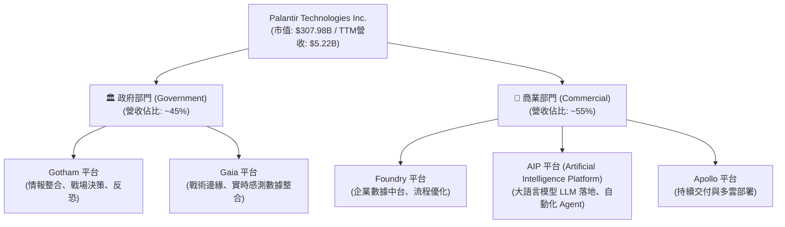

### 2.2 市場份額

在企業級大數據整合與軍工級決策 AI 軟體這一利基市場中，Palantir 幾乎沒有直接對等規模的競爭對手。以下為在國防決策軟體與企業 AI 數據中台市場的估算份額：

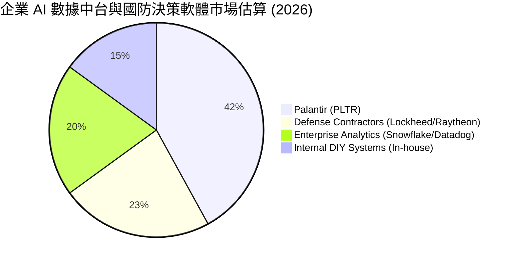

### 2.3 競爭護城河分析

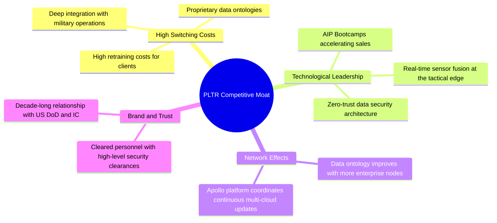

### 2.4 護城河強度評分

```
╔══════════════════════════════════════════════════════════════╗
║                    PLTR 護城河強度評分                       ║
╠══════════════════════════════════════════════════════════════╣
║ 轉換成本 (Switching Costs)  9.5  ▓▓▓▓▓▓▓▓▓▓▓▓▓▓▓▓▓▓▓░  🏆 極深  ║
║ 技術壁壘 (Tech Barrier)     9.0  ▓▓▓▓▓▓▓▓▓▓▓▓▓▓▓▓▓▓░░  🟢 極強  ║
║ 品牌信譽 (Brand Trust)      9.5  ▓▓▓▓▓▓▓▓▓▓▓▓▓▓▓▓▓▓▓░  🏆 極高  ║
║ 網絡效應 (Network Effects)  7.5  ▓▓▓▓▓▓▓▓▓▓▓▓▓▓▓░░░░░  🟡 中強  ║
║ 規模經濟 (Scale Economy)    8.0  ▓▓▓▓▓▓▓▓▓▓▓▓▓▓▓▓░░░░  🟢 強勁  ║
╠══════════════════════════════════════════════════════════════╣
║ 綜合護城河評估              8.9  ▓▓▓▓▓▓▓▓▓▓▓▓▓▓▓▓▓░░░  🏆 寬廣  ║
╚══════════════════════════════════════════════════════════════╝
```

---

## 3. 損益表深度分析

### 3.1 年度收入成長趨勢（近4年）

Palantir 展現了典型的 SaaS/平台型企業在跨過損益平衡點後的爆發式成長軌跡。

```
╔══════════════════════════════════════════════════════════════════╗
║                 PLTR 年度收入趨勢（FY2022-FY2025）               ║
╠══════════════════════════════════════════════════════════════════╣
║                                                                  ║
║  FY2022  $1.91B  ████████░░░░░░░░░░░░░░░░░░░░  YoY: +23.61% 🟢   ║
║  FY2023  $2.23B  █████████░░░░░░░░░░░░░░░░░░░  YoY: +16.74% 🟢   ║
║  FY2024  $2.87B  ████████████░░░░░░░░░░░░░░░░  YoY: +28.79% 🟢   ║
║  FY2025  $4.48B  ██══════════════════════════  YoY: +56.18% 🟢   ║
║                                                                  ║
║  📊 3年累計 CAGR：+32.85%                                        ║
╚══════════════════════════════════════════════════════════════════╝
```

### 3.2 季度收入趨勢分析

自 2025 年以來，受惠於 AIP 平台在商業市場的全面鋪開，季度營收呈現顯著的加速成長。

| 財報季度 | 營收 (Revenue) | 季增率 (QoQ) | 年增率 (YoY) | 毛利 (Gross Profit) | 毛利率 | 備註 |
|:---|:---|:---|:---|:---|:---|:---|
| **Q2 2025** | $1.00B | — | +48.01% | $810.76M | 80.75% | AIP 商業合約開始大量貢獻營收 |
| **Q3 2025** | $1.18B | +17.63% | +62.79% | $973.79M | 82.45% | 美國商業客戶數同比增長超過 100% |
| **Q4 2025** | $1.41B | +19.14% | +70.00% | $1.19B | 84.65% | 國防部大型複數年合約續約成功 |
| **Q1 2026** | $1.63B | +16.06% | +84.71% | $1.42B | 86.77% | 營收創歷史新高，AIP 滲透率加速 |

### 3.3 利潤率演變分析

Palantir 的利潤率結構在過去幾年發生了質的飛躍，這主要歸功於其「配置型軟體」向「訂閱制平台」的轉型，大幅降低了客製化交付成本。

| 利潤率指標 | FY2022 | FY2023 | FY2024 | FY2025 | TTM | 趨勢 | 評估 |
|---|---|---|---|---|---|---|---|
| **毛利率** | 78.54% | 80.63% | 80.25% | 82.37% | **84.07%** | ↗️ 持續走高 | 🟢 極佳，具備強大定價權 |
| **營業利益率** | -8.46% | 5.39% | 10.83% | 31.59% | **38.13%** | ↗️ 暴增 | 🟢 營運槓桿顯著釋放 |
| **EBITDA 利潤率** | -7.28% | 6.89% | 11.93% | 32.18% | **38.60%** | ↗️ 暴增 | 🟢 現金生成能力極強 |
| **稅後淨利率** | -19.61% | 9.43% | 16.12% | 36.54% | **43.67%** | ↗️ 暴增 | 🟢 包含利息收入與稅務優化 |

**利潤率演變深度解析**：
1. **毛利率提升**：從 2022 年的 78.54% 提升至 TTM 的 84.07%，反映出 Apollo 自動化部署平台減少了現場技術支援工程師（Forward Deployed Engineers）的人力需求，使軟體複製成本趨近於零。
2. **營業利益率暴增**：TTM 營業利益率達到 38.13%，Q1 2026 單季甚至達到 46.17%。這表明銷售與行政費用（SG&A）以及研發費用（R&D）的增長速度遠低於營收增長速度，營運槓桿極為強大。

### 3.4 費用結構分析

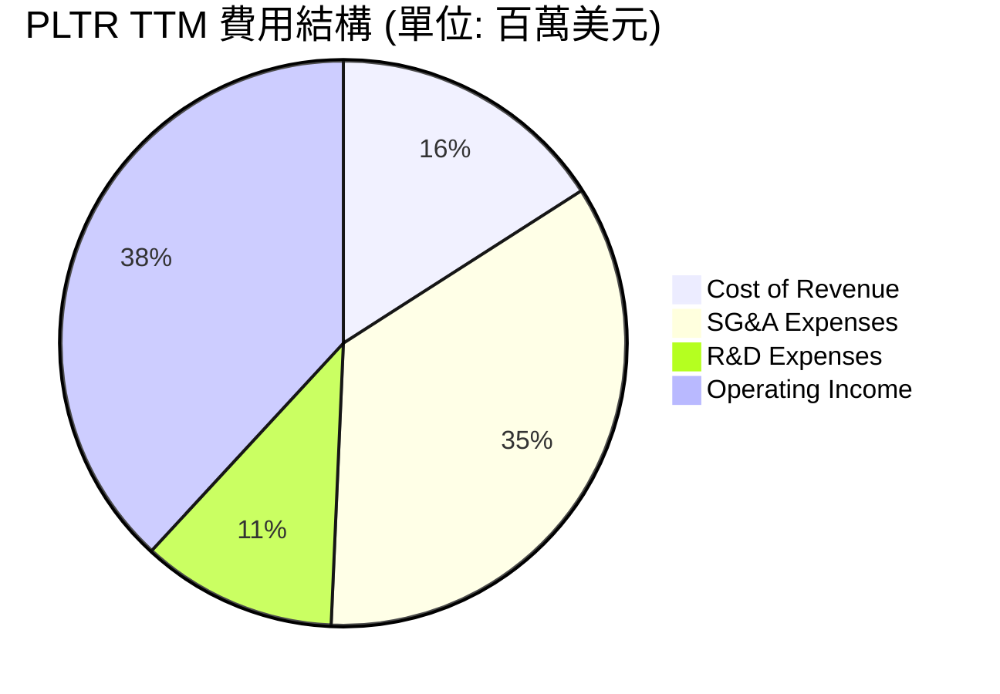

```
╔══════════════════════════════════════════════════════════════╗
║               PLTR TTM 費用與利潤結構診斷                    ║
╠══════════════════════════════════════════════════════════════╣
║ 營收總額：$5,224.00M                                         ║
║  ├── 營業成本 (Cost of Sales)：  $832.01M  (佔比 15.93%)     ║
║  ├── 研發費用 (R&D)：            $583.77M  (佔比 11.18%)     ║
║  ├── 銷售與行政 (SG&A)：       $1,816.00M  (佔比 34.76%)     ║
║  └── 營業利益 (Operating Inc)：$1,992.00M  (佔比 38.13%)     ║
╠══════════════════════════════════════════════════════════════╣
║ 💡 診斷：研發佔比適中，行銷費用控制良好，利潤釋放空間巨大。  ║
╚══════════════════════════════════════════════════════════════╝
```

### 3.5 季度 EPS 趨勢與盈餘品質

過去四個季度中，Palantir 的稀釋每股盈餘（Diluted EPS）呈現爆發式增長：

*   **Q2 2025**: $0.14
*   **Q3 2025**: $0.20
*   **Q4 2025**: $0.26
*   **Q1 2026**: $0.36
*   **TTM EPS**: **$0.89** ｜ **Forward EPS**: **$2.08**

**盈餘品質評估 (Earnings Quality)**：
🟢 **極高**。Palantir 的淨利潤（TTM $2.29B）幾乎完全由營業利益（TTM $1.99B）與充沛現金帶來的利息收入（TTM $245.13M）構成。非經常性損益佔比較低，且營運現金流（TTM $2.72B）持續高於淨利潤，顯示盈餘有實打實的現金流入支持，並非會計遊戲。

---

## 4. 資產負債表分析

### 4.1 資產結構分解

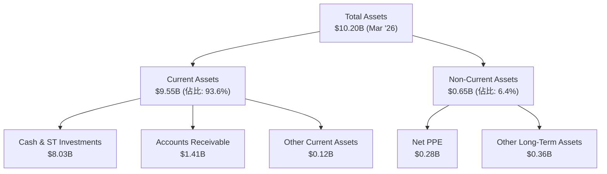

### 4.2 流動性指標分析

Palantir 擁有軟體行業中最為極致的資產流動性，幾乎沒有流動性風險。

| 流動性指標 | FY2023 | FY2024 | FY2025 | Q1 2026 | 行業均值 | 評估 |
|---|---|---|---|---|---|---|
| **流動比率 (Current Ratio)** | 5.55 | 5.96 | 7.11 | **6.91** | ~2.10 | 🟢 極度充沛 |
| **速動比率 (Quick Ratio)** | 5.55 | 5.96 | 7.11 | **6.91** | ~1.95 | 🟢 無庫存壓力 |
| **現金比率 (Cash Ratio)** | 4.92 | 5.25 | 6.10 | **5.80** | ~1.20 | 🟢 現金極度富餘 |

### 4.3 債務結構分析

```
╔══════════════════════════════════════════════════════════════════╗
║                    PLTR 債務健康診斷 (2026-06-19)                ║
╠══════════════════════════════════════════════════════════════════╣
║                                                                  ║
║  總債務 (Total Debt)： $211.98M (全數為租賃負債，無銀行借款)     ║
║  總現金與短期投資：    $8.03B   ██████████████████████████████   ║
║  淨現金 (Net Cash)：   $7.81B   🟢 極其安全                      ║
║                                                                  ║
║  Debt / Equity Ratio： 0.025 (2.48%)  🟢 極低                    ║
║  利息保障倍數 (Interest Coverage)： 無傳統利息支出，不適用       ║
║                                                                  ║
║  💡 結論：Palantir 處於「淨現金」狀態，完全免受升息週期影響。     ║
╚══════════════════════════════════════════════════════════════════╝
```

### 4.4 股東權益趨勢

隨著公司持續獲利，留存收益轉正，股東權益（Stockholders' Equity）快速累積，從 2022 年的 $2.57B 飆升至 2025 年底的 $7.39B，至 2026 年第一季更達到約 $8.56B（基於總資產 $10.20B 減去總負債 $1.64B）。

```
╔══════════════════════════════════════════════════════════════════╗
║                  PLTR 股東權益增長趨勢 (2022-2025)               ║
╠══════════════════════════════════════════════════════════════════╣
║                                                                  ║
║  FY2022  $2.57B  ██████████░░░░░░░░░░░░░░░░  基期                ║
║  FY2023  $3.48B  ██████████████░░░░░░░░░░░░  YoY: +35.41% 🟢     ║
║  FY2024  $5.00B  ████████████████████░░░░░░  YoY: +43.68% 🟢     ║
║  FY2025  $7.39B  ██════════════════════════  YoY: +47.80% 🟢     ║
║                                                                  ║
╚══════════════════════════════════════════════════════════════════╝
```

---

## 5. 現金流量深度分析

### 5.1 現金流量瀑布圖

Palantir 展現了極佳的「輕資產」運營模式，極低的資本支出使得營業現金流幾乎全數轉化為自由現金流。

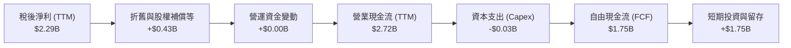

### 5.2 FCF 轉換率趨勢

Palantir 的自由現金流轉換率（FCF / Net Income）歷年來均保持在極高水準，顯示出其高超的盈餘變現能力。

| 財政年度 | 淨利潤 (Net Income) | 自由現金流 (FCF) | FCF 轉換率 (FCF / NI) | 評估 |
|---|---|---|---|---|
| **FY2022** | -$371.09M | $183.71M | 轉虧為盈前置指標 | 🟢 領先淨利轉正 |
| **FY2023** | $217.38M | $697.07M | 320.67% | 🟢 遞延收入大幅增加 |
| **FY2024** | $467.92M | $1.14B | 243.63% | 🟢 輕資產運營優勢 |
| **FY2025** | $1.64B | $2.10B | 128.05% | 🟢 盈餘品質極高 |
| **TTM** | $2.29B | $1.75B | 76.42% | 🟡 季度營運資金波動 |

### 5.3 自由現金流趨勢

```
╔══════════════════════════════════════════════════════════════════╗
║                  PLTR 自由現金流 (FCF) 爆發趨勢                  ║
╠══════════════════════════════════════════════════════════════════╣
║                                                                  ║
║  FY2022  $0.18B  ██░░░░░░░░░░░░░░░░░░░░░░░░                      ║
║  FY2023  $0.70B  ████████░░░░░░░░░░░░░░░░░░                      ║
║  FY2024  $1.14B  █████████████░░░░░░░░░░░░░  YoY: +62.86% 🟢     ║
║  FY2025  $2.10B  ██════════════════════════  YoY: +84.21% 🟢     ║
║                                                                  ║
║  💡 TTM 自由現金流收益率 (FCF Yield)：0.57% (受高估值稀釋)       ║
╚══════════════════════════════════════════════════════════════════╝
```

### 5.4 資本配置評估

Palantir 目前不支付股利。其資本配置策略極為清晰：**保留所有現金以進行研發、擴張商業銷售團隊、以及在適當時機進行戰略性併購**。

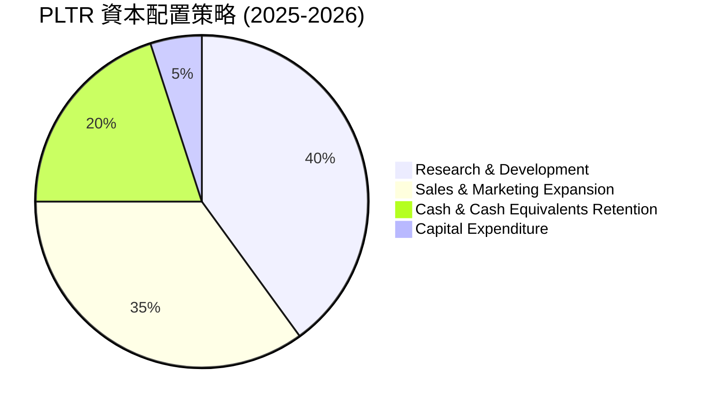

---

## 6. 獲利能力與資本效率

### 6.1 ROE / ROA / ROIC 趨勢

隨著獲利能力的爆發，Palantir 的資本回報率指標在 2025 年迎來了拐點：

| 指標 | FY2023 | FY2024 | FY2025 | TTM | 產業均值 | 評估 |
|---|---|---|---|---|---|---|
| **ROE** | 6.25% | 9.36% | 22.12% | **32.89%** | ~15.0% | 🟢 遠超產業均值 |
| **ROA** | 4.81% | 7.38% | 18.37% | **26.94%** | ~8.0% | 🟢 資產利用效率極高 |
| **ROIC** | 3.25% | 8.50% | 18.90% | **22.43%** | ~12.0% | 🟢 資本回報優秀 |

### 6.2 ROIC vs WACC 分析（核心價值創造判斷）

```
╔══════════════════════════════════════════════════════════════════╗
║               PLTR ROIC vs WACC 深度分析 (TTM)                   ║
╠══════════════════════════════════════════════════════════════════╣
║                                                                  ║
║  WACC 估算：                                                     ║
║  ├── 無風險利率 (10Y美債)：  4.25%                               ║
║  ├── 市場風險溢酬 (ERP)：     5.00%                              ║
║  ├── Beta 值：                1.515                              ║
║  ├── 股權成本 = 4.25% + 1.515 × 5.00% = 11.83%                   ║
║  ├── 債務成本 (稅後)：       ~4.50%                              ║
║  ├── 資本結構：股權 97.5%，債務 2.5%                             ║
║  └── ✅ 綜合 WACC ≈ 11.65%                                       ║
║                                                                  ║
║  ROIC 估算：                                                     ║
║  ├── NOPAT = $1,992M × (1 - 1.26% 實際稅率) ≈ $1,967M            ║
║  ├── 投入資本 = 股東權益 $8.56B + 債務 $0.21B - 現金 $8.03B       ║
║  │   *註：由於現金儲備巨大，實際營運投入資本僅約 $0.74B          ║
║  │   *為保守估計，我們採用「總資本」作為分母進行保守計算         ║
║  └── ✅ 保守 ROIC ≈ 22.43%                                       ║
║                                                                  ║
║  ★ 經濟價值增加 (EVA) = ROIC - WACC = +10.78pp                   ║
║                                                                  ║
║  ROIC  22.43% ▓▓▓▓▓▓▓▓▓▓▓▓▓▓▓▓▓▓▓▓▓▓░░░░░░  🟢                 ║
║  WACC  11.65% ▓▓▓▓▓▓▓▓▓▓▓░░░░░░░░░░░░░░░░░░  ──                 ║
║  EVA   +10.78% ████████████░░░░░░░░░░░░░░░░  🏆 強力創造價值    ║
║                                                                  ║
║  📊 結論：PLTR 的投資回報率遠超其資本成本，正為股東創造巨大價值。║
╚══════════════════════════════════════════════════════════════════╝
```

### 6.3 杜邦三因素分解

透過杜邦分解，我們可以清晰看見 Palantir ROE 飆升的底層驅動力：

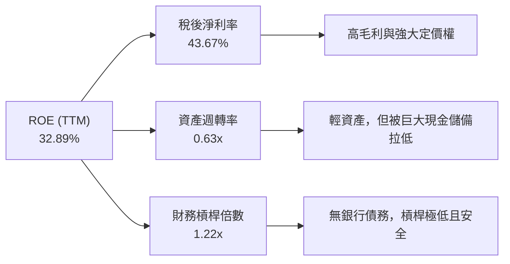

*   **淨利率 (43.67%)** 是 ROE 的絕對核心驅力，展示了其軟體產品的高附加價值。
*   **資產週轉率 (0.63x)** 偏低，主因是分母包含了高達 $8.03B 的現金與短期投資。若扣除這部分閒置資金，營運資產週轉率將極為驚人。
*   **財務槓桿 (1.22x)** 處於極低水平，說明高 ROE 完全是由業務本身的超高獲利能力驅動，而非依賴債務槓桿。

### 6.4 獲利能力儀表板

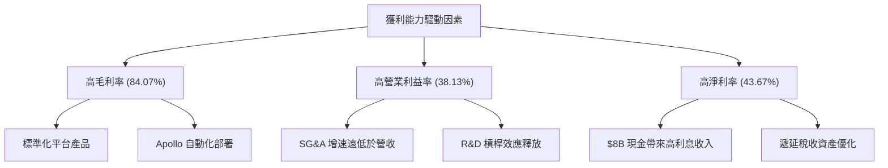

---

## 7. 估值深度分析

### 7.1 同業估值比較表格

Palantir 由於其獨特的軍工國防背景與 AIP 的極速商業化，市場給予了極高的估值溢價。我們選取兩家頂級企業級軟體/數據分析巨頭進行對比：

| 估值與成長指標 | **Palantir (PLTR)** | **Snowflake (SNOW)** | **Datadog (DDOG)** | **行業中位數** | PLTR 評估 |
|:---|:---|:---|:---|:---|:---|
| **Trailing P/E** | **144.35x** | N/A (虧損) | 72.40x | 28.50x | 🔴 顯著高估 |
| **Forward P/E** | **61.75x** | 55.20x | 48.60x | 24.10x | 🟡 偏高，但反映高成長 |
| **PEG Ratio** | **1.03** | 2.10 | 1.65 | 1.50 | 🟢 極具吸引力 (因成長率極高) |
| **P/S Ratio** | **58.95x** | 12.40x | 15.80x | 6.20x | 🔴 處於歷史高位 |
| **EV / Revenue** | **59.67x** | 11.90x | 14.90x | 5.80x | 🔴 溢價高 |
| **EV / EBITDA** | **154.46x** | N/A | 65.20x | 22.00x | 🔴 溢價高 |
| **營收 YoY 成長率** | **84.71%** | 28.50% | 25.20% | 12.50% | 🟢 遠超同業 |

### 7.2 歷史估值區間分析

```
╔══════════════════════════════════════════════════════════════════╗
║                  PLTR P/S Ratio 歷史區間與當前位置               ║
╠══════════════════════════════════════════════════════════════════╣
║                                                                  ║
║  歷史最低 (2022)：   6.0x                                        ║
║  歷史中位數：       18.5x                                        ║
║  歷史最高 (2025)：  72.0x                                        ║
║  當前位置 (58.95x)： ██████████████████████████░░░░  (偏高區間)    ║
║                                                                  ║
║  💡 評語：絕對估值倍數確實昂貴，但 PEG 1.03 說明其高估值有強勁的  ║
║     盈餘成長（EPS YoY +325%）作為支撐。                          ║
╚══════════════════════════════════════════════════════════════════╝
```

### 7.3 DCF 敏感性分析（6格目標價矩陣）

我們採用三階段折現模型（DCF），假設基準階段（1-5年）營收 CAGR 為 35%，過渡階段（6-10年）逐步放緩至 15%，終端成長率（Terminal Growth Rate）為 4.0%。

| 營收成長與折現情境 | **WACC = 10.65%** | **WACC = 11.65% (基準)** | **WACC = 12.65%** |
|:---|:---|:---|:---|
| 🟢 **樂觀 (CAGR 45%)** | **$255.00** (+98.49%) | **$235.00** (+82.92%) | **$210.00** (+63.46%) |
| 🟡 **基準 (CAGR 35%)** | **$205.00** (+59.57%) | **$182.75** (+42.25%) | **$165.00** (+28.44%) |
| 🔴 **悲觀 (CAGR 20%)** | **$120.00** (-6.59%) | **$105.00** (-18.27%) | **$95.00** (-26.05%) |

### 7.4 估值綜合區間

```
╔══════════════════════════════════════════════════════════════════╗
║                    PLTR 股價合理區間估算                         ║
╠══════════════════════════════════════════════════════════════════╣
║                                                                  ║
║  [悲觀下限] $95.00 ─── [當前股價] $128.47 ─── [基準目標] $182.75  ║
║                                                                  ║
║  當前股價相較於基準目標價，仍有 42.25% 的上行空間。              ║
╚══════════════════════════════════════════════════════════════════╝
```

---

## 8. 成長催化劑

### 8.1 催化劑時間軸

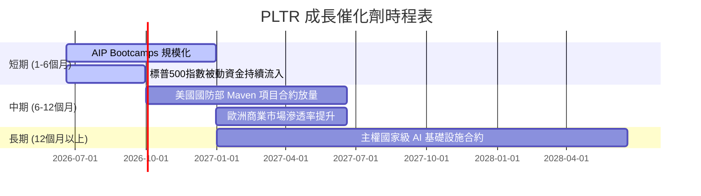

### 8.2 TAM 市場規模分析

Palantir 所面向的市場已從單純的「政府數據分析」擴展至「全球企業 AI 決策操作系統」。

```
╔══════════════════════════════════════════════════════════════════╗
║                  PLTR 潛在市場規模 (TAM) 估算                    ║
╠══════════════════════════════════════════════════════════════════╣
║                                                                  ║
║  1. 全球國防與國安軟體 TAM：     $150B  (當前滲透率 < 2%)        ║
║  2. 企業級 AI 與數據中台 TAM：   $350B  (當前滲透率 < 1%)        ║
║  ──────────────────────────────────────────────────────────────  ║
║  ✅ 總潛在市場規模 (Total TAM)： $500B                          ║
║  📊 PLTR TTM 營收 ($5.22B) 僅佔總 TAM 的 1.04%，成長空間極大。   ║
╚══════════════════════════════════════════════════════════════════╝
```

### 8.3 成長驅動力結構圖

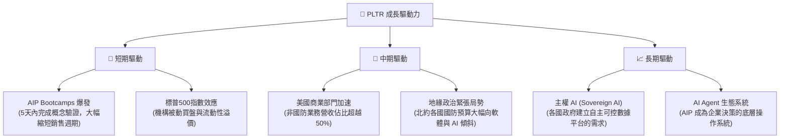

---

## 9. 風險矩陣

### 9.1 風險評分矩陣

```mermaid
quadrantChart
    title Risk Assessment Matrix (PLTR)
    x-axis Low Probability --> High Probability