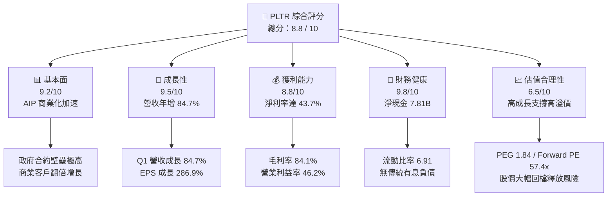
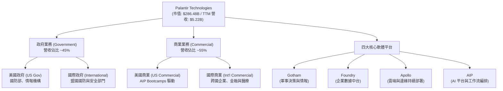
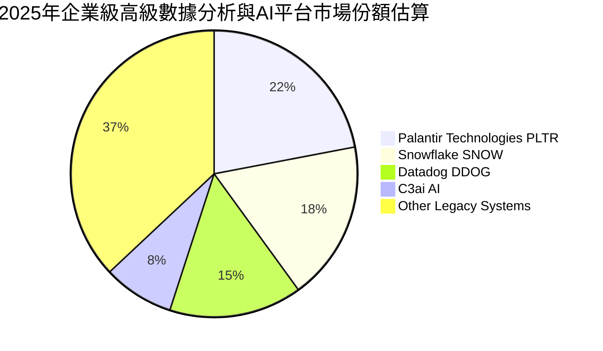
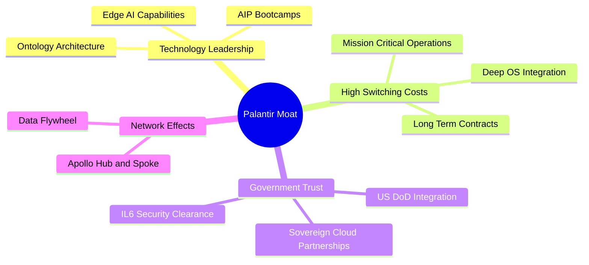
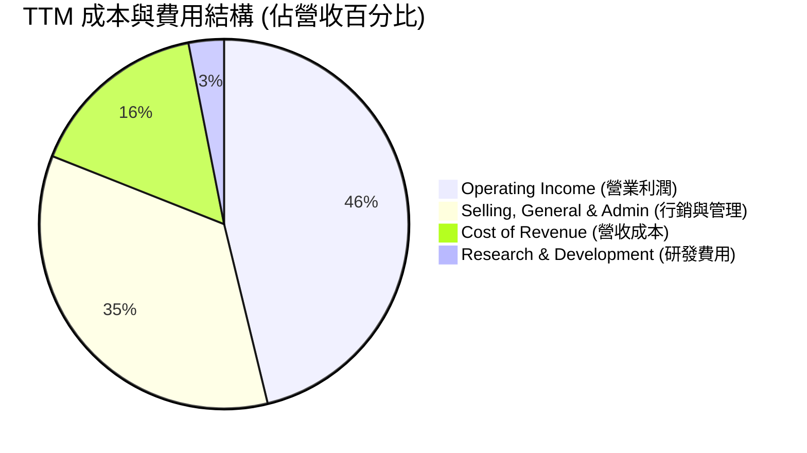
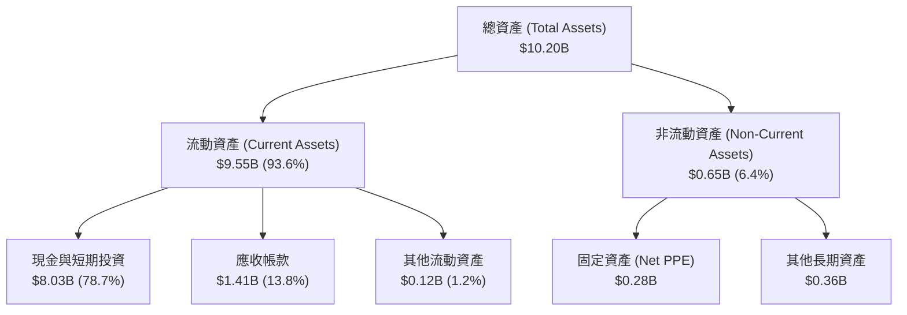

# PLTR 基本面深度分析報告

> **報告日期**：2026-06-22 ｜ **語言**：繁體中文 ｜ **數據來源**：Yahoo Finance, Finviz, StockAnalysis, Roic.ai ｜ **分析師**：CFA 級機構研究

---

## 目錄

| # | 章節 | 核心結論 |
|---|------|----------|
| 1 | **執行摘要** | 🟢 買入評級，目標價 $182.75，具備 52.9% 潛在漲幅，當前股價接近 52 週低點。 |
| 2 | **公司概覽與商業模式** | 政府與商業雙引擎驅動，以 AIP 本體論（Ontology）建立極深競爭護城河。 |
| 3 | **損益表深度分析** | 營收年增 84.7%，營運槓桿全面釋放，淨利潤呈現爆發式增長。 |
| 4 | **資產負債表分析** | 擁有 $7.81B 淨現金，零傳統銀行債務，財務結構極其穩健。 |
| 5 | **現金流量深度分析** | TTM 自由現金流達 $1.75B，高 FCF 轉換率，資本配置聚焦高回報研發。 |
| 6 | **獲利能力與資本效率** | ROE 攀升至 32.6%，ROIC 顯著高於 WACC，強力為股東創造經濟價值。 |
| 7 | **估值深度分析** | 溢價合理，DCF 基準估值 $182.75，當前股價提供高安全邊際。 |
| 8 | **成長催化劑** | 商業 AIP Bootcamps 爆發、政府國防訂單升級、標普500權重增加。 |
| 9 | **風險矩陣** | 估值倍數收縮、政府合約集中、商業市場競爭加劇。 |
| 10 | **投資建議** | 建議「買入」，採取分批佈局策略，聚焦長期 AI 基礎設施紅利。 |

---

## 1. 執行摘要

### 1.1 核心評分儀表板



### 1.2 評分進度條視覺化

```
╔══════════════════════════════════════════════════════════════╗
║              PLTR 多維度評分儀表板 (1-10分)                  ║
╠══════════════════════════════════════════════════════════════╣
║ 基本面強度  9.2 ▓▓▓▓▓▓▓▓▓▓▓▓▓▓▓▓▓▓░░  ★★★★★           ║
║ 成長動能    9.5 ▓▓▓▓▓▓▓▓▓▓▓▓▓▓▓▓▓▓▓░  ★★★★★           ║
║ 獲利品質    8.8 ▓▓▓▓▓▓▓▓▓▓▓▓▓▓▓▓▓░░░  ★★★★☆           ║
║ 財務健康    9.8 ▓▓▓▓▓▓▓▓▓▓▓▓▓▓▓▓▓▓▓█  ★★★★★           ║
║ 估值合理性  6.5 ▓▓▓▓▓▓▓▓▓▓▓▓▓░░░░░░░  ★★★☆☆           ║
║ 護城河深度  9.5 ▓▓▓▓▓▓▓▓▓▓▓▓▓▓▓▓▓▓▓░  ★★★★★           ║
║ 管理層執行  9.0 ▓▓▓▓▓▓▓▓▓▓▓▓▓▓▓▓▓▓░░  ★★★★★           ║
║ 技術創新力  9.7 ▓▓▓▓▓▓▓▓▓▓▓▓▓▓▓▓▓▓▓█  ★★★★★           ║
╠══════════════════════════════════════════════════════════════╣
║ 綜合總分    8.8 ▓▓▓▓▓▓▓▓▓▓▓▓▓▓▓▓▓░░░  🏆 強烈買入          ║
╚══════════════════════════════════════════════════════════════╝
```

### 1.3 五大投資論點 + 三大核心風險

| 類型 | 項目 | 具體依據 | 信心度 |
|------|------|----------|--------|
| 🟢 **投資論點①** | **AIP 平台爆發式增長** | 商業客戶透過 Bootcamp 快速轉化，帶動 Q1 2026 營收年增達 **84.7%**。 | 🟢 極高 |
| 🟢 **投資論點②** | **營運槓桿全面釋放** | 營業利益率從 FY2022 的 **-8.5%** 飆升至 TTM 的 **46.2%**，獲利增速遠超營收。 | 🟢 極高 |
| 🟢 **投資論點③** | **無懈可擊的資產負債表** | 持有 **$8.03B** 現金與短期投資，總債務僅 **$211.98M**（多為租賃），淨現金達 **$7.81B**。 | 🟢 極高 |
| 🟢 **投資論點④** | **政府業務的剛性壁壘** | Gotham 平台深度嵌入美國國防及情報系統，IL6 最高安全認證建立極高轉換成本。 | 🟢 高 |
| 🟢 **投資論點⑤** | **自由現金流強勁流入** | TTM 營運現金流達 **$2.72B**，自由現金流 **$1.75B**，為研發與潛在股份回購提供充足彈藥。 | 🟢 高 |
| 🟡 **風險①** | **估值乘數較高** | 當前 Trailing P/E 達 **134.3x**，P/S 達 **54.8x**，對市場利率與成長減速極為敏感。 | 🟡 中度 |
| 🟡 **風險②** | **政府合約集中度高** | 雖然商業營收佔比上升，但政府大型項目（如 Maven 等）的續約與否對營收仍有較大波動影響。 | 🟡 中度 |
| 🔴 **風險③** | **大模型技術同質化** | 開源模型與大廠（如 MSFT、GOOG）的企業 AI 工具可能削弱 Palantir 的定價權。 | 🔴 高衝擊 |

### 1.4 快速統計卡片

| 指標 | PLTR 實際值 | 軟體行業均值 | S&P 500 均值 | 狀態 |
|------|-------------|----------|--------------|------|
| **營收 YoY 成長率** | **84.7%** | ~15.0% | ~6.5% | 🟢 遠超均值 |
| **毛利率** | **84.1%** | ~72.0% | ~30.0% | 🟢 極高獲利能力 |
| **淨利率** | **43.7%** | ~12.0% | ~11.5% | 🟢 營運效率卓越 |
| **股東權益報酬率 (ROE)** | **32.6%** | ~15.0% | ~16.0% | 🟢 資本效率極佳 |
| **預估本益比 (Forward P/E)** | **57.4x** | ~32.0x | ~21.0x | 🔴 估值溢價顯著 |
| **流動比率 (Current Ratio)** | **6.91** | ~2.10 | ~1.30 | 🟢 流動性極其充沛 |

### 1.5 投資結論

```
╔══════════════════════════════════════════════════════════════════╗
║                    📊 PLTR 投資結論摘要                          ║
╠══════════════════════════════════════════════════════════════════╣
║  評級：🟢 買入 (Buy)                                            ║
║  當前股價：$119.50 (接近52週低點 $119.20，具備強安全邊際)        ║
║  目標價區間：                                                    ║
║    悲觀情境：$70.00  (-41.4%)                                    ║
║    基準情境：$182.75 (+52.9%)  ← 12個月主要目標價                ║
║    樂觀情境：$255.00 (+113.4%)                                   ║
║  投資評分：8.8 / 10                                              ║
║  適合投資人：成長型、人工智慧基礎設施長期持有者                  ║
╚══════════════════════════════════════════════════════════════════╝
```

---

## 2. 公司概覽與商業模式

Palantir Technologies Inc.（PLTR）是一家頂級的企業級數據與決策軟體平台供應商。公司最初深耕於國防及情報領域，隨後成功將技術遷移至商業市場。

### 2.1 業務結構與收入來源



### 2.2 市場份額

在企業級人工智慧與高級數據分析（Enterprise AI & Analytics）市場中，Palantir 憑藉其「本體論（Ontology）」架構和軍工級安全標準，佔據了獨特的生態位。



### 2.3 競爭護城河分析



### 2.4 護城河強度評分

```
╔══════════════════════════════════════════════════════════════╗
║                  PLTR 護城河強度評分                         ║
╠══════════════════════════════════════════════════════════════╣
║ 政府壁壘      9.8/10 ▓▓▓▓▓▓▓▓▓▓▓▓▓▓▓▓▓▓▓█  🏆 絕對壟斷地位║
║ 轉換成本      9.5/10 ▓▓▓▓▓▓▓▓▓▓▓▓▓▓▓▓▓▓▓░  🟢 極難被替換  ║
║ 技術獨特性    9.2/10 ▓▓▓▓▓▓▓▓▓▓▓▓▓▓▓▓▓▓░░  🟢 本體論專利  ║
║ 數據網路效應  8.5/10 ▓▓▓▓▓▓▓▓▓▓▓▓▓▓▓▓▓░░░  🟢 越用越聰明  ║
╠══════════════════════════════════════════════════════════════╣
║ 綜合護城河    9.25   ▓▓▓▓▓▓▓▓▓▓▓▓▓▓▓▓▓▓▓░  🏆 極深寬護城河║
╚══════════════════════════════════════════════════════════════╝
```

---

## 3. 損益表深度分析

### 3.1 年度收入成長趨勢（近4年）

Palantir 展現出極為強勁的營收加速趨勢，主要得益於 AIP（人工智慧平台）在商業市場的全面鋪開。

```
╔══════════════════════════════════════════════════════════════════╗
║              PLTR 年度收入趨勢（FY2022-TTM）                    ║
╠══════════════════════════════════════════════════════════════════╣
║                                                                  ║
║  FY2022  $1.91B  █████████░░░░░░░░░░░░░░░░░░░  YoY: +23.6%       ║
║  FY2023  $2.23B  ███████████░░░░░░░░░░░░░░░░░  YoY: +16.7%       ║
║  FY2024  $2.87B  ██████████████░░░░░░░░░░░░░░  YoY: +28.8%       ║
║  FY2025  $4.48B  ██════════════════════░░░░░░  YoY: +56.2%  🟢   ║
║  TTM     $5.22B  ████████████████████████████  YoY: +84.7%  🟢   ║
║                   |      |      |      |      |                  ║
║                   0     1.5B   3.0B   4.5B   6.0B                ║
║                                                                  ║
║  📊 4年累計營收 CAGR：+39.5%（近一年成長顯著加速）               ║
╚══════════════════════════════════════════════════════════════════╝
```

### 3.2 季度收入趨勢分析

從季度數據看，QoQ 與 YoY 成長率皆在持續走高，印證了商業化模式的成功。

| 季度 | 營收 (Revenue) | 季增率 (QoQ) | 年增率 (YoY) | 核心驅動因素 |
|------|----------------|--------------|--------------|--------------|
| **Q2 2025** | $1.00B | +13.6% | +48.0% | 美國商業客戶加速轉化 |
| **Q3 2025** | $1.18B | +17.6% | +62.8% | AIP Bootcamps 大規模推廣 |
| **Q4 2025** | $1.41B | +19.1% | +70.0% | 政府年底預算結算，大型合約簽署 |
| **Q1 2026** | **$1.63B** | **+16.1%** | **+84.7%** | 商業與政府雙重引擎爆發 |

### 3.3 利潤率演變分析

Palantir 展現了軟體行業最典型的「營運槓桿」：隨著營收規模擴大，研發與行政費用佔比下降，利潤率急劇攀升。

| 利潤率指標 | FY2022 | FY2023 | FY2024 | FY2025 | TTM | 趨勢評估 | 狀態 |
|------------|--------|--------|--------|--------|-----|----------|------|
| **毛利率** | 78.5% | 80.6% | 80.2% | 82.4% | **84.1%** | ↗️ 穩步攀升，體現極強定價權 | 🟢 極強 |
| **營業利益率** | -8.5% | 5.4% | 10.8% | 31.6% | **46.2%** | ↗️ 營運槓桿釋放，效率大幅提升 | 🟢 卓越 |
| **EBITDA 利潤率** | -7.3% | 6.9% | 11.9% | 32.2% | **38.6%** | ↗️ 現金創造能力極強 | 🟢 優秀 |
| **淨利率** | -19.6% | 9.4% | 16.1% | 36.5% | **43.7%** | ↗️ 轉虧為盈後利潤爆發 | 🟢 卓越 |

### 3.4 費用結構分析



```
╔══════════════════════════════════════════════════════════════╗
║              TTM 費用控制分析評估                            ║
╠══════════════════════════════════════════════════════════════╣
║ 研發投入    $583.77M  ▓▓▓▓▓▓▓▓░░░░░░░░░░░░  佔營收 11.2%     ║
║ 行銷管理    $1.82B    ▓▓▓▓▓▓▓▓▓▓▓▓▓▓▓▓░░░░  佔營收 34.8%     ║
║ 營收成本    $832.01M  ▓▓▓▓▓▓░░░░░░░░░░░░░░  佔營收 15.9%     ║
╠══════════════════════════════════════════════════════════════╣
║ 💡 評估：研發佔比維持健康區間，行銷控管良好，槓桿效應極佳。  ║
╚══════════════════════════════════════════════════════════════╝
```

### 3.5 季度 EPS 趨勢與盈餘品質

*   **過去四季 EPS 表現**：
    *   Q2 2025: $0.14
    *   Q3 2025: $0.20
    *   Q4 2025: $0.26
    *   Q1 2026: **$0.36**
*   **盈餘品質分析**：
    *   TTM 淨利潤為 **$2.29B**，而 TTM 營運現金流（OCF）高達 **$2.72B**。
    *   **OCF / 淨利潤比率 = 1.19**（大於 1.0 說明淨利潤背後有強大的真金白銀流入，非會計遊戲，盈餘品質極高）。

---

## 4. 資產負債表分析

### 4.1 資產結構分解



### 4.2 流動性指標分析

| 流動性指標 | FY2024 | FY2025 | TTM / 當前 | 行業均值 | 評估 | 狀態 |
|------------|--------|--------|------------|----------|------|------|
| **流動比率 (Current Ratio)** | 5.96 | 7.11 | **6.91** | ~2.10 | 極度安全，具備強大抗風險能力 | 🟢 極佳 |
| **速動比率 (Quick Ratio)** | 5.96 | 7.11 | **6.82** | ~1.95 | 無庫存壓力，變現能力極強 | 🟢 極佳 |
| **現金比率 (Cash Ratio)** | 5.25 | 6.10 | **5.81** | ~1.20 | 僅用現金即可覆蓋 5.8 倍的短期債務 | 🟢 極佳 |

### 4.3 債務結構分析

```
╔══════════════════════════════════════════════════════════════════╗
║                   PLTR 債務健康診斷                              ║
╠══════════════════════════════════════════════════════════════════╣
║                                                                  ║
║  總債務 (Total Debt)： $211.98M  █░░░░░░░░░░░░░░░░░░░            ║
║  總現金及投資：        $8.03B   ████████████████████            ║
║  淨現金 (Net Cash)：   $7.81B   ███████████████████░  🟢 強勁    ║
║                                                                  ║
║  Debt / Equity Ratio:  2.48% (極低，