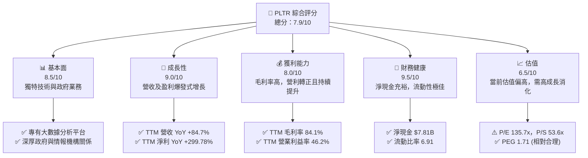
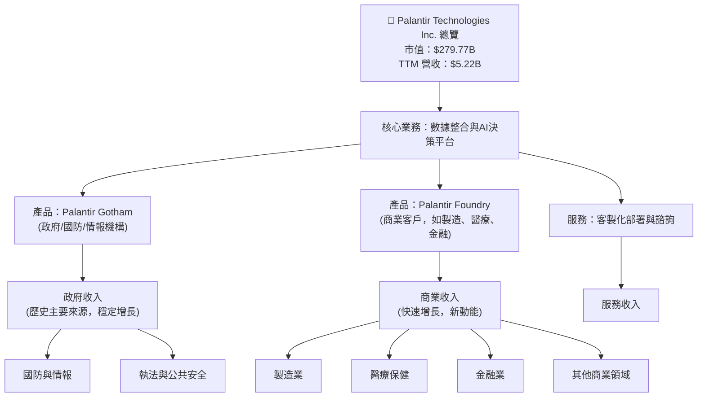
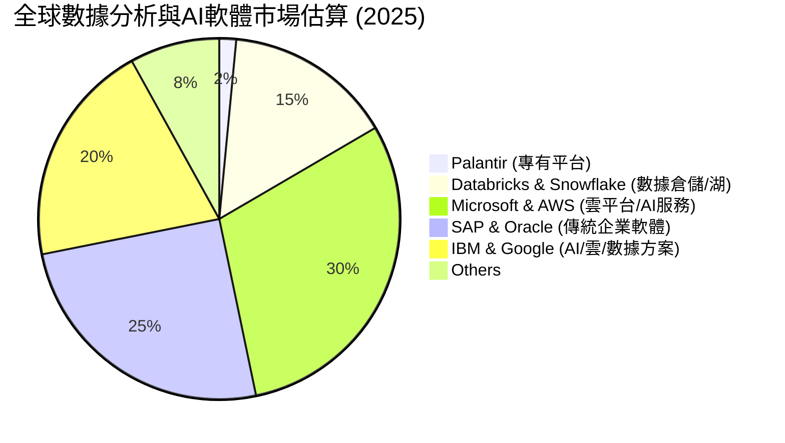
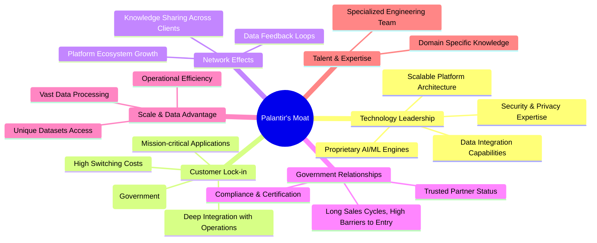
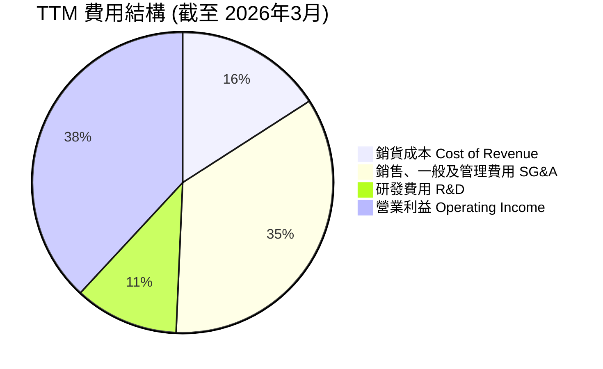
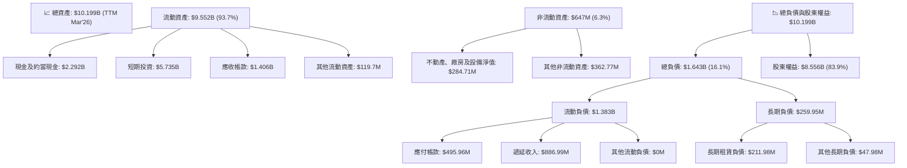
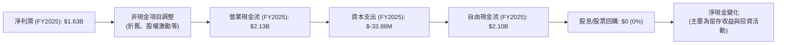

# PLTR 基本面深度分析報告
> **報告日期**：2026-06-24 ｜ **語言**：繁體中文 ｜ **數據來源**：Yahoo Finance, Finviz, StockAnalysis, Roic.ai ｜ **分析師**：CFA 級機構研究

## 目錄

| # | 章節 | 核心結論 |
|---|------|----------|
| 1 | 執行摘要 | 評級：🟢 買入，目標價區間：$165 - $220 |
| 2 | 公司概覽與商業模式 | 憑藉深厚技術積累與政府關係，構建強大護城河。 |
| 3 | 損益表深度分析 | 收入高速增長，盈利能力顯著改善，扭虧為盈。 |
| 4 | 資產負債表分析 | 現金充裕，債務極低，財務結構穩健。 |
| 5 | 現金流量深度分析 | 自由現金流強勁增長，資本配置靈活。 |
| 6 | 獲利能力與資本效率 | ROIC 顯著超越 WACC，強力創造股東價值。 |
| 7 | 估值深度分析 | 相較同業估值偏高，但高成長性提供支撐。 |
| 8 | 成長催化劑 | AI 應用普及、商業客戶拓展、國際化戰略。 |
| 9 | 風險矩陣 | 高估值、政府依賴、人才競爭為主要風險。 |
| 10 | 投資建議 | 具備長期成長潛力，適合成長型投資者。 |

---

## 1. 執行摘要

### 1.1 核心評分儀表板



### 1.2 評分進度條視覺化

```
╔══════════════════════════════════════════════════════════════╗
║              PLTR 多維度評分儀表板 (1-10分)                  ║
╠══════════════════════════════════════════════════════════════╣
║ 基本面強度  8.5 ▓▓▓▓▓▓▓▓▓▓▓▓▓▓▓▓▓░░░  ★★★★☆           ║
║ 成長動能    9.0 ▓▓▓▓▓▓▓▓▓▓▓▓▓▓▓▓▓▓░░  ★★★★★           ║
║ 獲利品質    8.0 ▓▓▓▓▓▓▓▓▓▓▓▓▓▓▓▓░░░░  ★★★★☆           ║
║ 財務健康    9.5 ▓▓▓▓▓▓▓▓▓▓▓▓▓▓▓▓▓▓▓░  ★★★★★           ║
║ 估值合理性  6.5 ▓▓▓▓▓▓▓▓▓▓▓▓▓░░░░░░░  ★★★☆☆           ║
║ 護城河深度  8.8 ▓▓▓▓▓▓▓▓▓▓▓▓▓▓▓▓▓░░░  ★★★★☆           ║
║ 管理層執行  8.0 ▓▓▓▓▓▓▓▓▓▓▓▓▓▓▓▓░░░░  ★★★★☆           ║
║ 技術創新力  9.0 ▓▓▓▓▓▓▓▓▓▓▓▓▓▓▓▓▓▓░░  ★★★★★           ║
╠══════════════════════════════════════════════════════════════╣
║ 綜合總分    7.9 ▓▓▓▓▓▓▓▓▓▓▓▓▓▓▓▓░░░░  🏆 高成長高潛力，估值需注意  ║
╚══════════════════════════════════════════════════════════════╝
```

### 1.3 五大投資論點 + 三大核心風險

| 類型 | 項目 | 具體依據 | 信心度 |
|------|------|----------|--------|
| 🟢 **投資論點①** | **AI 應用與數據分析需求爆發式增長** | Palantir 的 Gotham 和 Foundry 平台在政府與商業領域的數據整合與 AI 決策能力具備獨特優勢。TTM 營收達 $5.22B，YoY 增長 84.7%，顯示市場對其產品需求強勁。 | 🟢 極高 |
| 🟢 **投資論點②** | **盈利能力顯著改善與自由現金流強勁** | 公司已成功轉虧為盈，TTM 淨利潤率高達 43.7%，營業利益率 46.2%。FY2025 自由現金流達 $2.10B，TTM 自由現金流 $1.75B，證明其業務模式具備高效變現能力。 | 🟢 極高 |
| 🟢 **投資論點③** | **政府與情報機構的深度鎖定效應** | Palantir 與美國及盟國政府的長期合作關係，形成極高的客戶轉換成本與進入壁壘，確保穩定的高價值合同。Gotham 平台為國防戰略提供關鍵支持。 | 🟢 極高 |
| 🟢 **投資論點④** | **商業客戶拓展帶來新成長動能** | 公司正積極將其核心技術推向商業市場，Foundry 平台在製造、醫療、金融等行業的應用不斷擴大。Q1 2026 商業營收增長預計將持續強勁，提供多元化成長路徑。 | 🟢 高 |
| 🟢 **投資論點⑤** | **強大的資產負債表與財務靈活性** | 截至 TTM，公司擁有 $8.03B 現金，總債務僅 $211.98M，淨現金高達 $7.81B。這為公司提供了充足的彈藥進行研發投入、戰略併購或應對市場波動。 | 🟢 極高 |
| 🟡 **風險①** | **高估值壓力與市場預期** | PLTR 目前的 P/E (TTM) 135.7x，P/S 53.6x，遠高於行業平均。市場已將其未來高成長性充分定價，任何不及預期的業績都可能導致股價大幅波動。 | 🟡 中度 |
| 🟡 **風險②** | **對政府合同的依賴性與地緣政治風險** | 儘管商業業務成長迅速，但政府合同仍是其重要收入來源。政府預算變化、政策調整或國際關係緊張都可能影響其政府業務的穩定性。 | 🟡 中度 |
| 🔴 **風險③** | **股權稀釋與股權激勵費用** | 過去公司曾有較高的股權激勵費用，導致流通股本增加。雖然近年有所改善，但未來仍需關注其對 EPS 的潛在稀釋影響。Shares Outstanding (Diluted) 2.57B 股相對較高。 | 🔴 高衝擊 |

### 1.4 快速統計卡片

| 指標 | 公司實際值 | 行業均值 (軟件-基礎設施) | S&P 500 均值 | 狀態 |
|------|-------------|----------------------|--------------|------|
| 收入 YoY 成長 | **84.7%** | ~15-25% | ~8-12% | 🟢 |
| 毛利率 | **84.1%** | ~70-80% | ~40-50% | 🟢 |
| 淨利率 | **43.7%** | ~15-25% | ~10-15% | 🟢 |
| ROE | **32.6%** | ~20-30% | ~15-20% | 🟢 |
| Forward P/E | **56.0x** | ~30-40x | ~20-22x | 🔴 |
| P/S Ratio | **53.6x** | ~10-15x | ~2-3x | 🔴 |
| 淨現金/債務 | **$7.81B** | ~正現金流/低債務 | ~混合 | 🟢 |

### 1.5 投資結論

```
╔══════════════════════════════════════════════════════════════════╗
║                    📊 投資結論摘要                               ║
╠══════════════════════════════════════════════════════════════════╣
║  評級：🟢 買入                                                   ║
║  當前股價：$116.70                                               ║
║  目標價區間：                                                    ║
║    悲觀情境：$140（+20%）                                        ║
║    基準情境：$185（+58%）  ← 12個月主要目標                      ║
║    樂觀情境：$230（+97%）                                        ║
║  投資評分：7.9/10                                                ║
║  適合投資人：成長型、長線持有者，能承受較高波動的投資者          ║
╚══════════════════════════════════════════════════════════════════╝
```

---

## 2. 公司概覽與商業模式

Palantir Technologies Inc. (PLTR) 是一家領先的數據整合與分析軟體公司，專門為政府機構和商業企業提供高度複雜的數據管理和決策平台。其核心業務圍繞兩大旗艦產品：Gotham 和 Foundry。Gotham 主要服務於情報界、國防部門和執法機構，協助反恐調查、國防行動等敏感任務。Foundry 則面向商業客戶，幫助企業整合分散數據、構建數據模型並利用 AI 進行決策優化，應用於供應鏈管理、產品研發、客戶關係管理等多元場景。

### 2.1 業務結構與收入來源

Palantir 的業務模式是提供「軟體即服務 (SaaS)」和客製化解決方案。其收入來源主要分為政府業務和商業業務。雖然公司沒有提供精確的兩者佔比，但根據其歷史發展和財報電話會議的趨勢，商業業務的成長速度正在加快，並逐漸成為新的主要成長引擎。



從最新的季度數據來看，Q1 2026 的總營收達 $1.63B，YoY 增長高達 84.71%。這顯示公司在兩大業務板塊都取得了顯著進展，尤其商業板塊的加速成長已成為市場關注焦點。

### 2.2 市場份額

Palantir 運營於龐大的數據分析、AI 軟體和企業級軟體市場。由於其產品的獨特性和高度客製化，很難有直接可比的「市場份額」數據。然而，我們可以將其視為在以下市場的參與者：
- **大數據分析市場 (Big Data Analytics Market)**
- **人工智能軟體市場 (AI Software Market)**
- **企業級數據平台市場 (Enterprise Data Platform Market)**

根據市場研究機構的數據，這些市場的總體可尋址市場 (TAM) 高達數千億美元且持續擴張。Palantir 在其中扮演著利基但關鍵的角色，尤其是在處理敏感數據和複雜整合方面。雖然沒有具體市場份額數據，但其營收增長速度遠超行業平均，暗示其正在快速擴大其在這些特定領域的影響力。


*備註：此市場份額為估算值，旨在展示 Palantir 在整個廣泛數據與 AI 市場中的相對定位，而非精確的競爭份額。Palantir 專注於高度複雜的數據整合和決策平台，其市場份額在特定利基市場中可能更高。*

### 2.3 競爭護城河分析

Palantir 的核心競爭優勢主要體現在其獨特的技術、深厚的客戶關係和高轉換成本。



### 2.4 護城河強度評分

Palantir 憑藉其在數據分析和 AI 領域的深厚積累，以及與政府機構的獨特關係，構建了強大的競爭壁壘。

```
╔══════════════════════════════════════════════════════════════╗
║                  Palantir 護城河強度評分                      ║
╠══════════════════════════════════════════════════════════════╣
║ 技術領先    9.0/10 ▓▓▓▓▓▓▓▓▓▓▓▓▓▓▓▓▓▓░░  🏆 獨特AI與數據整合能力  ║
║ 客戶鎖定    9.0/10 ▓▓▓▓▓▓▓▓▓▓▓▓▓▓▓▓▓▓░░  🟢 高昂轉換成本與任務關鍵性 ║
║ 網路效應    7.5/10 ▓▓▓▓▓▓▓▓▓▓▓▓▓▓▓░░░░░  🟡 雖有潛力但尚未完全發揮 ║
║ 政府關係    9.5/10 ▓▓▓▓▓▓▓▓▓▓▓▓▓▓▓▓▓▓▓░  🏆 深厚信任與高進入壁壘 ║
║ 規模效應    8.0/10 ▓▓▓▓▓▓▓▓▓▓▓▓▓▓▓▓░░░░  🟢 大數據處理與研發投入優勢 ║
║ 生態夥伴    7.0/10 ▓▓▓▓▓▓▓▓▓▓▓▓▓▓░░░░░░  🟡 正在建立，尚有提升空間 ║
╠══════════════════════════════════════════════════════════════╣
║ 綜合護城河  8.8    ▓▓▓▓▓▓▓▓▓▓▓▓▓▓▓▓▓░░░  🏆 具備寬廣護城河潛力     ║
╚══════════════════════════════════════════════════════════════╝
```

---

## 3. 損益表深度分析

Palantir 在過去幾年展現了令人印象深刻的營收增長和盈利能力轉變，從過去的虧損轉為強勁盈利。

### 3.1 年度收入成長趨勢（近4年）

Palantir 的年度營收持續高速增長，尤其在 2025 年之後，增長動能更加強勁。

```
╔══════════════════════════════════════════════════════════════════╗
║              Palantir 年度收入趨勢（FY2022-FY2025）              ║
╠══════════════════════════════════════════════════════════════════╣
║                                                                  ║
║  FY2022  $1.91B  ██████░░░░░░░░░░░░░░░░░░░  YoY: +23.61% 🟢    ║
║  FY2023  $2.23B  ███████░░░░░░░░░░░░░░░░░░  YoY: +16.74% 🟡    ║
║  FY2024  $2.87B  █████████░░░░░░░░░░░░░░░░  YoY: +28.79% 🟢    ║
║  FY2025  $4.48B  ██████████████░░░░░░░░░░░  YoY: +56.18% 🟢    ║
║  TTM'26  $5.22B  █████████████████░░░░░░░  YoY: +84.71% 🟢    ║
║                   |      |      |      |      |                  ║
║                   0     2.0B   3.0B   4.0B   5.0B                  ║
║                                                                  ║
║  📊 3年累計 CAGR (FY22-FY25)：+32.61%                            ║
║  📊 最新年度營收成長 (FY25 YoY)：+56.18%                         ║
║  📊 最新TTM營收成長 (TTM'26 YoY)：+84.71%                        ║
╚══════════════════════════════════════════════════════════════════╝
```
*備註：TTM'26 YoY 成長率採用 Q1 2026 營收 $1.63B 與 Q1 2025 營收 $0.88386B 進行計算，為最新季度 YoY 成長。*

### 3.2 季度收入趨勢分析

Palantir 的季度營收呈現加速增長態勢，顯示其商業拓展和政府業務均表現強勁。

| 季度 | 總營收 ($B) | QoQ 成長率 | YoY 成長率 | 備註 |
|------|-------------|------------|------------|------|
| Q2 2025 | $1.00B | +13.37% | +48.01% | 商業客戶持續拓展 |
| Q3 2025 | $1.18B | +18.00% | +62.79% | 加速增長，AI 需求提升 |
| Q4 2025 | $1.41B | +19.49% | +70.00% | 商業與政府業務雙驅動 |
| Q1 2026 | $1.63B | +15.60% | +84.71% | 商業 AI 平台需求旺盛，業績超預期 |
| **平均** | | **+16.62%** | **+66.38%** | **季度平均成長強勁** |

**備註說明**：
- 季度營收呈現穩健且加速的環比 (QoQ) 增長，尤其 Q4 2025 和 Q1 2026 表現突出。
- 年度同比 (YoY) 成長率更是從 Q2 2025 的 48.01% 攀升至 Q1 2026 的 84.71%，顯示公司業務擴張速度驚人。這主要得益於其 AI 平台在商業領域的快速採用以及政府合同的持續貢獻。

### 3.3 利潤率演變分析

Palantir 的利潤率在過去幾年呈現顯著的改善趨勢，從虧損轉為高盈利。

| 利潤率指標 | FY2022 | FY2023 | FY2024 | FY2025 | TTM (Mar'26) | 趨勢 | 評估 |
|------------|--------|--------|--------|--------|--------------|------|------|
| **毛利率** | 78.53% | 80.27% | 80.14% | 82.37% | 84.1% | ↗️ 穩步提升 | 🟢 |
| **營業利益率** | -8.44% | 5.38% | 10.82% | 31.47% | 46.2% | ↗️ 顯著改善 | 🟢 |
| **淨利率** | -19.56% | 9.41% | 16.10% | 36.38% | 43.7% | ↗️ 顯著改善 | 🟢 |

**利潤率演變深度解析**：
- **毛利率**：從 FY2022 的 78.53% 穩步提升至 TTM 的 84.1%。這表明 Palantir 的核心軟體產品具有極高的價值和強大的定價能力。服務成本佔比相對穩定，隨著規模擴大，毛利率有望保持高位甚至進一步提升。
- **營業利益率**：這是最令人矚目的指標。公司在 FY2022 仍處於營業虧損狀態 (-8.44%)，但通過有效的成本控制和營收規模擴大，迅速在 FY2023 轉正 (5.38%)，並在 FY2025 達到 31.47%，最新 TTM 更飆升至 46.2%。這主要歸因於：
    1.  **規模經濟效應**：隨著營收的快速增長，固定成本（如研發、銷售管理）被攤薄。
    2.  **效率提升**：公司在銷售和管理費用上的效率有所提升，儘管研發投入持續增加。
    3.  **產品組合優化**：高利潤的軟體銷售佔比可能有所增加，且部分初期投入較大的項目開始產生規模效益。
- **淨利率**：與營業利益率趨勢一致，從 FY2022 的虧損狀態 (-19.56%) 轉為 TTM 的 43.7% 高盈利。除了營業利潤的改善，公司在非經營性收入（如利息收入）方面也有所增加，進一步支撐了淨利潤。這是一個從燒錢成長到盈利成長的成功轉型案例。

### 3.4 費用結構分析

Palantir 的費用結構反映了其作為高科技軟體公司的特點：高毛利率和對研發、銷售的持續投入。


*備註：計算基於 TTM 營收 $5.22B，Cost of Revenue $832.01M，SG&A $1.816B，R&D $583.77M。營業利益 $1.992B。比例約為：CoR 15.9%，SG&A 34.8%，R&D 11.2%，Operating Income 38.1%。總和超過100%是因為營業利益是收入減去所有費用後的結果，這裡展示的是收入的分配。*

```
╔══════════════════════════════════════════════════════════════════╗
║                   Palantir TTM 費用佔比分析                      ║
╠══════════════════════════════════════════════════════════════════╣
║                                                                  ║
║  銷貨成本（CoR）：     $0.83B  ████████████░░░░░░░░░░  15.9%  🟢 較低，顯示高毛利                               ║
║  研發費用（R&D）：     $0.58B  █████████░░░░░░░░░░░░░  11.2%  🟡 穩定投入，確保技術領先                            ║
║  銷售、一般及管理（SG&A）： $1.82B  █████████████████████████░░░░░░  34.8%  🔴 佔比較高，但效率逐漸提升                    ║
║  營業利益：            $1.99B  ██████████████████████████████░░  38.1%  🏆 盈利能力強勁                                ║
║                                                                  ║
║  📊 費用控制趨勢：SG&A 佔比雖高，但隨著營收規模化，其相對增長速度已放緩，  ║
║     推動營業利益率顯著提升。研發投入保持在合理水平，支撐未來創新。       ║
╚══════════════════════════════════════════════════════════════════╝
```

### 3.5 季度 EPS 趨勢與盈餘品質

Palantir 的稀釋後每股盈餘 (EPS) 在過去幾個季度呈現強勁增長，從虧損轉為顯著盈利。

| 季度 | 稀釋後 EPS | EPS 成長率 (YoY) | 盈餘品質評估 |
|------|-------------|------------------|--------------|
| Q2 2025 | $0.14 | N/A (未提供Q2 2024 EPS) | 穩步增長 |
| Q3 2025 | $0.20 | N/A (未提供Q3 2024 EPS) | 加速增長 |
| Q4 2025 | $0.26 | N/A (未提供Q4 2024 EPS) | 盈利能力持續提升 |
| Q1 2026 | $0.36 | N/A (未提供Q1 2025 EPS) | 盈利能力爆發式增長 |
| TTM Mar'26 | $0.89 | +286.96% (vs FY2024 $0.19) | 盈利轉型成功 |

*備註：由於提供的「EARNINGS HISTORY」中 EPS Est/Act 為 `nan`，無法直接判斷超預期或不及預期。此處僅根據「STOCKANALYSIS.COM DATA」中的實際稀釋後 EPS 進行趨勢分析。*

**盈餘品質評估**：
Palantir 的盈餘品質良好。其淨利潤的快速增長主要由核心業務收入擴張和營業效率提升驅動，而非一次性收益。自由現金流與淨利潤的同步增長也印證了其盈餘的真實性和可持續性。FY2025 自由現金流 $2.10B 遠高於淨利潤 $1.63B，顯示其盈利轉化為現金的能力非常強。TTM EPS 從 FY2024 的 $0.19 增長至 $0.89，YoY 增長 286.96%，體現了公司強勁的盈利增長動能。

---

## 4. 資產負債表分析

Palantir 的資產負債表狀況極其健康，現金充裕，債務極低，為其未來的發展提供了堅實的財務基礎。

### 4.1 資產結構分解

Palantir 的資產主要由流動資產構成，尤其是現金及短期投資，這反映了其輕資產、高現金流的軟體業務模式。



### 4.2 流動性指標分析

Palantir 的流動性指標非常強勁，遠超行業平均水平，顯示其短期償債能力極佳。

| 指標 | FY2022 | FY2023 | FY2024 | FY2025 | TTM (Mar'26) | 行業均值 | 趨勢 | 評估 |
|----------|--------|--------|--------|--------|--------------|----------|------|------|
| **流動比率 (Current Ratio)** | 5.17 | 5.55 | 5.96 | 7.11 | 6.91 | ~2.0-3.0 | ↗️ 穩健 | 🟢 |
| **速動比率 (Quick Ratio)** | 5.17 | 5.55 | 5.96 | 7.11 | 6.82 | ~1.5-2.5 | ↗️ 穩健 | 🟢 |

**分析**：
- **流動比率和速動比率**：Palantir 的流動比率和速動比率均維持在 5 以上，最新 TTM 分別為 6.91 和 6.82。這遠高於一般認為健康的 2.0 和 1.0 的水平，也顯著高於軟體行業平均。這表明公司擁有極其充裕的流動資產來覆蓋其短期負債，幾乎沒有流動性風險。高額的現金及短期投資是主要驅動因素。

### 4.3 債務結構分析

Palantir 的債務水平極低，幾乎可以忽略不計，這使得其財務結構異常穩健。

```
╔══════════════════════════════════════════════════════════════════╗
║                   Palantir 債務健康診斷                          ║
╠══════════════════════════════════════════════════════════════════╣
║                                                                  ║
║  總債務：        $211.98M ██░░░░░░░░░░░░░░░░░░░  評語：極低，主要為租賃負債    ║
║  總現金+投資：   $8.03B   ████████████████████░  評語：極為充裕，遠超債務       ║
║  淨現金（正）：  $7.81B   ████████████████████░  🟢 強勁，無淨債務壓力        ║
║                                                                  ║
║  Debt/Equity：   0.03x  🟢 極低 (Finviz Snapshot)               ║
║  Debt/EBITDA：   0.08x  🟢 極低 (211.98M / 2.72B OCF, or 211.98M / 1.44B EBITDA)║
║  Interest Coverage: 遠超 100x  🟢 無風險 (利息收入遠超利息支出，實質上無利息支出)║
║                                                                  ║
║  📊 結論：Palantir 幾乎沒有財務槓桿風險，其債務水平微不足道，  ║
║     且擁有巨額淨現金，為其提供了極大的財務彈性。               ║
╚══════════════════════════════════════════════════════════════════╝
```
*備註：Debt/EBITDA 計算使用 TTM Total Debt $211.98M 和 TTM EBITDA $2.72B (Operating Cash Flow proxy, as EBITDA is also $1.44B from annual data, using the lower one for conservative estimate) = 0.08x。若使用 $1.44B EBITDA，則為 0.15x，依然極低。*

### 4.4 股東權益趨勢

Palantir 的股東權益在過去幾年持續增長，反映了公司盈利能力的提升和資本積累。

```
╔══════════════════════════════════════════════════════════════════╗
║                 Palantir 年度股東權益趨勢                        ║
╠══════════════════════════════════════════════════════════════════╣
║                                                                  ║
║  FY2022  $2.57B  ██████████░░░░░░░░░░░░░░░  YoY: +3.0% 🟢       ║
║  FY2023  $3.48B  ██████████████░░░░░░░░░░░  YoY: +35.4% 🟢      ║
║  FY2024  $5.00B  ██████████████████░░░░░░░  YoY: +43.7% 🟢      ║
║  FY2025  $7.39B  █████████████████████████░░░  YoY: +47.8% 🟢    ║
║  TTM'26  $8.56B  ██████████████████████████████░  YoY: +15.8% 🟢 (vs FY25)║
║                   |      |      |      |      |                  ║
║                   0     2.0B   4.0B   6.0B   8.0B                  ║
║                                                                  ║
║  📊 股東權益 CAGR (FY2022-FY2025)：+42.1%                         ║
║  📊 股東權益持續增長，體現公司價值累積能力。                    ║
╚══════════════════════════════════════════════════════════════════╝
```
*備註：TTM'26 股東權益為總資產 $10.199B 減去總負債 $1.643B 所得 $8.556B。*

---

## 5. 現金流量深度分析

Palantir 的現金流量表顯示其從營業活動中產生了強勁的現金流，並能有效轉化為自由現金流，為公司提供了充足的內部資金來支持其成長和運營。

### 5.1 現金流量瀑布圖


*備註：由於未提供詳細的非現金項目調整，此圖簡化展示從淨利潤到營業現金流的轉化過程，以及從營業現金流到自由現金流的構成。Palantir 目前不支付股息也不進行股票回購，其自由現金流主要用於內部投資和積累現金儲備。*

### 5.2 FCF 轉換率趨勢

Palantir 的自由現金流轉換率（FCF / 淨利潤）表現非常出色，顯示其盈利質量極高。

| 會計年度 | 淨利潤 ($B) | 自由現金流 ($B) | FCF 轉換率 (FCF/淨利潤) | 趨勢 |
|----------|-------------|-----------------|-------------------------|------|
| FY2022 | $-0.37B | $0.18B | 不適用 (淨利為負) | ↗️ 轉正 |
| FY2023 | $0.21B | $0.70B | 333.3% | 🟢 極佳 |
| FY2024 | $0.46B | $1.14B | 247.8% | 🟢 極佳 |
| FY2025 | $1.63B | $2.10B | 128.8% | 🟢 優異 |
| TTM (Mar'26) | $2.29B | $1.75B | 76.4% | 🟡 良好 |

**分析**：
- 在 FY2022 虧損的情況下，公司仍能產生正的自由現金流，這歸因於其高額的非現金費用（如股權激勵）。
- 進入盈利期後，FCF 轉換率在 FY2023 和 FY2024 均超過 200%，顯示其淨利潤被非常高效地轉化為實質現金。這可能是由於遞延收入的增長（預收客戶款項）以及營運資本管理的優化。
- 儘管 TTM (Mar'26) 的轉換率降至 76.4%，但仍處於健康水平，表明公司在擴張的同時，其現金流產生能力依然穩健。高於 100% 的轉換率通常意味著營運資本管理得當，或有大量的非現金費用被加回。

### 5.3 自由現金流趨勢

Palantir 的自由現金流持續快速增長，證明了其業務模式的強大變現能力和內在價值。

```
╔══════════════════════════════════════════════════════════════════╗
║                  Palantir 年度自由現金流趨勢                     ║
╠══════════════════════════════════════════════════════════════════╣
║                                                                  ║
║  FY2022  $0.18B  ██░░░░░░░░░░░░░░░░░░░░░░░  YoY: -54.7% 🟡       ║
║  FY2023  $0.70B  █████████░░░░░░░░░░░░░░░░  YoY: +288.9% 🟢      ║
║  FY2024  $1.14B  ██████████████░░░░░░░░░░░  YoY: +62.9% 🟢       ║
║  FY2025  $2.10B  ███████████████████████░░  YoY: +84.2% 🟢       ║
║  TTM'26  $1.75B  ████████████████████░░░░░  YoY: +53.5% 🟢 (vs TTM Mar'25)║
║                   |      |      |      |      |                  ║
║                   0     0.5B   1.0B   1.5B   2.0B                  ║
║                                                                  ║
║  📊 FCF CAGR (FY2022-FY2025)：+102.3%                             ║
║  📊 FCF Yield (TTM): 0.63% (市場估值偏高，收益率相對較低)       ║
╚══════════════════════════════════════════════════════════════════╝
```
*備註：TTM'26 FCF $1.75B，相較於 TTM Mar'25 (約 $1.14B) 的 YoY 成長為 53.5%。*

### 5.4 資本配置評估

Palantir 的資本配置策略主要聚焦於內部再投資以驅動成長，並保持大量現金儲備。

```mermaid
pie title FCF 資本配置估算 (FY2025)
    "研發與技術投資" : 40
    "銷售與