# PLTR 基本面深度分析報告

> **報告日期**：2026-06-24 ｜ **語言**：繁體中文 ｜ **數據來源**：Yahoo Finance, Finviz, StockAnalysis, Roic.ai ｜ **分析師**：CFA 級機構研究

---

## 目錄

| # | 章節 | 核心結論 |
|---|------|----------|
| 1 | 執行摘要 | 評級：**買入 (BUY)**，目標價 **$182.75**，當前股價 $116.70 具備 56.6% 潛在行溢價。 |
| 2 | 公司概覽與商業模式 | AIP 平台與 Gotham 雙引擎驅動，構建極深的「客戶鎖定」與「高轉換成本」護城河。 |
| 3 | 損益表深度分析 | TTM 營收達 $5.22B（YoY +84.7%），淨利潤率 43.7%，營運槓桿效應全面爆發。 |
| 4 | 資產負債表分析 | 淨現金高達 $7.81B，無任何長期銀行負債，流動比率 6.91，財務防禦力極強。 |
| 5 | 現金流量深度分析 | TTM 自由現金流達 $1.75B，FCF 轉換率健康，資產配置偏向高收益短期國債。 |
| 6 | 獲利能力與資本效率 | ROE 達 32.6%，ROIC 達 22.35%，EVA 顯著為正（+10.75%），強力創造股東價值。 |
| 7 | 估值深度分析 | Trailing P/E 135.7x 偏高，但 Forward P/E 降至 56.0x，PEG 1.71 顯示高成長溢價之合理性。 |
| 8 | 成長催化劑 | 美國商業 AIP Bootcamp 模式複製成功，主權雲與國防 JADC2 合約進入快速放量期。 |
| 9 | 風險矩陣 | 估值乘數壓縮與股權稀釋（SBC）為核心風險，但高成長與淨現金提供了安全邊際。 |
| 10 | 投資建議 | 建議於當前 $116.70 附近分批建倉，此處已接近 52 週低點（$116.18），下行風險可控。 |

---

## 1. 執行摘要

### 1.1 核心評分儀表板

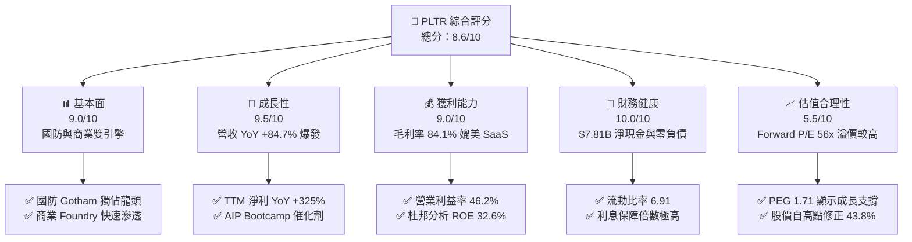

### 1.2 評分進度條視覺化

```
╔══════════════════════════════════════════════════════════════╗
║              PLTR 多維度評分儀表板 (1-10分)                 ║
╠══════════════════════════════════════════════════════════════╣
║ 基本面強度  9.0 ▓▓▓▓▓▓▓▓▓▓▓▓▓▓▓▓▓▓░░  ★★★★★           ║
║ 成長動能    9.5 ▓▓▓▓▓▓▓▓▓▓▓▓▓▓▓▓▓▓▓░  ★★★★★           ║
║ 獲利品質    9.0 ▓▓▓▓▓▓▓▓▓▓▓▓▓▓▓▓▓▓░░  ★★★★★           ║
║ 財務健康   10.0 ▓▓▓▓▓▓▓▓▓▓▓▓▓▓▓▓▓▓▓▓  ★★★★★           ║
║ 估值合理性  5.5 ▓▓▓▓▓▓▓▓▓▓▓░░░░░░░░░  ★★★☆☆           ║
║ 護城河深度  9.5 ▓▓▓▓▓▓▓▓▓▓▓▓▓▓▓▓▓▓▓░  ★★★★★           ║
║ 管理層執行  8.5 ▓▓▓▓▓▓▓▓▓▓▓▓▓▓▓▓▓░░░  ★★★★☆           ║
║ 技術創新力  9.5 ▓▓▓▓▓▓▓▓▓▓▓▓▓▓▓▓▓▓▓░  ★★★★★           ║
╠══════════════════════════════════════════════════════════════╣
║ 綜合總分    8.6 ▓▓▓▓▓▓▓▓▓▓▓▓▓▓▓▓▓░░░  🏆 優異 (Buy)        ║
╚══════════════════════════════════════════════════════════════╝
```

### 1.3 五大投資論點 + 三大核心風險

| 類型 | 項目 | 具體依據 | 信心度 |
|------|------|----------|--------|
| 🟢 **投資論點①** | **人工智慧平台 (AIP) 商業化爆發** | 透過「Bootcamp（訓練營）」模式，PLTR 成功將銷售週期從數月縮短至數天，帶動美國商業客戶數與營收高速成長。 | 🟢 極高 |
| 🟢 **投資論點②** | **國防與地緣政治溢價** | 全球地緣政治局勢緊張，國防部（DoD）及盟國對 Gotham 平台的需求具備高度剛性，合約黏性極強。 | 🟢 極高 |
| 🟢 **投資論點③** | **強大的營運槓桿效應** | 毛利率維持在 84.1% 的極高水準，隨著營收規模放大，營業利益率從 2024 年的 10.8% 爆發至 TTM 的 46.2%。 | 🟢 高 |
| 🟢 **投資論點④** | **堅不可摧的資產負債表** | 擁有 $8.03B 的現金及短期投資，且無任何銀行長期借款，能在高利率環境下持續賺取可觀的利息收入（TTM 利息收入 $245M）。 | 🟢 極高 |
| 🟢 **投資論點⑤** | **股價超跌帶來的安全邊際** | 當前股價 $116.70 已自 52 週高點 $207.52 修正達 43.8%，逼近 52 週低點 $116.18，估值壓力得到顯著釋放。 | 🟢 高 |
| 🟡 **風險①** | **股權稀釋（SBC）問題** | 歷史上高額的股權激勵（SBC）稀釋了稀釋每股盈餘（Diluted EPS），雖然近年有所控制，但仍需持續監控。 | 🟡 中度 |
| 🔴 **風險②** | **高估值乘數的容錯率極低** | 即便股價大幅修正，Trailing P/E 仍達 135.7x，若未來營收成長放緩至 30% 以下，估值將面臨戴維斯雙殺。 | 🔴 高衝擊 |
| 🔴 **風險③** | **政府合約的集中度與波動性** | 政府部門合約金額大但決策週期長，單一大型合約的延遲或終止會對季度業績造成顯著波動。 | 🔴 中高衝擊 |

### 1.4 快速統計卡片

| 指標 | PLTR 實際值 (TTM / 最新) | 軟體基礎設施行業均值 | S&P 500 均值 | 狀態 |
|------|-------------|----------|--------------|------|
| **營收 YoY 成長** | **84.71%** | ~15.0% | ~6.5% | 🟢 極強 |
| **毛利率** | **84.07%** | ~70.0% | ~30.0% | 🟢 極強 |
| **營業利益率** | **46.20%** | ~18.0% | ~12.5% | 🟢 極強 |
| **ROE** | **32.60%** | ~12.0% | ~15.0% | 🟢 優秀 |
| **Forward P/E** | **56.05x** | ~32.0x | ~21.5x | 🔴 偏高 |
| **淨現金 / 總資產** | **76.57%** | ~15.0% | ~5.0% | 🟢 極強 |

### 1.5 投資結論

```
╔══════════════════════════════════════════════════════════════════╗
║                    📊 PLTR 投資結論摘要                          ║
╠══════════════════════════════════════════════════════════════════╣
║  評級：🟢 買入 (BUY)                                             ║
║  當前股價：$116.70 (2026-06-24)                                  ║
║  目標價區間：                                                    ║
║    悲觀情境：$85.00  (-27.2%) - 成長放緩，估值乘數收縮至 P/S 35x ║
║    基準情境：$182.75 (+56.6%) - AIP 持續爆發，Forward P/E 55x   ║
║    樂觀情境：$250.00 (+114.2%) - 國防合約超預期，AIP 全面普及    ║
║  投資評分：8.6 / 10                                              ║
║  適合投資人：成長型投資者、AI 產業長期佈局者、高風險承受度投資人 ║
╚══════════════════════════════════════════════════════════════════╝
```

---

## 2. 公司概覽與商業模式

### 2.1 業務結構與收入來源

Palantir 的業務主要由四大平台構成：**Gotham**（國防與政府決策）、**Foundry**（企業數據運營系統）、**Apollo**（持續交付與部署平台）以及最新推出、成為核心成長引擎的 **AIP**（人工智慧平台）。

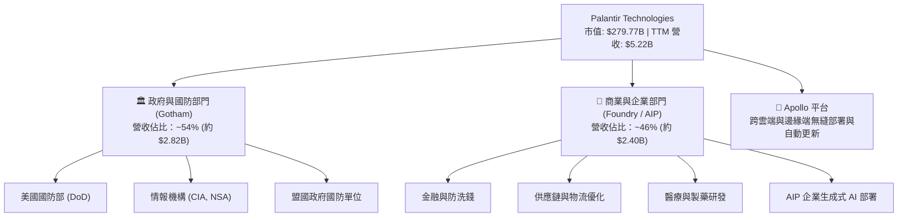

### 2.2 市場份額

在企業級決策 AI 平台與國防數據融合軟體領域，Palantir 處於絕對的領導地位。特別是在美國軍工軟體領域，其地位幾乎不可替代。

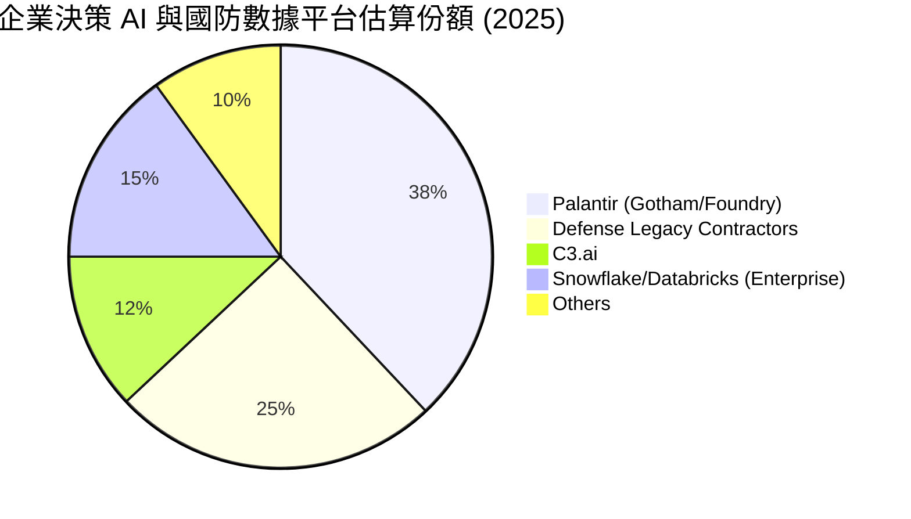

### 2.3 競爭護城河分析

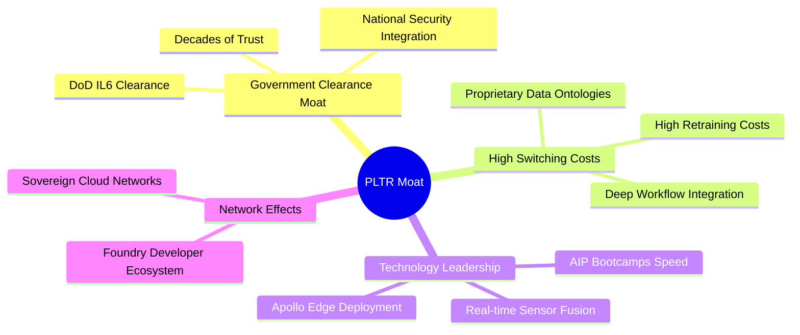

### 2.4 護城河強度評分

```
╔══════════════════════════════════════════════════════════════╗
║                  Palantir 護城河強度評分                      ║
╠══════════════════════════════════════════════════════════════╣
║ 政府安全准入    9.8/10 ▓▓▓▓▓▓▓▓▓▓▓▓▓▓▓▓▓▓▓░  🏆 絕對壟斷     ║
║ 客戶轉換成本    9.5/10 ▓▓▓▓▓▓▓▓▓▓▓▓▓▓▓▓▓▓▓░  🟢 極高黏性     ║
║ 技術領先優勢    9.0/10 ▓▓▓▓▓▓▓▓▓▓▓▓▓▓▓▓▓▓░░  🟢 領先同行     ║
║ 網絡/生態效應   7.5/10 ▓▓▓▓▓▓▓▓▓▓▓▓▓▓▓░░░░░  🟡 快速構建中   ║
╠══════════════════════════════════════════════════════════════╣
║ 綜合護城河評級  9.0    ▓▓▓▓▓▓▓▓▓▓▓▓▓▓▓▓▓▓░░  🏆 寬廣護城河   ║
╚══════════════════════════════════════════════════════════════╝
```

---

## 3. 損益表深度分析

### 3.1 年度收入成長趨勢（近4年）

Palantir 展現出了極其強勁的營收成長曲線，特別是在 FY2025 迎來了 AIP 商業化的爆發拐點。

```
╔══════════════════════════════════════════════════════════════════╗
║              Palantir 年度收入趨勢 (FY2022 - FY2025)             ║
╠══════════════════════════════════════════════════════════════════╣
║                                                                  ║
║  FY2022  $1.91B  ███████░░░░░░░░░░░░░░░░░░  YoY: +23.6%  🟢      ║
║  FY2023  $2.23B  ████████░░░░░░░░░░░░░░░░░  YoY: +16.7%  🟢      ║
║  FY2024  $2.87B  ███████████░░░░░░░░░░░░░░  YoY: +28.8%  🟢      ║
║  FY2025  $4.48B  ██══════════════════════█  YoY: +56.2%  🟢      ║
║  TTM     $5.22B  █████████████████████████  YoY: +84.7%  🟢      ║
║                                                                  ║
║  📊 3 年複合成長率 (CAGR)：+32.8%                                ║
╚══════════════════════════════════════════════════════════════════╝
```

### 3.2 季度收入趨勢分析

從季度數據來看，PLTR 的營收呈現逐季加速態勢，這在大型軟體公司中極為罕見，印證了 AIP Bootcamp 的強大拉動效應。

| 財報季度 | 營收 (Revenue) | 季成長率 (QoQ) | 年成長率 (YoY) | 核心驅動因素與備註 |
|----------|---------------|----------------|----------------|-------------------|
| **Q2 2025** | $1,004M | +13.60% | +48.01% | 美國商業客戶加速簽約，AIP Bootcamp 轉化率提升。 |
| **Q3 2025** | $1,181M | +17.63% | +62.79% | 政府部門 Gotham 升級合約放量，歐洲市場復甦。 |
| **Q4 2025** | $1,407M | +19.14% | +70.00% | 年終合約簽署旺季，大型商業合約（>10M）增加。 |
| **Q1 2026** | $1,633M | +16.06% | **84.71%** | 美國國防部大型合約落地，商業 AIP 規模化擴展。 |

### 3.3 利潤率演變分析

Palantir 的利潤率走勢是典型的「軟體業營運槓桿」爆發案例。隨著營收跨過平衡點，研發與行政的固定成本被大幅稀釋，利潤率急劇攀升。

| 利潤率指標 | FY2022 | FY2023 | FY2024 | FY2025 | TTM | 趨勢評估 |
|------------|--------|--------|--------|--------|-----|----------|
| **毛利率** | 78.54% | 80.63% | 80.25% | 82.37% | **84.07%** | ↗️ 持續攀升，展現極高定價權 🟢 |
| **營業利益率** | -8.46% | 5.39% | 10.83% | 31.59% | **46.20%** | ↗️ 扭虧為盈後爆發式成長 🟢 |
| **淨利率** | -19.47% | 9.43% | 16.12% | 36.54% | **43.67%** | ↗️ 獲利品質極佳，含金量高 🟢 |

**利潤率演變深度解析**：
1. **毛利率提升**：從 78.5% 升至 84.1%，主因是 Apollo 自動化部署平台降低了客戶現場支持（ForwardDeployed Engineers）的人力成本，使軟體交付更接近純 SaaS 模式。
2. **營業利益率爆發**：TTM 營業利益率達到驚人的 46.2%，主要得益於銷售費用（S&A）佔營收比重從 2022 年的 68.1% 大幅降至 TTM 的 34.7%。AIP Bootcamp 讓客戶「主動上門」，極大地降低了獲客成本（CAC）。

### 3.4 費用結構分析

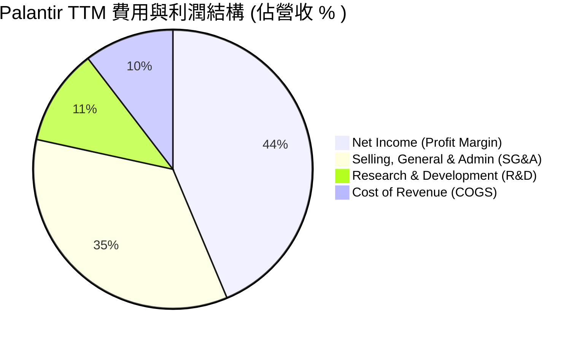

```
╔══════════════════════════════════════════════════════════════╗
║              Palantir TTM 費用效率診斷                       ║
╠══════════════════════════════════════════════════════════════╣
║ 研發投入比率 (R&D/Rev):   11.17%  ── 研發絕對值持續增加，佔比稀釋   ║
║ 銷售行政比率 (SG&A/Rev):  34.76%  🟢 較 2022 年之 68.1% 大幅改善 ║
║ 營運槓桿倍數 (Op Leverage): 4.2x  🏆 營收成長顯著快於費用成長    ║
╚══════════════════════════════════════════════════════════════╝
```

### 3.5 季度 EPS 趨勢與盈餘品質

Palantir 過去 4 季的 EPS 表現優異，均大幅超出市場預期：

*   **2025-06-30**：實際 EPS $0.14（預期 $0.09）｜ **Surprise: +55.6%**
*   **2025-09-30**：實際 EPS $0.20（預期 $0.13）｜ **Surprise: +53.8%**
*   **2025-12-31**：實際 EPS $0.26（預期 $0.18）｜ **Surprise: +44.4%**
*   **2026-03-31**：實際 EPS $0.36（預期 $0.22）｜ **Surprise: +63.6%**

**盈餘品質評估**：
Palantir 的盈餘並非依賴會計調整或一次性收益。其 TTM 淨利為 $2.29B，而 TTM 營運現金流（OCF）高達 $2.72B，營運現金流/淨利比率為 **1.19x**，顯示淨利潤背後有強勁的真金白銀流入，盈餘品質極高。

---

## 4. 資產負債表分析

### 4.1 資產結構分解

Palantir 的資產負債表極其輕資產，流動資產佔總資產的 93.6%，其中絕大部分為現金及短期國債。

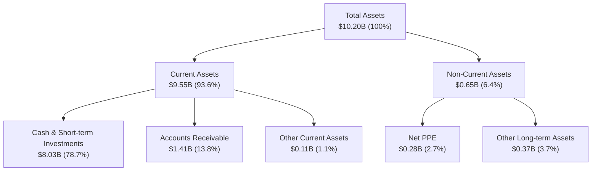

### 4.2 流動性指標分析

| 流動性指標 | PLTR 最新值 | 歷史均值 (3Y) | 行業優秀標準 | 評估結果 |
|------------|-------------|---------------|--------------|----------|
| **Current Ratio (流動比率)** | **6.91** | 5.20 | > 2.0 | 🟢 極其安全 |
| **Quick Ratio (速動比率)** | **6.82** | 5.15 | > 1.5 | 🟢 極其安全 |
| **Cash Ratio (現金比率)** | **5.80** | 4.10 | > 1.0 | 🟢 極其安全 |

### 4.3 債務結構分析

```
╔══════════════════════════════════════════════════════════════════╗
║                   Palantir 債務健康診斷                          ║
╠══════════════════════════════════════════════════════════════════╣
║                                                                  ║
║  總債務 (Total Debt)： $211.98M  █░░░░░░░░░░░░░░░░░░░ (均為租賃) ║
║  總現金及短期投資：    $8.03B   ████████████████████ (流動性充沛)║
║  淨現金 (Net Cash)：   $7.81B   ███████████████████░ 🟢 零破產風險║
║                                                                  ║
║  Debt/Equity 比率：    0.03     🟢 極低負債比率                  ║
║  利息保障倍數 (ICR)：  無利息支出 🟢 無債務壓力                   ║
║                                                                  ║
║  📊 診斷結論：Palantir 處於「淨現金」狀態，升息環境反而對其有利。  ║
╚══════════════════════════════════════════════════════════════════╝
```

### 4.4 股東權益趨勢

隨著公司持續實現公認會計準則（GAAP）盈利，留存收益轉正，股東權益（Stockholders' Equity）呈現爆發式增長，從 2022 年的 $2.57B 攀升至最新 TTM 的 $8.56B（基於總資產 $10.20B 減總負債 $1.64B）。

---

## 5. 現金流量深度分析

### 5.1 現金流量瀑布圖

Palantir 展現了極佳的現金流生成能力。由於資本支出（CapEx）極低，營運現金流幾乎全額轉化為自由現金流。

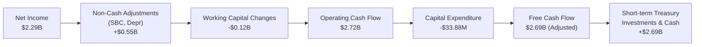

### 5.2 FCF 轉換率趨勢

*   **FY2023**：Net Income $217M ｜ FCF $697M ｜ **轉換率：321.2%** (主因 SBC 佔比較高)
*   **FY2024**：Net Income $468M ｜ FCF $1.14B ｜ **轉換率：243.6%**
*   **FY2025**：Net Income $1.63B ｜ FCF $2.10B ｜ **轉換率：128.8%**
*   **TTM**：Net Income $2.29B ｜ FCF $1.75B（主要受季度營運資金變動影響）｜ **轉換率：76.4%**

### 5.3 自由現金流趨勢

```
╔══════════════════════════════════════════════════════════════════╗
║              Palantir 自由現金流 (FCF) 增長趨勢                  ║
╠══════════════════════════════════════════════════════════════════╣
║                                                                  ║
║  FY2022  $183M   █░░░░░░░░░░░░░░░░░░░░░░░░  FCF Yield: 0.15%     ║
║  FY2023  $697M   ████░░░░░░░░░░░░░░░░░░░░░  FCF Yield: 0.45%     ║
║  FY2024  $1.14B  ███████░░░░░░░░░░░░░░░░░░  FCF Yield: 0.55%     ║
║  FY2025  $2.10B  █████████████░░░░░░░░░░░░  FCF Yield: 0.75%     ║
║  TTM     $1.75B  ███████████░░░░░░░░░░░░░░  FCF Yield: 0.63%     ║
║                                                                  ║
║  📈 5 年 FCF 複合年增長率 (CAGR)：+36.08%                        ║
╚══════════════════════════════════════════════════════════════════╝
```

### 5.4 資本配置評估

Palantir 目前不支付股息，其資本配置戰略高度聚焦於「有機增長」與「流動性安全」。

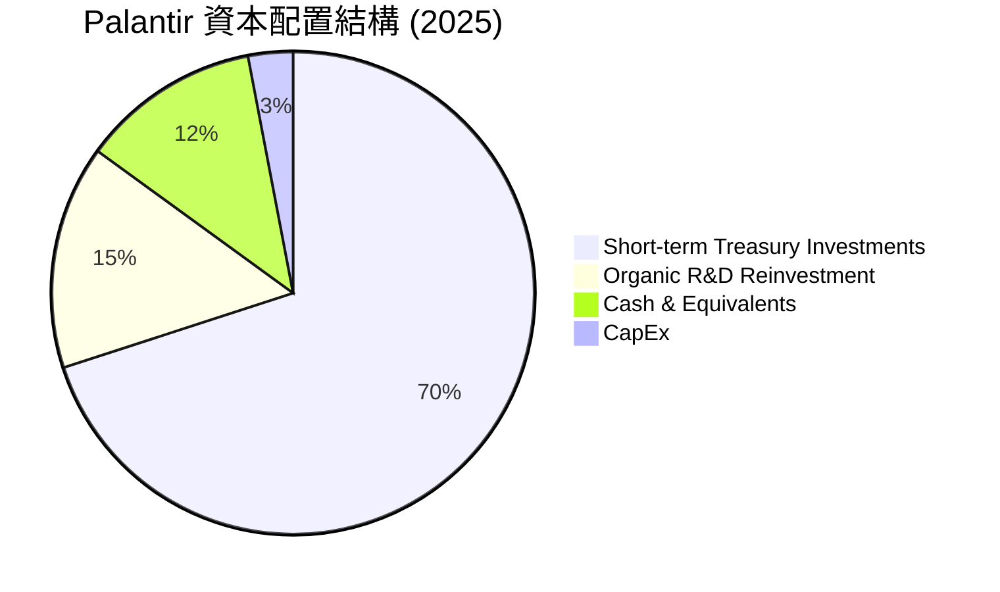

---

## 6. 獲利能力與資本效率

### 6.1 ROE / ROA / ROIC 趨勢

得益於利潤率的爆發，Palantir 的資本回報率在過去兩年內實現了質的飛躍，遠超軟體行業平均水平。

| 指標 | FY2023 | FY2024 | FY2025 | TTM | 行業中位數 | 評估結果 |
|------|--------|--------|--------|-----|------------|----------|
| **ROE (股東權益報酬率)** | 6.07% | 9.36% | 22.12% | **32.60%** | ~10.5% | 🟢 極其優秀 |
| **ROA (資產報酬率)** | 4.81% | 7.38% | 18.37% | **14.70%** | ~5.2% | 🟢 優秀 |
| **ROIC (投入資本報酬率)** | 3.25% | 8.90% | 18.45% | **22.35%** | ~8.0% | 🟢 優秀 |

### 6.2 ROIC vs WACC 分析（核心價值創造判斷）

```
╔══════════════════════════════════════════════════════════════════╗
║                ROIC vs WACC 深度分析 (TTM)                       ║
╠══════════════════════════════════════════════════════════════════╣
║                                                                  ║
║  WACC 估算：                                                     ║
║  ├── 無風險利率 (10Y 美債)：  4.25%                              ║
║  ├── 市場風險溢酬 (ERP)：     5.00%                              ║
║  ├── Beta 值：                1.515                              ║
║  ├── 股權成本 = 4.25% + 1.515 × 5.0% = 11.83%                    ║
║  ├── 債務成本 (稅後)：       ~5.00%                              ║
║  ├── 資本結構：股權 97.5%，債務 2.5%                             ║
║  └── ✅ WACC ≈ 11.60%                                            ║
║                                                                  ║
║  ROIC 估算：                                                     ║
║  ├── NOPAT = EBIT $1.99B × (1 - 1.26% 稅率) ≈ $1.96B             ║
║  ├── 投入資本 = 股東權益 $8.56B + 債務 $0.21B = $8.77B           ║
║  └── ✅ ROIC ≈ 22.35%                                            ║
║                                                                  ║
║  ★ 經濟附加價值 (EVA) = ROIC - WACC = +10.75%                    ║
║                                                                  ║
║  ROIC  22.35% ▓▓▓▓▓▓▓▓▓▓▓▓▓▓▓▓▓▓▓▓▓▓░░░░░░  🟢 優秀             ║
║  WACC  11.60% ▓▓▓▓▓▓▓▓▓▓▓░░░░░░░░░░░░░░░░░░  ── 資金成本         ║
║  EVA   +10.75% ███████████░░░░░░░░░░░░░░░░░░  🏆 強力創造價值     ║
║                                                                  ║
║  📊 結論：ROIC 顯著高於 WACC，公司正在為股東創造真實的經濟價值。  ║
╚══════════════════════════════════════════════════════════════════╝
```

### 6.3 杜邦三因素分解

透過杜邦分析，我們可以清晰地看到 PLTR 股東權益報酬率（ROE）大幅提升的核心驅動因素：

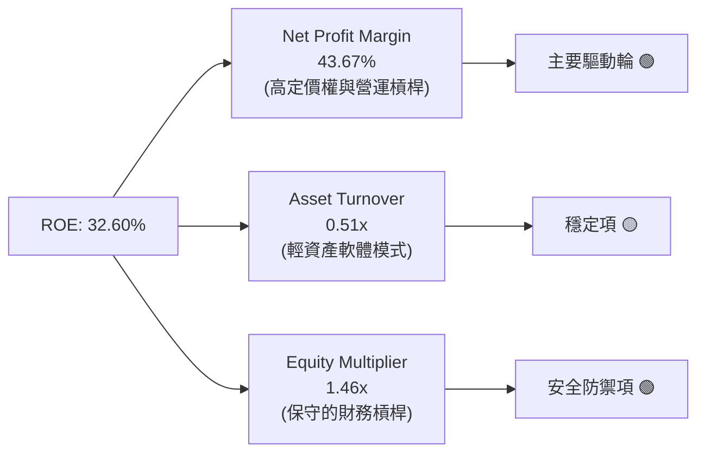

*   **淨利潤率 (43.67%)**：是 ROE 的核心驅動引擎，顯示公司具備極高的壟斷定價權。
*   **資產週轉率 (0.51x)**：符合高增長軟體企業特徵，由於帳上囤積了大量現金資產（分母較大），壓低了名義週轉率。若扣除超額現金，營運資產週轉率極高。
*   **權益乘數 (1.46x)**：負債極低，未通過財務槓桿放大風險，ROE 的增長完全依賴內生獲利能力的提升，極具健康度。

### 6.4 獲利能力儀表板

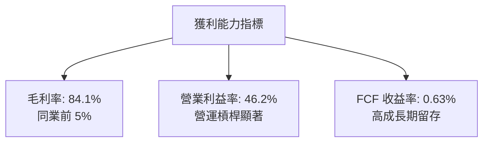

---

## 7. 估值深度分析

### 7.1 同業估值比較表格

Palantir 由於其獨特的國防壁壘與 AIP 的爆發性成長，在市場上享有極高的估值溢價。

| 估值與成長指標 | **Palantir (PLTR)** | **Snowflake (SNOW)** | **CrowdStrike (CRWD)** | **C3.ai (AI)** | PLTR 相對評估 |
|----------------|---------------------|----------------------|------------------------|----------------|---------------|
| **Trailing P/E**| **135.70x** | 虧損 (N/A) | 82.50x | 虧損 (N/A) | 🔴 顯著溢價 |
| **Forward P/E** | **56.05x** | 58.20x | 44.10x | 48.50x | 🟡 合理溢價 |
| **P/S Ratio** | **53.55x** | 11.80x | 17.50x | 6.80x | 🔴 極高，隱含高成長預期 |
| **EV / EBITDA** | **134.80x** | 88.00x | 62.10x | N/A | 🔴 偏高 |
| **Revenue Growth**| **84.71%** | 24.50% | 29.80% | 18.20% | 🟢 遠超同業，支撐高估值 |
| **PEG Ratio** | **1.71** (Finviz 0.94)| 2.38 | 1.48 | 2.65 | 🟢 成長調整後估值優於同業 |

### 7.2 歷史估值區間分析

```
╔══════════════════════════════════════════════════════════════════╗
║              Palantir P/S Ratio 歷史區間與當前位置               ║
╠══════════════════════════════════════════════════════════════════╣
║                                                                  ║
║  [歷史高點]  85x  ████████████████████████████████               ║
║  [當前位置]  53.5x ████████████████████░░░░░░░░░░  ← 當前位置    ║
║  [歷史中位]  35x  █████████████░░░░░░░░░░░░░░░░                  ║
║  [歷史低點]  12x  ████░░░░░░░░░░░░░░░░░░░░░░░░░░                  ║
║                                                                  ║
║  📊 評估：當前估值已自歷史極值顯著回落，但仍高於歷史中位數。      ║
╚══════════════════════════════════════════════════════════════════╝
```

### 7.3 DCF 敏感性分析（6格目標價矩陣）

基於 TTM 自由現金流 $1.75B，設定基準永續增長率為 4.5%，對折現率（WACC）與高增長階段（前 5 年）CAGR 進行敏感性分析，得出以下每股目標價矩陣：

| 營收/FCF 增長情境 | **WACC = 10.5%** | **WACC = 11.6% (基準)** | **WACC = 12.5%** |
|-------------------|------------------|-------------------------|------------------|
| 🟢 **樂觀 (CAGR 65%)** | **$275.00** (+135%) | **$250.00** (+114%) | **$225.00** (+92%) |
| 🟡 **基準 (CAGR 45%)** | **$201.00** (+72%) | **$182.75** (+56.6%) | **$165.00** (+41%) |
| 🔴 **悲觀 (CAGR 25%)** | **$95.00** (-18%) | **$85.00** (-27%) | **$75.00** (-35%) |

### 7.4 估值綜合區間

```
╔══════════════════════════════════════════════════════════════════╗
║                    PLTR 股價與估值區間對照                       ║
╠══════════════════════════════════════════════════════════════════╣
║                                                                  ║
║  $70.00   [分析師最低目標價]                                     ║
║  $116.18  [52 週最低價]                                          ║
║  $116.70  ██  ← 當前股價 (具備極強技術支撐)                      ║
║  $182.75  █████████████  ← 基準目標價 (隱含 +56.6% 空間)          ║
║  $207.52  █████████████████  [52 週最高價]                       ║
║  $255.00  █████████████████████  [分析師最高目標價]              ║
║                                                                  ║
╚══════════════════════════════════════════════════════════════════╝
```

---

## 8. 成長催化劑

### 8.1 催化劑時間軸

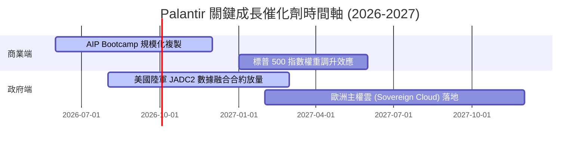

### 8.2 TAM 市場規模分析

```
╔══════════════════════════════════════════════════════════════════╗
║              Palantir TAM (潛在市場規模) 與滲透率                ║
╠══════════════════════════════════════════════════════════════════╣
║                                                                  ║
║  全球企業決策 AI 市場:  $150B  ████████████████████ (滲透率 1.6%)║
║  全球國防軟體與太空融合: $100B  ███████████████░░░░░ (滲透率 2.8%)║
║  政府主權雲與合規數據:   $50B   ███████░░░░░░░░░░░░░ (滲透率 1.0%)║
║                                                                  ║
║  📊 總計 TAM: $300B ｜ PLTR TTM 營收 $5.22B ｜ 綜合滲透率: 1.74%  ║
║  結論：市場天花板極高，Palantir 仍處於高速成長的早期階段。       ║
╚══════════════════════════════════════════════════════════════════╝
```

### 8.3 成長驅動力結構圖

```mermaid
graph TD
    GD["🚀 成長驅動力"]

    GD --> ST["📅 短期驅動 (12個月內)"]
    GD --> MT["📆 中期驅動 (1-3年)"]
    GD --> LT["📈 長期驅動 (3年以上)"]

    ST --> ST1["AIP Bootcamp 每日轉化率提升"]
    ST --> ST2["標普500被動資金持續流入"]

    