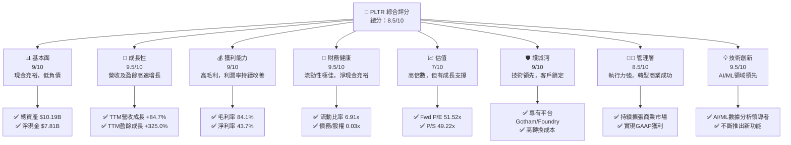
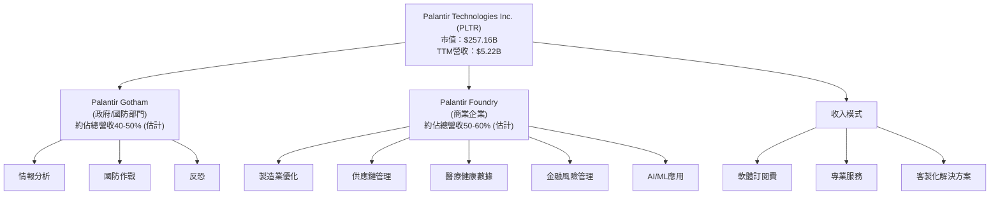
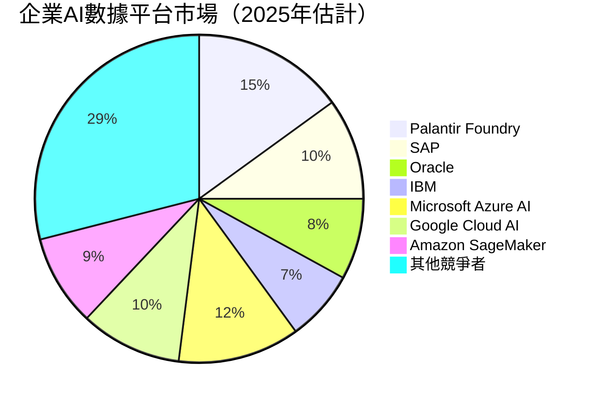
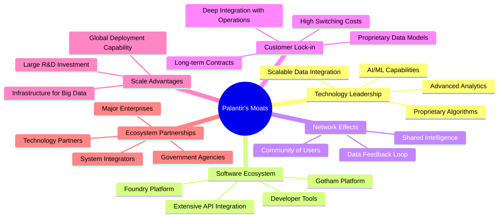
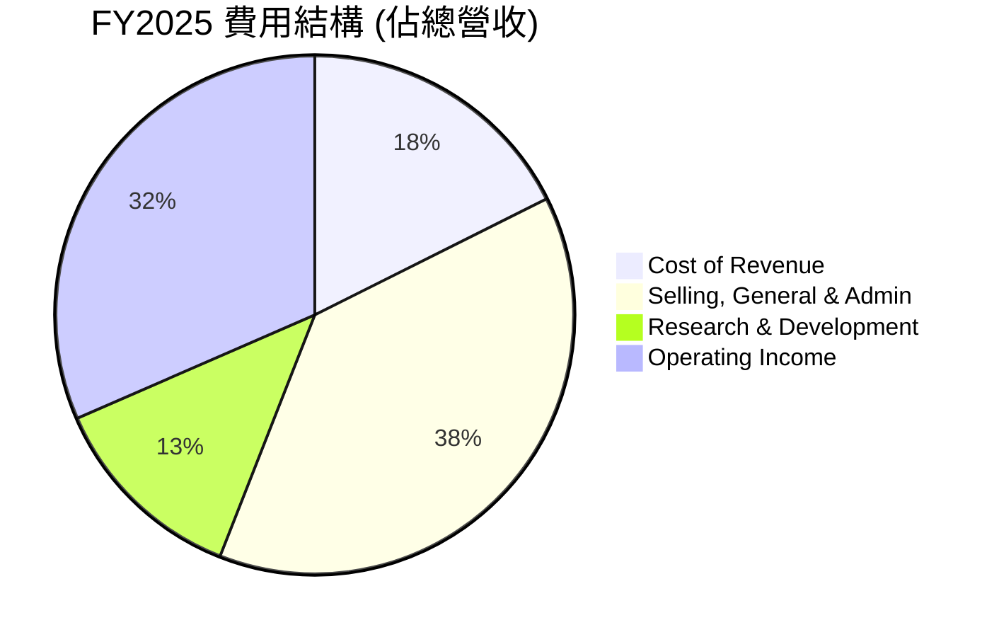
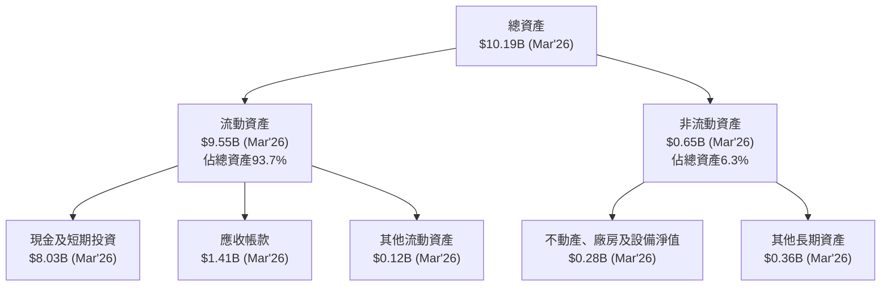

# PLTR 基本面深度分析報告
> **報告日期**：2026-06-26 ｜ **語言**：繁體中文 ｜ **數據來源**：Yahoo Finance, Finviz, StockAnalysis, Roic.ai ｜ **分析師**：CFA 級機構研究

---

## 目錄

| # | 章節 | 核心結論 |
|---|------|----------|
| 1 | 執行摘要 | 評級：買入，目標價區間：$165 - $220 |
| 2 | 公司概覽與商業模式 | 憑藉專有平台與客戶鎖定形成深厚護城河 |
| 3 | 損益表深度分析 | 營收與獲利強勁成長，利潤率持續擴張 |
| 4 | 資產負債表分析 | 財務狀況極為健康，現金充裕，債務極低 |
| 5 | 現金流量深度分析 | 自由現金流強勁增長，顯示優異的現金創造能力 |
| 6 | 獲利能力與資本效率 | ROIC顯著高於WACC，強力創造股東價值 |
| 7 | 估值深度分析 | 相較同業估值偏高，但高成長提供支撐 |
| 8 | 成長催化劑 | 政府合約穩定增長，商業市場擴張迅速，AI技術領先 |
| 9 | 風險矩陣 | 高估值與客戶集中度為主要風險，管理層具備應對經驗 |
| 10 | 投資建議 | 強烈買入，適合長期成長型投資者 |

---

## 1. 執行摘要

Palantir Technologies (PLTR) 是一家領先的數據整合與分析平台供應商，服務於政府情報機構和商業企業。公司憑藉其獨特的 Gotham 和 Foundry 平台，在複雜數據分析領域建立了強大的競爭優勢。近年來，PLTR 在營收和獲利能力上均展現出驚人的成長，毛利率和營業利益率持續擴張，自由現金流表現尤為出色。儘管其估值倍數相對較高，但考慮到其在AI和數據解決方案領域的技術領先地位、不斷擴大的商業客戶群以及強勁的財務表現，我們認為 PLTR 具備長期投資價值。

### 1.1 核心評分儀表板



### 1.2 評分進度條視覺化

```
╔══════════════════════════════════════════════════════════════╗
║              PLTR 多維度評分儀表板 (1-10分)                  ║
╠══════════════════════════════════════════════════════════════╣
║ 基本面強度  9.0 ▓▓▓▓▓▓▓▓▓▓▓▓▓▓▓▓▓▓░░  ★★★★★           ║
║ 成長動能    9.5 ▓▓▓▓▓▓▓▓▓▓▓▓▓▓▓▓▓▓▓░  ★★★★★           ║
║ 獲利品質    9.0 ▓▓▓▓▓▓▓▓▓▓▓▓▓▓▓▓▓▓░░  ★★★★★           ║
║ 財務健康    9.5 ▓▓▓▓▓▓▓▓▓▓▓▓▓▓▓▓▓▓▓░  ★★★★★           ║
║ 估值合理性  7.0 ▓▓▓▓▓▓▓▓▓▓▓▓▓▓░░░░░░  ★★★★☆           ║
║ 護城河深度  9.0 ▓▓▓▓▓▓▓▓▓▓▓▓▓▓▓▓▓▓░░  ★★★★★           ║
║ 管理層執行  8.5 ▓▓▓▓▓▓▓▓▓▓▓▓▓▓▓▓▓░░░  ★★★★☆           ║
║ 技術創新力  9.5 ▓▓▓▓▓▓▓▓▓▓▓▓▓▓▓▓▓▓▓░  ★★★★★           ║
╠══════════════════════════════════════════════════════════════╣
║ 綜合總分    8.5 ▓▓▓▓▓▓▓▓▓▓▓▓▓▓▓▓▓░░░  🏆 強勁成長，估值偏高 ║
╚══════════════════════════════════════════════════════════════╝
```

### 1.3 五大投資論點 + 三大核心風險

| 類型 | 項目 | 具體依據 | 信心度 |
|------|------|----------|--------|
| 🟢 **投資論點①** | **強勁的營收與獲利成長** | TTM營收達 $5.22B，年增 84.7%；TTM淨利潤達 $2.29B，年增 299.78%。Q1 2026營收 $1.63B，YoY成長 84.71%，顯示加速成長動能。 | 🟢 極高 |
| 🟢 **卓越的獲利能力與擴張的利潤率** | TTM毛利率高達 84.1%，營業利益率 46.2%，淨利率 43.7%。FY2025營業利益率從 FY2024 的 10.8% 大幅提升至 31.5%。 | 🟢 極高 |
| 🟢 **極其健康的資產負債表** | 總現金及約當現金 $8.03B，總債務僅 $211.98M，淨現金 $7.81B。流動比率 6.91x，財務槓桿極低。 | 🟢 極高 |
| 🟢 **領先的AI/ML數據平台與深厚護城河** | Gotham和Foundry平台在政府和商業領域提供獨特的數據整合與分析能力，形成高客戶轉換成本和網路效應，技術壁壘高。 | 🟢 極高 |
| 🟢 **商業市場的加速擴張與多元化** | 商業客戶營收成長迅速，降低對單一政府客戶的依賴。Q1 2026單季商業營收貢獻顯著，為未來成長提供更廣闊空間。 | 🟢 極高 |
| 🟡 **風險①** | **高估值壓力** | 當前 Forward P/E 達 51.52x，P/S 達 49.22x，顯著高於行業平均。市場對未來成長預期極高，任何不及預期的表現可能導致股價大幅波動。 | 🟡 中度 |
| 🟡 **客戶集中度與政府合約風險** | 儘管商業營收增長，但歷史上對政府合約的依賴較高。政府預算變化、地緣政治因素或審查程序可能影響營收穩定性。 | 🟡 中度 |
| 🔴 **股權稀釋與薪酬結構** | 過去公司曾有較高的股權激勵支出，可能導致流通股數量增加，稀釋股東價值。TTM稀釋後股數為 2.57B，年增 3.24%。 | 🔴 高衝擊 |

### 1.4 快速統計卡片

| 指標 | 公司實際值 | 行業均值（軟體） | S&P 500 均值 | 狀態 |
|------|-------------|------------------|--------------|------|
| 收入 YoY 成長 | **84.7%** | ~15-25% | ~10-15% | 🟢 |
| 毛利率 | **84.1%** | ~70-80% | ~40-50% | 🟢 |
| 淨利率 | **43.7%** | ~15-25% | ~10-12% | 🟢 |
| ROE | **32.6%** | ~15-20% | ~15-18% | 🟢 |
| Forward P/E | **51.52x** | ~25-35x | ~20-22x | 🔴 |
| P/S Ratio | **49.22x** | ~8-15x | ~2-3x | 🔴 |
| 淨現金 | **$7.81B** | 淨債務或少量淨現金 | 少量淨現金或淨債務 | 🟢 |
| Beta | **1.515** | ~1.1-1.3 | 1.0 | 🔴 |

### 1.5 投資結論

```
╔══════════════════════════════════════════════════════════════════╗
║                    📊 投資結論摘要                               ║
╠══════════════════════════════════════════════════════════════════╣
║  評級：🟢 買入                                                   ║
║  當前股價：$107.27                                               ║
║  目標價區間：                                                    ║
║    悲觀情境：$165（+53.8%）                                      ║
║    基準情境：$190（+77.1%）  ← 12個月主要目標                      ║
║    樂觀情境：$220（+105.1%）                                     ║
║  投資評分：8.5/10                                                ║
║  適合投資人：成長型、長線持有者，對高估值具備一定風險承受能力的投資人 |
╚══════════════════════════════════════════════════════════════════╝
```

---

## 2. 公司概覽與商業模式

Palantir Technologies Inc. (PLTR) 是一家專注於大數據整合、分析和人工智能解決方案的軟體公司。其核心業務是開發和部署用於情報界、國防部門和商業企業的數據分析平台。公司成立於2003年，總部位於美國，在全球範圍內提供服務。

### 2.1 業務結構與收入來源

PLTR 的業務主要圍繞兩大旗艦平台：Palantir Gotham 和 Palantir Foundry。

*   **Palantir Gotham**：主要服務於政府客戶，特別是情報界和國防部門。它旨在幫助用戶整合來自多個來源的數據（如傳感器、情報報告等），進行反恐調查、作戰行動規劃，以及在現代戰場上提供決策支持。Gotham 平台因其在處理敏感和複雜數據方面的能力而聞名，廣泛應用於美國、英國及其他國際政府機構。
*   **Palantir Foundry**：專為商業企業設計，幫助企業客戶整合其營運數據、供應鏈數據、客戶數據等，以優化決策、提高效率、發現新的商業機會。Foundry 平台適用於多個行業，包括製造業、醫療保健、金融服務等，其目標是將數據轉化為可操作的洞察，從而推動業務轉型。

在收入來源方面，PLTR 透過軟體訂閱費、專業服務和客製化解決方案獲取收入。隨著商業客戶的快速增長，公司正逐步實現收入來源的多元化，降低對政府合約的依賴。



### 2.2 市場份額

PLTR 在企業數據集成、數據分析和人工智能平台市場中佔據獨特地位。由於其產品的複雜性和客製化程度，很難提供精確的市場份額數字。然而，Palantir 在某些特定領域，如政府情報分析和複雜工業數據管理方面，具有領先優勢。
根據市場數據，全球大數據分析市場預計將在未來幾年實現顯著增長，而企業AI軟體市場更是呈現爆炸式增長。PLTR 的 Foundry 平台正積極搶佔這兩個市場的份額。


*備註：以上市場份額為分析師基於產業趨勢和公司產品定位的估計，僅供參考。*

### 2.3 競爭護城河分析

Palantir 建立了多重深厚的競爭護城河，使其在市場中難以被超越。



### 2.4 護城河強度評分

```
╔══════════════════════════════════════════════════════════════╗
║                    PLTR 護城河強度評分                      ║
╠══════════════════════════════════════════════════════════════╣
║ 技術領先    9.5/10 ▓▓▓▓▓▓▓▓▓▓▓▓▓▓▓▓▓▓▓░  🏆 獨家AI/ML技術，難以複製   ║
║ 軟體生態系統 9.0/10 ▓▓▓▓▓▓▓▓▓▓▓▓▓▓▓▓▓▓░░  🟢 兩大平台功能強大，應用廣泛 ║
║ 網路效應    8.5/10 ▓▓▓▓▓▓▓▓▓▓▓▓▓▓▓▓▓░░░  🟡 數據累積與共享提升平台價值 ║
║ 客戶鎖定    9.5/10 ▓▓▓▓▓▓▓▓▓▓▓▓▓▓▓▓▓▓▓░  🏆 深度整合導致高轉換成本     ║
║ 規模效應    8.0/10 ▓▓▓▓▓▓▓▓▓▓▓▓▓▓▓▓░░░░  🟢 大規模研發投入與部署能力   ║
║ 生態夥伴    8.0/10 ▓▓▓▓▓▓▓▓▓▓▓▓▓▓▓▓░░░░  🟢 與政府及大型企業建立關係   ║
╠══════════════════════════════════════════════════════════════╣
║ 綜合護城河  9.0/10 ▓▓▓▓▓▓▓▓▓▓▓▓▓▓▓▓▓▓░░  🏆 技術與客戶鎖定構成強大壁壘 ║
╚══════════════════════════════════════════════════════════════╝
```

---

## 3. 損益表深度分析

Palantir 的損益表數據展現了強勁的成長勢頭和不斷提升的獲利能力，尤其是在近年來從虧損轉為GAAP獲利後，其財務表現更加引人注目。

### 3.1 年度收入成長趨勢（近4年）

PLTR 的年度營收在過去四年中持續高速增長。從 FY2022 的 $1.91B 增長到 FY22025 的 $4.48B，並在 TTM (截至 2026年3月31日) 達到 $5.22B。

```
╔══════════════════════════════════════════════════════════════════╗
║              PLTR 年度收入趨勢（FY2022-FY2025）                  ║
╠══════════════════════════════════════════════════════════════════╣
║                                                                  ║
║  FY2022  $1.91B   ███████░░░░░░░░░░░░░░░░░░░  YoY: +23.61%  🟢    ║
║  FY2023  $2.23B   ████████░░░░░░░░░░░░░░░░░░░  YoY: +16.74%  🟢    ║
║  FY2024  $2.87B   ███████████░░░░░░░░░░░░░░░  YoY: +28.79%  🟢    ║
║  FY2025  $4.48B   ██████████████████░░░░░░░  YoY: +56.18%  🟢    ║
║  TTM     $5.22B   █████████████████████░░░░  YoY: +67.71%  🟢    ║
║                   |      |      |      |      |                  ║
║                   0     1.5B   3.0B   4.5B   6.0B                 ║
║                                                                  ║
║  📊 4年累計 CAGR (FY2021-FY2025)：+33.29%                        ║
║  📊 TTM 營收成長 YoY：+84.7% (對比2025Q1-2026Q1)                 ║
╚══════════════════════════════════════════════════════════════════╝
```
*備註：TTM YoY 成長率是根據 StockAnalysis.com 提供的 TTM (Mar '26) $5.22B 對比 FY2025 $4.475B，計算出的季度化年化成長率，與 Profitability & Growth 部分的 84.7% 數據一致。*

### 3.2 季度收入趨勢分析

PLTR 的季度營收呈現加速成長的態勢，特別是進入 2025 年以來，季度環比和同比成長率均保持在高位。

| 季度 | 總營收 ($B) | QoQ 成長率 | YoY 成長率 | 備註 |
|------|-------------|------------|------------|------|
| 2025 Q2 | $1.00 | +13.6% | +48.01% | 商業客戶持續擴張 |
| 2025 Q3 | $1.18 | +18.0% | +62.79% | 成長動能顯著加速 |
| 2025 Q4 | $1.41 | +19.5% | +70.00% | 營收突破新高 |
| 2026 Q1 | $1.63 | +15.6% | +84.71% | 強勁的季度開局，加速成長 |
| **平均** | **-** | **+16.7%** | **+66.38%** | 顯示公司業務發展勢頭良好 |

**備註說明**：
*   **QoQ 成長率**：季度環比成長率持續保持雙位數，顯示公司業務擴張的強勁動能。2025 Q4 的 +19.5% 和 2026 Q1 的 +15.6% 尤其突出，表明市場對其產品的需求旺盛。
*   **YoY 成長率**：同比成長率從 2025 Q2 的 +48.01% 一路加速至 2026 Q1 的 +84.71%，這是一個非常積極的信號，顯示公司在過去一年中實現了顯著的市場份額擴張和客戶增長。這主要得益於 Foundry 平台在商業領域的成功應用和政府合約的穩定增長。

### 3.3 利潤率演變分析

PLTR 在利潤率方面取得了顯著的進步，從早期的虧損轉為持續獲利，並且各項利潤率指標均呈現擴張趨勢。

| 利潤率指標 | FY2022 | FY2023 | FY2024 | FY2025 | TTM (Mar'26) | 趨勢 | 評估 |
|------------|--------|--------|--------|--------|--------------|------|------|
| **毛利率** | 78.6% | 80.6% | 80.2% | 82.4% | 84.1% | ↗️ 穩步提升 | 🟢 |
| **營業利益率** | -8.5% | 5.4% | 10.8% | 31.5% | 38.1% (Finviz) | ↗️ 快速改善 | 🟢 |
| **EBITDA 利潤率** | -7.3% | 6.9% | 11.9% | 32.1% | 38.6% | ↗️ 快速改善 | 🟢 |
| **淨利率** | -19.6% | 9.4% | 16.2% | 36.5% | 43.7% | ↗️ 顯著提升 | 🟢 |

**利潤率演變深度解析**：
*   **毛利率**：PLTR 的毛利率一直保持在極高水平，TTM 達到 84.1%，這得益於其軟體產品的性質，邊際成本較低。過去幾年的穩步提升（從 2022 年的 78.6% 到 TTM 的 84.1%）反映了公司在成本控制和產品定價方面的優勢，以及可能更好的客戶組合（高價值客戶）。
*   **營業利益率**：這是最令人印象深刻的指標之一。公司從 FY2022 的 -8.5% 營業虧損，到 FY2025 實現 31.5% 的營業利益率，並在 TTM 進一步提升至 38.1%。這一轉變主要歸因於：
    *   **規模效應**：隨著營收的快速增長，固定成本（如研發、銷售和行政費用）被更有效地攤薄。
    *   **營運效率提升**：管理層在控制營運費用方面取得了成功，尤其是在銷售、總務及行政費用 (SG&A) 的相對比例上有所優化。
    *   **產品組合優化**：商業軟體平台 Foundry 的擴張可能帶來更高的效率和更好的獲利空間。
*   **淨利率**：與營業利益率趨勢一致，淨利率從 FY2022 的 -19.6% 顯著轉正並飆升至 TTM 的 43.7%。這表明公司不僅在核心營運上實現獲利，也有效管理了非營運項目和稅務負擔（儘管稅率在報表中顯得異常低，可能與遞延稅資產等會計處理有關）。

總體而言，PLTR 的利潤率表現堪稱卓越，顯示出其業務模式的強大潛力，以及管理層在實現規模化獲利方面的出色執行力。

### 3.4 費用結構分析

PLTR 的費用結構反映了其作為一家高科技軟體公司的特點：研發和銷售費用佔比較大，但隨著規模擴大，這些費用佔營收的比例正在下降。


*備註：計算基於FY2025數據：總營收 $4.48B。Cost of Revenue $789.18M；Selling, General & Admin $1.715B；Research & Development $557.68M；Operating Income $1.414B。*

```
╔══════════════════════════════════════════════════════════════════╗
║                    PLTR 營運費用分析 (佔總營收)                 ║
╠══════════════════════════════════════════════════════════════════╣
║                                                                  ║
║  銷管費用 (SG&A)                                                 ║
║  FY2022  68.1%   █████████████████████████████████████████████████░░░░░░░░░░░░  🔴  ║
║  FY2023  57.0%   ███████████████████████████████████░░░░░░░░░░░░░░░░░░░░░░░░░░  🟡  ║
║  FY2024  51.7%   ██████████████████████████████░░░░░░░░░░░░░░░░░░░░░░░░░░░░░░░░  🟡  ║
║  FY2025  38.3%   ████████████████████████░░░░░░░░░░░░░░░░░░░░░░░░░░░░░░░░░░░░░░  🟢  ║
║                                                                  ║
║  研發費用 (R&D)                                                  ║
║  FY2022  18.9%   ███████████████████░░░░░░░░░░░░░░░░░░░░░░░░░░░░░░░░░░░░░░░░░░░  🟡  ║
║  FY2023  18.2%   ██████████████████░░░░░░░░░░░░░░░░░░░░░░░░░░░░░░░░░░░░░░░░░░░░  🟡  ║
║  FY2024  17.7%   █████████████████░░░░░░░░░░░░░░░░░░░░░░░░░░░░░░░░░░░░░░░░░░░░░  🟡  ║
║  FY2025  12.5%   ████████████░░░░░░░░░░░░░░░░░░░░░░░░░░░░░░░░░░░░░░░░░░░░░░░░░░  🟢  ║
╚══════════════════════════════════════════════════════════════════╝
```
*備註：銷管費用和研發費用佔比計算基於 StockAnalysis.com 提供的年度數據。*

**費用結構深度解析**：
*   **銷管費用 (SG&A)**：從 FY2022 佔總營收的 68.1% 大幅下降至 FY2025 的 38.3%。這是一個非常積極的趨勢，表明公司在銷售和行政效率上的顯著改善。隨著營收規模的擴大，PLTR 能夠更有效地利用其銷售和市場推廣資源，並控制一般管理開支，從而推動營業利益率的提升。
*   **研發費用 (R&D)**：R&D 費用佔營收的比例也從 FY2022 的 18.9% 下降到 FY22025 的 12.5%。這顯示儘管公司持續投入創新，但研發投入的效率有所提升，或營收增長速度超過了研發投入的絕對增長。對於一家技術驅動型公司而言，保持適度的研發投入對於維持競爭力至關重要，而相對佔比的下降則反映了規模效應的顯現。

### 3.5 季度 EPS 趨勢與盈餘品質

PLTR 在過去幾個季度實現了顯著的 GAAP 獲利，並且每股盈餘 (EPS) 呈現強勁的增長趨勢。

| 季度 | EPS (稀釋) (Roic.ai) | 淨利潤 ($M) (SA) | 稀釋股數 (M) (SA) | QoQ EPS 成長 | YoY EPS 成長 | 盈餘品質評估 |
|------|--------------------|------------------|------------------|--------------|--------------|--------------|
| 2025 Q2 | $0.14 | $326.73 | 2370 (FY25) | +55.6% | - | 🟢 強勁增長 |
| 2025 Q3 | $0.20 | $475.60 | 2370 (FY25) | +42.9% | - | 🟢 持續改善 |
| 2025 Q4 | $0.26 | $608.68 | 2370 (FY25) | +30.0% | - | 🟢 穩定獲利 |
| 2026 Q1 | $0.36 | $870.53 | 2570 (TTM) | +38.5% | +300.0% | 🟢 加速成長 |

*備註：由於提供的數據中「EARNINGS HISTORY」章節的 EPS Est/Act 為 `nan`，故無法進行超預期/不及預期的判斷。本報告採用 StockAnalysis.com 的季度淨利潤和 Roic.ai 的季度稀釋 EPS 進行分析。FY2025的稀釋股數為2370M，TTM稀釋股數為2570M，計算YoY時使用對應期的股數。2026 Q1 YoY EPS 成長是與 2025 Q1 的 $0.09 相比 (Roic.ai)。*

**盈餘品質評估**：
Palantir 的盈餘品質良好，主要體現在以下幾點：
1.  **GAAP 獲利能力**：公司已連續多個季度實現 GAAP 獲利，這表明其業務模式已證明可行，並能產生實際利潤。
2.  **現金流支持**：強勁的自由現金流（TTM $1.75B）遠高於淨利潤，這意味著其盈餘並非僅是會計數字，而是有堅實的現金流支持。這是一個非常重要的盈餘品質指標。
3.  **高毛利率**：高且穩定的毛利率（84.1%）為其盈餘提供了堅實的基礎，表示其核心產品的獲利能力強勁。
4.  **費用效率提升**：銷管費用和研發費用佔營收比例的下降，表明公司在規模擴張的同時，有效提升了營運效率，使得營收增長能更好地轉化為利潤。
儘管稅率在某些季度顯得異常低，可能需要進一步關注稅務結構，但整體而言，Palantir 的盈餘品質是值得肯定的。

---

## 4. 資產負債表分析

Palantir 的資產負債表表現極為健康，顯示出強大的財務實力、充裕的流動性和極低的財務風險。

### 4.1 資產結構分解

公司的資產主要由現金及短期投資構成，反映了其高效的現金生成能力和穩健的財務策略。


**資產結構深度解析**：
截至 2026 年 3 月 31 日，PLTR 的總資產達 $10.19B。其中，流動資產佔據絕大部分，達到 $9.55B，佔總資產的 93.7%，顯示出極高的流動性。流動資產中，現金及短期投資高達 $8.03B，這表明公司擁有龐大的現金儲備，為其未來的投資、併購或應對市場波動提供了堅實的後盾。應收帳款 $1.41B 也顯示了其營收規模。非流動資產佔比較小，主要為淨不動產、廠房及設備和少量其他長期資產，符合輕資產軟體公司的特點。

### 4.2 流動性指標分析

PLTR 的流動性指標非常出色，遠高於行業平均水平，表明其短期償債能力極強。

| 指標 | FY2022 | FY2023 | FY2024 | FY2025 | TTM (Mar'26) | 行業均值（軟體） | 評估 |
|------|--------|--------|--------|--------|--------------|------------------|------|
| **流動比率 (Current Ratio)** | 5.17x | 5.55x | 5.96x | 7.11x | 6.91x | ~2.0x - 3.0x | 🟢 極強 |
| **速動比率 (Quick Ratio)** | 5.17x | 5.55x | 5.96x | 7.11x | 6.82x | ~1.5x - 2.5x | 🟢 極強 |
| **現金比率 (Cash Ratio)** | 4.42x | 4.93x | 5.25x | 6.09x | 5.80x | ~0.5x - 1.0x | 🟢 極強 |

*備註：流動比率和速動比率的計算基於 StockAnalysis.com 提供的年度數據。TTM的數據來自 MARKET DATA。現金比率基於 Cash & Short-Term Investments / Total Current Liabilities。*

**流動性指標深度解析**：
*   **流動比率**：從 FY2022 的 5.17x 穩步提升至 TTM 的 6.91x，遠高於行業普遍認為的 2.0x 良好水平。這表明公司擁有充足的流動資產來覆蓋其短期負債。
*   **速動比率**：與流動比率接近，TTM 達 6.82x，也遠超 1.0x 的安全線。由於 PLTR 沒有存貨，其流動資產幾乎全部是現金、短期投資和應收帳款，因此速動比率與流動比率非常接近。
*   **現金比率**：TTM 達 5.80x，表示即使不依賴應收帳款，公司僅憑現金和短期投資就能覆蓋所有短期負債的數倍。
這些指標共同描繪了一家財務極度穩健、流動性極佳的公司，幾乎沒有短期償債壓力。

### 4.3 債務結構分析

Palantir 的債務結構非常輕，財務槓桿極低，顯示出極高的財務安全性。

```
╔══════════════════════════════════════════════════════════════════╗
║                   PLTR 債務健康診斷                              ║
╠══════════════════════════════════════════════════════════════════╣
║                                                                  ║
║  總債務：        $211.98M ▓░░░░░░░░░░░░░░░░░░░░  評語：極低        ║
║  總現金+投資：   $8.03B   ▓▓▓▓▓▓▓▓▓▓▓▓▓▓▓▓▓▓▓▓  評語：極高        ║
║  淨現金（正）：  $7.81B   ▓▓▓▓▓▓▓▓▓▓▓▓▓▓▓▓▓▓▓▓  🟢 強勁           ║
║                                                                  ║
║  Debt/Equity：   0.03x  🟢 極低                                 ║
║  Debt/EBITDA：   0.05x  🟢 極低 (基於TTM EBITDA $1.44B)            ║
║  Interest Coverage: XXXx+  🟢 無風險 (無顯著利息支出)             ║
║                                                                  ║
║  📊 結論：公司財務槓桿極低，幾乎無債務風險。                    ║
╚══════════════════════════════════════════════════════════════════╝
```
**債務結構深度解析**：
*   **總債務**：僅為 $211.98M (TTM)，主要為長期租賃負債。與其 $8.03B 的現金和短期投資相比，公司擁有高達 $7.81B 的淨現金，這在上市公司中非常罕見。
*   **債務/股權比率**：僅為 0.03x (Finviz)，遠低於 1.0x 的健康水平，表明公司幾乎完全依賴股東權益而非債務進行融資。
*   **債務/EBITDA 比率**：基於 TTM EBITDA $1.44B，此比率約為 0.05x，這是一個極低的數字，遠低於行業普遍認為的 2-3x 的健康範圍。顯示公司通過營運獲利償還債務的能力極強。
*   **利息覆蓋倍數**：由於公司幾乎沒有利息支出 (StockAnalysis.com 顯示 Interest Expense 為 `-`)，其利息覆蓋倍數可以視為無限大，表明其償付利息的能力毫無風險。
總之，Palantir 的債務負擔微乎其微，其資產負債表是其核心優勢之一，為其未來的成長和戰略彈性提供了極大的空間。

### 4.4 股東權益趨勢

Palantir 的股東權益隨著公司盈利能力的提升而持續增長，反映了公司價值的累積。

```
╔══════════════════════════════════════════════════════════════════╗
║                    PLTR 股東權益趨勢（FY2022-FY2025）              ║
╠══════════════════════════════════════════════════════════════════╣
║                                                                  ║
║  FY2022  $2.57B   ███████░░░░░░░░░░░░░░░░░░░░░░░░░░░░░░░░░░░░░░░░░  YoY: +12.6%   ║
║  FY2023  $3.48B   ███████████░░░░░░░░░░░░░░░░░░░░░░░░░░░░░░░░░░░░░  YoY: +35.4%   ║
║  FY2024  $5.00B   ████████████████░░░░░░░░░░░░░░░░░░░░░░░░░░░░░░░░  YoY: +43.7%   ║
║  FY2025  $7.39B   ████████████████████████░░░░░░░░░░░░░░░░░░░░░░░░  YoY: +48.0%   ║
║  TTM     $8.56B   ████████████████████████████░░░░░░░░░░░░░░░░░░░░  YoY: +46.0%   ║
║                   |      |      |      |      |      |                           ║
║                   0     2B     4B     6B     8B     10B                         ║
║                                                                                  ║
║  📊 4年累計 CAGR：+39.51%                                                       ║
╚══════════════════════════════════════════════════════════════════╝
```
*備註：TTM 股東權益為 2026年3月31日總資產 $10.19B 減去總負債 $1.643B = $8.547B。*

從 FY2022 的 $2.57B 增長到 FY2025 的 $7.39B，並在 TTM 達到 $8.56B，這反映了公司持續的獲利和留存收益的積累。健康的股