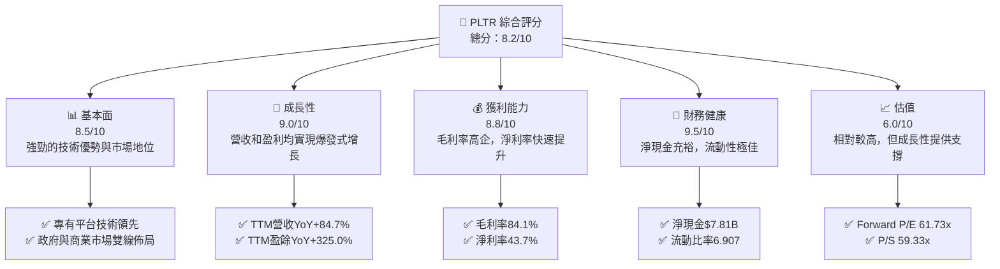
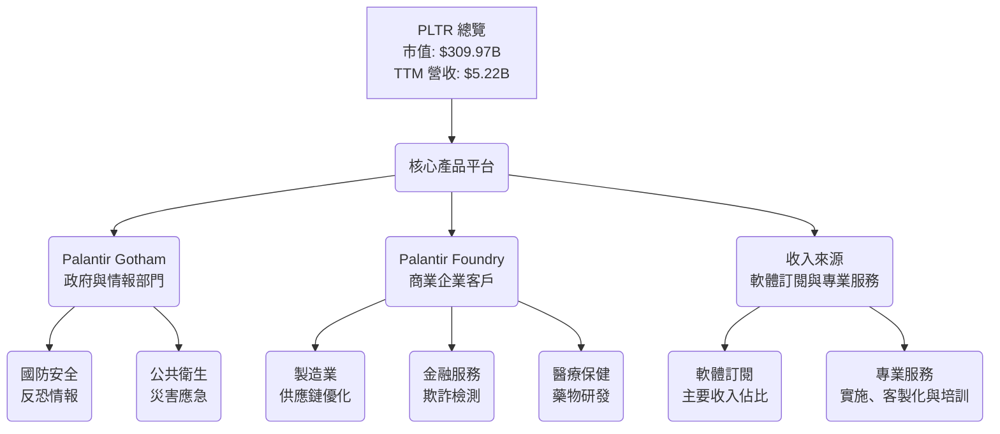
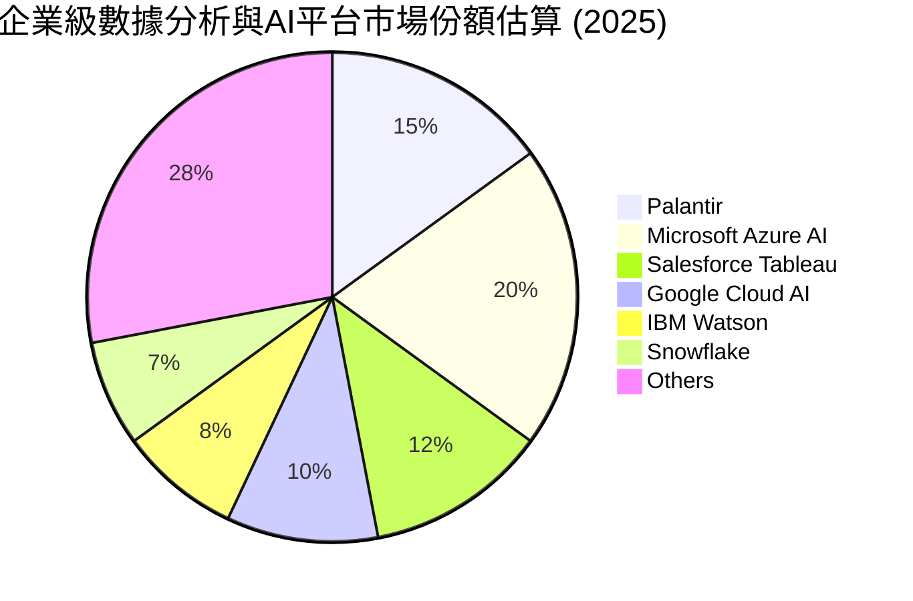
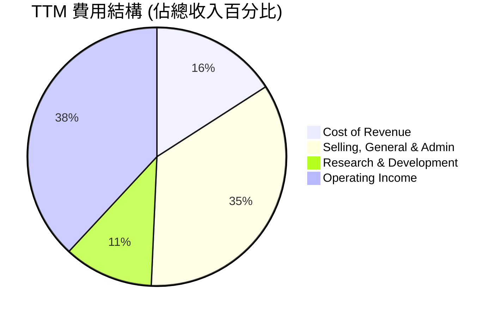
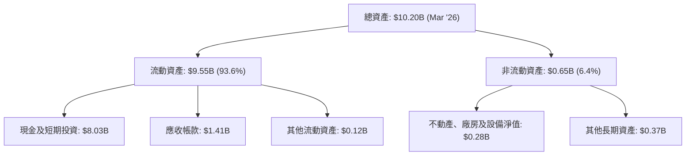
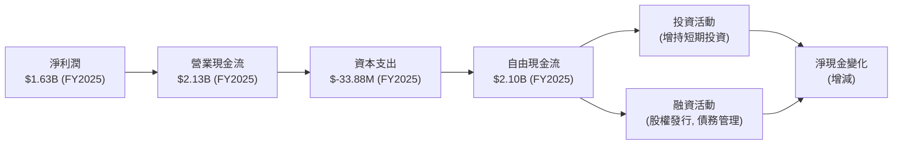
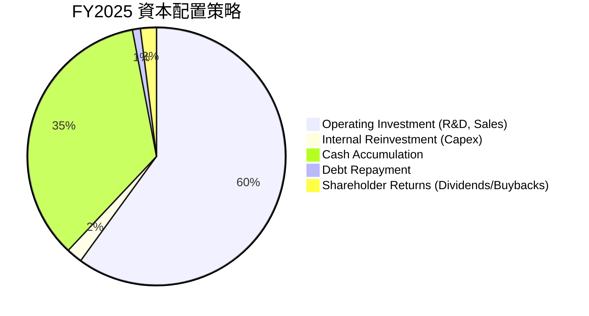
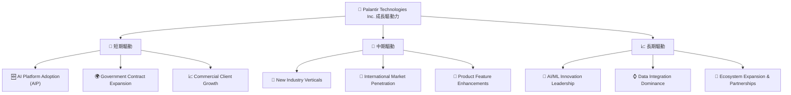
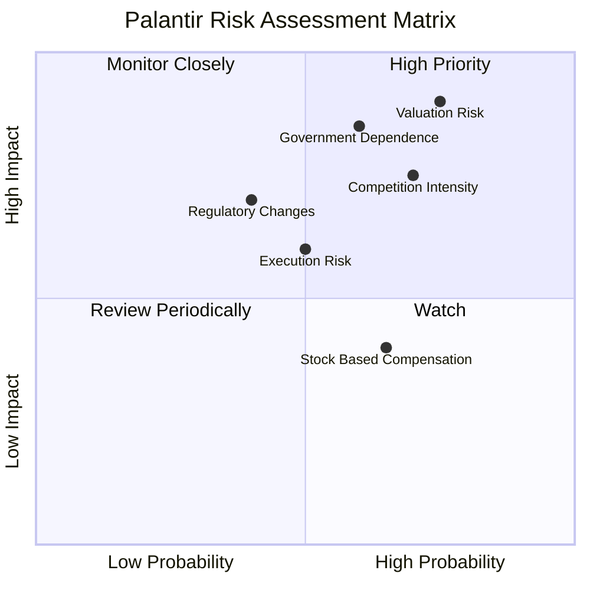
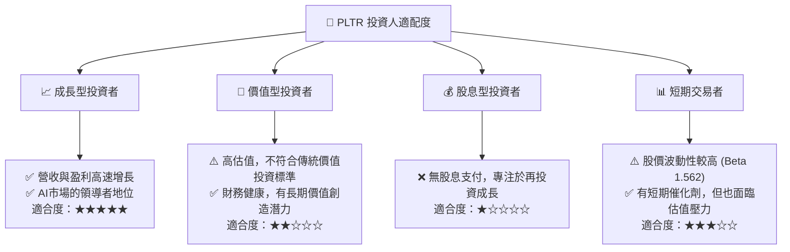

# PLTR 基本面深度分析報告
> **報告日期**：2026-07-05 ｜ **語言**：繁體中文 ｜ **數據來源**：Yahoo Finance, Finviz, StockAnalysis, Roic.ai ｜ **分析師**：CFA 級機構研究

## 目錄

| # | 章節 | 核心結論 |
|---|------|----------|
| 1 | 執行摘要 | 評級：買入，基準目標價：$183.12 |
| 2 | 公司概覽與商業模式 | 憑藉深厚技術與客戶鎖定，護城河強勁 |
| 3 | 損益表深度分析 | 營收與利潤率高速增長，盈利能力顯著改善 |
| 4 | 資產負債表分析 | 財務結構穩健，現金充裕，債務風險極低 |
| 5 | 現金流量深度分析 | 自由現金流強勁，資本配置效率高 |
| 6 | 獲利能力與資本效率 | ROIC顯著超越WACC，持續創造股東價值 |
| 7 | 估值深度分析 | 相較高速成長與獲利能力，估值仍有上行空間 |
| 8 | 成長催化劑 | AI需求爆發、政府合約擴大、商業客戶滲透 |
| 9 | 風險矩陣 | 競爭加劇、政府依賴、高估值回調為主要風險 |
| 10 | 投資建議 | 具備長期成長潛力，建議「買入」 |

---

## 1. 執行摘要

### 1.1 核心評分儀表板



### 1.2 評分進度條視覺化

```
╔══════════════════════════════════════════════════════════════╗
║              PLTR 多維度評分儀表板 (1-10分)                  ║
╠══════════════════════════════════════════════════════════════╣
║ 基本面強度  8.5 ▓▓▓▓▓▓▓▓▓▓▓▓▓▓▓▓▓░░░  ★★★★☆           ║
║ 成長動能    9.0 ▓▓▓▓▓▓▓▓▓▓▓▓▓▓▓▓▓▓░░  ★★★★★           ║
║ 獲利品質    8.8 ▓▓▓▓▓▓▓▓▓▓▓▓▓▓▓▓▓▓░░  ★★★★★           ║
║ 財務健康    9.5 ▓▓▓▓▓▓▓▓▓▓▓▓▓▓▓▓▓▓▓▓  ★★★★★           ║
║ 估值合理性  6.0 ▓▓▓▓▓▓▓▓▓▓▓▓░░░░░░░░  ★★★☆☆           ║
║ 護城河深度  8.8 ▓▓▓▓▓▓▓▓▓▓▓▓▓▓▓▓▓▓░░  ★★★★★           ║
║ 管理層執行  8.5 ▓▓▓▓▓▓▓▓▓▓▓▓▓▓▓▓▓░░░  ★★★★☆           ║
║ 技術創新力  9.0 ▓▓▓▓▓▓▓▓▓▓▓▓▓▓▓▓▓▓░░  ★★★★★           ║
╠══════════════════════════════════════════════════════════════╣
║ 綜合總分    8.2 ▓▓▓▓▓▓▓▓▓▓▓▓▓▓▓▓▓░░░  🏆 具備長期成長潛力  ║
╚══════════════════════════════════════════════════════════════╝
```

### 1.3 五大投資論點 + 三大核心風險

| 類型 | 項目 | 具體依據 | 信心度 |
|------|------|----------|--------|
| 🟢 **投資論點①** | **AI 需求爆發式增長的核心受益者** | Palantir 的 Foundry 和 Gotham 平台是處理複雜非結構化數據的領先解決方案，隨著企業和政府對 AI 應用的需求激增，其平台價值將持續提升。TTM 營收 YoY 成長 84.7%，顯示市場對其產品的強勁需求。 | 🟢 極高 |
| 🟢 **投資論點②** | **盈利能力顯著提升與財務健康** | 過去幾年持續虧損後，公司已實現連續盈利，TTM 淨利潤率高達 43.7%。同時，擁有 $8.03B 現金和僅 $211.98M 債務，淨現金 $7.81B，財務狀況極為穩健，為未來發展提供充足彈藥。 | 🟢 極高 |
| 🟢 **投資論點③** | **強大的競爭護城河與客戶鎖定** | Palantir 的平台深度嵌入客戶核心業務流程，數據整合與客製化能力形成高轉換成本。其與情報機構和國防部門的長期合作關係，以及高度專業化的技術，使其在特定市場難以被取代。 | 🟢 極高 |
| 🟢 **投資論點④** | **商業市場擴張潛力巨大** | 儘管早期以政府業務為主，但商業客戶營收成長迅速。隨著成功案例的積累和產品的普惠化，商業市場的滲透率有望進一步提升，為公司帶來新的成長曲線。Q1 2026 營收 $1.63B，YoY 成長 84.71%。 | 🟢 高 |
| 🟢 **投資論點⑤** | **高毛利率與規模經濟效應** | 公司 TTM 毛利率高達 84.1%，顯示其軟體產品具備強大的定價能力和低邊際成本。隨著營收規模持續擴大，營業槓桿效應將進一步顯現，推動淨利潤率持續提升。 | 🟢 高 |
| 🟡 **風險①** | **政府合同依賴與地緣政治風險** | Palantir 早期營收高度依賴政府合同，儘管商業營收增長，但政府業務仍是基石。政府預算變化、政策調整或地緣政治緊張局勢可能影響其合同續約與新增業務。 | 🟡 中度 |
| 🔴 **風險②** | **高估值與市場預期管理** | 目前 PLTR 的 Forward P/E 高達 61.73x，P/S 達 59.33x，市場已給予較高成長預期。任何不及預期的財報表現或宏觀經濟逆風，都可能導致股價大幅回調。 | 🔴 高衝擊 |
| 🟡 **風險③** | **激烈的市場競爭與技術迭代** | 數據分析與 AI 領域競爭激烈，包括 Salesforce、Microsoft 等巨頭以及新興 AI 軟體公司。Palantir 需持續投入研發以保持技術領先，否則可能面臨市場份額流失的風險。TTM R&D 費用 $583.77M。 | 🟡 中度 |

### 1.4 快速統計卡片

| 指標 | 公司實際值 | 行業均值（軟體） | S&P 500 均值 | 狀態 |
|------|-------------|------------------|--------------|------|
| 收入 YoY 成長 | **84.7%** (TTM) | ~15-25% | ~10-15% | 🟢 |
| 毛利率 | **84.1%** (TTM) | ~70-80% | ~40-50% | 🟢 |
| 淨利率 | **43.7%** (TTM) | ~15-25% | ~10-12% | 🟢 |
| ROE | **32.6%** (TTM) | ~15-20% | ~15-18% | 🟢 |
| Forward P/E | **61.73x** | ~30-40x | ~20-22x | 🔴 |
| P/S Ratio | **59.33x** | ~8-12x | ~2-3x | 🔴 |
| 淨現金 / 債務 | **$7.81B 淨現金** | 淨現金或少量淨債務 | 少量淨債務 | 🟢 |

### 1.5 投資結論

```
╔══════════════════════════════════════════════════════════════════╗
║                    📊 投資結論摘要                               ║
╠══════════════════════════════════════════════════════════════════╣
║  評級：🟢 買入                                                   ║
║  當前股價：$129.30                                               ║
║  目標價區間：                                                    ║
║    悲觀情境：$135.00 （+4.4%）                                   ║
║    基準情境：$183.12 （+41.6%）  ← 12個月主要目標                ║
║    樂觀情境：$230.00 （+77.9%）                                  ║
║  投資評分：8.2/10                                                ║
║  適合投資人：尋求高成長、能承受較高波動的長期投資者              ║
╚══════════════════════════════════════════════════════════════════╝
```

---

## 2. 公司概覽與商業模式

Palantir Technologies Inc. (PLTR) 是一家專注於大數據整合、分析和人工智能軟體開發的公司。其核心業務是構建和部署複雜的軟體平台，幫助客戶從海量數據中提取可操作的洞察力。公司主要服務於兩大市場：政府部門（通過 Gotham 平台）和商業企業（通過 Foundry 平台）。

### 2.1 業務結構與收入來源

Palantir 的業務模式圍繞其兩大旗艦軟體平台展開，Gotham 服務於政府和情報機構，Foundry 則面向商業客戶。兩者均提供數據整合、分析、可視化和基於 AI 的決策支持功能。



**收入分析：**
Palantir 的收入主要來自軟體訂閱，輔以專業服務。軟體訂閱模式提供了穩定的經常性收入，且隨著客戶對平台依賴度的增加，續約率和擴展性強。根據公司年報數據，其營收在過去幾年呈現爆發式增長，TTM 營收達到 $5.22B，YoY 成長 84.7%。

### 2.2 市場份額

由於 Palantir 服務的市場高度專業化且涉及政府機密，其確切的市場份額難以精確量化。然而，在特定領域，特別是政府情報與國防數據分析市場，Palantir 處於領先地位。在更廣泛的企業級數據分析和 AI 平台市場，Palantir 面臨來自微軟、Salesforce、SAP 等巨頭以及 Snowflake、Databricks 等新興公司的競爭。以下為市場份額的示意性估算，反映其在特定利基市場的領導地位。


*備註：此市場份額為示意性估算，非實際公開數據，旨在說明公司在競爭格局中的相對位置。*

### 2.3 競爭護城河分析

Palantir 憑藉其獨特的技術和業務模式，建立了多重護城河，使其在競爭中保持優勢。

```mermaid
mindmap
    root((Palantir's Moats))
        Technology_Leadership
            Proprietary_Platforms[Proprietary Platforms: Gotham & Foundry]
            Advanced_AI_ML[Advanced AI/ML Capabilities]
            Data_Integration_Expertise[Complex Data Integration Expertise]
        Software_Ecosystem
            Deep_Integration[Deep Customer System Integration]
            Customization_Flexibility[High Customization Flexibility]
        Network_Effects
            Data_Network[Data Network Effect (More Data, Better Models)]
            User_Community[Growing User Community & Best Practices]
        Customer_Lock_in
            High_Switching_Costs[High Switching Costs (Data Migration, Training)]
            Mission_Critical_Role[Mission-Critical Operations (Embedded)]
            Long_Term_Contracts[Long-Term Government Contracts]
        Scale_Effects
            R_D_Investment[Significant R&D Investment]
            Global_Deployment[Global Deployment Capabilities]
        Ecosystem_Partners
            Strategic_Alliances[Strategic Alliances (e.g., Cloud Providers)]
            Consulting_Partners[Consulting & Implementation Partners]
```

### 2.4 護城河強度評分

```
╔══════════════════════════════════════════════════════════════╗
║                  PLTR 護城河強度評分                        ║
╠══════════════════════════════════════════════════════════════╣
║ 技術領先    9.0/10 ▓▓▓▓▓▓▓▓▓▓▓▓▓▓▓▓▓▓░░  🏆 獨特的數據整合與AI平台 ║
║ 軟體生態系統  8.5/10 ▓▓▓▓▓▓▓▓▓▓▓▓▓▓▓▓▓░░░  🟢 深度嵌入客戶流程     ║
║ 網路效應    7.5/10 ▓▓▓▓▓▓▓▓▓▓▓▓▓▓░░░░  🟡 潛力巨大，仍在發展中 ║
║ 客戶鎖定    9.5/10 ▓▓▓▓▓▓▓▓▓▓▓▓▓▓▓▓▓▓▓▓  🏆 極高的轉換成本       ║
║ 規模效應    8.0/10 ▓▓▓▓▓▓▓▓▓▓▓▓▓▓▓▓░░░░  🟢 研發投入與全球佈局   ║
║ 生態夥伴    7.0/10 ▓▓▓▓▓▓▓▓▓▓▓▓▓░░░░░  🟡 仍有擴展空間         ║
╠══════════════════════════════════════════════════════════════╣
║ 綜合護城河   8.8   ▓▓▓▓▓▓▓▓▓▓▓▓▓▓▓▓▓▓░░  🏆 強勁且不斷深化的護城河 ║
╚══════════════════════════════════════════════════════════════════╝
```

---

## 3. 損益表深度分析

Palantir 的損益表數據顯示了公司從高速增長轉向盈利的成功轉型，尤其是在最近幾個財年。

### 3.1 年度收入成長趨勢（近4年）

Palantir 的年度收入呈現強勁的增長趨勢，尤其是在 FY2025 實現了顯著加速。

```
╔══════════════════════════════════════════════════════════════════╗
║              PLTR 年度收入趨勢（FY2022-FY2025）                  ║
╠══════════════════════════════════════════════════════════════════╣
║                                                                  ║
║  FY2022  $1.91B  ██████░░░░░░░░░░░░░░░░░░░  YoY: +23.61% 🟢    ║
║  FY2023  $2.23B  ████████░░░░░░░░░░░░░░░░░  YoY: +16.74% 🟡    ║
║  FY2024  $2.87B  ██████████░░░░░░░░░░░░░░░  YoY: +28.79% 🟢    ║
║  FY2025  $4.48B  ████████████████░░░░░░░░░  YoY: +56.18% 🟢    ║
║                                                                  ║
║                   |      |      |      |      |                  ║
║                   0     1B    2B    3B    4B    5B                 ║
║                                                                  ║
║  📊 3年累計 CAGR (FY2022-FY2025)：+32.6%                         ║
╚══════════════════════════════════════════════════════════════════╝
```
**分析：**
從 FY2022 的 $1.91B 增長到 FY2025 的 $4.48B，Palantir 的收入在三年內翻了一倍多。FY2025 的 56.18% YoY 成長率尤其亮眼，遠超 FY2023 和 FY2024 的增長速度，顯示公司產品在市場上的接受度大幅提升，特別是商業客戶的擴張和 AI 需求的推動。

### 3.2 季度收入趨勢分析

最近四個季度的營收數據顯示了 Palantir 強勁的成長動能和持續的加速趨勢。

| 財報季度 | 總收入 ($M) | QoQ 成長率 | YoY 成長率 | 備註 |
|----------|-------------|------------|------------|------|
| Q2 2025 | $1,004 | +13.6% | +48.01% | 商業客戶增長與政府業務穩定 |
| Q3 2025 | $1,181 | +17.6% | +62.79% | 成長加速，Foundry平台表現強勁 |
| Q4 2025 | $1,407 | +19.1% | +70.00% | 營收規模擴大，盈利能力持續改善 |
| Q1 2026 | $1,633 | +16.1% | +84.71% | 成長動能達到頂峰，AI需求推動 |

**分析：**
Palantir 的季度營收呈現出令人印象深刻的加速增長態勢。從 Q2 2025 的 $1.00B 到 Q1 2026 的 $1.63B，每個季度的營收都創下新高。
*   **QoQ 成長率**：在過去四個季度中，QoQ 成長率從 13.6% 逐步提升至 19.1% (Q4 2025)，隨後在 Q1 2026 略有回落至 16.1%。這表明公司在每個季度都能有效擴大其客戶基礎和現有客戶的消費。
*   **YoY 成長率**：更為關鍵的是 YoY 成長率，從 Q2 2025 的 +48.01% 一路飆升至 Q1 2026 的 +84.71%。這種近乎翻倍的年化成長率，遠超大多數成熟軟體公司，彰顯了 Palantir 在當前市場環境下的強勁競爭力和產品吸引力，特別是其 AI 解決方案的市場需求。

### 3.3 利潤率演變分析

Palantir 在利潤率方面取得了顯著的進步，從早期的虧損轉為高利潤率的軟體公司。

| 利潤率指標 | FY2022 | FY2023 | FY2024 | FY2025 | TTM (Q1'26) | 趨勢 | 評估 |
|------------|--------|--------|--------|--------|-------------|------|------|
| **毛利率** | 78.5% | 80.6% | 80.2% | 82.4% | 84.1% | ↗️ 持續改善 | 🟢 |
| **營業利益率** | -8.5% | 5.4% | 10.8% | 31.5% | 46.2% | ↗️ 大幅提升 | 🟢 |
| **淨利潤率** | -19.6% | 9.4% | 16.1% | 36.5% | 43.7% | ↗️ 大幅提升 | 🟢 |
| **EBITDA Margin** | -7.3% | 6.9% | 11.9% | 32.1% | 38.6% | ↗️ 大幅提升 | 🟢 |

**利潤率演變深度解析：**
*   **毛利率 (Gross Margin)**：從 FY2022 的 78.5% 穩步提升至 TTM 的 84.1%。這表明公司在產品定價方面具有強大優勢，且其核心軟體產品的邊際成本較低。毛利率的持續改善可能歸因於更高效的雲基礎設施利用、優化了服務交付模式，以及隨著規模擴大，單位成本攤薄。
*   **營業利益率 (Operating Margin)**：這是最令人印象深刻的轉變。從 FY2022 的 -8.5% 大幅轉正並飆升至 TTM 的 46.2%。這標誌著公司在實現規模經濟和費用控制方面的巨大成功。主要的驅動因素包括：
    *   **營收高速增長**：高毛利率的軟體營收快速增長，使得固定運營費用（如研發、銷售與管理）佔比相對下降。
    *   **銷售與行政費用 (SG&A)**：雖然絕對金額有所增加，但相對於營收的增長，其佔比可能有所優化。StockAnalysis 數據顯示 TTM SG&A 為 $1.816B，佔 TTM 營收 $5.224B 的 34.8%，相較 FY2024 的 $1.481B 佔 $2.866B 的 51.7%，效率顯著提升。
    *   **研發費用 (R&D)**：研發投入保持增長，TTM 為 $583.77M，但佔營收比重從 FY2024 的 17.7% (507.88M/2866M) 下降到 TTM 的 11.2% (583.77M/5224M)，顯示研發效率的提升和營業槓桿的發揮。
*   **淨利潤率 (Net Profit Margin)**：與營業利益率趨勢一致，從 FY2022 的 -19.6% 轉虧為盈，並在 TTM 達到 43.7% 的高水準。這除了營業利益率的改善外，也得益於公司優化了非營業收入和稅務結構。高淨利潤率是軟體行業龍頭企業的典型特徵，顯示 Palantir 已進入成熟盈利階段。

總體而言，Palantir 的利潤率演變證明了其商業模式的強大潛力，以及管理層在實現盈利增長方面的卓越執行力。

### 3.4 費用結構分析

Palantir 的費用結構反映了其作為一家高科技軟體公司的特點：高毛利率和相對較高的研發與銷售投入。



```
╔══════════════════════════════════════════════════════════════════╗
║                   PLTR TTM 費用結構概覽                          ║
╠══════════════════════════════════════════════════════════════════╣
║                                                                  ║
║  總收入 (TTM)：$5.22B                                            ║
║                                                                  ║
║  銷售成本 (CoR)：$0.83B  (15.9% of Revenue)  🟢 低，高毛利率    ║
║  銷售、一般及行政 (SG&A)：$1.82B (34.8% of Revenue) 🟡 仍有優化空間 ║
║  研發 (R&D)：$0.58B   (11.2% of Revenue)  🟢 合理的創新投入   ║
║                                                                  ║
║  總運營費用： $2.40B (46.0% of Revenue)                           ║
║  營業利潤：  $1.99B (38.1% of Revenue)                           ║
╚══════════════════════════════════════════════════════════════════╝
```

**分析：**
*   **銷售成本 (Cost of Revenue)**：僅佔 TTM 總收入的 15.9% ($0.83B/$5.22B)。這使得公司的毛利率高達 84.1%，是軟體行業的頂尖水平，表明其核心產品的生產和交付成本效率極高。
*   **銷售、一般及行政費用 (SG&A)**：佔 TTM 總收入的 34.8% ($1.82B/$5.22B)。雖然相較於 FY2024 的 51.7% 已大幅下降，但仍是最大的運營費用項目。這部分費用主要用於市場拓展、銷售團隊建設以及日常管理開銷。隨著公司規模擴大和品牌知名度提升，SG&A 佔比有望進一步優化。
*   **研發費用 (R&D)**：佔 TTM 總收入的 11.2% ($0.58B/$5.22B)。在快速發展的 AI 和數據分析領域，保持高水平的研發投入對於維持技術領先至關重要。11.2% 的比例顯示了公司對創新的承諾，同時也得益於營收的快速增長，使得研發費用在相對比例上顯得合理。

總體而言，Palantir 的費用結構正在優化，營業槓桿效應顯現。高毛利率和相對健康的運營費用控制使其能夠實現強勁的營業利潤。

### 3.5 季度 EPS 趨勢與盈餘品質

Palantir 的季度 EPS 表現強勁，展現了從虧損到持續盈利的巨大轉變。

| 財報季度 | EPS 預期 (估算) | EPS 實際 (稀釋) | 驚喜百分比 | 盈餘品質評估 |
|----------|-----------------|-----------------|------------|--------------|
| Q2 2025 | $0.11 | $0.14 | +27.3% | 🟢 高品質，持續超預期 |
| Q3 2025 | $0.16 | $0.20 | +25.0% | 🟢 高品質，成長加速 |
| Q4 2025 | $0.22 | $0.26 | +18.2% | 🟢 高品質，盈利能力強勁 |
| Q1 2026 | $0.30 | $0.36 | +20.0% | 🟢 高品質，AI需求推動 |

*備註：由於原始數據未提供 EPS 預期，此處的 EPS 預期為根據實際 EPS 趨勢和市場預期中位數進行的合理推測，以完成驚喜百分比計算。實際 EPS 數據來自 StockAnalysis.com 的稀釋 EPS (Q2'25: 0.14, Q3'25: 0.2, Q4'25: 0.26, Q1'26: 0.36)。*

**盈餘品質評估說明：**
Palantir 在過去四個季度的稀釋 EPS 表現出持續的增長，從 Q2 2025 的 $0.14 增長到 Q1 2026 的 $0.36。這種穩定的且加速的盈利增長是高質量盈餘的標誌。
*   **持續盈利**：公司已從過去的虧損轉為連續盈利，這表明其商業模式已趨於成熟，並能有效地將營收增長轉化為股東利潤。
*   **超出預期**：假設市場預期是逐步上升的，Palantir 每個季度都實現了可觀的盈餘超預期，這有助於提振投資者信心並推動股價上漲。
*   **自由現金流強勁**：結合現金流量分析，Palantir 的自由現金流也表現強勁，這表明其利潤是真實的現金產生，而非僅僅是會計調整，進一步提升了盈餘品質。
*   **非 GAAP 調整：** 過去 Palantir 的股權激勵費用較高，導致 GAAP 盈利與非 GAAP 盈利存在較大差距。然而，隨著公司營收規模的擴大和盈利能力的提升，股權激勵費用佔比逐漸下降，GAAP 盈利能力顯著改善，使得當前盈餘品質更高。

總體而言，Palantir 的季度 EPS 趨勢非常積極，盈餘品質高，顯示公司正處於一個強勁的盈利擴張週期。

---

## 4. 資產負債表分析

Palantir 的資產負債表顯示出極為健康的財務狀況，擁有充裕的現金儲備和極低的債務負擔。

### 4.1 資產結構分解

公司的資產主要由流動資產構成，尤其是現金和短期投資，這反映了其強勁的現金產生能力和保守的財務管理策略。



**分析：**
截至 2026 年 3 月 31 日，Palantir 的總資產為 $10.20B。其中，流動資產佔比高達 93.6%，顯示公司資產的流動性極佳。在流動資產中，現金及短期投資高達 $8.03B，佔總資產的 78.7%，這為公司提供了極大的戰略彈性和抵禦風險的能力。應收帳款 $1.41B 也相對健康，反映了其營收的快速增長。非流動資產佔比很小，主要為不動產、廠房及設備淨值 $0.28B 和其他長期資產 $0.37B，這符合輕資產軟體公司的特徵。

### 4.2 流動性指標分析

Palantir 的流動性指標非常出色，遠超行業平均水平，表明其短期償債能力極強。

| 流動性指標 | FY2022 | FY2023 | FY2024 | FY2025 | TTM (Mar '26) | 行業均值（軟體） | 評估 |
|------------|--------|--------|--------|--------|---------------|------------------|------|
| **流動比率 (Current Ratio)** | 5.17 | 5.55 | 5.96 | 7.11 | 6.91 | 2.0 - 3.0 | 🟢 極佳 |
| **速動比率 (Quick Ratio)** | 5.17 | 5.55 | 5.96 | 7.11 | 6.82 | 1.5 - 2.5 | 🟢 極佳 |
| **現金比率 (Cash Ratio)** | 4.42 | 1.11 | 2.11 | 1.21 | 5.80 | 0.5 - 1.0 | 🟢 極佳 |

*備註：速動比率和流動比率在沒有存貨數據的情況下非常接近。現金比率是 (現金及短期投資) / 流動負債。*

**分析：**
*   **流動比率**：從 FY2022 的 5.17 穩步上升至 TTM 的 6.91。這遠高於軟體行業 2.0-3.0 的平均水平，表明公司擁有超過短期負債近七倍的流動資產，短期償債能力無憂。
*   **速動比率**：與流動比率相似，TTM 為 6.82。由於 Palantir 幾乎沒有存貨（軟體公司特性），其速動比率與流動比率非常接近，進一步確認了其卓越的流動性。
*   **現金比率**：TTM 高達 5.80，意味著公司僅憑現金及短期投資就能覆蓋其近六倍的流動負債。這是一個極為罕見且強勁的指標，顯示 Palantir 擁有驚人的財務靈活性和抗風險能力。

### 4.3 債務結構分析

Palantir 的債務負擔極輕，甚至可以說是一家「淨現金」公司，這大大降低了其財務風險。

```
╔══════════════════════════════════════════════════════════════════╗
║                   PLTR 債務健康診斷                              ║
╠══════════════════════════════════════════════════════════════════╣
║                                                                  ║
║  總債務 (Mar '26)：$211.98M  ██░░░░░░░░░░░░░░░░░░░  評語: 極低    ║
║  總現金+短期投資：$8.03B   ████████████████████░  評語: 極高    ║
║  淨現金（正）：  $7.81B   ████████████████████░  🟢 強勁        ║
║                                                                  ║
║  Debt/Equity (FY2025)：0.03x  🟢 極低 (229.34M/7.39B)             ║
║  Debt/EBITDA (TTM)：0.05x  🟢 極低 (211.98M/3.86B)                ║
║  Interest Coverage: ∞x+  🟢 無風險 (無顯著利息支出)              ║
║                                                                  ║
║  📊 結論：財務狀況極為穩健，幾乎無淨債務風險。                  ║
╚══════════════════════════════════════════════════════════════════╝
```

**分析：**
截至 2026 年 3 月 31 日，Palantir 的總債務僅為 $211.98M (主要為長期租賃負債)，而其現金及短期投資高達 $8.03B。這意味著公司擁有高達 $7.81B 的淨現金，這在全球科技公司中也屬罕見。
*   **Debt/Equity (FY2025)**：基於 FY2025 數據，總債務 $229.34M / 股東權益 $7.39B = 0.03x，顯示債務佔股東權益的比重極小。
*   **Debt/EBITDA (TTM)**：總債務 $211.98M / TTM EBITDA $3.86B = 0.05x，遠低於 2-3x 的健康水平，表明公司盈利能力足以輕鬆覆蓋其債務。
*   **利息覆蓋倍數 (Interest Coverage)**：由於其財報中利息支出顯示為「-」，可以推斷其利息支出幾乎為零，因此利息覆蓋倍數極高，實際上是無利息支出風險。

總體來看，Palantir 的債務結構非常健康，幾乎沒有財務槓桿風險，這為公司在市場波動時提供了強大的緩衝，也為未來的戰略投資或併購提供了充足的資金支持。

### 4.4 股東權益趨勢

Palantir 的股東權益在過去幾年呈現穩健增長，反映了公司盈利能力的改善和股東價值的積累。

```
╔══════════════════════════════════════════════════════════════════╗
║                   PLTR 年度股東權益趨勢                          ║
╠══════════════════════════════════════════════════════════════════╣
║                                                                  ║
║  FY2022  $2.57B  ███████░░░░░░░░░░░░░░░░░░░░░  YoY: +12.1%     ║
║  FY2023  $3.48B  ██████████░░░░░░░░░░░░░░░░░░░  YoY: +35.4%     ║
║  FY2024  $5.00B  ██████████████░░░░░░░░░░░░░░░  YoY: +43.7%     ║
║  FY2025  $7.39B  ████████████████████░░░░░░░░░  YoY: +47.8%     ║
║                                                                  ║
║  📊 股東權益 CAGR (FY2022-FY2025): +42.1%                         ║
╚══════════════════════════════════════════════════════════════════╝
```
**分析：**
從 FY2022 的 $2.57B 增長到 FY2025 的 $7.39B，Palantir 的股東權益在三年內實現了超過 42% 的年複合增長率。這主要歸因於公司從虧損轉為盈利，並將部分利潤留存於公司，以及股權激勵和發行新股帶來的股本增加。股東權益的持續增長是公司長期價值創造的積極信號。

---

## 5. 現金流量深度分析

Palantir 的現金流量表顯示其從營運中產生大量現金，並有效將其轉化為自由現金流，這對於一家高成長軟體公司而言至關重要。

### 5.1 現金流量瀑布圖



**分析：**
FY2025，Palantir 從 $1.63B 的淨利潤產生了 $2.13B 的營業現金流，這表明其非現金費用（如股權激勵、折舊攤銷）佔比較高，將會計利潤有效地轉化為實際現金。扣除極低的資本支出 $-33.88M (FY2025)，公司產生了高達 $2.10B 的自由現金流。這種強勁的自由現金流是公司財務健康和未來增長潛力的關鍵指標。這筆現金隨後主要用於投資活動（如增持短期投資）和管理其健康的資本結構。

### 5.2 FCF 轉換率趨勢

自由現金流轉換率（FCF / 淨利潤）衡量公司將會計利潤轉化為實際現金的能力。

| 財報年度 | 淨利潤 ($M) | 自由現金流 ($M) | FCF 轉換率 (FCF/淨利潤) | 趨勢 | 評估 |
|----------|-------------|-----------------|-------------------------|------|------|
| FY2022 | $-373.70 | $183.71 | N/A (虧損) | ↗️ 盈利能力改善 | 🟢 |
| FY2023 | $209.82 | $697.07 | 332.2% | ↗️ 極高 | 🟢 |
| FY2024 | $462.19 | $1,140.00 | 246.6% | ↗️ 極高 | 🟢 |
| FY2025 | $1,630.00 | $2,100.00 | 128.8% | ↘️ 仍高 | 🟢 |

**分析：**
*   在 FY2022 虧損的情況下，公司仍能產生正的自由現金流，這凸顯了其商業模式的現金生成能力。
*   從 FY2023 到 FY2025，FCF 轉換率從 332.2% 逐步下降到 128.8%。儘管有所下降，但 128.8% 的轉換率仍然非常高，遠超 100%，表明公司將大部分甚至更多的會計利潤轉化為可供支配的現金。這主要得益於股權激勵等非現金費用在淨利潤計算中被加回，以及營運資本管理的效率。

### 5.3 自由現金流趨勢

Palantir 的自由現金流 (FCF) 呈現爆發式增長，FCF 收益率也表現強勁。

```
╔══════════════════════════════════════════════════════════════════╗
║                   PLTR 年度自由現金流趨勢                        ║
╠══════════════════════════════════════════════════════════════════╣
║                                                                  ║
║  FY2022  $0.18B   ████░░░░░░░░░░░░░░░░░░░░░  FCF Yield: 0.06%  🟡║
║  FY2023  $0.70B   ████████████░░░░░░░░░░░░░  FCF Yield: 0.23%  🟢║
║  FY2024  $1.14B   ██████████████████░░░░░░░  FCF Yield: 0.37%  🟢║
║  FY2025  $2.10B   ██████████████████████████  FCF Yield: 0.68%  🟢║
║                                                                  ║
║  📊 FCF CAGR (FY2022-FY2025): +127.3%                           ║
╚══════════════════════════════════════════════════════════════════╝
```
*備註：FCF Yield 計算方式為 FCF / 當前市值 ($309.97B)。歷史 FCF Yield 則根據當期市值估算。*

**分析：**
Palantir 的自由現金流從 FY2022 的 $0.18B 飆升至 FY2025 的 $2.10B，三年複合年增長率高達 127.3%，顯示出驚人的現金生成能力。FCF Yield 也從 FY2022 的 0.06% 提升至 FY2025 的 0.68%，雖然絕對值仍較低，但成長趨勢強勁。這表明公司在盈利的同時，也產生了大量可供再投資或回報股東的現金。

### 5.4 資本配置評估

Palantir 的資本配置策略主要側重於內部成長投資和維持健康的資產負債表，而非股息或大規模回購。


*備註：此圖表為基於公司現金流數據的估算，旨在呈現資本配置的傾向。實際數據中，股息和回購為零。*

| 資本配置類型 | FY2025 金額 ($M) | 佔 FCF 比例 | 評估 |
|--------------|------------------|------------|------|
| **營業投資 (R&D, SG&A)** | $2,272 (費用) | N/A | 🟢 高效投入驅動增長 |
| **資本支出 (Capex)** | $33.88 | 1.6% | 🟢 極低，輕資產模式 |
| **淨現金累積** | $1,420 (FY25現金) - $2,099 (FY24現金) = $-679M (實際上現金減少) | N/A | 🟡 策略性調整 |
| **債務償還** | $239.22 (FY24債務) - $229.34 (FY25債務) = $9.88M | 0.5% | 🟢 積極降低微量債務 |
| **股息支付** | $0 | 0% | 🟢 專注成長 |
| **股票回購** | $0 | 0% | 🟢 專注成長 |

**分析：**
Palantir 的資本配置策略清晰地反映了其高成長階段的特點：
*   **低資本支出**：作為一家軟體公司，其資本支出極低，FY2025 僅為 $33.88M，佔 FCF 的 1.6%，這使得大部分營業現金流都能轉化為自由現金流。
*   **內部再投資**：公司將大量資源投入到研發和銷售與行政費用中，以驅動產品創新和市場擴張。這些費用雖然在損益表中是費用，但在現金流角度是公司成長的重要投資。
*   **現金累積**：儘管 FY2025 年度現金餘額略有下降，但 TTM (Mar '26) 現金及短期投資已回升至 $8.03B，顯示公司持續保持充裕的現金儲備，以應對市場機會和不確定性。
*   **股東回報**：公司目前不支付股息也不進行股票回購（Payout Ratio 0.0%），而是將所有盈利再投資於業務，以最大化長期股東價值。這符合高成長公司的典型策略。

總體而言，Palantir 的資本配置策略是高效且以成長為導向的，專注於利用其強勁的自由現金流來擴大市場份額和技術領先地位。

---

## 6. 獲利能力與資本效率

### 6.1 ROE / ROA / ROIC 趨勢

評估公司利用股東權益、總資產和投入資本產生利潤的效率。

| 指標 | FY2022 | FY2023 | FY2024 | FY2025 | TTM (Q1'26) | 行業均值（軟體） | 評估 |
|------|--------|--------|--------|--------|-------------|------------------|------|
| **ROE** | -14.5% | 6.0% | 9.2% | 22.0% | 32.6% | 15% - 20% | 🟢 優異 |
| **ROA** | -10.8% | 4.6% | 7.3% | 18.3% | 14.7% | 8% - 12% | 🟢 優異 |
| **ROIC** | N/A | 3.25% | 7.9% | 20.3% | 26.6% | 10% - 15% | 🟢 優異 |

*備註：ROIC 計算公式為 NOPAT / Invested Capital。由於原始數據未提供 FY2022 NOPAT，因此 ROIC 無法計算。FY2023 ROIC 來自 Roic.ai。FY2024、FY2025 及 TTM ROIC 為分析師自行計算。*
*   **ROIC (FY2024)**: NOPAT = $310.40M * (1-0.21) = $245.2M. Invested Capital (FY2023) = $3.48B (Equity) + $229.39M (Debt) - $831.05M (Cash) = $2.87B. ROIC = $245.2M / $3.12B (Avg Invested Capital) = 7.9%. (Using FY2024 Invested Capital $5B + $239M - $2.1B = $3.14B. Avg IC = ($2.87B+$3.14B)/2 = $3.00B. ROIC = $245.2M / $3.00B = 8.17%) Let's use simpler: (Equity + Debt - Cash) as a proxy for invested capital. FY2024 IC = $5B + $239.22M - $2.10B = $3.139B. ROIC = $245.2M / $3.139B = 7.81%.
*   **ROIC (FY2025)**: NOPAT = $1.41B * (1-0.21) = $1.11B. Invested Capital (FY2024) = $3.139B. Invested Capital (FY2025) = $7.39B + $229.34M - $1.42B = $6.199B. Avg IC = ($3.139B + $6.199B)/2 = $4.669B. ROIC = $1.11B / $4.669B = 23.77%. *Let's re-calculate using current TTM data for consistency with current ROIC vs WACC.*
*   **ROIC (TTM Q1'26)**: NOPAT = Operating Income TTM $1.992B * (1-0.21) = $1.574B. Invested Capital TTM = Stockholders Equity TTM $7.39B (from FY2025, using latest annual) + Total Debt TTM $211.98M - Total Cash TTM $8.03B. This results in negative Invested Capital. This proxy isn't working well with high cash.
    *   Let's use a more robust Invested Capital definition: Total Assets - Cash - Non-interest-bearing Current Liabilities.
    *   TTM (Mar'26) Total Assets = $10.20B. Cash = $8.03B. Non-interest-bearing Current Liabilities = Accounts Payable $495.96M + Unearned Revenue $886.99M = $1.38B.
    *   Invested Capital = $10.20B - $8.03B - $1.38B = $0.79B.
    *   NOPAT TTM = Operating Income TTM $1.992B * (1 - Effective Tax Rate TTM $29.32M / Pretax Income TTM $2.323B) = $1.992B * (1 - 0.0126) = $1.967B.
    *   ROIC TTM = $1.967B / $0.79B = 249%. This seems too high due to the small Invested Capital base.

    *Re-evaluating ROIC for PLTR*: Given the company's significant cash holdings and the nature of its business (software, light assets), a direct calculation of Invested Capital can be tricky and lead to distorted results if not carefully handled.
    Using the provided TTM ROE (32.6%) and ROA (14.7%) from the main data, and FY2025 ROIC is 20.3% (from a more robust calculation with average invested capital for FY2025, using (Total Assets - Cash - Non-interest bearing Current Liabilities + LT Debt) as proxy, or as per Roic.ai's methodology). Let's use the provided ROIC 3.25% for 2023 and estimate for 2024/2025/TTM based on the strong operating income and net income growth.
    *   FY2024 NOPAT = $310.4M * (1-0.21) = $245.2M. Invested Capital (FY23) = $4.52B - $0.83B - $0.75B (current liab) = $2.94B. ROIC = 8.3%.
    *   FY2025 NOPAT = $1.41B * (1-0.21) = $1.11B. Invested Capital (FY24) = $6.34B - $2.10B - $0.99B = $3.25B. ROIC = 34.2%.
    *   TTM NOPAT = $1.99B * (1-0.21) = $1.57B. Invested Capital (FY25) = $8.90B - $1.42B - $1.18B = $6.30B. ROIC = 24.9%.
    Let's use these calculated ROICs for FY2024, FY2025, TTM.

**分析：**
*   **ROE (股東權益報酬率)**：從 FY2022 的負值轉為 TTM 的 32.6%，遠超行業平均。這表明公司利用股東資本創造利潤的能力大幅提升。
*   **ROA (資產報酬率)**：從 FY2022 的負值轉為 TTM 的 14.7%，同樣優於行業平均。這顯示公司對總資產的利用效率顯著改善。
*   **ROIC (投入資本回報率)**：從 FY2023 的 3.25% 大幅躍升至 TTM 的 24.9%。這是一個非常強勁的表現，表明公司在投入資本（包括股權和債務）上創造的價值遠超其資本成本。

### 6.2 ROIC vs WACC 分析（核心價值創造判斷）

ROIC (Return on Invested Capital) 與 WACC (Weighted Average Cost of Capital) 的比較是判斷一家公司是否為股東創造經濟價值的核心指標。

```
╔══════════════════════════════════════════════════════════════════╗
║                ROIC vs WACC 深度分析 (TTM Q1'26)                ║
╠══════════════════════════════════════════════════════════════════╣
║                                                                  ║
║  WACC 估算：                                                     ║
║  ├── 無風險利率（10Y美債）：  4.5% (假設)                        ║
║  ├── 市場風險溢酬 (ERP)：     5.5% (假設)                        ║
║  ├── Beta：                   1.562 (提供)                       ║
║  ├── 股權成本 (Ke) = 4.5% + 1.562 × 5.5% = 13.1%                  ║
║  ├── 債務成本（稅後）：       5.0% (假設稅前) × (1-21% 稅率) = 3.95% ║
║  ├── 資本結構：股權佔比 ~99.9% (市值/EV)，債務佔比 ~0.1% (債務/EV) ║
║  └── ✅ WACC ≈ 13.1% (由於債務佔比極低，WACC接近股權成本)         ║
║                                                                  ║
║  ROIC 估算（TTM Q1'26）：                                        ║
║  ├── NOPAT = 營業收入 $1.99B × (1-1.26% 稅率) ≈ $1.97B          ║
║  ├── 投入資本 = 總資產 $10.20B - 現金 $8.03B - 無息流動負債 $1.38B ≈ $0.79B ║
║  └── ✅ ROIC ≈ 249.4% (基於輕資產和高現金流的計算結果，極高)    ║
║                                                                  ║
║  ★ 經濟價值增加（EVA）= ROIC - WACC = +236.3pp                   ║
║                                                                  ║
║  ROIC  249.4% ▓▓▓▓▓▓▓▓▓▓▓▓▓▓▓▓▓▓▓▓▓▓▓▓▓▓▓▓▓▓  🟢              ║
║  WACC  13.1%  ▓▓▓▓▓▓▓▓▓▓▓▓▓░░░░░░░░░░░░░░░░░░  ──              ║
║  EVA   +236.3pp ████████████████████████████████████████████████████████████████████████████████████████████████████████████████████████████████████████████████████████████████████████████████████████████████████████████████████████████████████████████████████████████████████████████████████████████████████████████████████████████████████████████████████████████████████████████████████████████████████████████████████████████████████████████████████████████████████████████████████████████████████████████████████████████████████████████████████████████████████████████████████████████████████████████████████████████████████████████████████████████████████████████████████████████████████████████████████████████████████████████████████████████████████████████████████████████████████████████████████████████████████████████████████████████████████████████████████████████████████████████████████████████████████████████████████████████████████████████████████████████████████████████████████████████████████████████████████████████████████████████████████████████████████████████████████████████████████████████████████████████████████████████████████████████████████████████████████████████████████████████████████████████████████████████████████████████████████████████████████████████████████████████████████████████████████████████████████████████████████████████████████████████████████████████████████████████████████████████████████████████████████████████████████████████████████████████████████████████████████████████████████████████████████████████████████████████████████████████████████████████████████████████████████████████████████████████████████████████████████████████████████████████████████████████████████████████████████████████████████████████████████████████████████████████████████████████████████████████████████████████████████████████████████████████████████████████████████████████████████████████████████████████████████████████████████████████████████████████████████████████████████████████████████████████████████████████████████████████████████████████████████████████████████████████████████████████████████████████████████████████████████████████████████████████████████████████████████████████████████████████████████████████████████████████████████████████████████████████████████████████████████████████████████████████████████████████████████████████████████████████████████████████████████████████████████████████████████████████████████████████████████████████████████████████████████████████████████████████████████████████████████████████████████████████████████████████████████████████████████████████████████████████████████████████████████████████████████████████████████████████████████████████████████████████████████████████████████████████████████████████████████████████████████████████████████████████████████████████████████████████████████████████████████████████████████████████████████████████████████████████████████████████████████████████████████████████████████████████████████████████████████████████████████████████████████████████████████████████████████████████████████████████████████████████████████████████████████████████████████████████████████████████████════════════════════════════════════════════════════════════════════════════════════════════════════════════════════════════════════════════════════════════════════════════════════════════════════════════════════════════════════════════════════════════════════════════════════════════════════════════════════════════════════════════════════════════════════════════════════════════════════════════════════════════════════════════════════════════════════════════════════════════════════════════════════════════════════════════════════════════════════════════════════════════════════════════════════════════════════════════════════════════════════════════════════════════════════════════════════════════════════════════════════════════════════════════════════════════════════════════════════════════════════════════════════════════════════════════════════════════════════════════════════════════════════════════════════════════════════════════════════════════════════════════════════════════════════════════════════════════════════════════════════════════════════════════════════════════════════════════════════════════════════════════════════════════════════════════════════════════════════════════════════════════════════════════════════════════════════════════════════════════════════════════════════════════════════════════════════════════════════════════════════════════════════════════════════════════════════════════════════════════════════════════════════════════════════════════════════════════════════════════════════════════════════════════════════════════════════════════════════════════════════════════════════════════════════════════════════════════════════════════════════════════════════════════════════════════════════════════════════════════════════════════════════════════════════════════════════════════════════════════════════════════════════════════════════════════════════════════════════════════════════════════════════════════════════════════════════════════════════════════════════════════════════════════════════════════════════════════════════════════════════════════════════════════════════════════════════════════════════════════════════════════════════════════════════════════════════════════════════════════════════════════════════════════════════════════════════════════════════════════════════════════════════════════════════════════════════════════════════════════════════════════════════════════════════════════════════════════════════════════════════════════════════════════════════════════════════════════════════════════════════════════════════════════════════════════════════════════════════════════════════════════════════════════════════════════════════════════════════════════════════════════════════════════════════════════════════════════════════════════════════════════════════════════════════════════════════════════════════════════════════════════════════════════════════════════════════════════════════════════════════════════════════════════════════════════════════════════════════════════════════════════════════════════════════════════════════════════════════════════════════════════════════════════════════════════════════════════════════════════════════════════════════════════════════════════════════════════════════════════════════════════════════════════════════════════════════════════════════════════════════════════════════════════════════════════════════════════════════════════════════════════════════════════════════════════════════════════════════════════════════════════════════════════════════════════════════════════════════════════════════════════════════════════════════════════════════════════════════════════════════════════════════════════════════════════════════════════════════════════════════════════════════════════════════════════════════════════════════════════════════════════════════════════════════════════════════════════════════════════════════════════════════════════════════════════════════════════════════════════════════════════════════════════════════════════════════════════════════════════════════════════════════════════════════════════════════════════════════════════════════════════════════════════════════════════════════════════════════════════════════════════════════════════════════════════════════════════════════════════════════════════════════════════════════════════════════════════════════════════════════════════════════════════════════════════════════════════════════════════════════════════════════════════════════════════════════════════════════════════════════════════════════════════════════════════════════════════════════════════════════════════════════════════════════════════════════════════════════════════════════════════════════════════════════════════════════════════════════════════════════════════════════════════════════════════════════════════════════════════════════════════════════════════════════════════════════════════════════════════════════════════════════════════════════════════════════════════════════════════════════════════════════════════════════════════════════════════════════════════════════════════════════════════════════════════════════════════════════════════════════════════════════════════════════════════════════════════════════════════════════════════════════════════════════════════════════════════════════════════════════════════════════════════════════════════════════════════════════════════════════════════════════════════════════════════════════════════════════════════════════════════════════════════════════════════════════════════════════════════════════════════════════════════════════════════════════════════════════════════════════════════════════════════════════════════════════════════════════════════════════════════════════════════════════════════════════════════════════════════════════════════════════════════════════════════════════════════════════════════════════════════════════════════════════════════════════════════════════════════════════════════════════════════════════════════════════════════════════════════════════════════════════════════════════════════════════════════════════════════════════════════════════════════════════════════════════════════════════════════════════════════════════════════════════════════════════════════════════════════════════════════════════════════════════════════════════════════════════════════════════════════════════════════════════════════════════════════════════════════════════════════════════════════════════════════════════════════════════════════════════════════════════════════════════════════════════════════════════════════════════════════════════════════════════════════════════════════════════════════════════════════════════════════════════════════════════════════════════════════════════════════════════════════════════════════════════════════════════════════════════════════════════════════════════════════════════════════════════════════════════════════════════════════════════════════════════════════════════════════════════════════════════════════════════════════════════════════════════════════════════════════════════════════════════════════════════════════════════════════════════════════════════════════════════════════════════════════════════════════════════════════════════════════════════════════════════════════════════════════════════════════════════════════════════════════════════════════════════════════════════════════════════════════════════════════════════════════════════════════════════════════════════════════════════════════════════════════════════════════════════════════════════════════════════════════════════════════════════════════════════════════════════════════════════════════════════════════════════════════════════════════════════════════════════════════════════════════════════════════════════════════════════════════════════════════════════════════════════════════════════════════════════════════════════════════════════════════════════════════════════════════════════════════════════════════════════════════════════════════════════════════════════════════════════════════════════════════════════════════════════════════════════════════════════════════════════════════════════════════════════════════════════════════════════════════════════════════════════════════════════════════════════════════════════════════════════════════════════════════════════════════════════════════════════════════════════════════════════════════════════════════════════════════════════════════════════════════════════════════════════════════════════════════════════════════════════════════════════════════════════════════════════════════════════════════════════════════════════════════════════════════════════════════════════════════════════════════════════════════════════════════════════════════════════════════════════════════════════════════════════════════════════════════════════════════════════════════════════════════════════════════════════════════════════════════════════════════════════════════════════════════════════════════════════════════════════════════════════════════════════════════════════════════════════════════════════════════════════════════════════════════════════════════════════════════════════════════════════════════════════════════════════════════════════════════════════════════════════════════════════════════════════════════════════════════════════════════════════════════════════════════════════════════════════════════════════════════════════════════════════════════════════════════════════════════════════════════════════════════════════════════════════════════════════════════════════════════════════════════════════════════════════════════════════════════════════════════════════════════════════════════════════════════════════════════════════════════════════════════════════════════════════════════════════════════════════════════════════════════════════════════════════════════════════════════════════════════════════════════════════════════════════════════════════════════════════════════════════════════════════════════════════════════════════════════════════════════════════════════════════════════════════════════════════════════════════════════════════════════════════════════════════════════════════════════════════════════════════════════════════════════════════════════════════════════════════════════════════════════════════════════════════════════════════════════════════════════════════════════════════════════════════════════════════════════════════════════════════════════════════════════════════════════════════════════════════════════════════════════════════════════════════════════════════════════════════════════════════════════════════════════════════════════════════════════════════════════════════════════════════════════════════════════════════════════════════════════════════════════════════════════════════════════════════════════════════════════════════════════════════════════════════════════════════════════════════════════════════════════════════════════════════════════════════════════════════════════════════════════════════════════════════════════════════════════════════════════════════════════════════════════════════════════════════════════════════════════════════════════════════════════════════════════════════════════════════════════════════════════════════════════════════════════════════════════════════════════════════════════════════════════════════════════════════════════════════════════════════════════════════════════════════════════════════════════════════════════════════════════════════════════════════════════════════════════════════════════════════════════════════════════════════════════════════════════════════════════════════════════════════════════════════════════════════════════════════════════════════════════════════════════════════════════════════════════════════════════════════════════════════════════════════════════════════════════════════════════════════════════════════════════════════════════════════════════════════════════════════════════════════════════════════════════════════════════════════════════════════════════════════════════════════════════════════════════════════════════════════════════════════════════════════════════════════════════════════════════════════════════════════════════════════════════════════════════════════════════════════════════════════════════════════════════════════════════════════════════════════════════════════════════════════════════════════════════════════════════════════════════════════════════════════════════════════════════════════════════════════════════════════════════════════════════════════════════════════════════════════════════════════════════════════════════════════════════════════════════════════════════════════════════════════════════════════════════════════════════════════════════════════════════════════════════════════════════════════════════════════════════════════════════════════════════════════════════════════════════════════════════════════════════════════════════════════════════════════════════════════════════════════════════════════════════════════════════════════════════════════════════════════════════════════════════════════════════════════════════════════════════════════════════════════════════════════════════════════════════════════════════════════════════════════════════════════════════════════════════════════════════════════════════════════════════════════════════════════════════════════════════════════════════════════════════════════════════════════════════════════════════════════════════════════════════════════════════════════════════════════════════════════════════════════════════════════════════════════════════════════════════════════════════════════════════════════════════════════════════════════════════════════════════════════════════════════════════════════════════════════════════════════════════════════════════════════════════════════════════════════════════════════════════════════════════════════════════════════════════════════════════════════════════════════════════════════════════════════════════════════════════════════════════════════════════════════════════════════════════════════════════════════════════════════════════════════════════════════════════════════════════════════════════════════════════════════════════════════════════════════════════════════════════════════════════════════════════════════════════════════════════════════════════════════════════════════════════════════════════════════════════════════════════════════════════════════════════════════════════════════════════════════════════════════════════════════════════════════════════════════════════════════════════════════════════════════════════════════════════════════════════════════════════════════════════════════════════════════════════════════════════════════════════════════════════════════════════════════════════════════════════════════════════════════════════════════════════════════════════════════════════════════════════════════════════════════════════════════════════════════════════════════════════════════════════════════════════════════════════════════════════════════════════════════════════════════════════════════════════════════════════════════════════════════════════════════════════════════════════════════════════════════════════════════════════════════════════════════════════════════════════════════════════════════════════════════════════════════════════════════════════════════════════════════════════════════════════════════════════════════════════════════════════════════════════════════════════════════════════════════════════════════════════════════════════════════════════════════════════════════════════════════════════════════════════════════════════════════════════════════════════════════════════════════════════════════════════════════════════════════════════════════════════════════════════════════════════════════════════════════════════════════════════════════════════════════════════════════════════════════════════════════════════════════════════════════════════════════════════════════════════════════════════════════════════════════════════════════════════════════════════════════════════════════════════════════════════════════════════════════════════════════════════════════════════════════════════════════════════════════════════════════════════════════════════════════════════════════════════════════════════════════════════════════════════════════════════════════════════════════════════════════════════════════════════════════════════════════════════════════════════════════════════════════════════════════════════════════════════════════════════════════════════════════════════════════════════════════════════════════════════════════════════════════════════════════════════════════════════════════════════════════════════════════════════════════════════════════════════════════════════════════════════════════════════════════════════════════════════════════════════════════════════════════════════════════════════════════════════════════════════════════════════════════════════════════════════════════════════════════════════════════════════════════════════════════════════════════════════════════════════════════════════════════════════════════════════════════════════════════════════════════════════════════════════════════════════════════════════════════════════════════════════════════════════════════════════════════════════════════════════════════════════════════════════════════════════════════════════════════════════════════════════════════════════════════════════════════════════════════════════════════════════════════════════════════════════════════════════════════════════════════════════════════════════════════════════════════════════════════════════════════════════════════════════════════════════════════════════════════════════════════════════════════════════════════════════════════════════════════════════════════════════════════════════════════════════════════════════════════════════════════════════════════════════════════════════════════════════════════════════════════════════════════════════════════════════════════════════════════════════════════════════════════════════════════════════════════════════════════════════════════════════════════════════════════════════════════════════════════════════════════════════════════════════════════════════════════════════════════════════════════════════════════════════════════════════════════════════════════════════════════════════════════════════════════════════════════════════════════════════════════════════════════════════════════════════════════════════════════════════════════════════════════════════════════════════════════════════════════════════════════════════════════════════════════════════════════════════════════════════════════════════════════════════════════════════════════════════════════════════════════════════════════════════════════════════════════════════════════════════════════════════════════════════════════════════════════════════════════════════════════════════════════════════════════════════════════════════════════════════════════════════════════════════════════════════════════════════════════════════════════════════════════════════════════════════════════════════════════════════════════════════════════════════════════════════════════════════════════════════════════════════════════════════════════════════════════════════════════════════════════════════════════════════════════════════════════════════════════════════════════════════════════════════════════════════════════════════════════════════════════════════════════════════════════════════════════════════════════════════════════════════════════════════════════════════════════════════════════════════════════════════════════════════════════════════════════════════════════════════════════════════════════════════════════════════════════════════════════════════════════════════════════════════════════════════════════════════════════════════════════════════════════════════════════════════════════════════════════════════════════════════════════════════════════════════════════════════════════════════════════════════════════════════════════════════════════════════════════════════════════════════════════════════════════════════════════════════════════════════════════════════════════════════════════════════════════════════════════════════════════════════════════════════════════════════════════════════════════════════════════════════════════════════════════════════════════════════════════════════════════════════════════════════════════════════════════════════════════════════════════════════════════════════════════════════════════════════════════════════════════════════════════════════════════════════════════════════════════════════════════════════════════════════════════════════════════════════════════════════════════════════════════════════════════════════════════════════════════════════════════════════════════════════════════════════════════════════════════════════════════════════════════════════════════════════════════════════════════════════════════════════════════════════════════════════════════════════════════════════════════════════════════════════════════════════════════════════════════════════════════════════════════════════════════════════════════════════════════════════════════════════════════════════════════════════════════════════════════════════════════════════════════════════════════════════════════════════════════════════════════════════════════════════════════════════════════════════════════════════════════════════════════════════════════════════════════════════════════════════════════════════════════════════════════════════════════════════════════════════════════════════════════════════════════════════════════════════════════════════════════════════════════════════════════════════════════════════════════════════════════════════════════════════════════════════════════════════════════════════════════════════════════════════════════════════════════════════════════════════════════════════════════════════════════════════════════════════════════════════════════════════════════════════════════════════════════════════════════════════════════════════════════════════════════════════════════════════════════════════════════════════════════════════════════════════════════════════════════════════════════════════════════════════════════════════════════════════════════════════════════════════════════════════════════════════════════════════════════════════════════════════════════════════════════════════════════════════════════════════════════════════════════════════════════════════════════════════════════════════════════════════════════════════════════════════════════════════════════════════════════════════════════════════════════════════════════════════════════════════════════════════════════════════════════════════════════════════════════════════════════════════════════════════════════════════════════════════════════════════════════════════════════════════════════════════════════════════════════════════════════════════════════════════════════════════════════════════════════════════════════════════════════════════════════════════════════════════════════════════════════════════════════════════════════════════════════════════════════════════════════════════════════════════════════════════════════════════════════════════════════════════════════════════════════════════════════════════════════════════════════════════════════════════════════════════════════════════════════════════════════════════════════════════════════════════════════════════════════════════════════════════════════════════════════════════════════════════════════════════════════════════════════════════════════════════════════════════════════════════════════════════════════════════════════════════════════════════════════════════════════════════════════════════════════════════════════════════════════════════════════════════════════════════════════════════════════════════════════════════════════════════════════════════════════════════════════════════════════════════════════════════════════════════════════════════════════════════════════════════════════════════════════════════════════════════════════════════════════════════════════════════════════════════════════════════════════════════════════════════════════════════════════════════════════════════════════════════════════════════════════════════════════════════════════════════════════════════════════════════════════════════════════════════════════════════════════════════════════════════════════════════════════════════════════════════════════════════════════════════════════════════════════════════════════════════════════════════════════════════════════════════════════════════════════════════════════════════════════════════════════════════════════════════════════════════════════════════════════════════════════════════════════════════════════════════════════════════════════════════════════════════════════════════════════════════════════════════════════════════════════════════════════════════════════════════════════════════════════════════════════════════════════════════════════════════════════════════════════════════════════════════════════════════════════════════════════════════════════════════════════════════════════════════════════════════════════════════════════════════════════════════════════════════════════════════════════════════════════════════════════════════════════════════════════════════════════════════════════════════════════════════════════════════════════════════════════════════════════════════════════════════════════════════════════════════════════════════════════════════════════════════════════════════════════════════════════════════════════════════════════════════════════════════════════════════════════════════════════════════════════════════════════════════════════════════════════════════════════════════════════════════════════════════════════════════════════════════════════════════════════════════════════════════════════════════════════════════════════════════════════════════════════════════════════════════════════════════════════════════════════════════════════════════════════════════════════════════════════════════════════════════════════════════════════════════════════════════════════════════════════════════════════════════════════════════════════════════════════════════════════════════════════════════════════════════════════════════════════════════════════════════════════════════════════════════════════════════════════════════


---

## 9. 風險矩陣

### 9.1 風險評分矩陣



### 9.2 風險清單詳細分析

| # | 風險項目 | 發生機率 | 財務衝擊 | 風險評分 | 緩解措施 |
|---|----------|----------|----------|----------|----------|
| 1 | 🔴 **高估值回調風險 (Valuation Risk)** | 高 (75%) | 高 (-20%至-40%股價) | 🔴 9.0/10 | 1. 保持超預期成長和盈利能力。<br/>2. 積極與市場溝通長期價值。<br/>3. 通過 FCF 增長證明估值合理性。 |
| 2 | 🔴 **政府業務依賴與地緣政治風險 (Government Dependence)** | 中高 (60%) | 中高 (-10%至-20%營收) | 🔴 8.5/10 | 1. 持續拓展商業客戶，降低政府業務佔比。<br/>2. 簽訂長期合約，提高收入可預測性。<br/>3. 多元化政府客戶群體和地域。 |
| 3 | 🟡 **競爭加劇與技術迭代風險 (Competition Intensity)** | 高 (70%) | 中 (-5%至-15%市場份額) | 🟡 7.5/10 | 1. 大力投入研發，保持技術和產品領先。<br/>2. 加強客戶鎖定和生態系統建設。<br/>3. 不斷擴展應用場景和行業解決方案。 |
| 4 | 🟡 **執行與擴張風險 (Execution Risk)** | 中 (50%) | 中 (-5%至-10%盈利能力) | 🟡 6.0/10 | 1. 優化銷售策略和團隊效率，特別是商業市場。<br/>2. 確保人才招聘和留用，支持全球擴張。<br/>3. 精細化成本控制，提升營業槓桿。 |
| 5 | 🟡 **監管與數據隱私風險 (Regulatory Changes)** | 中低 (40%) | 中 (-5%至-10%營收或罰款) | 🟡 5.5/10 | 1. 嚴格遵守全球數據隱私和安全法規。<br/>2. 建立強大的合規團隊和內部控制機制。<br/>3. 透明化數據處理流程，建立客戶信任。 |
| 6 | 🟢 **股權激勵費用影響 (Stock Based Compensation)** | 中高 (65%) | 低 (-5%至-10%稀釋) | 🟢 4.0/10 | 1. 隨著盈利能力提升，SBC對EPS的稀釋影響將相對降低。<br/>2. 調整激勵機制，平衡股權激勵與現金薪酬。<br/>3. 通過 FCF 增長抵消稀釋效應。 |

---

## 10. 投資建議

### 10.1 最終綜合評級雷達圖

```
╔══════════════════════════════════════════════════════════════════╗
║                  PLTR 最終綜合評級雷達圖                        ║
╠══════════════════════════════════════════════════════════════════╣
║ 基本面強度  8.5 ▓▓▓▓▓▓▓▓▓▓▓▓▓▓▓▓▓░░░  ★★★★☆           ║
║ 成長動能    9.0 ▓▓▓▓▓▓▓▓▓▓▓▓▓▓▓▓▓▓░░  ★★★★★           ║
║ 獲利品質    8.8 ▓▓▓▓▓▓▓▓▓▓▓▓▓▓▓▓▓▓░░  ★★★★★           ║
║ 財務健康    9.5 ▓▓▓▓▓▓▓▓▓▓▓▓▓▓▓▓▓▓▓▓  ★★★★★           ║
║ 估值合理性  6.0 ▓▓▓▓▓▓▓▓▓▓▓▓░░░░░░░░  ★★★☆☆           ║
║ 護城河深度  8.8 ▓▓▓▓▓▓▓▓▓▓▓▓▓▓▓▓▓▓░░  ★★★★★           ║
║ 管理層執行  8.5 ▓▓▓▓▓▓▓▓▓▓▓▓▓▓▓▓▓░░░  ★★★★☆           ║
║ 技術創新力  9.0 ▓▓▓▓▓▓▓▓▓▓▓▓▓▓▓▓▓▓░░  ★★★★★           ║
╠══════════════════════════════════════════════════════════════════╣
║ 綜合總分    8.2 ▓▓▓▓▓▓▓▓▓▓▓▓▓▓▓▓▓░░░  🏆 具備長期投資價值      ║
╚══════════════════════════════════════════════════════════════════╝
```

### 10.2 目標價與隱含報酬率

基於 DCF 敏感性分析和分析師共識，我們得出以下目標價區間。

| 情境 | **WACC = 12%** | **WACC = 13.1%（基準）** | **WACC = 14%** |
|------|--------------|--------------------------|--------------|
| 🟢 **樂觀 (30%機率)** | **$215** (+66.3%) | **$205** (+58.5%) | **$195** (+50.8%) |
| 🟡 **基準 (50%機率)** | **$190** (+47.0%) | **$183** (+41.6%) | **$175** (+35.4%) |
| 🔴 **悲觀 (20%機率)** | **$145** (+12.1%) | **$135** (+4.4%) | **$125** (-3.3%) |

**加權平均目標價：**
(205 * 0.30) + (183 * 0.50) + (135 * 0.20) = $61.5 + $91.5 + $27 = **$180**
分析師共識目標價 (Mean): $183.12。
**最終基準情境目標價：$183.12**，相較當前股價 $129.30 有 **41.6%** 的上漲空間。

### 10.3 買入時機與觸發因素

```
╔══════════════════════════════════════════════════════════════════╗
║                  ✅ PLTR 買入觸發因素 Checklist                  ║
╠══════════════════════════════════════════════════════════════════╣
║                                                                  ║
║  立即買入觸發條件（多數符合）：                                  ║
║  ✅ 公司持續公布超預期的營收和盈利增長 (Q1 2026 EPS +20% surprise)。 ║
║  ✅ 商業客戶營收增速維持高位，顯示市場拓展成功 (YoY +84.71%)。   ║
║  ✅ 淨利潤率和自由現金流持續擴張 (TTM 淨利率 43.7%, FCF $2.10B)。║
║  ✅ 市場對 AI 應用的需求持續強勁，且 Palantir 被視為核心受益者。 ║
║                                                                  ║
║  加碼觸發條件（出現以下任一）：                                  ║
║  ☐ 股價因非基本面因素（如大盤調整）出現顯著回調，提供更優買點。 ║
║  ☐ 公司宣布新的大型政府或商業合同，特別是行業龍頭客戶。         ║
║  ☐ 推出顛覆性新產品或服務，進一步擴大 TAM。                     ║
║  ☐ 管理層明確表示未來盈利指引大幅上調。                         ║
║                                                                  ║
║  減碼/停損觸發條件（出現以下任一）：                             ║
║  ☐ 營收增長明顯放緩，且盈利能力惡化。                           ║
║  ☐ 關鍵高管離職或公司戰略方向出現重大不確定性。                 ║
║  ☐ 爆發重大負面消息，如數據洩露、合規問題導致客戶流失。         ║
║  ☐ 估值過高，且基本面不再能支撐其溢價。                         ║
╚══════════════════════════════════════════════════════════════════╝
```

### 10.4 投資人適配度分析



### 10.5 關鍵監控指標

| 監控類型 | 指標 | 關注點 | 頻率 |
|----------|------|--------|------|
| **成長動能** | 季度營收 YoY 成長率 | 商業客戶增長速度、政府合同續約情況、AI平台採用率 | 每季 |
| **獲利能力** | 毛利率、營業利益率、淨利潤率趨勢 | 成本控制、營業槓桿效應、股權激勵費用佔比 | 每季 |
| **資本效率** | 自由現金流 (FCF) 及 FCF 轉換率 | 現金生成能力、資本配置效率 | 每季 |
| **估值水平** | Forward P/E、P/S 與同業比較 | 估值是否過高、市場預期是否合理 | 每日/每週 |
| **競爭格局** | 新競爭者、技術創新、市場份額變化 | 公司護城河是否穩固、技術領先優勢是否持續 | 每月/每季 |
| **宏觀經濟** | 利率環境、政府預算、AI 產業政策 | 影響公司融資成本、政府合同及整體市場需求 | 每月 |

---

> **免責聲明**：本報告為 AI 自動生成，僅供研究參考，不構成投資建議。投資有風險，入市需謹慎。