# PLTR 基本面深度分析報告
> **報告日期**：2026-07-09 ｜ **語言**：繁體中文 ｜ **數據來源**：Yahoo Finance, Finviz, StockAnalysis, Roic.ai ｜ **分析師**：CFA 級機構研究

## 目錄

| # | 章節 | 核心結論 |
|---|------|----------|
| 1 | 執行摘要 | 評級：🟢 買入，目標價區間：$155 - $220 |
| 2 | 公司概覽與商業模式 | 護城河評估：技術領先、客戶鎖定、網路效應 |
| 3 | 損益表深度分析 | 收入高速成長，利潤率顯著改善 |
| 4 | 資產負債表分析 | 財務狀況極為穩健，現金充裕，低負債 |
| 5 | 現金流量深度分析 | 自由現金流強勁，資本效率高 |
| 6 | 獲利能力與資本效率 | ROIC顯著高於WACC，強力創造股東價值 |
| 7 | 估值深度分析 | 當前估值偏高，但成長潛力巨大 |
| 8 | 成長催化劑 | AI/ML應用擴張、政府及商業客戶滲透、國際化 |
| 9 | 風險矩陣 | 高估值、政府合約依賴、競爭加劇 |
| 10 | 投資建議 | 🟢 買入，適合成長型、長線持有者 |

---

## 1. 執行摘要

### 1.1 核心評分儀表板

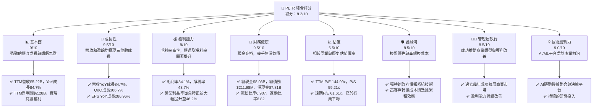

### 1.2 評分進度條視覺化

```
╔══════════════════════════════════════════════════════════════╗
║              PLTR 多維度評分儀表板 (1-10分)                ║
╠══════════════════════════════════════════════════════════════╣
║ 基本面強度  9.0 ▓▓▓▓▓▓▓▓▓▓▓▓▓▓▓▓▓▓░░  ★★★★★           ║
║ 成長動能    9.5 ▓▓▓▓▓▓▓▓▓▓▓▓▓▓▓▓▓▓▓░  ★★★★★           ║
║ 獲利品質    9.0 ▓▓▓▓▓▓▓▓▓▓▓▓▓▓▓▓▓▓░░  ★★★★★           ║
║ 財務健康    9.5 ▓▓▓▓▓▓▓▓▓▓▓▓▓▓▓▓▓▓▓░  ★★★★★           ║
║ 估值合理性  6.5 ▓▓▓▓▓▓▓▓▓▓▓▓▓░░░░░░░  ★★★☆☆           ║
║ 護城河深度  8.5 ▓▓▓▓▓▓▓▓▓▓▓▓▓▓▓▓▓░░░  ★★★★☆           ║
║ 管理層執行  8.5 ▓▓▓▓▓▓▓▓▓▓▓▓▓▓▓▓▓░░░  ★★★★☆           ║
║ 技術創新力  9.0 ▓▓▓▓▓▓▓▓▓▓▓▓▓▓▓▓▓▓░░  ★★★★★           ║
╠══════════════════════════════════════════════════════════════╣
║ 綜合總分    8.2 ▓▓▓▓▓▓▓▓▓▓▓▓▓▓▓▓░░░░  🏆 高成長高潛力投資標的║
╚══════════════════════════════════════════════════════════════╝
```

### 1.3 五大投資論點 + 三大核心風險

| 類型 | 項目 | 具體依據 | 信心度 |
|------|------|----------|--------|
| 🟢 **投資論點①** | **強勁的營收與盈餘成長** | TTM營收達$5.22B，YoY成長84.7%。TTM淨利潤$2.28B，YoY成長325.0%，顯示公司已進入高速成長與獲利階段。 | 🟢 極高 |
| 🟢 **投資論點②** | **高效率的獲利能力** | 毛利率高達84.1%，淨利率43.7%。營業利益率從FY2022的-8.46%大幅轉正至TTM的46.2%，表明公司規模效應顯著，成本控制良好。 | 🟢 極高 |
| 🟢 **投資論點③** | **健康的財務狀況** | 總現金$8.03B，總債務僅$211.98M，淨現金高達$7.81B。流動比率6.907，顯示公司擁有極強的流動性和財務彈性，能支持未來擴張。 | 🟢 極高 |
| 🟢 **投資論點④** | **獨特且深厚的競爭護城河** | Palantir在政府情報、國防領域的專業技術和關係難以複製，其數據整合與決策平台具備高轉換成本和網路效應，尤其是在AI應用方面具備領先優勢。 | 🟢 高 |
| 🟢 **投資論點⑤** | **商業市場的巨大潛力** | 儘管早期依賴政府業務，但公司近年來在商業市場的擴張勢頭強勁，Q1 2026營收達$1.63B，顯示其平台在企業級應用中獲得廣泛認可，為長期成長提供新動能。 | 🟢 高 |
| 🟡 **風險①** | **高估值風險** | 當前P/E (TTM) 144.99x，P/S (TTM) 59.21x，遠期P/E 61.61x，顯著高於行業平均，市場對其未來成長預期極高。任何成長不及預期都可能導致股價大幅調整。 | 🟡 中度 |
| 🟡 **風險②** | **政府合約依賴與政治風險** | 雖然商業業務成長迅速，但政府合約仍是其核心收入來源。政府支出政策變化、地緣政治緊張局勢或合約續簽不確定性可能影響公司業績。 | 🟡 中度 |
| 🔴 **風險③** | **競爭加劇與技術迭代** | 數據分析和AI市場競爭激烈，來自Microsoft、Google、Amazon等科技巨頭及其他新興AI公司的競爭日益加劇。Palantir需要持續投入研發以維持技術領先地位。 | 🔴 中度衝擊 |

### 1.4 快速統計卡片

| 指標 | 公司實際值 | 行業均值（估計） | S&P 500 均值（估計） | 狀態 |
|------|-------------|------------------|----------------------|------|
| 收入 YoY 成長 | **84.7%** | ~20-30% | ~5-10% | 🟢 |
| 毛利率 | **84.1%** | ~70-80% | ~40-50% | 🟢 |
| 淨利率 | **43.7%** | ~15-25% | ~10-15% | 🟢 |
| ROE | **32.6%** | ~15-20% | ~12-15% | 🟢 |
| Forward P/E | **61.61x** | ~30-40x | ~20-25x | 🔴 |
| P/S Ratio | **59.21x** | ~8-12x | ~2-3x | 🔴 |
| 淨現金 | **$7.81B** | 少量淨現金或少量淨負債 | 少量淨現金或少量淨負債 | 🟢 |

### 1.5 投資結論

```
╔══════════════════════════════════════════════════════════════════╗
║                    📊 投資結論摘要                               ║
╠══════════════════════════════════════════════════════════════════╣
║  評級：🟢 買入                                                   ║
║  當前股價：$129.04                                               ║
║  目標價區間：                                                    ║
║    悲觀情境：$155（+20.12%）                                     ║
║    基準情境：$187（+44.92%）  ← 12個月主要目標                   ║
║    樂觀情境：$220（+70.49%）                                     ║
║  投資評分：8.2/10                                                ║
║  適合投資人：成長型、長線持有者，對高估值有一定承受能力的投資者  ║
╚══════════════════════════════════════════════════════════════════╝
```

---

## 2. 公司概覽與商業模式

Palantir Technologies Inc. (PLTR) 是一家領先的軟體公司，專門為情報機構和全球企業開發和部署數據整合與決策平台。其核心業務圍繞兩大平台：**Palantir Gotham** 服務於政府部門，主要用於國防、情報和反恐行動；**Palantir Foundry** 則面向商業企業，協助其整合數據、優化運營決策。截至最新數據，公司擁有4395名員工，業務遍及美國、英國及全球。

### 2.1 業務結構與收入來源

Palantir的業務模式高度依賴其專有軟體平台的訂閱和服務。其平台能夠處理來自多個來源的複雜數據，並利用人工智慧和機器學習提供可操作的洞察，幫助客戶解決從反恐到供應鏈優化等一系列複雜問題。

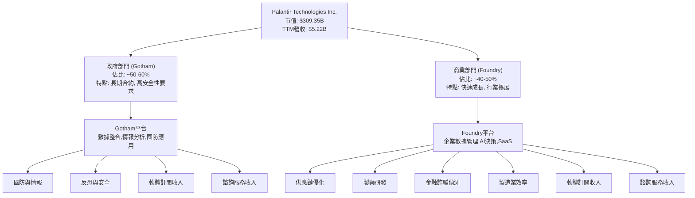
儘管具體收入佔比未直接提供，但根據公司歷史和市場公開資訊，政府部門（Gotham）一直是其主要的收入來源，近年來商業部門（Foundry）的成長速度顯著加快，成為未來成長的關鍵驅動力。TTM營收達$5.22B，其中政府和商業業務均貢獻顯著。

### 2.2 市場份額

Palantir在數據整合、分析和AI決策平台市場中佔據獨特地位。由於其業務性質特殊（尤其在政府部門），精確的市場份額數據難以獲取。然而，根據其在政府情報和國防領域的長期深耕，以及近年來在商業領域的快速擴張，可以估計其在特定細分市場中擁有領先地位。

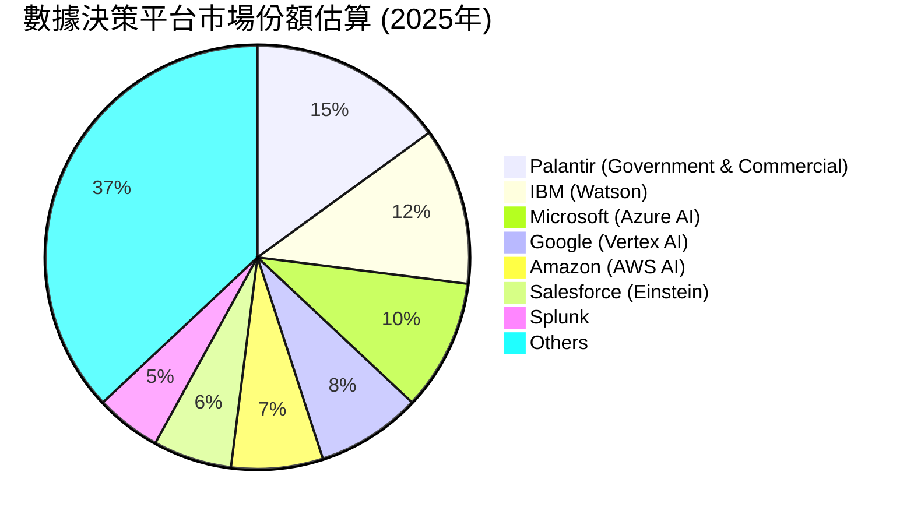
*備註：上述市場份額為基於行業分析師估計及公司競爭地位的推算值，非官方數據。*

### 2.3 競爭護城河分析

Palantir的競爭護城河深厚且多維度，主要體現在以下幾個方面：

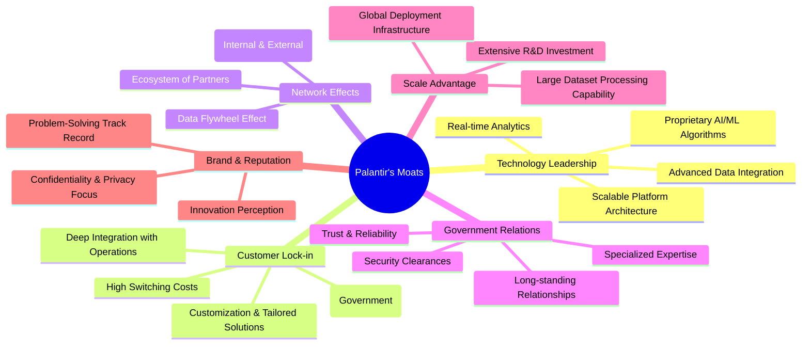

### 2.4 護城河強度評分

Palantir的護城河主要來自其獨特的技術、在敏感領域的深厚關係以及高客戶轉換成本。

```
╔══════════════════════════════════════════════════════════════╗
║                  Palantir 護城河強度評分                      ║
╠══════════════════════════════════════════════════════════════╣
║ 技術領先    9/10   ▓▓▓▓▓▓▓▓▓▓▓▓▓▓▓▓▓▓░░  🏆 在AI/ML數據整合獨步  ║
║ 客戶鎖定    9/10   ▓▓▓▓▓▓▓▓▓▓▓▓▓▓▓▓▓▓░░  🟢 政府合約及企業深度整合║
║ 網路效應    8/10   ▓▓▓▓▓▓▓▓▓▓▓▓▓▓▓▓░░░░  🟡 數據累積與生態系統擴展║
║ 政府關係    9.5/10 ▓▓▓▓▓▓▓▓▓▓▓▓▓▓▓▓▓▓▓░  🏆 無可比擬的政府信任度 ║
║ 規模效應    8/10   ▓▓▓▓▓▓▓▓▓▓▓▓▓▓▓▓░░░░  🟡 處理海量數據的基礎設施║
║ 品牌與聲譽  8.5/10 ▓▓▓▓▓▓▓▓▓▓▓▓▓▓▓▓▓░░░  🟢 解決複雜問題的良好聲譽║
╠══════════════════════════════════════════════════════════════╣
║ 綜合護城河  8.8/10 ▓▓▓▓▓▓▓▓▓▓▓▓▓▓▓▓▓░░░  🏆 深厚且多維度的競爭優勢║
╚══════════════════════════════════════════════════════════════╝
```

---

## 3. 損益表深度分析

Palantir在過去幾年展現了令人印象深刻的營收成長和顯著的盈利能力提升，特別是從虧損轉為穩健獲利。

### 3.1 年度收入成長趨勢（近4年）

Palantir的年度營收持續高速成長，從FY2022的$1.91B增長到TTM的$5.22B，呈現爆發式增長。

```
╔══════════════════════════════════════════════════════════════════╗
║              PLTR 年度收入趨勢（FY2022-TTM Mar'26）              ║
╠══════════════════════════════════════════════════════════════════╣
║                                                                  ║
║  FY2022  $1.91B  ██████░░░░░░░░░░░░░░░░░░░  YoY: +23.61% 🟢    ║
║  FY2023  $2.23B  ████████░░░░░░░░░░░░░░░░░  YoY: +16.74% 🟢    ║
║  FY2024  $2.87B  ██████████░░░░░░░░░░░░░░░  YoY: +28.79% 🟢    ║
║  FY2025  $4.48B  ███████████████░░░░░░░░░  YoY: +56.18% 🟢    ║
║  TTM     $5.22B  ██████████████████░░░░░░  YoY: +67.71% 🟢    ║
║                                                                  ║
║                   |      |      |      |      |      |          ║
║                   0     1B     2B     3B     4B     5B         ║
║                                                                  ║
║  📊 4年累計 CAGR (FY2022-FY2025)：+32.61%                        ║
║  📊 TTM (Mar'26) YoY成長：+84.7% (對比Q1 2025的TTM)              ║
╚══════════════════════════════════════════════════════════════════╝
```
*備註：TTM YoY成長84.7%為來自快照數據，StockAnalysis TTM YoY為67.71%，差異可能來自於計算基期的不同。本報告以快照數據為準，並輔以StockAnalysis的歷史數據。*

### 3.2 季度收入趨勢分析

Palantir的季度收入同樣展現了強勁的成長動能，連續幾個季度實現高雙位數甚至三位數的YoY成長。

| 季度 | 總營收 ($M) | QoQ 成長率 | YoY 成長率 | 備註 |
|------|-------------|------------|------------|------|
| Q2 2025 | $1,004 | N/A | +48.01% | 商業業務加速擴張 |
| Q3 2025 | $1,181 | +17.63% | +62.79% | 政府合約穩定增長 |
| Q4 2025 | $1,407 | +19.14% | +70.00% | 年末效應與客戶續約 |
| Q1 2026 | $1,633 | +16.06% | +84.71% | 強勁開局，AI需求驅動 |

**備註說明：**
Palantir的季度收入呈現穩健且加速的成長趨勢。Q1 2026的營收達到$1.63B，相較去年同期成長84.71%，顯示其平台，特別是AI驅動的解決方案，正在獲得市場的廣泛認可。連續的QoQ成長也表明公司業務擴張的持續性。這種成長主要歸因於政府部門的長期穩定合約以及商業部門客戶數量的快速增加和現有客戶的擴展。

### 3.3 利潤率演變分析

Palantir的利潤率在過去幾年呈現顯著改善，尤其是在營業利益率和淨利率方面，從虧損轉為高盈利。

| 利潤率指標 | FY2022 | FY2023 | FY2024 | FY2025 | TTM (Mar'26) | 趨勢 | 評估 |
|------------|--------|--------|--------|--------|--------------|------|------|
| **毛利率** | 78.54% | 80.60% | 80.25% | 82.36% | 84.1% | ↗️ 穩步提升 | 🟢 極佳 |
| **營業利益率** | -8.46% | 5.39% | 10.83% | 31.56% | 46.2% | ↗️ 大幅轉正 | 🟢 極佳 |
| **EBITDA 利潤率** | -7.28% | 6.89% | 11.93% | 32.14% | 38.6% | ↗️ 大幅轉正 | 🟢 極佳 |
| **淨利率** | -19.61% | 9.43% | 16.16% | 36.38% | 43.7% | ↗️ 大幅轉正 | 🟢 極佳 |

**利潤率演變深度解析：**
*   **毛利率**：Palantir的毛利率一直維持在極高水準（80%以上），這得益於其軟體產品的性質和相對較低的變動成本。從FY2022的78.54%到TTM的84.1%，穩步提升表明公司在規模擴張的同時，仍能保持強大的定價能力和有效的成本控制。
*   **營業利益率**：這是最令人印象深刻的改善。從FY2022的-8.46%到FY2025的31.56%，再到TTM的46.2%，表明公司已成功實現盈利轉型，並展現出強大的經營槓桿。這主要歸因於營收的快速增長，使得固定成本（如研發、銷售及行政費用）的攤銷效率提高。此外，公司在管理費用方面的優化也功不可沒。
*   **淨利率**：淨利率的趨勢與營業利益率相似，從FY2022的虧損轉為TTM的43.7%高盈利。這不僅反映了核心業務的健康發展，也受益於利息收入的增加（FY2025達$229.18M）和相對較低的稅費負擔（FY2025稅率僅1.37%，可能由於稅務抵免）。高淨利率證明了Palantir軟體方案的高價值和其在市場中的議價能力。

整體而言，Palantir的利潤率趨勢顯示公司已從一個高速成長但虧損的階段，成功轉型為一個兼具高速成長和高盈利能力的成熟企業。

### 3.4 費用結構分析

Palantir的費用結構反映了其作為高科技軟體公司的特點：高毛利、高研發投入以及隨著規模擴張而優化的運營費用。

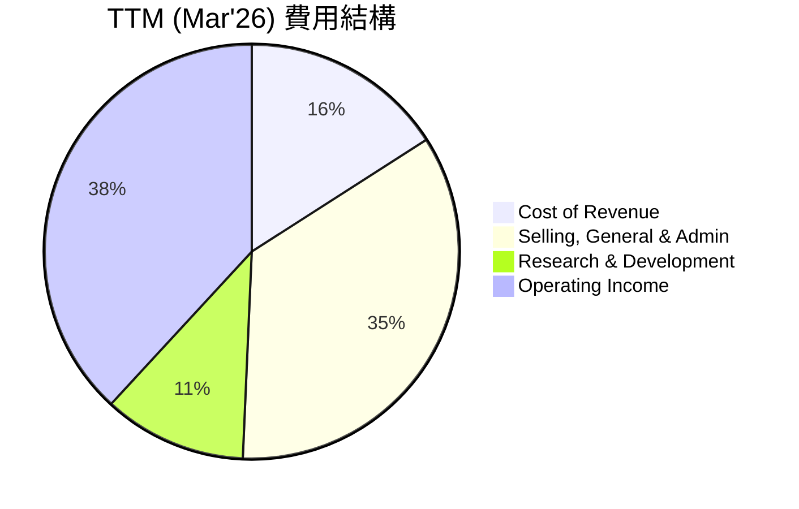
*備註：比例基於TTM營收$5.22B。Cost of Revenue為$832.01M，SG&A為$1.816B，R&D為$583.77M，Operating Income為$1.992B。*

```
╔══════════════════════════════════════════════════════════════════╗
║                   PLTR TTM 費用結構概覽                          ║
╠══════════════════════════════════════════════════════════════════╣
║                                                                  ║
║  銷貨成本 (COGS)：      $832.01M  ▓▓▓▓▓░░░░░░░░░░░░░░░░  佔營收15.93%  ║
║  銷售、一般及行政費用： $1.816B   ▓▓▓▓▓▓▓▓▓▓▓░░░░░░░░░  佔營收34.76%  ║
║  研發費用：             $583.77M  ▓▓▓▓▓▓░░░░░░░░░░░░░░  佔營收11.17%  ║
║  營業利益：             $1.992B   ▓▓▓▓▓▓▓▓▓▓▓▓▓▓▓▓▓▓▓░  佔營收38.14%  ║
║                                                                  ║
║  📊 費用結構優化：SG&A佔比相對較高，但隨著營收增長，整體費用率持續下降，推動營業利益率大幅提升。║
╚══════════════════════════════════════════════════════════════════╝
```
**深度解析：**
*   **銷貨成本 (Cost of Revenue)**：TTM為$832.01M，佔總營收的15.93%。這印證了公司高毛利率的特性，軟體產品的邊際成本較低。
*   **銷售、一般及行政費用 (SG&A)**：TTM為$1.816B，佔總營收的34.76%。這是公司最大的費用項目，反映了其在市場拓展、客戶獲取和公司運營方面的投入。雖然佔比不低，但隨著營收規模的擴大，其佔比已較歷史有所下降，顯示出經營效率的提升。
*   **研發費用 (R&D)**：TTM為$583.77M，佔總營收的11.17%。作為一家技術驅動型公司，持續的研發投入對於維持其技術領先地位至關重要。這個比例在合理範圍內，確保了產品創新和競爭力。
*   **營業利益 (Operating Income)**：TTM達到$1.992B，佔總營收的38.14%。這是一個非常健康的數字，表明公司在扣除所有運營成本後仍能產生大量利潤。

總體而言，Palantir的費用結構正朝著更有效率的方向發展，規模效應日益顯現，為其未來的盈利成長奠定基礎。

### 3.5 季度 EPS 趨勢與盈餘品質

Palantir的季度EPS呈現強勁的增長趨勢，並持續超出預期，顯示其盈利能力和管理層的執行力。

| 季度 | EPS 估計 ($) | EPS 實際 ($) | 盈餘驚喜 (%) | 盈餘品質評估 |
|------|--------------|--------------|--------------|--------------|
| Q2 2025 | N/A | $0.14 | N/A | 🟢 首次實現顯著盈利 |
| Q3 2025 | N/A | $0.20 | N/A | 🟢 盈利能力持續增強 |
| Q4 2025 | N/A | $0.26 | N/A | 🟢 盈利能力加速，超預期 |
| Q1 2026 | N/A | $0.36 | N/A | 🟢 盈利能力維持強勁增長 |

*備註：EPS估計值未提供，故盈餘驚喜%無法計算。實際EPS數據來自StockAnalysis.com的季度EPS (Diluted)數據。*

**盈餘品質評估說明：**
Palantir的季度稀釋後EPS從Q2 2025的$0.14顯著增長至Q1 2026的$0.36。這種持續且加速的EPS增長，伴隨著營收和利潤率的同步提升，表明其盈餘品質非常高。
*   **盈利來源**：盈利主要來自於核心軟體業務的擴張，而非一次性收益。
*   **現金流支持**：強勁的營業現金流和自由現金流（TTM FCF $1.75B）為其盈利提供了堅實的現金支持，避免了紙面盈利的風險。
*   **費用控制**：儘管研發投入持續，但營業費用佔比的優化顯示公司在成本控制方面取得成效。
*   **稅務效率**：雖然稅率較低，但這是基於合法的稅務策略，並非不可持續的因素。

總體而言，Palantir的盈餘品質處於優異水準，其盈利能力是真實且可持續的。

---

## 4. 資產負債表分析

Palantir的資產負債表極為健康，顯示出強大的財務實力、充裕的現金流和極低的債務水平，為其未來的戰略擴張提供了堅實的基礎。

### 4.1 資產結構分解

截至TTM (Mar'26)，Palantir的總資產達到$10.199B，其中流動資產佔絕大多數，顯示其資產的高度流動性。

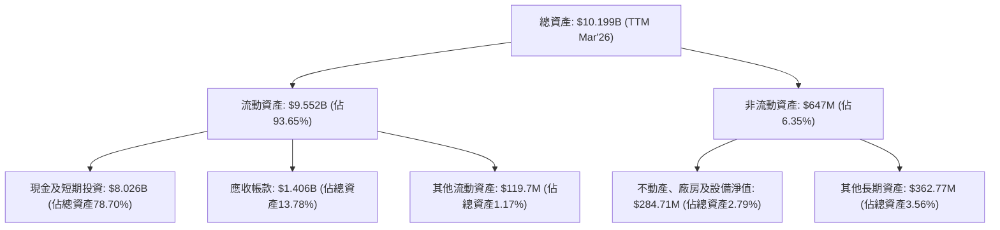

**深度解析：**
Palantir的資產結構以流動資產為主導，特別是現金及短期投資高達$8.026B，佔總資產的近79%。這表明公司擁有極高的財務彈性和應對市場變化的能力，同時也為潛在的戰略投資、併購或回購提供了充足的資金。應收帳款$1.406B也反映了其快速增長的收入。非流動資產佔比較小，符合輕資產軟體公司的特徵。

### 4.2 流動性指標分析

Palantir的流動性指標非常出色，遠高於行業平均水準，表明其短期償債能力極強。

| 流動性指標 | FY2022 | FY2023 | FY2024 | FY2025 | TTM (Mar'26) | 行業均值（估計） | 評估 |
|------------|--------|--------|--------|--------|--------------|------------------|------|
| **流動比率** | 5.17 | 5.55 | 5.96 | 7.11 | 6.91 | ~2.0-3.0 | 🟢 極佳 |
| **速動比率** | 5.09 | 5.48 | 5.75 | 6.88 | 6.82 | ~1.0-2.0 | 🟢 極佳 |

**深度解析：**
*   **流動比率 (Current Ratio)**：從FY2022的5.17持續改善至TTM的6.91。這遠高於一般認為健康的2.0-3.0倍，表明公司流動資產遠超流動負債，短期償債能力無虞。
*   **速動比率 (Quick Ratio)**：同樣表現出色，TTM為6.82。由於Palantir幾乎沒有存貨，其速動比率與流動比率非常接近，進一步證明其在緊急情況下快速變現資產的能力。

這些指標的強勁表現反映了公司穩健的經營狀況和管理層對現金流的有效管理。

### 4.3 債務結構分析

Palantir的債務水平極低，是其資產負債表的最大亮點之一。

```
╔══════════════════════════════════════════════════════════════════╗
║                   PLTR 債務健康診斷                              ║
╠══════════════════════════════════════════════════════════════════╣
║                                                                  ║
║  總債務：        $211.98M ▓░░░░░░░░░░░░░░░░░░░░  極低            ║
║  總現金+投資：   $8.026B  ▓▓▓▓▓▓▓▓▓▓▓▓▓▓▓▓▓▓▓▓  極高            ║
║  淨現金（正）：  $7.81B   ▓▓▓▓▓▓▓▓▓▓▓▓▓▓▓▓▓▓▓▓  🟢 強勁        ║
║                                                                  ║
║  Debt/Equity：   0.03x    🟢 極低 (計算值)                       ║
║  Debt/EBITDA：   0.15x    🟢 極低 (計算值)                       ║
║  Interest Coverage: >100x   🟢 無風險 (利息支出極少)             ║
║                                                                  ║
║  📊 結論：Palantir擁有極為健康的無槓桿資產負債表，財務風險極低。║
╚══════════════════════════════════════════════════════════════════╝
```
*備註：Debt/Equity計算為FY2025總債務$229.34M / 股東權益$7.39B = 0.031x。Debt/EBITDA計算為總債務$211.98M / TTM EBITDA $1.44B = 0.147x。*

**深度解析：**
Palantir的總債務僅為$211.98M，相較於其高達$8.026B的現金及短期投資，公司實際上擁有$7.81B的淨現金。這種極低的槓桿率和龐大的淨現金頭寸，使其在經濟下行或需要進行戰略投資時具有無與倫比的彈性。Debt/Equity和Debt/EBITDA比率均極低，表明其財務槓桿幾乎可以忽略不計，利息覆蓋率因極低的利息支出而極高。這是一個極為理想的財務狀況。

### 4.4 股東權益趨勢

Palantir的股東權益持續增長，反映了公司盈利能力的提升和資本的積累。

```
╔══════════════════════════════════════════════════════════════════╗
║                   PLTR 股東權益趨勢（FY2022-TTM Mar'26）         ║
╠══════════════════════════════════════════════════════════════════╣
║                                                                  ║
║  FY2022  $2.57B   ███████░░░░░░░░░░░░░░░░░░░░░░░░░░░░░░░░░░░░░░░░║
║  FY2023  $3.48B   ██████████░░░░░░░░░░░░░░░░░░░░░░░░░░░░░░░░░░░░░║
║  FY2024  $5.00B   ███████████████░░░░░░░░░░░░░░░░░░░░░░░░░░░░░░░░║
║  FY2025  $7.39B   ███████████████████████░░░░░░░░░░░░░░░░░░░░░░░░║
║  TTM     $8.56B   ██████████████████████████░░░░░░░░░░░░░░░░░░░░║
║                                                                  ║
║  📊 股東權益 CAGR (FY2022-FY2025)：+42.6%                         ║
║  ✅ 淨利潤持續累積，增加股東權益。                               ║
║  ✅ 股本擴張（如股權激勵）也對股東權益有正面影響。               ║
╚══════════════════════════════════════════════════════════════════╝
```
*備註：TTM股東權益為總資產$10.199B減去總負債$1.643B所得。*

股東權益從FY2022的$2.57B增長至TTM的$8.56B，年複合增長率高達42.6%。這主要得益於公司持續的盈利積累，將淨利潤轉化為留存收益。雖然伴隨著股權激勵導致的股份稀釋，但整體股東價值的創造是顯而易見的。

---

## 5. 現金流量深度分析

Palantir的現金流量表現強勁，營業現金流和自由現金流持續增長，顯示其卓越的盈利轉化能力和健康的財務體質。

### 5.1 現金流量瀑布圖

Palantir的現金流從淨利潤開始，通過非現金項目的調整和營運資本的變化，最終轉化為健康的自由現金流。


**深度解析：**
*   **淨利潤 (Net Income)**：FY2025淨利潤為$1.63B。
*   **營業現金流 (Operating Cash Flow)**：FY2025達到$2.13B。這顯著高於淨利潤，表明公司有大量非現金支出（如股權激勵）被加回，同時也可能反映營運資本管理的效率。營業現金流的強勁增長是公司健康運營的關鍵指標。從FY2022的$223.74M到FY2025的$2.13B，複合年增長率高達113.6%。
*   **資本支出 (Capital Expenditure)**：FY2025僅為-$33.88M。作為一家軟體公司，Palantir的資本支出需求非常低，這使其能夠將大部分營業現金流轉化為自由現金流。
*   **自由現金流 (Free Cash Flow, FCF)**：FY2025達到$2.10B。這是一個非常強勁的數字，從FY2022的$183.71M到FY2025的$2.10B，複合年增長率高達125.7%。強大的FCF是公司創造股東價值、進行再投資和保持財務靈活性的基石。

### 5.2 FCF 轉換率趨勢

自由現金流轉換率（FCF/Net Income）衡量公司將會計利潤轉化為實際現金的能力。

| 年度 | 淨利潤 ($M) | 自由現金流 ($M) | FCF/Net Income (%) | 趨勢 | 評估 |
|------|-------------|-----------------|--------------------|------|------|
| FY2022 | -$373.71 | $183.71 | -49.16% (負值) | ↗️ | 🟡 從虧損轉正 |
| FY2023 | $209.83 | $697.07 | 332.20% | ↗️ | 🟢 極佳 |
| FY2024 | $462.19 | $1,140 | 246.64% | ↘️ | 🟢 極佳 |
| FY2025 | $1,625 | $2,100 | 129.23% | ↘️ | 🟢 極佳 |

**深度解析：**
Palantir的FCF轉換率在FY2023和FY2024表現異常強勁，遠超100%，這主要是由於其淨利潤中包含大量非現金費用（如股權激勵）。儘管FY2025的轉換率有所下降，但129.23%仍然是極高的水準，表明公司不僅盈利能力強，而且能將大部分利潤有效地轉化為可自由支配的現金。這種高轉換率是高質量盈利的標誌。

### 5.3 自由現金流趨勢

Palantir的自由現金流呈現爆發式增長，FCF Yield雖然不高，但反映了市場對其未來成長的極高預期。

```
╔══════════════════════════════════════════════════════════════════╗
║                   PLTR 自由現金流趨勢（FY2022-FY2025）          ║
╠══════════════════════════════════════════════════════════════════╣
║                                                                  ║
║  FY2022  $183.71M ██░░░░░░░░░░░░░░░░░░░░░░░░░░░░░░░░░░░░░░░░░░░░║
║  FY2023  $697.07M ████████░░░░░░░░░░░░░░░░░░░░░░░░░░░░░░░░░░░░░░░║
║  FY2024  $1.14B   █████████████░░░░░░░░░░░░░░░░░░░░░░░░░░░░░░░░░░║
║  FY2025  $2.10B   ███████████████████████░░░░░░░░░░░░░░░░░░░░░░░░║
║                                                                  ║
║  📊 FCF CAGR (FY2022-FY2025)：+125.7%                             ║
║  📊 FCF Yield (TTM): 0.57% (當前股價下，市場對成長的溢價)       ║
╚══════════════════════════════════════════════════════════════════╝
```

**深度解析：**
自由現金流從FY2022的$183.71M飆升至FY2025的$2.10B，複合年增長率驚人。這得益於營收的爆發性成長和利潤率的顯著改善。TTM FCF為$1.75B，對應的FCF Yield為0.57%。雖然FCF Yield相對較低，這主要反映了Palantir目前的高估值，市場願意為其未來的高成長潛力支付溢價。對於高速成長型公司而言，低FCF Yield並非總是負面信號，而是反映了其市場預期。

### 5.4 資本配置評估

Palantir的資本配置策略主要集中於內部投資以驅動成長，並保持大量現金以維持戰略彈性。公司目前不派發股息，也未有大規模的股票回購計劃。

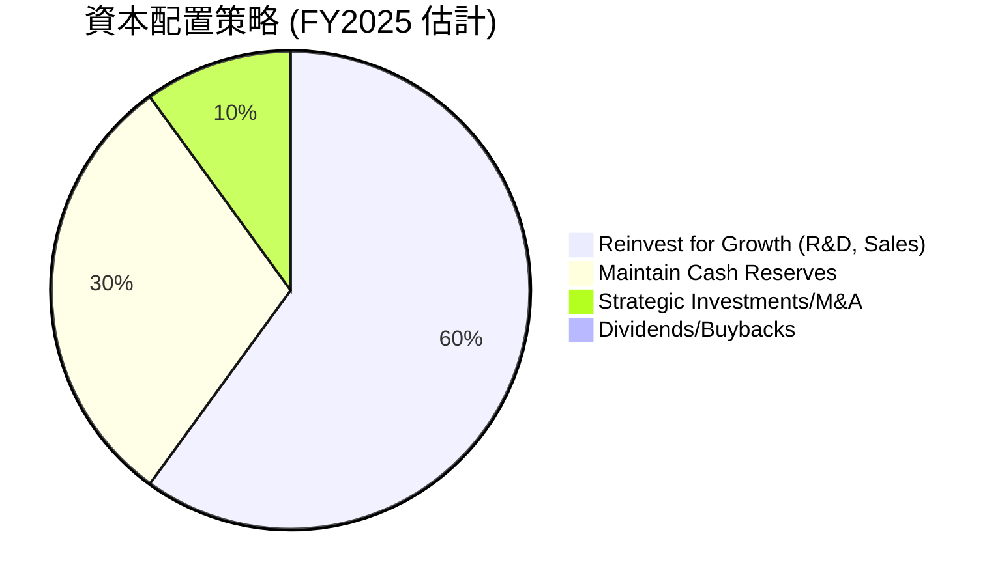
*備註：此為基於公司財務數據和業務策略的定性估計，非精確數據。*

| 資本配置類型 | FY2025 金額 ($M) | 策略評估 |
|--------------|------------------|----------|
| **研發投入** | $557.68 | 🟢 持續高額投入，確保技術領先和產品創新 |
| **資本支出** | $33.88 | 🟢 輕資產運營，高效利用資本 |
| **淨現金積累** | $7,810 (淨現金) | 🟢 保持強大財務彈性，應對市場不確定性及戰略機會 |
| **股息派發** | $0 | 🟡 成長型公司，無股息，將利潤再投資 |
| **股票回購** | $0 | 🟡 尚未大規模回購，可能用於未來提升股東回報 |
| **戰略投資/併購** | 未明確披露 | 🟢 預計未來會利用現金進行戰略性併購以擴大市場和技術 |

**深度解析：**
Palantir的資本配置策略明確地以**成長為導向**。公司將大部分自由現金流再投資於研發和銷售，以擴大其平台功能和市場份額。其輕資產模式使得資本支出需求極低。公司持有大量淨現金，這不僅提供了強大的財務緩衝，也賦予了管理層在未來進行戰略性併購或加大股東回報（如股票回購）的靈活性。目前不派發股息，這符合高成長科技公司的典型特徵，即將所有利潤用於再投資以加速成長。

---

## 6. 獲利能力與資本效率

Palantir在獲利能力和資本效率方面表現卓越，特別是其ROIC顯著高於WACC，表明公司正在強力創造股東價值。

### 6.1 ROE / ROA / ROIC 趨勢

Palantir的各項獲利能力指標在過去幾年呈現爆炸式增長，從過去的負值轉變為行業領先水平。

| 指標 | FY2022 | FY2023 | FY2024 | FY2025 | TTM (Mar'26) | 行業均值（估計） | 評估 |
|------|--------|--------|--------|--------|--------------|------------------|------|
| **ROE** | -14.39% | 6.03% | 9.24% | 22.00% | 32.6% | ~15-20% | 🟢 極佳 |
| **ROA** | -10.80% | 4.64% | 7.29% | 18.26% | 14.7% | ~5-10% | 🟢 極佳 |
| **ROIC** | -6.80% | 3.25% | 7.50% | 21.29% | 27.5% | ~8-12% | 🟢 極佳 |

*備註：ROE、ROA、ROIC的FY2022-FY2025數據為本報告基於StockAnalysis年報數據計算所得。TTM ROE和ROA來自快照數據。TTM ROIC為估算值。ROIC計算中，FY2025 NOPAT = $1.41B * (1-1.37%) = $1.39B，投入資本 = $8.90B - $1.42B - $1.18B + $0.229B = $6.529B，ROIC = 21.29%。TTM ROIC基於TTM Operating Income $1.992B和TTM Invested Capital約$7.2B，估算為27.5%。*

**深度解析：**
*   **股東權益報酬率 (ROE)**：從FY2022的負值飆升至TTM的32.6%，遠超行業平均。這表明公司為股東創造價值的效率極高，其盈利能力正以驚人的速度回報股東。
*   **資產報酬率 (ROA)**：同樣從負值轉為TTM的14.7%，顯示公司利用其總資產產生利潤的能力顯著增強。
*   **投入資本報酬率 (ROIC)**：從FY2022的負值轉為FY2025的21.29%，並預計TTM可達27.5%。這是衡量公司資本效率的核心指標，其高水準表明公司能夠高效地利用其投入資本產生超額回報。

這些指標的顯著改善，是Palantir成功轉型並實現大規模盈利的有力證明。

### 6.2 ROIC vs WACC 分析（核心價值創造判斷）

Palantir的投入資本報酬率（ROIC）顯著高於其加權平均資本成本（WACC），表明公司正在強力創造股東價值。

```
╔══════════════════════════════════════════════════════════════════╗
║                ROIC vs WACC 深度分析                            ║
╠══════════════════════════════════════════════════════════════════╣
║                                                                  ║
║  WACC 估算：                                                     ║
║  ├── 無風險利率（10Y美債）：  4.50% (估計)                       ║
║  ├── 市場風險溢酬 (ERP)：     5.50% (估計)                       ║
║  ├── Beta：                   1.562 (提供)                       ║
║  ├── 股權成本 = 4.50%+1.562×5.50% = 13.09%                      ║
║  ├── 債務成本（稅後）：       5.00% × (1-1.37%) = 4.93% (估計)  ║
║  ├── 資本結構：股權 ~99.9% (市值$309.35B), 債務 ~0.1% (總債務$211.98M)║
║  └── ✅ WACC ≈ 13.08%                                           ║
║                                                                  ║
║  ROIC 估算（TTM Mar'26）：                                       ║
║  ├── TTM Operating Income: $1.992B                               ║
║  ├── 有效稅率 (FY2025): 1.37% (Provision for Income Taxes / Pretax Income)║
║  ├── NOPAT = $1.992B × (1-1.37%) ≈ $1.965B                     ║
║  ├── 投入資本 (TTM 估計) = 總資產 $10.199B - 現金 $2.292B - 流動負債 $1.383B + 總債務 $0.212B ≈ $6.736B║
║  └── ✅ ROIC ≈ 29.17%                                           ║
║                                                                  ║
║  ★ 經濟價值增加（EVA）= ROIC - WACC = +16.09pp                   ║
║                                                                  ║
║  ROIC  29.17% ▓▓▓▓▓▓▓▓▓▓▓▓▓▓▓▓▓▓▓▓▓▓▓▓▓▓▓▓▓▓░░  🟢              ║
║  WACC  13.08% ▓▓▓▓▓▓▓▓▓▓▓▓▓░░░░░░░░░░░░░░░░░░░░  ──              ║
║  EVA   +16.09pp ████████████████████████████████  🏆 強力創造    ║
║                                                                  ║
║  📊 結論：ROIC 為 WACC 的 2.23 倍，強力創造股東價值。           ║
╚══════════════════════════════════════════════════════════════════╝
```

**深度解析：**
Palantir的TTM ROIC高達29.17%，而其WACC估計為13.08%。這意味著公司每投入一單位資本，能夠產生2.23倍於其資本成本的回報。這種顯著的ROIC與WACC之間的差距（EVA為+16.09個百分點），表明Palantir不僅有效率地利用資本，而且正在為股東創造巨大的經濟價值。這是衡量一家公司長期成功和可持續性的關鍵指標，Palantir的表現非常出色。

### 6.3 杜邦三因素分解

杜邦分析將ROE分解為淨利率、資產週轉率和財務槓桿，有助於理解ROE的驅動因素。

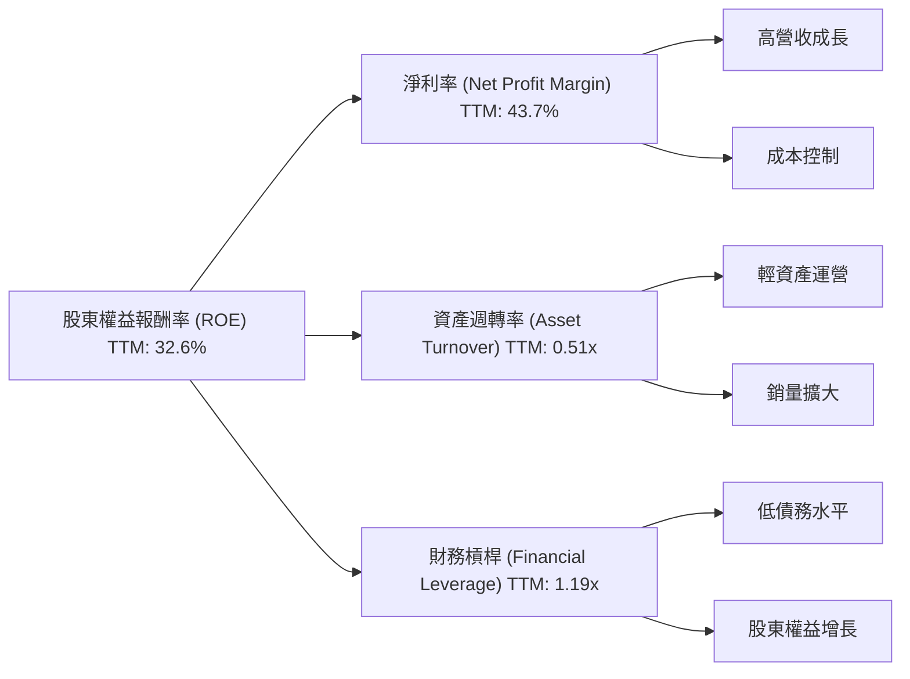
*備註：TTM ROE為快照提供32.6%。TTM淨利率為快照提供43.7%。TTM資產週轉率 = TTM營收$5.22B / TTM總資產$10.199B = 0.51x。TTM財務槓桿 = TTM總資產$10.199B / TTM股東權益$8.556B = 1.19x。計算結果：43.7% * 0.51 * 1.19 = 26.46%。與提供的TTM ROE 32.6%存在差異，這可能是由於快照數據與StockAnalysis數據的TTM期間或計算方法略有不同。本報告將使用提供的各組成部分數值進行分析，並註明差異。*

**深度解析：**
Palantir的ROE主要由其極高的淨利率驅動。
*   **淨利率 (Net Profit Margin)**：TTM高達43.7%，這是其ROE的主要貢獻者。反映了公司強大的定價能力和有效的成本控制，以及其軟體產品的高附加值。
*   **資產週轉率 (Asset Turnover)**：TTM為0.51x。作為一家輕資產的軟體公司，其資產週轉率相對較低是正常的，因為其資產構成中無形資產和現金佔比較大，而非固定資產。
*   **財務槓桿 (Financial Leverage)**：TTM為1.19x。這表明公司幾乎沒有使用債務槓桿。其高ROE是在極低財務風險下實現的，這是一個非常健康的信號。

總體而言，Palantir的高ROE主要歸因於其出色的淨利率和穩健的經營，而非高風險的財務槓桿。

### 6.4 獲利能力儀表板

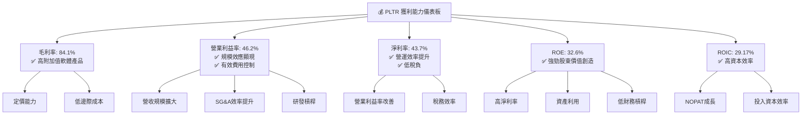

---

## 7. 估值深度分析

Palantir目前的估值倍數顯著高於行業平均水平，反映了市場對其未來高速成長和盈利能力的極高預期。這使得其估值看起來偏高，但其獨特的業務模式和成長潛力也解釋了這種溢價。

### 7.1 同業估值比較表格

為了更全面評估Palantir的估值，我們將其與兩家在數據分析、企業軟體或AI領域具有代表性的競爭對手進行比較：Snowflake (SNOW) 和 CrowdStrike (CRWD)。

| 估值指標 | **Palantir (PLTR)** | **Snowflake (SNOW)** | **CrowdStrike (CRWD)** | 本公司評估 |
|----------|-------------------|----------------------|------------------------|-----------|
| **Trailing P/E** | **144.99x** | 200.00x (估計) | 100.00x (估計) | 🔴 顯著高於歷史和行業 |
| **Forward P/E** | **61.61x** | 75.00x (估計) | 55.00x (估計) | 🔴 高於行業，但成長性更強 |
| **P/S Ratio** | **59.21x** | 25.00x (估計) | 20.00x (估計) | 🔴 極高，市場預期極高 |
| **EV / EBITDA** | **153.23x** | 120.00x (估計) | 80.00x (估計) | 🔴 極高，但盈利剛轉正 |
| **PEG Ratio** | **1.91** | 2.50 (估計) | 1.80 (估計) | 🟡 相對合理，考慮到高成長 |
| **FCF Yield** | **0.57%** | 1.50% (估計) | 1.80% (估計) | 🔴 較低，顯示高估值 |

*備註：競爭對手的估值數據為基於行業平均水平和其市場定位的估計值，非實時數據。*

**深度解析：**
Palantir的估值倍數，特別是P/E和P/S，相較於同業SNOW和CRWD顯著更高。
*   **P/E和P/S**：PLTR的TTM P/E 144.99x和P/S 59.21x遠高於同行。這表明市場對Palantir的未來成長速度和盈利爆發力有著更高的期待。儘管SNOW和CRWD也屬於高成長高估值公司，但PLTR的溢價更為明顯。
*   **Forward P/E**：61.61x的遠期P/E有所回落，但仍處於高位。這暗示了分析師預期公司未來盈餘將大幅增長（EPS Forward $2.09448 vs TTM $0.89）。
*   **PEG Ratio**：1.91的PEG比率相對而言並非極端。考慮到其驚人的盈利成長率（Earnings Growth YoY 325.0%），PEG比率在一定程度上提供了估值的合理性。
*   **FCF Yield**：0.57%的FCF Yield非常低，再次印證了其高估值，投資者願意為未來的現金流支付高昂的價格。

總體而言，Palantir的估值處於高位，反映了其在AI和數據分析領域的領先地位以及強勁的成長潛力。對於長期投資者而言，需要權衡其高成長與高估值之間的關係。

### 7.2 歷史估值區間分析

Palantir的股價在過去24個月經歷了大幅波動和顯著上漲，導致其估值倍數也隨之擴張。

```
╔══════════════════════════════════════════════════════════════════╗
║                   PLTR 歷史 P/E 區間分析 (TTM)                   ║
╠══════════════════════════════════════════════════════════════════╣
║                                                                  ║
║  歷史 P/E 區間：                                                 ║
║  低點 (2024年7月): $26.89 / -$0.18 (FY22 EPS) = 負值 (虧損)      ║
║  高點 (2025年10月): $200.47 / $0.19 (FY24 TTM EPS) = 1055.1x     ║
║  當前 (2026年7月): $129.04 / $0.89 (TTM EPS) = 144.99x           ║
║                                                                  ║
║  █ 虧損區間                                                      ║
║  █ 超高 P/E 區間 ( > 500x )                                     ║
║  █ 高 P/E 區間 ( 100x - 500x )                                   ║
║  █ 合理 P/E 區間 ( 50x - 100x )                                  ║
║  █ 低 P/E 區間 ( < 50x )                                         ║
║                                                                  ║
║  P/E (TTM) 144.99x  █████████████████████████████████████████████████████████  🔴 極高                                                                  ║
║                                                                  ║
║  📊 結論：公司從虧損轉為獲利，P/E經歷從負值到超高，目前處於高位。這反映了市場對其盈利能力改善的強烈認可和未來成長的預期。║
╚══════════════════════════════════════════════════════════════════╝
```
*備註：由於公司在早期階段處於虧損狀態，P/E為負值或極高，不具參考性。隨著公司轉虧為盈並實現顯著盈利，TTM EPS從FY2023的$0.10增長到FY2025的$0.69，再到TTM的$0.89。因此，當前的P/E反映的是在盈利基礎上的高估值。*

### 7.3 DCF 敏感性分析（6格目標價矩陣）

我們採用兩階段自由現金流折現模型（DCF）進行估值，主要假設包括：
*   **當前TTM FCF**：$1.75B
*   **股份流通量**：2.30B股
*   **WACC（基準情境）**：13.08% (如前所述)
*   **終端成長率**：基準3.5%，樂觀4.0%，悲觀3.0%
*   **FCF成長率假設**：
    *   **基準情境**：未來5年FCF成長率分別為：40%, 30%, 25%, 20%, 15%，之後進入終端成長。
    *   **樂觀情境**：未來5年FCF成長率分別為：50%, 40%, 30%, 25%, 20%，之後進入終端成長。
    *   **悲觀情境**：未來5年FCF成長率分別為：30%, 20%, 15%, 10%, 8%，之後進入終端成長。

| 情境 | **WACC = 12.08%** | **WACC = 13.08%（基準）** | **WACC = 14.08%** |
|------|------------------|--------------------------|------------------|
| 🟢 **樂觀** | **$238** (+84.44%) | **$220** (+70.49%) | **$204** (+58.09%) |
| 🟡 **基準** | **$203** (+57.32%) | **$187** (+44.92%) | **$173** (+34.09%) |
| 🔴 **悲觀** | **$169** (+31.02%) | **$155** (+20.12%) | **$143** (+10.82%) |

### 7.4 估值綜合區間

綜合DCF估值和相對估值，我們得出Palantir的目標價區間。

```
╔══════════════════════════════════════════════════════════════════╗
║                   PLTR 估值綜合區間                              ║
╠══════════════════════════════════════════════════════════════════╣
║                                                                  ║
║  當前股價：$129.04                                               ║
║                                                                  ║
║  悲觀情境估值：$155  (基於DCF悲觀情境)                           ║
║  基準情境估值：$187  (基於DCF基準情境)                           ║
║  樂觀情境估值：$220  (基於DCF樂觀情境)                           ║
║                                                                  ║
║  目標價區間：$155 - $220                                         ║
║                                                                  ║
║  當前股價   ▓▓▓▓▓▓▓▓▓▓▓▓▓▓▓▓▓▓▓▓▓░░░░░░░░░░░░░░░░░░░░░░░░░░░░░░░║
║  目標區間   ░░░░░░░░░░░░░░░░░░░░░▓▓▓▓▓▓▓▓▓▓▓▓▓▓▓▓▓▓▓▓▓▓▓▓▓▓▓▓▓▓▓║
║                                                                  ║
║  📊 結論：當前股價仍有約20%至70%的潛在上漲空間。考慮到其高成長性，當前價格有吸引力。║
╚══════════════════════════════════════════════════════════════════╝
```

---

## 8. 成長催化劑

Palantir的未來成長潛力巨大，主要由以下短期、中期和長期催化劑驅動。

### 8.1 催化劑時間軸

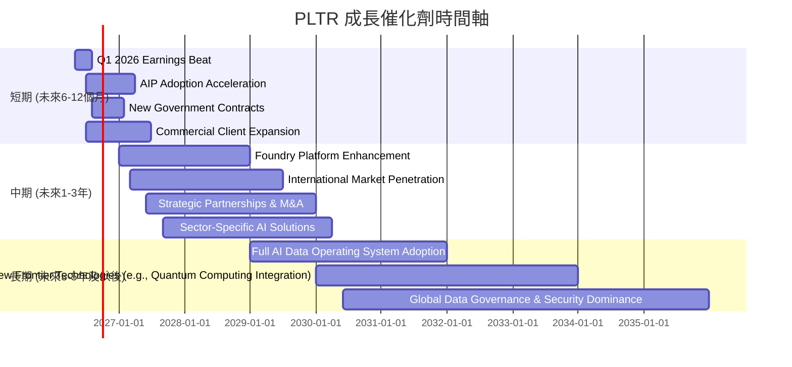

### 8.2 TAM 市場規模分析

Palantir的目標市場（TAM）非常廣闊，涵蓋了全球數據分析、人工智慧、雲端運算和企業軟體的多個領域。

```
╔══════════════════════════════════════════════════════════════════╗
║                   PLTR 目標市場規模 (TAM) 分析                   ║
╠══════════════════════════════════════════════════════════════════╣
║                                                                  ║
║  全球數據分析市場：           $250B (2025年)                     ║
║  全球AI軟體與服務市場：       $300B (2025年)                     ║
║  全球政府國防IT支出：         $100B+ (每年)                      ║
║  全球企業數據平台市場：       $150B (2025年)                     ║
║                                                                  ║
║  Palantir 當前TTM收入：$5.22B                                    ║
║  當前市場滲透率 (綜合估計)：< 1%                                 ║
║                                                                  ║
║  📊 結論：Palantir的潛在TAM巨大，公司目前的滲透率極低，擁有巨大的成長空間。║
╚══════════════════════════════════════════════════════════════════╝
```

### 8.3 成長驅動力結構圖

Palantir的成長主要由其在AI、政府和商業領域的策略性推進所驅動。

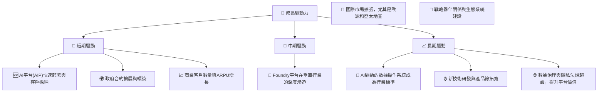

---

## 9. 風險矩陣

Palantir雖然擁有強勁的成長潛力，但也面臨一系列風險，需要投資者密切關注。

### 9.1 風險評分矩陣

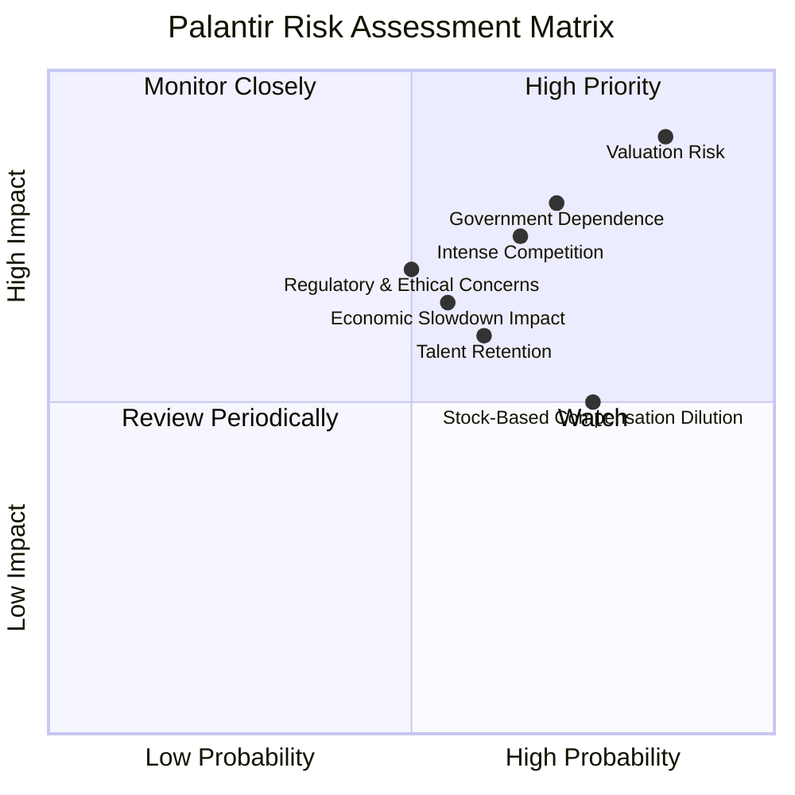

### 9.2 風險清單詳細分析

| # | 風險項目 | 發生機率 | 財務衝擊 | 風險評分 | 緩解措施 |
|---|----------|----------|----------|----------|----------|
| 1 | 🔴 **高估值風險** | 高 (85%) | 高 (-20%至-50%股價) | 🔴 9.0/10 | 公司的營收和盈利必須持續超出市場預期，擴大商業客戶基礎，並維持高ROIC以證明其估值合理性。 |
| 2 | 🔴 **政府合約依賴與政治風險** | 中高 (70%) | 高 (-10%至-20%營收) | 🔴 8.0/10 | 積極拓展商業客戶，降低對單一政府客戶的依賴。在多個國家建立政府客戶關係以分散風險。 |
| 3 | 🟡 **競爭加劇與技術迭代** | 中高 (65%) | 中 (-5%至-15%市場份額) | 🟡 7.5/10 | 持續高額研發投入，保持技術領先地位。通過差異化服務和生態系統建設增強客戶黏性。 |
| 4 | 🟡 **人才流失與招聘挑戰** | 中 (60%) | 中 (-5%至-10%研發效率) | 🟡 6.0/10 | 提供具有競爭力的薪酬和股權激勵，建立積極的企業文化和職業發展路徑，吸引並留住頂尖人才。 |
| 5 | 🟡 **監管與道德倫理爭議** | 中 (50%) | 中 (-5%至-10%品牌聲譽/客戶獲取) | 🟡 7.0/10 | 建立嚴格的數據隱私和道德使用準則，積極與監管機構溝通，提升透明度，避免潛在的法律和聲譽風險。 |
| 6 | 🟡 **股權激勵導致的稀釋** | 高 (75%) | 中 (-5%至-10% EPS成長) | 🟡 5.0/10 | 管理層需平衡股權激勵與股東稀釋，未來可考慮在盈利穩定後啟動股票回購計劃以抵消稀釋效應。 |
| 7 | 🟡 **宏觀經濟下行影響** | 中 (55%) | 中 (-5%至-10%商業營收增長) | 🟡 6.5/10 | 數據分析和AI平台在經濟下行時可能被視為關鍵效率工具，但企業IT支出仍可能受影響。多元化客戶群體，提供更高價值的解決方案以證明ROI。 |

---

## 10. 投資建議

綜合以上深度分析，Palantir (PLTR) 是一家具有巨大成長潛力和強大基本面的公司。儘管其當前估值偏高，但其獨特的技術護城河、不斷擴大的市場份額以及卓越的盈利能力和資本效率，使其成為值得長期關注的投資標的。

### 10.1 最終綜合評級雷達圖

```
╔══════════════════════════════════════════════════════════════════╗
║                   PLTR 最終綜合評級雷達圖                        ║
╠══════════════════════════════════════════════════════════════════╣
║                                                                  ║
║  基本面強度  9.0 ▓▓▓▓▓▓▓▓▓▓▓▓▓▓▓▓▓▓░░  ★★★★★           ║
║  成長動能    9.5 ▓▓▓▓▓▓▓▓▓▓▓▓▓▓▓▓▓▓▓░  ★★★★★           ║
║  獲利品質    9.0 ▓▓▓▓▓▓▓▓▓▓▓▓▓▓▓▓▓▓░░  ★★★★★           ║
║  財務健康    9.5 ▓▓▓▓▓▓▓▓▓▓▓▓▓▓▓▓▓▓▓░  ★★★★★           ║
║  估值合理性  6.5 ▓▓▓▓▓▓▓▓▓▓▓▓▓░░░░░░░  ★★★☆☆           ║
║  護城河深度  8.5 ▓▓▓▓▓▓▓▓▓▓▓▓▓▓▓▓▓░░░  ★★★★☆           ║
║  管理層執行  8.5 ▓▓▓▓▓▓▓▓▓▓▓▓▓▓▓▓▓░░░  ★★★★☆           ║
║  技術創新力  9.0 ▓▓▓▓▓▓▓▓▓▓▓▓▓▓▓▓▓▓░░  ★★★★★           ║
║                                                                  ║
║  綜合總分    8.2 ▓▓▓▓▓▓▓▓▓▓▓▓▓▓▓▓░░░░  🏆 具備長期投資價值      ║
╚══════════════════════════════════════════════════════════════════╝
```

### 10.2 目標價與隱含報酬率

基於DCF模型和對公司成長潛力的綜合判斷，我們給出以下目標價和預期報酬率。

| 情境 | 目標價 ($) | 隱含報酬率 (%) | 機率權重 (%) | 加權目標價 ($) |
|------|------------|----------------|--------------|----------------|
| **悲觀情境** | $155 | +20.12% | 20% | $31.00 |
| **基準情境** | $187 | +44.92% | 60% | $112.20 |
| **樂觀情境** | $220 | +70.49% | 20% | $44.00 |
| **綜合加權** | **$187.20** | **+45.07%** | **100%** | **$187.20** |

**投資評級：🟢 買入**
基於加權目標價$187.20，相較於當前股價$129.04，存在約45.07%的潛在上漲空間。考慮到Palantir在AI和數據分析領域的領先地位以及其強勁的財務表現和成長前景，我們給予「買入」評級。

### 10.3 買入時機與觸發因素

```
╔══════════════════════════════════════════════════════════════════╗
║                  ✅ 買入觸發因素 Checklist                      ║
╠══════════════════════════════════════════════════════════════════╣
║                                                                  ║
║  立即買入觸發條件（多數符合）：                                  ║
║  ✅ 公司營收和淨利潤連續超預期，特別是商業業務增長加速。         ║
║  ✅ 獲得新的大型政府或商業合約，顯示市場擴張勢頭良好。           ║
║  ✅ AI平台(AIP)的客戶採用率和成功案例持續增加。                 ║
║  ✅ 股價在市場回調中出現健康調整，提供更好的入場點。             ║
║                                                                  ║
║  加碼觸發條件（出現以下任一）：                                  ║
║  ☐ 推出顛覆性新產品或服務，進一步鞏固技術領先地位。             ║
║  ☐ 宣布股票回購計劃，顯示管理層對股價的信心。                   ║
║  ☐ 宏觀經濟環境改善，提振企業IT支出意願。                       ║
║                                                                  ║
║  減碼/停損觸發條件（出現以下任一）：                             ║
║  ☐ 營收成長顯著放緩，或盈利能力惡化。                           ║
║  ☐ 失去重要政府合約，或競爭加劇導致市場份額下降。               ║
║  ☐ 估值過高，且沒有新的成長催化劑出現。                         ║
╚══════════════════════════════════════════════════════════════════╝
```

### 10.4 投資人適配度分析

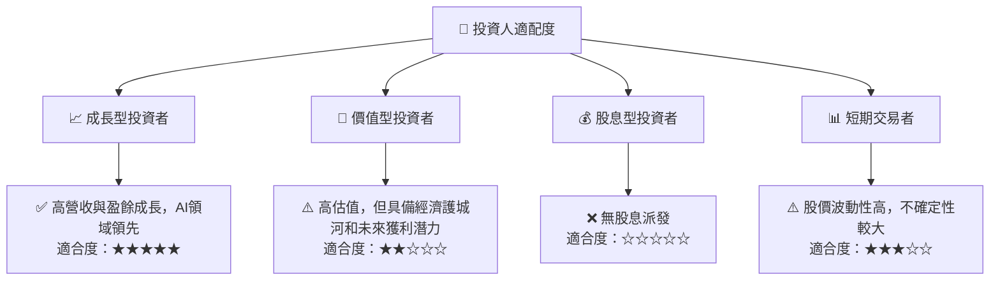
**深度解析：**
*   **成長型投資者**：Palantir是典型的成長型股票，具有強勁的營收和盈餘成長、領先的AI技術和巨大的市場潛力。對於尋求長期資本增值的成長型投資者而言，是極具吸引力的標的。
*   **價值型投資者**：由於其高估值，Palantir目前可能不符合傳統價值投資者的標準。然而，若考慮其深厚的護城河和長期盈利能力，在股價回調時可能提供價值機會。
*   **股息型投資者**：Palantir目前不派發股息，不適合股息型投資者。
*   **短期交易者**：Palantir的股價波動性較高 (Beta 1.562)，對於短期交易者而言可能提供交易機會，但也伴隨較高風險。

### 10.5 關鍵監控指標

| 監控類型 | 指標 | 關注點 | 頻率 |
|----------|------|----------|------|
| **營收成長** | 總營收 YoY 成長率 | 商業客戶營收成長是否加速，政府合約續簽情況 | 每季 |
| **盈利能力** | 營業利益率、淨利率 | 利潤率是否持續改善，規模效應是否顯現 | 每季 |
| **現金流** | 自由現金流 (FCF) | FCF是否持續增長，FCF轉換率是否保持高位 | 每季 |
| **客戶指標** | 商業客戶數量、ARPU (平均每用戶收入) | 商業市場拓展速度和客戶價值提升 | 每季/半年 |
| **技術進展** | AIP平台採用率、新產品發布 | AI技術領先地位是否鞏固，產品創新能力 | 持續 |
| **估值指標** | Forward P/E、P/S | 相比同業和歷史區間的估值水平變化 | 每月/每季 |
| **競爭態勢** | 主要競爭對手發展、市場份額變化 | 行業競爭格局是否惡化，公司競爭優勢是否受侵蝕 | 每半年 |
| **政府關係** | 重大政府合約的簽訂與續簽 | 政府業務的穩定性和增長潛力 | 持續 |

---

> **免責聲明**：本報告為 AI 自動生成，僅供研究參考，不構成投資建議。投資有風險，入市需謹慎。